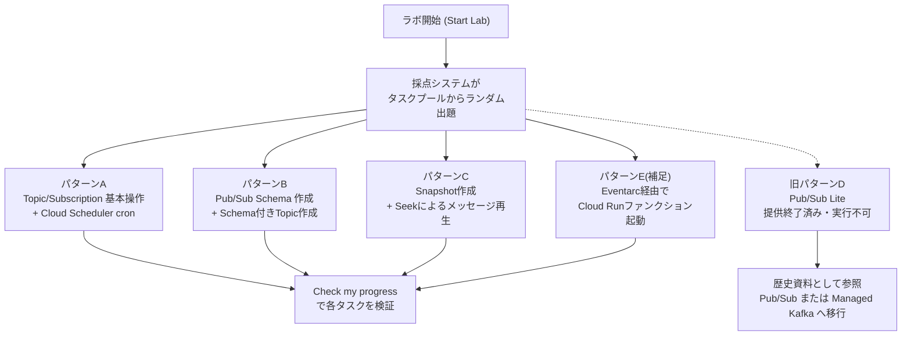
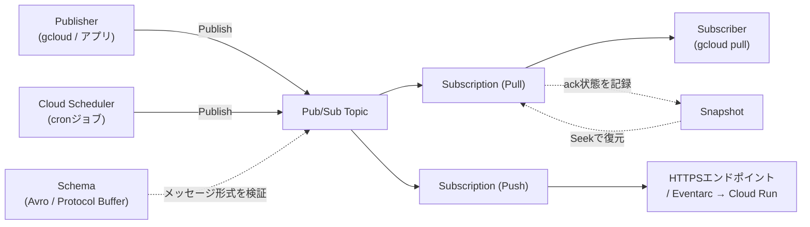
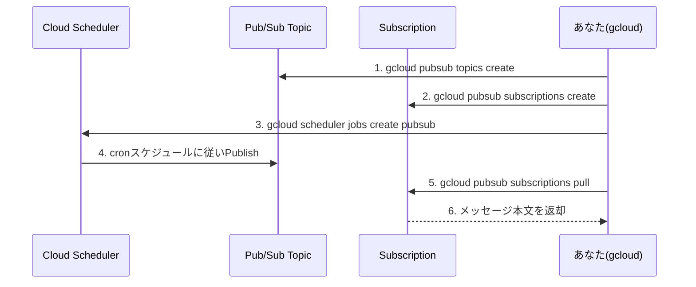
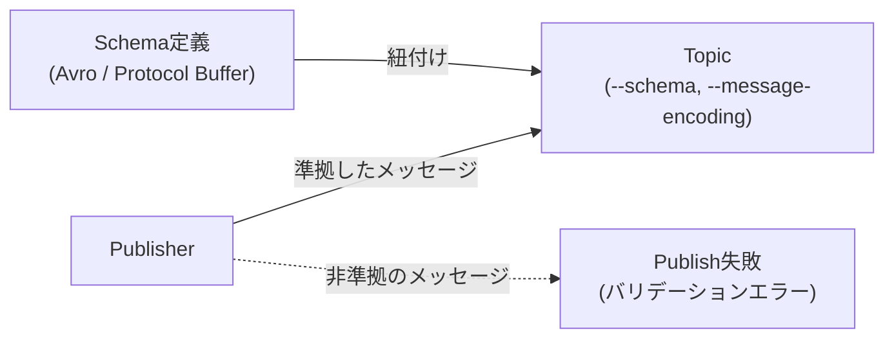
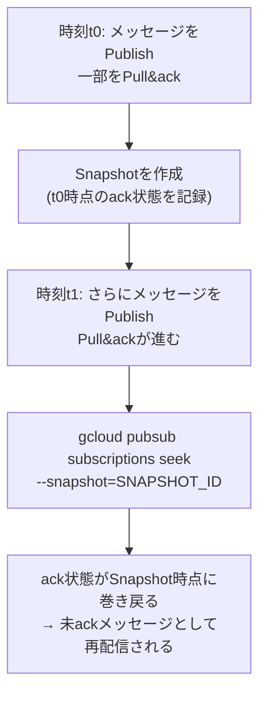
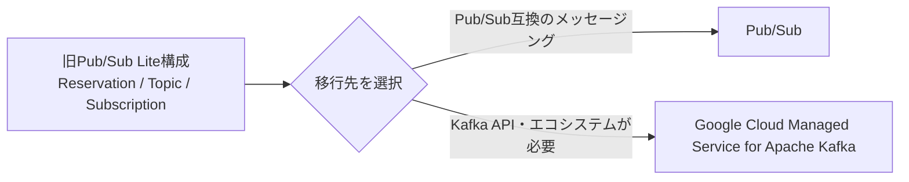
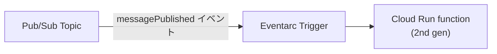

# Google Cloud Skills Boost「Get Started with Pub/Sub: Challenge Lab」完全攻略ガイド

> 対象ラボ: `Get Started with Pub/Sub: Challenge Lab`（Course template 728 / Lab 625116）
> 本ガイドの著者ロール: インフラエンジニア兼 Google Cloud スペシャリストとして、初学者向けにステップバイステップで解説します。

---

## 0. このガイドの使い方（重要）

このラボは **チャレンジラボ** 形式です。チャレンジラボでは、ラボ開始時に採点システムが**タスクプールの中からランダムに1〜3個のタスクを選んで出題**します。そのため「あなたの画面に表示されるTask 1〜3の内容」は人によって異なります。

ラボ概要文には次の3系統のタスクが含まれる可能性があると明記されています。

- Cloud Scheduler で cron ジョブを作成し、Pub/Sub トピックにメッセージをPublishする
- Pub/Sub の **Schema（スキーマ）** を作成する
- Pub/Sub の **Snapshot（スナップショット）** を作成する
- 提供終了済みの **Pub/Sub Lite** 旧出題パターンと移行先を歴史資料として確認する

本ガイドは、公開されている本ラボのタスクプール（複数の解答リポジトリで報告されている「フォームA/B/C」パターン）と Google Cloud 公式ドキュメントを突き合わせて、**現行の出題パターンを網羅的に**解説します。提供終了済みの旧パターンDは実行手順から除外し、移行用の歴史資料として分離しています。実際に表示されたタスク文言と照らし合わせ、該当するセクションを読み進めてください。



以降の章は「共通の前提知識 → 事前準備 → パターン別ステップバイステップ → 採点の考え方 → トラブルシューティング → ベストプラクティス → 参考ソース」の順に構成しています。

---

## 1. Pub/Sub と関連サービスの全体像

### 1.1 用語整理

| 用語 | 説明 |
|---|---|
| Topic（トピック） | メッセージの送り先となる名前付きリソース。Publisher はTopicにメッセージを送る |
| Subscription（サブスクリプション） | Topicに送られたメッセージを受け取るための窓口。Pull型・Push型がある |
| Publisher | メッセージを発行する側（アプリ、gcloud、Cloud Scheduler など） |
| Subscriber | メッセージを受信して処理する側 |
| Schema（スキーマ） | メッセージ本文（data フィールド）の形式を強制する契約。Avro または Protocol Buffer 形式で定義する |
| Snapshot（スナップショット） | あるSubscriptionの「ack（確認応答）状態」をある時点で保存したもの。Seekと組み合わせてメッセージを再生できる |
| Seek | Subscriptionのack状態を過去のタイムスタンプやSnapshotの状態に巻き戻す操作 |
| Cloud Scheduler | cron形式でジョブを定期実行するフルマネージドサービス。ターゲットとしてPub/SubトピックへのPublishを指定できる |
| Pub/Sub Lite | かつて提供されていたパーティション方式のサービス。2026年6月30日に提供終了済みで、新規作成・Publishは実行できない |
| Eventarc | Pub/Subメッセージなどのイベントをトリガーに Cloud Run function（旧Cloud Functions）を起動する仕組み |

### 1.2 コアアーキテクチャ



### 1.3 Pub/Sub と Pub/Sub Lite の違い

| 観点 | Pub/Sub | Pub/Sub Lite（提供終了済み） |
|---|---|---|
| スケーリング | 自動（容量を意識しなくてよい） | 手動プロビジョニング（パーティション数・Reservationのスループットを事前設定） |
| リソースのスコープ | グローバル/リージョナル | ゾーンまたはリージョン単位（Publisher/Subscriberと同一リージョン推奨） |
| 配信方式 | Pull / Push / StreamingPull / REST | gRPC StreamingPullのみ |
| コスト特性 | 従量課金（運用は楽だが単価は高め） | 事前確保した容量に対する課金（大量データを安定して流す場合に安価） |
| 典型用途 | 一般的な非同期メッセージング全般 | 高スループットなログ/イベント基盤で、コスト最適化を重視する場合 |

出典: [Choose Pub/Sub or Pub/Sub Lite](https://cloud.google.com/pubsub/docs/choosing-pubsub-or-lite)

---

## 2. 事前準備（共通）

チャレンジラボでは、ラボ開始時に発行される一時プロジェクトを使います。Cloud Shell を開き、以下を実行してください。

```bash
# プロジェクトIDとリージョンを変数化しておく(タスク画面で指定されたリージョンに置き換える)
export PROJECT_ID=$(gcloud config get-value project)
export REGION=us-central1   # ラボのタスク説明に指定がある場合はそちらを優先

# 必要なAPIを有効化(タスクの内容に応じて取捨選択)
gcloud services enable pubsub.googleapis.com \
    cloudscheduler.googleapis.com \
    run.googleapis.com \
    eventarc.googleapis.com \
    artifactregistry.googleapis.com \
    cloudbuild.googleapis.com
```

### 2.1 必要なIAMロールの目安

| 作業 | 推奨ロール | 備考 |
|---|---|---|
| Topic/Subscriptionの作成・管理 | `roles/pubsub.editor` | Topic・Subscription・Schemaの作成/削除が可能 |
| メッセージのPublishのみ | `roles/pubsub.publisher` | 最小権限。特定Topicに絞って付与するとより安全 |
| メッセージのPull/ackのみ | `roles/pubsub.subscriber` | 最小権限 |
| Cloud SchedulerジョブがTopicにPublishする | Cloud Schedulerのサービスエージェントに `roles/pubsub.publisher` | Console/gcloudでジョブ作成時に自動付与されることが多いが、権限エラー時は確認する |
| Pub/Sub Liteの旧管理ロール | `roles/pubsublite.admin` | 提供終了前の歴史資料。現行ラボでは付与・利用しない |

チャレンジラボの環境では学習者アカウントに主要な権限が事前付与されていることが多いですが、`PERMISSION_DENIED` が出た場合はまずここを疑ってください。

出典: [Pub/Sub roles and permissions (IAM)](https://cloud.google.com/iam/docs/roles-permissions/pubsub) / [Access control with IAM (Pub/Sub)](https://cloud.google.com/pubsub/docs/access-control)

---

## 3. パターンA: Topic/Subscription 基本操作 + Cloud Scheduler cron ジョブ

このパターンは「Cloud Schedulerを使ってスケジュールされたcronジョブを設定し、Pub/Subトピックにメッセージを配信する」というシナリオ本文と直接対応する、最も出題頻度の高いタスクセットです。

### 3.1 処理の流れ



### 3.2 手順

**Step 1: Topicを作成する**

```bash
gcloud pubsub topics create cron-topic
```

**Step 2: Subscriptionを作成する**

```bash
gcloud pubsub subscriptions create cron-subscription \
    --topic=cron-topic
```

`Check my progress` で「Topicを作成」だけを求められる場合と、「デフォルトSubscription付きで作成」を求められる場合があります。Console から作成する場合、Topic作成画面の「デフォルトのサブスクリプションを追加する」オプションをONにすると、`cron-topic-sub` のようなSubscriptionが自動生成されます。

**Step 3: Cloud Schedulerジョブを作成する（cronジョブ）**

```bash
gcloud scheduler jobs create pubsub cron-scheduler-job \
    --schedule="* * * * *" \
    --location=$REGION \
    --topic=cron-topic \
    --message-body="Hello World!"
```

- `--schedule` は unix-cron 形式です。`* * * * *` は「毎分実行」を意味します。
- `--location` は Cloud Scheduler のジョブが動くリージョンで、**Topicのリージョンと混同しないよう注意**してください（Pub/Sub Topic自体はグローバルリソースですが、Schedulerジョブにはロケーション指定が必須です）。

**Step 4: ジョブを手動実行して即座に検証する**

チャレンジラボは制限時間があるため、cron発火を待たずに強制実行すると効率的です。

```bash
gcloud scheduler jobs run cron-scheduler-job --location=$REGION
```

**Step 5: メッセージが届いたことを確認する**

```bash
gcloud pubsub subscriptions pull cron-subscription --limit=5 --auto-ack
```

`--auto-ack` を付けると受信と同時にackされます。採点システムがメッセージ内容や配信そのものを確認する場合は、まず `--auto-ack` なしで確認してから改めてackする方が安全です。

### 3.3 ベストプラクティス

- **命名規則**: Topic/Subscription名は用途がわかる名前にする（例: `<用途>-topic`, `<用途>-sub`）。チャレンジラボでは採点が名前を厳密に指定してくることがあるため、**タスク文中で指定された名前を一字一句そのまま使う**ことが最重要です。
- **最小権限の原則**: 本番運用ではCloud SchedulerのサービスアカウントにはTopic単位で`roles/pubsub.publisher`のみを付与し、`roles/pubsub.editor`のような広い権限は避けます。
- **メッセージ保持期間**: 後続処理が遅延する可能性がある場合は `--message-retention-duration` をTopicに設定し、Subscriberがダウンしていてもメッセージを保持できるようにします。
- **タイムゾーン**: `--time-zone` を明示しないとUTC基準になります。業務要件がある場合は明示的に指定します。

出典: [Quickstart: Schedule and run a cron job](https://cloud.google.com/scheduler/docs/quickstart) / [Manage cron jobs (Cloud Scheduler)](https://cloud.google.com/scheduler/docs/creating) / [gcloud scheduler jobs create pubsub リファレンス](https://cloud.google.com/sdk/gcloud/reference/scheduler/jobs/create/pubsub) / [Create a topic](https://cloud.google.com/pubsub/docs/create-topic) / [gcloud pubsub topics create リファレンス](https://cloud.google.com/sdk/gcloud/reference/pubsub/topics/create)

---

## 4. パターンB: Pub/Sub Schema の作成とTopicへの紐付け

### 4.1 Schemaとは何か、なぜ使うか

Pub/SubのSchemaは、メッセージの`data`フィールドが従うべき形式を定義し、PublisherとSubscriberの間の「契約」としてPub/Subがそれを強制する機能です。組織内の複数チームが同じTopicを使う際に、メッセージ形式の乱立を防ぐ目的で使われます。Avro形式またはProtocol Buffer形式のいずれかで定義でき、トップレベルの型は1つだけと決められています（他ファイルのimportは非対応）。

出典: [Schema overview](https://cloud.google.com/pubsub/docs/schemas)



### 4.2 手順

**Step 1: Avro形式でSchemaを作成する**

```bash
gcloud pubsub schemas create city-temp-schema \
    --type=avro \
    --definition='{
        "type": "record",
        "name": "Avro",
        "fields": [
            {"name": "city", "type": "string"},
            {"name": "temperature", "type": "double"},
            {"name": "pressure", "type": "int"},
            {"name": "time_position", "type": "string"}
        ]
    }'
```

タスクの指示に定義されているフィールド名・型は必ずそのとおりに合わせてください。フィールド名や型が1つでも違うと採点に失敗します。

**Step 2: Schemaを紐付けたTopicを作成する**

```bash
gcloud pubsub topics create city-temp-topic \
    --schema=city-temp-schema \
    --message-encoding=json
```

`--message-encoding` は `json` または `binary` を選べます。JSON形式のメッセージをやり取りするなら `json` を選ぶのが一般的です。

**Step 3: 動作確認（任意）**

```bash
# スキーマに準拠したメッセージ(成功する)
gcloud pubsub topics publish city-temp-topic \
    --message='{"city":"Tokyo","temperature":28.5,"pressure":1013,"time_position":"2026-08-13T09:00:00Z"}'
```

### 4.3 ベストプラクティス

- Schemaのフィールド名に個人情報（PII）やセキュリティ関連情報を含めないこと。
- 1つのSchemaは複数のTopicに関連付けられるため、共通フォーマットは1箇所で管理し使い回すと保守性が上がる。
- Schemaは最大20リビジョンまで作成できるため、破壊的変更をせずにリビジョンを重ねて後方互換性を保つ設計が推奨される。

出典: [Create a schema for a topic](https://cloud.google.com/pubsub/docs/create-schemas) / [Schema overview](https://cloud.google.com/pubsub/docs/schemas)

---

## 5. パターンC: Snapshot の作成と Seek によるメッセージ再生

### 5.1 SnapshotとSeekの考え方

Pub/Subでは、一度ackされたメッセージはSubscriberから再取得できなくなります。しかし、「誤ってackしてしまった」「デプロイ前の状態に戻して再処理したい」といった場面のために、**Snapshot（特定時点のack状態のスナップショット）** と **Seek（ack状態を過去に巻き戻す操作）** が用意されています。



### 5.2 手順

**Step 1: Topic/Subscriptionを準備してメッセージを送受信する**

```bash
gcloud pubsub topics create snapshot-demo-topic
gcloud pubsub subscriptions create snapshot-demo-sub \
    --topic=snapshot-demo-topic

gcloud pubsub topics publish snapshot-demo-topic --message="first message"
gcloud pubsub subscriptions pull snapshot-demo-sub --auto-ack
```

**Step 2: Snapshotを作成する**

```bash
gcloud pubsub snapshots create snapshot-demo-snap \
    --subscription=snapshot-demo-sub
```

Snapshot名は**Topic名やSubscription名とは別の命名空間**を持つため、タスクで指定された名前をそのまま使用してください。

**Step 3: (検証したい場合) さらにメッセージを送ってからSeekする**

```bash
gcloud pubsub topics publish snapshot-demo-topic --message="second message"
gcloud pubsub subscriptions pull snapshot-demo-sub --auto-ack

# Snapshot時点までack状態を巻き戻す
gcloud pubsub subscriptions seek snapshot-demo-sub \
    --snapshot=snapshot-demo-snap

# 再度pullすると、Snapshot作成後にackしたメッセージが再配信される
gcloud pubsub subscriptions pull snapshot-demo-sub --auto-ack
```

### 5.3 ベストプラクティス

- Snapshotの最大有効期間は7日で、延長できません。`--message-retention-duration`で最大31日まで延長できるのはTopicのメッセージ保持期間です。長期保管が必要な場合は、Snapshotとは別にTopicの保持設計を見直してください。
- Snapshotは「同じTopicに紐づく別のSubscription」にもSeekできるため、Blue/Greenデプロイでの切り戻し用途にも応用できます。
- 使い終わったSnapshotは課金対象になるため、`gcloud pubsub snapshots delete` で忘れずに削除します。

出典: [Replay and purge messages with seek](https://cloud.google.com/pubsub/docs/replay-overview) / [Quickstart: Replay a message by seeking to a snapshot or timestamp](https://cloud.google.com/pubsub/docs/replay-message)

---

## 6. 旧パターンD: Pub/Sub Lite（提供終了済み・歴史資料）

> **提供終了済み**: Pub/Sub Liteは2026年6月30日に提供を終了しました。Reservation、Lite Topic、Lite Subscriptionの新規作成とPublishは現在実行できないため、この章にあった作成・Publishコマンドは削除しました。現行のChallenge LabではPub/Sub Liteリソースを作成しないでください。

### 6.1 旧構成と移行先

提供終了前のPub/Sub Liteは、Reservation（予約容量）→ Lite Topic（パーティション分割）→ Lite Subscriptionという3階層で構成されていました。この情報は旧タスクを読み解くための歴史資料であり、操作手順ではありません。



### 6.2 現行ラボでの対応

1. タスク文にPub/Sub Liteが記載されている場合、その教材が提供終了前の旧版でないか確認します。
2. 現行タスクでは、通常のPub/Sub Topic/Subscription、または指定されたManaged Kafkaリソースを作成します。
3. 旧構成を移行する場合は、配信方式、順序保証、保持期間、スループット要件を整理して移行先を選び、アプリケーションのPublisher/Subscriberを切り替えます。

出典: [Pub/Sub Lite service turndown](https://cloud.google.com/pubsub/lite/docs) / [Choose Pub/Sub or Pub/Sub Lite](https://cloud.google.com/pubsub/docs/choosing-pubsub-or-lite)

---

## 7. パターンE（補足）: Eventarc経由でPub/SubトリガーのCloud Runファンクションを起動する

ラボ概要では明言されていませんが、公開されている解答例には「Pub/Subトピックをトリガーとする関数の作成」が含まれるフォームも報告されています。出題された場合に備えて手順を示します。



```bash
# 関数をPub/Subトリガーでデプロイする例(コンソールから作成する場合はTrigger typeで"Cloud Pub/Sub"を選択)
gcloud eventarc triggers create pubsub-trigger \
    --location=$REGION \
    --destination-run-service=my-function \
    --destination-run-region=$REGION \
    --event-filters="type=google.cloud.pubsub.topic.v1.messagePublished" \
    --transport-topic=projects/$PROJECT_ID/topics/city-temp-topic \
    --service-account=$PROJECT_NUMBER-compute@developer.gserviceaccount.com
```

Eventarcはトランスポート層としてPub/Subを利用するため、内部的にAck期限が10秒というデフォルト値を持ちます。処理に時間がかかる関数の場合はAck期限を最大600秒まで引き上げることが推奨されています。

出典: [Trigger functions from Pub/Sub using Eventarc](https://cloud.google.com/run/docs/tutorials/pubsub-eventdriven) / [Create triggers from Pub/Sub events](https://cloud.google.com/run/docs/triggering/pubsub-triggers)

---

## 8. 「Check my progress」の考え方

チャレンジラボの採点ボタンは、裏側でGoogle CloudのAPIを呼び出し、**該当リソースが指定どおりの名前・設定で存在するか**を検証していると考えられます。次のチェックリストを使い、ボタンを押す前にセルフチェックしてください。

| タスク種別 | セルフチェック項目 |
|---|---|
| Topic/Subscription作成 | `gcloud pubsub topics describe <TOPIC>` / `gcloud pubsub subscriptions describe <SUB>` で存在確認。名前がタスク文の指定と完全一致しているか |
| Cloud Scheduler cron | `gcloud scheduler jobs describe <JOB> --location=$REGION` でターゲットTopicとスケジュールを確認。一度は `jobs run` で強制実行し、実行履歴(Status of last execution)がSuccessになっているか確認 |
| Schema作成 | `gcloud pubsub schemas describe <SCHEMA>` でフィールド定義がタスク指定と一致しているか |
| Schema付きTopic | `gcloud pubsub topics describe <TOPIC>` の出力に `schemaSettings` が含まれているか |
| Snapshot作成 | `gcloud pubsub snapshots describe <SNAPSHOT>` で対象Subscriptionが正しいか |
| Pub/Sub Lite（旧タスク） | 提供終了済みのため作成・採点対象にしない。教材が旧版の場合は現行タスクへ更新されているか確認 |

`Check my progress` が失敗する場合、多くは「リソース名の誤字」「リージョン/ロケーションの指定漏れ」「API未有効化」のいずれかです。次章のトラブルシューティング表もあわせて確認してください。

---

## 9. よくあるエラーとトラブルシューティング

| 症状 / エラーメッセージ | 主な原因 | 対処 |
|---|---|---|
| `PERMISSION_DENIED` | 実行アカウントに必要なIAMロールが不足 | `gcloud projects get-iam-policy $PROJECT_ID` で自分に付与されたロールを確認し、不足していれば管理者(このラボでは学習者アカウント自体がOwner相当のことが多い)に確認する |
| `NOT_FOUND: Requested entity was not found` (Scheduler) | `--location` に指定したリージョンとジョブの実在リージョンが不一致 | `gcloud scheduler jobs list --location=$REGION` で存在確認し、正しいロケーションを指定する |
| `Cannot create job. Cloud Scheduler is not initialized for the project` | 初回のCloud Scheduler利用時、App Engineアプリのリージョン初期化が必要な場合がある | コンソールでCloud Schedulerページを一度開き、初期化ダイアログに従う、または明示的にロケーションを選択してジョブを作成する |
| Schema作成時の `INVALID_ARGUMENT` | Avro/Protocol BufferのJSON定義に構文エラーがある、またはトップレベル型が複数ある | `--definition` のJSONをローカルでLintし、importを使っていないか確認する |
| Topic作成時に `schemaSettings` が反映されない | `--schema` オプションと `--message-encoding` の指定漏れ | `gcloud pubsub topics update <TOPIC> --schema=<SCHEMA> --message-encoding=json` で後付け設定も可能 |
| Seekしても再配信されない | Subscriptionのメッセージ保持期間がSnapshot作成時点をすでに超えている、またはSnapshotが期限切れ | Snapshotの有効期限(デフォルト7日)を確認し、Subscriptionの`--message-retention-duration`を延長して再作成する |
| Pub/Sub Liteの作成・Publishコマンドを実行できない | サービスが2026年6月30日に提供終了済み | コマンドを再試行せず、教材の現行版を確認してPub/SubまたはManaged Kafkaへの移行手順を使う |
| Eventarcトリガー作成が一時的に失敗する | 初回作成時、Eventarcのサービスエージェントのプロビジョニングに時間がかかることがある | 数分待って再実行する |

---

## 10. ベストプラクティスまとめ（チェックリスト）

- [ ] リソース名はタスク文で指定された名前を**一字一句そのまま**使用する（採点は文字列完全一致で見ていることが多い）
- [ ] `--location` / `--region` はPub/Sub Topic（グローバル）とScheduler（リージョナル）で意味が異なることを理解して使い分ける
- [ ] 権限は必要最小限（`pubsub.publisher` / `pubsub.subscriber`）を基本とし、`pubsub.editor`は管理作業時のみに限定する
- [ ] cronジョブは`jobs run`で強制実行し、待ち時間なしで結果を確認する
- [ ] Snapshotなど課金が発生するリソースは、検証後に削除してコストを抑える
- [ ] Schemaはフィールド名・型をタスク仕様と完全に一致させ、PIIを含めない
- [ ] 採点(Check my progress)が失敗した場合は、まず`describe`系コマンドで実際の設定値を確認してから再実行する

---

## 11. 参考ソース一覧

| # | タイトル | URL |
|---|---|---|
| 1 | Pub/Sub documentation（総合） | https://cloud.google.com/pubsub/docs |
| 2 | Create a topic | https://cloud.google.com/pubsub/docs/create-topic |
| 3 | Create pull subscriptions | https://cloud.google.com/pubsub/docs/create-subscription |
| 4 | gcloud pubsub topics create リファレンス | https://cloud.google.com/sdk/gcloud/reference/pubsub/topics/create |
| 5 | Quickstart: Schedule and run a cron job | https://cloud.google.com/scheduler/docs/quickstart |
| 6 | Manage cron jobs（Cloud Scheduler） | https://cloud.google.com/scheduler/docs/creating |
| 7 | gcloud scheduler jobs create pubsub リファレンス | https://cloud.google.com/sdk/gcloud/reference/scheduler/jobs/create/pubsub |
| 8 | Schedule an event-driven Cloud Run function | https://cloud.google.com/scheduler/docs/tut-gcf-pub-sub |
| 9 | Schema overview | https://cloud.google.com/pubsub/docs/schemas |
| 10 | Create a schema for a topic | https://cloud.google.com/pubsub/docs/create-schemas |
| 11 | Replay and purge messages with seek | https://cloud.google.com/pubsub/docs/replay-overview |
| 12 | Quickstart: Replay a message by seeking to a snapshot or timestamp | https://cloud.google.com/pubsub/docs/replay-message |
| 13 | Trigger functions from Pub/Sub using Eventarc | https://cloud.google.com/run/docs/tutorials/pubsub-eventdriven |
| 14 | Create triggers from Pub/Sub events | https://cloud.google.com/run/docs/triggering/pubsub-triggers |
| 15 | Pub/Sub roles and permissions（IAM） | https://cloud.google.com/iam/docs/roles-permissions/pubsub |
| 16 | Access control with IAM（Pub/Sub） | https://cloud.google.com/pubsub/docs/access-control |
| 17 | Choose Pub/Sub or Pub/Sub Lite | https://cloud.google.com/pubsub/docs/choosing-pubsub-or-lite |
| 18 | Quickstart: Publish and receive messages（Pub/Sub Lite） | https://cloud.google.com/pubsub/lite/docs/publish-receive-messages-console |
| 19 | Create and manage Lite reservations | https://cloud.google.com/pubsub/lite/docs/reservations |
| 20 | Pub/Sub Lite how-to guides | https://cloud.google.com/pubsub/lite/docs/how-to |
| 21 | Access control with IAM（Pub/Sub Lite） | https://cloud.google.com/pubsub/lite/docs/access-control |
| 22 | Dead-letter topics | https://cloud.google.com/pubsub/docs/dead-letter-topics |
| 23 | Order messages（メッセージ順序保証） | https://cloud.google.com/pubsub/docs/ordering |

---

## 付記

- ラボページ本体（`skills.google/course_templates/728/labs/625116`）はサインイン必須のため、本ガイドはラボ概要文（本メッセージに添付されたテキスト）と、公式ドキュメント、および同ラボの公開解答例の記述内容を突き合わせて構成しています。実際に表示されたタスクの文言・リソース名は必ず優先し、本ガイドの例と異なる場合はタスク文の指定に従ってください。
- 本ガイドはあくまで学習・攻略の補助を目的としており、Google Cloud Skills Boostの利用規約（不正なコピー&ペーストによる学習の形骸化を避ける）を尊重し、各コマンドの意味を理解した上で活用することを推奨します。
