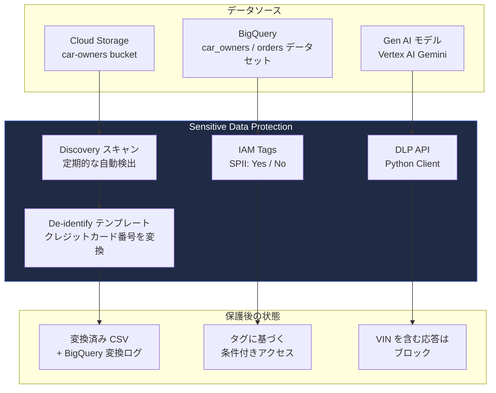
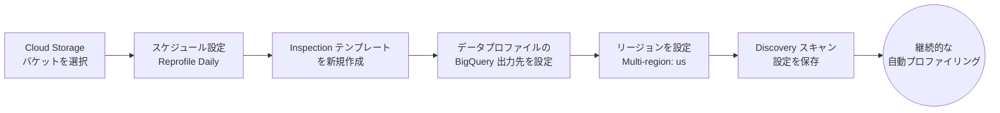
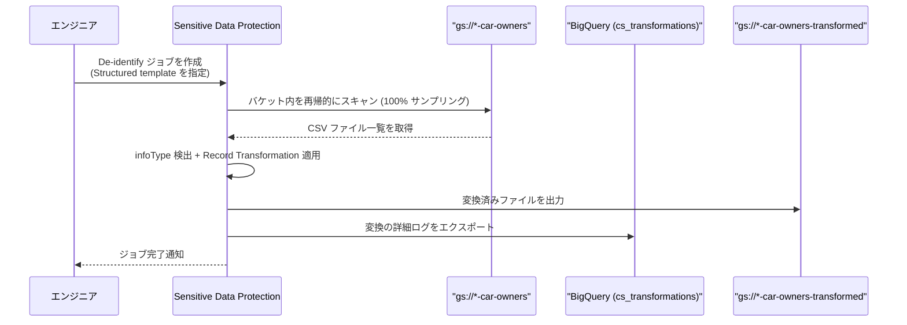
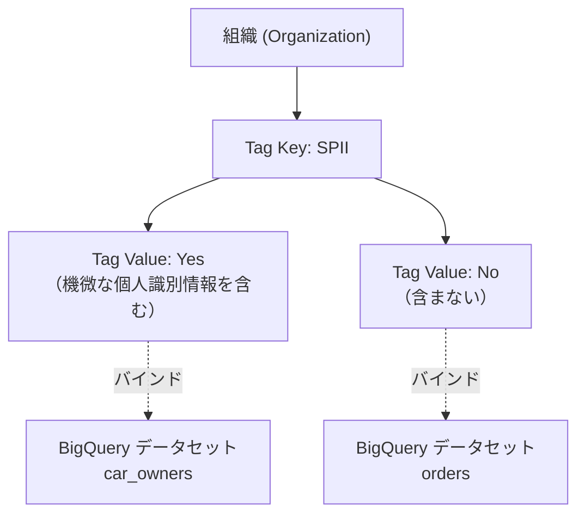
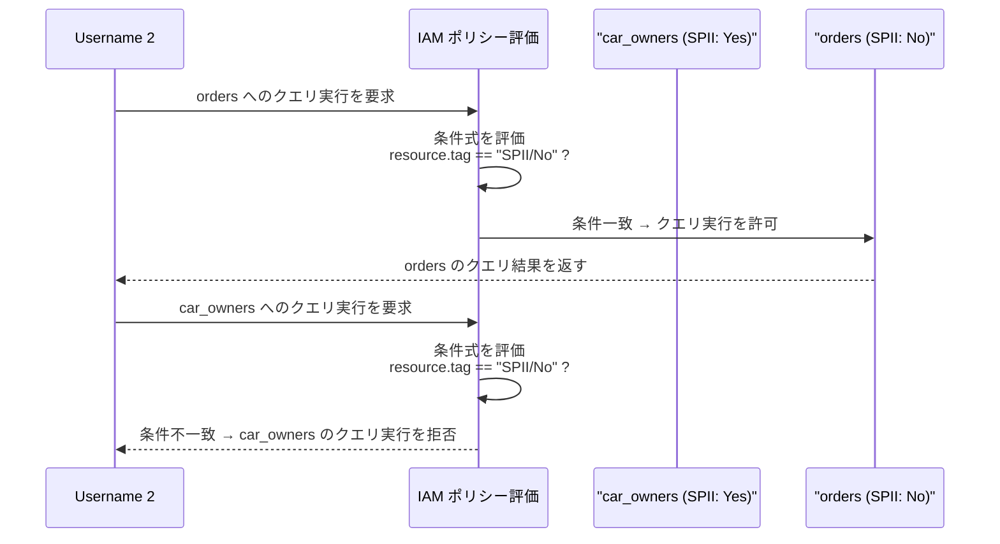
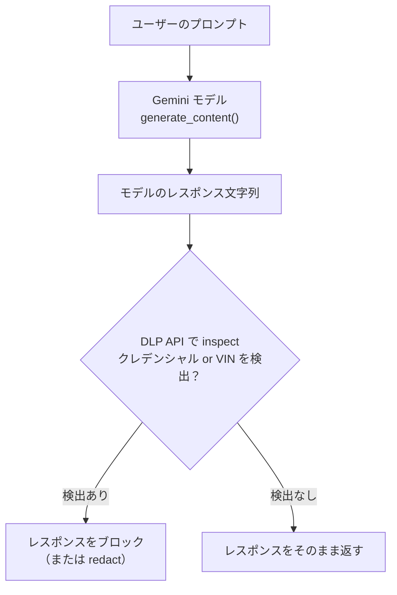

# Cymbal Cars 機密データ保護チャレンジラボ 徹底解説ガイド

**対象ラボ**: Discover and Protect Sensitive Data Across Your Ecosystem: Challenge Lab
**対象読者**: Google Cloud の Sensitive Data Protection（旧 Cloud DLP）を初めて扱うインフラ / データエンジニア
**このガイドの目的**: ラボの各タスクを「何を」「なぜ」「どうやって」の3段階で理解し、実務でも再現できるベストプラクティスとして定着させること

> 出典元ラボ: https://www.skills.google/course_templates/1177/labs/609028 （Google Skills アカウントへのサインインが必要なため、本ガイドは添付されたラボ本文と Google Cloud 公式ドキュメントに基づいて作成しています）

---

## 目次

1. [シナリオと全体アーキテクチャ](#1-シナリオと全体アーキテクチャ)
2. [事前知識: Sensitive Data Protection の基礎用語](#2-事前知識-sensitive-data-protection-の基礎用語)
3. [Task 1: Cloud Storage の機密データ保護](#3-task-1-cloud-storage-の機密データ保護)
4. [Task 2: BigQuery の機密データ保護](#4-task-2-bigquery-の機密データ保護)
5. [Task 3: Gen AI モデルレスポンスの保護](#5-task-3-gen-ai-モデルレスポンスの保護)
6. [ベストプラクティス総まとめ](#6-ベストプラクティス総まとめ)
7. [よくある詰まりポイント](#7-よくある詰まりポイント)
8. [参考文献（出典 URL 一覧）](#8-参考文献出典-url-一覧)

---

## 1. シナリオと全体アーキテクチャ

Cymbal Cars 社のデータエンジニアとして、車の所有者（顧客）に関する機密データを組織のデータ基盤全体で守ることがミッションです。データは大きく3つの場所に存在します。

| データの場所 | 内容 | 既に対応済みのこと | このラボで追加すること |
|---|---|---|---|
| Cloud Storage | 顧客とのやり取りログ（CSV等） | US Social Security Number の redaction 済み | クレジットカード番号の検出・非識別化＋日次ディスカバリー |
| BigQuery | 顧客・注文データのテーブル | 一部テーブルの redaction 済み | SPII（機微な個人識別情報）タグによる条件付きアクセス制御 |
| Gen AI モデル応答 | Vertex AI 上の生成 AI の出力 | クレデンシャル（認証情報）検出時の redaction 済み | US Vehicle Identification Number（VIN）検出時のブロック機能追加 |

3つのタスクはそれぞれ独立していますが、「機密データを **発見（Discover）** し **保護（Protect）** する」という一貫した思想でつながっています。



**設計思想のポイント（ベストプラクティス）**

- **Discovery（発見）と Protect（保護）を分離する**: まず「どこに何があるか」を継続的に把握し（discovery scan）、そのうえで「見つかったものをどう変換するか」を別レイヤー（de-identify template / job）で定義します。これにより、検出ロジックと変換ロジックを独立して更新できます。
- **保存データ（at rest）と生成データ（in transit / at generation）で手法を使い分ける**: Cloud Storage / BigQuery のような静的データには discovery scan と de-identify job、Gen AI の応答のようなリアルタイム生成データには DLP API の同期呼び出し（Content メソッド）を使います。
- **アクセス制御は「データを変換する」以外にもう一段の防御を用意する**: BigQuery では変換だけでなく、IAM タグによる条件付きアクセスで「そもそも見せない」という防御も重ねます（多層防御 / defense in depth）。

出典: [Method types | Sensitive Data Protection](https://docs.cloud.google.com/sensitive-data-protection/docs/concepts-method-types)

---

## 2. 事前知識: Sensitive Data Protection の基礎用語

Cloud DLP は現在 **Sensitive Data Protection** というサービス名の一部になっていますが、API 名は引き続き `Cloud Data Loss Prevention API`（DLP API）です。

| 用語 | 説明 |
|---|---|
| **InfoType** | 「クレジットカード番号」「メールアドレス」など、検出対象となる機密データの種類。組み込み（built-in）とカスタムの2種類がある |
| **Inspect（検査）** | データの中に InfoType に一致する箇所があるかどうかを調べる処理 |
| **De-identify（非識別化）** | 検出した機密データをマスキング・トークン化・暗号化などで変換する処理 |
| **Discovery（検出スキャン）** | プロジェクト・フォルダ・組織単位で継続的にデータをプロファイリングし、機密データの存在場所を可視化する仕組み |
| **Data profile（データプロファイル）** | discovery スキャンの結果として生成される、リソースごとの機密データの統計・インサイト |
| **InfoType Transformation** | 非構造化テキスト（自由記述の文章など）に対する変換方法 |
| **Record Transformation** | CSV や BigQuery テーブルのような構造化データに対して、列（フィールド）単位で適用する変換方法 |
| **Template（テンプレート）** | Inspect / De-identify の設定を再利用可能な形で保存したもの |
| **DlpJob** | 実際にデータに対して inspect や de-identify を実行する非同期ジョブ |

出典: [InfoTypes と infoType 検出器](https://docs.cloud.google.com/sensitive-data-protection/docs/concepts-infotypes) / [Templates | Sensitive Data Protection](https://docs.cloud.google.com/sensitive-data-protection/docs/concepts-templates) / [Overview of sensitive data discovery](https://docs.cloud.google.com/sensitive-data-protection/docs/data-profiles)

---

## 3. Task 1: Cloud Storage の機密データ保護

### 3-1. Discovery スキャン設定の作成とスケジューリング

**何をするか**: `gs://<Project ID>-car-owners` バケットを対象に、日次で自動的に機密データをプロファイリングする discovery scan configuration を作成します。

**なぜ重要か**: discovery scan configuration は一度作成すれば、その後バケットに追加・変更されたファイルも自動的に再プロファイリングされ続けます。手動でスキャンを都度実行する運用は抜け漏れが発生しやすいため、継続的な監視の仕組みを最初に構築するのがベストプラクティスです。



**設定値（ラボの要求仕様）**

| 項目 | 値 |
|---|---|
| Select scope | Scan selected project |
| Managed schedules | Reprofile Daily を「On a schedule」と「When inspect template changes」の両方に設定 |
| Select inspection template | 新規作成 |
| Save data profile copies to BigQuery | Dataset ID: `cs_discovery` / Table ID: `cs_data_profiles` |
| Set location to store configuration | Multi-region: us |
| Display name | Cloud Storage Daily Discovery |

**ステップバイステップ**

1. Google Cloud コンソールで **Sensitive Data Protection > Discovery** に移動します。
2. **Create Configuration** をクリックし、スコープを「このプロジェクトをスキャン」に設定します。
3. 対象を Cloud Storage に絞り、`<Project ID>-car-owners` バケットを指定します。
4. **Schedules** で「Reprofile Daily」を選び、「On a schedule」と「When inspect template changes」の両方をトリガーとして有効化します。
5. Inspection template は新規作成し、後続の Record 変換で使う infoType（クレジットカード番号など）を含めておきます。
6. **Save data profile copies to BigQuery** を有効化し、Dataset ID に `cs_discovery`、Table ID に `cs_data_profiles` を指定します。BigQuery にプロファイル結果を出力しておくことで、後から SQL でトレンド分析やダッシュボード化が可能になります。
7. 設定の保存先ロケーションは Multi-region の `us` を選びます（バケットのロケーションと整合させるのがポイントです）。
8. Display name に `Cloud Storage Daily Discovery` と入力し、設定を保存します。

**ベストプラクティス**

- **スケジュールは「定期」と「テンプレート変更時」の両方をトリガーにする**: 定期実行だけだと、inspection テンプレートの infoType を追加・変更したときに反映が翌日以降になってしまいます。「When inspect template changes」を有効にすることで、検出対象を広げた直後から即座に反映されます。
- **プロファイルの保存先ロケーションはデータのロケーションと合わせる**: リージョンをまたぐと追加のレイテンシやコストが発生する可能性があります。
- **discovery 設定を削除しても既存のデータプロファイルは消えない**ことを理解しておく: 設定の作り直しは気軽に行えますが、再作成しても再プロファイルが即座に走るわけではない点に注意してください。

出典: [Overview of sensitive data discovery](https://docs.cloud.google.com/sensitive-data-protection/docs/data-profiles) / [Manage discovery scan configurations](https://docs.cloud.google.com/sensitive-data-protection/docs/manage-scan-configurations) / [Common discovery enablement scenarios](https://docs.cloud.google.com/sensitive-data-protection/docs/common-discovery-configurations)

---

### 3-2. De-identify テンプレートの作成（構造化データ用）

**何をするか**: CSV ファイルのようなテーブル形式データに対して、クレジットカード番号を infoType 名で置換する de-identify テンプレートを作成します。

**なぜ Record 変換を使うのか**: CSV や BigQuery テーブルは「列」という構造を持っています。InfoType Transformation は自由記述のテキスト全体に対して一律に適用されるのに対し、**Record Transformation** は特定のフィールド（列）を指定して変換できるため、構造化データにはこちらが適しています。

| 変換タイプ | 用途 | 特徴 |
|---|---|---|
| InfoType Transformation | 自由記述のテキストファイル | テキスト全体から infoType を検出し変換。列の概念を持たない |
| Record Transformation | CSV・BigQuery などの構造化データ | 特定のフィールドを指定し、そのフィールド内で infoType を検出・変換できる |

**設定値（ラボの要求仕様）**

| 項目 | 値 |
|---|---|
| Template ID | `us_ccn_deidentify` |
| Data transformation type | Record |
| Display name | De-identify Credit Card Numbers |
| Location type | Multi-region: global |
| Field for Transformation Rule | `message` |
| Transformation type | Match on infoType |
| Transformation Method | Replace with infoType name |

**ステップバイステップ**

1. **Sensitive Data Protection > Configuration > Templates** に移動し、**Create Template** をクリックします。
2. Template type で **De-identify（機密データを削除）** を選択します。
3. Template ID に `us_ccn_deidentify`、Display name に `De-identify Credit Card Numbers` と入力します。
4. Resource location は Global を選択します（CSV ファイルは複数リージョンをまたいで処理される可能性があるため）。
5. Data transformation type で **Record** を選び、対象フィールドに `message` を指定します。
6. Transformation type は **Match on infoType**、Transformation Method は **Replace with infoType name**（例: `CREDIT_CARD_NUMBER` という文字列に置換）を選択します。
7. テンプレートを保存します。

**ベストプラクティス**

- **「置換後にどんな値が残るか」を意識してテンプレート設計する**: `Replace with infoType name` は、元の値を infoType 名（例: `CREDIT_CARD_NUMBER`）に置き換える手法で、値そのものは失われますが「そこに機密データがあった」という事実は監査ログとして残せます。完全な削除（マスキング）が必要か、フォーマット保持型の暗号化が必要かは、後続の分析要件に応じて選択してください。
- **テンプレートを分離して管理する**: 非構造化データ用（デフォルト）・構造化データ用・画像用でテンプレートを分けることで、ファイル形式ごとに最適な変換方法を適用できます。1つのテンプレートで全形式をカバーしようとしないことが重要です。
- **暗号化ベースの変換を使う場合は Cloud KMS のラップキーが必須**（transient/raw キーは非対応）である点も覚えておくと、将来トークン化などに拡張する際に役立ちます。

出典: [Creating de-identification templates](https://docs.cloud.google.com/sensitive-data-protection/docs/creating-templates-deid) / [De-identifying sensitive data](https://docs.cloud.google.com/sensitive-data-protection/docs/deidentify-sensitive-data) / [Create de-identified copies of data in Cloud Storage](https://docs.cloud.google.com/sensitive-data-protection/docs/deidentify-storage-console)

---

### 3-3. De-identify ジョブの実行

**何をするか**: 作成した de-identify テンプレートを使い、バケット内の CSV ファイルに対して実際に非識別化を行うジョブを実行します。



**設定値（ラボの要求仕様）**

| 項目 | 値 |
|---|---|
| Job ID | `us_ccn_deidentify` |
| Location type | Multi-region: us |
| URL | `gs://<Project ID>-car-owners` |
| Scan recursively | 有効化 |
| Sampling | 100%（No sampling） |
| Structured de-identification template | 3-2 で作成したテンプレートのフルパス |
| Export transformation details to BigQuery | Dataset ID: `cs_transformations` / Table ID: `deidentify_ccn` |
| Cloud Storage output location | `gs://<Project ID>-car-owners-transformed` |

**ステップバイステップ**

1. **Sensitive Data Protection > De-identification** から **Create job or job trigger** に進みます。
2. Job ID に `us_ccn_deidentify`、ロケーションタイプに Multi-region の `us` を指定します。
3. 入力データとして Cloud Storage を選び、URL に `gs://<Project ID>-car-owners` を入力、**Scan recursively**（サブフォルダも含めて再帰的にスキャン）を有効にします。
4. Sampling は 100%（No sampling）を選び、バケット内のすべてのオブジェクトを対象にします。
5. **Structured de-identification template** に、3-2 で作成した `us_ccn_deidentify` テンプレートのリソースパスを指定します。
6. **Export transformation details to BigQuery** を有効化し、Dataset ID `cs_transformations`、Table ID `deidentify_ccn` を指定します。
7. **Cloud Storage output location** に `gs://<Project ID>-car-owners-transformed` を指定し、元のバケットを上書きせず別バケットに出力するようにします。
8. ジョブを作成し実行します。

**ベストプラクティス**

- **出力先バケットを分離する**: 元データを直接上書きせず、変換後データを別バケット（`-transformed` サフィックス）に出力することで、元データの保全と変換結果の検証を両立できます。誤った変換設定に気づいた場合も、元データが無事であればやり直しが容易です。
- **変換ログを BigQuery にエクスポートする**: どのファイルのどの箇所が、どの infoType としてどう変換されたかを後から追跡できるようにしておくことは、コンプライアンス監査の観点で重要です。
- **サンプリング率は要件に応じて調整する**: 今回は 100% サンプリングですが、大規模データセットでは処理コストとのトレードオフでサンプリング率を下げる選択肢もあります。ただし機密データの見逃しリスクとのバランスを検討してください。

出典: [Create de-identified copies of data stored in Cloud Storage using the console](https://docs.cloud.google.com/sensitive-data-protection/docs/deidentify-storage-console) / [Create de-identified copies of data stored in Cloud Storage using the API](https://docs.cloud.google.com/sensitive-data-protection/docs/deidentify-storage) / [Inspect Google Cloud storage and databases for sensitive data](https://docs.cloud.google.com/sensitive-data-protection/docs/inspecting-storage)

---

## 4. Task 2: BigQuery の機密データ保護

### 4-1. IAM Tags の作成

**何をするか**: SPII（Sensitive Personally Identifiable Information）というタグキーを組織の IAM に作成し、`Yes` / `No` の2つのタグバリューを定義します。

**なぜタグを使うのか**: Google Cloud の **Tag（リソースマネージャー タグ）** は、キーバリュー形式のメタデータをリソースに付与し、IAM の条件（Condition）と組み合わせることで「このタグが付いているリソースにだけアクセスを許可する／拒否する」という柔軟なアクセス制御を実現する仕組みです。ラベル（Label）と違い、タグは IAM ポリシーの条件式として直接評価できる点が最大の特徴です。



**設定値（ラボの要求仕様）**

| 項目 | 値 |
|---|---|
| Tag key | `SPII` |
| Tag key description | Flag for sensitive personally identifiable information (SPII) |
| Tag key value 1 | `Yes` |
| Tag key value 1 description | Contains sensitive personally identifiable information (SPII) |
| Tag key value 2 | `No` |
| Tag key value 2 description | Does not contain sensitive personally identifiable information (SPII) |

**ステップバイステップ**

1. Google Cloud コンソールの **IAM & Admin > Tags** に移動します。
2. **Create tag key** から、キー名 `SPII` と説明を入力します。
3. タグバリューとして `Yes`（説明: 機微な個人識別情報を含む）と `No`（説明: 含まない）を追加します。
4. 保存すると、このタグキーは組織内のリソース（BigQuery データセットなど）に付与できるようになります。

**ベストプラクティス**

- **タグキーは組織レベルで一意にする**: 同じ親（組織・プロジェクト）内でタグキーが重複しないよう設計します。これにより、タグバリューがリソースにバインドされたときに一意な組み合わせが保証されます。
- **タグの説明文を丁寧に書く**: タグを付与する担当者が意味を誤解しないよう、`Yes`/`No` のような単純な値であっても、何を意味するかの説明を明記します。
- **タグの削除・変更が既存のアクセス権に影響することを理解する**: タグをリソースから外したり値を変更したりすると、そのタグに基づく IAM 条件付きロールの効果も変わり、意図せずアクセスが失われる／付与される可能性があります。変更前に影響範囲を確認してください。

出典: [Tags overview | Resource Manager](https://docs.cloud.google.com/resource-manager/docs/tags/tags-overview) / [Tags and access control | IAM](https://cloud.google.com/iam/docs/tags-access-control)

---

### 4-2. タグベースの条件付きアクセス付与

**何をするか**: Username 2 に対して、BigQuery Data Viewer ロールを「SPII タグの値が `No` であるデータセットに対してのみ」有効になるよう、IAM 条件（Condition）を追加します。あわせて、既存の Viewer ロールを Browser ロールに置き換え、クエリ実行プロジェクトで `bigquery.jobs.create` を持つ BigQuery Job User ロールをプロジェクトレベルで付与します。



**設定値（ラボの要求仕様）**

| 項目 | 値 |
|---|---|
| IAM Roles for Username 2 | Viewer を Browser に置き換え、BigQuery Data Viewer は条件付きで維持し、BigQuery Job User はプロジェクトレベルで付与 |
| Condition title | No SPII Access Only |
| Condition type 1 と operator | Tag / has value |
| Value path for condition type 1 | `<ORGANIZATION>/SPII/No` |

**ステップバイステップ**

1. **IAM & Admin > IAM** で Username 2 のロールを編集します。
2. 既存の Viewer ロールを削除し、代わりに **Browser** ロールを付与します（プロジェクトの基本的な閲覧権限を維持しつつ、Viewer の広範な権限を絞り込むため）。
3. クエリを実行するプロジェクトで、Username 2 に **BigQuery Job User**（`roles/bigquery.jobUser`）をプロジェクトレベルで付与します。このロールに含まれる `bigquery.jobs.create` がクエリジョブの作成に必要です。同等の最小カスタムロールを使う場合も、この権限をクエリ実行プロジェクトで付与します。
4. **BigQuery Data Viewer** ロールを維持したまま、**Add condition** をクリックします。
5. Condition title に `No SPII Access Only` と入力します。
6. Condition builder で、Condition type を **Resource > Tag**、Operator を **has value** に設定します。
7. Value path に `<ORGANIZATION>/SPII/No` の形式でタグバリューのパスを入力します。
8. 条件を保存し、IAM ポリシー全体を保存します。
9. （任意テストとして）Username 2 でログインし、BigQuery コンソールをリロードして `orders` データセットのみが表示されることを確認します。反映には数分かかる場合があります。

**ベストプラクティス**

- **Viewer と Browser の違いを理解する**: `Viewer` はプロジェクト内の多くのリソースを閲覧できる広い権限を持ちますが、`Browser` はリソース階層とIAMポリシーの閲覧に限定された、より狭い権限です。条件付きで BigQuery のみアクセスさせたい場合、広範な Viewer ロールを残したままにすると条件の意味が薄れてしまうため、Browser への置き換えが推奨されます。
- **条件はタグの「永続 ID」ではなく現在のキー/値を参照する場合の挙動を理解する**: タグキーやバリューを削除・再作成すると、条件の参照方法によっては意図せずアクセスが変化することがあります。運用ルールとしてタグの削除・再作成を安易に行わないようにしましょう。
- **コンソールでの操作に制限がある点に注意する**: タグベースの条件付きアクセスを持つユーザーは、コンソール上でそのリソースの権限を変更できない場合があります（`bq` コマンドや BigQuery API 経由での操作が必要になることがあります）。

出典: [Control access with tags | BigQuery](https://docs.cloud.google.com/bigquery/docs/tags) / [Tag tables, views, and datasets | BigQuery](https://docs.cloud.google.com/bigquery/docs/tags) / [Tags and access control | IAM](https://cloud.google.com/iam/docs/tags-access-control)

---

### 4-3. データセットへのタグ付与

**何をするか**: `orders` データセット（SPII を含まない）に対して、SPII タグの値を `No` として実際にバインドします。

**ステップバイステップ**

1. BigQuery コンソールで `orders` データセットの詳細画面を開きます。
2. **Tags** セクションから **Manage tags** を選択します。
3. タグキー `SPII`、タグバリュー `No` を選択して保存します。
4. `car_owners` データセットには SPII を含むため、同様の手順で `Yes` を付与しておくと、組織全体でタグ付けの一貫性が保たれます（ラボの主眼は `orders` への付与ですが、実務では両方に付与するのが望ましい設計です）。

**ベストプラクティス**

- **すべての対象データセットに漏れなくタグを付与する運用を確立する**: タグが付いていないデータセットは、`has value` 条件では「値を持たない」と評価され、条件付きロールの対象外になります。新規データセット作成時にタグ付与を必須化するガバナンスルール（例: Organization Policy との併用）を検討してください。
- **タグ付与を discovery スキャンの結果と連動させる**: Sensitive Data Protection の discovery スキャンは、検出結果に応じて自動的にタグを付与するアクション機能も持っています。将来的には手動タグ付けから自動タグ付けへ移行することで、新しいデータセットが増えても保護漏れを防げます。

出典: [Control access with tags | BigQuery](https://docs.cloud.google.com/bigquery/docs/tags) / [Method types | Sensitive Data Protection](https://docs.cloud.google.com/sensitive-data-protection/docs/concepts-method-types)（discovery のタグ付けアクションについて）

---

## 5. Task 3: Gen AI モデルレスポンスの保護

### 5-1. 既存の Python 関数を理解する

ラボのノートブック（`deidentify-model-response-challenge-lab.ipynb`）には、既にクレデンシャル（認証情報）が含まれるレスポンスを redact/block する関数が用意されています。これを拡張し、**US Vehicle Identification Number（VIN）** を検出した場合にレスポンス自体をブロックする機能を追加します。

VIN は北米で流通するすべての自動車に割り当てられる、一意の 17 桁の英数字コードです。



### 5-2. VIN 検出によるブロック機能の追加

**なぜ「redact」ではなく「block」なのか**: クレジットカード番号のような構造化データは値の一部だけをマスクして業務に活用できる場合がありますが、VIN のような一意識別子を含む生成 AI の応答は、部分的なマスキングでは車両の特定リスクを十分に下げられないケースがあります。そのため、このタスクでは「検出したら応答全体を差し止める（block）」という、より保守的な方針を取ります。

以下は DLP API の Python クライアントを使った典型的な実装パターンです（既存関数を拡張するイメージ、実際の変数名や関数名はノートブックに合わせてください）。

```python
from google.cloud import dlp_v2

def contains_sensitive_info(project_id: str, text: str, info_types: list[str]) -> bool:
    """DLP API でテキストを検査し、指定した infoType が
    1件でも見つかれば True を返すヘルパー関数"""
    dlp_client = dlp_v2.DlpServiceClient()
    parent = f"projects/{project_id}/locations/global"

    inspect_config = {
        "info_types": [{"name": info_type} for info_type in info_types],
        "min_likelihood": dlp_v2.Likelihood.POSSIBLE,
        "include_quote": False,
    }

    response = dlp_client.inspect_content(
        request={
            "parent": parent,
            "inspect_config": inspect_config,
            "item": {"value": text},
        }
    )

    return len(response.result.findings) > 0


def generate_guarded_response(prompt: str, model, project_id: str) -> str:
    """Gemini から応答を生成し、機密情報を検出した場合は
    ブロックメッセージを返す"""
    # 既存: クレデンシャル系 infoType
    credential_info_types = ["AUTH_TOKEN", "GCP_CREDENTIALS", "GCP_API_KEY"]
    # 追加: 米国の車両識別番号
    vin_info_type = "US_VEHICLE_IDENTIFICATION_NUMBER"
    blocked_response = "[このレスポンスは機密情報を含むためブロックされました]"

    response = model.generate_content(prompt)
    candidates = getattr(response, "candidates", None) or []
    prompt_feedback = getattr(response, "prompt_feedback", None)
    prompt_block_reason = getattr(prompt_feedback, "block_reason", None)

    if prompt_block_reason or not candidates:
        return blocked_response

    finish_reason = getattr(candidates[0], "finish_reason", None)
    finish_reason_name = getattr(finish_reason, "name", str(finish_reason))
    if finish_reason_name not in {"STOP", "FinishReason.STOP", "1"}:
        return blocked_response

    try:
        model_response = (response.text or "").strip()
    except ValueError:
        return blocked_response

    if not model_response:
        return blocked_response

    all_info_types = credential_info_types + [vin_info_type]
    if contains_sensitive_info(project_id, model_response, all_info_types):
        return blocked_response

    return model_response
```

> `US_VEHICLE_IDENTIFICATION_NUMBER` は米国の VIN を対象とする、国・地域別の infoType 名の一例です。infoType 名は Google 側で追加・変更されることがあるため、実装前に必ず `infoTypes.list` API または InfoType 検出器リファレンスで最新の正式名称を確認してください。

**ステップバイステップ**

1. Workbench インスタンス `vertex-ai-jupyterlab` を開き、`deidentify-model-response-challenge-lab.ipynb` を開きます（Notebook が表示されない場合は、JupyterLab タブを閉じてインスタンスを **Reset** し、1分待ってから再度 **Open JupyterLab** します）。
2. 既存のクレデンシャル検出・ブロック関数のセルを確認し、使用している infoType のリストを把握します。
3. その infoType リストに VIN 用の infoType を追加するか、VIN 専用の検査を別途行い、いずれかで検出された場合にブロックするようロジックを拡張します。
4. Project ID と Location（`global`）を、ラボ環境の値に置き換えます。

**ベストプラクティス**

- **infoType の粒度を用途に合わせて選ぶ**: 「クレデンシャル」は単一の infoType ではなく、`AUTH_TOKEN` や `GCP_CREDENTIALS` など複数の具体的な検出器の集合です。何を検出したいかによって、必要な infoType を過不足なくリストアップすることが重要です。
- **`min_likelihood` を明示的に設定する**: デフォルトの尤度しきい値のままだと、環境によって検出感度が変わる可能性があります。要件に応じて `POSSIBLE`（広く拾う）から `VERY_LIKELY`（誤検知を減らす）まで調整してください。
- **ブロック時のフォールバックメッセージを設計する**: 単に空文字を返すのではなく、ユーザーに「なぜブロックされたか」が分かるメッセージを返すことで、UX を損なわずに安全性を確保できます。

出典: [InfoType detector reference](https://docs.cloud.google.com/sensitive-data-protection/docs/infotypes-reference) / [Redacting sensitive data from text](https://docs.cloud.google.com/sensitive-data-protection/docs/redacting-sensitive-data) / [De-identify sensitive data by replacing with infoType](https://docs.cloud.google.com/sensitive-data-protection/docs/samples/dlp-deidentify-replace-infotype) / [Listing built-in infoType detectors](https://docs.cloud.google.com/sensitive-data-protection/docs/listing-infotypes)

### 5-3. 固定応答で DLP API 統合テストを実行する理由

**何をするか**: 固定の VIN 含有文字列を実際の DLP API で直接検査する統合テストと、その文字列を`response.text`として返すスタブモデルからガード処理を通して DLP API を呼ぶ統合テストを実行します。

生成モデルの出力内容には依存しませんが、どちらも実際の DLP API、認証情報、プロジェクト設定に依存するため、単体テストではなく DLP API 統合テストとして扱います。

実行前に、前のセルで定義した`contains_sensitive_info`と`generate_guarded_response`を実行してください。また、DLP API が有効で、実行ユーザーに DLP API の呼び出し権限があるプロジェクトの ID を`PROJECT_ID`に設定してから、次の VIN テストを実行します。

```python
from types import SimpleNamespace

VIN = "4Y1SL65848Z411439"
VIN_INFO_TYPE = "US_VEHICLE_IDENTIFICATION_NUMBER"
BLOCKED_RESPONSE = "[このレスポンスは機密情報を含むためブロックされました]"

# DLP API 統合テスト: 固定の VIN 含有文字列を実際の DLP API で検査する
assert contains_sensitive_info(PROJECT_ID, f"Vehicle VIN: {VIN}", [VIN_INFO_TYPE])


class StubModel:
    def generate_content(self, _prompt):
        return SimpleNamespace(
            candidates=[SimpleNamespace(finish_reason=SimpleNamespace(name="STOP"))],
            prompt_feedback=SimpleNamespace(block_reason=None),
            text=f"Vehicle VIN: {VIN}",
        )


# DLP API 統合テスト: モデルだけをスタブ化し、ガード処理から実際の DLP API を呼ぶ
result = generate_guarded_response("safe prompt", StubModel(), PROJECT_ID)
assert result == BLOCKED_RESPONSE


class TextRaisesValueErrorResponse:
    candidates = [SimpleNamespace(finish_reason=SimpleNamespace(name="STOP"))]
    prompt_feedback = SimpleNamespace(block_reason=None)

    @property
    def text(self):
        raise ValueError("Response text is unavailable")


class ResponseStubModel:
    def __init__(self, response):
        self.response = response

    def generate_content(self, _prompt):
        return self.response


def fail_if_dlp_called(*_args, **_kwargs):
    raise AssertionError("DLP API must not be called for a blocked model response")


# 単体テスト: 不正またはブロック済みのモデル応答は DLP 検査前に fail-closed する
original_contains_sensitive_info = contains_sensitive_info
contains_sensitive_info = fail_if_dlp_called

try:
    blocked_responses = [
        SimpleNamespace(
            candidates=[],
            prompt_feedback=SimpleNamespace(block_reason=None),
            text="unused",
        ),
        SimpleNamespace(
            candidates=[SimpleNamespace(finish_reason=SimpleNamespace(name="STOP"))],
            prompt_feedback=SimpleNamespace(block_reason="SAFETY"),
            text="unused",
        ),
        SimpleNamespace(
            candidates=[SimpleNamespace(finish_reason=SimpleNamespace(name="SAFETY"))],
            prompt_feedback=SimpleNamespace(block_reason=None),
            text="unused",
        ),
        SimpleNamespace(
            candidates=[SimpleNamespace(finish_reason=SimpleNamespace(name="STOP"))],
            prompt_feedback=SimpleNamespace(block_reason=None),
            text="",
        ),
        TextRaisesValueErrorResponse(),
    ]

    for response in blocked_responses:
        result = generate_guarded_response(
            "safe prompt", ResponseStubModel(response), PROJECT_ID
        )
        assert result == BLOCKED_RESPONSE
finally:
    contains_sensitive_info = original_contains_sensitive_info
```

**ベストプラクティス**

- **検出器とガード処理を分けて統合テストする**: DLP API へ固定文字列を渡すテストと、スタブモデルからガード処理を通して DLP API を呼ぶテストを分けると、モデル出力の揺らぎと検出ロジックの不具合を切り分けられます。
- **単体テストでは DLP クライアントをモックする**: API に依存しない単体テストとして実行する場合は、`DlpServiceClient`をモックし、`inspect_content`の検出結果を固定してください。
- **ブロックされたモデル応答も検証する**: `candidates` がない場合、`prompt_feedback.block_reason` が設定された場合、または `finish_reason` が正常終了でない場合に、DLP 検査前にブロックメッセージを返すことも確認してください。

---

## 6. ベストプラクティス総まとめ

| 領域 | ベストプラクティス |
|---|---|
| Discovery 全般 | 発見（discovery）と保護（de-identify / IAM）のレイヤーを分離して設計する |
| スケジューリング | 「定期実行」と「設定変更時」の両方をトリガーにして反映漏れを防ぐ |
| De-identify テンプレート | データ形式（非構造化 / 構造化 / 画像）ごとにテンプレートを分ける |
| ジョブの出力先 | 変換結果は元データと別の場所に出力し、元データを保全する |
| 監査ログ | 変換の詳細を BigQuery にエクスポートし、追跡可能性を確保する |
| IAM タグ | タグキー・バリューの説明を明記し、組織内で一意性を保つ |
| 条件付きアクセス | 広範なロール（Viewer 等）を条件なしで残さない。必要最小限のロール＋条件の組み合わせにする |
| Gen AI 応答の保護 | 一意識別子（VIN 等）はマスキングよりブロックなど、より保守的な方針を検討する |
| テストの再現性 | 固定の機密文字列とスタブ応答を使い、生成モデルの出力内容に依存させない |
| infoType の選定 | 用途に応じて具体的な infoType を過不足なく指定し、`min_likelihood` を明示する |

---

## 7. よくある詰まりポイント

| 症状 | 原因の可能性 | 対処 |
|---|---|---|
| Discovery スキャン設定でロケーションが選べない | データのロケーションと構成保存先ロケーションの不整合 | バケットや BigQuery データセットのリージョンと、Multi-region 設定の整合性を確認する |
| De-identify ジョブがテンプレートを認識しない | テンプレートのリソースパスの指定ミス、またはロケーション（global）と Storage 構造化テンプレートのロケーション不一致 | テンプレートのフルリソース名（`projects/.../locations/.../deidentifyTemplates/...`）を正確にコピーする |
| Username 2 に BigQuery データセットが表示されない／されすぎる | タグの付与漏れ、条件式のタグパス誤り、反映の遅延 | タグバリューパスの構文（`ORGANIZATION/TAG_KEY/TAG_VALUE`）を再確認し、数分待って再読み込みする |
| Username 2 のクエリが `bigquery.jobs.create` 不足で失敗する | クエリ実行プロジェクトにジョブ作成権限がない | Username 2 にプロジェクトレベルの `roles/bigquery.jobUser` または同等の最小カスタムロールを付与する |
| Notebook にファイルが表示されない | Workbench インスタンスのファイル同期不具合 | JupyterLab タブを閉じ、インスタンスを Reset → 1分待機 → 再度 Open JupyterLab |
| ブロック機能のテストで毎回結果が変わる | 実際の生成モデルの応答内容に依存している | 固定の VIN 含有文字列を返すスタブモデルに置き換える |

---

## 8. 参考文献（出典 URL 一覧）

**Discovery / スキャン構成**
- Overview of sensitive data discovery: https://docs.cloud.google.com/sensitive-data-protection/docs/data-profiles
- Manage discovery scan configurations: https://docs.cloud.google.com/sensitive-data-protection/docs/manage-scan-configurations
- Common discovery enablement scenarios: https://docs.cloud.google.com/sensitive-data-protection/docs/common-discovery-configurations
- Inspect Google Cloud storage and databases for sensitive data: https://docs.cloud.google.com/sensitive-data-protection/docs/inspecting-storage
- Method types | Sensitive Data Protection: https://docs.cloud.google.com/sensitive-data-protection/docs/concepts-method-types

**De-identify テンプレートとジョブ**
- Create de-identified copies of data stored in Cloud Storage using the console: https://docs.cloud.google.com/sensitive-data-protection/docs/deidentify-storage-console
- Create de-identified copies of data stored in Cloud Storage using the API: https://docs.cloud.google.com/sensitive-data-protection/docs/deidentify-storage
- Creating Sensitive Data Protection de-identification templates: https://docs.cloud.google.com/sensitive-data-protection/docs/creating-templates-deid
- Templates | Sensitive Data Protection: https://docs.cloud.google.com/sensitive-data-protection/docs/concepts-templates
- De-identifying sensitive data: https://docs.cloud.google.com/sensitive-data-protection/docs/deidentify-sensitive-data

**InfoType**
- InfoType detector reference: https://docs.cloud.google.com/sensitive-data-protection/docs/infotypes-reference
- InfoTypes and infoType detectors: https://docs.cloud.google.com/sensitive-data-protection/docs/concepts-infotypes
- Listing built-in infoType detectors: https://docs.cloud.google.com/sensitive-data-protection/docs/listing-infotypes
- Examples of custom infoType detectors: https://cloud.google.com/dlp/docs/examples-custom-infotypes

**BigQuery タグと IAM 条件付きアクセス**
- Control access with tags | BigQuery: https://docs.cloud.google.com/bigquery/docs/tags
- Tags overview | Resource Manager: https://docs.cloud.google.com/resource-manager/docs/tags/tags-overview
- Tags and access control | IAM: https://cloud.google.com/iam/docs/tags-access-control

**Gen AI 応答の保護 / DLP API**
- Redacting sensitive data from text: https://docs.cloud.google.com/sensitive-data-protection/docs/redacting-sensitive-data
- De-identify sensitive data by replacing with infoType (sample): https://docs.cloud.google.com/sensitive-data-protection/docs/samples/dlp-deidentify-replace-infotype
- Authenticating to the DLP API: https://cloud.google.com/sensitive-data-protection/docs/auth
- Content generation parameters | Vertex AI: https://cloud.google.com/vertex-ai/generative-ai/docs/multimodal/content-generation-parameters

**ラボ本体**
- Discover and Protect Sensitive Data Across Your Ecosystem: Challenge Lab: https://www.skills.google/course_templates/1177/labs/609028
