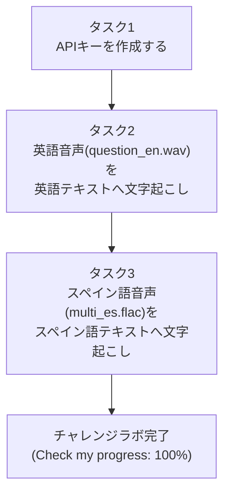
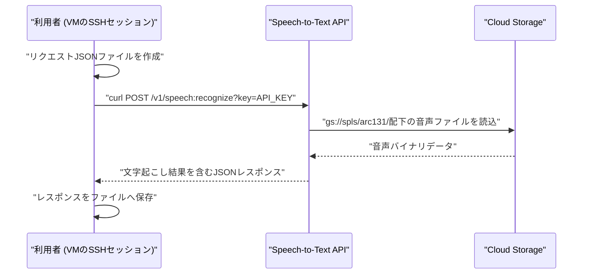
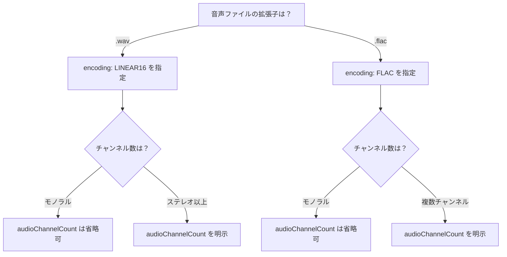

# Cloud Speech-to-Text API チャレンジラボ 完全攻略ガイド

*―― ステップバイステップで学ぶベストプラクティス ――*

> 本ガイドは、Google Cloud Skills Boost の challenge lab「Using the Google Cloud Speech API」(ARC131) を題材に、初学者でも迷わず完走できるよう、各タスクの手順・設定値の意味・実務でのベストプラクティスを整理したものです。単なる正解手順の暗記ではなく、「なぜその設定にするのか」を理解できることを目標にしています。

---

## 0. 全体像を先につかむ

このチャレンジラボは3つのタスクで構成されており、後段のタスクほど前段の成果物（APIキー）に依存する一直線の依存関係になっています。



そして、タスク2・タスク3で共通する「APIの呼び出しパターン」は以下のシーケンスになります。ここを最初に理解しておくと、後の作業が機械的な繰り返しではなく「意味のある手順」として頭に入ります。



Speech-to-Text API は音声データそのものをリクエストボディに含める方式（`content`）と、Cloud Storage 上のURIを指定する方式（`uri`）の2種類の音声指定方法をサポートしています。今回のラボは後者で、音声ファイルは `gs://spls/arc131/` に既に配置されているため、自分でアップロードする作業は不要です。

---

## 事前準備

| 項目 | 内容 |
|---|---|
| 接続方法 | Cloud Console から対象VMインスタンスへ SSH 接続 |
| 必要なAPI | Cloud Speech-to-Text API（ラボ環境では既に有効化済みのことが多いが、念のため「APIとサービス」から有効化状態を確認する） |
| 権限 | ラボ用の一時的な学習者アカウントでログインしていること |
| ツール | `nano` または `vim`（VM上でJSONファイルを作成するため）、`curl`（APIを呼び出すため） |

---

## タスク1: APIキーを作成する

### 手順

1. Cloud Console 左上のナビゲーションメニューから **[APIとサービス] > [認証情報]** を開きます。
2. **[+ 認証情報を作成]** をクリックし、**[APIキー]** を選択します。
3. 生成されたキー文字列をコピーし、控えておきます（この後のタスクで繰り返し使用します）。
4. **[Check my progress]** をクリックして、キーが作成されたことを確認します。

コンソールではなく `gcloud` コマンドで作成したい場合は、VMにSSH接続したうえで以下でも同じことができます。

```bash
gcloud services api-keys create --display-name="speech-api-key"
```

作成後にキー文字列を取得するには、まず一覧からキーIDを確認します。

```bash
gcloud services api-keys list
gcloud services api-keys get-key-string <KEY_ID> --location=global
```

取得したキーは、以降のコマンドで使い回せるように環境変数へ入れておくと安全かつ効率的です。

```bash
export API_KEY="ここに取得したキー文字列を貼り付け"
```

### ベストプラクティス（根拠付き）

| プラクティス | 理由 | 出典 |
|---|---|---|
| APIキーは「今使っているものだけ」保持し、不要になったキーは削除する | 攻撃対象領域（アタックサーフェス）を小さく保つため | Google Cloud「Best practices for managing API keys」 |
| コード中やリポジトリにAPIキーを直接埋め込まない | ソースコードが漏洩・共有された際にキーごと流出するリスクを避けるため | 同上 |
| 本番運用では、URLのクエリパラメータではなく `x-goog-api-key` ヘッダーでキーを渡す | クエリパラメータに含めるとURLスキャンなどでキーが盗まれるリスクがあるため（本ラボの学習用curlコマンドは簡便さのためクエリパラメータ方式を使用） | 同上 |
| APIキーには「呼び出せるAPIの制限」と「呼び出し元の制限」を設定する | 万一キーが漏洩しても、被害範囲をSpeech-to-Text APIなど必要な範囲に限定できるため | Google Cloud「Adding restrictions to API keys」 |
| チームで使う場合はメンバーごとに個別のキーを発行する | 誰がどのAPIをどれだけ使ったかを監査ログで追跡できるようにするため | Google Cloud「Best practices for managing API keys」 |

> 補足: 本チャレンジラボでは学習を目的として制限なしのAPIキーをそのまま使用しますが、実務では上表の「呼び出せるAPIの制限」を必ず設定することが推奨されます。コンソールでは、作成したキーの詳細画面 → [APIの制限] → 対象APIを「Cloud Speech-to-Text API」に限定するだけで設定できます。

---

## タスク2: 音声を英語のテキストに文字起こしする

対象ファイル: `gs://spls/arc131/question_en.wav`

### 手順

1. VMインスタンスに SSH で接続します（Compute Engine の VM インスタンス一覧から [SSH] ボタンをクリック）。
2. タスク1で控えたAPIキーを環境変数にセットします（新しいSSHセッションの場合は再設定が必要です）。

```bash
export API_KEY="taskで取得したAPIキー"
```

3. リクエスト用のJSONファイルを作成します。ファイル名は `request.json` とします。

```bash
cat > request.json << EOF
{
  "config": {
    "encoding": "LINEAR16",
    "languageCode": "en-US",
    "audioChannelCount": 2
  },
  "audio": {
    "uri": "gs://spls/arc131/question_en.wav"
  }
}
EOF
```

4. `curl` でSpeech-to-Text APIを呼び出し、結果を `result.json` に保存します。

```bash
curl -s -X POST \
  -H "Content-Type: application/json; charset=utf-8" \
  --data-binary @request.json \
  "https://speech.googleapis.com/v1/speech:recognize?key=${API_KEY}" \
  > result.json
```

5. 内容を確認します。

```bash
cat result.json
```

`transcript` フィールドに英語の文字起こし結果、`confidence` フィールドに信頼度スコアが含まれていれば成功です。

6. **[Check my progress]** をクリックして完了を確認します。

### 設定値の意味

| フィールド | 設定値 | 意味 |
|---|---|---|
| `encoding` | `LINEAR16` | 非圧縮のリニアPCM形式。`.wav` ファイルによく使われる |
| `languageCode` | `en-US` | 認識対象言語（BCP-47形式）。米国英語を指定 |
| `audioChannelCount` | `2` | 音声ファイルがステレオ（2チャンネル）であることを明示 |
| `audio.uri` | `gs://...` | Cloud Storage上の音声ファイルの場所 |

### ベストプラクティス（根拠付き）

| プラクティス | 理由 | 出典 |
|---|---|---|
| 可能であればロスレス形式（`LINEAR16` または `FLAC`）を使う | 非可逆圧縮（MP3など）は認識精度を落とす可能性があるため。特に背景ノイズがある場合に影響が大きい | Google Cloud「RecognitionConfig リファレンス」 |
| サンプルレートは16000Hzが最適 | それ以外の値でも8000〜48000Hzの範囲なら動作するが、16000Hzが最も精度が安定する | 同上 |
| `.wav`/`.flac` ファイルはヘッダーにサンプルレート情報を含むため、`sampleRateHertz` を省略してよい | ヘッダーから自動的に読み取られるため、明示するとヘッダーの値と不一致の場合にエラーになるリスクがある | 同上 |
| マルチチャンネル音声では `audioChannelCount` を明示する | チャンネル数の指定がないと最初のチャンネルのみが認識対象になるため（全チャンネルを個別認識したい場合は `enableSeparateRecognitionPerChannel` も併用する） | Google Cloud「RecognitionConfig リファレンス」 |
| レスポンスは必ずファイルに保存してから中身を確認する | API呼び出しが失敗していてもターミナル上では気づきにくいため、`cat` で内容を確認する習慣が誤りの早期発見につながる | Google Cloud「Transcribe speech to text by using the API」 |

---

## タスク3: 音声をスペイン語のテキストに文字起こしする

対象ファイル: `gs://spls/arc131/multi_es.flac`

### 手順

1. （引き続き同じSSHセッションでOK。切断されていた場合は再接続してAPIキーを再設定）
2. リクエスト用のJSONファイルを新しい名前で作成します。ここでは `request_es.json` とします。

```bash
cat > request_es.json << EOF
{
  "config": {
    "encoding": "FLAC",
    "languageCode": "es-ES"
  },
  "audio": {
    "uri": "gs://spls/arc131/multi_es.flac"
  }
}
EOF
```

3. APIを呼び出し、結果を `result_es.json` に保存します。

```bash
curl -s -X POST \
  -H "Content-Type: application/json; charset=utf-8" \
  --data-binary @request_es.json \
  "https://speech.googleapis.com/v1/speech:recognize?key=${API_KEY}" \
  > result_es.json
```

4. 内容を確認します。

```bash
cat result_es.json
```

5. **[Check my progress]** をクリックして完了を確認します。

> 補足: 自動採点は多くの場合、実際にSpeech-to-Text APIへリクエストが送信され正しいレスポンスが返ってきたかどうかを見ます。そのため、ファイル名そのものは `request.json` でも `speech_request.json` でも構いません。重要なのは「正しい `config` と `audio.uri` を指定してAPIを正常に呼び出せているか」です。とはいえ、タスクごとにファイル名を分けておくと、後から見返したときに何のリクエストか分かりやすく、実務でも再現性のあるベストプラクティスです。

### タスク2とタスク3の設定差分

| 項目 | タスク2（英語 / .wav） | タスク3（スペイン語 / .flac） |
|---|---|---|
| `encoding` | `LINEAR16` | `FLAC` |
| `languageCode` | `en-US` | `es-ES` |
| `audioChannelCount` | `2`（ステレオのため明示） | 事前に `sox --i` 等で確認した上で設定（モノラルなら省略可） |
| ファイル形式の特徴 | 非圧縮・ヘッダーにチャンネル情報あり | ロスレス圧縮・ヘッダーにサンプルレート/エンコード情報あり |

### 音声形式・言語コードの選び方（判断フロー）



### 言語を変える場合の一般的な手順（他言語への応用）

このラボの「タスク3」の本質は、`languageCode` を変えるだけで同じAPIリクエストの型を別言語へ横展開できることを体験する点にあります。以下は代表的な言語コードの例です。

| 言語 | `languageCode` |
|---|---|
| 英語（アメリカ） | `en-US` |
| スペイン語（スペイン） | `es-ES` |
| スペイン語（メキシコ） | `es-MX` |
| 日本語 | `ja-JP` |
| フランス語（フランス） | `fr-FR` |
| ドイツ語（ドイツ） | `de-DE` |

言語コードはBCP-47形式（言語 + 地域）で指定します。対応言語の全リストは公式ドキュメントの「Speech-to-Text supported languages」で確認できます（出典リンクは末尾参照）。

### ベストプラクティス（根拠付き）

| プラクティス | 理由 | 出典 |
|---|---|---|
| `.flac`/`.wav` 以外の形式を音声ソースとして使う場合はFLACへの変換を検討する | Speech-to-Text APIが推奨するロスレス形式であり、`LINEAR16` の約半分の帯域で同等の認識精度を得られるため | Google Cloud「RecognitionConfig.AudioEncoding」 |
| 言語コードは地域まで含めて正確に指定する（例: `es` ではなく `es-ES`） | 同じ言語でも地域によって発音・語彙が異なり、認識精度に影響するため | Google Cloud「Speech-to-Text supported languages」 |
| 複数言語に対応する設計では、`languageCode` を設定ファイルや変数として外出しする | ハードコードを避けることで、対応言語の追加時にコード変更を最小限にできるため | 一般的なソフトウェア設計のベストプラクティス（設定と実装の分離） |

---

## トラブルシューティング

| 症状 | 想定される原因 | 対処 |
|---|---|---|
| レスポンスが空、または `results` フィールドがない | 実際の音声のエンコード/サンプルレート/チャンネル数と、リクエストの `config` が一致していない | `sox` などで音声ファイルの実際のヘッダー情報（サンプルレート・チャンネル数・エンコード）を確認し、`config` を合わせる |
| `400 INVALID_ARGUMENT` エラー | リクエスト `config` の `encoding` や `sampleRateHertz` の指定値が、実際のファイルヘッダー情報と一致していない | `sox` などで音声ファイルのヘッダー情報を確認して `config` を一致させる。または FLAC/WAV では `encoding` や `sampleRateHertz` を省略して自動判定を利用する |
| `403` や認証エラー | APIキーが正しく環境変数にセットされていない、またはSpeech-to-Text APIが有効化されていない | `echo $API_KEY` でキーが空でないか確認し、[APIとサービス] からAPIの有効化状況を確認する |
| `curl` の出力が真っ白 | `-s`（silent）オプションによりエラーメッセージも抑制されている | 一時的に `-s` を外して実行し、HTTPステータスやエラーメッセージを確認する |

出典: Google Cloud「Troubleshooting | Cloud Speech-to-Text」

---

## まとめチェックリスト

- [ ] APIキーを作成し、環境変数 `API_KEY` にセットした
- [ ] `.wav` ファイル用に `encoding: LINEAR16` と `audioChannelCount` を設定したリクエストJSONを作成した
- [ ] `curl` でAPIを呼び出し、英語の文字起こし結果をファイルに保存した
- [ ] `.flac` ファイル用に `encoding: FLAC` と `languageCode: es-ES` を設定したリクエストJSONを作成した
- [ ] `curl` でAPIを呼び出し、スペイン語の文字起こし結果をファイルに保存した
- [ ] （実務で使う場合の発展課題として）APIキーにAPI制限・呼び出し元制限をかけた

---

## 参考文献（根拠ソース一覧）

- Google Cloud Skills Boost「Using the Google Cloud Speech API: Challenge Lab」  
  https://www.cloudskillsboost.google/focuses/65993
- Google Cloud「Transcribe speech to text by using the API（クイックスタート）」  
  https://cloud.google.com/speech-to-text/docs/transcribe-api
- Google Cloud「RecognitionConfig リファレンス」  
  https://cloud.google.com/speech-to-text/docs/reference/rest/v1/RecognitionConfig
- Google Cloud「RecognitionConfig.AudioEncoding（エンコード形式の詳細）」  
  https://googleapis.github.io/googleapis/java/all/latest/apidocs/com/google/cloud/speech/v1/RecognitionConfig.AudioEncoding.html
- Google Cloud「Introduction to audio encoding for Cloud Speech-to-Text」  
  https://cloud.google.com/speech-to-text/docs/encoding
- Google Cloud「Troubleshooting | Cloud Speech-to-Text」  
  https://cloud.google.com/speech-to-text/docs/troubleshooting
- Google Cloud「Speech-to-Text supported languages（対応言語一覧）」  
  https://cloud.google.com/speech-to-text/docs/speech-to-text-supported-languages
- Google Cloud「Best practices for managing API keys」  
  https://cloud.google.com/docs/authentication/api-keys-best-practices
- Google Cloud「Adding restrictions to API keys」  
  https://cloud.google.com/api-keys/docs/add-restrictions-api-keys
- MDN Web Docs「BCP 47 language tag」  
  https://developer.mozilla.org/en-US/docs/Glossary/BCP_47_language_tag
  