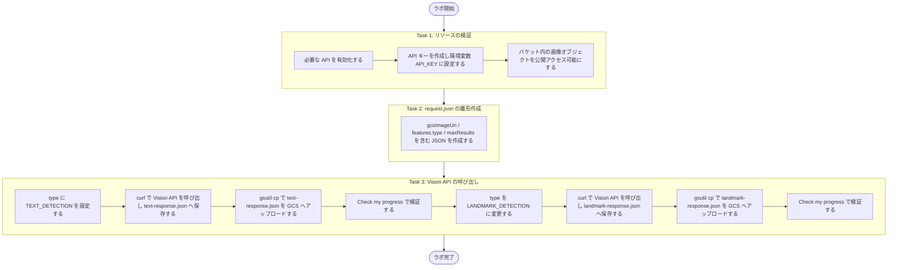
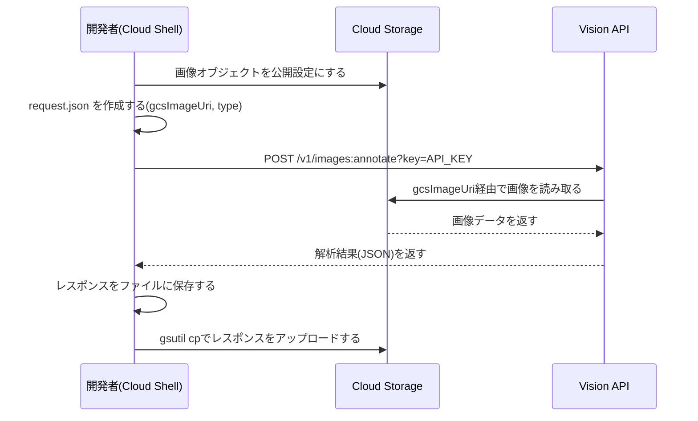
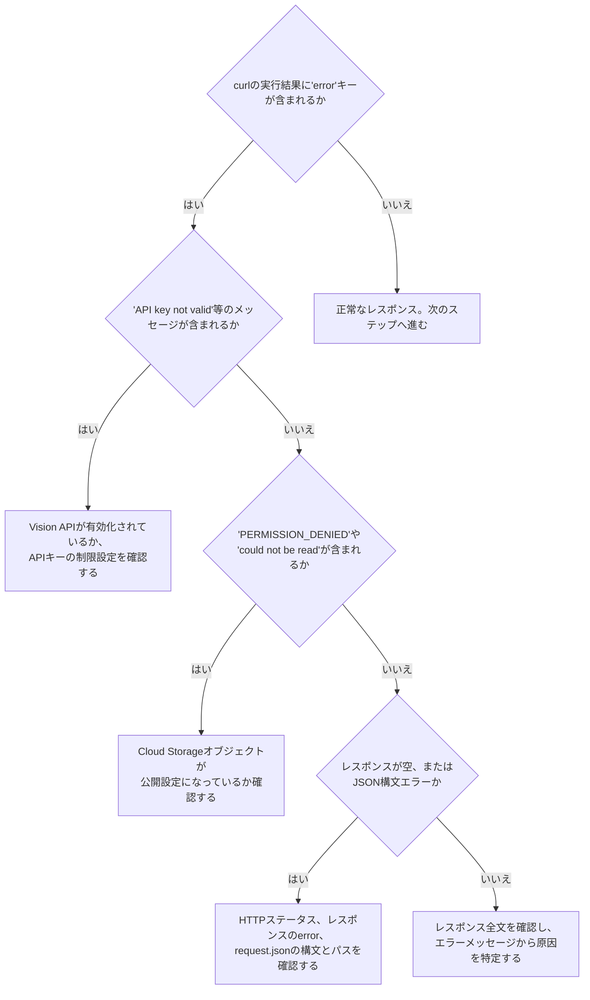

# Cloud Vision API チャレンジラボ攻略ガイド

## テキスト検出とランドマーク検出のベストプラクティス（初学者向けステップバイステップ解説）

> 対象ラボ: *Analyze Images with the Cloud Vision API: Challenge Lab*（Google Skills / Qwiklabs）
> 想定読者: Google Cloud を学び始めたばかりのジュニアエンジニア

---

## 目次

1. [この文書について](#この文書について)
2. [ラボの全体像](#1-ラボの全体像)
3. [事前知識・用語集](#2-事前知識用語集)
4. [Task 1: リソースの検証](#3-task-1-リソースの検証)
5. [Task 2: request.json の作成](#4-task-2-requestjson-の作成)
6. [Task 3: Vision API の呼び出し](#5-task-3-vision-api-の呼び出し)
7. [よくあるエラーと切り分けフロー](#6-よくあるエラーと切り分けフロー)
8. [ベストプラクティスまとめ](#7-ベストプラクティスまとめ)
9. [参考文献](#8-参考文献)

---

## この文書について

このチャレンジラボは、手順書をそのままなぞるのではなく「これまで学んだ知識を使って自力でタスクを完了させる」形式のラボです。そのため、公式ドキュメントを参照しながら自分の手を動かして解決する力が求められます。本ガイドでは、各タスクの**手順**だけでなく、**なぜその手順が推奨されるのか（ベストプラクティスの根拠）**を、Google Cloud の公式ドキュメントを引用しながら解説します。

---

## 1. ラボの全体像

### 1.1 学習目標

| 項目 | 内容 |
|---|---|
| 使用する API | Cloud Vision API（Cloud Translation API、Cloud Natural Language API は有効化のみ） |
| 主なタスク | 画像からのテキスト検出（`TEXT_DETECTION`）、ランドマーク検出（`LANDMARK_DETECTION`） |
| 認証方式 | API キー（`?key=${API_KEY}` によるクエリパラメータ認証） |
| 成果物の検証方法 | `curl` レスポンスを Cloud Storage にアップロードし、自動採点システムが確認 |

### 1.2 全体フロー（Mermaid）



---

## 2. 事前知識・用語集

| 用語 | 説明 |
|---|---|
| Cloud Vision API | 画像を解析し、テキスト・ラベル・顔・ランドマークなどを検出する Google Cloud の機械学習 API |
| `gcsImageUri` | Cloud Storage 上にある解析対象画像の場所を指すフィールド（`gs://バケット名/オブジェクト名` 形式） |
| `features.type` | 実行したい解析の種類（`TEXT_DETECTION`、`LANDMARK_DETECTION` など） |
| API キー | プロジェクトを識別するための文字列。ユーザーやサービスアカウントそのものを認証するものではない |
| `gsutil` | Cloud Storage を操作するコマンドラインツール。現在は後継の `gcloud storage` コマンドへの移行が案内されている |
| `allUsers` | Cloud Storage の IAM で「インターネット上の誰でも」を表す特別なプリンシパル |
| `roles/storage.objectViewer` | オブジェクトの読み取りのみを許可する IAM ロール |

---

## 3. Task 1: リソースの検証

### 3.1 必要な API を有効化する

このラボでは Cloud Vision API に加えて、Cloud Translation API・Cloud Natural Language API も有効化しておく必要があります（後続タスクや発展課題で使用するため）。

**Console から有効化する場合**

1. ナビゲーションメニューから **[APIs & Services] > [Library]** を開く
2. 検索ボックスで `Cloud Vision API` を検索し、**Enable** をクリック
3. 同様に `Cloud Translation API`、`Cloud Natural Language API` も有効化する

**gcloud CLI から有効化する場合（複数 API はスペース区切りで一括指定可能）**

```bash
gcloud services enable \
  vision.googleapis.com \
  translate.googleapis.com \
  language.googleapis.com
```

> **ベストプラクティスの根拠**
> `gcloud services enable` コマンドはスペース区切りで複数のサービス名を指定することで、一度に複数の API をまとめて有効化できます。必要な API だけを都度有効化し、使わない API は無効化しておくことで、誤用や予期しない課金を防げます。
> 出典: [Enable and disable services | Google Cloud](https://cloud.google.com/service-usage/docs/enable-disable)

### 3.2 API キーを作成し環境変数に設定する

**手順**

1. **[APIs & Services] > [Credentials]** を開く
2. **Create credentials > API key** を選択してキーを作成
3. 発行されたキーをコピーし、環境変数として設定する

```bash
export API_KEY=<コピーしたAPIキー>
```

> **ベストプラクティスの根拠（重要）**
> - API キーはコード内に直接埋め込まず、環境変数やソースツリー外のファイルに保存することが推奨されています。埋め込んだままリポジトリを公開すると、キーが漏えいするリスクがあります。
>   出典: [API keys overview | Google Cloud](https://docs.cloud.google.com/api-keys/docs/overview)
> - 本番運用では、API キーに **API 制限**（このキーで呼び出せる API を限定する）と**アプリケーション制限**（呼び出し元の IP やアプリを限定する）の両方を設定することが推奨されています。制限のない API キーは漏えい時の被害範囲が大きくなります。
>   出典: [Manage API keys | Google Cloud](https://docs.cloud.google.com/docs/authentication/api-keys)、[Adding restrictions to API keys | Google Cloud](https://docs.cloud.google.com/api-keys/docs/add-restrictions-api-keys)
> - さらに踏み込むと、公式ドキュメントは API キーよりも IAM ポリシーや短命なサービスアカウント認証情報など、より安全な代替手段への移行を推奨しています。このラボで API キーを使うのは学習目的の簡易な方法であり、本番システムでは Bearer トークン（`gcloud auth print-access-token` 等）や IAM ベースの認証を優先するのが望ましい、という点は覚えておくとよいでしょう。
>   出典: [Best practices for managing API keys | Google Cloud](https://docs.cloud.google.com/docs/authentication/api-keys-best-practices)

### 3.3 Cloud Storage オブジェクトを公開する

ラボ用のバケット（`PROJECT_ID-bucket`）には画像があらかじめ配置されています。この画像を Vision API から読み取れるよう、オブジェクトを公開アクセス可能にします。

**Console から設定する場合**

1. Cloud Storage の **[Buckets]** ページでバケットを開く
2. 対象オブジェクトの権限設定から **allUsers** を追加し、ロールに **Storage Object Viewer**（`roles/storage.objectViewer`）を選択

**gcloud CLI から設定する場合（バケット全体を公開する例）**

```bash
gcloud storage buckets add-iam-policy-binding gs://BUCKET_NAME \
  --member=allUsers \
  --role=roles/storage.objectViewer
```

> **ベストプラクティスの根拠**
> Cloud Storage の公式ドキュメントでは、オブジェクトやバケットを公開する際は `allUsers` プリンシパルに `roles/storage.objectViewer` ロールを付与する方法が案内されています。
> 出典: [Make data public | Cloud Storage](https://cloud.google.com/storage/docs/access-control/making-data-public)、[Make an object public | Cloud Storage](https://cloud.google.com/storage/docs/samples/storage-make-public)
>
> **本番環境での注意点**: このラボでは検証のためにオブジェクトを公開設定にしますが、実運用では機密性の高い画像を無制限に公開するのは避けるべきです。Vision API は署名付き URL（Signed URL）や、画像データを Base64 エンコードしてリクエストの `image.content` に直接含める方式にも対応しています。公開バケットが必須なのは「学習用ラボの制約」であり、本番設計にそのまま適用しないよう注意してください。

---

## 4. Task 2: request.json の作成

Vision API へのリクエストは JSON 形式で組み立てます。以下がベースとなるテンプレートです。

```json
{
  "requests": [
    {
      "image": {
        "source": {
          "gcsImageUri": "gs://YOUR_BUCKET/YOUR_IMAGE"
        }
      },
      "features": [
        {
          "type": "TEXT_DETECTION",
          "maxResults": 10
        }
      ]
    }
  ]
}
```

### 主要フィールドの意味

| フィールド | 説明 | 備考 |
|---|---|---|
| `requests` | 1 回のリクエストで送る解析対象の配列 | 複数画像をまとめて送信することも可能 |
| `image.source.gcsImageUri` | Cloud Storage 上の画像の場所（`gs://` 形式） | 公開 Web URL の場合は `imageUri`、ローカル画像なら Base64 化した `image.content` を使う |
| `features[].type` | 実行する解析の種類 | 本ラボでは `TEXT_DETECTION` → `LANDMARK_DETECTION` の順に切り替える |
| `features[].maxResults` | 返却する結果の最大件数 | 検出対象が多い場合の上限として機能する |

> **根拠**: `gcsImageUri` は Cloud Storage バケット内に格納された画像を示すフィールドである、という定義は公式クイックスタートに記載されています。
> 出典: [Quickstart: Detect labels in an image by using the command line | Cloud Vision API](https://docs.cloud.google.com/vision/docs/detect-labels-image-command-line)

<!-- -->

> **ベストプラクティス**: `request.json` のようにリクエスト本文をファイルに切り出しておくと、`curl` コマンド自体がシンプルになり、JSON の構文エラーをエディタ側で事前にチェックしやすくなります。ヒアドキュメントでインラインに JSON を書くよりも、独立したファイルとして管理する方が可読性・再利用性の面で優れています。

---

## 5. Task 3: Vision API の呼び出し

### 5.1 TEXT_DETECTION の実行

`request.json` の `type` を `TEXT_DETECTION` に更新したら、以下のコマンドで Vision API を呼び出します。

```bash
curl -s -X POST \
  -H "Content-Type: application/json" \
  --data-binary @request.json \
  "https://vision.googleapis.com/v1/images:annotate?key=${API_KEY}" \
  -o text-response.json \
  -w '\nHTTP %{http_code}\n'
```

### curl オプションの意味

| オプション | 意味 |
|---|---|
| `-s` | サイレントモード。プログレス表示を抑制し、レスポンスのみを出力する |
| `-X POST` | HTTP メソッドを `POST` に指定する |
| `-H "Content-Type: application/json"` | リクエストボディが JSON であることをサーバーに伝えるヘッダー |
| `--data-binary @request.json` | ファイルの内容をバイト単位で保持して送信する。Google 公式手順の `-d @request.json` も有効で、JSON の前後や要素間の空白・改行は意味を変えない |
| `-o text-response.json` | レスポンスを標準出力ではなくファイルに保存する |
| `-w '\nHTTP %{http_code}\n'` | レスポンス処理後に改行付きで HTTP ステータスコードを出力する |

> **根拠**: Vision API の公式コマンドライン手順では `POST https://vision.googleapis.com/v1/images:annotate` に `-d @request.json` で JSON を送信しています。本ガイドでは送信バイトをそのまま保持したい場合の選択肢として `--data-binary` を使用しています。
> 出典: [Detect labels in an image by using the command line | Cloud Vision API](https://cloud.google.com/vision/docs/detect-labels-image-command-line)

<!-- -->

> **補足（発展的なベストプラクティス）**: 公式ドキュメントの多くのサンプルでは、API キーではなく `Authorization: Bearer $(gcloud auth print-access-token)` ヘッダーと `x-goog-user-project` ヘッダーを使う認証方式が案内されています。これは IAM ベースの認証であり、API キーよりも安全性が高い方式です。ラボでは学習を簡潔にするために API キー方式を採用していますが、実務では Bearer トークン方式も選択肢として知っておくとよいでしょう。
> 出典: [Detect image properties | Cloud Vision API](https://docs.cloud.google.com/vision/docs/detecting-properties)

### 5.2 レスポンスの Cloud Storage へのアップロード

自動採点システムがレスポンスを検証できるよう、出力ファイルを Cloud Storage にアップロードします。

```bash
gsutil cp text-response.json gs://BUCKET_NAME_FILLED_AFTER_LAB_START
```

> **ベストプラクティス・注意点**
> `gsutil` は長年使われてきた Cloud Storage 用 CLI ですが、公式ドキュメントでは後継の `gcloud storage` コマンド群への移行が案内されています（`gsutil` は将来的に Cloud CLI 本体からは切り離され、単独ツールとしての配布に移行する予定です）。このラボの手順は `gsutil cp` を前提としていますが、新しく学習する場合や実務で使う場合は `gcloud storage cp` を使う習慣をつけておくと、将来的な移行コストを減らせます。
>
> ```bash
> # gcloud storage を使う場合の等価コマンド
> gcloud storage cp text-response.json gs://BUCKET_NAME_FILLED_AFTER_LAB_START
> ```
>
> 出典: [gsutil tool | Cloud Storage](https://docs.cloud.google.com/storage/docs/gsutil)、[gcloud storage cp | Google Cloud SDK](https://docs.cloud.google.com/sdk/gcloud/reference/storage/cp)

アップロードが完了したら、ラボ画面の **Check my progress**（"Analyze the image with the Cloud Vision API"）をクリックして検証します。

### 5.3 LANDMARK_DETECTION への切り替えと再実行

続いて `request.json` の `type` を `LANDMARK_DETECTION` に書き換え、同じ流れでもう一度実行します。

```bash
curl -s -X POST \
  -H "Content-Type: application/json" \
  --data-binary @request.json \
  "https://vision.googleapis.com/v1/images:annotate?key=${API_KEY}" \
  -o landmark-response.json \
  -w '\nHTTP %{http_code}\n'

gsutil cp landmark-response.json gs://BUCKET_NAME_FILLED_AFTER_LAB_START
```

> **根拠**: `LANDMARK_DETECTION` は画像内の有名な自然物・人工建造物（史跡、モニュメントなど）を検出する機能であり、検出結果には名称・信頼度スコア・緯度経度などが含まれます。
> 出典: [Detect landmarks | Cloud Vision API](https://docs.cloud.google.com/vision/docs/detecting-landmarks)、[Detect landmarks in a Cloud Storage file | Cloud Vision API](https://docs.cloud.google.com/vision/docs/samples/vision-landmark-detection-gcs)

再度アップロード後、**Check my progress** で検証して完了です。

### 5.4 リクエスト〜レスポンスのシーケンス図



---

## 6. よくあるエラーと切り分けフロー

チャレンジラボは「エラーメッセージを読んで自力で解決する」ことが前提のため、代表的な原因を切り分けるフローを用意しました。



### エラー原因の対応表

| 症状 | 主な原因 | 対処 |
|---|---|---|
| `API key not valid` | Vision API が有効化されていない／キーに API 制限がかかっている | Task 1 の API 有効化を再確認、キーの制限設定を確認 |
| `PERMISSION_DENIED` / 画像が読み取れない | Cloud Storage オブジェクトが非公開のまま | `allUsers` に `Storage Object Viewer` を付与したか確認 |
| レスポンスファイルが空 | HTTP エラー、レスポンスのエラー内容、JSON 構文、または `@request.json` のパスに問題がある。公式手順の `-d @request.json` 自体は有効 | HTTP ステータスとレスポンスの `error` を確認し、JSON 構文と `@request.json` のパスを再確認 |
| `gsutil cp` が失敗する | 認証切れ、またはバケット名の誤り | `gcloud auth list` で認証状態を確認し、バケット名を再確認 |

---

## 7. ベストプラクティスまとめ

| 観点 | ベストプラクティス | 出典 |
|---|---|---|
| API 有効化 | 必要な API のみを有効化し、不要な API は無効化する | [Enable and disable services](https://cloud.google.com/service-usage/docs/enable-disable) |
| API キー管理 | コードに埋め込まず環境変数で管理する | [API keys overview](https://docs.cloud.google.com/api-keys/docs/overview) |
| API キー制限 | API 制限とアプリケーション制限の両方を設定する | [Manage API keys](https://docs.cloud.google.com/docs/authentication/api-keys) |
| 認証方式の選定 | 本番では API キーより IAM / Bearer トークンを優先する | [Best practices for managing API keys](https://docs.cloud.google.com/docs/authentication/api-keys-best-practices) |
| データ公開範囲 | 公開は学習用途に留め、本番では署名付き URL 等を検討する | [Make data public](https://cloud.google.com/storage/docs/access-control/making-data-public) |
| CLI ツール選定 | `gsutil` より将来性のある `gcloud storage` を優先的に学ぶ | [gsutil tool](https://docs.cloud.google.com/storage/docs/gsutil) |

---

## 8. 参考文献

- [Enable and disable services | Service Usage | Google Cloud](https://cloud.google.com/service-usage/docs/enable-disable)
- [gcloud services enable | Google Cloud SDK](https://cloud.google.com/sdk/gcloud/reference/services/enable)
- [API keys overview | API Keys API Documentation | Google Cloud](https://docs.cloud.google.com/api-keys/docs/overview)
- [Manage API keys | Authentication | Google Cloud](https://docs.cloud.google.com/docs/authentication/api-keys)
- [Adding restrictions to API keys | API Keys API Documentation | Google Cloud](https://docs.cloud.google.com/api-keys/docs/add-restrictions-api-keys)
- [Best practices for managing API keys | Authentication | Google Cloud](https://docs.cloud.google.com/docs/authentication/api-keys-best-practices)
- [Make data public | Cloud Storage | Google Cloud](https://cloud.google.com/storage/docs/access-control/making-data-public)
- [Make an object public | Cloud Storage | Google Cloud](https://cloud.google.com/storage/docs/samples/storage-make-public)
- [gsutil tool | Cloud Storage | Google Cloud](https://docs.cloud.google.com/storage/docs/gsutil)
- [gcloud storage cp | Google Cloud SDK | Google Cloud](https://docs.cloud.google.com/sdk/gcloud/reference/storage/cp)
- [Quickstart: Detect labels in an image by using the command line | Cloud Vision API](https://docs.cloud.google.com/vision/docs/detect-labels-image-command-line)
- [Detect and extract text from images | Cloud Vision API](https://docs.cloud.google.com/vision/docs/ocr)
- [Detect image properties | Cloud Vision API](https://docs.cloud.google.com/vision/docs/detecting-properties)
- [Detect landmarks | Cloud Vision API](https://docs.cloud.google.com/vision/docs/detecting-landmarks)
- [Detect landmarks in a Cloud Storage file | Cloud Vision API](https://docs.cloud.google.com/vision/docs/samples/vision-landmark-detection-gcs)

---

*本ガイドは Google Skills のチャレンジラボ「Analyze Images with the Cloud Vision API」の内容をもとに、公式ドキュメントを参照しながら作成した学習補助資料です。ラボ内の実際のバケット名・プロジェクト ID・リージョンは、ラボ開始時に動的に払い出される値に置き換えてください。*
