# Cisco Certified DevNet Professional（現 CCNP Automation）初学者向け完全ガイド

> 対象試験：**350-901 AUTOCOR**（旧 DEVCOR）＋ コンセントレーション試験 1 つ
> 想定読者：Python と REST API の基礎は触ったことがあり、ネットワーク自動化・NetDevOps・AI 連携を体系的に学びたい方
> 執筆時点：2026 年 10 月 3 日（試験範囲は予告なく変わるため、受験前に必ず公式ページを再確認してください）

---

## 目次

0. [最重要：名称変更と「どの試験範囲を学ぶべきか」](#0-最重要名称変更とどの試験範囲を学ぶべきか)
1. [認定の全体像](#1-認定の全体像)
2. [学習の前提スキル](#2-学習の前提スキル)
3. [AUTOCOR ドメイン 1：Network Automation（30%）](#3-autocor-ドメイン-1network-automation30)
4. [AUTOCOR ドメイン 2：Infrastructure as Code（30%）](#4-autocor-ドメイン-2infrastructure-as-code30)
5. [AUTOCOR ドメイン 3：Operations（20%）](#5-autocor-ドメイン-3operations20)
6. [AUTOCOR ドメイン 4：AI in Automation（20%）](#6-autocor-ドメイン-4ai-in-automation20)
7. [参考：旧 DEVCOR v1.1 の出題範囲（現行試験では対象外）](#7-参考旧-devcor-v11-の出題範囲現行試験では対象外)
8. [コンセントレーション試験（ENAUTO / DCNAUTO）](#8-コンセントレーション試験enauto--dcnauto)
9. [学習計画とラボ環境](#9-学習計画とラボ環境)
10. [ベストプラクティス総括チェックリスト](#10-ベストプラクティス総括チェックリスト)
11. [参考 URL（ソース一覧）](#11-参考-urlソース一覧)

---

## 0. 最重要：名称変更と「どの試験範囲を学ぶべきか」

ご指定の Cisco Japan のページ（`cisco-certified-devnet-professional.html`）は、**旧体系（DevNet Professional / DEVCOR 350-901 v1.1 / コンセントレーション 8 種）** の内容を掲載しています。ところが、Cisco は **2026 年 2 月 3 日** に DevNet 認定を Automation 認定へ改称しており、現行の公式ページでは次のようになっています。

| 項目 | 旧（ご指定ページの記載） | 現行（Cisco 公式 CCNP Automation ページ） |
|---|---|---|
| 認定名 | Cisco Certified DevNet Professional | **CCNP Automation** |
| コア試験 | 350-901 DEVCOR v1.1「Developing Applications using Cisco Core Platforms and APIs」 | **350-901 AUTOCOR v2.0「Designing, Deploying and Managing Network Automation Systems」** |
| コア試験の構成 | 5 ドメイン × 各 20% | **4 ドメイン：30% / 30% / 20% / 20%** |
| コンセントレーション | 8 種から 1 つ（ENAUTO / CLAUTO / DCAUTO / SPAUTO / SAUTO / DEVOPS / DEVIOT / DEVWBX） | 公式ページの現行一覧は **ENAUTO v2.0 と DCNAUTO v2.0 の 2 種** |
| 有効期間 | 3 年 | 3 年（CE クレジットまたは再受験で更新） |
| 既存保持者 | ― | 2026-02-03 に自動移行（再受験不要） |

> ⚠️ **注意**：旧 DEVCOR 向けの教材（Webex / Firepower / Meraki / Intersight / UCS / DNA Center / AppDynamics の API 問題が中心）は、**現行 AUTOCOR v2.0 とは出題範囲がかなり異なります**。本ガイドの本編（第 3〜6 章）は **現行 AUTOCOR v2.0 の公式出題範囲**に沿って書いています。旧範囲のうち今も実務・面接で役立つ概念は第 7 章に要点だけまとめました。
>
> 「DevNet Professional」という名称は、履歴書や求人では今も通じます。Cisco 公式の移行後の表記は「CCNP Automation（旧 DevNet Professional）」です。

---

## 1. 認定の全体像

### 1.1 取得要件

CCNP Automation は **コア試験 1 つ + コンセントレーション試験 1 つ** の合格で取得できます。それぞれの合格時に **Specialist 認定** も得られるため、コア合格だけでも成果が認められます。

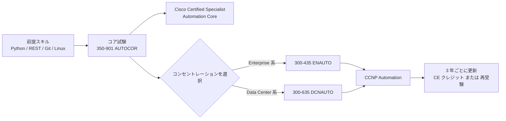

### 1.2 試験概要（Cisco 公式ページより）

| 試験 | 時間 | 受験料（米国表示） | 言語 | 前提条件 | 有効期間 |
|---|---|---|---|---|---|
| 350-901 AUTOCOR（コア） | 120 分 | 400 USD（または Cisco Learning Credits） | 英語・日本語 | なし | 3 年 |
| 300-435 ENAUTO（選択） | 90 分 | 300 USD | 英語・日本語 | なし | 3 年 |
| 300-635 DCNAUTO（選択） | 90 分 | 300 USD | 英語・日本語 | なし | 3 年 |

- 合否は pass/fail で、結果は 48 時間以内にオンラインで確認できます。
- 受験料は国・為替・時期で変動するため、予約画面（公式ページの「Schedule exam」）で必ず確認してください。
- 旧ページには「**推奨：3〜5 年の Python を含むソフトウェア開発経験**」とあり、正式な前提条件はありません。

### 1.3 AUTOCOR v2.0 の出題ドメイン（公式）

| # | ドメイン | 配点 | 一言でいうと |
|---|---|---|---|
| 1.0 | Network Automation | 30% | Ansible / Terraform / RESTCONF / Python / REST API で「作る」 |
| 2.0 | Infrastructure as Code | 30% | Git / GitLab CI/CD / CML / Docker Compose / SoT で「運ぶ・検証する」 |
| 3.0 | Operations | 20% | テレメトリ・ログ・変更検証・TLS・セキュアコーディングで「運用する」 |
| 4.0 | AI in Automation | 20% | AI 支援開発・MCP サーバー・LLM エージェントで「拡張する」 |

対象技術（公式記載）：**Cisco IOS XE、ACI、Meraki、Catalyst Center、SD-WAN、Identity Services Engine、Webex Messaging**。

### 1.4 全体像：1 つの自動化システムとして捉える

AUTOCOR は個別ツールの暗記ではなく、「**設計 → 構築 → 配備 → 運用 → AI で拡張**」という 1 本の流れを問います。

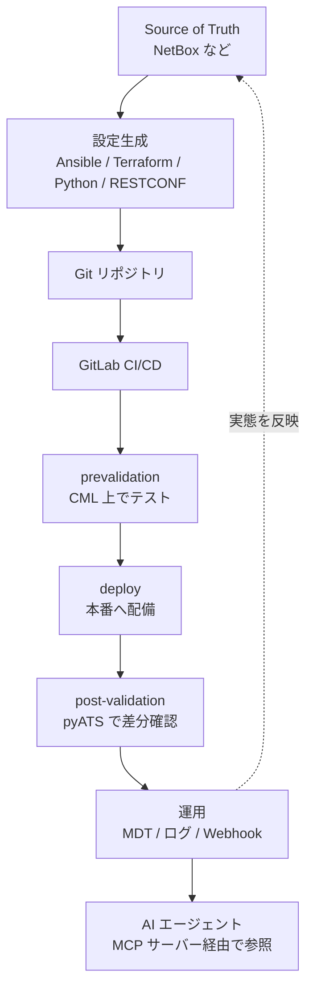

### 1.5 学習の進め方（共通ベストプラクティス）

1. **公式出題範囲 PDF を手元に置き、項目ごとに「説明できる／手を動かして作れる」を確認する**（動詞が *Construct* の項目は必ず自分で書く）。
2. 各項目で **「手順 → 失敗させる → ログで原因を診断する」** まで 1 セットで練習する（試験は *Diagnose / Interpret* も問う）。
3. 自分の PC で再現できるラボ（CML、Docker、無償ツール）を用意する。共有サンドボックスだけに依存しない（第 9 章）。
4. 実装は常に Git 管理し、パイプラインを回して学ぶ（第 4 章の題材そのものが学習環境になる）。

---

## 2. 学習の前提スキル

| 分野 | 最低限できること | 確認の目安 |
|---|---|---|
| Python | 関数・クラス・例外処理・`venv`・`requests`・`logging` | 200 行程度の CLI ツールを自力で書ける |
| データ形式 | JSON / YAML / XML の読み書きと相互変換 | YAML の設定を JSON に直せる |
| HTTP / REST | メソッド、ステータスコード、ヘッダ、認証 | `curl` で認証付き API を叩ける |
| Git | clone / commit / branch / merge / push | ブランチを切って PR（MR）を出せる |
| Linux / CLI | シェル、パイプ、環境変数、SSH | スクリプトを cron や CI から実行できる |
| ネットワーク基礎 | VLAN / OSPF / ACL / インターフェース設定 | CCNA 相当（IOS XE の基本設定が読める） |
| コンテナ | イメージ、コンテナ、ボリューム、ネットワーク | `docker run` と `docker compose up` を使える |

---

## 3. AUTOCOR ドメイン 1：Network Automation（30%）

### 3.0 まず押さえる全体像：自動化の「4 つの入口」

同じ「VLAN を作る」という目的でも、入口が違います。

| 入口 | 代表ツール | 通信 | 特徴 |
|---|---|---|---|
| CLI ベース | Python + Netmiko、Ansible `ios_config` | SSH | どの機器でも使えるが、出力解析が必要で冪等性を自前で担保しがち |
| モデル駆動（NETCONF） | ncclient | SSH(830) + XML | YANG に基づく構造化データ、トランザクション性が高い |
| モデル駆動（RESTCONF） | requests、curl | HTTPS + JSON/XML | REST に近く扱いやすい。YANG 対応 |
| 宣言型（IaC） | Ansible リソースモジュール、Terraform | 内部で上記のいずれか | 「あるべき状態」を書く。差分と冪等性が強み |

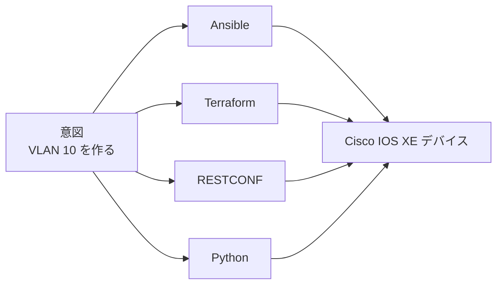

> **ベストプラクティス（共通）**：**冪等性（何度実行しても同じ結果）** と **宣言的な記述**を優先する。CLI の文字列送信は最後の手段にする。

---

### 3.1 【1.1】Ansible でネットワーク構成を管理する（VLAN / OSPF / 資産管理 / インターフェース / ACL）

#### 何ができるか

Ansible は **エージェントレス** で、YAML の **Playbook** に「あるべき状態」を書いて実行する自動化ツールです。Cisco 機器向けには **`cisco.ios` コレクション**（IOS XE 向け）が公式に用意されています。

#### 用語

| 用語 | 意味 |
|---|---|
| Inventory | 管理対象機器の一覧とグループ変数 |
| Playbook | 実行したい処理の台本（YAML） |
| Task / Module | 1 つの処理 / 処理を実装した部品 |
| Collection | モジュールの配布単位（例：`cisco.ios`） |
| Resource module | 機能単位（VLAN、OSPF、ACL など）を宣言的に管理するモジュール群（`ios_vlans` など） |
| Vault | 秘密情報の暗号化機能 |

#### Inventory の例

```yaml
# inventory.yml
all:
  children:
    ios:
      hosts:
        sw01: { ansible_host: 192.0.2.11 }
        sw02: { ansible_host: 192.0.2.12 }
      vars:
        ansible_network_os: cisco.ios.ios
        ansible_connection: ansible.netcommon.network_cli
        ansible_user: "{{ lookup('env', 'NET_USER') }}"
        ansible_password: "{{ lookup('env', 'NET_PASS') }}"
        ansible_become: true
        ansible_become_method: enable
```

#### Playbook の例（VLAN・インターフェース・OSPF）

```yaml
# site.yml
- name: アクセス層の基本設定を宣言的に適用する
  hosts: ios
  gather_facts: false
  tasks:
    - name: VLAN を定義する
      cisco.ios.ios_vlans:
        config:
          - { vlan_id: 10, name: USERS }
          - { vlan_id: 20, name: SERVERS }
        state: merged

    - name: アップリンクの説明を設定する
      cisco.ios.ios_interfaces:
        config:
          - name: GigabitEthernet1/0/1
            description: "to-core"
            enabled: true
        state: merged

    - name: OSPF プロセスを設定する
      cisco.ios.ios_ospfv2:
        config:
          processes:
            - process_id: 1
              router_id: 1.1.1.1
              network:
                - { address: 10.0.0.0, wildcard_bits: 0.0.0.255, area: 0 }
        state: merged
```

ACL は `cisco.ios.ios_acls`（`afi` → `acls` → `aces` の階層構造）、資産情報の取得は `cisco.ios.ios_facts`（モデル・シリアル・OS バージョンなど）を使います。属性名は必ず公式ドキュメントで確認してください。

#### リソースモジュールの `state` を理解する（頻出）

| state | 動作 | 使いどころ |
|---|---|---|
| `merged` | 指定した設定を既存に**追加・更新**（他は触らない） | 安全な追加 |
| `replaced` | 指定した**リソース単位**を置き換え | 特定インターフェースを丸ごと定義し直す |
| `overridden` | モジュールが管理するリソースの設定全体を指定内容に**上書き**（無い設定は削除） | 完全な宣言管理（影響大・要注意） |
| `deleted` | 指定した設定を削除 | クリーンアップ |
| `gathered` | 現在の設定を構造化データで**取得** | 既存設定の取り込み（brownfield） |
| `rendered` | 機器へ接続せず、**CLI を生成**して返す | レビュー・テスト |
| `parsed` | 持ち込んだ CLI テキストを構造化データに変換 | オフライン解析 |

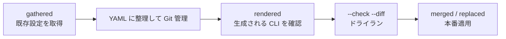

#### ベストプラクティス

- **`--check --diff` を必ず先に実行**（ドライランと差分確認）。
- 最初は `merged`、運用が成熟してから `replaced`、**`overridden` は影響範囲を理解してから**。
- パスワード等は **Ansible Vault** か CI の秘密変数で渡し、Playbook に直書きしない。出力に秘密が出るタスクは **`no_log: true`**。
- コレクションは **`requirements.yml` でバージョン固定**。
- 大規模では **`serial`** でローリング適用し、失敗時に停止（`max_fail_percentage`）。
- 変数は **group_vars / host_vars** に分離し、Source of Truth（4.6 節）から動的に生成する。
- 機器側の設定保存（`write memory` 相当）の要否を確認し、`ios_config` の `save_when` などで制御する。

#### つまずきやすい点

- `ansible_connection` と `ansible_network_os` の指定漏れ（認証前に失敗する）。
- `become`（enable パスワード）の指定漏れ。
- `network_cli` と `httpapi`（RESTCONF 用）の接続プラグインの取り違え。

---

### 3.2 【1.2】Terraform でネットワーク構成を管理する

#### 何ができるか

Terraform は **HCL** で書いた宣言から、**plan（差分計算）→ apply（適用）** でインフラを管理するツールです。Cisco 向けには **CiscoDevNet の `iosxe` プロバイダ**（RESTCONF を内部で利用）などがあります。

#### 基本構造

```hcl
terraform {
  required_providers {
    iosxe = {
      source  = "CiscoDevNet/iosxe"
      version = "x.y.z"   # 必ずバージョン制約を指定する（実際の値は公式 Registry で確認）
    }
  }
}

provider "iosxe" {
  username = var.net_user
  password = var.net_pass
  url      = "https://192.0.2.11"
}

resource "iosxe_vlan" "users" {
  vlan_id = 10
  name    = "USERS"
}
```

> リソース名・属性名はプロバイダのバージョンで変わることがあります。上記は構造を示す例であり、実装時は Registry のドキュメントで確認してください。

#### 実行サイクル

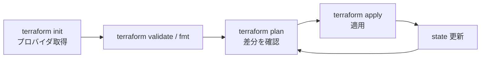

| 概念 | 説明 |
|---|---|
| State（tfstate） | 管理対象の「現在の認識」。**秘密情報が平文で入りうる** |
| Backend | state の保管先。リモート + ロック機構を使う |
| Drift | 手動変更などで state と実機がずれること。`plan` で検出 |
| `terraform import` | 既存設定を管理下に取り込む |
| Variable / `sensitive` | 変数化と出力の秘匿 |

#### Ansible と Terraform の使い分け

| 観点 | Ansible | Terraform |
|---|---|---|
| 得意領域 | 構成適用・オーケストレーション・運用タスク | 作成・変更・削除のライフサイクル管理 |
| 状態管理 | 基本は持たない（機器が真実） | **state で管理**（差分が明確） |
| 手順の記述 | 手続き + 宣言（リソースモジュール） | 完全に宣言型 |
| 向く場面 | 既存機器への変更、アドホック作業 | クラウド・コントローラ・繰り返し構築 |

#### ベストプラクティス

- **リモート backend + state ロック**、state ファイルは Git に入れない。
- `terraform plan` の出力を **CI でレビュー**（マージ前に差分を人が確認）。
- プロバイダ・Terraform 本体の **バージョン固定**。
- 認証情報は環境変数（`TF_VAR_*`）や Secrets 基盤から渡す。
- モジュール化して環境ごと（dev / prod）に変数で切り替える。

---

### 3.3 【1.3】RESTCONF（RFC 8040）で YANG モデルに基づき構成管理する

#### 位置づけ

**YANG** はデータモデルの言語、**NETCONF / RESTCONF** はそのモデルを操作するプロトコルです。RESTCONF は HTTPS 上で YANG データを **JSON/XML** で CRUD します。

| 比較 | NETCONF | RESTCONF |
|---|---|---|
| 仕様 | RFC 6241 | RFC 8040 |
| トランスポート | SSH（既定 830） | HTTPS |
| エンコード | XML | JSON / XML |
| 操作 | `get-config` `edit-config` など RPC | HTTP メソッド（GET/POST/PUT/PATCH/DELETE） |
| 特徴 | 候補データストア・コミット・ロック | REST 的で扱いやすい（トランザクション機能は限定的） |

#### HTTP メソッドと操作の対応（頻出）

| メソッド | 意味 | 備考 |
|---|---|---|
| GET | 取得 | 存在しない場合 404 |
| POST | 子リソースを**作成** | 既に存在すると 409 |
| PUT | **置換**（作成または全置換） | 冪等 |
| PATCH | **部分更新（マージ）** | 既存へ追記・変更 |
| DELETE | 削除 | 冪等 |

#### URI の読み方

`https://<host>/restconf/data/<module>:<container>/<list>=<key>`

| 部分 | 例 | 意味 |
|---|---|---|
| ルート | `/restconf/data` | 構成 + 運用データ |
| モジュール名 + コンテナ | `ietf-interfaces:interfaces` | YANG モジュールの最上位 |
| リスト + キー | `interface=Loopback100` | リストの特定要素（キーは `=`） |

ヘッダは `Accept` / `Content-Type` に **`application/yang-data+json`**（または `+xml`）を指定します。

#### IOS XE 側の有効化（例）

```text
ip http secure-server
restconf
```

（CA 署名証明書の適用は 5.5 節を参照。）

#### Python での実装例

```python
import os
import requests

HOST = "192.0.2.11"
BASE = f"https://{HOST}/restconf/data"
AUTH = (os.environ["NET_USER"], os.environ["NET_PASS"])
HEADERS = {
    "Accept": "application/yang-data+json",
    "Content-Type": "application/yang-data+json",
}
CA = "/etc/ssl/certs/corp-ca.pem"        # verify=False は使わない

body = {
    "ietf-interfaces:interface": {
        "name": "Loopback100",
        "description": "managed-by-automation",
        "type": "iana-if-type:softwareLoopback",
        "enabled": True,
        "ietf-ip:ipv4": {
            "address": [{"ip": "10.100.100.1", "netmask": "255.255.255.255"}]
        },
    }
}

# PUT = 作成または置換（冪等）
r = requests.put(
    f"{BASE}/ietf-interfaces:interfaces/interface=Loopback100",
    json=body, headers=HEADERS, auth=AUTH, verify=CA, timeout=10,
)
r.raise_for_status()
print(r.status_code)   # 201 Created または 204 No Content
```

VLAN などは **ネイティブモデル**（`Cisco-IOS-XE-native`）でも扱えます（例：`/restconf/data/Cisco-IOS-XE-native:native/vlan`）。どのモデルのどのパスかは **YANG Suite** で調べるのが確実です。

#### 主なステータスコード

| コード | 意味 | 典型的な原因 |
|---|---|---|
| 200 / 201 / 204 | 成功 / 作成 / 内容なし成功 | ― |
| 400 | 不正リクエスト | JSON 構造・型・値がモデルに違反 |
| 401 / 403 | 認証失敗 / 権限不足 | 資格情報、権限レベル |
| 404 | リソースなし | パスやキーの誤り、機能未有効 |
| 409 | 競合 | POST で既に存在 |

#### ベストプラクティス

- **YANG モデルを先に読む**（`pyang` / YANG Suite でツリー表示 → ペイロードを組み立てる）。
- 冪等にしたいなら **POST より PUT/PATCH**。
- 変更前に GET で現状取得、変更後に GET で検証する。
- **TLS 検証を有効に**（`verify=CA バンドル`）。`verify=False` を残さない。
- `timeout` を必ず指定し、一時的エラーの再試行は 3.6 節のパターンで。

---

### 3.4 【1.4】Python でネットワーク構成を管理する

#### 主要ライブラリ

| ライブラリ | 用途 | 特徴 |
|---|---|---|
| Netmiko | SSH/CLI 操作 | 機器種別ごとの癖を吸収。`send_command` / `send_config_set` |
| ncclient | NETCONF クライアント | XML で `get-config` / `edit-config` |
| requests | REST / RESTCONF | セッション・再試行・認証拡張が容易 |
| pyATS / Genie | テスト・パーサ・状態取得 | `show` を構造化データへ（5.4 節） |
| Nornir | 並列実行フレームワーク | Python で台数の多い機器へ同時実行 |
| ipaddress | 標準ライブラリ | 入力検証に有用 |

#### Netmiko の例

```python
import os
from netmiko import ConnectHandler

device = {
    "device_type": "cisco_ios",
    "host": "192.0.2.11",
    "username": os.environ["NET_USER"],
    "password": os.environ["NET_PASS"],
    "secret": os.environ["NET_ENABLE"],
}

with ConnectHandler(**device) as conn:
    conn.enable()
    output = conn.send_config_set(["vlan 10", "name USERS"])
    conn.save_config()
    print(conn.send_command("show vlan brief", use_textfsm=True))
```

#### ncclient（NETCONF）の例

```python
from ncclient import manager

with manager.connect(
    host="192.0.2.11", port=830,
    username=USER, password=PASS,
    hostkey_verify=True,                 # ホスト鍵を検証する
    device_params={"name": "iosxe"},
    timeout=30,
) as m:
    reply = m.get_config(source="running", filter=("subtree", INTERFACE_FILTER_XML))
    print(reply.xml)
```

#### ベストプラクティス

- **例外処理**：認証失敗・タイムアウト・コマンドエラーを区別して捕捉し、ログに残す。
- **関数に分割**して、テスト可能な単位（取得／検証／適用）にする。
- **冪等性**：適用前に現状を取得し、差分がある時だけ変更する。
- CLI のテキスト処理は **TextFSM / Genie パーサ**で構造化（正規表現の乱用を避ける）。
- **仮想環境（venv）+ `requirements.txt` のバージョン固定**。
- 資格情報は環境変数やシークレット管理基盤から取得する。

---

### 3.5 【1.5】自動化アプローチを選定する（IaC フレームワーク / ローコード・ノーコード / 独自アプリ）

公式出題は「**技術要件とビジネス要件**を踏まえて選べるか」を問います。

| アプローチ | 例 | 強み | 弱み | 向く条件 |
|---|---|---|---|---|
| IaC フレームワーク | Ansible、Terraform | 宣言的・再利用・レビュー可能・Git 運用 | 学習コスト、フレームワークの制約 | 標準的な構成管理、チーム運用 |
| ローコード／ノーコード | ワークフローツール、コントローラ GUI のテンプレート | 習得が早い、非開発者も使える | 複雑な分岐・高度な検証が苦手、ベンダー依存 | 小規模・迅速な導入、定型タスク |
| 独自アプリ（カスタム開発） | Python / Go のサービス | 柔軟・独自ロジック・統合しやすい | 開発・保守コスト、品質責任を自社で負う | 既製品で満たせない固有要件 |

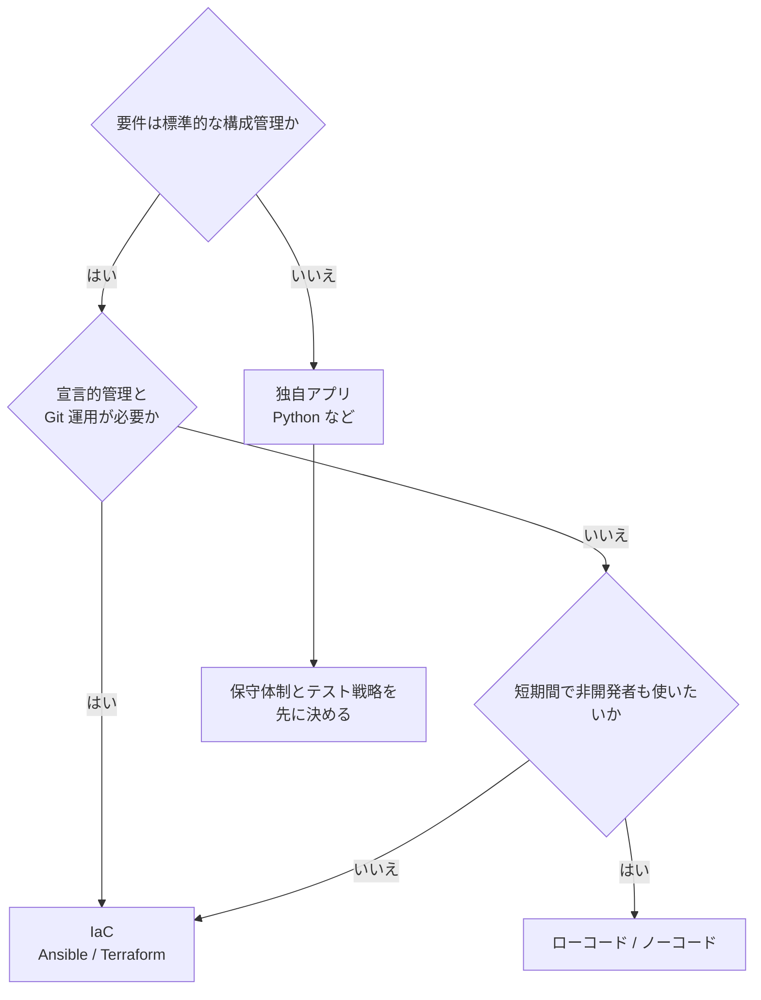

**判断軸**：スキルセット、導入期間、スケール、監査・変更管理要件、既存資産との統合、保守性、ベンダーロックイン。

---

### 3.6 【1.6】REST API を使う（ページネーション・複雑な認証・レート制限・エラー処理・持続認証）

実際のコントローラ API（Catalyst Center、Meraki、SD-WAN Manager、ISE など）を安定して使うための中核スキルです。

#### 3.6.1 ページネーション

| 方式 | 仕組み | 注意点 |
|---|---|---|
| offset / limit | `?offset=100&limit=100` | 途中で件数が変わると重複・欠落 |
| page / per_page | ページ番号指定 | 同上 |
| cursor（トークン） | レスポンスの次トークンを渡す | 最も安定。トークン有効期限に注意 |
| Link ヘッダ | `rel="next"` の URL をたどる（RFC 8288） | `requests` は `resp.links` で解析可能 |

```python
def paginate(session, url, params=None):
    """Link ヘッダの rel=next を最後までたどるジェネレータ"""
    seen = set()           # 訪問済み URL（next が循環した場合の無限ループ防止）
    while url and url not in seen:
        seen.add(url)
        resp = session.get(url, params=params, timeout=15)
        resp.raise_for_status()
        yield from resp.json()
        url = resp.links.get("next", {}).get("url")
        params = None      # 2 ページ目以降は next の URL に含まれる
```

#### 3.6.2 認証の種類と持続認証

| 方式 | 例 | ポイント |
|---|---|---|
| API キー | Meraki（ヘッダに付与） | 漏洩防止・ローテーション |
| Basic → トークン発行 | Catalyst Center（トークン取得後、`X-Auth-Token` ヘッダで利用） | **有効期限前に更新**、401 で再取得 |
| セッション + CSRF トークン | SD-WAN Manager（ログイン後、トークンを併用） | Cookie と CSRF トークンの両方を保持 |
| OAuth 2.0 | Webex など | Authorization Code / Client Credentials、リフレッシュトークン |

**持続認証（persistent authentication）** とは、毎回ログインし直さず、**トークンやセッションを再利用・更新**する設計です。`requests.Session` と「401 を受けたら 1 回だけ再認証してリトライ」を組み合わせます。

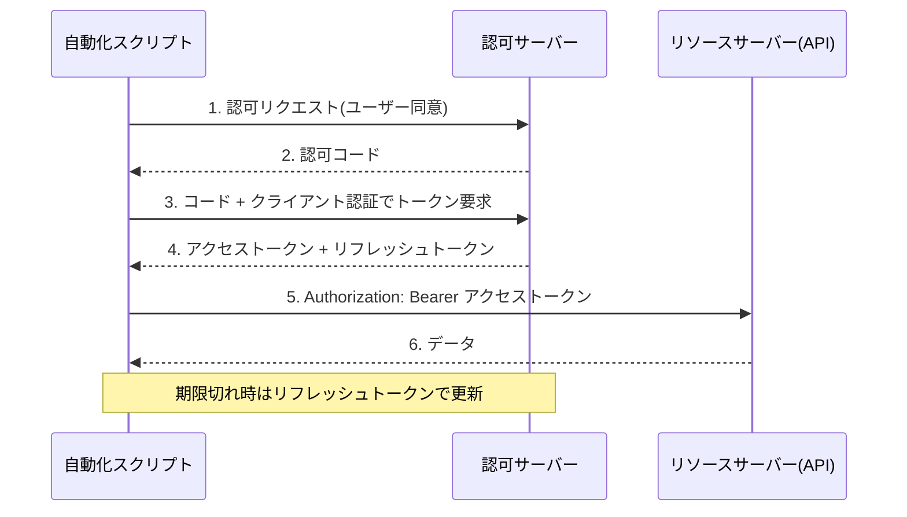

#### 3.6.3 レート制限とエラー処理

| ステータス | 意味 | 推奨される対応 |
|---|---|---|
| 429 Too Many Requests | レート制限超過 | **`Retry-After` ヘッダに従って待機**、指数バックオフ |
| 408 / 5xx（502・503・504） | 一時的障害 | 指数バックオフ + ジッタで限定回数リトライ |
| 400 / 404 / 422 | クライアント側の誤り | **リトライしない**。ログに出して修正 |
| 401 / 403 | 認証・認可 | 401 は再認証 1 回。403 はリトライしても無駄 |

```python
import os
from collections.abc import Callable

import requests
from requests.adapters import HTTPAdapter
from urllib3.util.retry import Retry


def build_session(token: str) -> requests.Session:
    retry = Retry(
        total=5,
        backoff_factor=1.0,                         # 1s, 2s, 4s ...
        status_forcelist=[429, 500, 502, 503, 504],
        allowed_methods=["GET", "PUT", "DELETE"],   # 冪等なメソッドのみ再試行
        respect_retry_after_header=True,
    )
    s = requests.Session()
    s.mount("https://", HTTPAdapter(max_retries=retry))
    s.headers.update({"Authorization": f"Bearer {token}", "Accept": "application/json"})
    s.verify = os.environ.get("CA_BUNDLE") or True  # 未設定・空文字は True（検証は常に有効）
    return s


def request_with_reauth(
    s: requests.Session, get_token: Callable[[], str], method: str, url: str, **kwargs
) -> requests.Response:
    """401 を受けたらトークンを 1 回だけ取り直してリトライする（持続認証）"""
    kwargs.setdefault("timeout", 15)
    resp = s.request(method, url, **kwargs)
    if resp.status_code != 401:
        return resp
    s.headers["Authorization"] = f"Bearer {get_token()}"   # 再認証してセッションを更新
    return s.request(method, url, **kwargs)                # リトライは 1 回だけ
```

#### ベストプラクティス

- **必ず `timeout` を指定**（接続・読み取り）。
- **冪等でない操作（POST など）は自動リトライしない**（二重作成の危険）。
- 一括処理は **並列度を制限**（レート制限に合わせる）。
- ページネーションは **全件取得を前提**に書く（最初の 1 ページだけで判断しない）。
- トークンやキーを **ログに出さない**（5.6 節のマスキング）。
- API のバージョンと非推奨（deprecation）通知を追跡する。

---

## 4. AUTOCOR ドメイン 2：Infrastructure as Code（30%）

ネットワーク構成を **コードとして管理し、テスト・配備・検証まで自動で回す**ための領域です。


---

### 4.1 【2.1】Git によるバージョン管理（merge / squash / conflict / cherry-pick / reset / checkout / revert）

#### 基本の地図：3 つの領域

| 領域 | 説明 |
|---|---|
| Working tree | 実際に編集しているファイル |
| Index（ステージ） | 次のコミットに含める内容（`git add` で入る） |
| Repository（HEAD） | コミット済みの履歴 |

#### 2.1.a ブランチのマージ（squash・コンフリクト解消を含む）

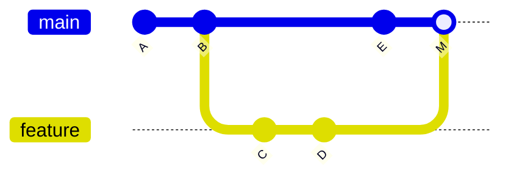

| マージ方式 | コマンド | 履歴 | 使いどころ |
|---|---|---|---|
| Fast-forward | `git merge feature`（分岐していない場合） | 直線 | 単純な取り込み |
| Merge commit | `git merge --no-ff feature` | 分岐が残る | 機能単位の履歴を残したい |
| **Squash** | `git merge --squash feature` → `git commit` | 1 コミットに圧縮 | 作業中の細かい履歴を整理して main をきれいに保つ |

**コンフリクト解消の手順**

1. `git merge` で衝突が発生 → ファイルに印が入る。

```text
<<<<<<< HEAD
vlan 10 name USERS
=======
vlan 10 name USER-NET
>>>>>>> feature
```

2. 正しい内容に**手で編集**し、印（`<<<<<<<` `=======` `>>>>>>>`）を削除する。
3. `git add <file>` でステージし、`git commit`（merge の場合）で確定。
4. 中断したいときは `git merge --abort`。

#### 2.1.b `git cherry-pick`

**特定のコミットだけ**を現在のブランチに取り込みます。ホットフィックスを複数ブランチへ反映するときに使います。

```bash
git switch release-1.2
git cherry-pick 3f2a9c1          # 指定コミットだけ適用
git cherry-pick -x 3f2a9c1       # 元コミットの ID をメッセージに記録（追跡しやすい）
```

#### 2.1.c `git reset`：ブランチの先頭を**動かす**（履歴を書き換える）

| モード | HEAD | Index | Working tree | 用途 |
|---|---|---|---|---|
| `--soft` | 移動 | 保持 | 保持 | コミットだけ取り消してやり直す |
| `--mixed`（既定） | 移動 | **戻す** | 保持 | ステージを取り消す |
| `--hard` | 移動 | 戻す | **戻す（変更が消える）** | 完全に巻き戻す（危険） |

#### 2.1.d `git checkout`

- ブランチ切替：`git checkout <branch>`（現在は **`git switch <branch>`** が推奨）。
- ファイル復元：`git checkout -- <file>`（現在は **`git restore <file>`** が推奨）。
- 過去の状態の確認：`git checkout <commit>`（**detached HEAD** になる点に注意）。

#### 2.1.e `git revert`：取り消し用の**新しいコミット**を作る（履歴は書き換えない）

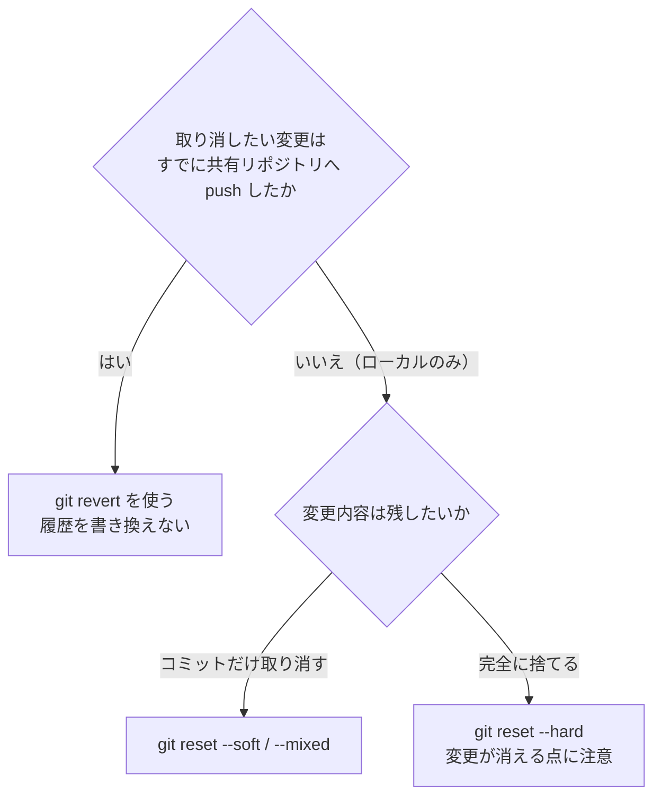

#### ベストプラクティス

- **共有ブランチでは `reset --hard` や force push を使わない**。やむを得ない場合は `--force-with-lease`。
- 取り消しは **`revert`**、ローカル整理は **`reset` / `rebase`**。
- **main を保護ブランチ**にし、レビュー済みの MR のみマージ。
- **小さく頻繁にコミット**し、メッセージは目的が分かる形に（例：Conventional Commits）。
- 秘密情報をコミットしてしまったら、**履歴削除より先に鍵の失効・再発行**を行う。
- `.gitignore` に秘密情報・state・生成物を入れる。

---

### 4.2 【2.2】GitLab CE の CI/CD パイプライン失敗を診断する

出題例：**依存関係の欠落、コンポーネントのバージョン不整合、テスト失敗**。

| 症状（ジョブログ） | 典型原因 | 対処 |
|---|---|---|
| `ModuleNotFoundError` / `command not found` | 依存パッケージ・ツールが未インストール | `requirements.txt` / イメージに追加、`ansible-galaxy collection install` を追加 |
| 「collection requires ansible-core >= x」「互換性のないバージョン」 | ツール・コレクション・Python のバージョン不一致 | **バージョンを固定**し、同じイメージでローカル再現 |
| テストの assertion 失敗 | コード／期待値の不一致、環境差 | 失敗テストのログ・差分を読み、ローカルで再実行 |
| 認証エラー（401 / SSH 失敗） | CI 変数の未設定、protected 変数が非保護ブランチで使えない | 変数のスコープ（protected / masked）を確認 |
| ランナー選択エラー（stuck） | タグ不一致、ランナー停止 | ジョブの `tags` と Runner を確認 |

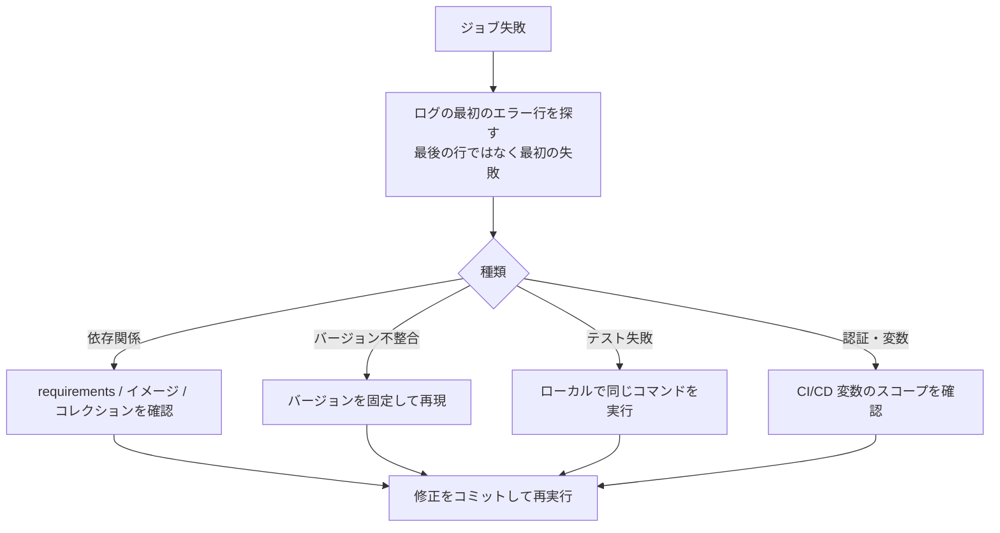

**ベストプラクティス**：**同じコンテナイメージをローカルでも使って再現**する／ログの**最初のエラー**から読む／イメージタグは `latest` を避け固定する／`pip` / `ansible-galaxy` のキャッシュを活用して再現性と速度を両立する。

---

### 4.3 【2.3】GitLab CE で配備パイプラインを構築する（build / prevalidation / deploy / post-validation）

#### 4 ステージの役割

| ステージ | 目的 | 具体例 |
|---|---|---|
| **build** | 実行環境と成果物を用意 | 依存インストール、lint（yamllint / ansible-lint）、テンプレートのレンダリング |
| **prevalidation** | 変更前に**安全性を確認** | `--check --diff`、CML 上のテスト、変更前スナップショット取得 |
| **deploy** | 実環境へ適用 | Playbook 実行 / `terraform apply` |
| **post-validation** | 変更後に**正しさを確認** | 変更後スナップショットと比較、疎通テスト |

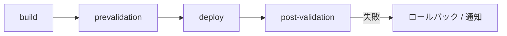

#### `.gitlab-ci.yml` の例

```yaml
stages: [build, prevalidation, deploy, post-validation]

default:
  image: python:3.12-slim      # タグは固定する（latest にしない）
  before_script:
    - pip install --no-cache-dir -r requirements.txt

variables:
  ANSIBLE_FORCE_COLOR: "1"

build:
  stage: build
  script:
    - yamllint .
    - ansible-lint site.yml
    - ansible-galaxy collection install -r collections/requirements.yml

prevalidation:
  stage: prevalidation
  script:
    - ansible-playbook -i inventory.yml site.yml --check --diff
    - pyats learn ospf interface --testbed-file testbed.yaml --output snapshots/pre
  artifacts:
    paths: [snapshots/pre]
    expire_in: 1 week

deploy:
  stage: deploy
  script:
    - ansible-playbook -i inventory.yml site.yml
  rules:
    - if: $CI_COMMIT_BRANCH == $CI_DEFAULT_BRANCH
  environment: production
  resource_group: production        # 同時デプロイを防ぐ

post-validation:
  stage: post-validation
  script:
    - pyats learn ospf interface --testbed-file testbed.yaml --output snapshots/post
    - pyats diff snapshots/pre snapshots/post
  rules:
    - if: $CI_COMMIT_BRANCH == $CI_DEFAULT_BRANCH
```

> 認証情報は **Settings → CI/CD → Variables** に登録し、**Masked**（ログで伏せ字）と **Protected**（保護ブランチのみ）を有効にします。`.gitlab-ci.yml` に直書きしません。

#### ベストプラクティス

- **MR パイプライン（レビュー時）と main パイプライン（配備時）を分ける**（`rules:`）。
- 本番デプロイには **手動承認（`when: manual`）** や `environment` の保護を併用。
- **`resource_group`** で同一環境への同時デプロイを防ぐ。
- アーティファクトに **変更前後のスナップショット**を残し、監査証跡にする。
- ランナーは**最小権限**、本番機器への到達性を持つランナーは限定する。

---

### 4.4 【2.4】Cisco Modeling Labs（CML）でネットワークをシミュレーションする

#### CML とは

実機の OS イメージ（IOS XE、NX-OS など）を使って**仮想トポロジを作成・起動できるシミュレータ**です。**本番に触れずに自動化コードをテスト**できます。

#### 自動化との接続：REST API / `virl2_client`

```python
import os
from virl2_client import ClientLibrary

client = ClientLibrary(
    "https://cml.example.com",
    os.environ["CML_USER"], os.environ["CML_PASS"],
    ssl_verify="/etc/ssl/certs/corp-ca.pem",
)

lab = client.import_lab_from_path("topology.yaml", title="ci-test")
try:
    lab.start()                        # ノードを起動（収束を待つ）
    # ここで Ansible / pyATS などのテストを実行
finally:
    lab.stop()
    lab.wipe()
    lab.remove()                       # テスト後は必ず後始末する
```

（メソッドの細部は `virl2_client` のバージョンで異なる場合があるため、公式ドキュメントで確認してください。）

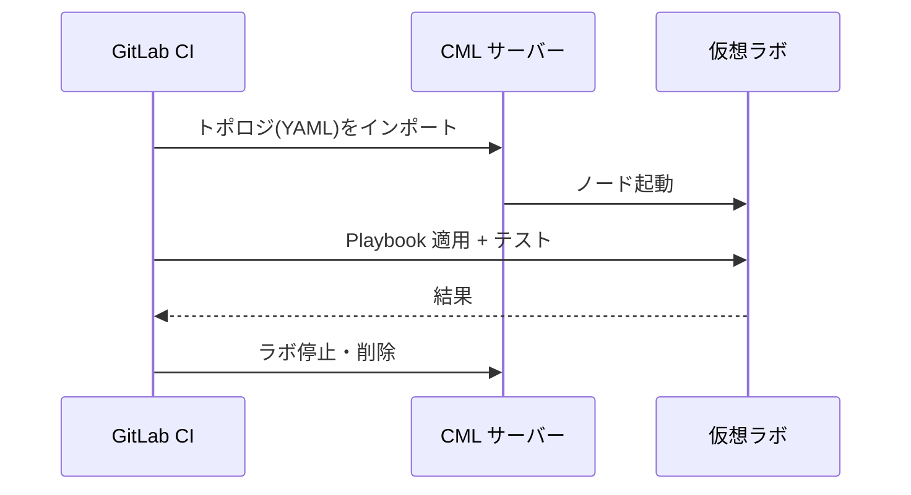

#### ベストプラクティス

- **トポロジを YAML でコード化して Git 管理**（誰でも同じ検証環境を再現）。
- **パイプラインごとにラボを作り、終わったら破棄**（状態が混ざらない）。
- 本番に近い **OS バージョン**でテストする。
- ノードのリソース消費が大きいため、**最小構成**で検証する。

---

### 4.5 【2.5】Docker Compose ファイルを読み解く（services / networks / volumes / links）

#### 主要キーの意味

| キー | 意味 |
|---|---|
| `services` | 起動するコンテナの定義（イメージ、コマンド、環境変数など） |
| `networks` | コンテナ間のネットワーク。同じネットワーク上ではサービス名で名前解決できる |
| `volumes` | データの永続化・ホストとの共有 |
| `ports` | ホストへ公開するポート（`ホスト:コンテナ`） |
| `depends_on` | 起動順序（`condition: service_healthy` でヘルスチェック待ち） |
| `environment` / `env_file` | 環境変数（秘密情報は直書きしない） |
| `links` | **旧方式**のコンテナ接続。現在は共通 `networks` で十分で、非推奨扱い |

#### 読み取り練習

```yaml
services:
  runner:
    build: ./runner
    environment:
      - NET_USER                    # ホストの環境変数を引き継ぐ（値を書かない）
      - NET_PASS
    volumes:
      - ./playbooks:/work/playbooks:ro   # ホストのコードを読み取り専用で共有
      - artifacts:/work/out              # 名前付きボリューム（永続化）
    networks: [backend]
    depends_on:
      db:
        condition: service_healthy
  db:
    image: postgres:16
    environment:
      POSTGRES_PASSWORD_FILE: /run/secrets/db_pass
    secrets:
      - db_pass                     # /run/secrets/db_pass としてマウントされる
    volumes:
      - dbdata:/var/lib/postgresql/data
    networks: [backend]
    healthcheck:
      test: ["CMD-SHELL", "pg_isready -U postgres"]
      interval: 10s
      retries: 5

networks:
  backend: {}

volumes:
  artifacts: {}
  dbdata: {}

secrets:
  db_pass:
    file: ./secrets/db_pass.txt     # Git 管理外のファイルから読み込む
```

読み方：`runner` と `db` は同じ `backend` ネットワーク上にあり、`runner` から `db:5432` で接続できる。`db` が healthy になってから `runner` が起動する。データは `dbdata` ボリュームに残る。

#### ベストプラクティス

- **イメージのタグを固定**（`latest` 禁止）。
- **秘密情報は `secrets` / 環境変数 / `.env`（Git 管理外）** で渡す。
- 不要なポートを公開しない。ボリュームは可能なら `:ro`。
- ネットワークを用途別に分け、**必要なサービス間だけ**接続する。
- 最新の Compose 仕様では `version:` キーは不要（廃止扱い）。

---

### 4.6 【2.6】Source of Truth（SoT）を自動化ソリューションに統合する

#### SoT とは

ネットワークの**「あるべき姿」を一元管理する信頼できる唯一の情報源**です（デバイス、IP、VLAN、サイト、接続関係など）。代表例は **NetBox** や **Nautobot**。

| 項目 | 設定ファイル（Playbook）を真実とする | SoT を真実とする |
|---|---|---|
| 真実の所在 | 各 Playbook に分散 | データベース 1 か所 |
| 重複 | 起きやすい | 起きにくい |
| 他システム連携 | 個別実装 | API で統一 |

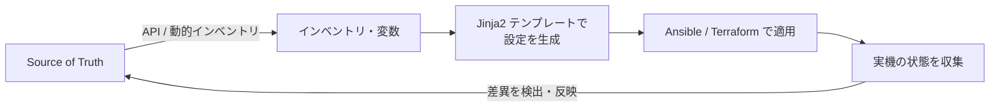

#### Python（pynetbox）の例

```python
import os
import pynetbox

nb = pynetbox.api(os.environ["NETBOX_URL"], token=os.environ["NETBOX_TOKEN"])

for dev in nb.dcim.devices.filter(site="tokyo", role="access-switch"):
    print(dev.name, dev.primary_ip4)
```

Ansible では **NetBox 動的インベントリプラグイン**（`netbox.netbox.nb_inventory`）でインベントリを自動生成できます。

#### ベストプラクティス

- **SoT を変更起点にする**（機器を先に手で変えない）。
- SoT のデータを**検証してから**配備に使う（入力検証）。
- **ドリフト検出**：実機と SoT の差を定期的に比べて通知する。
- SoT の API トークンは**読み取り専用**など最小権限に。

---

### 4.7 【2.7】YANG データモデルから YAML / JSON のネットワーク構成を作る

#### YANG の基本要素

| 要素 | 意味 | 例 |
|---|---|---|
| `module` | 最上位の単位 | `ietf-interfaces` |
| `container` | 他の要素をまとめる入れ物 | `interfaces` |
| `list` + `key` | 複数インスタンス（キーで識別） | `interface`（key は `name`） |
| `leaf` | 単一の値 | `enabled`（boolean） |
| `leaf-list` | 値の配列 | 複数の DNS サーバーなど |
| `type` / `range` / `length` | 値の制約 | `uint16 { range "1..4094"; }` |
| `config true/false` | 設定可能(rw) / 運用状態(ro) | 運用状態は読み取り専用 |

#### YANG の例

```yang
module example-vlan {
  namespace "urn:example:vlan";
  prefix ex;

  container vlans {
    list vlan {
      key "id";
      leaf id      { type uint16 { range "1..4094"; } }
      leaf name    { type string { length "1..32"; } }
      leaf enabled { type boolean; default true; }
    }
  }
}
```

#### JSON エンコード（RFC 7951）のルール

| ルール | 内容 |
|---|---|
| 最上位は `モジュール名:要素名` | `"example-vlan:vlans"` |
| 別モジュールの要素に入るときは再度プレフィックス | `"ietf-ip:ipv4"` |
| `list` は JSON 配列 | `"vlan": [ {...}, {...} ]` |
| 値の型を守る | 数値は数値、真偽値は `true/false` |

```json
{
  "example-vlan:vlans": {
    "vlan": [
      { "id": 10, "name": "USERS",   "enabled": true },
      { "id": 20, "name": "SERVERS", "enabled": true }
    ]
  }
}
```

同じ内容を **Ansible 変数用の YAML** で表すと次のとおりです。

```yaml
vlans:
  - { id: 10, name: USERS,   enabled: true }
  - { id: 20, name: SERVERS, enabled: true }
```

#### YANG ツリー（RFC 8340）の読み方

`pyang -f tree` などで出る簡易表記です。記号の意味を覚えておくと、ペイロード作成が速くなります。

| 記号 | 意味 |
|---|---|
| `rw` / `ro` | 設定可能 / 読み取り専用 |
| `?` | 省略可能（optional） |
| `*` | リストまたは leaf-list（複数） |
| `[key]` | リストのキー |
| `:` 付きの名前 | 別モジュールから拡張された要素（`ietf-ip:ipv4`） |

#### ベストプラクティス

- **YANG Suite や `pyang` でモデルを確認 → ペイロード作成**（推測で書かない）。
- 作成した JSON/XML は **モデルに対して検証**してから送る。
- 型・範囲・必須キーの違反は 400 エラーの典型原因。

---

## 5. AUTOCOR ドメイン 3：Operations（20%）

作った自動化を **見える化し、変更を検証し、安全に運用する**ための領域です。

---

### 5.1 【3.1】Model-Driven Telemetry（MDT）を構成する

#### MDT とは

YANG モデルで定義されたデータを、**機器から収集基盤へ継続的に送る**仕組みです。SNMP のような「問い合わせ（ポーリング）」ではなく、**購読（Subscription）による配信（ストリーミング）** が中心です。

| 比較 | SNMP | モデル駆動テレメトリ |
|---|---|---|
| 取得方式 | ポーリング（Pull） | ストリーミング（Push）／購読 |
| データ形式 | MIB（OID） | YANG モデル（XPath で指定） |
| 粒度・鮮度 | 数十秒〜分単位が一般的 | 秒単位や変化時のみ（on-change） |
| 負荷 | ポーリングが集中しやすい | 必要なデータだけ配信 |
| エンコード | BER | JSON / kvGPB（Protobuf）など |

#### アーキテクチャ


#### 接続方式（重要）

| 方式 | 開始する側 | 特徴 |
|---|---|---|
| **Dial-out** | **機器 → コレクタ** | 機器側で購読を設定。NAT/FW 越えが容易、スケールしやすい |
| **Dial-in** | **コレクタ → 機器** | コレクタが購読を動的に作成（gNMI / NETCONF）。購読はセッション単位 |

| 更新ポリシー | 内容 | 使いどころ |
|---|---|---|
| Periodic | 一定間隔で送る | 統計値（カウンタ、使用率） |
| On-change | 値が変化した時だけ送る | 状態（リンクアップ/ダウン） |

#### IOS XE の Dial-out 設定例（概念を理解するための例）

```text
crypto pki trustpoint COLLECTOR-CA     ! コレクタのサーバー証明書を検証する CA
 enrollment terminal
!
crypto pki authenticate COLLECTOR-CA   ! CA 証明書（PEM）を貼り付けて登録
!
telemetry ietf subscription 101
 encoding encode-kvgpb
 filter xpath /interfaces-ios-xe-oper:interfaces/interface/statistics
 source-address 192.0.2.11
 stream yang-push
 update-policy periodic 1000
 receiver ip address 192.0.2.100 57500 protocol grpc-tls profile COLLECTOR-CA
```

- `filter xpath`：**どのデータを購読するか**（YANG の XPath）。
- `update-policy periodic 1000`：周期（単位は 1/100 秒＝10 秒）。
- `receiver`：送信先コレクタのアドレスとポート。`grpc-tls` と `profile`（上で作成したトラストポイント名）で **TLS 暗号化とコレクタ証明書の検証** を行う。`protocol grpc-tcp` は **平文（暗号化なし）** のため、閉じたラボ環境以外では使わない。

#### ベストプラクティス

- **必要な XPath だけ**を購読し、頻度を適切にする（収集・保存コストが跳ね上がる）。
- 状態は **on-change**、カウンタは **periodic** と使い分ける。
- gRPC は **TLS を有効化**して通信を保護する。
- 収集後の **保持期間・ダウンサンプリング**を設計する。
- 購読が確立しているか（状態確認）を監視に含める。
- YANG のモデル名・パスは機器の OS バージョンで異なるため **YANG Suite 等で確認**する。

---

### 5.2 【3.2】Python でログを実装する（外部 syslog への送信・Webhook による通知）

#### 設計の考え方

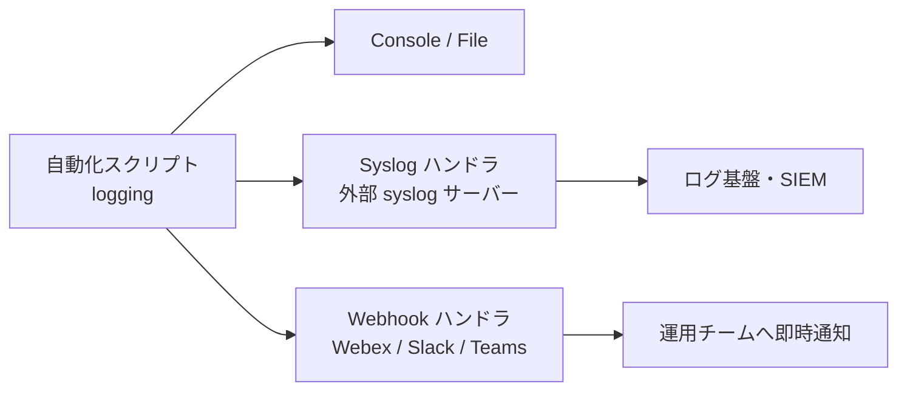

| ログレベル | 目的 | 例 |
|---|---|---|
| DEBUG | 開発時の詳細 | リクエスト/レスポンスの概要（秘密は除く） |
| INFO | 正常な処理の記録 | 「sw01 に VLAN 10 を適用」 |
| WARNING | 注意が必要 | 「再試行 2 回目」 |
| ERROR | 失敗 | 「sw02 の適用に失敗」 |
| CRITICAL | 重大・継続不能 | 「認証基盤が応答しない」 |

#### 実装例

```python
import json
import logging
import logging.handlers
import os
import requests


class WebhookHandler(logging.Handler):
    """ERROR 以上を Webhook（チャット）へ通知する"""

    def __init__(self, url: str):
        super().__init__(level=logging.ERROR)
        self.url = url

    def emit(self, record: logging.LogRecord) -> None:
        try:
            requests.post(
                self.url,
                json={"text": f"[{record.levelname}] {record.getMessage()}"},
                timeout=5,
            )
        except Exception:
            self.handleError(record)       # 通知失敗で本処理を止めない


logger = logging.getLogger("netauto")
logger.setLevel(logging.INFO)

fmt = logging.Formatter("%(asctime)s %(name)s %(levelname)s %(message)s")

syslog = logging.handlers.SysLogHandler(
    address=("syslog.example.com", 514),
    facility=logging.handlers.SysLogHandler.LOG_LOCAL6,
)
syslog.setFormatter(fmt)
logger.addHandler(syslog)
logger.addHandler(WebhookHandler(os.environ["ALERT_WEBHOOK_URL"]))

logger.info(json.dumps({"event": "deploy_start", "device": "sw01", "change_id": "CHG-1234"}))
```

#### ベストプラクティス

- **構造化ログ（JSON）** にして、機器名・変更 ID・実行者などの **相関 ID** を入れる（検索・集計が容易）。
- **秘密情報（パスワード、トークン、SNMP コミュニティ）は絶対にログに出さない**（マスキング）。
- 通知は **ERROR 以上に限定**し、通知疲れを防ぐ。通知失敗で本処理を止めない。
- Webhook の URL 自体が秘密情報。環境変数／シークレット管理で渡す。
- syslog は UDP だと欠落しうる。重要ログは **TCP/TLS** や信頼性のある経路を検討する。
- 例外は `logger.exception()` で **スタックトレースごと**記録する。

---

### 5.3 【3.3】ログから問題を診断する

出題では、スクリプトやパイプラインのログ・エラーを**解釈して原因を特定**します。

#### よくあるエラーと読み方

| ログ上の症状 | 意味 | 確認ポイント |
|---|---|---|
| HTTP 400 / `invalid-value` / `bad-element` | データがモデルに合わない | YANG の型・範囲・必須キー、JSON 構造 |
| HTTP 401 | 認証失敗 | 資格情報、トークン期限切れ |
| HTTP 403 | 権限不足 | ユーザーの権限レベル、API ロール |
| HTTP 404 | パス／リソースなし | URL、キー、機能の有効化（`restconf` 等） |
| HTTP 409 | 競合 | POST で既に存在 → PUT/PATCH に |
| HTTP 429 | レート制限 | `Retry-After`、並列度 |
| `SSLCertVerificationError` | 証明書検証失敗 | 証明書チェーン、CN/SAN、時刻、CA バンドル |
| SSH の認証/タイムアウト | 到達性・資格情報・ホスト鍵 | ACL、VRF、`enable` パスワード |
| `ReadTimeout` | 応答遅延 | 機器負荷、`timeout` 値、ネットワーク |

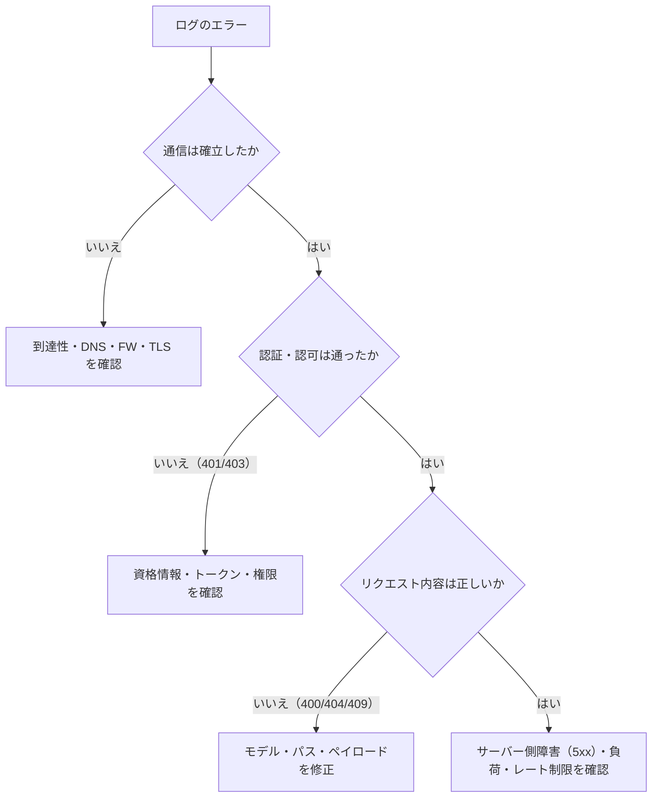

**診断のコツ**
1. **最初に出たエラー**を探す（後続は連鎖の可能性）。
2. **OSI 層の下から上へ**（到達性 → TLS → 認証 → リクエスト内容）。
3. 同じリクエストを **curl / Postman で最小再現**する。
4. 変更前後の差を比べる（直近のコミット・環境変更）。

---

### 5.4 【3.4】pyATS で変更を検証する

#### pyATS / Genie とは

Cisco 提供の **テスト自動化フレームワーク（pyATS）** と、機器の **状態の取得・パース・比較ライブラリ（Genie）**。変更前後の状態を構造化データで取得し、**差分で評価**できます。

#### testbed.yaml の例

```yaml
testbed:
  name: lab
  credentials:
    default:
      username: "%ENV{NET_USER}"      # 環境変数から読む（直書きしない）
      password: "%ENV{NET_PASS}"

devices:
  sw01:
    os: iosxe
    type: switch
    connections:
      cli:
        protocol: ssh
        ip: 192.0.2.11
```

#### 変更前後の検証フロー

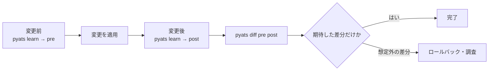

```bash
pyats learn ospf interface --testbed-file testbed.yaml --output snapshots/pre
# --- 変更を適用 ---
pyats learn ospf interface --testbed-file testbed.yaml --output snapshots/post
pyats diff snapshots/pre snapshots/post
pyats parse "show ip route" --testbed-file testbed.yaml     # 1 コマンドを構造化して取得
```

| 機能 | 用途 |
|---|---|
| `learn` | 機能単位（ospf、interface など）で状態を取得 |
| `parse` | 個別 `show` コマンドを構造化データに |
| `diff` | 2 つのスナップショットの差分表示 |
| `run job` | テストスクリプトをジョブとして実行し、結果をレポート化 |

#### ベストプラクティス

- 「**期待する変更だけが起きた**こと」と「**無関係な部分が壊れていない**こと」を両方確認。
- 変更前スナップショットを **アーティファクトとして保存**（監査・ロールバックの根拠）。
- 収束に時間がかかる機能（OSPF/BGP）は、**収束待ち（リトライ・待機）**を入れてから比較。
- テストを **CI の post-validation ステージ**に組み込む。

---

### 5.5 【3.5】CA 署名付き TLS 証明書を取得し、Cisco 製品に適用する

#### なぜ自己署名ではなく CA 署名か

自己署名証明書は**既定ではクライアントに信頼されず**、警告を無視する運用（`verify=False`）を招きがちです（クライアントに明示的にインストールするなどしてトラストアンカーとして設定すれば検証は可能ですが、配布・更新・失効の管理が個別作業になります）。**信頼された CA（社内 CA を含む）の署名**があれば、中間者攻撃を防ぎつつ検証を有効にできます。

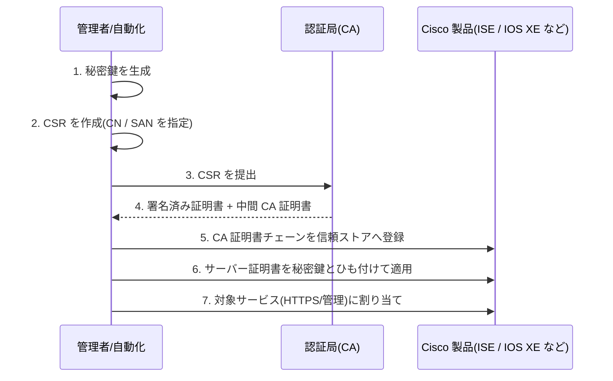

#### 鍵と CSR の作成例（OpenSSL）

```bash
# 秘密鍵（漏洩させない。権限 600）
openssl genrsa -out sw01.key 2048
chmod 600 sw01.key

# CSR（SAN に FQDN と IP を入れる）
openssl req -new -key sw01.key -out sw01.csr \
  -subj "/C=JP/O=Example/CN=sw01.example.com" \
  -addext "subjectAltName=DNS:sw01.example.com,IP:192.0.2.11"

# 内容確認
openssl req -in sw01.csr -noout -text
```

| 用語 | 意味 |
|---|---|
| 秘密鍵 | 証明書とセットで使う。**外部に出さない** |
| CSR | 証明書署名要求。公開鍵とサブジェクト情報を含む |
| SAN | Subject Alternative Name。**現在のクライアントは CN ではなく SAN を検証**する |
| 中間 CA / チェーン | ルート CA → 中間 CA → サーバー証明書の信頼の連鎖。**チェーン不足**は検証失敗の典型原因 |

#### IOS XE での適用イメージ（概念）

`crypto pki trustpoint` を作成 → CA 証明書の認証 → サーバー証明書のインポート → `ip http secure-trustpoint <名前>` で HTTPS サーバー（RESTCONF など）に割り当て。ISE 等は管理 GUI で「Trusted Certificates に CA を追加 → システム証明書をバインドし、用途（Admin など）を指定」します。具体的な操作は製品・バージョンで異なるため、各製品ガイドで確認してください。

#### 自動化クライアント側

```python
requests.get(url, verify="/etc/ssl/certs/corp-ca-chain.pem", timeout=10)   # 社内 CA チェーンを指定
```

#### ベストプラクティス

- **SAN を正しく設定**（FQDN / IP）。
- **秘密鍵は安全な場所に保管**し、CSR は機器内生成を優先できるなら優先する。
- **有効期限を監視**し、更新を自動化（ACME 対応 CA、社内 PKI の自動発行）。
- 鍵長（RSA 2048 以上、または ECDSA）と署名アルゴリズムは社内ポリシーに合わせる。
- **`verify=False` や `-k` を本番コードに残さない**。

---

### 5.6 【3.6】セキュアなアプリケーション／自動化コードを書く

#### 脅威と対策の対応表

| 脅威 | 具体例 | 対策 |
|---|---|---|
| 入力検証の不足 | 不正な IP・VLAN ID・ホスト名が機器へ流れる | **許可リスト方式**で検証（`ipaddress`、範囲チェック、スキーマ検証） |
| インジェクション | ユーザー入力を CLI/シェルへ文字列連結 | テンプレート + 検証済み変数、`subprocess` は `shell=False` |
| 認証情報の漏洩 | コード・Git・ログへの埋め込み | 環境変数 / Vault / CI 秘密変数、`no_log`、シークレットスキャン |
| 通信の傍受 | `verify=False`、平文プロトコル | TLS 検証、SSH ホスト鍵検証 |
| 権限過剰 | 管理者権限のトークンを常用 | **最小権限**、読み取り専用アカウントの分離 |
| 脆弱な依存関係 | 古いライブラリ | バージョン固定 + 脆弱性スキャン（`pip-audit` など） |
| 情報の過剰出力 | エラー詳細に機密が混入 | 出力のマスキング、ログレベル管理 |

#### 悪い例と良い例

```python
# 悪い例：入力をそのまま CLI に連結 / 認証情報を直書き / 検証無効
vlan = input("VLAN ID: ")
conn.send_config_set([f"vlan {vlan}"])
requests.get(url, auth=("admin", "Cisco123"), verify=False)
```

```python
# 良い例：検証・環境変数・TLS 検証
import ipaddress
import os
import requests


def validate_vlan(value: str) -> int:
    vlan = int(value)                      # 数値でなければ ValueError
    if not 1 <= vlan <= 4094:
        raise ValueError("VLAN ID は 1〜4094")
    return vlan


def validate_ip(value: str) -> str:
    return str(ipaddress.ip_address(value))  # 不正なら ValueError


vlan = validate_vlan(user_input)
requests.get(
    url,
    auth=(os.environ["NET_USER"], os.environ["NET_PASS"]),
    verify=os.environ.get("CA_BUNDLE") or True,   # 空文字で検証が無効にならないよう True にフォールバック
    timeout=10,
)
```

#### ベストプラクティス（運用に組み込む）

- **pre-commit** に `gitleaks` 等のシークレット検出を入れる。
- 依存ライブラリは定期的に更新・監査（CI で `pip-audit`）。
- **OWASP Top 10 / Cheat Sheet Series** を設計レビューの基準にする。
- 変更系の API には **承認フロー**（人のレビュー）を挟む。
- 監査のため、**誰が・いつ・何を変更したか**を記録する。

---

## 6. AUTOCOR ドメイン 4：AI in Automation（20%）

v2.0 で新設された領域です。**AI をネットワーク自動化に安全に取り入れる**ための知識を問います。


---

### 6.1 【4.1】AI 支援コード生成のメリットとリスク

| 観点 | メリット | リスク | 対策 |
|---|---|---|---|
| 生産性 | ひな形・テスト・ドキュメントを速く作れる | 理解せず採用すると保守不能に | **自分で説明できるコードだけ採用** |
| 正確性 | 構文・定型処理に強い | **存在しないモジュールや属性（ハルシネーション）**、古い API | lint / 単体テスト / CML 上で検証 |
| データ保護 | ― | 設定・ログ・顧客情報を外部サービスへ送信してしまう | 秘密情報・個人情報を**入力しない**、社内承認済みサービスを使う |
| 知的財産 | ― | 生成物のライセンス・著作権、出所不明のコード混入 | 利用規約・社内ポリシーの確認、ライセンススキャン |
| セキュリティ | 安全なパターンを提案することも | 脆弱なコード（検証なし・ハードコード）を提案することも | セキュアコーディング基準でレビュー（5.6 節） |
| 責任 | ― | AI の出力でも**責任は人にある** | レビュー・承認フローを必須化 |

**ベストプラクティス**
- プロンプトに **ホスト名・IP・資格情報・顧客名**を含めない（ダミーに置換）。
- 生成コードは **差分レビュー → 静的解析 → テスト → CML 検証 → 本番**の通常フローに乗せる。
- 参照させるドキュメント・バージョンを明示する（古い API を避ける）。
- 生成の経緯（使ったツール、プロンプトの要点）をコミットメッセージや PR に記録できる体制にする。

---

### 6.2 【4.2】AI ベース自動化のセキュリティリスクと軽減策

AI エージェントが**ツール（API 実行）を持つ**と、従来のアプリより攻撃面が広がります。OWASP の **Top 10 for LLM Applications** が体系的な整理として有用です。

| リスク | 内容（ネットワーク自動化での例） | 軽減策 |
|---|---|---|
| **プロンプトインジェクション** | 機器の description・ログ・チケット本文に埋め込まれた指示を AI が実行してしまう（間接インジェクション） | 外部データは**指示ではなくデータ**として扱う、ツールは**許可リスト**、重要操作は人が承認 |
| **過剰な権限（Excessive Agency）** | 読み取りのつもりが、設定変更・削除ができるツールを持たせてしまう | **最小権限**、**読み取り専用ツールから開始**、変更系は別ツールに分離して承認制 |
| 不適切な出力の取り扱い | AI が生成したコマンドをそのまま機器へ流す | 出力を**検証（スキーマ・許可リスト）** してから実行 |
| 機密情報の漏洩 | プロンプトやツール結果に資格情報・設定が含まれ、外部へ送られる | 送信前のマスキング、**ツール結果から秘密を除去**、ローカル LLM の検討 |
| サプライチェーン | 信頼できない MCP サーバー・プラグインの導入 | 提供元の確認、バージョン固定、**サンドボックスで検証** |
| 過信（誤情報） | もっともらしい誤答で誤った変更判断 | 根拠データの併記、**人による最終確認** |

```mermaid
flowchart TD
  IN["ユーザー入力 / 外部データ"] --> V["入力の検証・サニタイズ"]
  V --> LLM["LLM"]
  LLM --> OUT["提案されたツール呼び出し"]
  OUT --> P{"許可リストに合致するか"}
  P -->|"いいえ"| BLK["拒否・ログ記録"]
  P -->|"はい"| W{"変更系の操作か"}
  W -->|"はい"| HA["人の承認"]
  W -->|"いいえ（読み取り）"| EXE["実行"]
  HA --> EXE
  EXE --> LOG["監査ログ"]
```

**設計原則**：読み取りと書き込みを分離／最小権限／入出力検証／人間の承認（Human-in-the-Loop）／監査ログ。

---

### 6.3 【4.3】MCP サーバーを構築して、自動化ツールを AI に公開する

#### MCP（Model Context Protocol）とは

AI アプリ（クライアント）が**外部のツールやデータに接続するためのオープンな標準プロトコル**です。MCP サーバーが機能を公開します。

| 概念 | 意味 | 例 |
|---|---|---|
| **Tools** | AI が呼び出せる関数（アクション） | `get_interface_status` |
| **Resources** | 読み取り用のデータ | インベントリ一覧 |
| **Prompts** | 再利用できるプロンプトテンプレート | 「障害切り分けの手順」 |
| Transport | 通信方式 | ローカル `stdio`、リモート HTTP（Streamable HTTP） |

```mermaid
sequenceDiagram
  participant U as ユーザー
  participant H as AI アプリ(MCP クライアント)
  participant L as LLM
  participant S as MCP サーバー
  participant N as ネットワーク(Catalyst Center / 機器)
  U->>H: sw01 のインターフェース状態を教えて
  H->>L: 質問 + 利用可能なツール一覧
  L-->>H: ツール呼び出しを提案(get_interface_status)
  H->>S: ツール実行リクエスト
  S->>N: REST API / RESTCONF で取得(読み取り専用)
  N-->>S: データ
  S-->>H: 結果
  H->>L: ツール結果を渡す
  L-->>U: 自然言語で回答
```

#### Python（FastMCP）での実装例

```python
import os
import requests
from fastmcp import FastMCP

mcp = FastMCP("Network Info (read-only)")

ALLOWED_HOSTS = {"sw01", "sw02"}          # 許可リスト（SoT から生成してもよい）
CA = os.environ.get("CA_BUNDLE") or True   # 空文字で検証が無効にならないよう True にフォールバック


@mcp.tool
def get_interface_status(hostname: str) -> dict:
    """指定ホストのインターフェース状態を返す（読み取り専用）。"""
    if hostname not in ALLOWED_HOSTS:
        raise ValueError("許可されていないホストです")
    r = requests.get(
        f"https://{hostname}.example.com/restconf/data/ietf-interfaces:interfaces-state",
        auth=(os.environ["NET_RO_USER"], os.environ["NET_RO_PASS"]),   # 読み取り専用アカウント
        headers={"Accept": "application/yang-data+json"},
        verify=CA, timeout=10,
    )
    r.raise_for_status()
    return r.json()


@mcp.resource("inventory://devices")
def list_devices() -> list[str]:
    """管理対象機器の一覧"""
    return sorted(ALLOWED_HOSTS)


if __name__ == "__main__":
    mcp.run()          # 既定は stdio。リモート公開は mcp.run(transport="http", host=..., port=...)
```

> 上記は構造理解用の例です。FastMCP のバージョンで API が変わる場合があるため、公式ドキュメントで確認してください。

#### ベストプラクティス

- **最初は読み取り専用ツールだけ**を公開し、変更系は別サーバー／別承認フローにする。
- ツール名・docstring・引数型を**明確に**書く（LLM が正しく選べる）。
- 引数は**検証**（許可リスト、型、範囲）。**任意コマンド実行ツールは作らない**。
- 認証情報は環境変数／Secrets から。ツールの戻り値に**秘密を含めない**。
- リモート公開時は **TLS + 認証**。誰がどのツールを呼んだか**監査ログ**を残す。
- 戻り値は大きすぎないように（トークン消費・誤動作の原因）。

---

### 6.4 【4.4】LLM を使った対話型エージェントでネットワーク運用を支援する

#### エージェントの動き

```mermaid
flowchart TD
  U["ユーザーの依頼"] --> P["システムプロンプト<br/>役割・制約・出力形式"]
  P --> L["LLM が計画<br/>どのツールを使うか"]
  L --> T{"ツール呼び出しが必要か"}
  T -->|"はい"| X["ツール実行<br/>MCP / API"]
  X --> O["結果を LLM に返す"]
  O --> L
  T -->|"いいえ"| A["回答を生成"]
  A --> R{"変更を伴う提案か"}
  R -->|"はい"| H["人が確認・承認"]
  R -->|"いいえ"| F["ユーザーへ回答"]
  H --> F
```

#### 実装の要素

| 要素 | 内容 |
|---|---|
| モデル | クラウドの LLM、またはローカル LLM（Ollama 等。機密性の高い環境で有効） |
| システムプロンプト | 役割、できること／できないこと、**根拠の提示義務**、不明なら「分からない」と答える指示 |
| ツール | MCP サーバーの Tools、または関数呼び出し |
| 会話の状態 | 履歴の保持と**長さ制限**（古い履歴の要約） |
| ガードレール | 入出力の検証、権限制御、承認フロー |

#### 最小構成のスケッチ（Ollama の例）

```python
import ollama

def get_interface_status(hostname: str) -> dict:
    """指定ホストのインターフェース状態を返す（読み取り専用）"""
    ...  # 6.3 節の実装を呼ぶ

messages = [
    {"role": "system", "content": "あなたはネットワーク運用の補助です。ツールで得た事実のみを根拠に答え、"
                                   "変更操作は提案にとどめ、実行しないでください。"},
    {"role": "user", "content": "sw01 の Gi1/0/1 は up ですか？"},
]

resp = ollama.chat(model="<tool-calling 対応モデル>", messages=messages, tools=[get_interface_status])
for call in resp.message.tool_calls or []:
    # 実行前に許可リストで検証 → 結果を messages に追加して再度 chat を呼ぶ
    ...
```

（ライブラリの仕様・対応モデルは公式ドキュメントで確認。ここでは「ツール呼び出し → 検証 → 結果を戻す」というループの構造理解が目的です。）

#### ベストプラクティス

- **根拠となるツール結果**を回答に含めさせる（幻覚の検出が容易）。
- 機器の情報を**プロンプトに丸ごと入れない**（最小限・要約・マスキング）。
- 変更系は **「提案 → 差分表示 → 人が承認 → 実行 → 検証」** の順を固定する。
- 確率的に動く部分は**再現性のためログ**（入力・ツール呼び出し・結果）を保存。
- 温度（temperature）を低めにし、出力を **構造化形式（JSON スキーマ）** に制約する。

---

### 6.5 【4.5】AI ソリューションの正確性と信頼性を評価する

| 評価観点 | 方法 | 例 |
|---|---|---|
| 正確性 | **正解データ（ゴールデンセット）** と比較 | 既知の障害ログ 50 件に対し原因判定の一致率を測る |
| 網羅性・誤検知 | 適合率（precision）・再現率（recall） | 異常検出で見逃し／誤報の割合 |
| 一貫性 | 同じ入力を複数回実行して出力のばらつきを見る | 温度・プロンプトの影響評価 |
| 安全性 | 悪意ある入力（インジェクション）での挙動テスト | 機器 description に偽の指示を入れて検証 |
| 実行結果の正しさ | 生成した設定を **CML + pyATS** で検証 | 生成 Playbook の適用結果を差分で確認 |
| 運用品質 | ログ・メトリクス監視、利用者のフィードバック | 却下された提案の割合 |

```mermaid
flowchart LR
  D["評価データセット<br/>正解付き"] --> R["AI ソリューションを実行"]
  R --> M["指標を計算<br/>一致率 / 適合率 / 再現率"]
  M --> T{"基準を満たすか"}
  T -->|"はい"| REL["限定導入<br/>人の承認付き"]
  T -->|"いいえ"| IMP["プロンプト・ツール・データを改善"]
  IMP --> R
  REL --> MON["本番で継続監視"]
  MON -->|"劣化を検知"| IMP
```

**ベストプラクティス**
- **導入前の評価と導入後の継続監視**の両方を行う（モデル更新・データ変化で劣化する）。
- 評価データは**実際の運用に近い事例**で作り、境界事例・失敗事例を含める。
- 合格基準（閾値）と**人にエスカレーションする条件**を先に決める。

---

## 7. 参考：旧 DEVCOR v1.1 の出題範囲（現行試験では対象外）

ご指定ページ（旧体系）に記載のある DEVCOR 350-901 v1.1 は、**5 ドメイン × 各 20%** でした。現行 AUTOCOR v2.0 の範囲外ですが、**実務・他資格・面接で役立つ概念**が多いため要点を残します。

| 旧ドメイン（各 20%） | 主な内容 | 現行 AUTOCOR との関係 |
|---|---|---|
| 1. Software Development and Design | ソフトウェア設計パターン、アプリのバージョン管理、テスト（TDD）、API 設計 | Git・テストの考え方は 4.1・4.3 に引き継ぎ |
| 2. Using APIs | REST の認証・レート制限・ページネーション・エラー処理、Webhook | 3.6 に引き継ぎ（強化） |
| 3. Cisco Platforms | Webex、Firepower、Meraki、Intersight、UCS Manager、Catalyst Center、AppDynamics など | 現行は Meraki・Catalyst Center・SD-WAN・ISE・Webex Messaging 中心 |
| 4. Application Deployment and Security | Docker、Kubernetes、CI/CD、12-Factor、OWASP、暗号・OAuth | 4.3・4.5・5.5・5.6 に一部引き継ぎ |
| 5. Infrastructure and Automation | NETCONF/RESTCONF、Ansible、Terraform、モデル駆動テレメトリ | 3 章・5.1 に引き継ぎ（深化） |

### 7.1 今も役立つ要点

#### 12-Factor App（クラウドネイティブな設計原則）

| 原則 | 要点 | 自動化での応用 |
|---|---|---|
| Config | **設定は環境変数**に分離 | 資格情報・接続先をコードから外す |
| Dependencies | 依存を明示的に宣言・分離 | `requirements.txt` / コンテナ |
| Logs | ログは**標準出力へイベントストリーム**として出す | コンテナ・CI のログ収集 |
| Disposability | 高速起動と**正常終了**（使い捨て可能） | CI ジョブ・コンテナの再実行 |
| Dev/prod parity | 開発と本番の差を小さく | CML・コンテナで本番近似 |

#### OAuth 2.0 の基本

| フロー | 使いどころ |
|---|---|
| Authorization Code（+ PKCE） | ユーザーの同意が要るアプリ（Web / モバイル）。**最も一般的で安全** |
| Client Credentials | 機械同士（バッチ・自動化）。ユーザーは介在しない |
| Refresh Token | アクセストークンを再取得 |

（シーケンスは 3.6.2 を参照。）

#### コンテナとオーケストレーション（旧 Domain 4）

| 概念 | 要点 |
|---|---|
| Image / Container | イメージ（雛形）から起動した実行単位 |
| Dockerfile | イメージの作り方。**最小ベースイメージ・非 root ユーザー・レイヤ最適化** |
| Kubernetes | Pod / Deployment / Service / ConfigMap / Secret。宣言的にスケール・自己修復 |

#### 旧 Cisco プラットフォーム API（学ぶ場合の入口）

| プラットフォーム | 入口となる開発者ドキュメント |
|---|---|
| Webex | developer.webex.com |
| Meraki | developer.cisco.com/meraki |
| Catalyst Center | developer.cisco.com/docs/dna-center |
| SD-WAN | developer.cisco.com/docs/sdwan |
| ISE | developer.cisco.com/docs/identity-services-engine |

---

## 8. コンセントレーション試験（ENAUTO / DCNAUTO）

コア試験に加え、**専門分野の試験を 1 つ**選びます。Cisco 公式の CCNP Automation ページに現在掲載されているのは次の 2 種です。

| 試験 | 名称 | 対象領域 | 向いている人 |
|---|---|---|---|
| **300-435 ENAUTO v2.0** | Automating and Programming Cisco Enterprise Solutions | キャンパス / ブランチ / WAN（IOS XE、Catalyst Center、SD-WAN、Meraki、ISE、ThousandEyes） | エンタープライズ NW の自動化・運用担当 |
| **300-635 DCNAUTO v2.0** | Automating Cisco Data Center Networking Solutions | データセンター（NX-OS、ACI、NDFC など） | DC ネットワークの自動化・IaC 担当 |

```mermaid
flowchart TD
  Q{"日常業務の中心は"} -->|"キャンパス・ブランチ・WAN・クラウド管理型"| E["ENAUTO を選ぶ"]
  Q -->|"データセンター・ファブリック"| D["DCNAUTO を選ぶ"]
  E --> N["CCNP Enterprise の<br/>コンセントレーションとしても有効"]
  D --> M["データセンター系の<br/>スキルセットを証明"]
```

> **補足**：ENAUTO は CCNP Enterprise のコンセントレーション試験としても使えます（公式の試験説明に記載）。旧体系にあった CLAUTO / SPAUTO / SAUTO / DEVOPS / DEVIOT / DEVWBX などは、現行の CCNP Automation 公式ページの一覧には出てきません（第 0 章参照）。

### 8.1 ENAUTO v2.0 の構成

公式の試験説明によると、**デバイスレベルとコントローラベースの自動化、運用、AI in Automation** を扱います。対象技術は IOS XE、Meraki、Catalyst Center、SD-WAN、ISE、ThousandEyes です。

| ドメイン | 配点 | 学ぶこと |
|---|---|---|
| 1.0 Network Automation Foundation | 10% | OpenConfig / IETF / ネイティブ YANG モデル、NETCONF と RESTCONF、YANG Suite / pyang による JSON・XML ペイロード作成、RFC 8340 ツリーの読み方 |
| 2.0 Device-Level Network Automation | 25% | デバイス単位の構成管理（Python、Ansible、RESTCONF / NETCONF、モデル駆動テレメトリ等） |
| 3.0〜5.0（コントローラベース自動化／運用／AI in Automation） | 残り 65% | Catalyst Center・SD-WAN Manager・Meraki などの API、Webhook、運用（テスト・検証・監視）、AI 連携 |

> 3.0 以降の各配点と細目は、公式 PDF（第 11 章の URL）で確認してください。**ドメイン 1.0・2.0 は AUTOCOR の 3 章・4 章・5.1 と重なる**ため、コア試験の学習がそのまま活きます。

#### 8.1.1 ENAUTO で必須になるコントローラ API の基本

| プラットフォーム | 認証の流れ（概要） | 代表的な用途 |
|---|---|---|
| **Catalyst Center** | `POST /dna/system/api/v1/auth/token`（Basic 認証）でトークン取得 → 以降 `X-Auth-Token` ヘッダ | デバイス一覧（`/dna/intent/api/v1/network-device`）、Day-0（PnP）、テンプレート、ソフトウェアイメージ管理、イベント Webhook |
| **SD-WAN Manager** | ログインでセッション Cookie → CSRF（XSRF）トークンを取得して併用 | 構成・監視・管理 API |
| **Meraki Dashboard** | API キー（`Authorization: Bearer` ヘッダ）。ベース URL は `https://api.meraki.com/api/v1` | 組織・ネットワーク・デバイス構成、アラート Webhook |

```python
import os
import requests

DNAC = "https://catalyst-center.example.com"
CA = os.environ.get("CA_BUNDLE") or True   # 空文字で検証が無効にならないよう True にフォールバック

# 1. トークン取得
r = requests.post(
    f"{DNAC}/dna/system/api/v1/auth/token",
    auth=(os.environ["DNAC_USER"], os.environ["DNAC_PASS"]),
    verify=CA, timeout=15,
)
r.raise_for_status()
token = r.json()["Token"]

# 2. デバイス一覧
r = requests.get(
    f"{DNAC}/dna/intent/api/v1/network-device",
    headers={"X-Auth-Token": token}, verify=CA, timeout=15,
)
for d in r.json()["response"]:
    print(d["hostname"], d["managementIpAddress"], d["softwareVersion"])
```

#### 8.1.2 Jinja2 テンプレート（設定生成の定番）

```jinja

vlan {{ v.id }}
 name {{ v.name }}


interface {{ intf.name }}
 description {{ intf.description | default("unused") }}
 switchport access vlan {{ intf.vlan }}

```

| 構文 | 意味 |
|---|---|
| `{{ 変数 }}` | 値の埋め込み |
| `` / `` | ループ・条件 |
| `{{ x \| default("...") }}` | フィルタ（未定義時の既定値など） |

**ベストプラクティス**：テンプレートと変数（データ）を分離／テンプレートは Git 管理しテスト／未定義変数でエラーになる設定（`StrictUndefined`）を使う。

#### 8.1.3 Webhook（イベント駆動）

```mermaid
sequenceDiagram
  participant C as コントローラ(Catalyst Center / Meraki)
  participant R as 受信アプリ(Flask 等)
  participant N as 通知先(Webex など)
  C->>R: イベント通知(HTTP POST + 署名 / シークレット)
  R->>R: 署名・シークレットを検証
  R->>N: 運用チームへメッセージ送信
  R-->>C: 200 OK(すぐ応答)
```

**ベストプラクティス**：受信時に**共有シークレット／署名を検証**／処理が重い場合は**先に 200 を返してキューで非同期処理**／TLS で公開し、受信エンドポイントは必要最小限に。

### 8.2 DCNAUTO v2.0 の構成

Cisco 公式の試験ページでは、**データセンターのネットワーク自動化**（IaC、ネットワーク要素のプログラマビリティ、運用、AI in Automation など）が対象です。学習の軸は次のとおりです。

| 学習の軸 | 主な内容 |
|---|---|
| IaC（Ansible / Terraform） | NX-OS・ACI・NDFC に対する宣言的構成管理（Cisco の「Nexus as Code」系の取り組みを含む） |
| プログラマビリティ | NX-API（`feature nxapi`、エンドポイント `/ins`）、NETCONF / RESTCONF、gNMI など |
| Day-0 | POAP（NX-OS の自動プロビジョニング） |
| ACI / NDFC | テナント・VRF・BD・EPG・コントラクトのオブジェクトモデル、REST API |
| 運用 | テレメトリ、変更検証、CI/CD と pyATS |
| AI in Automation | AUTOCOR 6 章と共通の考え方 |

> 配点・細目は公式の試験トピック PDF（第 11 章の URL からたどれます）で必ず確認してください。

---

## 9. 学習計画とラボ環境

### 9.1 8 週間モデル計画（目安）

| 週 | テーマ | 手を動かす課題 | 対応節 |
|---|---|---|---|
| 1 | Python・REST・Git の復習 | `requests` で認証付き API を呼び、ページネーションとリトライを実装 | 2 章、3.4、3.6 |
| 2 | Ansible | `cisco.ios` で VLAN / OSPF / ACL を `--check --diff` 付きで適用 | 3.1 |
| 3 | Terraform と RESTCONF | `plan` / `apply` の流れ、RESTCONF の CRUD、YANG Suite でパス確認 | 3.2、3.3 |
| 4 | IaC 基盤 1 | Git 操作の総復習、GitLab CI の 4 ステージ化 | 4.1〜4.3 |
| 5 | IaC 基盤 2 | CML 自動起動、Docker Compose、NetBox から変数生成、YANG → JSON | 4.4〜4.7 |
| 6 | 運用 | テレメトリ収集、ログ・Webhook、pyATS で変更検証、TLS、セキュアコーディング | 5 章 |
| 7 | AI | MCP サーバー（読み取り専用）作成、エージェントの試作、評価データ作り | 6 章 |
| 8 | 総仕上げ | 全体を 1 本のパイプラインに統合、公式出題範囲の動詞チェック、模擬問題 | 全体 |

### 9.2 ラボ環境の選択肢

| 環境 | 長所 | 注意点 |
|---|---|---|
| **Cisco Modeling Labs（CML）** | 実機 OS をローカル／サーバーで再現、CI から自動操作可能 | ライセンスとリソース（CPU・メモリ）が必要 |
| Docker / Docker Compose | NetBox、収集基盤（Telegraf / InfluxDB / Grafana）、MCP サーバーを手軽に構築 | ネットワーク機器の OS は別途必要 |
| ローカル Python（venv） | Netmiko / ncclient / pyATS / FastMCP の検証 | 実機・仮想機器が必要 |
| **DevNet Sandbox**（Cisco 提供の共有環境） | 手軽に Catalyst Center や IOS XE を試せる | **提供状況が変動中**（下記） |

> **DevNet Sandbox について**：Cisco は 2026 年 6 月 1 日（米国時間）の[公式ブログ](https://blogs.cisco.com/developer/devnet-sandbox-rebuild-future-developer-experiences)と[コミュニティ告知](https://community.cisco.com/t5/devnet-sandbox/a-new-chapter-for-devnet-sandbox/td-p/5556359)で、サンドボックス再構築のため 8 月 1 日から現行プラットフォームを一時停止する計画を発表しました。その後、同ブログの 8 月 5 日付の更新で「長期停止ではなく、短時間のメンテナンス枠を重ねて移行する」方針に変更されています。2027 年初（Q1CY27）は、**新しい Sandbox 体験の提供開始を目指す公式の目標時期**です。**共有環境だけに依存せず、CML とローカルコンテナで自前のラボを持つ**ことをお勧めします。最新情報は [developer.cisco.com](https://developer.cisco.com/) で確認してください。

### 9.3 無料・低コストで始める手順（例）

1. Python 3.12 の仮想環境を作り、`ansible-core`、`netmiko`、`ncclient`、`requests`、`pyats[full]`、`pynetbox`、`fastmcp`、`virl2-client` を `requirements.txt` で固定インストール。
2. Docker Compose で **NetBox + Telegraf + InfluxDB + Grafana** を起動。
3. CML（または利用可能な仮想 IOS XE）にトポロジを作成し、`restconf` と `ip http secure-server` を有効化。
4. GitLab CE（ローカル）か GitLab.com で、第 4.3 節のパイプラインを作成。
5. 第 6.3 節の MCP サーバーを作り、AI アプリから読み取り専用ツールとして呼び出す。

---

## 10. ベストプラクティス総括チェックリスト

### 10.1 設計・実装

- [ ] 宣言的・冪等な手段（Ansible リソースモジュール / Terraform）を優先している
- [ ] `--check --diff` / `terraform plan` で適用前に差分を確認している
- [ ] 設定の「真実」は Source of Truth（NetBox 等）または Git にある
- [ ] YANG モデルを確認してからペイロードを作っている（推測で書かない）
- [ ] 関数分割・例外処理・`timeout` を実装している

### 10.2 CI/CD・検証

- [ ] build / prevalidation / deploy / post-validation を分けている
- [ ] CML 等で本番前にテストしている（パイプラインごとに作成・破棄）
- [ ] 変更前後のスナップショットを pyATS で比較し、アーティファクトとして保存している
- [ ] 本番デプロイに承認・`resource_group`・保護ブランチを使っている
- [ ] イメージ・コレクション・ライブラリのバージョンを固定している

### 10.3 運用・セキュリティ

- [ ] 秘密情報は環境変数 / Vault / CI の Masked + Protected 変数で管理（コード・ログに出さない）
- [ ] TLS 検証を有効化し、`verify=False` を残していない
- [ ] CA 署名証明書（SAN 設定済み、チェーン完備）を使い、期限を監視している
- [ ] 入力検証（許可リスト）と最小権限（読み取り専用アカウントの分離）を実施している
- [ ] 構造化ログ + syslog 転送 + ERROR 以上の Webhook 通知を実装している
- [ ] テレメトリは必要な XPath のみ、適切な更新ポリシーで収集している

### 10.4 AI 活用

- [ ] 機密情報をプロンプトや外部サービスに送っていない
- [ ] 生成コードをレビュー・テスト・CML で検証してから採用している
- [ ] MCP ツールは最初は読み取り専用で、許可リストと監査ログがある
- [ ] 変更系の操作は人の承認を必須にしている
- [ ] 正解データによる精度評価と、導入後の継続監視がある

### 10.5 試験対策のヒント

| ヒント | 内容 |
|---|---|
| 動詞に注目 | 公式範囲の *Construct / Implement / Diagnose / Interpret* は**実際に作って・壊して・直して**おく |
| 比較で覚える | PUT と PATCH、Dial-in と Dial-out、`merged` と `overridden`、`reset` と `revert` |
| ログを読む | エラーコードから原因層（到達性 → TLS → 認証 → リクエスト内容）を切り分ける |
| 最新範囲を確認 | 受験前に公式の試験トピック PDF（バージョン・日付）を再確認する |

---

## 11. 参考 URL（ソース一覧）

> 凡例　✅ = 本ガイド作成時に内容を取得・確認した Cisco 公式ページ／PDF　◯ = 標準の公式ドキュメント（一般的なページ構成に基づく案内。ページ移動でリンク切れの場合は、サイト内検索で名称を探してください）

### 11.1 Cisco 公式（認定・試験）

| 確認 | 内容 | URL |
|---|---|---|
| ✅ | ご指定の Cisco Japan ページ（旧 DevNet Professional の記載） | https://www.cisco.com/c/ja_jp/training-events/training-certifications/certifications/devnet/cisco-certified-devnet-professional.html |
| ✅ | 旧 DEVCOR 試験ページ（日本語） | https://www.cisco.com/c/ja_jp/training-events/training-certifications/exams/current-list/devcor-350-901.html |
| ✅ | 旧 DEVCOR v1.1 出題範囲 PDF | https://www.cisco.com/c/dam/global/ja_jp/training-events/training-certifications/exam-topics/350-901-DEVCOR.pdf |
| ✅ | **CCNP Automation 公式ページ（現行）** | https://www.cisco.com/site/us/en/learn/training-certifications/certifications/automation/ccnp-automation/index.html |
| ✅ | **AUTOCOR v2.0 出題範囲 PDF（現行）** | https://learningcontent.cisco.com/documents/marketing/exam-topics/350-901-AUTOCOR-v2.0-7-9-2025.pdf |
| ✅ | ENAUTO v2.0 出題範囲 PDF | https://learningcontent.cisco.com/documents/marketing/exam-topics/300-435-ENAUTO-v2.0-7-9-2025.pdf |
| ✅ | DCNAUTO 試験ページ | https://www.cisco.com/site/us/en/learn/training-certifications/exams/dcnauto.html |
| ✅ | ENAUTO 出題範囲ページ（Cisco Learning Network） | https://learningnetwork.cisco.com/s/enauto-exam-topics |
| ◯ | Cisco Learning Network（新体系の告知・各試験トピック） | https://learningnetwork.cisco.com/ |

### 11.2 プロトコル・標準（IETF / OWASP ほか）

| 確認 | 内容 | URL |
|---|---|---|
| ◯ | RFC 8040 RESTCONF Protocol | https://www.rfc-editor.org/rfc/rfc8040 |
| ◯ | RFC 6241 NETCONF | https://www.rfc-editor.org/rfc/rfc6241 |
| ◯ | RFC 7950 YANG 1.1 | https://www.rfc-editor.org/rfc/rfc7950 |
| ◯ | RFC 7951 JSON Encoding of Data Modeled with YANG | https://www.rfc-editor.org/rfc/rfc7951 |
| ◯ | RFC 8340 YANG Tree Diagrams | https://www.rfc-editor.org/rfc/rfc8340 |
| ◯ | RFC 6749 OAuth 2.0 | https://www.rfc-editor.org/rfc/rfc6749 |
| ◯ | RFC 8288 Web Linking（Link ヘッダ） | https://www.rfc-editor.org/rfc/rfc8288 |
| ◯ | RFC 6585（429 Too Many Requests） | https://www.rfc-editor.org/rfc/rfc6585 |
| ◯ | gNMI 仕様（OpenConfig） | https://github.com/openconfig/reference/blob/master/rpc/gnmi/gnmi-specification.md |
| ◯ | OWASP Top 10 | https://owasp.org/www-project-top-ten/ |
| ◯ | OWASP Top 10 for LLM Applications | https://genai.owasp.org/llm-top-10/ |
| ◯ | OWASP Secrets Management Cheat Sheet | https://cheatsheetseries.owasp.org/cheatsheets/Secrets_Management_Cheat_Sheet.html |
| ◯ | The Twelve-Factor App（日本語） | https://12factor.net/ja/ |

### 11.3 ツール別の公式ドキュメント

| 確認 | ツール | URL |
|---|---|---|
| ◯ | Ansible `cisco.ios` コレクション | https://docs.ansible.com/ansible/latest/collections/cisco/ios/index.html |
| ◯ | Ansible Network Resource Modules | https://docs.ansible.com/ansible/latest/network/user_guide/network_resource_modules.html |
| ◯ | Ansible Vault | https://docs.ansible.com/ansible/latest/vault_guide/index.html |
| ◯ | Terraform ドキュメント | https://developer.hashicorp.com/terraform/docs |
| ◯ | Terraform Provider：CiscoDevNet/iosxe | https://registry.terraform.io/providers/CiscoDevNet/iosxe/latest/docs |
| ◯ | Git リファレンス（reset / revert / cherry-pick / merge） | https://git-scm.com/docs |
| ◯ | GitLab CI/CD | https://docs.gitlab.com/ci/ |
| ◯ | Docker Compose ファイルリファレンス | https://docs.docker.com/reference/compose-file/ |
| ◯ | Cisco Modeling Labs（開発者ドキュメント） | https://developer.cisco.com/docs/modeling-labs/ |
| ◯ | virl2-client（PyPI） | https://pypi.org/project/virl2-client/ |
| ◯ | pyATS / Genie ドキュメント | https://pubhub.devnetcloud.com/media/pyats/docs/ |
| ◯ | YANG Suite | https://developer.cisco.com/yangsuite/ |
| ◯ | pyang | https://github.com/mbj4668/pyang |
| ◯ | Netmiko | https://github.com/ktbyers/netmiko |
| ◯ | ncclient | https://github.com/ncclient/ncclient |
| ◯ | requests | https://requests.readthedocs.io/ |
| ◯ | urllib3（Retry） | https://urllib3.readthedocs.io/ |
| ◯ | Python logging.handlers | https://docs.python.org/3/library/logging.handlers.html |
| ◯ | Jinja2 | https://jinja.palletsprojects.com/ |
| ◯ | NetBox ドキュメント | https://netboxlabs.com/docs/netbox/ |
| ◯ | pynetbox | https://github.com/netbox-community/pynetbox |
| ◯ | Ansible NetBox 動的インベントリ | https://docs.ansible.com/ansible/latest/collections/netbox/netbox/nb_inventory_inventory.html |
| ◯ | Telegraf / InfluxData | https://docs.influxdata.com/telegraf/ |
| ◯ | OpenSSL | https://docs.openssl.org/ |
| ◯ | Model Context Protocol | https://modelcontextprotocol.io |
| ◯ | FastMCP | https://gofastmcp.com |
| ◯ | Ollama API | https://github.com/ollama/ollama/blob/main/docs/api.md |

### 11.4 Cisco 製品の開発者向けドキュメント

| 確認 | 製品 | URL |
|---|---|---|
| ◯ | IOS XE プログラマビリティ | https://developer.cisco.com/docs/ios-xe/ |
| ◯ | Catalyst Center | https://developer.cisco.com/docs/dna-center/ |
| ◯ | Meraki Dashboard API | https://developer.cisco.com/meraki/api-v1/ |
| ◯ | Catalyst SD-WAN | https://developer.cisco.com/docs/sdwan/ |
| ◯ | Identity Services Engine | https://developer.cisco.com/docs/identity-services-engine/ |
| ◯ | ThousandEyes | https://developer.cisco.com/docs/thousandeyes/ |
| ◯ | Webex | https://developer.webex.com/ |
| ◯ | Nexus as Code | https://developer.cisco.com/docs/nexus-as-code/ |

---

### 免責・更新について

- 本ガイドは 2026 年 10 月 3 日時点の Cisco 公式情報（CCNP Automation ページ、AUTOCOR v2.0 出題範囲 PDF など）に基づきます。**試験範囲・配点・受験料・提供状況は変更される可能性があります。受験前に必ず公式ページで最新情報を確認してください。**
- コード例は理解のための最小例です。製品のバージョンやライブラリの更新で属性名・API が変わる場合があるため、実運用前に公式ドキュメントとテスト環境で確認してください。
