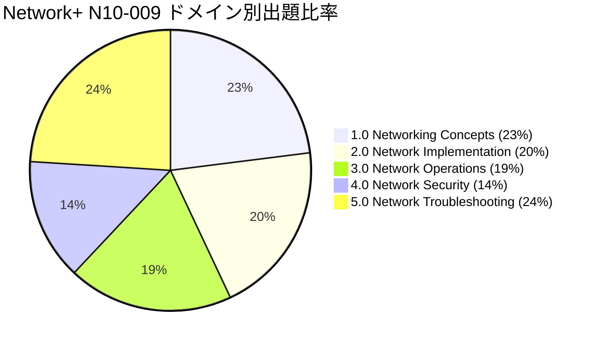
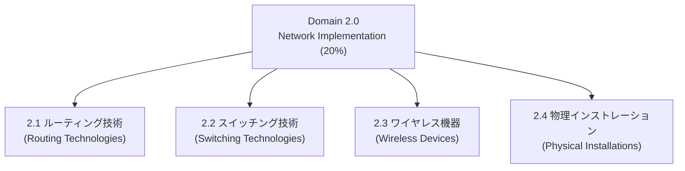
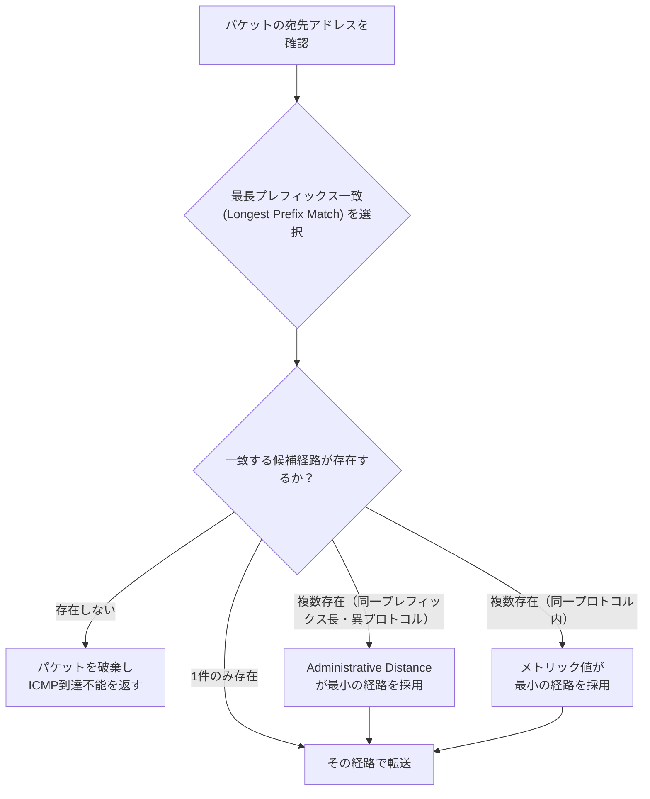
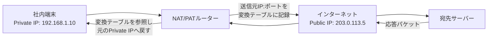
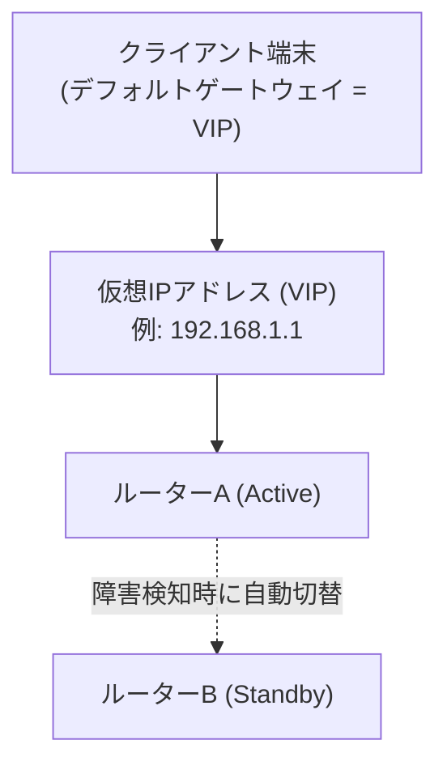
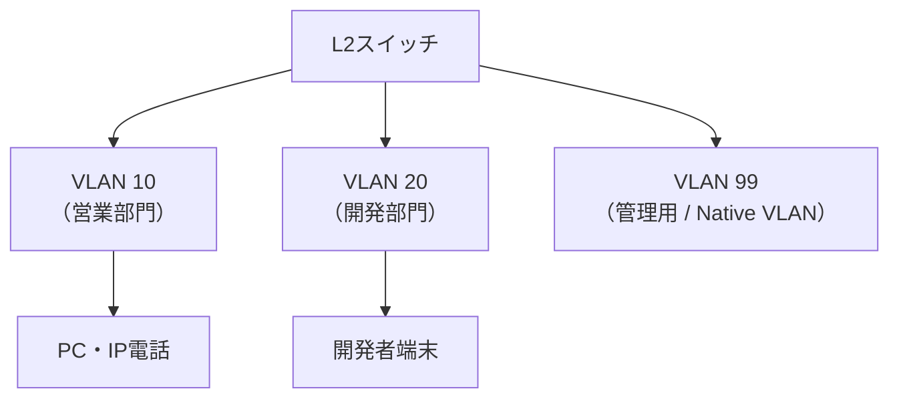
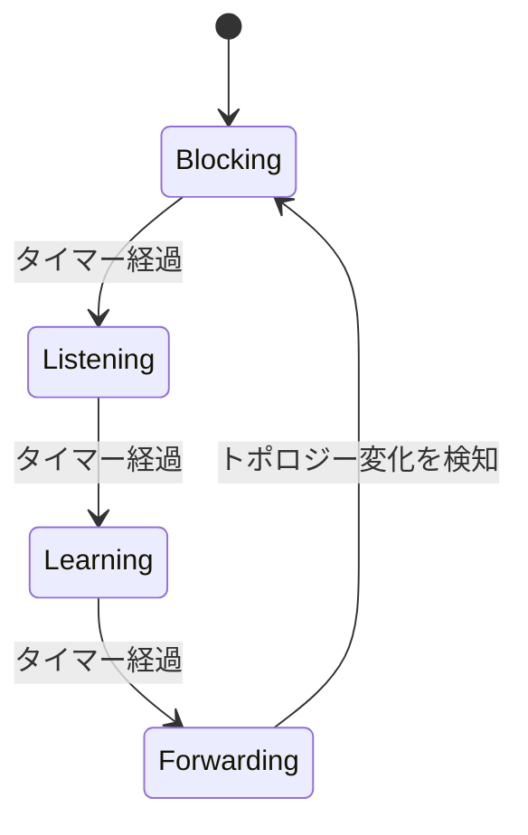
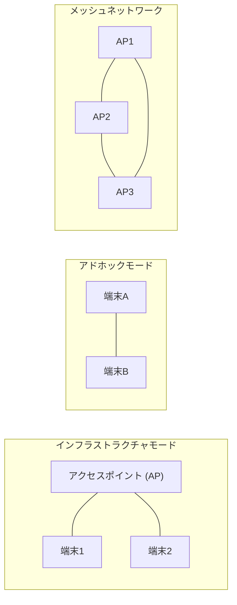
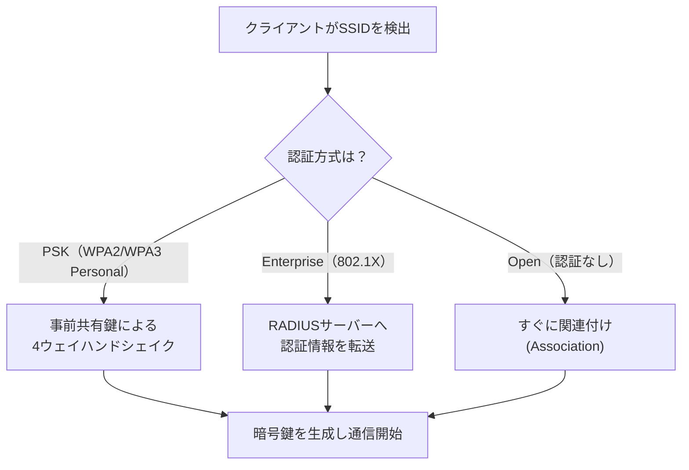
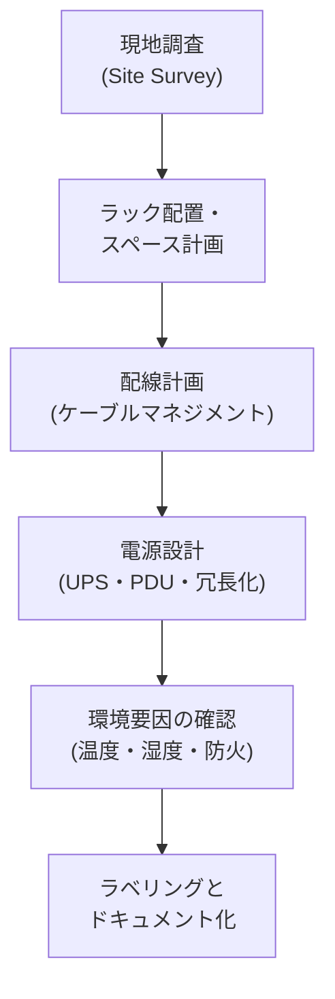

# CompTIA Network+ (N10-009) 徹底解説：Network Implementation ドメイン

> 初学者向けステップバイステップガイド｜出題比率20%を占める「実装」ドメインを、概念図（Mermaid）と表を使って基礎から理解する

---

## この資料について

CompTIA Network+ は、ルーティング・スイッチング・ワイヤレス・物理設置などネットワークの基礎技術を証明するベンダーニュートラルな資格です。試験は5つのドメイン（出題領域）で構成されており、その中でも **Domain 2.0: Network Implementation（ネットワークの実装）** は出題比率20%を占める、実務色の強い重要領域です。

このガイドでは、初学者がつまずきやすいポイントを整理しながら、以下の4つの柱をステップごとに解説します。

1. Step 1: ルーティング技術（Routing Technologies）
2. Step 2: スイッチング技術（Switching Technologies）
3. Step 3: ワイヤレス機器とテクノロジー（Wireless Devices）
4. Step 4: 物理インストレーション（Physical Installations）

---

## Step 0: 全体像を掴む — Network+試験におけるこのドメインの位置づけ

CompTIA Network+ (N10-009) は、2024年6月に発表された最新バージョン（V9）です。試験は最大90問（多肢選択式＋パフォーマンスベース問題）、制限時間90分、合格ラインは900点満点中720点です。5つのドメインとその出題比率は次のとおりです。

| ドメイン番号 | ドメイン名 | 出題比率 |
|---|---|---|
| 1.0 | Networking Concepts（ネットワークの概念） | 23% |
| **2.0** | **Network Implementation（ネットワークの実装）** | **20%** |
| 3.0 | Network Operations（ネットワークの運用） | 19% |
| 4.0 | Network Security（ネットワークセキュリティ） | 14% |
| 5.0 | Network Troubleshooting（ネットワークのトラブルシューティング） | 24% |

Network Implementationドメインは、公式の出題範囲（Exam Objectives）上、次の4つのサブ領域（2.1〜2.4）に分かれています。これらは「L3のルーティング → L2のスイッチング → 無線 → 物理層」という、ネットワークを実際に組み立てていく順序に沿っています。

> 補足：CompTIAの旧バージョン（N10-008）では「デバイスの比較」もこのドメインに含まれていましたが、N10-009では該当内容の一部がDomain 1.0（Networking Concepts）側に整理し直されています。学習教材を購入する際は、必ず「N10-009」対応版であることを確認してください。

---

## Step 1: ルーティング技術を理解する（Objective 2.1）

ルーティングとは、異なるネットワーク（サブネット）間でパケットを転送するための仕組みです。ここではルーターがどのように「どの経路で送るか」を決めているかを、段階を追って理解します。

### 1-1. 静的ルーティングと動的ルーティング

| 項目 | 静的ルーティング (Static) | 動的ルーティング (Dynamic) |
|---|---|---|
| 設定方法 | 管理者が手動で経路を1件ずつ設定 | ルーティングプロトコルが自動で経路を学習・交換 |
| 変化への対応 | ネットワーク構成が変わると手動で修正が必要 | リンク障害などを自動的に検知し経路を再計算 |
| CPU/帯域負荷 | ほぼゼロ | プロトコルの制御パケット交換により一定の負荷が発生 |
| 向いている環境 | 小規模・経路数が少ない・安定した環境 | 中〜大規模・経路が多い・変化が多い環境 |

### 1-2. 主要な動的ルーティングプロトコル（BGP / EIGRP / OSPF）

| プロトコル | 分類 | 主な用途 | 経路選択の基準（メトリック） |
|---|---|---|---|
| OSPF (Open Shortest Path First) | リンクステート型 IGP | 企業内ネットワーク（AS内） | コスト（帯域幅ベース） |
| EIGRP (Enhanced IGRP) | ハイブリッド型 IGP（Cisco独自） | 企業内ネットワーク（AS内） | 帯域幅・遅延などの複合値 |
| BGP (Border Gateway Protocol) | パスベクター型 EGP | インターネット全体・AS間の経路交換 | AS-PATHの長さなどのポリシー属性 |

IGP（Interior Gateway Protocol）は自組織内（1つの自律システム＝AS）向け、EGP（Exterior Gateway Protocol）は組織間・インターネット全体向けという役割分担を押さえておくと整理しやすくなります。

### 1-3. ルート選択の基準：Administrative DistanceとMetric

ルーターの経路テーブルに複数の候補経路がある場合、以下の優先順位で最終的な経路が1つに絞り込まれます。

Administrative Distance（AD）は「どのルーティング情報源をどれだけ信頼するか」を示す0〜255の指標で、値が小さいほど優先されます。代表的なデフォルト値は次のとおりです（ベンダーや実装により多少差がありますが、試験対策として広く知られている値です）。

| 経路情報源 | デフォルトAD値 | 備考 |
|---|---|---|
| 直接接続（Connected） | 0 | 最優先 |
| 静的ルート（Static） | 1 | 手動設定は原則優先される |
| EIGRP | 90 | 内部経路 |
| OSPF | 110 | |
| BGP（外部） | 20 | |
| BGP（内部） | 200 | 最も信頼度が低い部類 |

### 1-4. アドレス変換：NATとPAT

NAT (Network Address Translation) は、プライベートIPアドレスをパブリックIPアドレスに変換してインターネットと通信できるようにする技術です。PAT (Port Address Translation) はNATの一種で、ポート番号を組み合わせることで1つのパブリックIPを複数の内部端末で共有できるようにします（家庭用ルーターの多くが採用している方式です）。

### 1-5. 冗長化の仕組み：FHRPとVIP

FHRP (First Hop Redundancy Protocol) は、クライアントが利用するデフォルトゲートウェイを冗長化するための仕組みです。複数台のルーターで1つの仮想IPアドレス（VIP: Virtual IP）を共有し、Active機器に障害が起きた場合でもクライアント側の設定変更なしに自動的にStandby機器へ切り替わります（代表例：HSRP、VRRP）。

### 1-6. サブインターフェース（Subinterfaces）

1つの物理インターフェースを論理的に複数に分割し、それぞれに異なるVLANやIPアドレスを割り当てる仕組みです。「Router on a Stick」と呼ばれる構成で、1本の物理リンク（トランクポート）を通じて複数VLAN間のルーティングを行う際によく使われます。

---

## Step 2: スイッチング技術を理解する（Objective 2.2）

スイッチはOSI参照モデルの主にデータリンク層（レイヤー2）で動作し、MACアドレスを基にフレームを転送します。ここでは、実務で頻出するVLAN・インターフェース設定・STP・MTUを扱います。

### 2-1. VLANの基本

VLAN (Virtual LAN) は、1台の物理スイッチを論理的に複数のブロードキャストドメインへ分割する技術です。部署やセキュリティ要件ごとにネットワークを分離でき、物理的な配線を変更せずに柔軟な構成変更が可能になります。

### 2-2. インターフェース設定（アクセスポートとトランクポート）

| ポートタイプ | 役割 | 通過するVLAN数 |
|---|---|---|
| アクセスポート (Access) | エンドユーザー端末を接続する | 1つのVLANのみ |
| トランクポート (Trunk) | スイッチ間・ルーターとの接続に使用し、複数VLANのタグ付きフレームを運ぶ | 複数（802.1Qでタグ付け） |

### 2-3. スパニングツリープロトコル（STP）

STP (Spanning Tree Protocol) は、冗長化のために複数の経路を持つスイッチ環境で発生しうる「ループ」を防ぐためのプロトコルです。各ポートは以下の状態を段階的に遷移し、最終的にループのない論理トポロジーを構築します。

| 状態 | 動作内容 |
|---|---|
| Blocking | BPDUは受信するがフレーム転送やMAC学習は行わない |
| Listening | BPDUの送受信を行いトポロジーを把握するが、まだ転送はしない |
| Learning | MACアドレステーブルの学習を開始するが、まだ転送はしない |
| Forwarding | 通常どおりフレームを転送する（ループがないと判断された状態） |

### 2-4. MTUとジャンボフレーム

| 項目 | 標準MTU | ジャンボフレーム |
|---|---|---|
| 一般的なサイズ | 1500バイト（Ethernet標準） | 9000バイト前後（機器依存） |
| 主な用途 | 一般的なLAN通信 | ストレージネットワーク（iSCSIなど）や高スループットが必要なデータセンター内通信 |
| 注意点 | 相互接続機器すべてで同じMTU設定が必要（不一致はフラグメント化や通信断の原因になる） | 同上（経路上の全機器でジャンボフレーム対応が必須） |

---

## Step 3: ワイヤレス機器とテクノロジーを理解する（Objective 2.3）

無線LANの設計では、周波数帯・SSID設計・暗号化方式・アクセスポイントの配置などを総合的に検討します。

### 3-1. 周波数帯とWi-Fi規格

| 規格 | Wi-Fi世代名 | 周波数帯 | 理論上の最大速度（目安） |
|---|---|---|---|
| 802.11a | - | 5 GHz | 約54 Mbps |
| 802.11b | - | 2.4 GHz | 約11 Mbps |
| 802.11g | - | 2.4 GHz | 約54 Mbps |
| 802.11n | Wi-Fi 4 | 2.4 GHz / 5 GHz | 約600 Mbps |
| 802.11ac | Wi-Fi 5 | 5 GHz | 約3.5 Gbps |
| 802.11ax | Wi-Fi 6 / 6E | 2.4 GHz / 5 GHz（6Eは6 GHz帯追加） | 約9.6 Gbps |
| 802.11be | Wi-Fi 7 | 2.4 GHz / 5 GHz / 6 GHz | 数十Gbps級（理論値） |

> 理論上の最大速度はあくまでカタログスペック上の値であり、実際のスループットは電波環境・端末数・干渉などにより大きく変動します。試験対策としては「世代が新しいほど高速・高効率になる」という相対的な順序を押さえておけば十分です。

2.4GHzは障害物に強く到達距離が長い一方、干渉を受けやすいという特徴があります。5GHz・6GHz帯は高速通信が可能な一方、直進性が強く障害物に弱いため、設置場所の設計（チャネル選定含む）が重要になります。

### 3-2. ネットワークタイプ

- **インフラストラクチャモード**：アクセスポイントを中心に端末が接続する、最も一般的な構成。
- **アドホックモード**：APを介さず端末同士が直接通信する構成。
- **メッシュネットワーク**：複数のAP同士が無線でリンクし、広範囲をカバーする構成。

### 3-3. 認証と暗号化方式

| 方式 | 暗号化アルゴリズム | 現在の位置づけ |
|---|---|---|
| WEP | RC4（脆弱性あり） | 非推奨・使用すべきではない |
| WPA | RC4 + TKIP | 非推奨（WEPの応急的な後継） |
| WPA2 | AES-CCMP | 長らく標準として広く利用 |
| WPA3 | AES-GCMP、SAEによる強固な鍵交換 | 現行の推奨規格 |

クライアントがアクセスポイントへ接続する際の認証フローは、大きく3パターンに分類されます。

ゲストネットワークは、社内の本番VLANとは別のSSID・VLANとして分離し、来訪者や私物端末（BYOD）を隔離するために設計されます。

### 3-4. アンテナとアクセスポイントの配置

| アンテナ種別 | 特徴 | 用途例 |
|---|---|---|
| 無指向性（Omnidirectional） | 全方向へ均等に電波を放射 | オフィスなど一般的な屋内カバレッジ |
| 指向性（Directional / Yagi） | 特定方向へ電波を集中させ到達距離を伸ばす | 建物間の点対点リンク |
| パラボラ（Parabolic） | 非常に狭いビーム角で長距離をカバー | 遠距離の拠点間接続 |

アクセスポイントの設置場所は、カバレッジの重なり（セル間のオーバーラップ）とチャネルの干渉回避を両立させるよう計画する必要があります。

---

## Step 4: 物理インストレーションを理解する（Objective 2.4）

どれほど論理設計が優れていても、物理的な設置環境が適切でなければネットワークは安定して稼働しません。このサブ領域では、設置・電源・環境要因を扱います。

### 4-1. 設置場所に関する考慮事項

| 項目 | 内容 |
|---|---|
| ラック配置 | 保守のためのアクセススペース確保、機器の重量分散 |
| 配線経路 | ケーブルの最大長制限（例：銅線Ethernetは一般に100m）を踏まえた経路設計 |
| ケーブルマネジメント | ラベリング、パッチパネルの活用、束線による整理整頓 |

### 4-2. 電源に関する考慮事項

| 項目 | 役割 |
|---|---|
| UPS（無停電電源装置） | 停電時に一定時間電力を供給し、安全なシャットダウンや電源切替の猶予を作る |
| PDU（電源分配ユニット） | ラック内の複数機器へ電源を分配・管理する |
| 冗長電源（デュアル電源） | 電源ユニット自体を二重化し、片方の故障でも稼働を継続する |

### 4-3. 環境要因

| 項目 | 内容 |
|---|---|
| 温度・湿度管理 | 過度な発熱はハードウェア故障の主要因となるため、空調・気流設計が重要 |
| 防火・消火設備 | 通信機器室ではガス系消火設備など、機器に配慮した消火方式が採用されることが多い |
| 静電気対策 | 部品交換時の静電気放電（ESD）による機器損傷を防ぐ対策 |

---

## Step 5: 学習の進め方（まとめ）

- **暗記より「なぜそうするか」を理解する**：特にNAT/PAT、STP、AD値は暗記だけだと応用問題に対応しづらい領域です。図解の流れを自分の言葉で説明できるかを確認しましょう。
- **出題比率24%のTroubleshootingドメインとの接続を意識する**：Network Implementationで学んだ内容（ルーティングテーブル、VLAN割り当て、STP、ケーブル規格など）は、そのままトラブルシューティングドメインの前提知識になります。
- **パフォーマンスベース問題（PBQ）対策として、実機・シミュレータでの操作経験を積む**：CompTIAの公式学習製品（CertMaster Learn/Practice/Labs）などを使い、コマンドラインでの設定作業に慣れておくと得点が安定します。

---

## 参考文献・出典（Sources）

本資料の試験範囲・出題比率・ドメイン構成に関する情報は、CompTIA公式サイトの記載に基づいています。

- CompTIA Network+ 公式認定ページ（試験概要・ドメイン別出題比率・出題範囲サマリー）
  https://www.comptia.org/en-us/certifications/network/
  https://www.comptia.org/en/certifications/network/
- CompTIA Blog「The New Network+ (N10-009) Exam: Your Questions Answered」（N10-009での変更点解説）
  https://www.comptia.org/en-us/blog/the-new-network-n10-009-exam-your-questions-answered/
- CompTIA Blog「What Is on the CompTIA Network+ Exam?」（出題内容の概要）
  https://www.comptia.org/en-us/blog/what-is-on-the-comptia-network-exam/
- CompTIA Blog「CompTIA Network+ N10-008 vs. N10-009」（旧バージョンとの比較）
  https://www.comptia.org/en-us/blog/comptia-network-n10-008-vs-n10-009-whats-the-difference/

> 注記：CompTIAの出題範囲（Exam Objectives）は改訂される場合があります。実際の受験前には、必ず上記の公式ページで最新の出題範囲PDFをご確認ください。
