# コンピュータネットワーク入門ガイド ― 初学者のためのステップバイステップ解説

> 対象読者: ネットワークをこれから体系的に学びたいソフトウェアエンジニア・QAエンジニア・インフラ担当者
> 学び方: 「積み上げ型」。下位層(物理・データリンク)から上位層(アプリケーション)へ、実際にパケットが辿る順序で理解を積み上げます
> 構成の着想元: Andrew S. Tanenbaum, David J. Wetherall 著『Computer Networks, Fifth Edition』(Prentice Hall / O'Reilly)。同書は物理層から出発し上位層へ積み上げる構造化アプローチと、章末にネットワークセキュリティを独立して扱う構成で知られています。本ガイドはその学習順序に着想を得つつ、2026年9月時点の最新動向を織り込んだ独自の解説として再構成したものであり、原著の文章・図版を複製するものではありません。

---

## 目次

- [はじめに: なぜコンピュータネットワークを学ぶのか](#introduction)
- [学習の進め方(ベストプラクティス)](#best-practices)
- [ステップ0: 全体像を掴む ― インターネットはどう成り立っているか](#step0)
- [ステップ1: 物理層 ― ビットを電気信号・光・電波に変える](#step1)
- [ステップ2: データリンク層 ― フレーム化と誤り検出でリンクを渡す](#step2)
- [ステップ3: メディアアクセス制御(MAC)サブレイヤー ― 誰が話す番かを決める](#step3)
- [ステップ4: ネットワーク層 ― 異なるネットワークをまたいで届ける](#step4)
- [ステップ5: トランスポート層 ― エンドツーエンドの信頼性](#step5)
- [ステップ6: アプリケーション層 ― 人とアプリのためのプロトコル](#step6)
- [ステップ7: ネットワークセキュリティ ― 守るべきものと手段](#step7)
- [ステップ8: 2026年の最新動向 ― 今のインターネットはどう変わったか](#step8)
- [ステップ9: トラブルシューティングの基本 ― 現場で使う一次切り分け](#step9)
- [学習ロードマップ](#roadmap)
- [ベストプラクティス チェックリスト](#checklist)
- [用語集](#glossary)
- [参考文献](#references)

---

<a id="introduction"></a>

## はじめに: なぜコンピュータネットワークを学ぶのか

現代のソフトウェアはほぼ例外なくネットワーク越しに動きます。マイクロサービス間のRPC、ブラウザとサーバー間のHTTPS、モバイルアプリのプッシュ通知、クラウドVPC内のトラフィック制御――どれも「パケットがどう運ばれ、どこで詰まり、どこで暗号化されるか」を理解していないと、性能問題やセキュリティインシデントの原因を特定できません。

ネットワークを学ぶ価値は大きく3つに整理できます。

1. **障害切り分けの速度が上がる**: 「アプリの問題か、DNSの問題か、TLSの問題か、経路の問題か」をレイヤーごとに仮説立てできるようになります。
2. **設計判断の質が上がる**: タイムアウト値、リトライ戦略、コネクションプーリング、CDN配置などは、すべて下位層の特性(RTT、パケットロス、輻輳制御)の理解に基づいて決めるべき設計です。
3. **セキュリティの土台になる**: TLS、VPN、ファイアウォール、ゼロトラストはいずれもネットワーク層・トランスポート層の仕組みの上に成り立っています。

<a id="best-practices"></a>

## 学習の進め方(ベストプラクティス)

**ベストプラクティス**
- 上位層(HTTPやアプリ)から入りたくなっても、まずは下位層(物理・データリンク・ネットワーク)を先に押さえる。上位層のプロトコルは下位層の制約(帯域・遅延・信頼性)を前提に設計されているため、順序を逆にすると「なぜこの仕様なのか」が腑に落ちにくい
- 各ステップの図解は、実際に `ping` / `traceroute` / `curl -v` / `dig` などのコマンドを自分の端末で実行しながら照らし合わせる
- 用語は英語表記も併記して覚える。RFCやベンダーのドキュメントは英語が一次情報であることがほとんど
- 「なぜこの設計なのか」を都度自問する。ネットワークプロトコルの多くは歴史的な制約(帯域が細い、CPUが遅い、信頼できない回線)への対処として生まれており、背景を知ると暗記量が減る

---

<a id="step0"></a>

## ステップ0: 全体像を掴む ― インターネットはどう成り立っているか

### インターネットを構成する要素

インターネットは単一の組織が管理する1つのネットワークではなく、**自律システム(AS: Autonomous System)** と呼ばれる無数の独立したネットワークが、BGPというプロトコルで経路情報を交換し合うことで成立している「ネットワークのネットワーク」です。

| 構成要素 | 役割 | 具体例 |
|---|---|---|
| ホスト(エンドシステム) | データの送信元・宛先 | PC、スマートフォン、サーバー |
| ルータ | 異なるネットワーク間でパケットを中継 | 家庭用ルータ、ISPのコアルータ |
| ISP(Internet Service Provider) | インターネットへの接続を提供 | 通信事業者 |
| IXP(Internet Exchange Point) | 複数のISP・事業者が相互接続する拠点 | 主要都市の相互接続拠点 |
| 自律システム(AS) | 単一の管理ポリシーで運用されるネットワークの集合。番号(ASN)で識別 | 企業・ISP・クラウド事業者ごとに割り当て |

### プロトコル階層化という考え方

ネットワークの設計では、機能を「層(レイヤー)」に分割し、各層が下位層の詳細を知らなくても使えるようにする**階層化(layering)**という考え方が採用されています。上位層は下位層が提供する「インターフェース」だけを信頼して設計され、下位層の実装(銅線か光ファイバか無線か)が変わっても上位層のコードは変更不要になります。これはソフトウェア設計における関心の分離(separation of concerns)と同じ発想です。

代表的な階層モデルが2つあります。

- **OSI参照モデル**: 国際標準化機構(ISO)が策定した7層モデル。教育・トラブルシューティングの共通言語として広く使われる
- **TCP/IPモデル(インターネットプロトコルスイート)**: 実際のインターネットが採用している4層(または5層)モデル。IETFのRFC群として標準化されている

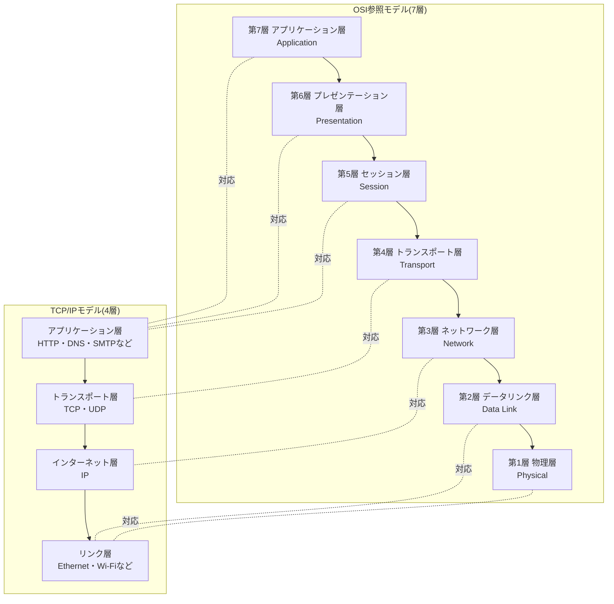

実務ではTCP/IPモデルが実装の実態に近く、OSIモデルは「どのレイヤーの問題か」を議論する共通語彙として使われます。たとえば「レイヤー7の攻撃」と言えばアプリケーション層(HTTPリクエストなど)を狙った攻撃、「レイヤー3/4の攻撃」と言えばネットワーク層・トランスポート層を狙った攻撃(大量パケットによるDDoSなど)を指します。

### カプセル化: データが層を降りていく仕組み

アプリケーションが送りたいデータは、送信側で各層のヘッダ(制御情報)を付加されながら下位層へ渡されていき、物理層でビット列として送出されます。受信側では逆に、各層が自分宛のヘッダを取り除きながら上位層へデータを渡します。この一連の処理を**カプセル化(encapsulation)**、逆方向を**非カプセル化(decapsulation)**と呼びます。

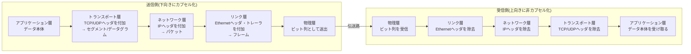

**ベストプラクティス**
- 「パケット」「フレーム」「セグメント」という用語はレイヤーごとに使い分ける(ネットワーク層=パケット、リンク層=フレーム、トランスポート層=セグメント/データグラム)。曖昧に「パケット」と呼ぶと議論がすれ違いやすい
- 障害調査では「どの層のヘッダが正しく付いているか」を`tcpdump`/Wiresharkで確認する癖をつける。上位層のエラーに見えて実は下位層(MTU超過など)が原因のことは多い

---

<a id="step1"></a>

## ステップ1: 物理層 ― ビットを電気信号・光・電波に変える

物理層は、0と1のビット列を実際の電気信号・光信号・電波に変換して伝送路に送り出す層です。「何を送るか」ではなく「どう物理的に送るか」を扱います。

### 伝送媒体の比較

| 媒体 | 代表例 | 特徴 | 主な用途 |
|---|---|---|---|
| 銅線(ツイストペアケーブル) | Cat5e / Cat6 / Cat6A | 安価・敷設が容易・電磁ノイズの影響を受けやすい | オフィスLAN、家庭内配線 |
| 同軸ケーブル | ケーブルテレビ回線 | シールドがあり銅線より高帯域 | CATVインターネット |
| 光ファイバ | シングルモード/マルチモード | 減衰が少なく長距離・大容量、電磁ノイズに強い | データセンター間、バックボーン、FTTH |
| 無線(電波) | Wi-Fi、セルラー(4G/5G) | 配線不要だが減衰・干渉・盗聴リスクがある | モバイル端末、IoT |
| 衛星通信 | Starlinkなど低軌道衛星(LEO) | 地上インフラが乏しい地域でも接続可能、近年は低遅延化が進む | 遠隔地・海上・航空機内接続 |

### 信号化・多重化の基礎

物理層で扱う重要な概念に**多重化(multiplexing)**があります。1本の物理回線を複数の通信で共有するための技術です。

- **周波数分割多重(FDM: Frequency Division Multiplexing)**: 周波数帯を分割して同時に複数信号を送る(アナログ放送などで利用)
- **時分割多重(TDM: Time Division Multiplexing)**: 時間をスロットに分割して順番に送る(デジタル電話網などで利用)
- **波長分割多重(WDM: Wavelength Division Multiplexing)**: 光ファイバ内で異なる波長(色)の光を同時に伝送する。長距離光回線の大容量化に不可欠

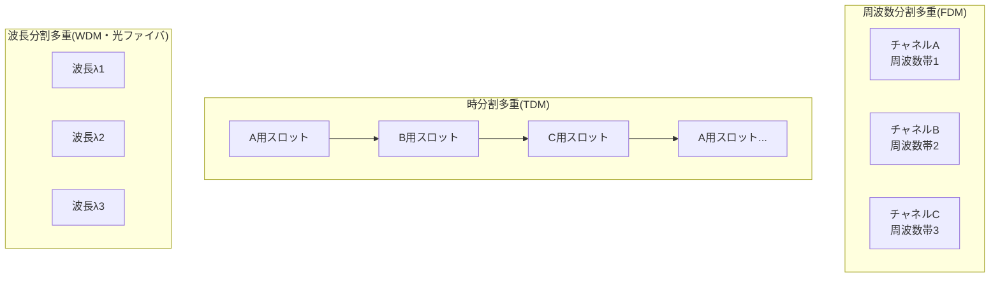

**ベストプラクティス**
- データセンター間の帯域設計では、銅線の距離制限(Cat6Aで約100m)を意識し、それ以上の距離は光ファイバを選定する
- Wi-Fiの電波干渉は物理層の問題であることが多い。アプリ側の再送・タイムアウト調整だけで対処せず、チャネル設計や電波環境の見直しも検討する
- 光ファイバのWDMにより1本の芯線で数十〜数百chの多重化が可能になっている点を理解しておくと、バックボーン回線の容量設計の勘所がつかめる

---

<a id="step2"></a>

## ステップ2: データリンク層 ― フレーム化と誤り検出でリンクを渡す

データリンク層は、同一のリンク(同一セグメント)上にある隣接ノード間で、ビット列を「フレーム」という単位にまとめ、誤り検出を行ったうえで受け渡す役割を担います。ネットワーク層のIPアドレスとは異なり、この層では**MACアドレス(Media Access Control address)**という48ビットの物理アドレスが使われます。

### フレーミングと誤り検出

送信側はビット列の区切り(フレームの開始・終了)を明示し、受信側が正しく1フレームを切り出せるようにします。また伝送中のビット誤りを検出するために、多くの実装で**CRC(巡回冗長検査、Cyclic Redundancy Check)**が使われます。CRCは送信側でフレーム内容から計算した検査値をフレーム末尾に付加し、受信側で同じ計算を行って一致するかを確認する仕組みです。ここで注意したいのは、イーサネットのFCS/CRCは誤りを**検出して破損フレームを破棄するだけ**であり、再送は行わない点です。リンク層で確認応答(ACK)と再送による信頼性を提供するかどうかはプロトコル依存で、たとえばIEEE 802.11(Wi-Fi)はユニキャストフレームごとにACKと再送を行いますが、有線イーサネットは行わず、失われたデータの回復は上位層(TCPなど)に委ねられます。

### イーサネット(Ethernet)フレームの構造

| フィールド | 長さ(目安) | 役割 |
|---|---|---|
| プリアンブル | 7バイト | 受信側のクロック同期用 |
| SFD(スタートフレームデリミタ) | 1バイト | フレーム本体の開始位置を示す |
| 宛先MACアドレス | 6バイト | フレームの届け先 |
| 送信元MACアドレス | 6バイト | フレームの送り主 |
| VLANタグ(任意) | 4バイト | VLAN識別子(802.1Q) |
| タイプ/長さ | 2バイト | 上位プロトコル種別(IPv4/IPv6/ARPなど) |
| ペイロード | 46〜1500バイト | 実データ(IPパケットなど) |
| FCS(フレームチェックシーケンス) | 4バイト | CRCによる誤り検出 |

### スイッチの学習と転送(自己学習ブリッジ)

L2スイッチは、受信したフレームの送信元MACアドレスとポート番号を**MACアドレステーブル**に記録し、次にそのMACアドレス宛のフレームが来たときは該当ポートだけに転送します。テーブルに宛先が存在しない場合は、受信ポート以外の全ポートへ**フラッディング**します。

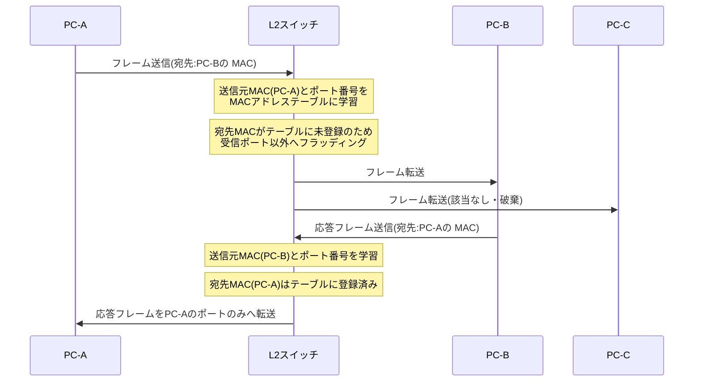

### VLAN(仮想LAN)による論理分割

VLAN(Virtual LAN)は、物理的な配線を変えずに1台のスイッチを論理的に複数のブロードキャストドメインへ分割する仕組みです。IEEE 802.1Qにより、フレームにVLAN IDタグを付与して識別します。

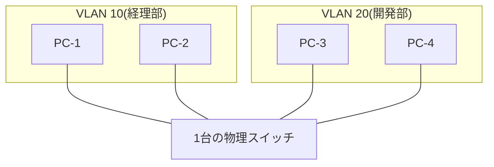

同じスイッチに接続されていても、VLAN10とVLAN20は別のブロードキャストドメインとして扱われ、相互に通信するにはルータやL3スイッチによるルーティングが必要になります。

**ベストプラクティス**
- 業務ネットワークでは部署・用途ごとにVLANを分割し、ブロードキャストドメインを小さく保つことでブロードキャストストームの影響範囲を限定する
- スイッチのポートミラーリング(SPAN)機能を使うと、トラブルシュート時にパケットキャプチャが取りやすくなる
- MACアドレステーブルのエントリ数上限に注意する。仮想化基盤などでMACアドレスが多数生成される環境ではテーブル溢れによるフラッディング増加が起こりうる

---

<a id="step3"></a>

## ステップ3: メディアアクセス制御(MAC)サブレイヤー ― 誰が話す番かを決める

複数のノードが同じ伝送媒体(共有バス、無線チャネルなど)を使う場合、「誰がいつ送信してよいか」を調整する仕組みが必要です。これを担うのがMAC(Media Access Control)サブレイヤーです。

### CSMA/CD(有線イーサネットの歴史的方式)

初期の共有バス型イーサネットでは、**CSMA/CD(搬送波感知多重アクセス/衝突検出)**が使われていました。現代のスイッチ接続された全二重イーサネットでは衝突がほぼ発生しないため実質的に使われていませんが、無線LANの理解の前提として重要です。

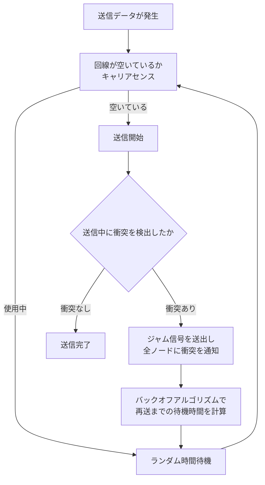

### CSMA/CA(無線LANで使われる方式)

無線LAN(Wi-Fi)では、送信中の自ノードの信号がノイズに埋もれて衝突を検出しにくい(隠れ端末問題もある)ため、**CSMA/CA(搬送波感知多重アクセス/衝突回避)**が採用されています。衝突を検出するのではなく、事前に衝突を避けることに重点を置きます。

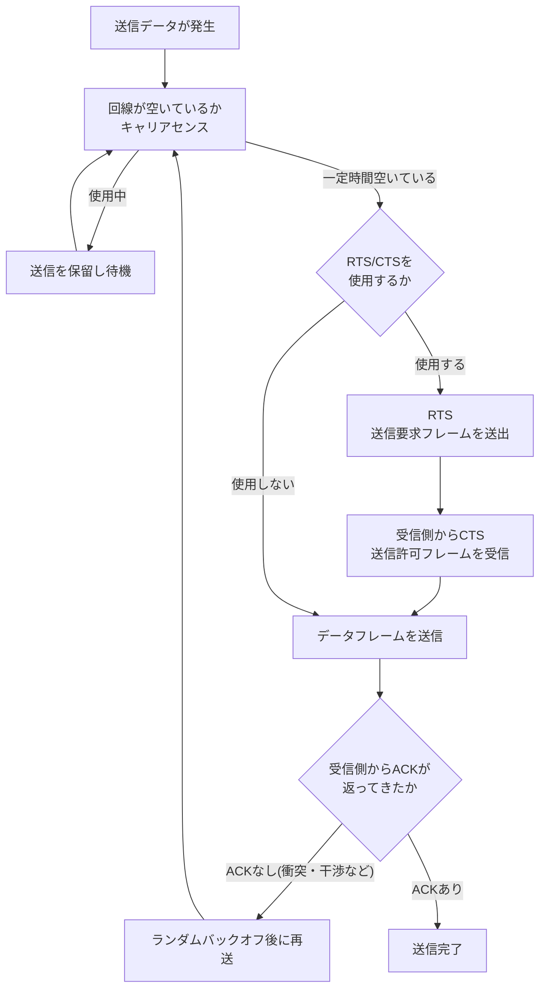

### Wi-Fi世代の比較

| 世代呼称 | IEEE規格 | 標準化・普及時期(目安) | 最大帯域幅 | 主な特徴 |
|---|---|---|---|---|
| Wi-Fi 4 | 802.11n | 2009年〜 | 40MHz | MIMO導入 |
| Wi-Fi 5 | 802.11ac | 2013年〜 | 160MHz | 5GHz帯中心、MU-MIMO |
| Wi-Fi 6 | 802.11ax | 2019年〜 | 160MHz | OFDMA、省電力(TWT) |
| Wi-Fi 6E | 802.11ax拡張 | 2021年〜 | 160MHz | 6GHz帯の追加利用 |
| Wi-Fi 7 | 802.11be | Wi-Fi Alliance認証2024年1月、IEEE正式標準化2025年 | 320MHz | MLO(複数リンク同時利用)、4K-QAM |
| Wi-Fi 8(策定中) | 802.11bn | 標準化目標2028年 | 320MHz(据え置き) | 速度よりも安定性・複数AP協調を重視 |

Wi-Fi Allianceは、2026年通年でWi-Fi 7対応機器の出荷が世界で約11億台に達すると見込んでいます。また企業向けアクセスポイントについては、ABI Researchが2024年の2,630万台から2026年には1億1,790万台へ拡大すると予測しています。

**ベストプラクティス**
- 無線環境の性能問題を切り分ける際は、まずMACサブレイヤーの競合(同一チャネルを使う端末数、隠れ端末問題)を疑う
- Wi-Fi 7導入時はMLO(Multi-Link Operation)対応のクライアントとAPの組み合わせでのみ真価を発揮する点に注意し、混在環境での互換性を事前検証する
- 有線環境で今も半二重(hub経由など)が残っていないか確認する。全二重化されていればCSMA/CDによる衝突は原理的に発生しない

---

<a id="step4"></a>

## ステップ4: ネットワーク層 ― 異なるネットワークをまたいで届ける

ネットワーク層は、送信元から宛先まで、複数のネットワークをまたいでパケットを届ける「経路制御(ルーティング)」を担う層です。中核となるプロトコルがIP(Internet Protocol)です。

### IPv4アドレッシングとCIDR

IPv4アドレスは32ビットで、慣習的に8ビットずつ4つに区切ったドット区切り10進数(例: 192.168.1.10)で表記されます。アドレス空間は約43億個(2^32)しかなく、インターネットの急成長により枯渇が進んだため、**CIDR(Classless Inter-Domain Routing)**というクラスに縛られない可変長のアドレス割り当て方式が導入されました。CIDR表記では `192.168.1.0/24` のように「/」の後にネットワーク部のビット数(プレフィックス長)を示します。

| CIDR表記 | サブネットマスク | 利用可能ホスト数(目安) | 主な用途 |
|---|---|---|---|
| /8 | 255.0.0.0 | 約1,677万 | 大規模組織・historicalなクラスA相当 |
| /16 | 255.255.0.0 | 約6.5万 | 中規模組織のプライベート網 |
| /24 | 255.255.255.0 | 254 | 一般的なLANセグメント |
| /28 | 255.255.255.240 | 14 | 小規模サブネット(拠点間VPNなど) |
| /30 | 255.255.255.252 | 2 | ルータ間ポイントツーポイントリンク |

### サブネッティングの手順

ステップバイステップでサブネット設計を行う際の考え方を示します。

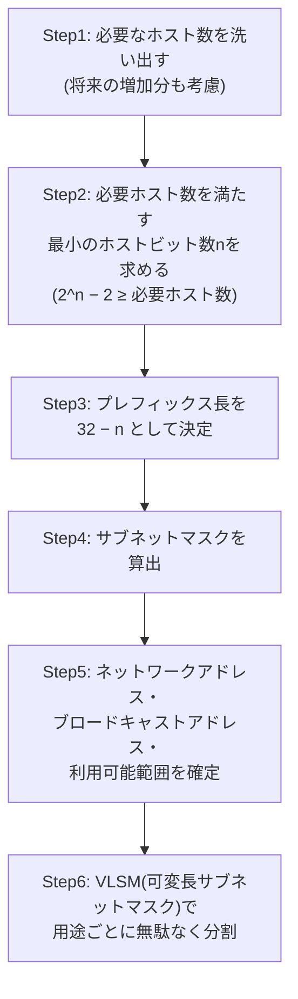

たとえば30台のホストを収容したい場合、2^5−2=30なのでホストビットは5ビット必要、プレフィックス長は32−5=27、つまり `/27`(255.255.255.224、利用可能ホスト30台)を割り当てる、という手順になります。

### IPv6が必要な理由と基本構造

IPv4のアドレス枯渇に対応するため、128ビットのアドレス空間を持つ**IPv6**が標準化されています。アドレスは16進数を「:」区切りにした表記(例: `2001:0db8:85a3:0000:0000:8a2e:0370:7334`)で表され、連続するゼロは `::` で1回だけ省略できます。IPv6ではNAT(後述)を必須としないエンドツーエンド到達性の回復や、ヘッダの簡素化による処理効率化なども設計目標に含まれています。

### ルーティングアルゴリズムの2つの系統

ルータが「宛先までどの経路が最適か」を決めるアルゴリズムは、大きく2系統に分類されます。

| 分類 | 代表プロトコル | 動作の考え方 | 特徴 |
|---|---|---|---|
| 距離ベクトル型(Distance Vector) | RIP | 隣接ルータと「宛先までの距離(コスト)」を交換し合う | 実装は単純だが収束が遅く、ループが起きやすい |
| リンクステート型(Link State) | OSPF、IS-IS | 各ルータがネットワーク全体のトポロジ情報を持ち、最短経路を自力計算(ダイクストラ法) | 収束が速いが計算・メモリ負荷が高い |
| 経路ベクトル型(Path Vector) | BGP(Border Gateway Protocol) | 経由するAS番号の列(ASパス)を交換し、ポリシーに基づき経路選択 | インターネット全体の経路制御(EGP)に使用 |

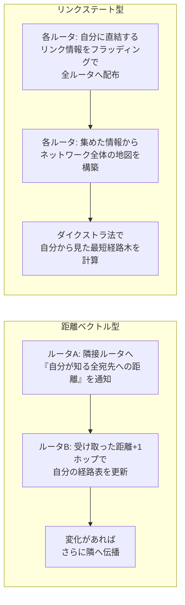

### NAT(ネットワークアドレス変換)

IPv4アドレスの節約策として広く使われているのが**NAT(Network Address Translation)**です。プライベートIPアドレス(RFC 1918で定義された `10.0.0.0/8`、`172.16.0.0/12`、`192.168.0.0/16` など)を使う内部ネットワークが、1つ(または少数)のグローバルIPアドレスを共有してインターネットへアクセスする仕組みです。

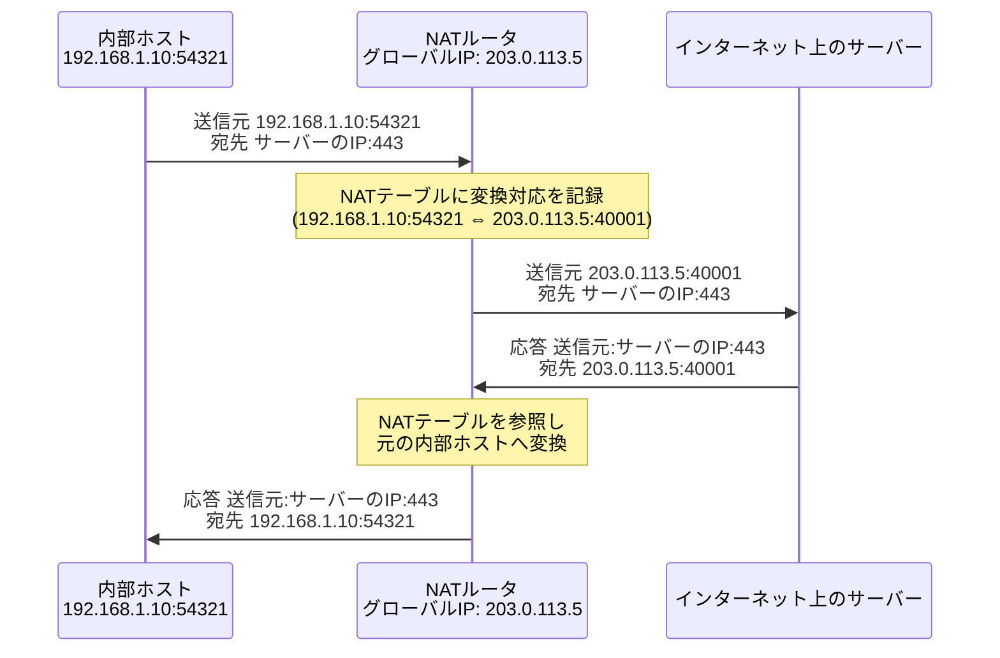

### ICMPとインターネットの経路検証

**ICMP(Internet Control Message Protocol)**は、IPの補助的な制御・エラー通知プロトコルです。`ping`はICMPのEcho Request/Echo Replyを、`traceroute`はTTL(Time To Live)を1ずつ増やしながら送出したパケットに対するICMP Time Exceeded応答を利用して経路上のルータを可視化します。

**ベストプラクティス**
- サブネット設計では将来の拡張余地を残す。ぎりぎりのホスト数で設計すると増設のたびに再設計が必要になる
- クラウド環境のVPC設計でも、CIDRブロックの重複を避けるため組織全体でIPアドレス管理(IPAM)の台帳を持つ
- NAT環境では「内側から外側への接続」は容易だが「外側から内側への接続」には追加設定(ポートフォワーディングなど)が必要になる非対称性を理解しておく
- インターネットの経路制御(BGP)は「宛先までの最短距離」ではなく「ポリシー」で決まる点に注意する。詳細はステップ8で扱う

---

<a id="step5"></a>

## ステップ5: トランスポート層 ― エンドツーエンドの信頼性

トランスポート層は、ネットワーク層が提供する「ホスト間通信」を、アプリケーションプロセス間の通信に橋渡しする層です。代表的なプロトコルがTCPとUDPで、ポート番号によってどのアプリケーションプロセス宛かを識別します。

### TCPの3ウェイハンドシェイク

TCP(Transmission Control Protocol)は、コネクション指向で信頼性のある通信を提供します。通信開始時には**3ウェイハンドシェイク**によって双方の初期シーケンス番号を同期します。

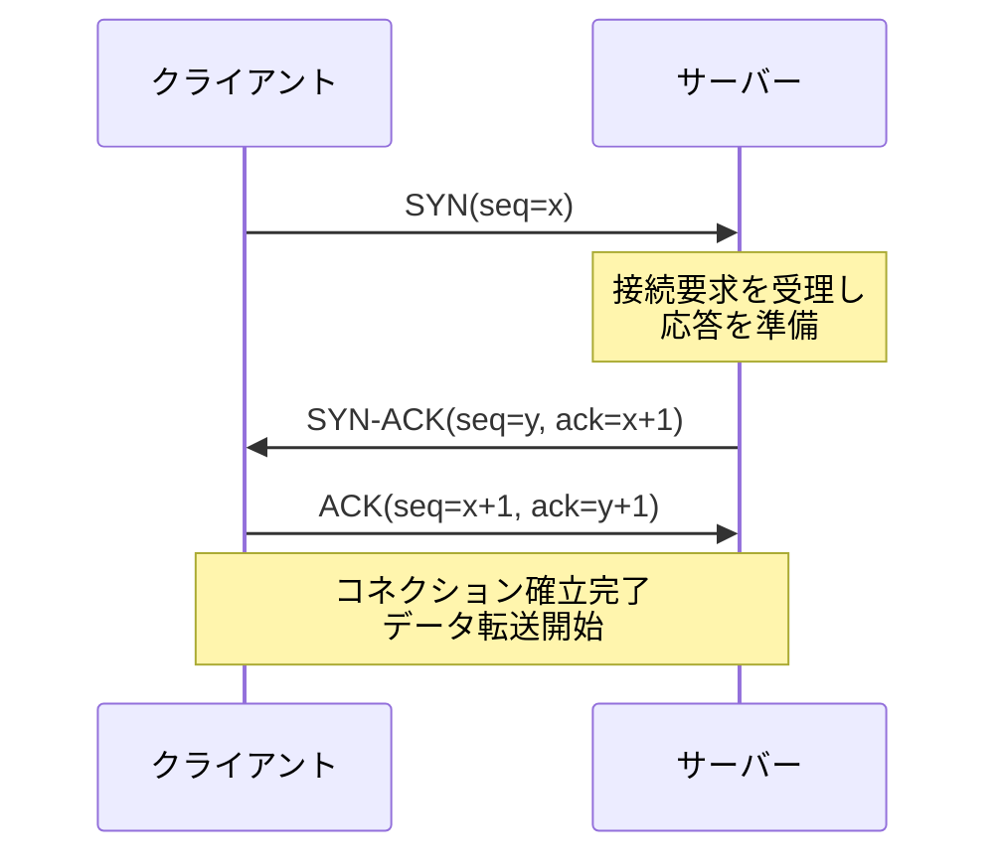

### TCPコネクションの状態遷移

TCPコネクションは接続確立から切断まで、いくつかの状態を遷移します(簡略版)。

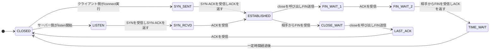

### フロー制御と輻輳制御

TCPは受信側のバッファ溢れを防ぐ**フロー制御(ウィンドウサイズによる調整)**と、ネットワーク経路の混雑を避ける**輻輳制御(congestion control)**の両方を実装しています。輻輳制御の古典的アルゴリズムは次のように段階を踏みます。

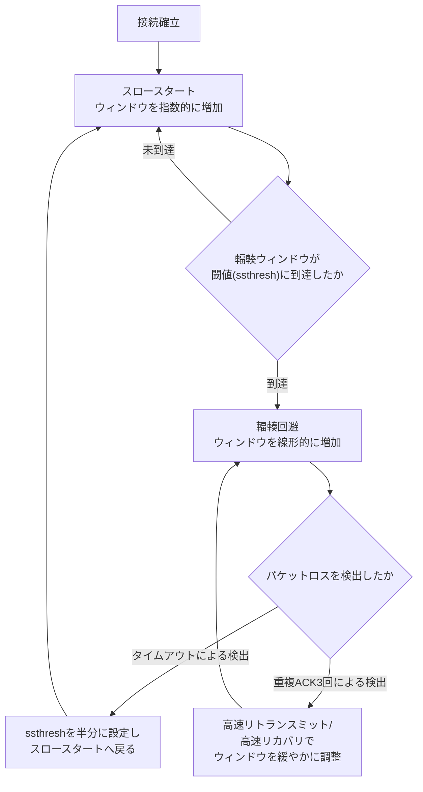

近年は上記の古典的アルゴリズム(Reno/CUBICなど)に加え、Googleが開発した**BBR(Bottleneck Bandwidth and Round-trip propagation time)**のような、パケットロスではなく実測の帯域幅とRTTをもとに送信レートを調整するモデルベースの輻輳制御アルゴリズムの採用も進んでいます。

### TCPとUDPの比較

| 項目 | TCP | UDP |
|---|---|---|
| コネクション | コネクション指向(3ウェイハンドシェイク) | コネクションレス |
| 信頼性 | 再送・順序制御あり | なし(ロスは上位層かアプリで対処) |
| フロー制御・輻輳制御 | あり | なし |
| ヘッダサイズ | 20バイト以上 | 8バイト |
| 代表的な用途 | Web(HTTP/1.1・HTTP/2)、メール、ファイル転送 | DNS、動画配信・音声通話(リアルタイム性重視)、QUICの下位層 |
| 遅延特性 | ハンドシェイク・再送待ちで遅延が生じやすい | 低遅延だが信頼性は上位層次第 |

UDPの上に信頼性・輻輳制御・暗号化を独自に構築したのが、後述するQUIC(RFC 9000)です。QUIC自体はトランスポートプロトコルであり、HTTP/3はその上で動作するアプリケーション層プロトコルです。TCPのようにOSカーネルへ組み込まれるのではなくユーザースペースのライブラリとして実装できるため、輻輳制御アルゴリズムの改善サイクルを速められる利点があります。

**ベストプラクティス**
- リアルタイム性が重要(音声・動画・ゲーム)なら再送によるヘッドオブラインブロッキングを避けるためUDPベースのプロトコルを検討する
- TCPコネクションの`TIME_WAIT`状態が大量に滞留する場合はソケットの再利用設定やコネクションプーリングを見直す
- 輻輳制御アルゴリズムはOSやカーネルバージョンによって既定値が異なる(CUBICが長らくLinuxの既定、BBR系への移行が進行中)。高スループットが必要なサーバーでは明示的に選定・検証する

---

<a id="step6"></a>

## ステップ6: アプリケーション層 ― 人とアプリのためのプロトコル

アプリケーション層は、ユーザーや他のアプリケーションが直接利用するプロトコル群です。ここでは特に重要なDNS、HTTP/HTTPS、DHCPを扱います。

### DNS(Domain Name System)による名前解決

人間が覚えやすいドメイン名(例: `example.com`)を、コンピュータが通信に使うIPアドレスへ変換する仕組みがDNSです。DNSは階層構造の分散データベースであり、ルートサーバー→TLD(トップレベルドメイン)サーバー→権威サーバーの順に問い合わせが行われます。

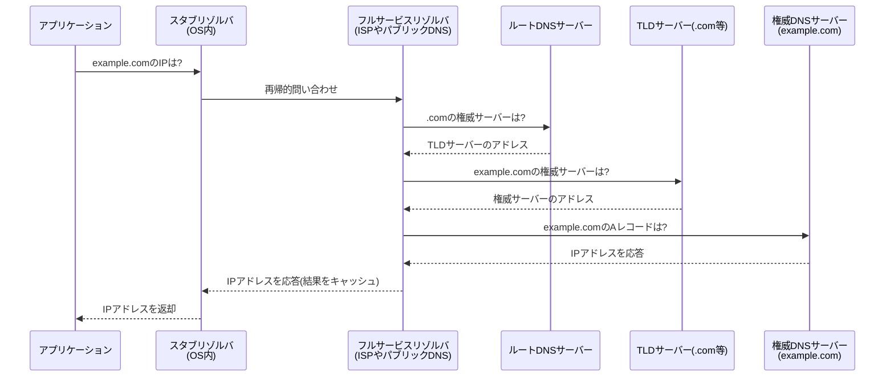

**ベストプラクティス**
- TTL(Time To Live)を短くしすぎるとDNSサーバー負荷とレイテンシが増え、長くしすぎるとフェイルオーバー時の切り替えが遅くなる。用途に応じたバランスを取る
- DNSSECによる応答の署名検証や、DNS over HTTPS/TLS(DoH/DoT)による問い合わせの暗号化・改ざん防止も、セキュリティ要件次第で検討する

### HTTP/HTTPSの基本

HTTP(HyperText Transfer Protocol)は1989〜1991年にCERNのTim Berners-Lee氏らによって考案され、その後HTTP/1.0(1996年)、HTTP/1.1(1999年)、HTTP/2(2015年)、そしてQUICを輸送層に使うHTTP/3(2022年に仕様確定)へと進化してきました。

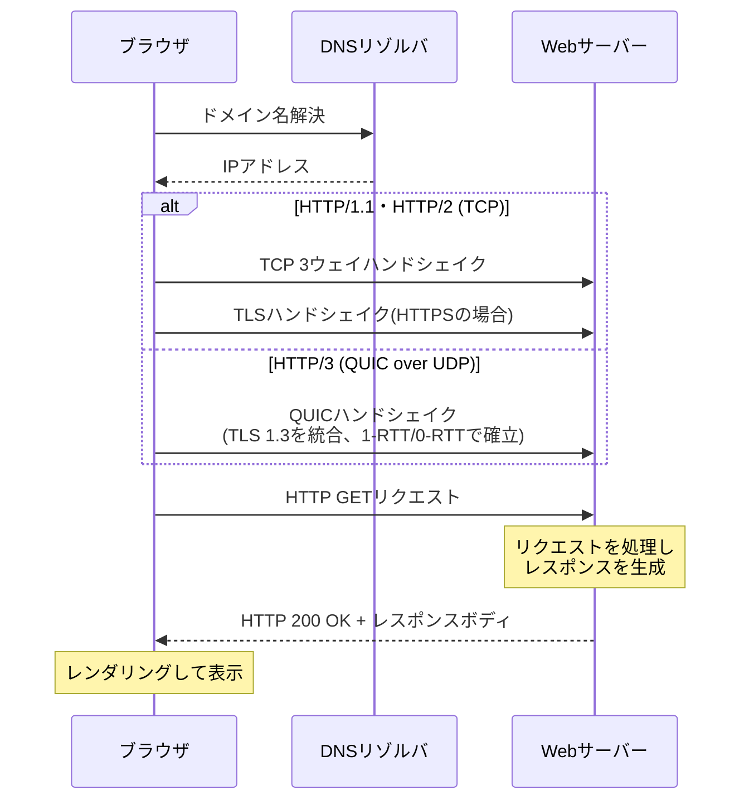

HTTPバージョンごとの特徴を整理します。

| バージョン | 輸送プロトコル | 特徴 |
|---|---|---|
| HTTP/1.1 | TCP | リクエストごとにヘッドオブラインブロッキングが発生しやすい |
| HTTP/2 | TCP | 1コネクション上で複数リクエストを多重化(ストリーム)、ヘッダ圧縮(HPACK) |
| HTTP/3 | QUIC(UDPベース) | TCPのパケットロスに起因するヘッドオブラインブロッキングを解消、コネクション確立の高速化 |

### メールプロトコルの概要

| プロトコル | 役割 |
|---|---|
| SMTP(Simple Mail Transfer Protocol) | メールの送信・サーバー間中継 |
| IMAP(Internet Message Access Protocol) | サーバー上のメールボックスを複数端末から同期的に参照 |
| POP3(Post Office Protocol version 3) | メールをサーバーから端末へダウンロードして管理(同期性は低い) |

### DHCPによる自動設定

DHCP(Dynamic Host Configuration Protocol)は、端末がネットワークに参加する際にIPアドレス・サブネットマスク・デフォルトゲートウェイ・DNSサーバーなどを自動的に取得する仕組みです。一連のやり取りは頭文字を取って**DORA**(Discover, Offer, Request, Acknowledge)と呼ばれます。

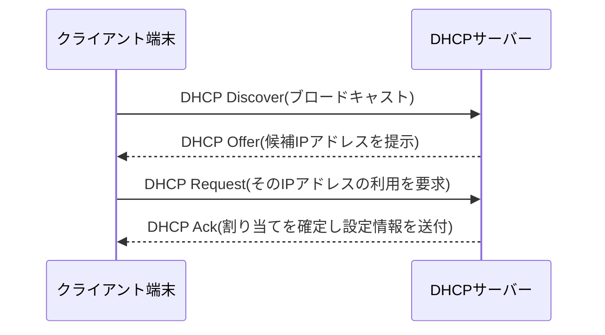

**ベストプラクティス**
- HTTPS化(TLS導入)は今やデフォルトの前提とする。平文HTTPは中間者による盗聴・改ざんのリスクを常に伴う
- DHCPのリース期間は、端末の入れ替わり頻度(オフィスWi-Fi、来客用ネットワークなど)に応じて調整する
- APIのタイムアウト設計では、DNS解決・TCP確立・TLSハンドシェイク・実際のリクエスト処理それぞれに要する時間を分けて見積もる

---

<a id="step7"></a>

## ステップ7: ネットワークセキュリティ ― 守るべきものと手段

### TLSによる暗号化通信

TLS(Transport Layer Security)は、トランスポート層の上でアプリケーションデータを暗号化・完全性保護・認証するプロトコルです。現行の主流であるTLS 1.3では、ハンドシェイクが従来の2往復(2-RTT)から1往復(1-RTT)に短縮され、接続確立の高速化とともに、古い脆弱な暗号スイートの廃止によるセキュリティ強化が図られています。

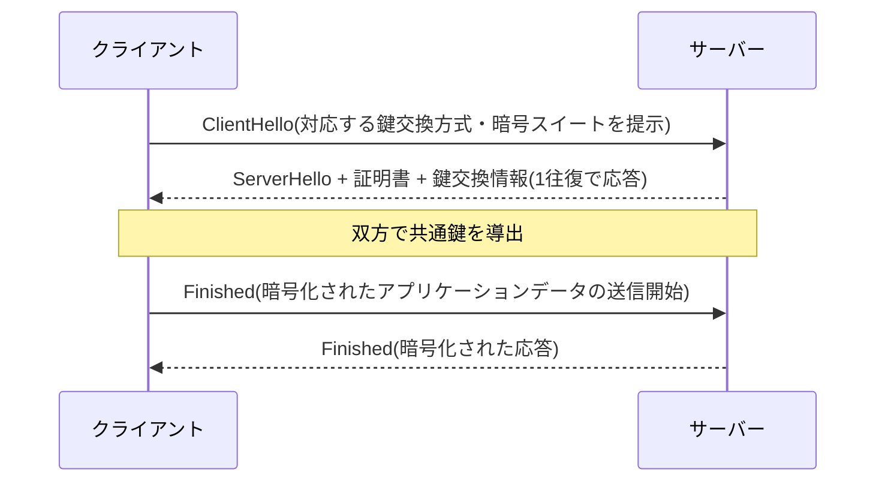

### VPN(Virtual Private Network)

VPNは、公衆ネットワーク(インターネット)上に暗号化されたトンネルを構築し、あたかも専用線で接続されているかのように離れた拠点や端末を結ぶ技術です。

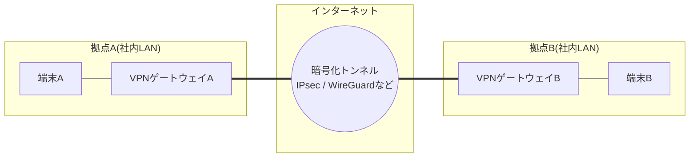

サイト間(site-to-site)VPNは拠点同士を常時接続する構成、リモートアクセスVPNは個々の端末が社内網へ接続する構成です。近年はVPNに代わり、通信ごとに信頼性を検証する**ゼロトラストネットワークアクセス(ZTNA)**の採用も広がっています。

### ファイアウォールとDMZアーキテクチャ

ファイアウォールは、あらかじめ定義したルールに基づき通過させるトラフィックを制限する仕組みです。インターネットに公開するサーバーは、内部ネットワークとは別の緩衝区画である**DMZ(DeMilitarized Zone)**に配置し、万一そこが侵害されても内部網へ直接影響しないようにする設計が一般的です。

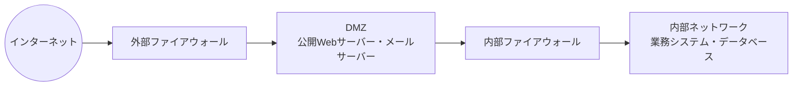

### 耐量子暗号(PQC)への移行

将来の量子コンピュータによる暗号解読リスクに備え、「今傍受して保存し、将来の量子コンピュータで復号する」攻撃(harvest-now, decrypt-later)への対策として、鍵交換を量子耐性のあるアルゴリズムへ移行する動きが急速に進んでいます。詳細な最新数値はステップ8で扱います。

**ベストプラクティス**
- TLS証明書の自動更新(ACMEプロトコルなど)を導入し、有効期限切れによる障害を防ぐ
- VPNの認証情報は多要素認証(MFA)と組み合わせ、単一の秘密情報漏洩でネットワーク全体が突破されない設計にする
- ファイアウォールルールは「デフォルト拒否・必要な通信のみ許可」を原則とし、定期的な棚卸しでルールの陳腐化を防ぐ
- DDoS対策は自組織のインフラだけで完結させず、上流のISPやCDN/DDoS対策サービスと連携した多層防御を検討する

---

<a id="step8"></a>

## ステップ8: 2026年の最新動向 ― 今のインターネットはどう変わったか

ここまでの原理は変わりませんが、実際にインターネット上でどのプロトコルがどの程度使われているかは年々変化しています。2026年9月時点で確認できる主要な動向を整理します。

| 分野 | 動向 | 出典 |
|---|---|---|
| IPv6 | Googleの計測で、Google宛アクセスのうちネイティブIPv6経由の比率が2026年3月28日に初めて50%を突破(50.10%) | ISOC Pulse, APNIC Blog |
| HTTP/3・QUIC | Cloudflareの年次レポートでは、HTTP/3がWeb全体で無視できない比率を占める一方、CDNや主要事業者以外への普及がボトルネックとなり、Cloudflare経由トラフィックでのシェアは横ばい〜微減の局面も観測されている | Cloudflare Radar 2025 Year in Review |
| BGPルーティングセキュリティ | RPKI(経路の暗号署名検証)が普及し、Cloudflare計測でのIPv4の有効(valid)経路シェアは2025年通年で53.9%まで上昇(前年から3.9ポイント増) | Cloudflare Radar 2025 Year in Review |
| 耐量子TLS | Cloudflareは2025年後半、人間由来と判定されるトラフィックのうち耐量子鍵交換(X25519MLKEM768などのハイブリッド方式)で保護される割合が過半数を超えたと報告 | Cloudflare Blog |
| Wi-Fi | Wi-Fi 7(IEEE 802.11be)が2025年に正式標準化され、2026年通年で全世界の対応機器出荷が約11億台規模に到達する見込み。次世代のWi-Fi 8(802.11bn)は速度よりも複数AP協調やローミングの安定性を重視する方向で、標準化目標は2028年 | Network World |
| DDoSの巨大化 | Cloudflareの観測では、2025年通年でハイパーボリューメトリック(1Tbps超/10億pps超)なDDoS攻撃のピーク規模が、バイト数ベースで約10倍、パケット数ベースで約7倍に拡大 | Cloudflare Radar 2025 Year in Review |

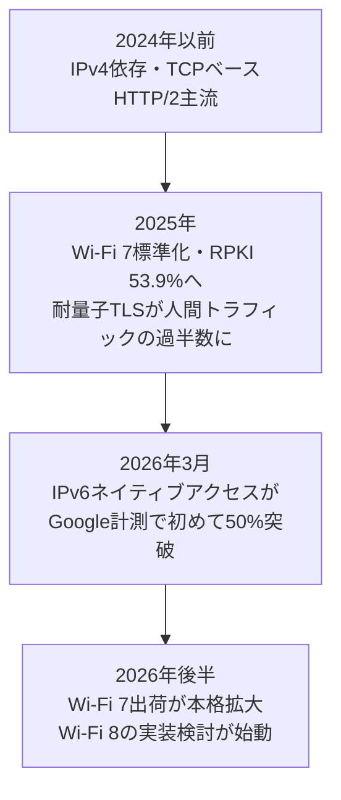

**ベストプラクティス**
- 新規サービス構築時はIPv4/IPv6デュアルスタックを既定とし、IPv6専用環境からのアクセスを排除しない
- CDNやロードバランサの設定でHTTP/3(QUIC)対応状況を定期的に見直す。UDPを通す必要があるためファイアウォール・NAT機器側の対応も合わせて確認する
- BGPを運用する組織はRPKI ROA(Route Origin Authorization)の登録を進め、経路乗っ取り(ハイジャック)への耐性を高める
- 耐量子暗号への移行計画(クリプトインベントリの棚卸し、ハイブリッド鍵交換対応のライブラリ選定)を早期に着手する。特に長期秘匿が必要なデータを扱う場合は優先度を上げる

---

<a id="step9"></a>

## ステップ9: トラブルシューティングの基本 ― 現場で使う一次切り分け

ネットワーク障害の一次切り分けは、階層モデルに沿って「どのレイヤーで問題が起きているか」を絞り込むのが定石です。

```mermaid
flowchart TD
    Q1["症状: 通信ができない/遅い"] --> Q2{"物理的な接続は<br/>正常か(リンクランプ・電波強度)"}
    Q2 -->|異常| F1["物理層の問題<br/>ケーブル・電波環境を確認"]
    Q2 -->|正常| Q3{"同一セグメント内の<br/>通信(ARP解決など)は可能か"}
    Q3 -->|不可| F2["データリンク層の問題<br/>スイッチ設定・VLANを確認"]
    Q3 -->|可能| Q4{"デフォルトゲートウェイへ<br/>pingが通るか"}
    Q4 -->|不可| F3["ネットワーク層(自セグメント〜GW)の問題<br/>IP設定・ルーティングを確認"]
    Q4 -->|可能| Q5{"traceroute/tracertで<br/>宛先まで到達するか"}
    Q5 -->|不可| F4["経路上のネットワーク層の問題<br/>途中ルータ・ファイアウォールを確認"]
    Q5 -->|可能| Q6{"宛先ポートへの<br/>TCP接続(telnet/nc)は成立するか"}
    Q6 -->|不可| F5["トランスポート層の問題<br/>ポート開放・サービス起動状態を確認"]
    Q6 -->|可能| Q7{"アプリケーションの応答<br/>(HTTPステータス等)は正常か"}
    Q7 -->|異常| F6["アプリケーション層の問題<br/>アプリログ・証明書・DNSを確認"]
    Q7 -->|正常| F7["ネットワーク経路は正常<br/>クライアント側の実装・キャッシュ等を確認"]
```

### よく使う一次切り分けコマンド

| コマンド | 主な用途 | 対象レイヤーの目安 |
|---|---|---|
| `ping` | 疎通確認、RTT測定 | ネットワーク層(ICMP) |
| `traceroute` / `tracert` | 経路上の各ホップを可視化 | ネットワーク層 |
| `dig` / `nslookup` | DNS問い合わせの確認 | アプリケーション層(DNS) |
| `curl -v` | HTTP/HTTPS通信の詳細(ヘッダ・TLS情報)を確認 | アプリケーション層〜トランスポート層 |
| `tcpdump` / Wireshark | パケットキャプチャによる全レイヤーの詳細確認 | 全レイヤー |
| `ss` / `netstat` | 自ホストのソケット状態(LISTEN/ESTABLISHEDなど)確認 | トランスポート層 |

**ベストプラクティス**
- 「遅い」という報告を受けたら、まず`ping`でRTTのベースラインを取り、`traceroute`でどのホップから遅延が増えているかを確認する
- TLSエラーの切り分けでは`curl -v`や`openssl s_client`で証明書チェーン・プロトコルバージョン・暗号スイートのネゴシエーション結果を直接確認する
- パケットキャプチャは本番環境で無制限に取得せず、フィルタ(ホスト・ポート指定)と時間・サイズの上限を設けて実施する

---

<a id="roadmap"></a>

## 学習ロードマップ

1. **基礎固め**: 本ガイドのステップ0〜3(階層モデル・物理層・データリンク層・MACサブレイヤー)を、手元のPCで`ipconfig`/`ifconfig`やARPテーブルを確認しながら学ぶ
2. **ネットワーク層とトランスポート層**: サブネッティングを実際に手計算し、`tcpdump`でTCP 3ウェイハンドシェイクを観察する
3. **アプリケーション層**: `dig`でDNSの再帰的問い合わせを観察し、`curl -v`でHTTP/HTTPSのやり取りを確認する
4. **セキュリティ**: 自分の管理下にある環境でTLS設定・VPN・ファイアウォールルールを実際に構成してみる
5. **実運用の視点**: クラウド環境(VPC、セキュリティグループ、CDN)の設定を、これまで学んだレイヤー構造と対応付けて理解する
6. **最新動向の継続的キャッチアップ**: IETF・主要CDNベンダー(Cloudflare、Google、AWS)のブログ、APNIC BlogやISOC Pulseなどの一次情報を定期的に確認する

<a id="checklist"></a>

## ベストプラクティス チェックリスト

- [ ] 階層モデル(OSI/TCP-IP)を使って「どの層の問題か」を切り分けられる
- [ ] カプセル化・非カプセル化の流れを、実際のパケットキャプチャと対応付けて説明できる
- [ ] CIDR表記からネットワークアドレス・ブロードキャストアドレス・利用可能ホスト数を計算できる
- [ ] TCPの3ウェイハンドシェイクと4ウェイクローズ(FIN/ACKのやり取り)を図なしで説明できる
- [ ] TCPとUDPの使い分けを、遅延・信頼性・輻輳制御の観点で判断できる
- [ ] DNSの再帰的問い合わせの流れと、TTL設定がもたらすトレードオフを理解している
- [ ] TLSハンドシェイクの流れと、証明書検証が果たす役割を説明できる
- [ ] NATがもたらす到達性の非対称性(内→外は容易、外→内は要設定)を理解している
- [ ] 障害調査時に`ping`/`traceroute`/`dig`/`curl -v`/`tcpdump`を使い分けられる
- [ ] IPv6デュアルスタック、HTTP/3、耐量子TLSなど2026年時点の実装動向を把握し、自組織のロードマップに反映できる

<a id="glossary"></a>

## 用語集

| 用語 | 説明 |
|---|---|
| AS(Autonomous System) | 単一の管理ポリシーで運用されるネットワークの集合。ASNという番号で識別される |
| ARP(Address Resolution Protocol) | 同一セグメント内でIPアドレスからMACアドレスを解決するプロトコル |
| BGP(Border Gateway Protocol) | 自律システム間で経路情報を交換する経路ベクトル型プロトコル。インターネットの根幹をなす |
| CDN(Content Delivery Network) | コンテンツを地理的に分散配置したサーバー群から配信し、遅延と負荷を軽減する仕組み |
| CIDR(Classless Inter-Domain Routing) | クラスに縛られない可変長のIPアドレス割り当て方式 |
| DHCP(Dynamic Host Configuration Protocol) | 端末へのIPアドレス等の自動割り当てプロトコル |
| DMZ(DeMilitarized Zone) | 内部網とインターネットの間に置く緩衝ネットワーク区画 |
| DNS(Domain Name System) | ドメイン名とIPアドレスを対応付ける分散データベースシステム |
| ICMP(Internet Control Message Protocol) | IPの制御・エラー通知プロトコル。ping/tracerouteの基盤 |
| MAC アドレス | データリンク層で機器を識別する48ビットの物理アドレス |
| MTU(Maximum Transmission Unit) | 次のネットワークへ送出できるIPデータグラム(ネットワーク層パケット)の最大サイズ。L2ヘッダやFCSを含むフレーム全体のサイズとは区別する |
| NAT(Network Address Translation) | プライベートIPアドレスとグローバルIPアドレスを変換する仕組み |
| QUIC | UDP上に構築された、信頼性・輻輳制御・暗号化を統合した新しい輸送プロトコル。HTTP/3の基盤 |
| RPKI(Resource Public Key Infrastructure) | BGP経路とAS番号の正当性を暗号署名で検証する仕組み |
| RTT(Round Trip Time) | パケットが送信されてから応答が返るまでの往復時間 |
| TLS(Transport Layer Security) | トランスポート層の上でデータを暗号化・認証するプロトコル。HTTPSの基盤 |
| VLAN(Virtual LAN) | 物理配線を変えずにブロードキャストドメインを論理的に分割する仕組み |
| ZTNA(Zero Trust Network Access) | 通信のたびに信頼性を検証する、VPNに代わるアクセス制御モデル |

<a id="references"></a>

## 参考文献

**書籍(本ガイドの構成の着想元)**
- Andrew S. Tanenbaum, David J. Wetherall, *Computer Networks, Fifth Edition* — O'Reilly: https://www.oreilly.com/library/view/computer-networks-fifth/9780133485936/

**階層モデル・基礎概念(Cloudflare Learning Center)**
- What is the OSI Model?: https://www.cloudflare.com/learning/ddos/glossary/open-systems-interconnection-model-osi/
- What is the network layer?: https://www.cloudflare.com/learning/network-layer/what-is-the-network-layer/
- What is Layer 7?: https://www.cloudflare.com/learning/ddos/what-is-layer-7/
- Network Layers reference(Cloudflare Developers): https://developers.cloudflare.com/fundamentals/reference/network-layers/

**HTTP/Web(MDN Web Docs, Mozilla)**
- Overview of HTTP: https://developer.mozilla.org/en-US/docs/Web/HTTP/Guides/Overview
- Evolution of HTTP: https://developer.mozilla.org/en-US/docs/Web/HTTP/Guides/Evolution_of_HTTP

**IETF RFC(一次規格文書)**
- RFC 791, Internet Protocol(IPv4): https://www.rfc-editor.org/rfc/rfc791
- RFC 8200, Internet Protocol, Version 6 (IPv6): https://www.rfc-editor.org/rfc/rfc8200
- RFC 9293, Transmission Control Protocol (TCP): https://www.rfc-editor.org/rfc/rfc9293
- RFC 768, User Datagram Protocol (UDP): https://www.rfc-editor.org/rfc/rfc768
- RFC 9000, QUIC: A UDP-Based Multiplexed and Secure Transport: https://www.rfc-editor.org/rfc/rfc9000
- RFC 9114, HTTP/3: https://www.rfc-editor.org/rfc/rfc9114
- RFC 8446, The Transport Layer Security (TLS) Protocol Version 1.3: https://www.rfc-editor.org/rfc/rfc8446
- RFC 1035, Domain Names - Implementation and Specification (DNS): https://www.rfc-editor.org/rfc/rfc1035
- RFC 2131, Dynamic Host Configuration Protocol (DHCP): https://www.rfc-editor.org/rfc/rfc2131
- RFC 1918, Address Allocation for Private Internets: https://www.rfc-editor.org/rfc/rfc1918

**2026年時点の最新動向(著名な国際組織・開発者コミュニティの一次情報)**
- 18 Years Later, IPv6 Reaches Majority — Internet Society Pulse(2026年4月): https://pulse.internetsociety.org/en/blog/2026/04/18-years-later-ipv6-reaches-majority/
- Google hits 50% IPv6 — APNIC Blog(2026年4月): https://blog.apnic.net/2026/04/28/google-hits-50-ipv6/
- Cloudflare Radar 2025 Year in Review(HTTPバージョン分布、IPv6採用率、RPKI経路検証率、DDoS規模の推移を含む): https://radar.cloudflare.com/year-in-review/2025
- State of the post-quantum Internet in 2025 — Cloudflare Blog: https://blog.cloudflare.com/pq-2025/
- Post-quantum cryptography (PQC) — Cloudflare SSL/TLS Documentation: https://developers.cloudflare.com/ssl/post-quantum-cryptography/
- Automatically Secure: how we upgraded 6,000,000 domains by default — Cloudflare Blog: https://blog.cloudflare.com/automatically-secure/
- HTTP/3 (with QUIC) — Cloudflare Speed Documentation: https://developers.cloudflare.com/speed/optimization/protocol/http3/
- Wi-Fi 8 in 2026: Next-gen wireless standard prioritizes reliability over speed gains — Network World: https://www.networkworld.com/article/4112600/wi-fi-8-in-2026-next-gen-wireless-standard-prioritizes-reliability-over-speed-gains.html
- Wi-Fi 7 (802.11be) Technical Guide — Cisco Meraki Documentation: https://documentation.meraki.com/Wireless/Design_and_Configure/Architecture_and_Best_Practices/Wi-Fi_7_(802.11be)_Technical_Guide

---

*本ガイドはTanenbaum & Wetherall著『Computer Networks, Fifth Edition』の学習順序(物理層から積み上げていく構造化アプローチ)に着想を得つつ、2026年9月時点の最新動向を交えて独自に再構成した教材です。原著からの文章・図版の引用・複製は行っていません。*
