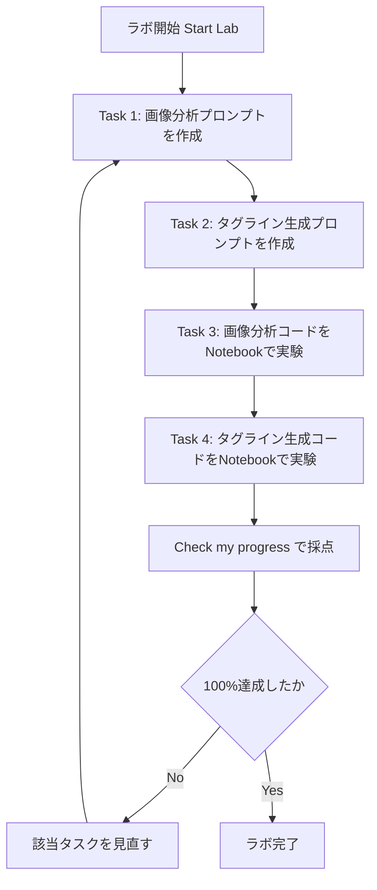
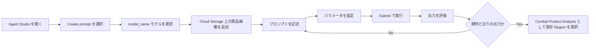
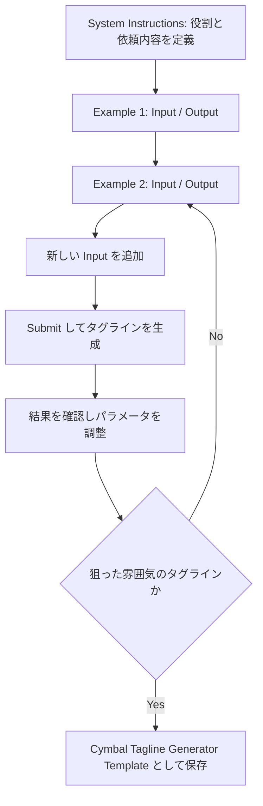
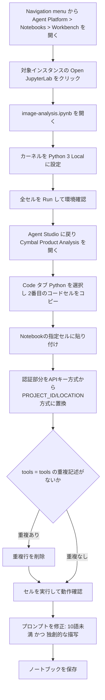
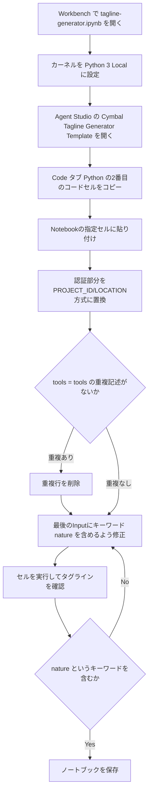

# Cymbal Direct マーケティングキャンペーン支援チャレンジラボ 攻略ガイド

## ― Google Cloud Agent Studio と Gemini によるプロンプトエンジニアリング実践 ―

> 対象ラボ: *Prompt Design in Agent Platform: Challenge Lab*
> URL: https://www.skills.google/paths/118/course_templates/976/labs/647551

このガイドは、世界トップクラスのインフラエンジニア／Google Cloud スペシャリストの視点から、上記チャレンジラボを**初学者でも迷わずクリアできる**ように、各タスクの背景知識・手順・ベストプラクティスを整理したものです。ラボ本文にある `model_name`、`image file path`、`Region`、`Workbench instance name` などのプレースホルダーは、**実際のラボ画面に表示される固有の値に読み替えてください**（受講者ごと・セッションごとにランダムに割り当てられます）。

---

## 目次

1. [ラボ全体像とゴール](#1-ラボ全体像とゴール)
2. [開始前のベストプラクティス](#2-開始前のベストプラクティス)
3. [Task 1: Gemini 画像分析ツールの構築](#3-task-1-gemini-画像分析ツールの構築)
4. [Task 2: Gemini タグラインジェネレーターの構築](#4-task-2-gemini-タグラインジェネレーターの構築)
5. [Task 3: 画像分析コードの実験（Notebook）](#5-task-3-画像分析コードの実験notebook)
6. [Task 4: タグライン生成コードの実験（Notebook）](#6-task-4-タグライン生成コードの実験notebook)
7. [トラブルシューティング早見表](#7-トラブルシューティング早見表)
8. [ベストプラクティス総まとめ](#8-ベストプラクティス総まとめ)
9. [参考文献・ソースURL一覧](#9-参考文献ソースurl一覧)

---

## 1. ラボ全体像とゴール

Cymbal Direct（アウトドア用品の新ラインを展開するオンライン小売業者）のマーケティングキャンペーンを、Google Cloud の **Agent Studio**（旧 Vertex AI Studio。Gemini Enterprise Agent Platform の一部）と **Gemini** モデルを使って効率化するのが、このラボのシナリオです[^1]。

やることは大きく2系統・4タスクに分かれます。

| タスク | 目的 | 主に使うツール | 成果物 |
|---|---|---|---|
| Task 1 | 商品画像から説明文候補を生成するプロンプト作成 | Agent Studio（Create prompt） | `Cymbal Product Analysis` という名前で保存されたプロンプト |
| Task 2 | 属性・ターゲット・感情に応じたタグライン生成プロンプト作成 | Agent Studio（Create prompt） | `Cymbal Tagline Generator Template` という名前で保存されたプロンプト |
| Task 3 | Task 1 のコードを Notebook に持ち込み、出力を「10語未満」「独創的」に改良 | Workbench / JupyterLab | 更新済み `image-analysis.ipynb` |
| Task 4 | Task 2 のコードを Notebook に持ち込み、キーワード `nature` を含むタグラインを生成 | Workbench / JupyterLab | 更新済み `tagline-generator.ipynb` |

全体の流れを図にすると次のようになります。



チャレンジラボは「手順書なしで、これまでの講座で学んだスキルを自力で組み立てる」形式のため、各タスクの**目的（何を評価されるか）**を理解してから作業することが最短ルートです[^1]。

---

## 2. 開始前のベストプラクティス

ラボ本文の Setup and requirements に記載されている注意点は、Google Cloud Skills Boost 系チャレンジラボ共通の定石です[^1]。

| 項目 | ベストプラクティス | 理由 |
|---|---|---|
| ブラウザウィンドウ | シークレット（プライベート）ウィンドウを使用する | 個人アカウントとの競合を防ぎ、意図しない課金を避けるため |
| ログインアカウント | ラボが発行する Student アカウントのみを使う | 個人の Google Cloud アカウントに誤って課金されるのを防ぐため |
| タイマー | 開始前に必要作業をイメージし、一気に進める | ラボは一時停止できず、時間切れでリソースが失効するため |
| モデル指定 | 各タスクで指定された `model_name` を必ず使用する | 採点スクリプトは指定モデルの利用を前提にチェックするため |
| プロンプト保存 | 名前・リージョンを指示どおり厳密に入力する | 採点は名前の完全一致で行われることが多いため |

---

## 3. Task 1: Gemini 画像分析ツールの構築

### 3.1 Agent Studio とは

Agent Studio は、Gemini モデル向けのプロンプトを自然言語・コード・画像・動画を使って設計・テスト・管理できる Google Cloud のツールです[^2][^3]。旧称は Vertex AI Studio で、現在は Gemini Enterprise Agent Platform の一機能として提供されています。プロンプトの微調整を自然言語で指示する「Natural language refinement」や、System instructions をワンクリックで最適化する機能も備わっています[^3]。

### 3.2 手順（ステップバイステップ）



1. Agent Studio で新規プロンプトを作成し、指定された `model_name` を選択する。
2. 画像の追加ボタンから、Cloud Storage 上の指定パス（ラボに表示される image file path）の商品画像を読み込む。
3. 以下の3種類の出力が得られるよう、複数パターンのプロンプトを試す。
   - シンプルな説明文
   - 広告向けのキャッチーなフレーズ
   - 自然志向キャンペーン向けの詩的な描写
4. 結果を見ながらプロンプトとパラメータを繰り返し調整する（Evaluate and Iterate）。
5. `Cymbal Product Analysis` という名前で Save し、指定 Region を選んで保存する。

### 3.3 プロンプト設計のベストプラクティス（画像＋テキスト）

マルチモーダルプロンプト設計の公式ベストプラクティスは、大きく次の4点に整理できます[^4][^5]。

| ベストプラクティス | 内容 | 出典 |
|---|---|---|
| 具体的な指示を書く | 「説明して」ではなく「色・質感・そこから感じる雰囲気に焦点を当てて説明して」のように、着目してほしい観点を明示する | [^4] |
| 画像を先に置く | 画像1枚＋テキストのプロンプトでは、画像をテキストより前に配置すると精度が上がりやすい | [^5] |
| タスクを分解する | 複雑なタスクは「まず画像を描写する→そのあと広告文に変換する」のようにステップに分ける | [^5] |
| 出力形式を指定する | 「3パターンで」「箇条書きで」のように、欲しい出力の形式・件数まで指定する | [^5] |

> **ベストプラクティス（トラブルシューティング）**: 出力が画像の意図と違う部分に偏る場合は「画像のどの要素に注目してほしいか」をヒントとして追記する。逆に出力が一般論的すぎる場合は、まず画像を言語化させてからタスクを実行させる二段階プロンプトが有効です[^5]。

### 3.4 3種類の出力を作り分けるサンプル方針

| 用途 | プロンプト方針の例 | 推奨 temperature の目安 |
|---|---|---|
| 短い説明文 | 「この画像の商品を1〜2文で簡潔に説明して。色・素材・使用シーンに触れること」 | 低め（0.2〜0.4） |
| 広告向けキャッチフレーズ | 「この画像から、SNS広告で使える短いキャッチコピーを3案出して」 | 中程度（0.6〜0.8） |
| 詩的な描写 | 「この画像が呼び起こす自然の中での感情を、詩的な短い文章で表現して」 | やや高め（0.8〜1.0） |

temperature の考え方の根拠は 3.6 節・5.4 節でまとめて解説します（出典は[^7][^8]）。

---

## 4. Task 2: Gemini タグラインジェネレーターの構築

### 4.1 System Instructions の役割

System instructions は、モデルに与える「役割・振る舞い・制約」を定義する部分で、個々のユーザー入力より優先度の高いコンテキストとして扱われます。Agent Studio の Prompt Gallery でも、プロンプトは「質問・指示・文脈情報・few-shot 例・途中まで入力」の組み合わせで構成できるとされています[^2]。ラボ本文で指定された文面（Cymbal Direct のパートナーシップ説明＋タグライン作成の依頼）を、そのまま System instructions 欄に入力します。

### 4.2 Few-shot プロンプティングの考え方

Vertex AI/Agent Studio では、プロンプトの構造として次の3段階が整理されています[^54]。

| 手法 | 与える例の数 | 向いている場面 |
|---|---|---|
| Zero-shot | 0件 | シンプルなタスク、モデルの素の能力を見たいとき |
| One-shot | 1件 | 出力フォーマットを1つ示せば十分なとき |
| Few-shot | 複数件 | トーン・型・粒度を安定させたいとき（タグライン生成向き） |

ラボでは Input/Output のペアを **2件** 用意する Few-shot 構成を取ります。Few-shot 例は「モデルの応答が期待と異なった具体例を与えて改善する」ための素材としても公式に位置づけられており、プロンプト最適化（few-shot optimizer）の入力にもなります[^13]。



### 4.3 パラメータ設計（属性・ターゲット・感情）

タグラインを「使い回せるテンプレート」にするには、変化させたい軸をプレースホルダーとして切り出すのがベストプラクティスです。

| パラメータ軸 | 例 |
|---|---|
| Product attributes（製品属性） | durable（丈夫）, lightweight（軽量）, waterproof（防水） |
| Target audience（ターゲット層） | young adventurers（若い冒険者）, families（家族連れ） |
| Emotional resonance（感情的な響き） | empowered（力を得た）, connected（自然とつながる） |

プロンプト本文には、これら3つのパラメータをテンプレート変数として埋め込み、1つの入力例を追加して Submit することでタグライン案を生成させます。生成後は、パラメータの組み合わせを変えながら出力のバリエーションを確認し、必要であればプロンプトの文言・パラメータの選択肢自体を調整します（Evaluate and Iterate）。

### 4.4 保存

`Cymbal Tagline Generator Template` という名前で Save し、指定 Region を選択します。Autosave が効いている場合でも、名前が正しく設定されているかを必ず確認してください（採点は名前の一致に依存するため）。

---

## 5. Task 3: 画像分析コードの実験（Notebook）

### 5.1 Workbench / JupyterLab とは

Vertex AI Workbench（Gemini Enterprise Agent Platform Workbench）は、JupyterLab ベースのマネージド開発環境です。データサイエンスのワークフロー全体をカバーし、あらかじめ主要なライブラリがインストールされた状態で提供されます[^10]。

### 5.2 手順



1. Navigation menu から **Agent Platform > Notebooks > Workbench** を開き、指定インスタンスの **Open JupyterLab** をクリックする[^9][^10]。
2. JupyterLab で `image-analysis.ipynb` を開き、カーネルを **Python 3 (Local)** に設定する。
3. 全セルを Run し、環境（依存ライブラリ・認証など）が正しくセットアップされているか確認する。
4. Agent Studio の `Cymbal Product Analysis` プロンプトに戻り、右側の **Code** をクリックして言語を Python に設定する。
5. 表示された2番目のコードセルをコピーし、Notebook の指定セルに貼り付ける。

### 5.3 認証方式の置き換え（API キー → PROJECT_ID / LOCATION）

Agent Studio の「Get code」機能で書き出されるコードは、既定では API キー方式のクライアント初期化になっていることがあります。Notebook 内では、Markdown セルの指示に従って **Vertex AI 方式（PROJECT_ID / LOCATION を使う方式）** に置き換える必要があります。

| 認証方式 | 初期化コード（イメージ） | 向いている場面 |
|---|---|---|
| API キー方式 | `genai.Client(api_key="...")` | 個人検証・Gemini Developer API 経由での利用 |
| Vertex AI（Project/Location）方式 | `genai.Client(vertexai=True, project=PROJECT_ID, location=LOCATION)` | Google Cloud プロジェクトの権限・課金・監査ログと統合したい場合（本ラボの想定） |

出典: Google Gen AI SDK（`google-genai`）の公式リファレンスでは、Gemini Developer API 利用時は `api_key` を、Vertex AI（Agent Platform）利用時は `project` と `location` を指定してクライアントを初期化する、と明記されています[^11][^12]。

```python
# 置き換え後のイメージ（Notebookのmarkdownセルの指示に従って書き換える）
from google import genai

PROJECT_ID = "your-project-id"   # ラボで払い出されたプロジェクトIDに置き換える
LOCATION = "your-location"       # ラボで指定されたリージョンに置き換える

client = genai.Client(
    vertexai=True,
    project=PROJECT_ID,
    location=LOCATION,
)
```

### 5.4 `tools = tools` 重複エラーへの対処

Agent Studio が生成するコードには、まれに `generate_content_config` の中に `tools = tools,` が重複して記述されるケースがあります。これは Python の構文エラー（キーワード引数の重複）を引き起こすため、重複している行のうち片方を削除してから再実行してください。

### 5.5 プロンプト修正のベストプラクティス（10語未満・独創性UP）

このタスクでは「出力を10語未満にする」「モデルにできるだけ創造的・意外性のある描写をさせる」という、相反する方向性の2つの要求を両立させます。

**① 出力を短くする（10語未満）**

プロンプト文の中に、具体的な語数の上限を明示するのが最も確実な方法です（`max_output_tokens` だけに頼ると、文の途中で強制的に切れてしまうリスクがあるため、まずプロンプト側で制約を書くのが定石です）[^6]。

```text
"""この画像を、10語未満の非常に短いフレーズで描写してください。"""
```

**② 独創性・意外性を高める（パラメータ調整）**

ヒントにある「パラメータの調整」とは、`generate_content_config` のサンプリングパラメータのことを指します。代表的なパラメータとその効果は次のとおりです[^7][^8]。

| パラメータ | 役割 | 値を上げると… |
|---|---|---|
| `temperature` | トークン選択のランダム性を制御する | より多様で創造的、予測しづらい出力になる |
| `top_p`（nucleus sampling） | 累積確率が指定値に達するまでのトークン集合から選択する | 選択肢の幅が広がり、より多様な出力になる |
| `top_k` | 次のトークン候補を確率上位k個に絞る | k を大きくするほど、より幅広い語彙が選ばれやすくなる |

> **注意**: 一部の新しいモデル世代（Gemini 3系など）では、`temperature`／`top_p`／`top_k` の指定が非推奨（モデル側が自動でサンプリングを管理）とされている場合があります[^7]。まずラボで指定された `model_name` がどのサンプリングパラメータをサポートするかをドキュメントで確認してください。Gemini 3系のように非推奨とされているモデルでは、サンプリングパラメータを指定せずモデル側の既定に任せます。`temperature` と `top_p` の両方がサポートされる場合でも、両方を同時に動かすと効果が相殺され挙動を予測しにくくなるため、調整するのはどちらか一方に限定します。`temperature` を選ぶ場合は高め（例: 1.0〜1.5 程度）に設定するのが「最も創造的で意外性のある描写」を狙う定石です。

```python
from google.genai import types

generate_content_config = types.GenerateContentConfig(
    temperature=1.3,   # 高めに設定して独創性を狙う
    top_p=0.97,
    max_output_tokens=64,  # 短い出力を想定して余裕を持たせつつ制限
)
```

修正後はセルを再実行し、以前より短く・より意外性のある描写になっているかを確認します。最後に **必ずノートブックファイルを保存**してください（採点はファイルの保存状態を見るため）。

---

## 6. Task 4: タグライン生成コードの実験（Notebook）

### 6.1 手順



Task 3 と同じ要領で、`tagline-generator.ipynb` を開き、カーネルを Python 3 (Local) に設定します。Agent Studio の `Cymbal Tagline Generator Template` から Code（Python）を取得し、指定セルに貼り付けます。認証部分の置き換え、`tools = tools` 重複チェックの手順は 5.3〜5.4 節と同様です。

### 6.2 キーワード指定のベストプラクティス

コード中には複数の Few-shot 例（Input/Output ペア）がトリプルクォート文字列として並んでいます。「最後の Input にキーワード `nature` を含めるよう指示する」という要求は、Few-shot 構造の**最後の実行対象（新しい Input）だけ**を変更し、既存の Example 1・Example 2 はそのまま残すのがポイントです。

```text
"""耐久性のあるハイキング用バックパックのタグラインを書いてください。
'nature' というキーワードを必ず含め、力強く自然とのつながりを感じさせるトーンにしてください。"""
```

キーワードを直接的に「必ず含めてください」と明示することは、プロンプト設計の基本原則である「具体的な指示ほど期待した出力が得られやすい」という考え方に沿っています[^6]。

### 6.3 検証ポイント

セルを再実行し、生成されたタグラインの文中にリテラル文字列 `nature` が含まれているかを確認します。自然を連想させる別の語（`natural`、`outdoors` など）では合格とみなさず、`nature` そのものが出力される必要があります。含まれていなければ、Input 文言をより明示的にする、あるいは Example 側のトーンとの整合を取るなど、プロンプトを再調整します。最後にノートブックを保存します。

---

## 7. トラブルシューティング早見表

| 症状 | 想定される原因 | 対処 | 出典 |
|---|---|---|---|
| プロンプトの出力が画像と無関係な内容になる | 指示が抽象的すぎる／モデルが画像のどこを見るべきか分からない | 着目してほしい観点（色・質感・雰囲気など）を明示する | [^4] |
| 出力が一般論的で画像固有の特徴が出ない | 先にタスクを実行させ、画像の言語化を挟んでいない | 「まず画像を描写して」→「その描写を元に◯◯して」の二段階にする | [^5] |
| コード実行時に構文エラーが出る（`tools = tools` 関連） | `generate_content_config` 内に同じ引数が重複している | 重複した行を削除して再実行する | 本ラボ手順 |
| 認証エラー、または想定と異なるAPI課金経路になる | API キー方式のままVertex AI環境で実行しようとしている | クライアント初期化を `vertexai=True, project=..., location=...` に置き換える | [^11][^12] |
| 出力が指定した語数制限を守らない | プロンプト内に数値制約が明示されていない、または`max_output_tokens`だけに依存している | プロンプト本文に「◯語未満で」と明記する | [^6] |
| 出力が単調・毎回似たような内容になる | `temperature`等のサンプリングパラメータが低いまま | `temperature`・`top_p`を引き上げる（モデルが対応している場合） | [^7][^8] |
| タグラインに指定キーワードが含まれない | 新しい Input にキーワード指定がない、または曖昧 | Input文中に「◯◯というキーワードを必ず含める」と明示する | [^6] |
| Check my progress で加点されない | プロンプト名・保存先リージョンが指定と一致していない、ファイル保存忘れ | 名前の完全一致を確認し、Notebookも明示的に保存してから数分待って再チェックする | 本ラボ手順 |

---

## 8. ベストプラクティス総まとめ

- [ ] 各タスクで指定された `model_name` を必ず使用したか
- [ ] Task 1・Task 2 のプロンプト名（`Cymbal Product Analysis` / `Cymbal Tagline Generator Template`）が完全一致しているか
- [ ] 画像を使うプロンプトでは、画像をテキストより先に配置したか
- [ ] タグラインプロンプトでは、System instructions・Few-shot例2件・パラメータ変数の3点セットを満たしているか
- [ ] Notebookの認証コードを `vertexai=True, project=PROJECT_ID, location=LOCATION` 方式に置き換えたか
- [ ] `tools = tools` の重複がないか確認したか
- [ ] Task 3 の出力が「10語未満」かつ「より創造的・意外性がある」ことを両方満たしているか
- [ ] Task 4 の出力にキーワード `nature` が含まれているか
- [ ] すべてのNotebookファイルを保存したか
- [ ] Check my progress を数分待ってから実行したか

---

## 9. 参考文献・ソースURL一覧

[^1]: Prompt Design in Agent Platform: Challenge Lab（本ラボ本文）: https://www.skills.google/paths/118/course_templates/976/labs/647551
[^2]: Quickstart: Send text prompts to Gemini using Agent Studio: https://docs.cloud.google.com/gemini-enterprise-agent-platform/agent-studio/quickstart
[^3]: Agent Studio capabilities: https://docs.cloud.google.com/gemini-enterprise-agent-platform/agent-studio/agent-studio-capabilities
[^4]: Design multimodal prompts: https://docs.cloud.google.com/gemini-enterprise-agent-platform/models/capabilities/design-multimodal-prompts
[^5]: File prompting strategies（Gemini API Docs）: https://ai.google.dev/gemini-api/docs/file-prompting-strategies
[^6]: Prompt design strategies（Gemini API Docs）: https://ai.google.dev/gemini-api/docs/prompting-strategies
[^7]: Content generation parameters（temperature / top-P / top-K）: https://docs.cloud.google.com/vertex-ai/generative-ai/docs/multimodal/content-generation-parameters
[^8]: GenerationConfig APIリファレンス: https://docs.cloud.google.com/vertex-ai/generative-ai/docs/reference/rest/v1/GenerationConfig
[^9]: Quickstart: Create a Vertex AI Workbench instance: https://docs.cloud.google.com/vertex-ai/docs/workbench/instances/create-console-quickstart
[^10]: Create a notebook（Workbench + Gen AI SDK チュートリアル）: https://docs.cloud.google.com/vertex-ai/docs/tutorials/tabular-bq-prediction/create-notebook
[^11]: Google Gen AI SDK overview（認証方式の選び方）: https://cloud.google.com/vertex-ai/generative-ai/docs/sdks/overview
[^12]: python-genai（GitHub リポジトリ、クライアント初期化の実装例）: https://github.com/googleapis/python-genai
[^13]: Few-shot prompt optimizer: https://docs.cloud.google.com/vertex-ai/generative-ai/docs/learn/prompts/few-shot-optimizer
[^54]: Vertex AI Introduction（Zero-shot / One-shot / Few-shot の整理）: https://github.com/AL1Skey/Vertex-AI-Introduction

---

*本ガイドは、上記チャレンジラボの公開情報とGoogle Cloud公式ドキュメントに基づき、ステップバイステップの学習補助として作成したものです。ラボ本体の採点基準・UI仕様は更新される可能性があるため、実際の画面表示を優先してください。*
