# Cisco Certified DevNet Associate（CCNA Automation / 200-901）初学者向け完全ガイド

> 対象試験：**200-901**（旧 DEVASC ／ 現 CCNAAUTO）
> 作成日：2026-09-30
> 対象読者：プログラミングやネットワーク自動化をこれから学ぶ初学者
> 方針：各項目を「何か → なぜ必要か → 例 → ベストプラクティス → 試験のポイント」の順で説明し、根拠となる URL を章末と巻末に掲載します。

---

## 0. 最初にお読みください（重要：名称変更について）

ご指定の Cisco Japan のページは **「Cisco Certified DevNet Associate」／試験名「200-901 DEVASC」** の表記で、ページ上の最終更新表示は 2024 年です。その後、Cisco は **2026 年 2 月 3 日** から DevNet 認定を **Automation トラック** へ改称しました。Cisco Learning Network の案内では、CCNA Automation の試験内容は従来の 200-901 DEVASC から変更されず、**試験名のみが更新される** とされています。

| 項目 | 旧名称 | 現在の名称 |
| --- | --- | --- |
| 認定名 | Cisco Certified DevNet Associate | **CCNA Automation** |
| 試験コード | 200-901 | 200-901（同じ） |
| 試験略称 | DEVASC | **CCNAAUTO** |
| 試験名 | DevNet Associate Exam | Automating Networks Using Cisco Platforms |
| 上位認定 | DevNet Professional / Expert | CCNP Automation / CCIE Automation |

- 既存の DevNet Associate 保有者は、自動的に CCNA Automation として扱われます（Certmetrics のプロファイルで確認できます）。
- 本ガイドでは、検索や過去教材との照合がしやすいよう **「DevNet Associate（CCNA Automation）」** と併記します。
- **注意**：Cisco 公式の試験範囲（Exam Topics）は予告なく変更される場合があります。受験前に必ず最新版を確認してください（URL は巻末）。

### 0.1 本ガイドの試験範囲の根拠と限界

| 区分 | 内容 |
| --- | --- |
| 章立て・配点・項目番号 | Cisco 公式の 200-901 Exam Topics（v1.0 PDF）に基づく |
| v1.1 での用語変更 | Webex Teams → Webex、DNA Center → Catalyst Center、SD-WAN → Catalyst SD-WAN、AMP → Secure Endpoint、ThreatGrid → Secure Malware Analytics など（公式 Exam Topics の抜粋と第三者解説で確認） |
| 限界 | 最新 v1.1 の公式 PDF 全文は取得できていません。項目番号や細かな文言が異なる可能性があるため、**最終確認は公式ページで行ってください** |

---

## 1. 認定の全体像

### 1.1 認定のサマリー

| 項目 | 内容 |
| --- | --- |
| 認定の目的 | Cisco プラットフォーム上のアプリケーション開発・運用（自動化）に関する基礎スキルの証明 |
| 必要な試験 | **1 つのみ**（200-901） |
| 試験時間 | 120 分 |
| 試験言語 | 英語・日本語 |
| 受験料 | 300 USD（Cisco Learning Credits も利用可能） |
| 有効期間 | 3 年（再認定ポリシーに従う） |
| 公式の前提条件 | なし |
| 推奨経験 | 1 年以上の Python を含むソフトウェア開発経験 |
| 推奨トレーニング | Developing Applications and Automating Workflows using Cisco Core Platforms（DEVASC）／ Cisco U. の学習パス |
| 合格点 | Cisco は公表していません |

### 1.2 どんな人に向いているか

| 役割 | この認定で得られるもの |
| --- | --- |
| ネットワークエンジニア | CLI 手作業から API・スクリプトによる自動化への移行力 |
| ソフトウェア開発者 | ネットワーク／インフラを「プログラムから扱う」ための基礎知識 |
| DevOps／SRE | CI/CD・IaC・コンテナをネットワーク領域へ適用する視点 |
| 初学者 | 開発・API・ネットワークの 3 分野を体系的に学べる入口 |

### 1.3 CCNA（200-301）は必要か

必須ではありません。ただし、第 6 章（Network Fundamentals）の知識が薄い方は、IP アドレス・VLAN・DHCP・DNS・NAT を先に固めると学習が楽になります。

---

## 2. 試験範囲と学習ロードマップ

### 2.1 6 つのドメインと配点

| # | ドメイン | 配点 | 本ガイドの章 |
| --- | --- | --- | --- |
| 1 | Software Development and Design | 15% | 第 1 章 |
| 2 | Understanding and Using APIs | 20% | 第 2 章 |
| 3 | Cisco Platforms and Development | 15% | 第 3 章 |
| 4 | Application Deployment and Security | 15% | 第 4 章 |
| 5 | Infrastructure and Automation | 20% | 第 5 章 |
| 6 | Network Fundamentals | 15% | 第 6 章 |

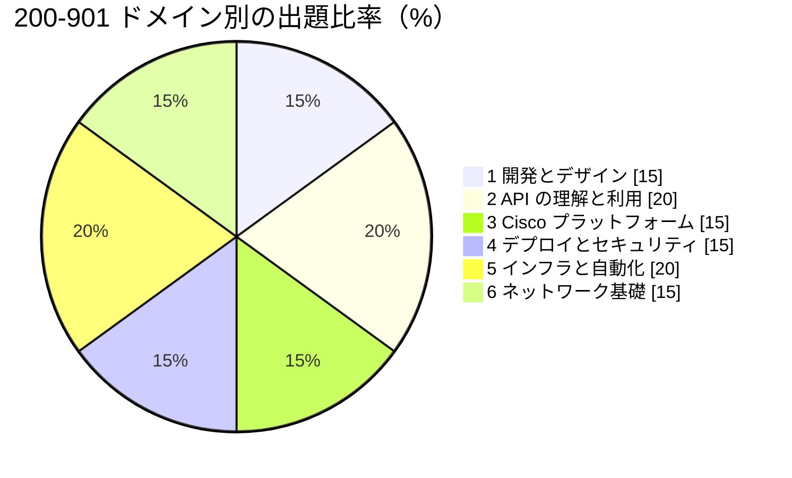

### 2.2 学習ロードマップ（依存関係）

初学者は、土台となる知識（Python・Git・ネットワーク）から順に進めると挫折しにくくなります。

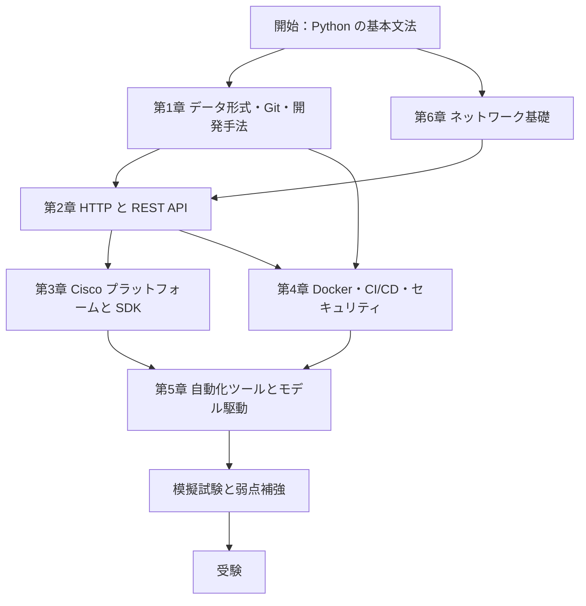

### 2.3 8 週間の学習計画（目安）

| 週 | 学習内容 | ハンズオンの例 |
| --- | --- | --- |
| 1 | 第 1 章：JSON/XML/YAML、Python パース、Git 基本 | ローカルで Git リポジトリを作り、ブランチ・マージを体験 |
| 2 | 第 6 章：IP、VLAN、DHCP、DNS、NAT、ポート | サブネット計算を 10 問解く |
| 3 | 第 2 章前半：HTTP、REST、ステータスコード、認証 | curl / Postman で公開 API を呼ぶ |
| 4 | 第 2 章後半：requests、Webhook、API スタイル | Python で REST API を呼び JSON を整形表示 |
| 5 | 第 3 章：Meraki・Catalyst Center・Webex・SDK、DevNet 資源 | DevNet Sandbox で API を実行 |
| 6 | 第 4 章：Docker、CI/CD、OWASP、Bash | Dockerfile を書き、コンテナを起動 |
| 7 | 第 5 章：Ansible、Terraform、NETCONF/RESTCONF、YANG | Playbook 作成、RESTCONF で GET を実行 |
| 8 | 総復習：模擬問題、弱点補強、公式 Exam Topics との突合 | 時間を計って通し演習（120 分） |

### 2.4 学習全体のベストプラクティス

| 原則 | 理由 | 具体策 |
| --- | --- | --- |
| 読むより動かす | 試験は「コードを読んで何をしているか」を問うシナリオ型が多い | DevNet Sandbox で実際に API を実行する |
| 公式ドキュメントを一次情報にする | ブログや教材は古い名称・古い手順が残りやすい | 各プラットフォームの API リファレンスを確認する |
| 最新の Exam Topics で範囲を確認 | 製品名や項目が更新される | 受験直前に公式 PDF と自分のノートを突き合わせる |
| 秘密情報を学習中から守る | 実務で漏えい事故になる癖がつく | API キーは環境変数に置き、Git に入れない |
| 間違えた問題を記録 | 弱点が可視化される | 間違いノートをドメイン別に分ける |

---

# 第 1 章　Software Development and Design（配点 15%）

## 1.1 データ形式：XML・JSON・YAML

### これは何か
プログラム同士やツール間で「データを受け渡す」ための書式です。API の応答、設定ファイル、Ansible の Playbook など、あらゆる場面で登場します。

### 同じデータを 3 つの形式で表現する

**JSON**

```json
{
  "hostname": "sw01",
  "vlans": [10, 20, 30],
  "enabled": true
}
```

**YAML**

```yaml
hostname: sw01
vlans:
  - 10
  - 20
  - 30
enabled: true
```

**XML**

```xml
<device>
  <hostname>sw01</hostname>
  <vlans>
    <vlan>10</vlan>
    <vlan>20</vlan>
    <vlan>30</vlan>
  </vlans>
  <enabled>true</enabled>
</device>
```

### 比較表

| 観点 | JSON | YAML | XML |
| --- | --- | --- | --- |
| 主な用途 | REST API のデータ交換 | 設定ファイル（Ansible、Docker Compose、CI） | NETCONF、SOAP、古い API |
| 可読性 | 中 | 高 | 低（タグが冗長） |
| コメント | 不可 | **可（`#`）** | 可（`<!-- -->`） |
| ブロックの表現 | `{}` と `[]` | **インデント（スペース）** | 開始／終了タグ |
| 属性 | なし | なし | あり（`<a id="1">`） |
| データ型 | 文字列・数値・真偽値・null・配列・オブジェクト | JSON とほぼ同じ（上位互換に近い） | 基本は文字列（型は別途スキーマで定義） |

### 試験のポイント
- YAML は **タブ不可・スペースでインデント**。インデントの誤りは構文エラーになる。
- JSON は **末尾カンマ不可**、キーは **ダブルクォート必須**。
- NETCONF は XML、RESTCONF は JSON／XML の両方が使える。

### ベストプラクティス
- API とのやり取りは JSON、人が編集する設定は YAML と使い分ける。
- YAML を読み込むときは、Python では `yaml.safe_load()` を使う（`yaml.load()` は任意コード実行のリスクがある）。
- 文字コードは UTF-8 に統一する。

---

## 1.2 データ形式を Python のデータ構造へ変換する（パース）

### 変換の対応

| 形式 | 使うモジュール | 読み込み | 書き出し | Python での型 |
| --- | --- | --- | --- | --- |
| JSON | 標準 `json` | `json.loads()` / `json.load()` | `json.dumps()` / `json.dump()` | dict / list |
| YAML | 外部 `PyYAML` | `yaml.safe_load()` | `yaml.safe_dump()` | dict / list |
| XML | 標準 `xml.etree.ElementTree` | `ET.fromstring()` / `ET.parse()` | `ET.tostring()` | Element ツリー |

### コード例

```python
import json
import yaml
import xml.etree.ElementTree as ET

json_text = '{"hostname": "sw01", "vlans": [10, 20, 30]}'
data = json.loads(json_text)            # 文字列 -> dict
print(data["hostname"])                 # sw01
print(json.dumps(data, indent=2))       # dict -> 整形済み JSON 文字列

yaml_text = """
hostname: sw01
vlans: [10, 20, 30]
"""
data2 = yaml.safe_load(yaml_text)
print(data2["vlans"][0])                # 10

xml_text = "<device><hostname>sw01</hostname></device>"
root = ET.fromstring(xml_text)
print(root.find("hostname").text)       # sw01
```

### よくある混同（試験頻出）

| 関数 | 意味 |
| --- | --- |
| `json.loads(s)` | **文字列**から Python オブジェクトへ（s = string） |
| `json.load(f)` | **ファイルオブジェクト**から読む |
| `json.dumps(obj)` | オブジェクトを**文字列**へ |
| `json.dump(obj, f)` | オブジェクトを**ファイル**へ |

### ベストプラクティス
- 外部から来たデータは、キーの存在確認をする（`data.get("key")`）。
- 例外（`json.JSONDecodeError`、`KeyError`）を想定した処理を書く。
- 信頼できない XML は、XXE 攻撃対策として `defusedxml` の利用を検討する。

---

## 1.3 テスト駆動開発（TDD）

### これは何か
**先にテストを書き、そのテストを通す最小のコードを書く**開発手法です。

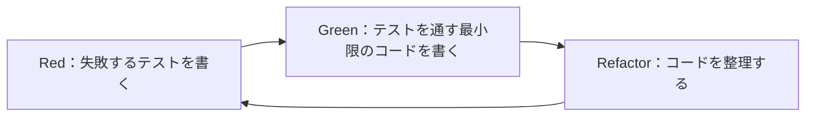

| フェーズ | やること | 状態 |
| --- | --- | --- |
| Red | 期待する動作をテストとして書く | テストは失敗する |
| Green | テストが通る最小限の実装を書く | テストは成功する |
| Refactor | 重複排除・命名改善（テストは通ったまま） | テストは成功のまま |

### メリット
- 仕様がテストとして残る。
- 変更時に**回帰（デグレ）**を早期に発見できる。
- 小さな単位で設計する習慣がつく。

### テストの種類

| 種類 | 対象 | 例 |
| --- | --- | --- |
| 単体テスト（Unit） | 関数・クラス単体 | VLAN ID の検証関数 |
| 結合テスト（Integration） | 複数コンポーネントの連携 | アプリと DB の連携 |
| エンドツーエンド（E2E） | システム全体 | 画面操作から API まで |

---

## 1.4 ソフトウェア開発手法：Agile・Lean・Waterfall

| 観点 | Waterfall（ウォーターフォール） | Agile（アジャイル） | Lean（リーン） |
| --- | --- | --- | --- |
| 進め方 | 要件→設計→実装→テスト→運用を順に進める | 短い反復（イテレーション）で少しずつ作る | ムダを排除し価値の流れを最適化 |
| 変更への強さ | 弱い（後戻りが高コスト） | 強い | 強い |
| 顧客との関わり | 最初と最後が中心 | 継続的にフィードバック | 価値の定義に重点 |
| 向く場面 | 要件が固定、規制が厳しい | 要件が変わりやすい | 開発・運用全体の効率化 |
| 代表的な用語 | 工程、成果物、レビュー | スプリント、バックログ、Scrum、Kanban | ムダ（Waste）、フロー、継続的改善 |

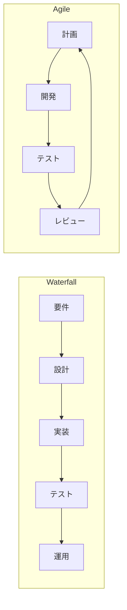

### 試験のポイント
- 「変化に対応しやすく、短いサイクルで価値を届ける」→ Agile。
- 「ムダの削減、価値の流れ」→ Lean。
- 「工程を順番に完了させる」→ Waterfall。

---

## 1.5 コードの構造化：関数・クラス・モジュール

| 単位 | 役割 | メリット |
| --- | --- | --- |
| 関数（メソッド） | 処理のまとまり | 再利用、テスト容易性、重複削減 |
| クラス | データと処理をまとめる（オブジェクト指向） | 状態管理、拡張しやすさ |
| モジュール | 関連する関数・クラスを 1 つの `.py` にまとめる | 名前空間の整理、コードの分割 |
| パッケージ | モジュールをまとめたディレクトリ | 大規模開発、配布 |

```python
# device.py（モジュール）
class Device:
    def __init__(self, hostname, ip):
        self.hostname = hostname
        self.ip = ip

    def describe(self):
        return f"{self.hostname} ({self.ip})"


def make_devices(rows):
    return [Device(r["hostname"], r["ip"]) for r in rows]
```

```python
# main.py
from device import make_devices

devices = make_devices([{"hostname": "sw01", "ip": "192.0.2.1"}])
for d in devices:
    print(d.describe())
```

### ベストプラクティス
- 1 つの関数は 1 つの責務にする（**単一責任の原則**）。
- 同じコードを 2 回書いたら、関数化を検討する（**DRY**）。
- 命名は「何をするか」が分かる名前にする（`get_device_list` など）。
- 関数には docstring（説明文）と型ヒントを付ける。

---

## 1.6 設計パターン：MVC と Observer

### MVC（Model-View-Controller）

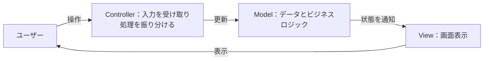

| 要素 | 役割 | 例（Web アプリ） |
| --- | --- | --- |
| Model | データと業務ルール | DB 上のデバイス情報 |
| View | 表示 | HTML テンプレート |
| Controller | リクエストの受付とモデル／ビューの仲介 | URL ごとの処理関数 |

**利点**：関心事を分離でき、画面だけ差し替えたり、ロジックだけテストしたりしやすい。

### Observer パターン

**あるオブジェクト（Subject）の状態が変わったとき、登録済みの複数のオブジェクト（Observer）へ自動で通知する**仕組みです。Webhook やイベント駆動処理の考え方に通じます。

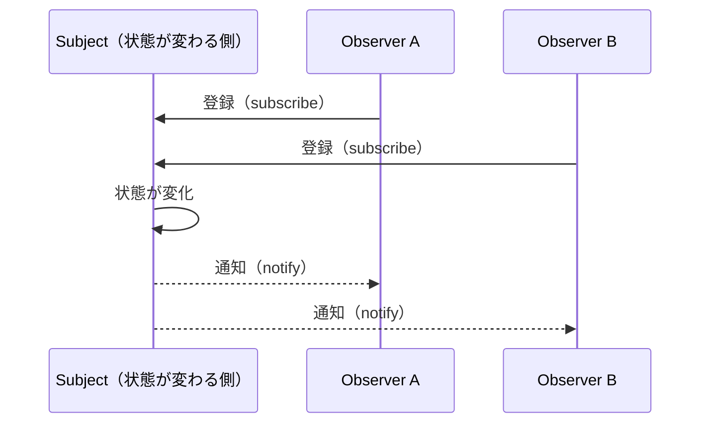

| パターン | 一言で | 使いどころ |
| --- | --- | --- |
| MVC | 表示・データ・制御を分ける | Web アプリ、GUI |
| Observer | 変化を購読者へ通知 | イベント通知、監視、Webhook |

---

## 1.7 バージョン管理の利点

| 利点 | 説明 |
| --- | --- |
| 変更履歴の追跡 | いつ・誰が・なぜ変更したかが残る |
| 過去の状態へ戻せる | 不具合が出ても復元できる |
| 並行開発 | ブランチで独立して作業できる |
| 共同作業 | 変更をマージして統合できる |
| バックアップ性 | リモートリポジトリにも履歴が残る |
| レビューの基盤 | Pull Request／Merge Request で差分を確認できる |

ネットワーク自動化では、**設定ファイル・Playbook・スクリプトを Git で管理する**ことが基本です（Infrastructure as Code の土台）。

---

## 1.8 Git の基本操作

### 4 つの領域とコマンドの流れ

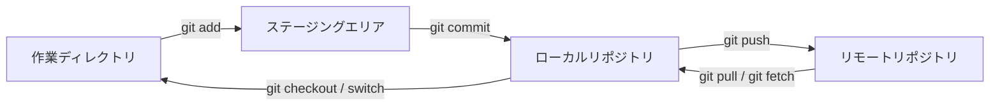

### コマンド一覧（試験範囲）

| 操作 | コマンド | 説明 |
| --- | --- | --- |
| Clone | `git clone <URL>` | リモートを丸ごと複製 |
| Add | `git add <file>` | 変更をステージング |
| Remove | `git rm <file>` | ファイルを削除して記録 |
| Commit | `git commit -m "メッセージ"` | ステージ済みの変更を履歴へ記録 |
| Push | `git push origin <branch>` | ローカルの履歴をリモートへ送る |
| Pull | `git pull` | リモートの変更を取得して統合（fetch + merge） |
| Branch | `git branch <name>` / `git switch -c <name>` | ブランチ作成・切り替え |
| Merge | `git merge <branch>` | 別ブランチの変更を統合 |
| diff | `git diff` | 差分を表示 |
| status / log | `git status` / `git log --oneline` | 状態・履歴の確認 |

### ブランチとマージ

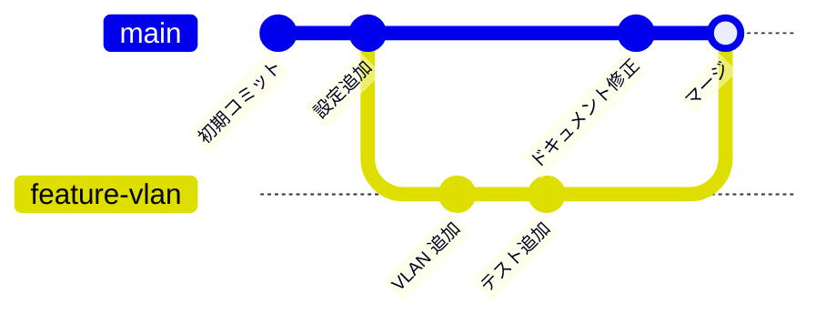

### コンフリクト（競合）の解決手順

同じファイルの同じ箇所を別々に変更してマージすると、Git は自動統合できず競合が発生します。

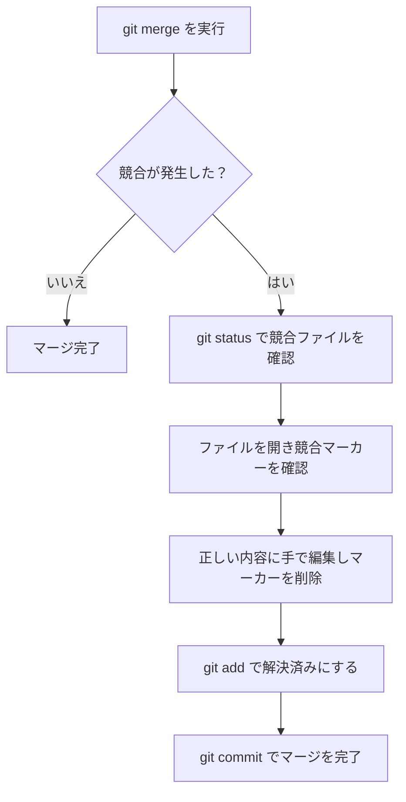

競合マーカーの形式：

```text
<<<<<<< HEAD
mtu: 1500
=======
mtu: 9000
>>>>>>> feature-mtu
```

| マーカー | 意味 |
| --- | --- |
| `<<<<<<< HEAD` から `=======` まで | 現在のブランチ側の内容 |
| `=======` から `>>>>>>>` まで | マージしようとしているブランチ側の内容 |

### ベストプラクティス

| 項目 | 推奨 |
| --- | --- |
| コミット単位 | 1 コミット 1 目的。小さく頻繁に |
| コミットメッセージ | 「何を・なぜ」を簡潔に（例：`Add VLAN 30 to access switch template`） |
| ブランチ運用 | `main` に直接コミットせず、機能ごとにブランチを切る |
| `.gitignore` | 仮想環境、`__pycache__`、`.env`、鍵ファイルを除外 |
| 秘密情報 | API キー・パスワードをコミットしない（履歴に残ると削除が困難） |
| プル前 | 作業開始時に `git pull` で最新化する |
| レビュー | Pull Request を通してレビューしてからマージ |

### 確認問題（第 1 章）

1. YAML でインデントに使ってよいのは、タブとスペースのどちらか。
2. `json.loads()` と `json.load()` の違いは何か。
3. TDD のサイクルの 3 段階を答えよ。
4. Git で「リモートの変更を取得して自分のブランチに統合する」コマンドは何か。

（解答は巻末）

### 第 1 章の参考ソース
- Cisco 公式 Exam Topics（200-901）：https://www.cisco.com/c/dam/en_us/training-events/le31/le46/cln/marketing/exam-topics/200-901-DEVASC.pdf
- Git 公式ドキュメント：https://git-scm.com/doc
- Python 公式ドキュメント（json）：https://docs.python.org/3/library/json.html
- PyYAML ドキュメント：https://pyyaml.org/wiki/PyYAMLDocumentation
- JSON の仕様（RFC 8259）：https://www.rfc-editor.org/rfc/rfc8259

---

# 第 2 章　Understanding and Using APIs（配点 20%）

## 2.1 API と REST の基本

### API とは
**API（Application Programming Interface）** は、ソフトウェア同士が機能やデータをやり取りするための「窓口と約束事」です。ネットワーク機器やクラウドの API を使うと、CLI を手で打つ代わりにプログラムから操作できます。

### REST とは
**REST（Representational State Transfer）** は HTTP を使った API の設計スタイルです。リソース（機器、ユーザー、メッセージなど）を URL で表し、HTTP メソッドで操作します。

| REST の制約 | 意味 |
| --- | --- |
| クライアント／サーバー | 役割を分離する |
| ステートレス | サーバーはリクエスト間の状態を保持しない。毎回、認証情報などを送る |
| キャッシュ可能 | 応答がキャッシュ可能かを明示する |
| 統一インターフェース | URL とメソッドで一貫した操作にする |
| 階層化システム | プロキシやロードバランサーが間に入っても動く |

### URL の構造

```text
https://api.example.com:443/v1/devices/123?status=active&limit=10
```

| 部位 | 例 | 意味 |
| --- | --- | --- |
| スキーム | `https` | プロトコル |
| ホスト | `api.example.com` | 接続先 |
| ポート | `443` | 省略時は https=443、http=80 |
| パス | `/v1/devices/123` | リソースの場所 |
| クエリ | `?status=active&limit=10` | 絞り込みや件数の指定 |

---

## 2.2 HTTP リクエストとレスポンス

### リクエストの例

```http
POST /v1/messages HTTP/1.1
Host: webexapis.com
Authorization: Bearer <ACCESS_TOKEN>
Content-Type: application/json
Accept: application/json

{"roomId": "Y2lzY29...", "text": "Hello"}
```

| 部品 | 内容 |
| --- | --- |
| リクエストライン | メソッド、パス、HTTP バージョン |
| ヘッダー | 認証、データ形式など付加情報 |
| ボディ | 送信するデータ（POST/PUT/PATCH で使用） |

### HTTP メソッドと CRUD

| メソッド | CRUD | 用途 | 冪等性 | ボディ |
| --- | --- | --- | --- | --- |
| GET | Read | 取得 | ○ | 通常なし |
| POST | Create | 新規作成・処理実行 | ×（同じ操作で複数作成され得る） | あり |
| PUT | Update／Replace | 全体の置き換え（なければ作成する実装もある） | ○ | あり |
| PATCH | Update（部分） | 一部だけ変更 | 実装による | あり |
| DELETE | Delete | 削除 | ○ | 通常なし |

> **冪等性（べきとうせい）**：同じリクエストを何度送っても、結果（サーバーの状態）が同じになる性質。

### 主なヘッダー

| ヘッダー | 方向 | 意味 |
| --- | --- | --- |
| `Content-Type` | 要求・応答 | ボディの形式（`application/json` など） |
| `Accept` | 要求 | 受け取りたい形式 |
| `Authorization` | 要求 | 認証情報（`Basic ...`、`Bearer ...`） |
| `User-Agent` | 要求 | クライアントの識別 |
| `Retry-After` | 応答 | 何秒後に再試行してよいか（429/503 で使用） |
| `Location` | 応答 | 作成されたリソースの URL（201 など） |

### レスポンスの 3 要素

| 要素 | 例 |
| --- | --- |
| ステータスコード | `200 OK` |
| ヘッダー | `Content-Type: application/json` |
| ボディ | `{"id": "123", "name": "sw01"}` |

---

## 2.3 HTTP ステータスコード

| 範囲 | 分類 | 覚え方 |
| --- | --- | --- |
| 1xx | 情報 | 処理中 |
| 2xx | 成功 | うまくいった |
| 3xx | リダイレクト | 別の場所へ |
| 4xx | クライアントエラー | **リクエスト側**の問題 |
| 5xx | サーバーエラー | **サーバー側**の問題 |

| コード | 名称 | 典型的な原因と対処 |
| --- | --- | --- |
| 200 | OK | 成功（GET など） |
| 201 | Created | リソース作成に成功（POST） |
| 202 | Accepted | 受け付けたが処理は非同期で継続中 |
| 204 | No Content | 成功したが返すボディなし（DELETE など） |
| 301 / 302 | Moved / Found | リダイレクト。`Location` を確認 |
| 400 | Bad Request | JSON の構文誤り、必須項目の不足。ボディを見直す |
| 401 | Unauthorized | **認証**が無い／無効。トークン・キーを確認 |
| 403 | Forbidden | 認証済みだが**権限**が無い。ロールや権限設定を確認 |
| 404 | Not Found | URL・ID の誤り、リソースが存在しない |
| 405 | Method Not Allowed | そのパスで使えないメソッドを指定した |
| 409 | Conflict | 既存リソースと競合（重複作成など） |
| 415 | Unsupported Media Type | `Content-Type` が誤り |
| 429 | Too Many Requests | レート制限超過。`Retry-After` に従って待つ |
| 500 | Internal Server Error | サーバー内部の障害 |
| 502 / 503 / 504 | Bad Gateway / Unavailable / Gateway Timeout | 上流障害・過負荷・タイムアウト。時間を置いて再試行 |

### 試験頻出の区別

| 比較 | 違い |
| --- | --- |
| 401 と 403 | 401＝**誰か分からない**（認証失敗）／403＝**誰か分かるが許可されない**（認可失敗） |
| 400 と 422 | 400＝形式が不正／422＝形式は正しいが内容が処理できない（API により使い分け） |
| 200 と 201 と 204 | 取得成功／作成成功／成功だが本文なし |

### トラブルシューティングの流れ

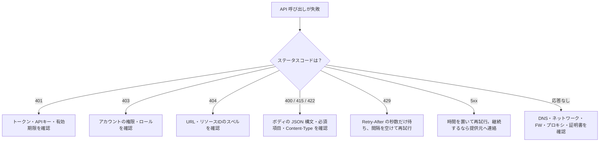

---

## 2.4 API の認証方式

| 方式 | 仕組み | 特徴 | 注意点 |
| --- | --- | --- | --- |
| Basic 認証 | `ユーザー名:パスワード` を Base64 して `Authorization: Basic ...` で送る | 実装が簡単 | Base64 は**暗号化ではない**。必ず HTTPS で使う |
| API キー | 発行されたキーをヘッダー（例：`X-Cisco-Meraki-API-Key`）やクエリで送る | 簡単、サービス単位で発行 | 漏えい時は即失効。URL に載せない |
| Bearer トークン（カスタムトークン） | ログイン API でトークンを取得し `Authorization: Bearer <token>` や独自ヘッダー（例：`X-Auth-Token`）で送る | 有効期限を持たせやすい | 期限切れ（401）時に再取得が必要 |
| OAuth 2.0 | 認可サーバーがアクセストークンを発行。権限範囲（scope）を限定できる | 第三者アプリへの安全な権限委譲 | フローが複雑。クライアントシークレットを守る |

### 認証フロー（トークン取得型）

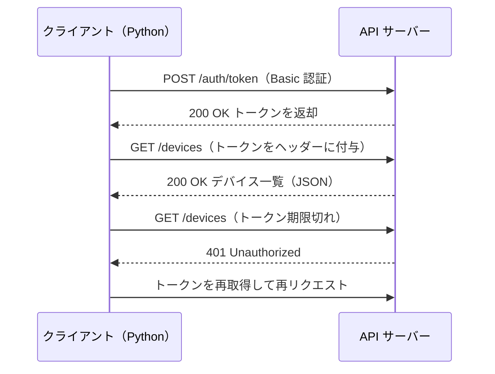

### ベストプラクティス
- **認証情報をコードに直書きしない**。環境変数、シークレット管理サービス、`.env`（Git 管理外）を使う。
- 通信は **HTTPS** のみ。証明書検証（`verify=True`）を無効にしない。
- トークンは最小権限（最小 scope）、短い有効期限にする。
- ログにトークンやパスワードを出力しない。

---

## 2.5 API を利用する際の制約

| 制約 | 内容 | 対処 |
| --- | --- | --- |
| レート制限 | 一定時間内のリクエスト数に上限 | 429 と `Retry-After` を尊重、指数バックオフ |
| ページネーション | 大量データを分割して返す | `limit/offset`、`page`、`Link` ヘッダー、`next` を辿る |
| 認証の期限 | トークンの有効時間が有限 | 再取得処理を実装 |
| データサイズ | 1 リクエストの上限 | 分割して送る |
| バージョニング | `/v1/` など。旧版は廃止される | バージョンを明示して固定する |
| タイムアウト | 応答が遅い場合がある | `timeout` を必ず指定 |
| 非同期処理 | 202 で受け付け、後で結果取得 | タスク ID をポーリング or Webhook |

---

## 2.6 API のスタイル比較

### REST と RPC

| 観点 | REST | RPC（Remote Procedure Call） |
| --- | --- | --- |
| 考え方 | **リソース**（名詞）を操作 | **関数**（動詞）を遠隔で呼び出す |
| URL の例 | `GET /devices/123` | `POST /getDeviceInfo` |
| 形式 | JSON など | XML-RPC、JSON-RPC、gRPC、SOAP など |
| 特徴 | HTTP の仕組みを活用 | 手続き呼び出しに近い |

### 同期と非同期

| 観点 | 同期（Synchronous） | 非同期（Asynchronous） |
| --- | --- | --- |
| 動き | 応答が返るまで待つ | 受付後すぐ制御が戻り、結果は後で受け取る |
| 向く処理 | 短時間で終わる取得・更新 | 長時間処理（一括設定、ソフトウェア更新） |
| 結果の受け取り | その場のレスポンス | ポーリング、Webhook、コールバック |

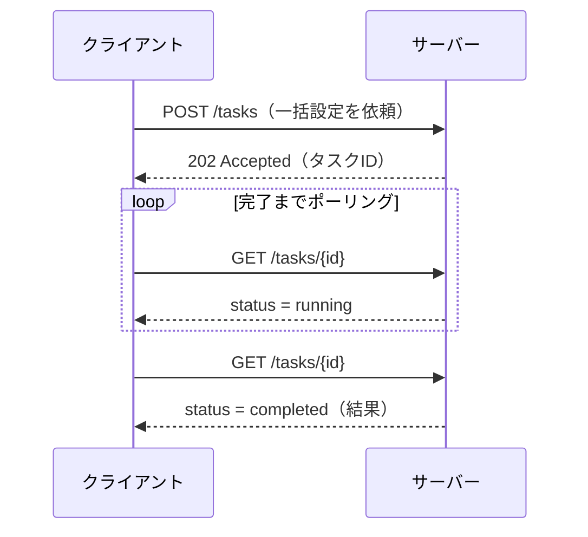

---

## 2.7 Webhook

### ポーリングとの違い

| 観点 | ポーリング | Webhook |
| --- | --- | --- |
| 方向 | クライアントが**定期的に問い合わせる** | サーバーが**イベント発生時に通知する** |
| 遅延 | 間隔に依存 | ほぼリアルタイム |
| 負荷 | 変化が無くてもリクエストが発生 | 変化時のみ |
| 実装 | 単純 | 受信用のエンドポイントが必要 |

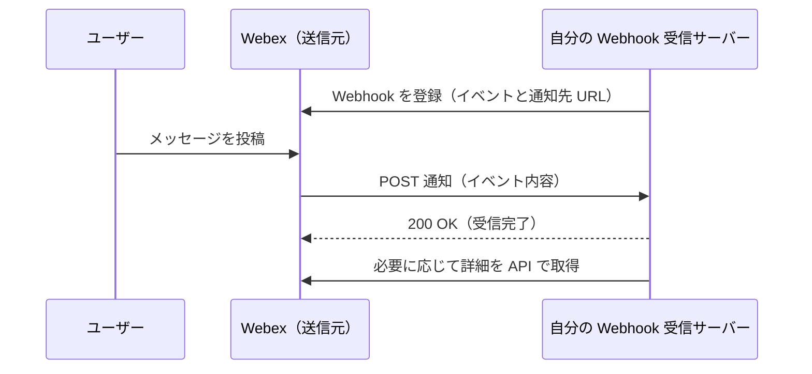

### ベストプラクティス
- 受信側は **素早く 2xx を返し**、重い処理は非同期に回す。
- **署名（シークレット）の検証**で、正規の送信元か確認する。
- 通知は重複・順序入れ替わりがあり得るため、**冪等に処理**する。
- 受信 URL は HTTPS にする。

---

## 2.8 Python の `requests` ライブラリで REST API を呼ぶ

### GET の基本形

```python
import os
import requests

BASE_URL = "https://api.meraki.com/api/v1"
API_KEY = os.environ["MERAKI_API_KEY"]          # 環境変数から取得

headers = {
    "X-Cisco-Meraki-API-Key": API_KEY,
    "Accept": "application/json",
}

resp = requests.get(f"{BASE_URL}/organizations", headers=headers, timeout=10)
resp.raise_for_status()                          # 4xx/5xx なら例外

for org in resp.json():                          # JSON -> list[dict]
    print(org["id"], org["name"])
```

### POST（JSON ボディ）

```python
import requests

url = "https://webexapis.com/v1/messages"
headers = {
    "Authorization": f"Bearer {token}",
    "Content-Type": "application/json",
}
payload = {"roomId": room_id, "text": "デプロイが完了しました"}

resp = requests.post(url, headers=headers, json=payload, timeout=10)   # json= で自動シリアライズ
print(resp.status_code)                                                # 200
print(resp.json()["id"])
```

### 主な属性・引数

| 名前 | 意味 |
| --- | --- |
| `resp.status_code` | ステータスコード（整数） |
| `resp.headers` | ヘッダー（辞書風） |
| `resp.text` | ボディ（文字列） |
| `resp.json()` | ボディを JSON として Python オブジェクトへ |
| `resp.raise_for_status()` | 4xx/5xx で `HTTPError` |
| `params={...}` | クエリ文字列を組み立てる |
| `json={...}` | 辞書を JSON ボディで送る |
| `data=...` | フォームやバイト列を送る |
| `timeout=秒` | 待機の上限 |
| `verify=True` | TLS 証明書を検証（既定） |

### 例外処理とリトライ

```python
import time
import requests

def get_with_retry(url, headers, retries=3):
    for attempt in range(retries):
        try:
            r = requests.get(url, headers=headers, timeout=10)
            if r.status_code == 429:
                wait = int(r.headers.get("Retry-After", 1))
                time.sleep(wait)
                continue
            r.raise_for_status()
            return r.json()
        except requests.exceptions.Timeout:
            time.sleep(2 ** attempt)              # 指数バックオフ
        except requests.exceptions.RequestException as e:
            raise RuntimeError(f"API error: {e}") from e
    raise RuntimeError("retry limit exceeded")
```

### 章のベストプラクティス

| 項目 | 推奨 |
| --- | --- |
| API ドキュメント | 実装前にエンドポイント・必須パラメータ・レスポンス例を確認 |
| セッション | 複数回呼ぶ場合は `requests.Session()` で接続と共通ヘッダーを再利用 |
| タイムアウト | 必ず指定（未指定は無期限に待つ可能性がある） |
| エラー処理 | ステータスコードごとに対処を分ける |
| ログ | リクエスト ID、ステータス、所要時間を記録（秘密情報は除く） |
| 検証 | まず Postman / curl で試し、次に Python 化する |

### 確認問題（第 2 章）

1. 認証は成功したが権限が足りない場合に返る典型的なコードは何か。
2. `Retry-After` ヘッダーが付くことが多いステータスコードは何か。
3. Webhook とポーリングの最大の違いは何か。
4. `requests.post(url, json=payload)` の `json=` は何をするか。

### 第 2 章の参考ソース
- Cisco 公式 Exam Topics（200-901）：https://www.cisco.com/c/dam/en_us/training-events/le31/le46/cln/marketing/exam-topics/200-901-DEVASC.pdf
- HTTP Semantics（RFC 9110）：https://www.rfc-editor.org/rfc/rfc9110
- Requests ドキュメント：https://requests.readthedocs.io/
- OAuth 2.0（RFC 6749）：https://www.rfc-editor.org/rfc/rfc6749
- Meraki Dashboard API：https://developer.cisco.com/meraki/api-v1/
- Webex Developer：https://developer.webex.com/

---

# 第 3 章　Cisco Platforms and Development（配点 15%）

## 3.1 Cisco プラットフォームの全体像

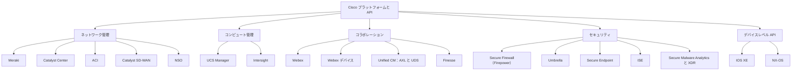

---

## 3.2 ネットワーク管理プラットフォーム

| プラットフォーム | 位置づけ | 主な API・特徴 | 認証の代表例 |
| --- | --- | --- | --- |
| **Meraki** | クラウド管理型のネットワーク（スイッチ、AP、セキュリティアプライアンス等） | Dashboard API（REST）。組織・ネットワーク・デバイス・クライアントを取得／設定。Python SDK あり | API キー |
| **Catalyst Center**（旧 DNA Center） | キャンパス／ブランチ向けのオンプレ型コントローラー。Intent-based networking、Assurance、SWIM、テンプレート | Intent API（REST）。デバイス一覧、クライアント情報、テンプレート展開など | Basic 認証でトークン取得 → `X-Auth-Token` |
| **ACI** | データセンター向け SDN。APIC がコントローラー | APIC REST API。管理対象オブジェクト（MO）のツリーを操作。ポリシー（Tenant、EPG 等）を宣言的に定義 | ログイン API でセッション（Cookie） |
| **Catalyst SD-WAN**（旧 SD-WAN） | WAN の集中管理。vManage が管理画面／API を提供 | vManage REST API。デバイス、テンプレート、ポリシー、状態取得 | セッション＋トークン（バージョン差に注意） |
| **NSO**（Network Services Orchestrator） | マルチベンダー機器のサービスオーケストレーション | YANG モデルベース。NETCONF／RESTCONF、NED（機器ドライバー）で多様な機器を統一操作。トランザクション（dry-run、ロールバック） | 基本認証やトークン |

### 補足
- **ダッシュボード型（Meraki）** はクラウドが機器を管理するため、API キーで組織全体を扱えます。
- **オンプレ型コントローラー（Catalyst Center、APIC、vManage）** は、まず認証 API でトークンやセッションを取得し、以降の呼び出しに付与します。
- **NSO** は「機器ごとの CLI 差異を隠蔽し、サービス単位で設定する」ことが価値です。

### 3.2.1 Meraki の例：組織内デバイス一覧（SDK 利用）

```python
import os
import meraki

dashboard = meraki.DashboardAPI(
    api_key=os.environ["MERAKI_API_KEY"],
    suppress_logging=True,
)

orgs = dashboard.organizations.getOrganizations()
org_id = orgs[0]["id"]

devices = dashboard.organizations.getOrganizationDevices(org_id, total_pages="all")
for d in devices:
    print(d["name"], d["model"], d["serial"])
```

### 3.2.2 Catalyst Center の例：トークン取得とデバイス一覧（REST）

```python
import os
import requests

host = "https://catalyst.example.com"
auth = (os.environ["CC_USER"], os.environ["CC_PASS"])

# 1. トークン取得
r = requests.post(f"{host}/dna/system/api/v1/auth/token", auth=auth, timeout=10, verify=True)
r.raise_for_status()
token = r.json()["Token"]

# 2. デバイス一覧
headers = {"X-Auth-Token": token, "Accept": "application/json"}
r = requests.get(f"{host}/dna/intent/api/v1/network-device", headers=headers, timeout=10)
r.raise_for_status()

for dev in r.json()["response"]:
    print(dev["hostname"], dev["managementIpAddress"])
```

> API のパスは製品バージョンで変わることがあります。必ず該当バージョンの API リファレンスを確認してください。

---

## 3.3 コンピュート管理プラットフォーム

| プラットフォーム | 概要 | API・特徴 |
| --- | --- | --- |
| **UCS Manager** | UCS ドメイン（ファブリックインターコネクト配下）を管理 | XML API、Python SDK（`ucsmsdk`）。サービスプロファイルで構成を定義 |
| **Intersight** | クラウドベースの運用プラットフォーム（SaaS）。UCS、HyperFlex 等を一元管理 | REST API、各種 SDK。API キーとシークレットによる署名付きリクエスト |

- v1.1 では、従来あった **UCS Director** は出題範囲から外れ、UCS Manager と Intersight に整理されたと説明されています。

---

## 3.4 コラボレーションプラットフォーム

| プラットフォーム | 概要 | API・特徴 |
| --- | --- | --- |
| **Webex** | メッセージング、会議 | REST API（`https://webexapis.com/v1/...`）。Spaces（rooms）、Memberships（参加者）、Messages を操作。Webhook 対応 |
| **Webex デバイス** | 会議用端末・ボード | **xAPI**（デバイスの設定・状態・コマンドの API） |
| **Unified CM（CUCM）** | 音声・ビデオ通話制御 | **AXL**（管理操作用の SOAP/XML API）、**UDS**（ユーザー向けの REST API） |
| **Finesse** | コンタクトセンターのエージェントデスクトップ | REST API、ガジェット（画面部品）による拡張 |

### 3.4.1 Webex：スペース・参加者・メッセージの操作

| やりたいこと | メソッドとパス | 主なボディ |
| --- | --- | --- |
| スペース一覧 | `GET /v1/rooms` | なし |
| スペース作成 | `POST /v1/rooms` | `{"title": "運用チーム"}` |
| 参加者追加 | `POST /v1/memberships` | `{"roomId": "...", "personEmail": "user@example.com"}` |
| メッセージ投稿 | `POST /v1/messages` | `{"roomId": "...", "text": "こんにちは"}` |
| メッセージ取得 | `GET /v1/messages?roomId=...` | なし |

```python
import os
import requests

BASE = "https://webexapis.com/v1"
headers = {
    "Authorization": f"Bearer {os.environ['WEBEX_TOKEN']}",
    "Content-Type": "application/json",
}

# スペース作成
room = requests.post(f"{BASE}/rooms", headers=headers, json={"title": "運用チーム"}, timeout=10).json()

# 参加者追加
requests.post(f"{BASE}/memberships", headers=headers,
              json={"roomId": room["id"], "personEmail": "user@example.com"}, timeout=10)

# メッセージ投稿
requests.post(f"{BASE}/messages", headers=headers,
              json={"roomId": room["id"], "text": "監視を開始しました"}, timeout=10)
```

- 開発者ポータルで取得する **個人アクセストークンは有効期間が短い（約 12 時間）** ため、継続運用ではボット（Bot）トークンや OAuth 統合を使います。

---

## 3.5 セキュリティプラットフォーム

| プラットフォーム | 役割 | API の例 |
| --- | --- | --- |
| **Secure Firewall（Firepower／FMC）** | 次世代ファイアウォール／IPS の管理 | FMC REST API：ポリシー、オブジェクト、デプロイ操作 |
| **Umbrella** | クラウド提供の DNS レイヤーセキュリティ | REST API：レポート、ポリシー、ブロックリスト管理 |
| **Secure Endpoint**（旧 AMP for Endpoints） | エンドポイントの脅威検出・対応 | REST API：端末情報、イベント、隔離 |
| **ISE**（Identity Services Engine） | 認証・認可・ポスチャ（アクセス制御） | ERS API（REST）、pxGrid（情報共有） |
| **Secure Malware Analytics**（旧 ThreatGrid） | マルウェアの動的解析（サンドボックス） | REST API：ファイル提出、解析結果取得 |
| **XDR** | 複数のセキュリティ製品の検知を横断して相関 | REST API：インシデント、脅威インテリジェンス |

### 名称対応表（古い教材で混乱しやすい）

| 旧名称 | 新名称 |
| --- | --- |
| AMP for Endpoints | Secure Endpoint |
| ThreatGrid | Secure Malware Analytics |
| Firepower | Secure Firewall |
| DNA Center | Catalyst Center |
| SD-WAN | Catalyst SD-WAN |
| Webex Teams | Webex |
| VIRL | Cisco Modeling Labs（CML） |

---

## 3.6 デバイスレベルの API とダイナミックインターフェース

| OS | 主なインターフェース |
| --- | --- |
| **IOS XE** | CLI（SSH）、**NETCONF**、**RESTCONF**、gNMI、Guest Shell（コンテナ内で Python 実行）、EEM |
| **NX-OS** | CLI、**NX-API**（CLI 型と REST 型）、NETCONF、RESTCONF、gNMI、Bash／Guest Shell |

### コントローラー型とデバイス型の違い

| 観点 | コントローラー API（Catalyst Center、Meraki 等） | デバイス API（RESTCONF、NETCONF、NX-API） |
| --- | --- | --- |
| 操作対象 | 多数の機器を**一括・意図（Intent）ベース**で | **1 台ごと**に細かい設定 |
| 抽象度 | 高い | 低い（モデルに沿って詳細設定） |
| 向く場面 | 大規模運用、ポリシーの統一 | 特定機器の検証、細かな設定変更 |

---

## 3.7 DevNet 関連リソースの使い分け

| リソース | 何に使うか | こんなときに |
| --- | --- | --- |
| **DevNet Sandbox** | 実機・仮想環境を無償／予約で利用できる検証環境 | 「動かして試したい」 |
| **Code Exchange** | サンプルコード・ツールのカタログ | 「既存の実装例を探したい」 |
| **API ドキュメント**（developer.cisco.com） | 各製品の API リファレンス | 「エンドポイントとパラメータを正確に知りたい」 |
| **Learning Labs／Cisco U.** | 手順付きの学習コンテンツ | 「順序立てて学びたい」 |
| **Support／Forums（Cisco Learning Network 等）** | 質問・コミュニティ | 「詰まったので相談したい」 |

---

## 3.8 モデル駆動プログラマビリティ：YANG・NETCONF・RESTCONF

### 3 つの関係

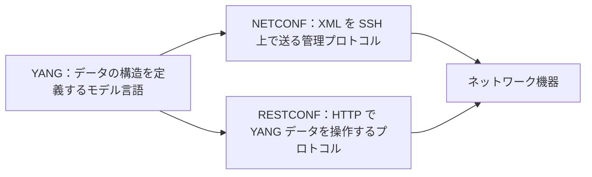

| 技術 | 役割 | データ形式 | 主なトランスポート／ポート |
| --- | --- | --- | --- |
| **YANG** | 設定・状態データの**構造とルール**を記述するデータモデリング言語 | （モデル定義自体は YANG 記法） | なし（言語） |
| **NETCONF** | 機器設定の取得・変更を行うプロトコル。トランザクション、候補設定（candidate）、ロック等 | **XML** | SSH、TCP **830** |
| **RESTCONF** | NETCONF の機能の一部を **REST 風**（HTTP メソッド）で提供 | **JSON／XML** | HTTPS（443） |

### RESTCONF と HTTP メソッドの対応

| HTTP メソッド | 動作 |
| --- | --- |
| GET | データの取得 |
| POST | リソースの作成 |
| PUT | リソースの置換 |
| PATCH | 一部変更（マージ） |
| DELETE | 削除 |

### RESTCONF の GET 例

```http
GET /restconf/data/ietf-interfaces:interfaces/interface=GigabitEthernet1 HTTP/1.1
Host: 192.0.2.1
Accept: application/yang-data+json
Authorization: Basic <base64>
```

### NETCONF の主な操作

| 操作 | 内容 |
| --- | --- |
| `<get>` | 運用状態を含むデータの取得 |
| `<get-config>` | 設定データの取得 |
| `<edit-config>` | 設定の変更 |
| `<commit>` | 候補設定を反映（candidate を使う場合） |
| `<lock>` / `<unlock>` | データストアのロック |

### ベストプラクティス
- 自動化では、CLI のテキスト解析より **モデル駆動（構造化データ）** を優先する。出力の書式が変わっても壊れにくい。
- 本番では、まず **検証環境（CML、Sandbox）** でモデルとパスを確認する。
- YANG モデルは機器の OS バージョンで差が出るため、機器から取得した／対応バージョンのモデルを参照する。

---

## 3.9 コードを組み立てる問題（試験の出題形式）

「要件と API リファレンスを与えられ、適切なコードを選ぶ／書く」タイプの問題です。以下の 3 パターンを押さえましょう。

| 要件 | プラットフォーム | 呼び出しの骨子 |
| --- | --- | --- |
| ネットワーク機器の一覧取得 | Meraki／Catalyst Center／ACI／Catalyst SD-WAN／NSO | 認証 → GET → JSON の該当キーをループ |
| Webex のスペース・参加者・メッセージ管理 | Webex | `rooms` → `memberships` → `messages` の順に POST |
| ネットワーク上のクライアント／ホスト一覧 | Meraki／Catalyst Center | クライアント系エンドポイントを GET |

### 読み解きのコツ

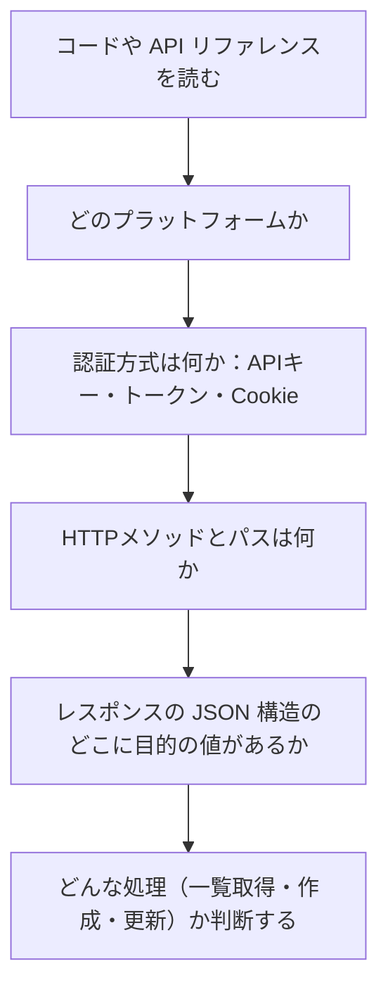

### 3.10 Cisco SDK を使う（3.1 の要件）

| 観点 | REST を直接呼ぶ | SDK を使う |
| --- | --- | --- |
| 手間 | ヘッダー・URL・ページ処理を自前で実装 | 関数呼び出しで抽象化 |
| 変更への追随 | API 変更を自分で反映 | SDK 更新で吸収されることが多い |
| 学習 | HTTP の理解が深まる | 使いやすい反面、内部動作が見えにくい |

**ベストプラクティス**：SDK のバージョンを固定（`requirements.txt`）し、SDK のドキュメントで戻り値の構造を確認する。

### 確認問題（第 3 章）

1. Meraki の API 認証で使う方式は何か。
2. YANG・NETCONF・RESTCONF のうち、「データ構造を定義する言語」はどれか。
3. NETCONF の既定の TCP ポート番号は何か。
4. AMP と ThreatGrid の現在の名称は何か。

### 第 3 章の参考ソース
- Cisco Exam Topics（200-901）：https://www.cisco.com/c/dam/en_us/training-events/le31/le46/cln/marketing/exam-topics/200-901-DEVASC.pdf
- Cisco Learning Network（新しい認定体系の告知）：https://learningnetwork.cisco.com/s/a-new-era-for-cisco-certifications
- DevNet Sandbox：https://devnetsandbox.cisco.com/
- DevNet Code Exchange：https://developer.cisco.com/codeexchange/
- Meraki API：https://developer.cisco.com/meraki/api-v1/
- Catalyst Center API：https://developer.cisco.com/docs/dna-center/
- ACI（APIC）：https://developer.cisco.com/docs/aci/
- Catalyst SD-WAN：https://developer.cisco.com/docs/sdwan/
- NSO：https://developer.cisco.com/docs/nso/
- Webex：https://developer.webex.com/
- NETCONF（RFC 6241）：https://www.rfc-editor.org/rfc/rfc6241
- RESTCONF（RFC 8040）：https://www.rfc-editor.org/rfc/rfc8040
- YANG 1.1（RFC 7950）：https://www.rfc-editor.org/rfc/rfc7950

---

# 第 4 章　Application Deployment and Security（配点 15%）

## 4.1 デプロイモデルとエッジコンピューティング

### デプロイモデルの比較

| モデル | 説明 | 長所 | 短所 |
| --- | --- | --- | --- |
| プライベートクラウド | 自社（または専用）環境で構築するクラウド | 統制・セキュリティを高めやすい | 初期投資と運用負荷が大きい |
| パブリッククラウド | AWS、Azure、GCP など共有基盤 | 迅速・従量課金・拡張性 | ベンダー依存、コスト管理が必要 |
| ハイブリッドクラウド | 上記の組み合わせ | 用途ごとに最適化 | 連携・運用が複雑 |
| エッジ | データ発生源に近い場所で処理 | 低遅延、帯域節約、オフライン耐性 | 多拠点の管理が難しい |

### エッジコンピューティングの利点

| 利点 | 説明 |
| --- | --- |
| 低遅延 | 中央のクラウドまで往復しないため応答が速い |
| 帯域の節約 | 生データを全て送らず、要約や結果のみ送信 |
| 信頼性 | WAN 障害時も現地で処理を継続できる |
| データ主権・プライバシー | 個人データを現地で処理し、外部送信を減らせる |

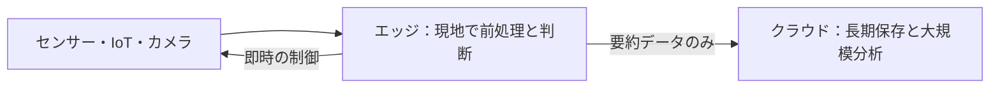

---

## 4.2 仮想マシン・ベアメタル・コンテナ

| 観点 | ベアメタル | 仮想マシン（VM） | コンテナ |
| --- | --- | --- | --- |
| 実行単位 | 物理サーバーに OS を直接 | ハイパーバイザー上のゲスト OS | ホスト OS のカーネルを共有するプロセス |
| 起動速度 | 遅い | 数十秒〜分 | **秒以下** |
| リソース効率 | 専有（性能は最大） | OS ごとに消費 | **軽量** |
| 分離度 | 物理的に分離 | 強い | VM より弱い（カーネル共有） |
| 可搬性 | 低い | 中 | **高い**（イメージで配布） |
| 向く場面 | 高性能・専用ハードウェア | 異なる OS の混在、強い分離 | マイクロサービス、CI/CD、素早い展開 |

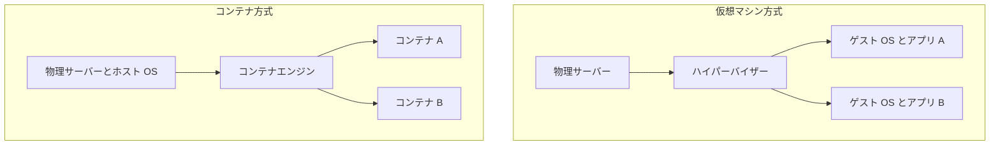

---

## 4.3 CI/CD パイプライン

| 用語 | 意味 |
| --- | --- |
| **CI**（継続的インテグレーション） | コード変更のたびに自動でビルド・テストし、早期に問題を検出 |
| **CD**（継続的デリバリー／デプロイ） | テスト済みの成果物を自動で（または承認を経て）環境へ展開 |

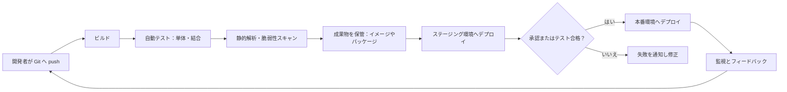

| パイプラインの構成要素 | 役割 | 代表例 |
| --- | --- | --- |
| ソース管理 | 変更のトリガー | Git（GitHub、GitLab） |
| CI サーバー／ランナー | ジョブの実行 | GitLab CI、Jenkins、GitHub Actions |
| テスト | 品質の担保 | unittest、pytest |
| 成果物レジストリ | イメージ・パッケージの保管 | コンテナレジストリ |
| デプロイ自動化 | 環境への展開 | Ansible、Terraform、kubectl |
| 監視 | 稼働状況の可視化 | ログ、メトリクス、アラート |

### ベストプラクティス
- パイプラインの設定自体もコード化して Git 管理する（Pipeline as Code）。
- 失敗したら**すぐに通知**し、壊れたビルドを放置しない。
- 秘密情報はパイプラインのシークレット機能（変数の保護／マスク）に保存する。
- 小さな変更を頻繁にデプロイし、ロールバック手順も用意する。

---

## 4.4 Python の単体テスト

### `unittest` の基本

```python
# vlan.py
def add_vlan(vlans, vlan_id):
    if not 1 <= vlan_id <= 4094:
        raise ValueError("VLAN ID must be 1-4094")
    return vlans | {vlan_id}
```

```python
# test_vlan.py
import unittest
from vlan import add_vlan

class TestAddVlan(unittest.TestCase):
    def test_add_valid(self):
        self.assertEqual(add_vlan({10}, 20), {10, 20})

    def test_out_of_range(self):
        with self.assertRaises(ValueError):
            add_vlan({10}, 5000)

if __name__ == "__main__":
    unittest.main()
```

| よく使うアサート | 意味 |
| --- | --- |
| `assertEqual(a, b)` | a と b が等しい |
| `assertTrue(x)` / `assertFalse(x)` | 真／偽 |
| `assertIn(a, b)` | a が b に含まれる |
| `assertRaises(Err)` | 例外が発生する |

### 外部 API を使うコードのテスト（モック）

実際の API を呼ばずに、戻り値を差し替えてテストします。

```python
from unittest import TestCase
from unittest.mock import patch, Mock
import my_client

class TestClient(TestCase):
    @patch("my_client.requests.get")
    def test_get_devices(self, mock_get):
        mock_get.return_value = Mock(status_code=200, json=lambda: [{"name": "sw01"}])
        result = my_client.get_devices()
        self.assertEqual(result[0]["name"], "sw01")
```

### ベストプラクティス
- **1 テスト 1 検証**、名前は `test_何をすると何になる` にする。
- 正常系だけでなく、**境界値と異常系**をテストする。
- テストは順序に依存させず、外部環境（ネットワーク、時刻）を切り離す。

---

## 4.5 Docker

### 基本概念

| 用語 | 意味 |
| --- | --- |
| Dockerfile | イメージの作り方を書いたテキスト |
| イメージ | アプリと依存関係を固めた読み取り専用のテンプレート |
| コンテナ | イメージから起動した実行中のインスタンス |
| レジストリ | イメージの保管場所（Docker Hub など） |

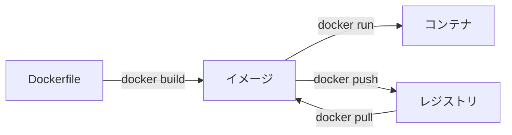

### Dockerfile の読み方

```dockerfile
FROM python:3.12-slim
WORKDIR /app
COPY requirements.txt .
RUN pip install --no-cache-dir -r requirements.txt
COPY . .
ENV APP_ENV=production
EXPOSE 8080
RUN useradd --create-home appuser
USER appuser
CMD ["python", "app.py"]
```

| 命令 | 意味 |
| --- | --- |
| `FROM` | ベースイメージの指定 |
| `WORKDIR` | 作業ディレクトリの設定 |
| `COPY` | ホストからイメージへファイルをコピー |
| `RUN` | **ビルド時**にコマンド実行（パッケージ導入など） |
| `ENV` | 環境変数の設定 |
| `EXPOSE` | 使用するポートの**宣言**（公開はしない。`-p` が必要） |
| `USER` | 実行ユーザーの指定 |
| `CMD` | **コンテナ起動時**の既定コマンド |
| `ENTRYPOINT` | 起動時に必ず実行するコマンド（`CMD` は引数の既定値になる） |

### 主要コマンド

| コマンド | 説明 |
| --- | --- |
| `docker build -t myapp:1.0 .` | イメージをビルド |
| `docker images` | イメージ一覧 |
| `docker run -d -p 8080:8080 --name web myapp:1.0` | バックグラウンド起動し、ホスト 8080 をコンテナ 8080 へ転送 |
| `docker ps` / `docker ps -a` | 実行中／すべてのコンテナ |
| `docker logs web` | ログ表示 |
| `docker exec -it web sh` | コンテナ内でシェルを実行 |
| `docker stop web` / `docker rm web` | 停止／削除 |
| `docker pull <image>` / `docker push <image>` | 取得／送信 |

`-p ホスト側ポート:コンテナ側ポート` の並び順は頻出の引っかけです。

### ベストプラクティス

| 項目 | 推奨 |
| --- | --- |
| ベースイメージ | 公式・軽量（`slim`、`alpine`）を選び、**タグを固定**（`latest` を避ける） |
| 実行ユーザー | **root で動かさない**（`USER` を指定） |
| レイヤー | 変更が少ない命令（依存導入）を先に書き、キャッシュを効かせる |
| 秘密情報 | イメージに埋め込まない（環境変数・シークレット管理で実行時に渡す） |
| `.dockerignore` | 不要なファイル（`.git`、`.env`）を含めない |
| 脆弱性 | イメージをスキャンし、定期的に更新 |

---

## 4.6 アプリケーションセキュリティ

### 秘密情報（シークレット）の保護

| やってはいけない | 推奨 |
| --- | --- |
| ソースコードにパスワードや API キーを直書き | 環境変数、シークレット管理サービス、CI の保護変数 |
| 秘密情報を Git にコミット | `.gitignore` に登録、漏えいしたら**キーを失効して再発行** |
| ログに秘密情報を出力 | マスキングする |
| 全員が同じ強い権限のキーを共有 | 用途別・最小権限のキーを発行、定期ローテーション |

### 暗号化：保存時と通信時

| 種類 | 守る対象 | 代表技術 |
| --- | --- | --- |
| 保存時の暗号化（Encryption at rest） | ディスク、DB、バックアップ内のデータ | AES によるディスク／DB 暗号化 |
| 通信時の暗号化（Encryption in transit） | ネットワーク上を流れるデータ | **TLS（HTTPS）**、SSH、IPsec VPN |
| パスワードの保存 | 認証情報 | **ソルト付きハッシュ**（bcrypt、Argon2 など）。暗号化ではなくハッシュ |

### データの取り扱い
- 収集するデータを最小限にし、個人情報は分類して保護する。
- 入力値は**必ず検証・サニタイズ**し、出力時は**エスケープ**する。
- 不要になったデータは削除し、保持期間を決める。

---

## 4.7 ファイアウォール・DNS・ロードバランサー・リバースプロキシ

| 要素 | 役割 | アプリ配備での使いどころ |
| --- | --- | --- |
| **ファイアウォール** | 許可された通信のみ通す（IP、ポート、アプリ層で制御） | 公開が必要なポートだけ開放、内部を保護 |
| **DNS** | 名前（`app.example.com`）を IP アドレスへ解決 | サービスの名前解決、切り替え |
| **ロードバランサー** | 複数サーバーへ通信を分散、死活監視 | 可用性・性能の向上 |
| **リバースプロキシ** | クライアントの代理としてサーバーの前で要求を受け、内部サーバーへ転送 | TLS 終端、キャッシュ、認証、内部構成の隠蔽 |

```mermaid
flowchart LR
    U["ユーザー"] --> FW["ファイアウォール"]
    FW --> LB["ロードバランサー / リバースプロキシ"]
    LB --> A1["アプリサーバー 1"]
    LB --> A2["アプリサーバー 2"]
    A1 --> DB["データベース"]
    A2 --> DB
    U -. "名前解決" .-> DNS["DNS"]
```

| 比較 | 違い |
| --- | --- |
| プロキシとリバースプロキシ | プロキシ＝**クライアント側**の代理／リバースプロキシ＝**サーバー側**の代理 |
| ロードバランサーとリバースプロキシ | LB は分散が主目的。リバースプロキシは分散に加え TLS 終端やキャッシュ等も担う（製品では両方を兼ねることが多い） |

---

## 4.8 OWASP の主要な脅威

| 脅威 | 仕組み | 対策 |
| --- | --- | --- |
| **XSS**（クロスサイトスクリプティング） | 攻撃者の**スクリプトを Web ページに埋め込み**、閲覧者のブラウザで実行させる | 出力時の**エスケープ**、入力検証、CSP（Content Security Policy）、Cookie の `HttpOnly` |
| **SQL インジェクション** | 入力値に SQL を混入させ、DB を不正操作 | **プレースホルダ（パラメータ化クエリ）**、ORM、最小権限の DB アカウント |
| **CSRF**（クロスサイトリクエストフォージェリ） | ログイン中のユーザーに**意図しないリクエストを送らせる** | **CSRF トークン**、`SameSite` Cookie、重要操作での再認証 |

### SQL インジェクションの対策例

```python
# 悪い例：文字列連結（脆弱）
cursor.execute("SELECT * FROM users WHERE name = '" + name + "'")

# 良い例：プレースホルダ
cursor.execute("SELECT * FROM users WHERE name = %s", (name,))
```

| 3 つの区別 | キーワード |
| --- | --- |
| XSS | **ブラウザ上でスクリプトが実行される** |
| SQL インジェクション | **DB に不正な SQL が届く** |
| CSRF | **ユーザーの権限で勝手にリクエストが送られる** |

---

## 4.9 Bash の基本

| 目的 | コマンド | 例 |
| --- | --- | --- |
| 現在地の確認 | `pwd` | `/home/<username>` |
| 移動 | `cd` | `cd /var/log`、`cd ..`、`cd ~` |
| 一覧 | `ls` | `ls -l`（詳細）、`ls -a`（隠しファイル） |
| ディレクトリ作成 | `mkdir` | `mkdir -p a/b/c` |
| コピー／移動／削除 | `cp` / `mv` / `rm` | `cp a.txt b.txt`、`rm -r dir` |
| 内容表示 | `cat`、`less`、`head`、`tail` | `tail -f app.log` |
| 検索 | `grep` | `grep -i error app.log` |
| 権限 | `chmod` | `chmod +x script.sh` |
| 環境変数の設定／参照 | `export`、`echo` | `export API_KEY=xxxx` ／ `echo $API_KEY` |
| 環境変数の一覧 | `env`、`printenv` | |

```bash
#!/bin/bash
set -euo pipefail                         # エラーで停止、未定義変数はエラー

LOG_DIR="/var/log/myapp"
mkdir -p "$LOG_DIR"
cd "$LOG_DIR"

for f in *.log; do
    gzip "$f"
done
echo "圧縮が完了しました"
```

### ベストプラクティス
- 変数は必ずダブルクォートで囲む（`"$VAR"`）。スペースを含む値で壊れにくい。
- `rm -rf` は対象を確認してから実行する。
- パスワードをコマンドライン引数や履歴に残さない。

---

## 4.10 DevOps の原則

| 原則 | 内容 |
| --- | --- |
| 文化（Culture） | 開発と運用が協力し、責任を共有 |
| 自動化（Automation） | ビルド、テスト、デプロイ、構成を自動化 |
| リーン（Lean） | ムダを排除し、小さく速く価値を届ける |
| 計測（Measurement） | メトリクスで改善を判断 |
| 共有（Sharing） | 知識・ツール・失敗事例を共有 |

```mermaid
flowchart LR
    P["計画"] --> C["コーディング"] --> B["ビルド"] --> T["テスト"] --> R["リリース"] --> D["デプロイ"] --> O["運用"] --> M["監視"] --> P
```

補足：**Twelve-Factor App**（設定は環境変数、ログは標準出力、依存を明示など）は、クラウドネイティブなアプリ設計の指針として有名です。

### 確認問題（第 4 章）

1. `docker run -p 8080:80 nginx` のとき、ホストのどのポートにアクセスすると nginx（コンテナの 80 番）へ届くか。
2. Dockerfile の `RUN` と `CMD` の違いは何か。
3. SQL インジェクションの最も基本的な対策は何か。
4. ロードバランサーとリバースプロキシで、TLS 終端やキャッシュも担うのはどちらの機能か。

### 第 4 章の参考ソース
- Cisco Exam Topics（200-901）：https://www.cisco.com/c/dam/en_us/training-events/le31/le46/cln/marketing/exam-topics/200-901-DEVASC.pdf
- Docker ドキュメント：https://docs.docker.com/
- Dockerfile リファレンス：https://docs.docker.com/reference/dockerfile/
- OWASP Top 10：https://owasp.org/www-project-top-ten/
- OWASP Cheat Sheet Series：https://cheatsheetseries.owasp.org/
- Python unittest：https://docs.python.org/3/library/unittest.html
- GNU Bash マニュアル：https://www.gnu.org/software/bash/manual/
- The Twelve-Factor App（日本語）：https://12factor.net/ja/

---

# 第 5 章　Infrastructure and Automation（配点 20%）

## 5.1 モデル駆動プログラマビリティの価値

| 従来（CLI 中心） | モデル駆動 |
| --- | --- |
| 機器・OS ごとにコマンドが違う | **標準化されたデータモデル（YANG）** で統一 |
| 出力を文字列で解析（壊れやすい） | **構造化データ**（JSON／XML）で取得 |
| 設定の成否判断が難しい | トランザクション・検証・ロールバックが可能 |
| 自動化の保守が大変 | API・SDK と組み合わせやすい |

**要点**：ベンダー差や OS バージョン差を吸収し、**再現性の高い自動化**を実現できることが価値です。

---

## 5.2 コントローラー型とデバイス型の管理

| 観点 | コントローラーレベル | デバイスレベル |
| --- | --- | --- |
| 例 | Catalyst Center、Meraki、APIC、vManage、NSO | 各機器への SSH/CLI、NETCONF、RESTCONF |
| 単位 | ネットワーク全体・ポリシー | 個別機器 |
| 利点 | 一括展開、一貫性、可視化、ワークフロー | 細かい制御、コントローラーがない環境でも可 |
| 課題 | コントローラーへの依存、対応機能の範囲 | 台数が増えると運用が大変、個別の差異管理 |

```mermaid
flowchart TD
    Q{"何台を、どの粒度で管理する？"} -->|"多数・ポリシー単位"| C["コントローラー API を使う"]
    Q -->|"少数・詳細設定"| D["デバイス API（NETCONF / RESTCONF）を使う"]
    Q -->|"マルチベンダーのサービス単位"| N["NSO などのオーケストレーターを使う"]
```

---

## 5.3 ネットワークのシミュレーションとテストツール

| ツール | 役割 |
| --- | --- |
| **Cisco Modeling Labs（CML）** | 仮想ネットワークトポロジーを作成し、実機に近い OS イメージで検証（旧 VIRL の後継） |
| **pyATS** | Python ベースのネットワークテスト自動化フレームワーク。機器の状態取得、パース、テストの自動化 |
| **Genie**（pyATS のライブラリ群） | CLI 出力の構造化パーサーや、設定・状態の比較（スナップショット差分） |

```mermaid
flowchart LR
    A["CML で検証環境を構築"] --> B["自動化スクリプトを実行"]
    B --> C["pyATS で状態を検証"]
    C --> D{"期待どおり？"}
    D -->|"はい"| E["本番へ展開"]
    D -->|"いいえ"| F["修正して再検証"]
    F --> B
```

**ベストプラクティス**：本番へ入れる前に、必ずシミュレーション環境で**変更前後の状態比較**（pre/post チェック）を行う。

---

## 5.4 インフラ自動化における CI/CD

アプリと同様に、ネットワーク設定変更も **Git → 自動テスト → 承認 → 展開** の流れに乗せられます。

```mermaid
flowchart LR
    A["設定変更を Git のブランチで作成"] --> B["Pull Request"]
    B --> C["レビュー"]
    C --> D["CI：構文チェック・lint・シミュレーション検証"]
    D --> E{"合格？"}
    E -->|"はい"| F["main へマージ"]
    F --> G["CD：Ansible / Terraform で本番へ適用"]
    E -->|"いいえ"| A
    G --> H["適用後の状態確認と監視"]
```

| メリット | 説明 |
| --- | --- |
| 変更の追跡 | 誰が・いつ・何を変えたかが履歴に残る |
| 品質向上 | 人為ミスを機械チェックで防ぐ |
| 速度 | 手作業より速く安全に展開 |
| ロールバック | 過去の版へ戻しやすい |

---

## 5.5 Infrastructure as Code（IaC）

**インフラの構成をコード（宣言的なファイル）として記述し、バージョン管理・自動適用する**考え方です。

| 原則 | 説明 |
| --- | --- |
| 宣言的 | 「あるべき状態」を記述し、ツールが差分を埋める |
| 冪等性 | 何度実行しても同じ結果になる |
| バージョン管理 | Git で履歴・レビュー |
| 再現性 | 同じコードから同じ環境を作れる |
| 不変インフラの考え方 | 手動変更（構成ドリフト）を避け、コードを変更して再適用する |

| 比較 | 宣言型（Declarative） | 手続き型（Imperative） |
| --- | --- | --- |
| 記述するもの | 最終的な状態 | 実行する手順 |
| 例 | Terraform、Ansible の多くのモジュール | シェルスクリプト、Python スクリプト |

---

## 5.6 自動化ツール：Ansible・Terraform・NSO

| 観点 | Ansible | Terraform | Cisco NSO |
| --- | --- | --- | --- |
| 主な用途 | 構成管理、運用タスクの自動化 | インフラのプロビジョニング（作成・変更・削除） | マルチベンダーのネットワークサービスのオーケストレーション |
| 記述形式 | **YAML**（Playbook） | **HCL**（`.tf`） | YANG モデル＋サービスパッケージ |
| 方式 | **エージェントレス**（SSH／API で接続） | プロバイダー経由で API を呼び出し | NED 経由で機器を操作 |
| 状態管理 | 基本は持たない（都度、現状を確認） | **ステートファイル**で管理 | CDB（構成データベース） |
| 冪等性 | モジュールにより担保 | 宣言的に担保 | トランザクション |

補足：Puppet／Chef は v1.1 の Associate 範囲では明示されなくなったと説明されていますが、**構成管理ツールの考え方**を知る参考にはなります。

### Ansible の基本用語

| 用語 | 意味 |
| --- | --- |
| Inventory | 管理対象ホストの一覧（グループ化可能） |
| Playbook | 自動化手順を YAML で書いたファイル |
| Play | 「どのホストに何をするか」の単位 |
| Task | 1 つの処理（モジュール呼び出し） |
| Module | 実処理の部品（`package`、`service`、`user`、`template` など） |
| Handler | 変更があったときだけ実行される処理（サービス再起動など） |
| Role | 再利用可能な Playbook のまとまり |

### Playbook の例（パッケージ、サービス、ユーザー）

```yaml
---
- name: Web サーバーを構成する
  hosts: webservers
  become: true
  tasks:
    - name: nginx をインストールする
      ansible.builtin.package:
        name: nginx
        state: present

    - name: 運用用ユーザーを作成する
      ansible.builtin.user:
        name: opsuser
        state: present
        shell: /bin/bash

    - name: 設定ファイルを配置する
      ansible.builtin.template:
        src: nginx.conf.j2
        dest: /etc/nginx/nginx.conf
      notify: restart nginx

    - name: nginx を起動し自動起動を有効にする
      ansible.builtin.service:
        name: nginx
        state: started
        enabled: true

  handlers:
    - name: restart nginx
      ansible.builtin.service:
        name: nginx
        state: restarted
```

### このワークフローを読み解く
1. `webservers` グループのホストへ、特権昇格（`become`）して実行する。
2. nginx を導入し、ユーザー `opsuser` を作成する。
3. テンプレートから設定ファイルを配置し、**変更があれば**ハンドラーで再起動する。
4. サービスを起動し、自動起動を有効にする。

実行：`ansible-playbook -i inventory.ini site.yml`（`--check` でドライラン）

### Terraform の基本

| コマンド | 内容 |
| --- | --- |
| `terraform init` | プロバイダーの取得など初期化 |
| `terraform plan` | 適用前に**変更内容を確認**（ドライラン） |
| `terraform apply` | 変更を適用 |
| `terraform destroy` | 管理下のリソースを削除 |

```hcl
terraform {
  required_providers {
    aci = {
      source = "CiscoDevNet/aci"
    }
  }
}

variable "apic_password" {
  type      = string
  sensitive = true
}

provider "aci" {
  username = "admin"
  password = var.apic_password
  url      = "https://apic.example.com"
}

resource "aci_tenant" "demo" {
  name = "demo-tenant"
}
```

```mermaid
flowchart LR
    W["コードを記述"] --> I["terraform init"] --> P["terraform plan：差分確認"] --> A["terraform apply：適用"] --> S["ステートに現状を記録"]
    S --> P
```

### ベストプラクティス

| ツール | 推奨 |
| --- | --- |
| Ansible | Ansible Vault で秘密情報を暗号化。まず `--check`（ドライラン）。ハンドラーで不要な再起動を避ける |
| Terraform | **apply 前に必ず plan をレビュー**。ステートは共有ストレージで管理しロックする。秘密情報を `.tf` に直書きしない |
| 共通 | Git 管理、コードレビュー、検証環境で先にテスト、最小権限のアカウント |

---

## 5.7 Python スクリプトが何を自動化しているかを読み取る

試験では、Cisco API を使う Python コードを提示し、「どの作業を自動化しているか」を問われます。

```python
import requests

url = "https://sandbox-apic.example.com/api/aaaLogin.json"
body = {"aaaUser": {"attributes": {"name": "admin", "pwd": "secret"}}}
s = requests.Session()
s.post(url, json=body, verify=False)                                   # (1) ログイン

r = s.get("https://sandbox-apic.example.com/api/class/fabricNode.json")  # (2) ファブリックノード取得
for item in r.json()["imdata"]:
    print(item["fabricNode"]["attributes"]["name"])                      # (3) 名前を表示
```

| 手がかり | 読み取り |
| --- | --- |
| `aaaLogin.json` | ACI（APIC）への**認証** |
| `class/fabricNode.json` | ACI ファブリックの**ノード（機器）一覧の取得** |
| `imdata` | APIC レスポンスの共通キー |

> この例の `verify=False` は、証明書検証を無効にするため**検証環境限定**です。本番では使いません（試験ではセキュリティ上の問題点として問われることもあります）。

### 手がかりの早見表

| キーワード | プラットフォームとおそらくの処理 |
| --- | --- |
| `X-Cisco-Meraki-API-Key`、`/organizations`、`/devices` | Meraki の組織／デバイス取得 |
| `/dna/system/api/v1/auth/token`、`X-Auth-Token` | Catalyst Center の認証 |
| `/dna/intent/api/v1/network-device` | Catalyst Center のデバイス一覧 |
| `/restconf/data/...` | RESTCONF によるデバイスの設定／状態の取得・変更 |
| `webexapis.com/v1/messages` | Webex へのメッセージ投稿 |
| `/api/aaaLogin.json`、`imdata` | ACI（APIC） |

---

## 5.8 Bash スクリプトが何を自動化しているかを読み取る

```bash
#!/bin/bash
BACKUP_DIR="/backup/$(date +%Y%m%d)"
mkdir -p "$BACKUP_DIR"
cp /etc/nginx/nginx.conf "$BACKUP_DIR/"
sudo apt-get install -y nginx
sudo useradd -m opsuser
cd /var/www/html
ls -l
```

| 行 | 何をしているか |
| --- | --- |
| `mkdir -p` と `cp` | 日付付きバックアップディレクトリを作り設定ファイルを保存（**ファイル管理**） |
| `apt-get install` | パッケージのインストール（**アプリ導入**） |
| `useradd` | ユーザー作成（**ユーザー管理**） |
| `cd`、`ls` | ディレクトリ移動と一覧（**ナビゲーション**） |

---

## 5.9 RESTCONF／NETCONF の結果を読み取る

### RESTCONF の応答（JSON）

```json
{
  "ietf-interfaces:interface": {
    "name": "GigabitEthernet1",
    "description": "uplink to core",
    "type": "iana-if-type:ethernetCsmacd",
    "enabled": true,
    "ietf-ip:ipv4": {
      "address": [
        { "ip": "192.0.2.1", "netmask": "255.255.255.0" }
      ]
    }
  }
}
```

**読み取り**：インターフェース `GigabitEthernet1` は有効（`enabled: true`）で、説明は「uplink to core」、IPv4 アドレスは 192.0.2.1/24。トップのキー `ietf-interfaces:interface` は「**モジュール名:ノード名**」の形式で、YANG モデルの名前空間を示します。

### NETCONF のリクエストと応答（XML）

```xml
<rpc message-id="101" xmlns="urn:ietf:params:xml:ns:netconf:base:1.0">
  <get-config>
    <source><running/></source>
    <filter type="subtree">
      <interfaces xmlns="urn:ietf:params:xml:ns:yang:ietf-interfaces"/>
    </filter>
  </get-config>
</rpc>
```

| 要素 | 意味 |
| --- | --- |
| `<rpc message-id>` | 要求。応答には同じ `message-id` が付く |
| `<get-config>` | 設定データの取得 |
| `<source><running/>` | 取得元は running-config |
| `<filter>` | 取得対象を絞り込み（対象は `ietf-interfaces`） |

応答は `<rpc-reply>` で返り、成功時は `<data>` の中に結果、失敗時は `<rpc-error>` が入ります。

---

## 5.10 基本的な YANG モデルの読み方

```yang
module example-interfaces {
  namespace "http://example.com/interfaces";
  prefix exif;

  container interfaces {
    list interface {
      key "name";

      leaf name {
        type string;
      }
      leaf description {
        type string;
      }
      leaf enabled {
        type boolean;
        default true;
      }
      leaf mtu {
        type uint16 {
          range "68..9000";
        }
      }
    }
  }
}
```

| 要素 | 意味 | この例 |
| --- | --- | --- |
| `module` | モデルの最上位単位 | `example-interfaces` |
| `container` | 子ノードをまとめる入れ物 | `interfaces` |
| `list` | 同種のエントリの**繰り返し**。`key` で一意に識別 | `interface`（キーは `name`） |
| `leaf` | 1 つの値（データの末端） | `name`、`description`、`enabled`、`mtu` |
| `leaf-list` | 値の配列 | （この例では未使用） |
| `type` | データ型と制約 | `mtu` は 68 から 9000 の整数 |
| `default` | 既定値 | `enabled` は既定で true |

### YANG と JSON の対応

| YANG の構造 | JSON での表現 |
| --- | --- |
| container | オブジェクト `{}` |
| list | 配列 `[]`（各要素はオブジェクト） |
| leaf | キーと値 |

---

## 5.11 Unified Diff（統一差分）の読み方

```diff
--- a/switch.yaml
+++ b/switch.yaml
@@ -1,4 +1,4 @@
 hostname: sw01
-mtu: 1500
+mtu: 9000
 vlan: 10
 description: access
```

| 記号 | 意味 |
| --- | --- |
| `---` | 変更前のファイル |
| `+++` | 変更後のファイル |
| `@@ -1,4 +1,4 @@` | ハンク（変更範囲）。変更前は 1 行目から 4 行、変更後も 1 行目から 4 行 |
| 先頭 `-` | **削除**された行（赤） |
| 先頭 `+` | **追加**された行（緑） |
| 先頭スペース | 変更なしの行（文脈） |

**読み取り**：`mtu` が 1500 から 9000 に変更された差分。他の行は変更なし。

---

## 5.12 コードレビュー

| 観点 | 説明 |
| --- | --- |
| 目的 | 不具合・セキュリティ問題の早期発見、品質と可読性の向上、知識の共有 |
| 進め方 | Pull Request で差分を提示 → レビュアーがコメント → 修正 → 承認 → マージ |
| 見る点 | 正しさ、テストの有無、命名、重複、エラー処理、**秘密情報の混入**、パフォーマンス、可読性 |

### レビューのベストプラクティス
- 変更を**小さく**保つ（大きすぎる PR は見落としが増える）。
- 人格ではなく**コードに対して**建設的にコメントする。
- lint・テストなど機械的にできる確認は CI に任せ、人は設計や意図を見る。
- 自動化スクリプトの変更は、**影響範囲（どの機器に適用されるか）**を必ず確認する。

---

## 5.13 シーケンス図の読み方（API 呼び出し）

シーケンス図は、**登場者（縦の線）の間で、時間順（上から下）にやり取り**を表します。

```mermaid
sequenceDiagram
    participant App as Python アプリ
    participant CC as Catalyst Center
    participant Dev as ネットワーク機器
    App->>CC: POST /auth/token
    CC-->>App: 200 OK（トークン）
    App->>CC: GET /network-device（X-Auth-Token）
    CC->>Dev: 機器情報を参照
    Dev-->>CC: 情報を返す
    CC-->>App: 200 OK（デバイス一覧 JSON）
```

| 記号 | 意味 |
| --- | --- |
| 実線の矢印 | リクエスト（呼び出し） |
| 破線の矢印 | レスポンス（戻り） |
| 縦の線（ライフライン） | 各参加者の時間軸（上から下へ進む） |
| `loop`、`alt` | 繰り返し、条件分岐 |

**読み方のコツ**：①誰が誰に、②どの順で、③どんな認証・データが渡るか、を順に追う。

### 確認問題（第 5 章）

1. Ansible が「エージェントレス」とはどういう意味か。
2. Terraform で、適用前に変更内容を確認するコマンドは何か。
3. YANG で「同種の複数エントリの繰り返し」を表す要素は何か。
4. Unified diff で、行頭が `+` の行は何を意味するか。

### 第 5 章の参考ソース
- Cisco Exam Topics（200-901）：https://www.cisco.com/c/dam/en_us/training-events/le31/le46/cln/marketing/exam-topics/200-901-DEVASC.pdf
- Ansible ドキュメント：https://docs.ansible.com/
- Terraform ドキュメント：https://developer.hashicorp.com/terraform/docs
- Terraform Registry（ACI プロバイダー）：https://registry.terraform.io/providers/CiscoDevNet/aci/latest
- Cisco Modeling Labs：https://www.cisco.com/site/us/en/learn/training-certifications/training/modeling-labs/index.html
- pyATS：https://developer.cisco.com/pyats/
- YANG Catalog：https://www.yangcatalog.org/
- NETCONF（RFC 6241）：https://www.rfc-editor.org/rfc/rfc6241
- RESTCONF（RFC 8040）：https://www.rfc-editor.org/rfc/rfc8040
- YANG 1.1（RFC 7950）：https://www.rfc-editor.org/rfc/rfc7950
- Unified diff（GNU diffutils）：https://www.gnu.org/software/diffutils/manual/html_node/Unified-Format.html

---

# 第 6 章　Network Fundamentals（配点 15%）

## 6.1 ネットワーク機器の役割

| 機器 | 動作する層（目安） | 役割 | 判断に使う情報 |
| --- | --- | --- | --- |
| スイッチ（L2） | データリンク層 | 同一ネットワーク内でフレームを転送 | **MAC アドレス**（MAC アドレステーブル） |
| ルーター／L3 スイッチ | ネットワーク層 | 異なるネットワーク間でパケットを転送 | **IP アドレス**（ルーティングテーブル） |
| ファイアウォール | L3〜L7 | 通信の許可／拒否 | IP、ポート、アプリ、セッション状態 |
| ロードバランサー | L4〜L7 | 複数サーバーへ負荷分散 | IP、ポート、HTTP 情報など |
| アクセスポイント（AP） | L1〜L2 | 無線クライアントを有線ネットワークへ接続 | SSID、MAC |

### OSI 参照モデルと TCP/IP モデル

| OSI 層 | 名称 | 主な例 | TCP/IP モデル |
| --- | --- | --- | --- |
| 7 | アプリケーション | HTTP、DNS、SSH | アプリケーション |
| 6 | プレゼンテーション | TLS、文字コード | アプリケーション |
| 5 | セッション | セッション管理 | アプリケーション |
| 4 | トランスポート | TCP、UDP（ポート番号） | トランスポート |
| 3 | ネットワーク | IP、ICMP、ルーティング | インターネット |
| 2 | データリンク | Ethernet、MAC、VLAN、ARP | ネットワークインターフェース |
| 1 | 物理 | ケーブル、光、電波 | ネットワークインターフェース |

```mermaid
flowchart TD
    A["アプリ層：HTTP リクエストを作成"] --> B["トランスポート層：TCP ヘッダーを付与：宛先ポート 443"]
    B --> C["ネットワーク層：IP ヘッダーを付与：宛先 IP"]
    C --> D["データリンク層：Ethernet ヘッダーを付与：宛先 MAC"]
    D --> E["物理層：信号として送信"]
```

| 層ごとのデータ単位 | 名称 |
| --- | --- |
| L4 | セグメント（TCP）／データグラム（UDP） |
| L3 | パケット |
| L2 | フレーム |

---

## 6.2 IP アドレスとサブネット

### IPv4 の基本

| 用語 | 意味 |
| --- | --- |
| IPv4 アドレス | 32 ビット。`192.168.10.77` のように 8 ビットずつ 10 進で表記 |
| サブネットマスク／プレフィックス長 | ネットワーク部とホスト部の境界（`/24` = `255.255.255.0`） |
| ネットワークアドレス | ホスト部がすべて 0 のアドレス |
| ブロードキャストアドレス | ホスト部がすべて 1 のアドレス |
| デフォルトゲートウェイ | 異なるネットワークへ出るときの出口（ルーターの IP） |

### プライベートアドレスと特殊アドレス

| 範囲 | 用途 |
| --- | --- |
| `10.0.0.0/8` | プライベート（RFC 1918） |
| `172.16.0.0/12` | プライベート（RFC 1918） |
| `192.168.0.0/16` | プライベート（RFC 1918） |
| `127.0.0.0/8` | ループバック（自分自身）。`127.0.0.1` |
| `169.254.0.0/16` | リンクローカル（DHCP が取得できない時の自動設定 = APIPA） |

### サブネット早見表

| プレフィックス | サブネットマスク | アドレス総数 | 利用可能ホスト数 |
| --- | --- | --- | --- |
| /24 | 255.255.255.0 | 256 | 254 |
| /25 | 255.255.255.128 | 128 | 126 |
| /26 | 255.255.255.192 | 64 | 62 |
| /27 | 255.255.255.224 | 32 | 30 |
| /28 | 255.255.255.240 | 16 | 14 |
| /30 | 255.255.255.252 | 4 | 2 |

利用可能ホスト数は「アドレス総数 − 2」（ネットワークアドレスとブロードキャストを除く）です。

### 計算例：`192.168.10.77/26`

| 手順 | 結果 |
| --- | --- |
| 1. /26 のブロックサイズ | 64（256 − 192） |
| 2. 77 が入るブロック | 64〜127 |
| ネットワークアドレス | `192.168.10.64` |
| ブロードキャスト | `192.168.10.127` |
| 利用可能ホスト範囲 | `192.168.10.65` 〜 `192.168.10.126` |

### Python で確認する

```python
import ipaddress

net = ipaddress.ip_network("192.168.10.77/26", strict=False)
print(net.network_address)     # 192.168.10.64
print(net.broadcast_address)   # 192.168.10.127
print(net.num_addresses - 2)   # 62
```

### IPv6（概要）

| 項目 | 内容 |
| --- | --- |
| 長さ | 128 ビット、16 進表記（例：`2001:db8::1`） |
| 省略 | 連続する 0 のグループは `::` で 1 回だけ省略可能 |
| 特徴 | ブロードキャストが無く、マルチキャストを使う。アドレス枯渇への対応 |

---

## 6.3 VLAN とトランク

| 用語 | 意味 |
| --- | --- |
| VLAN | 物理スイッチ上で**論理的にブロードキャストドメインを分割**する仕組み |
| アクセスポート | 1 つの VLAN に属する端末を接続するポート（タグなし） |
| トランクポート | 複数 VLAN をまとめて運ぶポート（**802.1Q タグ**で識別） |
| VLAN 間ルーティング | 異なる VLAN 間の通信には L3 機能（ルーター／L3 スイッチ）が必要 |

```mermaid
flowchart LR
    subgraph SW["スイッチ"]
        P1["ポート1：VLAN 10 営業部"]
        P2["ポート2：VLAN 20 開発部"]
        T["トランクポート：VLAN 10 と 20"]
    end
    T --- R["ルーター / L3 スイッチ：VLAN 間ルーティング"]
```

**メリット**：ブロードキャストの抑制、セキュリティ向上（部門ごとの分離）、柔軟な配置。

---

## 6.4 スイッチングとルーティングの動き

### スイッチ（L2）の動作

| 動作 | 内容 |
| --- | --- |
| 学習（Learning） | 受信フレームの**送信元 MAC**と受信ポートをテーブルに記録 |
| 転送（Forwarding） | 宛先 MAC がテーブルにあれば、そのポートのみへ転送 |
| フラッディング | 宛先 MAC が不明、またはブロードキャストなら、受信ポート以外の全ポートへ送る |

### ルーター（L3）の動作

| 用語 | 内容 |
| --- | --- |
| ルーティングテーブル | 宛先ネットワークと次の転送先（ネクストホップ）の対応表 |
| 最長一致 | 複数一致時は**プレフィックスが最も長い**経路を採用 |
| デフォルトルート | `0.0.0.0/0`。どの経路にも一致しないときの出口 |
| 経路の学習方法 | 直接接続、スタティック、動的ルーティング（OSPF、BGP など） |

### ARP

**IP アドレスから MAC アドレスを調べる**仕組みです。同一ネットワーク内の通信では、宛先 IP に対応する MAC を ARP で問い合わせ、結果をキャッシュします。ルーターを越える通信では、**デフォルトゲートウェイの MAC** を解決してフレームを送ります。

```mermaid
sequenceDiagram
    participant A as PC A：192.168.10.10
    participant S as スイッチ
    participant G as ゲートウェイ：192.168.10.1
    A->>S: ARP 要求（192.168.10.1 の MAC は？）ブロードキャスト
    S->>G: 転送
    G-->>A: ARP 応答（私の MAC は xx:xx:...）ユニキャスト
    A->>G: 外部宛ての IP パケットをゲートウェイの MAC 宛てフレームで送信
```

---

## 6.5 TCP と UDP、主なポート番号

| 観点 | TCP | UDP |
| --- | --- | --- |
| 接続 | コネクション型（3 ウェイハンドシェイク） | コネクションレス |
| 信頼性 | 再送、順序制御、フロー制御あり | なし（軽量・高速） |
| 用途 | HTTP/HTTPS、SSH、FTP、メール | DNS（問い合わせ）、DHCP、NTP、SNMP、音声／映像 |

```mermaid
sequenceDiagram
    participant C as クライアント
    participant S as サーバー
    C->>S: SYN
    S-->>C: SYN + ACK
    C->>S: ACK
    Note over C,S: コネクション確立、データ送信開始
```

| ポート | プロトコル | 用途 |
| --- | --- | --- |
| 22 / TCP | SSH | 安全なリモート接続（SCP/SFTP も使用） |
| 23 / TCP | Telnet | 暗号化なしのリモート接続（**非推奨**） |
| 25 / TCP | SMTP | メール送信 |
| 53 / UDP・TCP | DNS | 名前解決 |
| 67, 68 / UDP | DHCP | サーバー 67、クライアント 68 |
| 80 / TCP | HTTP | 暗号化なしの Web |
| 123 / UDP | NTP | 時刻同期 |
| 161, 162 / UDP | SNMP | 管理・トラップ |
| 443 / TCP | HTTPS | TLS で暗号化された Web／API |
| 830 / TCP | NETCONF over SSH | 機器設定（第 3 章） |

---

## 6.6 IP サービス：DHCP・DNS・NAT・SNMP・NTP

### DHCP

**端末へ IP アドレス、マスク、ゲートウェイ、DNS サーバーなどを自動配布**します。

```mermaid
sequenceDiagram
    participant C as クライアント
    participant S as DHCP サーバー
    C->>S: Discover（サーバーを探す：ブロードキャスト）
    S-->>C: Offer（このアドレスを貸し出せる）
    C->>S: Request（そのアドレスを使いたい）
    S-->>C: Acknowledge（確定）
```

頭文字を取って **DORA** と覚えます。

### DNS

**名前を IP アドレスに変換**する仕組みです。

| レコード | 意味 |
| --- | --- |
| A | ホスト名 → IPv4 アドレス |
| AAAA | ホスト名 → IPv6 アドレス |
| CNAME | 別名（エイリアス） |
| MX | メールサーバー |
| NS | 権威ネームサーバー |
| PTR | IP アドレス → 名前（逆引き） |
| TXT | 任意のテキスト（SPF など） |

```mermaid
flowchart LR
    C["クライアント"] -->|"1 app.example.com は？"| R["リゾルバー：DNS キャッシュサーバー"]
    R -->|"2 問い合わせ"| ROOT["ルート → TLD → 権威サーバー"]
    ROOT -->|"3 A レコード：203.0.113.10"| R
    R -->|"4 回答"| C
```

### NAT と PAT

| 種類 | 内容 |
| --- | --- |
| NAT | プライベート IP とグローバル IP を**変換** |
| PAT（NAT オーバーロード） | **複数の内部 IP を 1 つのグローバル IP に、ポート番号で区別して集約** |
| 利点 | IPv4 アドレスの節約、内部構成の隠蔽 |
| 注意 | 外部から内部へ直接接続しにくい（ポートフォワーディングが必要） |

| 変換前（内部） | 変換後（外部） |
| --- | --- |
| 192.168.1.10:51000 | 203.0.113.5:40001 |
| 192.168.1.11:51000 | 203.0.113.5:40002 |

### SNMP と NTP

| プロトコル | 役割 | ベストプラクティス |
| --- | --- | --- |
| SNMP | 機器の監視・管理（GET、SET、TRAP） | **SNMPv3**（認証・暗号化）を使い、v1/v2c の平文コミュニティ文字列は避ける |
| NTP | 時刻同期 | ログ・証明書検証・トークン有効期限のため、**全機器で時刻を同期** |

---

## 6.7 ネットワークの「3 つのプレーン」と API

| プレーン | 役割 | 例 |
| --- | --- | --- |
| データプレーン | パケットの実際の転送 | スイッチング、ルーティング転送 |
| コントロールプレーン | 経路や転送ルールを決める | OSPF、BGP、STP |
| マネジメントプレーン | 機器の設定・監視 | SSH、SNMP、**NETCONF/RESTCONF/API** |

SDN（Software Defined Networking）では、コントロールプレーンを**コントローラーに集約**し、API で制御します（第 3 章の Catalyst Center、ACI、SD-WAN など）。

---

## 6.8 アプリケーション接続のトラブルシューティング

### ネットワーク制約がアプリに与える影響

| 指標 | 意味 | 影響 |
| --- | --- | --- |
| 帯域（Bandwidth） | 単位時間に送れる量 | 大きなデータ転送が遅い |
| 遅延（Latency） | 往復の時間 | 応答が遅い、リアルタイム処理が困難 |
| ジッター | 遅延のばらつき | 音声・映像の品質低下 |
| パケットロス | 到達しないパケットの割合 | 再送で遅くなる、切断 |

### よく使うコマンドとツール

| 目的 | コマンド／ツール |
| --- | --- |
| 到達性の確認 | `ping <host>`（ICMP） |
| 経路の確認 | `traceroute`（Windows は `tracert`） |
| 名前解決の確認 | `nslookup`、`dig` |
| ポートの疎通確認 | `nc -vz host 443`、`telnet host 443`（接続テスト） |
| API の動作確認 | `curl -v https://api.example.com/v1/...`、Postman |
| 自分の IP・経路確認 | `ip addr`、`ip route`（Windows は `ipconfig`、`route print`） |
| 通信の中身の確認 | パケットキャプチャ（Wireshark） |

### 切り分けフロー（下位層から確認）

```mermaid
flowchart TD
    A["アプリが API に接続できない"] --> B{"自分の IP・ゲートウェイは正しい？"}
    B -->|"いいえ"| B1["DHCP・VLAN・ケーブル・ポート設定を確認"]
    B -->|"はい"| C{"ゲートウェイに ping は通る？"}
    C -->|"いいえ"| C1["L2 接続・VLAN・ARP を確認"]
    C -->|"はい"| D{"外部 IP アドレスに ping は通る？"}
    D -->|"いいえ"| D1["ルーティング・NAT・ファイアウォールを確認"]
    D -->|"はい"| E{"名前解決はできる？"}
    E -->|"いいえ"| E1["DNS サーバー設定・レコードを確認"]
    E -->|"はい"| F{"宛先ポート 443 に接続できる？"}
    F -->|"いいえ"| F1["ファイアウォール・ACL・サーバー待受けを確認"]
    F -->|"はい"| G{"HTTP ステータスコードは？"}
    G --> H["第2章のステータスコード別の対処へ"]
```

### ベストプラクティス

| 項目 | 推奨 |
| --- | --- |
| 切り分け | **下位層から順に**（物理 → L2 → L3 → L4 → L7） |
| 変更管理 | 1 回に 1 つだけ変更し、結果を記録する |
| 通信の暗号化 | 管理通信は SSH・HTTPS を使い、Telnet／HTTP を避ける |
| ログと時刻 | NTP で時刻を揃え、ログを相関分析できるようにする |
| 設計 | 管理用ネットワークを分離し、ACL で管理アクセス元を限定する |

### 確認問題（第 6 章）

1. `10.1.1.130/25` のネットワークアドレスとブロードキャストアドレスを答えよ。
2. DHCP の 4 つのメッセージを順に答えよ。
3. 多数の内部ホストを 1 つのグローバル IP に集約する方式は何か。
4. スイッチが宛先 MAC を知らないフレームを受け取ったときの動作は何か。

### 第 6 章の参考ソース
- Cisco Exam Topics（200-901）：https://www.cisco.com/c/dam/en_us/training-events/le31/le46/cln/marketing/exam-topics/200-901-DEVASC.pdf
- CCNA（200-301）試験情報（基礎の補強用）：https://www.cisco.com/site/us/en/learn/training-certifications/exams/ccna.html
- プライベートアドレス（RFC 1918）：https://www.rfc-editor.org/rfc/rfc1918
- DHCP（RFC 2131）：https://www.rfc-editor.org/rfc/rfc2131
- DNS（RFC 1035）：https://www.rfc-editor.org/rfc/rfc1035
- NAT の用語と考慮事項（RFC 2663）：https://www.rfc-editor.org/rfc/rfc2663
- Python ipaddress モジュール：https://docs.python.org/3/library/ipaddress.html

---

# 第 7 章　総合演習・直前チェック・巻末資料

## 7.1 総合模擬問題（10 問）

1. 次の JSON を Python の辞書として読み込む場合、文字列からの変換に使う関数はどれか。
   A. `json.load()`　B. `json.loads()`　C. `json.dump()`　D. `json.dumps()`
2. ユーザーは正しく認証されているが、そのリソースへの権限が無い。返る可能性が最も高いステータスコードはどれか。
   A. 400　B. 401　C. 403　D. 404
3. 大量の設定変更を依頼し、サーバーが 202 と `task id` を返した。完了を確認する方法として適切なものはどれか。
   A. 同じ POST を繰り返す　B. `task id` を使って状態を GET でポーリングする　C. 401 が出るまで待つ　D. DELETE を送る
4. 次の Dockerfile 命令のうち、コンテナ起動時の既定コマンドを指定するものはどれか。
   A. `RUN`　B. `COPY`　C. `CMD`　D. `EXPOSE`
5. ブラウザ上で攻撃者のスクリプトが実行される脆弱性はどれか。
   A. SQL インジェクション　B. XSS　C. CSRF　D. DoS
6. Catalyst Center の API を呼ぶ際、トークン取得後にリクエストへ付与するヘッダーはどれか。
   A. `X-Auth-Token`　B. `X-Cisco-Meraki-API-Key`　C. `Cookie: APIC-cookie`　D. `Accept-Language`
7. Terraform で、変更を適用する前に差分を確認するコマンドはどれか。
   A. `terraform init`　B. `terraform plan`　C. `terraform destroy`　D. `terraform output`
8. NETCONF が標準で使用する TCP ポートはどれか。
   A. 22　B. 443　C. 830　D. 161
9. `192.168.5.200/27` のブロードキャストアドレスはどれか。
   A. 192.168.5.191　B. 192.168.5.223　C. 192.168.5.255　D. 192.168.5.207
10. 次の差分で、行頭が `-` の行は何を表すか。
    A. 追加された行　B. 削除された行　C. 変更されていない行　D. コメント行

---

## 7.2 解答と解説

### 章末確認問題の解答

| 章 | 問 | 解答 |
| --- | --- | --- |
| 1 | 1 | スペース（タブは不可） |
| 1 | 2 | `loads` は文字列から、`load` はファイルオブジェクトから読み込む |
| 1 | 3 | Red（失敗するテスト）→ Green（通す実装）→ Refactor（整理） |
| 1 | 4 | `git pull`（取得して統合。`git fetch` は取得のみ） |
| 2 | 1 | 403 Forbidden |
| 2 | 2 | 429 Too Many Requests（503 でも付く場合がある） |
| 2 | 3 | ポーリングはクライアントが問い合わせる。Webhook はイベント発生時にサーバーが通知する |
| 2 | 4 | 辞書を JSON へシリアライズしてボディに入れ、`Content-Type: application/json` を自動設定する |
| 3 | 1 | API キー（ヘッダー `X-Cisco-Meraki-API-Key`） |
| 3 | 2 | YANG |
| 3 | 3 | 830 |
| 3 | 4 | AMP は Secure Endpoint、ThreatGrid は Secure Malware Analytics |
| 4 | 1 | ホストの 8080（`-p ホスト:コンテナ`） |
| 4 | 2 | `RUN` はビルド時、`CMD` はコンテナ起動時に実行される |
| 4 | 3 | プレースホルダ（パラメータ化クエリ）を使う |
| 4 | 4 | リバースプロキシ |
| 5 | 1 | 管理対象ホストにエージェントを入れず、SSH や API 経由で操作する |
| 5 | 2 | `terraform plan` |
| 5 | 3 | `list`（各エントリは `key` で識別） |
| 5 | 4 | 追加された行 |
| 6 | 1 | ネットワーク `10.1.1.128`、ブロードキャスト `10.1.1.255`（/25 は 128 ブロック） |
| 6 | 2 | Discover → Offer → Request → Acknowledge |
| 6 | 3 | PAT（NAT オーバーロード） |
| 6 | 4 | 受信ポート以外の全ポートへフラッディングする |

### 総合模擬問題の解答

| 問 | 解答 | 解説 |
| --- | --- | --- |
| 1 | B | `loads` の s は string。`load` はファイルから。`dump(s)` は書き出し側 |
| 2 | C | 認証済みで権限なし＝403。401 は認証失敗 |
| 3 | B | 202 は非同期受付。タスク ID で状態を確認する（ポーリング or Webhook） |
| 4 | C | `CMD` は起動時の既定コマンド。`RUN` はビルド時 |
| 5 | B | XSS。SQL インジェクションは DB、CSRF は意図しない操作の強制 |
| 6 | A | Catalyst Center はトークンを `X-Auth-Token` で送る。B は Meraki、C は APIC |
| 7 | B | `plan` が差分確認。`init` は初期化、`destroy` は削除 |
| 8 | C | NETCONF over SSH は 830。22 は SSH 一般、443 は HTTPS（RESTCONF） |
| 9 | B | /27 はブロック 32。200 は 192〜223 のブロックに入るため、ブロードキャストは 223 |
| 10 | B | `-` は削除された行、`+` は追加された行 |

---

## 7.3 受験前チェックリスト

### 知識のチェック

| 分野 | 確認項目 | 済 |
| --- | --- | --- |
| 開発 | JSON/YAML/XML の書き分けと Python でのパースができる | ☐ |
| 開発 | Git の基本コマンドと競合解決の手順を説明できる | ☐ |
| 開発 | TDD、Agile/Lean/Waterfall、MVC、Observer の違いを説明できる | ☐ |
| API | HTTP メソッド、主要ステータスコード、認証方式を区別できる | ☐ |
| API | `requests` でヘッダー・JSON ボディ付きの呼び出しを書き読みできる | ☐ |
| API | Webhook・ポーリング・同期・非同期・レート制限・ページネーションを説明できる | ☐ |
| プラットフォーム | Meraki、Catalyst Center、ACI、SD-WAN、NSO、Webex の用途と認証を言える | ☐ |
| プラットフォーム | YANG・NETCONF・RESTCONF の役割とポートを言える | ☐ |
| デプロイ | VM とコンテナ、Docker 命令とコマンド、CI/CD の流れを説明できる | ☐ |
| セキュリティ | XSS・SQL インジェクション・CSRF の違いと対策を言える | ☐ |
| 自動化 | Ansible Playbook と Terraform の基本を読み解ける | ☐ |
| 自動化 | Python/Bash/差分/YANG/シーケンス図を読んで処理内容を説明できる | ☐ |
| ネットワーク | サブネット計算、VLAN、ARP、DHCP、DNS、NAT、主要ポートを理解している | ☐ |
| 試験運営 | 最新の Exam Topics と自分のノートを突き合わせた | ☐ |

### 試験当日のコツ
- 120 分を目安に、**分からない問題は印を付けて先に進み**、後から戻る。
- コード問題は、①どのプラットフォームか、②認証、③メソッドとパス、④レスポンスの構造、の順に読む。
- 選択肢の似た用語（401 と 403、`load` と `loads`、`RUN` と `CMD`、`-p` のポート順）を落ち着いて区別する。
- 製品名は**新旧どちらでも出題され得る**ため、対応表（第 3 章）を覚えておく。

---

## 7.4 学習リソース

| 種類 | リソース | 用途 |
| --- | --- | --- |
| 公式学習パス | Cisco U.「Developing Applications and Automating Workflows using Cisco Platforms」 | 体系的な学習 |
| 公式問題集 | Cisco U. の DevNet Associate 試験対策コンテンツ | 出題形式に慣れる |
| 公式書籍 | Cisco Press「Cisco Certified DevNet Associate DEVASC 200-901 Official Certification Guide」 | 辞書的に使用 |
| 実習環境 | DevNet Sandbox、Cisco Modeling Labs | ハンズオン |
| サンプル | DevNet Code Exchange、GitHub の CiscoDevNet 組織 | コード例の参照 |

---

## 7.5 用語集

| 用語 | 説明 |
| --- | --- |
| API | ソフトウェア同士が機能・データを利用するための窓口 |
| REST | HTTP でリソースを操作する API 設計スタイル |
| 冪等性 | 同じ操作を繰り返しても結果が同じになる性質 |
| Webhook | イベント発生時にサーバーが指定 URL へ通知する仕組み |
| OAuth 2.0 | 権限を安全に委譲する認可フレームワーク |
| YANG | ネットワークデータのモデリング言語 |
| NETCONF | XML ベースの機器管理プロトコル（SSH、830） |
| RESTCONF | HTTP で YANG データを操作するプロトコル |
| IaC | インフラ構成をコードで管理する考え方 |
| CI/CD | 継続的な統合とデリバリー／デプロイ |
| コンテナ | ホスト OS のカーネルを共有する軽量な実行環境 |
| TDD | テストを先に書く開発手法 |
| VLAN | 論理的に分割されたブロードキャストドメイン |
| NAT / PAT | アドレス変換／ポート付きのアドレス集約 |
| ARP | IP アドレスから MAC アドレスを解決する仕組み |
| DORA | DHCP の Discover/Offer/Request/Acknowledge |
| SDN | コントロールを集中化しソフトウェアで制御するネットワーク |
| NED | NSO が機器と通信するためのドライバー |

---

## 7.6 根拠となるソース一覧（URL）

**凡例**　★＝本ガイド作成時に内容を取得または検索結果で確認したソース　無印＝標準仕様・公式ドキュメントのトップ（リンク先の配置やバージョンは変更される場合があります。最新を確認してください）

### A. 認定・試験に関する一次情報

| ★ | ソース | URL |
| --- | --- | --- |
| ★ | Cisco Japan：Cisco Certified DevNet Associate（ご指定のページ） | https://www.cisco.com/c/ja_jp/training-events/training-certifications/certifications/devnet/cisco-certified-devnet-associate.html |
| ★ | Cisco：CCNA Automation 試験ページ（200-901 CCNAAUTO） | https://www.cisco.com/site/us/en/learn/training-certifications/exams/ccnaauto.html |
| ★ | Cisco：200-901 Exam Topics（PDF） | https://www.cisco.com/c/dam/en_us/training-events/le31/le46/cln/marketing/exam-topics/200-901-DEVASC.pdf |
| ★ | Cisco Learning Network：CCNA Automation Exam Topics（最新版の確認先） | https://learningnetwork.cisco.com/s/ccnaauto-exam-topics |
| ★ | Cisco Learning Network：新しい Cisco 認定体系の告知（名称変更） | https://learningnetwork.cisco.com/s/a-new-era-for-cisco-certifications |
| ★ | （参考・第三者）CBT Nuggets：DevNet Associate 試験更新の解説 | https://www.cbtnuggets.com/blog/certifications/cisco/cisco-devnet-associate-exam-update |

### B. Cisco プラットフォーム／開発者向け

| ソース | URL |
| --- | --- |
| DevNet Sandbox | https://devnetsandbox.cisco.com/ |
| DevNet Code Exchange | https://developer.cisco.com/codeexchange/ |
| Meraki Dashboard API | https://developer.cisco.com/meraki/api-v1/ |
| Catalyst Center | https://developer.cisco.com/docs/dna-center/ |
| ACI | https://developer.cisco.com/docs/aci/ |
| Catalyst SD-WAN | https://developer.cisco.com/docs/sdwan/ |
| NSO | https://developer.cisco.com/docs/nso/ |
| Webex for Developers | https://developer.webex.com/ |
| pyATS | https://developer.cisco.com/pyats/ |
| Cisco Modeling Labs | https://www.cisco.com/site/us/en/learn/training-certifications/training/modeling-labs/index.html |

### C. 標準仕様・OSS の一次情報

| 分野 | ソース | URL |
| --- | --- | --- |
| HTTP | RFC 9110 | https://www.rfc-editor.org/rfc/rfc9110 |
| JSON | RFC 8259 | https://www.rfc-editor.org/rfc/rfc8259 |
| OAuth 2.0 | RFC 6749 | https://www.rfc-editor.org/rfc/rfc6749 |
| NETCONF | RFC 6241 | https://www.rfc-editor.org/rfc/rfc6241 |
| RESTCONF | RFC 8040 | https://www.rfc-editor.org/rfc/rfc8040 |
| YANG 1.1 | RFC 7950 | https://www.rfc-editor.org/rfc/rfc7950 |
| プライベートアドレス | RFC 1918 | https://www.rfc-editor.org/rfc/rfc1918 |
| DHCP | RFC 2131 | https://www.rfc-editor.org/rfc/rfc2131 |
| DNS | RFC 1035 | https://www.rfc-editor.org/rfc/rfc1035 |
| Git | Git ドキュメント | https://git-scm.com/doc |
| Python | Python 3 ドキュメント | https://docs.python.org/3/ |
| requests | Requests ドキュメント | https://requests.readthedocs.io/ |
| Docker | Docker ドキュメント | https://docs.docker.com/ |
| Ansible | Ansible ドキュメント | https://docs.ansible.com/ |
| Terraform | Terraform ドキュメント | https://developer.hashicorp.com/terraform/docs |
| セキュリティ | OWASP Top 10 | https://owasp.org/www-project-top-ten/ |
| 設計原則 | The Twelve-Factor App（日本語） | https://12factor.net/ja/ |

---

## 7.7 本ガイドの利用上の注意

- 試験の出題範囲・製品名・配点は、Cisco により変更される場合があります。**受験前に公式の最新 Exam Topics を必ず確認**してください。
- 本ガイドのコード例は学習用です。本番環境へ適用する前に、検証環境で動作を確認し、秘密情報の取り扱い・権限・証明書検証を見直してください。
- API のエンドポイントやレスポンス形式は製品バージョンで変わります。実装時は対象バージョンの公式 API リファレンスを参照してください。