# Cisco Certified DevNet Expert（現 CCIE Automation）初学者向け完全ガイド

> **対象読者**：ネットワーク自動化・NetDevOps をこれから体系的に学ぶ方
> **作成基準日**：2026年10月3日
> **主な根拠**：Cisco 公式の認定ページ、CCIE Automation v1.1 ラボ試験ブループリント（公式 PDF）、350-901 AUTOCOR 試験情報

---

## 0. 最初に必ず読んでください：名称と試験の変更点

ご指定の日本語ページ（`.../certifications/expert/devnet-expert.html`）は、**旧名称「DevNet Expert」時代の情報**で構成されています。2026年10月時点で Cisco 公式の最新ページを確認したところ、次のように変わっています。

| 項目 | 旧（ご指定の日本語ページの記載） | 現在（Cisco 公式の最新ページ） |
|---|---|---|
| 認定名 | Cisco Certified DevNet Expert | **CCIE Automation** |
| 筆記（コア）試験 | 350-901 DEVCOR | **350-901 AUTOCOR**（Designing, Deploying and Managing Network Automation Systems） |
| ラボ試験 | DevNet Expert レベルラボ（8時間） | **CCIE Automation practical exam v1.1**（8時間） |
| 筆記試験の言語 | 記載なし | 英語・日本語 |
| 有効期間 | 3年 | 3年 |
| 前提条件 | 正式な前提条件なし | 前提条件なし |

ポイントを整理します。

- 試験コード **350-901 は同じ** ですが、中身は **DEVCOR から AUTOCOR（v2.0）へ作り直されています**。
- ラボ試験のブループリントは「CCIE Automation v1.1」として公開されており、旧 DevNet Expert ラボと同じ 8 時間の実技試験です。
- 民間の解説サイトには「2026年2月3日付で DevNet Expert が CCIE Automation v1.1 に移行した」という記載があります。これは **Cisco 公式ではなく第三者の情報** なので、受験前に必ず公式ページで確認してください。
- 日本語ページは更新が遅れる場合があります。**受験計画は英語の公式ページ（本書末尾の参考 URL）を正** としてください。

> 本書は、ご指定ページの内容（2試験構成・8時間ラボ・5〜7年の推奨経験・3年の有効期間）を土台にしつつ、最新の公式情報に合わせて **「新名称：CCIE Automation」** を主軸に解説します。以降、特に断らない限り「DevNet Expert ＝ CCIE Automation」として読み進めてください。

---

## 1. この認定の全体像

### 1.1 何を証明する認定か

Cisco 公式は、この認定を「コンセプトから導入、運用、最適化まで、ネットワークのライフサイクル全体にわたる高度な自動化ソリューションを設計・開発できること」を証明するものと説明しています。つまり次の力です。

- **設計する力**：要件から、どこで何を動かすかを決める
- **作る力**：Python・Ansible・Terraform・NSO などでソリューションを実装する
- **届ける力**：Git／CI/CD／コンテナでテストし、安全に展開する
- **守る力**：認証・秘密情報・暗号化など、自動化基盤を安全にする
- **運用する力**：テレメトリで観測し、障害を切り分けて直す

### 1.2 取得までの道のり

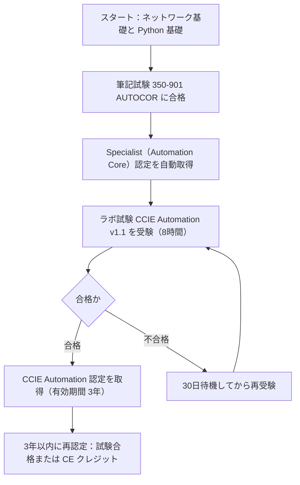

### 1.3 試験の要点（公式情報の整理）

| 項目 | 筆記：350-901 AUTOCOR | ラボ：CCIE Automation v1.1 |
|---|---|---|
| 形式 | 筆記（監督付き試験） | ハンズオン実技 |
| 時間 | 120分 | 8時間 |
| 費用 | 400米ドル（Cisco Learning Credits 利用可） | 1,600米ドル（Cisco Learning Credits 利用可） |
| 前提条件 | なし | 正式な前提なし（筆記試験合格が先に必要） |
| 結果 | 合否判定、オンラインで48時間以内 | 合否判定、オンラインで48時間以内 |
| 不合格後の待機 | CCIE 筆記試験は15暦日 | エキスパートのラボは30暦日 |
| 備考 | 合格で Specialist 認定を取得 | 合格後は、認定が失効しない限り再受験不可 |

> 推奨経験：旧日本語ページでは「NetDevOps テクノロジーとソリューションの設計・導入・運用・最適化に **5〜7年** の経験」が推奨されています。初学者がいきなり合格を目指す認定ではなく、**数年かけて土台を作る長期目標** と捉えるのが現実的です。

### 1.4 ラボ試験の5つのドメインと配点

公式ブループリントによる配点です。**「IaC（Infrastructure as Code）が30%」で最大** である点が重要です。

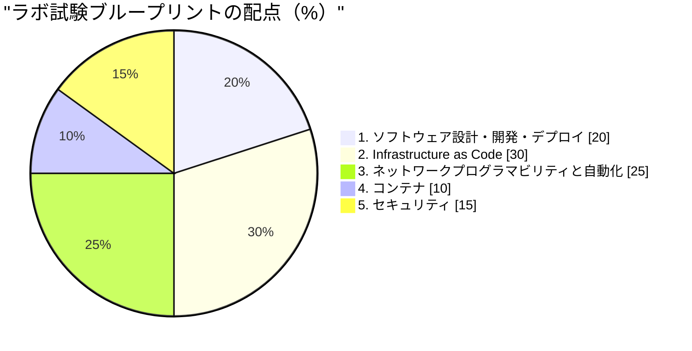

| ドメイン | 配点 | 一言でいうと |
|---|---|---|
| 1.0 Software Design, Development, and Deployment | 20% | 設計・Git・CI/CD・性能の切り分け |
| 2.0 Infrastructure as Code | 30% | API・YANG・NETCONF/RESTCONF・Ansible・Terraform・NSO |
| 3.0 Network Programmability and Automation | 25% | Python SDK・IOS XE 自動設定・pyATS・テレメトリ |
| 4.0 Containers | 10% | Docker・Compose・Kubernetes |
| 5.0 Security | 15% | OWASP・証明書・OAuth2・シークレット管理 |

---

## 2. 学習ロードマップ（初学者向けステップ）

### 2.1 全体の流れ

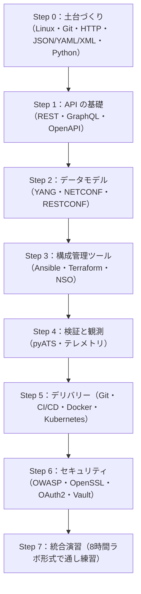

### 2.2 学習期間の目安

| 段階 | 内容 | 目安期間 |
|---|---|---|
| 土台 | CCNA 相当のネットワーク知識＋ Python 基礎 | 2〜4か月 |
| 筆記対策 | AUTOCOR の4ドメインを学習 | 2〜3か月 |
| ラボ対策 | 5ドメインを手を動かして習得 | 4〜6か月 |
| 通し練習 | 時間制限付きで模擬ラボを複数回 | 1〜2か月 |

> 期間はあくまで一般的な目安であり、公式の数値ではありません。業務での経験量により大きく変わります。

### 2.3 Step 0：土台づくり（ここを飛ばすと後で必ず詰まります）

| 領域 | 最低限できてほしいこと |
|---|---|
| Linux | `cd` / `ls` / `grep` / `curl` / `ssh` / パイプ、環境変数、権限 |
| Git | `clone` / `branch` / `commit` / `merge` / `rebase` の違いが説明できる |
| HTTP | メソッド（GET/POST/PUT/PATCH/DELETE）、ステータスコード、ヘッダ、認証 |
| データ形式 | JSON・YAML・XML を読み書きでき、相互に変換できる |
| Python | 関数・辞書・例外処理・仮想環境（`venv`）・`requests` |
| ネットワーク | VLAN・静的ルート・OSPF・BGP・ACL の基本 |

**ベストプラクティス**

- Python は仮想環境を作って依存関係を分離する（`python -m venv .venv`）。
- 手作業の手順は、必ず「再実行しても同じ結果になる（冪等な）スクリプト」に置き換える習慣をつける。
- 学習用ラボは Cisco DevNet Sandbox や Cisco Modeling Labs（CML）など、**壊してよい環境** で行う。

---

## 3. ドメイン1：ソフトウェア設計・開発・デプロイ（20%）

### 3.1 【1.1】オンプレミス／ハイブリッド／パブリッククラウドの設計

ブループリントは、設計時に次の4つの観点を考慮することを求めています。

| 観点 | 公式の記載 | かみ砕いた意味 |
|---|---|---|
| Deployment（展開） | 保守性、モジュール性（コンテナ、VM、オーケストレーション、自動化、コンポーネント、インフラ要件） | 部品を分けて、入れ替え・更新しやすくする |
| Reliability（信頼性） | 高可用性と回復力 | 1台壊れても止まらない、止まってもすぐ戻る |
| Performance（性能） | スケーラビリティ、レイテンシ、レート制限 | 増えても遅くならない、API の呼びすぎを防ぐ |
| Infrastructure（基盤） | モニタリング、可観測性、メトリクス（計測器の配置と展開） | 何が起きているか見える |

#### 設計の考え方を図で理解する

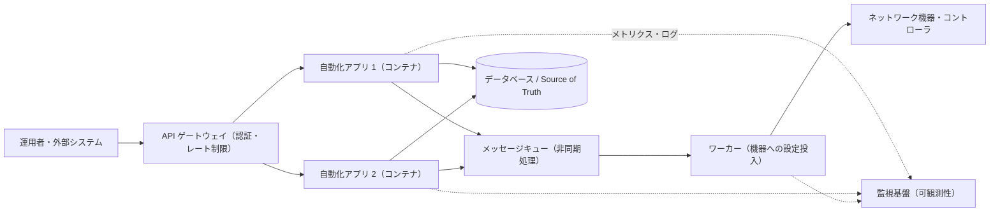

#### 【初学者向け】各観点の具体策

**Deployment（保守性・モジュール性）**
- 1つのコンテナには1つの役割だけを持たせる。
- 設定値はコードに埋め込まず、環境変数や設定ファイルに外出しする。
- 「機器へ投入する処理」と「API を受ける処理」を分けると、片方だけ更新できる。

**Reliability（高可用性・回復力）**
- アプリを複数台（レプリカ）で動かし、ロードバランサーで振り分ける。
- 再試行（リトライ）は **指数バックオフ＋ジッター** で行う（連続で叩いて相手を壊さない）。
- 設定変更は **冪等** にし、途中で失敗しても再実行で収束するようにする。

**Performance（性能・レート制限）**
- 外部 API は呼び出し回数に上限があるのが普通。HTTP `429 Too Many Requests` と `Retry-After` ヘッダに従う。
- 大量の機器には並列処理を使うが、**同時実行数の上限** を必ず決める。

**Infrastructure（可観測性）**
- 「メトリクス（数値）」「ログ（出来事）」「トレース（処理の流れ）」の3種類を揃える。
- 計測器（インスツルメント）は、**入口（API）・外部呼び出し・DB アクセス** の境目に置くと、遅延の原因を特定しやすい。

```python
import random
import time
import requests

def get_with_backoff(url, headers, max_retries=5):
    """429 や一時的エラーに対して、指数バックオフ＋ジッターで再試行する例"""
    for attempt in range(max_retries):
        r = requests.get(url, headers=headers, timeout=10)
        if r.status_code == 429:
            wait = int(r.headers.get("Retry-After", 2 ** attempt))
        elif r.status_code >= 500:
            wait = 2 ** attempt
        else:
            r.raise_for_status()
            return r.json()
        time.sleep(wait + random.uniform(0, 1))  # ジッター
    raise RuntimeError("リトライ上限に達しました")
```

**ベストプラクティスまとめ**

| やること | 理由 |
|---|---|
| タイムアウトを必ず指定する | 応答しない相手に永遠に待たされない |
| 再試行は上限と待ち時間を持たせる | 障害時に自分が負荷の原因にならない |
| 状態を持たない設計（ステートレス）を優先 | 台数を増やしやすい |
| 設計判断を文書化する（ADR） | 後から理由を追える |

### 3.2 【1.2】既存の自動化ソリューションを要件に合わせて修正する

ブループリントは「ビジネス要件・技術要件に基づき、既存のネットワーク自動化ソリューションを修正する（**ギャップ分析、Source of Truth** を含む）」と記載しています。

#### 手順（ステップバイステップ）

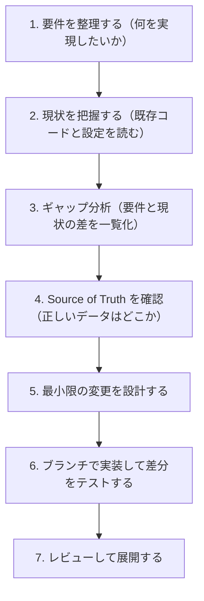

| 用語 | 意味 | 例 |
|---|---|---|
| ギャップ分析 | 「あるべき姿」と「現状」の差を洗い出すこと | VLAN 追加が手動のまま、など |
| Source of Truth（SoT） | 「これが正」と決めたデータの置き場所 | NetBox、Nautobot、Git 上の YAML |

**ベストプラクティス**

- 機器の実際の設定ではなく、**SoT を正** とし、機器との差分を検出して是正する。
- 既存コードは、いきなり書き換えず **まず動かして挙動を確認** する（読むより実行が早い）。
- 変更は小さく分け、1変更につき1コミット・1目的にする。

### 3.3 【1.3】Git を CI/CD 開発ワークフローで使う

#### Git の基本操作

| 操作 | コマンド | 用途 |
|---|---|---|
| 取得 | `git clone <URL>` | リポジトリを手元にコピー |
| ブランチ作成 | `git switch -c feature/add-vlan` | 作業用の枝を作る |
| 記録 | `git add -p` → `git commit -m "..."` | 変更を意味のある単位で保存 |
| 共有 | `git push -u origin feature/add-vlan` | リモートへ送る |
| 取り込み | マージリクエスト（Pull Request）→ マージ | レビューを経て統合 |
| 取り消し | `git revert <commit>` | 履歴を残したまま打ち消す |
| 一時退避 | `git stash` | 作業中の変更を一時保管 |

> `git reset --hard` や共有済みブランチへの `git push --force` は、他人の作業を消す危険があります。試験でも実務でも、**共有履歴は `revert` で戻す** のが安全です。

#### CI/CD のイメージ

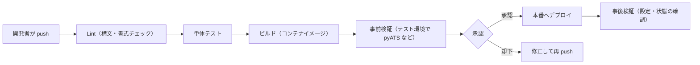

#### GitLab CI の設定例（`.gitlab-ci.yml`）

```yaml
stages:
  - lint
  - test
  - build
  - deploy

default:
  image: python:3.12-slim

lint:
  stage: lint
  script:
    - pip install ruff yamllint
    - ruff check .
    - yamllint .

unit-test:
  stage: test
  script:
    - pip install -r requirements.txt pytest
    - pytest -q

build-image:
  stage: build
  image: docker:27
  services:
    - docker:27-dind
  script:
    - docker build -t "$CI_REGISTRY_IMAGE:$CI_COMMIT_SHORT_SHA" .

deploy-prod:
  stage: deploy
  script:
    - ansible-playbook -i inventory/prod site.yml
  rules:
    - if: '$CI_COMMIT_BRANCH == "main"'
      when: manual   # 本番は手動承認
```

**ベストプラクティス**

| 項目 | 推奨 |
|---|---|
| ブランチ戦略 | `main` は常にデプロイ可能に保ち、機能ごとにブランチを切る |
| コミット | 小さく、メッセージで「何を・なぜ」を説明する |
| 秘密情報 | リポジトリに入れない。CI の **マスク付き変数** やシークレット管理を使う |
| パイプライン | 速い検査（Lint）を先、遅い検査（結合テスト）を後に置く |
| 本番展開 | 手動承認、または段階展開（カナリア）を使う |

### 3.4 【1.4】CI/CD パイプラインのトラブルシュート

ブループリントは原因の例として「コード起因の失敗」「パイプライン自体の問題」「ツール間の非互換」を挙げています。

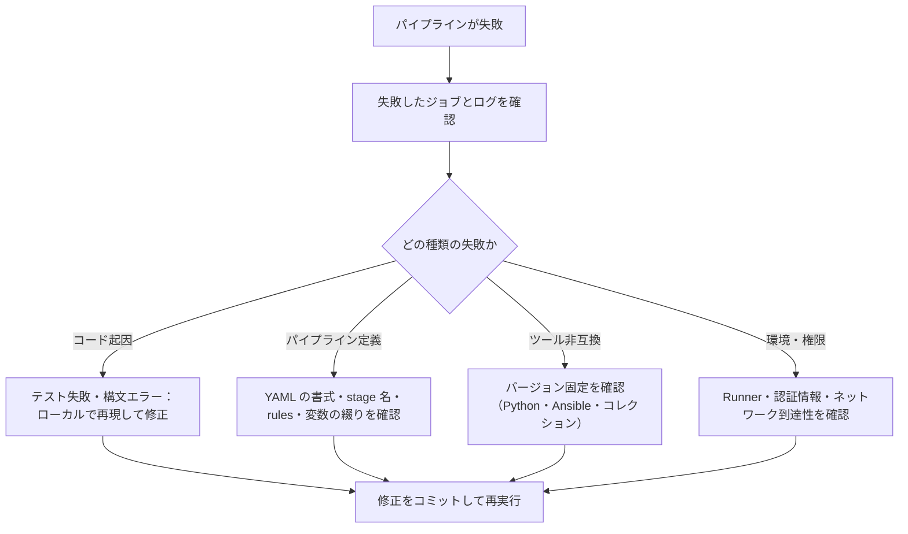

| 症状 | よくある原因 | 確認方法 |
|---|---|---|
| YAML が読み込めない | インデント、タブ文字、コロンの後の空白 | `yamllint`、CI の Lint 機能 |
| `command not found` | イメージに必要なツールが無い | イメージ指定と `pip install` を確認 |
| 昨日まで通っていたのに失敗 | 依存ライブラリの自動更新 | `requirements.txt` でバージョン固定 |
| 認証エラー | 変数の未設定、期限切れトークン | CI 変数の登録とスコープを確認 |
| 手元では動く | 環境差（OS・Python のバージョン） | 手元でも同じコンテナで実行 |

**ベストプラクティス**：「**手元で同じコンテナ・同じコマンドを再現できる**」ようにしておくと、切り分けが圧倒的に速くなります。

### 3.5 【1.5】アプリケーション性能問題の診断

ブループリントの例：非同期リクエスト処理、DB の遅延、高いメモリ／CPU 使用率、マイクロサービス間のネットワーク遅延、非対称ルーティング。これらを「ネットワーク／アプリケーションのツールと保証（Assurance）データ」で診断します。

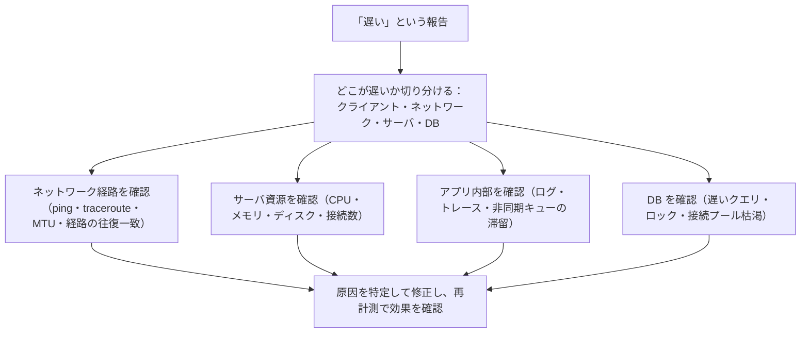

| 症状 | 疑う箇所 | 使うツール例 |
|---|---|---|
| 特定の API だけ遅い | DB クエリ、外部 API 呼び出し | アプリのトレース、DB の遅いクエリログ |
| 時々タイムアウトする | キューの滞留、スレッド枯渇 | キュー長のメトリクス、`ss -s` |
| CPU が張り付く | 無限ループ、重い処理 | `top`、プロファイラ |
| メモリが増え続ける | リーク、巨大データの保持 | `ps`、メモリのメトリクス |
| 行きは速いが戻りが遅い | **非対称ルーティング** | 往復の経路を別々に確認、`traceroute`（両端から） |
| コンテナ間だけ遅い | 内部ネットワーク、DNS | `curl -w`、`dig`、`docker network inspect` |

```bash
# 応答時間の内訳を1コマンドで確認する例
curl -s -o /dev/null -w "DNS:%{time_namelookup}s 接続:%{time_connect}s TLS:%{time_appconnect}s 初回応答:%{time_starttransfer}s 合計:%{time_total}s\n" https://api.example.com/health
```

**ベストプラクティス**

- **推測で直さず、まず計測する**。変更は1つずつ行い、毎回再計測する。
- 平均値だけでなく **パーセンタイル（p95、p99）** を見る。遅いのは一部のリクエストであることが多い。
- 問題が再発したときのために、修正後も **メトリクスを残す**。

---
## 4. ドメイン2：Infrastructure as Code（30%）

最大配点のドメインです。「**API を作る／使う → データモデルで機器を設定する → 3つの自動化ツールで管理する**」という流れで学ぶと理解しやすくなります。

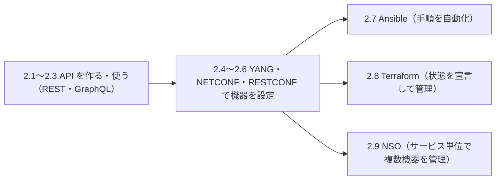

### 4.1 【2.1】Python で REST API を構築・運用する

ブループリント：「Web アプリケーションフレームワークで Python ベースの REST API を構築・管理・運用する（**エンドポイント、HTTP リクエスト／レスポンス、OpenAPI 仕様**）」

#### REST の基本ルール

| HTTP メソッド | 意味 | 成功時のステータス例 |
|---|---|---|
| GET | 取得 | 200 OK |
| POST | 新規作成 | 201 Created |
| PUT | 全体を置き換え | 200 OK / 204 No Content |
| PATCH | 一部を更新 | 200 OK |
| DELETE | 削除 | 204 No Content |

| ステータス | 意味 | 使いどころ |
|---|---|---|
| 400 | リクエストが不正 | 入力の形式エラー |
| 401 | 未認証 | トークンが無い・無効 |
| 403 | 権限なし | 認証済みだが許可されていない |
| 404 | 見つからない | 存在しないリソース |
| 409 | 競合 | すでに存在する、など |
| 422 | 処理できない内容 | 入力の意味的エラー |
| 429 | リクエスト過多 | レート制限 |

#### FastAPI の最小例（OpenAPI 仕様が自動生成されます）

```python
from fastapi import FastAPI, HTTPException
from pydantic import BaseModel, Field

app = FastAPI(title="Device Inventory API", version="1.0.0")

class Device(BaseModel):
    hostname: str = Field(min_length=1, max_length=63)
    mgmt_ip: str
    role: str = "access"

devices: dict[str, Device] = {}   # 学習用のメモリ上データ（本番では DB を使う）

@app.get("/devices", response_model=list[Device])
def list_devices():
    return list(devices.values())

@app.get("/devices/{hostname}", response_model=Device)
def get_device(hostname: str):
    if hostname not in devices:
        raise HTTPException(status_code=404, detail="device not found")
    return devices[hostname]

@app.post("/devices", response_model=Device, status_code=201)
def create_device(device: Device):
    if device.hostname in devices:
        raise HTTPException(status_code=409, detail="already exists")
    devices[device.hostname] = device
    return device

@app.delete("/devices/{hostname}", status_code=204)
def delete_device(hostname: str):
    devices.pop(hostname, None)
```

```bash
pip install fastapi uvicorn
uvicorn main:app --reload --port 8000
# OpenAPI 仕様（JSON）:  http://localhost:8000/openapi.json
# 対話型ドキュメント:    http://localhost:8000/docs
```

> 試験で使うフレームワーク（Flask か FastAPI かなど）は環境側で指定される可能性があります。**どちらでも「ルーティング・入力検証・エラー応答・仕様書出力」の4点を押さえる** ことが大切です。

**OpenAPI とは**：API の仕様（パス、パラメータ、レスポンス）を機械が読める形で書いた文書です。これがあると、クライアントコードの自動生成、ドキュメント生成、テストの自動化ができます。

**ベストプラクティス**

| 項目 | 推奨 |
|---|---|
| 名前の付け方 | URL は名詞の複数形（`/devices`）、動詞は HTTP メソッドで表す |
| 入力検証 | スキーマ（Pydantic など）で型・長さ・範囲を必ず検証 |
| エラー | 適切なステータスコードと、原因が分かるメッセージ（内部情報は出さない） |
| バージョン | `/v1/` のようにバージョンを URL かヘッダに含める |
| 仕様書 | OpenAPI をコードから生成し、常に実装と一致させる |
| 一覧取得 | ページネーション（`limit` / `offset`）を用意する |

### 4.2 【2.2】REST API を使う Python CLI アプリを作る

```python
#!/usr/bin/env python3
"""使い方:  python devcli.py list   /   python devcli.py add --hostname sw1 --ip 192.0.2.11"""
import argparse
import os
import sys
import requests

BASE = os.environ.get("API_BASE", "http://localhost:8000")

def cmd_list(_args):
    r = requests.get(f"{BASE}/devices", timeout=10)
    r.raise_for_status()
    for d in r.json():
        print(f'{d["hostname"]:<15} {d["mgmt_ip"]:<15} {d["role"]}')

def cmd_add(args):
    body = {"hostname": args.hostname, "mgmt_ip": args.ip, "role": args.role}
    r = requests.post(f"{BASE}/devices", json=body, timeout=10)
    if r.status_code == 409:
        print("すでに登録されています", file=sys.stderr)
        sys.exit(1)
    r.raise_for_status()
    print("登録しました")

def main():
    p = argparse.ArgumentParser(description="Device inventory CLI")
    sub = p.add_subparsers(dest="command", required=True)

    sub.add_parser("list").set_defaults(func=cmd_list)

    a = sub.add_parser("add")
    a.add_argument("--hostname", required=True)
    a.add_argument("--ip", required=True)
    a.add_argument("--role", default="access")
    a.set_defaults(func=cmd_add)

    args = p.parse_args()
    args.func(args)

if __name__ == "__main__":
    main()
```

**ベストプラクティス**：接続先や認証情報は **環境変数** から読む（コマンドライン引数に秘密情報を書くと履歴に残る）。終了コード（成功0／失敗1）を正しく返し、CI から呼べるようにする。

### 4.3 【2.3】ドキュメントを読んで新しい API を使う（REST／GraphQL）

試験では「初めて見る API」を **ドキュメントだけを頼りに使う** 力が問われます。

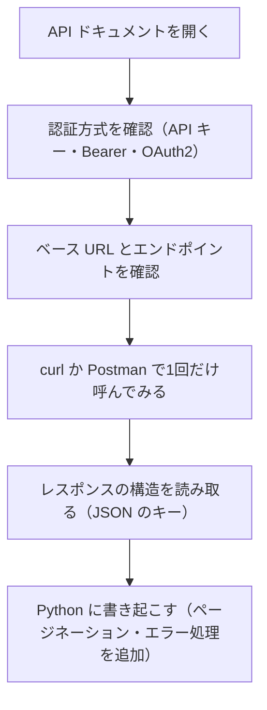

#### REST と GraphQL の違い

| 観点 | REST | GraphQL |
|---|---|---|
| エンドポイント | リソースごとに多数 | 通常は1つ（例：`/graphql`） |
| 取得項目 | サーバが決める | クライアントが必要な項目だけ指定 |
| 複数リソースの取得 | 複数回の呼び出しが必要になりがち | 1回のクエリでまとめて取得できる |
| メソッド | GET/POST/PUT/PATCH/DELETE | 基本は POST（クエリ本文に記述） |

```python
import requests

# GraphQL の呼び出し例（エンドポイントとクエリはドキュメントに従う）
query = """
query ($site: String!) {
  devices(site: $site) {
    name
    status
  }
}
"""
r = requests.post(
    "https://api.example.com/graphql",
    json={"query": query, "variables": {"site": "tokyo"}},
    headers={"Authorization": f"Bearer {TOKEN}"},
    timeout=10,
)
r.raise_for_status()
payload = r.json()
if "errors" in payload:           # GraphQL は 200 でもエラーを返すことがある
    raise RuntimeError(payload["errors"])
print(payload["data"]["devices"])
```

**ベストプラクティス**

- GraphQL は HTTP 200 でも **`errors` キー** にエラーが入るため、必ず確認する。
- 大量取得では **ページネーション**（`next` リンクやカーソル）を最後まで辿る。
- 呼ぶ前に `curl` で1件試し、レスポンスの形を目で確認してからコード化する。

### 4.4 【2.4】YANG モジュールから RESTCONF／NETCONF のペイロードを作る

#### まず用語を整理

| 用語 | 一言で | 補足 |
|---|---|---|
| YANG | 機器の設定・状態の「型定義（設計図）」 | 設定の構造をルール化した言語（RFC 7950） |
| NETCONF | 機器を設定するプロトコル（XML、SSH上、ポート830） | RFC 6241 |
| RESTCONF | YANG モデルを HTTP で扱うプロトコル（JSON/XML） | RFC 8040 |
| ペイロード | 送るデータ本体 | モデルの構造に一致させる |

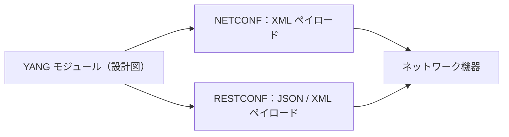

#### YANG の読み方（超入門）

```yang
module example-interface {
  namespace "http://example.com/ns/interface";
  prefix exif;

  container interfaces {
    list interface {
      key "name";
      leaf name        { type string; }
      leaf description { type string; }
      leaf enabled     { type boolean; default true; }
    }
  }
}
```

| YANG の要素 | 意味 | 対応するデータ |
|---|---|---|
| `container` | 入れ物（まとめる） | JSON のオブジェクト |
| `list` | 同じ形の繰り返し（`key` で識別） | JSON の配列 |
| `leaf` | 1つの値 | JSON のキーと値 |
| `leaf-list` | 値のリスト | JSON の値の配列 |

#### RESTCONF で IOS XE を操作する（標準モデル `ietf-interfaces`）

```python
import os
import requests

HOST = "192.0.2.10"
AUTH = (os.environ["DEV_USER"], os.environ["DEV_PASS"])
HDR = {
    "Accept": "application/yang-data+json",
    "Content-Type": "application/yang-data+json",
}
base = f"https://{HOST}/restconf/data"

# 取得（GET）
r = requests.get(f"{base}/ietf-interfaces:interfaces", headers=HDR, auth=AUTH,
                 verify="ca.pem", timeout=15)
print(r.status_code, r.json())

# 部分更新（PATCH）：description だけ変更する
body = {
    "ietf-interfaces:interface": {
        "name": "GigabitEthernet1",
        "description": "managed by automation",
    }
}
r = requests.patch(f"{base}/ietf-interfaces:interfaces/interface=GigabitEthernet1",
                   headers=HDR, auth=AUTH, json=body, verify="ca.pem", timeout=15)
print(r.status_code)   # 204 No Content なら成功
```

| RESTCONF メソッド | 動き |
|---|---|
| GET | 取得 |
| POST | 子リソースの作成 |
| PUT | 対象を丸ごと置き換え |
| PATCH | 指定した部分だけ更新（マージ） |
| DELETE | 削除 |

> IOS XE 側で RESTCONF を有効にする代表的な設定は `restconf` と `ip http secure-server` です（バージョンや認証設定の詳細は機器のドキュメントで確認してください）。

**ベストプラクティス**

- 証明書の検証（`verify`）は **本番では必ず有効**。学習用の `verify=False` を持ち込まない。
- **PUT は置き換え、PATCH は部分更新** と覚える。PUT の使い間違いで既存設定が消える事故が多い。
- ペイロードを手書きせず、**YANG 解析ツール**（YANG Suite など）や、機器から取得した JSON を雛形にして作る。

### 4.5 【2.5】XPath で NETCONF フィルタを作る

NETCONF の `get` / `get-config` では、取得範囲を **フィルタ** で絞れます。種類は2つあります。

| フィルタ | 書き方 | 備考 |
|---|---|---|
| サブツリーフィルタ | 取りたい構造を XML で書く | 標準で必須対応 |
| **XPath フィルタ** | `select` 属性に XPath を書く | 機器が `:xpath` ケイパビリティに対応している必要がある |

```xml
<rpc message-id="101" xmlns="urn:ietf:params:xml:ns:netconf:base:1.0">
  <get-config>
    <source><running/></source>
    <filter xmlns:if="urn:ietf:params:xml:ns:yang:ietf-interfaces"
            type="xpath"
            select="/if:interfaces/if:interface[if:name='GigabitEthernet1']"/>
  </get-config>
</rpc>
```

読み解きのコツ：

- `/if:interfaces/if:interface` は、「interfaces の下の interface」を指す **パス**。
- `[if:name='GigabitEthernet1']` は **条件（述語）**。名前が一致するものだけ。
- `if:` は **名前空間の接頭辞**。`xmlns:if=...` で宣言しないとエラーになる。

```python
from ncclient import manager

with manager.connect(host="192.0.2.10", port=830,
                     username=USER, password=PASS,
                     hostkey_verify=True) as m:
    # まずケイパビリティを確認する
    print([c for c in m.server_capabilities if "xpath" in c])

    reply = m.get_config(
        source="running",
        filter=("xpath", "/interfaces/interface[name='GigabitEthernet1']"),
    )
    print(reply.xml)
```

**ベストプラクティス**

- 最初に **ハロー（`server_capabilities`）で `:xpath` 対応を確認** する。非対応ならサブツリーフィルタを使う。
- `hostkey_verify=False` は学習用。実運用では SSH ホスト鍵を検証する。
- 取得範囲を絞ると、通信量・機器負荷・処理時間がすべて下がる。

### 4.6 【2.6】NETCONF／RESTCONF で機器を設定する（SoT 駆動）

ブループリント：「既存インフラの機器を、YANG 解析ツールを使い、**Source of Truth に基づいて** NETCONF／RESTCONF で設定する」

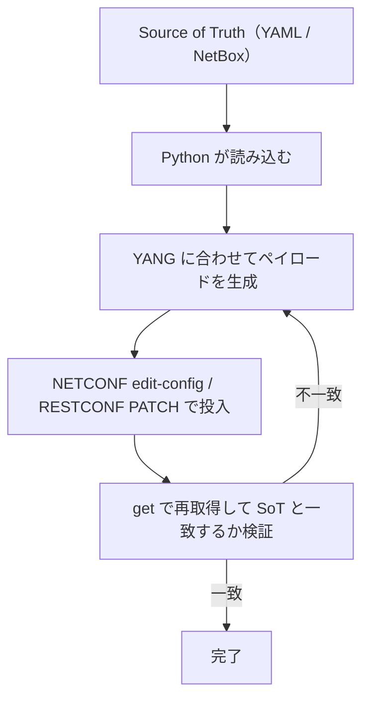

```python
from ncclient import manager

SOT = {  # 本来は NetBox や Git 上の YAML から読み込む
    "GigabitEthernet2": {"description": "uplink to core", "enabled": True},
}

def build_payload(name, attrs):
    return f"""
    <config>
      <interfaces xmlns="urn:ietf:params:xml:ns:yang:ietf-interfaces">
        <interface>
          <name>{name}</name>
          <description>{attrs["description"]}</description>
          <type xmlns:ianaift="urn:ietf:params:xml:ns:yang:iana-if-type">ianaift:ethernetCsmacd</type>
          <enabled>{str(attrs["enabled"]).lower()}</enabled>
        </interface>
      </interfaces>
    </config>"""

with manager.connect(host=HOST, port=830, username=USER, password=PASS,
                     hostkey_verify=True) as m:
    for name, attrs in SOT.items():
        m.edit_config(target="running", config=build_payload(name, attrs))
```

**ベストプラクティス**

- **「投入 → 再取得 → 比較」** をセットにして、設定が本当に反映されたかを自動検証する。
- NETCONF の `candidate` データストア（対応機器）を使うと、`validate` と `commit` で **まとめて安全に反映** できる。
- 変更前の設定を保存し、失敗時に戻せるようにする。

### 4.7 【2.7】Ansible でロールを作り、インフラを管理する

#### Ansible とは

エージェント不要で、YAML の **プレイブック** に「あるべき状態」を書いて機器を設定する自動化ツールです。ブループリントが求める要素は次の4つです。

| 要素 | ブループリントの記載 | 意味 |
|---|---|---|
| ループ制御 | Loop control | 同じ処理を複数の対象に繰り返す |
| 条件分岐 | Conditionals | 条件を満たす時だけ実行 |
| 変数とテンプレート | Use of variables and templating | 値を外出し、Jinja2 で設定文を生成 |
| 接続プラグイン | network CLI、HTTPAPI、NETCONF | 機器との通信方法 |

#### ロールの構成（ファイルの役割）

| ファイル／ディレクトリ | 役割 |
|---|---|
| `roles/vlans/tasks/main.yml` | 実行する処理の本体 |
| `roles/vlans/defaults/main.yml` | 変数の既定値（上書きされやすい） |
| `roles/vlans/vars/main.yml` | 変数の固定値 |
| `roles/vlans/templates/*.j2` | Jinja2 テンプレート |
| `roles/vlans/handlers/main.yml` | 変更があった時だけ動く処理 |

#### インベントリ（機器の一覧と接続方法）

```yaml
# inventory/hosts.yml
all:
  children:
    switches:
      hosts:
        sw1: { ansible_host: 192.0.2.11 }
        sw2: { ansible_host: 192.0.2.12 }
      vars:
        ansible_connection: ansible.netcommon.network_cli
        ansible_network_os: cisco.ios.ios
        ansible_user: "{{ lookup('env', 'DEV_USER') }}"
        ansible_password: "{{ lookup('env', 'DEV_PASS') }}"
```

#### ロールのタスク（ループ・条件・変数・テンプレート）

```yaml
# roles/vlans/defaults/main.yml
vlans:
  - { id: 10, name: USERS,   enabled: true }
  - { id: 20, name: SERVERS, enabled: true }
  - { id: 99, name: LEGACY,  enabled: false }

# roles/vlans/tasks/main.yml
- name: Configure VLANs (ループ + 条件 + 変数)
  cisco.ios.ios_vlans:
    config:
      - vlan_id: "{{ item.id }}"
        name: "{{ item.name }}"
    state: merged
  loop: "{{ vlans }}"
  loop_control:
    label: "VLAN {{ item.id }}"
  when: item.enabled | bool

- name: Render NTP config from template
  cisco.ios.ios_config:
    src: ntp.j2
  notify: save config
```

```jinja
{# roles/vlans/templates/ntp.j2 #}

ntp server {{ server }}

```

#### 3つの接続プラグインの使い分け

| 接続プラグイン | 使う場面 | 対応するモジュールの例 |
|---|---|---|
| `ansible.netcommon.network_cli` | CLI（SSH）で操作 | `cisco.ios.ios_*` |
| `ansible.netcommon.httpapi` | HTTP の API で操作 | `ansible.netcommon.restconf_*` など |
| `ansible.netcommon.netconf` | NETCONF で操作 | `ansible.netcommon.netconf_config` |

```bash
ansible-playbook -i inventory/hosts.yml site.yml --check --diff   # まず事前確認（ドライラン）
ansible-playbook -i inventory/hosts.yml site.yml                   # 本実行
```

**ベストプラクティス**

| 項目 | 推奨 |
|---|---|
| 冪等性 | `command` / `shell` より、専用モジュール（`state:` を持つもの）を優先する |
| 事前確認 | `--check --diff` で差分を見てから適用する |
| 秘密情報 | **Ansible Vault** か外部のシークレット管理を使い、平文で置かない |
| 変数の整理 | 機器共通は `group_vars`、機器固有は `host_vars` に置く |
| 設定の保存 | 変更があったときだけハンドラーで保存する |
| 検証 | 適用後に `*_facts` や `assert` で状態を確認する |

### 4.8 【2.8】Terraform で状態を持つインフラ管理

#### Terraform とは

「あるべき状態」を HCL で **宣言** し、現在の状態（**ステート**）との差分だけを実行するツールです。Ansible が「手順」寄りなのに対し、Terraform は「状態」寄りです。

| 要素 | ブループリントの記載 | 意味 |
|---|---|---|
| ループ制御 | Loop control | `count` / `for_each` で複数作成 |
| リソースグラフ | Resource graphs | 依存関係から作成順を自動決定 |
| 変数 | Use of variables | `variable` で値を外出し |
| リソース取得 | Resource retrieval | `data` ブロックで既存情報を読む |
| リソース作成 | Resource provision | `resource` ブロックで作る |
| 状態管理 | Management of the state | ステートファイルで追跡 |

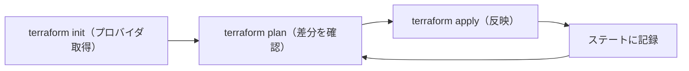

```hcl
terraform {
  required_providers {
    aci = {
      source  = "CiscoDevNet/aci"
      version = "~> 2.0"
    }
  }
}

variable "tenants" {
  type    = set(string)
  default = ["prod", "dev"]
}

variable "apic_password" {
  type      = string
  sensitive = true        # 画面出力でマスクされる
}

provider "aci" {
  username = "admin"
  password = var.apic_password
  url      = "https://apic.example.com"
  insecure = false
}

# 複数テナントをループで作る（for_each）
resource "aci_tenant" "this" {
  for_each = var.tenants
  name     = each.key
}

# 既存リソースを読み取る（data）
data "aci_tenant" "common" {
  name = "common"
}
```

> 上記のバージョン指定や属性名は説明用の例です。実際には、使用するプロバイダのドキュメントとバージョンで確認してください。

#### 主要コマンド

| コマンド | 用途 |
|---|---|
| `terraform init` | プロバイダ・モジュールの取得 |
| `terraform fmt` / `validate` | 書式の整形／構文の検証 |
| `terraform plan` | 反映前に差分を確認 |
| `terraform apply` | 反映 |
| `terraform destroy` | 管理対象を削除 |
| `terraform graph` | リソースの依存グラフを出力 |
| `terraform state list` | ステートに記録されたリソースの一覧 |
| `terraform import` | 既存リソースをステートに取り込む |

**ベストプラクティス**

- **ステートは重要な資産**。ローカル保存を避け、**ロック機能付きのリモートバックエンド** に置く。
- ステートには機密値が入ることがあるため、**アクセス権限を絞る**。
- 必ず `plan` を確認してから `apply` する。`destroy` を含む差分は特に注意。
- 手動で機器を変更すると、ステートと実機がずれる（ドリフト）。変更はコード経由に統一する。

### 4.9 【2.9】Cisco NSO のサービスパッケージを作る

#### NSO とは

Cisco NSO（Network Services Orchestrator）は、**複数機器にまたがる設定を「サービス」という単位でモデル化して管理する** オーケストレーターです。ブループリントでは、`cisco-ios-cli` NED を使い、**`python-and-template` タイプ** の基本サービスを作ることが求められています。

| NSO の用語 | 意味 |
|---|---|
| NED（Network Element Driver） | 各機器と会話するためのドライバ。`cisco-ios-cli` は IOS 系 CLI 用 |
| サービスパッケージ | サービスの定義一式（YANG・テンプレート・Python） |
| サービスポイント | サービスと処理を結びつける名前 |
| CDB | NSO の内部データベース（設定を保持） |

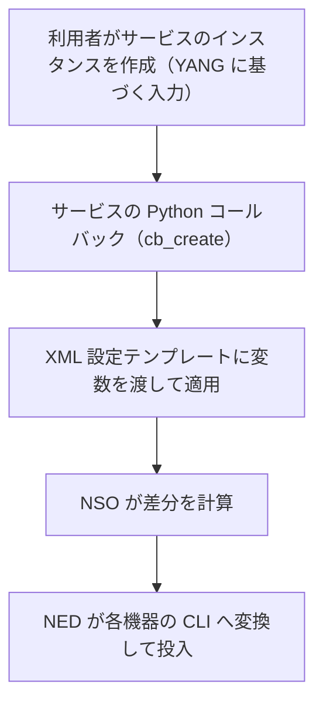

#### 作成手順

| 手順 | 内容（ブループリント項目） |
|---|---|
| 1 | パッケージの雛形を作る |
| 2 | **【2.9.a】** 提供された機器設定から、サービステンプレートを作る |
| 3 | **【2.9.b】** サービスの YANG モジュールを書く（`list`、`leaf-list`、データ型、`leafref`、単一引数の `when` と `must`） |
| 4 | **【2.9.c】** サービスの運用状態を確認する基本的なアクションを作る |
| 5 | **【2.9.d】** NCS の Python VM ログを見てサービスの状態を監視する |

```bash
# 1. 雛形の作成（python-and-template タイプ）
ncs-make-package --service-skeleton python-and-template \
                 --component-class main.Main \
                 --dest packages/vlan-svc vlan-svc

# 2. ビルドして NSO に読み込ませる
make -C packages/vlan-svc/src
ncs_cli -u admin -C        # CLI に入り、packages reload を実行
```

#### YANG（サービスモデル）の例

```yang
module vlan-svc {
  namespace "http://example.com/vlan-svc";
  prefix vsvc;

  import tailf-ncs { prefix ncs; }

  list vlan-svc {
    key name;
    uses ncs:service-data;
    ncs:servicepoint "vlan-svc";

    leaf name { type string; }

    leaf device {
      type leafref {
        path "/ncs:devices/ncs:device/ncs:name";   // 登録済み機器から選ぶ
      }
      mandatory true;
    }

    leaf vlan-id {
      type uint16 { range "2..4094"; }
      mandatory true;
    }

    leaf vlan-name {
      type string;
      must "string-length(.) <= 32" {                 // 入力チェック
        error-message "VLAN 名は32文字以内にしてください";
      }
    }

    leaf-list trunk-ports { type string; }

    leaf svi-ip {
      when "../vlan-id > 1";                          // 条件付きで有効な項目
      type string;
    }
  }
}
```

#### サービステンプレート（XML）の例

```xml
<config-template xmlns="http://tail-f.com/ns/config/1.0" servicepoint="vlan-svc">
  <devices xmlns="http://tail-f.com/ns/ncs">
    <device>
      <name>{/device}</name>
      <config>
        <vlan xmlns="urn:ios">
          <vlan-list>
            <id>{/vlan-id}</id>
            <name>{/vlan-name}</name>
          </vlan-list>
        </vlan>
      </config>
    </device>
  </devices>
</config-template>
```

#### Python コールバックの例

```python
import ncs
from ncs.application import Service

class VlanServiceCallback(Service):
    @Service.create
    def cb_create(self, tctx, root, service, proplist):
        self.log.info(f"service create: {service.name}")
        tvars = ncs.template.Variables()
        template = ncs.template.Template(service)
        template.apply("vlan-svc-template", tvars)   # テンプレート名はパッケージ内の定義に合わせる

class Main(ncs.application.Application):
    def setup(self):
        self.register_service("vlan-svc", VlanServiceCallback)
```

> 名前空間（`urn:ios`）、テンプレート名、ファイルの置き場所は、使用する NED とパッケージ雛形のバージョンで異なります。**実際の環境では、機器から取り込んだ設定（`show running-config` 相当）をテンプレートの元にする** のが確実です。

**サービス状態の確認とログ**

- Python VM のログは、NSO の実行ディレクトリの `logs` 配下に、パッケージ名を含む `ncs-python-vm-<パッケージ名>.log` として出力されます。コールバックで `self.log.info(...)` と書いた内容や、例外のトレースバックが見られます。
- 設定がどう変換されるかは、NSO の CLI で `commit dry-run` を使って事前確認できます。

**ベストプラクティス**

| 項目 | 推奨 |
|---|---|
| テンプレート | ロジックはなるべくテンプレートと YANG に寄せ、Python は最小限にする |
| 入力検証 | `must`・`when`・型の範囲指定で、不正な入力を **モデルの段階で** 弾く |
| 反映前確認 | `commit dry-run` で必ず差分を確認する |
| 運用 | サービスの削除で関連設定がきれいに消えること（ライフサイクル）を確認する |
| デバッグ | まずテンプレート単体で動作確認し、次に Python を足す |

#### Ansible・Terraform・NSO の使い分け

| 観点 | Ansible | Terraform | NSO |
|---|---|---|---|
| 考え方 | 手順（タスク）を順に実行 | 状態を宣言して差分を適用 | サービスを宣言して複数機器へ展開 |
| 得意分野 | 機器の設定・運用タスク | クラウドやコントローラのリソース | マルチベンダー機器にまたがるサービス |
| 状態管理 | 持たない（機器が状態） | ステートファイル | NSO の CDB |
| ロールバック | 自前で用意 | 明示的な再 apply | トランザクションで自動的に可能 |

---
## 5. ドメイン3：ネットワークプログラマビリティと自動化（25%）

### 5.1 【3.1】Python ライブラリと SDK ドキュメントで各プラットフォームを自動化する

ブループリントが対象にしているプラットフォームは次の9つです。**共通の型を覚えれば、初見のプラットフォームも怖くありません。**


| プラットフォーム | 何をするものか | 認証の考え方（一般的な例） | 呼び出しの入口 |
|---|---|---|---|
| ACI | データセンターの SDN（APIC） | ログインして取得したセッション・トークンを使用 | APIC の REST API |
| AppDynamics | アプリケーション性能監視 | OAuth 方式のトークン | Controller の REST API |
| Catalyst Center | キャンパス／ブランチの管理基盤 | ユーザー認証でトークンを取得し、ヘッダに付与 | Intent API（REST） |
| FDM | Firepower デバイスマネージャ（FTD の機器内管理） | トークン取得後に Bearer で使用 | FDM の REST API |
| Intersight | サーバ／インフラのクラウド管理 | API キーによる署名付きリクエスト | Intersight の REST API／SDK |
| IOS XE | ルータ／スイッチ | ユーザー名とパスワード（HTTPS／SSH） | RESTCONF／NETCONF／CLI |
| Meraki | クラウド管理型ネットワーク | API キー（ヘッダ） | Dashboard API |
| NSO | ネットワークオーケストレータ | ユーザー認証 | RESTCONF／Python API |
| Webex | コラボレーション | Bearer トークン（ボット等） | Webex REST API |

> 認証方式やパス名はバージョンで変わります。**試験では SDK ドキュメントが手元にある前提** なので、「暗記」より「ドキュメントから該当箇所を素早く探し、動かす」練習を重ねてください。

#### 共通で使える雛形（セッションと例外処理）

```python
import os
import requests

class ApiClient:
    def __init__(self, base_url, token):
        self.base = base_url.rstrip("/")
        self.s = requests.Session()           # 接続を再利用して高速化
        self.s.headers.update({
            "Authorization": f"Bearer {token}",
            "Accept": "application/json",
        })

    def get(self, path, **params):
        r = self.s.get(f"{self.base}{path}", params=params, timeout=15)
        r.raise_for_status()
        return r.json()

client = ApiClient(os.environ["API_BASE"], os.environ["API_TOKEN"])
```

**ベストプラクティス**

- `requests.Session` を使い、**タイムアウトは各リクエストで必ず指定** する。
- 公式 SDK があれば、まず SDK のドキュメントのサンプルを動かして挙動を知る。
- ページネーションとレート制限（429）への対応を最初から入れておく。

### 5.2 【3.2】IOS XE の設定を自動化する

対象は、**インターフェース、静的ルート、VLAN、ACL、BGP ピア、BGP／OSPF のルーティングテーブルと隣接関係** です。前半が「設定」、後半が「状態の確認」になっている点に注目してください。

| 項目 | 設定（書く） | 確認（読む） |
|---|---|---|
| インターフェース | IP アドレス、description、有効化 | `show ip interface brief` |
| 静的ルート | `ip route` | `show ip route static` |
| VLAN | VLAN の作成と名前 | `show vlan brief` |
| ACL | 許可・拒否ルール | `show access-lists` |
| BGP ピア | neighbor の定義 | `show ip bgp summary` |
| BGP／OSPF テーブル・隣接 | （設定の結果として） | `show ip route bgp`／`show ip ospf neighbor` |

```python
from netmiko import ConnectHandler

device = {
    "device_type": "cisco_xe",
    "host": "192.0.2.10",
    "username": USER,
    "password": PASS,
}

config = [
    "interface GigabitEthernet2",
    " description uplink-to-core",
    " ip address 10.0.0.1 255.255.255.252",
    " no shutdown",
    "ip route 192.168.100.0 255.255.255.0 10.0.0.2",
    "ip access-list extended BLOCK-TELNET",
    " deny tcp any any eq 23",
    " permit ip any any",
]

with ConnectHandler(**device) as conn:
    out = conn.send_config_set(config)
    print(out)
    print(conn.send_command("show ip interface brief"))
    print(conn.send_command("show ip bgp summary"))
    print(conn.send_command("show ip ospf neighbor"))
```

**BGP と OSPF の状態確認のポイント**

| 確認したいこと | 見るもの | 正常の目安 |
|---|---|---|
| BGP ピアが確立しているか | `show ip bgp summary` の State/PfxRcd 列 | 数字（受信プレフィックス数）が表示される |
| OSPF の隣接が確立しているか | `show ip ospf neighbor` の State 列 | `FULL`（ネットワーク種別によっては `2WAY`） |
| 経路が載っているか | `show ip route` | 期待するプレフィックスが存在する |

**ベストプラクティス**

- CLI のテキストを正規表現で読むのは壊れやすい。**構造化データ（Genie パーサ、RESTCONF の JSON）** で取得して比較する。
- 設定の前後で状態を取り（スナップショット）、**差分** を検証に使う。
- ACL は、**適用前に管理経路を遮断しない** ことを必ず確認する（自分が締め出される事故を防ぐ）。

### 5.3 【3.3】pyATS で自動テストを作る・修正する・トラブルシュートする

#### pyATS とは

ネットワークの状態を **テストとして自動確認** するための Cisco 製フレームワークです。次の3つの部品を覚えます。

| 部品 | 役割 | ブループリント項目 |
|---|---|---|
| テストベッドファイル | 接続先機器の一覧と接続方法（YAML） | 3.3.a |
| Genie（パーサ・モデル） | CLI 出力を構造化データにする、機能単位の状態を学習する | 3.3.b |
| AEtest | テストの書き方（セットアップ → テスト → 後片付け） | 3.3.c |

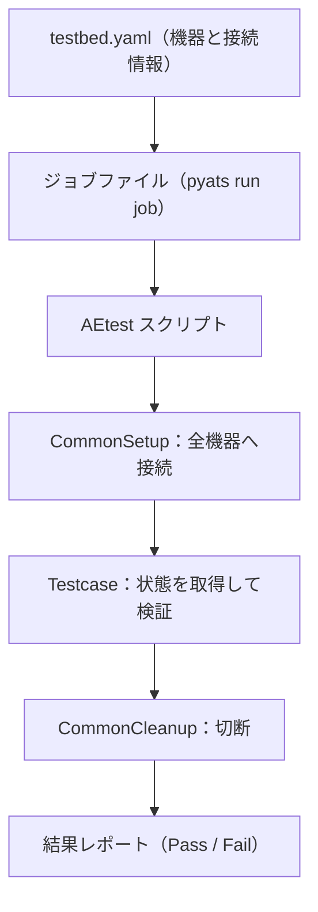

**テストベッドファイル**

```yaml
# testbed.yaml
testbed:
  name: lab
  credentials:
    default:
      username: admin
      password: "%ENV{LAB_PASSWORD}"     # 環境変数から読む

devices:
  csr1:
    os: iosxe
    type: router
    connections:
      cli:
        protocol: ssh
        ip: 192.0.2.10
```

**Genie パーサの利用**

```python
from genie.testbed import load

testbed = load("testbed.yaml")
dev = testbed.devices["csr1"]
dev.connect(log_stdout=False)

parsed = dev.parse("show ip interface brief")    # 構造化された辞書が返る
for ifname, info in parsed["interface"].items():
    print(ifname, info["ip_address"], info["status"])
```

**AEtest によるテスト（OSPF 隣接が FULL かを検証）**

```python
# test_ospf.py
from pyats import aetest

class CommonSetup(aetest.CommonSetup):
    @aetest.subsection
    def connect(self, testbed):
        for dev in testbed.devices.values():
            dev.connect(log_stdout=False)

class OspfNeighbors(aetest.Testcase):
    @aetest.test
    def all_full(self, testbed):
        failed = []
        for name, dev in testbed.devices.items():
            out = dev.parse("show ip ospf neighbor")
            for iface, data in out.get("interfaces", {}).items():
                for nbr, n in data.get("neighbors", {}).items():
                    if not n["state"].upper().startswith("FULL"):
                        failed.append(f"{name} {iface} {nbr} {n['state']}")
        if failed:
            self.failed("FULL でない隣接:\n" + "\n".join(failed))

class CommonCleanup(aetest.CommonCleanup):
    @aetest.subsection
    def disconnect(self, testbed):
        for dev in testbed.devices.values():
            dev.disconnect()
```

```python
# job.py
from pyats.easypy import run

def main(runtime):
    run(testscript="test_ospf.py", runtime=runtime)
```

```bash
pyats run job job.py --testbed-file testbed.yaml
```

**ベストプラクティス**

- 「**期待値を先に決める**」。何がどうなればテスト合格かを、コードの前に文章で書く。
- パーサの戻り値の構造は機器・バージョンで異なる。**実際に `print` して構造を確認してから** 検証コードを書く。
- テスト失敗時は、**どの機器・どの項目か** が分かるメッセージを出す。
- テストは CI に組み込み、**変更の前後（事前検証・事後検証）** で実行する。

### 5.4 【3.4】モデル駆動型テレメトリの設計

#### 従来との違い

| 方式 | 仕組み | 弱点 |
|---|---|---|
| SNMP ポーリング | 管理サーバが定期的に機器へ問い合わせ | 間隔が粗い、機器とサーバの負荷が高い |
| モデル駆動型テレメトリ | 機器が YANG モデルに沿って **データを送り出す（ストリーミング）** | 設計と受信基盤が必要 |

#### 3つの接続方式（ブループリント：gNMI dial-in、gRPC dial-out、NETCONF dial-in）

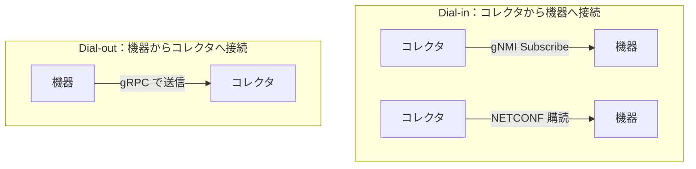

| 方式 | 接続の向き | 向いている場面 |
|---|---|---|
| gNMI dial-in | コレクタ → 機器 | コレクタ側で購読を動的に変えたい |
| gRPC dial-out | 機器 → コレクタ | 機器がファイアウォール／NAT の内側にある、機器側で設定を固定したい |
| NETCONF dial-in | コレクタ → 機器 | 既存の NETCONF 運用に統合したい |

**設計時に決めること**

| 決めること | 選択肢と考え方 |
|---|---|
| 何を取るか | YANG モデルの **パス**（例：インターフェースの統計） |
| いつ送るか | **周期（periodic）** か **変化時（on-change）** |
| どの頻度か | 必要な粒度ぎりぎりまで下げる。高頻度は機器とコレクタの負荷になる |
| どう守るか | TLS で暗号化し、認証を設定する |
| どこへ保存するか | 時系列データベースと可視化基盤 |

### 5.5 【3.5】YANG モデル駆動型テレメトリのサブスクリプションを作る

ブループリントの細目（3.5.a〜g）を、手順として並べ替えると次のようになります。

| 手順 | ブループリント | 内容 |
|---|---|---|
| 1 | 3.5.a | 対象のモデル要素（パス）と、収集の周期（cadence）を特定 |
| 2 | 3.5.b | 周期型か、**変化時／イベント駆動** かを選ぶ |
| 3 | 3.5.c | 頻度を最適化する |
| 4 | 3.5.d | dial-out のサブスクリプションを設定する |
| 5 | 3.5.e | テレメトリのストリームを保護する（TLS など） |
| 6 | 3.5.f | データが実際に届いているか確認する |
| 7 | 3.5.g | データから問題を見つけ、設定を変更する |

#### IOS XE の dial-out 設定例（周期型）

```text
telemetry ietf subscription 101
 encoding encode-kvgpb
 filter xpath /interfaces-ios-xe-oper:interfaces/interface/statistics
 source-address 192.0.2.10
 stream yang-push
 update-policy periodic 6000
 receiver ip address 192.0.2.50 57500 protocol grpc-tcp
```

- `update-policy periodic 6000` は **100分の1秒単位** で、6000 は60秒間隔を意味します。
- 変化時に送りたい場合は、`update-policy on-change` を使います（対応する XPath のみ）。
- 本番では `grpc-tcp` ではなく TLS を使う方式を選び、証明書を設定します（対応するプロトコル指定は機器のバージョンで確認してください）。

#### gNMI の購読モード（知識として整理）

| モード | 動き |
|---|---|
| STREAM | 継続的に送信（サンプル周期／変化時／機器任せ） |
| ONCE | 1回だけ取得して終了 |
| POLL | クライアントが要求したときだけ送信 |

#### 確認と問題発見の例

```text
show telemetry ietf subscription 101 detail     # 購読の状態
show telemetry ietf subscription 101 receiver   # 受信先との接続状態
```

- 受信側のコレクタで **メッセージが届いているか**（件数・タイムスタンプ）を確認する。
- 受信したカウンタ（例：エラーパケット数）が増え続けていれば、該当インターフェースを調査し、必要に応じて設定を変更する。

**ベストプラクティス**

| 項目 | 推奨 |
|---|---|
| 周期 | 「10秒でいいところを1秒にしない」。必要最小限の頻度にする |
| 種別 | 変化が稀な項目は on-change、連続値（カウンタ）は periodic |
| セキュリティ | 平文のストリームを本番で使わない |
| 検証 | 設定直後に **受信側とステータスの両方** を確認する |
| 運用 | 購読には番号と用途を決め、一覧管理する |

---

## 6. ドメイン4：コンテナ（10%）

### 6.1 【4.1】Docker イメージの作成（Dockerfile）

ブループリントの細目と、Dockerfile の命令を対応づけます。

| 項目 | ブループリント | Dockerfile の命令 |
|---|---|---|
| ベースイメージ | 4.1.a | `FROM` |
| ポート公開の宣言 | 4.1.b | `EXPOSE` |
| ファイルの追加 | 4.1.c | `COPY` / `ADD` |
| ビルド時のコマンド | 4.1.d | `RUN` |
| 起動コマンド | 4.1.e | `ENTRYPOINT` / `CMD` |
| 作業ディレクトリ | 4.1.f | `WORKDIR` |
| 環境変数 | 4.1.g | `ENV` |
| 除外ファイル | 4.1.h | `.dockerignore` |
| ボリューム | 4.1.i | `VOLUME`（実行時は `-v`） |

```dockerfile
FROM python:3.12-slim

# 非 root ユーザーで動かす（セキュリティ）
RUN useradd --create-home appuser

WORKDIR /app

# 依存関係を先にコピーすると、ビルドキャッシュが効く
COPY requirements.txt .
RUN pip install --no-cache-dir -r requirements.txt

COPY . .

ENV APP_ENV=production \
    PORT=8000

EXPOSE 8000
VOLUME ["/app/data"]

USER appuser
ENTRYPOINT ["uvicorn", "main:app"]
CMD ["--host", "0.0.0.0", "--port", "8000"]
```

```text
# .dockerignore
.git
.venv
__pycache__/
*.pyc
.env
```

| ポイント | 説明 |
|---|---|
| `ENTRYPOINT` と `CMD` | `ENTRYPOINT` は固定の実行ファイル、`CMD` は既定の引数（実行時に上書き可能） |
| `EXPOSE` | 公開の **宣言** であり、実際の公開は `docker run -p` が行う |
| `.dockerignore` | 秘密情報（`.env`）や不要ファイルをイメージに入れない |

```bash
docker build -t device-api:1.0 .
docker run --rm -p 8000:8000 -e APP_ENV=staging -v devdata:/app/data device-api:1.0
```

**ベストプラクティス**

- ベースイメージは **バージョンを固定**（`latest` を避ける）し、軽量なもの（`slim`）を選ぶ。
- **非 root ユーザー** で実行する。
- 変更が少ない層（依存関係）を先に、変更が多い層（ソース）を後に書く。
- 秘密情報をイメージに焼き込まない（実行時に環境変数やシークレットで渡す）。

### 6.2 【4.2】Docker Compose でのパッケージングと展開

複数のコンテナを **1つの YAML** で定義し、まとめて起動・管理します。

```yaml
# compose.yaml
services:
  api:
    build: .
    ports:
      - "8000:8000"
    environment:
      DB_HOST: db
    depends_on:
      db:
        condition: service_healthy
    networks:
      - backend

  db:
    image: postgres:16
    environment:
      POSTGRES_PASSWORD_FILE: /run/secrets/db_password
    secrets:
      - db_password
    volumes:
      - dbdata:/var/lib/postgresql/data
    healthcheck:
      test: ["CMD-SHELL", "pg_isready -U postgres"]
      interval: 5s
      retries: 5
    networks:
      - backend

networks:
  backend:

volumes:
  dbdata:

secrets:
  db_password:
    file: ./secrets/db_password.txt
```

| コマンド | 用途 |
|---|---|
| `docker compose up -d` | バックグラウンドで起動 |
| `docker compose ps` | 状態の確認 |
| `docker compose logs -f api` | ログの追跡 |
| `docker compose down` | 停止して削除（ボリュームは残る） |

**ベストプラクティス**

- コンテナ同士は **サービス名で名前解決** できる（上の例では `DB_HOST: db`）。IP アドレスをハードコードしない。
- 起動順序は `depends_on` の **`condition: service_healthy`** とヘルスチェックで制御する。
- データは **名前付きボリューム** に置き、コンテナを作り直しても消えないようにする。

### 6.3 【4.3】Kubernetes でのパッケージングと展開

#### 主要な部品

| 部品 | 役割 |
|---|---|
| Pod | コンテナを動かす最小単位 |
| Deployment | Pod の台数（レプリカ）と更新方法を管理 |
| Service | Pod 群への安定した入口（負荷分散） |
| Ingress | 外部（HTTP/HTTPS）からのアクセスを Service へ振り分け |
| Secret | 機密情報の保管 |
| Volume | データの永続化 |
| Namespace | 環境やチームごとの論理的な区画 |

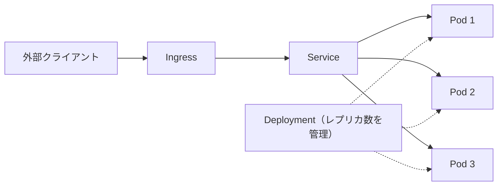

```yaml
apiVersion: v1
kind: Namespace
metadata:
  name: netauto
---
apiVersion: v1
kind: Secret
metadata:
  name: api-secret
  namespace: netauto
type: Opaque
stringData:
  API_TOKEN: "ここには実運用で値を直書きしない"
---
apiVersion: apps/v1
kind: Deployment
metadata:
  name: device-api
  namespace: netauto
spec:
  replicas: 3
  selector:
    matchLabels: { app: device-api }
  template:
    metadata:
      labels: { app: device-api }
    spec:
      containers:
        - name: api
          image: registry.example.com/device-api:1.0
          ports:
            - containerPort: 8000
          envFrom:
            - secretRef: { name: api-secret }
          readinessProbe:
            httpGet: { path: /health, port: 8000 }
            initialDelaySeconds: 3
            periodSeconds: 5
          livenessProbe:
            httpGet: { path: /health, port: 8000 }
            initialDelaySeconds: 10
            periodSeconds: 10
---
apiVersion: v1
kind: Service
metadata:
  name: device-api
  namespace: netauto
spec:
  selector: { app: device-api }
  ports:
    - port: 80
      targetPort: 8000
---
apiVersion: networking.k8s.io/v1
kind: Ingress
metadata:
  name: device-api
  namespace: netauto
spec:
  rules:
    - host: api.example.com
      http:
        paths:
          - path: /
            pathType: Prefix
            backend:
              service:
                name: device-api
                port: { number: 80 }
```

#### kubectl の基本（ブループリント 4.3.b〜d）

| 目的 | コマンド |
|---|---|
| 反映 | `kubectl apply -f manifest.yaml` |
| Pod の一覧 | `kubectl get pods -n netauto` |
| 詳細・イベント確認 | `kubectl describe pod <名前> -n netauto` |
| ログ | `kubectl logs <名前> -n netauto`（`-f` で追跡） |
| スケール | `kubectl scale deployment device-api --replicas=5 -n netauto` |
| 更新の進行確認 | `kubectl rollout status deployment/device-api -n netauto` |
| 巻き戻し | `kubectl rollout undo deployment/device-api -n netauto` |
| Pod 内でコマンド実行 | `kubectl exec -it <名前> -n netauto -- sh` |

#### ヘルスチェック（プローブ）の違い

| プローブ | 失敗したときの動き | 用途 |
|---|---|---|
| readinessProbe | Service の振り分け対象から外す | 起動直後や一時的な過負荷 |
| livenessProbe | コンテナを再起動する | フリーズなど回復不能な状態 |

**ベストプラクティス**

- Secret は base64 で **符号化されているだけ** で暗号化ではない。アクセス制御（RBAC）と保管時の暗号化、外部のシークレット管理との連携を検討する。
- マニフェストには **リソースの要求と上限**（`resources.requests` / `limits`）も設定する。
- `latest` タグは使わず、バージョンを固定する。
- 変更は `kubectl apply` ではなく、Git 管理と CI/CD 経由に寄せる。

### 6.4 【4.4】Docker ホストとブリッジ型ネットワークの作成・利用・トラブルシュート

| ネットワーク種別 | 特徴 |
|---|---|
| 既定の bridge | 同じホスト内のコンテナが通信できる。コンテナ名での名前解決は **できない** |
| ユーザー定義 bridge | **コンテナ名で名前解決できる**。分離しやすく推奨 |
| host | ホストのネットワークをそのまま使う（分離なし） |
| macvlan | コンテナに外部ネットワーク上の独自アドレスを持たせる |

```bash
docker network create --driver bridge --subnet 172.20.0.0/24 appnet
docker run -d --name api  --network appnet -p 8000:8000 device-api:1.0
docker run -d --name tool --network appnet alpine sleep 3600

docker exec tool ping -c 2 api              # 名前解決とコンテナ間通信を確認
docker network inspect appnet               # 接続コンテナと IP を確認
```

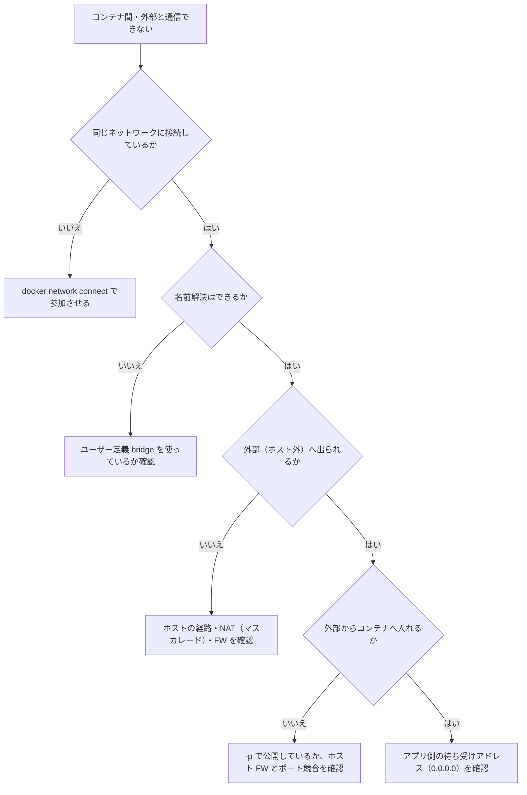

**ベストプラクティス**

- コンテナは **127.0.0.1 ではなく 0.0.0.0** で待ち受けないと、外から届かない（よくある失敗）。
- 公開するポートは最小限にし、DB など内部専用のサービスは **公開しない**。
- 外部ネットワーク連携の疎通確認は、「コンテナ内 → ホスト → 外部」の順に1段ずつ行う。

---

## 7. ドメイン5：セキュリティ（15%）

### 7.1 【5.1】OWASP のセキュアコーディングを全ソリューションに適用する

ブループリントの6項目を、初学者向けに具体化します。

| 項目 | ブループリント | やること | 悪い例 → 良い例 |
|---|---|---|---|
| 5.1.a | 入力検証 | 外部からの入力は **すべて信用しない**。型・長さ・範囲・形式を検証する | 文字列をそのままコマンドに連結 → 許可リスト方式で検証 |
| 5.1.b | 認証とパスワード管理 | 強固な認証、パスワードはハッシュ化して保管 | 平文保存 → ソルト付きの強いハッシュ |
| 5.1.c | アクセス制御 | 最小権限。**サーバ側で** 毎回権限を確認 | 画面でボタンを隠すだけ → API 側でも権限チェック |
| 5.1.d | 暗号の実践 | 実績のある標準ライブラリとアルゴリズムを使う | 独自暗号 → 標準の TLS・AES・ハッシュ |
| 5.1.e | エラー処理とログ | 利用者には簡潔に、内部には詳細を記録。**秘密情報はログに出さない** | スタックトレースを画面に表示 → 汎用メッセージ＋内部ログ |
| 5.1.f | 通信のセキュリティ | 常に TLS で暗号化 | HTTP のまま → HTTPS、証明書を検証 |

#### 典型的な脆弱性：コマンドインジェクションの回避

```python
import re
import subprocess

# 悪い例：入力をそのままシェルに渡す（インジェクションの危険）
# subprocess.run(f"ping -c 1 {host}", shell=True)

HOST_RE = re.compile(r"^[A-Za-z0-9.-]{1,253}$")   # 許可リスト方式の検証

def safe_ping(host: str) -> int:
    if not HOST_RE.fullmatch(host):
        raise ValueError("不正なホスト名です")
    # 引数はリストで渡し、shell=True を使わない
    return subprocess.run(["ping", "-c", "1", host], check=False).returncode
```

**ベストプラクティス**

- 入力検証は **許可リスト（良いものだけ通す）** が基本。拒否リストは抜け道が残る。
- SQL は **プレースホルダ（パラメータ化クエリ）** を使い、文字列連結で組み立てない。
- 例外のメッセージにパスワード・トークン・内部パスを含めない。

### 7.2 【5.2】OpenSSL で CSR を作成し、CA で署名された証明書を Web アプリに適用する

#### 全体の流れ

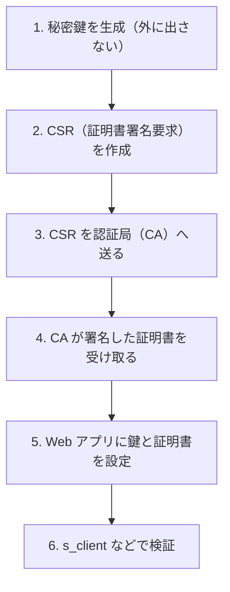

```bash
# 1. 秘密鍵（RSA 2048bit 以上）
openssl genrsa -out app.key 2048

# 2. CSR の作成（SAN にホスト名を必ず入れる）
openssl req -new -key app.key -out app.csr \
  -subj "/C=JP/O=Example Corp/CN=app.example.com" \
  -addext "subjectAltName=DNS:app.example.com"

# CSR の内容確認
openssl req -in app.csr -noout -text -verify

# 3〜4. CSR を CA へ送り、署名済み証明書（app.crt）と CA 証明書（ca.crt）を受け取る

# 4'. 受け取った証明書の検証
openssl verify -CAfile ca.crt app.crt

# 6. 稼働中のサーバの証明書を確認
openssl s_client -connect app.example.com:443 -servername app.example.com -CAfile ca.crt
```

```nginx
# 5. nginx の例
server {
    listen 443 ssl;
    server_name app.example.com;
    ssl_certificate     /etc/ssl/app.crt;     # 中間証明書があれば結合しておく
    ssl_certificate_key /etc/ssl/app.key;
    ssl_protocols       TLSv1.2 TLSv1.3;
}
```

| 用語 | 意味 |
|---|---|
| CSR | 「この公開鍵に署名してください」という申請書 |
| CA | 証明書に署名する第三者機関 |
| SAN | 証明書が有効なホスト名の一覧（最近のブラウザは CN ではなく SAN を見る） |
| 中間証明書 | CA の署名の連鎖（チェーン）をつなぐ証明書 |

**ベストプラクティス**

- **秘密鍵は CA へ送らない**。送るのは CSR だけ。鍵ファイルの権限は `chmod 600`。
- SAN を必ず設定する。CN だけだと検証に失敗するクライアントが多い。
- 古い TLS（1.0／1.1）を無効にし、**TLS 1.2 以上** にする。
- 証明書の **有効期限を監視** する（失効による障害は典型的な事故）。

### 7.3 【5.3】OAuth2 でアクセストークンを取得する

OAuth2 は「**パスワードそのものを渡さず、限定された権限のトークンを渡す**」ための仕組みです（RFC 6749）。

| フロー | 使う場面 | 特徴 |
|---|---|---|
| Client Credentials | サーバ同士・自動化スクリプト | ユーザー操作なし。クライアント ID とシークレットでトークン取得 |
| Authorization Code（＋PKCE） | ユーザーがログインするアプリ | ユーザーの同意が必要。PKCE で横取りを防ぐ（RFC 7636） |

```mermaid
sequenceDiagram
    participant C as 自動化スクリプト（クライアント）
    participant A as 認可サーバ
    participant R as API（リソースサーバ）
    C->>A: トークン要求（client_id・client_secret・scope）
    A-->>C: アクセストークン（有効期限付き）
    C->>R: API 呼び出し（Authorization: Bearer トークン）
    R-->>C: 結果
```

```python
import os
import time
import requests

TOKEN_URL = "https://auth.example.com/oauth2/token"

def get_token():
    r = requests.post(
        TOKEN_URL,
        data={
            "grant_type": "client_credentials",
            "client_id": os.environ["CLIENT_ID"],
            "client_secret": os.environ["CLIENT_SECRET"],
            "scope": "devices.read",
        },
        timeout=10,
    )
    r.raise_for_status()
    body = r.json()
    # 期限の少し前に更新できるよう、失効時刻を保持する
    return body["access_token"], time.time() + body["expires_in"] - 30

token, expires_at = get_token()
r = requests.get("https://api.example.com/v1/devices",
                 headers={"Authorization": f"Bearer {token}"}, timeout=10)
```

> 「OAuth2+」という表記は、OAuth2 に関連する拡張的な仕組みを含む意図と考えられます。具体的に何を使うかは試験環境のドキュメントに従ってください。

**ベストプラクティス**

- スコープは **必要最小限** に絞る。
- トークンは **有効期限前に更新** し、ログや URL に出さない。
- クライアントシークレットはコードに書かず、シークレット管理から取得する。

### 7.4 【5.4】シークレット管理システムでアプリを保護する

「シークレット管理システム」の代表例が HashiCorp Vault です（他にクラウド各社の同種サービスなど）。

| 方法 | 安全性 | 備考 |
|---|---|---|
| ソースコードに直書き | 非常に危険 | Git 履歴に永久に残る |
| `.env` ファイルをコミット | 危険 | 同上 |
| 環境変数 | 最低限 | プロセス情報から見えることがある |
| **シークレット管理システム** | 推奨 | アクセス制御・監査・ローテーションが可能 |

```python
import os
import hvac

client = hvac.Client(url=os.environ["VAULT_ADDR"], token=os.environ["VAULT_TOKEN"])
assert client.is_authenticated()

secret = client.secrets.kv.v2.read_secret_version(
    path="netauto/ios", mount_point="secret"
)
creds = secret["data"]["data"]          # {"username": "...", "password": "..."}
```

**ベストプラクティス**

- シークレットは **短寿命・用途別・自動ローテーション** を目指す。
- アプリには **最小権限のポリシー** だけを与える。
- 取得した値をログやエラーメッセージに出力しない。
- すでに漏えいした可能性があれば、**即座に失効させて再発行** する。

### 7.5 【5.5】トークン・ヘッダ・シークレットで REST API を保護する

```python
import hmac
import os
from fastapi import Depends, FastAPI, HTTPException, Request
from fastapi.security import HTTPAuthorizationCredentials, HTTPBearer

app = FastAPI()
bearer = HTTPBearer()
EXPECTED = os.environ["API_TOKEN"]

def require_token(cred: HTTPAuthorizationCredentials = Depends(bearer)):
    # 比較は定数時間で行い、タイミング攻撃を避ける
    if not hmac.compare_digest(cred.credentials, EXPECTED):
        raise HTTPException(status_code=401, detail="invalid token",
                            headers={"WWW-Authenticate": "Bearer"})

@app.middleware("http")
async def security_headers(request: Request, call_next):
    resp = await call_next(request)
    resp.headers["X-Content-Type-Options"] = "nosniff"
    resp.headers["Strict-Transport-Security"] = "max-age=31536000; includeSubDomains"
    resp.headers["Cache-Control"] = "no-store"
    return resp

@app.get("/devices", dependencies=[Depends(require_token)])
def list_devices():
    return []
```

| 防御 | 内容 |
|---|---|
| 認証 | `Authorization: Bearer ...` ヘッダでトークンを検証（無効なら 401） |
| 認可 | トークンの権限（スコープ）に応じて 403 を返す |
| セキュリティヘッダ | `Strict-Transport-Security`、`X-Content-Type-Options` など |
| 通信路 | TLS 必須（HTTP は拒否） |
| 悪用対策 | レート制限、入力検証、監査ログ |

**ベストプラクティス**

- トークンは **URL のクエリに載せない**（アクセスログやブラウザ履歴に残る）。
- **401（未認証）と403（権限なし）を区別** する。
- トークンには有効期限を持たせ、失効の仕組みを用意する。

---

## 8. 筆記試験 350-901 AUTOCOR の学び方

### 8.1 試験の位置づけ

AUTOCOR は、CCNP Automation と CCIE Automation の **共通のコア試験** で、「ネットワーク自動化システムの開発・設計に関する知識（Infrastructure as Code、運用、自動化における AI）」を問います。120分、400米ドル、英語と日本語で受験でき、合格すると Specialist 認定が付与されます。

### 8.2 出題ドメイン

公式の試験トピックによる4ドメインの配点です。**旧 DEVCOR にはなかった「自動化における AI」が20%で新設されました。**

| ドメイン | 配点 |
|---|---|
| 1.0 Network Automation | 30% |
| 2.0 Infrastructure as Code | 30% |
| 3.0 Operations | 20% |
| 4.0 AI in Automation | 20% |

公式の試験トピックページから確認できた個別項目の例です（全項目は公式の試験トピック PDF を参照してください）。

| 項目 | 内容 |
|---|---|
| 1.5 | IaC フレームワーク、ローコード／ノーコード、独自アプリケーションなどの選択肢から、要件に合う自動化アプローチを選ぶ |
| 2.1 | Git によるバージョン管理操作を使う |
| 2.6 | Source of Truth を自動化ソリューションに統合する |
| 3.4 | pyATS の CLI ツールで、自動化ソリューションの変更検証を実装する |
| 4.1 | AI 支援のコード開発の利点とリスク（データプライバシー、知的財産、コード検証など）を説明する |
| 4.2 | AI ベースの自動化ソリューションのセキュリティリスクを解釈する |
| 4.3 | Python の FastMCP で、AI エージェントにネットワーク情報を提供する MCP サーバを構築する |
| 4.4 | LLM を活用した対話型エージェントを構築する |
| 4.5 | ネットワーク自動化ソリューションにおける AI の推奨内容の正確さを評価する |

### 8.3 「AI in Automation」を初学者向けに整理

```mermaid
flowchart LR
    U["運用者（自然言語で質問）"] --> AG["対話型エージェント（LLM）"]
    AG -->|"ツール呼び出し"| MCP["MCP サーバ（FastMCP）"]
    MCP --> NET["ネットワーク機器・API"]
    NET --> MCP
    MCP --> AG
    AG --> U
    AG -.-> GUARD["ガードレール：権限制限・人間の承認・検証・ログ"]
```

| 用語 | 意味 |
|---|---|
| LLM | 大規模言語モデル。文章を理解・生成する AI |
| エージェント | LLM が **ツールを呼び出して** 目的を達成する仕組み |
| MCP（Model Context Protocol） | AI アプリケーションが外部のツールやデータに接続するための共通の取り決め |
| FastMCP | Python で MCP サーバを素早く作るためのライブラリ |

#### FastMCP の最小例（読み取り専用のツールを公開）

```python
from fastmcp import FastMCP

mcp = FastMCP("network-info")

INVENTORY = {
    "sw1": {"ip": "192.0.2.11", "role": "access"},
    "rt1": {"ip": "192.0.2.1",  "role": "core"},
}

@mcp.tool
def get_device(hostname: str) -> dict:
    """ホスト名から機器情報（IP と役割）を返す。読み取り専用。"""
    if hostname not in INVENTORY:
        return {"error": f"{hostname} は登録されていません"}
    return INVENTORY[hostname]

if __name__ == "__main__":
    mcp.run()
```

> ライブラリのバージョンによって書き方が変わる場合があります。最新の使い方は FastMCP の公式ドキュメントで確認してください。

#### AI を自動化に使うときのリスクと対策

| リスク | 例 | 対策 |
|---|---|---|
| データプライバシー | 機器の設定や顧客情報を外部の AI に送ってしまう | 送る情報の範囲を決め、機密情報をマスクする |
| 知的財産 | 生成コードのライセンス・著作権が不明確 | 組織のポリシーを確認し、出所を記録 |
| コードの誤り | もっともらしいが動かない・危険なコード | **必ずレビューとテスト** を通す |
| プロンプトインジェクション | 機器の description 等に悪意ある指示が埋め込まれる | 外部由来のデータは信頼せず、実行できる操作を制限 |
| 過剰な権限 | AI が本番の設定を勝手に変更 | **読み取り専用から始め**、変更系は人間の承認を必須に |
| 幻覚（誤った回答） | 存在しないコマンドや値を答える | 出力を実機・SoT と照合して精度を評価する |

**ベストプラクティス**

- AI の出力は **「下書き」として扱い、検証してから実行** する。
- 本番変更は、**人間の承認（ヒューマン・イン・ザ・ループ）** と、事前検証・巻き戻し手段をセットにする。
- 「AI が提案 → 検証ツール（pyATS など）で確認 → 人が承認 → 適用」という流れを標準にする。
- ラボ試験のブループリントには AI の項目はありません。**AI は筆記試験（AUTOCOR）対策として学ぶ** と整理すると効率的です。

### 8.4 筆記試験の学習の進め方

| 段階 | 内容 |
|---|---|
| 1 | 公式の試験トピック PDF をダウンロードし、各項目の理解度を自己採点する |
| 2 | 配点が大きい **Network Automation（30%）と IaC（30%）** から学ぶ |
| 3 | 項目ごとに、**必ず手を動かして** 1回は実行する |
| 4 | Operations と AI の用語・リスク・選択基準を整理する |
| 5 | 模擬問題で時間配分（120分）を確認する |

> 非公式の問題集（いわゆるダンプ）には、**誤りや古い情報、規約違反のリスク** があります。公式資料と実機演習を中心にしてください。

---

## 9. ラボ試験（8時間）の戦略

### 9.1 試験の性質

- 8時間の **ハンズオン** で、「計画・設計・開発・テスト・デプロイ・保守」というソフトウェアのライフサイクルを通して評価されます。
- 公式ブループリントは「ライフサイクル全体にわたって知識・スキル・能力を評価する」と述べています。
- 民間の解説では、設計モジュールと「デプロイ・運用・最適化」モジュールで構成されると紹介されていますが、**時間配分などの詳細は公式の最新情報（ラボ試験の案内・FAQ）で必ず確認** してください。

### 9.2 試験中の進め方

```mermaid
flowchart TD
    A["開始：全体の指示と環境を確認"] --> B["全タスクを一度読み、配点と所要時間の目安をつける"]
    B --> C["得意な・確実に取れるタスクから着手"]
    C --> D{"15〜20分で進展があるか"}
    D -->|"あり"| E["最後まで仕上げて動作確認"]
    D -->|"なし"| F["メモを残して次へ（後で戻る）"]
    E --> G["検証：要件をすべて満たしたか再確認"]
    F --> C
    G --> H["終盤30〜60分は見直しと未完了の回収に使う"]
```

| 戦略 | 理由 |
|---|---|
| 最初に全体を読む | 後半のタスクが前半の成果に依存することがある |
| 動いたら必ず **要件と照合** | 「動く」と「要件を満たす」は別 |
| 詰まったら先へ進む | 1つのタスクに時間を溶かすのが最大の失敗要因 |
| ドキュメントを素早く引く | 暗記ではなく、**探す力** が問われる（SDK や仕様書は参照できる前提） |
| こまめに保存・コミット | 環境トラブル時の損失を減らす |

### 9.3 日頃の練習で身につけたいこと

| 力 | 練習方法 |
|---|---|
| 初見の API を使う | 毎週1つ、知らない API をドキュメントだけで動かす |
| 素早く正確に書く | エディタのショートカット、スニペット、ターミナル操作に慣れる |
| 切り分け | わざと壊した環境（YAML のインデントミス等）を直す |
| 時間管理 | 8時間を想定した通し練習を、本番前に複数回行う |
| 検証の習慣 | 「実装→確認」を1セットにする |

---

## 10. 全体のベストプラクティス一覧

### 10.1 設計・開発

| 領域 | ベストプラクティス |
|---|---|
| 設計 | 責務を分け、設定は外出しし、可観測性を最初から組み込む |
| コード | 小さく作り、テストを書き、型と入力検証を徹底する |
| Git | 小さなコミット、ブランチ運用、共有履歴は `revert` で戻す |
| CI/CD | Lint → テスト → ビルド → 事前検証 → 承認 → 展開 → 事後検証 |

### 10.2 自動化ツール

| 領域 | ベストプラクティス |
|---|---|
| Ansible | 冪等なモジュールを使い、`--check --diff` で事前確認 |
| Terraform | リモートステート＋ロック、`plan` の確認を省略しない |
| NSO | モデル（YANG）で入力を検証し、`commit dry-run` で確認 |
| NETCONF/RESTCONF | 標準モデルを優先し、投入後に再取得して検証 |
| pyATS | 期待値を先に決め、変更の前後で実行 |

### 10.3 運用・セキュリティ

| 領域 | ベストプラクティス |
|---|---|
| テレメトリ | 必要最小限の頻度、暗号化、受信側と機器側の両方で確認 |
| コンテナ | 非 root、バージョン固定、イメージに秘密を入れない |
| Kubernetes | プローブ、リソース制限、RBAC、Git 経由の変更 |
| 認証・認可 | 最小権限、短寿命トークン、スコープの絞り込み |
| 秘密情報 | シークレット管理システム、ローテーション、ログに出さない |
| 通信 | TLS 1.2 以上、証明書の検証と期限監視 |

### 10.4 受験前チェックリスト

- [ ] 公式の最新ページで、**試験名・試験コード・費用・ブループリントの版** を確認した
- [ ] ラボ試験ブループリントの **全項目（細目の a・b・c まで）** について、自分で実行した経験がある
- [ ] 初見の API を、ドキュメントだけで30分以内に動かせる
- [ ] Ansible・Terraform・NSO の基本を、それぞれ **ゼロから** 構築できる
- [ ] Docker イメージ作成から Kubernetes への展開までを一通り通した
- [ ] OpenSSL で CSR 作成から Web アプリへの適用まで実施した
- [ ] 8時間の通し練習を複数回行い、時間配分の感覚をつかんだ
- [ ] AUTOCOR の4ドメイン（特に AI in Automation）の自己採点を終えた

---

## 11. 用語集

| 用語 | 意味 |
|---|---|
| NetDevOps | ネットワーク運用に、開発（DevOps）の手法を取り入れること |
| IaC | Infrastructure as Code。インフラをコードとして定義・管理する考え方 |
| SoT | Source of Truth。正とするデータの置き場所 |
| 冪等（べきとう） | 何度実行しても同じ結果になる性質 |
| YANG | 設定・状態データのモデルを定義する言語 |
| NETCONF | XML ベースのネットワーク機器管理プロトコル |
| RESTCONF | YANG モデルを HTTP で操作するプロトコル |
| gNMI | gRPC を使ったネットワーク機器の設定取得・テレメトリ用プロトコル |
| dial-in／dial-out | 収集側から機器へ接続する方式／機器から収集側へ接続する方式 |
| NED | NSO が機器と通信するためのドライバ |
| pyATS／Genie | ネットワークのテスト自動化フレームワーク／そのパーサとモデル |
| CI/CD | 継続的インテグレーション／継続的デリバリー |
| OWASP | Web アプリケーションのセキュリティ向上に取り組む非営利団体 |
| CSR | 証明書署名要求 |
| OAuth2 | アクセス権限を委譲するための認可の枠組み |
| MCP | AI アプリケーションが外部のツールやデータに接続するための取り決め |

---

## 12. 参考にした情報源（URL）

### 12.1 Cisco 公式（本書の根拠。今回、内容を直接確認したもの）

| 内容 | URL |
|---|---|
| ご指定の日本語ページ（旧名称の情報） | https://www.cisco.com/c/ja_jp/training-events/training-certifications/certifications/expert/devnet-expert.html |
| CCIE Automation（最新の公式ページ：試験構成・費用・時間・有効期間） | https://www.cisco.com/site/us/en/learn/training-certifications/certifications/automation/ccie-automation/index.html |
| CCIE Automation v1.1 ラボ試験トピック（公式 PDF：本書のドメイン2〜5の根拠） | https://learningcontent.cisco.com/documents/marketing/exam-topics/CCIE_Automation_V1.1_BP.pdf |
| 350-901 AUTOCOR 試験トピック（Cisco Learning Network） | https://learningnetwork.cisco.com/s/autocor-exam-topics |
| CCIE Automation ラボ試験トピック（Cisco Learning Network） | https://learningnetwork.cisco.com/s/ccie-automation-exam-topics |
| Cisco 認定試験（再受験の待機期間など） | https://www.cisco.com/site/us/en/learn/training-certifications/exams/index.html |
| 再認定ポリシー | https://www.cisco.com/site/us/en/learn/training-certifications/certifications/recertification/index.html |
| 旧 DEVCOR 試験ページ | https://cisco-apps.cisco.com/c/en/us/training-events/training-certifications/exams/current-list/devcor-350-901.html |

### 12.2 標準仕様・製品公式ドキュメント（学習用の入口。今回は内容の再確認をしていないため、リンク切れ・版の違いにご注意ください）

| 分野 | URL |
|---|---|
| NETCONF（RFC 6241） | https://www.rfc-editor.org/rfc/rfc6241 |
| RESTCONF（RFC 8040） | https://www.rfc-editor.org/rfc/rfc8040 |
| YANG 1.1（RFC 7950） | https://www.rfc-editor.org/rfc/rfc7950 |
| OAuth 2.0（RFC 6749） | https://www.rfc-editor.org/rfc/rfc6749 |
| PKCE（RFC 7636） | https://www.rfc-editor.org/rfc/rfc7636 |
| gNMI 仕様 | https://github.com/openconfig/reference/blob/master/rpc/gnmi/gnmi-specification.md |
| Cisco DevNet（Sandbox・各製品の開発者向け資料） | https://developer.cisco.com/ |
| Cisco DevNet Sandbox | https://devnetsandbox.cisco.com/ |
| Cisco NSO 開発者向けドキュメント | https://developer.cisco.com/docs/nso/ |
| pyATS ドキュメント | https://pubhub.devnetcloud.com/media/pyats/docs/ |
| Ansible ドキュメント | https://docs.ansible.com/ |
| Terraform ドキュメント | https://developer.hashicorp.com/terraform/docs |
| Docker ドキュメント | https://docs.docker.com/ |
| Kubernetes ドキュメント | https://kubernetes.io/docs/ |
| Git ドキュメント | https://git-scm.com/doc |
| GitLab CI/CD | https://docs.gitlab.com/ee/ci/ |
| FastAPI | https://fastapi.tiangolo.com/ |
| FastMCP | https://gofastmcp.com/ |
| OWASP Secure Coding Practices | https://owasp.org/www-project-secure-coding-practices-quick-reference-guide/ |
| OpenSSL ドキュメント | https://docs.openssl.org/ |
| HashiCorp Vault | https://developer.hashicorp.com/vault/docs |
| NetBox | https://netboxlabs.com/docs/netbox/ |

### 12.3 第三者の情報（補助的に参照。公式ではないため、必ず公式で再確認してください）

| 内容 | URL |
|---|---|
| 2026年2月3日付の名称移行に関する解説（民間） | https://certland.net/blog/autocor-350-901-15-day-study-plan-2026/ |
| 旧 DevNet Expert の入門解説（民間） | https://www.rogerperkin.co.uk/cisco-devnet/cisco-certified-devnet-expert/ |

> **ご注意**：
> - 12.1 の公式情報は、2026年10月3日時点で取得した内容に基づきます。名称・試験コード・費用・ブループリントの版は **変更される可能性** があるため、受験前に必ず最新の公式ページで確認してください。
> - 本書のコード例は、概念を理解するための **学習用の最小例** です。機器の種類やソフトウェアのバージョン、ライブラリの版で動作や書き方が異なるため、必ず検証用の環境で動作確認してから利用してください。
> - 日本語ページに記載の「5〜7年の推奨経験」は旧ページの情報です。最新の英語ページでは同じ記載を確認できていません。
