# AWS Certified Developer - Associate (DVA-C02)
# Domain 1: Development with AWS Services 完全ガイド(初学者向けステップバイステップ)

> 対象: DVA-C02 の **Content Domain 1: Development with AWS Services**(スコア対象問題の **32%**)
> 構成: 本ガイドは **Task 1(13 スキル)** を 1 つずつ解説します(Task 2: Lambda〔7 スキル〕と Task 3: データストア〔9 スキル〕は本ガイドの対象外)
> 各 Step の末尾に **ベストプラクティス**、**試験のひっかけポイント**、**出典 URL** を付けています。
> 情報の確認日: 2026-10-02(クォータや機能名は変わることがあります。受験前に必ず公式ドキュメントで再確認してください)。DVA-C02 の最終受験日は **2026-11-30**、後継の DVA-C03 の受験登録開始日は **2026-10-27** です

---

## 目次

- [0. 先に知っておきたい試験の全体像](#0-先に知っておきたい試験の全体像)
- [Task 1: Develop code for applications hosted on AWS](#task-1-develop-code-for-applications-hosted-on-aws)
  - [Step 1. アーキテクチャパターン(Skill 1.1.1)](#step-1-アーキテクチャパターンskill-111)
  - [Step 2. ステートフルとステートレス(Skill 1.1.2)](#step-2-ステートフルとステートレスskill-112)
  - [Step 3. 密結合と疎結合(Skill 1.1.3)](#step-3-密結合と疎結合skill-113)
  - [Step 4. 同期と非同期(Skill 1.1.4)](#step-4-同期と非同期skill-114)
  - [Step 5. 耐障害性・回復性のあるコード(Skill 1.1.5)](#step-5-耐障害性回復性のあるコードskill-115)
  - [Step 6. API の作成・拡張・保守(Skill 1.1.6)](#step-6-api-の作成拡張保守skill-116)
  - [Step 7. ユニットテストと AWS SAM(Skill 1.1.7)](#step-7-ユニットテストと-aws-samskill-117)
  - [Step 8. メッセージングサービス(Skill 1.1.8)](#step-8-メッセージングサービスskill-118)
  - [Step 9. API と SDK で AWS サービスを操作する(Skill 1.1.9)](#step-9-api-と-sdk-で-aws-サービスを操作するskill-119)
  - [Step 10. ストリーミングデータ(Skill 1.1.10)](#step-10-ストリーミングデータskill-1110)
  - [Step 11. Amazon Q Developer による開発支援(Skill 1.1.11)](#step-11-amazon-q-developer-による開発支援skill-1111)
  - [Step 12. Amazon EventBridge によるイベント駆動(Skill 1.1.12)](#step-12-amazon-eventbridge-によるイベント駆動skill-1112)
  - [Step 13. サードパーティ連携の回復性(Skill 1.1.13)](#step-13-サードパーティ連携の回復性skill-1113)

---

## 0. 先に知っておきたい試験の全体像

### 0-1. DVA-C02 の基本情報

| 項目 | 内容 |
|---|---|
| 試験の目的 | AWS 上のアプリケーションを **開発・テスト・デプロイ・デバッグ** できる力の検証 |
| 想定受験者 | AWS サービスを使ったアプリ開発・保守の経験 1 年以上 |
| 出題形式 | 択一(正解 1 / 不正解 3)、複数選択(5 択以上から 2 つ以上) |
| スコア対象問題 | 50 問(ほかに採点対象外の 15 問が混在し、見分けはつかない) |
| 試験時間 | 130 分 |
| 合格ライン | 720 / 1,000(スケールスコア。補償型採点なので分野ごとの合格点はない) |
| 未回答 | 不正解扱い。ただし減点はないので **必ず何か選ぶ** |

### 0-2. 4 つのドメインの配点

| ドメイン | 配点 |
|---|---|
| **1. Development with AWS Services(本ガイド)** | **32%** |
| 2. Security | 26% |
| 3. Deployment | 24% |
| 4. Troubleshooting and Optimization | 18% |

Domain 1 は最も配点が高く、Lambda・DynamoDB・SQS/SNS・API Gateway といった **開発者の主役サービス** がほぼすべて登場します。

### 0-3. 試験の範囲外(出題されない)とされるもの

公式ガイドでは、次の作業は「想定受験者がやらなくてよい」とされています。

- アーキテクチャの設計(分散システム、マイクロサービス、DB スキーマ設計など)
- CI/CD パイプラインの設計・構築
- IAM ユーザー・グループの管理
- サーバーや OS の管理
- VPC / Direct Connect などのネットワーク設計

つまり **「設計する」より「使って実装する」** 力が問われます。「どのサービスを選ぶか」「どの API・設定を使うか」を判断できれば OK です。

### 0-4. 新しい出題トピック(Emerging topics)

公式ガイドには「AI 支援開発ツールでのコード生成・レビュー」「AI サービス連携時のセキュリティリスク低減」などが **採点対象外の試験的問題** として出る可能性が書かれています。Skill 1.1.11(Amazon Q Developer)と合わせて Step 11 で触れます。

### 0-5. Domain 1 の学習ロードマップ

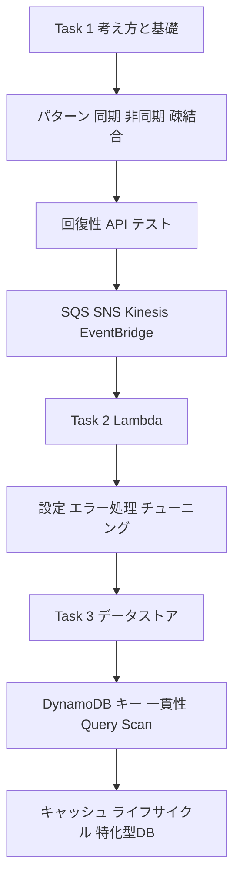

### 0-6. この資料の読み方

| マーク | 意味 |
|---|---|
| **ベストプラクティス** | 実務でも試験でも「正しい選択肢」になりやすい設計・実装の方針 |
| **ひっかけポイント** | 似た用語や数値で迷わせる定番の誤答パターン |
| **出典** | その解説の根拠になった AWS 公式ドキュメントの URL |

> 数値(上限・既定値)は試験で問われやすいので、表にまとめてあります。ただしクォータは更新されるため、受験直前に公式の Quotas ページも確認してください。

**出典**
- 試験ガイド(トップ): https://docs.aws.amazon.com/aws-certification/latest/developer-associate-02/developer-associate-02.html
- 試験ガイド(Domain 1): https://docs.aws.amazon.com/aws-certification/latest/developer-associate-02/developer-associate-02-domain1.html
- 認定の公式ページ: https://aws.amazon.com/certification/certified-developer-associate/

---

# Task 1: Develop code for applications hosted on AWS

Task 1 は「**AWS 上で動くアプリのコードを書くときの共通の考え方と道具**」です。まず設計の言葉(Step 1〜4)を押さえ、次に実装の作法(Step 5〜10)、最後に新しめの 3 項目(Step 11〜13)を学びます。

---

## Step 1. アーキテクチャパターン(Skill 1.1.1)

> 試験ガイドの表記: event-driven, microservices, monolithic, choreography, orchestration, fanout を **説明できる**

### 1-1. やさしい説明

アプリの「部品の分け方」と「部品同士のつなぎ方」には代表的な型があります。

| パターン | ひとことで | AWS での代表例 |
|---|---|---|
| モノリス(monolithic) | 全機能を 1 つのアプリとしてまとめて作り・デプロイする | 1 台の EC2 や 1 つの Elastic Beanstalk 環境で動く大きなアプリ |
| マイクロサービス(microservices) | 機能ごとに小さく独立したサービスに分け、API やイベントでつなぐ | Lambda + API Gateway、ECS/EKS のサービス群 |
| イベント駆動(event-driven) | 「何かが起きた」という **イベント** を合図に処理が動く | S3 イベント → Lambda、EventBridge ルール |
| コレオグラフィ(choreography) | 各サービスがイベントに **自律的に反応** して連携する(中央の指揮者なし) | EventBridge / SNS を介したサービス連携 |
| オーケストレーション(orchestration) | **中央の指揮者** がワークフロー全体の順序・分岐・エラー処理を制御する | AWS Step Functions |
| ファンアウト(fanout) | 1 つのメッセージを **複数の宛先に同時配信** する | SNS トピック → 複数の SQS キュー |

### 1-2. 図で理解する

コレオグラフィとオーケストレーションの違いです。

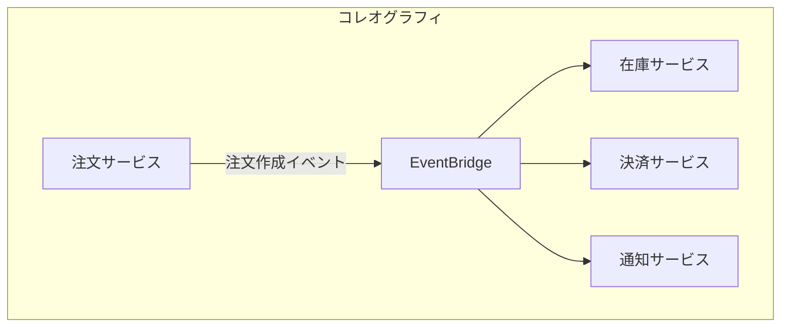

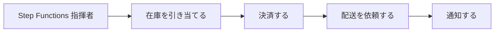

ファンアウトの典型形です。

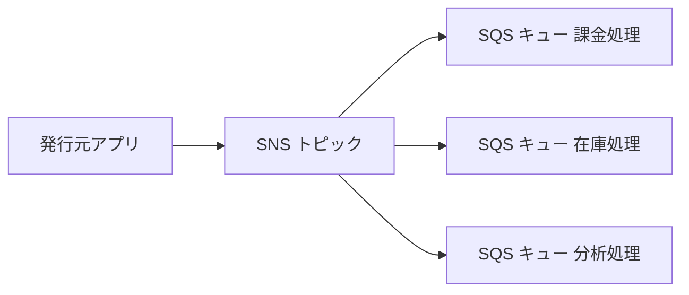

### 1-3. 使い分けの目安

| 観点 | コレオグラフィ | オーケストレーション |
|---|---|---|
| 制御の場所 | 分散(各サービスが判断) | 集中(ワークフロー定義) |
| 全体像の見やすさ | 流れが見えにくい | 実行履歴・可視化が容易 |
| 疎結合度 | 高い | サービスが指揮者に依存 |
| エラー処理・補償 | 各サービスで実装 | Retry / Catch で一元定義 |
| 向く場面 | 通知、監査ログ、追加購読者が増えやすい処理 | 順序が重要、分岐や人手承認、長時間処理 |

### 1-4. ベストプラクティス

- **まずはシンプルに**: 小さな機能にいきなりマイクロサービスを選ばない。要件(チームの規模、変更頻度、スケール単位)で選ぶ。
- **イベント駆動 + 疎結合**: サービス間は直接呼び出しよりもキュー/トピック/イベントバスを挟む(Step 3 参照)。
- **順序・補償が重要なワークフローは Step Functions** に任せ、Lambda の中で Lambda を呼び続けるコードを書かない。
- **Lambda の中で待たない**: 長時間の待機や分岐は Step Functions の Wait / Choice で表現する。

### 1-5. ひっかけポイント

- 「**1 つのイベントを複数のサブスクライバーへ**」→ SNS(ファンアウト)。SQS 単体では 1 メッセージは 1 コンシューマーが処理するため、ファンアウトにならない。
- 「**ワークフローの順序・リトライ・分岐を一元管理**」→ Step Functions(オーケストレーション)。
- 「**イベントの内容でルーティング**」→ EventBridge のルール(イベントパターン)。

**出典**
- Microservices on AWS: https://docs.aws.amazon.com/whitepapers/latest/microservices-on-aws/microservices-on-aws.html
- Event-driven architecture on AWS: https://aws.amazon.com/event-driven-architecture/
- AWS Step Functions とは: https://docs.aws.amazon.com/step-functions/latest/dg/welcome.html
- Amazon EventBridge とは: https://docs.aws.amazon.com/eventbridge/latest/userguide/eb-what-is.html
- SNS の一般的なシナリオ(ファンアウト含む): https://docs.aws.amazon.com/sns/latest/dg/sns-common-scenarios.html

---

## Step 2. ステートフルとステートレス(Skill 1.1.2)

### 2-1. やさしい説明

- **ステートフル**: アプリが「前のやり取りの状態(セッション、カート、進行状況)」を **自分の中(メモリやローカルディスク)** に持つ。
- **ステートレス**: アプリは状態を持たず、リクエストごとに必要な情報を **外部のデータストアやリクエスト自体** から得る。

ステートレスだと、どのサーバー(Lambda 実行環境・コンテナ・EC2)にリクエストが届いても同じように動くため、**水平スケールや入れ替えが簡単** になります。

### 2-2. 図で理解する

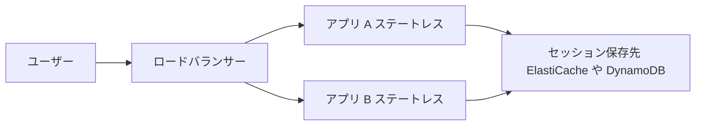

### 2-3. 状態の置き場所(AWS での選択肢)

| 保存したい状態 | おすすめの保存先 | 理由 |
|---|---|---|
| Web セッション | ElastiCache(Redis OSS / Valkey)、DynamoDB | 低レイテンシ、サーバー間で共有できる |
| ユーザーの認証状態 | Amazon Cognito のトークン(JWT)をクライアントが保持 | サーバー側に状態を持たない |
| 長いワークフローの進行状況 | Step Functions | 実行状態を AWS が管理 |
| ファイルや生成物 | S3 | 実行環境が消えても残る |
| Lambda の一時ファイル | `/tmp`(あくまで一時) | 実行環境が再利用される保証はない |

### 2-4. ベストプラクティス

- **Lambda は原則ステートレス**として書く。グローバル変数に書いた値が次回呼び出しで残る場合があっても、「残る前提」で設計しない(キャッシュ用途に限る)。
- ALB の **スティッキーセッション** は手軽だが、サーバー障害やスケールインで状態を失う。可能なら外部ストアにセッションを逃がす。
- 状態をトークンに入れる場合は **署名・有効期限** を設定し、機密情報は入れない。

### 2-5. ひっかけポイント

- 「Auto Scaling で EC2 が増減しても **セッションが途切れない**ように」→ セッションを ElastiCache / DynamoDB に外出し(ステートレス化)。スティッキーセッションは「完全な答え」ではない。
- Lambda の `/tmp` や実行環境内の変数は **永続データの置き場ではない**。

**出典**
- Session management(ElastiCache): https://aws.amazon.com/caching/session-management/
- ALB のスティッキーセッション: https://docs.aws.amazon.com/elasticloadbalancing/latest/application/sticky-sessions.html
- Lambda 実行環境のライフサイクル: https://docs.aws.amazon.com/lambda/latest/dg/lambda-runtime-environment.html
- Serverless Applications Lens: https://docs.aws.amazon.com/wellarchitected/latest/serverless-applications-lens/welcome.html

---

## Step 3. 密結合と疎結合(Skill 1.1.3)

### 3-1. やさしい説明

- **密結合**: 部品 A が部品 B を **直接呼び**、B の場所・速度・状態に強く依存する。B が落ちると A も止まる。
- **疎結合**: 部品の間に **キュー / トピック / イベントバス / API** などの仲介を置き、お互いの内部を知らなくても動く。

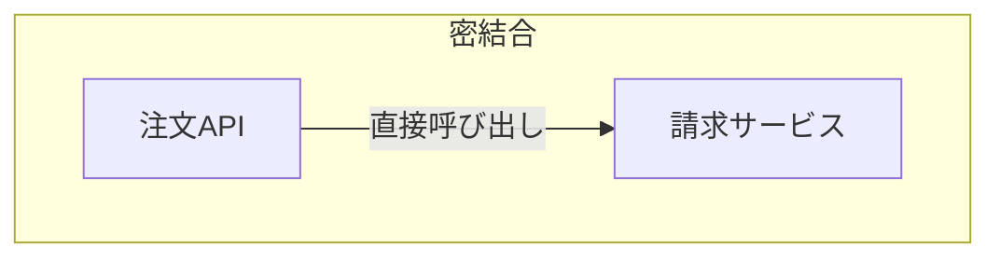

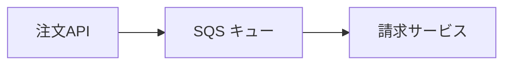

### 3-2. 疎結合にする AWS サービス

| 仲介サービス | 特徴 | 使いどころ |
|---|---|---|
| Amazon SQS | キューに溜めて **1 コンシューマーが処理**(バッファ) | 負荷の平準化、非同期ジョブ |
| Amazon SNS | **Pub/Sub** で複数宛先へ配信 | 通知、ファンアウト |
| Amazon EventBridge | **イベントパターンで振り分け**、SaaS・AWS イベントも扱える | イベント駆動の連携 |
| Amazon Kinesis Data Streams | 順序を保つストリームを **複数コンシューマーが再読可能** | ログ、クリックストリーム |
| API Gateway | 公開 API の窓口。バックエンドを隠蔽 | クライアントとバックエンドの分離 |
| Step Functions | 工程をステートマシンで接続 | 工程管理 |

### 3-3. ベストプラクティス

- **バッファ(SQS)を挟む**と、受け側が一時的に遅くても/落ちていても送り手は影響を受けにくい。
- 受け手の処理は **冪等(同じメッセージが 2 回来ても結果が同じ)** にする。キューやイベントは「少なくとも 1 回」届く設計が基本(標準キュー、EventBridge など)。
- メッセージ/イベントの **スキーマにバージョン** を持たせ、後方互換を保つ。
- 仲介サービスの **デッドレターキュー(DLQ)** を設定し、処理できないものを取りこぼさず隔離する。

### 3-4. ひっかけポイント

- 「受け側のスパイクで送り側が失敗する」→ **SQS を挟んで平準化**。
- 「どちらか一方の変更が他方に影響しないように」→ 疎結合(キュー/イベント)。

**出典**
- Amazon SQS とは: https://docs.aws.amazon.com/AWSSimpleQueueService/latest/SQSDeveloperGuide/welcome.html
- Amazon SNS とは: https://docs.aws.amazon.com/sns/latest/dg/welcome.html
- Serverless Applications Lens(疎結合の設計原則): https://docs.aws.amazon.com/wellarchitected/latest/serverless-applications-lens/welcome.html
- Well-Architected Reliability Pillar: https://docs.aws.amazon.com/wellarchitected/latest/reliability-pillar/welcome.html

---

## Step 4. 同期と非同期(Skill 1.1.4)

### 4-1. やさしい説明

- **同期**: リクエストを送り、**結果が返るまで待つ**。結果がすぐ必要な場面向き。
- **非同期**: リクエストを送ったら **待たずに次へ進む**。処理は裏で行われ、結果は後で通知やポーリングで受け取る。

### 4-2. Lambda の呼び出しタイプ(超重要)

| 呼び出しタイプ | 呼び出し元の例 | 動き | エラー時の再試行 |
|---|---|---|---|
| 同期(`RequestResponse`) | API Gateway、ALB、SDK の `Invoke`、Function URL | 結果が返るまで待つ | **呼び出し元(クライアント)が再試行を管理** |
| 非同期(`Event`) | S3、SNS、EventBridge、`InvocationType=Event` | Lambda 内部のキューに入れて即 202 を返す | **関数エラー**は Lambda が **自動で最大 2 回再試行**(設定で 0〜2 回)。**スロットリング(429)・システムエラー(5xx)** はイベント最大保持時間(既定 6 時間、60 秒〜6 時間で設定)まで再試行 |
| イベントソースマッピング(ポーリング) | SQS、Kinesis、DynamoDB Streams | Lambda サービスがソースを **ポーリング** してバッチで同期的に呼ぶ | ソースの種類ごとに異なる |

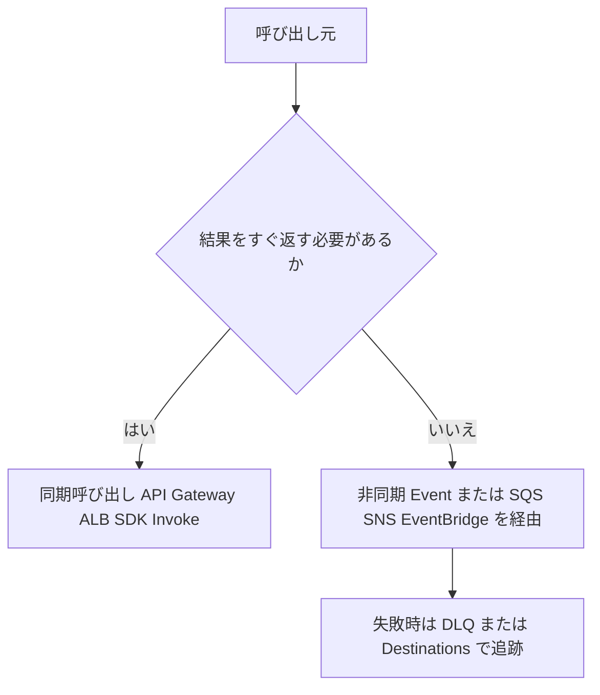

### 4-3. 同期 API の「長い処理」への対処

HTTP 越しの処理が長いときは、**受付だけ同期、本処理は非同期** にするのが定番です。

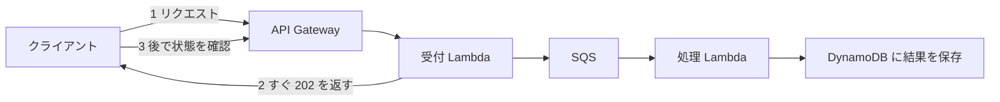

### 4-4. ベストプラクティス

- **同期のタイムアウトに注意**: API Gateway の統合タイムアウトは既定 29 秒(REST API)。Lambda の最大 15 分とは別物。
- 非同期処理では **完了通知**(SNS / WebSocket / ポーリング用ステータス API)を用意する。
- 非同期は失敗が見えにくい。**DLQ・Destinations・CloudWatch アラーム** を必ずセットで入れる。

### 4-5. ひっかけポイント

- 「Lambda を非同期呼び出し → 失敗したら自動で何回再試行?」→ **関数エラーなら最大 2 回**(合計 3 回の実行機会)。スロットリング(429)やシステムエラー(5xx)はこの上限の対象外で、イベント最大保持時間(既定 6 時間)まで再試行される。
- 「同期呼び出しでエラー → Lambda は自動再試行する?」→ **しない**。呼び出し元の責任。
- SQS をトリガーにする Lambda は「非同期呼び出し」ではなく **イベントソースマッピング(ポーリング)**。

**出典**
- Lambda の呼び出し方法: https://docs.aws.amazon.com/lambda/latest/dg/lambda-invocation.html
- Lambda の非同期呼び出し: https://docs.aws.amazon.com/lambda/latest/dg/invocation-async.html
- Lambda のクォータ: https://docs.aws.amazon.com/lambda/latest/dg/gettingstarted-limits.html
- API Gateway の割り当て(統合タイムアウト): https://docs.aws.amazon.com/apigateway/latest/developerguide/limits.html

---

## Step 5. 耐障害性・回復性のあるコード(Skill 1.1.5)

> 試験ガイド: Java / C# / Python / JavaScript / TypeScript / Go などで **fault-tolerant で resilient なアプリ** を作る

### 5-1. 基本の 5 つの武器

| 武器 | 内容 | 注意 |
|---|---|---|
| タイムアウト | 外部呼び出しに **必ず上限時間** を設ける | 呼び出し元より短くする |
| リトライ | 一時的な失敗は **再試行** する | **指数バックオフ + ジッター** を使う |
| 冪等性 | 同じ処理を何回実行しても結果が同じ | リトライ・重複配信の前提 |
| 隔離 | 失敗したものを DLQ へ逃がし、全体を止めない | 監視とセットで |
| グレースフルな縮退 | 一部が落ちても、機能を絞って動き続ける | キャッシュやデフォルト値で返す |

### 5-2. 指数バックオフとジッター

失敗してすぐに再送すると、相手がさらに混雑して悪化します(再試行の嵐)。

```text
待ち時間 = random(0, min(上限, 基本時間 × 2 の試行回数乗))
```

- **指数バックオフ**: 待ち時間を 1 回ごとに倍にしていく。
- **ジッター**: 待ち時間に **ランダムなばらつき** を加えて、多数のクライアントが同時に再試行しないようにする。

> AWS SDK / CLI には **リトライが標準で組み込まれています**。再試行モードは `legacy` / `standard` / `adaptive` があり、`standard` が推奨の基本、`adaptive` はクライアント側のレート制御も行います。自前で再実装する前に、まず SDK の設定(`max_attempts` など)で足りないかを確認しましょう。

Python(boto3)での設定例:

```python
import boto3
from botocore.config import Config

config = Config(
    retries={"total_max_attempts": 5, "mode": "standard"},  # 総試行回数(初回リクエストを含む)
    connect_timeout=3,
    read_timeout=10,
)
dynamodb = boto3.client("dynamodb", config=config)
```

### 5-3. 冪等性の実装パターン

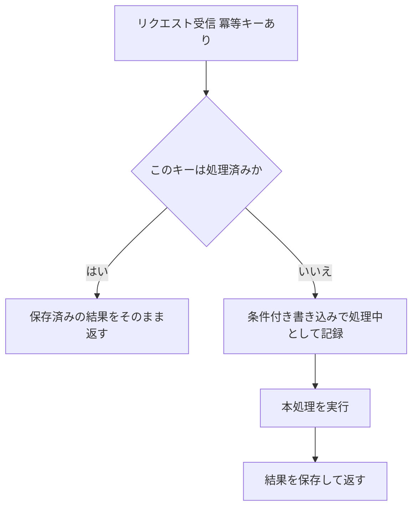

DynamoDB の **条件付き書き込み**(`attribute_not_exists(pk)`)で「初回だけ成功」を保証できます。Lambda では **Powertools for AWS Lambda の Idempotency ユーティリティ** が標準的な実装手段です。

### 5-4. 例外の扱い方

| エラーの種類 | 例 | 方針 |
|---|---|---|
| 一時的(再試行可) | 5xx、`ThrottlingException`、タイムアウト | バックオフ付きで再試行 |
| 恒久的(再試行しても無駄) | 400 系の入力エラー、`AccessDenied`、`ValidationException` | 再試行せず、ログに記録し DLQ やエラー応答へ |
| 部分失敗 | バッチ処理で一部だけ失敗 | **成功分は進め、失敗分だけ再処理**(部分バッチ応答) |

### 5-5. ベストプラクティス

- **SDK クライアントはハンドラーの外で作って再利用**(接続の使い回し)。
- ログには **リクエスト ID・相関 ID** を含め、構造化ログ(JSON)で出す。
- 失敗を握りつぶさない。**例外を投げて Lambda / キューの再試行機構に任せる** か、明示的に DLQ へ送る。

### 5-6. ひっかけポイント

- 「大量の再試行で相手が過負荷」→ **指数バックオフ + ジッター**。固定間隔の再試行は誤答になりやすい。
- 「重複配信されても二重課金しない」→ **冪等性**(冪等キー + 条件付き書き込み)。
- `ThrottlingException` / `ProvisionedThroughputExceededException` → 再試行 + バックオフ(SDK が自動実施)、必要ならキャパシティ見直し。

**出典**
- Timeouts, retries, and backoff with jitter(Amazon Builders' Library): https://aws.amazon.com/builders-library/timeouts-retries-and-backoff-with-jitter/
- Making retries safe with idempotent APIs: https://aws.amazon.com/builders-library/making-retries-safe-with-idempotent-APIs/
- AWS SDK と CLI のリトライ動作: https://docs.aws.amazon.com/sdkref/latest/guide/feature-retry-behavior.html
- Powertools for AWS Lambda(Python)Idempotency: https://docs.powertools.aws.dev/lambda/python/latest/utilities/idempotency/
- Reliability Pillar: https://docs.aws.amazon.com/wellarchitected/latest/reliability-pillar/welcome.html

---

## Step 6. API の作成・拡張・保守(Skill 1.1.6)

> 試験ガイド: リクエスト/レスポンスの変換、バリデーションルールの適用、ステータスコードの上書きなど

### 6-1. 主役は Amazon API Gateway

| API の種類 | 特徴 | 向く場面 |
|---|---|---|
| **REST API** | 機能が最も豊富(リクエスト検証、マッピングテンプレート、使用量プラン、API キー、キャッシュ、WAF 連携 など) | 高機能な API 管理が必要 |
| **HTTP API** | より **低コスト・低レイテンシ**。機能は絞られる(JWT オーソライザーなど) | シンプルなプロキシ API |
| **WebSocket API** | 双方向のリアルタイム通信 | チャット、通知 |

### 6-2. 統合タイプ

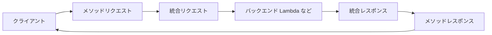

| 統合 | 動き | 変換できる? |
|---|---|---|
| **Lambda プロキシ統合** | リクエスト全体をそのまま Lambda へ。Lambda が **決まった形式のレスポンス**(`statusCode`, `headers`, `body`)を返す | API Gateway では変換しない(コード側で制御) |
| **Lambda 非プロキシ(カスタム)統合** | 統合リクエスト/レスポンスで **マッピングテンプレート(VTL)** による変換が可能 | **できる** |
| HTTP プロキシ / HTTP 統合 | 既存の HTTP バックエンドへ転送 | 非プロキシなら変換可 |
| AWS サービス統合 | DynamoDB や SQS などを **Lambda なしで直接呼ぶ** | マッピングテンプレートで変換 |
| モック統合 | バックエンドなしで固定応答 | テストや CORS プリフライト用 |

### 6-3. 試験頻出: 3 つの「加工」ポイント

**(1) リクエスト/レスポンスの変換**
REST API の非プロキシ統合では、**マッピングテンプレート(Velocity Template Language)** でリクエストの形をバックエンド向けに変換し、レスポンスも整形できます。

**(2) バリデーションルールの強制**
REST API の **リクエストバリデーター** で、必須のクエリ文字列・ヘッダー、**モデル(JSON Schema)** によるボディ検証を API Gateway 側で行えます。不正なリクエストは **バックエンド(Lambda)を呼ぶ前に 400 で弾く** ため、コスト・負荷の節約になります。

**(3) ステータスコードの上書き**
非プロキシ統合では、**統合レスポンス** の選択パターン(正規表現)でバックエンドの応答を見て、**メソッドレスポンスのステータスコードを選び直す(上書き)** ことができます。Lambda プロキシ統合では Lambda が返す `statusCode` がそのまま使われます。

Lambda プロキシ統合のレスポンス例:

```python
import json

def handler(event, context):
    return {
        "statusCode": 201,
        "headers": {"Content-Type": "application/json"},
        "body": json.dumps({"message": "created"}),
    }
```

### 6-4. 運用・保守の機能

| 機能 | 内容 |
|---|---|
| ステージ | `dev` / `prod` などの環境。**ステージ変数**で環境差を吸収(Lambda エイリアス指定など) |
| デプロイ | 変更は **新しいデプロイを作成してステージに反映** しないと有効にならない(REST API) |
| カナリアリリース | ステージで一部のトラフィックだけ新バージョンへ |
| 使用量プランと API キー | クライアントごとのスロットリング・クォータ |
| スロットリング | アカウント・ステージ・メソッド単位でレート制限。超過は **429 Too Many Requests** |
| キャッシュ | REST API のステージ単位でレスポンスをキャッシュ(TTL 既定 300 秒) |
| CORS | ブラウザから別オリジンの API を呼ぶ際に必要。プロキシ統合では Lambda 側でヘッダーを返す必要がある |
| オーソライザー | Cognito ユーザープール / Lambda オーソライザー / IAM 認可 など(Domain 2 でも出題) |

### 6-5. ベストプラクティス

- 入力検証は **API Gateway のモデル + バリデーター** で入口に寄せ、Lambda 内では業務ロジックの検証に集中する。
- API のバージョニングは **ステージ・パス(`/v1/`)・カスタムドメインのベースパスマッピング** などで行い、破壊的変更を避ける。
- エラー応答の形式(`code`, `message`)を **全 API で統一**。Lambda プロキシでは例外時も必ず適切な `statusCode` を返す。
- 429 を受けるクライアントは **バックオフして再試行**(Step 5)。

### 6-6. ひっかけポイント

- 「Lambda を起動せず、不正なリクエストを拒否」→ **リクエストバリデーター**(REST API)。
- 「バックエンドの応答形式を API Gateway 側で変換」→ **非プロキシ統合 + マッピングテンプレート**。プロキシ統合では変換できない。
- 「API の変更が反映されない」→ **ステージへの再デプロイ** を忘れていないか(REST API)。
- 「ブラウザで CORS エラー」→ レスポンスの `Access-Control-Allow-Origin` など。プロキシ統合では Lambda が返す。

**出典**
- API Gateway とは: https://docs.aws.amazon.com/apigateway/latest/developerguide/welcome.html
- REST API と HTTP API の選択: https://docs.aws.amazon.com/apigateway/latest/developerguide/http-api-vs-rest.html
- リクエスト検証: https://docs.aws.amazon.com/apigateway/latest/developerguide/api-gateway-method-request-validation.html
- マッピングテンプレートとモデル: https://docs.aws.amazon.com/apigateway/latest/developerguide/models-mappings.html
- Lambda プロキシ統合: https://docs.aws.amazon.com/apigateway/latest/developerguide/set-up-lambda-proxy-integrations.html
- スロットリング: https://docs.aws.amazon.com/apigateway/latest/developerguide/api-gateway-request-throttling.html
- キャッシュ: https://docs.aws.amazon.com/apigateway/latest/developerguide/api-gateway-caching.html
- CORS: https://docs.aws.amazon.com/apigateway/latest/developerguide/how-to-cors.html

---

## Step 7. ユニットテストと AWS SAM(Skill 1.1.7)

> 試験ガイド: 開発環境でユニットテストを書いて実行する(例: **AWS SAM** の利用)

### 7-1. テストの考え方

| テストの種類 | 対象 | AWS 開発での方法 |
|---|---|---|
| ユニットテスト | 関数・クラス単体 | 通常のテストフレームワーク(pytest, Jest, JUnit など)+ **AWS サービスはモック** |
| 統合テスト | 複数コンポーネント/実際の AWS サービス連携 | 開発用アカウントにデプロイして実際に呼ぶ |
| ローカルテスト | Lambda や API をローカル実行 | **AWS SAM CLI**(`sam local`) |

### 7-2. ユニットテストのコツ: ビジネスロジックと AWS 呼び出しを分ける

```python
# handler.py
def calc_total(items):          # 純粋なロジック: AWS に依存しない
    return sum(i["price"] * i["qty"] for i in items)

def handler(event, context):
    total = calc_total(event["items"])
    save_order(event["order_id"], total)   # AWS 呼び出しは別関数に切り出す
    return {"statusCode": 200}
```

テストでは `save_order` を差し替え(モック)、`calc_total` は AWS なしで素早く検証します。AWS SDK のモックには、Python なら **moto** や `unittest.mock`、JavaScript なら **aws-sdk-client-mock** などが広く使われます。

### 7-3. AWS SAM とは

**AWS Serverless Application Model(SAM)** は、サーバーレスアプリを **簡潔なテンプレート(CloudFormation の拡張)** で定義し、ローカルでテスト・ビルド・デプロイできる仕組みです。

SAM テンプレート(`template.yaml`)の最小例:

```yaml
AWSTemplateFormatVersion: '2010-09-09'
Transform: AWS::Serverless-2016-10-31
Resources:
  HelloFunction:
    Type: AWS::Serverless::Function
    Properties:
      CodeUri: src/            # app.py（handler 関数）を置くディレクトリ
      Handler: app.handler
      Runtime: python3.13
      Events:
        Api:
          Type: Api
          Properties:
            Path: /hello
            Method: get
```

`Transform: AWS::Serverless-2016-10-31` の 1 行が SAM の目印です(試験で見分けを問われやすい)。

### 7-4. SAM CLI の主要コマンド

| コマンド | 役割 |
|---|---|
| `sam init` | プロジェクトの雛形を作る |
| `sam validate` | テンプレートの検証 |
| `sam build` | 依存関係を解決しビルド成果物を作る |
| `sam local invoke` | **関数を 1 回ローカル実行**(Docker コンテナ上で Lambda 環境を再現) |
| `sam local start-api` | ローカルに API Gateway 相当のエンドポイントを立てる |
| `sam local start-lambda` | ローカルに Lambda 呼び出しエンドポイントを立てる(SDK から接続してテスト) |
| `sam local generate-event` | S3、SQS、API Gateway など **サンプルイベント JSON を生成** |
| `sam deploy`(`--guided`) | CloudFormation 経由でデプロイ |
| `sam sync` | 開発中のクラウド側への **高速な同期**(アクセラレート) |
| `sam logs` | CloudWatch Logs を取得 |

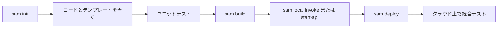

> `sam local` を使うには **Docker** が必要です。

### 7-5. ベストプラクティス

- **テストピラミッド**: 速いユニットテストを多く、実環境の統合テストを少なく。
- **テスト用イベントは `sam local generate-event` で作る** か、本番ログから個人情報を除いて保存して再利用する。
- 統合テストは **本番とは別のアカウント/スタック** で実行し、終了後にスタックを削除する。
- ユニットテストで **ネットワークや実 AWS を呼ばない**(遅い・不安定・課金されるため)。

### 7-6. ひっかけポイント

- 「Lambda をローカルで 1 回実行」→ `sam local invoke`。
- 「API をローカルで起動してブラウザ/curl で試す」→ `sam local start-api`。
- 「テスト用の S3 イベントを手元で作りたい」→ `sam local generate-event s3 put`。
- SAM テンプレートは **CloudFormation に変換** される(`sam deploy` は CloudFormation を使う)。

**出典**
- AWS SAM とは: https://docs.aws.amazon.com/serverless-application-model/latest/developerguide/what-is-sam.html
- SAM でのテストとデバッグ: https://docs.aws.amazon.com/serverless-application-model/latest/developerguide/serverless-test-and-debug.html
- SAM CLI コマンドリファレンス: https://docs.aws.amazon.com/serverless-application-model/latest/developerguide/serverless-sam-cli-command-reference.html
- Lambda 関数のテスト戦略: https://docs.aws.amazon.com/lambda/latest/dg/testing-guide.html

---

## Step 8. メッセージングサービス(Skill 1.1.8)

> 試験ガイド: メッセージングサービスを使うコードを書く(中心は **SQS と SNS**)

### 8-1. SQS と SNS の役割

| | Amazon SQS | Amazon SNS |
|---|---|---|
| モデル | **キュー**(1 メッセージを 1 つのコンシューマーが処理) | **Pub/Sub**(1 メッセージを全サブスクライバーへ配信) |
| 受け取り方 | コンシューマーが **ポーリング**(pull) | SNS が宛先へ **プッシュ** |
| 保持 | 既定 4 日(1 分〜14 日) | 保持しない(配信が基本) |
| 主な用途 | バッファ、非同期ジョブ、負荷平準化 | 通知、ファンアウト |
| 宛先 | (コンシューマーアプリ / Lambda) | SQS、Lambda、HTTP(S)、メール、SMS、モバイルプッシュ、Firehose |

### 8-2. SQS の重要概念

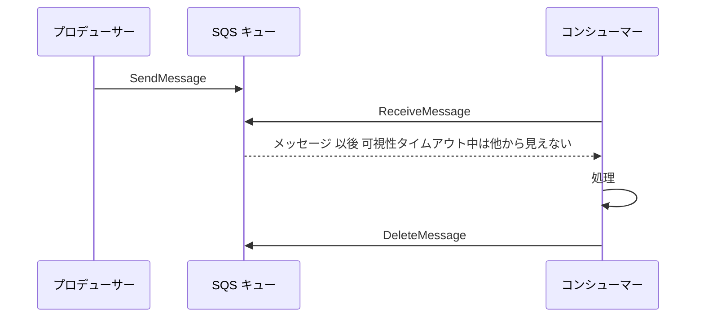

| 概念 | 内容 | 数値 |
|---|---|---|
| **可視性タイムアウト** | 受信したメッセージを **他のコンシューマーから見えなくする時間**。処理が終わらず削除されないと、時間切れで再び見えるようになる | 既定 **30 秒**、最大 **12 時間** |
| **ロングポーリング** | `WaitTimeSeconds` を指定して、メッセージが届くまで待つ。空応答とコストが減る | 最大 **20 秒** |
| ショートポーリング | 即座に応答(空のこともある) | |
| **DLQ** | `maxReceiveCount` 回受信されても削除されないメッセージを隔離 | |
| 遅延キュー / メッセージタイマー | 配信を遅らせる | 0〜**15 分** |
| メッセージ保持期間 | | 既定 **4 日**、最大 **14 日** |
| メッセージサイズ | | 最大 **1 MiB**(それ以上は Extended Client Library で S3 経由) |
| バッチ | `SendMessageBatch` / `DeleteMessageBatch` | 最大 **10 件** |
| メッセージ属性 | メタデータ | 最大 10 個 |

### 8-3. 標準キューと FIFO キュー

| 項目 | 標準キュー | FIFO キュー |
|---|---|---|
| 順序 | **ベストエフォート**(入れ替わりうる) | **厳密(メッセージグループ内)** |
| 配信 | **少なくとも 1 回**(重複あり) | 重複排除 ID により **5 分間は重複送信を抑止**(削除前のメッセージは再配信されうる) |
| スループット | ほぼ無制限 | API リクエスト数ベースの上限(高スループットモードあり) |
| キュー名 | 自由 | **`.fifo` で終わる** |
| 必須パラメータ | なし | **`MessageGroupId`**(順序の単位)。重複排除は `MessageDeduplicationId` か内容ベース重複排除 |
| 重複排除の窓 | - | **5 分** |

### 8-4. SNS の重要概念

- **トピック**にパブリッシュすると、サブスクライバー全員に届く。
- **メッセージフィルタリングポリシー**: サブスクリプションごとに属性(または本文)で受け取るメッセージを絞れる。
- **SNS FIFO トピック**は SQS FIFO キューにのみ配信できる(順序・重複排除を維持)。
- 配信失敗に備え、**サブスクリプションに DLQ** を設定できる。

### 8-5. Lambda と SQS の組み合わせ(頻出)

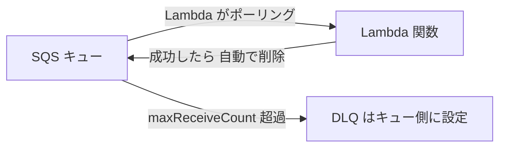

- Lambda は **バッチで**メッセージを受け取る(標準キューは既定 10 件、バッチウィンドウ併用でさらに大きく)。
- 関数が **成功すると** メッセージ群が削除される。**例外で失敗するとバッチ全体が再び見える**ようになる。
- **部分バッチ応答(`ReportBatchItemFailures`)** を有効にし、失敗した項目だけ `batchItemFailures` で返すと、成功分は再処理されない。

```python
def handler(event, context):
    failures = []
    for record in event["Records"]:
        try:
            process(record["body"])
        except Exception:
            failures.append({"itemIdentifier": record["messageId"]})
    return {"batchItemFailures": failures}
```

- **キューの可視性タイムアウトは Lambda のタイムアウトより長く**設定する(AWS はバッチウィンドウ未使用時は Lambda タイムアウトの **6 倍以上**、使用時は **Lambda タイムアウトの 6 倍 + `MaximumBatchingWindowInSeconds` 以上** を推奨)。
- **DLQ は SQS キュー(ソース)側に設定**する。Lambda 関数側の DLQ は非同期呼び出し用であり、SQS トリガーの失敗処理には効かない。

### 8-6. 他のメッセージング: Amazon MQ

- **Apache ActiveMQ / RabbitMQ** のマネージドサービス。
- 既存アプリが **JMS・AMQP・MQTT・STOMP** などの標準プロトコルを使っていて、**コードをほぼ変えずに移行したい** 場合に選ぶ。新規開発なら SQS/SNS が第一候補。

### 8-7. ベストプラクティス

- **コンシューマーは冪等**に(標準キューは重複しうる。FIFO の重複排除も送信側の重複を 5 分間抑止するだけで、処理後の削除失敗などで再配信されれば副作用は重複しうる)。
- **ロングポーリング** を使う(空受信を減らしコスト削減)。
- **DLQ を必ず設定**し、DLQ のメッセージ数をアラーム監視。DLQ の保持期間は元のキューより **長く** する。
- 大きなペイロードは **S3 に置いて参照(ポインタ)だけ送る**。
- 送信/削除は **バッチ API** で呼び出し回数とコストを減らす。
- SQS の暗号化(SSE)を有効化。

### 8-8. ひっかけポイント

- 「順序を厳密に保ち、重複を排除」→ **FIFO キュー**。
- 「1 件のイベントを複数システムで処理」→ **SNS + SQS のファンアウト**(各システムに専用キュー)。
- 「処理中に他のコンシューマーが取らないように」→ **可視性タイムアウト**(処理が長引くなら `ChangeMessageVisibility` で延長)。
- 「メッセージが何度も処理される」→ 可視性タイムアウトが処理時間より短い、または削除し忘れ。
- 「空受信が多くコストが高い」→ **ロングポーリング**。

**出典**
- SQS 開発者ガイド: https://docs.aws.amazon.com/AWSSimpleQueueService/latest/SQSDeveloperGuide/welcome.html
- 可視性タイムアウト: https://docs.aws.amazon.com/AWSSimpleQueueService/latest/SQSDeveloperGuide/sqs-visibility-timeout.html
- ショートポーリングとロングポーリング: https://docs.aws.amazon.com/AWSSimpleQueueService/latest/SQSDeveloperGuide/sqs-short-and-long-polling.html
- デッドレターキュー: https://docs.aws.amazon.com/AWSSimpleQueueService/latest/SQSDeveloperGuide/sqs-dead-letter-queues.html
- FIFO キュー: https://docs.aws.amazon.com/AWSSimpleQueueService/latest/SQSDeveloperGuide/sqs-fifo-queues.html
- SQS メッセージのクォータ: https://docs.aws.amazon.com/AWSSimpleQueueService/latest/SQSDeveloperGuide/quotas-messages.html
- SNS メッセージフィルタリング: https://docs.aws.amazon.com/sns/latest/dg/sns-message-filtering.html
- Lambda と SQS: https://docs.aws.amazon.com/lambda/latest/dg/with-sqs.html
- Amazon MQ とは: https://docs.aws.amazon.com/amazon-mq/latest/developer-guide/welcome.html

---

## Step 9. API と SDK で AWS サービスを操作する(Skill 1.1.9)

### 9-1. AWS を操作する 3 つの入口

| 入口 | 概要 |
|---|---|
| **AWS SDK** | 各言語向けライブラリ(Python は boto3、JavaScript は SDK v3、Java、.NET、Go など)。アプリのコードから使う |
| **AWS CLI** | コマンドラインから操作。スクリプトや確認作業向け |
| **AWS API(HTTPS)** | 実体。SDK/CLI は内部でリクエストを作り **SigV4 で署名** して送る |

### 9-2. 認証情報の探索順(認証情報プロバイダーチェーン)

SDK/CLI は、おおむね次の順で認証情報を探します(言語や設定で細部は異なります)。

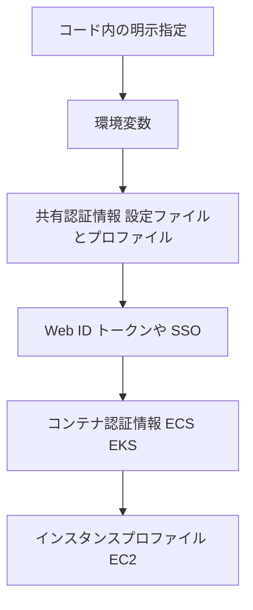

Lambda 内では **実行ロール(Execution role)の一時認証情報が環境変数に自動設定** されます。

### 9-3. 絶対に守るべきこと

- **アクセスキーをコードにハードコードしない / リポジトリに入れない**。
- コンピュート上(Lambda / EC2 / ECS)では **IAM ロール** を使い、長期キーを使わない。
- 権限は **最小権限**(必要なアクションとリソースだけ)。

### 9-4. SDK の実装で重要なこと

| 項目 | 内容 |
|---|---|
| クライアントの再利用 | ハンドラーの **外(初期化フェーズ)** でクライアントを作り、接続を使い回す |
| リージョン | クライアント作成時に明示(または環境変数 `AWS_REGION`)。Lambda では自動設定 |
| ページネーション | 1 回の応答で全件返らない API(`ListObjectsV2`、`Scan`、`Query` など)は **`NextToken` / `LastEvaluatedKey`** で続きを取得。**Paginator** を使うと楽 |
| Waiter | リソースが特定の状態になるまで待つ(例: テーブルが ACTIVE になるまで) |
| リトライとタイムアウト | Step 5 参照 |
| エラーハンドリング | サービス例外(`ClientError` など)を種類別に処理 |

Python のページネーション例:

```python
import boto3

s3 = boto3.client("s3")
paginator = s3.get_paginator("list_objects_v2")
for page in paginator.paginate(Bucket="my-bucket", Prefix="logs/"):
    for obj in page.get("Contents", []):
        print(obj["Key"])
```

### 9-5. S3 を SDK で扱うときの要点

| 項目 | 内容 |
|---|---|
| 単一 PUT | 最大 5 GB。ただし **大きいオブジェクトはマルチパートアップロード** を推奨 |
| マルチパートアップロード | 部分ごとに並列アップロード。各パート 5 MiB〜5 GiB(最後のパートを除く)、最大 10,000 パート、オブジェクト最大 5 TiB |
| **署名付き URL(presigned URL)** | **一時的な権限を持つ URL** を発行し、クライアントが **S3 へ直接アップロード/ダウンロード**(サーバーを経由しない) |
| 整合性 | S3 は **強い読み取り後書き込み整合性**(新規 PUT・上書き・削除の直後でも最新が読める) |

署名付き URL の考え方:

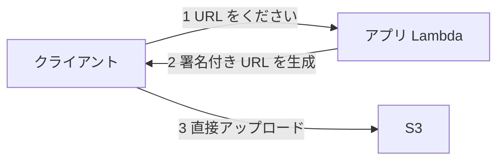

> 署名付き URL の有効期限・権限は **URL を作成した IAM プリンシパル** の権限と有効期限(一時認証情報なら、その期限)に制約されます。

### 9-6. AWS CLI の便利な知識

| 機能 | 使い方 |
|---|---|
| `--query` | JMESPath で出力を絞り込む(クライアント側フィルタ) |
| `--filter` / `--filters` | **サービス側で**絞り込み(サービスごとに存在) |
| `--output` | `json` / `table` / `text` / `yaml` |
| `--dry-run` | 実行せず権限を確認(EC2 など対応サービスのみ) |
| `--generate-cli-skeleton` | 入力 JSON の雛形を出力 |
| `--profile` | 使うプロファイルを指定 |
| `--page-size` / `--max-items` | ページングの制御 |

### 9-7. ベストプラクティス

- **署名付き URL** で大きなファイルのアップロードを直接 S3 へ(Lambda の 6 MB ペイロード制限回避にもなる)。
- 認証は IAM ロール/一時認証情報。ローカル開発では **IAM Identity Center(SSO)のプロファイル** を使う。
- SDK のバージョンは更新し、**非推奨 API・古いランタイム** を避ける。

### 9-8. ひっかけポイント

- 「EC2 上のアプリから S3 へ。認証情報をどうする?」→ **インスタンスプロファイル(IAM ロール)**。キーを置かない。
- 「API が全件を返さない」→ **ページネーション**。
- 「ユーザーに S3 へ直接アップロードさせたい」→ **署名付き URL**(または Cognito 経由の一時認証情報)。
- `--query` はクライアント側、サービス側フィルタは `--filter` 系。

**出典**
- AWS SDKs and Tools リファレンス(認証情報の標準プロバイダー): https://docs.aws.amazon.com/sdkref/latest/guide/standardized-credentials.html
- AWS CLI ユーザーガイド: https://docs.aws.amazon.com/cli/latest/userguide/cli-chap-welcome.html
- boto3 ページネーター: https://boto3.amazonaws.com/v1/documentation/api/latest/guide/paginators.html
- S3 署名付き URL でのアップロード: https://docs.aws.amazon.com/AmazonS3/latest/userguide/PresignedUrlUploadObject.html
- S3 マルチパートアップロード: https://docs.aws.amazon.com/AmazonS3/latest/userguide/mpuoverview.html
- S3 のデータ整合性モデル: https://docs.aws.amazon.com/AmazonS3/latest/userguide/Welcome.html#ConsistencyModel
- IAM のベストプラクティス: https://docs.aws.amazon.com/IAM/latest/UserGuide/best-practices.html

---

## Step 10. ストリーミングデータ(Skill 1.1.10)

### 10-1. ストリーミング系サービスの全体像

| サービス | 一言 | 向いている用途 |
|---|---|---|
| **Kinesis Data Streams(KDS)** | 順序付きのデータストリームを **自分でコンシューマーを書いて**読む | リアルタイム処理、複数コンシューマー、再読み取り |
| **Amazon Data Firehose** | ストリームを **S3 / Redshift / OpenSearch / HTTP エンドポイントなどへ自動配信**(ほぼリアルタイム) | ログの配信・ロード(コンシューマー実装不要) |
| **Amazon Managed Service for Apache Flink** | ストリームに対して **SQL/Flink でリアルタイム分析** | 集計、異常検知 |
| **Amazon MSK** | マネージド **Apache Kafka** | 既存の Kafka 資産、Kafka API が必要 |
| DynamoDB Streams | テーブルの **変更履歴(24 時間保持)** | 変更をトリガーに処理 |

### 10-2. Kinesis Data Streams の基本

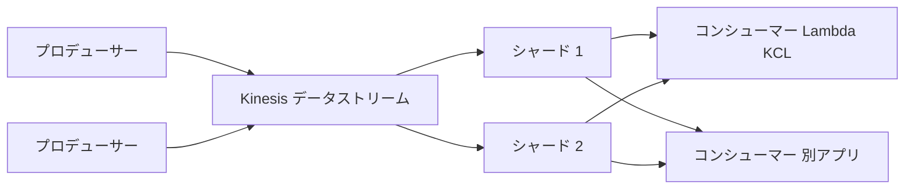

| 概念 | 内容 |
|---|---|
| **シャード** | スループットの単位。書き込み **最大 1 MB/秒 または 1,000 レコード/秒**、読み取り **最大 2 MB/秒**(全コンシューマーで共有) |
| **パーティションキー** | レコードの **振り分け先シャードを決める**。同じキー → 同じシャード → **そのキー内の順序が保たれる** |
| シーケンス番号 | シャード内のレコードの順序番号(Kinesis が付与) |
| 保持期間 | 既定 **24 時間**、最大 **365 日** に延長可能 |
| **容量モード** | **オンデマンド**(自動スケール)/ **プロビジョンド**(シャード数を自分で指定) |
| **拡張ファンアウト(Enhanced fan-out)** | コンシューマーごとに **専用の 2 MB/秒/シャード** を確保(共有スループットの取り合いを避ける) |
| `PutRecord` / `PutRecords` | 書き込み API(後者はバッチ) |
| KPL / KCL | プロデューサー/コンシューマー向けライブラリ(KCL は **DynamoDB でチェックポイント管理**) |

> **ホットシャード**: 特定のパーティションキーにデータが偏ると 1 シャードの上限に達し、`ProvisionedThroughputExceededException` が発生します。**カーディナリティの高いキー**を選びます。

### 10-3. Lambda × Kinesis / DynamoDB Streams

Lambda は **イベントソースマッピング** でシャードを **ポーリング** します。

| 設定 | 内容 |
|---|---|
| バッチサイズ・バッチウィンドウ | 1 回の呼び出しでまとめるレコード数・待ち時間 |
| **並列化係数(ParallelizationFactor)** | 1 シャードあたり **同時に 1〜10 バッチ** を処理(同じパーティションキーの順序は保たれる) |
| 再試行 | **失敗したバッチは成功するか期限切れになるまで再試行され、そのシャードの処理が止まる**(ブロッキング) |
| `BisectBatchOnFunctionError` | 失敗時にバッチを **半分に分割** して再試行し、問題のレコードを特定 |
| `MaximumRetryAttempts` / `MaximumRecordAgeInSeconds` | 再試行回数・レコードの最大年齢の上限 |
| **OnFailure 送信先(Destination)** | 上限を超えて失敗したバッチの情報を送る。**SQS / SNS** には **メタデータのみ** が届く(レコード本体は保持期間内にストリームから再取得)。**S3** 送信先には **元の呼び出しレコードとメタデータ** がまとめて保存される |
| 部分バッチ応答 | 失敗したレコードの位置を返して、そこから再試行 |
| **タンブリングウィンドウ** | 一定時間の集計を Lambda で実現 |
| CloudWatch メトリクス **`IteratorAge`** | 処理の **遅れ**(最も古い未処理レコードの年齢)。増え続けたら遅延 |

### 10-4. Firehose の要点

- **コンシューマーを書かずに** S3 / Redshift / OpenSearch Service / Splunk / HTTP エンドポイントなどへ配信。
- **バッファ(サイズ/時間)** がたまると配信するため **ほぼリアルタイム**(完全なリアルタイムではない)。
- **Lambda でレコード変換** や、形式変換(JSON → Parquet/ORC)ができる。
- 配信できなかったデータは **S3 のエラーバケット** へ。

### 10-5. 選び方フロー

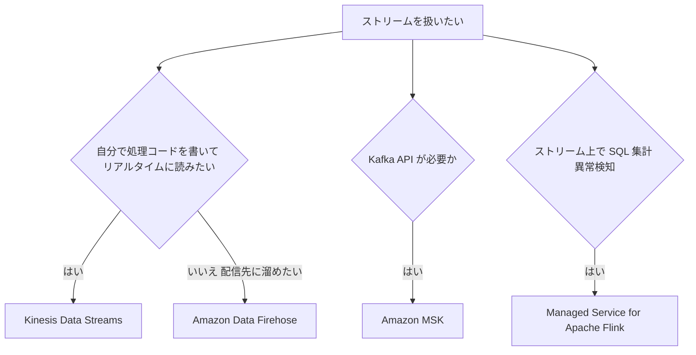

### 10-6. ベストプラクティス

- **パーティションキーは均等に分散**する値(ユーザー ID、デバイス ID など)を選ぶ。
- コンシューマーが複数・高スループットなら **拡張ファンアウト**。
- 処理は **冪等**に(再試行・再読み取りで重複しうる)。
- `PutRecords` の **部分失敗**(`FailedRecordCount`)を必ずチェックして失敗分だけ再送。
- Lambda の `IteratorAge` に **アラーム** を設定。
- 失敗レコードのブロッキングを避けるため `BisectBatchOnFunctionError` と OnFailure 送信先を設定。

### 10-7. ひっかけポイント

- 「**順序を保ちつつ**、複数コンシューマーが同じデータを読む」→ Kinesis Data Streams(SQS ではない)。
- 「コンシューマーのコードを書かずに S3 へ配信」→ **Firehose**。
- 「同じキーのレコードが同じシャードへ」→ **パーティションキー**。
- 「`ProvisionedThroughputExceededException`」→ ホットシャード/シャード不足 → シャード増加、キー分散、バックオフ再試行。
- SQS は消費したら消える。Kinesis は **保持期間内なら再読み取り可能**。

**出典**
- Kinesis Data Streams とは: https://docs.aws.amazon.com/streams/latest/dev/introduction.html
- Kinesis の拡張ファンアウト: https://docs.aws.amazon.com/streams/latest/dev/enhanced-consumers.html
- Amazon Data Firehose とは: https://docs.aws.amazon.com/firehose/latest/dev/what-is-this-service.html
- Lambda と Kinesis: https://docs.aws.amazon.com/lambda/latest/dg/with-kinesis.html
- Lambda と DynamoDB Streams: https://docs.aws.amazon.com/lambda/latest/dg/with-ddb.html
- Amazon MSK とは: https://docs.aws.amazon.com/msk/latest/developerguide/what-is-msk.html

---

## Step 11. Amazon Q Developer による開発支援(Skill 1.1.11)

### 11-1. やさしい説明

**Amazon Q Developer** は、AWS が提供する **生成 AI のコーディングアシスタント**です(旧 Amazon CodeWhisperer の後継)。IDE やターミナルで次のような支援を行います。

| 機能 | 内容 |
|---|---|
| インライン提案 | コメントや既存コードから、**スニペット〜関数全体** を提案 |
| チャット | コードの説明、デバッグ、AWS に関する質問、テスト追加など |
| エージェント機能 | 複数ステップでファイル横断のコード生成・修正を実行(開発エージェント) |
| コード変換 | Java バージョンアップなどのモダナイズ支援 |
| セキュリティスキャン | コードの脆弱性検出 |
| ドキュメント生成 | README や設計ドキュメントの生成 |

### 11-2. 受験時の注意: 製品の移行状況

公式ドキュメントには、**Amazon Q Developer の IDE プラグインのサポートが 2027 年 4 月 30 日に終了** し、同等の機能(エージェント型コーディング、チャット、MCP 対応)は **Kiro** を案内する旨の告知が出ています。試験ガイドの表記は「Use Amazon Q Developer to assist with development」のため、**考え方(AI 支援で開発を加速し、結果は必ず人間が検証する)** を押さえつつ、最新の製品名・提供状況は公式ドキュメントで確認してください。

### 11-3. 使い方のベストプラクティス

- **生成コードは必ずレビュー・テスト**する(AI は誤った API や非推奨の書き方を提案することがある)。
- **機密情報(認証情報、個人情報)をプロンプトに貼らない**。組織のデータ取り扱い設定を確認する。
- 生成コードの **ライセンス/参照元の表示(リファレンストラッカー)** を確認する。
- 生成された IAM ポリシーは **広すぎる権限になっていないか** を最小権限の観点で見直す。
- セキュリティスキャンの結果は **CI でも自動化** して継続的にチェックする。
- 具体的で明確な指示(使う言語、サービス、制約)を与えるほど品質が上がる。

### 11-4. 試験での出方

- 「コメントを書いたらコードが提案される」→ **インライン提案**。
- 「AWS サービスの使い方を IDE 内で質問」→ **チャット**。
- 「**脆弱性を検出**」→ セキュリティスキャン。
- 公式ガイドの Emerging topics(AI 支援のコードレビュー、AI サービス連携時のデータ保護・ログへの機密出力防止など)は **採点対象外の試験的問題** として出る可能性があります。

**出典**
- Amazon Q Developer とは: https://docs.aws.amazon.com/amazonq/latest/qdeveloper-ug/what-is.html
- IDE での Amazon Q Developer(サポート終了告知を含む): https://docs.aws.amazon.com/amazonq/latest/qdeveloper-ug/q-in-IDE.html
- インライン提案: https://docs.aws.amazon.com/amazonq/latest/qdeveloper-ug/inline-suggestions.html
- 試験ガイド(Emerging topics): https://docs.aws.amazon.com/aws-certification/latest/developer-associate-02/developer-associate-02.html

---

## Step 12. Amazon EventBridge によるイベント駆動(Skill 1.1.12)

### 12-1. やさしい説明

**Amazon EventBridge** は、AWS サービス・自作アプリ・SaaS からの **イベントを受け取り、ルールで選別して、ターゲットへ届ける** サーバーレスのイベントバスです。

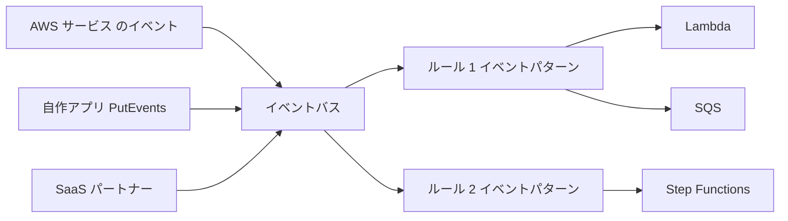

### 12-2. 主要コンポーネント

| 要素 | 内容 |
|---|---|
| **イベントバス** | イベントの受け口。**default バス**(AWS サービスのイベントが来る)、**カスタムバス**(自作アプリ用)、**パートナーイベントバス**(SaaS 用) |
| **イベント** | JSON。`source`、`detail-type`、`detail` などを持つ |
| **ルール** | **イベントパターン**に一致したイベントをターゲットへ送る。または **スケジュール** で定期実行 |
| **ターゲット** | Lambda、SQS、SNS、Step Functions、Kinesis、API Gateway、API 送信先(外部 HTTP)など。1 ルールに最大 5 つ |
| **入力トランスフォーマー** | ターゲットに渡す前にイベントの形を **変換・整形** |
| **EventBridge Scheduler** | **cron/rate/一度きり** のスケジュール実行(大規模・タイムゾーン対応)。定期実行はこちらが推奨 |
| **EventBridge Pipes** | **ソース(SQS、Kinesis、DynamoDB Streams など)→ フィルター → 強化 → ターゲット** をポイントツーポイントで接続 |
| **アーカイブとリプレイ** | イベントを保存し、あとで **再生** できる(障害復旧・テスト) |
| **スキーマレジストリ** | イベントの構造を検出・保管し、コードバインディングを生成 |
| **API 送信先(API destinations)** | **外部の HTTP エンドポイント** をターゲットにでき、接続情報と **レート制限** を管理(Step 13 とも関連) |

### 12-3. イベントパターンの例

```json
{
  "source": ["my.orders"],
  "detail-type": ["OrderPlaced"],
  "detail": {
    "amount": [{ "numeric": [">", 10000] }]
  }
}
```

このパターンは「`my.orders` から来た `OrderPlaced` で、`amount` が 10,000 より大きいもの」に一致します。パターンは **完全一致・プレフィックス・数値比較・存在チェック・OR** などを使えます。

アプリからのイベント送信(Python):

```python
import boto3, json

events = boto3.client("events")
events.put_events(
    Entries=[{
        "Source": "my.orders",
        "DetailType": "OrderPlaced",
        "Detail": json.dumps({"orderId": "A-1001", "amount": 12000}),
        "EventBusName": "my-bus",
    }]
)
```

> `put_events` は **部分失敗** があり得ます。レスポンスの `FailedEntryCount` を確認しましょう。

### 12-4. 配信の信頼性

- イベント配信は **少なくとも 1 回**(重複の可能性があり、ターゲット側は冪等に)。
- ターゲットへの配信失敗には **再試行ポリシー**(既定で最大 24 時間・185 回まで再試行)が適用される。
- 最終的に失敗したイベントは、ターゲットごとに設定した **DLQ(SQS)** へ送れる。

### 12-5. EventBridge・SNS・SQS の使い分け

| 観点 | EventBridge | SNS | SQS |
|---|---|---|---|
| モデル | イベントバス(ルーティング) | Pub/Sub(ファンアウト) | キュー(バッファ) |
| ルーティング | **高度なイベントパターン**で本文まで見て振り分け | 属性/本文フィルタ | なし |
| SaaS 連携 | **パートナーイベントソース**あり | 限定的 | なし |
| 保持/再処理 | **アーカイブ・リプレイ** | なし | 保持期間内なら再受信 |
| 典型用途 | サービス間のイベント連携、AWS イベント反応、定期実行 | 通知・即時ファンアウト | 負荷平準化・非同期ジョブ |

### 12-6. ベストプラクティス

- **イベントは「起きた事実」**(過去形、例: `OrderPlaced`)として設計し、コマンドと区別する。
- **ルールは具体的なパターン**に。広すぎるパターンはコストと誤動作の元。
- **ターゲットごとに DLQ と再試行ポリシー** を設定する。
- 重い処理の直前に **SQS を挟む**と、受け側の流量を制御できる。
- イベントの **スキーマにバージョン** を持たせる。
- 定期実行は **EventBridge Scheduler** を使う。

### 12-7. ひっかけポイント

- 「S3 にオブジェクトが作成されたら Lambda」→ S3 イベント通知 **または** EventBridge(S3 の EventBridge 連携を有効化)。
- 「**SaaS(外部サービス)のイベント**に AWS 側で反応」→ EventBridge **パートナーイベントソース**。
- 「過去のイベントを再生して検証/復旧」→ **アーカイブとリプレイ**。
- 「cron で定期実行」→ **EventBridge Scheduler**(または EventBridge のスケジュールルール)。

**出典**
- EventBridge とは: https://docs.aws.amazon.com/eventbridge/latest/userguide/eb-what-is.html
- イベントパターン: https://docs.aws.amazon.com/eventbridge/latest/userguide/eb-event-patterns.html
- EventBridge ルール: https://docs.aws.amazon.com/eventbridge/latest/userguide/eb-rules.html
- EventBridge Scheduler: https://docs.aws.amazon.com/scheduler/latest/UserGuide/what-is-scheduler.html
- EventBridge Pipes: https://docs.aws.amazon.com/eventbridge/latest/userguide/eb-pipes.html
- API 送信先: https://docs.aws.amazon.com/eventbridge/latest/userguide/eb-api-destinations.html
- ターゲットの DLQ と再試行: https://docs.aws.amazon.com/eventbridge/latest/userguide/eb-rule-dlq.html

---

## Step 13. サードパーティ連携の回復性(Skill 1.1.13)

> 試験ガイド: 外部サービス連携で **resilient なコード**(リトライロジック、サーキットブレーカー、エラー処理パターン)

### 13-1. なぜ必要か

外部の API(決済、メール、SaaS)は **自分では制御できず**、遅延・エラー・レート制限が起こります。呼び出し側が無防備だと、**外部の障害が自分のシステム全体に連鎖** します。

### 13-2. 4 つの基本パターン

| パターン | 目的 | 概要 |
|---|---|---|
| **タイムアウト** | 待ち続けない | 接続・読み取りに短い上限を設定 |
| **リトライ(バックオフ + ジッター)** | 一時的な失敗を吸収 | **再試行してよいエラーだけ** 再試行(5xx、429、タイムアウト)。400 系は再試行しない |
| **サーキットブレーカー** | 壊れた相手を叩き続けない | 失敗が閾値を超えたら **一定時間、呼び出しを遮断** して即エラー/フォールバックを返す |
| **バルクヘッド** | 障害の波及防止 | 相手ごとにスレッド/同時実行を分離 |

### 13-3. サーキットブレーカーの状態遷移

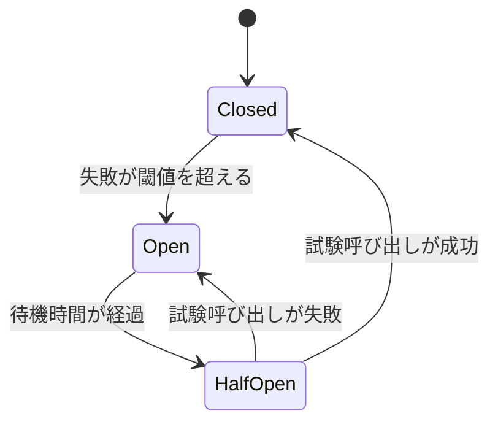

| 状態 | 動き |
|---|---|
| Closed(閉) | 通常どおり呼び出す。失敗数をカウント |
| Open(開) | **呼び出さず即座に失敗** またはフォールバック値を返す |
| Half-Open(半開) | 少数の試験呼び出しで回復を確認 |

> Lambda はステートレスで実行環境が分散するため、サーキットブレーカーの状態を共有したい場合は **DynamoDB / ElastiCache に状態を保存** する方法があります。

### 13-4. AWS を使った実装の選択肢

| 手段 | 使いどころ |
|---|---|
| SDK / HTTP クライアントのリトライ・タイムアウト設定 | 基本。まず設定を確認 |
| **SQS + DLQ** | 外部呼び出しを非同期化し、失敗はキューで再試行・隔離 |
| **Step Functions の `Retry` / `Catch`** | 指数バックオフ(`IntervalSeconds`、`BackoffRate`、`MaxAttempts`、ジッター)と **フォールバック状態** を宣言的に定義 |
| **EventBridge API 送信先** | 外部 HTTP への配信に **呼び出しレート制限** と再試行を使える |
| **Lambda Destinations / DLQ** | 非同期呼び出しの失敗の退避 |
| **Secrets Manager** | 外部 API キーの安全な保管・ローテーション |
| **CloudWatch アラーム / X-Ray** | 外部呼び出しの失敗率・遅延の可視化 |

Step Functions の `Retry` の例:

```json
"Retry": [
  {
    "ErrorEquals": ["States.TaskFailed"],
    "IntervalSeconds": 2,
    "BackoffRate": 2.0,
    "MaxAttempts": 4,
    "JitterStrategy": "FULL"
  }
],
"Catch": [
  { "ErrorEquals": ["States.ALL"], "Next": "FallbackState" }
]
```

### 13-5. レート制限(HTTP 429)への対応

- **`Retry-After` ヘッダー** があればそれに従って待つ。
- 自分側でも **呼び出しレートを制御**(キューで流量調整、同時実行数の制限)。
- 429 をバックオフなしで再試行し続けない。

### 13-6. ベストプラクティス

- **再試行は冪等な操作だけ**。非冪等な呼び出し(課金など)は **冪等キー** を付けるか、再試行しない。
- **全体のタイムアウト予算** を決める(Lambda のタイムアウトより短く、リトライ合計も収める)。
- **フォールバック**(キャッシュ値、デフォルト応答、機能縮退)を用意する。
- 失敗の **ログ・メトリクス・アラーム** を必ず用意し、サーキットブレーカーの開閉も記録する。
- 外部 API キーは環境変数に平文で置かず **Secrets Manager / Parameter Store**。

### 13-7. ひっかけポイント

- 「外部 API の障害で自社システムのスレッド/接続が枯渇」→ **タイムアウト + サーキットブレーカー**。
- 「リトライで外部をさらに過負荷にしている」→ **指数バックオフ + ジッター**、再試行上限。
- 「400 Bad Request を再試行」→ **意味がない**(恒久的エラー)。
- 「失敗したリクエストを失わず後で再処理」→ **SQS + DLQ**。

**出典**
- Circuit breaker パターン(AWS Prescriptive Guidance): https://docs.aws.amazon.com/prescriptive-guidance/latest/cloud-design-patterns/circuit-breaker.html
- Timeouts, retries, and backoff with jitter: https://aws.amazon.com/builders-library/timeouts-retries-and-backoff-with-jitter/
- Step Functions のエラー処理(Retry / Catch): https://docs.aws.amazon.com/step-functions/latest/dg/concepts-error-handling.html
- EventBridge API 送信先: https://docs.aws.amazon.com/eventbridge/latest/userguide/eb-api-destinations.html
- AWS Secrets Manager: https://docs.aws.amazon.com/secretsmanager/latest/userguide/intro.html
- Reliability Pillar: https://docs.aws.amazon.com/wellarchitected/latest/reliability-pillar/welcome.html

---