# AWS Certified Developer - Associate (DVA-C02)
## Content Domain 1: Development with AWS Services 完全ガイド（初学者向け・ステップバイステップ）

> 対象試験: AWS Certified Developer - Associate (DVA-C02)
> 対象範囲: **Content Domain 1「Development with AWS Services」（スコア対象問題の 32%）**
> 作成日: 2026-10-04
> 根拠: AWS 公式 試験ガイド（DVA-C02）の Domain 1 の全 29 スキル（Skill 1.1.1〜1.3.9）と、各サービスの AWS 公式ドキュメント

---

## 目次

- [0. はじめに（このガイドの使い方）](#0-はじめにこのガイドの使い方)
- [Task 1: AWS 上でホストされるアプリケーションのコードを開発する](#task-1-aws-上でホストされるアプリケーションのコードを開発する)
  - [Skill 1.1.1 アーキテクチャパターン](#skill-111-アーキテクチャパターン)
  - [Skill 1.1.2 ステートフルとステートレス](#skill-112-ステートフルとステートレス)
  - [Skill 1.1.3 密結合と疎結合](#skill-113-密結合と疎結合)
  - [Skill 1.1.4 同期と非同期](#skill-114-同期と非同期)
  - [Skill 1.1.5 耐障害性とレジリエンスのあるコード](#skill-115-耐障害性とレジリエンスのあるコード)
  - [Skill 1.1.6 API の作成・拡張・保守](#skill-116-api-の作成拡張保守)
  - [Skill 1.1.7 ユニットテストと AWS SAM](#skill-117-ユニットテストと-aws-sam)
  - [Skill 1.1.8 メッセージングサービス](#skill-118-メッセージングサービス)
  - [Skill 1.1.9 API・SDK で AWS サービスを操作する](#skill-119-apisdk-で-aws-サービスを操作する)
  - [Skill 1.1.10 ストリーミングデータ](#skill-1110-ストリーミングデータ)
  - [Skill 1.1.11 Amazon Q Developer](#skill-1111-amazon-q-developer)
  - [Skill 1.1.12 Amazon EventBridge](#skill-1112-amazon-eventbridge)
  - [Skill 1.1.13 サードパーティ連携のレジリエンス](#skill-1113-サードパーティ連携のレジリエンス)
- [Task 2: AWS Lambda のコードを開発する](#task-2-aws-lambda-のコードを開発する)
  - [Skill 1.2.1 VPC 内プライベートリソースへのアクセス](#skill-121-vpc-内プライベートリソースへのアクセス)
  - [Skill 1.2.2 Lambda の設定](#skill-122-lambda-の設定)
  - [Skill 1.2.3 イベントライフサイクルとエラー処理](#skill-123-イベントライフサイクルとエラー処理)
  - [Skill 1.2.4 Lambda のテスト](#skill-124-lambda-のテスト)
  - [Skill 1.2.5 Lambda と AWS サービスの統合](#skill-125-lambda-と-aws-サービスの統合)
  - [Skill 1.2.6 Lambda のパフォーマンスチューニング](#skill-126-lambda-のパフォーマンスチューニング)
  - [Skill 1.2.7 ほぼリアルタイムのデータ処理](#skill-127-ほぼリアルタイムのデータ処理)
- [Task 3: アプリケーション開発でデータストアを使う](#task-3-アプリケーション開発でデータストアを使う)
  - [Skill 1.3.1 高カーディナリティのパーティションキー](#skill-131-高カーディナリティのパーティションキー)
  - [Skill 1.3.2 整合性モデル](#skill-132-整合性モデル)
  - [Skill 1.3.3 Query と Scan の違い](#skill-133-query-と-scan-の違い)
  - [Skill 1.3.4 DynamoDB のキーとインデックス](#skill-134-dynamodb-のキーとインデックス)
  - [Skill 1.3.5 シリアライズとデシリアライズ](#skill-135-シリアライズとデシリアライズ)
  - [Skill 1.3.6 データストアの利用・管理・保守](#skill-136-データストアの利用管理保守)
  - [Skill 1.3.7 データライフサイクルの管理](#skill-137-データライフサイクルの管理)
  - [Skill 1.3.8 キャッシュサービス](#skill-138-キャッシュサービス)
  - [Skill 1.3.9 アクセスパターンに応じた専用データストア](#skill-139-アクセスパターンに応じた専用データストア)
- [サービス選択の早見表（試験直前チェック）](#サービス選択の早見表試験直前チェック)
- [よく出る「ひっかけ」パターン集](#よく出るひっかけパターン集)
- [練習問題（15 問）](#練習問題15-問)
- [参考 URL 一覧](#参考-url-一覧)

---

## 0. はじめに（このガイドの使い方）

### 0.1 この Domain 1 は何を問われるのか

Domain 1 は DVA-C02 で**最も配点が大きい分野（32%）**です。試験の 50 問（スコア対象）のうち、およそ 16 問前後がここから出る計算になります。内容は大きく 3 つの Task に分かれます。

| Task | テーマ | スキル数 | 一言でいうと |
|---|---|---|---|
| Task 1 | AWS 上でホストされるアプリのコードを開発する | 13 | 設計の考え方（疎結合・非同期・耐障害性）と、SDK・API・メッセージング・イベント駆動の使い方 |
| Task 2 | AWS Lambda のコードを開発する | 7 | Lambda の設定・エラー処理・テスト・チューニング |
| Task 3 | アプリ開発でデータストアを使う | 9 | DynamoDB を中心にしたデータ設計、キャッシュ、検索サービス |

試験ガイドには「アーキテクチャそのものの設計（分散システム、マイクロサービス、DB スキーマ設計など）」は**対象外**と書かれています。つまり、「大きな設計を自分で作る」ことより、**「パターンの違いを説明でき、コードで正しく使える」**ことが問われます。

### 0.2 試験の基本情報（公式 試験ガイドより）

| 項目 | 内容 |
|---|---|
| 問題数 | スコア対象 50 問 + 採点されない問題 15 問（どれが採点対象外かは分からない） |
| 試験時間 | 130 分 |
| 問題形式 | 択一（正解 1・誤答 3）と複数選択（5 択以上から 2 つ以上を選ぶ） |
| 合否 | 100〜1,000 の換算スコアで、合格点は 720 |
| 採点方式 | 補償型（分野ごとの合格ラインはなく、全体で合格すればよい） |
| 推奨経験 | AWS サービスを使ったアプリ開発・保守の実務経験 1 年以上 |

### 0.3 このガイドの読み進め方

各スキルは、次の同じ型で説明します。迷ったら「試験での狙われ方」と「ベストプラクティス」だけ先に読んでも構いません。

1. **ひとことで言うと**（イメージをつかむ）
2. **詳しい説明**（用語・仕組み・図表）
3. **ベストプラクティス**（実務でも試験でも正解になりやすい考え方）
4. **試験での狙われ方**（ひっかけや判断基準）

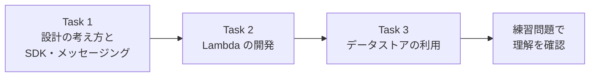

### 0.4 Domain 1 に登場する主なサービス一覧

| 分類 | サービス | 主な役割 |
|---|---|---|
| コンピュート | AWS Lambda | サーバー管理なしでコードを実行 |
| API | Amazon API Gateway | REST / HTTP / WebSocket の API を公開 |
| メッセージング | Amazon SQS / Amazon SNS | キュー、Pub/Sub 通知 |
| イベント | Amazon EventBridge | イベントバス、ルール、スケジューラ、Pipes |
| ワークフロー | AWS Step Functions | 複数ステップのオーケストレーション |
| ストリーミング | Amazon Kinesis Data Streams / Data Firehose | ストリームの取り込み・配信 |
| データストア | Amazon DynamoDB / Amazon RDS / Amazon Aurora / Amazon S3 | NoSQL・リレーショナル・オブジェクト |
| キャッシュ | Amazon ElastiCache / Amazon DynamoDB Accelerator (DAX) | 読み取りの高速化 |
| 検索 | Amazon OpenSearch Service | 全文検索・ログ分析 |
| 開発支援 | AWS SDK / AWS CLI / AWS SAM / Amazon Q Developer | コード・テスト・ローカル実行 |

---

# Task 1: AWS 上でホストされるアプリケーションのコードを開発する

## Skill 1.1.1 アーキテクチャパターン

> 公式のスキル文: アーキテクチャパターン（イベント駆動、マイクロサービス、モノリシック、コレオグラフィ、オーケストレーション、ファンアウトなど）を説明する

### ひとことで言うと

「アプリをどういう**形**で組み立てるか」の代表的な型を知るスキルです。型ごとに「得意なこと」と「つらいこと」があり、試験では**状況から正しい型を選ぶ**問題が出ます。

### 詳しい説明

#### モノリシックとマイクロサービス

- **モノリシック**: 全機能が 1 つのアプリ・1 つのデプロイ単位に入っている形。小さく始めるには単純で速い一方、規模が大きくなると変更の影響範囲が広がり、部分的なスケールもできません。
- **マイクロサービス**: 機能を小さな独立したサービスに分け、各サービスを個別にデプロイ・スケールする形。チームが独立して動けますが、サービス間通信・監視・データ整合性の難しさが増えます。

| 観点 | モノリシック | マイクロサービス |
|---|---|---|
| デプロイ | 全体を 1 回で | サービスごとに個別 |
| スケール | 全体を丸ごと | 必要なサービスだけ |
| 障害の影響 | 全体に波及しやすい | 局所化しやすい |
| 複雑さ | コードは 1 か所で単純 | 通信・監視・分散トレースが必要 |
| 向く場面 | 小規模・初期の開発 | 大規模・複数チーム |

#### イベント駆動（Event-driven）

「何かが起きた（イベント）」ことをきっかけに処理が動く形です。送り手（プロデューサー）は受け手（コンシューマー）を知らなくてよい、というのが核心です。例: S3 にファイルが置かれたら Lambda が起動する、注文が確定したらイベントを発行して在庫・配送・メールの各サービスが反応する、など。

#### コレオグラフィとオーケストレーション

複数サービスが連携して 1 つの業務を完了させるときの、**指揮の取り方**の違いです。

| 観点 | コレオグラフィ（振付） | オーケストレーション（指揮） |
|---|---|---|
| 制御 | 中央の司令塔なし。各サービスがイベントに反応 | 中央のオーケストレーターが順序を制御 |
| 代表サービス | Amazon EventBridge、Amazon SNS、Amazon SQS | AWS Step Functions |
| 長所 | 疎結合・拡張しやすい | 流れが見やすく、エラー処理・リトライを集中管理 |
| 短所 | 全体の流れが追いにくい | オーケストレーターが依存先になる |

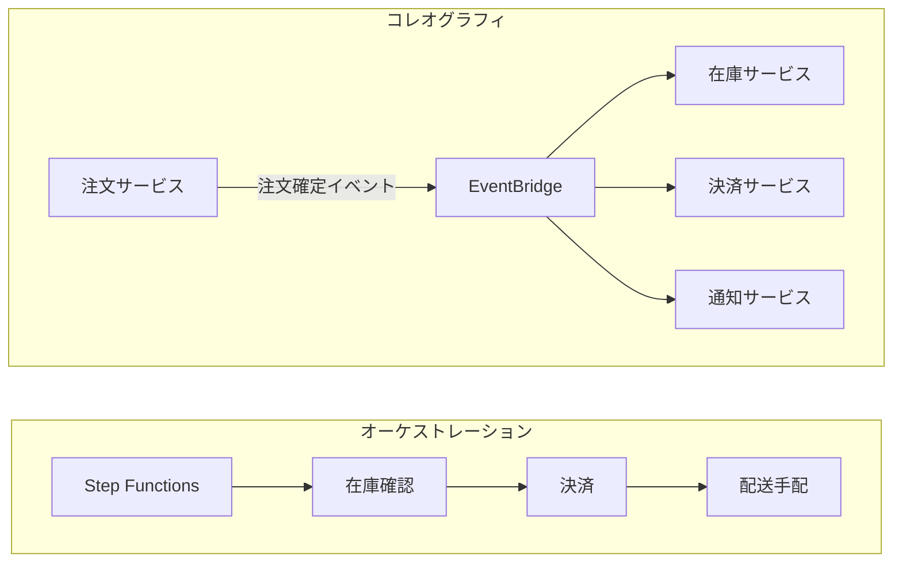

#### ファンアウト（Fan-out）

**1 つのメッセージを、複数の宛先へ同時に配る**パターンです。AWS の定番は **SNS トピック → 複数の SQS キュー**（SNS + SQS ファンアウト）です。各キューが独立してメッセージを受け取るので、片方の処理が遅くても他方に影響しません。

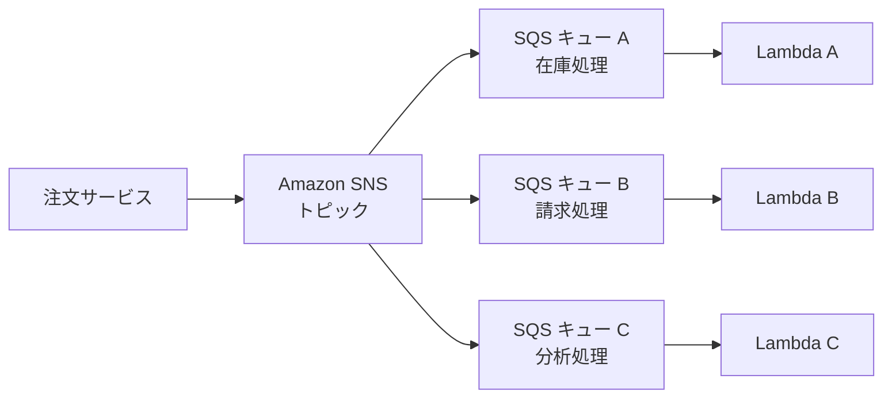

### ベストプラクティス

- 最初は単純な構成から始め、必要になったら分割する（最初から過剰にマイクロサービス化しない）
- サービス間は**直接呼び出しよりイベント・メッセージ**でつなぎ、疎結合を保つ
- ステップ数・分岐・リトライ・人手承認がある業務フローは **Step Functions** で見える化する
- 「1 対多」の配信は **SNS + SQS** か **EventBridge** を使い、各コンシューマーを独立させる

### 試験での狙われ方

- 「1 つのイベントを複数のシステムが独立して処理したい」→ **ファンアウト（SNS + SQS / EventBridge）**
- 「複数ステップの順序・リトライ・分岐を一元管理したい」→ **オーケストレーション（Step Functions）**
- 「サービス同士が互いを知らずに連携したい」→ **イベント駆動・コレオグラフィ**

---

## Skill 1.1.2 ステートフルとステートレス

### ひとことで言うと

リクエストをまたいで**「前回のこと」を覚えているか**の違いです。

### 詳しい説明

| 観点 | ステートフル | ステートレス |
|---|---|---|
| 状態の保持 | サーバー（プロセス）が保持する | サーバーは保持しない。毎回必要な情報をリクエストに含めるか、外部に保存 |
| スケールアウト | 難しい（同じサーバーに振り分ける必要＝スティッキーセッション） | 容易（どのサーバーでも同じ結果） |
| 障害時 | サーバーが落ちると状態を失う | 別のサーバーが引き継げる |
| 例 | メモリ上にセッションを持つ Web サーバー | Lambda、JWT を使う API |

重要なのは「**状態そのものをなくす**」のではなく、**状態を外に出す**ことです。アプリを動かすサーバーやコンテナは使い捨てにし、状態は次のような外部ストアに置きます。

| 保存したい状態 | 外部ストアの例 |
|---|---|
| ユーザーセッション | Amazon DynamoDB（TTL 付き）、Amazon ElastiCache |
| アップロードファイル | Amazon S3 |
| 業務データ | Amazon DynamoDB、Amazon RDS / Aurora |
| 認証情報 | トークン（JWT など）をクライアントが持つ |

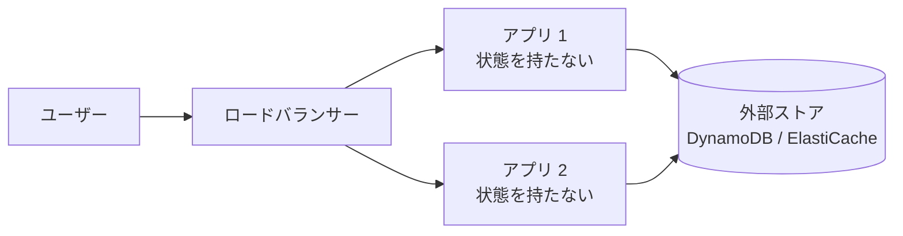

### Lambda での注意

Lambda の実行環境は再利用されることがありますが、**再利用は保証されません**。グローバル変数に入れたデータは「あれば得」な**キャッシュ**として扱い、永続的な状態の保存先にしてはいけません。永続させたいデータは DynamoDB や S3 に書きます。`/tmp` も同様で、同じ実行環境内でしか残らない一時領域です。

### ベストプラクティス

- アプリケーション層は**ステートレス**に作り、水平スケールしやすくする
- セッション情報は ElastiCache や DynamoDB に出す。ELB のスティッキーセッションは「やむを得ない場合の手段」と考える
- Lambda ではグローバル変数を「最適化のためのキャッシュ」にのみ使う

### 試験での狙われ方

- 「Auto Scaling で台数が増減してもセッションが切れないようにしたい」→ **セッションを外部ストア（ElastiCache / DynamoDB）へ**
- 「Lambda 関数間でデータを共有したい」→ グローバル変数や `/tmp` ではなく **DynamoDB / S3 など外部ストア**

---

## Skill 1.1.3 密結合と疎結合

### ひとことで言うと

部品同士が**どれだけお互いに依存しているか**です。AWS の設計思想では**疎結合が基本の正解**です。

### 詳しい説明

- **密結合**: A が B を直接呼び出し、B の応答を待つ。B が遅い・落ちると A も止まる。B の仕様変更が A を壊す。
- **疎結合**: A と B の間に**キュー・トピック・イベントバス**などの仲介を置く。A は B の状態を気にせずメッセージを置くだけでよい。

| 観点 | 密結合 | 疎結合 |
|---|---|---|
| 障害の伝播 | 連鎖しやすい | 仲介役が吸収できる |
| スケール | 両者を同時に拡張する必要 | それぞれ独立して拡張 |
| 変更の影響 | 相手を巻き込む | 契約（メッセージ形式）を守れば独立 |
| 負荷の急増 | 受け手が直撃を受ける | キューがバッファになる |

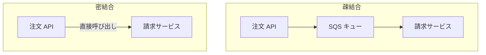

### 疎結合を実現する AWS サービス

| 手段 | 使いどころ |
|---|---|
| Amazon SQS | 処理を後回しにしたい・負荷をならしたい（バッファリング） |
| Amazon SNS | 1 つの通知を複数へ配信（Pub/Sub） |
| Amazon EventBridge | イベントをルールで振り分けたい |
| AWS Step Functions | 複数のサービス呼び出しを順序立てて実行したい |
| Amazon API Gateway | クライアントとバックエンドの間に API という契約を置く |

### ベストプラクティス

- 同期呼び出しでつなぐ必要がない箇所は、**キューやイベントで間に挟む**
- メッセージ（イベント）の**スキーマ（契約）を明確に管理**し、後方互換性を保って変更する
- 受け手が落ちてもメッセージが失われないよう、**SQS の保持期間や DLQ**を設定する

### 試験での狙われ方

- 「バックエンドが遅いとフロントも詰まる。改善したい」→ **間に SQS を入れて非同期化（疎結合）**
- 「アクセス急増時に DB が過負荷になる」→ **SQS でバッファリングし、消費速度を制御**

---

## Skill 1.1.4 同期と非同期

### ひとことで言うと

呼び出した側が**結果を待つか、待たないか**の違いです。

### 詳しい説明

| 観点 | 同期（Synchronous） | 非同期（Asynchronous） |
|---|---|---|
| 呼び出し側 | 結果が返るまで待つ | 受け付けられたらすぐ次へ進む |
| 結果の受け取り | 応答として直接受け取る | コールバック・通知・ポーリング・別の保存先で受け取る |
| 向く処理 | 即時の応答が必要（画面表示、API の参照） | 時間がかかる、後で良い、失敗時に再試行したい |
| 障害への強さ | 相手の不調がそのまま影響 | リトライ・DLQ で吸収しやすい |

#### Lambda の 3 つの呼び出しモデル

Lambda は呼び出し方によって、エラー処理や再試行の仕組みが変わります。ここが試験の頻出ポイントです。

| 呼び出しタイプ | 代表的な呼び出し元 | 結果 | エラー時の再試行 |
|---|---|---|---|
| 同期 | API Gateway、ALB、SDK の `RequestResponse` | 呼び出し元が結果を待つ | **呼び出し元（クライアント）が再試行する** |
| 非同期 | S3、SNS、EventBridge、SDK の `Event` | Lambda 内部のキューに入れて即 `202` | **Lambda が自動で再試行**（既定で最大 2 回）。失敗時は DLQ / Destination へ |
| ポーリング（イベントソースマッピング） | SQS、Kinesis、DynamoDB Streams | Lambda サービスがソースを読み取って関数を呼ぶ | ソースの種類によって異なる（Skill 1.2.3 で詳述） |

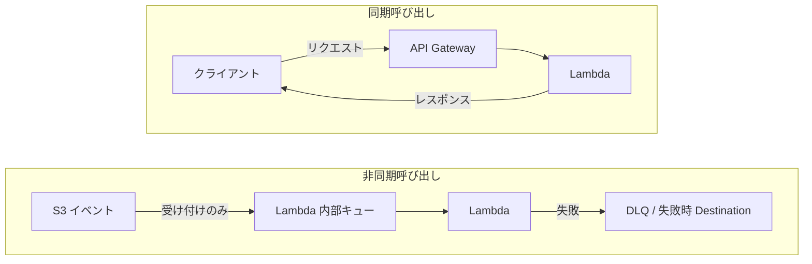

#### 非同期パターンの定番

| 場面 | パターン |
|---|---|
| 重い処理を API から切り離す | API は受付 ID だけ返す（`202 Accepted`）→ SQS に積む → ワーカーが処理 → 結果は DynamoDB に保存 → クライアントはポーリングか通知で取得 |
| 長時間の複数ステップ | Step Functions（Standard ワークフロー）で実行し、状態を管理 |

### ベストプラクティス

- ユーザーを待たせる必要がない処理は**非同期化**して応答を早くする
- 非同期処理では**冪等性（同じメッセージが複数回届いても結果が同じ）**を必ず確保する
- 失敗したメッセージの行き先（**DLQ や Destination**）を最初に決めておく

### 試験での狙われ方

- 「API Gateway からの呼び出しで Lambda がエラー。再試行は誰が？」→ **同期なのでクライアント側**
- 「S3 トリガーの Lambda が失敗したら？」→ **非同期なので Lambda が自動で最大 2 回再試行**
- 「重い処理で API がタイムアウトする」→ **非同期化（SQS + ワーカー、または Step Functions）**

---

## Skill 1.1.5 耐障害性とレジリエンスのあるコード

> 公式のスキル文: プログラミング言語（Java、C#、Python、JavaScript、TypeScript、Go など）で、耐障害性とレジリエンスのあるアプリケーションを作る

### ひとことで言うと

分散システムでは「**失敗はいつか必ず起きる**」前提で、失敗しても全体が止まらない・壊れないコードを書くスキルです。

### 詳しい説明

#### 失敗の種類を見分ける

| 種類 | 例 | 対処 |
|---|---|---|
| 一時的な失敗（transient） | スロットリング（429 / `ThrottlingException`）、タイムアウト、5xx、ネットワーク断 | **再試行（リトライ）する** |
| 恒久的な失敗 | 入力不正（400）、権限不足（403）、リソースが存在しない（404） | 再試行しても無意味。**エラーとして処理**する |

#### 基本の 5 つの武器

| 武器 | 内容 | 補足 |
|---|---|---|
| 指数バックオフ | 再試行の間隔を 1 秒 → 2 秒 → 4 秒… と倍々に広げる | 相手の回復を待つ |
| ジッター（揺らぎ） | 待ち時間にランダム性を足す | 多数のクライアントが**同時に**再試行する「雷鳴の群れ（thundering herd）」を防ぐ |
| タイムアウト | 接続・読み取りに上限時間を設ける | 無限に待たない |
| 冪等性 | 同じ操作を何回実行しても結果が同じ | 再試行・重複配信による二重処理を防ぐ |
| DLQ（デッドレターキュー） | 何度やっても失敗するメッセージの退避先 | 原因調査と再処理に使う |

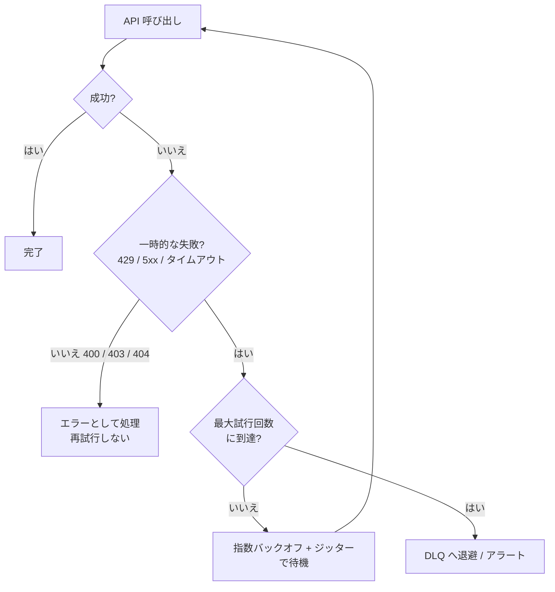

#### AWS SDK の再試行機能

AWS SDK には再試行ロジックが**標準で組み込まれています**。自分で書く前に、まず設定で調整できないかを考えます。

| 再試行モード | 概要 |
|---|---|
| `legacy` | SDK ごとの従来の動作 |
| `standard` | 標準。指数バックオフ + ジッター。多くの SDK でこれが推奨 |
| `adaptive` | standard に加え、スロットリングを検知してクライアント側で送信レートを自動調整（試験的な位置づけの SDK もある） |

Python（boto3）での設定例です。

```python
import boto3
from botocore.config import Config

config = Config(
    retries={"max_attempts": 5, "mode": "standard"},  # 最大試行回数とモード
    connect_timeout=3,   # 接続のタイムアウト（秒）
    read_timeout=10,     # 読み取りのタイムアウト（秒）
)
dynamodb = boto3.client("dynamodb", config=config)
```

#### 冪等性を作る 3 つの方法

| 方法 | 仕組み |
|---|---|
| DynamoDB の条件付き書き込み | `ConditionExpression: attribute_not_exists(request_id)` で「初回のみ書ける」ようにする |
| 冪等性キー（Idempotency Key） | リクエストごとに一意なキーを付け、処理済みかをデータストアで確認 |
| SQS FIFO の重複排除 | `MessageDeduplicationId` で 5 分間の重複送信を排除 |

Lambda では、AWS が提供する **Powertools for AWS Lambda の Idempotency ユーティリティ**で、冪等性を簡単に実装できます。

#### その他の耐障害性テクニック

- **グレースフルデグラデーション（縮退運転）**: 一部の機能が使えなくても、残りの機能で動き続ける（例: レコメンドが取れなければ人気順を表示）
- **ヘルスチェック**: ロードバランサーやターゲットグループで、異常なインスタンスを切り離す
- **ステートレス化**: Skill 1.1.2 のとおり。台が落ちても別の台が引き継げる
- **Multi-AZ / リージョンの分散**: インフラ側の冗長化（試験では「コードの側でできること」が中心）

### ベストプラクティス

- 再試行は**一時的な失敗のみ**に行い、**指数バックオフ + ジッター + 最大回数**を必ず付ける
- 再試行される前提で、すべての書き込み処理を**冪等**にする
- 「すべての外部呼び出しにタイムアウトを設定する」を習慣にする
- 失敗したメッセージは捨てず、**DLQ に送ってアラームを設定**する

### 試験での狙われ方

- 「スロットリングエラーが頻発する」→ **指数バックオフ + ジッター**、あるいは SDK の再試行設定
- 「リトライで二重課金が起きた」→ **冪等性キー / 条件付き書き込み**
- 「再試行しても決して成功しないメッセージで処理が詰まる」→ **DLQ**

---

## Skill 1.1.6 API の作成・拡張・保守

> 公式のスキル文: API を作成・拡張・保守する（リクエスト / レスポンスの変換、検証ルールの適用、ステータスコードの上書きなど）

### ひとことで言うと

**Amazon API Gateway** を使って、HTTP の窓口（API）を作り、入力のチェックやデータ変換、エラーの返し方まで制御するスキルです。

### 詳しい説明

#### API の種類

| 種類 | 特徴 | 向く場面 |
|---|---|---|
| **REST API** | 機能が最も豊富。リクエスト検証、マッピングテンプレート、API キー / 使用量プラン、キャッシュ、リソースポリシー、WAF 連携など | 高機能な API 管理が必要なとき |
| **HTTP API** | 軽量・低価格・低レイテンシー。JWT オーソライザーをネイティブにサポート | シンプルなプロキシ型 API |
| **WebSocket API** | クライアントとサーバーの双方向通信 | チャット、リアルタイム通知 |

| 機能 | REST API | HTTP API |
|---|---|---|
| リクエスト検証（Request Validation） | あり | なし |
| マッピングテンプレート（VTL）による本文変換 | あり | なし（パラメータのマッピングのみ） |
| API キー・使用量プラン | あり | なし |
| API キャッシュ | あり | なし |
| JWT オーソライザー | Cognito オーソライザーまたは Lambda オーソライザーで実現 | ネイティブ対応 |
| 価格 | 高め | 低め |

> 「検証・変換・キャッシュ・使用量プランが必要」→ **REST API**。「安く速く、単純でよい」→ **HTTP API**。この見分けが試験の定番です。

#### 統合タイプ（Integration）

| 統合 | 内容 | 使いどころ |
|---|---|---|
| **Lambda プロキシ統合** | リクエスト全体をそのまま Lambda に渡し、Lambda が HTTP レスポンスの形式で返す | 最も簡単。Lambda 側で自由に処理 |
| **Lambda 非プロキシ（カスタム）統合** | API Gateway がマッピングテンプレートで入出力を変換 | 既存の Lambda を改修せず、API 側で形式を整えたい |
| **HTTP 統合 / AWS サービス統合** | 任意の HTTP エンドポイントや AWS サービス（SQS、DynamoDB、Step Functions など）を直接呼ぶ | Lambda を挟まず直接つなぎ、コードを減らす |
| **Mock 統合** | バックエンドなしで固定のレスポンスを返す | 開発初期・CORS のプリフライト |

Lambda プロキシ統合では、Lambda 関数が次の形式で返す必要があります。形式が違うと API Gateway は `502 Bad Gateway`（Malformed Lambda proxy response）を返します。

```python
import json

def handler(event, context):
    return {
        "statusCode": 200,                       # 必須
        "headers": {"Content-Type": "application/json"},
        "body": json.dumps({"message": "ok"}),   # 本文は文字列
    }
```

#### リクエスト・レスポンスの変換（REST API・非プロキシ統合）

**マッピングテンプレート**は、**VTL（Velocity Template Language）**で書く変換ルールです。

| 変換の場所 | 役割 | 例 |
|---|---|---|
| 統合リクエスト | クライアントからの入力をバックエンド向けに整形 | クエリ文字列を JSON 本文に詰め替える |
| 統合レスポンス | バックエンドの出力をクライアント向けに整形 | 不要なフィールドを除いて返す |

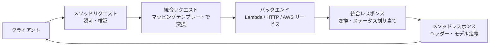

#### 検証ルールの適用（Request Validation）

REST API では、**バックエンドに届く前に**リクエストを API Gateway 側で検証できます。

| 検証対象 | 例 |
|---|---|
| 必須のクエリ文字列・ヘッダー・パスパラメータ | `?userId=` が無ければ 400 |
| リクエスト本文 | **モデル（JSON Schema）**に沿っているか（必須項目・型・最小値など） |

検証に失敗すると、API Gateway が **400 Bad Request** を返し、バックエンド（Lambda）は呼ばれません。**不正な入力で Lambda の料金を払わずに済む**のが利点です。

#### ステータスコードの上書き

| 方法 | 内容 |
|---|---|
| 統合レスポンスのマッピング | バックエンドのエラー文言やステータスを、正規表現で別のステータスコードに割り当てる（非プロキシ統合） |
| マッピングテンプレートで上書き | VTL の `$context.responseOverride.status` でステータスを設定する |
| ゲートウェイレスポンス | 認可失敗（401 / 403）、スロットル（429）、検証失敗（400）など、**API Gateway 自身が出すエラー**の本文・ヘッダーをカスタマイズ |

#### API の保守（ステージ・デプロイ・制御）

| 機能 | 内容 |
|---|---|
| **ステージ**（`dev` / `test` / `prod`） | API の公開される「環境」。REST API は変更後に**デプロイしないと反映されない** |
| **ステージ変数** | ステージごとに値を切り替える（例: 呼び出す Lambda の**エイリアス**を変える） |
| **カナリアリリース** | 一部のトラフィック（例: 10%）だけ新バージョンに流して検証 |
| **スロットリング / 使用量プラン** | リクエスト率の制限、API キーごとの利用量制御 |
| **キャッシュ** | レスポンスを TTL 付きでキャッシュ（REST API）。バックエンドの負荷とレイテンシーを削減 |
| **CORS** | ブラウザからのクロスオリジン呼び出しを許可（OPTIONS のプリフライト応答と、レスポンスの `Access-Control-Allow-Origin`） |
| **OpenAPI** | OpenAPI（Swagger）定義のインポート / エクスポートで API を定義管理 |

> 統合のタイムアウトは既定で 29 秒です。REST API は応答に時間のかかる処理に向かないため、長い処理は非同期化します（Skill 1.1.4）。

### ベストプラクティス

- **入力検証は API Gateway の Request Validation で入口に置く**（Lambda の中だけで検証しない）
- API のバージョン管理は**ステージ + Lambda エイリアス**で行い、本番トラフィックの切り替えは**カナリア**で慎重に
- 公開 API には**スロットリング**と**認可**（IAM / Cognito / Lambda オーソライザー）を必ず設定する
- 応答が変わりにくい GET には**キャッシュ**を使う
- エラーのレスポンス形式を**統一**する（ゲートウェイレスポンスで揃える）

### 試験での狙われ方

- 「不正な入力を Lambda に届く前に弾きたい」→ **REST API の Request Validation（モデル）**
- 「Lambda の返すエラーを 4xx に変えたい」→ **統合レスポンスのマッピング / マッピングテンプレート**
- 「API を変更したのに反映されない」→ **ステージへデプロイしていない**
- 「Lambda プロキシ統合で 502」→ **Lambda の戻り値の形式が違う**
- 「CORS エラー」→ **API 側（OPTIONS と応答ヘッダー）で CORS を有効化**

---

## Skill 1.1.7 ユニットテストと AWS SAM

> 公式のスキル文: 開発環境でユニットテストを書き、実行する（例: AWS SAM を使う）

### ひとことで言うと

クラウドにデプロイする**前に**、手元（ローカル）でコードの動作を確かめるスキルです。**AWS SAM** は、サーバーレスアプリをローカルでテスト・ビルド・デプロイするための仕組みです。

### 詳しい説明

#### AWS SAM とは

**AWS Serverless Application Model (SAM)** は、サーバーレスアプリを簡潔に書くための **CloudFormation の拡張**です。次の 2 つで構成されます。

| 構成要素 | 内容 |
|---|---|
| **SAM テンプレート** | `Transform: AWS::Serverless-2016-10-31` を宣言する YAML。短い記述で Lambda・API・DynamoDB を定義 |
| **SAM CLI** | ローカルでのビルド・テスト・デプロイを行うコマンドラインツール |

```yaml
AWSTemplateFormatVersion: "2010-09-09"
Transform: AWS::Serverless-2016-10-31   # これが SAM の目印

Resources:
  HelloFunction:
    Type: AWS::Serverless::Function     # Lambda 関数
    Properties:
      Handler: app.handler
      Runtime: python3.13
      MemorySize: 256
      Timeout: 10
      Events:
        GetHello:
          Type: Api                     # API Gateway（REST）を自動作成
          Properties:
            Path: /hello
            Method: get
```

| SAM のリソース型 | 作られるもの |
|---|---|
| `AWS::Serverless::Function` | Lambda 関数（+ IAM ロール、イベントソース） |
| `AWS::Serverless::Api` / `HttpApi` | API Gateway（REST / HTTP） |
| `AWS::Serverless::SimpleTable` | DynamoDB テーブル（シンプルな主キーのみ） |
| `AWS::Serverless::LayerVersion` | Lambda レイヤー |
| `AWS::Serverless::StateMachine` | Step Functions ステートマシン |

#### SAM CLI の主要コマンド

| コマンド | 役割 |
|---|---|
| `sam init` | プロジェクトのひな形を作る |
| `sam build` | 依存関係を解決してビルド |
| `sam local invoke` | **Lambda 関数をローカルで 1 回実行**（イベント JSON を渡せる） |
| `sam local start-api` | **API Gateway をローカルで起動**し、HTTP リクエストでテスト |
| `sam local start-lambda` | ローカルの Lambda エンドポイントを起動（SDK / CLI から呼べる） |
| `sam local generate-event` | S3・SQS・API Gateway などの**サンプルイベント JSON を生成** |
| `sam validate` | テンプレートの構文チェック |
| `sam deploy` | CloudFormation 経由でデプロイ（`--guided` で対話形式） |
| `sam sync` | 開発中にコード変更を素早くクラウドへ同期（`--watch` で自動） |
| `sam logs` / `sam traces` | クラウド上のログ・X-Ray トレースの確認 |

> `sam local` 系のコマンドは、Lambda の実行環境を再現するために **Docker が必要**です。

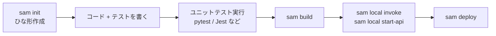

#### ユニットテストの考え方

ユニットテストは「**AWS に接続せずに**、自分のコードのロジックだけを検証する」テストです。

| 手法 | 内容 |
|---|---|
| **ハンドラーとビジネスロジックの分離** | `handler` は薄くし、本体の処理を別関数に切り出す → 単体でテストしやすい |
| **モック / スタブ** | AWS への呼び出しを偽物に差し替える（Python: `unittest.mock`、`moto`、`botocore.stub.Stubber` / JavaScript: `aws-sdk-client-mock` など） |
| **テスト用イベント** | 本物のイベント形式の JSON（`sam local generate-event` で生成）を入力にする |
| **依存性の注入** | クライアントを引数や初期化処理で渡し、テスト時に差し替えられるようにする |

```python
# app.py: ロジックを関数に分離
def calc_total(items):
    return sum(i["price"] * i["qty"] for i in items)

def handler(event, context):
    return {"statusCode": 200, "body": str(calc_total(event["items"]))}
```

```python
# test_app.py: AWS に接続せずにテスト
from app import calc_total

def test_calc_total():
    items = [{"price": 100, "qty": 2}, {"price": 50, "qty": 1}]
    assert calc_total(items) == 250
```

#### テストの階層

| 種類 | 範囲 | 速度 | AWS 接続 |
|---|---|---|---|
| ユニットテスト | 関数 1 つ | 速い | なし（モック） |
| 結合テスト | 複数コンポーネント | 中 | 実際の AWS（または `sam local`） |
| E2E テスト | システム全体 | 遅い | 実環境 |

### ベストプラクティス

- ビジネスロジックを**ハンドラーから分離**して、ユニットテストしやすくする
- テストは**高速で、ネットワークなしで動く**状態に保つ（外部呼び出しはモック）
- 本物のイベント構造は `sam local generate-event` で作り、**テストデータをリポジトリで管理**する
- 開発サイクルを短くするため `sam sync --watch` を活用し、本番相当の確認は結合テストで行う

### 試験での狙われ方

- 「デプロイ前に Lambda をローカルで動かして確認したい」→ **`sam local invoke`**
- 「API Gateway + Lambda をローカルでテスト」→ **`sam local start-api`**
- 「S3 イベントのテスト入力が欲しい」→ **`sam local generate-event`**
- 「AWS に接続せずテストしたい」→ **モック / スタブ**

---

## Skill 1.1.8 メッセージングサービス

> 公式のスキル文: メッセージングサービスを使うコードを書く

### ひとことで言うと

**Amazon SQS（キュー）** と **Amazon SNS（通知・Pub/Sub）** を、コードから正しく使うスキルです。

### 詳しい説明

#### SQS と SNS の根本的な違い

| 観点 | Amazon SQS | Amazon SNS |
|---|---|---|
| モデル | キュー（**Pull**: コンシューマーが取りに行く） | トピック（**Push**: 購読者へ配信する） |
| 宛先 | 1 つのキューを複数のコンシューマーで分担（1 メッセージは 1 コンシューマーが処理） | 1 つのメッセージを**全購読者**に配信 |
| 保持 | メッセージを保持（既定 4 日、最大 14 日） | 保持しない（配信を試みる） |
| 使いどころ | バッファリング、負荷平準化、非同期処理 | 通知、ファンアウト |

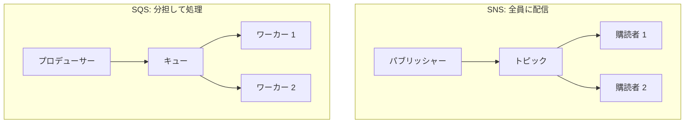

#### SQS の重要設定

| 設定 | 内容 | 既定値・範囲 |
|---|---|---|
| **可視性タイムアウト** | メッセージを受信すると他のコンシューマーから**見えなくなる**時間。処理が終わったら**削除**する。時間内に削除しないと再び見える | 既定 30 秒（0 秒〜12 時間） |
| **ロングポーリング** | 空振りのレスポンスを減らし、コストと遅延を削減（`WaitTimeSeconds`） | 最大 20 秒 |
| **メッセージ保持期間** | キューにメッセージを残す期間 | 既定 4 日（1 分〜14 日） |
| **遅延キュー / メッセージタイマー** | 配信を遅らせる | 0〜15 分（900 秒） |
| **デッドレターキュー（DLQ）** | `maxReceiveCount` 回受信されても削除されなかったメッセージの退避先 | — |
| **最大メッセージサイズ** | 1 メッセージの本文の最大 | **1 MiB**（2025 年 8 月に 256 KiB から拡大） |

> 受信してから削除するまでの流れ: **受信 → 処理 → 削除**。処理に失敗して削除しなければ、可視性タイムアウト後に**再配信**されます。このため SQS は「**少なくとも 1 回（at-least-once）**」配信であり、**冪等な処理**が必須です。

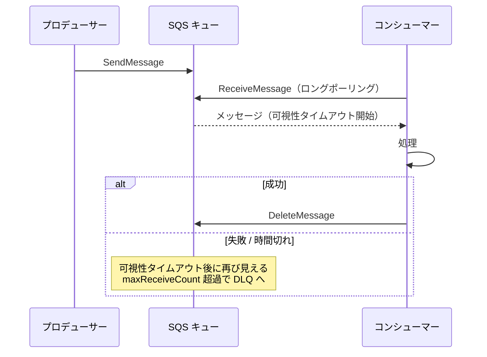

#### Standard キューと FIFO キュー

| 観点 | Standard | FIFO |
|---|---|---|
| 順序 | **ベストエフォート**（順不同あり） | **厳密な順序**（メッセージグループ単位） |
| 配信 | 少なくとも 1 回（重複あり得る） | **正確に 1 回の処理**（重複排除あり） |
| スループット | ほぼ無制限 | 制限あり（高スループットモードで拡大） |
| キュー名 | 任意 | **`.fifo` で終わる** |
| 主要パラメータ | — | `MessageGroupId`（必須）、`MessageDeduplicationId`（重複排除。コンテンツベースの重複排除も可） |
| 向く場面 | 順序が重要でない大量処理 | 順序が重要（注文の処理順、金融取引） |

FIFO の `MessageGroupId` は、**同じグループ内は順序を保ち、異なるグループは並列に処理**されるための仕組みです。重複排除は **5 分間**の重複送信に対して効きます。

#### SQS のコード例（Python）

```python
import json, boto3
sqs = boto3.client("sqs")
QUEUE_URL = "https://sqs.ap-northeast-1.amazonaws.com/123456789012/orders"

# 送信
sqs.send_message(QueueUrl=QUEUE_URL, MessageBody=json.dumps({"orderId": "A001"}))

# 受信（ロングポーリング、最大 10 件）
res = sqs.receive_message(
    QueueUrl=QUEUE_URL,
    MaxNumberOfMessages=10,
    WaitTimeSeconds=20,       # ロングポーリング
)
for m in res.get("Messages", []):
    # ...処理...
    sqs.delete_message(QueueUrl=QUEUE_URL, ReceiptHandle=m["ReceiptHandle"])  # 処理後に削除
```

- 送信・削除は**バッチ API**（`SendMessageBatch` / `DeleteMessageBatch`、最大 10 件）でまとめるとコストと遅延を抑えられます。

#### SNS の重要機能

| 機能 | 内容 |
|---|---|
| 購読プロトコル | SQS、Lambda、HTTP/HTTPS、Email、SMS、モバイルプッシュ、Amazon Data Firehose など |
| **メッセージフィルタリング** | 購読ごとに**フィルターポリシー**を設定し、条件に合うメッセージだけ受け取る（送信側でメッセージ属性を付与） |
| **FIFO トピック** | 順序保証付きの Pub/Sub（購読先は SQS FIFO など） |
| **配信ポリシーと DLQ** | 配信失敗時のリトライと、購読ごとの DLQ |

> **SNS + SQS ファンアウト**では、SNS から SQS キューへ配信するために、キューの**アクセスポリシー**で SNS トピックからの送信を許可する必要があります。

#### Amazon MQ との使い分け

既存システムが **JMS・AMQP・MQTT・STOMP** などの標準プロトコルを使っていて、**コードを変えずに移行したい**場合は Amazon MQ（ActiveMQ / RabbitMQ のマネージドサービス）を選びます。新規に作る場合は SQS / SNS が第一候補です。

### ベストプラクティス

- 受信したら、**処理が成功した後に削除**する。**可視性タイムアウト ≥ 処理時間**にする（Lambda と連携する場合は関数タイムアウトの 6 倍以上が推奨）
- **ロングポーリング**を使う（コスト削減）。**DLQ** を必ず設定し、`maxReceiveCount` を決める
- 冪等な処理を前提にする（Standard は重複あり）
- 順序が必要なときだけ FIFO を選ぶ。**`MessageGroupId` の設計でスループットを確保**する
- 大量送信は**バッチ API**を使う

### 試験での狙われ方

- 「処理中のメッセージが別のワーカーに重複して処理された」→ **可視性タイムアウトが短い**
- 「何度も失敗するメッセージが詰まる」→ **DLQ**
- 「順序を保証し、重複を排除したい」→ **FIFO + `MessageGroupId` / `MessageDeduplicationId`**
- 「空の応答が多くコストが高い」→ **ロングポーリング**
- 「1 つのメッセージを購読ごとに条件で振り分けたい」→ **SNS のフィルターポリシー**

---

## Skill 1.1.9 API・SDK で AWS サービスを操作する

> 公式のスキル文: API と AWS SDK を使って AWS サービスとやり取りするコードを書く

### ひとことで言うと

AWS のすべてのサービスは **API** として公開されており、**SDK**（各言語のライブラリ）や **CLI** を通じて操作します。**認証情報の扱い**・**ページネーション**・**再試行**の 3 点が試験の要です。

### 詳しい説明

#### 呼び出し手段の関係

| 手段 | 内容 |
|---|---|
| **AWS API（HTTPS）** | 本体。リクエストには **Signature Version 4（SigV4）の署名**が必要 |
| **AWS SDK** | 署名・再試行・ページネーションなどを肩代わりしてくれる言語別ライブラリ（Python: boto3、JavaScript: AWS SDK for JavaScript v3、Java、.NET、Go など） |
| **AWS CLI** | コマンドラインから API を呼ぶツール（内部は SDK ベース） |

> 自分で署名を実装することは通常ありません。**SDK を使えば SigV4 署名は自動**で行われます。

#### 認証情報プロバイダーチェーン

SDK は、認証情報を**決まった順序で自動的に探します**。コードに**アクセスキーを書き込まない**のが大原則です。

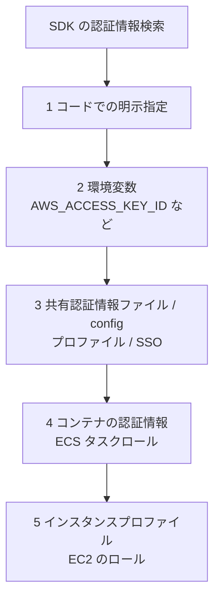

（正確な順序は SDK の言語によって多少異なります。**考え方は「明示指定 → 環境変数 → 設定ファイル → コンテナ / インスタンスのロール」**と覚えます。）

| 実行場所 | 使うべき認証情報 |
|---|---|
| Lambda | **実行ロール**（SDK が自動で取得。コードに書かない） |
| EC2 | **インスタンスプロファイル（IAM ロール）** |
| ECS / EKS | タスクロール / IRSA など |
| ローカル開発 | **IAM Identity Center（SSO）のプロファイル**など、一時認証情報 |

#### リージョンの指定

リージョンは **コード・環境変数（`AWS_REGION` / `AWS_DEFAULT_REGION`）・設定ファイル**で指定します。Lambda では `AWS_REGION` が自動で設定されます。

#### ページネーション

一覧取得 API は、結果が多いと**一度に全部を返さず**、続きを取得するためのトークンを返します。

| サービス | トークン |
|---|---|
| 多くの API | `NextToken` / `NextMarker` / `ContinuationToken`（S3 の ListObjectsV2） |
| DynamoDB の Query / Scan | `LastEvaluatedKey`（次回 `ExclusiveStartKey` に渡す） |

SDK の**ページネーター（paginator）**を使えば、続きの取得を自動化できます。

```python
s3 = boto3.client("s3")
paginator = s3.get_paginator("list_objects_v2")
for page in paginator.paginate(Bucket="my-bucket", Prefix="logs/"):
    for obj in page.get("Contents", []):
        print(obj["Key"])
```

> **1 回の応答だけを見て「全部取れた」と思い込む**のは典型的なバグです。

#### その他の押さえどころ

| トピック | 内容 |
|---|---|
| **クライアントの再利用** | クライアントの生成は重い。Lambda では**ハンドラーの外（初期化フェーズ）で作り、再利用**する |
| **ウェイター** | 状態が変わるまで待つ仕組み（例: テーブルが ACTIVE になるまで） |
| **S3 マルチパートアップロード** | 大きなファイルを分割して並列アップロード。**100 MB 以上で推奨、5 GB 超は必須**（最大オブジェクトは 5 TB） |
| **署名付き URL（Presigned URL）** | 認証情報を渡さずに、**期限付き**で S3 オブジェクトのアップロード / ダウンロードを許可 |
| **AWS CLI の `--query`** | JMESPath で出力を絞り込む。`--output` で形式変更。`--profile` で認証情報を切り替え |
| **CLI のページネーション** | 既定で自動的に全ページ取得。`--max-items` / `--page-size` で制御 |

署名付き URL の例です。

```python
url = boto3.client("s3").generate_presigned_url(
    "get_object",
    Params={"Bucket": "my-bucket", "Key": "report.pdf"},
    ExpiresIn=900,   # 15 分間だけ有効
)
```

> 署名付き URL は、**URL を作った人（ロール）の権限**で動作します。一時的な認証情報（ロール）で作った URL は、**その認証情報の有効期限が切れると使えなくなります**。

### ベストプラクティス

- コードに**アクセスキーを書かない**。**IAM ロール**（Lambda の実行ロール等）と**一時認証情報**を使う
- **最小権限**の IAM ポリシーを付与する
- **ページネーター**でページングを確実に処理する
- クライアントは**使い回す**（Lambda ならハンドラーの外で初期化）
- 再試行・タイムアウトは SDK の設定で調整する（Skill 1.1.5）
- 大きなファイルは**マルチパート**、ユーザーに直接アップロードさせたいなら**署名付き URL**

### 試験での狙われ方

- 「EC2 / Lambda 上のアプリがアクセスキーなしで S3 にアクセスしたい」→ **IAM ロール**
- 「一覧 API の結果が途中で切れる」→ **ページネーション（NextToken / ページネーター）**
- 「ユーザーが直接 S3 にアップロードしたい」→ **署名付き URL**
- 「大きなファイルのアップロードが失敗する」→ **マルチパートアップロード**

---

## Skill 1.1.10 ストリーミングデータ

> 公式のスキル文: AWS サービスを使ってストリーミングデータを扱う

### ひとことで言うと

終わりなく流れ続けるデータ（ログ、クリックストリーム、IoT センサー値など）を、**順序を保ちつつ**取り込み・処理・配信するスキルです。中心は **Amazon Kinesis** です。

### 詳しい説明

#### Kinesis ファミリーの役割

| サービス | 役割 | コンシューマーのコード |
|---|---|---|
| **Kinesis Data Streams** | ストリームを**保持**し、複数のコンシューマーが読み取れる。順序・再読み取りが可能 | 自分で書く（Lambda、KCL など） |
| **Amazon Data Firehose** | ストリームを**ほぼリアルタイムで宛先へ配信**する（S3、Redshift、OpenSearch Service、HTTP エンドポイントなど）。バッファリングあり | 不要（設定のみ。変換は Lambda で可能） |
| Managed Service for Apache Flink | ストリームに対する SQL / Flink による分析 | — |

#### Kinesis Data Streams の基本概念

| 用語 | 内容 |
|---|---|
| **シャード（Shard）** | ストリームの処理単位。**シャード数で容量が決まる** |
| **レコード** | データ本体 + **パーティションキー** + シーケンス番号 |
| **パーティションキー** | キーのハッシュ値で、レコードが入る**シャードが決まる**。**同じキー = 同じシャード = 順序が保たれる** |
| **保持期間** | 既定 24 時間（最大 365 日まで延長可能） |
| **キャパシティモード** | **オンデマンド**（自動スケール）と**プロビジョニング済み**（シャード数を自分で指定） |

シャード 1 本あたりの目安は、**書き込み: 1 MB/秒または 1,000 レコード/秒**、**読み取り: 2 MB/秒（共有）**です。

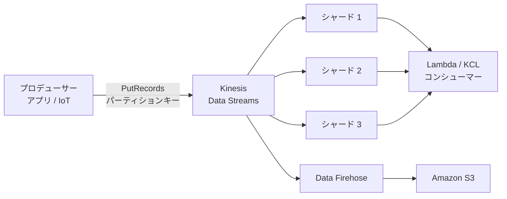

#### 読み取り方式

| 方式 | 内容 |
|---|---|
| **共有スループット** | シャードあたり 2 MB/秒を、**すべてのコンシューマーで分け合う** |
| **拡張ファンアウト（Enhanced Fan-Out）** | **コンシューマーごとに専用で 2 MB/秒/シャード**。プッシュ型（HTTP/2）で低レイテンシー。コンシューマーが複数あるときに使う |

#### よくあるエラーと対処

| エラー | 原因 | 対処 |
|---|---|---|
| `ProvisionedThroughputExceededException` | シャードの書き込み / 読み取り容量を超過。**ホットシャード**（特定のキーに偏る）が典型 | パーティションキーを**分散**させる、シャードを増やす（分割）、**指数バックオフで再試行**、オンデマンドモード、拡張ファンアウト |
| 一部のレコードだけ失敗 | `PutRecords` はバッチ内で**部分的に失敗し得る**（応答に `FailedRecordCount`） | **失敗したレコードだけ**を再送する |

#### Lambda で Kinesis を処理する

Lambda は**イベントソースマッピング**でシャードをポーリングします（詳細は Skill 1.2.7）。主な設定は次のとおりです。

| 設定 | 内容 |
|---|---|
| バッチサイズ / バッチウィンドウ | 一度に渡すレコード数 / 溜める最大時間 |
| 並列化係数（Parallelization Factor） | **1 シャードあたり最大 10 の並列実行**（同じパーティションキーの順序は保たれる） |
| 開始位置 | `LATEST` / `TRIM_HORIZON`（最古から）/ `AT_TIMESTAMP` |
| エラー処理 | `BisectBatchOnFunctionError`、`MaximumRetryAttempts`、`MaximumRecordAgeInSeconds`、失敗時の送信先（Skill 1.2.3） |

#### Kinesis・SQS・Firehose の使い分け

| 要件 | 選ぶサービス |
|---|---|
| **順序**が必要・**同じデータを複数のコンシューマーが読む**・**再読み取り**したい | Kinesis Data Streams |
| 1 件ずつ処理して**削除**、ワーカーで**分担**、シンプルに非同期化したい | SQS |
| コードなしで S3 などに**ほぼリアルタイムで配信**したい | Amazon Data Firehose |
| Kafka との互換性が必要 | Amazon MSK |

### ベストプラクティス

- パーティションキーは**カーディナリティが高く、均等に分散**するものを選ぶ（Skill 1.3.1 と同じ考え方）
- 書き込みは **`PutRecords`（バッチ）**を使い、**失敗したレコードのみ**再送する
- 複数のコンシューマーには**拡張ファンアウト**を使う
- コンシューマーは**冪等**に作る（再読み取り・再試行で重複する可能性がある）

### 試験での狙われ方

- 「`ProvisionedThroughputExceededException` が出る」→ **ホットシャード対策（キー分散）+ バックオフ + シャード増**
- 「同じ順序で複数アプリが同じデータを読みたい」→ **Kinesis Data Streams（+ 拡張ファンアウト）**
- 「ストリームを S3 にコードなしで保存したい」→ **Amazon Data Firehose**

---

## Skill 1.1.11 Amazon Q Developer

> 公式のスキル文: Amazon Q Developer を使って開発を支援する

### ひとことで言うと

**生成 AI の開発アシスタント**を使って、コードの作成・説明・テスト・レビュー・AWS の質問への回答を効率化するスキルです。

### 詳しい説明

#### 主な機能

| 機能 | 内容 |
|---|---|
| **インラインコード補完** | エディタで入力中に、コードの続きを提案 |
| **チャット** | コードや AWS について自然言語で質問・説明・デバッグ支援 |
| **エージェント的なコーディング** | 実装計画の作成、複数ファイルの変更、シェルコマンドの提案など（従来は `/dev` と呼ばれていた機能） |
| **ユニットテスト生成** | 既存コードに対するテストの自動生成（従来 `/test`） |
| **コードレビュー / セキュリティスキャン** | 脆弱性やコード品質の問題を検出し、修正案を提示（従来 `/review`） |
| **コード変換** | Java のバージョンアップや .NET の移植（有料プランの機能） |
| **AWS コンソール内の Amazon Q Developer** | AWS の使い方、エラーの切り分け、リソースの質問への回答 |

#### 最新状況の注意（2026 年 10 月時点）

AWS は **Amazon Q Developer の IDE プラグインと有料サブスクリプションを 2027 年 4 月 30 日にサポート終了**とし、後継として **Kiro**（仕様駆動型のエージェント開発環境）への移行を案内しています。一方、**AWS マネジメントコンソール内の Amazon Q Developer や、Slack / Microsoft Teams 連携などは、この終了の対象外**と案内されています。

| 項目 | 状況 |
|---|---|
| IDE プラグイン・有料サブスクリプション | 2027 年 4 月 30 日にサポート終了 |
| 後継 | Kiro（仕様駆動開発、エージェント、MCP 対応） |
| コンソール内の Amazon Q Developer | 継続（終了の対象外） |
| DVA-C02 の試験ガイド | **Skill 1.1.11 として Amazon Q Developer が記載されている**ため、試験対策としては機能の理解が必要 |

> 試験は公式の試験ガイドに沿って出題されます。**ガイドに載っている Amazon Q Developer の機能（補完・チャット・テスト生成・レビュー・セキュリティスキャンなど）の理解**を優先し、実務で新規に導入する場合は最新の公式案内（Kiro を含む）を確認してください。

#### AI 支援開発の「新興トピック」への備え

試験ガイドの「Emerging topics」では、スコアに影響しない問題として、次のような内容が出る可能性があると記載されています。

- AI 支援ツールで、コードの生成・レビュー・最適化・リファクタリング・セキュリティスキャンを行う
- AI サービスを組み込む際の**セキュリティリスク**の特定と軽減（データプライバシー、アクセス管理、モデルの入出力の制御、**ログに機密情報を出さない**など）
- AI ツールによるテスト生成、CI/CD の支援、エラー分析、最適化の提案

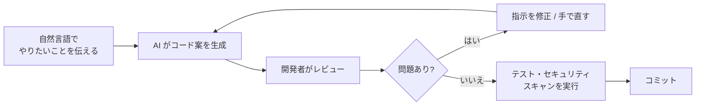

### ベストプラクティス

- **生成されたコードは必ず人間がレビュー**し、テストとセキュリティスキャンを通してから採用する
- プロンプトや共有するコードに**認証情報・個人情報・機密データを含めない**
- 生成コードの **IAM 権限は最小権限**になっているか確認する（ワイルドカード `*` の権限を鵜呑みにしない）
- 生成 AI は**補助**であり、責任は開発者にある

### 試験での狙われ方

- 「既存関数のユニットテストを素早く作りたい」→ **Amazon Q Developer のテスト生成**
- 「コードの脆弱性をコミット前に検出したい」→ **セキュリティスキャン / コードレビュー機能**
- 「AWS サービスの使い方をコード上で質問したい」→ **IDE のチャット**

---

## Skill 1.1.12 Amazon EventBridge

> 公式のスキル文: Amazon EventBridge を使ってイベント駆動パターンを実装する

### ひとことで言うと

**イベントを受け取り、ルールで振り分け、ターゲットへ届ける**サーバーレスのイベントバスです。疎結合なイベント駆動アーキテクチャの中心になります。

### 詳しい説明

#### 基本の仕組み

| 要素 | 内容 |
|---|---|
| **イベントバス** | イベントの受け皿。**デフォルトバス**（AWS サービスのイベントが流れる）、**カスタムバス**（自分のアプリ用）、**パートナーバス**（SaaS 連携） |
| **イベント** | JSON 形式。`source`、`detail-type`、`detail` などを持つ |
| **ルール** | **イベントパターン**に合致したイベントを**ターゲット**へ送る（または**スケジュール**で起動） |
| **ターゲット** | Lambda、SQS、SNS、Step Functions、Kinesis、API 送信先（HTTP）など。**1 つのルールに複数のターゲット**を設定可能 |

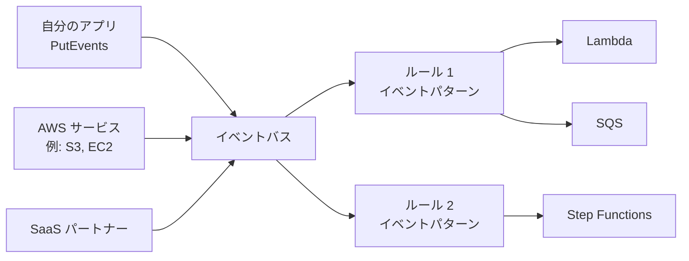

イベントの構造（例）です。

```json
{
  "version": "0",
  "id": "abc-123",
  "detail-type": "OrderPlaced",
  "source": "com.example.orders",
  "account": "123456789012",
  "time": "2026-10-04T01:00:00Z",
  "region": "ap-northeast-1",
  "detail": { "orderId": "A001", "amount": 5000, "status": "NEW" }
}
```

自分のアプリからイベントを発行する SDK の例です。

```python
events = boto3.client("events")
events.put_events(Entries=[{
    "EventBusName": "orders-bus",
    "Source": "com.example.orders",
    "DetailType": "OrderPlaced",
    "Detail": json.dumps({"orderId": "A001", "amount": 5000}),
}])
```

#### イベントパターン（フィルタリング）

ルールの**イベントパターン**で、必要なイベントだけを選びます。

```json
{
  "source": ["com.example.orders"],
  "detail-type": ["OrderPlaced"],
  "detail": {
    "amount": [{ "numeric": [">=", 1000] }],
    "status": [{ "anything-but": "CANCELLED" }]
  }
}
```

| 比較の種類 | 例 |
|---|---|
| 完全一致 | `"status": ["NEW"]` |
| プレフィックス / サフィックス | `{ "prefix": "order-" }` |
| 数値 | `{ "numeric": [">", 100] }` |
| 存在チェック | `{ "exists": true }` |
| 除外 | `{ "anything-but": [...] }` |

#### 主な機能

| 機能 | 内容 |
|---|---|
| **EventBridge Scheduler** | **cron / rate / 1 回限り**のスケジュール実行。タイムゾーン指定や、時間のばらつき（フレキシブルタイムウィンドウ）に対応。大量のスケジュールにも向く（現在、スケジュール実行の推奨手段） |
| **EventBridge Pipes** | **ソース → フィルター → エンリッチメント → ターゲット**を、コードなしでつなぐ（ソース例: SQS、Kinesis、DynamoDB Streams） |
| **入力トランスフォーマー** | ターゲットに渡す前にイベントの形を変換 |
| **アーカイブとリプレイ** | イベントを保存して、あとから**再生**（障害復旧、テスト） |
| **スキーマレジストリ** | イベントのスキーマを検出・管理し、コードバインディングを生成 |
| **API 送信先（API destinations）** | 外部の HTTP API（SaaS など）をターゲットにする。認証情報は接続で管理し、**レート制限**も設定できる |
| **クロスアカウント / クロスリージョン** | 別アカウント・別リージョンのバスにイベントを転送 |
| **DLQ と再試行ポリシー** | ターゲットへの配信に失敗したイベントを **SQS の DLQ** に退避。再試行は既定で**最大 24 時間 / 185 回**まで試みる |

#### EventBridge・SNS・SQS の使い分け

| 観点 | EventBridge | SNS | SQS |
|---|---|---|---|
| 主な役割 | **ルールで振り分け**るイベントバス | シンプルな**Pub/Sub 配信** | **バッファ**付きキュー |
| ルーティング | 本文（`detail`）の内容まで細かく | メッセージ属性中心のフィルター | なし（キューに入るだけ） |
| スループット | 高い | **非常に高い** | 非常に高い |
| 外部 SaaS 連携 | **パートナーイベントソース / API 送信先** | 限定的 | なし |
| 保持・再処理 | アーカイブ / リプレイ | なし | 保持期間と DLQ |

### ベストプラクティス

- **イベントのスキーマ**（`source` / `detail-type` / `detail`）を設計・管理し、**後方互換**で進化させる
- すべてのターゲットに **DLQ と再試行ポリシー**を設定する
- ターゲットは**冪等**に作る（配信は少なくとも 1 回）
- スケジュール実行は **EventBridge Scheduler** を使う
- 順序や**バッファ**が必要な処理は、EventBridge → **SQS** → Lambda の構成にする

### 試験での狙われ方

- 「S3 / EC2 などの AWS 側のイベントで処理を起動したい」→ **EventBridge のルール**
- 「毎日 9 時に Lambda を実行」→ **EventBridge Scheduler（または cron のルール）**
- 「コードなしで SQS → 絞り込み → Step Functions とつなぎたい」→ **EventBridge Pipes**
- 「過去のイベントをもう一度流したい」→ **アーカイブとリプレイ**

---

## Skill 1.1.13 サードパーティ連携のレジリエンス

> 公式のスキル文: サードパーティのサービスとの統合に対して、レジリエンスのあるアプリケーションコードを実装する（例: リトライロジック、サーキットブレーカー、エラー処理パターン）

### ひとことで言うと

**自分たちが制御できない外部 API**（決済・メール・SaaS など）が遅い・落ちる・制限をかけてくる前提で、自分のアプリを守るコードを書くスキルです。Skill 1.1.5 の応用編です。

### 詳しい説明

#### 代表的なパターン

| パターン | 内容 | 防げる問題 |
|---|---|---|
| **リトライ + 指数バックオフ + ジッター** | 一時的な失敗のみ、間隔を広げながら再試行 | 一時的な障害、スロットリング |
| **タイムアウト** | 接続・応答に上限を設ける | 外部が応答せず、自分のスレッド / Lambda が固まる |
| **サーキットブレーカー** | 失敗が続いたら一定時間**呼び出し自体を止める** | 落ちている相手に呼び続けて**自分のリソースを消耗**する、障害の連鎖 |
| **フォールバック** | 代替の結果（キャッシュ、既定値、別ベンダー）を返す | 外部障害時のユーザー体験の悪化 |
| **バルクヘッド（隔離）** | 呼び出し元ごとにリソースを分け、1 つの遅延が全体を巻き込まないようにする | 1 つの依存先の遅延による全体の停止 |
| **冪等性キー** | 再送しても二重実行されない | リトライによる二重課金 |
| **レート制限の尊重** | `429` と **`Retry-After`** ヘッダーに従う | 相手からのブロック |
| **DLQ / 非同期化** | 失敗した要求を退避して後で再処理 | データ欠損 |

#### サーキットブレーカーの 3 つの状態

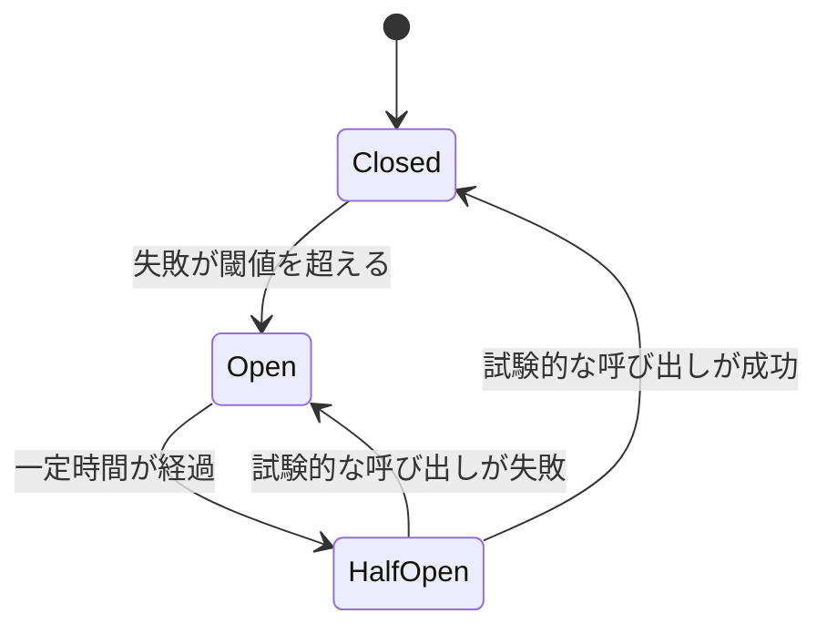

| 状態 | 動作 |
|---|---|
| **Closed（閉）** | 通常どおり呼び出す。失敗回数を数える |
| **Open（開）** | 呼び出さず**すぐにエラー / フォールバック**を返す（相手を休ませる） |
| **Half-Open（半開）** | 少数の試験的な呼び出しで回復を確認する。成功なら Closed、失敗なら Open |

> Lambda は実行環境が使い捨てになり得るため、サーキットブレーカーの**状態は外部**（DynamoDB や ElastiCache など）で共有する設計が必要になる場合があります。

#### AWS サービスで実現する

| やりたいこと | 方法 |
|---|---|
| ステップごとの再試行・フォールバック | **Step Functions の `Retry`（`IntervalSeconds` / `MaxAttempts` / `BackoffRate` / `JitterStrategy`）と `Catch`** |
| 外部 API 呼び出しのレート制御 | **EventBridge API destinations**（呼び出し頻度の上限、失敗時の再試行、DLQ） |
| 外部呼び出しを非同期化して保護 | **SQS で受けて**、Lambda の同時実行数（最大同時実行数）で呼び出し量を絞る |
| 資格情報の管理 | **AWS Secrets Manager**（外部 API キーをコードや環境変数に直書きしない） |
| 失敗の可視化 | **CloudWatch の指標 / アラーム**、**構造化ログ**、X-Ray でのトレース |

Step Functions での再試行の定義例です。

```json
"CallPaymentApi": {
  "Type": "Task",
  "Resource": "arn:aws:states:::lambda:invoke",
  "Retry": [{
    "ErrorEquals": ["States.TaskFailed", "Lambda.ServiceException"],
    "IntervalSeconds": 2,
    "MaxAttempts": 4,
    "BackoffRate": 2.0,
    "JitterStrategy": "FULL"
  }],
  "Catch": [{
    "ErrorEquals": ["States.ALL"],
    "Next": "NotifyAndCompensate"
  }],
  "End": true
}
```

### ベストプラクティス

- **すべての外部呼び出しにタイムアウト**を設定する（Lambda のタイムアウトより短くする）
- **再試行は一時的なエラーに限定**し、上限と指数バックオフ + ジッターを付ける
- 外部が長く不調な場合は**サーキットブレーカー**で自分を守り、**フォールバック**を用意する
- 書き込み系の外部 API には**冪等性キー**を付ける
- 外部の API キーは **Secrets Manager** で管理し、ローテーションを検討する
- 外部とのやり取りは**ログ・指標・アラーム**で観測できるようにする

### 試験での狙われ方

- 「外部 API が落ちている間、自分のシステムまで遅くなる」→ **サーキットブレーカー + タイムアウト + フォールバック**
- 「外部の SaaS に呼び出し頻度の上限がある」→ **SQS + 同時実行数の制限 / EventBridge API destinations**
- 「ワークフローの特定のステップだけ再試行したい」→ **Step Functions の `Retry` / `Catch`**

---

# Task 2: AWS Lambda のコードを開発する

## Skill 1.2.1 VPC 内プライベートリソースへのアクセス

> 公式のスキル文: Lambda コードから VPC 内のプライベートリソースにアクセスする方法を説明する

### ひとことで言うと

Lambda から **VPC のプライベートサブネット内のリソース**（RDS、ElastiCache など）へ接続するための設定を理解するスキルです。

### 詳しい説明

#### 既定の状態と VPC 接続

| 状態 | インターネット | VPC 内のプライベートリソース |
|---|---|---|
| **既定（VPC 設定なし）** | 利用可能（AWS 管理の VPC で動作） | **アクセス不可** |
| **VPC 設定あり** | **既定では不可**（自分の VPC のルーティング次第） | アクセス可能 |

VPC に接続するには、関数に**サブネット**と**セキュリティグループ**を指定します。Lambda はそのサブネットに **ENI（Elastic Network Interface）**（Hyperplane ENI）を作り、VPC 内のリソースと通信します。

#### 必要な設定

| 項目 | 内容 |
|---|---|
| サブネット | **複数の AZ のプライベートサブネットを指定**（可用性のため） |
| セキュリティグループ | Lambda 用の SG を作り、**接続先 SG のインバウンドで Lambda の SG を許可**（例: RDS の 3306 / 5432 / ElastiCache の 6379） |
| 実行ロールの権限 | ENI の作成・削除に必要な権限（**`AWSLambdaVPCAccessExecutionRole`** マネージドポリシー） |

#### VPC 接続した Lambda から、インターネットや AWS サービスへ出るには

VPC 内の Lambda は、**パブリックサブネットに置いてもインターネットに出られません**（パブリック IP が付かないため）。次のいずれかが必要です。

| 到達したい先 | 方法 |
|---|---|
| **インターネットの外部 API** | **プライベートサブネット → NAT ゲートウェイ（パブリックサブネットに配置）→ インターネットゲートウェイ** |
| **S3 / DynamoDB** | **ゲートウェイ型 VPC エンドポイント**（無料）。NAT 不要 |
| **その他の AWS サービス**（SQS、Secrets Manager、KMS など） | **インターフェース型 VPC エンドポイント（AWS PrivateLink）**、または NAT |

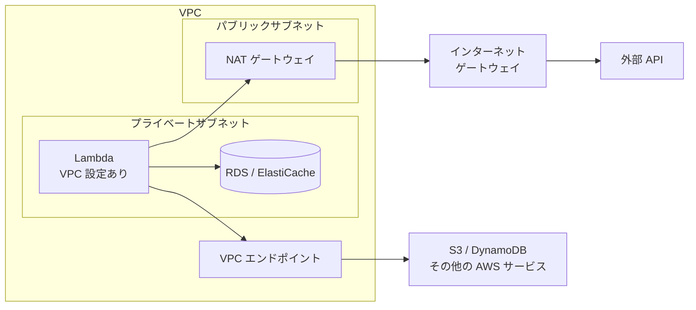

#### RDS への接続の注意（RDS Proxy）

Lambda は**同時実行数に応じて**多数の接続を DB に張ります。DB の接続数が枯渇しやすいため、**Amazon RDS Proxy** で接続をプールして共有するのが定番の対策です。接続処理は**ハンドラーの外**で行い、再利用します。

### ベストプラクティス

- VPC に接続するのは、**VPC 内のリソースに本当に必要なときだけ**にする（不要なら接続しない）
- **複数 AZ のサブネット**を指定する
- S3 / DynamoDB は**ゲートウェイエンドポイント**を使い、NAT のコストと経路を減らす
- RDS には **RDS Proxy** を使い、接続数を保護する
- SG は**最小限**（必要な送信・受信だけ）にする

### 試験での狙われ方

- 「Lambda から RDS（プライベートサブネット）に接続したい」→ **関数に VPC 設定（サブネット + SG）。DB の SG で Lambda の SG を許可**
- 「VPC 設定した Lambda が外部 API / S3 に届かなくなった」→ **NAT ゲートウェイ または VPC エンドポイント**
- 「Lambda の同時実行で DB の接続数が枯渇」→ **RDS Proxy**
- 「Lambda をパブリックサブネットに置いたらインターネットに出られる?」→ **出られない（NAT が必要）**

---

## Skill 1.2.2 Lambda の設定

> 公式のスキル文: 環境変数とパラメータを定義して Lambda 関数を設定する（メモリ、同時実行数、タイムアウト、ランタイム、ハンドラー、レイヤー、拡張機能、トリガー、送信先など）

### ひとことで言うと

Lambda の**設定項目の意味と、上限値・ふるまい**を覚えるスキルです。数値の暗記が得点に直結します。

### 詳しい説明

#### 主要な設定項目と上限

| 項目 | 内容 | 上限・既定 |
|---|---|---|
| **メモリ** | CPU もメモリに比例して割り当てられる | **128 MB〜10,240 MB** |
| **タイムアウト** | 1 回の実行の最大時間 | 既定 **3 秒**、最大 **900 秒（15 分）** |
| **ランタイム** | Python、Node.js、Java、.NET、Ruby、Go（OS 専用ランタイム）など。**カスタムランタイム**も可 | — |
| **ハンドラー** | 関数の入口（例: Python `app.handler` = `app.py` の `handler` 関数） | — |
| **環境変数** | 設定値を外部化 | **合計 4 KB** |
| **レイヤー** | 共通ライブラリを別パッケージにして共有 | **関数あたり最大 5 つ**。関数 + レイヤーの合計（展開後）**250 MB** |
| **/tmp（一時ストレージ）** | 一時的な作業領域 | **512 MB〜10,240 MB** |
| **デプロイパッケージ** | .zip（直接アップロード 50 MB、展開後 250 MB）または**コンテナイメージ（最大 10 GB）** | — |
| **同時実行（既定）** | リージョン内のアカウント全体で同時に動ける数 | 既定 **1,000**（引き上げ可能） |
| **アーキテクチャ** | `x86_64` または `arm64`（Graviton） | arm64 は価格性能比に優れることが多い |
| **呼び出しペイロード** | 同期の要求 / 応答 | **6 MB** |
| **非同期呼び出しのペイロード** | イベントのサイズ | **256 KB**（最新の上限は公式クォータで確認） |

> **メモリを増やすと CPU も増える**ため、CPU 負荷の高い処理は、メモリを上げると**実行時間が短くなって、料金が同程度か安くなる**ことがあります（Skill 1.2.6）。

#### 環境変数の扱い

| ポイント | 内容 |
|---|---|
| 用途 | テーブル名、ステージ名、ログレベルなど**環境ごとに変わる値** |
| 暗号化 | 保管時は **KMS で暗号化**。さらに保護したい場合は**暗号化ヘルパー**（転送中の暗号化）を使う |
| 機密情報 | パスワード・API キーは環境変数に**平文で置かず**、**Secrets Manager / Parameter Store（SecureString）**から取得する |
| 予約された変数 | `AWS_REGION`、`AWS_LAMBDA_FUNCTION_NAME` など Lambda が設定するもの。上書き不可のものがある |

#### 実行ライフサイクル

Lambda の実行は **Init → Invoke → Shutdown** の 3 フェーズです。

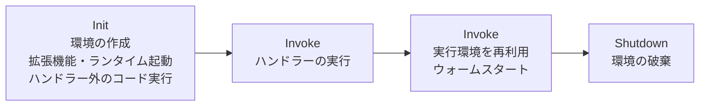

- **コールドスタート**: 新しい実行環境を作る（Init フェーズ）ため、初回は遅い
- **ウォームスタート**: 既存の実行環境を再利用する。**ハンドラーの外に書いたコード（SDK クライアント、DB 接続）は再利用される**

#### 同時実行の制御

| 機能 | 内容 | 費用 |
|---|---|---|
| **予約済み同時実行（Reserved Concurrency）** | その関数が使える同時実行数を**確保**し、同時に**上限**にもなる。他の関数に食われず、下流を過負荷から守れる | 追加料金なし |
| **プロビジョニング済み同時実行（Provisioned Concurrency）** | 実行環境を**事前に初期化しておく**ことで、**コールドスタートを抑える**。バージョン / エイリアスに設定 | 追加料金あり |
| **SnapStart** | 初期化済みの状態の**スナップショット**から高速に起動する。Java で提供され、Python・.NET にも対応 | 対応ランタイムで利用 |

> **「同時実行を制限して下流（DB や外部 API）を守りたい」→ 予約済み同時実行**、**「コールドスタートを避けたい」→ プロビジョニング済み同時実行 / SnapStart**。混同しやすい重要な区別です。

#### バージョンとエイリアス

| 機能 | 内容 |
|---|---|
| **バージョン** | 公開すると**不変のスナップショット**になる（`$LATEST` は可変） |
| **エイリアス** | バージョンを指す**名前付きポインタ**（`prod`、`dev`）。**加重エイリアス**で、トラフィックを 90 / 10 などに分けてカナリアリリース |

#### 拡張機能・トリガー・送信先

| 機能 | 内容 |
|---|---|
| **拡張機能（Extensions）** | 監視・セキュリティ・設定取得などのツールを、関数と**並行して動かす**仕組み（ロギング、メトリクス送信など） |
| **トリガー** | 関数を起動するもの。API Gateway、S3、SQS、SNS、EventBridge、Kinesis、DynamoDB Streams、ALB、**関数 URL** など |
| **送信先（Destinations）** | 非同期呼び出しの**成功 / 失敗の結果を別のサービスへ送る**（Skill 1.2.3） |

### ベストプラクティス

- **設定値は環境変数・Parameter Store・Secrets Manager で外部化**し、コードに埋め込まない
- 共通ライブラリは**レイヤー**に切り出して再利用する（ただし合計サイズと数の上限に注意）
- **バージョン + エイリアス**で安全にリリースし、**加重エイリアス**で段階的に切り替える
- 依存先を守るなら**予約済み同時実行**、遅延を避けたいなら**プロビジョニング済み同時実行 / SnapStart**
- **`arm64`** を検討する（性能当たりのコストが良いことが多い）

### 試験での狙われ方

- 「処理が 15 分を超える」→ **Lambda では不可。Step Functions / ECS / Batch へ**
- 「パッケージが大きすぎる」→ **レイヤー / コンテナイメージ（最大 10 GB）**
- 「DB を守るため Lambda の同時実行数に上限を付けたい」→ **予約済み同時実行**
- 「コールドスタートが遅い」→ **プロビジョニング済み同時実行 / SnapStart / 初期化処理の最適化**
- 「新バージョンを一部のユーザーだけに公開したい」→ **加重エイリアス**

---

## Skill 1.2.3 イベントライフサイクルとエラー処理

> 公式のスキル文: コードを使ってイベントのライフサイクルとエラーを処理する（Lambda Destinations、デッドレターキューなど）

### ひとことで言うと

Lambda は**呼び出し方によって、失敗したときの動きが違います**。「どの方式で呼ばれたか」を最初に見分け、その方式に合ったエラー処理を設定するスキルです。

### 詳しい説明

#### 3 つの呼び出し方式ごとのエラー処理

| 方式 | 失敗時の動き | 設定・対処 |
|---|---|---|
| **同期**（API Gateway など） | エラーを**呼び出し元に返す**。再試行は呼び出し元の責任 | クライアント側で再試行 |
| **非同期**（S3、SNS、EventBridge など） | Lambda が**自動で再試行**。最終的に失敗したら DLQ / 失敗時送信先へ | 最大再試行回数、イベントの最大有効期間、DLQ / Destinations |
| **イベントソースマッピング**（SQS、Kinesis、DynamoDB Streams） | **ソースの種類によって異なる**（下記） | 部分バッチ応答、ソースの DLQ、失敗時送信先など |

#### 非同期呼び出しの設定

| 設定 | 内容 | 範囲・既定 |
|---|---|---|
| **最大再試行回数** | 失敗後の再試行 | **0〜2 回（既定 2 回）** |
| **イベントの最大有効期間** | キューに残して再試行する最長時間 | 60 秒〜**6 時間（既定 6 時間）** |
| **DLQ（SQS または SNS）** | すべての再試行が失敗した**イベント**を退避（失敗のみ） | — |
| **Destinations（送信先）** | **成功時 / 失敗時**に、実行結果の情報を送る | **SQS、SNS、Lambda、EventBridge**（失敗時は S3 も可） |

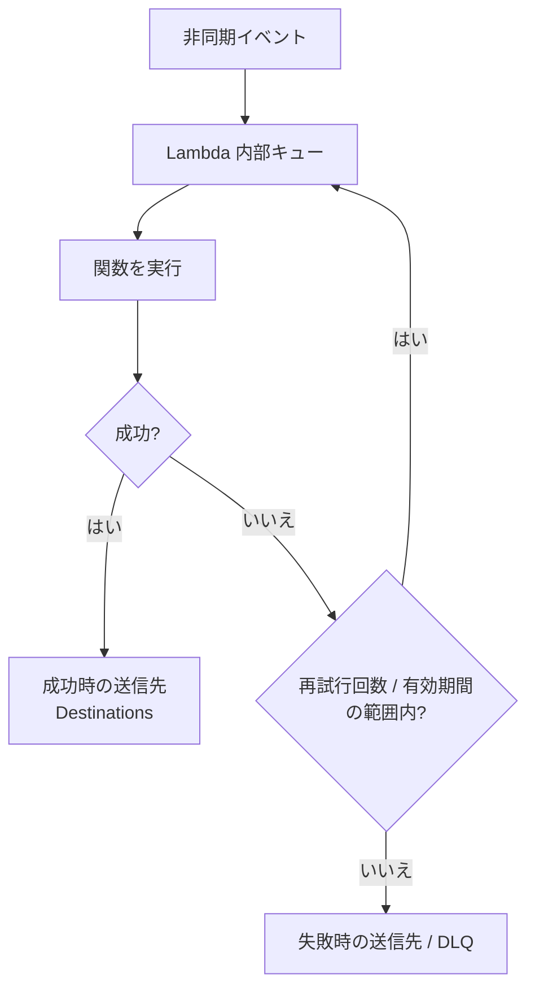

> **Destinations と DLQ の違い**: DLQ は「失敗した元のイベント」だけを送ります。**Destinations は成功 / 失敗の両方に対応し、実行結果の詳細（エラー情報、レスポンスなど）も送れます**。**新規には Destinations が推奨**されます。

#### イベントソースマッピング別の挙動

| ソース | 失敗時の挙動 | 対策 |
|---|---|---|
| **SQS（標準 / FIFO）** | バッチの**メッセージが可視性タイムアウト後にキューへ戻り**、再び処理される | **DLQ は SQS キュー側に設定**（`maxReceiveCount`）。**部分バッチ応答（`ReportBatchItemFailures`）**で失敗したメッセージだけ戻す |
| **Kinesis / DynamoDB Streams** | **成功するか、レコードが期限切れになるまで同じバッチを再試行**し、**そのシャードの処理が止まる**（Poison Pill 問題） | **最大再試行回数、レコードの最大経過時間、`BisectBatchOnFunctionError`（バッチを二分割）、失敗時送信先（SQS / SNS / S3）**、部分バッチ応答 |

SQS の部分バッチ応答の例です（失敗した ID だけを返す）。

```python
def handler(event, context):
    failures = []
    for r in event["Records"]:
        try:
            process(r["body"])
        except Exception:
            failures.append({"itemIdentifier": r["messageId"]})
    return {"batchItemFailures": failures}   # 失敗分のみ再処理される
```

> この設定を有効にしないと、バッチ内の 1 件が失敗しただけで、**成功した他のメッセージも再処理（重複処理）**されます。**冪等性**が必須である理由です。

#### コードでのエラー処理の基本

| 方針 | 内容 |
|---|---|
| **例外を投げる / 握りつぶさない** | 失敗を Lambda に伝えないと、再試行も DLQ も働かない |
| **想定内のエラーは捕捉** | 検証エラーなど、再試行しても無駄なものは捕捉して正常終了（またはエラーレスポンス）にする |
| **タイムアウトに備える** | `context.get_remaining_time_in_millis()` で残り時間を確認し、**途中状態を保存**して終了 |
| **構造化ログ** | リクエスト ID・相関 ID を付けて、CloudWatch Logs で追跡 |
| **冪等な処理** | 再試行・重複配信を前提にする |

### ベストプラクティス

- 呼び出し方式を**最初に確認**し、方式に合ったエラー処理を選ぶ
- 非同期では **Destinations（または DLQ）を必ず設定**する。**失敗を黙って失わない**
- SQS ソースでは、**DLQ をソースキューに設定**し、**部分バッチ応答を有効化**する。**可視性タイムアウトは関数タイムアウトの 6 倍以上**を目安にする
- ストリームでは、**1 つの不良レコードでシャード全体が止まらないよう**、再試行上限・二分割・失敗時送信先を設定する
- すべての関数を**冪等**にする

### 試験での狙われ方

- 「S3 トリガーの失敗イベントを後で調査したい」→ **DLQ / 失敗時 Destination**
- 「SQS の Lambda で、成功分まで再処理されて重複する」→ **部分バッチ応答（`ReportBatchItemFailures`）**
- 「Kinesis の処理が 1 件の不良データで止まった」→ **再試行上限・`BisectBatchOnFunctionError`・失敗時送信先**
- 「SQS トリガーの DLQ はどこに設定？」→ **Lambda 側ではなく SQS ソースキュー側**
- 「成功・失敗の両方の結果を別のサービスに送りたい」→ **Destinations**

---

## Skill 1.2.4 Lambda のテスト

> 公式のスキル文: AWS のサービスとツールを使って、テストコードを書いて実行する

### ひとことで言うと

Lambda 関数を**ローカル・クラウド・本番**の各段階でテストする方法を知るスキルです。Skill 1.1.7 のユニットテストを土台に、クラウド上での確認方法を足します。

### 詳しい説明

| 段階 | 方法 | 内容 |
|---|---|---|
| ローカル | ユニットテスト（pytest、Jest など）+ モック | AWS に接続せずロジックを確認 |
| ローカル | `sam local invoke` / `sam local start-api` | Lambda の実行環境を再現して動かす（Docker が必要） |
| クラウド | **Lambda コンソールのテストイベント** | JSON のイベントを作って実行（1 関数あたり保存できるテストイベントは 10 件まで） |
| クラウド | **AWS CLI / SDK の `invoke`** | `aws lambda invoke --function-name fn --payload file://event.json out.json` |
| クラウド | **Lambda のテスト用 IDE 機能（AWS Toolkit など）** | IDE からリモート呼び出し・デバッグ |
| 結合 | 実際の AWS リソースに対するテスト（専用の開発アカウント / スタック） | 権限・イベント形式・他サービスとの連携を確認 |
| 段階的リリース | **バージョン + 加重エイリアス**、**CodeDeploy** でカナリア / 線形ロールアウト | 本番トラフィックの一部で検証し、アラームで**自動ロールバック** |
| 観測 | CloudWatch Logs / Metrics、**AWS X-Ray** | 実行結果・遅延・エラーの確認 |

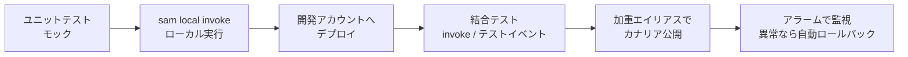

#### invoke の呼び出しタイプ（CLI / SDK）

| `InvocationType` | 動作 |
|---|---|
| `RequestResponse`（既定） | 同期。結果を待つ |
| `Event` | 非同期。`202` を即返す |
| `DryRun` | 権限・パラメータの検証のみで**実行しない** |

> 同期呼び出しで `LogType=Tail` を指定すると、**末尾 4 KB の実行ログ**を応答で受け取れ、テスト時のデバッグに便利です。

### ベストプラクティス

- **ロジックはハンドラーの外**に出してユニットテストし、**境界（AWS 呼び出し）はモック**する
- 結合テストは**本番とは別のアカウント / スタック**で行う
- 本番リリースは**加重エイリアス + CodeDeploy**で段階的に行い、**CloudWatch アラームと連動した自動ロールバック**を設定する
- テストでは**本物のイベント形式**（`sam local generate-event` やコンソールの共有テストイベント）を使う

### 試験での狙われ方

- 「権限だけを確認して、関数は実行したくない」→ **`DryRun`**
- 「新バージョンを少しずつ公開し、問題があれば自動で戻したい」→ **加重エイリアス + CodeDeploy（カナリア / 線形）+ アラーム**
- 「ローカルで Lambda を再現して確認」→ **`sam local invoke`**

---

## Skill 1.2.5 Lambda と AWS サービスの統合

> 公式のスキル文: Lambda 関数を AWS サービスと統合する

### ひとことで言うと

Lambda を**「起動される側（トリガー）」**と**「呼び出す側」**の両面から、各サービスにつなぐスキルです。ここで押さえるのは、**呼び出し方式（同期 / 非同期 / ポーリング）**と**権限の向き**です。

### 詳しい説明

#### トリガーごとの呼び出し方式

| トリガー | 方式 | 補足 |
|---|---|---|
| API Gateway / ALB / 関数 URL | **同期** | 結果を返す。API Gateway の統合タイムアウトは 29 秒（既定） |
| Amazon S3 | **非同期** | オブジェクトの作成・削除などのイベント通知 |
| Amazon SNS | **非同期** | トピックの購読として |
| Amazon EventBridge | **非同期** | ルール / スケジュール |
| Amazon SQS | **ポーリング（イベントソースマッピング）** | Lambda サービスがキューを取得 |
| Kinesis Data Streams / DynamoDB Streams | **ポーリング（イベントソースマッピング）** | シャードごとに取得 |
| Amazon MSK / Amazon MQ / セルフマネージド Kafka | **ポーリング** | — |
| AWS Step Functions | 同期 / 非同期 | ワークフローのタスクとして |

> **イベントソースマッピング**は、Lambda サービス側がソースを読み取って関数を呼び出す仕組みです。**ソース側が関数を呼ぶのではありません**。この違いが、権限の向きに関わります。

#### 権限の 2 つの向き（重要）

| 向き | 使う権限 | 例 |
|---|---|---|
| **他のサービスが Lambda を呼ぶ** | Lambda の**リソースベースポリシー**（`lambda:InvokeFunction` を許可） | S3 / SNS / EventBridge / API Gateway から呼ばれる |
| **Lambda が他のサービスを呼ぶ** | Lambda の**実行ロール**（IAM ロール） | Lambda から DynamoDB に書く、SQS に送信する |
| **Lambda がポーリングして読む** | **実行ロール**（例: `sqs:ReceiveMessage`、`kinesis:GetRecords` など） | SQS / Kinesis のイベントソースマッピング |

```mermaid
flowchart LR
    S3["S3 / SNS / EventBridge"] -->|"リソースベースポリシーで<br/>呼び出しを許可"| L["Lambda"]
    L -->|"実行ロールで<br/>権限を付与"| DDB[("DynamoDB / S3 / SQS")]
    SQS["SQS / Kinesis"] -.->|"Lambda が実行ロールで<br/>ポーリング"| L
```

#### 関数 URL

関数に**専用の HTTPS エンドポイント**を付ける機能です。認証タイプは **`AWS_IAM`**（SigV4）または **`NONE`**（公開）。API Gateway なしで、手軽に Webhook などを受けられます。応答の**ストリーミング**（`RESPONSE_STREAM`）も使えます。

#### ALB から Lambda を呼ぶ

ALB のターゲットグループに Lambda を指定できます。ALB は**同期で呼び出し**、Lambda は ALB 用の形式（`statusCode`、`headers`、`body` など）で応答します。

#### Step Functions との統合

| 項目 | 内容 |
|---|---|
| **Standard ワークフロー** | 最長 **1 年**実行可能、**正確に 1 回**のワークフロー実行、実行履歴を保持 |
| **Express ワークフロー** | 最長 **5 分**、**高スループット**、**少なくとも 1 回**（非同期）/ 最大 1 回（同期）、短時間で大量のイベント処理 |
| 長時間の処理 | **Lambda の 15 分制限を超える処理は Step Functions で分割・制御** |
| 並列処理 | `Parallel`（異なる処理を並列）、`Map`（配列の各要素を並列処理。`Distributed Map` で大規模並列） |
| **コールバック（`.waitForTaskToken`）** | 外部の処理や人の承認を**待ってから**再開 |
| エラー処理 | `Retry` と `Catch`（Skill 1.1.13） |

### ベストプラクティス

- **最小権限**: 実行ロールには必要なアクション・リソースだけを許可する
- 呼び出し元ごとに**リソースベースポリシー**を絞る（`SourceArn` / `SourceAccount` 条件を付けて、**混乱した代理（confused deputy）問題**を防ぐ）
- **同期の長い処理は避け**、非同期 / SQS / Step Functions に置き換える
- 複数のステップを持つ業務は、Lambda の中で連鎖させず **Step Functions で管理**する

### 試験での狙われ方

- 「S3 から Lambda を起動したいが `AccessDenied`」→ **Lambda のリソースベースポリシー**（S3 に `lambda:InvokeFunction` を許可）
- 「Lambda から DynamoDB に書けない」→ **実行ロールに `dynamodb:PutItem` が無い**
- 「15 分を超える複数ステップの処理を管理したい」→ **Step Functions**
- 「人の承認を待ってから処理を再開」→ **Step Functions のコールバックパターン（タスクトークン）**

---

## Skill 1.2.6 Lambda のパフォーマンスチューニング

> 公式のスキル文: 最適なパフォーマンスのために Lambda 関数をチューニングする

### ひとことで言うと

Lambda は**メモリ量・初期化・パッケージ・接続の使い回し**で速度と費用が大きく変わります。**計測してから調整**するのが基本です。

### 詳しい説明

#### 料金の考え方

Lambda の料金は、**リクエスト数**と**実行時間（ミリ秒）× 割り当てメモリ**で決まります。メモリを増やすと単価は上がりますが、**CPU も増えて実行時間が短くなる**ため、総額が**下がることもあります**。

#### チューニングの 5 つの柱

| 柱 | 内容 | 方法 |
|---|---|---|
| **メモリ / CPU の最適化** | 最適な値を**実測**で探す | **AWS Lambda Power Tuning**（Step Functions ベースのツール）、**AWS Compute Optimizer** の推奨 |
| **コールドスタートの低減** | 初期化を軽くする | パッケージを小さく・不要な依存を除く、**SDK クライアントや接続をハンドラー外で初期化**、**SnapStart**、**プロビジョニング済み同時実行**、必要に応じて **arm64** |
| **初期化コードと実行コードの分離** | 毎回やる必要のない処理を**Init フェーズ**に置く | ハンドラーの**外**でクライアント生成・設定取得・モデルのロード |
| **接続・外部呼び出しの最適化** | 接続を使い回し、待ち時間を減らす | **HTTP キープアライブ**、**RDS Proxy**、並列呼び出し、タイムアウト設定 |
| **パッケージの最適化** | 小さく保つ | 不要なライブラリの除去、**レイヤー**、ツリーシェイキング・バンドル（Node.js の esbuild など） |

```mermaid
flowchart TD
    A["遅い / 高い"] --> B{"どこが遅い?<br/>CloudWatch / X-Ray で計測"}
    B -->|"初回だけ遅い<br/>コールドスタート"| C["初期化の軽量化<br/>SnapStart<br/>プロビジョニング済み同時実行"]
    B -->|"常に CPU が重い"| D["メモリを増やす<br/>Power Tuning で最適点を探す"]
    B -->|"外部 / DB 呼び出しが遅い"| E["接続の再利用<br/>RDS Proxy / キャッシュ / 並列化"]
    B -->|"I/O 待ちが多い"| F["非同期化 / バッチ化 / ストリーミング"]
```

#### ハンドラーの外 / 中の書き分け（Python の例）

```python
import os, boto3

# Init フェーズ（ハンドラーの外）: ウォームスタートで再利用される
dynamodb = boto3.resource("dynamodb")
table = dynamodb.Table(os.environ["TABLE_NAME"])
CACHE = {}   # 「あれば得」なキャッシュとして使う（永続状態にしない）

def handler(event, context):
    # Invoke フェーズ: 毎回実行される。ここには必要最小限の処理だけ
    key = event["id"]
    if key not in CACHE:
        CACHE[key] = table.get_item(Key={"id": key}).get("Item")
    return CACHE[key]
```

#### イベントソースマッピングのチューニング（SQS / Kinesis / DynamoDB Streams）

| 設定 | 効果 |
|---|---|
| **バッチサイズ** | 1 回の呼び出しで処理する件数。大きいほどスループットが上がり、呼び出し回数と費用が減る（SQS Standard は最大 10,000 件、バッチウィンドウが必要） |
| **バッチウィンドウ** | バッチを溜める最大時間（最大 300 秒） |
| **最大同時実行数（SQS）** | SQS ソースから起動される Lambda の同時実行数の**上限**（最小 2）。**下流を守る** |
| **並列化係数（Kinesis / DynamoDB Streams）** | 1 シャードあたり最大 10 並列 |
| **イベントフィルタリング** | 条件に合うイベントだけ関数を起動し、**無駄な呼び出しと費用を削減** |

### ベストプラクティス

- **まず計測する**（CloudWatch Logs Insights、X-Ray、Lambda Insights）。推測で調整しない
- **メモリは実測で決める**（Power Tuning）
- **クライアントや接続はハンドラーの外**で初期化し、再利用する
- **パッケージは小さく**、不要な依存を排除する
- バッチ処理は**バッチサイズ・ウィンドウ**で効率化し、**イベントフィルタリング**で不要な起動を減らす
- 下流が弱いときは、**SQS の最大同時実行数 / 予約済み同時実行**で制御する

### 試験での狙われ方

- 「CPU 負荷の高い関数を速くしたい」→ **メモリを増やす**（CPU が比例して増える）
- 「初回の呼び出しだけ遅い」→ **コールドスタート対策（SnapStart / プロビジョニング済み同時実行 / 初期化の見直し）**
- 「呼び出しごとに DB 接続を作って遅い」→ **ハンドラーの外で接続を初期化 / RDS Proxy**
- 「関数の最適なメモリ値を知りたい」→ **Lambda Power Tuning / Compute Optimizer**

---

## Skill 1.2.7 ほぼリアルタイムのデータ処理

> 公式のスキル文: Lambda 関数を使って、ほぼリアルタイムでデータを処理・変換する

### ひとことで言うと

**ストリームやキューに届いたデータを、Lambda で即座に加工・変換して次へ渡す**スキルです。Skill 1.1.10（ストリーミング）と 1.2.3（エラー処理）の合わせ技です。

### 詳しい説明

#### 代表的な処理パターン

| パターン | 構成 | 用途 |
|---|---|---|
| ストリームの加工 | Kinesis Data Streams → **Lambda** → DynamoDB / S3 / OpenSearch | クリックストリームの集計・整形 |
| 配信前の変換 | Kinesis → **Firehose（Lambda による変換）** → S3 | 形式変換、マスキング、レコードの絞り込み |
| 変更データの追従 | DynamoDB → **DynamoDB Streams** → Lambda | 変更を別ストアへ複製、通知、集計 |
| ファイルの即時処理 | S3 イベント → Lambda | 画像のリサイズ、CSV の取り込み |
| キュー処理 | SQS → Lambda | 非同期のワーカー |

```mermaid
flowchart LR
    SRC["アプリ / IoT /<br/>DynamoDB の変更"] --> STR["Kinesis Data Streams<br/>または DynamoDB Streams"]
    STR -->|"イベントソースマッピング<br/>バッチ + 並列化"| L["Lambda<br/>加工・変換・集計"]
    L --> OUT1[("DynamoDB")]
    L --> OUT2["S3 / OpenSearch"]
    L -->|"失敗したバッチ"| DLQ["SQS / SNS<br/>失敗時の送信先"]
```

#### Firehose のデータ変換（Lambda）

Firehose は、バッファリングしたレコードを Lambda に渡して変換できます。Lambda は**入力の `recordId` をそのまま返し**、各レコードに**結果ステータス**を付けます。

| `result` | 意味 |
|---|---|
| `Ok` | 変換成功 |
| `Dropped` | 意図的に破棄 |
| `ProcessingFailed` | 変換失敗（失敗した記録は S3 のエラーバケットへ） |

```python
import base64, json

def handler(event, context):
    out = []
    for r in event["records"]:
        data = json.loads(base64.b64decode(r["data"]))
        data["amount_yen"] = data["amount"] * 150          # 変換の例
        out.append({
            "recordId": r["recordId"],                     # 入力のまま返す
            "result": "Ok",
            "data": base64.b64encode((json.dumps(data) + "\n").encode()).decode(),
        })
    return {"records": out}
```

#### DynamoDB Streams

テーブルの**変更（挿入・更新・削除）を時系列で記録**するストリームです。**保持期間は 24 時間**です。

| `StreamViewType` | ストリームに載る内容 |
|---|---|
| `KEYS_ONLY` | 変更されたアイテムのキーのみ |
| `NEW_IMAGE` | 変更後のアイテム全体 |
| `OLD_IMAGE` | 変更前のアイテム全体 |
| `NEW_AND_OLD_IMAGES` | 変更前後の両方 |

#### ストリーム処理で気を付けること

| 論点 | 内容 |
|---|---|
| **順序** | 同じパーティションキー（シャード）内は順序が保たれる。並列化係数を上げても、同じキーの順序は維持される |
| **冪等性** | 再試行・再読み取りで同じレコードが再び届く前提で作る |
| **不良レコード（Poison Pill）** | 1 件の不良データがシャードを止める。**再試行上限・二分割・失敗時送信先**で対策（Skill 1.2.3） |
| **遅延の監視** | **`IteratorAge`**（CloudWatch 指標）が増え続けたら、処理が追い付いていない → 並列化係数・メモリ・バッチサイズの見直し、シャード追加 |
| **バッチ内の部分失敗** | **部分バッチ応答**で、失敗したレコード以降だけを再処理 |

### ベストプラクティス

- 処理は**冪等**にし、**不良レコード対策**（再試行上限・二分割・失敗時送信先）を最初から設定する
- **`IteratorAge` にアラーム**を設定し、遅延を検知する
- 小さなイベントを大量に処理する場合は、**バッチ + バッチウィンドウ**で呼び出し回数を減らす
- **イベントフィルタリング**で、必要なレコードだけ関数に渡す
- Firehose の変換では、**`recordId` を必ず返し**、変換結果の `result` を正しく設定する

### 試験での狙われ方

- 「Kinesis のレコードを S3 に保存する前に整形したい」→ **Firehose + Lambda 変換**
- 「DynamoDB の更新をトリガーに別のシステムへ通知したい」→ **DynamoDB Streams + Lambda**
- 「Kinesis の処理が遅れている」→ **`IteratorAge` を監視。並列化係数 / シャード / バッチサイズ**
- 「DynamoDB Streams のデータの保持期間」→ **24 時間**

---

# Task 3: アプリケーション開発でデータストアを使う

## Skill 1.3.1 高カーディナリティのパーティションキー

> 公式のスキル文: 負荷の偏りのないパーティションアクセスのために、高カーディナリティのパーティションキーを説明する

### ひとことで言うと

**データを均等に散らせる（値の種類が多い）キー**を選ぶ、というスキルです。偏ると、特定のパーティションだけが過負荷になります。

### 詳しい説明

#### カーディナリティとは

**カーディナリティ**は、**値の種類の多さ**です。ユーザー ID のように何百万種類もある → **高カーディナリティ**。性別や都道府県のように数種類・数十種類 → **低カーディナリティ**。

DynamoDB は、**パーティションキーの値をハッシュ**して、データの保存先パーティション（物理的な記憶領域）を決めます。したがって、**キーが多様でアクセスが均等**なほど、負荷が全体に分散し、性能を最大限に引き出せます。

```mermaid
flowchart TB
    subgraph BAD["低カーディナリティ 例: status = ACTIVE"]
        direction LR
        R1["リクエスト"] --> P1["パーティション A<br/>過負荷 ホットパーティション"]
        R2["リクエスト"] --> P1
        R3["リクエスト"] --> P1
    end
    subgraph GOOD["高カーディナリティ 例: userId"]
        direction LR
        R4["リクエスト"] --> P2["パーティション X"]
        R5["リクエスト"] --> P3["パーティション Y"]
        R6["リクエスト"] --> P4["パーティション Z"]
    end
    BAD ~~~ GOOD
```

| パーティションキーの例 | 評価 | 理由 |
|---|---|---|
| `userId`、`orderId`、`deviceId` | 良い | 値の種類が多く、アクセスも分散しやすい |
| `status`、`country`、`gender` | 悪い | 値が少なく、特定の値にデータが集中する |
| `date`（日付のみ） | 悪い | **今日の日付**に書き込みが集中する（ホットパーティション） |
| `date` + ランダムな接尾辞 | 良い（工夫） | 後述の**書き込みシャーディング**で分散 |

#### ホットパーティションと対策

| 問題 | 対策 |
|---|---|
| 特定のキーにアクセスが集中 | **書き込みシャーディング**: キーに `#0`〜`#N` のランダム（またはハッシュ由来）の接尾辞を付けて分散。読み取りは全接尾辞を**並列 Query** して集約 |
| 読み取りが偏る | **DAX / ElastiCache** でキャッシュ（Skill 1.3.8） |
| 突発的な急増 | **オンデマンドモード**（ただし、アクセスの偏り自体は解決しない） |
| 低い単価で均一性が弱い | キーの**複合化**（例: `tenantId#userId`）で分散を改善 |

> DynamoDB には**アダプティブキャパシティ**があり、偏りがあってもある程度は自動的に吸収します。ただし**万能ではなく、まず分散するキー設計が基本**です。

### ベストプラクティス

- パーティションキーは**値の種類が多く、アクセスが均等**になるものを選ぶ
- 「**よく使う属性 = 良いキー**」とは限らない。**アクセスパターンの偏り**で判断する
- 偏りが避けられない場合は、**書き込みシャーディング**やキャッシュで緩和する

### 試験での狙われ方

- 「DynamoDB で `ProvisionedThroughputExceededException` が出る。テーブル全体の容量には余裕がある」→ **ホットパーティション。キーの再設計 / シャーディング**
- 「パーティションキーに適しているのは?」→ **`userId` など高カーディナリティのもの**

---

## Skill 1.3.2 整合性モデル

> 公式のスキル文: データベースの整合性モデル（強い整合性、結果整合性など）を説明する

### ひとことで言うと

「**書いた直後に読んだら、最新の値が必ず返るか?**」の違いです。**速さと正確さのトレードオフ**です。

### 詳しい説明

DynamoDB は、データを複数の場所（AZ）に複製して保存します。そのため、読み取りの種類によって返る値が変わります。

| 読み取りの種類 | 最新の書き込みが反映されているか | レイテンシー・コスト | 備考 |
|---|---|---|---|
| **結果整合性のある読み取り（既定）** | **直後は古い値が返ることがある**（通常は 1 秒以内に整合） | 速い・安い（**0.5 RCU / 4 KB**） | 既定の動作 |
| **強い整合性のある読み取り** | **常に最新の値**が返る | 遅め・高い（**1 RCU / 4 KB** = 2 倍） | `ConsistentRead=True` を指定 |
| **トランザクション読み取り** | 一貫したスナップショット（ACID） | **2 RCU / 4 KB** | `TransactGetItems` |

```mermaid
sequenceDiagram
    participant A as アプリ
    participant D as DynamoDB
    A->>D: PutItem（x = 10 に更新）
    D-->>A: 成功
    A->>D: GetItem（既定 = 結果整合性）
    D-->>A: 古い値 x = 5 が返ることがある
    A->>D: GetItem（ConsistentRead = true）
    D-->>A: 最新の値 x = 10
```

#### 制約（試験で出る）

| 対象 | 強い整合性 |
|---|---|
| テーブル | **可能** |
| **ローカルセカンダリインデックス（LSI）** | **可能** |
| **グローバルセカンダリインデックス（GSI）** | **不可（結果整合性のみ）** |
| **DynamoDB Streams** | — |
| **グローバルテーブル** | 強い整合性の読み取りは**書き込みを受けたリージョンのみ**（他リージョンへの複製は結果整合性） |
| **DAX** | 強い整合性のリクエストは**キャッシュを使わず DynamoDB へ素通し** |

#### 他のデータストアの整合性

| データストア | 整合性 |
|---|---|
| **Amazon S3** | 新規・上書き・削除ともに **強い読み取り整合性（read-after-write）**（2020 年 12 月以降） |
| **Amazon RDS / Aurora** | 通常のトランザクション（ACID）。**リードレプリカ**は**非同期**のため結果整合性（レプリカラグ） |
| **ElastiCache** | キャッシュのため、元データとのズレが起こり得る（Skill 1.3.8） |

#### 実装での使い分け

| 要件 | 選択 |
|---|---|
| 「書いた直後に必ず最新を読みたい」（残高、在庫の確認など） | **強い整合性のある読み取り** |
| 「少し古くても許容」（ランキング、閲覧履歴） | **結果整合性**（安くて速い） |
| 「複数アイテムの更新をすべて成功 / すべて失敗にしたい」 | **トランザクション（`TransactWriteItems`）** |
| 「同時更新による上書き事故を防ぎたい」 | **条件付き書き込み / 楽観的ロック（バージョン属性）** |

### ベストプラクティス

- 既定（結果整合性）で足りる読み取りは、そのまま使う（**費用が半分**）
- **正確さが必須の箇所だけ**強い整合性を使う
- **GSI は強い整合性が使えない**ことを設計時点で把握する
- 同時更新には**条件付き書き込み（`ConditionExpression`）による楽観的ロック**を使う

### 試験での狙われ方

- 「書き込み直後の読み取りで古いデータが返る」→ **`ConsistentRead=True`**
- 「GSI に対して強い整合性の読み取り」→ **できない**
- 「強い整合性の読み取りは結果整合性の何倍のコスト?」→ **2 倍**
- 「結果整合性は 4 KB あたり何 RCU?」→ **0.5 RCU**

---

## Skill 1.3.3 Query と Scan の違い

> 公式のスキル文: Query オペレーションと Scan オペレーションの違いを説明する

### ひとことで言うと

**Query は「キーを指定してピンポイントで取る」**、**Scan は「テーブルを端から全部読む」**です。**Scan は原則避ける**のが基本方針です。

### 詳しい説明

| 観点 | Query | Scan |
|---|---|---|
| 読む範囲 | **指定したパーティションキーのアイテムだけ** | **テーブル（またはインデックス）全体** |
| キー条件 | **パーティションキーの等価条件が必須**（ソートキーは任意で範囲指定可） | なし |
| 効率 | **高い**（読んだ分だけの消費） | **低い**（全件を読み、**フィルター前の量**で課金） |
| 並び順 | ソートキーの順（`ScanIndexForward=False` で降順） | 不定 |
| コスト | 小さい | **大きい**（大きなテーブルでは容量を食い潰す） |
| 向く場面 | 通常のアクセス | 小さなテーブル、一括エクスポート、まれな管理作業 |

#### フィルター式の落とし穴

`FilterExpression` は、**読み取った後に**結果を絞り込みます。**読み取りの消費量（RCU）は絞り込み前のデータ量**でかかるため、Scan + フィルターは「**全部読んで、一部だけ返す**」状態で、効率は改善しません。**フィルターは費用の節約手段ではありません**。

```python
from boto3.dynamodb.conditions import Key, Attr

# Query: パーティションキー + ソートキーの範囲で絞る（効率的）
res = table.query(
    KeyConditionExpression=Key("userId").eq("u-001") & Key("createdAt").between("2026-01-01", "2026-03-31"),
    FilterExpression=Attr("status").eq("PAID"),   # 読んだ後に絞る（RCU は絞る前の量）
    Limit=50,
)

# Scan: 全件を読む（非推奨。必要なら並列スキャンや Limit で制御）
res = table.scan(FilterExpression=Attr("status").eq("PAID"))
```

#### 1 回の応答は最大 1 MB（ページネーション）

Query と Scan は、**1 回の呼び出しで最大 1 MB**までしか読み取りません。続きがあるときは、応答に **`LastEvaluatedKey`** が含まれ、これを次回の **`ExclusiveStartKey`** に渡して続きを取得します（Skill 1.1.9）。`Limit` は**評価する件数**の上限で、フィルター適用前の件数です。

#### Scan を安全に使うための工夫

| 工夫 | 内容 |
|---|---|
| **並列スキャン** | `Segment` と `TotalSegments` で、テーブルを分割して並列に読む |
| **`Limit` / ページサイズの制限** | 一度に読む量を絞り、他のリクエストへの影響を抑える |
| **結果整合性の読み取りを使う** | コストを半分に |
| **S3 へのエクスポート** | 分析用に大量のデータが必要なら、**S3 へのエクスポート**（PITR を利用、読み取り容量を消費しない）の方が適切 |

#### 選び方のフロー

```mermaid
flowchart TD
    A["データを取得したい"] --> B{"パーティションキーの値を<br/>指定できる?"}
    B -->|"はい"| C["Query<br/>効率的"]
    B -->|"いいえ"| D{"別の属性で<br/>よく検索する?"}
    D -->|"はい"| E["GSI / LSI を作って<br/>そのインデックスを Query"]
    D -->|"いいえ"| F{"全件が必要?<br/>分析 / 移行"}
    F -->|"はい"| G["Scan 並列スキャン<br/>または S3 へエクスポート"]
    F -->|"いいえ"| H["アクセスパターンを見直す"]
```

### ベストプラクティス

- **Query を基本**にし、Scan は避ける。**頻繁な Scan が必要になったら、データモデル（キー / インデックス）の設計が不適切**というサイン
- 別の属性での検索には **GSI** を使う
- ソートキーで**範囲を絞って**取得量を減らす
- 取得項目が少なければ **`ProjectionExpression`** で必要な属性だけ返す（転送量を減らす。**RCU は減らない**点に注意）
- 大量データの分析は **S3 へのエクスポート**や Athena を検討する

### 試験での狙われ方

- 「Scan が遅く、容量を大量消費している」→ **Query に置き換え / GSI の作成**
- 「フィルター式を使えば RCU が減るか」→ **減らない**（読み取った量で課金される）
- 「1 回で全件が返ってこない」→ **1 MB の上限。`LastEvaluatedKey` でページネーション**
- 「Query の必須条件」→ **パーティションキーの等価条件**

---

## Skill 1.3.4 DynamoDB のキーとインデックス

> 公式のスキル文: Amazon DynamoDB のキーとインデックスを定義する

### ひとことで言うと

DynamoDB は**「どう検索するか」を先に決めてからテーブルを設計**します。キーとインデックスが、検索できる方法を決めます。

### 詳しい説明

#### 主キー（Primary Key）

| 種類 | 構成 | 特徴 |
|---|---|---|
| **シンプルな主キー** | パーティションキー（PK）のみ | PK の値で 1 件を特定。PK は**テーブル内で一意** |
| **複合主キー** | パーティションキー + ソートキー（SK） | **同じ PK の中に複数のアイテム**を持て、SK で並べ替え・範囲検索ができる。**PK と SK の組み合わせが一意** |

```mermaid
flowchart LR
    subgraph T["テーブル 複合主キー"]
        direction TB
        I1["PK: user-1 / SK: 2026-01-05<br/>注文 A"]
        I2["PK: user-1 / SK: 2026-02-10<br/>注文 B"]
        I3["PK: user-2 / SK: 2026-01-20<br/>注文 C"]
    end
    Q["Query<br/>PK = user-1<br/>SK が 2026-01 から 2026-02"] --> T
```

#### インデックス

| 観点 | グローバルセカンダリインデックス（GSI） | ローカルセカンダリインデックス（LSI） |
|---|---|---|
| キー | **別のパーティションキー + 任意のソートキー** | **同じパーティションキー + 別のソートキー** |
| 作成のタイミング | **いつでも**（作成後に追加・削除できる） | **テーブル作成時のみ** |
| 数の上限 | テーブルあたり **20** 個（既定） | テーブルあたり **5** 個 |
| 強い整合性の読み取り | **不可**（結果整合性のみ） | **可能** |
| キャパシティ | **独自のスループット**（プロビジョニング済みの場合、別に設定） | **テーブルのスループットを共有** |
| 10 GB 制限 | なし | **PK ごとのアイテムコレクションが 10 GB まで** |

> 覚え方: **GSI = Global = 「どこでも」（別の PK、いつでも作れる、独立した容量）**。**LSI = Local = 「同じ PK の中だけ」（作成時のみ、容量共有、強い整合性 OK）**。

#### インデックスの射影（Projection）

インデックスに**どの属性を複製するか**を選びます。

| 射影 | 内容 |
|---|---|
| `KEYS_ONLY` | テーブルとインデックスのキーのみ |
| `INCLUDE` | キー + 指定した属性 |
| `ALL` | すべての属性 |

> 射影されていない属性を Query で要求すると、**テーブルから取得（フェッチ）**するため、**GSI では不可・LSI では追加コストが発生**します。**よく使う属性は射影する**のが基本です。射影が多いほどストレージと書き込みコストが増えるため、バランスを取ります。

#### キャパシティの単位と計算

| 単位 | 内容 |
|---|---|
| **RCU（読み取り容量ユニット）** | **4 KB まで**の読み取り **1 回（強い整合性）= 1 RCU**。結果整合性は **0.5 RCU**。トランザクションは **2 RCU** |
| **WCU（書き込み容量ユニット）** | **1 KB まで**の書き込み **1 回 = 1 WCU**。トランザクションは **2 WCU** |

計算の例（切り上げで計算）です。

| 例 | 計算 | 結果 |
|---|---|---|
| 6 KB のアイテムを、強い整合性で 1 秒に 10 回読む | 6 KB → 4 KB 単位で切り上げて **2** 単位 × 10 | **20 RCU** |
| 同じ読み取りを、結果整合性で | 20 RCU × 0.5 | **10 RCU** |
| 2.5 KB のアイテムを、1 秒に 5 回書く | 2.5 KB → 1 KB 単位で切り上げて **3** × 5 | **15 WCU** |

#### キャパシティモード

| モード | 内容 | 向く場面 |
|---|---|---|
| **オンデマンド** | リクエスト数に応じて課金。容量の事前設定が不要 | 予測できない / 急に変動するトラフィック、新規ワークロード |
| **プロビジョニング済み** | RCU / WCU を指定。**Auto Scaling** で自動調整できる | 予測可能で安定したトラフィック（費用を最適化しやすい） |

超過すると `ProvisionedThroughputExceededException`（HTTP 400）になるため、SDK の**指数バックオフ再試行**で対処します。

#### 主な制限（暗記項目）

| 項目 | 値 |
|---|---|
| アイテムの最大サイズ | **400 KB**（属性名・値を含む） |
| Query / Scan の 1 回の読み取り | **最大 1 MB** |
| `BatchGetItem` | 最大 **100 件 / 16 MB** |
| `BatchWriteItem` | 最大 **25 件 / 16 MB**（Put / Delete のみ。**Update 不可**） |
| `TransactWriteItems` / `TransactGetItems` | 最大 **100 アイテム** |
| 結果整合性の通常の反映 | 通常 1 秒以内 |

#### 書き込みの便利な機能

| 機能 | 内容 |
|---|---|
| **条件付き書き込み** | `ConditionExpression` を満たすときだけ書く（`attribute_not_exists(pk)` で二重登録を防止）。失敗時は `ConditionalCheckFailedException` |
| **アトミックカウンター** | `UpdateItem` の `SET #n = #n + :inc` で、競合なく加算 |
| **楽観的ロック** | `version` 属性を持たせ、`version = :expected` を条件にして更新 |
| **トランザクション** | `TransactWriteItems` で複数アイテム・複数テーブルをまとめて ACID 更新 |

### ベストプラクティス

- **アクセスパターンを先に洗い出し**、それに合わせてキーとインデックスを設計する
- キーは**高カーディナリティ**にする（Skill 1.3.1）
- **GSI を使って別の検索軸**を提供する。**LSI は作成時にしか作れない**ため慎重に判断する
- **射影は必要な属性に絞る**
- 不安定な負荷には**オンデマンド**、安定した負荷には**プロビジョニング済み + Auto Scaling**
- **アイテムは小さく保つ**（400 KB 上限、大きなデータは S3 に置き、**キーだけを DynamoDB に保存**）

### 試験での狙われ方

- 「別の属性で検索したい（テーブル作成後）」→ **GSI**
- 「同じ PK で別のソートキー + 強い整合性が必要」→ **LSI（ただし作成時のみ）**
- 「RCU / WCU の計算」→ **4 KB / 1 KB の単位で切り上げ**
- 「アイテムが 400 KB を超える」→ **S3 に保存し、DynamoDB には参照を保存**
- 「予測できないトラフィック」→ **オンデマンド**
- 「二重登録を防ぎたい」→ **`attribute_not_exists` による条件付き書き込み**

---

## Skill 1.3.5 シリアライズとデシリアライズ

> 公式のスキル文: データストアへの永続化のために、データをシリアライズ・デシリアライズする

### ひとことで言うと

**メモリ上のオブジェクト**を**保存・送信できる形式**に変換し（シリアライズ）、読み出したときに**元のオブジェクト**へ戻す（デシリアライズ）スキルです。

### 詳しい説明

| 形式 | 特徴 | 使いどころ |
|---|---|---|
| **JSON** | 人が読める、どの言語でも扱える | API、SQS / SNS のメッセージ本文、S3 の設定ファイル |
| **Avro / Protocol Buffers** | 圧縮された**バイナリ**、スキーマ定義あり | ストリーミング、スキーマの進化が必要な場合（Glue Schema Registry と併用） |
| **Parquet / ORC** | **列指向**、分析向け | S3 + Athena での分析 |
| **Base64** | バイナリをテキストで表現 | Kinesis / Firehose のレコード、API でのバイナリ受け渡し |

#### DynamoDB のデータ型

DynamoDB の低レベル API（`boto3.client("dynamodb")` など）は、値に**型記述子**を付けた形式で表現します。

| 型 | 記述子 | 例 |
|---|---|---|
| 文字列 | `S` | `{"S": "Tokyo"}` |
| 数値 | `N`（**文字列で表現**） | `{"N": "123"}` |
| バイナリ | `B` | Base64 |
| 真偽値 | `BOOL` | `{"BOOL": true}` |
| NULL | `NULL` | `{"NULL": true}` |
| リスト | `L` | `{"L": [{"S": "a"}, {"N": "1"}]}` |
| マップ | `M` | `{"M": {"city": {"S": "Tokyo"}}}` |
| 文字列セット / 数値セット / バイナリセット | `SS` / `NS` / `BS` | 重複なし・順序なし |

> 高レベルのインターフェース（boto3 の **`resource` / `Table`**、Java の **DynamoDB Enhanced Client**、JavaScript の **`lib-dynamodb` の DocumentClient**）を使うと、**型記述子の変換（シリアライズ / デシリアライズ）を自動**で行ってくれます。

```python
# 低レベル client: 型記述子が必要（読み書きとも煩雑）
client.put_item(TableName="Users", Item={"id": {"S": "u-1"}, "age": {"N": "30"}})

# 高レベル resource: Python の値をそのまま渡せる
table.put_item(Item={"id": "u-1", "age": 30})
```

#### よくある落とし穴

| 落とし穴 | 内容と対処 |
|---|---|
| **数値の型** | Python の `float` は DynamoDB に**そのまま保存できず**エラー。**`Decimal`** を使う。読み出し時も `Decimal` で返るため、JSON 化では変換が必要 |
| **日時** | DynamoDB に日時型はない。**ISO 8601 文字列**（辞書順でソート可能）または **Unix エポック秒（数値）**で保存。**タイムゾーンは UTC に統一** |
| **空の値** | 現在は空文字列・空バイナリも**属性値として保存可能**（キー属性は不可）。ただし **空のセットは不可** |
| **サイズ** | アイテムは **400 KB** まで。超える場合は **S3 に本体を保存**し、DynamoDB には**参照（キー）**を保存 |
| **スキーマの変更** | 古いデータを読めなくならないよう、**後方互換**で変更する（項目の追加は任意項目にする、`schemaVersion` 属性を持たせる） |
| **機密データ** | 保存前に**暗号化**（クライアント側暗号化 / KMS）。ログに出さない |
| **S3 のメタデータ / Content-Type** | 保存時に `Content-Type` や `Content-Encoding` を正しく設定する |

> **信頼できない入力のデシリアライズ**（特に Python の `pickle`）は、**任意コード実行**の危険があります。外部から来るデータには **JSON などの安全な形式**を使います。

### ベストプラクティス

- 相互運用性のため、**JSON**（またはスキーマ付きのバイナリ形式）を基本にする
- DynamoDB は **高レベルのクライアント（resource / Enhanced Client / DocumentClient）**を使って変換を任せる
- Python は**数値を `Decimal`**、日時は **ISO 8601（UTC）**で扱う
- データ形式は**スキーマ（契約）として管理**し、後方互換で進化させる
- 信頼できないデータを **`pickle` などでデシリアライズしない**

### 試験での狙われ方

- 「Python で DynamoDB に小数を保存するとエラー」→ **`Decimal` を使う**
- 「DynamoDB の低レベル API で数値を表す型」→ **`N`（値は文字列）**
- 「型記述子を意識せずに読み書きしたい」→ **高レベルのインターフェース（resource / DocumentClient / Enhanced Client）**

---

## Skill 1.3.6 データストアの利用・管理・保守

> 公式のスキル文: データストアを使用、管理、保守する

### ひとことで言うと

アプリの**用途に合ったデータストアを選び**、バックアップ・スケーリング・接続管理など**運用面**まで押さえるスキルです。

### 詳しい説明

#### データストアの選び方

| データの性質 | 選ぶサービス | 理由 |
|---|---|---|
| キーによる高速アクセス、大規模、サーバーレス | **Amazon DynamoDB** | ミリ秒の応答、無制限に近いスケール、運用不要 |
| 複雑なクエリ・JOIN・トランザクション、既存の RDB | **Amazon RDS / Aurora** | SQL・ACID |
| ファイル・画像・ログ・バックアップなどのオブジェクト | **Amazon S3** | 低コスト、高耐久性、ほぼ無制限の容量 |
| ミリ秒未満のキャッシュ、セッション | **ElastiCache（Redis OSS / Valkey / Memcached）** | メモリ上で高速 |
| 全文検索・ログ分析 | **Amazon OpenSearch Service** | 検索とアグリゲーション |
| 関係のネットワーク（グラフ） | Amazon Neptune | — |
| 時系列 | Amazon Timestream | — |
| ドキュメント（MongoDB 互換） | Amazon DocumentDB | — |

#### DynamoDB の管理機能

| 機能 | 内容 |
|---|---|
| **TTL（Time to Live）** | 期限切れのアイテムを**自動削除**（書き込み容量を消費しない）。属性は**Unix エポック秒（数値）** |
| **ポイントインタイムリカバリ（PITR）** | 過去 **35 日間**の任意の時点に復元（秒単位） |
| **オンデマンドバックアップ** | 任意のタイミングで取得。保持は手動管理（AWS Backup で一元化も可） |
| **グローバルテーブル** | **マルチリージョン・マルチアクティブ**のレプリケーション（低遅延と高可用性） |
| **DynamoDB Streams** | 変更の記録（Skill 1.2.7） |
| **暗号化** | **保管時は常に暗号化**（AWS 所有キー / AWS マネージドキー / カスタマーマネージドキー） |
| **削除保護** | 誤ってテーブルを削除しないよう保護 |
| **テーブルクラス** | **Standard** / **Standard-IA**（アクセス頻度が低いデータのストレージ費用を削減） |

#### S3 の管理機能

| 機能 | 内容 |
|---|---|
| **バージョニング** | 上書き・削除から保護 |
| **ライフサイクルルール** | 自動で別のストレージクラスへ移行・削除（Skill 1.3.7） |
| **暗号化** | **既定でサーバー側暗号化（SSE-S3）が有効**。SSE-KMS、DSSE-KMS、SSE-C も選べる |
| **署名付き URL** | 期限付きアクセス（Skill 1.1.9） |
| **マルチパートアップロード** | 大きなファイル（100 MB 以上で推奨、5 GB 超は必須） |
| **イベント通知** | Lambda / SQS / SNS / EventBridge へ通知 |
| **レプリケーション** | リージョン内 / リージョン間のコピー |
| **パブリックアクセスブロック** | 意図しない公開を防ぐ（既定で有効） |

#### RDS / Aurora の管理

| 機能 | 内容 |
|---|---|
| **Multi-AZ** | **別の AZ に同期レプリケーション**。**可用性向上（自動フェイルオーバー）**が目的。読み取りの分散には使わない（Aurora は別） |
| **リードレプリカ** | **非同期レプリケーション**で**読み取りの負荷を分散**（結果整合性） |
| **自動バックアップ / スナップショット** | ポイントインタイムリカバリ。保持期間 **1〜35 日** |
| **RDS Proxy** | 接続のプール。**Lambda からの大量接続**に有効 |
| **IAM データベース認証 / Secrets Manager** | パスワードを使わない / **自動ローテーション** |
| **Aurora Serverless v2** | 負荷に応じて**容量が自動でスケール** |

```mermaid
flowchart TD
    A["保存するデータは?"] --> B{"アクセスの特徴"}
    B -->|"キーで取得<br/>大規模・低レイテンシー"| C["DynamoDB"]
    B -->|"複雑なクエリ / JOIN<br/>ACID"| D["RDS / Aurora"]
    B -->|"ファイル・オブジェクト"| E["S3"]
    B -->|"超高速な一時データ"| F["ElastiCache / DAX"]
    B -->|"全文検索・ログ分析"| G["OpenSearch Service"]
```

### ベストプラクティス

- **アクセスパターンから**データストアを選ぶ（「慣れているから」で選ばない）
- DynamoDB は **TTL・PITR・削除保護**を有効にし、**暗号化**を行う
- S3 は**バージョニング・ライフサイクル・パブリックアクセスブロック**を設定する
- RDS は **Multi-AZ**（可用性）と**リードレプリカ**（性能）を使い分け、**Lambda には RDS Proxy** を使う
- **認証情報は Secrets Manager** で管理し、ローテーションする

### 試験での狙われ方

- 「RDS の読み取り負荷を下げたい」→ **リードレプリカ / キャッシュ**
- 「RDS の可用性を高めたい（自動フェイルオーバー）」→ **Multi-AZ**
- 「Multi-AZ とリードレプリカの違い」→ **Multi-AZ = 同期・可用性、リードレプリカ = 非同期・読み取りのスケール**
- 「誤って削除 / 更新したデータを元に戻したい」→ **DynamoDB の PITR / S3 のバージョニング**

---

## Skill 1.3.7 データライフサイクルの管理

> 公式のスキル文: データのライフサイクルを管理する

### ひとことで言うと

データは**作られてから、使われなくなり、消えるまで**の流れがあります。**古くなったデータを自動で安く保管・削除**して、費用とリスクを減らすスキルです。

### 詳しい説明

#### DynamoDB: TTL

| 項目 | 内容 |
|---|---|
| 仕組み | **TTL 属性**（Unix エポック秒の**数値**）に指定した時刻を過ぎたアイテムを**自動削除** |
| 削除のタイミング | **期限直後ではなく、通常は数日以内（48 時間以内が目安）**にバックグラウンドで削除される |
| 費用 | TTL による削除は**書き込み容量を消費しない**（無料） |
| 注意点 | 期限切れでも**削除されるまでは読み取りで返る**ため、**アプリ側で期限をフィルター**する。削除は **Streams に記録**される（サービスによる削除として識別可能） |
| 用途 | セッション、一時トークン、ログ、キャッシュ、一定期間後に不要になるデータ |

```python
import time
expire_at = int(time.time()) + 3600 * 24 * 7       # 7 日後（Unix エポック秒・整数）
table.put_item(Item={"sessionId": "s-001", "userId": "u-1", "expireAt": expire_at})
# テーブルの TTL 属性として "expireAt" を指定しておく
```

#### Amazon S3: ライフサイクル

| ストレージクラス | 特徴 | 向く用途 |
|---|---|---|
| **S3 Standard** | 頻繁なアクセス | アクティブなデータ |
| **S3 Intelligent-Tiering** | アクセスパターンに応じて**自動で階層を移動** | アクセス頻度が不明・変動する |
| **S3 Standard-IA** | 低頻度アクセス・複数 AZ。取り出し料金あり | 月に 1 回程度の参照 |
| **S3 One Zone-IA** | 低頻度・**単一 AZ**（AZ の障害で失われ得る） | 再作成可能なデータ |
| **S3 Glacier Instant Retrieval** | アーカイブ・ミリ秒で取得 | 四半期に 1 回程度の参照 |
| **S3 Glacier Flexible Retrieval** | アーカイブ・分〜時間で取得 | 年に 1〜2 回の参照 |
| **S3 Glacier Deep Archive** | **最安**・数時間以上で取得 | 長期保管（法規制対応） |

```mermaid
flowchart LR
    A["S3 Standard<br/>作成直後"] -->|"30 日後"| B["Standard-IA<br/>低頻度アクセス"]
    B -->|"90 日後"| C["Glacier<br/>アーカイブ"]
    C -->|"365 日後"| D["削除<br/>Expiration"]
```

S3 ライフサイクルルールで、**移行（Transition）**と**有効期限（Expiration：削除）**を設定します。**バージョニング**を使っている場合は、**非現行バージョン**（古い版）の移行・削除、**不完全なマルチパートアップロードの削除**も設定できます。

| 注意 | 内容 |
|---|---|
| Standard-IA / One Zone-IA への移行 | **オブジェクトは作成から 30 日以上**経過している必要がある |
| 最小保管期間 | 各 IA / Glacier クラスに**最小課金期間**がある（早期に削除しても課金される） |
| 小さなオブジェクト | IA 系は**最小課金サイズ（128 KB）**があるため、小さいオブジェクトの移行は不利 |

#### その他のサービス

| サービス | ライフサイクル管理 |
|---|---|
| **Amazon SQS** | メッセージ保持期間（既定 4 日、最大 14 日）で自動削除 |
| **CloudWatch Logs** | ロググループの**保持期間**を設定（既定は無期限 → 設定しないと増え続ける） |
| **Kinesis Data Streams** | 保持期間（24 時間〜365 日） |
| **DynamoDB Streams** | 24 時間 |
| **ElastiCache** | キーごとの **TTL（有効期限）** / 削除ポリシー（evict） |
| **AWS Backup** | バックアップの保持・コールドストレージへの移行をポリシーで管理 |
| **RDS / Aurora** | 自動バックアップの保持期間（1〜35 日）、スナップショットの手動管理 |
| **ECR** | イメージの**ライフサイクルポリシー**で古いイメージを削除 |

### ベストプラクティス

- データごとに**保持期間と、必要なアクセス頻度**を決め、**自動化**する（手作業の削除に頼らない）
- DynamoDB のセッション・一時データには **TTL** を設定する
- S3 は**アクセス頻度が不明なら Intelligent-Tiering**、**予測できるなら**ライフサイクルルールで**階段状に移行**する
- **ログの保持期間を設定**して、無制限に増えないようにする
- 法規制のある長期保管は **Glacier Deep Archive** と **S3 Object Lock** を検討する

### 試験での狙われ方

- 「期限切れのセッションデータを、コストをかけずに自動削除したい」→ **DynamoDB TTL**
- 「S3 のデータを、時間が経つほど安いクラスへ自動で移したい」→ **ライフサイクルルール**
- 「アクセスパターンが予測できない」→ **S3 Intelligent-Tiering**
- 「DynamoDB の TTL 属性の形式」→ **Unix エポック秒の数値**
- 「TTL の期限が来たのにまだデータが読める」→ **削除は遅延する。アプリ側で期限をフィルター**

---

## Skill 1.3.8 キャッシュサービス

> 公式のスキル文: データキャッシュサービスを使用する

### ひとことで言うと

**よく読まれるデータを、高速な場所（メモリ）に置いておき**、元のデータストアへのアクセスを減らして**速く・安く**するスキルです。

### 詳しい説明

#### AWS のキャッシュサービス

| サービス | 役割 | 特徴 |
|---|---|---|
| **Amazon ElastiCache** | 汎用のインメモリキャッシュ（**Valkey / Redis OSS / Memcached**） | 汎用。**どのデータストアの前**にも置ける。セッション管理、ランキング、Pub/Sub など |
| **Amazon DynamoDB Accelerator (DAX)** | **DynamoDB 専用**のインメモリキャッシュ | **DynamoDB API と互換**で、アプリの変更は最小限（DAX クライアントに差し替え）。**ミリ秒 → マイクロ秒**の読み取り |
| **Amazon API Gateway キャッシュ** | API レスポンスのキャッシュ（REST API） | バックエンドの呼び出しを削減 |
| **Amazon CloudFront** | **エッジ**でコンテンツをキャッシュ | 静的・動的コンテンツの配信。世界中のユーザーに低遅延 |

#### ElastiCache: Valkey / Redis OSS と Memcached

| 観点 | Redis OSS / Valkey | Memcached |
|---|---|---|
| データ構造 | 豊富（文字列、ハッシュ、リスト、セット、ソート済みセットなど） | シンプルなキー・バリュー |
| **永続化 / バックアップ** | **あり**（スナップショット） | なし |
| **レプリケーション / Multi-AZ・自動フェイルオーバー** | **あり** | なし |
| **Pub/Sub、トランザクション、Lua** | あり | なし |
| マルチスレッド | — | **あり**（大きなノードで有利） |
| 向く場面 | **セッション、ランキング、リアルタイム分析、永続性が必要な場合** | シンプルで大量のキャッシュ。**水平にスケール**させたいだけの場合 |

> 迷ったら「**機能が豊富（永続化・レプリケーション・高可用性）= Redis OSS / Valkey**」「**単純で水平分散だけ = Memcached**」と覚えます。

#### キャッシュ戦略（4 つの基本パターン）

| 戦略 | 動き | 長所 | 短所 |
|---|---|---|---|
| **Lazy Loading（Cache-Aside）** | 読むときにキャッシュを確認し、**無ければ DB から読んでキャッシュに格納** | 要求されたデータだけが載る。キャッシュ障害でもアプリは動く | キャッシュミス時は遅い。**古いデータが残る** |
| **Write-Through** | **DB に書くたびにキャッシュも更新** | キャッシュが常に新しい | 書き込みが遅くなる。**読まれないデータも載る** |
| **TTL（有効期限）** | キャッシュのデータに寿命を設定 | **古いデータが残る期間を制限**できる | 期限切れ直後はミス |
| **Write-Behind（Write-Back）** | キャッシュに先に書き、**後で非同期に DB へ反映** | 書き込みが速い | データ損失のリスク |

```mermaid
sequenceDiagram
    participant A as アプリ
    participant C as キャッシュ
    participant D as データベース
    A->>C: データを要求
    alt キャッシュヒット
        C-->>A: データを返す
    else キャッシュミス
        C-->>A: 無い
        A->>D: データを取得
        D-->>A: データ
        A->>C: キャッシュに格納（TTL 付き）
        A-->>A: データを使う
    end
```

> 実務では、**Lazy Loading + TTL**（古いデータの寿命を制限）を基本にし、**更新が重要なデータには Write-Through を足す**組み合わせがよく使われます。

#### DAX の押さえどころ

| 項目 | 内容 |
|---|---|
| **2 種類のキャッシュ** | **アイテムキャッシュ**（`GetItem` / `BatchGetItem`）と**クエリキャッシュ**（`Query` / `Scan` の結果） |
| **書き込み** | **ライトスルー**（DAX を経由して DynamoDB に書き、キャッシュも更新） |
| **強い整合性の読み取り** | **キャッシュを使わず**、DynamoDB に直接取りに行く（結果整合性のみがキャッシュ対象） |
| **向く場面** | **読み取りが多く、同じキーが繰り返し読まれる**。ホットキーの緩和 |
| **向かない場面** | **書き込みが多い**、**強い整合性が必須**、読み取りがほとんど重複しない |
| **TTL** | アイテムキャッシュとクエリキャッシュに、それぞれ TTL がある（既定 5 分） |

#### ElastiCache と DAX の使い分け

| 要件 | 選択 |
|---|---|
| **DynamoDB** の読み取りを、アプリ変更を最小限に高速化したい | **DAX** |
| **RDS / 外部 API の結果**など、DynamoDB 以外もキャッシュしたい / セッションを持ちたい | **ElastiCache** |
| ブラウザ・エッジに近い場所でコンテンツを配りたい | **CloudFront** |

### ベストプラクティス

- **読み取りが多く、更新が少ないデータ**をキャッシュする
- **TTL を必ず設定**し、**キャッシュの無効化（更新時に削除）**の方針を決める
- キャッシュは**あくまで高速化のための複製**。**元データ（ソース・オブ・トゥルース）は別に**持つ
- キャッシュ障害でもアプリが動く設計（**Lazy Loading のフォールバック**）にする
- **キャッシュスタンピード**（期限切れ直後の一斉ミス）には、TTL にランダム性を持たせる、ロックなどで対処する
- **機密データのキャッシュ**は、保管時・転送中の暗号化と、アクセス制御（**AUTH / IAM 認証**）を使う

### 試験での狙われ方

- 「DynamoDB の読み取りをマイクロ秒にしたい。コード変更は最小限」→ **DAX**
- 「ElastiCache でセッションを共有し、**永続化と自動フェイルオーバー**も必要」→ **Redis OSS / Valkey**
- 「キャッシュに古いデータが残る」→ **TTL / Write-Through**
- 「DAX で最新の値を必ず読みたい」→ **強い整合性の読み取りは DAX を素通りする**
- 「書き込みが多い DynamoDB に DAX は有効?」→ **効果は薄い**

---

## Skill 1.3.9 アクセスパターンに応じた専用データストア

> 公式のスキル文: アクセスパターンに基づいて専用のデータストアを使用する（例: Amazon OpenSearch Service）

### ひとことで言うと

**1 つのデータベースで全部をやろうとしない**。検索・分析・グラフなど、**アクセスパターンごとに得意な専用ストア**を組み合わせるスキルです（ポリグロット永続化）。

### 詳しい説明

#### Amazon OpenSearch Service

| 項目 | 内容 |
|---|---|
| 役割 | **全文検索**、**ログ・メトリクスの分析**、**ベクトル検索**（類似検索）、リアルタイムのダッシュボード（OpenSearch Dashboards） |
| 仕組み | データを **JSON ドキュメント**として**インデックス**に保存し、**転置インデックス**で高速に検索 |
| 得意なこと | 部分一致、あいまい検索、**関連度（スコア）順**、集計（アグリゲーション）、ファセット |
| 不得意なこと | **正確性が重要なトランザクション処理**（主データストアにしない）、頻繁なリレーショナル結合 |
| 提供形態 | **マネージドクラスター**と **OpenSearch Serverless** |

DynamoDB は**キーを指定した検索**は得意ですが、「**商品名に『赤い靴』を含み、価格が 5,000 円以下、関連度順**」のような検索は苦手です。この場合、**DynamoDB が正のデータ、OpenSearch が検索用の複製**という分担にします。

```mermaid
flowchart LR
    APP["アプリ"] -->|"書き込み / キー検索"| DDB[("DynamoDB<br/>主データ")]
    DDB -->|"DynamoDB Streams"| L["Lambda"]
    L -->|"ドキュメントを同期"| OS[("OpenSearch Service<br/>検索用インデックス")]
    APP -->|"全文検索 / 絞り込み / 集計"| OS
```

DynamoDB から OpenSearch へ同期する方法として、**Streams + Lambda**のほか、**Amazon OpenSearch Ingestion** や **DynamoDB の zero-ETL 連携**も用意されています。

#### 専用データストアの早見表

| アクセスパターン | サービス | 備考 |
|---|---|---|
| キー・バリュー / ドキュメント、低レイテンシー・大規模 | DynamoDB | — |
| SQL・JOIN・トランザクション | RDS / Aurora | — |
| **全文検索・ログ分析・ベクトル検索** | **OpenSearch Service** | — |
| 関係の探索（ソーシャルグラフ、不正検知） | Amazon Neptune | グラフ |
| **時系列**（IoT、メトリクス） | Amazon Timestream | 時系列 |
| MongoDB 互換のドキュメント | Amazon DocumentDB | — |
| 大規模な分析（BI、ウェアハウス） | Amazon Redshift | **列指向** |
| S3 上のデータを SQL で分析 | Amazon Athena | サーバーレス |
| 台帳（不変・検証可能な履歴） | Amazon QLDB 系の用途 | 新規利用は他サービスを検討 |
| インメモリ（超低レイテンシー） | ElastiCache / MemoryDB | MemoryDB は**耐久性のあるインメモリ DB** |

### ベストプラクティス

- **まずアクセスパターンを洗い出し**、それに合うストアを選ぶ
- **主データ（正）は 1 か所**に置き、検索用などの**派生データは非同期に同期**する（OpenSearch は主データストアにしない）
- 同期は**冪等**にし、**再同期（再インデックス）の手段**を用意する
- 専用ストアを増やすと**運用・整合性の負担が増える**ため、**必要な場合だけ**追加する

### 試験での狙われ方

- 「商品の**全文検索**・あいまい検索・関連度順」→ **OpenSearch Service**
- 「ログを収集して検索・可視化」→ **OpenSearch（+ Firehose / Logs のサブスクリプション）**
- 「DynamoDB のデータを全文検索したい」→ **Streams + Lambda（または OpenSearch Ingestion）で OpenSearch へ同期**
- 「関係性（友人の友人）の探索」→ **Neptune**

---

## サービス選択の早見表（試験直前チェック）

### メッセージング・イベント・ストリームの使い分け

| 要件 | 選ぶサービス |
|---|---|
| 非同期処理のバッファ、ワーカーで分担 | **SQS** |
| 厳密な順序 + 重複排除 | **SQS FIFO** |
| 1 対多の通知・ファンアウト | **SNS（+ SQS）** |
| イベントを内容で振り分け、AWS / SaaS のイベントも扱う | **EventBridge** |
| 定時実行（cron / rate） | **EventBridge Scheduler** |
| コードなしでソース → ターゲットを接続 | **EventBridge Pipes** |
| 順序付き・複数のコンシューマー・再読み取り | **Kinesis Data Streams** |
| ストリームを S3 / Redshift / OpenSearch へ配信 | **Amazon Data Firehose** |
| 複数ステップの制御・リトライ・人の承認 | **Step Functions** |
| 既存システムの標準プロトコル（JMS / AMQP / MQTT） | **Amazon MQ** |

### Lambda の主要数値

| 項目 | 値 |
|---|---|
| メモリ | 128〜10,240 MB |
| タイムアウト | 既定 3 秒 / 最大 900 秒 |
| 環境変数 | 合計 4 KB |
| レイヤー | 最大 5 つ |
| パッケージ | zip 展開後 250 MB / コンテナイメージ 10 GB |
| /tmp | 512〜10,240 MB |
| 同期ペイロード | 6 MB |
| 非同期ペイロード | 256 KB |
| 同時実行（既定） | 1,000 / リージョン |
| 非同期の再試行 | 既定 2 回（0〜2）、イベントの最大有効期間 最大 6 時間 |

### DynamoDB の主要数値

| 項目 | 値 |
|---|---|
| アイテムの最大サイズ | 400 KB |
| RCU | 4 KB / 強い整合性 1、結果整合性 0.5、トランザクション 2 |
| WCU | 1 KB / 標準 1、トランザクション 2 |
| Query / Scan の 1 回の読み取り | 1 MB |
| GSI / LSI | 20 / 5 |
| BatchGetItem / BatchWriteItem | 100 件 / 25 件 |
| トランザクション | 最大 100 アイテム |
| PITR | 35 日 |
| Streams の保持 | 24 時間 |

---

## よく出る「ひっかけ」パターン集

| # | ひっかけ | 正しい理解 |
|---|---|---|
| 1 | Lambda はずっと動かせる | **最大 15 分**。それ以上は Step Functions / ECS / Batch |
| 2 | 同期呼び出しの Lambda も自動で再試行される | 自動再試行は**非同期**。同期は**呼び出し元が再試行** |
| 3 | SQS の DLQ は Lambda の設定 | SQS ソースでは**キュー側の設定**（`maxReceiveCount`） |
| 4 | 予約済み同時実行でコールドスタートが減る | 減らすのは**プロビジョニング済み同時実行 / SnapStart**。予約済みは**上限 + 確保** |
| 5 | FilterExpression で RCU が減る | **減らない**（読み取り量で課金） |
| 6 | GSI でも強い整合性の読み取りができる | **できない**（LSI は可能） |
| 7 | LSI は後から追加できる | **テーブル作成時のみ** |
| 8 | DAX は強い整合性の読み取りも高速化する | 強い整合性は **DAX を素通り**する |
| 9 | VPC の Lambda をパブリックサブネットに置けばインターネットに出られる | **出られない**。**NAT ゲートウェイ**が必要（S3 / DynamoDB は VPC エンドポイント） |
| 10 | SQS Standard は順序と 1 回配信を保証する | **ベストエフォートの順序 + 少なくとも 1 回**。保証が必要なら **FIFO** |
| 11 | Kinesis のシャード数に関係なく容量は同じ | **シャードが容量の単位**（書き込み 1 MB/秒・1,000 件/秒） |
| 12 | Python の `float` をそのまま DynamoDB に保存できる | **`Decimal`** を使う |
| 13 | S3 → Lambda の起動権限は実行ロールで付与 | **リソースベースポリシー**（呼び出される側）で許可 |
| 14 | Multi-AZ でリードレプリカのように読み取りを分散できる | Multi-AZ は**可用性**。読み取りの分散は**リードレプリカ** |
| 15 | REST API でも HTTP API でも同じ機能が使える | 検証・マッピングテンプレート・キャッシュ・使用量プランは **REST API** |

---

## 練習問題（15 問）

答えは**各問題の直後**に載せています。まず自分で考えてから確認してください。

**問 1.** ある電子商取引アプリでは、注文が確定すると、在庫・請求・分析の 3 つのシステムが、それぞれ独立して処理する必要がある。どれかのシステムが遅延しても、他に影響しないようにしたい。最も適切な構成はどれか。

- A. 注文サービスが 3 つのシステムを順番に同期呼び出しする
- B. 注文サービスが SNS トピックに発行し、3 つの SQS キューが購読する
- C. 3 つのシステムが注文テーブルを Scan して新しい注文を探す
- D. 注文サービスが 1 つの SQS キューに送り、3 つのシステムが同じキューから受信する

<details><summary>答えと解説</summary>

**B**。1 つのイベントを複数の宛先が**独立して**処理する **SNS + SQS のファンアウト**です。A は密結合、C は非効率、D は 1 つのメッセージを 1 つのコンシューマーしか受け取れないため、全システムに届きません。
</details>

**問 2.** API Gateway（REST API）の背後にある Lambda に、不正な形式のリクエスト本文が届き、無駄な実行料金が発生している。Lambda のコードを変更せずに改善するには。

- A. Lambda のメモリを減らす
- B. API Gateway でモデル（JSON Schema）による Request Validation を有効にする
- C. HTTP API に移行する
- D. API キャッシュを有効にする

<details><summary>答えと解説</summary>

**B**。検証に失敗したリクエストは API Gateway が **400** で拒否し、Lambda は呼ばれません。**HTTP API には Request Validation がない**ため C は不適切です。
</details>

**問 3.** S3 にファイルがアップロードされるたびに Lambda を起動している。Lambda が失敗したイベントを、後から調査・再処理できるようにしたい。最も適切なものはどれか。

- A. Lambda の同期呼び出しに変更する
- B. 非同期呼び出しの失敗時の送信先（Destination）または DLQ に SQS を設定する
- C. S3 のバージョニングを有効にする
- D. Lambda のタイムアウトを延ばす

<details><summary>答えと解説</summary>

**B**。S3 は Lambda を**非同期**で呼びます。再試行（既定で 2 回）後も失敗したイベントを **Destination（または DLQ）**に送れます。
</details>

**問 4.** SQS をトリガーとする Lambda で、バッチ（10 件）のうち 1 件が失敗すると、成功した 9 件も再処理されて重複が発生する。どう対処すべきか。

- A. バッチサイズを 1 にする
- B. 関数の応答で `batchItemFailures` を返す部分バッチ応答（`ReportBatchItemFailures`）を有効にする
- C. 可視性タイムアウトを 0 秒にする
- D. FIFO を標準キューに変更する

<details><summary>答えと解説</summary>

**B**。**部分バッチ応答**で、失敗したメッセージだけが再処理されます。A は効率が落ちるため最適ではありません。**冪等な処理**も併せて設計します。
</details>

**問 5.** Kinesis Data Streams にデータを書き込むと、`ProvisionedThroughputExceededException` が出る。ストリーム全体では容量に余裕がある。原因と対策として最も適切なものはどれか。

- A. ホットシャード。パーティションキーを分散させ、指数バックオフで再試行する
- B. 保持期間が短い。365 日に延長する
- C. Lambda のメモリ不足。メモリを増やす
- D. Firehose に切り替える

<details><summary>答えと解説</summary>

**A**。特定のパーティションキーに偏ると、**特定のシャードだけ**が上限を超えます。キーの分散と再試行が基本の対策です。
</details>

**問 6.** Lambda 関数がプライベートサブネット内の RDS に接続する。同時実行が増えると DB の接続数が上限に達する。最も適切な対策はどれか。

- A. Lambda のタイムアウトを延ばす
- B. **RDS Proxy** を使い、接続はハンドラーの外で初期化して再利用する
- C. RDS をパブリックサブネットに移す
- D. Lambda の VPC 設定を外す

<details><summary>答えと解説</summary>

**B**。**RDS Proxy** が接続をプールして共有します。D は VPC 内の RDS に到達できなくなります。
</details>

**問 7.** VPC に接続した Lambda 関数が、S3 へのアクセスがタイムアウトするようになった。VPC にはパブリックサブネットがあるが、Lambda はプライベートサブネットにある。最もコスト効率の良い解決策はどれか。

- A. NAT ゲートウェイを追加する
- B. S3 用のゲートウェイ型 VPC エンドポイントを作成する
- C. Lambda をパブリックサブネットに移す
- D. インターネットゲートウェイを Lambda にアタッチする

<details><summary>答えと解説</summary>

**B**。**S3 と DynamoDB はゲートウェイ型 VPC エンドポイント（無料）**で到達できます。A も動作しますが、費用がかかります。C は、パブリックサブネットに置いても Lambda にはパブリック IP が付かないため不可です。
</details>

**問 8.** Lambda 関数の最適なメモリ設定を、実測データに基づいて見つけたい。最も適切な方法はどれか。

- A. メモリを最大にしておく
- B. AWS Lambda Power Tuning を使って、複数のメモリ設定で実行し比較する
- C. タイムアウトを最大にする
- D. 予約済み同時実行を設定する

<details><summary>答えと解説</summary>

**B**。**実測して**コストと速度の最適点を見つけます。
</details>

**問 9.** Java の Lambda 関数でコールドスタートが長く、初回リクエストの遅延が問題になっている。追加費用をできるだけ抑えつつ改善する選択肢はどれか。

- A. 予約済み同時実行を増やす
- B. Lambda SnapStart を有効にする
- C. メモリを最小にする
- D. 関数を VPC に接続する

<details><summary>答えと解説</summary>

**B**。**SnapStart** は初期化済みのスナップショットから起動します。A の予約済み同時実行は上限の確保であり、コールドスタートを減らしません。
</details>

**問 10.** DynamoDB のテーブルが `userId`（PK）と `orderDate`（SK）を持つ。「`status` が `SHIPPED` の注文を、全ユーザーから検索したい」。最も効率的な方法はどれか。

- A. Scan + FilterExpression
- B. `status` を PK とする GSI を作成して Query する（ただし偏りに注意）
- C. 強い整合性の Query
- D. LSI を後から追加する

<details><summary>答えと解説</summary>

**B**。別の属性での検索には **GSI** が適しています。ただし `status` は低カーディナリティなので、**ホットパーティションに注意**（`status` + 日付などの複合キー、シャーディングを検討）。LSI は後から追加できません。
</details>

**問 11.** あるアイテムのサイズは 7 KB。このアイテムを **強い整合性**で 1 秒に 20 回読み取る場合に必要な RCU はいくつか。

- A. 20
- B. 40
- C. 80
- D. 10

<details><summary>答えと解説</summary>

**B（40）**。7 KB を 4 KB 単位で切り上げて **2** 単位 × 20 回 = **40 RCU**。結果整合性なら 20 RCU になります。
</details>

**問 12.** DynamoDB のセッションテーブルで、期限切れのセッションを自動削除し、書き込み容量も消費したくない。最も適切なものはどれか。

- A. Lambda を定期実行して Scan し、削除する
- B. 有効期限を **Unix エポック秒（数値）**で保存し、**TTL** を有効にする
- C. DynamoDB Streams を有効にする
- D. DAX を導入する

<details><summary>答えと解説</summary>

**B**。TTL による削除は**書き込み容量を消費しません**。削除は遅れる場合があるため、アプリ側でも期限を確認します。
</details>

**問 13.** DynamoDB の読み取りが多く、同じアイテムが繰り返し読まれる。レスポンスをマイクロ秒にしたく、アプリの変更は最小限にしたい。どれを使うか。

- A. ElastiCache for Memcached
- B. Amazon DynamoDB Accelerator (DAX)
- C. S3 Transfer Acceleration
- D. DynamoDB のオンデマンドモード

<details><summary>答えと解説</summary>

**B**。**DAX は DynamoDB API と互換**で、クライアントを差し替えるだけで使えます。
</details>

**問 14.** ユーザーが商品名の一部を入力して、あいまい検索・関連度順での検索を行えるようにしたい。商品データは DynamoDB に保存している。適切な構成はどれか。

- A. DynamoDB の Scan で、`contains` フィルターを使う
- B. DynamoDB Streams + Lambda で、OpenSearch Service に同期し、検索は OpenSearch で行う
- C. DAX を使う
- D. LSI を使う

<details><summary>答えと解説</summary>

**B**。**全文検索・関連度順は OpenSearch** の得意分野です。DynamoDB は主データ、OpenSearch は検索用の複製とします。
</details>

**問 15.** （複数選択・2 つ選ぶ）外部の決済 API を呼ぶ Lambda がある。決済 API は時折タイムアウトし、リトライで二重課金が発生した。また、決済 API が長時間停止すると、Lambda の実行時間が伸びて費用が増える。適切な対策を 2 つ選べ。

- A. 決済リクエストに**冪等性キー**を付ける
- B. リトライを無制限に行う
- C. **タイムアウト**とサーキットブレーカーを実装する
- D. Lambda のタイムアウトを最大の 15 分にする
- E. 決済 API の認証情報をコードに埋め込む

<details><summary>答えと解説</summary>

**A と C**。**冪等性キー**で二重課金を防ぎ、**タイムアウト + サーキットブレーカー**で長時間停止から自分を守ります。B・D は悪化させ、E はセキュリティ上の問題です。
</details>

---

## 参考 URL 一覧

> 以下は、本ガイドの根拠にした**公式ドキュメント**です。数値や仕様は変更されることがあるため、**受験前に最新の公式情報を確認**してください。

### 試験の公式情報

| 内容 | URL |
|---|---|
| AWS Certified Developer - Associate 認定ページ | https://aws.amazon.com/certification/certified-developer-associate/ |
| 試験ガイド（DVA-C02）全体 | https://docs.aws.amazon.com/aws-certification/latest/developer-associate-02/developer-associate-02.html |
| Content Domain 1: Development with AWS Services（全 29 スキル） | https://docs.aws.amazon.com/aws-certification/latest/developer-associate-02/developer-associate-02-domain1.html |
| 試験の対象 / 対象外 AWS サービス一覧 | https://docs.aws.amazon.com/aws-certification/latest/developer-associate-02/dva-02-in-scope-services.html |
| 技術と概念（Technologies and Concepts） | https://docs.aws.amazon.com/aws-certification/latest/developer-associate-02/dva-technologies-concepts.html |

### Task 1（アプリ開発・メッセージング・イベント駆動）

| スキル | URL |
|---|---|
| Lambda の呼び出し方式（同期・非同期） | https://docs.aws.amazon.com/lambda/latest/dg/lambda-invocation.html |
| Amazon SQS 開発者ガイド | https://docs.aws.amazon.com/AWSSimpleQueueService/latest/SQSDeveloperGuide/welcome.html |
| SQS の最大メッセージサイズ 1 MiB への拡大（What's New） | https://aws.amazon.com/about-aws/whats-new/2025/08/amazon-sqs-max-payload-size-1mib |
| Amazon SNS 開発者ガイド | https://docs.aws.amazon.com/sns/latest/dg/welcome.html |
| Amazon EventBridge ユーザーガイド | https://docs.aws.amazon.com/eventbridge/latest/userguide/eb-what-is.html |
| Amazon API Gateway 開発者ガイド | https://docs.aws.amazon.com/apigateway/latest/developerguide/welcome.html |
| AWS SAM 開発者ガイド | https://docs.aws.amazon.com/serverless-application-model/latest/developerguide/what-is-sam.html |
| AWS Step Functions 開発者ガイド | https://docs.aws.amazon.com/step-functions/latest/dg/welcome.html |
| Amazon Kinesis Data Streams 開発者ガイド | https://docs.aws.amazon.com/streams/latest/dev/introduction.html |
| AWS SDK とツールのリファレンスガイド（認証情報・再試行） | https://docs.aws.amazon.com/sdkref/latest/guide/overview.html |
| AWS Well-Architected Framework（信頼性の柱） | https://docs.aws.amazon.com/wellarchitected/latest/reliability-pillar/welcome.html |
| Amazon Builders' Library: タイムアウト・再試行・ジッターによるバックオフ | https://aws.amazon.com/builders-library/timeouts-retries-and-backoff-with-jitter/ |
| Amazon Q Developer ユーザーガイド（IDE のチャット） | https://docs.aws.amazon.com/amazonq/latest/qdeveloper-ug/q-in-IDE-chat.html |
| Amazon Q Developer IDE プラグインのサポート終了について（AWS DevOps Blog） | https://aws.amazon.com/blogs/devops/amazon-q-developer-end-of-support-announcement/ |
| Amazon Q Developer IDE プラグインのサポート終了（公式ドキュメント） | https://docs.aws.amazon.com/amazonq/latest/qdeveloper-ug/q-developer-ide-end-of-support.html |
| Kiro への移行ガイド | https://kiro.dev/docs/migrating-from-q-developer/ |

### Task 2（Lambda）

| スキル | URL |
|---|---|
| AWS Lambda 開発者ガイド | https://docs.aws.amazon.com/lambda/latest/dg/welcome.html |
| Lambda のクォータ | https://docs.aws.amazon.com/lambda/latest/dg/gettingstarted-limits.html |
| Lambda のクォータ（一般リファレンス） | https://docs.aws.amazon.com/general/latest/gr/lambda-service.html |
| Lambda の VPC 接続 | https://docs.aws.amazon.com/lambda/latest/dg/configuration-vpc.html |
| 非同期呼び出しのエラー処理・Destinations | https://docs.aws.amazon.com/lambda/latest/dg/invocation-async.html |
| イベントソースマッピング | https://docs.aws.amazon.com/lambda/latest/dg/invocation-eventsourcemapping.html |
| SQS を Lambda のイベントソースにする | https://docs.aws.amazon.com/lambda/latest/dg/with-sqs.html |
| Kinesis を Lambda のイベントソースにする | https://docs.aws.amazon.com/lambda/latest/dg/with-kinesis.html |
| Lambda の同時実行（予約済み / プロビジョニング済み） | https://docs.aws.amazon.com/lambda/latest/dg/lambda-concurrency.html |
| Lambda SnapStart | https://docs.aws.amazon.com/lambda/latest/dg/snapstart.html |
| Lambda のパフォーマンス最適化 | https://docs.aws.amazon.com/lambda/latest/operatorguide/perf-optimize.html |
| Lambda Power Tuning | https://github.com/alexcasalboni/aws-lambda-power-tuning |
| Powertools for AWS Lambda | https://docs.powertools.aws.dev/lambda/python/latest/ |

### Task 3（データストア）

| スキル | URL |
|---|---|
| Amazon DynamoDB 開発者ガイド | https://docs.aws.amazon.com/amazondynamodb/latest/developerguide/Introduction.html |
| DynamoDB のベストプラクティス（パーティションキー設計） | https://docs.aws.amazon.com/amazondynamodb/latest/developerguide/best-practices.html |
| DynamoDB の読み取り整合性 | https://docs.aws.amazon.com/amazondynamodb/latest/developerguide/HowItWorks.ReadConsistency.html |
| DynamoDB の Query / Scan | https://docs.aws.amazon.com/amazondynamodb/latest/developerguide/Query.html |
| DynamoDB のセカンダリインデックス | https://docs.aws.amazon.com/amazondynamodb/latest/developerguide/SecondaryIndexes.html |
| DynamoDB の TTL | https://docs.aws.amazon.com/amazondynamodb/latest/developerguide/TTL.html |
| DynamoDB Streams | https://docs.aws.amazon.com/amazondynamodb/latest/developerguide/Streams.html |
| DynamoDB Accelerator (DAX) | https://docs.aws.amazon.com/amazondynamodb/latest/developerguide/DAX.html |
| Amazon ElastiCache（キャッシュ戦略） | https://docs.aws.amazon.com/AmazonElastiCache/latest/dg/Strategies.html |
| Amazon S3 ライフサイクル管理 | https://docs.aws.amazon.com/AmazonS3/latest/userguide/object-lifecycle-mgmt.html |
| Amazon S3 のデータ整合性モデル | https://docs.aws.amazon.com/AmazonS3/latest/userguide/Welcome.html#ConsistencyModel |
| Amazon RDS Proxy | https://docs.aws.amazon.com/AmazonRDS/latest/UserGuide/rds-proxy.html |
| Amazon OpenSearch Service 開発者ガイド | https://docs.aws.amazon.com/opensearch-service/latest/developerguide/what-is.html |

---

## 最後に: 学習の進め方（おすすめ 3 ステップ）

1. **理解する**: まず本ガイドを Task 1 → 2 → 3 の順に通読し、図とフローを頭に入れる
2. **手を動かす**: AWS の無料枠や SAM を使い、**Lambda + SQS + DynamoDB** の小さなアプリを実際に作る（理解の定着が最も早い）
3. **確認する**: 練習問題と「ひっかけパターン集」を繰り返し、**公式の模擬試験や AWS Skill Builder の練習問題**で仕上げる

> 本ガイドの内容は、2026 年 10 月 4 日時点で確認できた AWS 公式情報に基づきます。**クォータや提供状況は更新されることがある**ため、受験前に公式ドキュメントで再確認してください。