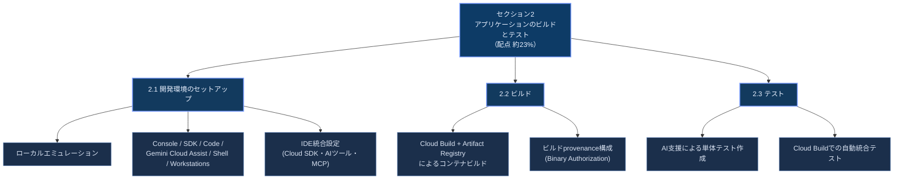
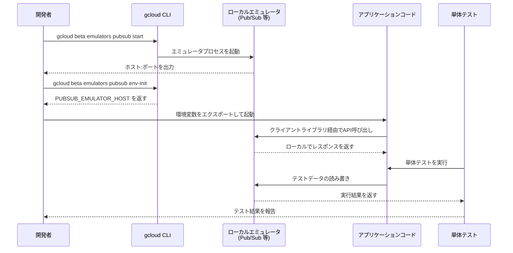
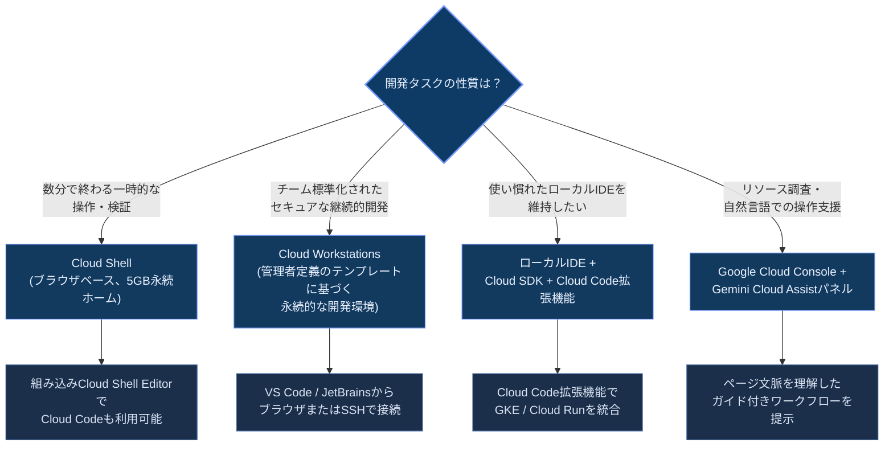
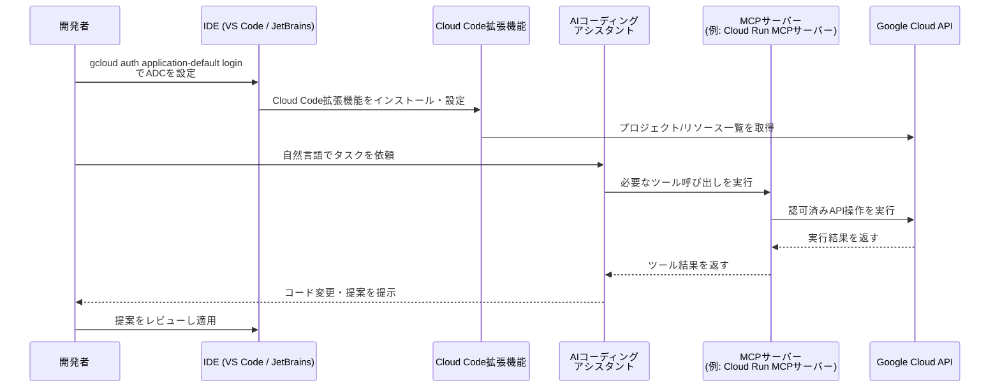
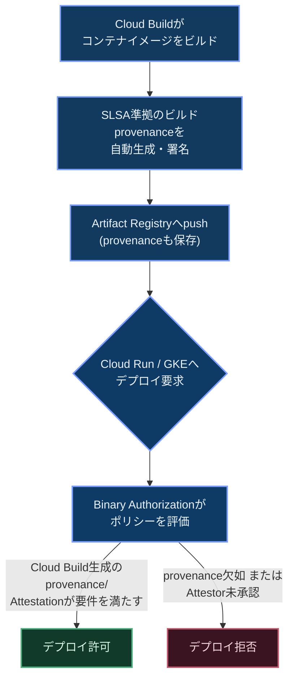
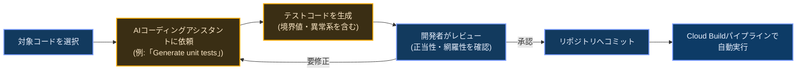
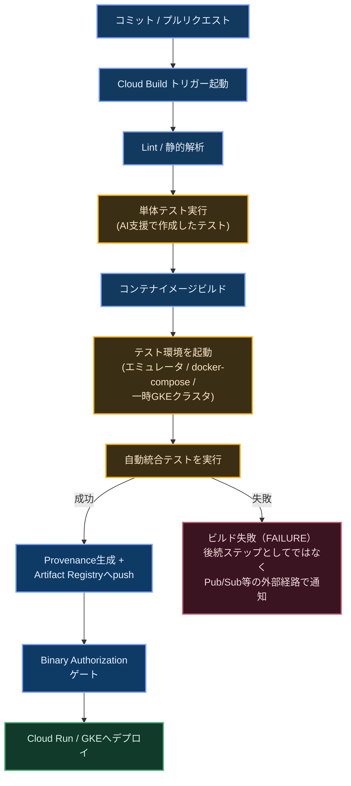

# Google Cloud Professional Cloud Developer 認定試験ガイド

## セクション2: アプリケーションのビルドとテスト（配点 約23%）

本ガイドは、Google Cloud公式の[Professional Cloud Developer認定ページ](https://cloud.google.com/learn/certification/cloud-developer)および公式[Exam Guide PDF](https://services.google.com/fh/files/misc/professional_cloud_developer_exam_guide_english.pdf)に基づき、試験の**セクション2「Building and testing applications（アプリケーションのビルドとテスト）」**（配点 約23%）を初学者向けにステップバイステップで解説するものです。

Exam Guideでは、セクション2は次の3つの小項目（considerations）で構成されています。

- **2.1 開発環境のセットアップ（Setting up your development environment）**
- **2.2 ビルド（Building）**
- **2.3 テスト（Testing）**

各項目について、「何を扱うサービス・機能か」「なぜ必要か」「どう使うか」「ベストプラクティスは何か」の順に解説し、根拠となる一次情報（Google Cloud公式ドキュメント）のURLを付記します。

> **ベストプラクティス**：本ガイド全体を通して、太字見出しの「ベストプラクティス」ブロックは公式ドキュメントおよび実践的なCI/CDパターンに基づく推奨事項をまとめたものです。実際の設計・実装の際は、必ず参照元の公式ドキュメントで最新の仕様を確認してください。

---

## 目次

1. [セクション2の全体像](#セクション2の全体像)
2. [2.1 開発環境のセットアップ](#21-開発環境のセットアップ)
   - [2.1.1 gcloud CLIによるGoogle Cloudサービスのローカルエミュレーション](#211-gcloud-cliによるgoogle-cloudサービスのローカルエミュレーション)
   - [2.1.2 Google Cloud Console・Cloud SDK・Cloud Code・Gemini Cloud Assist・Cloud Shell・Cloud Workstations](#212-google-cloud-consolecloud-sdkcloud-codegemini-cloud-assistcloud-shellcloud-workstations)
   - [2.1.3 IDEの構成（Cloud SDK・AIツール・MCPサーバー）](#213-ideの構成cloud-sdkaiツールmcpサーバー)
3. [2.2 ビルド](#22-ビルド)
   - [2.2.1 Cloud BuildとArtifact Registryによるコンテナのビルドと保存](#221-cloud-buildとartifact-registryによるコンテナのビルドと保存)
   - [2.2.2 Cloud Buildにおけるprovenanceの構成（Binary Authorization）](#222-cloud-buildにおけるprovenanceの構成binary-authorization)
4. [2.3 テスト](#23-テスト)
   - [2.3.1 AIコーディングアシスタントを活用した単体テストの作成](#231-aiコーディングアシスタントを活用した単体テストの作成)
   - [2.3.2 Cloud Buildでの自動統合テストの実行](#232-cloud-buildでの自動統合テストの実行)
5. [まとめ：セクション2の全体マップ](#まとめセクション2の全体マップ)
6. [参考文献](#参考文献)

---

## セクション2の全体像

セクション2は、「ローカル開発環境を整える」→「コードをビルドしてコンテナ化する」→「テストで品質と信頼性を担保する」という、ソフトウェア開発のインナーループ（内側の開発サイクル）を扱います。以下の図は、3つの小項目とその代表的なトピックの関係を示しています。



この3つの小項目は、実際のCI/CDパイプラインの中では独立した工程ではなく、「コミット → ビルド → テスト → デプロイ」という一連の流れの中でシームレスに連携します。本ガイドの最後（[まとめ](#まとめセクション2の全体マップ)）で、この一連の流れを1枚の図にまとめます。

---

## 2.1 開発環境のセットアップ

Exam Guideは2.1として次の3点を挙げています。

- Google Cloud CLI（gcloud CLI）を使ったGoogle Cloudサービスのエミュレーションによる、ローカルでのアプリケーション開発・単体テスト
- Google Cloud Console、Cloud SDK、Cloud Code、Gemini Cloud Assist、Cloud Shell、Cloud Workstationsの利用
- 適切な統合機能（Cloud SDK、AIツール［コーディングアシスタント、MCPサーバー］など）によるIDEの構成

### 2.1.1 gcloud CLIによるGoogle Cloudサービスのローカルエミュレーション

#### これは何か

gcloud CLIは、いくつかのGoogle Cloudサービスの**ローカルエミュレータ**をコンポーネントとして提供しています。エミュレータは実際のバックエンドサービスの動作をローカルマシン上で模倣するもので、クライアントライブラリから見ると本番サービスとほぼ同じAPIを呼び出せます。ただし、これらはgcloud CLI本体のインストールだけで使えるわけではなく、追加コンポーネントとしてのインストールが必要です。たとえばPub/Subエミュレータは`gcloud components install pubsub-emulator`で追加インストールします。gcloud CLIは、ローカルでの開発・テスト・検証のために、Bigtable、Cloud Datastore、Firestore、Spanner、Pub/Subのデータエミュレータを提供しています。

#### なぜ必要か

- 本番のGoogle Cloudリソースを作成せずに、コストゼロでクライアントコードを書ける
- ネットワークが不安定・オフラインの環境でも開発を継続できる
- 単体テストを高速かつ決定論的（何度実行しても同じ結果になる）に保てる
- CI/CDパイプライン内でも同じ仕組みをそのまま使い、テストの再現性を担保できる

#### 提供されているエミュレータの一覧

gcloudのemulatorsコマンドグループでは、Bigtable、Datastore、Firestore、Pub/Sub、Spannerのローカルエミュレータを管理できます。 コマンドの提供面で整理すると、FirestoreとSpannerは`gcloud emulators`コマンドグループから、Bigtable・Datastore・Pub/Subは`gcloud beta emulators`コマンドグループから起動します（コマンドグループの構成は変更される可能性があるため、利用時は必ず各公式コマンドリファレンスで最新の状態を確認してください）。

| エミュレータ | 提供コマンド | 主な用途 | 補足 |
|---|---|---|---|
| Firestore | `gcloud emulators firestore start` | ドキュメント指向DBのローカル開発・単体テスト | Native modeとDatastore modeの両方に対応 |
| Spanner | `gcloud emulators spanner start` | 分散リレーショナルDBのローカル開発 | 本番同様のAPI形状をローカルで再現 |
| Pub/Sub | `gcloud beta emulators pubsub start` | 非同期メッセージングの単体テスト | Push/Pullサブスクリプションの検証に利用 |
| Bigtable | `gcloud beta emulators bigtable start` | 大規模NoSQLワークロードのローカル検証 | インメモリで動作 |
| Datastore | `gcloud beta emulators datastore start` | 旧来のDatastore APIのローカルテスト | Firestore in Datastore modeへの移行を検討 |

#### 基本的な使い方（Pub/Subエミュレータの例）

エミュレータを使ったローカル開発の典型的な流れを、シーケンス図で示します。



Pub/Subエミュレータのコマンドライン引数の詳細はgcloud beta emulators pubsubのリファレンスを参照します。 エミュレータをコンテナとして動かす場合は、gCloud Dockerイメージをダウンロード・インストールし、コマンドプロンプトからpubsub startを呼び出すことでエミュレータをコンテナとして起動できます。

なお、Pub/Subエミュレータには本番との差異もあります。UpdateTopicやUpdateSnapshotのRPCは未サポートであり、IAM操作も未サポートです。またメッセージ保持期間の設定はサポートされておらず、すべてのメッセージは無期限に保持されます。

#### 実行環境の分離パターン（Testcontainersとの併用）

CI環境でエミュレータの起動・停止をテストコードに組み込みたい場合、OSS の Testcontainers ライブラリを使う方法も広く使われています。TestcontainersのGCloudモジュールは、Bigtable、Datastore、Firestore、Spanner、Pub/Subのエミュレータをサポートしており、Java、Go、.NET、Node.js、Pythonに対応しています。

> **ベストプラクティス**
> - ホスト名・ポートはハードコードせず、`FIRESTORE_EMULATOR_HOST` や `PUBSUB_EMULATOR_HOST` のような環境変数経由でクライアントライブラリに渡す（本番切り替え時にコード変更が不要になる）。
> - エミュレータはあくまで**開発・単体テスト用**であり、本番同等の性能・整合性・IAM挙動を完全に再現するものではない。結合テストや性能検証の最終段階では、実際のGoogle Cloudサービス（可能であれば専用のステージング環境）で検証する。
> - CI/CDパイプライン（Cloud Buildなど）でもローカルと同じエミュレータ起動コマンドを再利用し、「ローカルで通ったテストがCIでも同じ結果になる」状態を保つ。
> - Testcontainersのような仕組みを使うと、テストの前後でエミュレータコンテナを自動起動・終了でき、テスト間のデータ汚染を防ぎやすい。
>
> **出典**：[gcloud CLI（cloud.google.com/cli）](https://cloud.google.com/cli)、[gcloud emulators リファレンス](https://docs.cloud.google.com/sdk/gcloud/reference/emulators)、[gcloud beta emulators リファレンス](https://docs.cloud.google.com/sdk/gcloud/reference/beta/emulators)、[Pub/Subエミュレータでのローカルテスト](https://docs.cloud.google.com/pubsub/docs/emulator)、[Testcontainers Google Cloud Module](https://testcontainers.com/modules/google-cloud/)

---

### 2.1.2 Google Cloud Console・Cloud SDK・Cloud Code・Gemini Cloud Assist・Cloud Shell・Cloud Workstations

Exam Guideのこの項目は、「開発者が日常的に触れる各種のGoogle Cloud開発ツール」を横断的に理解しているかを問うものです。それぞれの役割と使い分けを整理します。

| ツール | 形態 | 主な役割 | 典型的な利用シーン |
|---|---|---|---|
| Google Cloud Console | ブラウザGUI | リソースの作成・確認・設定変更 | 初期セットアップ、ダッシュボード確認、権限設定 |
| Cloud SDK（gcloud CLI） | ローカル/Cloud Shellにインストールするコマンドラインツール群 | スクリプト化・自動化可能なリソース操作 | CI/CDスクリプト、繰り返し作業の自動化 |
| Cloud Code | IDE拡張機能（VS Code／JetBrains／Cloud Shell Editor） | GKE・Cloud Runアプリのローカル開発・デバッグ・デプロイ | コンテナアプリのインナーループ開発 |
| Gemini Cloud Assist | Cloud Consoleに統合されたAIアシスタントパネル | 自然言語での説明・提案・ガイド付きワークフロー | トラブルシューティング、コスト最適化、アーキテクチャ設計支援 |
| Cloud Shell | ブラウザベースの一時的なLinux VM＋ターミナル | インストール不要な即時アクセス | 一時的な検証、クイックスタート、ローカル環境がない状況 |
| Cloud Workstations | 管理者が定義したテンプレートに基づく永続的なマネージド開発環境 | チーム標準化されたセキュアな開発環境の提供 | エンタープライズでの開発環境統制、ソフトウェアサプライチェーンのセキュリティ強化 |

#### Google Cloud Console と Cloud SDK

Cloud ConsoleはWeb GUIで、視覚的にリソースを確認・操作できます。一方、Cloud SDK（gcloud CLI）は、同じGoogle Cloudサービスをターミナルからスクリプト・自動化しながら操作できるコマンドラインの手段を提供し、8,000を超えるコマンドで、ほぼすべてのGoogle Cloudサービス・製品を細かく管理・制御できます。

#### Cloud Code

Cloud Codeは、Google Kubernetes EngineやCloud RunなどのGoogle Cloudサービスを直接IDEに統合する拡張機能で、コンテキストスイッチをせずにアプリケーションを開発できるようにします。 VS Code、IntelliJをはじめとするJetBrains系IDEにインストールでき、Cloud Shell Editorにはデフォルトで組み込まれています。

Cloud Codeは、Google CloudのIDE拡張機能として、クラウドネイティブアプリケーションの開発ライフサイクルを高速化するために設計されたAI支援型のIDEプラグイン群です。 対応IDEにはVS Code、JetBrains系IDE（IntelliJ、PyCharm、GoLand、WebStormなど）、Cloud Workstations、ブラウザベースのCloud Shell Editorが含まれます。

#### Gemini Cloud Assist

Gemini Cloud Assistは、Cloud Console上で自然言語による支援を受けられる機能です。Gemini Cloud Assistパネルでは、自然言語のプロンプトを入力することで、詳細な説明や推奨アクション、ガイド付きワークフローを得られ、クラウドの専門家でなくてもタスクを効率的に完了できるようになります。

Gemini Cloud Assistは応答の精度を高めるため、いくつかのコンテキスト情報を利用します。具体的には、Google CloudプロジェクトID・組織ID、現在閲覧しているコンソールページのURLや表示内容（ページ文脈認識）、そしてセッション履歴を保持する記憶（メモリ）機能を活用し、複数ターンにわたる複雑なタスクでも文脈を維持します。

ここで注意したいのは、**Gemini Cloud Assist**（Cloud Console内のAIアシスタントパネル）と、後述する**Gemini Code Assist**（IDE向けのコーディング支援）は別の製品であるという点です。試験対策上もこの2つを混同しないことが重要です。

> **ベストプラクティス**
> - Gemini Cloud Assistはプレビュー期間中は無料で利用できますが、チャットパネルでの会話はGoogle Cloudデータセンターに保存され、180日経過後に自動削除されます。保存期間中はデータレジデンシーや管轄区域のコンプライアンス要件の対象となり得るため、そうした情報は入力しないようにする。
> - 同一プロジェクト内で`cloudaicompanion.topics.get`権限を持つユーザーは、Cloud ConsoleのUI上には表示されなくてもAPI経由で他ユーザーの会話履歴にアクセスできる。共有プロジェクトでは、この権限の付与範囲を最小限に絞る。
> - ページコンテキスト共有（閲覧中のコンソールページのURLや表示内容をGeminiに渡す機能）はデフォルトで有効になっている。機微な情報が表示された画面でGemini Cloud Assistを使う場合は、パネルの「その他の操作」→「ページコンテキスト共有」から無効化できる。
> - Gemini Cloud Assistの応答は早期段階の技術であり、もっともらしく見えても事実と異なる出力を生成することがあるため、利用前に必ず検証する。

#### Cloud Shell

Cloud Shellは、ブラウザからGoogle Cloudを学習・実験し、プロジェクトやリソースを管理できるインタラクティブなシェル環境です。 Google Cloud CLIやその他必要なユーティリティがあらかじめインストール・認証済みで、常に最新の状態で利用できます。 統合されたCloud Codeを備えたコードエディタも組み込まれており、クラウドから一切離れずにアプリのビルド・デバッグ・デプロイができます。

ストレージ面では、デフォルトで5GBの無料永続ディスクストレージが一時的に割り当てられた仮想マシンにプロビジョニングされ、これがホームディレクトリとなります。

#### Cloud Workstations

Cloud Workstationsは、組み込みのセキュリティと、事前設定済みながらカスタマイズ可能な開発環境を備えた、Google Cloud上のマネージド開発環境を提供します。 開発者にソフトウェアのインストールやセットアップスクリプトの実行を求める代わりに、環境を再現可能な形で定義するワークステーション構成を作成できます。

ワークステーション構成は、ワークステーションの仮想マシンインスタンスタイプ、永続ストレージ、環境を定義するコンテナイメージ、使用するIDE／コードエディタなどの詳細を定義するテンプレートとして機能します。 管理者やプラットフォームチームは、IAMルールを使ってチームや個々の開発者にアクセス権を付与することもできます。

セキュリティの観点でも、Cloud Workstationsはソフトウェアサプライチェーンの保護に重要な役割を果たします。Cloud Workstationsは、開発ワークフローやツール、ソフトウェア依存関係、ソフトウェアをビルド・デプロイするCI/CDシステム、GKEやCloud Runのようなランタイム環境のセキュリティ体制を改善するために、他のGoogle Cloud製品・機能と組み合わせて利用できるソフトウェアサプライチェーンセキュリティのコンポーネントの1つです。

#### どのツールを選ぶか（意思決定の目安）



> **ベストプラクティス**
> - 個人の一時的な検証にはCloud Shellを、組織全体でセキュリティ・コンプライアンスを統制したい継続的な開発にはCloud Workstationsを使い分ける。
> - ローカルでのセットアップは、環境構築だけで数日から数週間かかることがあり、その多くの時間が環境構築に費やされ、いわゆる「私の環境では動く」という設定ドリフト問題を招きやすい。Cloud Workstationsのようなマネージド環境は、この問題を構成テンプレートの一元管理によって解消する。
> - Cloud CodeはIDEを問わず（VS Code／JetBrains／Cloud Shell Editor）同じ体験を提供するため、チームメンバーが異なるIDEを使っていても、GKE/Cloud Run向けのワークフローを統一できる。
>
> **出典**：[gcloud CLI概要](https://cloud.google.com/cli)、[Cloud Code for VS Code 概要](https://docs.cloud.google.com/code/docs/vscode/overview)、[Gemini Cloud Assist 概要](https://docs.cloud.google.com/cloud-assist/overview)、[Gemini Cloud Assistの利用（チャットパネル）](https://docs.cloud.google.com/cloud-assist/chat-panel)、[Cloud Shellドキュメント](https://docs.cloud.google.com/shell/docs)、[Cloud Shellの使い方](https://docs.cloud.google.com/shell/docs/using-cloud-shell)、[Cloud Workstations概要](https://docs.cloud.google.com/workstations/docs/overview)、[Cloud Workstations GA発表ブログ](https://cloud.google.com/blog/products/application-development/cloud-workstations-managed-development-environment-is-now-ga)

---

### 2.1.3 IDEの構成（Cloud SDK・AIツール・MCPサーバー）

Exam Guideのこの項目では、「Cloud SDKやAIツール（コーディングアシスタント、MCPサーバー）などの適切な統合機能でIDEを構成すること」が問われます。

#### Cloud SDKとADC（Application Default Credentials）の設定

IDEからGoogle Cloud APIを呼び出すアプリケーションコードを実行するには、まずローカル環境の認証を設定する必要があります。ここで中心となるのがADC（Application Default Credentials）です。ADCは、アプリケーションの実行環境に基づいて認証ライブラリが自動的に資格情報を見つけるための戦略であり、Cloud Client LibrariesやGoogle API Client Librariesがこの資格情報を利用できるようにします。

`gcloud auth application-default`コマンドグループは、ローカルのアプリケーション開発で使用される、マシン上のアクティブな資格情報を管理するためのものであり、この資格情報はあくまで自分のアプリケーション内のGoogleクライアントライブラリからのみ使用されます。

重要な注意点として、gcloud CLI自体はGoogle Cloudリソースへのアクセスに際してADCを使用しないため、`gcloud auth login`（gcloud CLI自体の認証）と`gcloud auth application-default login`（ADCの設定）は目的の異なる別々のコマンドです。

| コマンド | 目的 | 影響範囲 |
|---|---|---|
| `gcloud auth login` | gcloud CLIコマンド自体を認証する | ターミナルからの`gcloud`コマンド実行 |
| `gcloud auth application-default login` | ADCを設定し、クライアントライブラリに資格情報を提供する | アプリケーションコード内のGoogle Cloudクライアントライブラリ呼び出し |

サービスアカウントの権限をローカルで再現したい場合は、なりすまし（impersonation）を使う方法もあります。サービスアカウントのなりすましを使ってローカルのADCファイルを設定するには、`gcloud auth application-default login --impersonate-service-account SERVICE_ACCT_EMAIL`を実行し、対象のサービスアカウントに対してService Account Token Creator（roles/iam.serviceAccountTokenCreator）のIAMロールを持っている必要があります。

ただし、なりすましによって生成されるADCファイルは、**すべての認証ライブラリでサポートされるとは限りません**。この方式を採用する前に、次の手順で対応状況を確認してください。

1. アプリケーションで使用するクライアントライブラリ（言語・バージョン）が、なりすまし形式のADC（`impersonated_service_account`タイプの資格情報）の読み取りに対応しているかを、該当ライブラリの認証ドキュメントで確認する。
2. 対応が確認できない場合、または動作しない場合は、代替として次のいずれかを使う。
   - **ユーザーADC**：`gcloud auth application-default login`（なりすましなし）でユーザー資格情報のADCを設定し、必要な権限は自分のユーザーアカウントに付与する。
   - **実行環境にアタッチしたサービスアカウント**：Cloud Workstations、Compute Engine、Cloud Runなど、サービスアカウントをアタッチできる環境上でコードを実行し、そのアタッチされたサービスアカウントの資格情報をADCとして自動取得させる。

#### Cloud Code拡張機能のインストールとAI支援

IDEにCloud Code拡張機能をインストールすると、Kubernetes向けのコマンドラインツール群とも連携します。Cloud CodeはSkaffold、minikube、kubectlといったGoogleのコンテナ関連コマンドラインツールと連携し、アプリのビルド・編集・実行・デプロイに応じてローカルで継続的なフィードバックを提供します。

AI支援については、Gemini Code Assistと連携し、コード補完・生成・チャットによるアシスタンスを提供することで、開発者がより速く効率的にコードを書けるようにします。

> ⚠️ **重要な最新情報（2026年6月時点）**：2026年6月18日より、Gemini Code Assist IDE拡張機能とGemini CLIは、個人向け（Gemini Code Assist for individuals）・Google AI Pro・Google AI Ultra各ティアのリクエスト処理を終了しました。該当ユーザーはAntigravityおよびAntigravity CLIへの移行が必要です。 なお、Gemini Code Assist Standard／Enterpriseの契約は今回の変更の影響を受けません。 試験対策としては、IDE統合の**考え方**（コード補完、コード生成、単体テスト生成、チャットによる支援）自体は変わらないため、この点を理解しておけば十分ですが、実際に製品を選定する際は必ず[Gemini Code Assistのリリースノート](https://docs.cloud.google.com/gemini/docs/codeassist/release-notes)で最新の提供状況を確認してください。

Gemini Code Assist（Standard／Enterprise）を使ったIDE内での操作は、次のような形で行います。コードエディタ内でコード補完を受け取ったり、コードを直接生成したりできるほか、IDE内でGeminiのアイコンをクリックすると対話型アシスタントが表示され、コードを選択した状態で「Write unit tests for my code.」「Help me debug my code.」のようなプロンプトを入力できます。

#### MCP（Model Context Protocol）サーバーによる拡張

Exam Guideが挙げるもう一つの統合対象が**MCPサーバー**です。MCPは、AIアシスタントを外部システムに接続するための標準プロトコルです。Model Context Protocol（MCP）は、大規模言語モデル（LLM）やAIアプリケーション・エージェントが外部のデータソースに接続する方法を標準化するものです。

IDE内のエージェントモードからMCPサーバーを設定することで、AIアシスタントの能力を拡張できます。エージェントモードでは、コードに関する質問をしたり、コンテキストや組み込みツールを使って生成内容を改善したり、MCPサーバーを設定してエージェントの能力を拡張したり、複数ステップにわたる複雑なタスクの解決策を得たりできます。 利用可能なツールの例には、grepやファイルの読み書きといった組み込みツール、ローカルまたはリモートのMCPサーバーとその実行可能な関数、独自のサービス実装などがあります。

Google Cloud自体も、公式のMCPサーバーを提供し始めています。例えばCloud Run向けのMCPサーバーは、Cloud Runサービスの作成・デプロイ、プロジェクト内のサービス一覧の表示、サービスの状態やURIの取得といったツールを提供します。デプロイ元はビルド済みのコンテナイメージでも、ソースコードのアーカイブでもよく、ビルド・コンテナ化・pushが常に実行されるわけではありません（既存イメージを指定した場合はこれらの工程は発生しません）。また、デプロイしたサービスのURIを取得することと、そのサービスへの未認証アクセス（公開アクセス）を許可することは別の操作であり、公開が必要な場合はIAMの設定を別途行う必要があります。 また、Gemini Cloud Assist自体もリモートMCPサーバーとして公開されており、Gemini CLIやChatGPT、Claude、独自に開発したアプリケーションなど各種AIアプリケーションと接続できます。

MCPサーバーとの認証には、通常のAPIキーではなくIAMベースの仕組みが使われる点も押さえておきましょう。Gemini Cloud AssistのリモートMCPサーバーはOAuth 2.0とIAMを組み合わせて認証・認可を行い、APIキーによる認証はサポートしていません。エージェントがMCPツールを使う際には、アクセス制御と監視ができるよう専用のIDを作成することが推奨されています。

#### IDE統合の全体フロー



> **ベストプラクティス**
> - ローカル開発では`gcloud auth login`と`gcloud auth application-default login`の両方を意識して使い分ける。前者はgcloudコマンド自体の認証、後者はアプリケーションコードが使うクライアントライブラリの認証であり、片方だけでは不十分な場面がある。
> - ユーザー認証情報のADCでクライアントライブラリを使う場合、どのプロジェクトのAPI割り当て（quota）を消費するかは**割り当てプロジェクト**で決まる。`gcloud auth application-default set-quota-project`などで割り当てプロジェクトを明示的に設定した場合、ADCのプリンシパルにはそのプロジェクトに対する`serviceusage.services.use`権限が必要になる。付与時はEditorやOwnerのような広範なロールではなく、最小権限の`roles/serviceusage.serviceUsageConsumer`を選ぶ。
> - APIの種類によって割り当てプロジェクトの決まり方が異なる点に注意する。Compute EngineのようなリソースベースのAPIは、操作対象リソースが属するプロジェクトがそのまま割り当てプロジェクトとして使われるため、明示設定がなくても動作する。一方、Cloud Translationのようなクライアントベースの（操作対象リソースを持たない）APIは、割り当てプロジェクトが明示的に構成されていないと呼び出しが失敗する。
> - 割り当てプロジェクトと課金先は別概念であり、「常にリソースを所有するプロジェクトへ課金される」とは限らない。課金先はAPIごとのルールに従う。例えばPub/Subでは、publish（発行）はトピックが属するプロジェクトへ、subscribe（受信）はサブスクリプションが属するプロジェクトへ課金されるため、トピックとサブスクリプションが別プロジェクトにある構成では課金先も分かれる。
> - AIコーディングアシスタントにMCPサーバーを接続する際は、通常のユーザーIDではなく専用のエージェント用IDを用意し、アクセス範囲を監視・制御できるようにする。
> - エージェントモードでMCPサーバーやツール呼び出しを許可する際は、エージェントがファイルシステムやターミナル操作にアクセスできる点を踏まえ、すべてのアクションを自動承認する設定は慎重に扱う。
> - IDE・AIツール・MCPサーバーの提供形態は変化が速い領域のため、製品選定時は必ず公式リリースノートで現在の提供状況を確認する。
>
> **出典**：[ADCの仕組み](https://docs.cloud.google.com/docs/authentication/application-default-credentials)、[ADCの資格情報の提供方法](https://docs.cloud.google.com/docs/authentication/provide-credentials-adc)、[ローカル開発環境向けADCの設定](https://docs.cloud.google.com/docs/authentication/set-up-adc-local-dev-environment)、[gcloud auth application-default リファレンス](https://docs.cloud.google.com/sdk/gcloud/reference/auth/application-default)、[Cloud Code for VS Code 概要](https://docs.cloud.google.com/code/docs/vscode/overview)、[Gemini Code AssistでのコーディングSmart Actions](https://docs.cloud.google.com/gemini/docs/codeassist/write-code-gemini)、[Gemini Code Assist エージェントモードの利用](https://developers.google.com/gemini-code-assist/docs/use-agentic-chat-pair-programmer)、[Gemini Code Assist リリースノート](https://docs.cloud.google.com/gemini/docs/codeassist/release-notes)、[Gemini Cloud AssistのリモートMCPサーバー](https://docs.cloud.google.com/cloud-assist/use-gemini-cloud-assist-mcp)

---

## 2.2 ビルド

Exam Guideは2.2として次の2点を挙げています。

- Cloud BuildとArtifact Registryを使って、ソースコードからコンテナをビルド・保存する
- Cloud Buildでprovenance（Binary Authorizationなど）を構成する

### 2.2.1 Cloud BuildとArtifact Registryによるコンテナのビルドと保存

#### Cloud Buildとは何か

Cloud Buildを使うと、依存関係の取得、単体テストの実行、静的解析、統合テストの実行、そしてdocker・gradle・maven・bazel・gulpといったビルドツールでのアーティファクト作成までを含むビルドを構成できます。 Cloud Buildはビルドを一連のビルドステップとして実行し、各ステップはDockerコンテナ内で実行されます。これはスクリプト内でコマンドを実行するのと似ています。

ビルドステップの提供元には複数の選択肢があります。Cloud Buildおよびそのコミュニティが公開しているオープンソースのビルドステップ、コミュニティが提供するビルドステップ、そして自分で作成するカスタムビルドステップです。 各ビルドステップは、cloudbuildという名前のローカルDockerネットワークに接続された状態で、それぞれのコンテナ上で実行されます。

セキュリティ面でも標準で配慮されています。Cloud BuildはデフォルトでCMEK（顧客管理の暗号鍵）準拠を提供しており、ユーザー側で特に何かを設定する必要はありません。ビルド実行時の永続ディスクは、ビルドごとに生成される一時的な鍵で暗号化され、ビルド完了と同時にその鍵はメモリから消去・破棄されます。

#### Artifact Registryとは何か

Artifact Registryは、統合されたGoogle Cloud体験の一部として、アーティファクトとビルドの依存関係を一元的に保存できるようにするもので、パッケージとDockerコンテナイメージを保存・管理するための単一の場所を提供します。

Artifact Registryでできる主なことは次の通りです。Google CloudのCI/CDサービスや既存のCI/CDツールとの統合、Cloud Buildからのアーティファクト保存、GKE・Cloud Run・Compute Engine・App Engineフレキシブル環境を含むGoogle Cloudランタイムへのアーティファクトのデプロイ、IAMによる一貫した資格情報とアクセス制御の提供、ソフトウェアサプライチェーンの保護などです。

Cloud BuildとArtifact Registryの連携は密接です。Artifact Registryは、Cloud Buildをはじめとする継続的デリバリー・継続的インテグレーションシステムと統合し、ビルド成果物のパッケージを保存できます。ビルドやデプロイに使う信頼済みの依存関係も保存できます。

#### 典型的なビルド〜保存パイプライン

```mermaid
flowchart LR
    Src["ソースコード<br/>(Cloud Source Repositories /<br/>GitHub / GitLab)"] -->|"push / PR"| Trig["Cloud Build<br/>トリガー"]
    Trig --> Step1["ステップ1<br/>依存関係取得 / Lint"]
    Step1 --> Step2["ステップ2<br/>単体テスト実行"]
    Step2 --> Step3["ステップ3<br/>コンテナイメージビルド<br/>(Docker / Kaniko / Buildpacks)"]
    Step3 --> Step4["ステップ4<br/>Artifact Registryへpush"]
    Step4 --> AR[("Artifact Registry<br/>コンテナ/パッケージ<br/>リポジトリ")]
    AR --> Scan["Artifact Analysisによる<br/>脆弱性スキャン<br/>（Container Scanning API有効時）"]

    classDef stage fill:#123a5e,stroke:#7c9eff,color:#eaf1ff,stroke-width:2px
    classDef store fill:#0d3b66,stroke:#7c9eff,color:#eaf1ff,stroke-width:2px
    classDef end1 fill:#1b2f4b,stroke:#4a6fa5,color:#dbe4f3

    class Trig,Step1,Step2,Step3,Step4 stage
    class AR store
    class Src,Scan end1
```



イメージのpush先を指定してビルドを実行する場合、`cloudbuild.yaml`は次のような形になります（構文の概念を示す簡略例です）。

```yaml
steps:
  - name: 'gcr.io/cloud-builders/docker'
    args:
      - 'build'
      - '-t'
      - 'us-central1-docker.pkg.dev/$PROJECT_ID/my-repo/my-app:$SHORT_SHA'
      - '.'
images:
  - 'us-central1-docker.pkg.dev/$PROJECT_ID/my-repo/my-app:$SHORT_SHA'
```

`cloudbuild.yaml`の主要フィールドは次の通りです。

| フィールド | 説明 |
|---|---|
| `steps` | 順番に（または`waitFor`指定で並列に）実行されるビルドステップの配列 |
| `steps[].name` | ステップを実行するビルダーコンテナイメージ |
| `steps[].args` | ビルダーコンテナに渡す引数 |
| `steps[].waitFor` | このステップが待機する先行ステップのID（並列実行の制御に使用） |
| `images` | ビルド成功時にArtifact Registryへpushするイメージの一覧 |
| `substitutions` | `$PROJECT_ID`や`$SHORT_SHA`など、ビルド時に置換される変数 |

`$SHORT_SHA`の扱いには注意が必要です。`$SHORT_SHA`はビルドトリガー経由の実行では自動的に設定されますが、手元から`gcloud builds submit`を直接実行した場合は自動設定されず、未指定のままだと空文字列になります。手動実行時は`$BUILD_ID`やユーザー定義の`$_IMAGE_TAG`を使うか、`--substitutions=SHORT_SHA=...`で明示的に値を渡します。

Artifact Registryへイメージを保存するもう一つの代表的な方法として、`cloudbuild.yaml`のようなビルド構成ファイルを用意せずに`gcloud builds submit`を直接呼び出すシンプルな方法もあります。この場合もビルドはローカルで実行されるのではなくCloud Buildへ送信されます。`-t`（`--tag`）を指定すると、カレントディレクトリのソースに含まれる`Dockerfile`からイメージをビルドするビルド構成がCloud Build側で暗黙に生成され、ビルドされたイメージが自動的にArtifact Registryへpushされます。実際のコマンドは`gcloud builds submit . -t LOCATION-docker.pkg.dev/PROJECT_ID/REPO/IMAGE:TAG`のようになります。この`-t`指定によるシンプルな経路は、あくまでビルドとpushだけを目的とした手順であり、Binary Authorizationによるデプロイ時の検証を前提とした経路ではありません。Binary Authorizationで保護するリリース経路を構築する場合は、後述の[2.2.2](#222-cloud-buildにおけるprovenanceの構成binary-authorization)のとおり`cloudbuild.yaml`を使い、`images`フィールドと`options.requestedVerifyOption: VERIFIED`を明示的に指定する必要があります。

自動スキャンには前提条件があります。Container Scanning APIを有効化している場合、標準（standard）リポジトリへpushされたイメージと、リモート（remote）リポジトリにキャッシュされたイメージが自動スキャンの対象になります。リモートリポジトリは外部レジストリへのプルスルーキャッシュであり、`push`という操作自体を受け付けない点に注意してください（自動スキャンの対象になるのは、プルを経てリモートリポジトリにキャッシュされたイメージです）。複数のリポジトリを束ねるバーチャル（virtual）リポジトリはイメージそのものを保持しないため、自動スキャンの対象外です。それ以外の対応リポジトリ形式では、リポジトリ単位でスキャンを有効化する必要があります。Container Analysisをその他の情報と統合することで、そのメタデータに基づいた意思決定が可能になります。例えば、信頼できるレジストリからの準拠したイメージのみをデプロイ対象として許可するデプロイポリシーを、Binary Authorizationで作成できます。

> **ベストプラクティス**
> - イメージのタグに`latest`を使わず、Gitのコミットハッシュ（`$SHORT_SHA`）やセマンティックバージョンなど、一意で追跡可能な値を使う。ロールバックや監査の際に、どのソースからビルドされたイメージかを一意に特定できるようにするため。
> - Cloud BuildのサービスアカウントにはArtifact Registryへの書き込みなど、そのパイプラインに必要最小限のIAMロールのみを付与する（最小権限の原則）。
> - Artifact Registryのスキャン機能（コンテナ脆弱性スキャンやオンデマンドスキャン）を有効化し、脆弱性が検出された場合にパイプラインを止めるスキャンゲートを設けることで、本番デプロイ前の段階で問題を検知する。
> - 依存関係のダウンロードやDockerレイヤーのキャッシュを活用し、ビルド時間を短縮する。
> - ステージング用と本番用でArtifact Registryのリポジトリを分離し、IAMでアクセスを制御する。
>
> **出典**：[Cloud Buildの概要](https://docs.cloud.google.com/build/docs/overview)、[Artifact Registryの概要](https://docs.cloud.google.com/artifact-registry/docs/overview)、[Artifact Registryへのビルド成果物の格納](https://docs.cloud.google.com/artifact-registry/docs/build)、[Cloud BuildとArtifact RegistryによるセキュアなビルドとGKEへのデプロイ（Codelab）](https://codelabs.developers.google.com/secure-build-deploy-cloud-build-ar-gke)

---

### 2.2.2 Cloud Buildにおけるprovenanceの構成（Binary Authorization）

#### provenance（来歴情報）とは何か

「provenance」とは、ソフトウェア成果物（コンテナイメージなど）が**いつ・何から・どのようなプロセスでビルドされたか**を証明する、検証可能なメタデータのことです。Cloud Buildは、SLSA（Supply-chain Levels for Software Artifacts）バージョン0.1および1.0の仕様に基づいたレベル3相当のビルドprovenance生成をサポートしています。SLSA v1.0仕様のサポートの一部として、Cloud BuildはビルドprovenanceにbuildType詳細を含めており、ビルドプロセスに使われたパラメータ化テンプレートや、Cloud Buildが記録する値・その値の出所を理解するために利用できます。

適用範囲には注意が必要です。Cloud Buildは、Artifact Registryに保存されたアーティファクトについてのみビルドprovenanceを生成します。前掲の`cloudbuild.yaml`のように`images`フィールドでpush先を指定するのは正しい書き方ですが、ビルドステップ内で明示的に`docker push`を実行した場合はprovenanceが生成されないことがあります。

さらに、provenanceを生成できなかったビルドを「成功」として扱わないために、`options.requestedVerifyOption`に`VERIFIED`を指定します。

```yaml
options:
  requestedVerifyOption: VERIFIED
```

この設定により、provenanceの生成に失敗したビルドはビルド自体が失敗として扱われ、検証されていないイメージが後続のデプロイへ流れることを防げます。

`requestedVerifyOption: VERIFIED`はCloud Buildそのものの成否を左右する設定であり、デプロイの許可・拒否を決めるものではない点に注意してください。デプロイ時に未検証イメージを拒否するにはBinary Authorization側の設定が別途必要です。具体的には、Cloud Buildはプロジェクトに`built-by-cloud-build`という名前のアテスターを自動作成し、ビルドしたイメージへ自動的にアテステーションを付与します。Binary Authorizationのポリシーで`evaluationMode: REQUIRE_ATTESTATION`を指定し、`requireAttestationsBy`にこの`built-by-cloud-build`アテスター（例: `projects/PROJECT_ID/attestors/built-by-cloud-build`）を列挙しておくことで、Cloud Buildによって生成されていないイメージのデプロイをブロックできます。このプロセスにより、認可されていないソフトウェアがデプロイされるリスクを低減できます。

#### SLSAレベルとGoogle Cloudでの実現手段

Cloud Buildは、検証可能なソースコード管理、自動検証済みのprovenance、Binary Authorizationのようなツールといった技術を使って、より高いSLSAレベルに到達するためのホスト型ソフトウェアビルドシステムの基盤を提供します。ビルドプロセスを完全に自動化し、本番ワークフローではビルドシステムの利用を必須とし、Cloud Buildでソフトウェアパイプラインを構築することで、最初からSLSA 1相当のサプライチェーンを実現できます。

| 観点 | 説明 | Cloud Build / Google Cloudでの対応 |
|---|---|---|
| ビルドの自動化 | 手作業を排除し、再現可能なビルドプロセスを持つ | Cloud Buildの`cloudbuild.yaml`による宣言的パイプライン |
| provenance生成 | ビルド成果物の出所を検証可能な形で記録する | Cloud BuildがSLSA準拠のprovenanceを自動生成・署名 |
| デプロイ時の検証 | 検証済みのアーティファクトのみをデプロイ許可する | Binary Authorizationによるポリシーベースの許可制御 |
| 署名鍵の管理 | ビルド・アテステーションの署名鍵を安全に管理する | Cloud KMSによる鍵管理 |

provenanceの生成（SLSA 1）とセキュアなビルド（SLSA 2）を実現していても、それだけでは未検証のイメージが本番にデプロイされることを防げません。Binary Authorizationは、署名（アテステーション）された信頼できるイメージのみをデプロイ可能にすることで、そのギャップを埋めます。

Binary Authorizationには役割分担の考え方があります。ポリシー作成者（Policy Creator）は、イメージがデプロイ可能と見なされるために満たすべきルールや、どのアテスターが承認する必要があるか、そして強制モード（厳格ブロック、監査のみ、無効化など）を定義するBinary Authorizationのポリシーを作成・維持します。アテスター（Attestor）は、検証用の公開鍵を保持し、デプロイ時にそのイメージダイジェストに対する署名済みアテステーションを検証するBinary Authorizationのリソースです。イメージ自体のレビューを行うのは、統合テストや回帰テストの合格、既知の脆弱性のスキャン、ビジネス上の承認や変更管理要件の充足といった特定のコンプライアンス要件を確認する**署名者**（例: CI/CDパイプライン）であり、署名者はその確認結果としてイメージダイジェストに対するアテステーションを作成・署名します。

#### provenance生成からデプロイ許可までの流れ



生成されたprovenanceは、コマンドラインから直接確認・検証することもできます。provenanceの取得、`slsa-verifier`による検証、そしてデプロイという一連の処理では、タグではなく同一の不変なイメージダイジェスト（`IMAGE=LOCATION-docker.pkg.dev/PROJECT_ID/REPO/IMAGE_NAME@sha256:<HASH>`）を`IMAGE`として固定し、すべての処理で同じダイジェストを参照する必要があります。タグは後から別のイメージを指すよう変更され得るため、タグ基準では「検証したイメージ」と「デプロイされるイメージ」が一致する保証がありません。なお、`slsa-verifier`は検証対象イメージをレジストリから取得するため、非公開のArtifact Registryを使う場合は事前に`gcloud auth configure-docker LOCATION-docker.pkg.dev`（`LOCATION`はリポジトリのリージョン）を実行し、Dockerクライアントの認証ヘルパーを設定しておきます。イメージのprovenanceを取得してJSONとして保存するには、`gcloud artifacts docker images describe $IMAGE --format json --show-provenance > provenance.json`のようなコマンドを実行し、`slsa-verifier verify-image $IMAGE --provenance-path provenance.json --source-uri=github.com/OWNER/REPO --builder-id=https://cloudbuild.googleapis.com/GoogleHostedWorker`のように、保存した`provenance.json`と期待するビルダーID（Cloud Buildの場合`https://cloudbuild.googleapis.com/GoogleHostedWorker`）を指定して同じ`$IMAGE`（ダイジェスト形式）に対する検証を行った上で、そのダイジェストのままデプロイコマンドに渡します。

Binary Authorization側でSLSAの継続的な検証を行う仕組みもあります。Binary Authorizationの継続的検証（CV）のSLSAチェックを利用するには、Cloud BuildでSLSA準拠のprovenanceを生成しつつイメージをビルドする必要があります。このチェックがサポートする唯一の信頼済みビルダーはCloud Buildです。

> **ベストプラクティス**
> - Binary Authorizationのポリシーは「デフォルト拒否（default-deny）」を基本とし、Cloud Buildで生成されたprovenance／アテステーションを持つイメージのみを明示的に許可する構成にする。
> - provenanceを持たないイメージを許可リストで一時的に例外扱いする場合でも、その例外を最小限にとどめ、違反をログに記録する運用と組み合わせる。
> - 本番環境へのデプロイパイプラインでは、Cloud Build以外の経路でビルドされたイメージ（開発者のローカル環境で手動push されたイメージなど）を拒否するポリシーを設定し、CI/CDパイプラインを唯一の信頼できるビルド経路にする。
> - SLSA検証ツール（`slsa-verifier`など）を使い、provenanceがビルド元のソースリポジトリ・ビルダーIDと一致していることを定期的に確認する。
> - 署名鍵はCloud KMSで一元管理し、鍵のローテーション・アクセス権限をIAMで統制する。
>
> **出典**：[ビルドprovenanceの生成と検証](https://docs.cloud.google.com/build/docs/securing-builds/generate-validate-build-provenance)、[Binary AuthorizationのSLSAチェック](https://docs.cloud.google.com/binary-authorization/docs/cv-slsa-check)、[GoogleによるSLSAフレームワークの紹介](https://cloud.google.com/blog/products/application-development/google-introduces-slsa-framework)、[Cloud Buildの概要](https://docs.cloud.google.com/build/docs/overview)

---

## 2.3 テスト

Exam Guideは2.3として次の2点を挙げています。

- AIコーディングアシスタントの支援を受けて単体テストを書く
- Cloud Buildで自動統合テストを実行する

### 2.3.1 AIコーディングアシスタントを活用した単体テストの作成

#### AIによる単体テスト生成の仕組み

Gemini Code Assist（Standard／Enterprise）は、IDE上でコードを選択し、スマートアクションから単体テストを生成できます。選択したコードを右クリックし、「Generate unit tests」のようなスマートアクションを選ぶと、Gemini Code Assistツールウィンドウにそのプロンプトに対する応答が自動的に生成されます。

チャットベースでも同様の依頼が可能です。コードエディタ内でコード補完を受けたり、コメントから関数やコードブロック全体を生成したり、単体テストを生成したり、デバッグ・コード理解・ドキュメント作成の支援を受けたりできます。

より具体的なプロンプトの書き方としては、対象コードを明示し、期待するテストフレームワークやモックのパターンを指定することが推奨されています。チャットでは「Write unit tests for UserService.create using Jest. Match existing mock patterns.」のように具体的に指示し、コードを選択してから質問するとより良い結果が得られます。

#### AI生成コードのレビューという原則

AIが生成したコード（テストコードを含む）は、そのまま無条件に信頼してよいものではありません。Finish Changesや概要（Outlines）といった新しいエージェント型の機能を使う場合も、他のAIエージェントの成果物と同じ厳格さで差分をレビューする必要があります。

#### AI支援による単体テスト作成のワークフロー



#### 現在の提供状況について

前述の通り、2026年6月18日より、Gemini Code AssistのIDE拡張機能とGemini CLIは個人向け・Google AI Pro・Google AI Ultra各ティアでのリクエスト処理を終了し、該当ユーザーはAntigravityおよびAntigravity CLIへの移行が案内されています。 Antigravityは、より自律的なエージェント型のIDEとして位置づけられています。Antigravityでは、AIが自律的なジュニア開発者のように振る舞い、計画を立て、テストを実行し、Web上を自律的に操作できます。開発者は「Manager」ビューを開いて高レベルの指示を与え、AIがバックグラウンドでコードを書き、内蔵ブラウザでUIを確認し、問題を自律的に修正し、最終的に動作確認済みの「Artifact」として成果物を提示します。

Google Cloud認定試験の観点では、製品名やティアの変遷そのものよりも、「**AIコーディングアシスタントを使って単体テストを生成し、必ず人間がレビューしてからCI/CDパイプラインに組み込む**」という一連の考え方を理解しておくことが重要です。

> **ベストプラクティス**
> - AIに単体テストの生成を依頼する際は、対象のコードを明示的に選択し、使用するテストフレームワーク・既存のモックパターン・カバレッジ観点（正常系・境界値・異常系）を具体的に指示する。
> - 生成されたテストは、期待値のロジックが本当に正しいか（テストがバグを覆い隠していないか）を人間がレビューしてからコミットする。テストが「常に成功する」だけの無意味なテストになっていないかを確認する。
> - AI支援で作成した単体テストであっても、最終的にはCloud Buildパイプラインの一部として自動実行し、レビュー時点だけでなく継続的に品質を担保する。
> - コード生成・テスト生成AIツールのティア・提供形態は変化が速いため、組織として採用する製品は定期的にリリースノートを確認し、移行が必要な変更がないかを把握する。
>
> **出典**：[Gemini Code Assist Standard／Enterprise 概要](https://docs.cloud.google.com/gemini/docs/codeassist/overview)、[Gemini Code AssistでのコーディングSmart Actions](https://docs.cloud.google.com/gemini/docs/codeassist/write-code-gemini)、[Gemini Code Assist リリースノート](https://docs.cloud.google.com/gemini/docs/codeassist/release-notes)

---

### 2.3.2 Cloud Buildでの自動統合テストの実行

#### 単体テストと統合テストの違い

| 観点 | 単体テスト | 統合テスト |
|---|---|---|
| 目的 | 個々の関数・クラスのロジックを検証する | 複数のコンポーネント・サービス間の連携を検証する |
| 実行速度 | 高速 | 相対的に低速（依存サービスの起動が必要） |
| 依存関係 | モック・スタブで外部依存を排除することが多い | データベース、メッセージング、他サービスなど実際に近い依存関係を使う |
| 典型的な実行場所 | ローカル環境・Cloud Buildの早い段階 | ローカルエミュレータ・docker-compose・一時的なGKEクラスタ・Cloud Build後半 |
| AIコーディングアシスタントの活用点 | テストコード自体の生成 | テストシナリオの洗い出し、モックデータ生成の補助 |

#### Cloud Buildで統合テストを実行する代表的なパターン

Cloud Build上で複数コンテナにまたがる統合テストを実行する手法として、大きく次の2つのパターンがよく使われます。

1. **docker-composeパターン**：複数サービスをdocker-composeで起動し、Cloud Buildの共有ネットワーク上でテストを実行する
2. **一時的なGKEクラスタパターン**：テストのたびに使い捨てのGKEクラスタ（または既存クラスタ）にサービス群をデプロイし、実クラスタに近い環境で統合テストを行う

Google Cloud公式のサンプルリポジトリ（cloudbuild-integration-testing）では、マイクロサービスアプリケーションの統合テストにCloud Buildを使うテクニックが示されています。

docker-composeパターンでは、Cloud Build特有のネットワーク構成を理解しておく必要があります。Cloud Build上のすべてのコンテナはcloudbuildという名前のネットワーク内で動作するため、docker-compose用の設定ファイルにもこのネットワークをデフォルトとして追加することで、CIステップからdocker-composeサービスへ接続できるようになります。

ステップ間の依存関係を制御する`waitFor`も重要な要素です。`waitFor`キーを使うと、あるステップが特定の先行ステップの完了だけを待つよう指定でき、これにより一部のジョブを並列実行できます。 典型的なパターンとしては、静的解析（lint）、Dockerイメージのビルド、Cloud Runサービスとしてのデプロイという一連の流れを各サービスごとに用意し、そこにテストスイートを組み込む形が挙げられます。

GKEを使う統合テストパターンでは、事前にクラスタとIAM権限を準備します。既存のKubernetesクラスタにデプロイする場合はCloud Buildのサービスアカウントに`roles/container.developer`ロールを、テストごとに新しいクラスタを作成・削除・更新する場合は`roles/container.admin`ではなく、その用途に絞られた`roles/container.clusterAdmin`を付与します。カスタムのノードサービスアカウントを使う構成では、Cloud Buildのサービスアカウントにそのノードサービスアカウントへの`iam.serviceAccounts.actAs`権限（`roles/iam.serviceAccountUser`）も必要です。クラスタ内のKubernetesオブジェクト操作についてはIAMロールを広げるのではなく、必要な操作だけを許可するKubernetes RBAC（Role / RoleBinding）で設定します。

#### 統合テストの失敗時の挙動

Cloud Buildのステップは`waitFor`が示す依存関係に基づいて実行されます。`waitFor`を省略した場合は直前のステップの完了を暗黙に待つため、本ガイドで扱うような一直線のパイプラインでは事実上直列実行になります。あるステップが失敗すると、そのステップに`waitFor`で依存している後続ステップは起動されず、ビルド全体のステータスも失敗（`FAILURE`）になります。 これはCI全体の設計として重要な性質で、統合テストが失敗した場合に不完全な状態のままイメージをArtifact Registryへpushしたり、Binary Authorizationのprovenance生成に進んだりしないようにできます（一方で、失敗したステップに依存しない別系統の並列ステップは、`waitFor`の依存関係が無い限り影響を受けません）。

ビルド失敗の「通知」は、後続のビルドステップとして実行されるわけではない点に注意してください。ステップの失敗はビルドリソースのステータスを`FAILURE`へ遷移させるだけであり、Slack通知やチケット起票のような能動的な通知を行いたい場合は、Cloud Buildの通知機能（Pub/Subトピックへのビルドイベント発行とNotifierの購読）のような、ビルドステップの外側にある仕組みを別途構成する必要があります。

ただし、この「失敗したら止まる」挙動には**明示的な例外**があります。ステップに`allowFailure: true`を設定した場合、またはそのステップの終了コードが`allowExitCodes`に列挙されている場合、そのステップの失敗は例外として扱われ、**後続のステップがそのまま実行され、ビルド全体も失敗になりません**（ビルドのステータスは成功のまま記録されます）。

したがって、統合テストを**品質ゲートとして機能させたい場合は、統合テストのステップに`allowFailure`と`allowExitCodes`を設定してはいけません**。これらを使ってよいのは、失敗してもデプロイ可否の判断に影響しない補助的なステップ（任意のレポート送信、ベストエフォートのキャッシュ更新、通知など）に限られます。

#### Cloud Buildパイプライン全体像（ビルド〜テスト〜デプロイ）

セクション2で扱った内容を、実際のCI/CDパイプラインの1本の流れとしてまとめると、次のようになります。



この図は、本ガイドで解説してきた2.1（開発環境）、2.2（ビルド）、2.3（テスト）の各要素が、実際のパイプラインの中でどのように直列に組み合わさるかを示しています。ローカルのエミュレータ（2.1.1）で検証した内容と同じ構成をCloud Build内のテスト環境（2.3.2）でも再利用することで、「ローカルで通ったものはCIでも通る」という一貫性を保てます。

> **ベストプラクティス**
> - 統合テストで使う依存サービス（データベース、メッセージングなど）は、可能な限り2.1.1で紹介したエミュレータやコンテナ化されたテスト用インスタンスを使い、テストごとに独立したクリーンな状態から開始する。
> - Cloud Buildの`cloudbuild`共有ネットワークを前提としたdocker-compose構成にしておくことで、追加の設定なしにCIステップ間で通信できるようにする。
> - 並列実行できるステップ（lintと単体テストなど、互いに依存しない処理）は`waitFor`を活用して並列化し、パイプライン全体の実行時間を短縮する。
> - 統合テストが失敗した場合はパイプラインをそこで止め、provenance生成やデプロイに進まないようにする（あるステップの失敗で後続ステップの実行を止めるというCloud Buildの既定動作を積極的に活用する）。このとき、統合テストのステップには`allowFailure: true`や`allowExitCodes`を設定しないこと。設定するとステップの失敗が例外扱いとなり、後続ステップが実行されてビルド全体も失敗にならないため、品質ゲートとして機能しなくなる。
> - GKEを使った統合テストでは、テストごとに使い捨てクラスタを作る方式（分離性が高いがコスト・起動時間がかかる）と、既存の共有クラスタを使う方式（速いが名前空間分離などの設計が必要）を、テストの目的とコストのバランスで選択する。
> - 統合テストの成功をBinary Authorizationのアテステーション要件の1つとして組み込み、「統合テストを通過したイメージだけがデプロイ可能」という状態を、人手のチェックではなくポリシーとして強制する。
>
> **出典**：[Cloud Buildの概要](https://docs.cloud.google.com/build/docs/overview)、[cloudbuild-integration-testing（GoogleCloudPlatform公式サンプル）](https://github.com/GoogleCloudPlatform/cloudbuild-integration-testing)

---

## まとめ：セクション2の全体マップ

| 小項目 | 中心となるサービス・機能 | 押さえるべきキーワード |
|---|---|---|
| 2.1 開発環境のセットアップ | gcloud CLIエミュレータ、Cloud Code、Gemini Cloud Assist、Cloud Shell、Cloud Workstations、ADC、MCPサーバー | ローカルエミュレーション、マネージド開発環境、IDE統合、AIコーディングアシスタント |
| 2.2 ビルド | Cloud Build、Artifact Registry、Binary Authorization | `cloudbuild.yaml`、コンテナビルド、SLSA、provenance、アテステーション |
| 2.3 テスト | Gemini Code Assist（単体テスト生成）、Cloud Build（統合テスト） | AI支援テスト生成、docker-compose、一時GKEクラスタ、`waitFor` |

セクション2全体を通じて一貫しているのは、「**ローカルでの高速なフィードバックループ**（エミュレータ・IDE統合）」と「**CI/CDパイプラインでの再現可能かつ検証可能なビルド・テスト**（Cloud Build・Artifact Registry・Binary Authorization）」という2つの軸です。試験対策としては、それぞれのサービスが「どの工程で」「何を目的に」使われるのかを、単なる用語の暗記ではなく一連のパイプラインの流れとして理解しておくことが重要です。

---

## 参考文献

### 開発環境（2.1関連）

- [gcloud CLI（コマンドラインインターフェース）概要](https://cloud.google.com/cli)
- [gcloud beta emulators コマンドリファレンス](https://docs.cloud.google.com/sdk/gcloud/reference/beta/emulators)
- [Pub/Subエミュレータを使ったローカルテスト](https://docs.cloud.google.com/pubsub/docs/emulator)
- [Testcontainers Google Cloud Module](https://testcontainers.com/modules/google-cloud/)
- [Cloud Code for VS Code 概要](https://docs.cloud.google.com/code/docs/vscode/overview)
- [Cloud Code for IntelliJ 概要](https://docs.cloud.google.com/code/docs/intellij/overview)
- [Gemini Cloud Assist 概要](https://docs.cloud.google.com/cloud-assist/overview)
- [Gemini Cloud Assistの利用（Cloud Consoleのチャットパネル）](https://docs.cloud.google.com/cloud-assist/chat-panel)
- [Gemini Cloud Assist（製品ページ）](https://cloud.google.com/products/gemini/cloud-assist)
- [Gemini Cloud Assistのセットアップ](https://docs.cloud.google.com/gemini/docs/cloud-assist/set-up-gemini)
- [Cloud Shellドキュメント](https://docs.cloud.google.com/shell/docs)
- [Cloud Shellの使い方](https://docs.cloud.google.com/shell/docs/using-cloud-shell)
- [Cloud Workstations概要](https://docs.cloud.google.com/workstations/docs/overview)
- [Cloud Workstationsマネージド開発環境のGA発表（Google Cloudブログ）](https://cloud.google.com/blog/products/application-development/cloud-workstations-managed-development-environment-is-now-ga)
- [ADC（Application Default Credentials）の仕組み](https://docs.cloud.google.com/docs/authentication/application-default-credentials)
- [ADCの資格情報を提供する方法](https://docs.cloud.google.com/docs/authentication/provide-credentials-adc)
- [ローカル開発環境向けADCの設定](https://docs.cloud.google.com/docs/authentication/set-up-adc-local-dev-environment)
- [gcloud auth application-default コマンドリファレンス](https://docs.cloud.google.com/sdk/gcloud/reference/auth/application-default)
- [Gemini Code Assist Standard／Enterprise 概要](https://docs.cloud.google.com/gemini/docs/codeassist/overview)
- [Gemini Code AssistでのコーディングSmart Actions](https://docs.cloud.google.com/gemini/docs/codeassist/write-code-gemini)
- [Gemini Code Assist エージェントモードの利用（MCPサーバー設定を含む）](https://developers.google.com/gemini-code-assist/docs/use-agentic-chat-pair-programmer)
- [Gemini Code Assist リリースノート](https://docs.cloud.google.com/gemini/docs/codeassist/release-notes)
- [Gemini Cloud AssistのリモートMCPサーバーの利用](https://docs.cloud.google.com/cloud-assist/use-gemini-cloud-assist-mcp)

### ビルド（2.2関連）

- [Cloud Buildの概要](https://docs.cloud.google.com/build/docs/overview)
- [Artifact Registryの概要](https://docs.cloud.google.com/artifact-registry/docs/overview)
- [Artifact Registryへのビルド成果物の格納](https://docs.cloud.google.com/artifact-registry/docs/build)
- [Cloud BuildとArtifact RegistryによるセキュアなビルドとGKEへのデプロイ（Codelab）](https://codelabs.developers.google.com/secure-build-deploy-cloud-build-ar-gke)
- [ビルドprovenanceの生成と検証](https://docs.cloud.google.com/build/docs/securing-builds/generate-validate-build-provenance)
- [Binary AuthorizationのSLSAチェック（継続的検証）](https://docs.cloud.google.com/binary-authorization/docs/cv-slsa-check)
- [GoogleによるSLSAフレームワークの紹介（Google Cloudブログ）](https://cloud.google.com/blog/products/application-development/google-introduces-slsa-framework)

### テスト（2.3関連）

- [Gemini Code Assist Standard／Enterprise 概要](https://docs.cloud.google.com/gemini/docs/codeassist/overview)
- [Gemini Code AssistでのコーディングSmart Actions（単体テスト生成を含む）](https://docs.cloud.google.com/gemini/docs/codeassist/write-code-gemini)
- [Gemini Code Assist リリースノート](https://docs.cloud.google.com/gemini/docs/codeassist/release-notes)
- [Cloud Buildの概要（ビルドステップとしてのテスト実行）](https://docs.cloud.google.com/build/docs/overview)
- [cloudbuild-integration-testing（GoogleCloudPlatform公式サンプルリポジトリ）](https://github.com/GoogleCloudPlatform/cloudbuild-integration-testing)

### 試験ガイド本体

- [Professional Cloud Developer 認定ページ（Google Cloud）](https://cloud.google.com/learn/certification/cloud-developer)
- [Professional Cloud Developer Exam Guide（公式PDF）](https://services.google.com/fh/files/misc/professional_cloud_developer_exam_guide_english.pdf)
