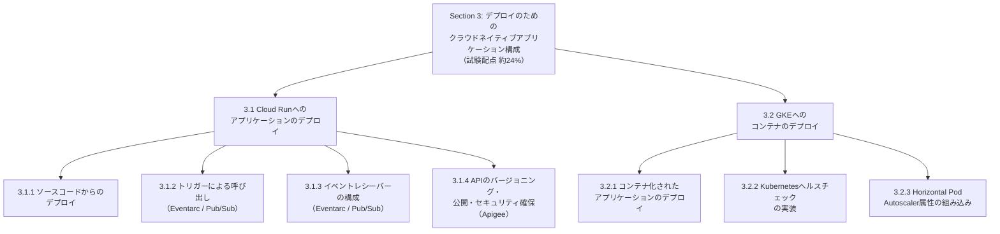
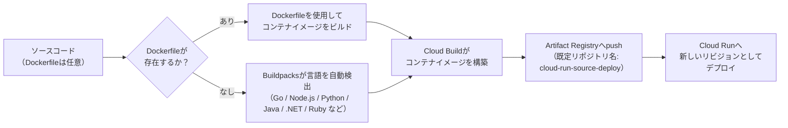
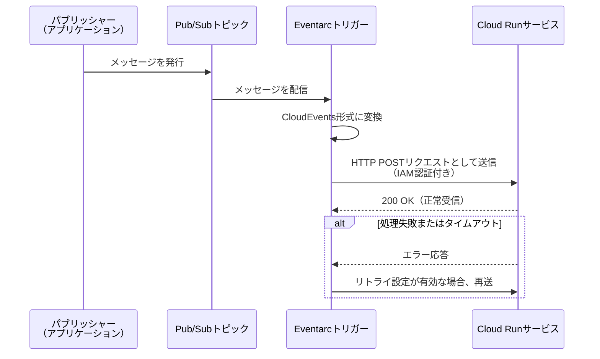
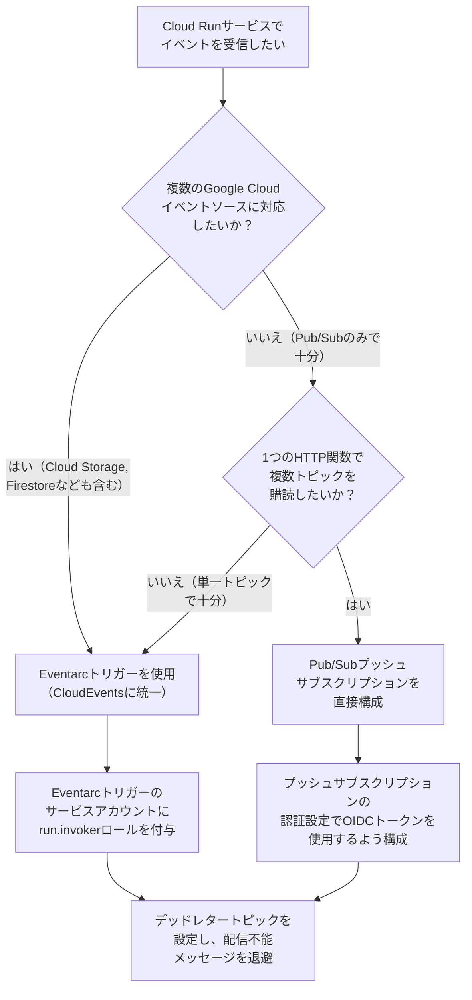
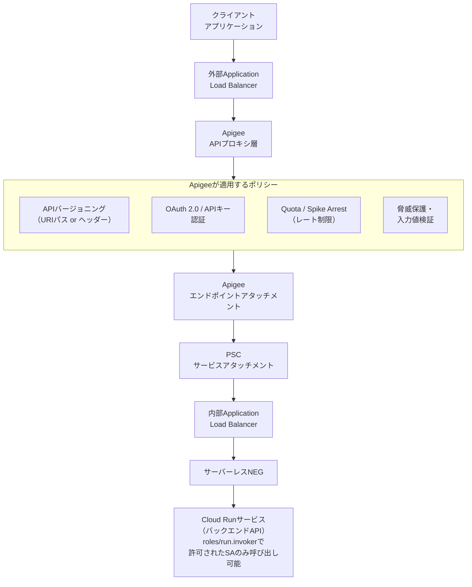
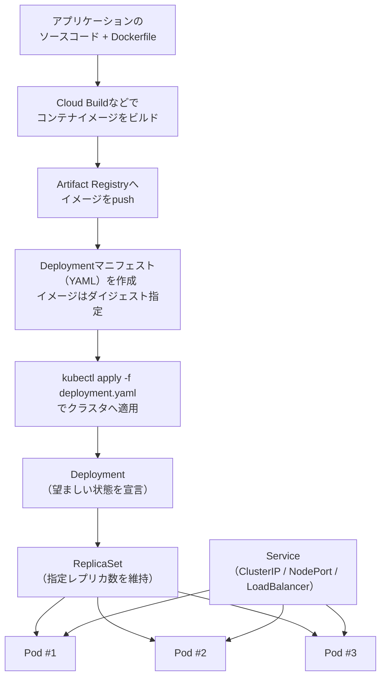
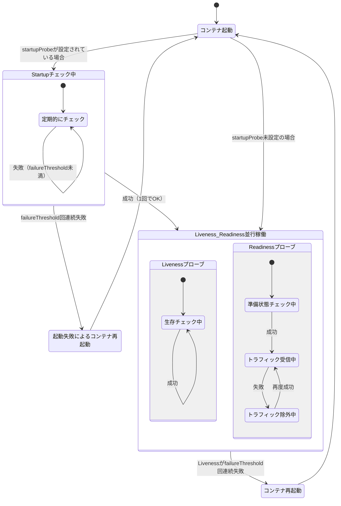
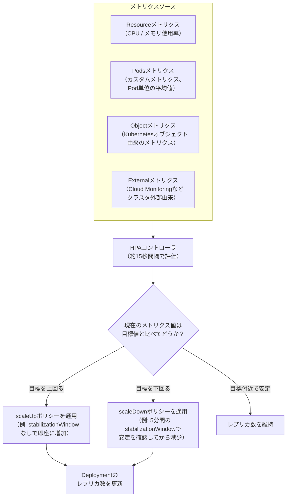

# Google Cloud Professional Cloud Developer 試験ガイド

## Section 3: デプロイのためのクラウドネイティブアプリケーション構成（配点 約24%）

> 本ガイドは、Google Cloud公式の[Professional Cloud Developer認定ページ](https://cloud.google.com/learn/certification/cloud-developer)および[公式Exam Guide PDF](https://services.google.com/fh/files/misc/professional_cloud_developer_exam_guide_english.pdf)の**Section 3: Configuring cloud-native applications for deployment**（試験全体の約24%を占める）に完全準拠し、初学者にもわかりやすいよう、各出題項目を1つずつステップバイステップで解説します。図解はすべてMermaidフローチャート、比較情報はすべてMarkdown表を使用し、ASCIIアートによる図解は一切使用していません。各節の末尾には根拠となる公式ドキュメントのURLを明記しています。

---

## 目次

- [Section 3 の全体像](#section-3-の全体像)
- [3.1 Cloud Runへのアプリケーションのデプロイ](#31-cloud-runへのアプリケーションのデプロイ)
  - [3.1.1 ソースコードからのアプリケーションのデプロイ](#311-ソースコードからのアプリケーションのデプロイ)
  - [3.1.2 トリガーを使ったCloud Runサービスの呼び出し（Eventarc、Pub/Sub）](#312-トリガーを使ったcloud-runサービスの呼び出しeventarcpubsub)
  - [3.1.3 イベントレシーバーの構成（Eventarc、Pub/Sub）](#313-イベントレシーバーの構成eventarcpubsub)
  - [3.1.4 アプリケーションにおけるAPIのバージョニング・公開・セキュリティ確保（Apigee）](#314-アプリケーションにおけるapiのバージョニング公開セキュリティ確保apigee)
- [3.2 GKEへのコンテナのデプロイ](#32-gkeへのコンテナのデプロイ)
  - [3.2.1 コンテナ化されたアプリケーションのデプロイ](#321-コンテナ化されたアプリケーションのデプロイ)
  - [3.2.2 アプリケーションの可用性を高めるKubernetesヘルスチェックの実装](#322-アプリケーションの可用性を高めるkubernetesヘルスチェックの実装)
  - [3.2.3 Horizontal Pod Autoscaler属性（スケーリング、メトリクス）の組み込み](#323-horizontal-pod-autoscaler属性スケーリングメトリクスの組み込み)
- [Section 3 ベストプラクティス チェックリスト](#section-3-ベストプラクティス-チェックリスト)
- [参考文献](#参考文献)

---

## Section 3 の全体像

Professional Cloud Developer試験のSection 3は、「設計されたクラウドネイティブアプリケーションを、実際にどうデプロイし、稼働させるか」を問う分野です。大きく **3.1 Cloud Run** と **3.2 GKE（Google Kubernetes Engine）** の2つのコンピューティングプラットフォームへのデプロイ手法に分かれており、それぞれ4項目・3項目、合計7つの出題トピックで構成されています。

このセクションを学ぶ上で重要な視点は、「**Cloud RunとGKEはどちらも“コンテナ化されたアプリケーションを動かす”という点では同じだが、デプロイの単位・トリガーの仕組み・スケーリングの制御方法がまったく異なる**」という点です。Cloud Runはフルマネージドなサーバーレスプラットフォームであり、リビジョン単位でのデプロイとトラフィック制御が中心になります。一方GKEは、Kubernetesの標準的なリソース（Deployment、Pod、Service）を自分で組み立ててデプロイし、ヘルスチェックやHPA（Horizontal Pod Autoscaler）も自分で明示的に設定する必要があります。この違いを意識しながら読み進めてください。

---

## 3.1 Cloud Runへのアプリケーションのデプロイ

### 3.1.1 ソースコードからのアプリケーションのデプロイ

#### 概要

Cloud Runへアプリケーションをデプロイする方法は複数ありますが、初学者がまず押さえるべきなのは「ソースコードから直接デプロイする」方法です。これは`gcloud run deploy --source`という1つのコマンドで、コンテナイメージのビルドからデプロイまでを一気に行う機能です。裏側では**Cloud Build**と**Buildpacks**（またはソースディレクトリ内の`Dockerfile`）が使われ、あなたはDockerのインストールや設定を一切行う必要がありません。

#### ステップバイステップの流れ

1. **ソースディレクトリを準備する**：アプリケーションのコードが置かれたディレクトリに移動します。`Dockerfile`があればそれが優先的に使われ、なければBuildpacksが自動的に言語を検出してビルドします。
2. **デプロイコマンドを実行する**：`gcloud run deploy SERVICE --source .`を実行すると、Cloud Buildがバックグラウンドでコンテナイメージをビルドします。このとき`gcloud builds submit`を別途実行する必要はありません。
3. **Artifact Registryへの自動保存**：プロジェクトのデプロイ先リージョンに`cloud-run-source-deploy`という名前のArtifact Registryリポジトリがまだ存在しない場合、この機能が自動的に作成します。
4. **新しいリビジョンが作成される**：ビルドされたイメージを使って、Cloud Runサービスの新しいリビジョンが作成され、デフォルトでは100%のトラフィックがそのリビジョンにルーティングされます。

#### 知っておくべき制約

ソースからのデプロイは「利便性重視の機能」であり、ビルドを完全にカスタマイズすることはできません。より細かい制御が必要な場合（マルチステージビルドの最適化、独自のビルドパイプラインへの組み込みなど）は、`gcloud builds submit`でCloud Buildを直接呼び出し、`gcloud run deploy --image`でイメージを指定してデプロイする方式に切り替える必要があります。

またBuildpacksを使ったビルドでは、再現可能なビルドを実現するためにソースファイルの最終更新日時が一律で1980年1月1日に設定されます。これによりアプリケーションのフレームワークによってはブラウザ側の静的ファイルキャッシュに影響が出ることがあるため、影響を受ける場合は`etag`や`Last-Modified`ヘッダーを無効化することが推奨されています。

#### デプロイ方式の比較

| デプロイ方式 | コマンド／方法 | 主な用途 | ビルドのカスタマイズ性 |
| --- | --- | --- | --- |
| ソースからデプロイ | `gcloud run deploy --source .` | 素早いプロトタイピング、シンプルなCI不要のデプロイ | 低い（Buildpacks/Dockerfileに依存） |
| イメージ指定デプロイ | `gcloud run deploy --image IMAGE_URL` | 既存のCI/CDパイプラインでビルド済みイメージをデプロイ | 高い（ビルド工程を完全に制御） |
| YAML宣言的デプロイ | `gcloud run services replace service.yaml` | GitOps、Infrastructure as Code、構成のバージョン管理 | 高い（設定をコードとして管理） |
| コンソールからのデプロイ | Cloud Runコンソール画面での操作 | 学習目的、GUIでの一時的な設定変更 | 低〜中 |
| CI/CD連携（継続的デプロイ） | GitHub/GitLab/BitbucketとCloud Buildトリガーを連携 | mainブランチへのpushで自動ビルド・自動デプロイ | 高い（ビルド設定をトリガー側で管理） |

#### ベストプラクティス

- **最小権限の原則に従い、ビルド専用のサービスアカウントを指定する**：デフォルトではCompute Engineのデフォルトサービスアカウントが使われますが、セキュリティ姿勢を高めるために`--build-service-account`フラグで専用のサービスアカウントを明示的に指定することが推奨されています。このとき、指定するビルド専用サービスアカウントにはプロジェクトレベルで`roles/run.builder`ロールが必要で、さらにデプロイを実行するプリンシパル（ユーザーまたはCI/CDのサービスアカウント）には、そのビルド専用サービスアカウントに対する`roles/iam.serviceAccountUser`が必要です。いずれかの権限が欠けているとソースデプロイは失敗します。
- **本番運用ではソースデプロイをCI/CDの入口として使う**：Cloud RunコンソールUIの「継続的デプロイの設定」機能や、手動で作成するCloud Buildトリガーを使えば、mainブランチへのpushをトリガーに自動でビルド・デプロイされる仕組みを構築できます。ただし、すべてのトリガーが同じBuildpacksパイプラインを使うわけではない点に注意してください。Cloud Runのデプロイはリポジトリに`Dockerfile`がある場合はそれを使い、なければBuildpacksにフォールバックします。また、手動で作成したCloud Buildトリガーは、その`cloudbuild.yaml`で定義したビルド手順に従って動作するため、Buildpacksを使うとは限りません。`--source`デプロイと同じBuildpacksパイプラインが使われるのは、Buildpacksが明示的に選択されている場合に限られます。
- **細かい制御が必要ならCloud Buildを直接使う**：ソースデプロイは便利機能であり、ビルドの完全なカスタマイズはできません。マルチステージビルドや独自のビルドステップが必要な場合は`gcloud builds submit`→`gcloud run deploy --image`の2段階に切り替えます。
- **静的ファイルのキャッシュ挙動に注意する**：Buildpacksが常に`gcr.io/buildpacks/builder:latest`を使う点、およびソースファイルの更新日時が固定される点を理解し、必要に応じてキャッシュ関連ヘッダーを調整します。

**出典**：

- [Deploy services from source code | Cloud Run](https://docs.cloud.google.com/run/docs/deploying-source-code)
- [Set build service account (source deploy) | Cloud Run](https://docs.cloud.google.com/run/docs/configuring/services/build-service-account)
- [Cloud Run 製品ページ](https://cloud.google.com/run)

---

### 3.1.2 トリガーを使ったCloud Runサービスの呼び出し（Eventarc、Pub/Sub）

#### 概要

Cloud Runサービスは、HTTPリクエストで直接呼び出すだけでなく、**Eventarc**を経由してGoogle Cloud上のさまざまなイベント（Pub/Subメッセージの発行、Cloud Storageへのファイルアップロードなど）をトリガーとして自動的に呼び出すことができます。これはイベント駆動型アーキテクチャの中核をなす仕組みで、Pub/Subはその中でも最も代表的なイベントソースです。

Eventarcは受け取ったイベントを**CloudEvents形式**に標準化し、HTTPリクエストとしてCloud Runサービスに配信します。これにより、イベントソースの種類が変わってもCloud Run側の受信処理をほぼ共通化できるという利点があります。以下のシーケンス図は、Cloud Runサービスが未認証呼び出しを許可しておらず、EventarcがIAM認証付きでリクエストを送信する構成（既定かつ推奨される構成）を示しています。

#### ステップバイステップの流れ

1. **トリガーに使うサービスアカウントを用意する**：Eventarcトリガーは、Cloud Runサービスを呼び出すためのアイデンティティとしてサービスアカウントに紐づけられます。デフォルトではCompute Engineのデフォルトサービスアカウントが使われますが、独自のサービスアカウントを作成し、呼び出し先Cloud Runサービスに対する`roles/run.invoker`ロールを付与するのがベストプラクティスです。必要なIAMロールはイベントの種類によって異なります。Pub/Subを直接のイベントソースとするトリガーでは`roles/run.invoker`のみで足りますが、Cloud StorageやFirestoreなど、Pub/Sub以外のGoogle Cloudソースを使うトリガーでは、このサービスアカウントに`roles/eventarc.eventReceiver`ロールも追加で付与する必要があります。また、Cloud Storageの直接イベント（Cloud Storage自体がイベントプロバイダとなる構成）では、Eventarcが内部的に作成するPub/SubトピックへCloud Storageサービスエージェント（`service-PROJECT_NUMBER@gs-project-accounts.iam.gserviceaccount.com`）が発行できるよう、そのサービスエージェントに`roles/pubsub.publisher`ロールを付与しておく必要があります。加えて、プロジェクトの作成時期などの条件によっては、認証済みPub/Subプッシュを行うためにPub/Subサービスエージェントへ`roles/iam.serviceAccountTokenCreator`ロールの付与が別途必要になる場合があります（比較的新しいプロジェクトでは既定で付与済みです）。
2. **Pub/Subトリガーを作成する**：Cloud Runサービスをデプロイした後、独立して`gcloud eventarc triggers create`コマンドを実行し、対象のPub/Subトピックと呼び出し先のCloud Runサービスを結びつけます。既存のPub/Subトピックを使う場合は`--transport-topic`でそのトピックを指定します（省略した場合はEventarcが新しいトピックを作成します）。
3. **イベントフィルタを指定する**：`--event-filters="type=google.cloud.pubsub.topic.v1.messagePublished"`のように、どの種類のイベントに反応するかを指定します。
4. **配信先のパスを必要に応じて指定する**：Cloud Runサービス内の特定のルート（例: `/route`）にイベントを送りたい場合、「Service URLパス」を指定できます。
5. **リトライの既定値を確認する**：リトライの既定動作は作成方法によって異なります。`gcloud eventarc triggers create`は`--max-retry-attempts`フラグをサポートしており、有効な値は`1`のみです。`--max-retry-attempts=1`を指定すると単一配信（リトライなし）になり、省略した場合は標準のリトライ動作が適用されます。gcloud CLIおよびコンソールのEventarcページで作成したトリガーは、このフラグを指定しない限り**リトライが有効**な状態になります。一方、Cloud Runページから作成したトリガーは**1回だけ配信する**（リトライしない）のが既定です（この既定動作は変わりません）。リトライ挙動を変更したい場合は、トリガーに紐づくPub/Subサブスクリプションの再試行ポリシーを更新します。
6. **トリガーの健全性を確認する**：作成直後は数分程度のプロビジョニング遅延が発生することがあるため、`gcloud eventarc triggers list`でステータスが`ACTIVE`になっているか確認します。

#### ベストプラクティス

- **可能な限り「直接イベント」を使う**：Pub/Subのような直接イベントに対応しているGoogleプロバイダの場合、監査ログ経由のイベント（Audit Log Events）よりも直接イベント（Direct Events）を優先して使うことが推奨されています。直接イベントの方がレイテンシが低く、設定もシンプルです。
- **認証されたトリガーには必ず`run.invoker`ロールを付与する**：認証済みCloud Runサービスに対してこのロールを付与せずにトリガーを作成すると、トリガー自体は正常に作成されて「アクティブ」になりますが、実際の呼び出しはIAM権限不足で失敗し続けます。トリガー作成時のエラーが出ないからといって安心せず、必ず権限設定を確認してください。
- **初回作成時の遅延を考慮する**：プロジェクトで初めてEventarcトリガーを作成する際、Eventarcサービスエージェントのプロビジョニングに時間がかかり、権限エラーが発生することがあります。多くの場合、再度作成を試みることで解決します。

**出典**：

- [Create triggers from Pub/Sub events | Cloud Run](https://docs.cloud.google.com/run/docs/triggering/pubsub-triggers)
- [Create triggers with Eventarc | Cloud Run](https://docs.cloud.google.com/run/docs/triggering/trigger-with-events)
- [Route Cloud Pub/Sub events to Cloud Run | Eventarc Standard](https://docs.cloud.google.com/eventarc/standard/docs/run/route-trigger-cloud-pubsub)
- [Receive Pub/Sub events using an authenticated Cloud Run service | Eventarc Standard](https://docs.cloud.google.com/eventarc/standard/docs/run/pubsub-authenticated)

---

### 3.1.3 イベントレシーバーの構成（Eventarc、Pub/Sub）

#### 概要

前項の「トリガーによる呼び出し」がイベント**送信側**（トリガー）の設定だったのに対し、この項目は、イベントを**受信するCloud Runサービス側**をどう構成するかに焦点を当てます。具体的には、Eventarcトリガー経由で受け取るのか、Pub/Subのプッシュサブスクリプションで直接受け取るのかという選択、および認証方式・リトライ・デッドレター（配信不能メッセージの退避先）の設計が中心になります。

#### ステップバイステップの流れ

1. **受信方式を選ぶ**：Cloud Storageの変更通知やFirestoreの更新など、複数の種類のイベントソースを一元的に扱いたい場合はEventarcトリガーを使うのが定石です。Pub/Subだけで完結し、なおかつ1つのHTTPエンドポイントで複数のトピックを柔軟に購読したい場合は、HTTPトリガー型の関数（またはCloud Runサービス）に対してPub/Subのプッシュサブスクリプションを直接構成する方法も選択肢になります。
2. **エンドポイントのパスを設計する**：Eventarcトリガーでは「Service URLパス」（例: `/`、`/route`、`route/subroute`）を指定して、イベントの種類ごとに異なるハンドラーへ振り分けることができます。
3. **認証方式を決める**：認証済み呼び出しを受け付ける場合、Eventarcトリガー側のサービスアカウントに`roles/run.invoker`を付与する必要があります。これを怠ると、トリガーは正常に見えても呼び出しがすべて失敗します。
   Pub/Subのプッシュサブスクリプションを直接構成する場合は、サブスクリプションの認証設定でOIDCトークンを使うよう指定したうえで、次のIAM権限を前提として揃えます。
   - プッシュ認証に使うサービスアカウントに、呼び出し先Cloud Runサービスに対する`roles/run.invoker`を付与する。
   - サブスクリプションを作成・更新するプリンシパル（ユーザーまたはCI/CDのサービスアカウント）自身にも、そのプッシュ認証用サービスアカウントに対する`iam.serviceAccounts.actAs`権限が必要です。サブスクリプション作成時にサービスアカウントを「アタッチ」する操作にあたるため、`roles/iam.serviceAccountUser`をそのプリンシパルへ付与することで満たせます。
   - **2021年4月8日以前に作成したプロジェクト**では、Pub/Subサービスエージェント（`service-PROJECT_NUMBER@gcp-sa-pubsub.iam.gserviceaccount.com`）に対して`roles/iam.serviceAccountTokenCreator`を付与する。この日付以降に作成したプロジェクトでは自動的に付与されます。
4. **リトライとデッドレターを設計する**：一時的な障害でイベント処理が失敗した場合に備え、Eventarcの「失敗時に再試行」オプションを有効にします。Pub/Sub側では、一定回数の配信失敗後にメッセージを退避させる「デッドレタートピック」を設定しておくと、メッセージの喪失を防ぎながら障害調査を効率化できます。
5. **受信処理を冪等（べきとう）に実装する**：Pub/Subは「少なくとも1回配信（at-least-once delivery）」を保証する設計であるため、同じイベントが重複して届く可能性があります。受信側のハンドラーは、同じイベントを複数回処理しても結果が変わらないように（冪等に）実装することが重要です。

#### Eventarcトリガー vs Pub/Subプッシュサブスクリプション直接構成の比較

| 観点 | Eventarcトリガー | Pub/Subプッシュサブスクリプション直接構成 |
| --- | --- | --- |
| 対応イベントソース | Pub/Sub、Cloud Storage、Firestoreなど多数のGoogle Cloudプロバイダ | Pub/Subのみ |
| 配信フォーマット | CloudEvents形式に標準化される | 既定のラップ形式ではJSONボディの`message.data`がBase64エンコードされる。ペイロードのラップ解除（unwrapped）を有効にすると、メッセージデータがBase64エンコードなしでそのまま送信される |
| 複数トピックの一元管理 | トピックごとに個別のトリガーを作成するのが基本 | 1つのHTTPエンドポイントで複数トピックを柔軟に購読可能 |
| 典型的な用途 | マルチソースのイベント駆動アーキテクチャ | Pub/Sub中心でシンプルに完結させたい構成 |

#### ベストプラクティス

- **受信処理は必ず冪等に実装する**：at-least-once配信の特性上、重複イベントの受信は「起こりうる正常な動作」として設計に織り込みます。
- **デッドレタートピックで障害調査を容易にする**：一定回数再試行しても処理できないメッセージを別トピックに退避させることで、本流の処理を止めずに後から原因調査ができます。
- **エンドポイントのパスでイベント種別を分離する**：Eventarcの「Service URLパス」機能を活用し、イベントソースやイベント種別ごとに異なるルートへ振り分けることで、Cloud Runサービス内のルーティングロジックをシンプルに保てます。
- **権限エラーを「トリガーの見た目上のアクティブ状態」で判断しない**：`run.invoker`ロールが不足していても、トリガー自体はアクティブとして作成されるため、実際にテストイベントを発行して疎通確認を行うことが重要です。

**出典**：

- [Create triggers with Eventarc | Cloud Run](https://docs.cloud.google.com/run/docs/triggering/trigger-with-events)
- [Create triggers from Pub/Sub events | Cloud Run](https://docs.cloud.google.com/run/docs/triggering/pubsub-triggers)
- [Trigger functions from Pub/Sub using Eventarc | Cloud Run](https://docs.cloud.google.com/run/docs/tutorials/pubsub-eventdriven)
- [Quickstart: Receive events using Pub/Sub messages (Google Cloud CLI) | Eventarc Standard](https://cloud.google.com/eventarc/docs/run/create-trigger-pub-sub-gcloud)

---

### 3.1.4 アプリケーションにおけるAPIのバージョニング・公開・セキュリティ確保（Apigee）

#### 概要

Cloud Run上で稼働するアプリケーションのAPIを社外のパートナーや他部門に公開する場合、Cloud Runを直接インターネットに公開するのではなく、**Apigee**をプロキシ（ファサード）層として前段に配置するのが一般的なベストプラクティスです。Apigeeは、認証・認可・レート制限・バージョニング・分析といったAPI管理機能を一元的に提供し、バックエンドのCloud Runサービスを直接の攻撃対象から隠すことができます。

#### ステップバイステップの流れ

1. **Cloud Runサービスを非公開（認証必須）でデプロイする**：Cloud Runサービス自体は未認証呼び出しを許可せず、Apigeeが使うサービスアカウントにのみ`roles/run.invoker`を付与します。これは**認証（誰が呼び出せるか）**のレイヤーの設定です。
   さらに`run.app`のURLへのアクセスを**ネットワークレベルで**制限したい場合は、これとは別に受信制御（ingress）を設定します。具体的には`--ingress=internal`を指定して受信元をVPC内部などに限定し、そのうえで手順6のとおり内部Application Load Balancer＋サーバーレスNEG＋PSCの経路を構成して、そこからのみ到達できるようにします。認証設定だけでは`run.app`のURLそのものはインターネット上に存在し続けるため、両方のレイヤーを揃えて初めて「外部から直接叩けない」状態になります。
2. **Apigeeプロキシを作成し、ターゲット接続先とトークンのAudienceをそれぞれ設定する**：ここでは**「どこへ接続するか（ターゲット）」**と**「どのトークンを添えるか（Audience）」**が別々の設定である点が重要です。両者を混同すると、接続はできるのに401が返る（あるいはその逆）といった切り分けの難しい問題になります。
   - **ターゲット接続先**：Cloud Run URLへ直接接続する構成では、ターゲットにCloud RunサービスのURLをそのまま指定します。一方、PSCまたは内部Application Load Balancerを経由する構成では、ターゲットにはPSCエンドポイントのIPアドレスまたはプライベートホスト名を指定し、内部ALBが`Host`ヘッダーでルーティングする構成であれば、必要に応じて`Host`ヘッダーを明示的に設定します。
   - **トークンのAudience**：ターゲットの認証にはGoogle署名付きIDトークン（ターゲットエンドポイントの`<Authentication>`配下の`<GoogleIDToken>`）を構成します。`<Audience>`には接続先のIPやホスト名ではなく、**Cloud Runの`run.app` URL、または当該サービスに設定済みのカスタムaudience**を指定します。Cloud Run URLへ直接接続する構成では、Audienceはそのサービスの`run.app` URLのままで問題ありません。

   あわせて、Apigeeが使うサービスアカウントには`roles/run.invoker`を付与します。なお、外部クライアントをOAuth 2.0やAPIキーで保護する話（手順4）は、このCloud Runターゲット認証とは別レイヤーの設定です。
3. **APIバージョニング戦略を決める**：URIパスにバージョンを埋め込む方式（例: `/v1/orders`、`/v2/orders`）と、リクエストヘッダーでバージョンを指定する方式があります。どちらを採用するかは、クライアントの実装のしやすさとキャッシュ戦略を踏まえて決定します。
4. **認証・認可ポリシーを適用する**：APIキー、OAuth 2.0、あるいはmTLS（相互TLS）など、公開範囲に応じた認証方式をApigeeのポリシーとして設定します。
5. **レート制限を設定する**：Quotaポリシーで長期的な利用上限を、Spike Arrestポリシーで短期的な急激なトラフィックスパイクを制御し、バックエンドのCloud Runサービスを保護します。
6. **プライベート接続の経路を構成する**：インターネットを経由させたくない場合、VPCネットワークピアリングやCloud Interconnectだけではマネージドサービスである Cloud Run へ直接到達できません。Apigeeランタイムから Cloud Run へのプライベート経路は、次の要素を**すべて順番につないだ1本の経路（PSCパス）**として構成します。いずれか1つを選ぶ択一の選択肢ではありません。

   1. **Apigeeのエンドポイントアタッチメント**：Apigeeランタイムから、対向のPSCサービスアタッチメントへ接続するための出口。
   2. **PSCサービスアタッチメント**：内部Application Load Balancerを、Apigee側へPSCサービスとして公開する。
   3. **内部Application Load Balancer**：PSC経由で受けたリクエストをバックエンドへ振り分ける。
   4. **サーバーレスNEG**：内部ALBのバックエンドとして、Cloud Runサービスを指す。
   5. **Cloud Runサービス**：最終的なバックエンドAPI。

   VPCピアリングやCloud Interconnectは、これとは別の**接続方式**であり、オンプレミスや他のVPCとの接続を成立させるための土台です。それ単体が Cloud Run への直接経路になるわけではありません。

#### セキュリティポイントの整理

Apigeeを使ったAPI保護は、「誰が」「どこで」「何を」保護するかという観点で整理すると理解しやすくなります。

| セキュリティ層 | 主な保護対象 | 代表的な仕組み |
| --- | --- | --- |
| ユーザー | エンドユーザーの認証 | OAuth 2.0、IPアドレス許可リスト |
| アプリケーション | クライアントアプリの識別 | APIキー、OAuth 2.0、TLS |
| 開発者・パートナー | 開発者ポータルへのアクセス | SSO（シングルサインオン）、RBAC |
| API | APIリクエスト自体の保護 | OAuth 2.0、OpenID Connect、Quota、Spike Arrest、脅威保護 |
| APIチーム（運用者） | 運用時のガバナンス | IAM RBAC、データマスキング、監査ログ |
| バックエンド | Cloud Runなど実処理層の保護 | プライベートネットワーキング、相互TLS、IPアドレス制御 |

#### ベストプラクティス

- **バックエンドのCloud Runサービスは常に認証必須にする**：Apigeeを前段に置く意味は「バックエンドへの直接アクセスを防ぐ」ことにあるため、Cloud Run側でも未認証アクセスを許可しないことが前提になります。
- **サービスアカウントは最小権限で運用する**：Apigeeが使うサービスアカウントには、呼び出し先のCloud Run**サービス単位**で`roles/run.invoker`のような最小限のロールのみを付与します。Cloud RunのIAMはサービス単位で評価されるため、HTTPパス（ルート）単位の認可をIAMで表現することはできません。パスごとのアクセス制御は、Apigeeのフローやポリシー側で実装・管理します。
- **シークレットは定期的にローテーションする**：Secret Managerや CI/CDパイプラインを通じて、認証情報を四半期ごとなど定期的にローテーションする運用を組み込みます。
- **機微なデータはインターネットを経由させない**：手順6のとおり、Apigeeエンドポイントアタッチメント→PSCサービスアタッチメント→内部Application Load Balancer→サーバーレスNEGというPSC経路を構成し、Apigeeとバックエンド（Cloud Run）の通信をプライベートネットワーク内に閉じます。VPCピアリングやCloud InterconnectはオンプレミスやほかのVPCとの接続を成立させるための別の接続方式であり、それ単体ではサーバーレスであるCloud Runへの経路にはなりません。
- **APIプロキシの変更もバージョン管理する**：1つのプロキシリビジョンの誤りが多数のサービスに影響しうるため、プロキシ設定自体をソースコードと同様にバージョン管理下に置きます。

**出典**：

- [Best practices for securing your applications and APIs using Apigee | Cloud Architecture Center](https://cloud.google.com/architecture/best-practices-securing-applications-and-apis-using-apigee)
- [Advanced API Security best practices | Apigee](https://docs.cloud.google.com/apigee/docs/api-security/best-practices)

---

## 3.2 GKEへのコンテナのデプロイ

### 3.2.1 コンテナ化されたアプリケーションのデプロイ

#### 概要

GKEでは、Cloud Runのように「デプロイコマンド1つですべて完結」というわけにはいきません。コンテナイメージをビルドしてArtifact Registryに保存したあと、Kubernetesの**Deployment**というリソースを自分でマニフェスト（YAMLファイル）として定義し、`kubectl apply`でクラスタに適用するという流れになります。DeploymentはPodの望ましい状態（レプリカ数、コンテナイメージ、更新戦略など）を宣言的に記述するリソースで、実際のPodの生成と維持はDeploymentが内部で作成する**ReplicaSet**が担います。

#### ステップバイステップの流れ

1. **クラスタの認証情報を取得する**：`gcloud container clusters get-credentials CLUSTER_NAME --location LOCATION`を実行し、`kubectl`が対象のGKEクラスタを操作できるように設定します。
2. **コンテナイメージをビルドし、Artifact Registryへpushする**：Dockerfileからイメージをビルドし、レジストリへ保存します。
3. **Deploymentマニフェストを作成する**：レプリカ数、使用するコンテナイメージ、リソースリクエスト／制限、更新戦略などをYAMLで宣言します。
4. **`kubectl apply`でマニフェストを適用する**：`kubectl apply -f deployment.yaml`を実行すると、GKEがPodのスケジューリング、指定レプリカ数の維持、ローリングアップデートを自動的に行います。
5. **Serviceを作成してアプリケーションを公開する**：ClusterIP（クラスタ内部限定）、NodePort、LoadBalancer（外部公開、Google Cloudのロードバランサを自動プロビジョニング）のいずれかのタイプでServiceを作成し、Podへのアクセス経路を確立します。
6. **デプロイ状況を確認する**：`kubectl get pods`、`kubectl get service`、`kubectl rollout status deployment/NAME`などでロールアウトの進行状況とPodの稼働状態を確認します。

#### Cloud Buildを使った自動化（gke-deployビルダー）

Cloud BuildにはGKEへのデプロイを自動化する`gke-deploy`というビルダーが用意されています。これは内部的に`kubectl`をラップしたツールで、以下のようなGoogle推奨のベストプラクティスを自動的に適用してくれます。

| gke-deployが自動的に行うこと | 効果 |
| --- | --- |
| `--image`（`-i`）フラグで指定したイメージ参照のみをタグからダイジェストに書き換え | マニフェストに残るイメージ参照がダイジェストに固定され、デプロイ後にタグが上書きされても実行中のイメージは変わらない。ただしタグ→ダイジェストの解決は**デプロイ時点**で行われるため、ビルド完了後からデプロイまでの間に同じタグが別のイメージを指すよう更新されると、意図しないイメージが固定されてしまう。これを避けるには、ビルド済みの`IMAGE@sha256:...`を`--image`に直接指定するか、`gke-deploy prepare`でマニフェストを生成する工程と`gke-deploy apply`で適用する工程を分離する（サイドカーなど`--image`で指定していない追加のイメージは自動では書き換えられないため、固定したい場合は個別にダイジェストで指定する） |
| 推奨ラベルをリソースファイルに追加 | リソースの管理・検索・監査がしやすくなる |
| デプロイ先GKEクラスタの認証情報を自動取得 | 手動でのクラスタ認証設定が不要になる |
| 適用したリソースがReady状態になるまで待機 | デプロイの成否をCI/CDパイプライン内で確実に検知できる |

より細かい制御をしたい、あるいは追加機能が不要な場合は、素の`kubectl`をラップしただけの`kubectl`ビルダーを使うこともできます。

#### ベストプラクティス

- **コンテナイメージはタグではなくダイジェストで参照する**：`:latest`のようなタグは指し示す中身が変わりうるため、本番デプロイでは`sha256:...`形式のダイジェストで固定し、意図しないイメージの入れ替わりを防ぎます。
- **リソースリクエストとリミットを必ず設定する**：CPU・メモリのリクエスト（最低保証）とリミット（上限）を設定することで、ノードのリソースを公平に配分し、他のワークロードへの影響を抑えます。
- **名前空間（Namespace）でリソースを分離する**：環境（開発・ステージング・本番）やチームごとにNamespaceを分けることで、リソースクォータの適用やアクセス制御がしやすくなります。
- **ローリングアップデート戦略を明示的に調整する**：`maxSurge`（同時に追加できるPod数）と`maxUnavailable`（同時に停止してよいPod数）を、アプリケーションの特性（起動時間、瞬断への耐性）に応じてチューニングします。
- **Workload Identityを使ってGoogle Cloud APIへ安全にアクセスする**：Podに直接サービスアカウントキーを配置するのではなく、Workload Identityを使ってKubernetesのサービスアカウントとGoogle CloudのIAMサービスアカウントを紐付け、鍵の管理負担とリークリスクを減らします。
- **ConfigMapとSecretで設定と機密情報をイメージから分離する**：設定値や認証情報をコンテナイメージに埋め込まず、ConfigMap／Secretとして外部から注入することで、環境ごとの差し替えが容易になり、イメージの再利用性も高まります。

**出典**：

- [Quickstart: Deploy an app to a GKE cluster | Google Kubernetes Engine (GKE)](https://cloud.google.com/kubernetes-engine/docs/deploy-app-cluster)
- [Deploying to GKE | Cloud Build](https://docs.cloud.google.com/build/docs/deploying-builds/deploy-gke)

---

### 3.2.2 アプリケーションの可用性を高めるKubernetesヘルスチェックの実装

#### 概要

GKE（Kubernetes）には、コンテナの健全性を継続的にチェックする「プローブ」という仕組みがあり、**Startup（起動）プローブ**・**Liveness（生存）プローブ**・**Readiness（準備完了）プローブ**の3種類があります。この3つは似ているようで役割がまったく異なり、正しく使い分けることがアプリケーションの可用性を大きく左右します。

#### 3つのプローブの役割

| プローブ種別 | 答える質問 | 失敗したときの挙動 | 典型的な用途 |
| --- | --- | --- | --- |
| Startupプローブ | 「アプリケーションの起動処理は完了したか？」 | コンテナがkillされ、再起動ポリシーに従って再起動される | 起動に時間がかかるアプリ（大きな設定ファイルの読み込み、キャッシュのウォームアップなど） |
| Livenessプローブ | 「このプロセスはまだ正常に動作しているか（デッドロックしていないか）？」 | コンテナがkillされ、再起動される | デッドロックや無限ループなど、プロセス自身では検知・復旧できない障害からの自己修復 |
| Readinessプローブ | 「このインスタンスは今トラフィックを処理できる状態か？」 | Podがサービスのエンドポイントから一時的に除外され、トラフィックが送られなくなる（再起動はしない） | 起動時の初期化処理、依存する外部サービス（データベースなど）が一時的に利用できない場合の保護 |

#### ステップバイステップの流れ

1. **各プローブ専用のエンドポイントを用意する**：`/healthz`（Liveness用、プロセスが生きているかだけを軽量にチェック）と`/ready`（Readiness用、データベースやキャッシュなど依存サービスへの接続も含めてチェック）のように、目的別に異なるエンドポイントを実装することが推奨されます。同じエンドポイントを使い回す場合でも、Livenessの方は`failureThreshold`を高めに設定し、「先にトラフィックから外し、それでもダメなら再起動する」という段階的な挙動にするのが一般的です。
2. **チェック方式（メカニズム）を選ぶ**：`httpGet`（HTTP GETリクエストを送り、ステータスコード200〜399なら成功）、`tcpSocket`（指定ポートへのTCP接続が確立できれば成功）、`exec`（コンテナ内でコマンドを実行し、終了コード0なら成功）、`grpc`（gRPCヘルスチェックプロトコルに準拠したサーバーへの呼び出し）の4種類から、アプリケーションの実装に合ったものを選びます。
3. **起動に時間がかかる場合はStartupプローブを追加する**：もしコンテナの起動が「`initialDelaySeconds + failureThreshold × periodSeconds`」よりも長くかかる可能性がある場合は、Livenessプローブと同じエンドポイントをチェックするStartupプローブを追加し、`failureThreshold`を大きめに設定します。Startupプローブが成功するまでは、LivenessとReadinessのプローブは実行されません。
4. **タイミングパラメータをチューニングする**：`initialDelaySeconds`（プローブ開始までの待機秒数）、`periodSeconds`（チェック間隔）、`timeoutSeconds`（タイムアウト秒数）、`successThreshold`（連続何回成功したら健全とみなすか）、`failureThreshold`（連続何回失敗したら異常とみなすか）を、アプリケーションの特性に合わせて設定します。
5. **依存関係のチェックにはタイムアウトを必ず設定する**：Readinessプローブ内でデータベース接続などをチェックする場合、そのチェック自体がハングするとプローブ全体がタイムアウトするまで応答が返らず、意図しない挙動につながります。依存先の呼び出しには必ず個別のタイムアウトを設定します。

#### プローブの主要な設定フィールド

| フィールド | 意味 | デフォルト値 | 最小値 |
| --- | --- | --- | --- |
| `initialDelaySeconds` | コンテナ起動後、プローブを開始するまでの待機秒数 | 0秒 | 0 |
| `periodSeconds` | プローブを実行する間隔 | 10秒 | 1 |
| `timeoutSeconds` | プローブがタイムアウトするまでの秒数 | 1秒 | 1 |
| `successThreshold` | 失敗状態から健全と判定するまでに必要な連続成功回数 | 1（Liveness/Startupは1固定） | 1 |
| `failureThreshold` | 異常と判定するまでに必要な連続失敗回数 | 3 | 1 |

#### GKEにおける重要な変更点（バージョン1.35以降）

GKEバージョン1.35以降では、`exec`プローブのコマンドに対しても`timeoutSeconds`が強制的に適用されるようになりました。1.35より前のバージョンでは`exec`プローブの`timeoutSeconds`は事実上無視されていましたが、1.35以降ではタイムアウトした場合、Livenessプローブは失敗としてコンテナが再起動され、Readinessプローブは失敗としてPodがサービスのエンドポイントから除外されるようになります。既存の`exec`プローブを使っている場合は、アップグレード前にタイムアウト値が実際のコマンド実行時間に対して十分かを確認する必要があります。

#### ベストプラクティス

- **LivenessプローブとReadinessプローブの役割を混同しない**：同じエンドポイントを使い回すこと自体は問題ありませんが、「プロセスが生きているか」と「トラフィックを処理できる状態か」は別の問いであることを常に意識します。Readinessプローブの中でLivenessと同じ重いチェック（外部依存の確認など）を行うのは適切ですが、Livenessプローブの中で外部依存をチェックすると、依存サービスの一時的な障害がコンテナの無限再起動（CrashLoopBackOff）を引き起こす危険があります。
- **Livenessプローブは軽量に保つ**：デッドロックのような「本当に回復不能な状態」だけを検知する目的に絞り、CPUやメモリを多く消費する重い処理はLivenessプローブに含めません。
- **`exec`プローブの多用に注意する**：`exec`プローブはチェックのたびにプロセスをfork/execするため、Pod密度の高いクラスタや短い実行間隔で使うとノードのCPUに負荷をかけることがあります。可能であれば`httpGet`や`tcpSocket`を優先します。
- **起動が遅いアプリケーションには必ずStartupプローブを追加する**：Startupプローブがないと、起動に時間がかかるアプリケーションがLivenessプローブによって起動途中で誤って再起動され続ける「起動ループ」に陥る危険があります。
- **プローブ専用のポートを検討する**：アプリケーション本体が高負荷になっている場合、通常のリクエストと同じポートでヘルスチェックを受けると、ヘルスチェック自体が実リクエストの陰に隠れてタイムアウトすることがあります。軽量なヘルスチェック用のサーバーを別ポートで立てることも選択肢です。

**出典**：

- [Liveness, Readiness, and Startup Probes | Kubernetes 公式ドキュメント](https://kubernetes.io/docs/concepts/workloads/pods/probes/)
- [Configure Liveness, Readiness and Startup Probes | Kubernetes 公式ドキュメント](https://kubernetes.io/docs/tasks/configure-pod-container/configure-liveness-readiness-startup-probes/)
- [Configure exec probe timeouts before upgrading to GKE version 1.35 | Google Kubernetes Engine (GKE)](https://docs.cloud.google.com/kubernetes-engine/docs/deprecations/exec-probe-timeouts)

---

### 3.2.3 Horizontal Pod Autoscaler属性（スケーリング、メトリクス）の組み込み

#### 概要

**Horizontal Pod Autoscaler**（HPA）は、CPU使用率やメモリ使用率、あるいはカスタムメトリクス（1秒あたりのリクエスト数など）に応じて、Deploymentが管理するPodのレプリカ数を自動的に増減させる仕組みです。GKEでは、ノード自体を増減させる「Cluster Autoscaler」と組み合わせて使うことで、Pod数とノード数の両方を負荷に応じて自動調整できます。

#### ステップバイステップの流れ

1. **スケーリング対象を指定する**：HPAはDeployment（あるいはReplicaSet、StatefulSetなど）を`scaleTargetRef`で参照し、そのレプリカ数を制御します。
2. **最小・最大レプリカ数を設定する**：`minReplicas`はスケーリングの下限、`maxReplicas`はスケーリングの上限（レプリカ数がこれを超えないという上限値）です。`autoscaling/v2`では`spec.maxReplicas`は**必須フィールド**であり、省略するとAPIのバリデーションで拒否されるため、「上限を設定しなければ無制限にスケールする」という状態は存在しません。`maxReplicas`には`minReplicas`以上の値を指定する必要があり、実運用では想定ピークを賄える値でありながら、予期しない急激なトラフィック増加時にコストが際限なく膨らまない値を選ぶことが重要です。
3. **スケーリングの基準となるメトリクスを選ぶ**：CPU・メモリ使用率だけでなく、Kubernetesオブジェクトから得られるカスタムメトリクス（Podsメトリクス、Objectメトリクス）や、Cloud Monitoringなどクラスタ外部のメトリクス（Externalメトリクス）も利用できます。
4. **目標値（ターゲット）を設定する**：CPU使用率であれば「70%」のように、パーセンテージまたは絶対値で目標を指定します。
5. **スケーリングの挙動（behavior）を必要に応じて調整する**：`autoscaling/v2` APIでは、`behavior`フィールドを使ってscaleUp（増加）とscaleDown（減少）それぞれの速度や安定化ウィンドウを細かく制御できます。
6. **Vertical Pod Autoscalerとの併用ルールを確認する**：CPUまたはメモリに関しては、HPAとVertical Pod Autoscaler（VPA）を同時に使わないことが推奨されています。両者が同じメトリクスに基づいて競合する調整を行おうとするためです。CPU・メモリ以外のメトリクスであれば、HPAとVPAを併用することも可能です。

#### メトリクスタイプの比較

| メトリクスタイプ | 説明 | 使用例 |
| --- | --- | --- |
| Resource | Podが要求するリソース（CPU/メモリ）の実際の使用量。パーセンテージまたは絶対値で指定可能 | CPU使用率が70%を超えたらスケールアウト |
| Pods | Kubernetesオブジェクトから報告される、Pod単位のカスタムメトリクスの平均値 | Pod1台あたりのリクエストキューの深さ |
| Object | 特定の単一Kubernetesオブジェクトに紐づくメトリクス | Ingressオブジェクトのリクエストレート |
| External | クラスタ外部のアプリケーションやサービス由来のメトリクス | Cloud Monitoring上のPub/Subキューのバックログ長 |

#### スケーリング挙動（behavior）のチューニング例

`stabilizationWindowSeconds`は、直近のウィンドウ期間内で計算された「望ましいレプリカ数」の履歴を参照することで、メトリクスの一時的な揺らぎによるレプリカ数の頻繁な増減（フラッピング）を防ぐ仕組みです。どの値を採用するかはスケール方向で異なり、**スケールダウン（`scaleDown`）ではウィンドウ内の最大値**を、**スケールアップ（`scaleUp`）でウィンドウを設定した場合はウィンドウ内の最小値**を採用します。デフォルトでは、スケールダウンに300秒（5分）のウィンドウが適用され、スケールアップはウィンドウなし（0秒＝即座に反映）が既定値です。

| 設定項目 | 役割 | デフォルト値の挙動 |
| --- | --- | --- |
| `scaleUp.stabilizationWindowSeconds` | スケールアップ判断を安定させるための遡及期間 | 0秒（安定化なし、即座にスケールアップ）。設定した場合はウィンドウ内の**最小**推奨値を採用 |
| `scaleDown.stabilizationWindowSeconds` | スケールダウン判断を安定させるための遡及期間 | 300秒（過去5分間の**最大**推奨値を採用） |
| `policies[].type: Pods` | 一定期間あたりに増減できるPod数の絶対値を制限 | — |
| `policies[].type: Percent` | 一定期間あたりに増減できる割合（%）を制限 | — |
| `selectPolicy` | 複数のポリシーが該当する場合にどちらを採用するか（`Max`/`Min`/`Disabled`） | `Max` |

#### ベストプラクティス

- **CPU使用率の目標値は70%前後を基準に検討する**：50%のような低い目標値を設定すると、常に大きな余剰キャパシティを確保することになりコストが増大する一方、パフォーマンスへの影響は限定的であるという知見があります。ワークロードの特性に応じて、コストとレイテンシのバランスが取れる目標値を検証しながら決定します。
- **HPAとVPAを同じCPU/メモリ指標で同時に使わない**：VPAはコンテナのCPU・メモリの`requests`/`limits`を調整する仕組みであり、同じ指標でHPAと併用すると両者が競合します。HPAがカスタムメトリクスや外部メトリクス（キューの深さなど）でスケールする場合は、CPU/メモリを調整するVPAと組み合わせて問題ありません。一方、CPUベースのHPAとメモリベースのVPAを併用したい場合は、GKEのマルチディメンションPod自動スケーリング（multidimensional Pod autoscaling）を使う必要があります。
- **スケールアップは素早く、スケールダウンは慎重に設定する**：トラフィックの急増には迅速に追従しつつ、一時的な低下ですぐにスケールダウンしてしまうと、直後の再スパイクで再度スケールアップが必要になり非効率です。`scaleUp`は短い安定化ウィンドウ（またはウィンドウなし）、`scaleDown`は数分単位の安定化ウィンドウを設定するのが典型的なパターンです。
- **最大レプリカ数を必ず設定し、コストの上限を意識する**：`autoscaling/v2`のHPAではレプリカ数は`maxReplicas`を上限として増加するため無制限に増え続けることはありませんが、異常なトラフィック増加やバグの際に`maxReplicas`を高く設定しすぎていると、その上限までPodが増加し、クラスタ全体のコストとノードリソースを圧迫するリスクがあります。
- **CPU以外の指標が適切なワークロードにはカスタムメトリクスを検討する**：ネットワークI/Oやキューの深さがボトルネックになるワークロードでは、CPU使用率よりもPodsメトリクスやExternalメトリクスの方がスケーリングの精度が高くなる場合があります。

**出典**：

- [Horizontal Pod autoscaling | Google Kubernetes Engine (GKE)](https://docs.cloud.google.com/kubernetes-engine/docs/concepts/horizontalpodautoscaler)
- [Best practices for running cost-optimized Kubernetes applications on GKE | Cloud Architecture Center](https://docs.cloud.google.com/architecture/best-practices-for-running-cost-effective-kubernetes-applications-on-gke)
- [Tuning the Kubernetes HPA in GKE | Google Cloud Blog](https://cloud.google.com/blog/products/containers-kubernetes/tuning-the-kubernetes-hpa-in-gke)
- [Horizontal Pod Autoscaling | Kubernetes 公式ドキュメント](https://kubernetes.io/docs/tasks/run-application/horizontal-pod-autoscale/)
- [Vertical Pod autoscaling | Google Kubernetes Engine (GKE)](https://docs.cloud.google.com/kubernetes-engine/docs/concepts/verticalpodautoscaler)

---

## Section 3 ベストプラクティス チェックリスト

- [ ] Cloud Runへのソースデプロイでは、専用のビルドサービスアカウントを`--build-service-account`で指定している
- [ ] 本番運用のCloud Runサービスは、Cloud BuildトリガーによるCI/CD経由で継続的デプロイされている
- [ ] Cloud Runの新リビジョンは、トラフィック分割（カナリアデプロイ）で段階的に切り替えている
- [ ] Eventarcトリガーのサービスアカウントには`roles/run.invoker`が明示的に付与されている
- [ ] 対応可能な場合は、監査ログイベントより直接イベント（Direct Events）を優先している
- [ ] イベント受信ハンドラーは、Pub/Subのat-least-once配信を前提に冪等に実装されている
- [ ] Pub/Subにはデッドレタートピックが設定され、配信不能メッセージが退避される
- [ ] Cloud Run上のAPIをパートナー等へ公開する際は、Apigeeをプロキシ層として配置し、バックエンドを非公開にしている
- [ ] APIバージョニング戦略（URIパス／ヘッダー）が明確に定義され、一貫して運用されている
- [ ] GKEのDeploymentマニフェストでは、コンテナイメージをタグではなくダイジェストで参照している
- [ ] すべてのコンテナにCPU/メモリのリクエストとリミットが設定されている
- [ ] Startup・Liveness・Readinessの3種類のプローブを、それぞれの役割に応じて適切に使い分けている
- [ ] Livenessプローブは軽量に保たれ、外部依存のチェックを含んでいない
- [ ] 起動に時間がかかるコンテナには、Startupプローブが設定されている
- [ ] HorizontalPodAutoscalerに`minReplicas`と`maxReplicas`が明示的に設定されている
- [ ] HPAとVPAをCPU/メモリで同時に使用していない
- [ ] `behavior`フィールドで、scaleUpは迅速に、scaleDownは慎重にチューニングされている

---

## 参考文献

### Cloud Run — デプロイとイベント統合

1. [Deploy services from source code | Cloud Run](https://docs.cloud.google.com/run/docs/deploying-source-code) — Google Cloud
2. [Set build service account (source deploy) | Cloud Run](https://docs.cloud.google.com/run/docs/configuring/services/build-service-account) — Google Cloud
3. [Cloud Run 製品ページ](https://cloud.google.com/run) — Google Cloud
4. [Rollbacks, gradual rollouts, and traffic migration | Cloud Run](https://docs.cloud.google.com/run/docs/rollouts-rollbacks-traffic-migration) — Google Cloud
5. [Create triggers from Pub/Sub events | Cloud Run](https://docs.cloud.google.com/run/docs/triggering/pubsub-triggers) — Google Cloud
6. [Create triggers with Eventarc | Cloud Run](https://docs.cloud.google.com/run/docs/triggering/trigger-with-events) — Google Cloud
7. [Trigger functions from Pub/Sub using Eventarc | Cloud Run](https://docs.cloud.google.com/run/docs/tutorials/pubsub-eventdriven) — Google Cloud

### Eventarc — イベント駆動アーキテクチャ

8. [Route Cloud Pub/Sub events to Cloud Run | Eventarc Standard](https://docs.cloud.google.com/eventarc/standard/docs/run/route-trigger-cloud-pubsub) — Google Cloud
9. [Receive Pub/Sub events using an authenticated Cloud Run service | Eventarc Standard](https://docs.cloud.google.com/eventarc/standard/docs/run/pubsub-authenticated) — Google Cloud
10. [Quickstart: Receive events using Pub/Sub messages (Google Cloud CLI) | Eventarc Standard](https://cloud.google.com/eventarc/docs/run/create-trigger-pub-sub-gcloud) — Google Cloud

### Apigee — API管理とセキュリティ

11. [Best practices for securing your applications and APIs using Apigee | Cloud Architecture Center](https://cloud.google.com/architecture/best-practices-securing-applications-and-apis-using-apigee) — Google Cloud
12. [Advanced API Security best practices | Apigee](https://docs.cloud.google.com/apigee/docs/api-security/best-practices) — Google Cloud

### GKE — デプロイとワークロード管理

13. [Quickstart: Deploy an app to a GKE cluster | Google Kubernetes Engine (GKE)](https://cloud.google.com/kubernetes-engine/docs/deploy-app-cluster) — Google Cloud
14. [Deploying to GKE | Cloud Build](https://docs.cloud.google.com/build/docs/deploying-builds/deploy-gke) — Google Cloud

### Kubernetesヘルスチェック（プローブ）

15. [Liveness, Readiness, and Startup Probes | Kubernetes 公式ドキュメント](https://kubernetes.io/docs/concepts/workloads/pods/probes/) — The Kubernetes Authors
16. [Configure Liveness, Readiness and Startup Probes | Kubernetes 公式ドキュメント](https://kubernetes.io/docs/tasks/configure-pod-container/configure-liveness-readiness-startup-probes/) — The Kubernetes Authors
17. [Configure exec probe timeouts before upgrading to GKE version 1.35 | Google Kubernetes Engine (GKE)](https://docs.cloud.google.com/kubernetes-engine/docs/deprecations/exec-probe-timeouts) — Google Cloud

### Horizontal Pod Autoscaler（HPA）

18. [Horizontal Pod autoscaling | Google Kubernetes Engine (GKE)](https://docs.cloud.google.com/kubernetes-engine/docs/concepts/horizontalpodautoscaler) — Google Cloud
19. [Vertical Pod autoscaling | Google Kubernetes Engine (GKE)](https://docs.cloud.google.com/kubernetes-engine/docs/concepts/verticalpodautoscaler) — Google Cloud
20. [Best practices for running cost-optimized Kubernetes applications on GKE | Cloud Architecture Center](https://docs.cloud.google.com/architecture/best-practices-for-running-cost-effective-kubernetes-applications-on-gke) — Google Cloud
21. [Tuning the Kubernetes HPA in GKE | Google Cloud Blog](https://cloud.google.com/blog/products/containers-kubernetes/tuning-the-kubernetes-hpa-in-gke) — Google Cloud
22. [Horizontal Pod Autoscaling | Kubernetes 公式ドキュメント](https://kubernetes.io/docs/tasks/run-application/horizontal-pod-autoscale/) — The Kubernetes Authors

### 認定試験情報

23. [Professional Cloud Developer Certification | Google Cloud](https://cloud.google.com/learn/certification/cloud-developer) — Google Cloud
24. [Professional Cloud Developer Exam Guide（公式PDF）](https://services.google.com/fh/files/misc/professional_cloud_developer_exam_guide_english.pdf) — Google Cloud
