# Google Cloud Professional Cloud Developer 認定試験ガイド Section 4: Google Cloudサービスとのアプリケーション統合

## この章について

本ガイドは、Google Cloud Professional Cloud Developer（PCD）認定試験の公式Exam Guideに定義される「Section 4: Integrating applications with Google Cloud services（Google Cloudサービスとのアプリケーション統合）」を、初学者にもわかりやすいようステップバイステップで解説するものです。Section 4は試験全体のおよそ21%を占め、以下の3つのサブセクション・合計11の出題項目で構成されています。

- **4.1 データ/ストレージサービスとのアプリケーション統合**（3項目）: Cloud SQL・Firestore・Cloud Storageなどのデータストアへの接続管理、データの読み書き、メッセージングサービスを使ったアプリケーション連携
- **4.2 Google Cloud APIの利用**（3項目、うち1項目に5つの考慮事項）: サービスの有効化、Cloud Client Libraries・REST・gRPC・API Explorerといった呼び出し方式の選択と設計上の考慮事項、サービスアカウントによる認証
- **4.3 トラブルシューティングとオブザーバビリティ**（5項目）: メトリクス・ログ・トレースによるインスツルメンテーション、Google Cloud Observabilityを使った問題解決、Error Reportingによる障害管理、トレースIDによるサービス間の相関、AI支援オブザーバビリティ

Section 1〜3が「設計」「ビルド/テスト」「デプロイ」という開発ライフサイクルの前半を扱うのに対し、Section 4は「アプリケーションが実際にGoogle Cloudの各種サービスとどう対話し、本番運用でどう可観測性を確保するか」という、開発者が日常的に向き合う実装レベルのテーマを扱います。前提として[[gcp-pca-guide]]で扱ったIAM・ネットワーキングの基礎や、Section 1（設計）・Section 3（デプロイ）の内容と密接に関連するため、あわせて参照することをおすすめします。

本文中の図解はすべてMermaid記法で記述し、ASCIIアートによる図解は一切使用していません。すべての技術的主張には、Google Cloud公式ドキュメントを中心とした出典を明記しています。

---

## 目次

- [4.1 データ/ストレージサービスとのアプリケーション統合](#41-データストレージサービスとのアプリケーション統合)
  - [4.1.1 さまざまなGoogle Cloudデータストアへの接続管理](#411-さまざまなgoogle-cloudデータストアへの接続管理)
  - [4.1.2 さまざまなGoogle Cloudデータソースへのデータの読み書き](#412-さまざまなgoogle-cloudデータソースへのデータの読み書き)
  - [4.1.3 メッセージングサービスを使ったデータの発行・消費アプリケーションの作成](#413-メッセージングサービスを使ったデータの発行消費アプリケーションの作成)
- [4.2 Google Cloud APIの利用](#42-google-cloud-apiの利用)
  - [4.2.1 Google Cloudサービスの有効化](#421-google-cloudサービスの有効化)
  - [4.2.2 サポートされているオプションを使ったAPI呼び出し](#422-サポートされているオプションを使ったapi呼び出し)
  - [4.2.3 サービスアカウントを使ったCloud API呼び出し](#423-サービスアカウントを使ったcloud-api呼び出し)
- [4.3 トラブルシューティングとオブザーバビリティ](#43-トラブルシューティングとオブザーバビリティ)
  - [4.3.1 メトリクス・ログ・トレースによるコードのインスツルメンテーション](#431-メトリクスログトレースによるコードのインスツルメンテーション)
  - [4.3.2 Google Cloud Observabilityを使った問題の特定と解決](#432-google-cloud-observabilityを使った問題の特定と解決)
  - [4.3.3 Error Reportingによるアプリケーション問題の管理](#433-error-reportingによるアプリケーション問題の管理)
  - [4.3.4 トレースIDを使ったサービス間のトレーススパンの相関](#434-トレースidを使ったサービス間のトレーススパンの相関)
  - [4.3.5 AI支援オブザーバビリティの活用](#435-ai支援オブザーバビリティの活用)
- [Section 4 まとめ: 試験対策チェックリスト](#section-4-まとめ-試験対策チェックリスト)
- [参考文献](#参考文献)

---

## Section 4 全体像

Section 4の3つのサブセクションは独立したテーマに見えますが、実際には「データを読み書きし（4.1）」「APIを正しく呼び出し（4.2）」「その挙動を観測・診断する（4.3）」という、1つのリクエストがアプリケーションを流れる際に必ず通過する3つのレイヤーに対応しています。

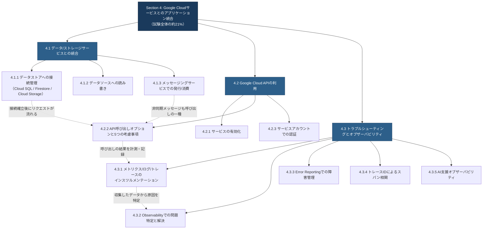

この関係性を意識しながら読み進めると、単なる暗記ではなく「なぜこの機能が必要なのか」という実装者としての理解が深まります。それでは各項目を順に見ていきましょう。

---

## 4.1 データ/ストレージサービスとのアプリケーション統合

### 4.1.1 さまざまなGoogle Cloudデータストアへの接続管理

#### 概要

現代のクラウドネイティブアプリケーションは、単一のデータベースだけで完結することはほとんどありません。トランザクション処理にはリレーショナルデータベース、モバイル/Webアプリの同期にはドキュメントデータベース、ファイルやバイナリデータにはオブジェクトストレージ、というようにデータの性質に応じて複数のデータストアを使い分けるのが一般的です。Exam Guideが明示的に例示しているのは **Cloud SQL**（リレーショナル）・**Firestore**（NoSQLドキュメント）・**Cloud Storage**（オブジェクト）の3つですが、これらへの「接続管理」は単に接続文字列を書けばよいという話ではなく、認証方式・コネクションプーリング・再接続戦略まで含めた設計判断です。

#### ステップバイステップの流れ

まず、扱うデータの性質から適切なデータストアを選ぶところから始めます。

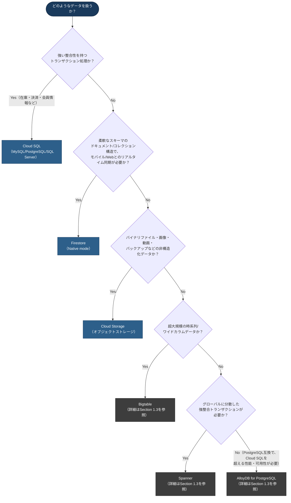

データストアを選定したら、次は「どうやって安全かつ効率的に接続するか」を決めます。3つのデータストアはそれぞれ接続モデルが異なります。

**Cloud SQLへの接続**

Cloud SQLはネットワーク経由でTCP接続するリレーショナルデータベースであるため、接続を確立するたびに新規TCP接続を張るとレイテンシとリソース消費が大きくなります。Google Cloudは接続方式として大きく2つの選択肢を提供しています。

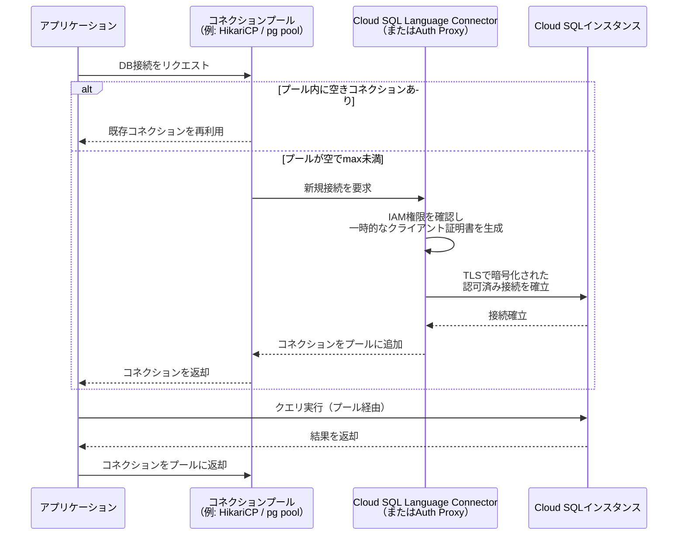

Cloud SQL Language Connectors（Java・Python・Go・Node.js向け）は、アプリケーションプロセス内でIAM認可と自動TLS暗号化を行うライブラリで、証明書管理が不要になります。Java・Python・Go・Node.js以外の言語を使う場合や、既存のインフラでサイドカーとして分離したい場合は Cloud SQL Auth Proxy を使うのが基本パターンです。いずれの方式でも、**コネクションプールを使い回すこと**が最も重要な原則です。

| 接続方式 | 主な特徴 | 向いているシーン |
|---|---|---|
| Cloud SQL Language Connectors | アプリ内蔵ライブラリ。IAM認可＋自動TLS。ADCで認証 | Java/Python/Go/Node.jsで新規開発する場合の第一選択 |
| Cloud SQL Auth Proxy | 別プロセス/サイドカーとして起動。同様にIAM認可＋TLS | 上記4言語以外、または既存インフラでプロセス分離したい場合 |
| Private IP + 直接TLS接続 | VPC内から直接データベースドライバで接続。コネクタの処理を経由しない分、レイテンシに有利。アプリケーション側でTLSと証明書の構成・管理が必要 | VPC内のクライアント全般、特にレイテンシに敏感なワークロード |

コネクションプール自体の設定では、最大接続数（max）・最小アイドル接続数（min）・アイドルタイムアウト・接続の最大生存時間（max lifetime）を、Cloud SQLインスタンスの `max_connections` 上限やアプリケーションのスケール数と整合するように調整します。たとえばCloud Run上で多数のインスタンスが同時にスケールアウトする場合、各インスタンスのプールサイズを小さく保たないと、インスタンス数 × プールサイズがデータベース側の上限を容易に超えてしまいます。

**Firestoreへの接続**

Firestoreはサーバー間通信にgRPCを使用し、C#・Go・Java・Node.js・PHP・Python・Rubyのサーバークライアントライブラリが提供されています。ここで重要な設計判断は「サーバークライアントライブラリ」と「モバイル/Web向けのFirebaseクライアントSDK」のどちらを使うかです。サーバークライアントライブラリはIAMで保護された特権環境（Firestoreセキュリティルールを経由しない、フルアクセス環境）を前提としており、バックエンドサーバーからの管理的なデータアクセスに用います。一方、エンドユーザーの端末上で直接Firestoreにアクセスするアプリケーションでは、セキュリティルールが適用されるFirebaseクライアントSDKを使う必要があります。

**Cloud Storageへの接続**

Cloud StorageはgRPC・JSON API・XML APIのいずれでもアクセス可能で、C++・C#・Go・Java・Node.js・PHP・Python・Rubyのクライアントライブラリが用意されています。アプリケーションからの接続管理という観点では、Cloud SQLやFirestoreのような「コネクションの確立と維持」という概念よりも、クライアントオブジェクト（例: Pythonの`storage.Client()`）を使い回し、リクエストごとに新規クライアントを生成しないことが重要です。内部で使われるトランスポート（HTTP/1.1・HTTP/2・gRPC）やコネクション再利用の挙動は言語・クライアントライブラリごとに異なるため、明示的なプール管理が必要かどうかは利用するライブラリのドキュメントで確認します。いずれの環境でも、クライアントインスタンスを再利用しリクエストごとに新規生成しないことは、パフォーマンス上の基本です。

#### ベストプラクティス

- **コネクションプールは必ず使う**: Cloud SQLへの接続はリクエストごとに新規作成せず、アプリケーションプロセスの起動時に1つのプールを作成して使い回します。
- **Cloud SQL Language Connectorsを優先する**: 対応言語（Java/Python/Go/Node.js）では、証明書のライフサイクル管理が不要になるLanguage Connectorsを、Auth Proxyよりも先に検討します。一方、VPC内のクライアント、特にレイテンシに敏感なワークロードでは、コネクタの処理を経由しないPrivate IPによる直接接続も標準的な選択肢です。Private IPを選ぶ場合はTLSと証明書の構成・管理をアプリケーション側で担う必要があるため、証明書管理の手間を避けたいか、レイテンシを優先するかで接続方式を選定します。
- **プールサイズはスケール数を考慮して設計する**: Cloud RunやGKEでインスタンス数が動的に増減する環境では、インスタンス数 × 最大接続数がデータベースの接続上限を超えないよう、上限を保守的に設定します。
- **再接続とバックオフを実装する**: プールが正しく設定されていても、フェイルオーバーやメンテナンスによって接続が切れることがあるため、アプリケーション層でも再試行ロジックを持たせます。
- **用途に応じてFirestoreのライブラリを正しく使い分ける**: バックエンドの管理処理にはサーバークライアントライブラリ、エンドユーザー端末からの直接アクセスにはセキュリティルールが効くFirebase クライアントSDKを使います。
- **クライアントオブジェクトを再利用する**: Cloud Storageクライアントやその他のCloud Client Libraryのクライアントは、リクエストのたびに生成せずグローバル/シングルトンスコープで保持します。

#### 出典

- [Manage database connections | Cloud SQL for MySQL](https://cloud.google.com/sql/docs/mysql/manage-connections)
- [Cloud SQL Language Connectors overview | Cloud SQL for MySQL](https://cloud.google.com/sql/docs/mysql/language-connectors)
- [Connect using Cloud SQL Language Connectors | Cloud SQL for MySQL](https://cloud.google.com/sql/docs/mysql/connect-connectors)
- [About the Cloud SQL Auth Proxy | Cloud SQL for MySQL](https://cloud.google.com/sql/docs/mysql/sql-proxy)
- [Firestore client libraries | Firestore in Native mode](https://cloud.google.com/firestore/docs/reference/libraries)
- [Cloud Storage client libraries](https://cloud.google.com/storage/docs/reference/libraries)
- [Cloud Storage overview](https://cloud.google.com/storage/docs/introduction)

---

### 4.1.2 さまざまなGoogle Cloudデータソースへのデータの読み書き

#### 概要

データストアへの「接続」ができたら、次は実際の読み書き（CRUD操作）を、それぞれのデータストアの特性に合った方法で実装します。ここで問われるのは単一のAPI呼び出し方法ではなく、リレーショナルデータベース・ドキュメントデータベース・オブジェクトストレージという性質の異なるデータソースそれぞれで、何が「正しい読み書きのやり方」なのかを理解しているかどうかです。

#### ステップバイステップの流れ

**リレーショナルデータ（Cloud SQL）の読み書き**

Cloud SQLはMySQL・PostgreSQL・SQL Server互換のため、標準的なSQLドライバ（JDBC、psycopg、pgのようなドライバ）を通じて読み書きを行います。ここでの実装上の要点は、**パラメータ化クエリ（プレースホルダ）を使い、文字列結合でSQLを組み立てないこと**（SQLインジェクション対策）、そして複数の更新をまとめる場合は明示的なトランザクションでラップすることです。

**ドキュメントデータ（Firestore）の読み書き**

Firestoreはコレクション/ドキュメントのモデルで、単一ドキュメントの読み書きは低レイテンシになりやすい一方（実際の値はロケーション構成やネットワーク経路、ドキュメントサイズなどで変動します）、複数ドキュメントにまたがる整合性が必要な操作にはトランザクションやバッチ書き込みを使います。レイテンシ目標は固定値を前提にせず、実測したp95/p99に基づいて設計します。

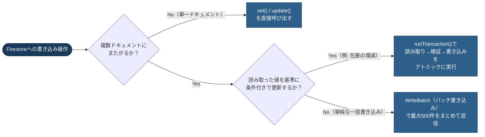

読み取り側では、クエリ結果をリアルタイムに反映したい場合は`onSnapshot`のようなリスナー（スナップショットリスナー）を使い、1度きりの取得であれば単発の`get()`を使う、という使い分けが重要です。リスナーを使いっぱなしにして解除し忘れると、不要な読み取り課金とメモリリークの原因になります。

**オブジェクトデータ（Cloud Storage）の読み書き**

Cloud Storageの読み書きは「オブジェクト全体をアップロード/ダウンロードする」操作が基本ですが、大きなファイルではストリーミングアップロード/ダウンロードやレジューマブルアップロード（分割・再開可能なアップロード）を使うことで、ネットワーク断からの回復力を高められます。エンドユーザーに直接アップロード/ダウンロードさせたい場合は、アプリケーションサーバーを経由させず、署名付きURL（Section 1.3で解説）を発行してクライアントから直接Cloud Storageにアクセスさせるのが定石です。

#### ベストプラクティス

- **パラメータ化クエリを徹底する**: Cloud SQLに対するSQL文は、常にプレースホルダを使い、ユーザー入力を直接文字列結合しません。
- **複数ドキュメントの整合性が必要な場合はFirestoreトランザクションを使う**: 読み取った値を基準に更新する処理（カウンタの増減など）は、`runTransaction()`で自動リトライ付きのアトミック処理として実装します。
- **大量書き込みにはバッチ書き込みを使う**: Firestoreで多数のドキュメントを一括作成/更新する場合は、個別の`set()`呼び出しの連続ではなく`WriteBatch`にまとめてネットワークラウンドトリップを削減します。
- **スナップショットリスナーは確実に解除する**: リアルタイム同期が不要になった時点（コンポーネントのアンマウント時など）でリスナーを解除し、読み取り課金とメモリリークを防ぎます。
- **大きなオブジェクトはストリーミング/レジューマブルアップロードを使う**: メモリに全体を読み込まず、チャンク単位で処理し、ネットワーク断からの再開に対応します。
- **クライアント直接アップロード/ダウンロードには署名付きURLを使う**: アプリケーションサーバーを経由させることで発生する二重の帯域消費とレイテンシを避けます。

#### 出典

- [Quickstart: Create a Firestore database by using a server client library](https://docs.cloud.google.com/firestore/native/docs/create-database-server-client-library)
- [GitHub - googleapis/nodejs-firestore](https://github.com/googleapis/nodejs-firestore)
- [Cloud Storage client libraries](https://cloud.google.com/storage/docs/reference/libraries)
- [Python Client for Cloud Storage](https://docs.cloud.google.com/python/docs/reference/storage/latest)

---

### 4.1.3 メッセージングサービスを使ったデータの発行・消費アプリケーションの作成

#### 概要

同期的なリクエスト/レスポンス型の統合だけでなく、Section 1.1で扱った「非同期・イベント駆動型の統合」を実際にコードとして実装する項目です。Google Cloudにおけるメッセージングサービスの中心は**Pub/Sub**であり、発行（Publish）と消費（Subscribe）それぞれで異なるチューニングポイントがあります。

#### ステップバイステップの流れ

Pub/Subを使ったアプリケーション構築の標準的な流れは次のとおりです。

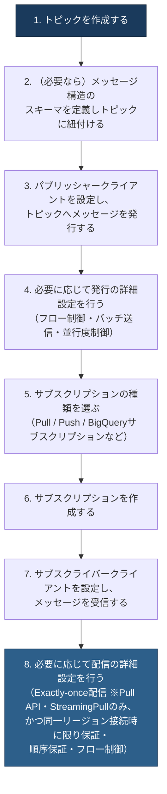

**発行（Publish）側のチューニング**

パブリッシャークライアントは使い回すことが基本原則です。メッセージを送るたびに新しいクライアントを生成すると、接続確立のオーバーヘッドが積み重なります。また、大量のメッセージを短時間に発行する場合は、パブリッシャー側の**フロー制御**（未確認応答のまま送信できるメッセージ数・バイト数の上限）を設定し、クライアント側のメモリ・CPU・スレッドが枯渇して`DEADLINE_EXCEEDED`エラーが多発する事態を防ぎます。

以下は **Pullサブスクリプション（StreamingPull）** の例です。サブスクライバーが受信したメッセージを`ackDeadline`（確認応答の期限）内に確認応答（ack）することで、そのメッセージは確認済みとして扱われます。

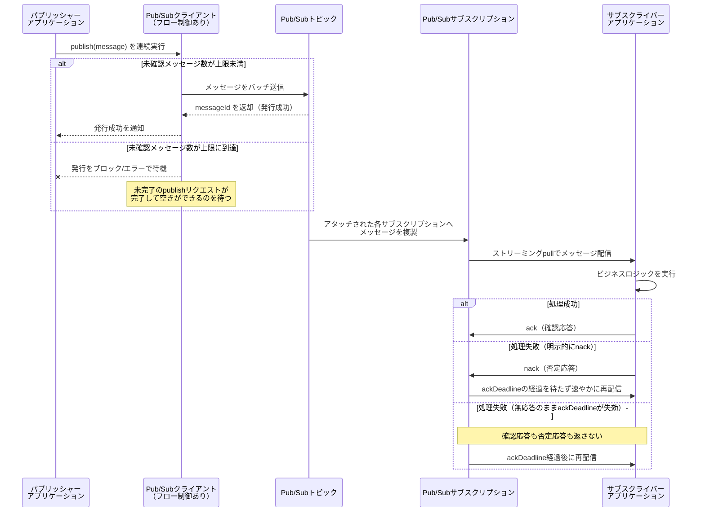

PushサブスクリプションではPub/SubがHTTPSエンドポイントへPOSTし、エンドポイントが成功ステータスコードを返した時点でメッセージが確認済みになります（ackの明示的な送信は不要）。BigQueryサブスクリプションのようなエクスポート型では、宛先への書き込みが成功した時点でPub/Sub側が確認済みとして扱うため、いずれも上図のack/nackのやり取りとは仕組みが異なります。

**消費（Subscribe）側のチューニング**

サブスクライバー側では、**ackDeadline**（メッセージの確認応答に許される時間）を処理内容に見合った長さに設定し、処理が終わる前にメッセージが再配信されてしまう事態を防ぎます。また、Pub/Subはデフォルトで**少なくとも1回（at-least-once）配信**を保証する設計であるため、同じメッセージが2回以上届く可能性を前提に、消費側の処理を**冪等**（べき等）に設計することが極めて重要です。高いスループットが必要な場合はサブスクライバー側でもフロー制御を設定し、突発的なトラフィックスパイクでサブスクライバーが過負荷になるのを防ぎます。

サブスクリプションの種類（Push/Pull）の選定は、Section 3.1（Cloud Runへのデプロイ）で扱った「Eventarc/Pub/Subによるトリガー」とも密接に関係します。

| サブスクリプション種別 | 特徴 | 向いているシーン |
|---|---|---|
| Pull（プル型） | サブスクライバーが能動的にメッセージを取得しにいく。Pull APIまたはStreamingPull APIの呼び出しが必要（クライアントライブラリの利用が推奨） | 常時稼働するワーカー、GKE上のサービスなど |
| Push（プッシュ型） | Pub/SubがHTTPSエンドポイントへメッセージをPOSTする | クライアントライブラリを依存関係に含められない環境、Cloud Runなどサーバーレス環境からの受信 |
| BigQueryサブスクリプション（エクスポート型） | Dataflowを介さず直接BigQueryテーブルへ書き込む | ログ/イベントの分析用ストレージへの直接投入 |

**Exactly-once配信の適用範囲**：Exactly-once配信を有効にできるのは**Pullサブスクリプション（Pull API、StreamingPullを含む）のみ**です。PushサブスクリプションおよびBigQueryサブスクリプションのようなエクスポート型では利用できないため、重複排除を配信側の保証に依存する設計はPull型に限られます。さらに、この保証が成立するのは**サブスクライバークライアントが同一リージョンのPub/Subサービスに接続している場合のみ**です。別リージョンのエンドポイントへ接続した場合はexactly-onceの保証が適用されないため、サブスクライバーの配置先リージョンも設計時に確認します。

#### ベストプラクティス

- **パブリッシャー/サブスクライバークライアントを使い回す**: リクエストごとに生成せず、アプリケーションのライフサイクル全体で単一のクライアントインスタンスを共有します。
- **消費処理は冪等に設計する**: Pub/Subのat-least-once配信により同一メッセージが重複配信され得るため、何度処理されても結果が変わらない実装にします。同一メッセージの再配信は`messageId`で弾けますが、パブリッシャー側が再試行した場合は内容が同じでも`messageId`が変わるため、注文IDのような**業務上の冪等性キー**を使った永続的な重複排除を併用します。重複排除の記録先ごとに実装方法が異なる点に注意が必要です。Firestore（Native mode）のStandard editionには一意制約（UNIQUE制約）に相当する機能がないため、**業務キーそのものをドキュメントIDにした処理済み記録**を作り、`create`（既存なら失敗）やトランザクション内の存在チェックで重複を弾きます。Cloud SQLを使う場合は、処理済みテーブルの業務キー列に**UNIQUE制約**を張り、重複挿入がエラーになるようにします。
- **重複排除の記録と副作用は同じ整合性境界に収める**: 重複排除の記録と実際の副作用（DB更新など）は**同一データストアの単一トランザクションでコミット**し、「副作用だけ適用されて記録が残らない」中途半端な状態が生じないようにします。副作用がCloud SQL側にあるのに重複排除の記録をFirestoreに置くような**データストアをまたぐ構成では、Firestoreのトランザクションは両者の原子性を保証できません**。この場合は、重複排除の記録も副作用と同じCloud SQLのトランザクション内で書き込むか、outboxパターンのような結果整合性を担保する仕組みを挟んで、2つのデータストア間の整合性をアプリケーション側で明示的に管理します。**ackはこのトランザクションのコミットが成功した後に送信します**。コミット前にackしてしまうと、直後にプロセスが停止した場合にメッセージが失われます。逆に、ack送信前にプロセスが停止してメッセージが再配信されても、すでにコミット済みの重複排除記録（業務上の冪等性キー）によって2回目の処理は安全にスキップできます。
- **フロー制御を適切に設定する**: パブリッシャー・サブスクライバーの両方で、未確認メッセージ数/バイト数の上限を設定し、突発的な負荷でリソースが枯渇するのを防ぎます。
- **ackDeadlineを処理時間に合わせて設定する**: 処理が長時間かかる場合はackDeadlineを延長するか、処理開始時に自動延長（lease management）を有効にします。
- **クライアントライブラリの言語選定にも注意する**: Java・C++・Goはスループット効率が高く、大量メッセージ処理が必要な基盤にはこれらの言語のクライアントライブラリが有利です。
- **本番では検証済みバージョンを固定し、更新を定期的に取り込む**: Pub/Subのクライアントライブラリは継続的に機能追加・不具合修正が行われるため更新の追随には価値がありますが、本番環境で常に最新版を自動採用すると、未検証の変更がそのまま入り込みます。本番では動作検証を済ませたバージョンを固定（ピン留め）し、定期的に新しいバージョンを検証したうえで計画的に更新を取り込みます。

#### 出典

- [Overview of the Pub/Sub service](https://cloud.google.com/pubsub/docs/pubsub-basics)
- [Best practices to publish to a Pub/Sub topic](https://cloud.google.com/pubsub/docs/publish-best-practices)
- [Best practices to subscribe to a Pub/Sub topic](https://cloud.google.com/pubsub/docs/subscribe-best-practices)
- [Pub/Sub: Introduction to reliability](https://cloud.google.com/pubsub/docs/reliability-intro)
- [Flow control | Pub/Sub](https://cloud.google.com/pubsub/docs/flow-control-messages)

---

## 4.2 Google Cloud APIの利用

### 4.2.1 Google Cloudサービスの有効化

#### 概要

Google Cloudのほとんどのサービス（BigQuery、Pub/Sub、Cloud SQL Admin APIなど）は、プロジェクトごとに明示的に「有効化（Enable）」しないと呼び出せません。これはコスト管理・セキュリティ・監査のための設計であり、開発者がAPIを利用する最初のステップとして必ず理解しておく必要があります。

#### ステップバイステップの流れ

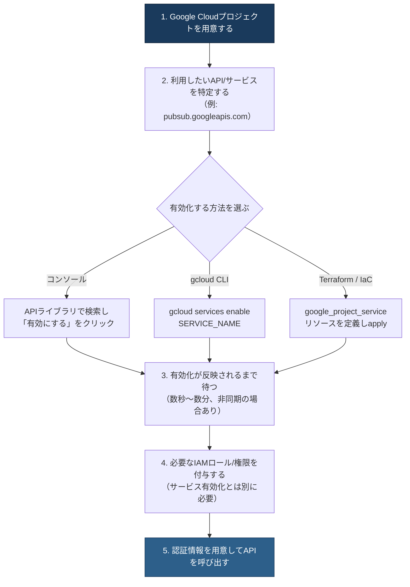

コンソールから有効化する場合は、「APIとサービス」＞「ライブラリ」から対象のAPIを検索し、「有効にする」をクリックします。gcloud CLIでは`gcloud services enable`コマンドを使い、複数のサービスをスペース区切りで一度に有効化することもできます。

```bash
# 単一サービスの有効化
gcloud services enable pubsub.googleapis.com

# 複数サービスをまとめて有効化
gcloud services enable bigquery.googleapis.com pubsub.googleapis.com
```

非同期で有効化を実行したい場合は`--async`フラグを付与します。CI/CDパイプラインやIaCで環境を再現可能にしたい場合は、Terraformの`google_project_service`リソースを使い、プロジェクト作成の一部としてAPI有効化をコード化するのが望ましいアプローチです。

なお、一部のIAMロールは、対応するサービスが有効化されるまでコンソール上に表示されない場合があります（例: `roles/compute.admin`はCompute Engine APIが有効化されて初めて選択可能になります）。API有効化とIAM権限付与は別の設定であり、両方が揃って初めてAPI呼び出しが成功する点に注意してください。

#### ベストプラクティス

- **必要最小限のAPIのみを有効化する**: 使わないサービスを有効化したままにすると、誤用やセキュリティリスクの増加につながります。使わなくなったサービスは無効化を検討します。
- **IaCでAPI有効化を管理する**: Terraformなどのコードでプロジェクトの初期設定として管理することで、環境間の再現性と監査可能性を確保します。
- **依存関係を意識して無効化する**: あるサービスが他の有効なサービスに依存されている場合、無効化はエラーになります。依存サービスも含めて無効化したい場合、`gcloud` CLIでは`gcloud services disable SERVICE --force`のように`--force`フラグを使います（依存関係チェックに加え、直近の利用状況チェックも合わせてバイパスします）。Service Usage REST APIを直接呼び出す場合は、`services.disable`リクエストのボディに`disableDependentServices: true`パラメータを指定します。CLIの`--force`とREST APIの`disableDependentServices`は同じ「依存サービスも含めて無効化する」という目的のためのそれぞれ別のインターフェースであり、混同しないよう注意してください。
- **サービス無効化はデータを削除しない点を理解する**: Cloud StorageやBigQueryのようにデータ保存に課金が発生するサービスでは、APIを無効化してもデータそのものや課金は止まりません。将来の課金を止めたい場合はデータそのものを削除する必要があります。
- **API有効化とIAM権限を混同しない**: 「APIが有効化されている」ことと「呼び出すユーザー/サービスアカウントに権限がある」ことは別の設定であるため、両方を確認します。

#### 出典

- [gcloud services enable | Google Cloud SDK](https://cloud.google.com/sdk/gcloud/reference/services/enable)
- [Enable and disable services | Service Usage](https://cloud.google.com/service-usage/docs/enable-disable)
- [Enabled services | Service Usage](https://docs.cloud.google.com/service-usage/docs/enabled-service)
- [Getting started | Cloud APIs](https://cloud.google.com/apis/docs/getting-started)

---

### 4.2.2 サポートされているオプションを使ったAPI呼び出し

#### 概要

Google CloudのAPIには複数の呼び出し方式があり、それぞれ得意分野が異なります。Exam Guideが例示するのは **Cloud Client Libraries**・**REST API**・**gRPC**・**API Explorer** の4つです。さらに、実際の呼び出しを設計する際には「バッチ処理」「返却データの制限（部分レスポンス）」「結果のページネーション」「結果のキャッシュ」「エラー処理（指数バックオフ）」という5つの考慮事項が試験範囲として明示されています。この項目は4.2の中でも最もボリュームが大きく、実装者としての実務力が直接問われる部分です。

#### ステップバイステップの流れ: 呼び出し方式の選択

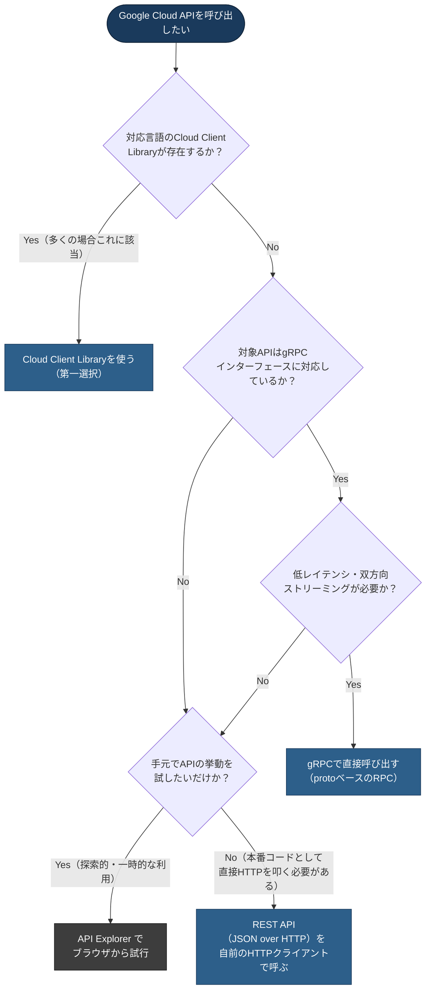

すべてのGoogle Cloud APIはJSON/RESTインターフェースを公開しており、その一部（gRPC対応のAPI）はさらにProtocol BuffersベースのRPCインターフェースも提供します。Cloud Client Librariesは、この2つのプロトコルの違いを開発者から隠蔽し、言語ネイティブな型安全なコードとして提供するラッパーです。

| 呼び出し方式 | 特徴 | 向いているシーン |
|---|---|---|
| Cloud Client Libraries | 言語ネイティブな型安全なAPI。認証・リトライ・ページネーションを内蔵 | 本番アプリケーションの実装（第一選択） |
| REST API | JSON over HTTP。あらゆる言語のHTTPクライアントから呼べる | Client Libraryが存在しない言語、または直接HTTP制御が必要な場合 |
| gRPC | Protocol Buffers + HTTP/2。ストリーミングと低レイテンシに強い | 独自クライアントを生成したい場合、双方向ストリーミングが必要な場合 |
| API Explorer | ブラウザ上でAPIリクエストを対話的に試行できるツール | ドキュメントを読みながらAPIの挙動を探索的に確認する場合 |

#### ステップバイステップの流れ: 5つの考慮事項

Cloud Client Libraries・REST・gRPCのいずれを使う場合でも、本番品質のAPI呼び出しを実装するには次の5つの観点を必ず設計に組み込みます。

**① バッチ処理（Batching requests）**

多数の小さなリクエストを個別に送信すると、リクエストごとのオーバーヘッド（TCP接続・TLSハンドシェイク・認証検証）が積み重なりスループットが低下します。バッチ処理では複数のAPI呼び出しを1つのHTTPリクエストにまとめて送信し、往復回数を削減します。ただし、`batchCreate`・`batchGet`のような一括操作やHTTPレベルのバッチエンドポイントは、すべてのGoogle Cloud APIが標準で備えている機能ではありません。対象のAPIが`batchPath`を公開しているなど、API固有の仕様としてバッチをサポートしている場合にのみ利用できるため、利用前に対象APIのリファレンスで対応状況を確認します。1回のバッチリクエストに含められる件数などの利用上限も、対象APIの仕様に従います。

**② 返却データの制限（Restricting return data / 部分レスポンス）**

デフォルトでは、APIはリソースの完全な表現を返します。実際に必要なフィールドがごく一部であれば、`fields`パラメータを使って部分レスポンスをリクエストすることで、レスポンスサイズとシリアライズ/デシリアライズのコストを削減できます。

```http
GET https://www.googleapis.com/example/v1/items?fields=items(id,name)
```

**③ 結果のページネーション（Paginating results）**

一覧取得系のAPI（List系メソッド）は、大量の結果を一度に返すとネットワーク負荷とサーバー/クライアント双方の処理負荷が大きくなるため、ページトークン方式のページネーションを提供しています。クライアントは`pageSize`で1回あたりの件数を指定し、レスポンスに含まれる`nextPageToken`を次のリクエストに渡すことで、続きのページを取得します。Cloud Client Librariesの多くは、この処理をイテレータとして自動化しており、開発者はページングロジックを手書きする必要がありません。

**④ 結果のキャッシュ（Caching results）**

同じリソースへの問い合わせを繰り返す場合、**対象のAPIがETagと条件付き取得をサポートしているときに限り**、HTTPの条件付きリクエストの仕組みである**ETag**を活用できます。この場合、クライアントは前回取得時のETagを保存しておき、次回のリクエストで`If-None-Match`ヘッダーに指定します。リソースが変更されていなければサーバーは`304 Not Modified`を返し、レスポンスボディの転送を省略できます。

ETagのサポート有無と、`If-None-Match`をどう指定するかはAPIごと・クライアントごとに異なります。Google API Client Librariesが一般にETagキャッシュを自動処理してくれると考えるのではなく、**呼び出し対象APIのリファレンスでETagの対応状況を確認し、利用するクライアントライブラリのドキュメントで条件付きリクエストの具体的な指定方法を確認**したうえで実装します。

**⑤ エラー処理（Handling errors: 指数バックオフ）**

一時的なエラー（レート制限による`429`、サーバー側の一時的な過負荷による`503`など）に対しては、即座に失敗とせず、待機時間を指数関数的に増やしながら再試行する**指数バックオフ**を実装します。

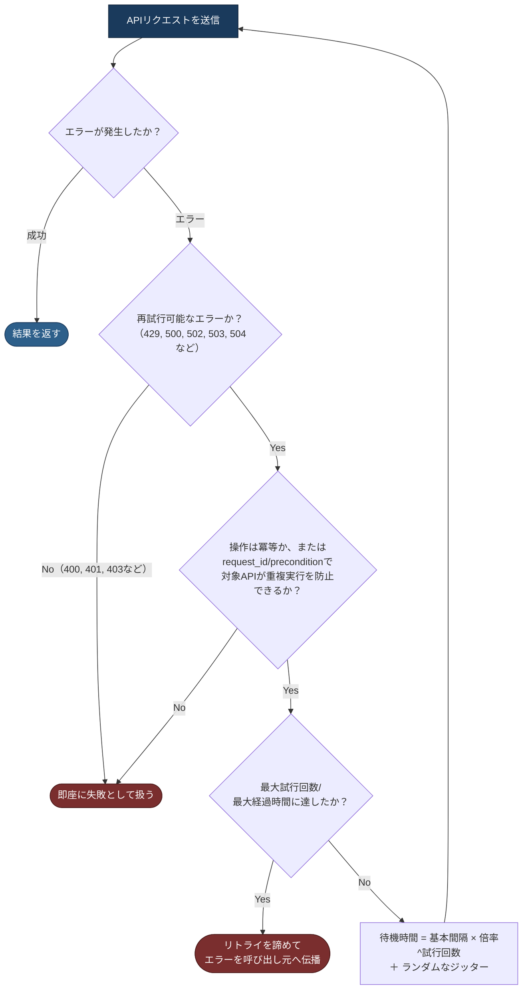

指数バックオフに**ランダムなジッター**（揺らぎ）を加えることも重要です。ジッターがないと、同時に失敗した多数のクライアントが同じタイミングで一斉に再試行し、サーバーへの負荷が再び集中する「サンダリングハード（thundering herd）」問題を引き起こす可能性があります。Cloud Client Librariesの多くは、この指数バックオフとジッターの実装をあらかじめ内蔵しており、初期間隔・最大間隔・倍率・最大試行回数といったパラメータのみを調整すればよいようになっています。

| 考慮事項 | 目的 | 代表的な実装手段 |
|---|---|---|
| バッチ処理 | リクエスト往復回数の削減 | バッチAPI、`batchCreate`系メソッド（**対象APIが`batchPath`等でバッチをサポートしている場合のみ**。利用上限も対象APIの仕様に従う） |
| 返却データの制限 | レスポンスサイズの削減 | `fields`パラメータによる部分レスポンス |
| ページネーション | 大量結果の分割取得 | `pageSize` / `pageToken` / `nextPageToken` |
| キャッシュ | 不要な再取得の回避 | ETagと`If-None-Match`による条件付きリクエスト（**対象APIがETag/条件付き取得に対応している場合のみ**。指定方法はクライアントごとに要確認） |
| エラー処理 | 一時的障害からの回復 | ジッター付き指数バックオフ |

#### ベストプラクティス

- **可能な限りCloud Client Librariesを使う**: 認証・リトライ・ページネーション・エラーハンドリングの多くがライブラリ側に実装済みであり、車輪の再発明を避けられます。
- **部分レスポンスを積極的に使う**: 一覧画面のサマリ表示など、フィールドの一部しか使わない場面では`fields`パラメータで転送量を削減します。
- **ページングはイテレータに任せる**: 手動で`nextPageToken`を管理するのではなく、Client Libraryが提供するページャー/イテレータを使い、実装ミスによる無限ループや取りこぼしを防ぎます。
- **リトライは冪等な操作にのみ適用する**: GETやリストのような読み取り操作は安全にリトライできますが、POSTのような非冪等な操作をリトライする場合はリクエストIDなどで重複実行を防ぎます。リクエストIDやプレコンディションによる重複実行防止のサポート有無・指定方法はAPIごとに異なるため、リトライ対象APIのリファレンスで対応状況を必ず確認してください。いずれの手段も提供していない非冪等な操作は、安全にリトライできない操作として扱います。
- **指数バックオフには必ずジッターを加える**: 固定間隔や単純な指数バックオフだけでは、サンダリングハード問題を防ぎきれません。
- **再試行可能なエラーコードを正しく見極める**: 4xx系の多くはクライアント側の問題（認証エラーや不正なリクエスト）であり再試行しても解決しないため、429や5xx系のような一時的なエラーとは区別して扱います。

#### 出典

- [Client libraries and Cloud APIs explained](https://cloud.google.com/apis/docs/client-libraries-explained)
- [gRPC vs REST: Understanding gRPC, OpenAPI and REST | Google Cloud Blog](https://cloud.google.com/blog/products/api-management/understanding-grpc-openapi-and-rest-and-when-to-use-them)
- [AIP-158: Pagination](https://google.aip.dev/158)
- [Performance Tips | google-api-python-client](https://googleapis.github.io/google-api-python-client/docs/performance.html)
- [Retry strategy | Cloud Storage](https://cloud.google.com/storage/docs/retry-strategy)
- [Exponential backoff | Wikipedia](https://en.wikipedia.org/wiki/Exponential_backoff)

---

### 4.2.3 サービスアカウントを使ったCloud API呼び出し

#### 概要

Section 1.2で扱った認証の基礎（Application Default Credentials、WIFなど）を、実際の「API呼び出し」というコンテキストで再確認する項目です。ここで鍵となる概念が**Application Default Credentials**（ADC）です。サービスアカウントの利用が適しているのは、人間の対話を介さないサーバー間通信やバックグラウンド処理（バッチジョブ、CI/CDパイプラインなど）です。一方、ユーザー自身が所有するリソースを操作するアプリケーションでは、そのユーザーの認可を経ないサービスアカウントではなく、ユーザー認証やユーザー委任（OAuthの同意フローなど）を使うべきです。

#### ステップバイステップの流れ

ADCは、アプリケーションの実行環境に応じて自動的に適切な認証情報を見つけ出す仕組みです。Cloud Client Librariesは明示的な設定なしにADCを利用するため、開発環境と本番環境でコードを変更する必要がありません。

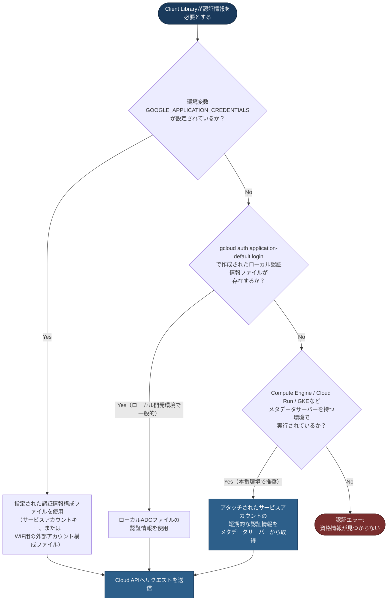

| 探索順序 | 認証情報のソース | 主な用途 |
|---|---|---|
| 1 | `GOOGLE_APPLICATION_CREDENTIALS`環境変数が指す**認証情報構成ファイル**（サービスアカウントキーのほか、Workload Identity Federation用の**外部アカウント構成ファイル**も指定可能） | CI/CDや他クラウド上での実行など、実行環境にサービスアカウントを直接アタッチできない場合。長期有効なキーの配布は避け、外部アカウント構成（WIF）を優先する |
| 2 | `gcloud auth application-default login`で生成されたローカル認証情報 | 開発者個人のローカル開発環境 |
| 3 | 実行環境にアタッチされたサービスアカウント（メタデータサーバー経由） | Compute Engine / Cloud Run / GKE / Cloud Functionsなどの本番環境 |

本番環境における最も推奨される方法は、**ユーザー管理のサービスアカウントを作成し、最小権限のIAMロールのみを付与したうえで、実行先のリソース（Cloud Run サービス、GKEのワークロードなど）にアタッチする**方式です。この場合、アプリケーションコードはキーファイルを一切扱わず、ADCがメタデータサーバーから自動的に短期間（デフォルトで1時間）有効なアクセストークンを取得します。他クラウドやオンプレミス環境からGoogle CloudのAPIを呼び出す必要がある場合は、長期間有効なサービスアカウントキーをダウンロードして配布するのではなく、[[gcp-pca-guide]]でも扱ったWorkload Identity Federation（WIF）を使い、外部IDプロバイダーの認証情報を一時的なサービスアカウント認証情報に交換する方式が推奨されます。

#### ベストプラクティス

- **サービスアカウントキーのダウンロード/配布を避ける**: JSONキーファイルは長期間有効な機密情報であり、漏洩のリスクが高いため、可能な限りアタッチ型のサービスアカウントやWIFを使います。
- **最小権限の原則を徹底する**: サービスアカウントには、そのワークロードが実際に必要とするAPI呼び出しに対応する最小限のIAMロールのみを付与します。
- **ADCの探索順序を理解してデバッグに活用する**: 「意図しない認証情報が使われている」不具合の多くは、環境変数やローカルADCファイルが本番環境の設定を上書きしてしまうケースであるため、探索順序を把握しておくとトラブルシューティングが早くなります。
- **ワークロードごとに専用のサービスアカウントを分離する**: 複数のサービスで1つの強い権限を持つサービスアカウントを共有せず、サービス単位でアカウントを分離し、影響範囲を限定します。
- **他クラウド/オンプレミスからの呼び出しにはWIFを使う**: 長期キーの代わりに、外部IDプロバイダーとの信頼関係に基づく短期トークン交換を使います。

#### 出典

- [How Application Default Credentials works | Authentication](https://docs.cloud.google.com/docs/authentication/application-default-credentials)
- [Service account credentials | Identity and Access Management (IAM)](https://docs.cloud.google.com/iam/docs/service-account-creds)
- [Authenticate workloads to Google Cloud APIs using service accounts | Compute Engine](https://docs.cloud.google.com/compute/docs/access/authenticate-workloads)
- [gcloud auth application-default | Google Cloud SDK](https://cloud.google.com/sdk/gcloud/reference/auth/application-default)
- [Authentication for Google Cloud APIs and services](https://docs.cloud.google.com/docs/authentication#service-accounts)

---

## 4.3 トラブルシューティングとオブザーバビリティ

### 4.3.1 メトリクス・ログ・トレースによるコードのインスツルメンテーション

#### 概要

「オブザーバビリティ（可観測性）」とは、システムの外部から得られるテレメトリデータ（メトリクス・ログ・トレース）をもとに、システム内部で何が起きているかを理解できる状態を指します。この状態を実現する最初のステップが**インスツルメンテーション**、すなわちアプリケーションコードにテレメトリを発生させるコードを組み込むことです。Google Cloudはこれらのテレメトリを収集・分析する統合サービス群を**Google Cloud Observability**として提供しています。

#### ステップバイステップの流れ

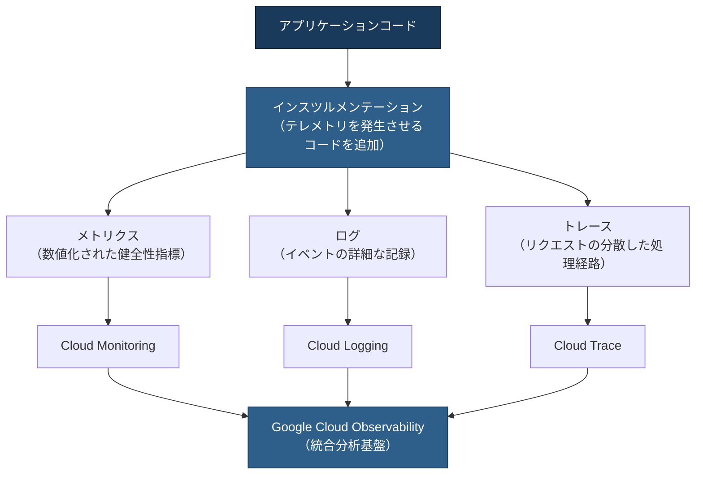

3種類のテレメトリはそれぞれ異なる問いに答えます。**メトリクス**は「アプリケーションは正常に動いているか（応答時間、エラー率、リソース使用率など）」という問いに、**ログ**は「具体的に何が起きたか（エラーメッセージ、スタックトレース、特定リクエストの詳細）」という問いに、**トレース**は「複数サービスをまたぐリクエストのどこで時間がかかっているか」という問いにそれぞれ答えます。

Googleはこれらのテレメトリ収集にあたり、ベンダー固有のAPI/クライアントライブラリではなく、**OpenTelemetry**のようなオープンソースでベンダー中立な計装フレームワークの利用を推奨しています。OpenTelemetryで収集したテレメトリはGoogle Cloud Observabilityへエクスポートでき、将来的に別の観測基盤へ移行する場合もロックインを避けられます。

言語ごとの実装パターンとしては、ログについてはJSON構造化ログを出力できるロギングフレームワークの利用が推奨されており、たとえばPythonでは標準の`logging`モジュール、JavaScriptでは`Pino`、Javaでは`SLF4J`と`Log4j2`の組み合わせが例示されています。メトリクスについては、オープンソースの監視システムであるPrometheusのクライアントライブラリを使い、HTTPエンドポイントとして公開する方式もサポートされています。

#### ベストプラクティス

- **OpenTelemetryを軸に計装を設計する**: 個別のベンダーAPIに直接依存するのではなく、OpenTelemetryで計装し、Google Cloudへエクスポートする構成にすることで移植性を保ちます。
- **構造化ログを出力する**: 自由形式のテキストログではなく、JSON形式の構造化ログを出力することで、Cloud Logging側でのフィルタリング・分析が容易になります。
- **3種類のテレメトリを組み合わせて設計する**: メトリクスだけ、ログだけといった単一の情報源に頼らず、「メトリクスで異常を検知し、トレースで箇所を特定し、ログで原因を確認する」という一連の流れを前提にインスツルメンテーションを設計します。
- **重要なビジネスロジックにはカスタムスパン/カスタムメトリクスを追加する**: フレームワークが自動計装する範囲だけでなく、業務上重要な処理には独自のスパンやメトリクスを追加し、可視性を高めます。
- **ログのボリュームとコストを意識する**: すべてのログを無制限に記録するとコストが増大するため、ログの重要度（severity）やサンプリングを適切に設計します。

#### 出典

- [Observability in Google Cloud | Google Cloud Observability](https://docs.cloud.google.com/stackdriver/docs)
- [Instrumentation and observability | Google Cloud Observability](https://docs.cloud.google.com/stackdriver/docs/instrumentation/overview)
- [What Is Observability? | Google Cloud](https://cloud.google.com/discover/what-is-observability)
- [Observability and monitoring](https://docs.cloud.google.com/docs/observability)

---

### 4.3.2 Google Cloud Observabilityを使った問題の特定と解決

#### 概要

インスツルメンテーションによってテレメトリが収集できるようになったら、次はそのデータを使って実際に問題を「特定」し「解決」するプロセスです。Google Cloud Observabilityは、Cloud Logging・Cloud Monitoring・Cloud Trace・Cloud Profilerという複数のサービス群から構成される統合スイートであり、それぞれが異なる役割を担います。

#### ステップバイステップの流れ

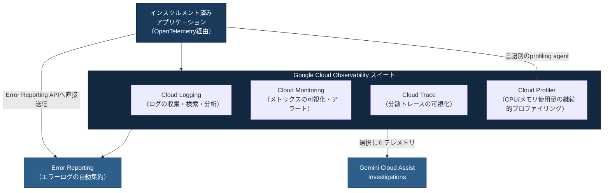

| サービス | 主なデータ | 主な用途 |
|---|---|---|
| Cloud Logging | 構造化/非構造化ログ | イベントの詳細確認、SQLベースのLog Analytics分析、アラート条件のトリガー |
| Cloud Monitoring | 時系列メトリクス、アップタイムチェック結果 | ダッシュボードによる可視化、しきい値超過時のアラート通知、SLO管理 |
| Cloud Trace | 分散トレースのスパン | サービス間のレイテンシ分析、ボトルネックの特定 |
| Cloud Profiler | CPU/メモリ/ヒープ使用量の継続的サンプリング | コスト最適化、特定関数のリソース消費の特定 |

典型的な問題解決フローは次のように進みます。まずCloud Monitoringのダッシュボードやアラートポリシーによって「エラー率が上昇している」「レイテンシが悪化している」といった**異常の検知**が行われます。次に、該当する時間帯のCloud Traceでリクエストのスパンを確認し、**どのサービス・どの処理でボトルネックが発生しているか**を特定します。さらに、該当するスパンやリクエストに紐づくCloud Loggingのログエントリを確認し、**具体的なエラーメッセージやスタックトレース**から根本原因を突き止めます。CPUやメモリのボトルネックが疑われる場合は、Cloud Profilerで継続的に収集されたプロファイルデータから、どの関数がリソースを消費しているかを特定します。

Cloud Monitoringでは、しきい値ベースのアラートに加えて、実際のユーザートラフィックがない時間帯でも定期的にエンドポイントへリクエストを送る**合成監視**（synthetic monitoring）を使い、サービスが実際に外部から到達可能かを継続的に検証することもできます。

#### ベストプラクティス

- **異常検知→トレースでの絞り込み→ログでの原因特定という順序を意識する**: メトリクス・トレース・ログはそれぞれ粒度が異なるため、粗い情報から細かい情報へと段階的に絞り込むのが効率的です。
- **SLI/SLOに基づいたアラートを設計する**: すべてのメトリクス変動に反応するのではなく、ユーザー体験に直結する指標（可用性、レイテンシなど）に基づいてアラートしきい値を設計します。
- **ダッシュボードをサービス単位で整理する**: サービスごと、あるいはクリティカルユーザージャーニーごとにダッシュボードを分けることで、障害対応時に必要な情報へすぐアクセスできるようにします。
- **Cloud ProfilerはCPU/メモリのコスト最適化にも活用する**: 障害対応時だけでなく、平常時からプロファイルデータを確認し、無駄なリソース消費を継続的に削減します。
- **BigQueryと連携したLog Analyticsを活用する**: 単純なフィルタリングでは見えにくい傾向分析やパターン検出には、Cloud LoggingのLog Analytics機能でSQLベースの分析を行います。

#### 出典

- [Observability: cloud monitoring and logging | Google Cloud](https://cloud.google.com/products/observability)
- [Observability in Google Cloud | Google Cloud Observability](https://docs.cloud.google.com/stackdriver/docs)
- [What Is Observability? | Google Cloud](https://cloud.google.com/discover/what-is-observability)

---

### 4.3.3 Error Reportingによるアプリケーション問題の管理

#### 概要

**Error Reporting**は、Cloud Loggingに書き込まれたログエントリを解析し、アプリケーションのクラッシュ/例外を自動的に検出・グルーピングして表示するサービスです。大量のログの中から「新しく発生したエラー」や「発生頻度の高いエラー」を効率よく見つけ出すために使います。

#### ステップバイステップの流れ

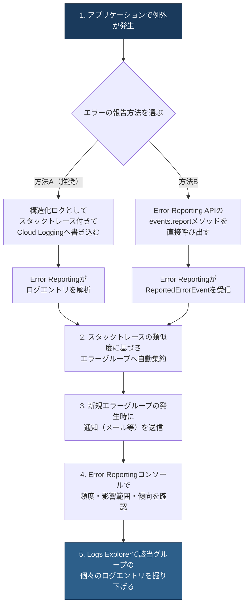

Error Reportingへエラーを送る方法は大きく2つあります。1つは、言語ごとのクライアントライブラリまたは自動収集機能を使い、正しいフォーマットの例外情報をCloud Loggingへ直接書き込む方法です。たとえばCloud Run上で標準エラー出力（stderr）に書き出された例外は自動的にCloud Loggingへ送られ、Error Reportingがそれを解析します。もう1つは、Error Reporting APIの`events.report`メソッドを直接呼び出し、`ReportedErrorEvent`オブジェクトとしてエラーを明示的に送信する方法です。

Error Reportingは類似したスタックトレースを持つエラーを自動的に**エラーグループ**としてまとめ、同じ原因によるエラーが1件ずつ個別に表示されて埋もれてしまう事態を防ぎます。新しいエラーグループが検出されると通知を送ることもでき、これまで発生していなかった種類の障害にいち早く気づく仕組みとして機能します。また、Cloud Run・GKE・App Engineなど、多くのGoogle Cloudサービス自体が生成するエラー（たとえばコンテナインスタンス数の上限到達など）についても、**Service Errors**機能により自動的に検出・分類されます。

#### ベストプラクティス

- **標準的な例外フォーマットで出力する**: 各言語向けにドキュメント化された例外情報のフォーマット（スタックトレースを含む）に従ってログへ書き込むことで、Error Reportingによる自動検出の精度が上がります。
- **新規エラーグループの通知を運用フローに組み込む**: 新しい種類のエラーが発生した際に、担当チームへ確実に通知が届くよう設定し、検知から対応までのリードタイムを短縮します。
- **サービスエラー（Service Errors）も併せて確認する**: アプリケーションコード起因のエラーだけでなく、利用しているGoogle Cloudサービス自体が記録するエラーもError Reportingで一元的に確認します。
- **API呼び出しの認証方式を用途に応じて選ぶ**: エラーイベントを直接送信する`projects.events.report`は、**APIキーとOAuth 2.0トークンのどちらでも呼び出せます**。サーバー間の処理では、IAMによる権限の絞り込みと監査ログでの追跡が可能なサービスアカウント（OAuthトークン）の利用が推奨されます。APIキーは、OAuthフローを実装できないクライアント（モバイルアプリやブラウザなど）からエラーを報告する限定的なケースで使い、キーの制限（参照元・アプリケーション制限）を必ず設定します。なお、`projects.events.report`以外のError Reporting APIメソッドはAPIキーでは呼び出せません。
- **CMEK（顧客管理暗号鍵）とError Reportingの制約を理解する**: CMEKを有効化したログバケットに保存されたログエントリはError Reportingで解析できないため、要件に応じて設計時に考慮します。

#### 出典

- [Error Reporting documentation | Google Cloud](https://cloud.google.com/error-reporting/docs/)
- [Manage service error events | Error Reporting](https://docs.cloud.google.com/error-reporting/docs/service-errors)
- [Collect error data by using Error Reporting](https://docs.cloud.google.com/error-reporting/docs/setup)
- [Overview | Error Reporting](https://docs.cloud.google.com/error-reporting/reference)
- [Error Reporting overview](https://docs.cloud.google.com/error-reporting/docs/grouping-errors)

---

### 4.3.4 トレースIDを使ったサービス間のトレーススパンの相関

#### 概要

マイクロサービスアーキテクチャでは、1つのユーザーリクエストが複数のサービスをまたいで処理されます。このとき、各サービスが個別に出力するログを後から手作業で結び付けるのは非常に困難です。**トレースID**を各サービス間で一貫して伝播させ、Cloud TraceのスパンとCloud Loggingのログエントリを結び付けることで、分散システム全体を横断した「1つのリクエストの物語」として問題を追跡できるようになります。

#### ステップバイステップの流れ

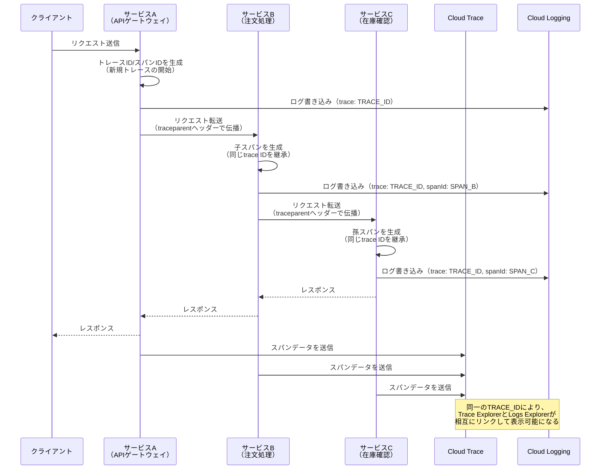

技術的には、Cloud LoggingのLogEntryオブジェクトが持つ`trace`フィールドと`spanId`フィールドがこの相関の鍵となります。`trace`フィールドにはCloud Traceのリソース名形式である`projects/PROJECT_ID/traces/TRACE_ID`を設定し、`spanId`フィールドには16文字の16進数エンコードされたスパンIDを設定します。OpenTelemetryでアプリケーションを計装し、アクティブなスパンのコンテキスト内でログを出力している場合、多くのGoogle Cloudのロギングクライアントライブラリはこれらのフィールドを**自動的に**設定します。HTTPリクエストが介在する場合は、W3Cの`traceparent`ヘッダーや`X-Cloud-Trace-Context`ヘッダーの値からトレースフィールドを設定することも可能です。ただし、この自動設定はすべての言語・クライアントライブラリで一律に保証されているわけではありません。アクティブなスパン・`traceparent`・`X-Cloud-Trace-Context`のいずれから設定されるか、また自動設定に対応しているかどうかは実装によって異なるため、利用する言語別のクライアントライブラリのドキュメントで対応状況を確認してください。

なお、Cloud Trace連携（トレースとログの相互リンク）では、クライアントライブラリが`X-Cloud-Trace-Context`や`traceparent`から取り出した`TRACE_ID`単体を書き込むケースもありますが、後述するLogs Explorerの「Correlate by」による親子ログ相関は`projects/PROJECT_ID/traces/TRACE_ID`形式を要求します。そのため、相関を前提にする場合はリソース名形式で統一してください。

正しく相関が設定されていれば、Cloud Trace側でスパンの詳細を表示すると関連するログエントリへのリンクが表示されます。逆にLogs Explorer側では、「クエリ結果（Query results）」ペインの「Correlate by」メニューで**親ログの`logName`（ログ名）を選ぶ**ことで、その親ログエントリに関連する子ログエントリをまとめて表示できます。「Correlate by」はトレースを選ぶメニューではなく、相関の基準として親となるログ名を指定するものである点に注意してください。

この相関が成立するには、次の3つの条件をすべて満たす必要があります。第一に、親ログと子ログの`trace`フィールドが、いずれも`projects/PROJECT_ID/traces/TRACE_ID`形式で同一の値に設定されていること（`TRACE_ID`単体の値ではこの相関は成立しません）。第二に、親ログと子ログの`logName`が**異なる**こと（同一ログ名のエントリ同士は親子として相関されません）。第三に、親ログのタイムスタンプが子ログのタイムスタンプ**以前**であること（親のほうが後の時刻になっていると相関されません）。

#### ベストプラクティス

- **サービス境界をまたいでトレースコンテキストを伝播させる**: HTTPヘッダー（`traceparent`など）やメッセージングのメタデータを使い、トレースIDが呼び出し先のサービスへ確実に引き継がれるようにします。
- **手動設定よりも自動計装を優先する**: OpenTelemetryやGoogle Cloudのクライアントライブラリが提供する自動的なトレース/ログの関連付け機能を使い、フィールドの手動設定によるフォーマットミスを避けます。
- **trace/spanIdのフォーマット要件を守る**: トレースIDは32文字の小文字16進数、スパンIDは16文字の小文字16進数という形式要件があり、これに従わないと相関が機能しません。
- **ログとスパンのタイムスタンプの整合性を保つ**: ログのタイムスタンプが対応するスパンの時間範囲外にあると、相関が正しく機能しない場合があるため、時刻同期（NTPなど）を適切に構成します。
- **サンプリングされなかったトレースも考慮する**: トレースサンプリングを使っている場合、ログエントリは作成されてもトレース自体は記録されないケースがあるため、`traceSampled`フィールドで状態を明示します。

#### 出典

- [Link log entries with traces | Cloud Trace](https://docs.cloud.google.com/trace/docs/trace-log-integration)
- [Correlate log entries | Cloud Logging](https://docs.cloud.google.com/logging/docs/view/correlate-logs)
- [Traces and spans](https://docs.cloud.google.com/trace/docs/traces-and-spans)
- [Find and explore traces | Cloud Trace](https://docs.cloud.google.com/trace/docs/finding-traces)

---

### 4.3.5 AI支援オブザーバビリティの活用

#### 概要

従来のトラブルシューティングは、担当エンジニアが自らダッシュボード・ログ・トレースを横断的に確認し、仮説を立てて検証するという手作業が中心でした。試験範囲としての「AI支援オブザーバビリティ」は、こうしたプロセスをAIが支援するという**考え方**（テレメトリの相関分析、根本原因候補の提示、人間による承認）を理解しているかを問うものであり、特定の製品機能の操作手順を問うものではありません。

その具体例が**Gemini Cloud Assist**の**Investigations**（調査）機能です。ただしInvestigationsは**2026年4月10日をもって一般利用向けには非推奨（deprecated）**となっており、誰でも使える安定機能ではありません。現在、調査の**作成・実行・編集**を行うには**Premium Support契約**、またはGoogle Cloudのアカウントチーム経由でのアクセスが必要です。なお、閲覧できるのは**2026年4月10日より前に実行された調査の結果のみ**で、それらについては引き続き参照可能です。提供状況・UI・利用条件は変わりうるため、以下は「AI支援オブザーバビリティの考え方を示す実装例」として読み、実際の利用可否は必ず公式ドキュメントとリリースノートで確認してください。

#### ステップバイステップの流れ

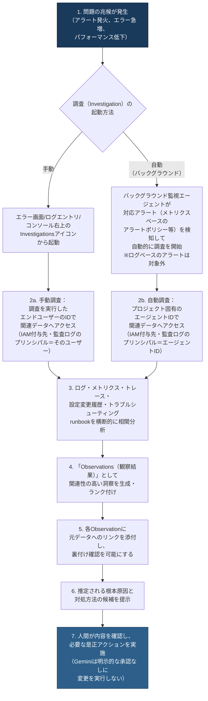

Investigationsが利用可能な環境では、GKEのアラート付きワークロード、失敗したバッチジョブ、失敗したAirflowタスクなど、対応するプロダクトページから直接起動できるほか、コンソール右上のInvestigationsアイコンやモバイルアプリからも起動できるとされています。前述のとおり調査の作成・実行・編集にはPremium Supportまたはアカウントチーム経由のアクセスが必要なため、いずれも誰でも使える安定提供機能として設計に織り込むべきものではありません。

設計・運用上重要なのは、**起動経路によってデータへアクセスするプリンシパルが異なる**点です。ユーザーがコンソール等から手動で起動した調査は、**その調査を実行したエンドユーザー自身のID**でデータにアクセスします。したがって必要な閲覧ロールは各ユーザー（またはグループ）へ付与し、監査ログにもそのユーザーがプリンシパルとして記録されます。一方、アラートを起点にバックグラウンド監視エージェントが自動的に開始する調査は、ユーザーが介在しないため、**プロジェクトごとに割り当てられたエージェント用のID**でデータにアクセスします。この経路を使う場合は、そのエージェントIDに対して別途、必要な閲覧ロールを付与する必要があり、監査ログのプリンシパルもエージェントIDになります。両者は付与先も監査上の主体も別物であるため、「実行ユーザーの権限範囲」だけを前提に権限設計を行うと、自動調査が動かない、あるいは監査証跡を追えないといった問題が生じます。

いずれの経路でも、調査は**読み取りと分析に専念する**設計です。アクセス範囲は付与されたIAM権限の範囲に限定され、**データを変更する目的では使用されません**。実際の是正措置（ロールバックや設定変更など）は人間の明示的な承認を経て実行されます。

より発展的な機能として、Database Observability and Onboarding AgentのようなGemini Cloud Assist上のエージェントは、Database Center・Cloud Monitoring・Cloud Logging・Cloud Traceなど複数のデータソースを横断的に相関させ、「過去7日間で最もCPUを消費したデータベースはどれか」といった自然言語での質問にも回答できます。また、Developer Connect Insights（DCI）という仕組みを通じて、パフォーマンスの変化を特定のコードコミットやデプロイと結び付け、単なるログのパターンマッチングを超えた根本原因分析を行うことも可能です。

#### ベストプラクティス

- **AIの提示内容は必ず裏付けデータで検証する**: Observationsには元データへのリンクが付与されているため、提示された洞察を鵜呑みにせず、リンク先のログ・メトリクス・トレースで裏付けを確認する習慣をつけます。
- **起動経路ごとにプリンシパルを分けて権限をスコープする**: 手動調査はエンドユーザーのID、自動調査はプロジェクト固有のエージェントIDでデータにアクセスします。両方の経路を使う場合は、それぞれのプリンシパルに対して個別に必要最小限の閲覧ロールを付与し、過度に広い権限を持つアカウントで調査を行わないようにします。
- **データレジデンシー要件を確認する**: 調査によって生成される情報はどのGoogle Cloudデータセンターにも保存され得るため、データの所在地やジュリスディクション（法域）に関する規制対象データについては、調査機能の利用可否を事前に確認します。
- **人間によるレビューを省略しない**: Geminiが提示する根本原因や対処案は候補であり、実際の是正アクション（デプロイのロールバックなど）は必ず人間が内容を理解したうえで実行します。
- **既存の手動トラブルシューティングスキルを維持する**: AI支援はMTTR（平均修復時間）短縮に有効ですが、根本的なログ・メトリクス・トレースの読み方という基礎スキルは引き続き重要です。

#### 出典

- [Troubleshoot issues with Gemini Cloud Assist investigations](https://docs.cloud.google.com/cloud-assist/investigations)
- [An application-centric, AI-powered cloud | Google Cloud Blog](https://cloud.google.com/blog/products/application-development/an-application-centric-ai-powered-cloud)
- [Gemini Cloud Assist: AI-assisted cloud operations and management](https://cloud.google.com/products/gemini/cloud-assist)
- [Deep dive on new AI-powered database agents | Google Cloud Blog](https://cloud.google.com/blog/products/databases/deep-dive-on-new-ai-powered-database-agents)
- [Gemini for Google Cloud overview | Gemini Cloud Assist](https://docs.cloud.google.com/cloud-assist/overview)
- [Feature deprecations | Gemini Cloud Assist](https://docs.cloud.google.com/cloud-assist/deprecations/features)
- [Gemini Cloud Assist release notes](https://docs.cloud.google.com/cloud-assist/release-notes)
- [Agent Identity overview | IAM](https://docs.cloud.google.com/iam/docs/agent-identity-overview)

---

## Section 4 まとめ: 試験対策チェックリスト

Section 4全体を振り返るためのチェックリストです。試験直前の最終確認や、学習の進捗管理にご活用ください。

| # | 出題項目 | 中心となるサービス/概念 | 一言で覚えるポイント |
|---|---|---|---|
| 4.1.1 | データストアへの接続管理 | Cloud SQL Language Connectors / Auth Proxy、Firestoreサーバークライアントライブラリ、Cloud Storageクライアント | コネクション/クライアントは「使い回す」のが大原則 |
| 4.1.2 | データの読み書き | パラメータ化クエリ、Firestoreトランザクション/バッチ書き込み、レジューマブルアップロード | 複数リソースにまたがる更新はトランザクション/バッチで |
| 4.1.3 | メッセージングでの発行/消費 | Pub/Subのフロー制御、ackDeadline、at-least-once配信 | 消費側は「重複配信が発生し得る」前提で冪等に設計する |
| 4.2.1 | サービスの有効化 | `gcloud services enable`、API有効化とIAM権限は別物 | 有効化だけでは呼べない、権限も別途必要 |
| 4.2.2 | API呼び出しオプションと5つの考慮事項 | Client Libraries/REST/gRPC/API Explorer、バッチ/部分レスポンス/ページネーション/ETagキャッシュ/指数バックオフ | 指数バックオフには必ずジッターを加える |
| 4.2.3 | サービスアカウントでの認証 | ADCの探索順序、WIF | 本番はアタッチ型サービスアカウント、キー配布は避ける |
| 4.3.1 | インスツルメンテーション | OpenTelemetry、構造化ログ | ベンダー中立なフレームワークで計装するのが推奨 |
| 4.3.2 | Observabilityでの問題特定/解決 | Cloud Logging/Monitoring/Trace/Profiler | 異常検知→トレースで絞込み→ログで原因特定の順序 |
| 4.3.3 | Error Reportingでの障害管理 | エラーグループ、Service Errors | 類似スタックトレースを自動集約し新規発生を通知 |
| 4.3.4 | トレースIDによるスパン相関 | LogEntryの`trace`/`spanId`フィールド | サービス間でトレースコンテキストを伝播させる |
| 4.3.5 | AI支援オブザーバビリティ | Gemini Cloud Assist Investigations | 読み取り専用の分析、是正実行には人間の承認が必要 |

---

## 参考文献

本ガイドの記述は、以下の公式ドキュメントおよび一次情報源に基づいています（2026年8月時点の内容を反映）。

### データストア接続・読み書き（4.1関連）

1. [Manage database connections | Cloud SQL for MySQL](https://cloud.google.com/sql/docs/mysql/manage-connections)
2. [Manage database connections | Cloud SQL for PostgreSQL](https://docs.cloud.google.com/sql/docs/postgres/manage-connections)
3. [Cloud SQL Language Connectors overview | Cloud SQL for MySQL](https://cloud.google.com/sql/docs/mysql/language-connectors)
4. [Connect using Cloud SQL Language Connectors | Cloud SQL for MySQL](https://cloud.google.com/sql/docs/mysql/connect-connectors)
5. [About the Cloud SQL Auth Proxy | Cloud SQL for MySQL](https://cloud.google.com/sql/docs/mysql/sql-proxy)
6. [GitHub - GoogleCloudPlatform/cloud-sql-proxy](https://github.com/GoogleCloudPlatform/cloud-sql-proxy)
7. [Firestore client libraries | Firestore in Native mode](https://cloud.google.com/firestore/docs/reference/libraries)
8. [Quickstart: Create a Firestore database by using a server client library](https://docs.cloud.google.com/firestore/native/docs/create-database-server-client-library)
9. [GitHub - googleapis/nodejs-firestore](https://github.com/googleapis/nodejs-firestore)
10. [Cloud Storage overview](https://cloud.google.com/storage/docs/introduction)
11. [Cloud Storage client libraries](https://cloud.google.com/storage/docs/reference/libraries)
12. [Python Client for Cloud Storage](https://docs.cloud.google.com/python/docs/reference/storage/latest)

### メッセージング統合（4.1.3関連）

13. [Overview of the Pub/Sub service](https://cloud.google.com/pubsub/docs/pubsub-basics)
14. [Best practices to publish to a Pub/Sub topic](https://cloud.google.com/pubsub/docs/publish-best-practices)
15. [Best practices to subscribe to a Pub/Sub topic](https://cloud.google.com/pubsub/docs/subscribe-best-practices)
16. [Pub/Sub: Introduction to reliability](https://cloud.google.com/pubsub/docs/reliability-intro)
17. [Flow control | Pub/Sub](https://cloud.google.com/pubsub/docs/flow-control-messages)

### API利用・呼び出し方式（4.2関連）

18. [gcloud services enable | Google Cloud SDK](https://cloud.google.com/sdk/gcloud/reference/services/enable)
19. [Enable and disable services | Service Usage](https://cloud.google.com/service-usage/docs/enable-disable)
20. [Enabled services | Service Usage](https://docs.cloud.google.com/service-usage/docs/enabled-service)
21. [Getting started | Cloud APIs](https://cloud.google.com/apis/docs/getting-started)
22. [Client libraries and Cloud APIs explained](https://cloud.google.com/apis/docs/client-libraries-explained)
23. [gRPC vs REST: Understanding gRPC, OpenAPI and REST | Google Cloud Blog](https://cloud.google.com/blog/products/api-management/understanding-grpc-openapi-and-rest-and-when-to-use-them)
24. [AIP-158: Pagination](https://google.aip.dev/158)
25. [Performance Tips | google-api-python-client](https://googleapis.github.io/google-api-python-client/docs/performance.html)
26. [Retry strategy | Cloud Storage](https://cloud.google.com/storage/docs/retry-strategy)
27. [Exponential backoff | Wikipedia](https://en.wikipedia.org/wiki/Exponential_backoff)

### 認証・サービスアカウント（4.2.3関連）

28. [How Application Default Credentials works | Authentication](https://docs.cloud.google.com/docs/authentication/application-default-credentials)
29. [Service account credentials | Identity and Access Management (IAM)](https://docs.cloud.google.com/iam/docs/service-account-creds)
30. [Authenticate workloads to Google Cloud APIs using service accounts | Compute Engine](https://docs.cloud.google.com/compute/docs/access/authenticate-workloads)
31. [gcloud auth application-default | Google Cloud SDK](https://cloud.google.com/sdk/gcloud/reference/auth/application-default)
32. [Authentication for Google Cloud APIs and services](https://docs.cloud.google.com/docs/authentication#service-accounts)

### オブザーバビリティ・トラブルシューティング（4.3関連）

33. [Observability in Google Cloud | Google Cloud Observability](https://docs.cloud.google.com/stackdriver/docs)
34. [Observability: cloud monitoring and logging | Google Cloud](https://cloud.google.com/products/observability)
35. [Instrumentation and observability | Google Cloud Observability](https://docs.cloud.google.com/stackdriver/docs/instrumentation/overview)
36. [What Is Observability? | Google Cloud](https://cloud.google.com/discover/what-is-observability)
37. [Observability and monitoring](https://docs.cloud.google.com/docs/observability)
38. [Error Reporting documentation | Google Cloud](https://cloud.google.com/error-reporting/docs/)
39. [Manage service error events | Error Reporting](https://docs.cloud.google.com/error-reporting/docs/service-errors)
40. [Collect error data by using Error Reporting](https://docs.cloud.google.com/error-reporting/docs/setup)
41. [Overview | Error Reporting](https://docs.cloud.google.com/error-reporting/reference)
42. [Error Reporting overview](https://docs.cloud.google.com/error-reporting/docs/grouping-errors)
43. [Link log entries with traces | Cloud Trace](https://docs.cloud.google.com/trace/docs/trace-log-integration)
44. [Correlate log entries | Cloud Logging](https://docs.cloud.google.com/logging/docs/view/correlate-logs)
45. [Traces and spans](https://docs.cloud.google.com/trace/docs/traces-and-spans)
46. [Find and explore traces | Cloud Trace](https://docs.cloud.google.com/trace/docs/finding-traces)

### AI支援オブザーバビリティ（4.3.5関連）

47. [Troubleshoot issues with Gemini Cloud Assist investigations](https://docs.cloud.google.com/cloud-assist/investigations)
48. [An application-centric, AI-powered cloud | Google Cloud Blog](https://cloud.google.com/blog/products/application-development/an-application-centric-ai-powered-cloud)
49. [Gemini Cloud Assist: AI-assisted cloud operations and management](https://cloud.google.com/products/gemini/cloud-assist)
50. [Deep dive on new AI-powered database agents | Google Cloud Blog](https://cloud.google.com/blog/products/databases/deep-dive-on-new-ai-powered-database-agents)
51. [Gemini for Google Cloud overview | Gemini Cloud Assist](https://docs.cloud.google.com/cloud-assist/overview)

### 試験範囲の一次情報源

52. [Professional Cloud Developer Certification | Learn | Google Cloud](https://cloud.google.com/learn/certification/cloud-developer)
53. [Professional Cloud Developer Exam Guide (PDF)](https://services.google.com/fh/files/misc/professional_cloud_developer_exam_guide_english.pdf)
