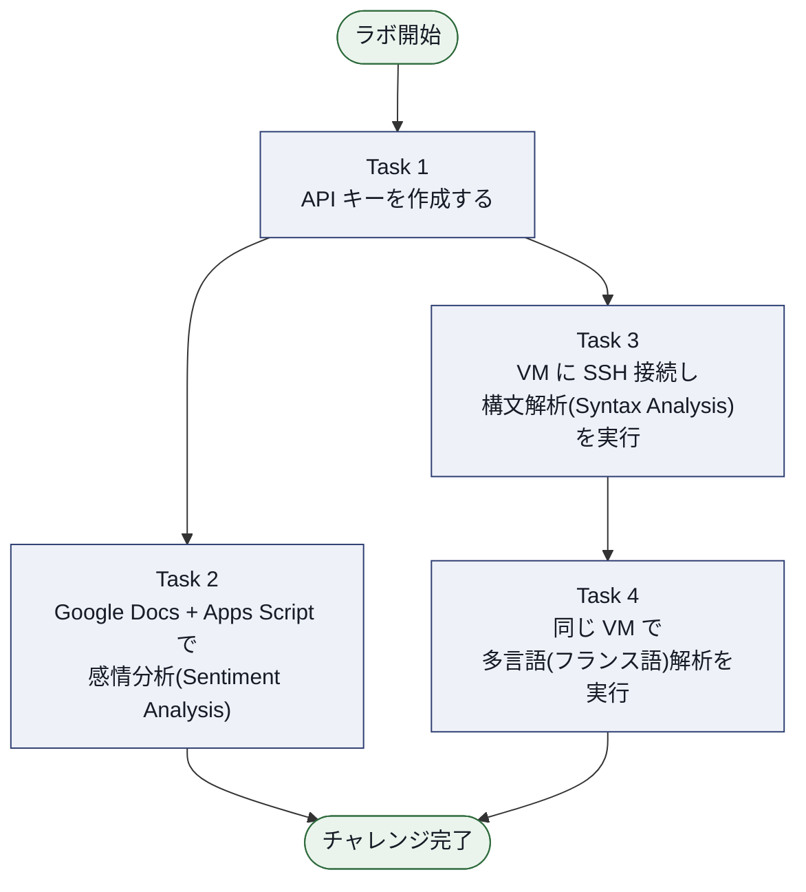
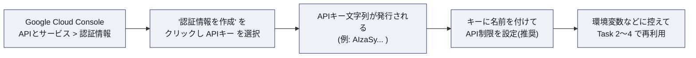
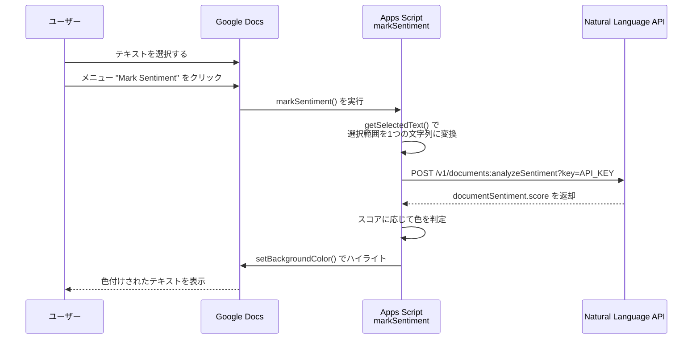
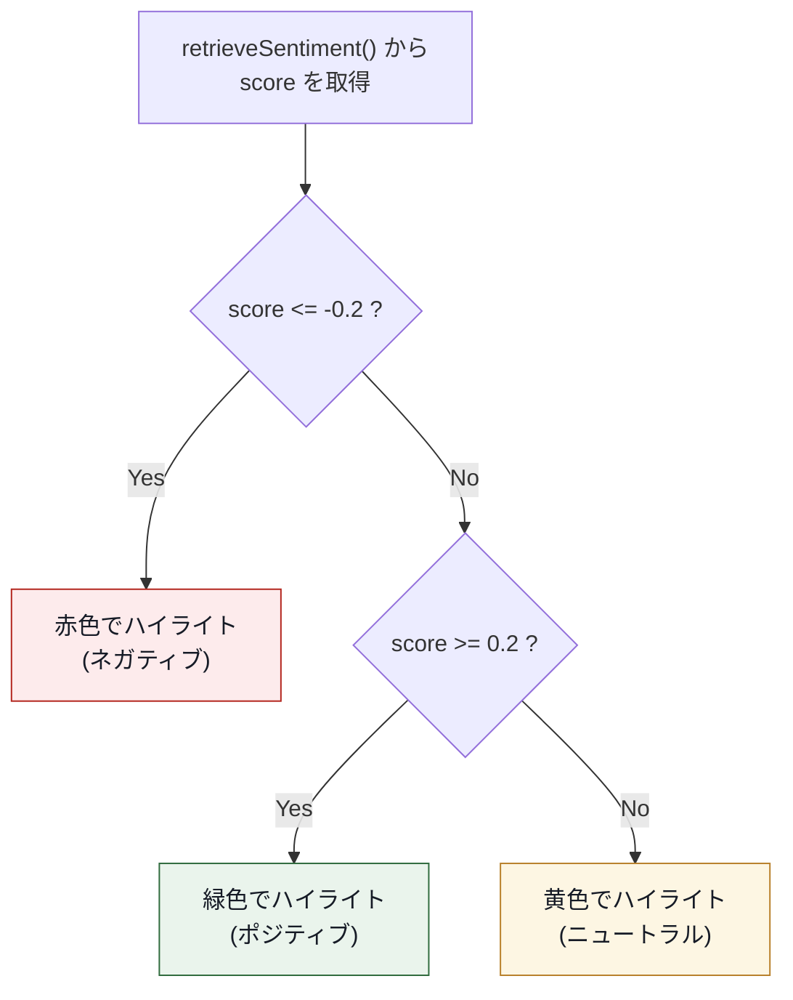
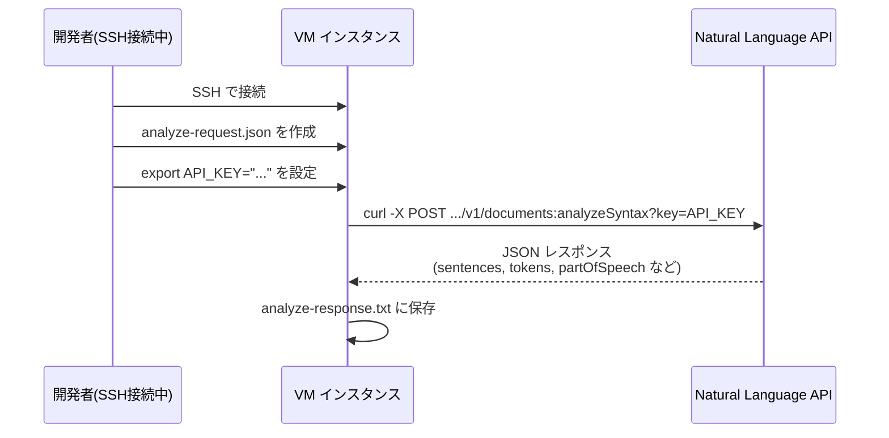

# Google Cloud Natural Language API チャレンジラボ 完全攻略ガイド

> 対象ラボ: *Google Cloud Natural Language API: Challenge Lab*
> 対象読者: Google Cloud / Natural Language API に初めて触れる方
> 執筆方針: ASCII図解は使用せず、フローチャートは Mermaid、表は Markdown 記法で統一しています。

---

## 目次

1. [このラボの全体像](#このラボの全体像)
2. [事前準備の考え方](#事前準備の考え方)
3. [Task 1: API キーの作成](#task-1-api-キーの作成)
4. [Task 2: Google Docs と Natural Language API の連携](#task-2-google-docs-と-natural-language-api-の連携)
5. [Task 3: 構文解析 (Syntax Analysis)](#task-3-構文解析-syntax-analysis)
6. [Task 4: 多言語処理 (Multilingual NLP)](#task-4-多言語処理-multilingual-nlp)
7. [よくあるエラーと対処法](#よくあるエラーと対処法)
8. [ベストプラクティス総まとめ](#ベストプラクティス総まとめ)
9. [参考文献一覧](#参考文献一覧)

---

## このラボの全体像

このチャレンジラボは、Cloud Natural Language API を「認証」「Google Docs 連携」「構文解析」「多言語処理」という 4 つの角度から一通り体験する構成になっています。Task 1 で作成する API キーが Task 2〜4 すべての土台になる点が、このラボ最大のポイントです。



**読み方のコツ**: Task 2 はブラウザ上の Google Docs だけで完結し、Task 3・4 は同じ VM インスタンスに SSH 接続して curl / gcloud コマンドで API を呼び出します。両者は「呼び出し方」が違うだけで、内部で叩いている API は同じ Cloud Natural Language API です。この対応関係を意識すると、初見でも迷いにくくなります。

---

## 事前準備の考え方

チャレンジラボは手順が明示されないため、以下の順序で考えると迷いません。

| 順番 | やること | 理由 |
|---|---|---|
| 1 | 対象プロジェクトで **Cloud Natural Language API** を有効化する | API キーを発行しても、API 自体が無効だと呼び出しがすべて失敗するため |
| 2 | API キーを作成し、変数に控えておく | Task 2〜4 全てで同じキーを再利用するため |
| 3 | Task 2 (Google Docs) と Task 3・4 (VM) は独立して進められる | 依存関係がないので、得意な方から着手してよい |

> **ベストプラクティス**: API を有効化する際は「APIとサービス」→「ライブラリ」から `Cloud Natural Language API` を検索して `有効にする` をクリックします。チャレンジラボ冒頭の注意書きにもある通り、必要な API が有効化されているかは自動採点のチェック対象になり得るため、最初に済ませておくと手戻りがありません。

---

## Task 1: API キーの作成

### 手順ステップ



1. Google Cloud Console で「APIとサービス」>「認証情報」ページを開きます。
2. 「認証情報を作成」>「API キー」を選択すると、キー文字列がダイアログに表示されます。
3. 発行されたキーをコピーし、安全な場所に控えます(このキーは Task 2 の Apps Script コード内、および Task 3・4 の curl コマンドで使い回します)。
4. 可能であれば、キーの詳細画面で「API 制限」を設定し、`Cloud Natural Language API` のみ呼び出せるように絞り込みます。

### ベストプラクティス

> **ベストプラクティス**: API キーは作成した時点では **無制限**(どの API からでも呼び出せる状態)です。本番運用はもちろん、学習目的の一時的な環境であっても、キーが漏えいした場合の被害を抑えるために「API 制限」で `Cloud Natural Language API` に限定することが推奨されています。

> **ベストプラクティス**: Task 2 のように Apps Script のコード中に直接キー文字列を書き込む場合、共有・公開時にキーが漏れるリスクがあります。学習用ラボでは許容されますが、実運用では `PropertiesService`(Apps Script のスクリプトプロパティ)などにキーを保存し、コード本体に書かない設計が望ましいとされています。

> **ベストプラクティス**: Task 3・4 の curl コマンドでは、キーをコマンドライン上に直接書かず `export API_KEY="..."` のように環境変数へ格納してから `?key=${API_KEY}` の形で参照すると、シェル履歴やスクリプトへの平文キー混入を避けやすくなります。

> **ベストプラクティス**: 使い終わった、あるいは不要になった API キーは削除し、定期的なローテーション(キーの再発行と切り替え)を行うことで、万一の漏えい時の影響範囲を小さくできます。

### 補足: ソース

- API キーの作成手順(Console / gcloud / REST): [Use API keys — support.google.com](https://support.google.com/cloud/answer/6158862)
- API キーの管理・API 制限の付与方法: [Manage API keys — cloud.google.com](https://cloud.google.com/docs/authentication/api-keys)
- API キーのセキュリティに関するベストプラクティス(制限・削除・ローテーション・コードへの埋め込み回避など): [API key security best practices — cloud.google.com](https://cloud.google.com/docs/authentication/api-keys-best-practices)

---

## Task 2: Google Docs と Natural Language API の連携

### コード構成の理解

配布されている Apps Script は、大きく 4 つの関数で構成されています。

| 関数名 | 役割 |
|---|---|
| `onOpen()` | ドキュメントを開いたときに「Natural Language Tools」メニューを追加する simple trigger |
| `markSentiment()` | 選択中のテキストの感情スコアを取得し、色分けしてハイライトするメイン処理 |
| `getSelectedText()` | ユーザーが選択している範囲の文字列を連結して取得するヘルパー関数 |
| `retrieveSentiment()` | `UrlFetchApp.fetch()` で Natural Language API の `analyzeSentiment` を呼び出し、スコアを返す関数 |

### 処理フロー図



### 感情スコアと色分けロジック

コード中の `NEGATIVE_CUTOFF = -0.2` / `POSITIVE_CUTOFF = 0.2` という閾値が、色分けの分岐点です。



`score` は **-1.0(強いネガティブ)から 1.0(強いポジティブ)** の範囲を取る値です。閾値の外側にある `magnitude`(感情の強さ、0.0 以上の値で文章が長い・感情表現が多いほど大きくなる)は、このコードでは色分けには使われていませんが、感情の「強度」を測る際に有用な指標です。

| 指標 | 範囲 | 意味 |
|---|---|---|
| `score` | -1.0 〜 1.0 | 感情の傾向(ネガティブ〜ポジティブ) |
| `magnitude` | 0.0 〜 ∞ | 感情の強さの絶対値(文章量に応じて増加しうる) |

### 手順ステップ

1. Google Docs の新規ドキュメントを作成します。
2. 「拡張機能」>「Apps Script」からスクリプトエディタを開き、配布されたコードを貼り付けます。
3. `retrieveSentiment()` 内の `"your key here"` を、Task 1 で発行した API キーに置き換えます。
4. ドキュメント本文にテキスト(例: A Tale of Two Cities の抜粋)を追加します。
5. ドキュメントをリロードし、「Natural Language Tools」>「Mark Sentiment」メニューが表示されることを確認します。
6. 任意のテキストを選択してメニューを実行し、色がつくことを確認します。

### ベストプラクティス

> **ベストプラクティス**: コード先頭の `@OnlyCurrentDoc` アノテーションは、このスクリプトがバインドされているドキュメントのみへのアクセス権限に絞る仕組みです。ユーザーに提示される承認ダイアログの範囲も狭くなるため、Docs 拡張機能を作る際は基本方針として付けておくことが推奨されています。

> **ベストプラクティス**: `UrlFetchApp.fetch()` は既定では HTTP エラー応答(4xx/5xx)時に例外を投げます。API キーの権限不足や API 未有効化のエラーを切り分けやすくするため、`muteHttpExceptions` オプションでレスポンスを直接確認しつつデバッグする、あるいは `try/catch` で捕捉してログに残す設計にすると、初学者でも原因特定がしやすくなります。

> **ベストプラクティス**: `onOpen()` は Apps Script の「simple trigger」と呼ばれる仕組みで、ドキュメントを開くたびに自動実行されます。認可が必要な処理(外部 API 呼び出しなど)は simple trigger 内に直接書けない制約があるため、このサンプルのようにメニュー経由でユーザー操作をトリガーに実行する設計は理にかなっています。

### 補足: ソース

- Apps Script `UrlFetchApp` / URL Fetch Service リファレンス: [URL Fetch Service — developers.google.com](https://developers.google.com/apps-script/reference/url-fetch)
- `analyzeSentiment` メソッドの詳細(リクエスト/レスポンス形式): [Method: documents.analyzeSentiment — cloud.google.com](https://cloud.google.com/natural-language/docs/reference/rest/v1/documents/analyzeSentiment)
- `score` / `magnitude` の解釈方法: [Natural Language API Basics — cloud.google.com](https://cloud.google.com/natural-language/docs/basics)

---

## Task 3: 構文解析 (Syntax Analysis)

### 処理フロー図



### 手順ステップ

1. Compute Engine の VM インスタンスに SSH で接続します。
2. 以下の内容で `analyze-request.json` を作成します(ラボ提示のサンプル文をそのまま利用可能です)。

```json
{
  "document": {
    "type": "PLAIN_TEXT",
    "content": "Google, headquartered in Mountain View, unveiled the new Android phone at the Consumer Electronic Show.  Sundar Pichai said in his keynote that users love their new Android phones."
  },
  "encodingType": "UTF8"
}
```

3. API キーを環境変数に設定します。

```bash
export API_KEY="Task1で発行したAPIキー"
```

4. curl で `analyzeSyntax` エンドポイントを呼び出し、結果をファイルに保存します。

```bash
curl "https://language.googleapis.com/v1/documents:analyzeSyntax?key=${API_KEY}" \
  -s -X POST -H "Content-Type: application/json; charset=utf-8" \
  --data-binary @analyze-request.json > analyze-response.txt
```

   `gcloud` コマンドを使う場合は次のように書けます。

```bash
gcloud ml language analyze-syntax \
  --content="Google, headquartered in Mountain View, unveiled the new Android phone at the Consumer Electronic Show.  Sundar Pichai said in his keynote that users love their new Android phones." \
  > analyze-response.txt
```

5. `cat analyze-response.txt` などでレスポンスが JSON 形式で保存されていることを確認します。

### レスポンスの読み方: 品詞タグ(Part of Speech)一覧

`analyzeSyntax` のレスポンスに含まれる `tokens[].partOfSpeech.tag` は、以下のいずれかの値を取ります(固有名詞は別タグではなく `NOUN` に分類される点に注意してください)。

| タグ | 意味 |
|---|---|
| `NOUN` | 名詞(普通名詞・固有名詞の両方を含む) |
| `VERB` | 動詞(すべての時制・法を含む) |
| `ADJ` | 形容詞 |
| `ADV` | 副詞 |
| `ADP` | 接置詞(前置詞・後置詞) |
| `DET` | 限定詞(冠詞など) |
| `PRON` | 代名詞 |
| `NUM` | 数詞 |
| `CONJ` | 接続詞 |
| `PRT` | 助詞・その他の機能語 |
| `PUNCT` | 句読点 |
| `AFFIX` | 接辞 |
| `X` | その他(外来語・誤字・略語など) |

### ベストプラクティス

> **ベストプラクティス**: `analyzeSyntax` はレスポンスに `dependencyEdge`(構文木の親子関係)も含みます。品詞タグだけでなく、どの単語がどの単語に係っているかまで読み解くと、より高度な文法解析につなげられます。

> **ベストプラクティス**: レスポンス JSON は `analyze-response.txt` にそのまま保存するだけでも採点要件を満たせますが、`jq` コマンド(例: `cat analyze-response.txt | jq .`)を通すと整形されて読みやすくなり、学習効果が上がります。

> **ベストプラクティス**: `--content` で直接文字列を渡す方法は短い文章の実験に向いています。長文やファイルベースのテキストを解析する場合は `--content-file` オプションでローカルファイルや Cloud Storage 上のファイルを指定する方法が推奨されています。

### 補足: ソース

- 構文解析の実行方法(curl / gcloud / 各言語クライアント例): [Analyzing Syntax — cloud.google.com](https://cloud.google.com/natural-language/docs/analyzing-syntax)
- `analyzeSyntax` メソッドのリクエスト/レスポンス仕様: [Method: documents.analyzeSyntax — cloud.google.com](https://cloud.google.com/natural-language/docs/reference/rest/v1/documents/analyzeSyntax)
- `gcloud ml language analyze-syntax` コマンドリファレンス: [gcloud ml language analyze-syntax — cloud.google.com](https://cloud.google.com/sdk/gcloud/reference/ml/language/analyze-syntax)
- 品詞タグ・依存関係ラベルの一覧と読み方: [Natural Language API Basics — cloud.google.com](https://cloud.google.com/natural-language/docs/basics)

---

## Task 4: 多言語処理 (Multilingual NLP)

### 手順ステップ

Task 3 と同じ VM インスタンス上で、今度はフランス語のテキストを解析します。基本的な流れは Task 3 と同一です。

1. 同じ VM に SSH 接続したまま(あるいは再接続して)作業します。
2. 以下の内容で `multi-nl-request.json` を作成します。

```json
{
  "document": {
    "type": "PLAIN_TEXT",
    "content": "Le bureau japonais de Google est situé à Roppongi Hills, Tokyo."
  }
}
```

3. Task 1・3 で使った API キー(環境変数 `API_KEY`)を再利用して、curl で構文解析または感情分析の任意のエンドポイントを呼び出します。

```bash
curl "https://language.googleapis.com/v1/documents:analyzeSyntax?key=${API_KEY}" \
  -s -X POST -H "Content-Type: application/json; charset=utf-8" \
  --data-binary @multi-nl-request.json > multi-response.txt
```

4. `multi-response.txt` の中身を確認し、レスポンス中の `language` フィールドが `"fr"` と自動判定されていることを確認します。

### ポイント: 言語の自動検出と明示指定

このリクエストの JSON には `language` フィールドを指定していません。この場合、Natural Language API はテキスト内容から言語を自動検出します。曖昧な短文などで誤検出が心配な場合は、`document` オブジェクトに `"language": "fr"` を明示的に追加することで、検出をスキップして確実にフランス語として解析させることができます。

### 対応言語(構文解析の例)

Natural Language API がサポートする言語は機能ごとに異なります。構文解析(Syntax Analysis)でサポートされている代表的な言語は次の通りです。

| 言語 | ISO-639-1 コード |
|---|---|
| 英語 | en |
| スペイン語 | es |
| 日本語 | ja |
| 中国語(簡体字/繁体字) | zh / zh-Hant |
| フランス語 | fr |
| ドイツ語 | de |
| イタリア語 | it |
| 韓国語 | ko |
| ポルトガル語 | pt |

> 機能(感情分析・構文解析・エンティティ分析・コンテンツ分類など)によってサポート言語の一覧が異なるため、実際に使う機能ごとに公式の Language Support ページで最新の対応状況を確認することが推奨されます。

### ベストプラクティス

> **ベストプラクティス**: 複数バイト文字(日本語・フランス語のアクセント記号付き文字など)を扱う場合、`encodingType` を明示的に `UTF8` に設定しておくと、レスポンス中の `beginOffset`(文字位置)がずれるトラブルを避けやすくなります。今回のフランス語サンプルのように `encodingType` を省略した場合は既定値が使われるため、オフセット精度が必要な処理では明示指定が無難です。

> **ベストプラクティス**: 自動言語検出に頼らず、呼び出し元でユーザーの入力言語が分かっている場合は `language` フィールドを明示することで、解析精度と処理の再現性が安定します。

> **ベストプラクティス**: 多言語対応のアプリケーションを設計する際は、実装前に Language Support ページで「使いたい機能 × 使いたい言語」の組み合わせがサポートされているかを必ず確認し、未対応言語へのフォールバック処理(例: エラーハンドリングや翻訳前処理)を用意しておくと安全です。

### 補足: ソース

- 機能別のサポート言語一覧: [Language Support — cloud.google.com](https://cloud.google.com/natural-language/docs/languages)
- 言語自動検出と `language` フィールドの扱い、`encodingType` の考え方: [Natural Language API Basics — cloud.google.com](https://cloud.google.com/natural-language/docs/basics)
- 構文解析の実行方法(多言語入力にも共通): [Analyzing Syntax — cloud.google.com](https://cloud.google.com/natural-language/docs/analyzing-syntax)

---

## よくあるエラーと対処法

| 症状 | 主な原因 | 対処法 |
|---|---|---|
| `PERMISSION_DENIED` / API が有効になっていない旨のエラー | プロジェクトで Cloud Natural Language API を有効化していない | 「APIとサービス」>「ライブラリ」から API を有効化する |
| `API key not valid` | キーのコピーミス、別プロジェクトのキーを使用している | Task 1 で発行したキーを再確認し、正しい環境変数/コード箇所に反映する |
| Apps Script 実行時に承認ダイアログが表示され続ける | `UrlFetchApp` の外部通信スコープが未承認 | 初回実行時に表示される承認画面で許可する |
| `retrieveSentiment()` が常に `0.0` を返す | API 呼び出し自体が失敗し、`if` 文の条件を満たしていない | `Logger.log(response.getContentText())` などでレスポンス内容を出力し、エラーメッセージを確認する |
| curl のレスポンスが空、または HTML エラーページが返る | `key=` パラメータの付け忘れ、URL のタイプミス | `analyzeSentiment` / `analyzeSyntax` などエンドポイント名のスペルと `?key=${API_KEY}` の付与を確認する |
| フランス語テキストの `language` が期待と違う | 自動検出が短文や混在テキストで誤判定 | `document` に `"language": "fr"` を明示指定する |

---

## ベストプラクティス総まとめ

| カテゴリ | ベストプラクティス |
|---|---|
| API キー管理 | 用途に応じて API 制限をかける、コードへの直書きを避ける、不要なキーは削除しローテーションする |
| エラーハンドリング | `UrlFetchApp` や curl のレスポンスを都度確認し、失敗時の原因(未有効化・キー誤り・権限不足)を切り分けられるようにする |
| 認可スコープ | Apps Script では `@OnlyCurrentDoc` などでアクセス範囲を必要最小限に絞る |
| 文字コード | 多言語・複数バイト文字を扱う場合は `encodingType` を明示し、オフセットのずれを防ぐ |
| 言語指定 | 入力言語が既知の場合は自動検出に頼らず `language` を明示し、解析精度を安定させる |
| ドキュメント確認 | 使用する機能ごとに Language Support ページで対応言語を必ず確認してから設計する |

---

## 参考文献一覧

1. [Cloud Natural Language ドキュメント トップページ](https://cloud.google.com/natural-language/docs)
2. [Use API keys(APIキーの作成手順) — support.google.com](https://support.google.com/cloud/answer/6158862)
3. [Manage API keys(APIキーの管理・制限) — cloud.google.com](https://cloud.google.com/docs/authentication/api-keys)
4. [API key security best practices(APIキーのセキュリティ) — cloud.google.com](https://cloud.google.com/docs/authentication/api-keys-best-practices)
5. [URL Fetch Service(Apps Script リファレンス) — developers.google.com](https://developers.google.com/apps-script/reference/url-fetch)
6. [Natural Language API Basics(score/magnitudeの解釈、品詞タグ一覧) — cloud.google.com](https://cloud.google.com/natural-language/docs/basics)
7. [Analyzing Sentiment(感情分析の実行方法) — cloud.google.com](https://cloud.google.com/natural-language/docs/analyzing-sentiment)
8. [Method: documents.analyzeSentiment(REST リファレンス) — cloud.google.com](https://cloud.google.com/natural-language/docs/reference/rest/v1/documents/analyzeSentiment)
9. [Analyzing Syntax(構文解析の実行方法) — cloud.google.com](https://cloud.google.com/natural-language/docs/analyzing-syntax)
10. [Method: documents.analyzeSyntax(REST リファレンス) — cloud.google.com](https://cloud.google.com/natural-language/docs/reference/rest/v1/documents/analyzeSyntax)
11. [gcloud ml language analyze-syntax(コマンドリファレンス) — cloud.google.com](https://cloud.google.com/sdk/gcloud/reference/ml/language/analyze-syntax)
12. [Language Support(対応言語一覧) — cloud.google.com](https://cloud.google.com/natural-language/docs/languages)
13. [関連公式ラボ: Entity and Sentiment Analysis with the Natural Language API — skills.google](https://www.skills.google/focuses/1843?parent=catalog)
