# Google Cloud Professional Agentic Architect 認定試験 技術ガイド

> 初学者向けに、Professional Agentic Architectベータ試験の出題範囲を項目ごとに解説し、各サービス・機能のベストプラクティスをまとめた技術文書です。図解はすべてMermaidで記述し、ASCIIアートは使用していません。

## この試験について

Google Cloud Certified Professional Agentic Architectは、Google Cloud上で自律的かつAI駆動のエージェント型ワークフロー（agentic workflow）を設計・管理する技術者向けの認定資格です。大規模言語モデル（LLM）の活用、エージェント設計パターンの適用、コーディング、Google Cloud上でのデータソース統合について深い経験を持つ、開発者またはアーキテクトを対象としています[^1][^2]。

2026年9月4日時点で、この試験は**ベータ試験**として提供されています。ベータ期間中に収集された正答率などの統計データをもとに、正式版（GA）の合格基準が決定される仕組みです[^1]。

### ベータ試験の概要

| 項目 | 内容 |
|---|---|
| 試験時間 | 3時間 |
| 受験料 | 120米ドル（正規価格200米ドルから40%割引、税別） |
| 出題形式 | 選択式問題 約80問（プロクター付きオンライン受験または会場受験） |
| 言語 | 英語のみ |
| 有効期間 | 合格から1年間 |
| 前提条件 | なし（推奨経験：クラウドソリューションの構築・テスト・デプロイ・管理経験3年以上、うちGoogle Cloudでのエージェント型ソリューション構築経験1年以上） |
| 認定構成 | ①Pearson監督の選択式試験（概念知識・システム設計判断・アーキテクチャ標準を評価） ②Google Skills上で実施するハンズオンラボ（実装力・コーディング力を評価） |

出典：Google Cloud公式認定ページ[^1]、公式Exam Guide PDF[^2]

### 出題範囲の配点構成

エージェント開発のライフサイクル（ローコードでの構築 → コーディングエージェントの活用 → コードによるカスタム開発 → 評価・デプロイ → セキュリティ・ガバナンス）に沿って、5つのセクションで構成されています。

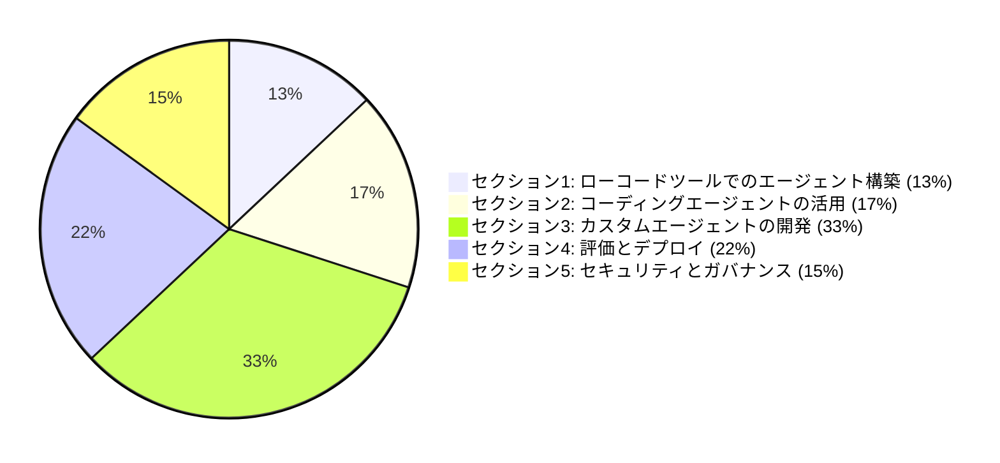

セクション3「カスタムエージェントの開発」が全体の3分の1を占める最重要領域であり、続いてセクション4「評価とデプロイ」が22%を占めます。この2セクションだけで出題の過半数（55%）に達するため、学習の優先度を高く設定することをお勧めします。

### Google Cloud エージェントプラットフォームの全体像

試験範囲の各サービスは、Gemini Enterprise Agent Platform（旧Vertex AIから進化した統合プラットフォーム）の「Build・Scale・Govern・Optimize」という4つの柱に整理されています[^6]。まずこの全体像を把握すると、個々のサービスの位置づけが理解しやすくなります。

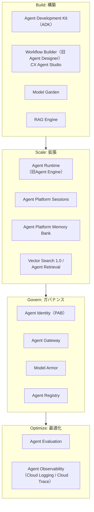

出典：Agent Platform overview[^6]、Gemini Enterprise発表ブログ[^7]

---

## 目次

- [セクション1: ローコードツールを使用したエージェントの構築（配点 約13%）](#セクション1-ローコードツールを使用したエージェントの構築配点-約13)
  - [1.1 ローコードツールを使用したエージェントワークフローと動作の設定](#11-ローコードツールを使用したエージェントワークフローと動作の設定)
  - [1.2 Gemini Enterpriseへのエンタープライズデータ接続](#12-gemini-enterpriseへのエンタープライズデータ接続)
- [セクション2: コーディングエージェントを使用したアプリケーション開発（配点 約17%）](#セクション2-コーディングエージェントを使用したアプリケーション開発配点-約17)
  - [2.1 コーディングエージェントの効果的な使用](#21-コーディングエージェントの効果的な使用)
  - [2.2 エンタープライズワークフロー向けのコーディングエージェントのカスタマイズ](#22-エンタープライズワークフロー向けのコーディングエージェントのカスタマイズ)
- [セクション3: カスタムエージェントの開発（配点 約33%）](#セクション3-カスタムエージェントの開発配点-約33)
  - [3.1 コードでのエージェントワークフローの設計と構築](#31-コードでのエージェントワークフローの設計と構築)
  - [3.2 エンタープライズドメイン知識の統合](#32-エンタープライズドメイン知識の統合)
  - [3.3 エージェントワークフローのオーケストレーションと調整](#33-エージェントワークフローのオーケストレーションと調整)
- [セクション4: エージェントワークフローの評価とデプロイ（配点 約22%）](#セクション4-エージェントワークフローの評価とデプロイ配点-約22)
  - [4.1 開発環境・本番環境でのエージェント評価](#41-開発環境本番環境でのエージェント評価)
  - [4.2 本番ワークロードのデプロイとスケーリング](#42-本番ワークロードのデプロイとスケーリング)
- [セクション5: エージェントワークフローのセキュリティとガバナンス（配点 約15%）](#セクション5-エージェントワークフローのセキュリティとガバナンス配点-約15)
  - [5.1 エージェントのセキュリティとガバナンスの設定](#51-エージェントのセキュリティとガバナンスの設定)
  - [5.2 セキュアなエージェントの動作と実行の実装](#52-セキュアなエージェントの動作と実行の実装)
- [試験対象ツール一覧](#試験対象ツール一覧)
- [学習チェックリスト](#学習チェックリスト)
- [参考文献](#参考文献)

---

## セクション1: ローコードツールを使用したエージェントの構築（配点 約13%）

このセクションでは、コードを書かずに（またはごく少量のコードで）エージェントを構築・接続するための、Gemini Enterprise配下のローコード／ノーコードツール群を扱います。

### 1.1 ローコードツールを使用したエージェントワークフローと動作の設定

#### Workflow Builder（旧 Agent Designer）と CX Agent Studio

Gemini Enterprise には、目的の異なる2つのローコード構築ツールがあります。

- **Workflow Builder（旧 Agent Designer）**：Gemini Enterprise アプリ内に統合された、no-code／low-codeのプラットフォームです。自然言語プロンプトによるエージェントの作成・プレビュー、インタラクティブなフローキャンバスでのワークフロー編集、サブエージェントを使った複数ステップタスクのオーケストレーション、Gmail・Google Drive・Jiraなど社内外のデータソース／ツールとの接続、定期実行スケジューリングまでを担います[^4][^89]。従業員が自分の業務知識をノーコードで「AIヘルパー」に変換するための入口として位置づけられています[^93]。
- **CX Agent Studio（Customer Experience Agent Studio）**：会話型AIエージェントに特化した、Gemini搭載のミニマルコード構築ツールです。バックエンドのツール呼び出し中も自然な会話フローを維持する非同期処理、双方向ストリーミングによる低遅延な音声対話、変更履歴・ワンクリックロールバックなどのチーム開発向けバージョン管理機能を備えています[^5][^92]。

両者とも「状態ベースのワークフロー（state-based workflow）」という考え方を採用しています。これは、会話や処理の流れを**ページ（状態）**、**遷移ルート（transition route）**、**イベントハンドラ**の3要素でモデル化する設計手法です。

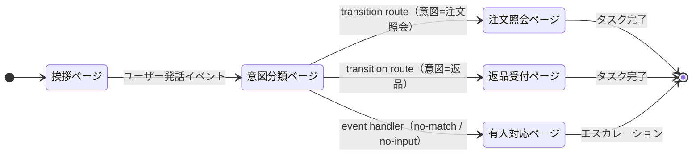

各ページには、few-shotプロンプトやChain-of-Thought（CoT）プロンプトを使った**システムインストラクション**と**コンソール内プロンプトテンプレート**を設定し、エージェントの振る舞いを誘導します。Workflow BuilderのチャットペインはNo-code志向のユーザーが自然言語でエージェントを調整するのに向いており、Flowキャンバスはより精密な制御を行いたい場合に使います[^4]。

> **ベストプラクティス**
> - 状態（ページ）は単一責任を持たせて細かく分割し、1ページに複数の意図を詰め込まない。意図分類は専用のルーティングページに集約する。
> - システムインストラクションには、few-shot例を2〜3件程度含めることでフォーマットの逸脱を防ぐ。指示文だけでは出力形式が安定しないケースが多い。
> - `no-match`／`no-input`イベントハンドラを必ず設計し、有人エスカレーションへのフォールバック経路を用意する。
> - チャットペイン（自然言語での調整）とFlowキャンバス（構造化編集）を併用し、大まかな骨格をチャットで素早く作成してからFlowキャンバスで細部を詰める。

### 1.2 Gemini Enterpriseへのエンタープライズデータ接続

Workflow Builderや検索体験にエンタープライズ固有データを接続する際は、**Agent Search**（旧Vertex AI Search）をはじめとするGemini Enterpriseのデータコネクタ機能を使用します[^97]。ここで扱う考慮事項は大きく2つです。

1. **プロプライエタリなデータソースへの安全な接続とクエリ**：Gemini Enterprise / Agent Searchを使い、社内文書・データベース・SaaSアプリケーションなどのエンタープライズ固有データソースに安全に接続し、検索クエリを実行できるように設定します。
2. **非構造化マルチモーダルデータの取り込みと処理**：動画・音声・画像などの非構造化データをエージェントワークフローに取り込み、処理できるようにします。

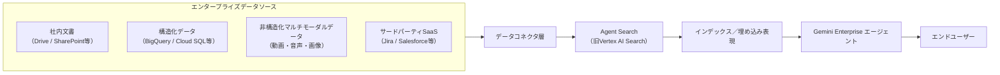

> **ベストプラクティス**
> - データコネクタの認可スコープは、エージェントが実際に必要とする範囲に最小化する。過度に広いアクセス権を持つコネクタは、後述するAgent IdentityのPAB（Principal Access Boundary）と組み合わせて制限する。
> - 非構造化マルチモーダルデータは、取り込み前にフォーマット・言語・機密度を確認し、必要に応じてSensitive Data Protection（後述セクション5）で前処理してからインデックス化する。
> - データソースの更新頻度に応じてインデックスの再構築サイクルを設計し、鮮度が重要なデータ（在庫・価格など）は差分更新の仕組みを検討する。

---

## セクション2: コーディングエージェントを使用したアプリケーション開発（配点 約17%）

### 2.1 コーディングエージェントの効果的な使用

「コーディングエージェント」とは、開発者に代わってコードの読み書き・リファクタリング・デバッグを自律的に行うAIエージェントを指します。Google Cloud上では、代表的な実装として**Antigravity**（Googleのエージェント・ファースト開発プラットフォーム）や、Google Cloud上で稼働する**Claude Code**が試験範囲に含まれます[^11][^13]。

#### MCPサーバー、カスタムスキル、ツールアクセスの設定

コーディングエージェントの能力は、接続されたツール群によって大きく左右されます。**Model Context Protocol（MCP）サーバー**を使うと、エージェントに対してファイルシステム・データベース・外部APIなど任意のツールを標準化されたプロトコルで公開できます。Antigravityでは、IDE・CLI・SDKのいずれの形態でもMCPサーバーを追加設定できます[^55]。

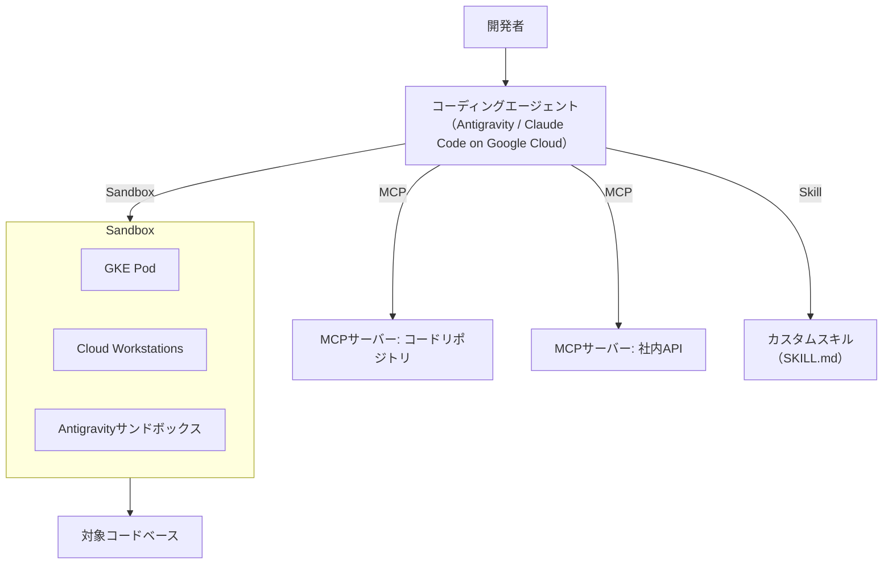

#### セキュアサンドボックスでの使用

コーディングエージェントに実行権限を与える際は、本番環境から隔離された**セキュアサンドボックス**内で動作させることが重要です。試験範囲では、GKE（Google Kubernetes Engine）、Cloud Workstations、Antigravity自身のサンドボックス機能の3つが挙げられています。

- **GKE**：Podレベルの分離とネットワークポリシーで、エージェントの実行環境をきめ細かく制御できます。
- **Cloud Workstations**：ブラウザから利用できるマネージド開発環境で、エージェントの作業空間ごとに構成をテンプレート化できます。
- **Antigravityサンドボックス**：IDE組み込みの隔離実行環境で、エージェントが生成した変更をArtifacts（タスクリスト、実装計画、スクリーンショット、ブラウザ録画など）として可視化し、人間がレビューしてから反映できます[^57]。

#### コーディングエージェントによるコード改善作業

試験範囲では、コーディングエージェントを使った次の3種類の作業が明示されています。

1. **ソースコードのリファクタリング**
2. **実行ランタイムの最適化**
3. **アプリケーション層の脆弱性パッチ適用**

> **ベストプラクティス**
> - コーディングエージェントに本番相当のクレデンシャルを直接渡さない。サンドボックス内では専用のサービスアカウント／エージェントIDを使い、最小権限を徹底する（詳細はセクション5のAgent Identityを参照）。
> - MCPサーバーは信頼できるソースからのみ追加し、ツールの説明文（tool description）に紛れ込ませたプロンプトインジェクションのリスクを常に意識する。
> - 破壊的な操作（削除・本番デプロイなど）を伴うタスクは、Artifactsやプルリクエストなど人間がレビューできる中間生成物を経由させ、完全自律実行にしない。
> - リファクタリングや脆弱性パッチのタスクでは、着手前後でテストスイートを実行し、エージェントの変更が既存の振る舞いを壊していないことを機械的に確認する。

### 2.2 エンタープライズワークフロー向けのコーディングエージェントのカスタマイズ

#### Antigravityでのスキル・プラグイン・拡張フック・ルール・サブエージェントの作成

Antigravityは、単なるコード補完ツールではなく、エージェントを中心に据えた開発プラットフォームです。エンタープライズ向けにカスタマイズする手段として、以下が試験範囲に含まれます。

- **スキル（Skills）**：特定のタスクに関する知識・手順をパッケージ化し、必要なときだけエージェントのコンテキストに読み込ませる仕組みです。
- **プラグイン（Plugins）**：スキルとMCPサーバーを1つの配布可能な単位にまとめる、ベンダー中立のオープン仕様「Agent Plugins」に準拠します。Googleはこの仕様のコアメンテナーとして参加しており、Agents CLIやData Agent Kitがこの形式でプラグインを配布しています[^15][^67]。
- **拡張フック（Extension hooks）**：エージェントのライフサイクルイベント（セッション開始・終了など）に処理を差し込む仕組みです。
- **ルール（Rules）**：`AGENTS.md`のようなプロジェクトレベルのルールファイルを通じて、コーディング規約やレビュー基準をエージェントに継続的に守らせます[^50]。
- **サブエージェント（Subagents）**：単一のエージェントに全タスクを担わせるのではなく、役割ごとに専門化したサブエージェントへ処理を委譲する構成です。

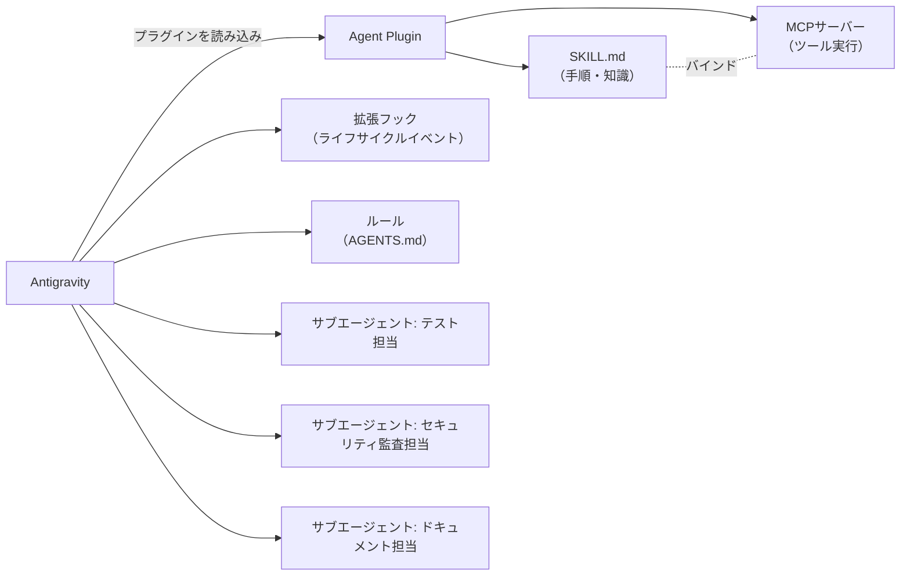

#### Agents CLIによるAntigravityの拡張

**Agents CLI**は、Agent Platform上でのエージェント構築・評価・デプロイ・公開のための「スキル集」をコーディングエージェントに提供する、統一されたコマンドラインインターフェースです。Antigravity、Gemini CLI、Claude Code、Codexなど任意のコーディングエージェントと組み合わせて使用できます[^14][^60]。ADK・エージェント評価手法・Google Cloudへのデプロイ方法に関する専門知識をカプセル化しており、自然言語の指示だけでこれらの複雑な操作をAI開発ツールに実行させることができます[^10]。

Agents CLIが提供する主なスキルは次の7種類です。

| スキル名 | 役割 |
|---|---|
| `google-agents-cli-workflow` | 開発ライフサイクル全体の管理、コード保全ルール、モデル選定 |
| `google-agents-cli-scaffold` | プロジェクトの雛形作成・拡張・アップグレード |
| `google-agents-cli-adk-code` | ADK Python APIの利用パターン（エージェント・ツール・オーケストレーション・コールバック・状態） |
| `google-agents-cli-eval` | 評価手法（メトリクス・evalset・LLM-as-judge・トラジェクトリスコアリング） |
| `google-agents-cli-deploy` | Agent Runtime／Cloud Run／GKEへのデプロイ、CI/CD、シークレット管理 |
| `google-agents-cli-publish` | Gemini Enterpriseへのエージェント公開 |
| `google-agents-cli-observability` | デプロイ後の可観測性設定 |

出典：Agents CLI公式リポジトリ[^14][^60]

> **ベストプラクティス**
> - スキルはタスクに一致したときだけコンテキストに読み込まれる設計を活かし、無関係なスキルを常時ロードしてコンテキストウィンドウを浪費しない。
> - Agent Pluginsの仕様に従う場合、認証情報（トークンやAPIキー）をヘッダーなどのパッケージデータに直書きしない。プラグインは第三者がダウンロードして中身を読める前提で設計する[^15]。
> - `agents-cli`はスタンドアロンのCLIとしても、コーディングエージェント経由でも呼び出せるため、CI/CDパイプラインではCLI直接呼び出し、開発者の対話的作業ではコーディングエージェント経由、と使い分けると効率的。
> - サブエージェントへの分割は「専門化による品質向上」と「オーケストレーションの複雑化」のトレードオフであることを意識し、まずは単一エージェント＋ツール群で始め、責務が明確に分離できる場合のみサブエージェント化する。

---

## セクション3: カスタムエージェントの開発（配点 約33%）

試験全体の3分の1を占める最重要セクションです。ローコードツールでは対応しきれない、コードによるエージェントの設計・構築・エンタープライズデータ統合・マルチエージェントオーケストレーションを扱います。

### 3.1 コードでのエージェントワークフローの設計と構築

#### 言語モデルの選定と設定

エージェントアーキテクチャを設計する最初のステップは、どの言語モデルを使うかの選定です。試験範囲では、コスト・セキュリティ・アーキテクチャ要件を踏まえた次の3つの軸での比較検討が問われます。

| 比較軸 | 選択肢A | 選択肢B | 主な判断基準 |
|---|---|---|---|
| モデルサイズ | LLM（大規模言語モデル） | SLM（小規模言語モデル） | 推論の複雑さ、レイテンシ要件、コスト、エッジ／オンデバイス実行の要否 |
| ホスティング形態 | 自己ホスト（self-hosted） | SaaS（マネージドAPI） | データ主権・レイテンシ制御 vs 運用負荷の軽減 |
| ライセンス形態 | OSS（オープンソース） | プロプライエタリ | カスタマイズ性・透明性 vs サポート体制・最新性能 |

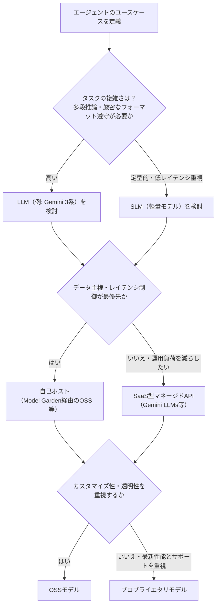

> **ベストプラクティス**
> - まずSaaS型のGemini LLMsで最小構成のプロトタイプを作り、レイテンシ・コスト・精度の実測値を取ってから、自己ホストやSLMへの移行要否を判断する。早期の自己ホスト化は運用コストの見積もりを誤らせやすい。
> - Model Gardenを使うと、Google製・パートナー製・OSSを含む200以上のモデルを同一のワークフローで比較評価できるため、モデル選定のPoC段階で活用する[^90]。
> - コスト最適化の観点では、複雑な推論が必要なステップのみLLMを使い、定型的な分類やフォーマット変換にはSLMを使う「モデルの階層化（model cascading）」も検討する。

#### 開発ツールとしてのADK（Agent Development Kit）

**Agent Development Kit**（ADK）は、Python・TypeScript・Go・Java・Kotlinに対応した、オープンソースのコードファーストなエージェント構築フレームワークです。Geminiとの親和性が高い一方でモデル非依存・デプロイ先非依存に設計されており、通常のソフトウェア開発に近い感覚でエージェント開発ができます[^8][^9]。

ADKによる開発は、次のような段階的な拡張パスをたどるのが一般的です。

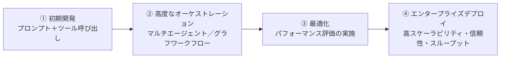

出典：ADKフレームワーク概要[^9]

#### セッションとメモリの設定

会話状態を保持するには**Agent Platform Sessions**、長期記憶（ユーザーの好み・過去の経緯）を扱うには**Agent Platform Memory Bank**を使用します。

- **Sessions**：ユーザーとエージェント間のやり取りの履歴（イベント）を時系列に保持する仕組みです。ADKエージェントをAgent Runtimeにデプロイすると、セッション管理は自動的に有効になります[^125]。
- **Memory Bank**：セッションのイベント群を送信すると、内容がインテリジェントに処理され「メモリ」として永続化されます。エージェントは過去の会話をまたいでこのメモリを検索し、パーソナライズされた応答を生成できます[^121]。`AdkApp` が使うメモリサービスの既定値は実行環境で切り替わり、ローカル開発では `InMemoryMemoryService`、Agent Runtime 上では `VertexAiMemoryBankService` になります[^123]。ただし切り替わるのは既定の実装だけで、**Memory Bank インスタンスの作成と呼び出し側への権限付与は別途必要な前提条件**です。またメモリは自動的に生成されるわけではなく、`add_session_to_memory`（セッション全体の取り込み）、`generate`（メモリ生成の明示実行）、`IngestEvents`（イベント単位の取り込み）といった該当するトリガーを呼び出したときにのみ生成されます。

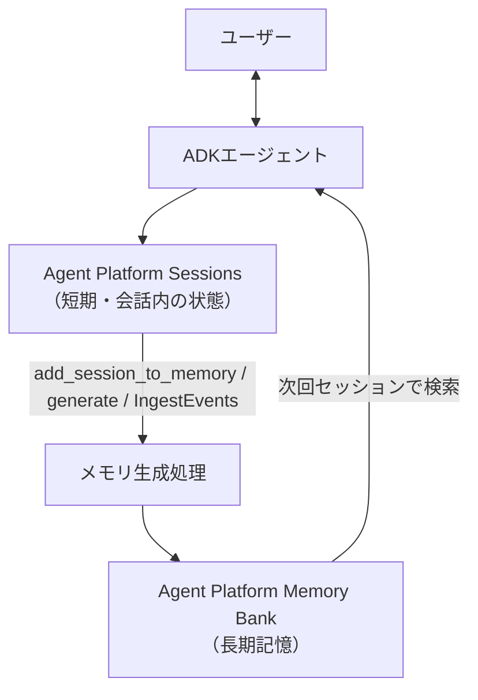

> **ベストプラクティス**
> - Memory Bankには「メモリポイズニング」のリスクがある。虚偽情報が長期記憶として保存され、将来のセッションでエージェントがそれを事実として扱ってしまう問題であり、Model Armorでの事前スクリーニングや、メモリ生成元セッションの出所検証で緩和する[^121]。
> - 本番デプロイ時にカスタムのインメモリセッションサービスを使い続けると、Agent Runtime上でセッションが同期されない場合があるため、マネージドのSessions／Memory Bankへ切り替える[^123]。
> - `PreloadMemoryTool`などを使い、どのタイミングでメモリを取得しプロンプトに含めるかを明示的に制御する。無条件にすべてのメモリを毎回注入すると、コンテキスト膨張とレイテンシ増加を招く。

#### Agents CLIでのスキル設定

ADKエージェントの構築時にも、前セクションで紹介したAgents CLIのスキル（`agent`モードと`human`モードの切り替えを含む）やプラグインを活用できます。`agent`モードはAI開発ツールが自律的に判断を進めるモード、`human`モードは各ステップで開発者の確認を挟むモードに相当し、本番投入前の検証段階では`human`モードを使うことが推奨されます。

### 3.2 エンタープライズドメイン知識の統合

#### RAGパイプラインとベクトル検索システムの設計

エージェントに社内知識を持たせる代表的な手法が**RAG**（Retrieval-Augmented Generation）です。試験範囲では、埋め込みモデル・類似度スコアリング・リランキングを含むRAGパイプライン全体の設計・構成・管理と、その裏側で使うベクトルデータベースの選定が問われます。

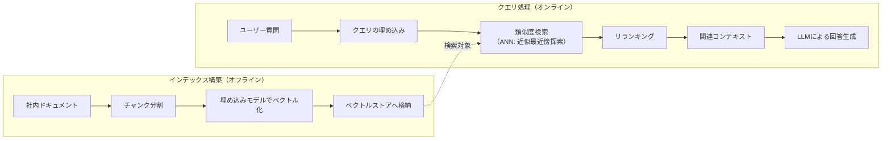

RAGを支えるベクトルデータベースとして、試験ガイドでは**Vector Search 1.0**と**Agent Retrieval**の2つが明示されています。両者は別物であり、違いを理解しておく必要があります。

| 比較項目 | Vector Search 1.0 | Agent Retrieval（旧Vector Search 2.0） |
|---|---|---|
| 位置づけ | ANN（近似最近傍探索）のインデックス・アズ・ア・サービス | 自己チューニング型のAIネイティブ検索エンジン（ストレージ＋検索の統合基盤） |
| 管理単位 | インデックスとエンドポイント（VM・レプリカ数などを自分で設定） | Collection（データオブジェクトの集合、リレーショナルDBのテーブルに近い概念） |
| 運用の手間 | 利用者がセットアップ・管理・クリーンアップを担う | 自動チューニングされ、VMやレプリカ設定が不要 |
| データの可視性 | プロジェクト内で可視 | プロジェクト内で可視、独自の埋め込み自動生成やBYOE（Bring Your Own Embeddings）に対応 |
| 適するケース | 既存の大規模ANN基盤を引き続き利用したい場合 | 新規構築で、迅速な立ち上げと運用負荷軽減を重視する場合 |

出典：Agent Retrieval概要[^36]、RAG Engineバックエンド比較[^37]

RAG Engineを使う場合は、バックエンドとして`RagManagedVertexVectorSearch`（Agent Retrieval利用・フルマネージド）、`VertexVectorSearch`（Vector Search 1.0利用・自己管理）、`RagManagedDb`（Spanner利用・CMEK対応）から選択できます[^37]。

> **ベストプラクティス**
> - CMEK（顧客管理暗号鍵）によるデータ主権要件がある場合は`RagManagedDb`（Spanner）を検討する。ただしプロジェクト内から直接データを閲覧できない制約があるため、可観測性要件とのトレードオフを事前に評価する。
> - 新規プロジェクトでは、自動チューニングと運用負荷軽減の観点からAgent Retrieval（`RagManagedVertexVectorSearch`）を第一候補とし、既存のVector Search 1.0資産がある場合のみ移行コストと比較検討する。
> - リランキングステップを省略しない。初段の類似度検索だけでは意味的に近いが文脈上は不適切な文書を拾いやすく、リランキングモデルによる二段階選別で回答精度が大きく改善する。
> - チャンク分割の粒度は、検索精度とコンテキスト長のバランスで決める。粒度が細かすぎると文脈が失われ、粗すぎると無関係な情報が混入しやすい。

#### エージェント権限の設定（Agent Identity）

RAGパイプラインやツールへのアクセス権限は、**Agent Identity**によってエージェント単位で付与します。詳細はセクション5.1で扱いますが、ここでは「どのデータソースにどのエージェントがアクセスできるか」を設計段階から権限モデルに組み込むことが重要だと押さえておいてください。

#### Google Cloudツールを使った事前構築・カスタム機能の設定

エージェントに機能（capability）を持たせる手段として、次のツールが試験範囲に含まれます。

- **Agent Registry**：エージェントを発見可能なサービスとして登録するカタログです。Agent Runtimeにデプロイされたエージェントは自動登録され、Google Workspace連携エージェントやGemini Enterpriseの組み込みエージェントのようなGoogle提供エージェントは追加設定なしで発見可能です[^19][^20]。
- **Google Cloud MCPサーバー**：マネージドデータベース向けのカスタム統合レイヤー、API統合、サードパーティSaaSツール・リモートサーバーへエージェントを接続するMCPサーバーなど、事前構築済みおよびカスタムの機能を提供します。

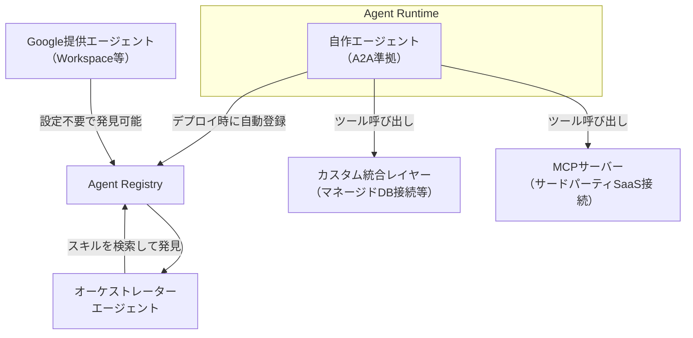

出典：Agent Registryの自動登録[^19][^20]

> **ベストプラクティス**
> - 社内で複数チームがエージェントを開発する組織では、Agent Registryへの登録をデプロイパイプラインの必須ステップとして標準化し、他チームが車輪の再発明をせずに既存エージェントのスキルを再利用できるようにする。
> - 外部SaaSやリモートサーバーに接続するMCPサーバーは、後述のAgent Gatewayを経由させ、未登録の宛先への通信を遮断する構成にする。

### 3.3 エージェントワークフローのオーケストレーションと調整

#### エージェントプロトコルによるオーケストレーション（MCPとA2A）

複数エージェントが協調して動作する「マルチエージェントシステム」を構築する際、2つのオープンプロトコルが中核を担います。

- **MCP（Model Context Protocol）**：エージェント（モデル）と外部ツール・データソースを接続するための標準規格です。クライアント・サーバーモデルを採用し、AIアプリケーション（MCPホスト）がツールサーバーへの接続を維持して、コンテキストと能力の提供を受けます[^71][^73]。
- **A2A（Agent2Agent）**：異なるフレームワーク・異なるベンダー・異なるサーバー上で動作するエージェント同士が、内部状態やロジックを公開せずに対等な立場（ピア）として通信・連携するためのオープン標準です。2025年4月にGoogleが発表し、現在はLinux Foundationに寄贈され、Apache-2.0ライセンスで管理されています[^40][^41][^75]。

両者は競合ではなく補完関係にあります。「エージェントとツールをつなぐのがMCP、エージェントとエージェントをつなぐのがA2A」と整理すると理解しやすいです[^73]。

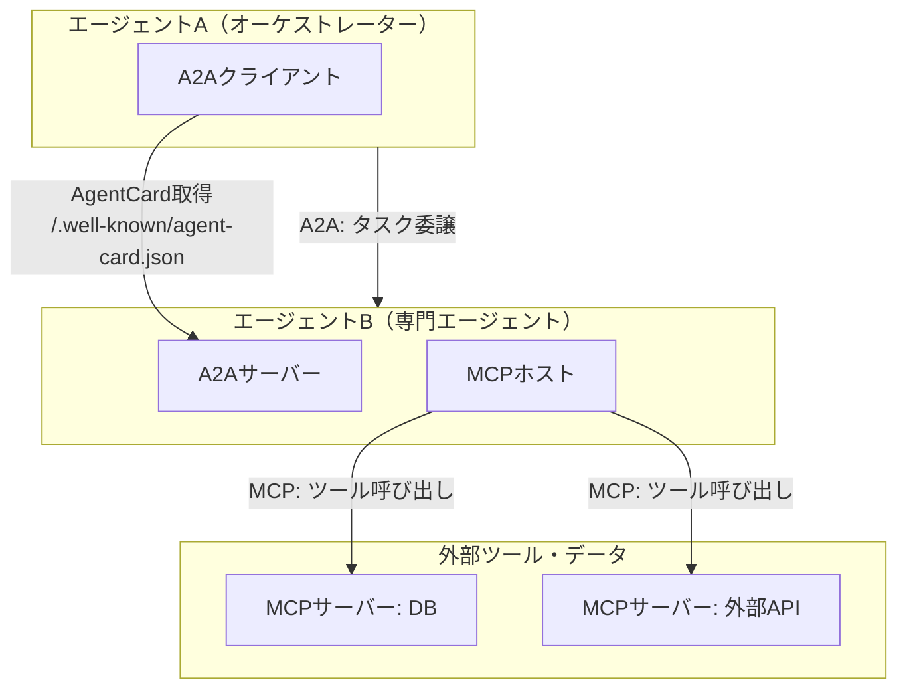

A2Aの主要概念として、エージェントの名称・URL・バージョン・スキルを記載したJSONマニフェストである**AgentCard**（`/.well-known/agent-card.json`で公開）、構造化されたタスクのライフサイクル管理、双方向のメッセージベース連携、型付きデータをやり取りする**Artifact Handling**があります[^72][^73]。

#### マルチエージェントのハンドオフとワークフローの選定

ADKは、マルチエージェントの制御フローを構築するための複数の手段を提供します。目的に応じて使い分けます。

| パターン | 概要 | 適するケース |
|---|---|---|
| Sequential（逐次） | サブエージェントを決められた順序で1つずつ実行 | データ処理パイプライン（パース→抽出→要約など、順序が重要な処理） |
| Parallel（並列） | 独立したサブエージェントを同時実行し結果を集約 | 複数情報源からの並行リサーチなど、速度が重要かつタスクが独立している場合 |
| Loop（ループ） | 特定の終了条件を満たすまでサブエージェントを繰り返し実行 | Generator→Criticのような反復的な品質改善ループ |
| Graph workflow（グラフ） | ノードとエッジで構成される宣言的なグラフにより、条件分岐・ファンアウト・人間承認・リトライを表現 | 決定論的かつ構造化された複雑な業務プロセス |

出典：ADKマルチエージェントパターン解説[^42]、ADKグラフワークフロー[^43]

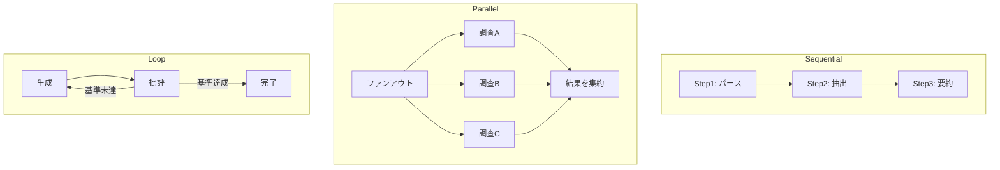

これらのオーケストレーションは、Google Cloud側のガバナンス機構と組み合わせて運用します。具体的には、**Agent Identity**でエージェントごとの実行権限を、**Agent Registry**でハンドオフ先エージェントの発見と検証を、**Agent Runtime**で実行基盤を、**エージェントポリシー**でどのエージェントがどの操作を実行できるかを制御します。

> **ベストプラクティス**
> - まずADKの組み込みワークフローエージェント（Sequential／Parallel／Loop）で実装できないか検討し、それでも表現しきれない複雑な分岐・承認フローが必要な場合にのみグラフベースのワークフローに移行する。過剰に複雑なグラフは保守性を下げる。
> - Human-in-the-loop（人間承認）が必要なステップは、専用の承認サブエージェントとして切り出し、`SequentialAgent`の中に組み込むと、承認ロジックを他のワークフローでも再利用しやすい[^140]。
> - A2Aでエージェント間連携を行う場合、AgentCardに記載する`skills`は実際に提供する機能と一致させ、過大申告（実装していない機能を記載）を避ける。呼び出し側のオーケストレーターがAgentCardを信頼してルーティングを決定するため、不一致は実行時エラーの温床になる。
> - マルチエージェント構成では、エージェント間の連携数が増えるほど統合の複雑度がO(N²)で増大する。A2Aのような標準プロトコルを使うことでこの複雑度を抑えられるが、それでも協調するエージェント数は業務上必要な最小限にとどめる設計を心がける[^76]。

---

## セクション4: エージェントワークフローの評価とデプロイ（配点 約22%）

### 4.1 開発環境・本番環境でのエージェント評価

エージェントは非決定的（同じ入力でも毎回同じ出力になるとは限らない）であるため、従来のソフトウェアテストとは異なる評価アプローチが必要です。試験範囲では、テストセットの設計から本番運用中の継続的評価までが問われます。

#### テストセットの作成

代表的なユーザークエリ・エッジケース・想定される失敗パターンを網羅した**評価用データセット**（evalset）を作成します。ADKのevalsetには、ユーザー入力・期待される最終応答・期待されるツール呼び出し軌跡（trajectory）などを含めることができます[^46]。

#### 評価フレームワークの選定

| フレームワーク／手法 | 特徴 | 主な用途 |
|---|---|---|
| ADK Evaluation（evalset） | ADK組み込みの評価機能。応答の一致度とツール呼び出し軌跡の一致度を採点 | 開発中のユニットテスト的な評価 |
| Gen AI Evaluation Service（Vertex AI） | LLM-as-a-judge方式によるモデル非依存の評価サービス。定性的な品質基準を定義できる | 応答品質・安全性・関連性などの評価 |
| カスタムオートレーター（Autoraters） | 組織固有の評価基準に合わせて作成する、LLMベースの自動採点者 | ドメイン固有の合否判定が必要な場合 |

出典：Agent Evaluation概要[^44][^45]、ADK評価ガイド[^46]

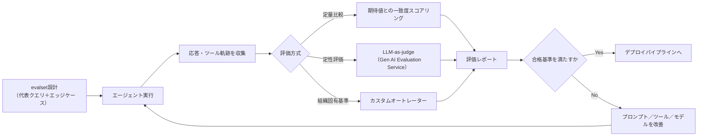

#### 継続的評価パイプラインの構築

本番投入後も評価を一度きりで終わらせず、CI/CDパイプラインに組み込んで継続的に実行します。新しいプロンプトバージョンやモデルバージョンをリリースするたびにevalsetを自動実行し、リグレッション（性能劣化）を検出する仕組みが望まれます[^47]。

> **ベストプラクティス**
> - evalsetは実際の本番ログから継続的に「難しかったケース」「失敗したケース」を追加し、リリースを重ねるごとに評価網羅性を高めていく。
> - LLM-as-judge方式を使う場合、判定に使うモデルと評価対象のモデルを分ける（同一モデルによる自己評価バイアスを避ける）。
> - ツール呼び出し軌跡の評価は、最終応答の正しさだけでなく「正しい手順で」正しい結果に到達したかを確認するために重要。誤った手順でも偶然正しい結果に至るケースを見逃さない。
> - 安全性・有害性に関する評価基準は、機能面の評価基準とは別の評価軸として独立に管理し、両方が閾値を満たすことをリリースゲートの条件にする。

### 4.2 本番ワークロードのデプロイとスケーリング

#### デプロイランタイムの選定

ADKで構築したエージェントは、複数のランタイムにデプロイできます。試験範囲では**Agent Runtime**（旧Agent Engine）、**Cloud Run**、**GKE**の3つが比較対象です。

| ランタイム | 特徴 | 適するケース |
|---|---|---|
| Agent Runtime | Vertex AI上のフルマネージドランタイム。自動スケーリング、セッション／メモリの組み込み管理、組み込みの可観測性を提供[^16][^18][^52] | 迅速なデプロイと運用負荷の最小化を優先する場合。ADKとの統合が最も深い |
| Cloud Run | サーバーレスコンテナ実行環境。A2A準拠エージェントのホスティングに対応[^39] | 既存のCloud Runベースのマイクロサービス構成に組み込みたい場合、より柔軟なコンテナ制御が必要な場合 |
| GKE | Kubernetesベースのコンテナオーケストレーション | 複雑なネットワークポリシーやマルチテナント分離など、高度なインフラ制御が必要な場合 |

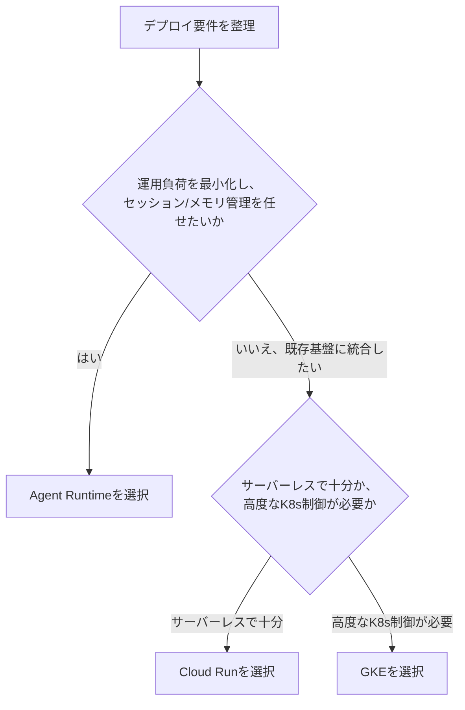

出典：Agent Runtime概要[^16][^18]、Cloud Run上のA2Aエージェント[^39]

#### トラブルシューティング

本番運用中のエージェントで発生しやすい典型的な問題として、次の4つが試験範囲に挙げられています。

- **エージェントドリフト（Agent drift）**：時間経過とともに、エージェントの応答傾向が意図した振る舞いから徐々にずれていく現象。
- **ツール呼び出しのレイテンシ**：外部ツール・APIの応答遅延がエージェント全体の応答時間を悪化させる問題。
- **推論ループ（Reasoning loops）**：エージェントが同じ思考・ツール呼び出しを堂々巡りして終了条件に到達しない問題。
- **システム障害**：依存サービスの障害、レート制限超過、認証エラーなど。

これらは**Cloud Logging**と**Cloud Trace**を中核とする**Agent Observability**機能で検知・診断します。エージェントのステップ・ツール呼び出し・LLM呼び出しをトレースとして可視化し、どのステップでレイテンシや異常なループが発生しているかを特定できます[^48]。

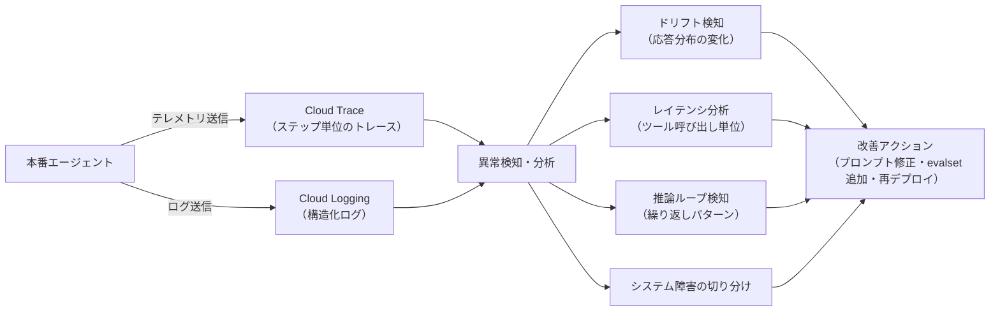

#### パフォーマンス・信頼性・コストの監視と最適化

デプロイ後は、次の3軸を継続的にモニタリングします。

- **パフォーマンス**：応答レイテンシ、スループット（同時実行数）。
- **信頼性**：エラー率、タイムアウト率、再試行成功率。
- **コスト**：トークン消費量、モデル呼び出し回数、インフラのスケーリングに伴う課金。

> **ベストプラクティス**
> - Agent Runtimeを使う場合でも、可観測性を「後付け」にせず、開発初期の段階からCloud Trace用の計装（instrumentation）をADKエージェントに組み込んでおく。
> - 推論ループ対策として、ツール呼び出しやエージェントのステップ数に上限（max iteration）を設け、上限到達時は人間へのエスカレーションにフォールバックする設計を標準にする。
> - コスト最適化は、モデルの階層化（複雑なステップだけLLM、それ以外はSLM）、キャッシュ可能なレスポンスの再利用、不要なメモリ取得の抑制の3点をまず検討する。
> - デプロイ先の選定（Agent Runtime／Cloud Run／GKE）は一度決めたら固定ではなく、運用実績（コスト・レイテンシ・チームの運用スキル）に応じて見直す前提でアーキテクチャを設計する。

---

## セクション5: エージェントワークフローのセキュリティとガバナンス（配点 約15%）

### 5.1 エージェントのセキュリティとガバナンスの設定

#### 認証とセキュアなツール実行

エージェントがツールやAPIを呼び出す際の認証方式として、**OAuth 2.0**と**Auth Manager**が試験範囲に含まれます。

- **OAuth 2.0（2LO / 3LO）**：エージェントがユーザーの代わりに動作する場合は3-legged OAuth（3LO、ユーザー同意が必要）、エージェント自身がシステムとして動作する場合は2-legged OAuth（2LO、ユーザー同意なしのサービス間認証）を使い分けます[^33]。
- **Auth Manager**：エージェントとツール間の認証設定を一元管理する仕組みです。ツールごとに個別の認証コードを書く代わりに、宣言的な認証設定（AuthConfig）をAgent Registry上のツールセットにバインドできます[^32][^34]。

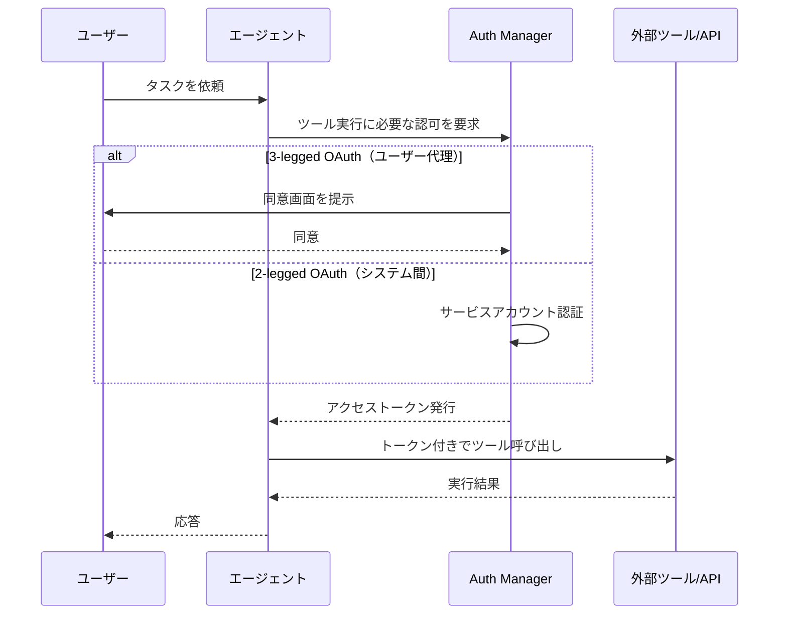

#### PAB（Principal Access Boundary）ポリシーの設定

**Agent Identity**は、各エージェントに一意のIDを付与し、そのエージェントが「何にアクセスできるか」を制限する仕組みです。中核となるのが**Principal Access Boundary（PAB）ポリシー**で、特定のプリンシパル（エージェントのID）がアクセスできるGoogle Cloudリソースの境界を明示的に定義します[^21][^22][^23][^24]。

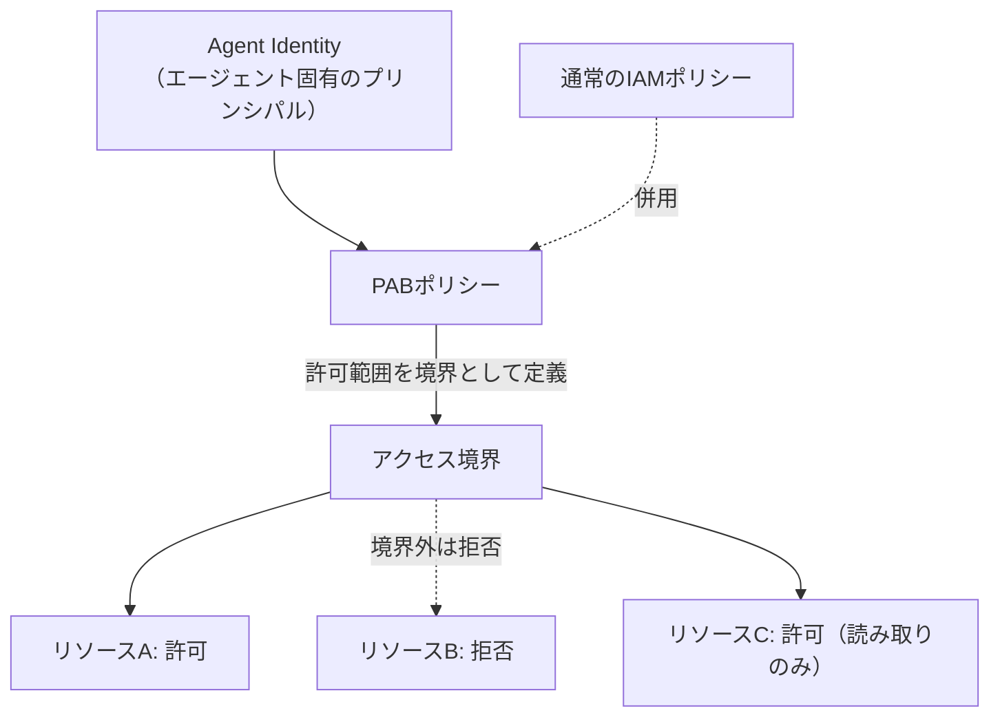

PABはIAMの通常のロールベースアクセス制御を置き換えるものではなく、**追加の境界線**として重ねて適用するものです。IAMで許可されていても、PABの境界外であればアクセスは拒否されます[^23][^24]。

> **ベストプラクティス**
> - エージェントには専用のAgent Identityを発行し、人間の開発者アカウントやプロジェクト共通のサービスアカウントを流用しない。監査ログでの追跡性が大きく向上する。
> - PABポリシーは「デフォルト拒否・明示的許可」の原則で設計し、エージェントが実際に必要とするリソース・操作のみを列挙する。
> - 自律性の高いエージェント（人間の承認なしに広範な操作を行うエージェント）ほど、PABの境界を狭く設定し、影響範囲を最小化する。

#### Agent Gatewayによるトラフィックの監視・追跡

**Agent Gateway**は、エージェントとツール・LLM・他のエージェント間のすべてのトラフィックを通過させるプロキシ層であり、可視性とガバナンスを提供します[^25][^26][^27]。すべての呼び出しを一元的なチェックポイントに通すことで、組織はエージェントの挙動を監視し、ポリシーを適用できます[^28]。

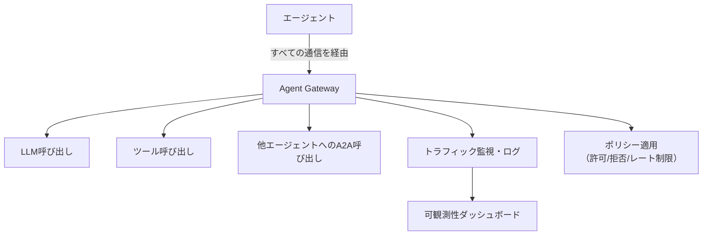

#### エージェントガバナンスとポリシー適用

**Agent Registry**と**Model Armor**は、ガバナンスの2つの側面を担います。Agent Registryは「どのエージェントが存在し、何ができるか」を一元管理するカタログとしての役割を、Model Armorは「入出力の内容が安全か」を検査するスクリーニング層としての役割を担います。

### 5.2 セキュアなエージェントの動作と実行の実装

#### 安全フレームワークとガードレール

**Model Armor**は、LLMベースのアプリケーションに対する入出力の両方をスクリーニングする、モデル非依存のセキュリティサービスです。プロンプトインジェクション・ジェイルブレイク攻撃の検知、機密データ（PIIなど）の漏えい防止、有害コンテンツのフィルタリング、悪意あるURLの検知を行います[^29][^30]。

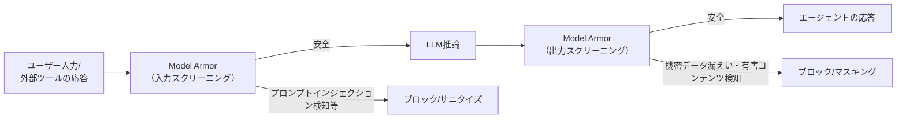

これに加えて、**Human-in-the-loop**（HITL）による承認ステップを、影響度の高い操作（決済実行、本番デプロイ、顧客への一斉通知など）の直前に組み込むことで、自律実行のリスクを緩和します。

#### セキュアなデータアクセスとアイデンティティの伝播

エージェントがユーザーに代わってデータへアクセスする際、**誰の権限で**アクセスしているのかを正しく伝播させることが重要です。ただしユーザーの認可コンテキストは自動的に伝播するものではありません。Agent Gateway と Agent Identity を用いる場合も、**委任資格情報（3-legged OAuth のユーザートークン等）を呼び出しチェーンに沿って明示的に伝播させ、各下流サービス側でその資格情報を検証する**設計が必要です。これによって初めて、途中のエージェントが権限昇格（本来の呼び出し元より広い権限を持ってしまうこと）を起こさない構成になります。

一方、2-legged OAuth やサービスアカウントを用いる場合、下流サービスから見た主体は**エンドユーザーではなくエージェント自身**です。この場合はエージェント主体の権限として扱い、サービスアカウントに与える権限範囲を最小化したうえで、「そのユーザーがそのデータにアクセスしてよいか」というユーザー認可はアプリケーション側で別途管理する必要があります。

```mermaid
flowchart TB
    subgraph Defense["多層防御アーキテクチャ"]
        direction TB
        L1["層1: Auth Manager / OAuth<br/>（誰がアクセスしているか）"]
        L2["層2: Agent Identity + PAB<br/>（何にアクセスできるか）"]
        L3["層3: Agent Gateway<br/>（すべての通信を可視化・制御）"]
        L4["層4: Model Armor<br/>（入出力の内容が安全か）"]
        L5["層5: Sensitive Data Protection<br/>（機密データの検出・匿名化）"]
    end
    L1 --> L2 --> L3 --> L4 --> L5
```

**Sensitive Data Protection**（旧Cloud DLP）は、氏名・クレジットカード番号・マイナンバーなどの機密データパターンを検出し、マスキングやトークン化によって匿名化するサービスです[^35]。RAGパイプラインの取り込み時やエージェントのログ出力時に組み込むことで、機密データが意図せずLLMのコンテキストやログに残留するリスクを下げられます。

> **ベストプラクティス**
> - Model Armorのポリシーは、入力用と出力用で別々に設計する。入力側は主にプロンプトインジェクション対策、出力側は主に機密情報漏えい・有害コンテンツ対策に重点を置く。
> - Agent Gatewayを「あとから追加するもの」ではなく、最初のアーキテクチャ設計段階からすべてのエージェント間通信・ツール呼び出しの必須経由点として組み込む。
> - Sensitive Data Protectionによる匿名化は、RAGのインデックス構築時（データ保存前）とエージェントの出力時（ユーザーへの応答前）の両方に配置し、単一障害点にしない。
> - 多層防御（Defense in Depth）の考え方で、Auth Manager・Agent Identity/PAB・Agent Gateway・Model Armor・Sensitive Data Protectionを重ねて適用し、いずれか1層が突破されても被害が限定されるように設計する。

---

## 試験対象ツール一覧

公式Exam Guideに列挙されている、出題対象となるツール・サービスの一覧です[^2]。学習の進捗確認にご利用ください。

| カテゴリ | ツール・サービス |
|---|---|
| ローコード構築 | Workflow Builder（旧 Agent Designer）、CX Agent Studio、Agent Search（Gemini Enterprise データコネクタ） |
| コーディングエージェント | Antigravity、Claude Code on Google Cloud、Agents CLI |
| セキュアサンドボックス | GKE、Cloud Workstations |
| カスタム開発フレームワーク | Agent Development Kit（ADK）、Model Garden |
| データ・検索基盤 | RAG Engine、Vector Search 1.0、Agent Retrieval（旧Vector Search 2.0）、Sensitive Data Protection |
| 状態・記憶管理 | Agent Platform Sessions、Agent Platform Memory Bank |
| オーケストレーション・プロトコル | Model Context Protocol（MCP）、Agent2Agent（A2A）、Google Cloud MCPサーバー |
| 発見・カタログ | Agent Registry |
| デプロイランタイム | Agent Runtime（旧Agent Engine）、Cloud Run、GKE |
| 評価 | ADK Evaluation、Gen AI Evaluation Service、カスタムオートレーター |
| 可観測性 | Cloud Logging、Cloud Trace（Agent Observability） |
| セキュリティ・ガバナンス | Agent Identity（PAB）、Auth Manager、Agent Gateway、Model Armor |

---

## 学習チェックリスト

- [ ] Workflow Builder（旧 Agent Designer）とCX Agent Studioの違いと、それぞれの状態ベースワークフロー（ページ／遷移ルート／イベントハンドラ）の設定方法を説明できる
- [ ] Gemini Enterpriseへのエンタープライズデータ接続と、非構造化マルチモーダルデータの取り込みの考慮点を説明できる
- [ ] MCPサーバー・カスタムスキル・セキュアサンドボックス（GKE／Cloud Workstations）を使ったコーディングエージェントの構成を説明できる
- [ ] Antigravityにおけるスキル・プラグイン・拡張フック・ルール・サブエージェントの役割を説明できる
- [ ] Agents CLIが提供する主要スキル（workflow／scaffold／adk-code／eval／deploy／publish）を挙げられる
- [ ] LLM/SLM、自己ホスト/SaaS、OSS/プロプライエタリの選定基準を説明できる
- [ ] ADKを使ったエージェント構築の段階的な拡張パス（初期開発→高度なオーケストレーション→最適化→エンタープライズデプロイ）を説明できる
- [ ] Agent Platform SessionsとMemory Bankの役割の違いを説明できる
- [ ] RAGパイプライン（埋め込み→類似度検索→リランキング）の各ステップを説明できる
- [ ] Vector Search 1.0とAgent Retrieval（旧Vector Search 2.0）の違いを説明できる
- [ ] Agent RegistryとGoogle Cloud MCPサーバーによる機能拡張の仕組みを説明できる
- [ ] MCPとA2Aの役割分担（ツール接続 vs エージェント間連携）を説明できる
- [ ] ADKのSequential／Parallel／Loop／Graphワークフローパターンの使い分けを説明できる
- [ ] evalsetの設計、ADK EvaluationとGen AI Evaluation Serviceの違い、継続的評価パイプラインを説明できる
- [ ] Agent Runtime／Cloud Run／GKEのデプロイ選定基準を説明できる
- [ ] エージェントドリフト・ツール呼び出しレイテンシ・推論ループのトラブルシューティング手法を説明できる
- [ ] OAuth 2.0（2LO/3LO）とAuth Managerによるツール認証の仕組みを説明できる
- [ ] Agent IdentityとPAB（Principal Access Boundary）ポリシーの役割を説明できる
- [ ] Agent Gatewayによるトラフィック監視・ガバナンスの仕組みを説明できる
- [ ] Model ArmorとSensitive Data Protectionによる入出力スクリーニング・機密データ保護の仕組みを説明できる
- [ ] 多層防御（Auth Manager→Agent Identity/PAB→Agent Gateway→Model Armor→Sensitive Data Protection）の全体像を説明できる

---

## 参考文献

[^1]: Google Cloud Certified – Professional Agentic Architect（公式認定ページ） https://cloud.google.com/learn/certification/agentic-architect
[^2]: Professional Agentic Architect Exam Guide（公式PDF） https://services.google.com/fh/files/misc/professional_agentic_architect_exam_guide_english.pdf
[^4]: Agent Designerで低コードエージェントを設計する https://docs.cloud.google.com/gemini-enterprise-agent-platform/agent-studio/design-agents
[^5]: CX Agent Studio概要 https://docs.cloud.google.com/gemini-enterprise-cx/cx-agent-studio
[^6]: Gemini Enterprise Agent Platform概要（Build/Scale/Govern/Optimize） https://docs.cloud.google.com/gemini-enterprise-agent-platform/overview
[^7]: The new Gemini Enterprise: one platform for agent development（Google Cloud Blog） https://cloud.google.com/blog/products/ai-machine-learning/the-new-gemini-enterprise-one-platform-for-agent-development
[^8]: Agent Development Kit（ADK）概要 https://cloud.google.com/agent-builder/agent-development-kit/overview
[^9]: Agent Platform上でのADK利用ガイド https://docs.cloud.google.com/gemini-enterprise-agent-platform/build/adk
[^10]: Agents CLIとADKによるクイックスタート https://docs.cloud.google.com/gemini-enterprise-agent-platform/agents/quickstart-adk
[^11]: Build with Google Antigravity: our new agentic development platform（Google Developers Blog） https://developers.googleblog.com/build-with-google-antigravity-our-new-agentic-development-platform/
[^13]: Google Antigravity（IDE/CLI/SDK）に関する解説記事 https://thenextweb.com/news/google-antigravity-2-desktop-cli-sdk-io-2026
[^14]: Agents CLI 公式リポジトリ（GitHub） https://github.com/google/agents-cli
[^15]: Agent Plugins: package your skills, tools, and more（Google Developers Blog） https://developers.googleblog.com/agent-plugins-package-your-skills-tools-and-more/
[^16]: Agent Runtime概要 https://docs.cloud.google.com/gemini-enterprise-agent-platform/build/runtime
[^18]: Agent Platform リリースノート https://docs.cloud.google.com/gemini-enterprise-agent-platform/release-notes
[^19]: Agent Registryへのエージェント登録 https://docs.cloud.google.com/agent-registry/register-agents
[^20]: Agent Registryの自動登録 https://docs.cloud.google.com/agent-registry/automatic-registration
[^21]: Agent Identity概要（IAMドキュメント） https://docs.cloud.google.com/iam/docs/agent-identity-overview
[^22]: Agent RuntimeにおけるAgent Identityの利用 https://docs.cloud.google.com/gemini-enterprise-agent-platform/scale/runtime/agent-identity
[^23]: What's new in IAM security, governance, and runtime defense（Google Cloud Blog） https://cloud.google.com/blog/products/identity-security/whats-new-in-iam-security-governance-and-runtime-defense
[^24]: PAB（Principal Access Boundary）ポリシーの作成 https://cloud.google.com/iam/docs/principal-access-boundary-policies-create
[^25]: Agent Gateway概要 https://docs.cloud.google.com/gemini-enterprise-agent-platform/govern/gateways/agent-gateway-overview
[^26]: Agent Gatewayの監視 https://docs.cloud.google.com/gemini-enterprise-agent-platform/govern/gateways/monitor-agent-gateway
[^27]: Agent Gatewayのセットアップ https://docs.cloud.google.com/gemini-enterprise-agent-platform/govern/gateways/set-up-agent-gateway
[^28]: Agent Gateway Codelab https://codelabs.developers.google.com/cloudnet-agent-gateway
[^29]: Model Armor（製品ページ） https://cloud.google.com/security/products/model-armor
[^30]: Model Armor Codelab（Secure Agent） https://codelabs.developers.google.com/secure-agent-modelarmor
[^32]: Auth Manager概要 https://docs.cloud.google.com/iam/docs/auth-manager-overview
[^33]: 2-legged OAuth（2LO）による認証 https://docs.cloud.google.com/iam/docs/auth-with-2lo
[^34]: ツールセットの認証設定（Agent Registry） https://docs.cloud.google.com/agent-registry/authenticate-toolsets
[^35]: Sensitive Data Protection概要 https://docs.cloud.google.com/sensitive-data-protection/docs/sensitive-data-protection-overview
[^36]: Agent Retrieval（旧Vector Search 2.0）概要 https://docs.cloud.google.com/gemini-enterprise-agent-platform/build/vector-search-2/overview
[^37]: RAG Engineのバックエンド比較（Vector Search利用） https://docs.cloud.google.com/gemini-enterprise-agent-platform/build/rag-engine/use-rag-managed-vertex-ai-vector-search
[^39]: Cloud Run上でのA2A準拠エージェントのホスティング https://docs.cloud.google.com/run/docs/ai/a2a-agents
[^40]: A2A（Agent2Agent）プロトコル 公式リポジトリ https://github.com/a2aproject/A2A
[^41]: A2A: a new era of agent interoperability（Google Developers Blog） https://developers.googleblog.com/en/a2a-a-new-era-of-agent-interoperability/
[^42]: A developer's guide to multi-agent patterns in ADK（Google Developers Blog） https://developers.googleblog.com/developers-guide-to-multi-agent-patterns-in-adk/
[^43]: ADK Graph Workflows ドキュメント https://github.com/google/adk-docs/blob/main/docs/graphs/index.md
[^44]: Agent Evaluation概要 https://docs.cloud.google.com/gemini-enterprise-agent-platform/optimize/evaluation/agent-evaluation
[^45]: エージェントの評価（SDK利用） https://docs.cloud.google.com/gemini-enterprise-agent-platform/optimize/evaluation/evaluate-agents
[^46]: ADK Evaluationガイド https://adk.dev/evaluate/
[^47]: A methodical approach to agent evaluation（Google Cloud Blog） https://cloud.google.com/blog/topics/developers-practitioners/a-methodical-approach-to-agent-evaluation
[^48]: Agent Observability（Cloud Logging / Cloud Trace） https://docs.cloud.google.com/stackdriver/docs/observability/agent-observability
[^50]: AGENTS.mdルールファイルに関する解説（G-gen等） https://blog.g-gen.co.jp/entry/vertex-ai-agent-engine-explained
[^52]: ADK Agent Engineへのデプロイガイド https://google.github.io/adk-docs/deploy/agent-engine
[^121]: Agent Platform Memory Bank概要 https://docs.cloud.google.com/gemini-enterprise-agent-platform/scale/memory-bank
[^123]: Agent Platform Sessions概要 https://docs.cloud.google.com/gemini-enterprise-agent-platform/scale/sessions
[^125]: ADKにおけるSessionとMemoryの扱い（公式ドキュメント） https://google.github.io/adk-docs/sessions/
[^140]: Agent Ops Stack解説記事 https://dev.to/gde/google-clouds-agent-ops-stack-why-deployment-is-no-longer-the-hard-part-g3k
[^55]: AntigravityにおけるMCPサーバー設定 https://codelabs.developers.google.com/getting-started-google-antigravity
[^57]: Antigravity Artifacts機能に関する解説 https://codelabs.developers.google.com/getting-started-google-antigravity
[^60]: Agents CLIスキル一覧（GitHub README） https://github.com/google/agents-cli
[^67]: Agent Plugins仕様の詳細解説 https://developers.googleblog.com/agent-plugins-package-your-skills-tools-and-more/
[^71]: Model Context Protocol公式サイト https://modelcontextprotocol.io/
[^72]: A2A AgentCardの仕様 https://github.com/a2aproject/A2A
[^73]: MCPとA2Aの役割分担に関する解説 https://developers.googleblog.com/en/a2a-a-new-era-of-agent-interoperability/
[^75]: A2AプロトコルのLinux Foundationへの移管に関する発表 https://github.com/a2aproject/A2A
[^76]: マルチエージェントシステムの複雑度に関するGoogle Cloudアーキテクチャガイド https://docs.cloud.google.com/architecture/multiagent-ai-system
[^89]: Agent Designerクイックスタート https://docs.cloud.google.com/gemini-enterprise-agent-platform/agent-studio/design-agents
[^90]: Model Garden概要 https://cloud.google.com/model-garden
[^92]: CX Agent Studioのバージョン管理機能 https://docs.cloud.google.com/gemini-enterprise-cx/cx-agent-studio
[^93]: Gemini Enterprise Agent Designerに関するGoogle Cloud Blog https://cloud.google.com/blog/products/ai-machine-learning/the-new-gemini-enterprise-one-platform-for-agent-development
[^97]: Agent Search（Gemini Enterpriseデータコネクタ）概要 https://docs.cloud.google.com/gemini-enterprise-agent-platform/overview

---

*本ガイドは2026年9月5日時点で公開されている公式情報をもとに作成しています。Professional Agentic Architectはベータ試験であり、試験範囲・ツール名称は今後変更される可能性があります。最新情報は必ず公式認定ページとExam Guide PDFをご確認ください。*
