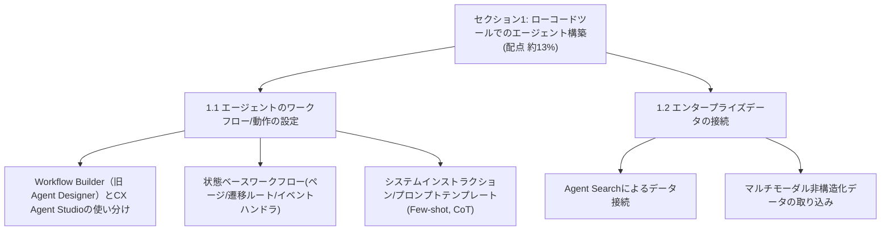
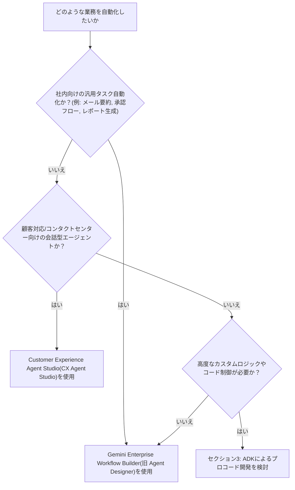
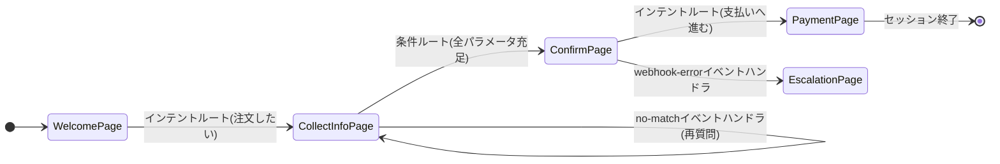
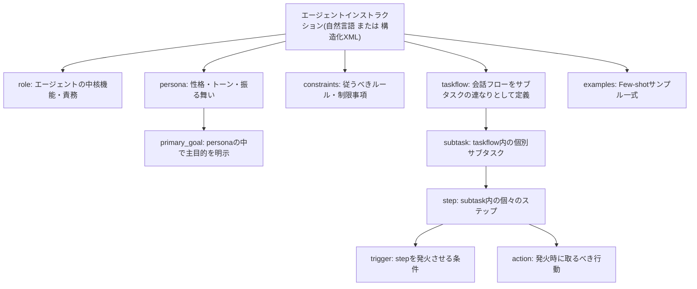
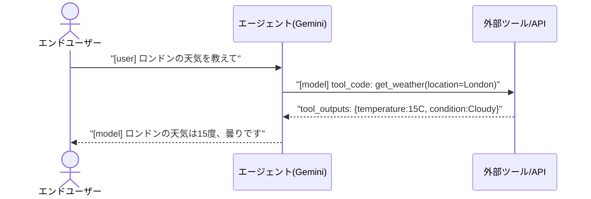
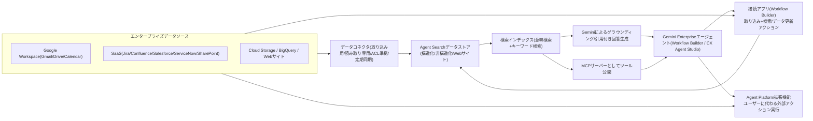
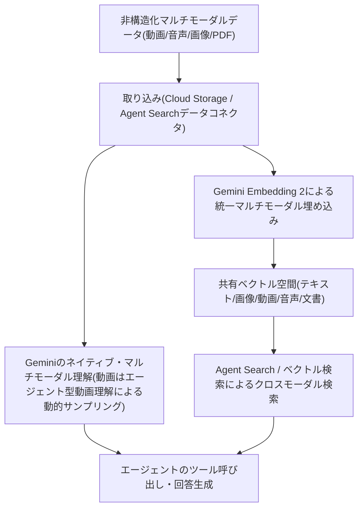

# Professional Agentic Architect 試験ガイド — セクション1: ローコードツールでのエージェント構築（配点 約13%）

本ガイドは、Google Cloud 認定資格「[Professional Agentic Architect](https://cloud.google.com/learn/certification/agentic-architect)」[^2]（ベータ試験）の **セクション1: ローコードツールでのエージェント構築（Building agents using low-code tools）** を、初学者向けにステップバイステップで解説するものです。公式 [試験ガイドPDF](https://services.google.com/fh/files/misc/professional_agentic_architect_exam_guide_english.pdf)[^1] に記載された出題範囲（1.1／1.2）に沿って、関連する Google Cloud サービスの仕組み・設定方法・ベストプラクティスを、図解と表を用いて詳しく説明します。

> **セクション1の出題範囲（配点 約13%）**
> - **1.1** ローコードツールを用いたエージェントのワークフローと動作の設定
> - **1.2** Gemini Enterprise へのエンタープライズデータの接続

---

## 目次

- [1. セクション1の全体像](#1-セクション1の全体像)
- [2. 1.1 ローコードツールを使ったエージェントワークフロー・動作の設定](#2-11-ローコードツールを使ったエージェントワークフロー動作の設定)
  - [2.1 Gemini Enterprise のローコードビルダー全体像：Workflow Builder（旧 Agent Designer）と CX Agent Studio](#21-gemini-enterprise-のローコードビルダー全体像workflow-builder旧-agent-designerと-cx-agent-studio)
  - [2.2 状態ベースワークフロー：ページ・遷移ルート・イベントハンドラ](#22-状態ベースワークフローページ遷移ルートイベントハンドラ)
  - [2.3 システムインストラクションとインコンソール・プロンプトテンプレート（Few-shot / Chain-of-Thought）](#23-システムインストラクションとインコンソールプロンプトテンプレートfew-shot--chain-of-thought)
- [3. 1.2 Gemini Enterprise へのエンタープライズデータ接続](#3-12-gemini-enterprise-へのエンタープライズデータ接続)
  - [3.1 Agent Search（旧 Vertex AI Search）とデータ接続](#31-agent-search旧-vertex-ai-searchとデータ接続)
  - [3.2 非構造化マルチモーダルデータ（動画・音声・画像）の取り込みと処理](#32-非構造化マルチモーダルデータ動画音声画像の取り込みと処理)
- [4. セクション1 ベストプラクティス総まとめ](#4-セクション1-ベストプラクティス総まとめ)
- [5. 学習チェックリスト](#5-学習チェックリスト)
- [6. 参考文献](#6-参考文献)

---

## 1. セクション1の全体像

Professional Agentic Architect 試験は5つのセクションで構成されており、セクション1はその中で「コードを書かずに（あるいは最小限のコードで）エージェントを構築する」領域を扱います。後続のセクション2（コーディングエージェント）やセクション3（ADK等によるプロコード開発）が「エージェントを自分で作り込む」アプローチであるのに対し、セクション1は Google が用意した **Gemini Enterprise 上のローコード／ノーコード・ビルダー** を使いこなす能力を問う点が特徴です。

出題範囲に明示されているツール名は次の2つです。

- **Gemini Enterprise Workflow Builder**（旧 Agent Designer。2026年8月に現行名称へ移行、詳細は後述）[^6]
- **Customer Experience Agent Studio（CX Agent Studio）**[^8]

両者はいずれも Gemini Enterprise Agent Platform の一部ですが[^7]、対象とするユースケースが異なります。次章から順に見ていきましょう。

---

## 2. 1.1 ローコードツールを使ったエージェントワークフロー・動作の設定

### 2.1 Gemini Enterprise のローコードビルダー全体像：Workflow Builder（旧 Agent Designer）と CX Agent Studio

**Workflow Builder（旧 Agent Designer）**（Gemini Enterprise アプリ内蔵のビルダー）は、自然言語のチャット操作、またはビジュアルな Flow キャンバスによって、単一ステップ〜複数ステップのエージェントを作成・管理・公開できる、インタラクティブなノーコード／ローコード・プラットフォームです[^4]。画面は次の4つのタブで構成されます。

| タブ | 役割 |
|---|---|
| Chat（チャットペイン） | 自然言語プロンプトでエージェントを対話的に構築・調整する。ノーコードユーザー向け |
| Flow | エージェント全体のワークフローと制御ロジックを視覚的に表示・編集する。メインエージェントとサブエージェントを管理し、複雑な複数ステップのエージェントを設計する |
| Schedule | エージェントの実行スケジュール（定期実行）を1つ以上設定する |
| Preview | 構築中のエージェントをその場でテストできるライブ環境 |

上記4タブの構成は、Gemini Enterprise（Business Edition）のヘルプドキュメントでも同様に説明されています[^5]。

2026年4月の Google Cloud Next では、Agent Designer が「決定的なビジネスロジックと生成AIを組み合わせ、コードを1行も書かずにシンプルなアシスタントから高度に複雑な自律オーケストレーターまで構築できる」機能として拡張されたことが発表されました[^3]。さらに2026年8月のリリースノートでは、Agent Designer が **Workflow Builder** に名称変更され GA（一般提供）に到達したことが記載されています。Workflow Builder は、スケジュール実行・オンデマンド実行・チャット内での `@メンション` 呼び出しに対応し、既存の A2A／ADK エージェントをインポートして一元管理できる点、Google Workspace（Gmail・カレンダー・Chat・Drive）や Slack・Jira・ServiceNow・Confluence・Microsoft OneDrive／SharePoint・Outlook 等のエンタープライズコネクタに接続できる点が特徴です[^6]。

一方、**Customer Experience Agent Studio（CX Agent Studio）** は、AIとエージェントビルダーUIを用いてユーザーを支援する、ミニマルコードの会話型エージェントビルダーです[^8]。CX Agent Studio は Agent Development Kit（ADK）を基盤に構築されており、ノーコード／ローコードのユーザー層にも ADK の能力を届けることを狙いとしています。CX Agent Studio は **Dialogflow CX の進化形** と位置づけられており、次のような優位点を持ちます[^8]。

- AIを活用したエージェントの構築・最適化・評価の高速化
- 非エンジニア／エージェントアーキテクト向けの、シンプルで直感的なビジュアルビルダー
- インフラ・エンタープライズ統合・セキュリティ・運用上の複雑さを裏側で解決する「ラストマイル問題」の解消
- バックエンドのツール呼び出し中も自然な会話の流れを維持する非同期処理（不自然な沈黙の排除）
- 双方向ストリーミングによる超低遅延な音声対話
- チームでの共同編集を支援する変更履歴・ワンクリックロールバック・競合警告などの統合コラボレーション機能

つまり、**「社内向けの汎用タスク自動化・マルチステップワークフロー」には Workflow Builder（旧 Agent Designer）**、**「顧客対応・コンタクトセンター向けの高度な会話型エージェント」には CX Agent Studio** という使い分けが基本となります。

両ツールの主な違いを整理すると次のとおりです。

| 観点 | Gemini Enterprise Workflow Builder（旧 Agent Designer） | Customer Experience Agent Studio |
|---|---|---|
| 主な用途 | 社内向け業務自動化・マルチステップワークフロー | 顧客対応・コンタクトセンター向け会話型エージェント |
| 構築方法 | 自然言語チャット + ビジュアル Flow キャンバス（no-code / low-code） | AI ガイド付きビジュアルビルダー（minimal-code） |
| 基盤技術 | Gemini Enterprise Agent Platform | Agent Development Kit（ADK）ベース |
| 構成要素の単位 | メインエージェント + サブエージェント | エージェント + ツール + コールバック + ガードレール |
| 状態管理の考え方 | タスク指向の Flow（手順の可視化） | エージェント指向。決定的ロジックが必要な場合は旧 Dialogflow CX フローを「Flow-based エージェント」として取り込み可能 |
| 主な接続先の例 | Gmail、Google Drive、Jira 等のエンタープライズコネクタ | データストア、File Search、Salesforce、ServiceNow、MCP 等の各種ツール |
| 実行トリガー | スケジュール実行、チャット内 `@メンション` | チャット／音声／Webウィジェット等のマルチチャネル |
| 前身・位置づけ | 旧称 Agent Designer。2026年8月に GA 化し Workflow Builder へ改称 | Dialogflow CX の進化形 |

> **ベストプラクティス**
> - まず「エージェントが対話する相手が社内の従業員か、社外の顧客か」で一次判断を行う。前者に寄るタスク（社内ワークフロー・レポーティング・チーム間連携）は Workflow Builder、後者に寄るタスク（カスタマーサポート・音声IVR）は CX Agent Studio が第一候補になる。
> - 「決定的（deterministic）」な業務ロジックが必要な部分（本人確認、規定に沿った段階的なデータ収集など）と、「生成的（generative）」な自由対応が必要な部分を切り分けて設計することが、両ツール共通の設計原則である。
> - 試験では正式名称の変遷（Agent Designer → Workflow Builder）を問われる可能性があるため、出題文中の「Agent Designer」は最新のドキュメント上では「Workflow Builder」に対応する場合がある点を押さえておく。

### 2.2 状態ベースワークフロー：ページ・遷移ルート・イベントハンドラ

出題項目1.1には「**ページ、遷移ルート、イベントハンドラを用いた状態ベースワークフローの構成**」が明記されています。これは CX Agent Studio の前身である **Dialogflow CX** に由来する会話設計モデルであり、CX Agent Studio では「Flow-based エージェント」という形で、この状態ベースの仕組みを取り込むことができます[^9]。まずは基礎となる Dialogflow CX の概念を押さえましょう。

Dialogflow CX の会話は、**ステートマシン（状態機械）** として表現されます[^21]。

- **フロー（Flow）**：関連するページの集合体。1つの高レベルな会話トピック（例：注文フロー、返品フロー）を担当する。
- **ページ（Page）**：会話グラフのノードであり、会話の「状態」を表す。ある時点でアクティブなページは常に1つで、ユーザー入力やイベントに応じて別のページへ遷移する。1つのページが複数ターンにわたってアクティブであり続けることも多い[^21]。
- **状態ハンドラ（State handler）**：ページやフローの遷移・応答を制御する仕組みで、以下の3種類がある[^40][^42]。
  - **インテントルート（Intent route）**：ユーザー発話が特定のインテントに一致した場合に発火する。
  - **条件ルート（Condition route）**：セッションパラメータに基づく条件式が真になった場合に発火する。
  - **イベントハンドラ（Event handler）**：`no-match`（意図不一致）、`no-input`（無音）、`webhook-error` などのシステムイベント、またはカスタムイベントが発火した場合に呼び出される。

| 種別 | トリガー条件 | 典型的な用途 | 消費（consume）の挙動 |
|---|---|---|---|
| インテントルート | ユーザー発話が特定インテントに一致 | 「注文する」「キャンセルする」等、主要な会話分岐 | インテントは消費され、原則として最初に一致したルートのみが呼び出される[^42] |
| 条件ルート | セッションパラメータに対する条件式が真 | フォーム充足後の自動遷移、ビジネスロジックによる分岐 | 条件は消費されないため、複数のルートが連続して呼び出され得る[^42] |
| イベントハンドラ | システムイベント（no-match／no-input／webhook-error）またはカスタムイベントの発火 | 聞き取れなかった際の再質問、エラー時のオペレーターへのエスカレーション | イベントは消費され、スコープ内で最初に見つかったハンドラのみが呼び出される[^42] |

状態ハンドラには「**スコープ（scope）**」という概念があり、あるハンドラが呼び出されるためには、そのハンドラが現在の状況に対して有効範囲内でなければなりません。スコープは「現在アクティブなページ」「現在アクティブなフロー」「現在入力を収集しようとしているフォームパラメータ」のいずれかを基準とし、スコープ内のハンドラは決められた順序で評価されます[^42]。ページ側では、フォームパラメータが未入力の場合に事前入力を試みたうえで、ページレベルのルート → イベントハンドラという順に状態ハンドラが評価されます[^44]。

以下は、簡略化した注文フローを状態機械として表現した例です。

#### CX Agent Studio における Flow-based エージェント

CX Agent Studio 自体は「エージェント＋ツール＋コールバック」というモデルで構築されるため、ページ／遷移ルートという概念をネイティブには持ちません。しかし、既存の Dialogflow CX 資産を活かしたい場合や、決定的なビジネスロジックをどうしても状態機械として表現したい場合のために、CX Agent Studio は既存の Dialogflow CX フローを「**Flow-based エージェント**」としてインポートし、`END_SESSION` に達するまで会話をそのフローへハンドオフできる仕組みを提供しています[^9]。

Flow-based エージェントを作成する際は、次の手順を踏みます[^9]。

1. 起点となる CX Agent Studio エージェント配下で「Flow-based エージェントのインポート」を選択する
2. フローが属するプロジェクトとエージェントを選択する
3. 表示名・説明（親エージェントが「いつこのフローに制御を渡すべきか」を判断できる説明文）を入力する
4. フロー開始リソースと、使用する環境（既定は draft）を指定する
5. 入力変数マッピング（親エージェント→フローへ渡すセッションパラメータ）と、出力変数マッピング（フロー→親エージェントへ返す変数）を設定する

公式ドキュメントは、移行時のベストプラクティスとして次のような「**ブラックボックス原則**」を明確に示しています[^9]。

- フローはセッションパラメータという**暗黙のグローバル変数**に依存する。既定では、あるフロー内で収集したパラメータは自動的にセッションスコープへ伝播し、後続のフローからもアクセス可能になる。この仕組みにより、上流フローのパラメータ収集ロジックを変更すると下流フローが意図せず壊れるリスクがある。
- そのため CX Agent Studio エージェントは、フローを**カプセル化されたブラックボックス**として扱うべきであり、必要な情報はすべて明示的な入力パラメータとしてフローに渡し、フロー終了時には定義済みの出力パラメータをセッションパラメータから明示的に埋めてから制御を返す設計にする。
- **Steering agent（ルーティング層）** としては CX Agent Studio エージェントを用い、CX Agent Studio エージェント同士・フロー同士の間のルーティングを担わせる。CX Agent Studio の Steering agent は、`END_SESSION` に到達して制御が戻るまでは Dialogflow CX エージェント間の直接の転送を行えない点に注意する。

| フローの用途 | 良い例 | 悪い例 |
|---|---|---|
| 高度に決定的なビジネスロジック | 段階的なデータ収集・入力検証、セッションパラメータに基づく認証フロー | 定型応答（コールバックで十分実現できる）、意図分類・検出（LLMを使うべき領域） |

> **ベストプラクティス**
> - 新規ユースケースはすべて CX Agent Studio エージェントとして構築し、既存の複雑な Dialogflow CX 資産（playbook とフローが密結合しているもの）は当面維持しつつ、ルーティング層で両者を振り分ける「エージェントタイプの分離（isolated approach）」から始めるのが移行の第一選択となる[^9]。
> - playbook とフローの相互作用が CX Agent Studio のルーティング層からブラックボックスとして見える限り、playbook を含む構成も許容される。一方で、複数の CX フローと CX Agent Studio エージェントが行き来する「convolutedな」構成はカプセル化を損なうため避ける[^9]。
> - 状態ハンドラの評価順序（インテントルートはインテントを消費、条件ルートは消費しない、イベントハンドラはスコープ内で最初の1つのみ呼び出される）を正しく理解しておくことは、意図しない多重発火や無限ループのデバッグに直結する。

### 2.3 システムインストラクションとインコンソール・プロンプトテンプレート（Few-shot / Chain-of-Thought）

出題項目1.1のもう一つの柱は、「**エージェントの動作を導くためのシステムインストラクションおよびインコンソールのプロンプトテンプレート（Few-shot、Chain-of-Thoughtなど）の作成**」です。CX Agent Studio の Instructions 機能を例に、実務的な組み立て方を見ていきます[^10]。

#### インストラクションの基本構文

CX Agent Studio の「エージェントインストラクション」は自然言語でモデルに詳細な振る舞いを指示するテキストです。インストラクション内では、次のような特別な参照構文を利用できます[^10]。

| 参照対象 | 記法 | 説明 |
|---|---|---|
| セッション変数 | `{variable_name}` | スネークケースの変数名を波かっこで囲んで参照する |
| ツール | `{@TOOL: tool_name}` | エージェントに追加済みのツールを表示名で参照する |
| サブエージェント | `{@AGENT: Agent Name}` | サブエージェントを表示名で参照する |

エディタ上で `@` を入力するとエージェント・ツール・変数を選択できるコンテキストメニューが開き、`{` を入力すると利用可能な変数の一覧が表示されるため、これらの参照は「チップ」としてハイライトされ、タイプミスを防止できます[^10]。

なお、プロンプトやインストラクションの記述には、モデルの理解精度を最大化するため **英語を用いることが推奨** されています。エージェントは実行時にはエンドユーザーの発話言語を自動検出して同じ言語で応答するため、インストラクション自体の言語と、実際にエージェントが話す言語は別物である点に注意してください[^10]。

#### 「Restructure instructions」機能とXML構造

自然言語だけでもインストラクションは機能しますが、公式ドキュメントは「**XML構造でフォーマットした方がモデルの指示追従性が向上する**」と明記しており、CX Agent Studio には自然言語のインストラクションをワンクリックで推奨のXML構造へ変換する「**Restructure instructions**」ボタンが用意されています[^10]。推奨されるXMLタグは次のとおりです。

| タグ | 役割 |
|---|---|
| `role` | エージェントの中核となる機能・責務を定義する |
| `persona` | エージェントの性格・トーン・振る舞いのガイドラインを記述する |
| `primary_goal` | `persona` 内でエージェントの主目的を明示する |
| `constraints` | エージェントが従うべきルール・制限事項を列挙する |
| `taskflow` | 会話フローを一連のサブタスクとして概説する |
| `subtask` | `taskflow` 内の特定のサブタスク（1つ以上の `step` から構成） |
| `step` | `subtask` 内の個々のステップ（`trigger` と `action` を含む） |
| `trigger` | `step` を発火させる条件・ユーザー入力 |
| `action` | `step` が発火した際にエージェントが取るべき行動 |
| `examples` | 特定シナリオ向けの Few-shot サンプルを格納する |

この `taskflow → subtask → step（trigger／action）` という階層構造は、CX Agent Studio における **構造化されたタスク分解と指示設計** の枠組みです。「複雑な会話タスクを、条件（trigger）と行動（action）が明示された小さなステップに分解して積み上げる」という設計は、あくまで開発者が記述する制御構造であり、モデル内部の推論過程そのものではない点に注意してください。抽象的な1文の指示（例：「ユーザーの意図を判断して適切に対応して」）ではなく、`trigger` ごとに条件を明示し、`action` ごとに取るべき行動を具体化することで、モデルの解釈揺れを減らせます。

#### インライン Few-shot サンプル

**Few-shotプロンプティング** とは、少数の具体例をモデルに与えることで振る舞い・トーン・ロジックを導く手法です。CX Agent Studio では、この具体例をUIの別パネルではなくインストラクション本文内に直接記述する「インライン Few-shot サンプル」として扱います[^10]。

Few-shot サンプルを追加すべき主なシーンは次のとおりです[^10]。

- **品質問題の解消**：モデルが指示を一貫して誤解する、特定の失敗パターンを修正したいとき
- **複雑なフォーマット**：非標準的な出力フォーマットを、非常に厳密に指定したいとき
- **微妙なロジック**：if-then形式の指示だけでは意思決定の機微を捉えきれないとき

一方で、次のような**警告**も明記されています[^10]。

- **控えめに使う**：サンプルを入れすぎると、モデルがサンプルに「過学習（overfit）」し、未知のユーザークエリへの汎化能力を失う恐れがある
- **網羅的である必要はない**：あらゆるユーザークエリを列挙する必要はなく、あくまでモデルの推論パターンを示す「ガイダンス」として使う
- **まずは指示から**：Few-shotを追加する前に、明確で説明的な指示だけで問題を解決できないか試す

Few-shot サンプル1件は、会話の1ターンを模した次の4要素で構成されます[^10]。

| 要素 | 記法 | 役割 |
|---|---|---|
| ユーザー入力 | `[user]` | エンドユーザーの発話・質問を表す |
| モデル応答／思考 | `[model]` | エージェントのテキスト応答、または推論過程を表す |
| ツール呼び出し | `tool_code` | 外部ツール・関数への呼び出し方（引数など）を示す |
| ツール出力 | `tool_outputs` | ツールから返るデータをシミュレートし、モデルにその解釈のさせ方を教える |

この4要素の流れは、次のような1ターンのシーケンスとして理解すると分かりやすくなります。

#### 指示によるレスポンスのフォーマット指定

出題範囲には直接含まれませんが、実務上重要な補足として、CX Agent Studio の公式ベストプラクティスは「エージェントの応答フォーマット」自体もインストラクションで指定すべきだとしています[^10]。

- **チャンク化と余白**：ユーザーは読むのではなく「スキャン」するため、密な段落を書かない。1テキストブロックは1〜2文までに抑え、異なるアイデアの間には改行を入れる
- **戦略的な太字**：商品名・価格・日付・注文番号・締切など、重要なデータポイントは太字にして即座に目に留まるようにする
- **箇条書き優先**：2項目・2ステップ以上に言及する場合は、自動的に箇条書きまたは番号付きリストに変換する

#### グローバルインストラクション

エージェント個別のインストラクションに加え、CX Agent Studio では**エージェントアプリケーション全体の高度な設定**として「グローバルインストラクション」を定義できます[^10]。エージェントアプリケーション内のすべてのエージェントはグローバルインストラクションを継承し、会話の各ターンごとに、エージェント個別のインストラクションに上乗せする形でモデルへ送信されます。ブランドトーンや全般的な「やるべきこと／やってはいけないこと」、グローバルに共有される変数、顧客プロファイルなど、すべてのエージェントが知っておくべき汎用的な情報を定義するのに適しています[^10]。

> **ベストプラクティス**
> - まずは自然言語で素朴にインストラクションを書き、`Restructure instructions` でXML構造に変換してから `role` / `persona` / `constraints` / `taskflow` / `examples` の各セクションを磨き込む、というワークフローが効率的である。
> - Few-shot サンプルは「モデルが実際に間違えたケース」から逆算して追加する。仮説ベースで大量のサンプルを先回りして詰め込むと、かえって過学習・汎化性能の低下を招く。
> - ブランドトーンや共通の禁止事項は個々のエージェントのインストラクションに重複して書かず、グローバルインストラクションに一元化することで、保守性と一貫性を両立できる。

---

## 3. 1.2 Gemini Enterprise へのエンタープライズデータ接続

### 3.1 Agent Search（旧 Vertex AI Search）とデータ接続

出題項目1.2の中心となるのが **Agent Search**（旧称 Vertex AI Search）です。Agent Search は、Webサイト・構造化データ・非構造化データを対象に、Googleクオリティの検索体験を構築できるサービスであり、生成AIエージェント／アプリを構築するためのグラウンディングシステムと、DIY向けのグラウンディングAPIをすぐに使える形で提供しています[^11]。

エンタープライズが Agent Search を活用する代表的な機会は次の2つです[^11]。

1. 社内イントラネットや顧客向けWebサイトの検索体験を、単純なキーワード一致から、Google 検索の生成的な検索体験に近い会話型検索へと刷新する
2. 深い情報検索・最新の自然言語処理・大規模言語処理を組み合わせ、ユーザーの意図を理解して最も関連性の高い結果を返す

Agent Search は、Gemini Enterprise Agent Platform の**拡張機能（extensions）**と**データコネクタ（data connectors）**を通じて、自社システム・Google製品・サードパーティアプリケーションに接続できます[^11]。

| 種別 | 説明 | 例 |
|---|---|---|
| データコネクタ（取り込み用） | Agent Search が対象アプリケーションのデータをインデックスへ取り込むための接続。多くは**読み取り専用**で、定期的に同期される | Jira、Confluence、Salesforce |
| 接続アプリ（Workflow Builder） | 取り込みだけでなく、設定に応じて対象アプリの**検索やデータ更新のアクション**を実行できる | Google Workspace、Slack、Jira、ServiceNow |
| Agent Platform 拡張機能 | **ユーザーに代わって外部システムのアクション（取引等）を実行**できる | メール送信、チケット作成等 |

出題ガイドの試験対象ツール一覧にも記載されている **Agent Search** と **Agent Registry・MCPサーバー** の連携についても触れておくと、Agent Search のデータストアは Model Context Protocol（MCP）サーバーとしても公開できるため、ADK エージェントや CX Agent Studio、その他 MCP 対応クライアントから「1つのツール」として呼び出すことができます[^24]。CX Agent Studio 側にも、データストアを直接ツールとして追加する仕組みが用意されています（Data store tools、Website data store tools、Cloud storage data store tools、File Search tools など）[^8]。

なお、Agent Search は2026年4月の Google Cloud Next で Vertex AI Search から改称されたブランドですが、Google Cloud コンソールのUI表示は当面「Vertex AI Search and AI Applications」のままであり、APIも引き続き Discovery Engine API のエンドポイントを使用します。改称後もプロダクトの機能自体は変わっていない点に注意してください[^13][^26]。

> **ベストプラクティス**
> - データストアと、その上に構築する検索アプリ（あるいはエージェントのツール）は**疎結合**である。1つのデータストアを複数の検索アプリで再利用したり、逆に複数のデータストアを1つのアプリで横断検索したりできるため、「検索ウィジェット」から「エージェントのツール」へ用途を変えたい場合でも、データの再取り込みは不要である。
> - データコネクタは同期対象アプリケーションの**アクセス制御（ACL）を尊重**する。あるユーザーの権限で発行された検索クエリは、そのユーザーが元々アクセスできる範囲のドキュメントしか返さないという前提を理解しておくことは、セキュリティ設計上重要である。
> - 「読み取りだけで十分か」「エージェントに書き込み・取引の実行までさせたいか」で、データコネクタと拡張機能のどちらを使うかを判断する。

### 3.2 非構造化マルチモーダルデータ（動画・音声・画像）の取り込みと処理

出題項目1.2のもう一方の柱は、「**動画・音声・画像などの非構造化マルチモーダルデータをエージェントのワークフローに取り込み、処理する**」ことです。Gemini Enterprise Agent Platform では、この要件に対応する複数の仕組みが用意されています。

#### Geminiのネイティブなマルチモーダル理解

Gemini モデルは、テキストと同じリクエスト内で動画・音声・画像を直接扱うことができます。動画については、音声を含む単一または複数の動画をリクエストに含めることが可能です[^19]。特に注目すべきは「**エージェント型動画理解（agentic video understanding）**」という機能で、これは従来の「固定フレームレート（既定1FPS）で動画を静的に取り込む」処理とは異なり、モデルのコア推論能力とネイティブな動画ツールを組み合わせ、視覚フレーム・音声・トランスクリプトを横断して動画の特定セグメントを**動的に検索・スキャン・検査**する仕組みです[^38]。

#### Gemini Embedding 2 による統一マルチモーダル埋め込み

複数モダリティのデータを横断的に検索・検索拡張生成（RAG）に活用するための基盤が **Gemini Embedding 2** です。これは Gemini API で最初に、テキスト・画像・動画・音声・ドキュメントを**単一の埋め込み空間**にマッピングするモデルであり、100以上の言語に対応しています[^17][^18]。1回の呼び出しで扱える入力量の目安は、テキスト最大8,192トークン、画像6枚、音声180秒、PDF6ページです[^18]。動画の最大時間は音声抽出設定によって変わり、`audio_track_extraction` が無効な場合はデフォルトの1 FPSで最大120秒、有効な場合は動画と音声が同じ8,192トークンの上限を共有するため、同条件で最大およそ81秒となります[^18]。

Gemini Embedding 2 は Matryoshka Representation Learning（MRL）に対応しており、精度をあまり落とさずに出力次元数を切り詰められます[^32]。

| 出力次元数 | 用途の目安 |
|---|---|
| 3072 | 最大精度（デフォルト）。ストレージコストも最大 |
| 1536 | 多くの本番システムに適したバランス |
| 768 | 軽量。モバイル／エッジ向け |
| 256 | 超小型。超高スループットが求められるシステム向け |

さらに、埋め込み対象を最適化するための**カスタムタスク指示**を指定できます[^17]。Gemini Embedding 2 では `task_type` の列挙値ではなく、入力テキストの先頭にタスクを記述するプロンプト形式（例：`task: search result | query: {content}`、`task: code retrieval | query: {content}`）でタスクを指定します。

一方、従来のテキスト埋め込み API では、次のような `task_type` の列挙値でタスクを指定します。

| タスクタイプ | 用途 |
|---|---|
| `RETRIEVAL_DOCUMENT` | データ取り込み時に、検索対象のドキュメントをインデックス化する |
| `RETRIEVAL_QUERY` | 検索時に、ユーザーの質問文を埋め込む |
| `SEMANTIC_SIMILARITY` | クラスタリングや重複排除タスク |
| `CLASSIFICATION` | カテゴリ分類タスク |

同一の意味空間にテキストと画像・動画の埋め込みベクトルがマッピングされるため、「テキストで画像を検索する」「画像で動画を検索する」といったクロスモーダル検索が実現できます[^30]。

#### マルチモーダルデータセット（Agent Platform）

Gemini Enterprise Agent Platform には、ファインチューニングやバッチ予測に向けた「マルチモーダルデータセット」という管理対象データセットの一種が用意されています。これは他の単一モダリティ用データセットと異なり、テキスト・画像・音声・動画のいずれのデータも含められる点が特徴です[^29]。マルチモーダルデータセットは Gemini のような Google モデル専用であり（サードパーティモデルには使用不可）、BigQuery を基盤としています。既存の BigQuery テーブルや DataFrame から作成した場合は、データを物理コピーせずロジカルビューとして扱うため追加のストレージコストが発生しない一方、それ以外のソースから作成した場合は BigQuery への新規コピーが発生し、ストレージコストがかかります[^29]。

> **ベストプラクティス**
> - 「動画の中の特定シーンだけをピンポイントで参照させたい」場合は、静的な固定フレームレート処理ではなく、エージェント型動画理解が動的にセグメントを検索・検査する挙動を活かせるようプロンプト・ツール設計を行う。
> - マルチモーダル検索基盤を新規設計する際は、モダリティごとに別々の埋め込みモデル・ベクトルインデックスを用意するのではなく、Gemini Embedding 2 のような統一埋め込み空間を使うことで、クロスモーダル検索とRAGパイプラインの実装をシンプルに保てる。
> - 出力次元数（3072/1536/768/256）はストレージコストと精度のトレードオフである。本番規模のシステムでは、まず1536次元を既定候補として検討し、レイテンシ・コスト要件が厳しい場合にのみ次元削減を検討するのが実務的な進め方である。
> - ファインチューニングやバッチ予測でマルチモーダルデータを扱う場合、既存の BigQuery テーブルを流用できないかを先に検討する。新規コピーを避けられればストレージコストとデータ重複・フォーマット不整合のリスクを同時に減らせる。

---

## 4. セクション1 ベストプラクティス総まとめ

| トピック | 重要なベストプラクティス |
|---|---|
| ツール選定 | 対話相手が社内従業員か社外顧客かでまず一次判断し、決定的ロジックと生成的対応を切り分けて設計する |
| 状態ベースワークフロー | フローは常に「ブラックボックス」として扱い、入出力は明示的なパラメータマッピングで受け渡す |
| インストラクション設計 | 自然言語→XML構造化（role/persona/constraints/taskflow/examples）の順で磨き込み、共通ルールはグローバルインストラクションに集約する |
| Few-shot | 実際の失敗事例から逆算して最小限追加し、過学習による汎化性能の低下を避ける |
| データ接続 | データストアと検索アプリ／ツールを疎結合に保ち、ACLを尊重するデータコネクタの挙動を前提にセキュリティ設計する |
| マルチモーダル取り込み | 統一埋め込み空間（Gemini Embedding 2）でモダリティ横断のRAG基盤をシンプルに保ち、動画は動的なエージェント型理解を活用する |

---

## 5. 学習チェックリスト

- [ ] Workflow Builder（旧 Agent Designer）と CX Agent Studio の違いと使い分け基準を説明できる
- [ ] Workflow Builder の主要タブ（Chat／Flow／Schedule／Preview）の役割を説明できる
- [ ] ページ、インテントルート、条件ルート、イベントハンドラの違いを説明できる
- [ ] 状態ハンドラの「スコープ」と評価順序の基本を理解している
- [ ] CX Agent Studio の Flow-based エージェントで既存 Dialogflow CX フローを移行する際の「ブラックボックス原則」を説明できる
- [ ] システムインストラクションでの変数・ツール・サブエージェント参照構文（`{var}`、`{@TOOL:}`、`{@AGENT:}`）を使える
- [ ] Restructure instructions が生成するXML構造（role／persona／constraints／taskflow／examples等）の各タグの役割を説明できる
- [ ] taskflow → subtask → step（trigger／action）の階層構造が、構造化されたタスク分解・指示設計として有効である理由を説明できる
- [ ] Few-shotサンプルの4要素（`[user]`／`[model]`／`tool_code`／`tool_outputs`）を使ってサンプルを書ける
- [ ] Few-shotサンプルを使うべき場面と、過学習（overfit）のリスクを説明できる
- [ ] グローバルインストラクションとエージェント個別インストラクションの違いと使い分けを説明できる
- [ ] Agent Search（旧Vertex AI Search）のデータストアと、データコネクタ／拡張機能の違いを説明できる
- [ ] データコネクタがACLを尊重する仕組みと、データストアと検索アプリが疎結合である利点を説明できる
- [ ] Agent SearchのMCPサーバー経由でのツール公開の仕組みを理解している
- [ ] Gemini Embedding 2による統一マルチモーダル埋め込み空間の特徴（対応モダリティ・次元数・タスクタイプ）を説明できる
- [ ] 動画理解における「静的な固定フレームレート処理」と「エージェント型動画理解」の違いを説明できる
- [ ] マルチモーダルデータセット（Agent Platform）がBigQueryを基盤とすることと、そのコスト構造を理解している

---

## 6. 参考文献

### 試験ガイド・認定情報

[^1]: [Professional Agentic Architect Certification exam guide (PDF)](https://services.google.com/fh/files/misc/professional_agentic_architect_exam_guide_english.pdf) — Google Cloud
[^2]: [Professional Agentic Architect | Google Cloud Learn](https://cloud.google.com/learn/certification/agentic-architect) — 認定資格の公式概要ページ

### Gemini Enterprise / Workflow Builder（旧 Agent Designer）

[^3]: [What's new in Gemini Enterprise | Google Cloud Blog](https://cloud.google.com/blog/products/ai-machine-learning/whats-new-in-gemini-enterprise)
[^4]: [Agent Designer overview | Gemini Enterprise Documentation](https://docs.cloud.google.com/gemini/enterprise/docs/agent-designer)
[^5]: [Create and manage agents using Agent Designer | Gemini Enterprise – Business Edition Help](https://support.google.com/g/answer/16540723?hl=en)
[^6]: [Gemini Enterprise release notes | Google Cloud Documentation](https://docs.cloud.google.com/gemini/enterprise/docs/release-notes)
[^7]: [Agent Platform overview | Gemini Enterprise Agent Platform Documentation](https://docs.cloud.google.com/gemini-enterprise-agent-platform/overview)

### Customer Experience（CX）Agent Studio

[^8]: [CX Agent Studio | Google Cloud Documentation](https://docs.cloud.google.com/gemini-enterprise-cx/cx-agent-studio)
[^9]: [Flow-based agents | CX Agent Studio Documentation](https://docs.cloud.google.com/gemini-enterprise-cx/cx-agent-studio/flow)
[^10]: [Instructions | CX Agent Studio Documentation](https://docs.cloud.google.com/gemini-enterprise-cx/cx-agent-studio/instruction)

### Agent Search（旧 Vertex AI Search）とデータ接続

[^11]: [Agent Search on Gemini Enterprise Agent Platform | Google Cloud](https://cloud.google.com/products/gemini-enterprise-agent-platform/agent-search)
[^13]: [Create a search data store | Agent Search Documentation](https://docs.cloud.google.com/generative-ai-app-builder/docs/create-data-store-es)
[^24]: [Integrate Gemini Enterprise Agents with Google Workspace | Google Codelabs](https://codelabs.developers.google.com/ge-gws-agents)
[^26]: [Agent Search release notes | Google Cloud Documentation](https://docs.cloud.google.com/generative-ai-app-builder/docs/release-notes)

### マルチモーダルデータとEmbedding

[^17]: [Gemini Embedding 2 | Gemini Enterprise Agent Platform Documentation](https://docs.cloud.google.com/gemini-enterprise-agent-platform/models/gemini/embedding-2)
[^18]: [Building with Gemini Embedding 2: Agentic multimodal RAG and beyond | Google Developers Blog](https://developers.googleblog.com/building-with-gemini-embedding-2/)
[^19]: [Video understanding | Gemini Enterprise Agent Platform Documentation](https://docs.cloud.google.com/gemini-enterprise-agent-platform/models/capabilities/video-understanding)
[^29]: [Multimodal datasets | Gemini Enterprise Agent Platform Documentation](https://docs.cloud.google.com/gemini-enterprise-agent-platform/models/capabilities/datasets)
[^30]: [Get multimodal embeddings | Gemini Enterprise Agent Platform Documentation](https://docs.cloud.google.com/gemini-enterprise-agent-platform/models/embeddings/get-multimodal-embeddings)
[^32]: [Gemini Embedding 2 | Gemini Enterprise Agent Platform Documentation](https://docs.cloud.google.com/gemini-enterprise-agent-platform/models/gemini/embedding-2)
[^38]: [Introducing agentic video understanding with Gemini](https://blog.google/innovation-and-ai/models-and-research/gemini-models/introducing-agentic-video-in-gemini/)

### Dialogflow CX 状態ベースワークフロー（基礎概念）

[^21]: [Pages | Dialogflow CX Documentation](https://docs.cloud.google.com/dialogflow/cx/docs/concept/page)
[^40]: [Migrating from Dialogflow ES to Dialogflow CX | Google Cloud Documentation](https://docs.cloud.google.com/dialogflow/cx/docs/how/migrate)
[^42]: [State handlers | Dialogflow CX Documentation](https://docs.cloud.google.com/dialogflow/cx/docs/concept/handler)
[^44]: [Pages | Dialogflow CX Documentation](https://docs.cloud.google.com/dialogflow/cx/docs/concept/page)
