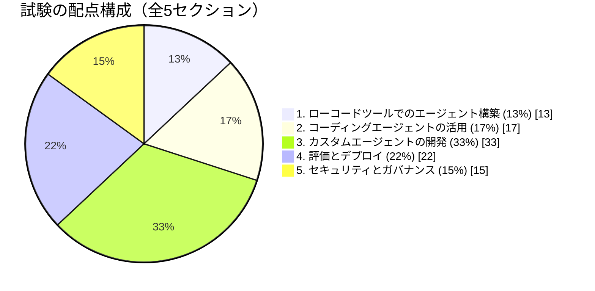
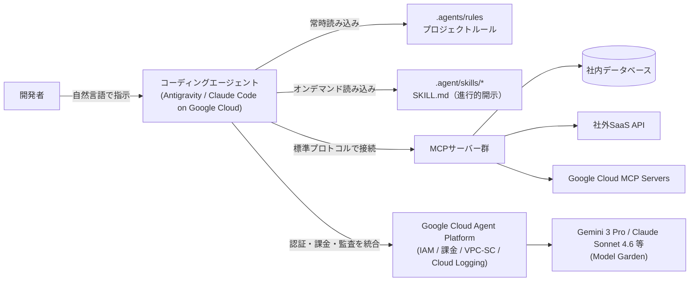
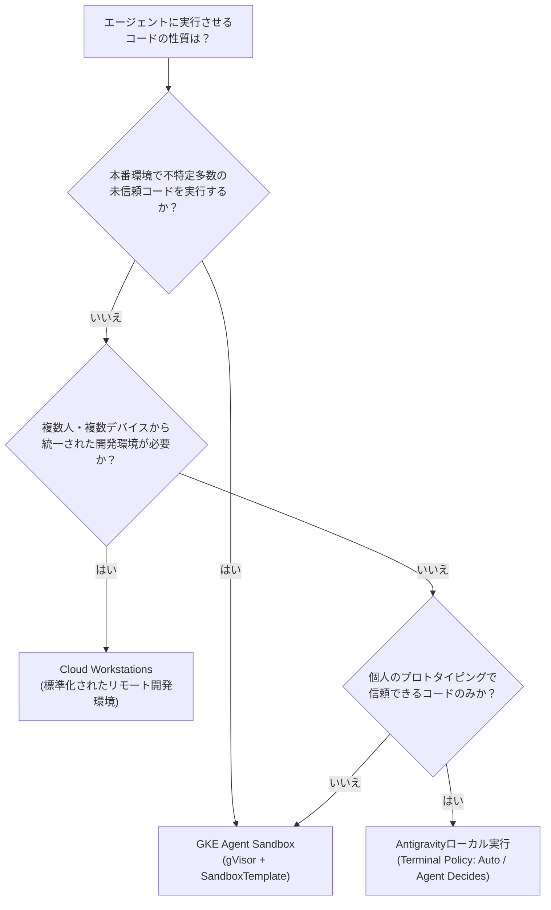
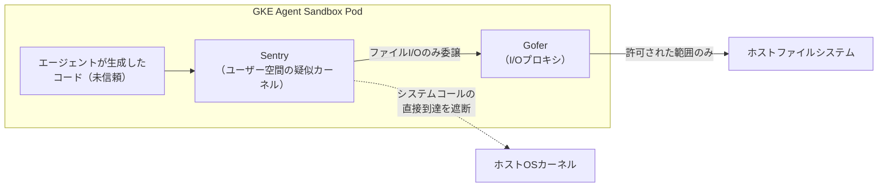
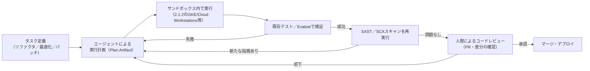
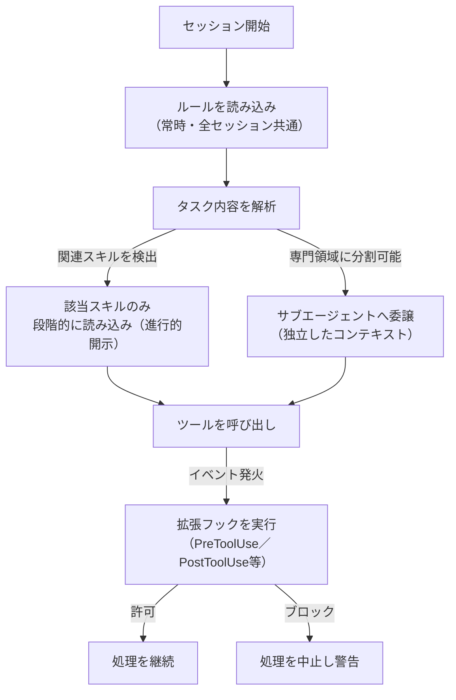
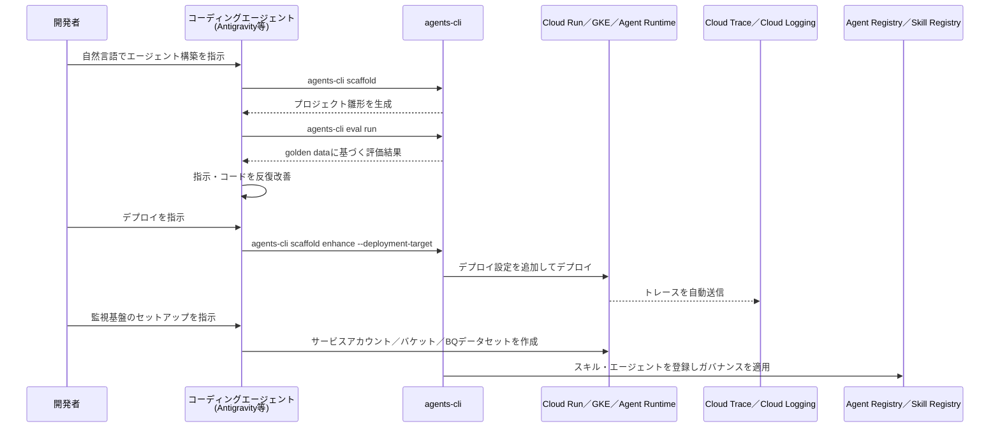

# Professional Agentic Architect 認定試験 セクション2: コーディングエージェントを使用したアプリケーション開発（配点 約17%）

## はじめに

本ガイドは、Google Cloud「Professional Agentic Architect」（ベータ試験、2026年9月30日まで受験可能）[^1]の出題範囲のうち、**セクション2: コーディングエージェントを使用したアプリケーション開発**（Using coding agents for application development、配点約17%）を初学者向けに徹底解説するものです。内容の根拠は公式試験ガイドPDF[^2]および公式認定ページ[^1]です。

試験全体は次の5セクションで構成されており、セクション2はセクション3（33%）・セクション4（22%）に次いで3番目に配点が高い領域です[^2]。



セクション2は、公式試験ガイドによれば以下の2つの小項目（considerations）で構成されています[^2]。

- **2.1 コーディングエージェントの効果的な活用** — MCPサーバー・カスタムスキル・ツールアクセスの設定、セキュアなサンドボックスでの利用、リファクタリング・実行ランタイム最適化・脆弱性パッチ適用
- **2.2 エンタープライズワークフロー向けのコーディングエージェントのカスタマイズ** — Antigravityでのスキル・プラグイン・拡張フック・ルール・サブエージェント作成、Agents CLIによる拡張

> **注記**: 公式試験ガイドの「対象ツール一覧」には含まれていませんが、2.1の本文中では「Cloud Workstations」がセキュアサンドボックスの具体例として明記されています[^2]。本ガイドでもこの記載に従い解説します。

## 目次

- [セクション2に関連する主な対象ツール](#セクション2に関連する主な対象ツール)
- [2.1 コーディングエージェントの効果的な活用](#21-コーディングエージェントの効果的な活用)
  - [2.1.1 MCPサーバー・カスタムスキル・ツールアクセスの設定](#211-mcpサーバーカスタムスキルツールアクセスの設定)
  - [2.1.2 セキュアなサンドボックスでのコーディングエージェントの利用](#212-セキュアなサンドボックスでのコーディングエージェントの利用)
  - [2.1.3 リファクタリング・実行ランタイム最適化・脆弱性パッチ適用](#213-リファクタリング実行ランタイム最適化脆弱性パッチ適用)
- [2.2 エンタープライズワークフロー向けのコーディングエージェントのカスタマイズ](#22-エンタープライズワークフロー向けのコーディングエージェントのカスタマイズ)
  - [2.2.1 Antigravityにおけるスキル・プラグイン・拡張フック・ルール・サブエージェントの作成](#221-antigravityにおけるスキルプラグイン拡張フックルールサブエージェントの作成)
  - [2.2.2 Agents CLIによるAntigravityの拡張（構築・スケール・ガバナンス・最適化）](#222-agents-cliによるantigravityの拡張構築スケールガバナンス最適化)
- [学習チェックリスト](#学習チェックリスト)
- [参考文献](#参考文献)

## セクション2に関連する主な対象ツール

公式試験ガイドの「対象ツール一覧（in scope for this exam）」[^2]のうち、セクション2に特に関連するものを以下にまとめます。

| ツール名 | 概要 | 本ガイドでの主な登場箇所 |
|---|---|---|
| Antigravity (CLI, SDK, App) | Googleのエージェントファースト開発プラットフォーム。IDE・CLI（`agy`）・SDKの3形態で提供される[^4][^5] | 2.1.1, 2.1.2, 2.2.1, 2.2.2 |
| Claude Code on Google Cloud | Google CloudのAgent Platform（旧Vertex AI）経由で課金・IAM・監査ログを統合して使うAnthropic Claude Codeのコーディングエージェント[^7] | 2.1.1 |
| Model Context Protocol (MCP) servers | エージェントに外部ツール・データへの標準化されたアクセスを提供するプロトコルとサーバー実装[^11] | 2.1.1, 2.2.1 |
| Google Kubernetes Engine (GKE) | Agent Sandbox機能によりgVisorベースのカーネルレベル隔離実行環境を提供[^12][^14] | 2.1.2 |
| Agents CLI in Agent Platform | コーディングエージェントにADKでのエージェント構築・評価・デプロイのスキルを付与するCLIとスキル群[^24][^25] | 2.2.2 |
| Skill Registry | スキルを一元管理・検証・配布するセキュアなリポジトリ[^30] | 2.2.1, 2.2.2 |
| Agent Registry | エージェント・MCPサーバー・スキル・エンドポイントを登録・発見・ガバナンスする統合カタログ[^28] | 2.2.2 |
| Cloud Run | Agents CLIのデフォルトのデプロイターゲットの1つ[^24] | 2.2.2 |
| Google Cloud Observability (Cloud Logging / Cloud Trace) | **Cloud Trace** はデプロイしたエージェントに対して常時有効。一方、**プロンプト／レスポンスのログ**は既定では有効化されず、素の `agents-cli deploy` は保存先のCloud StorageバケットやBigQueryデータセットを作成しない（Terraform等で別途プロビジョニングした場合に利用可能になる）[^24] | 2.2.2 |

---

## 2.1 コーディングエージェントの効果的な活用

### 2.1.1 MCPサーバー・カスタムスキル・ツールアクセスの設定

コーディングエージェント（Antigravity、Claude Code on Google Cloudなど）は、単体では自分のコード生成能力しか持ちません。実際の開発ワークフローで役立てるには、(a) 外部システムに接続する**MCPサーバー**、(b) 特定タスクの専門知識をまとめた**カスタムスキル**、(c) それらへの**ツールアクセス権限**を適切に設定する必要があります[^2]。

**MCP**（Model Context Protocol）は、エージェントと外部ツール・データソースの間の通信を標準化するプロトコルです。stdio（ローカルサブプロセス起動）などのトランスポートに対応しており、npm/PyPIパッケージやバイナリとして配布されたMCPサーバーをそのまま利用できます[^11]。

Antigravityでは、設定の置き場所が「プロジェクトスコープ」と「グローバルスコープ」の2階層に整理されています[^9][^23]。

| 設定対象 | プロジェクトスコープ（リポジトリ単位・チーム共有） | グローバルスコープ（ユーザー単位） |
|---|---|---|
| MCPサーバー設定 | プロジェクト内の設定（存在する場合） | `<user-home>/.gemini/config/mcp_config.json`[^9] |
| ルール（Rules） | `.agents/rules/*.md`[^23] | `<user-home>/.gemini/GEMINI.md` 内の共通スニペット[^23] |
| スキル（Skills） | `.agent/skills/<name>/SKILL.md`[^10] | `<user-home>/.gemini/antigravity/skills/<name>`[^10] |
| 用途 | リポジトリ固有の規約・接続先を明文化 | 全プロジェクトに共通する個人設定 |

Antigravity 2.0以降、旧来の「拡張機能（extensions）」は「プラグイン」という呼び方に整理され、MCPサーバー・スキル設定を一元管理できるようになりました[^9]。これはAntigravity CLI（`agy`）が旧Gemini CLIの設定ツリー（`<user-home>/.gemini/`）をそのまま引き継いだ結果であり、Google自身もAntigravity CLIをGemini CLIの中核機能（エージェントスキル・拡張フック・サブエージェント・拡張機能）を引き継ぐ後継ツールと位置づけています[^22]。

一方、**Claude Code on Google Cloud**は、Google CloudのAgent Platform（旧Vertex AI）経由でClaude Codeを利用する構成です。個人のPro/Maxプラン経由のOAuthログインとは別の経路であり、`CLAUDE_CODE_USE_VERTEX=1`などの環境変数を設定することで有効化します[^7]。この構成のメリットは、GCPの請求・IAM（`roles/aiplatform.user`など）・VPC Service Controls・Cloud Loggingにそのまま統合できる点です[^8]。Claude Code自体もMCPサーバー設定をサポートしているため、Antigravityと同様にプロジェクト固有のツールアクセスを構成できます[^8]。

#### ベストプラクティス

- **スコープを明確に分ける**: リポジトリ固有の接続情報は `.agents/` 配下（プロジェクトスコープ）に、個人の好みや全社共通ツールは `<user-home>/.gemini/config/`（グローバルスコープ）に置き、チームメンバー間で設定の重複や不整合を防ぐ[^9][^23]。
- **最小権限のツールアクセス**: MCPサーバー定義では、利用可能なツールを `enabled_tools` / `disabled_tools` で明示的に絞り込み、エージェントに不要な操作権限を与えない[^11]。
- **シークレットを設定ファイルに直書きしない**: MCPサーバーのグローバル設定に環境変数を安全に渡せない既知の制約が指摘されており（2026年半ば時点）、Secret ManagerやWorkload Identity連携など、より安全な認証情報の受け渡し方法を優先する[^9]。
- **`AGENTS.md` / `GEMINI.md` でプロジェクトの振る舞いを明文化する**: これはAntigravityだけでなくClaude Code・Codexなど複数のコーディングエージェントが共通で参照するファイル規約であり、ツール横断で一貫した挙動を得やすい[^9]。
- **課金・監査要件があるならGoogle Cloud経由に統一する**: 複数のコーディングエージェント（Antigravity、Claude Code）を混在利用する組織では、Claude Code on Google Cloudを使うことでGCPの既存のガバナンス機構（IAM、VPC-SC、Cloud Logging）にコーディングエージェントの利用実績を一元的に記録できる[^8]。



### 2.1.2 セキュアなサンドボックスでのコーディングエージェントの利用

コーディングエージェントが生成・実行するコードは、原理的に**「未信頼のコード」として扱うべき**です。プロンプトインジェクションや意図しないバグにより、ホスト環境への予期しないアクセスが発生し得るためです[^13]。公式試験ガイドは、その隔離手段の具体例としてGoogle Kubernetes Engine（GKE）、Cloud Workstations、Antigravityの3つを挙げています[^2]。

**GKE Agent Sandbox**は、Kubernetes SIG Appsのサブプロジェクトとして開発された、AIエージェントのような未信頼コードを安全に実行するためのKubernetes拡張です[^12][^13]。中核技術は**gVisor**というアプリケーションカーネルで、通常のコンテナがホストカーネルを共有するのに対し、gVisorは以下の2つのコンポーネントでLinux APIをユーザー空間に再実装し、ホストカーネルへの直接アクセスを遮断します[^17]。

- **Sentry**: エージェントが発行するシステムコール（`exec`、`socket`など）を横取りし、あたかも本物のカーネルであるかのように振る舞う実行エンジン
- **Gofer**: ファイルシステム操作を仲介する専用プロセス。Sentryはファイルに直接アクセスできず、必ずGoferを経由する

GKE Agent Sandboxは、この上に3つのKubernetesプリミティブを提供します[^13]。

- **Sandbox**: 実際のワークロードリソース（隔離実行環境の本体）
- **SandboxTemplate**: セキュリティ設計図（どのランタイム・ネットワークポリシーを使うか）
- **SandboxClaim**: ADKやLangChainなど上位フレームワークから実行環境をトランザクショナルに要求するためのリソース

ウォームプール（事前起動済みPodのプール）により、コールドスタート遅延を1秒未満に抑えられます[^13]。またAgent SandboxはgVisorに加えKata Containersのようなオープンソースのサンドボックスもプラガブルなインターフェースとしてサポートしています。ネットワーク面では、マネージドな既定ポスチャとして **Sandbox Router 以外からのingressを拒否し、RFC1918のプライベートIP空間・CoreDNS・メタデータサーバーへのegressを拒否**するKubernetesネットワークポリシーが組み込まれています[^15]。ただしこれは「すべてを拒否する」設定ではなく、**public Internetへのegressは既定で許可**される点に注意が必要です。外部への通信も遮断したい場合は、カスタムポリシーやair-gapped構成を別途適用します。またADKには`GkeCodeExecutor`という統合機能があり、コード実行リクエストのたびにConfigMap作成→gVisor有効なハードニング済みPodとしてのKubernetes Job作成→実行、という流れを自動化します[^16]。

**Cloud Workstations**は、Googleが提供するマネージド型のセキュアなリモート開発環境です。コミュニティの実践例では、Cloud Workstationsのコンテナイメージ上にAntigravity本体をインストールし、Chrome Remote DesktopやVNC経由でブラウザからリモート操作することで、ローカルマシンに何もインストールせずに高い隔離性を持つAntigravity環境を実現する手法が紹介されています[^18][^19]。また、Data Agent Kit拡張機能（VS Code向け）はCloud Workstationsにデフォルトでインストールされており、Google Cloudのデータ資産に対する統一されたビューを標準の開発環境として提供します[^20]。

**Antigravity自体のローカル実行**にも、シェルコマンド実行の可否を制御する「Terminal Policy」という設定があり、`Auto`（標準コマンドを確認なしで自動実行）や`Agent Decides`（確認が必要かどうかをエージェント自身に判断させる）といったモードを選択できます[^5]。ただしこれはOSプロセスレベルの制御であり、gVisorのようなカーネルレベル分離は提供しません。

#### 環境ごとの比較

| 環境 | 分離レベル | 主な用途 | セットアップの手間 | 適したシナリオ |
|---|---|---|---|---|
| Antigravityローカル実行 | OSプロセスレベル（Terminal Policyによる実行制御のみ） | 個人開発・プロトタイピング | 低 | 信頼できるコード・小規模な検証 |
| Cloud Workstations | VMベースの永続的な隔離環境（ユーザー間分離） | チーム開発環境の標準化、リモートでのAntigravity実行 | 中 | 複数人開発、BYOD対応、監査要件がある組織 |
| GKE Agent Sandbox（gVisor） | カーネルレベル分離（Sentry/Goferによるシステムコール傍受）＋デフォルト拒否ネットワークポリシー | 本番環境でのLLM生成コード実行、マルチテナントSaaS | 高（Kubernetesクラスタ運用が前提） | 大規模・マルチテナント・未信頼コードの実行が常態化する環境 |





#### ベストプラクティス

- 「LLMが生成したコードは常に未信頼」という前提に立ち、既定のネットワークポスチャ（Sandbox Router以外からのingress拒否／RFC1918・CoreDNS・メタデータサーバーへのegress拒否）に加え、**既定では許可されるpublic Internetへのegress**をカスタムポリシーやair-gapped構成で絞り込み、最小権限のWorkload Identityと組み合わせる[^13][^17]。
- 独自にPodを組むのではなく、ADKの`GkeCodeExecutor`のようなマネージド統合を利用し、ハードニング済み設定をゼロから実装しない[^16]。
- ウォームプールでコールドスタートを抑えつつ、アイドル状態のサンドボックスは積極的にサスペンド・削除してコストを最適化する[^13]。
- 監査要件がある組織では、個人のローカル実行に頼らずCloud Workstations上にAntigravityを集約し、セッションを一元的に管理する[^18][^20]。
- ローカルでAntigravityを使う場合でも、Terminal Policyを安易に`Auto`にせず、重要な操作は`Agent Decides`や手動承認を組み合わせる[^5]。

### 2.1.3 リファクタリング・実行ランタイム最適化・脆弱性パッチ適用

コーディングエージェントの実運用における代表的なユースケースが、既存コードの**リファクタリング**、**実行ランタイムの最適化**、**アプリケーション層の脆弱性パッチ適用**です[^2]。これらはいずれも「動いているコードを変更する」タスクであり、新規コード生成以上に振る舞いの回帰（デグレード）に注意が必要です。

| ユースケース | 目的 | 推奨アプローチ | 主なリスクと対策 |
|---|---|---|---|
| リファクタリング | 可読性・保守性の向上、技術的負債の解消 | タスクを小さく分割し、既存のテスト（またはgolden test set）で現状の振る舞いを固定してから変更させる | 大規模な一括変更はレビューが困難になりデグレードを見逃しやすい → 差分を小さく保ち人間レビューを必須化する |
| 実行ランタイム最適化 | レイテンシ・コスト削減 | プロファイリング結果など計測データをツール経由でエージェントに与え、推測ではなく実測に基づいて最適化させる | 過度な最適化により可読性が低下する → ベンチマーク比較（Before/After）を完了条件に含める |
| アプリケーション層の脆弱性パッチ | セキュアコーディング基準への準拠 | SAST/SCAツールの検出結果を構造化データとしてエージェントに渡し、修正後は再スキャンで検証する | 誤検知への過剰対応や新たな脆弱性の混入 → 人間によるセキュリティレビューをマージ前に必須化する |

いずれのユースケースでも、2.1.2で解説したセキュアなサンドボックス内でエージェントに変更を実行・検証させ、その後に人間のレビューを経てマージするという一連の流れが基本パターンとなります。



#### ベストプラクティス

- 変更前に既存テストまたはgolden test setを整備し、エージェントの変更が「意図した差分以外は振る舞いを変えていない」ことを機械的に検証できるようにする（評価手法の詳細はセクション4で扱う）。
- リファクタリングタスクは1回のセッションで単一ファイル・単一モジュールに範囲を絞り、差分をレビュー可能なサイズに保つ。
- 静的解析・脆弱性スキャンの結果はMCPツールや拡張フック経由でエージェントに構造化データとして渡し、フリーテキストの説明だけに頼らない。
- 実行ランタイム最適化では、変更前後のベンチマーク結果を成果物として残し、体感ではなく数値で効果を確認する。
- いかに自動テスト・自動スキャンを通過しても、脆弱性パッチとセキュリティに関わる変更は人間によるレビューをマージ前の必須ゲートとする。

---

## 2.2 エンタープライズワークフロー向けのコーディングエージェントのカスタマイズ

### 2.2.1 Antigravityにおけるスキル・プラグイン・拡張フック・ルール・サブエージェントの作成

公式試験ガイドは、Antigravityを使って作成できるカスタマイズ要素として「スキル、プラグイン、拡張フック、ルール、サブエージェント」の5つを明示しています[^2]。それぞれの役割は次の表の通りです。

| 要素 | 目的 | 読み込みタイミング | 主な保存場所 | 具体例 |
|---|---|---|---|---|
| ルール（Rules） | 常時適用すべき方針・規約を明文化する | セッション開始時に常に読み込まれる | `.agents/rules/*.md`（プロジェクト）／`<user-home>/.gemini/GEMINI.md`（グローバル）[^23] | セキュリティ方針、Gitワークフロー規約[^21] |
| スキル（Skills） | タスクに関連する専門知識をオンデマンドで提供する | 関連タスクを検出した時点で段階的に開示（進行的開示） | `.agent/skills/<name>/SKILL.md`（プロジェクト）／`<user-home>/.gemini/antigravity/skills/<name>`（グローバル）[^10] | 外部API連携手順、コーディング規約集[^21] |
| プラグイン（Plugins） | スキル・コマンド・MCP設定・ルールをひとまとめにして配布する | インストール時に展開され、以後は内部のスキル等と同様にオンデマンドで参照される | 共有設定フォルダ（旧称: extensions）[^9] | `google/agents-cli`、Data Agent Kit plugin[^24][^20] |
| 拡張フック（Extension Hooks） | 決定論的な処理をライフサイクルイベントに合わせて強制実行する | `PreToolUse`／`PostToolUse`などのイベント発火時 | フック設定ファイル（プロジェクト／グローバル）[^23] | ファイル閲覧前のシークレット検出フック[^23] |
| サブエージェント（Subagents） | 専門タスクを独立したコンテキストに委譲する | メインエージェントが必要と判断した時点で動的に生成 | エージェント定義ファイル[^21] | プランナー、コードレビュアー、セキュリティレビュアー、E2Eランナー[^21] |

これらの要素の中でも特に重要な設計思想が**「進行的開示」**（progressive disclosure）です。Antigravityの基盤モデルは強力な汎用知識を持ちますが、プロジェクト固有のルールやツールをすべて常時コンテキストに読み込むと、ツール肥大化・コスト増加・レイテンシ増加・混乱を招きます。スキルは「使われるまで休眠している専門知識パッケージ」として設計されており、必要なタスクが来たときにだけ読み込まれます[^6]。

Antigravity 2.0では「Dynamic Subagents」が導入され、プランナー・コードレビュアー・セキュリティレビュアー・ビルドエラー解決・E2Eランナー・リファクタークリーナー・ドキュメント更新担当など、役割ごとに独立したサブエージェントを構成する実践例が広く共有されています[^21]。サブエージェントは独立したコンテキストウィンドウを持つため、メインの会話コンテキストを専門タスクの詳細で汚染せずに済みます。



#### ベストプラクティス

- ルールは常時読み込まれてコンテキストを消費するため、本当に全セッション共通で必要な方針のみに絞り込む[^6]。
- 汎用的だが頻繁には使わない知識はスキル化し、進行的開示に委ねることでツール肥大化とコスト増を防ぐ[^6]。
- チームやOSSコミュニティで再利用する場合は、スキル・コマンド・MCP設定・ルールをプラグインとしてまとめ、バージョン管理する[^9][^24]。
- シークレット検出のようなセキュリティ上絶対に守るべきチェックは、LLMの判断に委ねずに拡張フックで機械的に強制する[^23]。
- プランニングやコードレビュー、セキュリティレビューのように専門性が高く並列化が有効なタスクは、メインエージェントから切り離してサブエージェントに委譲する[^21]。

### 2.2.2 Agents CLIによるAntigravityの拡張（構築・スケール・ガバナンス・最適化）

**Agents CLI in Agent Platform**（`agents-cli`）は、Googleが提供するCLIとスキル群のセットで、Antigravity・Gemini CLI・Claude Code・Codexなど任意のコーディングエージェントに、Google CloudのAgent Development Kit（ADK）を使ったエージェント構築・評価・デプロイ・運用の専門知識を与えます[^24][^25]。公式試験ガイドはこれを「Antigravityを拡張し、デプロイ済みエージェントを構築・スケール・ガバナンス・最適化する」ための手段として位置づけています[^2]。Googleは2026年5月のI/O '26で、Antigravityをコーディング・エージェントオーケストレーション戦略の中核として据え、Agents CLIをその上でADK・評価・デプロイ・観測性・公開に関する専門知識を付与する存在として発表しました[^27]。

セットアップは非常にシンプルで、人間が直接実行するコマンドは基本的に1つだけです[^24]。

```bash
uvx google-agents-cli setup
```

これによりCLI本体と、コーディングエージェント向けのスキル一式がインストールされます。スキルのみを追加したい場合は次のコマンドも利用できます[^24]。

```bash
npx skills add google/agents-cli
```

セットアップ後は、開発者はCLIの個別コマンドを覚える必要がなく、コーディングエージェントに自然言語で指示するだけで済みます（例:「agents-cliを使って、冗長な文章を要約するエージェントを作って」）[^24][^26]。

agents-cliは、ADKのライフサイクル全体にわたって次の7種類のスキルを提供します[^24]。

| スキル名 | コーディングエージェントが習得する内容 |
|---|---|
| `google-agents-cli-workflow` | 開発ライフサイクル全体、コード保持ルール、モデル選定の考え方 |
| `google-agents-cli-adk-code` | ADK Python APIの詳細（エージェント、ツール、オーケストレーション、コールバック、状態管理） |
| `google-agents-cli-scaffold` | プロジェクトの雛形生成（新規作成／機能追加／アップグレード） |
| `google-agents-cli-eval` | 評価手法（メトリクス、evalset、LLM-as-judge、トラジェクトリスコアリング） |
| `google-agents-cli-deploy` | デプロイ（Agent Runtime、Cloud Run、GKE、CI/CD、シークレット管理） |
| `google-agents-cli-publish` | Gemini Enterpriseへのエージェント公開 |
| `google-agents-cli-observability` | デプロイ後の可観測性設定 |

典型的な開発フローは、(1) スキャフォールディングでプロジェクトを生成し、(2) `agents-cli eval run` による評価を反復して品質を高め、(3) デプロイ設定を追加してCloud Run等にデプロイし、(4) デプロイ後は自動的にCloud Traceが有効化される、という流れです[^26]。さらに開発者が「監視基盤をセットアップして」と指示すれば、コーディングエージェントがサービスアカウント・Cloud Storageバケット・BigQueryデータセットを自動的にプロビジョニングし、より詳細な観測性を実現します[^26]。

「ガバナンス」の側面では、Agent Registry（エージェント・MCPサーバー・エンドポイントの統合カタログ）[^28]とSkill Registry（スキル専用の一元管理リポジトリ、ZIPペイロードの自動検証・バージョン管理・アクセスポリシーによる認可を提供）[^30]が対応します。Agent Registryは2026年6月18日にGA（一般提供）となり、続いて2026年7月23日にはSkill Registryのガバナンス機能（スキルのライフサイクル管理、バージョン履歴、検証済みパブリッシャーの確認など）がプレビューとして追加されました[^29]。



#### ベストプラクティス

- 人間が直接実行するのは`uvx google-agents-cli setup`によるセットアップのみとし、以降はコーディングエージェントへの自然言語指示に統一する運用を徹底する[^24]。
- `agents-cli eval run`による反復評価を開発サイクルの中心に据え、golden dataに基づく評価が通るまでデプロイに進まない[^26]。
- デプロイ先（Agent Runtime／Cloud Run／GKE）はユースケース・コスト・運用要件で選定し、`agents-cli scaffold enhance --deployment-target`で後からインフラ設定を追加できる柔軟性を活用する（選定基準の詳細はセクション4.2で扱う）[^26]。
- デプロイ後にデフォルトで有効化されるCloud Traceに加え、専用のサービスアカウント・ストレージ・BigQueryデータセットを設定し、観測性を本番運用レベルまで引き上げる[^26]。
- チームやエンタープライズでの展開時は、個々のスキル・エージェントを野放しにせず、Agent RegistryとSkill Registryでバージョンとアクセスポリシーを一元管理する[^28][^30]。

---

## 学習チェックリスト

- [ ] MCPサーバーの設定ファイルの配置場所（プロジェクトスコープ vs グローバルスコープ）を説明できる
- [ ] Antigravityにおける「進行的開示（progressive disclosure）」の意味と、それがスキルの設計にどう反映されているかを説明できる
- [ ] Claude Code on Google Cloudを使う際の前提条件（API有効化、IAMロール、モデルアクセス、環境変数）を列挙できる
- [ ] GKE Agent Sandboxがgvisorの Sentry／Goferでどのようにカーネルレベル分離を実現するかを説明できる
- [ ] GKE Agent Sandboxの3つのKubernetesプリミティブ（Sandbox／SandboxTemplate／SandboxClaim）の役割を説明できる
- [ ] Cloud Workstations・GKE Agent Sandbox・Antigravityローカル実行の使い分け基準を説明できる
- [ ] エージェントによるリファクタリング・最適化・脆弱性パッチにおいて、自動テスト／スキャンと人間レビューの両方が必要な理由を説明できる
- [ ] ルール・スキル・プラグイン・拡張フック・サブエージェントそれぞれの目的と読み込みタイミングの違いを説明できる
- [ ] Agents CLIが提供する主要スキル（scaffold／eval／deploy等）の役割を説明できる
- [ ] Agents CLIでデプロイした際にデフォルトで有効化される観測性機能を説明できる
- [ ] Agent RegistryとSkill Registryの役割の違いを説明できる
- [ ] コーディングエージェントの生成コードを「常に未信頼」として扱うべき理由を説明できる

---

## 参考文献

[^1]: Professional Agentic Architect Certification（公式認定ページ） — https://cloud.google.com/learn/certification/agentic-architect
[^2]: Professional Agentic Architect Certification exam guide（公式試験ガイドPDF） — https://services.google.com/fh/files/misc/professional_agentic_architect_exam_guide_english.pdf
[^4]: Build with Google Antigravity, our new agentic development platform（Google Developers Blog） — https://developers.googleblog.com/build-with-google-antigravity-our-new-agentic-development-platform/
[^5]: Google Antigravity（製品ページ） — https://antigravity.google/product/antigravity-ide/
[^6]: Getting Started with Google Antigravity（Google Codelabs） — https://codelabs.developers.google.com/getting-started-google-antigravity
[^7]: Claude Code on Google Cloud's Agent Platform（Claude Code Docs） — https://code.claude.com/docs/en/google-vertex-ai
[^8]: Run Claude Code on Google Cloud: Use Your GCP Credits for AI Coding, Desktop Control, and More（DEV Community） — https://dev.to/timtech4u/run-claude-code-on-google-cloud-use-your-gcp-credits-for-ai-coding-desktop-control-and-more-2151
[^9]: Configuring MCP Servers and Skills for Antigravity CLI and IDE（Medium, Google Cloud Community） — https://medium.com/google-cloud/configuring-mcp-servers-and-skills-for-antigravity-cli-and-ide-a938c7eebb78
[^10]: Google Antigravity integration guide（CoinGecko Docs） — https://docs.coingecko.com/docs/ai-agent-hub/antigravity.md
[^11]: antigravity-sdk-rust MCP documentation — https://docs.rs/crate/antigravity-sdk-rust/latest/source/docs/mcp.md
[^12]: Google Cloud: A Deep Dive into GKE Sandbox for Agents（The New Stack） — https://thenewstack.io/google-cloud-a-deep-dive-into-gke-sandbox-for-agents/
[^13]: Google Announces GKE Agent Sandbox and Hypercluster at Next '26（InfoQ） — https://www.infoq.com/news/2026/05/gke-agent-sandbox-hypercluster/
[^14]: Isolate AI code execution with Agent Sandbox（Google Cloud Docs） — https://docs.cloud.google.com/kubernetes-engine/docs/how-to/agent-sandbox
[^15]: Bringing you Agent Sandbox on GKE and Agent Substrate（Google Cloud Blog） — https://cloud.google.com/blog/products/containers-kubernetes/bringing-you-agent-sandbox-on-gke-and-agent-substrate
[^16]: Google Cloud GKE Code Executor tool for ADK（ADK Docs） — https://google.github.io/adk-docs/integrations/gke-code-executor
[^17]: GKE Agent Sandbox and GKE Pod Snapshots: Zero trust security for AI Agents at scale（Medium, Google Cloud Community） — https://medium.com/google-cloud/gke-agent-sandbox-and-gke-pod-snapshots-zero-trust-security-for-ai-agents-at-scale-559261ee20b5
[^18]: Using Chrome Remote Desktop to run Antigravity on a Cloud Workstation（Medium, Google Cloud Community） — https://medium.com/google-cloud/using-chrome-remote-desktop-to-run-antigravity-on-a-cloud-workstation-or-just-in-a-container-d00296425a0f
[^19]: Running Antigravity on a browser tab（Medium, Google Cloud Community） — https://medium.com/google-cloud/running-antigravity-on-a-browser-tab-6298bb7e47c4
[^20]: Data Agent Kit overview（Google Cloud Docs） — https://docs.cloud.google.com/data-agent-kit/overview
[^21]: iamaanahmad/everything-antigravity releases（GitHub） — https://github.com/iamaanahmad/everything-antigravity/releases
[^22]: Antigravity CLI Setup（claude-mem Docs） — https://docs.claude-mem.ai/antigravity-cli/setup.md
[^23]: Google Antigravity integration（SonarSource Docs） — https://docs.sonarsource.com/sonarqube-cli/integrations/antigravity
[^24]: Shubhamsaboo/agents-cli（GitHub） — https://github.com/Shubhamsaboo/agents-cli
[^25]: Getting Started — agents-cli（公式ドキュメント） — https://google.github.io/agents-cli/guide/getting-started/
[^26]: Build an agent with ADK and Agents CLI in Agent Platform（Google Cloud Docs） — https://docs.cloud.google.com/gemini-enterprise-agent-platform/agents/quickstart-adk
[^27]: I/O '26 news for agent developers on Google Cloud（Google Cloud Blog） — https://cloud.google.com/blog/topics/developers-practitioners/io26-news-for-agent-developers-on-google-cloud
[^28]: Agent Registry overview（Google Cloud Docs） — https://docs.cloud.google.com/agent-registry/overview
[^29]: Agent Registry release notes（Google Cloud Docs） — https://docs.cloud.google.com/agent-registry/release-notes
[^30]: Skill Registry overview（Google Cloud Docs） — https://docs.cloud.google.com/gemini-enterprise-agent-platform/build/skill-registry
