# Google Cloud Professional Agentic Architect(ベータ試験) セクション3: カスタムエージェントの開発 完全ガイド

## この記事について

本記事は、Google Cloud Professional Agentic Architect(ベータ試験)の**セクション3: Developing custom agents**(カスタムエージェントの開発、出題比率 約33%)を、初学者にもわかりやすいようステップバイステップで解説する技術ガイドです。

セクション3は5つの出題セクションの中で最大の出題比率(約33%)を占めており、次の3つの中項目で構成されています。

| 中項目 | タイトル | 主な出題内容 |
| --- | --- | --- |
| 3.1 | コードによるエージェントワークフローの設計と構築 | 言語モデルの選定、ADK、セッションとメモリ、Agents CLI |
| 3.2 | エンタープライズドメイン知識の統合 | RAGパイプライン、ベクトル検索、Agent Identity、Agent Registry |
| 3.3 | エージェントワークフローのオーケストレーションと調整 | MCP/A2Aプロトコル、マルチエージェントパターン |

本記事は公式試験ガイドPDF(2026年9月時点の最新版)と、Google Cloud公式ドキュメント・公式ブログを直接調査したうえで作成しています。出題文言はできる限り原文の意図を保ったまま日本語で解説し、各項目の末尾には根拠となる一次情報源をURL付きの脚注として明記しています。

ASCIIアートによる図解は使用せず、すべての図はMermaid記法で作成し、表形式の情報はMarkdownテーブルで整理しています。

> **前提知識**: 本記事は[セクション1(ローコードツールでのエージェント構築)](https://cloud.google.com/learn/certification/agentic-architect)および[セクション2(コーディングエージェントを使用したアプリケーション開発)](https://cloud.google.com/learn/certification/agentic-architect)の内容を前提としています。特にAgents CLI、Antigravity、Skill Registryの基本概念は本記事でも再度登場するため、未読の場合は先にセクション1・2のガイドに目を通すことをお勧めします。

---

## 目次

- [3.1 コードによるエージェントワークフローの設計と構築](#31-コードによるエージェントワークフローの設計と構築)
  - [3.1.1 言語モデルの選定基準](#311-言語モデルの選定基準)
  - [3.1.2 Agent Development Kit (ADK) によるカスタムエージェント構築](#312-agent-development-kit-adk-によるカスタムエージェント構築)
  - [3.1.3 セッションとメモリの設定](#313-セッションとメモリの設定)
  - [3.1.4 Agents CLIによるスキル設定](#314-agents-cliによるスキル設定)
- [3.2 エンタープライズドメイン知識の統合](#32-エンタープライズドメイン知識の統合)
  - [3.2.1 RAGパイプラインとベクトル検索システムの設計](#321-ragパイプラインとベクトル検索システムの設計)
  - [3.2.2 エージェント権限の設定(Agent Identity)](#322-エージェント権限の設定agent-identity)
  - [3.2.3 Google Cloudツールによる事前構築・カスタム機能の設定](#323-google-cloudツールによる事前構築カスタム機能の設定)
- [3.3 エージェントワークフローのオーケストレーションと調整](#33-エージェントワークフローのオーケストレーションと調整)
  - [3.3.1 エージェントプロトコルによるオーケストレーション](#331-エージェントプロトコルによるオーケストレーション)
  - [3.3.2 マルチエージェントのハンドオフとワークフローの調整](#332-マルチエージェントのハンドオフとワークフローの調整)
- [セクション3 全体アーキテクチャ](#セクション3-全体アーキテクチャ)
- [試験対象ツール一覧(セクション3関連)](#試験対象ツール一覧セクション3関連)
- [ベストプラクティス総まとめ](#ベストプラクティス総まとめ)
- [学習チェックリスト](#学習チェックリスト)
- [参考文献](#参考文献)

---

## セクション3の全体像

まず、3.1〜3.3がどのように関連しているかを俯瞰します。3.1は「エージェント単体をコードでどう作るか」、3.2は「そのエージェントに企業データの知識と権限をどう持たせるか」、3.3は「複数のエージェントをどう協調させ、統制するか」という段階的な関係になっています。

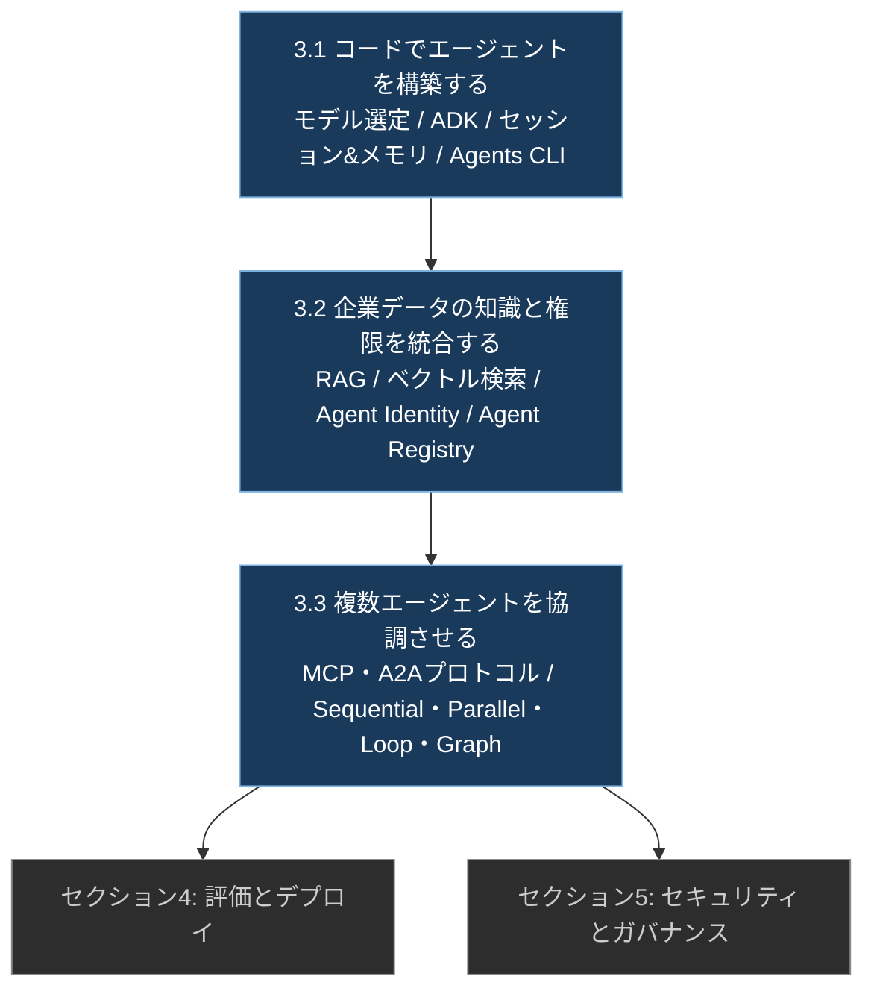

セクション3で扱う主要サービス・概念は次のとおりです(試験ガイドの「対象ツール」リストに準拠)[^1]。

- **Agent Development Kit (ADK)**
- **Agent Retrieval / Vector Search 1.0**
- **Agent Registry**
- **Agent Identity**
- **Agentic protocols(A2A、MCP)**
- **Agents CLI in Agent Platform**
- **Model Garden**
- **RAG Engine**
- **Skill Registry**
- **BigQuery、Cloud SQL、Cloud Storage、Firestore**(RAGやツール連携先としてのデータストア)

---

## 3.1 コードによるエージェントワークフローの設計と構築

出題文言(原文)は次のとおりです[^1]。

> 3.1 Designing and building agentic workflows in code. Considerations include:
> - Selecting and configuring the appropriate language model(LLM vs. SLM、self-hosted vs. SaaS、OSS vs. proprietary LLM)considering cost, security, and agent architecture
> - Building custom agents using open-source libraries(e.g., Agent Development Kit [ADK])
> - Configuring sessions and memory(e.g., Agent Platform Memory Bank and managed sessions)
> - Configuring skills using Agents CLI(e.g., plugins and agent vs. human mode)

### 3.1.1 言語モデルの選定基準

カスタムエージェントを構築する際、最初に決めるべきはどのモデルを土台に使うかです。試験では「コスト・セキュリティ・エージェントアーキテクチャ」の3つの観点から、以下の3つの軸でモデルを選定する能力が問われます。

#### 軸1: LLM vs. SLM(大規模言語モデル vs. 小規模言語モデル)

| 観点 | LLM(大規模言語モデル) | SLM(小規模言語モデル) |
| --- | --- | --- |
| パラメータ規模の目安 | 数百億〜数兆パラメータ級(Gemini、Claude Opus/Fable系など) | 数億〜十数B程度(Gemma、Gemini Nano系など) |
| 得意なタスク | オープンエンドな推論、複雑な多段階タスク、幅広い知識を要する対話 | 定型的・反復的・分類的なタスク、ツール呼び出し中心のエージェントループ |
| レイテンシ | 高め(数百ミリ秒〜数秒) | 低め(数十〜数百ミリ秒) |
| コスト | トークン単価が高い | トークン単価が低く高頻度呼び出しに向く |
| 実行環境 | 基本的にクラウド | エッジデバイス・オンデバイス・単一GPUでも稼働可能 |

エージェント設計の実務では、**「エージェントのループは基本的に少数の専門タスクを反復するだけ**」という性質から、ハイブリッド構成(定型作業はSLMに任せ、判断が難しいケースのみLLMにエスカレーションする)が主流のアーキテクチャパターンになっています[^2][^3]。この設計判断ができるかどうかは、コスト最適化とエージェントアーキテクチャ設計の両面で試験の評価対象になります。

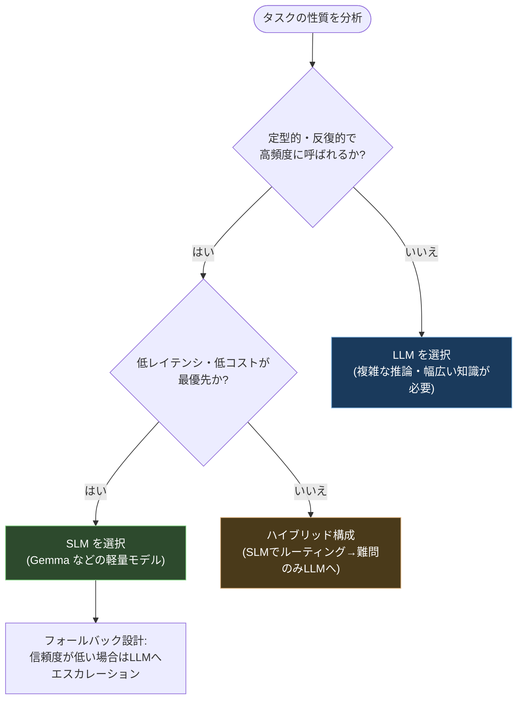

#### 軸2: self-hosted vs. SaaS(自己ホスト型 vs. マネージドサービス型)

Model Gardenでは、モデルの入手・運用方法として大きく2つの選択肢が用意されています[^4][^5]。

| 観点 | Model-as-a-Service (MaaS) | Self-deployed(自己デプロイ) |
| --- | --- | --- |
| 概要 | サーバーレスでデプロイ作業不要。トークン課金で即座に利用可能 | 自組織のGoogle CloudプロジェクトとVPCネットワーク内に、GPU/TPUを確保して自分でモデルをホスト |
| 対象モデル例 | Gemini、Claude(Anthropicのレート課金)、多くのオープンウェイトモデル | Gemma、Llama、Hugging Face上のモデル、パートナーのプロプライエタリモデル(Cloud Marketplace経由でライセンス購入) |
| インフラ管理 | 不要(Googleが管理) | 必要(オンデマンドハードウェアまたは既存のCompute Engine予約/確約利用割引を利用) |
| 適したケース | 迅速な立ち上げ、変動する需要、運用負荷を抑えたい場合 | データ主権・VPC内完結が必要な場合、細かいレイテンシ/スループット制御が必要な場合 |

Model Gardenには200以上の基盤モデルがGoogle・パートナー・オープンソースコミュニティから提供されており、探索・実験のための単一のカタログとして機能します[^5]。

#### 軸3: OSS vs. proprietary LLM(オープンソース vs. プロプライエタリ)

ここでの分類は「オープンウェイト」と「オープンソース」の違いを正しく理解しているかがポイントです[^4]。

- **オープンウェイトモデル**: 学習済みの重み(パラメータ)が公開されているモデル。推論やチューニングに利用できるが、学習データやアーキテクチャの詳細、学習コードまでは公開されていないことが多い(例: Gemma、多くのLlamaモデル)。
- **オープンソースモデル**: 重みに加えて、学習データ・学習コードを含むコードベース全体が公開されているモデル。透明性が最も高い。
- **プロプライエタリモデル**: 重みも学習詳細も非公開。API経由でのみ利用可能(例: Gemini、Claude、GPT系)。Model Garden経由でパートナーのプロプライエタリモデルをセルフデプロイ用にライセンス購入することも可能[^4]。

**ベストプラクティス**

- コスト・レイテンシ・プライバシー要件が厳しい高頻度タスクにはSLM、複雑な推論やオープンドメインの対話にはLLMという**ハイブリッドルーティング**を基本設計にする[^2][^3]。
- データを外部に出せない規制業種では、self-hosted(自己デプロイ)かつオープンウェイトモデルの組み合わせを優先的に検討する[^4]。
- モデル選定は一度きりの意思決定ではなく、Model Gardenのモデルカードで提供されるベンチマークやライセンス条件を継続的に確認し、評価セット(セクション4で扱うADK Evaluationなど)で比較検証する。
- ADKはGeminiに最適化されている一方でモデルに依存しない(model-agnostic)設計になっており、LiteLLM統合を介してAnthropic・Meta・Mistral AI・AI21 Labsなど多様なプロバイダのモデルを選択できる[^6]。この柔軟性を活かし、エージェントごとに最適なモデルを使い分けることが推奨される。

---

### 3.1.2 Agent Development Kit (ADK) によるカスタムエージェント構築

**ADKとは何か**

Agent Development Kit(ADK)は、AIエージェントの構築・デバッグ・デプロイを行うためのオープンソースかつモジュール式のフレームワークです[^7]。Gemini・Googleエコシステムに最適化されている一方でモデルに依存せず(model-agnostic)、デプロイ環境にも依存しない(deployment-agnostic)設計となっており、Python・TypeScript・Go・Javaの4言語でSDKが提供されています[^7][^6]。

ADKは元々2025年のGoogle Cloud NEXTで発表されたオープンソースフレームワークで、AgentspaceやGoogle Customer Engagement Suite(CES)など、Google自身のプロダクト内のエージェントを支える基盤としても使われています[^8]。

ADKが提供する主要な能力は次の3つに整理できます[^9][^8]。

1. **Multi-Agent by Design(マルチエージェント前提の設計)**: 複数の専門特化エージェントを階層構造に組み合わせて、モジュール化・スケーラブルなアプリケーションを構築できる。複雑な調整・委譲(delegation)を実現する。
2. **Rich Model Ecosystem(豊富なモデルエコシステム)**: Geminiに限らず、Vertex AI Model Garden経由でアクセス可能な任意のモデルを選択可能。LiteLLM統合によりAnthropic、Meta、Mistral AI、AI21 Labsなど多数のプロバイダのモデルを利用できる[^8]。
3. **Rich Tool Ecosystem(豊富なツールエコシステム)**: サードパーティアプリケーションや独自コードを統合するためのツールエコシステムを備え、組み込み評価ツールやパートナー評価ツールで実行トラジェクトリをテストできる[^9]。

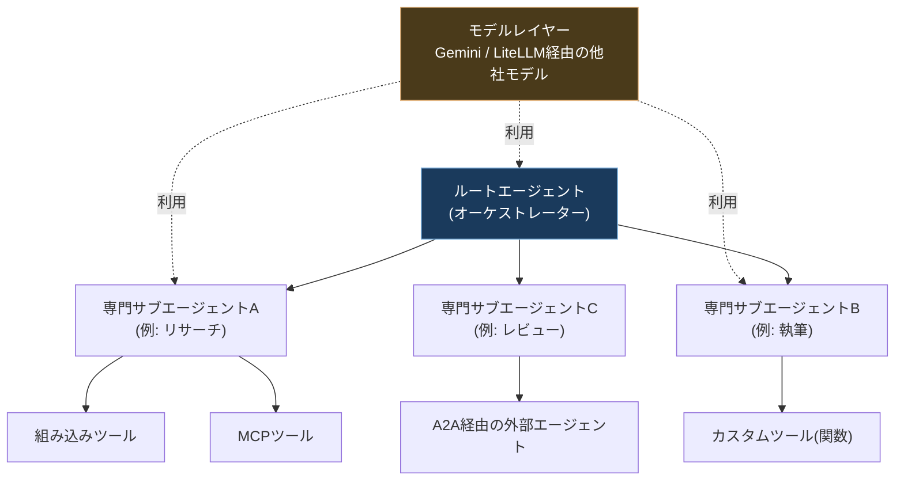

**ADKの開発ライフサイクル**

ADKは、エージェント開発ライフサイクル全体(構築→実行→評価→スケール)を一貫してサポートするよう設計されています[^9]。

1. ローカルでエージェントを構築し、ブラウザベースの開発UIまたはターミナルで対話的に実行してテストする[^10]。
2. ツール(組み込みツール、MCPツール、カスタム関数ツール)を追加する。
3. サブエージェントを追加し、オーケストレーター(親エージェント)またはA2Aプロトコル経由で連携させる。
4. セッションとメモリを構成する(3.1.3で詳述)。
5. 必要に応じてHuman-in-the-Loop(人間による承認)ワークフローを組み込む。
6. Webインターフェースやロガーでログ・デバッグを行う。
7. Web UIやCI/CDパイプラインで評価を実行する。
8. Agent Runtime、Cloud Run、GKEのいずれかにデプロイする[^9]。

**推奨されるデプロイ先**

Googleは、ADKエージェントのデプロイ先として**Agent Runtime**(旧Agent Engine)を推奨しています。Agent Runtimeは、ADKなどのフレームワークで構築されたAIエージェントのデプロイ・管理・スケーリングに特化したフルマネージドのGoogle Cloudサービスです[^7]。

**ベストプラクティス**

- 単一の巨大なエージェントに全ロジックを詰め込むのではなく、責務ごとにサブエージェントを分割し、ルートエージェントが委譲(delegation)する階層構造を基本とする[^9]。
- ローカル開発時はADKの対話型開発UI(ブラウザベース)を活用し、ツール呼び出しやエージェント間の委譲を可視化しながらデバッグする[^10]。
- モデル選定は3.1.1の基準に基づき、サブエージェントごとに異なるモデル(例: ルーターはSLM、専門タスクはLLM)を使い分けることも検討する。
- 本番デプロイでは自前でインフラを構築するのではなく、Agent Runtimeのマネージド機能(セッション管理・スケーリング・オブザーバビリティ統合)を活用する[^7]。

---

### 3.1.3 セッションとメモリの設定

エージェントが「今の会話の文脈」と「過去の会話をまたいだ記憶」の両方をどう扱うかは、実運用エージェントの品質を大きく左右します。Gemini Enterprise Agent Platformでは、この2つの役割が明確に分離された2つのマネージドサービスとして提供されています[^11][^12]。

| 機能 | Agent Platform Sessions | Agent Platform Memory Bank |
| --- | --- | --- |
| 役割 | 単一のエージェントとのやり取りにおける、状態データとコンテキストの管理 | 複数セッションをまたいだ永続的な記憶の保持と呼び出し |
| スコープ | 1回の継続的な会話(短期) | ユーザー(アイデンティティ)単位での長期記憶 |
| 中核概念 | **Session**(ユーザーとエージェント間の一連のやり取りの時系列記録)、**Event**(会話内容や関数呼び出しなどのアクションを格納する柔軟なスキーマ) | LLMによる知識抽出、パーソナライズされたメモリプロファイル |
| ADKとの統合 | ADKエージェントをAgent Platformにデプロイすると自動的にセッション管理される | セッション終了時に`add_session_to_memory`(ADK)または`GenerateMemories`/`IngestEvents` APIを明示的に呼び出すことで、セッションのイベント列を情報源にメモリが生成される(イベントが蓄積されるだけでは生成されない) |

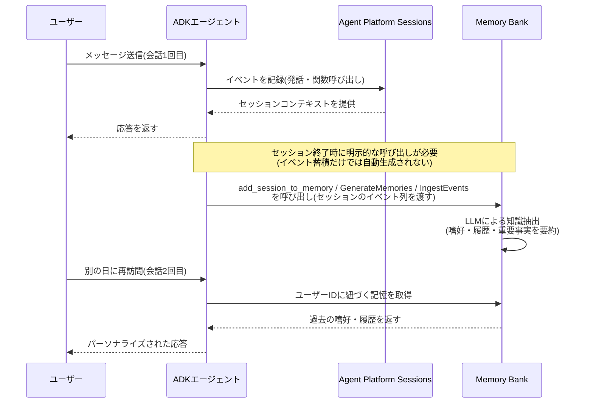

**Memory Bankの主な用途**[^12]

1. **長期パーソナライゼーション**: エージェントがユーザーの嗜好・履歴・重要な詳細を複数セッションにわたって記憶する。例: 過去の問い合わせ内容や製品の好みを覚えているカスタマーサービスエージェント。
2. **LLM駆動の知識抽出**: 会話やマルチモーダルコンテンツから重要な情報を自動的に特定・永続化する。例: 一連の技術論文を読み、主要な知見・手法・結論を統合したメモリを構築するリサーチエージェント。
3. **動的に進化するコンテキスト**: 静的でない知識源として、新しい情報を継続的に取り込む。

**リージョンとデータ所在に関する注意点**

Memory Bankはスコープベースのデータ分離(アイデンティティ単位)を提供しますが、リージョン間でのメモリ混在を防ぐには、RBAC(ロールベースアクセス制御)とIAMポリシーを併用して地理的境界を強制する必要があります[^12]。Memory Bankインスタンス作成時には、データが保存時にその地理的境界内に留まるよう、リージョンまたはマルチリージョンのロケーション(EU向けの`eu`、米国向けの`us`など)を選択します[^12]。2026年時点で、Memory BankとSessionsはマルチリージョンおよびグローバルエンドポイントに対応してGA(一般提供)となっていますが、グローバルエンドポイントを使う場合はCMEK(顧客管理暗号鍵)が利用できない点に注意が必要です[^13]。

**ベストプラクティス**

- 単一会話内の文脈保持にはSessions、複数回の利用をまたいだパーソナライズにはMemory Bankという役割分担を明確にし、両方を組み合わせて設計する[^11][^12]。
- ADKでデプロイする場合、セッション管理はインフラ層で自動的に統合されるため、独自のデータベース接続やベクトルストアをアプリケーションコードに実装する必要はない[^12]。
- コンプライアンス要件がある場合は、Memory Bankのリージョン選択とIAM/RBACによる越境防止策を必ずセットで設計する[^12]。
- Memory Bankへのアクセスは、IAM Conditionsを使ってきめ細かく制御できるため、テナント分離が必要なマルチテナントSaaS型エージェントでは特に活用する。

---

### 3.1.4 Agents CLIによるスキル設定

**Agents CLIとは**

Agents CLI(`google-agents-cli`)は、AIコーディングエージェント(Gemini CLI、Claude Code、Codex、Antigravityなど)向けに設計された専用ツールで、Google Cloudのエージェントスタック全体(Agent Platform、Cloud Run、A2A統合など)への直接的で機械可読なインターフェースを提供します[^14]。`uvx google-agents-cli setup`という1つのコマンドで、コーディングアシスタントに必要なスキルをまとめて注入できます[^14]。

セクション2で扱ったAntigravity固有のスキル・プラグイン・拡張フックとは異なり、Agents CLIのスキルはADKのライフサイクル全体(スキャフォールディング・評価・デプロイ・監視)を横断してどのコーディングエージェントからも呼び出せる**共通のコンテキストファイル**という位置づけです[^15]。

**バンドルされる7つのスキル**[^16][^15]

| スキル名 | コーディングエージェントが習得する内容 |
| --- | --- |
| `google-agents-cli-workflow` | 開発ライフサイクル全体、コード保全ルール、モデル選定の指針(常時アクティブ) |
| `google-agents-cli-adk-code` | ADKのPython API(エージェント種別、ツール定義、オーケストレーションパターン、コールバック、状態管理) |
| `google-agents-cli-scaffold` | プロジェクトの雛形作成(`scaffold create`、`scaffold enhance`、`scaffold upgrade`) |
| `google-agents-cli-eval` | 評価指標、evalsetのスキーマ、LLM-as-judge、ツールトラジェクトリのスコアリング |
| `google-agents-cli-deploy` | デプロイワークフロー(Agent Runtime、Cloud Run、GKE)、サービスアカウント、ロールバック |
| `google-agents-cli-publish` | ADK登録とA2A登録の使い分け、プログラマティック/対話的な公開手順 |
| `google-agents-cli-observability` | Cloud Trace、プロンプト・レスポンスログ、BigQuery Agent Analytics、サードパーティ連携(AgentOps、Phoenix、MLflowなど) |

このスキル群は、インストール先のコーディングエージェントが対応する形式(Claude Codeのプラグイン形式、Gemini CLIの拡張機能形式など)に変換されて配布されるため、試験ガイドが言う「**plugins**」は、Agents CLIのスキルが各コーディングエージェントのプラグイン/拡張の仕組みに載せて配布・注入される形態を指していると理解すると整合的です[^14][^15]。

**Agent Mode と Human Mode**

Agents CLIは、2つの利用モードを想定して設計されています[^14][^17]。

| モード | 概要 | 想定利用者 |
| --- | --- | --- |
| **Agent Mode** | バンドルされたスキルを介して、コーディングエージェント(Gemini CLI、Claude Codeなど)自身がCLIコマンドを判断・実行する。CLIはAIによる消費に最適化されている | AIコーディングアシスタント |
| **Human Mode** | 開発者がターミナルやスクリプトから同じコマンドを直接実行し、決定論的(deterministic)な制御を行う。いつでも「手と目」を自分で操作できる | 人間の開発者 |

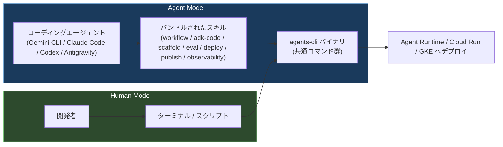

Human Modeは、AIに完全に委ねるのではなく、決定論的な実行が必要な場面(本番デプロイの最終承認、機密性の高い操作など)で開発者が直接介入できるようにするためのフォールバック経路として設計されています[^17]。

**ADK登録とA2A登録の使い分け(publishスキル)**

`google-agents-cli-publish`スキルは、ADK形式での登録とA2A形式での登録という2つの公開モードの使い分け、プログラマティック/対話的な利用方法、デプロイメタデータからの自動検出をカバーします[^16]。これは3.3で扱うマルチエージェント連携の土台となる知識です。

**ベストプラクティス**

- チーム全体でエージェント開発を標準化する場合、個々の開発者が手作業でCLIコマンドを覚えるのではなく、`agents-cli setup`でコーディングエージェントにスキルを注入し、Agent Modeでの半自動運用を基本にする[^14]。
- 本番デプロイやシークレットに関わる操作など、取り返しのつかない操作はHuman Modeで明示的に実行し、監査可能な形でログを残す[^17]。
- 前提条件(Python 3.11以上、`uv`、Node.js)を満たした上で、`uvx google-agents-cli setup`のほか`pipx`や`venv`+`pip`でもインストール可能であることを把握しておく[^16]。
- 既にgcloudで認証済みであれば、Agents CLIはApplication Default Credentialsを自動的に利用するため、追加の認証設定は基本的に不要[^16]。

---

## 3.2 エンタープライズドメイン知識の統合

出題文言(原文)は次のとおりです[^1]。

> 3.2 Integrating enterprise domain knowledge. Considerations include:
> - Designing, configuring, and managing retrieval-augmented generation (RAG) pipelines and vector retrieval systems(e.g., embedding models, similarity scoring, and reranking)using appropriate services such as vector databases(e.g., Vector Search and Agent Retrieval)
> - Configuring agent permissions(e.g., Agent Identity)
> - Using Google Cloud tools(e.g., Agent Registry, Google Cloud MCP Servers)to configure prebuilt and custom capabilities(e.g., custom integration layers for managed databases, API integrations, and MCP server that connects agents to third-party SaaS tools and remote servers)

### 3.2.1 RAGパイプラインとベクトル検索システムの設計

**RAG Engineとは**

RAG Engineは、Gemini Enterprise Agent Platformのコンポーネントの1つで、検索拡張生成(Retrieval-Augmented Generation, RAG)を実現するデータフレームワークです[^18]。LLMは組織固有の非公開データを理解できないという問題を、RAG Engineによって外部知識をLLMのコンテキストに追加することで解決し、ハルシネーションを減らしより正確な回答を可能にします[^18]。

**RAGパイプラインの6ステップ**

RAG Engineの中核概念は、処理順に次の6つです[^18]。

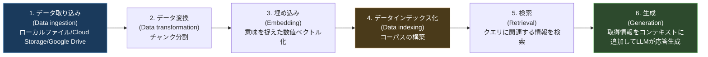

1. **データ取り込み(Data ingestion)**: ローカルファイル、Cloud Storage、Google Driveなど異なるデータソースからデータを取り込む。
2. **データ変換(Data transformation)**: インデックス化のためにデータをチャンク(小さな断片)に分割するなど、データを準備する。
3. **埋め込み(Embedding)**: 単語やテキストを数値表現に変換する。意味的に近いテキストは高次元ベクトル空間上で近い位置に配置される。
4. **データインデックス化(Data indexing)**: RAG Engineが「コーパス」と呼ばれるインデックスを作成する。検索に最適化された知識ベースの目次のような役割を果たす。
5. **検索(Retrieval)**: ユーザーの質問やプロンプトに対して、コーパスの中からクエリに関連する情報を検索する。
6. **生成(Generation)**: 検索された情報を元のユーザークエリに追加するコンテキストとして与え、生成AIモデルが事実に基づいた(grounded)関連性の高い応答を生成する。

**ベクトルデータベースの選択肢**

RAG Engineは複数のベクトルデータベースバックエンドをサポートしており、用途に応じて選択できます。公式ドキュメントの構成上、次のような選択肢が用意されています[^19]。

| バックエンド | 管理主体 | 特徴 |
| --- | --- | --- |
| RagManagedDb | Googleが完全管理 | 追加設定なしで始められるデフォルトの選択肢 |
| Agent Retrieval(旧Vector Search 2.0) | Googleが完全管理 | RAG Engineが裏側でCollectionsを管理し、プロジェクト内から直接アクセス可能 |
| Vector Search 1.0 | Googleが管理(ユーザーがインデックス設定) | 大規模なANN(近似最近傍)検索に実績があるインデックスサービス |
| Feature Store | ユーザー管理 | 既存のFeature Store資産を再利用したい場合 |
| Weaviate / Pinecone | サードパーティ | 既存のベクトルDB資産・エコシステムを活かしたい場合 |
| Agent Search(旧Vertex AI Search) | Googleが完全管理 | エンタープライズ検索機能と統合したい場合 |

**Vector Search 1.0 と Agent Retrieval(旧Vector Search 2.0)の違い**

試験対象ツールリストには「Agent Retrieval and Vector Search 1.0」として両方が明記されており、両者の違いを理解しておくことが重要です[^1][^20]。

| 観点 | Vector Search 1.0 | Agent Retrieval(旧Vector Search 2.0) |
| --- | --- | --- |
| 位置づけ | ANN(近似最近傍)インデックスをサービスとして提供する仕組み | ゼロから設計された、自己チューニング・フルマネージドのAIネイティブ検索エンジン |
| 管理単位 | インデックス(Index)が主要リソース | Collection(関連するJSONオブジェクトの集合)と、その中のData Object |
| 埋め込み生成 | 別途埋め込み生成が必要 | 組み込みモデルによる自動埋め込み生成、または独自の埋め込みを持ち込む(BYOE)ことも可能 |
| メタデータ格納 | 別途Vertex AI Feature Storeが必要な場合がある | データと埋め込みを1か所に統合格納(補助的なストレージ不要) |
| 検索方式 | ベクトル類似度検索が中心 | ベクトル類似度検索 + キーワード検索を組み合わせたハイブリッド検索(RRF: Reciprocal Rank Fusionで統合) |
| 料金体系 | インフラベース | 利用量ベース(小規模向け)とリソースベース(高チューニング向け)の2モデル |
| 移行 | — | 専用の移行ガイドが提供されている[^21] |

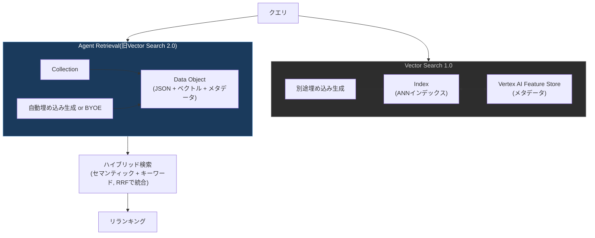

**リランキング(Reranking)**

検索精度をさらに高めるため、RAG Engineは2種類のリランカーを提供しています[^22]。

| リランカー | 概要 | レイテンシ | 精度 | 料金 |
| --- | --- | --- | --- | --- |
| Agent Platform ranking API | 高精度な関連度スコアリングに特化した、低レイテンシのスタンドアロン・セマンティックリランカー | 非常に低い(100ミリ秒未満) | 最先端(state-of-the-art)レベル | RAG Engineのリクエスト単位課金 |
| LLM reranker | Geminiへの追加呼び出しによってチャンクとクエリの関連性を評価する | 高め(1〜2秒) | モデル依存 | LLMのトークン課金 |

Agent Platform ranking APIを利用するにはDiscovery Engine APIを有効化する必要があり、`RagRetrievalConfig`の`ranking.rank_service.model_name`にモデル名(例: `semantic-ranker-default@latest`)を指定します。LLM rerankerを使う場合はGeminiモデルのみサポートされ、`ranking.llm_ranker.model_name`にモデル名を指定します[^22]。

**ベストプラクティス**

- 低レイテンシが要求されるリアルタイムのエージェント応答には、Agent Platform ranking APIを優先する。高精度だが多少のレイテンシが許容される場合や、より柔軟な関連性判断ロジックが必要な場合にLLM rerankerを検討する[^22]。
- 新規プロジェクトでは、補助ストレージ不要で自動埋め込み生成・ハイブリッド検索を備えるAgent Retrievalを第一候補とし、既存のVector Search 1.0資産がある場合は移行ガイドに沿って段階的に移行する[^21][^20]。
- ベクトルデータベースの選定は「管理コストを最小化したいか」「既存資産(Weaviate/Pinecone等)を活かしたいか」で判断し、RagManagedDbまたはAgent RetrievalをRAG Engineのデフォルトの選択肢とする[^19]。
- チャンク分割(データ変換)の粒度は、埋め込みモデルのコンテキスト長や検索精度に直結するため、ドキュメントの構造(見出し・段落)に沿ったチャンク戦略を検討する。

---

### 3.2.2 エージェント権限の設定(Agent Identity)

**Agent Identityとは**

Agent Identityは、各エージェントに完全マネージドなユニークアイデンティティを付与し、セキュアなアクセス制御と監査を可能にする仕組みです[^23]。IAM、Principal Access Boundary(PAB)、VPC Service Controlsといった Google のポリシーシステムと完全に統合されています[^23]。

**アイデンティティの割り当てフロー**

Agent Identityは次のワークフローで認証・認可を行います[^23]。

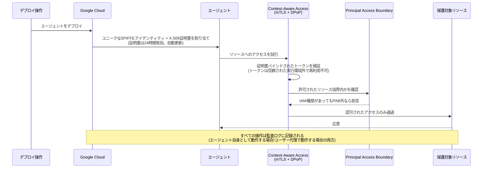

**Agent Identityの主要機能**[^23]

| 機能 | 内容 |
| --- | --- |
| Context-Aware Access | デフォルトでGoogle管理のポリシーがmTLSとDPoPトークンバインディングを強制し、証明書バインドされたトークンが信頼された実行環境の外で再利用されるのを防ぐ |
| IAM統合 | 標準的なIAMのAllowポリシー・Denyポリシーをサポート |
| Principal Access Boundary(PAB) | 他の権限に関わらず、エージェントがアクセスできるリソースを制限する |
| VPC Service Controls統合 | サービス境界の保護と、境界のingress/egressルールにおけるプリンシパルとしてのエージェントアイデンティティ利用をサポート |
| 監査ログ統合 | エージェントが「自分自身として」動作する場合と「エンドユーザーの代理として」動作する場合の両方で、説明責任を果たせる明確な監査ログを提供 |

**Principal Access Boundary(PAB)の位置づけ**

PABは「アイデンティティのファイアウォール」に例えられる仕組みで、IAMとVPC Service Controlsが埋めきれなかったギャップ、すなわち「アイデンティティそのものの適格性(eligibility)の制御」に対応します[^24][^25]。

- **黄金律**: あるアイデンティティが正しいIAM権限を付与されていたとしても、そのアイデンティティが認可された境界の外から来ている場合、PABはアクセスをブロックします[^25]。
- PABポリシーは組織・フォルダ・プロジェクトといったリソースコンテナに対して境界ルールとして定義し、特定のプリンシパルセット(プロジェクト単位・フォルダ単位・組織単位・ワークフォースプール単位・ワークロードプール単位など)に紐付けます[^25]。
- 2026年時点で、Agent IdentityのIAM Allow/Denyポリシーは一般提供(GA)、PABはプレビュー、Unified Access Policy(UAP)は近日提供予定という位置づけです[^26]。

```json
// PABポリシー例: エージェントが特定フォルダ内のリソースにのみアクセス可能にする
{
  "name": "organizations/ORGANIZATION_ID/locations/global/principalAccessBoundaryPolicies/example-policy",
  "details": {
    "rules": [
      {
        "description": "Restrict agent identity inside a folder",
        "resources": [
          "//cloudresourcemanager.googleapis.com/folder/0123456789012"
        ],
        "effect": "ALLOW"
      }
    ]
  }
}
```

このポリシーをバインドするには、次のようなコマンドを使用します[^27]。

```bash
gcloud iam principal-access-boundary-policies bindings create example-pab-binding \
  --organization=organizations/ORGANIZATION_ID \
  --policy=example-policy \
  --target-principal-set=cloudresourcemanager.googleapis.com/organizations/ORGANIZATION_ID
```

**プリンシパル識別子のフォーマット**

Agent IdentityをIAM Allowポリシーで使用する場合、プリンシパル識別子は次の形式に従います[^24]。

```
principal://TRUST_DOMAIN/resources/SERVICE/RESOURCE_PATH
```

例えば、Agent Runtime上のエージェントは次のような識別子になります[^24]。

```
principal://agents.global.org-123456789012.system.id.goog/resources/aiplatform/projects/9876543210/locations/us-central1/reasoningEngines/my-test-agent
```

**ベストプラクティス**

- IAM権限だけに頼らず、PABを組み合わせて「万一過剰な権限が付与されてもアクセスできる範囲を物理的に制限する」多層防御を設計する[^25]。
- 本番投入前には、PABポリシーやAgent Gatewayのアクセスポリシーをドライランモード(`DRY_RUN`)でステージング環境に適用し、意図通りに機能するかをCloud Audit Logsで確認してから強制モードに切り替える[^28]。
- エージェントが「自分自身として」動作するケースと「エンドユーザーの代理として」動作するケースを設計段階で区別し、それぞれに適した監査ログの粒度を確保する[^23]。
- Agent Identityはエージェント自身の権限を表すものであり、これだけでユーザーの代理(on behalf of user)アクセスが保証されるわけではない。ユーザーの代理でサードパーティサービスにアクセスする場合は、3-legged OAuthによるユーザー同意の取得、委任トークン(アクセストークン／リフレッシュトークン)の取得、下流サービス側でのそのトークンの検証をあわせて設計する。取得したクライアントシークレットやリフレッシュトークンはSecret Managerに保管し、ローテーションを含めて安全に管理する[^29]。

---

### 3.2.3 Google Cloudツールによる事前構築・カスタム機能の設定

**Agent Registryとは**

Agent Registryは、Model Context Protocol(MCP)サーバー、ツール、スタンドアロンスキル、AIエージェントを組織内で一元的に保存・検出・統制するための集中カタログです[^30]。Gemini Enterprise Agent Platformにおけるガバナンス層(governance pillar)と、エージェント・サーバー・スキル・エンドポイントの統合インベントリという位置づけです[^30]。

Agent Registryが解決する課題は、断片化したツールアクセス、孤立したデータ、重複した実装といった、複雑なAIデプロイにありがちな問題です[^30]。

**データモデル**

Agent Registry APIは次のリソースを管理します[^30][^31]。

| リソース | 説明 |
| --- | --- |
| Agent | 特定のスキルを持つ自律的なアクター。A2A Agent Cardから抽出されたスキルが発見の主要な手がかりとなる |
| McpServer | 標準化されたデータリソースとツールを提供するプロバイダ |
| Endpoint | エージェントがアクセスする対象URL(通常REST API) |
| Skill | エージェントの高レベルな能力を表す |
| SkillRevision | スキルのバージョン管理単位 |
| Publisher | エージェント・スキルの発行元 |

**自動登録 vs. 手動登録**

Agent Registryは2つの登録方式をサポートします[^32]。

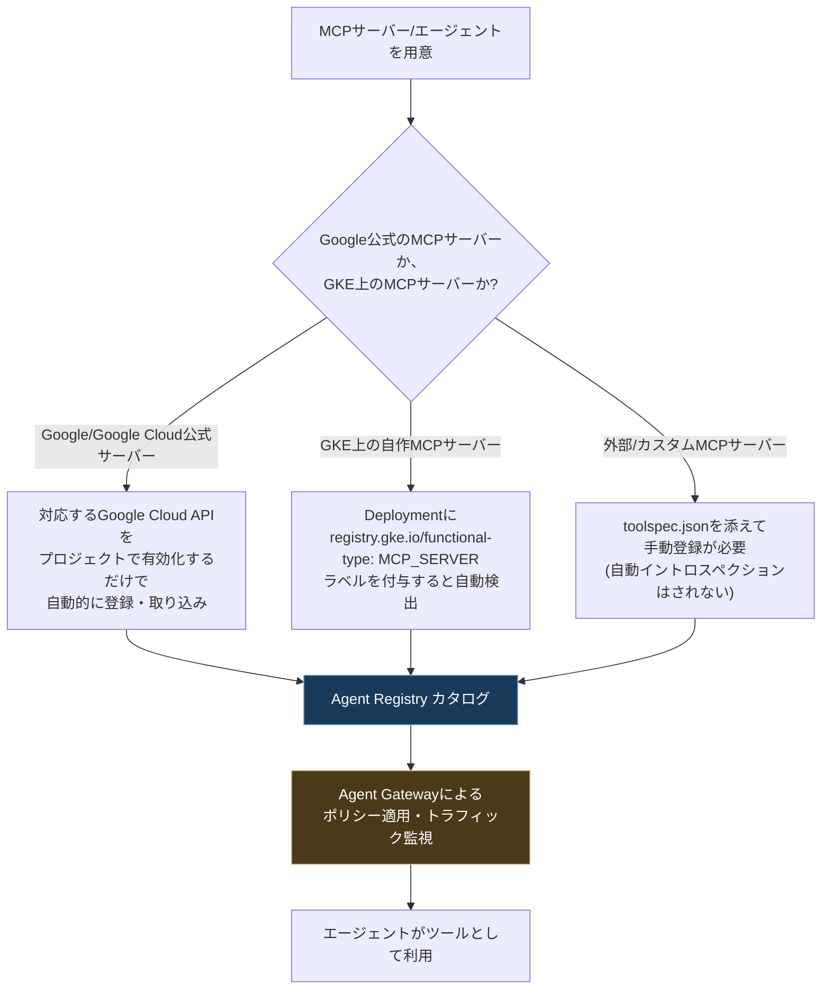

- **自動検出**: Google・Google Cloudの公式リモートMCPサーバーは自動的に登録・取り込みされます。対応するGoogle Cloud API(例: Compute Engine API)をプロジェクトで有効化するだけで、対応するMCPサーバーとそのツールが即座に登録され、Agent Registryで発見可能になります[^32]。GKE上のカスタムMCPサーバーも、Deploymentマニフェストに`registry.gke.io/functional-type: "MCP_SERVER"`ラベルとエンドポイント/機能を宣言するアノテーションを付与することで、自動的にイントロスペクションされ登録されます[^32]。
- **手動登録**: 外部サーバーやカスタムAPIが提供するツールを管理・再利用したい場合は、明示的にMCPサーバーを登録する必要があります。手動登録の場合、Agent Registryはエンドポイントを登録しますが自動でツールをイントロスペクションしないため、`toolspec.json`ファイルをアップロードしてツール仕様を提供する必要があります[^32]。

**Google Cloud MCP Servers**

Googleは複数のGoogle Cloudサービスに対して公式のリモートMCPサーバーを提供しており、これらは有効化するだけでAgent Registryに自動登録されます。主要なものは次のとおりです[^33]。

| カテゴリ | 提供されるMCPサーバー例 |
| --- | --- |
| データベース | AlloyDB for PostgreSQL、BigQuery、Bigtable、Cloud SQL(MySQL/PostgreSQL/SQL Server)、Firestore、Spanner |
| コンピュート/インフラ | Compute Engine(GCE)、Google Kubernetes Engine(GKE)、Cloud Run、Cloud Resource Manager |
| ストレージ | Cloud Storage |
| セキュリティ | Google Security Operations(Chronicle) |
| その他 | Google Maps(Grounding Lite)、Developer Knowledge API |

これらに加え、ローカル実行またはCloud Runへのデプロイが可能なオープンソースのMCPサーバー(Google Workspace、Firebase、MCP Toolbox for Databases、Google Cloud Security関連、gcloud CLI連携など)も用意されています[^33]。

**MCP経由でのツールディスカバリ**

MCPクライアントは`tools/list`メソッドを使ってMCPサーバーが提供するツールとその説明を取得できます。Google Cloudのリモート MCP サーバーでは、`tools/list`メソッド自体に認証は不要です[^34]。ただしこれは Google Cloud のリモート MCP サーバーに限った挙動であり、カスタム実装やサードパーティの MCP サーバーではトランスポート層での認証が必要な場合があります。ツール呼び出し時の認証要件もサーバーごとに異なるため、接続先ごとに確認してください。

```
POST /TOOLSET_ENDPOINT HTTP/1.1
Host: SERVICE_NAME
Content-Type: application/json

{
  "jsonrpc": "2.0",
  "method": "tools/list"
}
```

**ベストプラクティス**

- 標準化されたGoogle CloudサービスへのアクセスにはGoogle公式のMCPサーバーを最優先で使い、独自にAPIラッパーを書かないようにする。API有効化だけでAgent Registryに自動登録される利点を活かす[^32][^33]。
- カスタムAPIやサードパーティSaaSツールを社内で再利用可能にするには、Agent Registryへの手動登録(`toolspec.json`)を通じてカタログ化し、車輪の再発明(重複実装)を防ぐ[^32]。
- Agent Registryは「カタログ」であり、ポリシー執行(enforcement)はAgent Gatewayが担う、という役割分担を理解する。ツールへのアクセス制御はIAMポリシーとAgent Gatewayを併用して行う[^35]。
- 高度なBigQuery操作(スケジューリング、権限管理、予約管理など)にはBigQuery MCPサーバー単体ではなく、Cloud CLI MCPサーバー配下の`run_bq_command`ツールを使う必要がある点に注意する[^36]。

---

## 3.3 エージェントワークフローのオーケストレーションと調整

出題文言(原文)は次のとおりです[^1]。

> 3.3 Orchestrating and coordinating agentic workflows. Considerations include:
> - Orchestrating agents using agentic protocols(e.g., MCP and Agent2Agent [A2A])
> - Selecting and coordinating multiagent handoffs and workflows(e.g., parallel agents, sequential agents, and graph workflow)using Google Cloud tools(e.g., Agent Identity, Agent Registry, Agent Runtime, and agent policies)

### 3.3.1 エージェントプロトコルによるオーケストレーション

**MCPとA2Aの役割分担**

マルチエージェントシステムを構築する上で押さえるべき最重要ポイントは、**MCPとA2Aは競合する技術ではなく、補完関係にある**という点です。

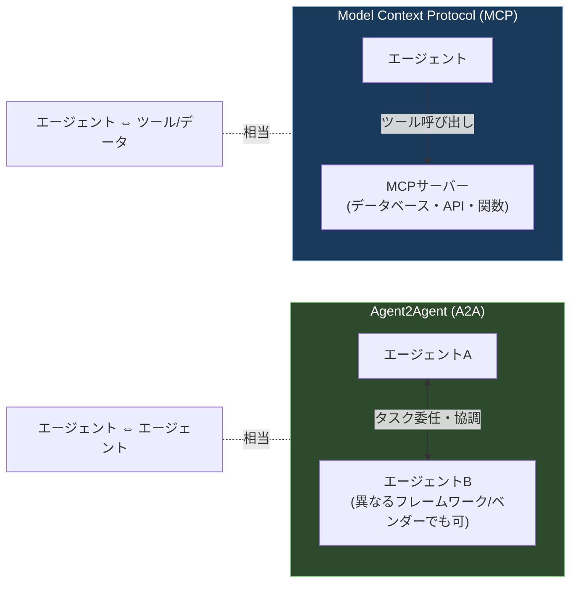

- **MCP(Model Context Protocol)**: エージェントとツール・データソースの間の接続を標準化するプロトコル。3.2.3で解説したGoogle Cloud MCP Serversがその実装例です。
- **A2A(Agent2Agent)**: 異なるビルダー・プラットフォームで構築されたエージェント同士が、互いを発見し、協調し、安全にタスクを委任し合うための、エージェント間コミュニケーションを標準化するオープンプロトコルです[^37]。

**A2Aプロトコルの技術的特徴**

A2Aは2025年4月のGoogle Cloud NEXTで発表されたオープン標準で、50以上のパートナーの協力のもとApache 2.0ライセンスでオープンソース化され、現在はLinux Foundationがガバナンスを担っています[^38][^39]。

| 特徴 | 内容 |
| --- | --- |
| トランスポート | HTTP、Server-Sent Events(SSE)、JSON-RPC 2.0(v0.3以降はgRPCもサポート)[^39][^40] |
| Agent Card | `/.well-known/agent-card.json`で公開される、エージェントの身元と能力を宣伝する機械可読なJSONメタデータ(いわば「エージェントの名刺」)[^41] |
| モダリティ | テキスト・ファイル・フォーム・ストリームに対応(モダリティ非依存) |
| 実行の不透明性 | エージェントは内部ロジックや状態を公開せずに相互作用できる(opaque execution) |
| セキュリティ | v0.3でセキュリティカードの署名機能、Python SDKのクライアント側サポート拡張が追加[^39] |

**A2Aのタスクライフサイクル**

A2Aプロトコルにおけるタスクは、次の状態遷移を経て進行します[^40]。

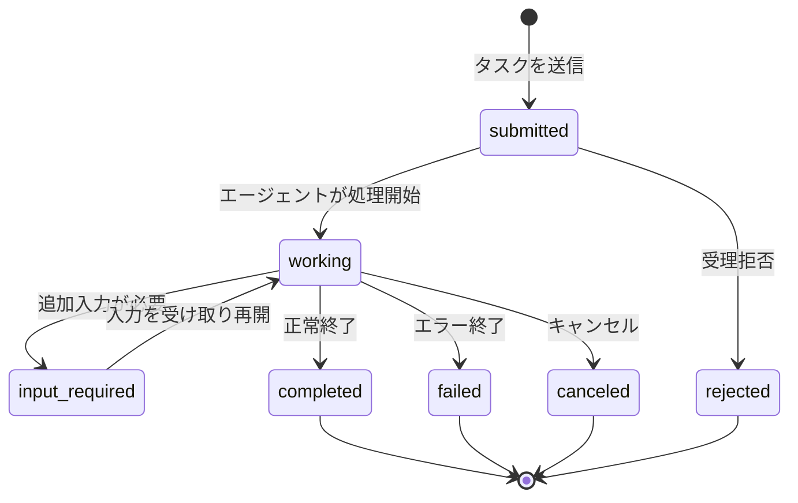

**Google CloudにおけるA2Aエージェントの登録・実行**

Gemini Enterpriseでは、A2Aエージェントを「Custom agent via A2A」として登録でき、Agent Cardの内容をJSON形式で入力します[^37]。Cloud Run上でA2Aエージェントをホストする場合、サービング・オーケストレーション層(Cloud Run)がGeminiやVertex AIなどのAIモデル、AlloyDBやA2A TaskStoreなどのメモリストレージ、APIを介した外部ツールとのやり取りを管理します[^42]。

**ベストプラクティス**

- エージェントとツール・データの接続にはMCP、エージェント同士の協調・タスク委任にはA2Aという役割分担を明確にし、両方を組み合わせてアーキテクチャを設計する。
- 異なるベンダー・フレームワーク(LangGraph、BeeAIなど)のエージェントと連携する必要がある場合は、A2A準拠のサーバー/クライアントとして公開することで統合コストをO(N²)からO(N)に近づけられる[^43]。
- A2Aエージェントを登録する際は、Agent2Agent Protocol公式仕様に記載されたAgent Cardの必須フィールドを確認し、バージョン(0.3または1.0)の互換性をAgent Registry側の対応状況と照合する[^31][^37]。
- ADKで構築した既存エージェントは、A2Aサーバーとして公開する、あるいはA2Aエージェントをサブエージェントとして取り込むことで、双方向にA2Aエコシステムへ組み込むことができる[^44]。

---

### 3.3.2 マルチエージェントのハンドオフとワークフローの調整

**ADKのワークフローエージェント4パターン**

ADKは、複数のサブエージェントをどのような制御構造で実行するかに応じて、複数の「ワークフローエージェント」を提供しています。これは、サブエージェントを関数のように扱い、ワークフローエージェントがプログラミング言語の制御構文のようにオーケストレーションする、という考え方に基づいています[^45]。

| パターン | 概要 | 適したユースケース |
| --- | --- | --- |
| **SequentialAgent** | サブエージェントを定義順に1つずつ実行する、最も基本的なワークフローエージェント[^46] | 明確な依存関係のある処理チェーン(例: アウトライン作成→執筆→ファクトチェック) |
| **ParallelAgent** | 複数のサブエージェントを同時(並行)に実行する[^47] | 独立したサブタスクに分割できる処理(例: 複数の観点からの並行リサーチ)。「fan out and gather」パターンとしてよく使われる |
| **LoopAgent** | 一連のサブエージェントを、指定した最大反復回数まで繰り返し実行する[^46] | 批評→修正のような反復的な自己改善プロセス |
| **グラフベースワークフロー(Graph)** | 有向グラフとして条件分岐・ループ・任意のDAGトポロジーを表現する、より汎用的なワークフロー。グラフAPIでは`NewFunctionNode`・`NewAgentNode`・`NewDynamicNode`などでノードを構成する[^48][^49] | 条件付き分岐、人間の承認ゲート、チェックポイントからの再開が必要な複雑な本番ワークフロー |

これら3つの基本パターン(Sequential/Parallel/Loop)で表現しきれない複雑な依存関係や条件分岐が必要な場合、ADKは静的なグラフでは表現しづらい制御フロー向けに**CustomAgent**(独自ロジックの実装)や、ループ・条件分岐・再帰をコードで直接組み立てる**動的ワークフロー**という選択肢も提供しています[^49][^50]。

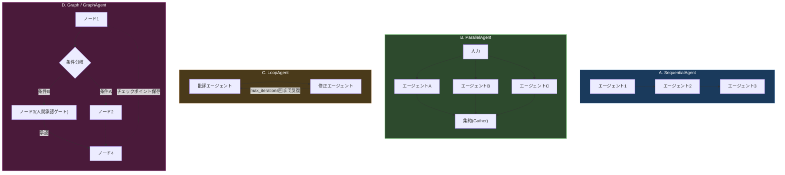

**組み合わせパターンの実例**

実務では、これら4パターンを入れ子(ネスト)にして組み合わせるのが一般的です。例えば、コンテンツパイプラインを構築する場合、次のように各フェーズごとに最適なパターンを選び、それら全体を`SequentialAgent`で束ねます[^47]。

```python
# 1. リサーチフェーズ(並行)
research_sources = ParallelAgent(
    sub_agents=[web_research_agent, academic_search_agent, social_media_monitor]
)

# 2. コンテンツ生成フェーズ(順次)
content_creation = SequentialAgent(
    sub_agents=[outline_writer, draft_writer, fact_checker]
)

# 3. レビュー・編集フェーズ(反復)
editing_cycle = LoopAgent(
    sub_agents=[editor_agent, proofreader_agent, final_reviewer],
    max_iterations=3
)

# 4. 公開フェーズ(順次)
publication_pipeline = SequentialAgent(
    sub_agents=[seo_optimizer, formatter_agent, publisher_agent]
)

# 全体を統合する最上位のSequentialAgent
content_workflow = SequentialAgent(
    sub_agents=[research_sources, content_creation, editing_cycle, publication_pipeline]
)
```

**パターン選定の判断基準**

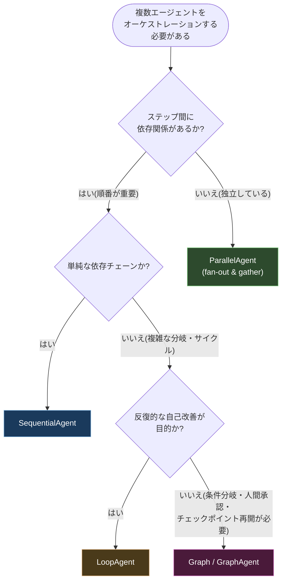

**Google Cloudツールによるマルチエージェントの統制**

試験ガイドは、マルチエージェントのハンドオフ・ワークフローの選定だけでなく、それを**Agent Identity、Agent Registry、Agent Runtime、agent policiesというGoogle Cloudツールを使って調整する**ことも問うています[^1]。ここまでに解説した内容を統合すると、次のような全体アーキテクチャになります。

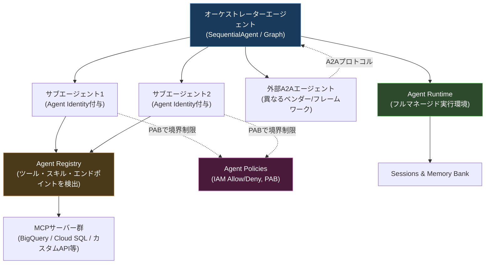

- **Agent Identity**: 個々のサブエージェントおよびオーケストレーター自身に固有のアイデンティティを付与し、エージェント間のやり取りもIAMポリシー・PABで境界を統制する(3.2.2参照)。
- **Agent Registry**: マルチエージェントシステムが利用するMCPサーバー・ツール・他のA2Aエージェントのスキルを一元的に検出・管理する(3.2.3参照)。
- **Agent Runtime**: オーケストレーターおよびサブエージェント群のフルマネージドな実行基盤として、セッション管理・スケーリング・オブザーバビリティを統合的に提供する(3.1.2参照)。
- **Agent policies**: IAM Access Policies、Semantic Governance Policiesなどを通じて、エージェント間通信やツール実行に対するガバナンスルールを適用する。

**ベストプラクティス**

- 4つのワークフローパターン(Sequential/Parallel/Loop/Graph)は互いに排他的ではなく、ネストして組み合わせるのが実務上の標準パターンであると理解する[^47]。
- 依存関係がなく独立して実行できるタスクは積極的にParallelAgentで並列化し、レイテンシを削減する(fan-out & gatherパターン)[^47]。
- 単純な3パターン(Sequential/Parallel/Loop)で表現できない条件分岐・人間承認・障害からの復旧が必要な本番ワークフローには、Graphベースのオーケストレーションを検討する[^48][^49]。
- マルチエージェントシステムのセキュリティは個々のエージェント単位で閉じず、Agent Identity・Agent Registry・Agent Runtime・agent policiesを横断して一貫したガバナンスを設計する(セクション5で詳述)。

---

## セクション3 全体アーキテクチャ

3.1〜3.3で解説した要素をすべて1つの図に統合すると、次のようになります。

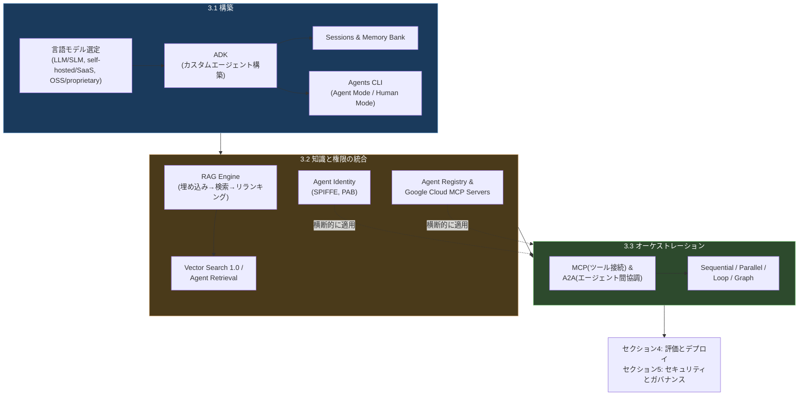

---

## 試験対象ツール一覧(セクション3関連)

公式試験ガイドに明記されている「試験対象ツール」のうち、セクション3で直接扱ったものを整理します[^1]。

| ツール名 | 本記事での主な解説箇所 |
| --- | --- |
| Agent Development Kit (ADK) | 3.1.2 |
| Agent Identity | 3.2.2 |
| Agent Registry | 3.2.3、3.3.2 |
| Agent Retrieval and Vector Search 1.0 | 3.2.1 |
| Agent Runtime(formerly Agent Engine) | 3.1.2、3.3.2 |
| Agentic protocols(A2A, MCP) | 3.3.1 |
| Agents CLI in Agent Platform | 3.1.4 |
| BigQuery / Cloud SQL / Cloud Storage / Firestore | 3.2.3(データ連携先・MCPサーバー対象) |
| Model Context Protocol (MCP) servers | 3.2.3、3.3.1 |
| Model Garden | 3.1.1 |
| RAG Engine | 3.2.1 |
| Skill Registry | 3.1.4 |

---

## ベストプラクティス総まとめ

| 領域 | ベストプラクティス |
| --- | --- |
| モデル選定 | 高頻度・定型タスクはSLM、複雑な推論はLLMというハイブリッドルーティングを基本とする[^2][^3] |
| ADK設計 | 単一の巨大エージェントを避け、責務ごとにサブエージェントを分割した階層構造にする[^9] |
| セッション/メモリ | 短期文脈はSessions、長期パーソナライズはMemory Bankと役割を分離し、リージョン境界をIAM/RBACで補強する[^12] |
| Agents CLI | 日常的な開発はAgent Mode、本番デプロイ承認などの重要操作はHuman Modeで実施する[^17] |
| RAG設計 | 低レイテンシが必要ならAgent Platform ranking API、精度重視ならLLM rerankerを使い分ける[^22] |
| ベクトルDB選定 | 新規はAgent Retrieval(自動埋め込み・ハイブリッド検索・単一ストレージ)を第一候補にする[^20] |
| 権限設計 | IAMだけに頼らずPABを併用し、過剰権限が付与されてもアクセス範囲を物理的に制限する[^25] |
| ツール統合 | Google公式MCPサーバーを優先利用し、カスタムツールはAgent Registryに手動登録してカタログ化する[^32] |
| プロトコル選択 | エージェント⇔ツールはMCP、エージェント⇔エージェントはA2Aという役割分担を徹底する |
| オーケストレーション | Sequential/Parallel/Loop/Graphをネストして組み合わせ、独立タスクは積極的に並列化する[^47] |
| ガバナンス | Agent Identity・Agent Registry・Agent Runtime・agent policiesを横断した一貫した統制を設計する |

---

## 学習チェックリスト

- [ ] LLM/SLM、self-hosted/SaaS、OSS/proprietaryという3つの軸でモデル選定の判断ができる
- [ ] ADKのマルチエージェント階層構造(ルートエージェント・サブエージェント・ツール)を説明できる
- [ ] ADKがPython/TypeScript/Go/Javaで提供され、model-agnostic・deployment-agnosticであることを理解している
- [ ] Sessions(短期・単一会話)とMemory Bank(長期・複数セッション横断)の役割の違いを説明できる
- [ ] Memory Bankのリージョン選択とIAM/RBACによる越境防止の必要性を理解している
- [ ] Agents CLIのAgent ModeとHuman Modeの違い、および7つのバンドルスキルの概要を説明できる
- [ ] RAGパイプラインの6ステップ(取り込み→変換→埋め込み→インデックス化→検索→生成)を説明できる
- [ ] Vector Search 1.0とAgent Retrieval(旧Vector Search 2.0)の違い(Index vs Collection/Data Object、自動埋め込み、ハイブリッド検索)を説明できる
- [ ] Agent Platform ranking APIとLLM rerankerのレイテンシ・精度・料金のトレードオフを説明できる
- [ ] Agent Identityの認証フロー(SPIFFEアイデンティティ、X.509証明書、Context-Aware Access)を説明できる
- [ ] Principal Access Boundary(PAB)がIAM権限とは独立した「境界」であることを理解している
- [ ] Agent Registryが管理するリソース(Agent/McpServer/Endpoint/Skill/Publisher)と自動登録・手動登録の違いを説明できる
- [ ] MCPとA2Aの役割分担(ツール接続 vs エージェント間協調)を説明できる
- [ ] A2Aのタスクライフサイクル(submitted→working→completed/failed/canceled/rejected)を説明できる
- [ ] SequentialAgent、ParallelAgent、LoopAgent、Graph/GraphAgentの使い分けとネストによる組み合わせパターンを説明できる
- [ ] マルチエージェントシステムの統制にAgent Identity、Agent Registry、Agent Runtime、agent policiesがどう関わるかを説明できる

---

## 参考文献

[^1]: Google Cloud, "Professional Agentic Architect Certification exam guide" (PDF), https://services.google.com/fh/files/misc/professional_agentic_architect_exam_guide_english.pdf
[^2]: Futureagi, "SLM vs LLM in 2026: Cost, Latency, and Quality Compared", https://futureagi.com/blog/comparison-slm-llm-language-models/
[^3]: Futureagi, "Small Language Models for Agentic AI in 2026: SLM Lineup + Build Guide", https://futureagi.com/blog/small-language-models-agentic-ai-2025/
[^4]: Google Cloud Documentation, "Overview of self-deployed models", https://docs.cloud.google.com/vertex-ai/generative-ai/docs/model-garden/self-deployed-models
[^5]: Google Cloud Documentation, "Overview of Model Garden", https://docs.cloud.google.com/vertex-ai/generative-ai/docs/model-garden/explore-models
[^6]: Google Developers Blog, "Agent Development Kit: Making it easy to build multi-agent applications", https://developers.googleblog.com/en/agent-development-kit-easy-to-build-multi-agent-applications/
[^7]: Google Cloud Documentation, "Overview of Agent Development Kit", https://cloud.google.com/agent-builder/agent-development-kit/overview
[^8]: Google Developers Blog, "Agent Development Kit: Making it easy to build multi-agent applications"(モデルエコシステムに関する記述), https://developers.googleblog.com/en/agent-development-kit-easy-to-build-multi-agent-applications/
[^9]: Google Cloud Documentation, "Agent Development Kit | Gemini Enterprise Agent Platform", https://docs.cloud.google.com/gemini-enterprise-agent-platform/build/adk
[^10]: Google Cloud Documentation, "Overview of Agent Development Kit"(クイックスタートに関する記述), https://cloud.google.com/agent-builder/agent-development-kit/overview
[^11]: Google Cloud Documentation, "Agent Platform Sessions overview", https://docs.cloud.google.com/gemini-enterprise-agent-platform/scale/sessions
[^12]: Google Cloud Documentation, "Agent Platform Memory Bank", https://docs.cloud.google.com/gemini-enterprise-agent-platform/scale/memory-bank
[^13]: Google Cloud Documentation, "Gemini Enterprise Agent Platform release notes", https://docs.cloud.google.com/gemini-enterprise-agent-platform/release-notes
[^14]: Google Developers Blog, "Agents CLI in Agent Platform: create to production in one CLI", https://developers.googleblog.com/agents-cli-in-agent-platform-create-to-production-in-one-cli/
[^15]: Google, "Agents CLI Skills Reference", https://google.github.io/agents-cli/reference/skills/
[^16]: Google, "Agents CLI Getting Started", https://google.github.io/agents-cli/guide/getting-started/
[^17]: Bala's Blog, "Google Cloud Agents CLI: From Prototype to Production in One Command", https://blog.balakumar.dev/2026/05/31/google-cloud-agents-cli-from-prototype-to-production-in-one-command/
[^18]: Google Cloud Documentation, "RAG Engine on Gemini Enterprise Agent Platform overview", https://docs.cloud.google.com/gemini-enterprise-agent-platform/build/rag-engine/rag-overview
[^19]: Google Cloud Documentation, "Agent Development Kit"(RAG Engineナビゲーション中のVector database choices構成), https://docs.cloud.google.com/gemini-enterprise-agent-platform/build/adk
[^20]: Google Cloud Documentation, "Agent Retrieval (formerly Vector Search 2.0) overview", https://docs.cloud.google.com/gemini-enterprise-agent-platform/build/vector-search-2/overview
[^21]: Google Cloud Documentation, "Migrate from Vector Search 1.0", https://docs.cloud.google.com/gemini-enterprise-agent-platform/build/vector-search-2/migration-from-vs-1_0
[^22]: Google Cloud Documentation, "Reranking for RAG Engine on Gemini Enterprise Agent Platform", https://docs.cloud.google.com/gemini-enterprise-agent-platform/build/rag-engine/retrieval-and-ranking
[^23]: Google Cloud Documentation, "Agent Identity overview | Identity and Access Management (IAM)", https://docs.cloud.google.com/iam/docs/agent-identity-overview
[^24]: Google Cloud Documentation, "Agent Identity overview | Gemini Enterprise Agent Platform", https://docs.cloud.google.com/gemini-enterprise-agent-platform/govern/agent-identity-overview
[^25]: Medium (Google Cloud Community), Arnaud Redon, "GCP Principal access boundaries in Depth", https://medium.com/google-cloud/gcp-principal-access-boundaries-in-deepth-0c2c7579badb
[^26]: Google Cloud Blog, "What's new in IAM: Security, governance, and runtime defense", https://cloud.google.com/blog/products/identity-security/whats-new-in-iam-security-governance-and-runtime-defense
[^27]: Google Cloud Documentation, "Create and apply principal access boundary policies", https://cloud.google.com/iam/docs/principal-access-boundary-policies-create
[^28]: Google Cloud Documentation, "IAM Access policies overview | Gemini Enterprise Agent Platform", https://docs.cloud.google.com/gemini-enterprise-agent-platform/govern/policies/iam-overview-uap
[^29]: Google Cloud Documentation, "Use agent identity with Vertex AI Agent Engine", https://cloud.google.com/agent-builder/agent-engine/agent-identity
[^30]: Google Cloud Documentation, "Agent Registry overview", https://docs.cloud.google.com/agent-registry/overview
[^31]: Google Cloud Documentation, "Key concepts | Agent Registry", https://docs.cloud.google.com/agent-registry/concepts
[^32]: Google Cloud Documentation, "Register MCP servers | Agent Registry", https://docs.cloud.google.com/agent-registry/register-mcp-servers
[^33]: GitHub, google/mcp, "Google's official Model Context Protocol (MCP) servers", https://github.com/google/mcp
[^34]: Google Cloud Documentation, "Manage MCP servers | Google Cloud MCP servers", https://docs.cloud.google.com/mcp/manage-mcp-servers
[^35]: Google Cloud Documentation, "Manage MCP servers and tools | Agent Registry", https://docs.cloud.google.com/agent-registry/manage-mcp-tools
[^36]: Google Cloud Documentation, "Use the BigQuery MCP server", https://docs.cloud.google.com/bigquery/docs/use-bigquery-mcp
[^37]: Google Cloud Documentation, "Register and manage A2A agents | Gemini Enterprise", https://docs.cloud.google.com/gemini/enterprise/docs/register-and-manage-an-a2a-agent
[^38]: Apono, "What is Agent2Agent (A2A) Protocol and How to Adopt it?", https://www.apono.io/blog/what-is-agent2agent-a2a-protocol-and-how-to-adopt-it/
[^39]: Google Cloud Blog, "Agent2Agent protocol (A2A) is getting an upgrade", https://cloud.google.com/blog/products/ai-machine-learning/agent2agent-protocol-is-getting-an-upgrade
[^40]: Atlan, "Google A2A Protocol: How Agent-to-Agent Coordination Works", https://atlan.com/know/google-a2a-protocol/
[^41]: Medium (Google Cloud Community), "Understanding Agent2Agent (A2A) — The Protocol for Agent Collaboration", https://medium.com/google-cloud/understanding-a2a-the-protocol-for-agent-collaboration-2eade88246ca
[^42]: Google Cloud Documentation, "Overview of A2A agents on Cloud Run", https://docs.cloud.google.com/run/docs/ai/a2a-agents
[^43]: GitHub, a2aproject/A2A, https://github.com/a2aproject/A2A
[^44]: Google Cloud Blog, "Agent2Agent protocol (A2A) is getting an upgrade"(ADKエージェントのA2A公開に関する記述), https://cloud.google.com/blog/products/ai-machine-learning/agent2agent-protocol-is-getting-an-upgrade
[^45]: Medium, Forusone, "Mastering ADK Workflows: A Developer's Guide to Sequential, Parallel, Loop and Custom Agents", https://medium.com/@shins777/adk-workflow-the-core-logic-of-ai-agent-8ce4be5c1c40
[^46]: Medium, Forusone, "Mastering ADK Workflows"(LoopAgentのコード例), https://medium.com/@shins777/adk-workflow-the-core-logic-of-ai-agent-8ce4be5c1c40
[^47]: Google ADK Training Hub, "Workflows & Orchestration", https://raphaelmansuy.github.io/adk_training/docs/workflows-orchestration/
[^48]: adk.dev, "Graph-based agent workflows - Agent Development Kit (ADK)", https://adk.dev/graphs/
[^49]: Google Codelabs, "Build Multi-Agent Systems with ADK", https://codelabs.developers.google.com/codelabs/production-ready-ai-with-gc/3-developing-agents/build-a-multi-agent-system-with-adk
[^50]: adk.dev, "Graph-based agent workflows"(動的ワークフローに関する記述), https://adk.dev/graphs/
