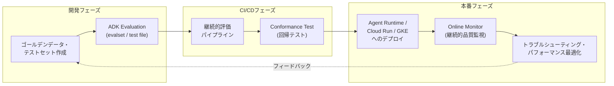
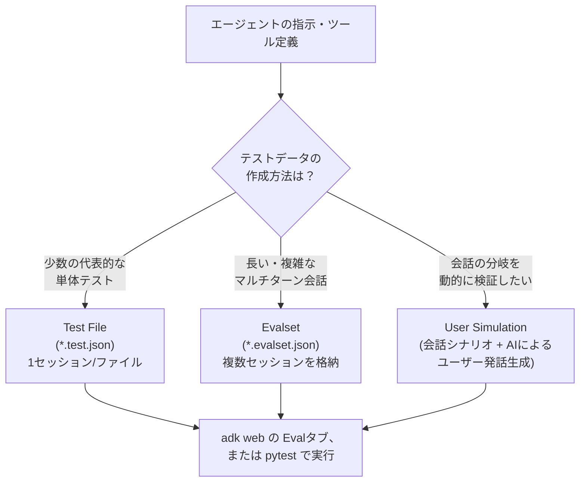
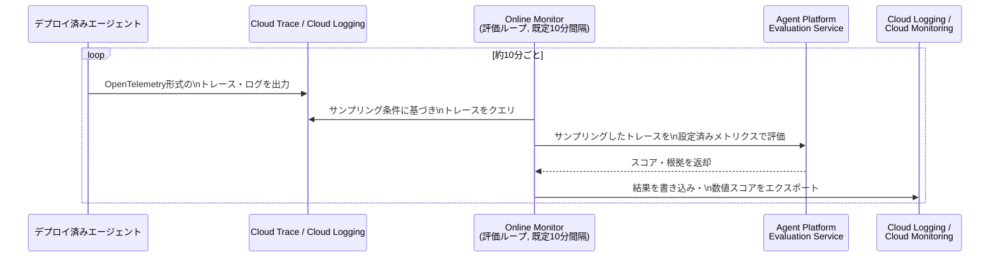
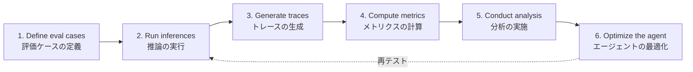
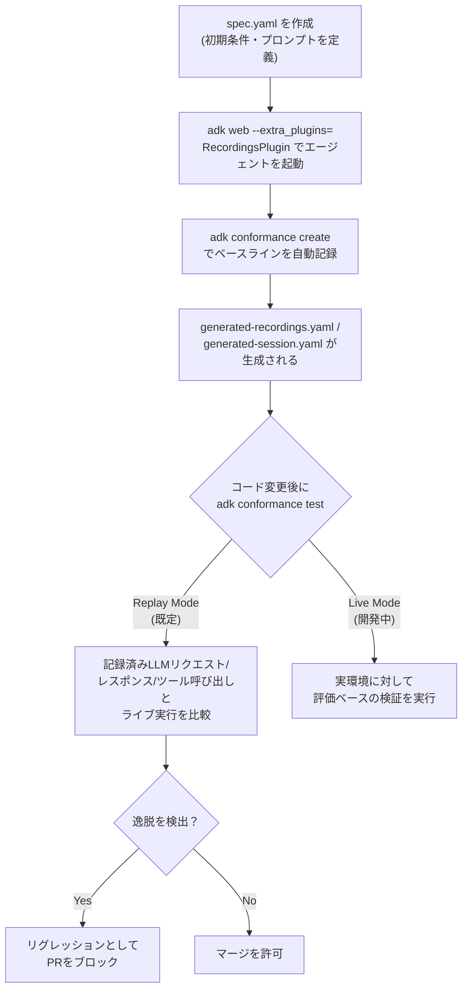
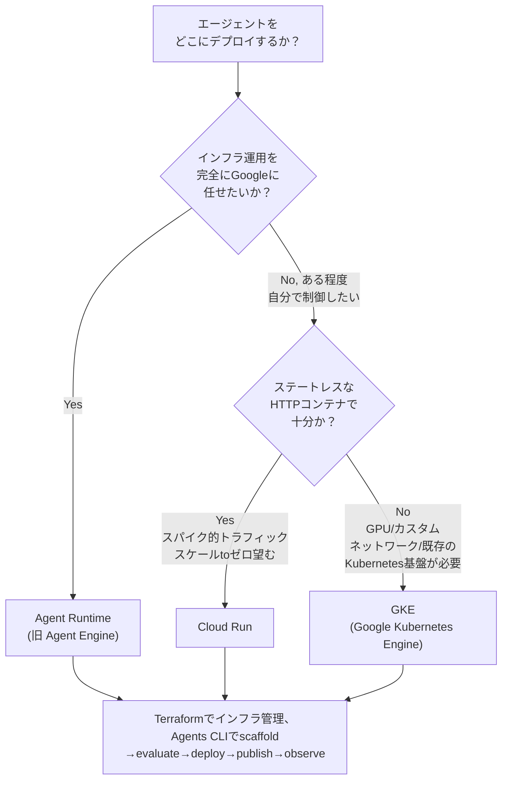
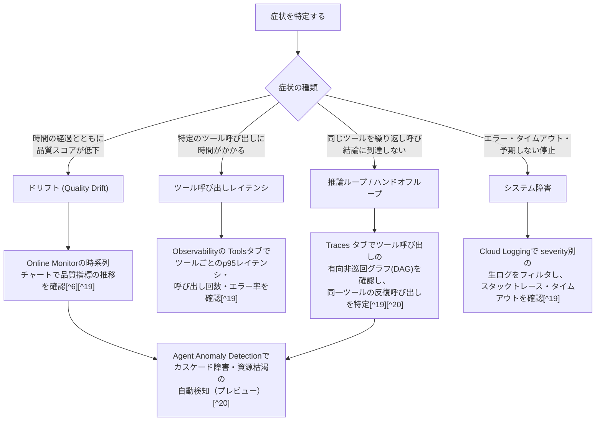
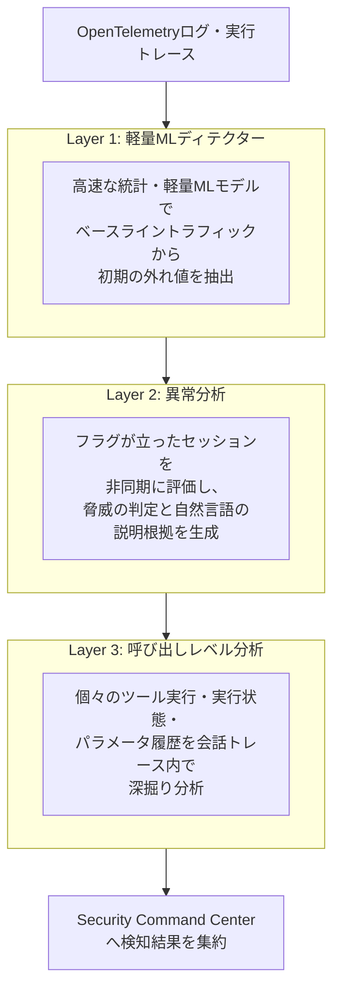
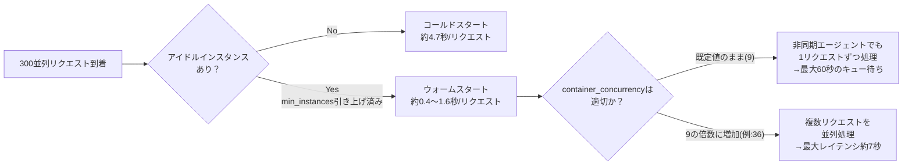

# Professional Agentic Architect 認定試験 徹底解説：セクション4 評価とデプロイ

> 対象セクション：**Section 4: Evaluating and deploying agentic workflows（評価とデプロイ）** ―― 出題比率 約22%
> 本ガイドは Google Cloud 公式認定ページ [^1] と公式 Exam Guide PDF [^2] の記述に基づき、4.1・4.2 の各出題項目を初学者向けに一つずつ丁寧に解説します。

## 目次

- [はじめに](#はじめに)
- [4.1 開発時・本番環境でのエージェント評価](#41-開発時本番環境でのエージェント評価)
  - [4.1.1 テストセットの作成：ゴールデンデータ、プロンプト、エッジケース](#411-テストセットの作成ゴールデンデータプロンプトエッジケース)
  - [4.1.2 継続的評価パイプラインの構築：ツール実行の評価](#412-継続的評価パイプラインの構築ツール実行の評価)
  - [4.1.3 評価フレームワークとツールの選定](#413-評価フレームワークとツールの選定)
  - [4.1.4 ゴールデンデータセットに対するエージェント評価（ADKを使用）](#414-ゴールデンデータセットに対するエージェント評価adkを使用)
- [4.2 本番ワークロードのデプロイとスケーリング](#42-本番ワークロードのデプロイとスケーリング)
  - [4.2.1 最適なデプロイランタイムの選定](#421-最適なデプロイランタイムの選定)
  - [4.2.2 エージェントの問題のトラブルシューティング](#422-エージェントの問題のトラブルシューティング)
  - [4.2.3 パフォーマンス・信頼性・コストの監視と最適化](#423-パフォーマンス信頼性コストの監視と最適化)
- [セクション4 試験対象ツール一覧](#セクション4-試験対象ツール一覧)
- [ベストプラクティスまとめ](#ベストプラクティスまとめ)
- [学習チェックリスト](#学習チェックリスト)
- [出典](#出典)

## はじめに

Professional Agentic Architect 試験のセクション4は、「作ったエージェントが本当に正しく動くのか」「本番でどう安定して動かし続けるのか」という、エージェント開発の最終段階を扱います。公式 Exam Guide では以下の2項目・約22%の配点が定義されています[^2]。

| 項目 | 出題内容 | 配点目安 |
| --- | --- | --- |
| 4.1 Evaluating agents in development and in production | テストセット作成、継続的評価パイプライン、評価フレームワーク選定、ゴールデンデータセット評価 | セクション4内の前半 |
| 4.2 Deploying and scaling production workloads | デプロイランタイム選定、トラブルシューティング、パフォーマンス監視と最適化 | セクション4内の後半 |

LLM エージェントは非決定的（同じ入力でも毎回微妙に異なる出力を返す）という性質を持つため、通常のソフトウェアテストのような「合格/不合格」の単純な判定だけでは品質を保証できません[^3]。そのためGoogle Cloudは、開発中の単体テスト的な評価から、本番トラフィックに対する継続的な品質監視まで、開発ライフサイクル全体をカバーする評価の仕組みを用意しています。以下の図は、本ガイドが扱う全体像です。



この図が示す通り、評価（4.1）とデプロイ（4.2）は一方通行の工程ではなく、本番での観測結果が次の評価データセットにフィードバックされる循環構造を持ちます。この循環を意識しながら、各項目を見ていきましょう。

## 4.1 開発時・本番環境でのエージェント評価

Exam Guide 原文4.1は次の4つの考慮事項を挙げています[^2]。

- Creating test sets for agent evaluation（ゴールデンデータ、プロンプト、エッジケースを含むテストセットの作成）
- Creating continuous evaluation pipelines to assess an agent's tool execution based on established success criteria（確立された成功基準に基づきツール実行を評価する継続的評価パイプラインの構築）
- Determining the appropriate evaluation framework and tooling（ADK evaluation tooling (evalset)、Agent Platform Gen AI evaluation service、custom autoraters などの適切な評価フレームワーク／ツールの決定）
- Evaluating an agentic system against a golden dataset to assess agent response and retrieval quality（ADKを使用したゴールデンデータセットに対する評価）

### 4.1.1 テストセットの作成：ゴールデンデータ、プロンプト、エッジケース

エージェント評価の出発点は「何を正解とするか」を定義するテストデータです。ADK（Agent Development Kit）の評価フレームワークは、この正解データを **EvalSet**（評価セット）という構造化データとして表現します[^4]。

ADKにおけるエージェント評価は、大きく2つの観点に分解されます[^4]。

1. **トラジェクトリ（trajectory）とツール利用の評価**：エージェントが最終回答に至るまでにどのツールをどの順序で呼び出したかを、期待されるステップ列と比較する。
2. **最終応答（final response）の評価**：エージェントが返した最終的な回答の品質・正確性・関連性を評価する。

ADKは1件のセッション（会話）を評価する最小単位として「ターン（turn）」を定義しており、各ターンには次の要素が含まれます[^4]。

| 要素 | 内容 |
| --- | --- |
| User Content | ユーザーが送った質問・指示 |
| Expected Intermediate Tool Use Trajectory | 正しく応答するためにエージェントが呼び出すべきツール呼び出しの列 |
| Expected Intermediate Agent Responses | マルチエージェント構成でサブエージェントが生成する中間的な自然言語応答（開発者がエージェントの経路が正しいか確認するために重要） |
| Final Response | エージェントが返すべき最終応答 |

このテストデータは、単体テスト向けの軽量な「test file」（`*.test.json`）と、複雑で長いマルチターン会話を表現できる「evalset」の2形式で管理できます[^4]。両者はPydanticバックエンドのスキーマ（Eval Set／Eval Case）で正式に定義されており、ADK Web UIのEvalタブで実際のセッションを保存してテストケース化することも、手動でJSONを記述することも可能です[^4]。

エッジケースの作り込みという観点では、ADKは固定のプロンプト集合だけでなく、AIモデルによって動的にユーザー応答を生成する **User Simulation（ユーザーシミュレーション）** も提供します[^4]。これは、ユーザーが必要な情報を一度に全部言うとは限らない（例えば2つの値を1つずつ順番に伝えてくる場合と、まとめて伝えてくる場合がある）という現実の会話のばらつきをテストに反映するための仕組みです。Agent Platform側でも、エージェントの指示（instructions）とツール定義から多様なマルチターンのテストシナリオを自動生成する「シナリオ生成とユーザーシミュレーション」機能が提供されています[^5]。



**ベストプラクティス**

- ゴールデンデータセットには「典型的な正常系」だけでなく、ツールがエラーを返すケースやユーザーが曖昧な質問をするケースなど、意図的にエッジケースを含める。
- テストケースはADK Web UIで実際のセッションから作成すると、手動でJSONを書くよりも正確で保守しやすい[^4]。
- 大規模なテストデータを1つのevalsetに詰め込みすぎず、単体テスト用のtest fileと統合テスト用のevalsetを役割分担して管理する[^4]。

### 4.1.2 継続的評価パイプラインの構築：ツール実行の評価

Exam Guideが指す「established success criteria（確立された成功基準）に基づく継続的評価パイプライン」は、ADKの **評価基準（Evaluation Criteria）** とAgent Platformの **Online Monitor（継続的品質監視）** の両輪で理解すると整理しやすくなります。

まずADK側の評価基準です。ADKは組み込みの評価指標を複数提供しており、目的に応じて使い分けます[^4]。

| 評価基準 | 何を測るか | 主な用途 |
| --- | --- | --- |
| `tool_trajectory_avg_score` | ツール呼び出し列の完全一致度 | CI/CDでの高速な回帰テスト |
| `response_match_score` | 参照回答とのROUGE-1類似度 | CI/CDでの高速な回帰テスト |
| `final_response_match_v2` | LLMによる意味的な一致判定 | 信頼できる参照回答との柔軟な比較 |
| `rubric_based_final_response_quality_v1` | カスタムルーブリックに基づく応答品質判定 | 参照回答がない場合の品質評価 |
| `rubric_based_tool_use_quality_v1` | カスタムルーブリックに基づくツール利用の妥当性判定 | 「AツールはBツールより先に呼ぶべき」等の推論プロセス検証 |
| `hallucinations_v1` | ツール出力など利用可能な情報に対する応答の裏付け度 | ハルシネーション検出 |
| `safety_v1` | 応答が安全ポリシーに違反していないか | 安全性チェック |
| `multi_turn_task_success_v1` | マルチターン会話全体でのゴール達成度 | 会話全体の成功可否評価 |
| `multi_turn_trajectory_quality_v1` | マルチターン会話全体の経路の効率性・論理性 | 会話全体の経路品質評価 |
| `multi_turn_tool_use_quality_v1` | マルチターンにわたるツール呼び出しの妥当性 | 会話全体でのツール利用評価 |

評価基準を明示的に設定しない場合、ADKは既定で `tool_trajectory_avg_score=1.0`（完全一致を要求）と `response_match_score=0.8`（多少の揺らぎを許容）を使用します[^4]。CI/CDパイプラインに組み込む場合は、これら2つの高速で予測可能な指標を軸にし、意味的な同一性を厳密に見たい場合は `final_response_match_v2` を、参照回答がないケースでは `rubric_based_final_response_quality_v1` を追加するのが公式の推奨です[^4]。

続いて、「確立された成功基準に基づく継続的評価パイプライン」を本番トラフィックに対して回す仕組みが **Online Monitor** です。Online Monitorは、本番稼働中のエージェントの品質低下（**quality drift**）を継続的に検知するための機能で、次のような周期的なループで動作します[^6]。



Online Monitorを機能させるには、エージェント側が特定のOpenTelemetryシグナルをCloud Traceに出力している必要があります。具体的には、エージェント名・説明・会話IDを含む「invoke agentスパン」と、プロンプト・応答・システム指示・ツール定義を含む `gen_ai.client.inference.operation.details` イベントです[^6]。ADKを使っている場合は、次の環境変数を設定することでこれらのテレメトリを有効化します[^6]。

```bash
OTEL_SEMCONV_STABILITY_OPT_IN='gen_ai_latest_experimental'
OTEL_INSTRUMENTATION_GENAI_CAPTURE_MESSAGE_CONTENT='EVENT_ONLY'
```

画像や大きなドキュメントなどマルチモーダルなデータを扱う場合は、トレースのスパンに直接埋め込むのではなく、環境変数でCloud Storageバケットへ書き出す構成が推奨されています[^6]。アップロードは `OTEL_INSTRUMENTATION_GENAI_UPLOAD_FORMAT` 単体では有効にならず、アップロード用のフック（`OTEL_INSTRUMENTATION_GENAI_COMPLETION_HOOK`）と書き出し先（`OTEL_INSTRUMENTATION_GENAI_UPLOAD_BASE_PATH`）を併せて指定する必要があります[^6]。

```bash
OTEL_INSTRUMENTATION_GENAI_COMPLETION_HOOK='upload'
OTEL_INSTRUMENTATION_GENAI_UPLOAD_BASE_PATH='gs://<バケット名>/<プレフィックス>'
OTEL_INSTRUMENTATION_GENAI_UPLOAD_FORMAT='jsonl'
```

> **⚠️ 有効化前に必須のデータ保護要件**
>
> `OTEL_INSTRUMENTATION_GENAI_CAPTURE_MESSAGE_CONTENT` はプロンプト・モデル応答・システム指示の**本文そのもの**をテレメトリとして永続化し、`OTEL_INSTRUMENTATION_GENAI_UPLOAD_FORMAT` はマルチモーダルデータをCloud Storageへ書き出します。エンドユーザー入力にはPII・認証情報・機密文書が含まれ得るため、これらは「観測性の設定」ではなく**個人データの新たな保管先を増やす変更**として扱い、有効化前に次を満たすこと。
>
> - **データ分類**：捕捉対象の会話に含まれ得るデータ種別（PII、決済情報、健康情報、社外秘）を事前に棚卸しし、分類に応じて捕捉可否を判断する。分類が未確定のうちは本番で有効化しない。
> - **マスキング／秘匿化**：`EVENT_ONLY` は捕捉内容を減らす設定ではなく、プロンプト・モデル応答・ユーザーIDをイベントとして**Cloud Loggingに記録する**設定である。本文の捕捉が許容できない場合は、スパン・イベント・アップロード対象へ書き出す前段でPII・シークレットのリダクションを行うか、`NO_CONTENT` を選択する。なお、Online Monitorが必要とするのは前述の特定のOpenTelemetryシグナル（invoke agentスパンと `gen_ai.client.inference.operation.details` イベント）であり、`EVENT_ONLY` を設定しただけで監視が成立するわけではない。本文捕捉を伴う設定は、まず開発・ステージング環境限定の有効化から始める。
> - **最小権限のIAM**：トレース・ログ・Cloud Storageバケットの閲覧権限を調査担当に限定する。`roles/storage.objectViewer` などをプロジェクト全体へ広く付与せず、バケット単位で絞る。既定のプロジェクト閲覧者が会話本文を読める状態にしない。
> - **暗号化**：保存先バケットとログシンクに顧客管理鍵（CMEK）を適用し、転送経路のTLSを含めて暗号化要件を満たすことを確認する。
> - **保持期間と削除**：Cloud Loggingのリテンション設定とCloud Storageのライフサイクルルールで保持期間の上限を明示し、期限到達で自動削除する。加えて、削除請求（GDPRの消去権など）に応えるための対象特定・削除手順を運用手順として定義する。
> - **同意と告知**：エンドユーザーの会話本文を保存する旨をプライバシーポリシー・利用規約に反映し、必要な同意取得と越境移転の要件（保存リージョンの選定を含む）を法務・プライバシー担当と確認する。

**ベストプラクティス**

- Online Monitorの作成時は「全トラフィックを評価する」か「フィルタ条件（Duration、トークン使用量など）で絞り込む」かを選び、コスト管理のために **サンプリング率** と **1回あたりの最大サンプル数** を必ず設定する[^6]。
- `OnlineEvaluator` の作成権限を持つユーザーは同一プロジェクト内の任意のエージェントに監視を紐付けられてしまうため、権限昇格を防ぐ目的でOnlineEvaluatorの作成権限は管理者に限定する[^6]。
- 結果がダッシュボードに表示されない場合は、(1) 必要なOpenTelemetry属性が実際にCloud Traceへ出力されているか、(2) フィルタ条件が実トラフィックに一致しているか、(3) Cloud LoggingにMonitor自身のエラーログが出ていないか、の順で切り分ける[^6]。

### 4.1.3 評価フレームワークとツールの選定

Exam Guideが挙げる3つの選択肢 ―― **ADK evaluation tooling (evalset)**、**Agent Platform Gen AI evaluation service**、**custom autoraters** ―― は、互いに排他的な選択肢ではなく、開発ライフサイクルの段階によって組み合わせて使うものです。

| 観点 | ADK Evaluation（evalset／test file） | Agent Platform Gen AI Evaluation Service | Custom LLM Metrics（判定LLMによるカスタム指標） | Custom Code Metrics（決定論的なカスタム評価関数） |
| --- | --- | --- | --- | --- |
| 主な利用段階 | ローカル開発でのプロンプト・ツール構成の高速なイテレーション[^5] | デプロイ済みエージェントの評価、履歴トレースや外部ログの分析[^5] | 標準指標でカバーできない主観的・定性的な品質を判定LLMに評価させたい場合[^7] | 正解が機械的に判定できる業務ルール（形式・数値・スキーマ準拠など）を検証したい場合[^7] |
| 実行方法 | `adk web`（Web UI）、`pytest`、`adk eval`（CLI）、`adk conformance`（回帰テスト）[^4] | Google Cloudコンソール、Agent Platform SDK（`client.evals.evaluate()`）[^5][^7] | 判定用プロンプト（ルーブリック）と採点基準を定義し、Evaluation ServiceのSDKに登録[^7] | Pythonで決定論的な評価関数を定義し、Evaluation ServiceのSDKに登録[^7] |
| 得意なこと | ツール呼び出し順序の厳密比較、CI/CDへの組み込み、回帰テスト | マルチターンAutoRaterによる会話全体の評価、失敗パターンのクラスタリング、プロンプト最適化 | LLM-as-judge方式によるドメイン固有スコアリング（トーン、コンプライアンス基準への準拠度など） | 再現性のある合否判定（正規表現・JSONスキーマ検証・数値許容誤差など）。判定LLMのコストとばらつきを伴わない |
| 認証方式 | `GOOGLE_API_KEY` またはApplication Default Credentials（品質評価系の指標を使う場合）[^4] | Agent Platform SDKの初期化（プロジェクト・リージョン指定）[^5] | Evaluation Service SDKと同様（判定モデルの呼び出し権限が必要） | Evaluation Service SDKと同様 |

Agent Platform Gen AI Evaluation Serviceは、次の6段階の反復ワークフローとして整理されています[^5]。



このサービスの中核機能は次の4点です[^5][^8]。

- **Scenario generation and user simulation**：エージェントの指示とツール定義から、多様なマルチターンのテストシナリオを自動生成する。
- **Environment simulation**：特定のツール呼び出しをインターセプトし、モックデータやHTTP 503エラー・レイテンシスパイクなどの疑似障害を注入することで、本番バックエンドに影響を与えずにエージェントの耐障害性を検証する。
- **Multi-turn evaluation**：会話履歴全体を **Multi-Turn AutoRaters** で自動評価する。これらのAutoRaterは意図の抽出を分析し、動的にルーブリックを生成し、指示遵守についての客観的な判定根拠を提示する。
- **Prompt optimization**：失敗パターンを特定し、システム指示の改善案を反復的に提案・検証する。

「custom autoraters」は、Evaluation Serviceの中で **Custom functions** として位置づけられており、Pythonで独自の評価ロジックを実装できます[^8]。標準のLLM-as-judge指標や `rubric_based_*` 系の指標で表現しきれない、業務固有のスコアリングルールを定義したい場合に使用します。実装形態は2つに分かれ、判定LLMにルーブリックを与えて定性的な品質を採点させる **Custom LLM Metrics**（例：社内コンプライアンス基準への準拠度）と、判定LLMを介さず入出力をコードで検証する決定論的な **Custom Code Metrics**（例：JSONスキーマ準拠、数値の許容誤差判定）を、評価したい対象の性質に応じて使い分けます。評価データセットの用意方法も柔軟で、プロンプトを直接アップロードする方法、テンプレート＋変数ファイルで組み立てる方法、本番ログから直接サンプリングする方法、合成データ生成で大量の一貫したサンプルを作る方法の4通りが用意されています[^8]。

失敗の分析についても専用の仕組みがあります。評価結果の中で失敗したケースは自動的に **Loss Clusters（損失クラスタ）** としてグループ化され、どのような種類の失敗が多いのかを俯瞰できます[^9]。

```python
# 失敗パターンをクラスタリングして俯瞰する例
loss_clusters = client.evals.generate_loss_clusters(eval_result=eval_result)
```

**ベストプラクティス**

- 「ローカル開発中の高速なイテレーション」にはADK evalset、「デプロイ後の継続的な品質保証」にはGen AI Evaluation ServiceのOnline Monitor、という住み分けを基本線にする[^5]。
- 標準指標が業務要件に合わない場合のみカスタム関数を追加し、まずは組み込みのルーブリックベース指標（`rubric_based_*`）で表現できないか検討する[^7][^8]。
- Environment simulationで疑似障害（HTTP 503、レイテンシスパイクなど）を注入したテストを、本番リリース前のゲートに組み込み、ツール障害時のエージェントの振る舞いを検証する[^5]。

### 4.1.4 ゴールデンデータセットに対するエージェント評価（ADKを使用）

Exam Guideのこの項目は、「ADKを使って、ゴールデンデータセットに対しエージェントの応答品質とリトリーバル（検索）品質を評価する」という実務的な操作を指しています。ADKでは、これは主に3つの実行手段で行います[^4]。

1. **Web UI（`adk web`）**：エージェントと対話しながらセッションを保存し、Evalタブから評価セットを作成・編集・実行する。実行結果は合否だけでなく、失敗した項目については実際の出力と期待される出力を並べて比較でき、Traceタブでツール呼び出しやモデルへのリクエスト・レスポンスをステップごとに確認できる。
2. **`pytest`によるプログラム的実行**：CI/CDパイプラインに統合するための方法。`AgentEvaluator.evaluate()` にエージェントモジュールとテストデータのパスを渡すだけで、テストランナー上でADK評価が走る。
3. **CLI（`adk eval`）**：ビルド生成・検証プロセスの一部として自動化しやすいコマンドライン実行方法。evalsetファイル名にコロン区切りでテスト名を指定すると、特定のテストだけを実行できる。

```python
from google.adk.evaluation.agent_evaluator import AgentEvaluator
import pytest

@pytest.mark.asyncio
async def test_with_single_test_file():
    """ホームオートメーションエージェントの基本的な能力をテスト"""
    await AgentEvaluator.evaluate(
        agent_module="home_automation_agent",
        eval_dataset_file_path_or_dir="tests/integration/fixture/home_automation_agent/simple_test.test.json",
    )
```

「応答品質」だけでなく「リトリーバル品質」も評価対象になる点が試験のポイントです。重要なのは、**この2つは別々の指標で測る必要がある**ことです。

- **応答品質（groundedness）**：`hallucinations_v1` は「取得できたコンテキストに対して応答がどれだけ裏付けられているか」を測る指標であり、検索結果に基づかない虚偽の応答を検出できます[^4]。ただしこれは*応答*の裏付け度であって、**リトリーバル自体の良し悪しは測れません**。検索が的外れな文書しか返さなくても、エージェントが「情報がありません」と答えれば `hallucinations_v1` は高いスコアになり得ます。
- **リトリーバル品質（retrieval quality）**：検索器が正しい文書を、正しい順序で引けているかを測るには、クエリごとに「正解となる関連文書」を付与したゴールデンデータセットが必要です。その上で **recall@k**（正解文書を上位k件に取りこぼしなく含められたか）、**precision@k**（上位k件の関連度）、**MRR / nDCG**（正解文書がどれだけ上位に並んだか）といった、正解ラベルとの照合に基づく指標で評価します。

つまり `hallucinations_v1` はリトリーバル品質の代理指標にはならないため、RAGパイプラインの評価では「正解文書ラベル付きデータセットによるリトリーバル指標」と「`hallucinations_v1` による応答の裏付け度」の**両方**を並行して計測します。リトリーバル指標が低ければ検索器（チャンク分割、埋め込みモデル、リランカー、top-k）を、リトリーバル指標は高いのに `hallucinations_v1` が低ければ生成側のプロンプト・引用制約を疑う、という切り分けが可能になります。

さらにADKは、**Conformance Testing（適合性テスト）** という回帰テストの仕組みも提供しています[^4]。これは「過去に記録・検証済みの正解となるやりとり（ゴールデンベースライン）」に対して、コード変更後のエージェントの挙動が一致し続けているかを検証する仕組みです。



Conformance Testingのディレクトリ構成は `tests/<category_name>/<test_case_name>/` の階層で固定されており、`spec.yaml`（テスト仕様）、`generated-recordings.yaml`（記録された応答）、`generated-session.yaml`（記録されたセッション状態）の3ファイルで1つのテストケースを構成します[^4]。`--generate_report` フラグを付けることで、テスト結果のMarkdownサマリーレポートを出力することもできます[^4]。

**ベストプラクティス**

- ゴールデンベースラインは手動で作成せず、`adk conformance create` による自動記録を使う。LLMリクエストやツール呼び出しは複雑で、手動でのYAML作成はミスの元になる[^4]。
- Conformance Testingは `adk conformance test` としてCI/CDパイプライン（プルリクエスト時のゲートなど）に組み込み、期待される挙動からの逸脱があればマージをブロックする[^4]。
- リトリーバル品質は、クエリごとに正解となる関連文書を付与したゴールデンデータセットを用意し、recall@k・precision@k・nDCGなど**正解ラベルとの照合に基づく検索指標**で測る。`hallucinations_v1` は応答の裏付け度（groundedness）を測る指標であり、リトリーバル品質の代替にはならないため、検索指標と併せて計測して「もっともらしいが検索結果に基づかない回答」を別途検出する[^4]。

## 4.2 本番ワークロードのデプロイとスケーリング

Exam Guide原文4.2は次の3つの考慮事項を挙げています[^2]。

- Selecting optimal deployment runtime based on the use case, requirements, and cost（Agent Runtime、Cloud Run、GKEなど、ユースケース・要件・コストに基づく最適なデプロイランタイムの選定）
- Troubleshooting agent issues（ドリフト、ツール呼び出しレイテンシ、エージェントの推論ループ、システム障害などのトラブルシューティング）
- Monitoring and optimizing agents for performance, reliability, and cost（ロジックエラー、レイテンシのボトルネック、ハルシネーションの特定を含む、パフォーマンス・信頼性・コストの監視と最適化）

### 4.2.1 最適なデプロイランタイムの選定

ADKで書かれたエージェントは特定のランタイムに縛られないポータブルな設計になっており、同じコードをローカル開発、Agent Runtime、Cloud Run、GKEのいずれにもデプロイできます[^10]。試験で問われるのは、それぞれの特性を理解した上での「どのユースケースにどのランタイムを選ぶか」という判断です。



| 観点 | Agent Runtime（旧 Agent Engine） | Cloud Run | GKE |
| --- | --- | --- | --- |
| 運用モデル | フルマネージドのオピニオネイテッド・ランタイム。インフラを意識せずエージェントロジックに集中できる[^10] | マネージドのサーバーレスコンテナ実行基盤。コンテナイメージさえあれば任意の言語・フレームワークを実行可能[^11] | Googleが管理するコントロールプレーン上で、自分でノードプール・Pod構成・ネットワークを管理するKubernetesクラスタ[^12] |
| スケーリング | 組み込みのオートスケーリングとエンドツーエンドの管理機能[^10] | リクエストに応じて自動スケール、トラフィックゼロ時はゼロまでスケールダウン（コスト効率が高い）[^11][^12] | 柔軟だがノードプールやPod構成の設計・運用が必要。GPUなど特殊なハードウェア要件に強い[^12][^13] |
| フレームワーク対応 | ADK（Python/Go/Javaで深い統合）、LangChain、LangGraph、AG2、LlamaIndex、A2Aプロトコル、カスタムフレームワーク（カスタムテンプレート）に対応[^10] | コンテナ化できれば任意の言語・フレームワーク（`adk api_server` でREST API化するのが典型例）[^11] | コンテナ化できれば任意の言語・フレームワーク |
| 典型的な適用場面 | Google Cloudネイティブな本番運用、Terraformでのインフラ管理、Agents CLIによるscaffold〜deployの一気通貫パイプライン[^10] | シンプルな1コンテナ構成、リクエスト課金でコストを抑えたい場合、Swagger UIなど標準REST APIとしての公開[^11] | 既存のKubernetes基盤との統合、GPU常時稼働ワークロード、複雑なマルチコンテナ・ネットワーク要件[^12][^13] |
| 運用の主体 | Google（管理者権限やIAM設定など一部は利用者が設定）[^10] | 利用者（スケーリング設定、ヘルスチェック、監視は自前で構成）[^11] | 利用者（ノードプール、Pod、ネットワークすべて利用者が設計）[^12] |

Agent Runtimeは、API上では後方互換性のため `ReasoningEngine` というリソース名を使い続けている点も実務上・試験対策上の注意点です[^10]。デプロイ方法としては、既にビルド済みのコンテナイメージをArtifact Registryから直接デプロイする方法と、Dockerfileと利用者のソースファイルを渡してAgent Runtime側でビルド・デプロイを自動化する方法の2通りがあります[^10]。ADKで書かれたPythonエージェントの場合は `adk` CLI（`adk deploy agent_engine`）から、Goエージェントの場合は `adkgo` CLIから直接デプロイできる「フル統合」レベルのサポートが提供されています[^10]。

Agents CLIは、この判断を助けるための統一インターフェースとして、Scaffold（雛形作成）→Evaluate（評価）→Deploy（デプロイ）→Publish（公開）→Observe（観測）という一気通貫のエージェント開発ライフサイクルを提供します[^10]。インフラのプロビジョニング（`agents-cli infra`：サービスアカウント、IAMバインディング、API有効化、テレメトリ用バケット、Terraformステートの準備）と、実際のデプロイ（`agents-cli deploy`：コンテナのビルド、レジストリへのプッシュ、サービスの起動）は明確に分離されており、通常はインフラを先に用意してからデプロイする流れになります[^14]。

本番稼働後のリビジョン管理も試験の対象範囲です。Agent Runtimeでは、`ReasoningEngine` リソースの `trafficConfig` フィールドを通じて、常に最新リビジョンにトラフィックを流す `trafficSplitAlwaysLatest` 設定と、複数のリビジョンにパーセンテージを指定して手動でトラフィックを分割するカナリアリリース的な設定の両方をサポートしています[^15]。Cloud Runでも同様に、リビジョン単位でのトラフィック分割・ロールバック・段階的なリリースが可能です[^16]。

**ベストプラクティス**

- 「インフラをできるだけ意識したくない・ADKとの統合を重視する」場合はAgent Runtime、「既存のコンテナ運用フローに乗せたい・コストを最小化したい」場合はCloud Run、「GPU常時稼働やKubernetes上の既存基盤との統合が必須」の場合はGKE、という優先順位で検討する[^10][^11][^12][^13]。
- 本番リリースはトラフィックをいきなり100%切り替えるのではなく、Agent RuntimeまたはCloud Runのトラフィック分割機能を使って段階的に新リビジョンへ移行し、問題があれば即座にロールバックできる体制にする[^15][^16]。
- Agents CLIの `infra` → `deploy` の分離を活かし、インフラのプロビジョニングとアプリケーションのデプロイを別々のパイプラインステージとして管理する[^14]。

### 4.2.2 エージェントの問題のトラブルシューティング

Exam Guideが挙げる4つの症状 ―― **drift（ドリフト）**、**tool invocation latency（ツール呼び出しレイテンシ）**、**agent reasoning loops（エージェントの推論ループ）**、**system failures（システム障害）** ―― は、いずれも従来のアプリケーション監視だけでは検出しにくい、エージェント特有の障害モードです。従来のAPM（アプリケーションパフォーマンス監視）はHTTPステータスコードやレイテンシといった外形的な指標を見ますが、エージェントは「HTTP 200を返しているのに、内容的には誤った判断をしている」というケースが多く、診断のレイヤーそのものを変える必要があります[^17][^18]。



**ドリフト（drift）** は、ユーザー行動や外部データの変化によって引き起こされる、エージェント性能の緩やかな低下を指します[^6]。これはOnline Monitorが継続的に品質指標をスコアリングし、時系列チャートとして可視化することで検知します[^6][^19]。単発の失敗ではなく「傾向」として現れるため、一時点のトレースを見るだけでは気づきにくく、継続的な監視が不可欠です。

**ツール呼び出しレイテンシ（tool invocation latency）** は、Observabilityダッシュボードの **Toolsタブ** で個別ツールごとのp95レイテンシ・呼び出し回数・エラー率・「ツールが呼ばれなかった頻度」を確認することで特定します[^19]。特定のツールだけ突出してレイテンシが高い場合、そのツール自体（外部API、データベースクエリなど）がボトルネックである可能性が高く、モデル呼び出し側の **Modelsタブ**（p95レイテンシ、呼び出し数、クォータ失敗など）と切り分けて診断します[^19]。

**エージェントの推論ループ（reasoning loops）** は、エージェントがツールエラーや曖昧なプロンプトに遭遇した際、結論に達しないまま同じ種類のツール呼び出しを繰り返してしまう現象です。マルチエージェント構成では、エージェントAがBに処理を委譲し、BがCに委譲し、CがAに送り返すといった「無限ハンドオフループ」も同種の問題として知られています[^18]。Google CloudのAgent Anomaly Detection（プレビュー機能）は、この種の問題を **OWASP ASI08（Agentic Cascading Failures）** というカテゴリで扱っており、障害の伝播・無限実行ループ・振動する再試行・フィードバックループの増幅を監視対象としています[^20]。診断の第一歩は、`Traces` タブでセッションのステップごとの実行（ツール呼び出しと推論ロジックの有向非巡回グラフ）を確認し、同一のツール呼び出しが不自然に繰り返されていないかを見ることです[^19]。

**システム障害（system failures）** は、エージェント固有の問題というよりインフラ層の問題（タイムアウト、認証切れ、クォータ超過、ネットワーク分断など）であることが多く、Cloud Loggingの生ログストリーム（severity、タイムスタンプ、実行サマリーを含む）で深掘りします[^19]。

Google Cloudが提供する **Agent Anomaly Detection**（2026年時点でプレビュー、承認制）は、これらの問題を横断的にカバーする「推論ベースの監査レイヤー」です[^20]。OpenTelemetryのログと実行トレースを非同期に取り込み、エージェントセッションの活動を多層で分析します。



この多層構成により、常時すべてのトラフィックに高コストな詳細分析をかけるのではなく、Layer 1で疑わしいものだけを絞り込み、Layer 2・3で深掘りすることで、エージェントの応答速度に実行レイテンシを追加せずに近リアルタイムの監査を実現しています[^20]。監視対象の脅威カテゴリは、OWASP Top 10 for Agentic Security Threatsに沿った次の5分類です[^20]。

| 脅威カテゴリ | 内容 |
| --- | --- |
| Tool misuse（OWASP ASI02） | 危険なツールチェーン、パラメータ操作、間接的なプロンプトインジェクションなど、ツールの不正利用 |
| Identity privilege abuse（OWASP ASI03） | 動的な信頼委譲の悪用、ペルソナ偽装、メモリのエスカレーション、confused deputy脆弱性による権限逸脱 |
| Agentic cascading failures（OWASP ASI08） | 障害の伝播、無限実行ループ、振動する再試行、フィードバックループの増幅 |
| Rogue agents（OWASP ASI10） | 宣言された役割の逸脱、安全ガードレールの回避、システム指示からの逸脱 |
| Resource exhaustion | 計算資源・LLMトークン・ネットワーク帯域の意図的または暴走的な過消費 |

Agent Anomaly Detectionを利用するには、Agent Runtimeへのデプロイ、ADK for Python バージョン1.2以降（2.1.0以降推奨）、US（マルチリージョン）のLogging／Observabilityバケット、OpenTelemetryトレーシング・ロギングの有効化、プロンプト入力・応答出力を捕捉するメタデータ設定など、複数の前提条件を満たす必要があります[^20]。

**ベストプラクティス**

- 推論ループ対策は「検知」と「予防」の両輪で考える。予防側では最大ツール呼び出し回数の上限（ハードリミット）を設け、暴走時のトークン・コスト増大を防ぐ[^21][^22]。
- ドリフトは1回のトレース確認では気づけないため、Online Monitorによる時系列の継続監視を必ず設定する[^6]。
- システム障害の切り分けでは、まずModelsタブ（モデル起因か）とToolsタブ（外部ツール起因か）を確認し、どちらでもなければCloud Loggingでインフラ層（タイムアウト、認証、クォータ）を疑う、という順序で診断する[^19]。
- Agent Anomaly Detectionのような監査レイヤーは、Model Armor（コンテンツセキュリティ）やAgent Gateway（トラフィック監視）と役割が異なる点に注意する。Agent Anomaly Detectionは「推論・振る舞い」を、Model Armorは「コンテンツの安全性」を、それぞれ別の層で見ている[^20]。

### 4.2.3 パフォーマンス・信頼性・コストの監視と最適化

エージェントのObservability（可観測性）は、メトリクス・トレース・ログの3本柱で構成されます[^19]。Agent Platformコンソールでエージェントを選択すると、Observabilityタブの中に次の6つのビューが用意されています[^19]。

| ビュー | 表示内容 |
| --- | --- |
| Overview | 総セッション数、セッションあたりの平均ターン数、総呼び出し回数、トークン使用量（入力/出力）、トラフィック量、レイテンシパーセンタイル（p50/p95/p99）、エラー率の時系列チャート |
| Evaluation | Online Monitorによる平均応答品質、安全性指標、ハルシネーション率、ツール利用品質の時系列ウィジェット |
| Models | 基盤モデルごとのp95レイテンシ、総呼び出し数、エラー率、クォータ失敗、トークン使用量の内訳 |
| Tools | 接続された外部ツール・サービスごとのp95レイテンシ、呼び出し数、エラー率、ツールが呼ばれなかった頻度 |
| Usage | コンテナのCPU割り当て、メモリ割り当て、トークン使用量などインフラレベルの指標 |
| Logs | severityやタイムスタンプ、実行サマリーを含むフィルタ可能な生ログストリーム |

さらに `Traces` タブでは特定セッションのステップごとの実行を、スパンの有向非巡回グラフと入出力とともに詳細に確認でき、`Topology` タブではそのエージェント単体の受信・送信依存関係を俯瞰できます[^19]。これらのテレメトリを支えているのが **OpenTelemetry Semantic Conventions for generative AI systems** で、ツール実行・リトリーバルステップ・トークン消費といった複雑なマルチステップのエージェントワークフローを、ベンダー非依存の共通フォーマットで記述するための業界標準です[^19]。

パフォーマンスとコストの最適化については、Agent Runtimeで具体的に数値化された知見が公開されています[^21]。

**コールドスタート問題**：リクエストが到着した時にアイドル状態のインスタンス／コンテナが存在しない場合、新しいインスタンスの起動が必要になり大きなレイテンシが発生します。

| シナリオ | 平均レイテンシ |
| --- | --- |
| コールドスタート（`min_instances=1`、初回実行、300並列リクエスト） | 約4.7秒 |
| ウォームスタート（同条件で直後に再実行） | 約0.4秒 |
| `min_instances=10` に引き上げた場合のコールドスタート | 約1.4秒 |
| `min_instances=10` ＋ 安定した継続的負荷（1,500クエリ/分を60秒間） | 約1.6秒で安定 |

この結果が示す通り、4秒を超えるオーバーヘッドのほぼすべてが新規インスタンスの起動待ちに起因しています。スパイク的・高トラフィックなアプリケーションでは、`min_instances` をベースライントラフィックを処理できる水準まで引き上げること（最大値は10）、あるいはキューを使って安定的・継続的な負荷をAgent Runtimeに送り、サービスを「ウォーム」に保つことが有効な対策です[^21]。

**非同期ワーカーの活用不足**：`container_concurrency` は既定では同期コード向けに設定されており、各Agent Platformインスタンスは1リクエストずつしか処理しません。しかしADKベースのような非同期エージェントは、LLM呼び出しやツール呼び出しなどI/Oバウンドな複数リクエストを同時に処理できます[^21]。

| 設定 | 結果 |
| --- | --- |
| `min_instances=10`、既定の `container_concurrency=9`、300並列リクエスト | 中央値レイテンシ約4秒だが、最大レイテンシは60秒まで急増（リクエストのキューイングが発生） |
| `min_instances=10`、`container_concurrency=36`（既定の4倍）、300並列リクエスト | 最大レイテンシが60秒から約7秒まで低下 |

各コンテナ内では9個のエージェントプロセスが並列稼働するため、1プロセスあたりの同時処理可能リクエスト数は `container_concurrency / 9` で決まります。非同期エージェントでは `container_concurrency` を9の倍数（例：36）に設定することが出発点として推奨されますが、値を上げすぎるとメモリ不足（OOM）エラーのリスクがある点には注意が必要です[^21]。



「Monitoring and optimizing agents for performance, reliability, and cost」で明示的に触れられている「ロジックエラー・レイテンシのボトルネック・ハルシネーションの特定」は、これまで見てきた仕組みを組み合わせて次のように対応づけられます。

| 症状 | 主な特定手段 | 主な対処 |
| --- | --- | --- |
| ロジックエラー | Traceタブでのステップ実行確認、`tool_trajectory_avg_score` や `rubric_based_tool_use_quality_v1` による回帰検知 | プロンプト・ツール定義の見直し、Agent Optimizerによる指示の自動改善提案[^9] |
| レイテンシのボトルネック | Observability Tools/Modelsタブのp95レイテンシ、コールドスタート・並行度の分析 | `min_instances` の引き上げ、`container_concurrency` のチューニング[^21] |
| ハルシネーション | `hallucinations_v1` 指標、Online MonitorのEvaluationタブでの継続監視 | RAGパイプラインの根拠付け強化、safetyやhallucination指標をリリースゲートに追加[^4][^6] |

**ベストプラクティス**

- コストと信頼性はトレードオフになりやすい。`min_instances` を上げるとコールドスタートは減るが常時課金コストが増えるため、実トラフィックのベースラインを計測した上で値を決める[^21]。
- 非同期（ADKベースなど）エージェントは `container_concurrency` を既定値のまま使わず、9の倍数を出発点にチューニングし、OOMエラーが出ないことを負荷テストで確認する[^21]。
- パフォーマンス最適化の前に、必ずObservabilityのOverview／Models／Toolsタブでボトルネックの所在（モデル呼び出しかツール呼び出しかインフラか）を特定してから対処する。原因を特定せずにインスタンス数だけ増やすとコストだけが増えるリスクがある[^19][^21]。
- Agent Optimizerのようなプロンプト最適化機能を、失敗クラスタの分析結果と組み合わせて使うことで、人手でログを読み込むよりも効率的にロジックエラーを改善できる[^9]。

## セクション4 試験対象ツール一覧

公式Exam Guideに列挙されている試験対象ツールのうち、セクション4（評価とデプロイ）に直接関連するものを整理すると次の通りです[^2]。

| ツール／サービス | セクション4での役割 |
| --- | --- |
| Agent Development Kit (ADK) | evalset／test fileによる評価、Conformance Testing、Agent Runtimeへのフル統合デプロイ |
| Agent evaluation | Agent Platform Gen AI Evaluation Service全般（オンライン／オフライン評価、シミュレーション、失敗クラスタ分析） |
| Agent Runtime（旧 Agent Engine） | フルマネージドなデプロイ先。トラフィック分割、トレーシング、ロギング、パフォーマンス最適化 |
| Cloud Run | サーバーレスコンテナベースのデプロイ先の選択肢 |
| Google Kubernetes Engine (GKE) | フル制御が必要な場合のデプロイ先の選択肢 |
| Google Cloud Observability（Cloud Logging / Cloud Trace） | Online Monitor・Offline Evaluation・Observabilityダッシュボードのテレメトリ基盤 |
| BigQuery / Cloud SQL / Cloud Storage / Firestore / Memorystore for Redis | エージェントのデータ層。評価結果の格納（Cloud Storage）やセッション状態の永続化などに関連 |

## ベストプラクティスまとめ

| カテゴリ | ベストプラクティス |
| --- | --- |
| テストセット設計 | 正常系だけでなくエッジケース・ツールエラーを含める。ADK Web UIから実セッションを取り込んでテストケース化する[^4] |
| 評価指標選定 | CI/CDには `tool_trajectory_avg_score` と `response_match_score`、意味的一致には `final_response_match_v2`、参照回答なしには `rubric_based_*` を使い分ける[^4] |
| 評価フレームワーク | ローカル開発はADK evalset、デプロイ後の継続監視はGen AI Evaluation ServiceのOnline Monitorを基本線とする[^5] |
| 回帰テスト | `adk conformance` によるゴールデンベースラインの自動記録・自動比較をCI/CDのゲートにする[^4] |
| ランタイム選定 | フルマネージド志向ならAgent Runtime、シンプルなコンテナ運用ならCloud Run、GPU常時稼働や既存Kubernetes資産の活用ならGKE[^10][^11][^12] |
| リリース管理 | トラフィック分割によるカナリアリリースと即時ロールバックの体制を整える[^15][^16] |
| トラブルシューティング | Observabilityの各タブ（Overview/Evaluation/Models/Tools/Usage/Logs）で症状ごとに切り分ける診断フローを持つ[^19] |
| 推論ループ対策 | 検知（Online Monitor、Agent Anomaly Detection）と予防（呼び出し回数の上限設定）を両輪で実施する[^20][^21][^22] |
| パフォーマンス最適化 | `min_instances` と `container_concurrency` を実測データに基づいてチューニングし、コストとレイテンシのバランスを取る[^21] |
| セキュリティ監査 | Agent Anomaly DetectionをOWASP Top 10 for Agentic Security Threatsの枠組みで理解し、Model Armor・Agent Gatewayと役割分担する[^20] |

## 学習チェックリスト

- [ ] ADKのEvalSetとTest Fileの違い（対象セッション数・用途）を説明できる
- [ ] トラジェクトリ評価と最終応答評価の違いを説明できる
- [ ] User Simulationがなぜ必要か（固定プロンプトの限界）を説明できる
- [ ] ADKの評価指標（`tool_trajectory_avg_score`、`response_match_score`、`final_response_match_v2`、`rubric_based_*`、`hallucinations_v1`、`safety_v1`、`multi_turn_*`）を用途別に選べる
- [ ] Online Monitorが検出する「quality drift」とは何かを説明できる
- [ ] Online Monitorに必要なOpenTelemetryのシグナル（invoke agentスパン、inference events）を挙げられる
- [ ] ADK evalset・Gen AI Evaluation Service・custom autoratersの使い分けを説明できる
- [ ] Loss Clustersとプロンプト最適化の関係を説明できる
- [ ] Conformance Testingの3つのファイル（spec.yaml、generated-recordings.yaml、generated-session.yaml）の役割を説明できる
- [ ] Agent Runtime／Cloud Run／GKEのそれぞれが向いているユースケースを説明できる
- [ ] Agent Runtimeの旧称と、APIリソース名（ReasoningEngine）を知っている
- [ ] トラフィック分割によるカナリアリリースの仕組みを説明できる
- [ ] ドリフト・ツール呼び出しレイテンシ・推論ループ・システム障害それぞれの典型的な診断手段を挙げられる
- [ ] Observabilityの6つのタブ（Overview/Evaluation/Models/Tools/Usage/Logs）がそれぞれ何を表示するか説明できる
- [ ] Agent Anomaly Detectionの3層構成（Layer1〜3）とOWASPの脅威カテゴリを説明できる
- [ ] コールドスタート問題への対策（`min_instances`）を数値とともに説明できる
- [ ] 非同期エージェントにおける`container_concurrency`のチューニング方法を説明できる

## 出典

[^1]: Google Cloud, "Professional Agentic Architect certification," https://cloud.google.com/learn/certification/agentic-architect
[^2]: Google Cloud, "Professional Agentic Architect Certification exam guide" (PDF), https://services.google.com/fh/files/misc/professional_agentic_architect_exam_guide_english.pdf
[^3]: Google, "Why evaluate agents," ADK Docs, https://github.com/google/adk-docs/blob/main/docs/evaluate/index.md
[^4]: Google, "Evaluate your agents with ADK," adk-docs (evaluate/index.md), https://github.com/google/adk-docs/blob/main/docs/evaluate/index.md
[^5]: Google Cloud, "Agent evaluation," Gemini Enterprise Agent Platform Documentation, https://docs.cloud.google.com/gemini-enterprise-agent-platform/optimize/evaluation/agent-evaluation
[^6]: Google Cloud, "Continuous evaluation with online monitors," Gemini Enterprise Agent Platform Documentation, https://docs.cloud.google.com/gemini-enterprise-agent-platform/optimize/evaluation/evaluate-online
[^7]: Google Cloud, "Gen AI evaluation service overview," Gemini Enterprise Agent Platform Documentation, https://docs.cloud.google.com/gemini-enterprise-agent-platform/models/evaluation-overview
[^8]: Google Cloud Blog, "I/O '26 news for agent developers on Google Cloud," https://cloud.google.com/blog/topics/developers-practitioners/io26-news-for-agent-developers-on-google-cloud
[^9]: Google Cloud, "Evaluate your agents," Gemini Enterprise Agent Platform Documentation, https://docs.cloud.google.com/gemini-enterprise-agent-platform/optimize/evaluation/evaluate-agents
[^10]: Google Cloud, "Agent Runtime," Gemini Enterprise Agent Platform Documentation, https://docs.cloud.google.com/gemini-enterprise-agent-platform/build/runtime
[^11]: Mazlum Tosun, "End-to-End AI Agent on GCP: ADK, BigQuery MCP, Agent Engine, and Cloud Run," Medium (Google Cloud Community), https://medium.com/google-cloud/end-to-end-ai-agent-on-gcp-adk-bigquery-mcp-agent-engine-and-cloud-run-4843fec27c13
[^12]: Amit Divekar, "GCP Cloud Run vs GKE in 2026: Architecting for High-Throughput AI Workloads," https://amitdevx.tech/blogs/gcp-cloud-run-gke-ai-workloads
[^13]: happtiq, "In Comparison: Cloud Run vs. Google Kubernetes Engine," https://www.happtiq.com/blog/cloud-run-vs-gke
[^14]: Google, "Deployment," Agents CLI Guide, https://google.github.io/agents-cli/guide/deployment/
[^15]: Google Cloud, "Manage revisions and traffic," Gemini Enterprise Agent Platform Documentation, https://docs.cloud.google.com/gemini-enterprise-agent-platform/scale/runtime/manage-revisions-and-traffic
[^16]: Google Cloud, "Rollbacks, gradual rollouts, and traffic migration," Cloud Run Documentation, https://cloud.google.com/run/docs/rollouts-rollbacks-traffic-migration
[^17]: Arize AI, "Why AI Agents Break: A Field Analysis of Production Failures," https://arize.com/blog/common-ai-agent-failures/
[^18]: Analytics Insight, "AI Agent Performance Problems: Causes, Fixes, and Best Practices," https://www.analyticsinsight.net/artificial-intelligence/common-ai-agent-performance-problems-and-how-to-fix-them
[^19]: Google Cloud, "Observability overview," Gemini Enterprise Agent Platform Documentation, https://docs.cloud.google.com/gemini-enterprise-agent-platform/optimize/observability/overview
[^20]: Google Cloud, "Agent Anomaly Detection overview," Gemini Enterprise Agent Platform Documentation, https://docs.cloud.google.com/gemini-enterprise-agent-platform/agent-anomalies-overview
[^21]: Google Cloud, "Optimize and scale Agent Runtime performance," Gemini Enterprise Agent Platform Documentation, https://docs.cloud.google.com/gemini-enterprise-agent-platform/scale/runtime/optimize-and-scale
[^22]: dev.to (AWS), "How to Prevent AI Agent Reasoning Loops from Wasting Tokens," https://dev.to/aws/how-to-prevent-ai-agent-reasoning-loops-from-wasting-tokens-2652
