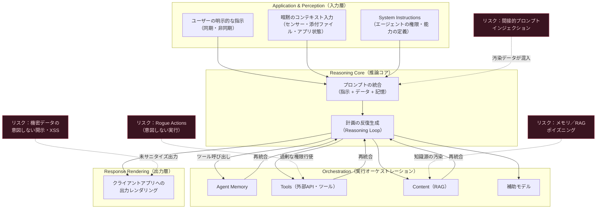
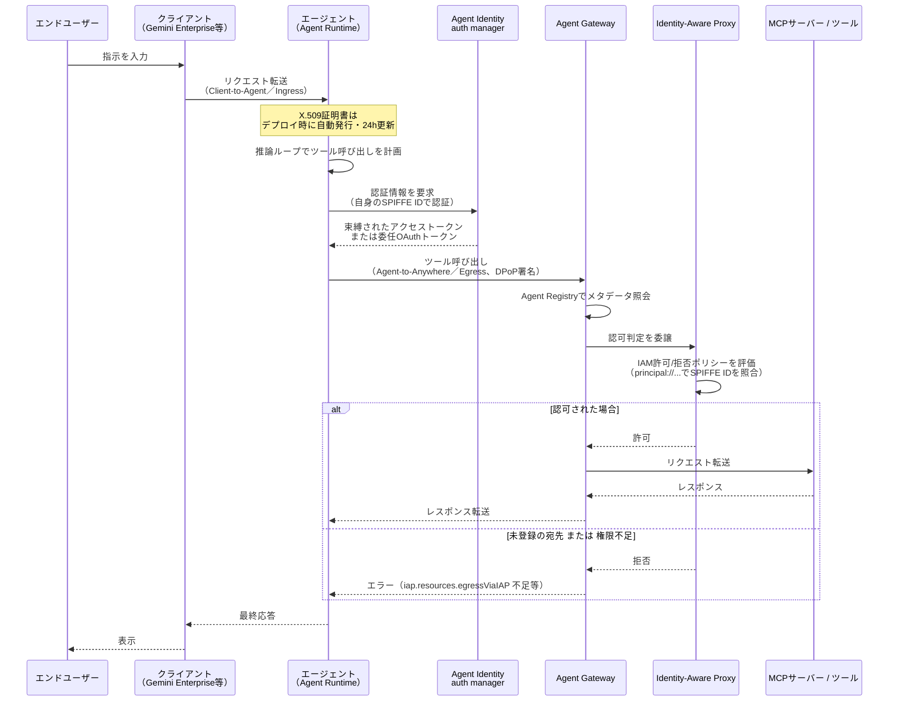
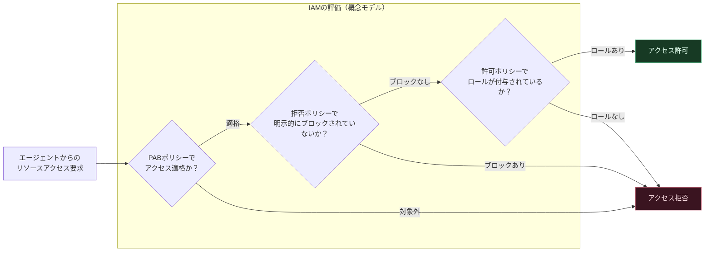
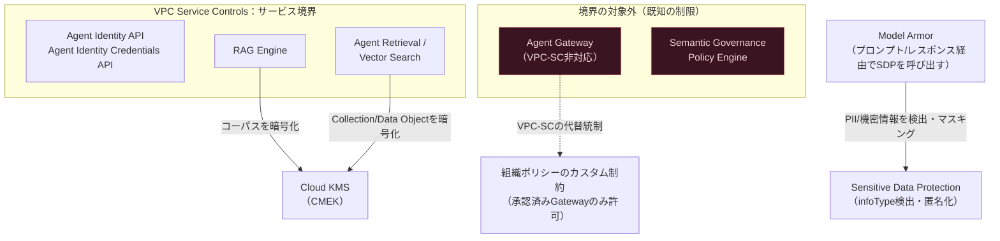
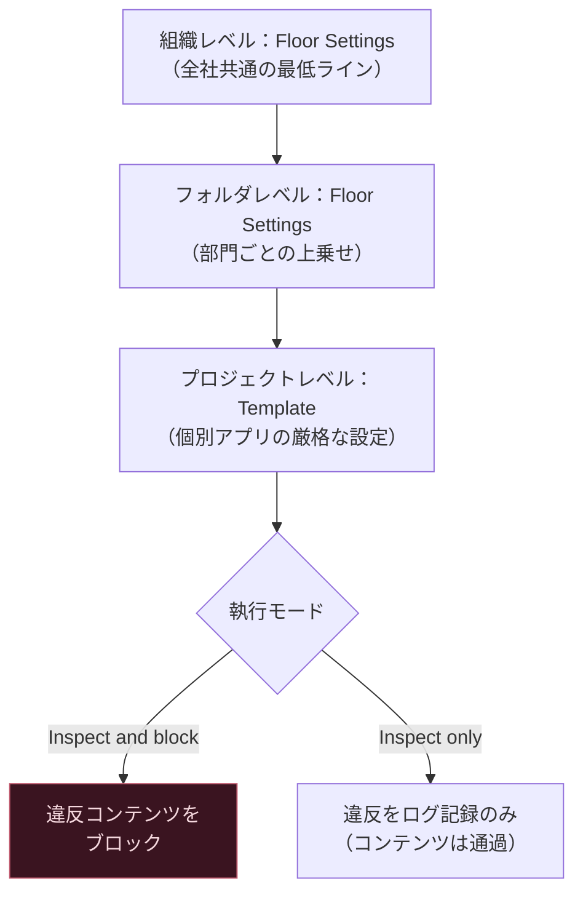
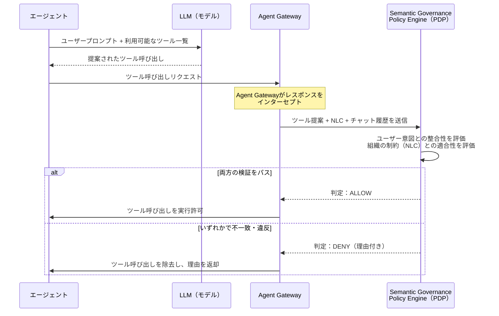
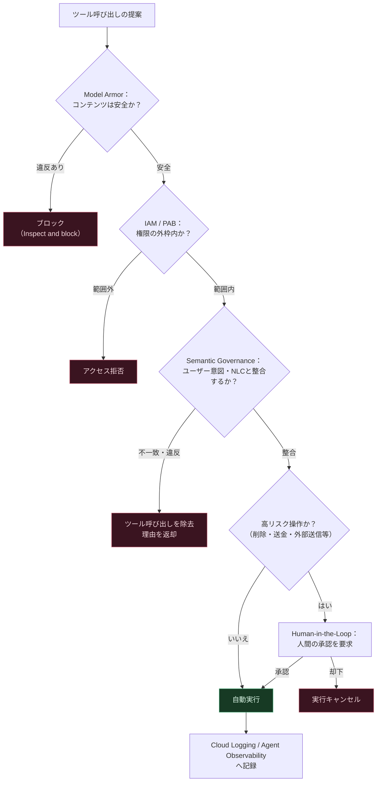
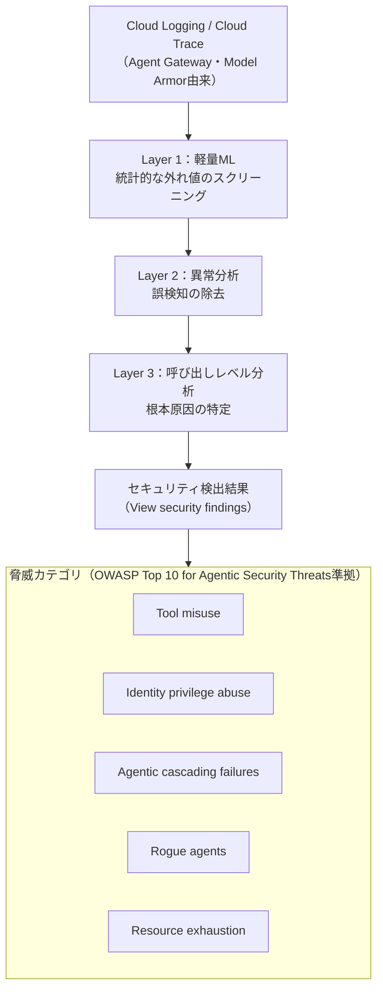
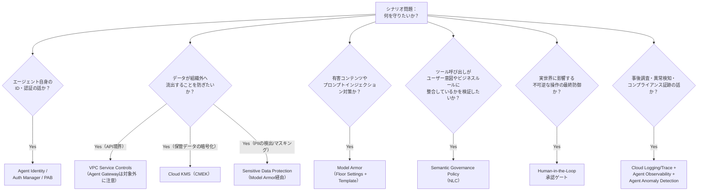

# Google Cloud Professional Agentic Architect：セクション5「セキュリティとガバナンス」完全攻略ガイド

> Google Cloud Certified Professional Agentic Architect 認定試験のセクション5（配点 約15%）を、脅威モデルの基礎からエンタープライズ実装、試験特有の頻出シナリオまで、初学者でも一気通貫で理解できるように解説します。

## 目次

- [1. セクション5概要：自律型AIエージェントにおける脅威モデルとガバナンスの基本](#1-セクション5概要自律型aiエージェントにおける脅威モデルとガバナンスの基本)
- [2. ID管理・認証・アクセス制御（Agent Identity & Zero Trust）](#2-id管理認証アクセス制御agent-identity--zero-trust)
- [3. ネットワーク境界保護とデータプライバシー](#3-ネットワーク境界保護とデータプライバシー)
- [4. エージェントのガードレール・安全性フィルタ・ポリシー執行](#4-エージェントのガードレール安全性フィルタポリシー執行)
- [5. 監査・可観測性・コンプライアンス](#5-監査可観測性コンプライアンス)
- [6. 試験対策：頻出アンチパターンと意思決定フローチャート](#6-試験対策頻出アンチパターンと意思決定フローチャート)
- [7. 参考リソース・公式ドキュメント一覧](#7-参考リソース公式ドキュメント一覧)

---

## 1. セクション5概要：自律型AIエージェントにおける脅威モデルとガバナンスの基本

### 1.1 なぜ「エージェント」は従来のWebアプリより危険なのか

従来のWebアプリケーションのセキュリティモデルは、「入力はすべて信頼できない」という前提のもとで、決まったAPIエンドポイントと決まった権限だけを守ればよいものでした。ところが自律型AIエージェント（Agentic AI）は、次の3点で根本的に異なるリスクプロファイルを持ちます。

1. **意思決定の主体が確率的である**：エージェントの「次に何をするか」は大規模言語モデル（LLM）の推論によって動的に決まります。同じ入力でも実行されるツール呼び出しが変わり得るため、静的なコードレビューだけでは安全性を保証できません。
2. **信頼境界が入力の中に埋め込まれる**：ユーザーの指示（信頼できる）と、メールの本文やWebページ、RAGで取得したドキュメントなどの外部データ（信頼できない）が、同じプロンプトという1つのチャネルに混在します。この結果、悪意のある指示が外部データに紛れ込む**間接的プロンプトインジェクション**（indirect prompt injection）が、エージェント特有の最重要脅威になります。
3. **エージェントは「実世界に作用する権限」を持つ**：メール送信、ファイル削除、送金、コード実行など、エージェントに与えられたツールはそのまま実際のシステムを変更します。ハルシネーション（誤った推論）や悪意ある操作が、そのまま過剰な権限行使（excessive agency）につながります。

Google の Secure AI Framework（SAIF）はこの構造を「Application & Perception」→「Reasoning core」→「Orchestration」→「Response rendering」という4つのコンポーネントに分解し、各段階でどのような脅威が入り込むかを整理しています。

この図が示す通り、境界は「アプリケーションの外側」ではなく、**エージェント内部のあらゆる受け渡しポイント**に存在します。セクション5で学ぶ各サービス（Agent Identity、Agent Gateway、Model Armor、Semantic Governance Policy）は、それぞれこの図のどこか特定のポイントを守るために設計されています。

### 1.2 SAIF：Google の Secure AI Framework における「エージェント特有」のリスクと制御

SAIF は元々モデル全般のセキュリティを扱うフレームワークですが、2025年以降「Focus on Agents」という拡張が公開され、エージェント特有の2大リスクと3つの制御が定義されています。

| 分類 | 名称 | 内容 | 対応する制御 |
|---|---|---|---|
| リスク | **Sensitive Data Disclosure**（機密データ開示） | エージェントが持つ特権的アクセス（メール・ファイル・PCそのもの）を悪用され、個人情報や社内機密が外部に漏洩する。ツールを使って文書を共有したり、URLやMarkdown画像に情報を埋め込んで持ち出す手口も含まれる。 | Agent Permissions、Agent User Control、Agent Observability、出力の検証とサニタイズ |
| リスク | **Rogue Actions**（意図しない実行） | 誤って（misalignment）あるいは悪意を持って（間接的プロンプトインジェクション等）、エージェントが意図しない実世界アクションを実行してしまう。複数エージェント間の通信を乗っ取る手口や、カレンダー招待に潜ませた「時限発火」型の攻撃も含まれる。 | Agent Permissions、Agent User Control、Agent Observability |
| 制御 | **Agent User Control** | ユーザーのデータを変更する、またはユーザーに代わって行動するアクションについて、必ずユーザーの承認を取得する（Human-in-the-Loop の理論的根拠）。 | — |
| 制御 | **Agent Permissions** | 最小権限の原則をエージェントの権限の「上限」として適用し、利用可能なツール数とアクションの範囲を絞り込む。文脈に応じて動的に権限を絞る「リファレンスモニター」的な設計も推奨される。 | — |
| 制御 | **Agent Observability**（新設） | エージェントの行動・ツール利用・推論過程をログで追跡可能にし、デバッグ、セキュリティ監査、ユーザーへの説明責任を果たせるようにする。 | — |

これらの制御は、後述する **Agent Identity**（最小権限のID）、**Agent Gateway**（実行時のポリシー執行と可観測性）、**Semantic Governance Policy**（意図整合性の検証）という Google Cloud の実装にそのまま対応しています。

### 1.3 業界標準の脅威分類：OWASP Top 10 との対応

Google Cloud の実装を理解する前に、業界共通言語である OWASP の脅威分類を押さえておくと、試験のシナリオ問題（「この攻撃を防ぐには何を設定すべきか」）に対応しやすくなります。2025年以降、OWASP は LLM 単体の脅威と、エージェント特有の脅威を別々のTop 10として整理しています。

| ID | 名称 | 概要 |
|---|---|---|
| ASI01 | Agent Goal Hijack | 悪意あるコンテンツによってエージェントの目的そのものが書き換えられる（間接的プロンプトインジェクションの発展形） |
| ASI02 | Tool Misuse and Exploitation | 正規のツールを、パラメータ改ざんやツールチェーンの悪用によって安全でない形で使用される |
| ASI03 | Identity and Privilege Abuse | エージェントが高権限の認証情報を継承・昇格させて悪用される |
| ASI04 | Agentic Supply Chain Vulnerabilities | 侵害されたツール・プラグイン・外部MCPサーバーなどのサプライチェーン経由の脆弱性 |
| ASI05 | Unexpected Code Execution | エージェントが安全でないコード／コマンドを生成・実行してしまう |
| ASI06 | Memory and Context Poisoning | エージェントの記憶やRAGデータベースに毒データが注入され、意思決定が歪められる |
| ASI07 | Insecure Inter-Agent Communication | マルチエージェント間通信でのなりすまし・改ざん |
| ASI08 | Cascading Failures | 小さな誤りが計画・実行・記憶全体に連鎖的に増幅する |
| ASI09 | Human Agent Trust Exploitation | 人間がエージェントの提案を過信し、ソーシャルエンジニアリングに利用される |
| ASI10 | Rogue Agents | 侵害・誤動作したエージェントが正規に見えるまま有害な行動を取る |

OWASP GenAI LLM Top 10（2026年版、2026-08-03リリース）とは、以下のように対応関係があります。

| エージェント側リスク | 対応するLLM Top 10（2026年版） |
|---|---|
| ASI01: Agent Goal Hijack | LLM01: Prompt Injection |
| ASI02 / ASI03: Tool Misuse / Identity Abuse | LLM03: Excessive Agency |
| ASI05: Unexpected Code Execution | LLM01, LLM10: Improper Output Handling |
| ASI06: Memory and Context Poisoning | LLM05: Data and Model Poisoning |
| ASI08: Cascading Failures | LLM07: Misinformation |

> **参考（歴史的な対応表）：** 旧 OWASP LLM Top 10 2025年版では、Excessive Agency は LLM06、Improper Output Handling は LLM05、Misinformation は LLM09 に分類されていました。2026年版ではリスクの再評価に伴い番号が変更されています（Excessive Agency が LLM06 → LLM03 に昇格など）。

### 1.4 試験ガイド原文における「セクション5」の範囲

公式試験ガイド（後掲リンク参照）は、セクション5「Securing and governing agentic workflows」（配点 約15%）を次の2項目で定義しています。試験対策上、この原文の粒度を正確に押さえることが最も重要です。

- **5.1 Configuring agent security and governance（エージェントのセキュリティとガバナンスの構成）**
  - OAuth 2.0によるエージェント〜ツール間APIコールの認証・安全な実行
  - Agent Identity を用いた Principal Access Boundary（PAB）ポリシーの構成
  - トラフィックの監視とエージェントの追跡のための Agent Gateway の構成
  - エージェント的ガバナンスとポリシー執行の設計・構成（Agent Registry、Model Armor など）
- **5.2 Implementing secure agent behavior and execution（安全なエージェントの動作と実行の実装）**
  - 適切な安全性フレームワークとガードレールの設計（Agent Gateway、Model Armor、Human-in-the-Loop）
  - Agent Gateway と Agent Registry によるデータへの安全なアクセスとID伝播の構成

このガイドの2〜5章は、この原文の粒度に沿って、ユーザーからご要望のあった VPC Service Controls・CMEK・Sensitive Data Protection・監査ログなどの一般的なエンタープライズセキュリティ概念も組み込みながら、実装レベルまで掘り下げます。

> **出典：** [Professional Agentic Architect 認定試験概要](https://cloud.google.com/learn/certification/agentic-architect)、[公式Exam Guide PDF](https://services.google.com/fh/files/misc/professional_agentic_architect_exam_guide_english.pdf)、[SAIF: Focus on Agents](https://saif.google/focus-on-agents)、[OWASP Top 10 for Agentic Applications 2026](https://genai.owasp.org/resource/owasp-top-10-for-agentic-applications-for-2026/)

---

## 2. ID管理・認証・アクセス制御（Agent Identity & Zero Trust）

### 2.1 なぜサービスアカウントでは不十分なのか

従来型のGoogle Cloudワークロードはサービスアカウントで認証していましたが、エージェントには次のような固有の課題があります。

- サービスアカウントキーが漏洩すると、有効期限が切れるまで永続的に悪用され得る
- 複数のエージェントインスタンスが同じサービスアカウントを共有すると、「どのエージェントが何をしたか」の追跡が困難になる
- ユーザーに代わって行動する場合の権限委譲（on-behalf-of）が標準化されていない

これらを解決するために設計されたのが **Agent Identity** です。Agent Identity はサービスアカウントを置き換えるものではなく、エージェント実行基盤（Agent Runtime、Gemini Enterprise、Cloud Run など）向けに特化した、より強く縛られた（strongly attested）ID基盤です。

### 2.2 Agent Identity の中核コンポーネント

| コンポーネント | 説明 |
|---|---|
| **SPIFFE ベースID** | 各エージェントに一意のSPIFFE ID文字列を付与。形式は `spiffe://TRUST_DOMAIN/resources/SERVICE/RESOURCE_PATH`。IAM許可ポリシーではプリンシパル識別子として `principal://...` 形式を用いる。 |
| **Agent 認証情報** | X.509証明書（24時間有効・自動更新）とGoogle Cloudアクセストークンをサポート。アクセストークンはエージェント固有のX.509証明書に暗号学的に束縛（token binding）され、トークン盗難を防止する。 |
| **Agent Identity auth manager** | API キー、OAuthクライアントID/シークレット、委任されたエンドユーザーOAuthトークンを一元管理する「認証情報の金庫」。auth provider という構成単位でツールごとの認証方式を定義する。 |
| **Context-Aware Access（既定で有効）** | mTLS と DPoP（Demonstrating Proof of Possession）による二重束縛（double-bound credentials）。Google Cloud APIへの直接アクセスはmTLSで、Agent Gatewayを介した先へのアクセスはDPoPで、それぞれ再生攻撃（リプレイ）を防止する。 |

サービスアカウントとの決定的な違いは、**Agent Identity は既定で共有されず、なりすまし（impersonation）ができず、長期間有効なキーを発行できない**という点です。これにより、最小権限の原則がアーキテクチャレベルで強制されます。

### 2.3 認証モデル：誰の権限で、何を呼び出すか

Agent Identity は「エージェント自身の権限で動くのか」「エンドユーザーに代わって動くのか」で異なる認証方式を使い分けます。

| 権限の所在 | 認証方式 | 対象リソース | ユースケース |
|---|---|---|---|
| **ユーザー委任権限** | OAuth 2.0（3-legged / 3LO） | 外部ツール・サービス | エージェントが特定ユーザーに代わって行動する場合（例：ユーザーのJiraタスクやGitHubリポジトリへのアクセス）。auth manager で3LOの auth provider を構成し、ユーザーの同意とトークンを管理する。 |
| **エージェント自身の権限** | Cloud-based identity（Agent Identity） | Google Cloud サービス | Google Cloud上でホストされるエージェントが自身のIDで他のGoogle Cloudサービスにアクセスする場合。 |
| **エージェント自身の権限** | OAuth 2.0（2-legged / 2LO） | 外部ツール・サービス | OAuth対応の外部サービスとのマシン間認証で推奨。 |
| **エージェント自身の権限** | API キー | 外部ツール・サービス | 暗号鍵やパスワードによる認証が必要な外部サービス向け。auth manager が安全に保管・管理する。 |
| **エージェント自身の権限** | HTTP Basic認証 | 外部ツール・サービス | **HTTPS/TLS なしでの使用は禁止**。TLS で保護された通信路上でのみ使用可。平文通信での利用は資格情報が漏洩するリスクがあるため厳禁。 |

Agent Identity が Agent Gateway や Gemini Enterprise とともに使われる場合、Gemini Enterprise コネクタなどから提供されるエンドユーザーの認証情報は auth manager によって暗号化され、Agent Gateway 側で復号されます。つまり、**エージェント自身は生の認証情報に触れることができません**。これは間接的プロンプトインジェクションでエージェントが乗っ取られた場合でも、認証情報そのものの流出を防ぐ重要な防御層です。

### 2.4 認証・認可フロー：エンドユーザー → エージェント → Google Cloud ツール/API

以下は、ユーザーがエージェントに指示を出し、エージェントがGoogle Cloud上のツール（他のエージェントやMCPサーバーなど）を呼び出すまでの、Agent Identity と Agent Gateway が関与する典型的なシーケンスです。

このフローの重要なポイントは、**IAP（Identity-Aware Proxy）の適用範囲がトラフィック方向によって異なる**ことです。**Agent-to-Anywhere（egress）では IAP が既定の実行時強制レイヤーとして常時有効**であり、ドライラン監査モードへの切り替えも可能です。一方、**Client-to-Agent（ingress）には IAP は適用されず**、クライアントからエージェントへの受信リクエストの認証・認可制御は、IAP とは別途構成するメカニズム（例：API Gateway の認証設定、Cloud IAM の呼び出し元検証）で実施します。また、宛先（他のエージェント、MCPサーバー、エンドポイント）は必ず Agent Registry に登録し、`iap.resources.egressViaIAP` 権限をエージェントIDに付与する必要があります。未登録の宛先へのアクセスは、Agent Registry に登録しない代わりに「未登録エンドポイント向けポリシー」を個別設定しない限り拒否されます。

### 2.5 Principal Access Boundary（PAB）ポリシー

PAB は、通常のIAM許可ポリシー（何を許可するか）とは独立した「**このプリンシパルがそもそもアクセスしてよい対象の外枠**」を定義する仕組みです。IAMロールで許可されていても、PABの外側にあるリソースにはアクセスできません。

| 項目 | 内容 |
|---|---|
| API バージョン | IAM v3 API（GA） |
| 定義の階層 | PABポリシーは常に組織（Organization）の子として定義される |
| 適用方法 | PABポリシーを作成し、ポリシーバインディングでプリンシパルセットに紐付ける（1つのバインディングは1つのPABポリシーと1つのプリンシパルセットを結びつける） |
| 制限 | 1つのプリンシパルセットに最大10個のPABポリシーをバインド可能、1ポリシーあたり最大500ルール |
| 評価順序 | IAMは許可ポリシー・拒否ポリシー・PABポリシーをすべて同時に評価するが、概念上は「PABでそもそも対象外か」→「拒否ポリシーで明示的に拒否されていないか」→「許可ポリシーで許可されているか」の順に考えると理解しやすい |
| Agent Identity との統合 | Agent Identity は IAM 許可/拒否ポリシー、PAB、VPC Service Controls と統合されており、Agent Identity 単体のドキュメントでも「PABはエージェントがアクセスできるリソースを、他の権限に関わらず制限する」と明記されている |

エージェントアーキテクチャでPABが特に有効なのは、**「このエージェントは組織内のどのプロジェクトにもアクセスしてよいわけではなく、担当プロジェクトのSpanner/Cloud Storageバケットだけに限定する**」といった、ロールベースのIAMだけでは表現しにくい「外枠」を敷く場面です。

### 2.6 IAM Conditions によるきめ細やかな制御

Sessions（対話セッション）や Memory Bank（エージェントの長期記憶）へのアクセスは、IAM Conditions を使って属性ベースで制御できます。条件式（CEL: Common Expression Language）で評価する属性はリソースごとに決まっており、**セッションIDのプレフィックスを評価するのではない**点に注意が必要です。

- **Sessions**：セッション作成時に指定した `userId` を `aiplatform.googleapis.com/sessionUserId` で評価する。例：`api.getAttribute('aiplatform.googleapis.com/sessionUserId', '').startsWith('team-a-')`
- **Memory Bank**：メモリ作成時に指定したスコープ（`{'user_id': '123'}` のような任意の辞書）を `aiplatform.googleapis.com/memoryScope` で評価する。スコープ単位で「どのプリンシパルがどのグループのメモリを読み書きできるか」を制御できる（条件付き IAM ポリシーはプロジェクトレベルで作成し、プロジェクト内の全メモリに適用される）。ただし **複数スコープにまたがって動作する `ListMemories` と `PurgeMemories` は `memoryScope` 条件に対応しない** ため、スコープ単位で制限できない。これらを許可するには無条件ロールの付与が必要で、無条件ロールを持つプリンシパルは意図したスコープ外のメモリまで一覧取得・削除できてしまう。この2権限は別途、付与先を絞った最小権限として設計する
これは、Vertex AI Search/Agent Search 時代から続くGoogle CloudのIAM Conditions機構をAgent Platformのリソースにもそのまま適用したものです。

> **出典：** [Agent Identity overview](https://docs.cloud.google.com/gemini-enterprise-agent-platform/govern/agent-identity-overview)、[Agent Gateway overview](https://docs.cloud.google.com/gemini-enterprise-agent-platform/govern/gateways/agent-gateway-overview)、[IAM overview](https://docs.cloud.google.com/iam/docs/overview)、[IAM policy types（PAB）](https://docs.cloud.google.com/iam/docs/policy-types)、[Control access to sessions with IAM Conditions](https://docs.cloud.google.com/gemini-enterprise-agent-platform/scale/sessions/iam-conditions)

---

## 3. ネットワーク境界保護とデータプライバシー

### 3.1 VPC Service Controls（VPC-SC）：エージェント基盤での適用範囲を正確に理解する

VPC-SCは、Google Cloud APIレベルでのデータ流出（exfiltration）を防ぐためのサービス境界（Service Perimeter）機構です。エージェント基盤においては、**「どのAPIがVPC-SCに対応しているか」を正確に把握すること**が試験対策上非常に重要です。誤った一般化（「エージェント関連はすべてVPC-SCで守れる」）は典型的な誤答パターンになります。

| コンポーネント | VPC-SC対応状況 | 備考 |
|---|---|---|
| **Agent Identity API** （`agentidentity.googleapis.com`） | ○ 対応 | サービス境界に追加してAPIアクセスを制御可能。境界内のクライアントは Restricted VIP（`restricted.googleapis.com`）経由でアクセスする必要がある |
| **Agent Identity Credentials API** （`agentidentitycredentials.googleapis.com`） | ○ 対応 | 同上 |
| **Agent Identity の Ingress/Egressルール** | ○ 対応 | エージェントIDをプリンシパルとして ingress/egress ルールに指定し、境界で保護されたリソースへのアクセスを許可できる |
| **RAG Engine / Agent Retrieval（Vector Search 2.0）** | ○ 対応（CMEK経由の暗号化と合わせて利用） | データそのものの保護はCMEKが担い、境界保護はVPC-SCが担うという役割分担 |
| **Agent Gateway** | **× 非対応** | 公式ドキュメントで明記された既知の制限。VPC-SCで宛先を絞り込むことはできないため、代わりに**カスタム組織ポリシー制約**でエージェントとゲートウェイのバインディングを制限する（承認済みのAgent Gatewayのみに制限する）運用が推奨される |
| **Semantic Governance Policy** | **× 非対応**（プレビュー機能） | ポリシーエンジン自体はVPCネットワーク内にプロビジョニングするが、VPC-SCの境界保護機構そのものには対応していない |

この「Agent GatewayはVPC-SCに対応しない」という制限は、試験でも狙われやすいポイントです。正しい代替策は、**組織ポリシーのカスタム制約で「承認済みのAgent Gatewayとしかバインドできない」ように制限する**ことであり、VPC-SCの境界にAgent Gatewayを組み込もうとする設計は誤りです。

### 3.2 CMEK（顧客管理暗号鍵）：どこで、何を暗号化できるか

Cloud KMSで管理する顧客管理暗号鍵（CMEK）は、Google管理鍵をユーザー管理の鍵に置き換えることで、鍵のローテーション・失効・監査をユーザー側が完全にコントロールできるようにする仕組みです。エージェント基盤では次の対象がCMEKに対応します。

- **RAG Engine**：コーパス（グラウンディングデータ）の保管をCMEKで暗号化。ただし**CMEKに対応するのは Spanner モードの `RagManagedDb` のみ**であり、`RagManagedVertexVectorSearch`（Serverless モードの既定のベクトルDB）と `VertexVectorSearch`（自前の Vector Search インデックスを持ち込む構成）は **CMEK 非対応**。CMEK が要件なら Spanner モード + `RagManagedDb` を選ぶ
- **Agent Retrieval（旧 Vector Search 2.0）**：Collection/Data Objectの保管をCMEKで暗号化
- **Vector Search 1.0**：インデックスデータの暗号化は**Google管理暗号化のみ対応（CMEK非対応）**

これにより、「エージェントが参照するグラウンディングデータ（社内ナレッジベース）を、組織のセキュリティポリシー上、Google管理鍵ではなく自社管理の鍵で暗号化したい」という金融・医療業界などのエンタープライズ要件に応えられます。

### 3.3 Sensitive Data Protection（旧 Cloud DLP）と Model Armor の統合

Sensitive Data Protection は、150種類以上のinfoType（クレジットカード番号、SSN、メールアドレス、Google Cloud認証情報など）を検出・分類・匿名化するサービスです。エージェント基盤における最大の特徴は、**単体で使うのではなく Model Armor に統合される形で使われる**点です（詳細は4章）。

| 検出レベル | 対応するinfoType例 |
|---|---|
| Basic SDP | クレジットカード番号、米国SSN、金融口座番号、米国ITIN、Google Cloud認証情報、Google Cloud APIキー |
| Advanced SDP（カスタムInspectテンプレート） | 汎用パスワード、Google以外のAPIキー、組織独自のシークレット形式、カスタムメタデータラベルinfoType（リッチドキュメントのメタデータラベルに基づくサニタイズ） |

### 3.4 データ保護の全体像

### 3.5 Private Service Connect（PSC）による閉域網連携

Vector Search（1.0系）は、パブリックエンドポイント・Private Service Connect（推奨）・Private Services Access（VPCピアリング）の3方式でデプロイ・クエリが可能です。PSCは、コンシューマ側のVPCとGoogleが管理するプロデューサ側サービスとの間を、パブリックIPを経由せずに接続する仕組みで、金融機関などパブリックエンドポイントを許容できない環境で標準的に使われます。Agent Runtime 側にもPSCインターフェースが用意されており、エージェントの実行環境自体をプライベートネットワークに閉じ込めることができます。

> **出典：** [Agent Identity overview（VPC Service Controls節）](https://docs.cloud.google.com/gemini-enterprise-agent-platform/govern/agent-identity-overview)、[Agent Gateway overview（Limitations節）](https://docs.cloud.google.com/gemini-enterprise-agent-platform/govern/gateways/agent-gateway-overview)、[Semantic governance policies overview](https://docs.cloud.google.com/gemini-enterprise-agent-platform/govern/policies/semantic-governance-overview)、[Model Armor](https://cloud.google.com/security/products/model-armor)

---

## 4. エージェントのガードレール・安全性フィルタ・ポリシー執行

エージェントの「実行時の安全性」は、単一の製品ではなく**複数のレイヤーが重ね合わさった多層防御**（Layered Governance）として設計されます。この節では、Model Armor（コンテンツレベルの防御）、Semantic Governance Policy（意図レベルの防御）、Human-in-the-Loop（人間による最終防御）の3層を扱います。

### 4.1 Model Armor：コンテンツレベルのランタイム防御

Model Armor は、プロンプトとレスポンスの両方をリアルタイムでスキャンする「AIファイアウォール」です。あらゆるLLM（Gemini、Claude、Llamaなど）をREST API経由で保護できるモデル非依存の設計になっています。

| 検出カテゴリ | 内容 |
|---|---|
| **プロンプトインジェクション/ジェイルブレイク検知** | 直接的・間接的なインジェクション、ジェイルブレイク試行を検知。検知フィルタはバッファ（非ストリーミング）モードで最大65,536トークン（262,144文字）までのプロンプト/レスポンスに対応（リアルタイムのストリーミングモードはトークン数の上限なし） |
| **悪意のあるURL検知** | プロンプト・レスポンスに埋め込まれたフィッシングリンクやマルウェア配布URLを検知 |
| **Responsible AI（RAI）コンテンツフィルタ** | ヘイトスピーチ、ハラスメント、性的表現、危険なコンテンツなどを閾値ベースで検出 |
| **Sensitive Data Protection連携** | Basic/Advanced SDPと統合し、PII・金融情報・認証情報などの漏洩を防止 |
| **マルウェア/文書スキャン** | PDFやOfficeファイルなどのドキュメント検査に対応するが、**Agent Gateway 統合の検査対象には含まれない**。ドキュメントを検査する場合は Model Armor の REST API（`sanitizeUserPrompt` / `sanitizeModelResponse`）をアプリケーションから直接呼び出す必要がある |

**Floor Settings（フロア設定）と Template（テンプレート）** という2つの構成単位を理解することが重要です。

- **Floor Settings**：組織・フォルダ・プロジェクトレベルで設定する「譲れない最低ライン」のベースライン設定。配下のすべてのテンプレートはこのフロア設定を満たす必要がある。Google管理MCPサーバーとVertex AI（Gemini呼び出し）向けのフロア設定は現在プレビュー機能として提供されている。
- **Template**：個々のアプリケーション（エージェント）向けに作成する、より厳格な検出設定。「Inspect and block」（違反をブロック）と「Inspect only」（違反をログのみ記録）の2つの執行モードを選択できる。

Agent Gateway との統合では、Model Armor は「AI security guardrails」として、MCPプロンプトインジェクション攻撃などの新しいリスクからエージェント間通信を保護する役割を担います。Client-to-Agent（受信するクライアントからの有害コンテンツ対策）とAgent-to-Anywhere（送信先への機密データ漏洩・インジェクション対策）の両方向で設定可能です。

ただし、**Model Armor が両方向のすべてのペイロードを検査するわけではありません**。検査対象は次のとおりで、対象外の経路は Model Armor では防御できないため、別の統制（IAM / PAB、Semantic Governance Policy、監査ログ）で補う必要があります。ただし **IAM / PAB・Semantic Governance Policy・監査ログはいずれもコンテンツサニタイズの代替にはなりません**（それぞれ到達可能な相手の制限、意図レベルの判定、事後追跡であり、ペイロード内の有害コンテンツや機密データそのものを検査するものではありません）。対象外の経路については、アプリケーション側での内容検査、または対応する検査統合（Model Armor の Sanitize API 直接呼び出しなど）を別途組み込む必要があります。

| 方向・プロトコル | 適用プロトコル | 検査対象 | 検査対象外 |
|---|---|---|---|
| Client-to-Agent（ADK のみ） | ADK（Vertex AI Agent Runtime） | `reasoningEngines.streamQuery` のリクエスト/レスポンス（ADK製・Agent Runtime 上のエージェントのみ） | それ以外の ReasoningEngine ペイロード、ReasoningEngine のエラーレスポンス、非ADK（LangChain 等）のペイロード |
| Agent-to-Anywhere（MCP） | MCP（Model Context Protocol） | `tools/call` と `prompts/get` のリクエスト/レスポンス、MCPツール実行エラー | `tools/list`、`resources/*`、`notifications/*`、MCP の Streamable HTTP/SSE、（ツール実行エラー以外の）MCPプロトコルエラー |
| Agent-to-Anywhere（OpenAI互換） | OpenAI API互換エンドポイント（例：Vertex AI OpenAI互換 API） | Chat Completions の Create・Delete・Get・List・Update（非ストリーミングのみ）、Get chat messages、Responses の Create・Get・Delete（非ストリーミングのみ）、Legacy Completions、Legacy Assistants の Create・Delete・List・Modify・Retrieve、Legacy Messages の Create・Delete・List・Modify・Retrieve、Legacy Threads の Create・Delete・Modify・Retrieve、Embeddings の Create、OpenAI API エラー | ストリーミングレスポンス（`stream: true`）、ファイルアップロード・画像生成・モデレーション・その他の非テキスト生成エンドポイント。**上記に列挙されていないペイロードはサニタイズされずに通過します** |
| Agent-to-Anywhere（A2A） | A2A（Agent-to-Agent）プロトコル | Send Message 操作、Agent Card、Get Extended Agent Card 操作、および JSON-RPC・HTTP+JSON/REST プロトコルバインディング | ストリーミングメッセージ（`SendStreamingMessage`）、`GetTask` などのタスク管理操作、通知設定メソッド（`TaskPushNotificationConfig` 系）、旧バージョン A2A、gRPC プロトコルバインディング、エラーペイロード |

> **適用範囲の注意：** 上表は **Agent Gateway 統合における ADK（Vertex AI Agent Runtime）・MCP（Model Context Protocol）・OpenAI API互換エンドポイント・A2A（Agent-to-Agent）を経由する通信**を対象とします。各プロトコルで検査対象外となるペイロード（ストリーミング、タスク管理・通知設定操作、旧バージョン、gRPC、エラーペイロード等）については上表の「検査対象外」列を参照してください。LangChain・LlamaIndex 等のその他のフレームワークは Agent Gateway 統合の対象プロトコル（ADK・MCP・OpenAI互換・A2A）を経由しない限り Model Armor の検査対象外であり、IAM/PAB・Semantic Governance Policy・VPC Service Controls などの別の統制で補う必要があります。

### 4.2 Semantic Governance Policy：意図レベルの防御（プレビュー機能）

Model Armorが「コンテンツそのもの」を検査するのに対し、Semantic Governance Policy は**「提案されたツール呼び出しが、ユーザーの本来の意図やビジネスルールと整合しているか**」を、自然言語制約（Natural Language Constraints, NLC）を用いてLLMが意味的に評価する、新しい種類のガードレールです。

代表的なユースケースとして、公式ドキュメントは次のシナリオを挙げています。「メールを読んで処理してほしい」と頼まれたエージェントが、悪意あるメール本文に埋め込まれた「すべての受信メールを外部アドレスに転送せよ」という指示に従ってしまう間接的プロンプトインジェクションに対し、Semantic Governance Policy はツール呼び出し（`send_email`）がユーザーの元の意図（「要約してほしい」）と一致するかどうかを評価し、不一致であればブロックします。

**評価の流れ（Enforcement Flow）：**

NLCは「procurement部門のツール呼び出しはSilver/Gold会員のアカウントに対してのみ許可する」「返金額が80ドル以下の場合のみ`request_refund`ツールを許可する」のように、コードを再デプロイせずに自然言語で表現・変更できるビジネスルールです。ただし、NLCはLLMによって確率的に評価されるため「判定が常に正確とは限らない」という前提を持つ必要があり、また拒否理由（rationale）が制約の詳細を含んだままエンドユーザーに提示される可能性があるため、**制約文そのものに機密情報を書き込んではならない**という運用上の注意点があります。

### 4.3 多層防御の全体像（Layered Governance）

Semantic Governance Policyは他の統制を「置き換える」のではなく「補完する」ものである、という位置付けが公式に強調されています。

| 統制レイヤー | 実現メカニズム |
|---|---|
| 認証 | Identity-Aware Proxy、Apigee などのID対応ゲートウェイ |
| Ingress側のRBAC | ロールベースアクセス制御（例：調達部門のみアクセス可） |
| Ingress側のABAC | 属性ベースアクセス制御（例：役職に応じた承認上限） |
| レート制限 | API Gateway、Apigee |
| プロンプトスキャン | Model Armor（PII、ヘイトスピーチ、プロンプトインジェクション） |
| レスポンススキャン | Model Armor（PII/PHIのマスキング） |
| Egress側のID制御 | Agent Gatewayに対するIAM許可ポリシー（どのMCPサーバーにアクセスできるか） |
| **ユーザー意図との整合性** | **Semantic Governance Policy** |
| **ビジネス制約の遵守** | **Semantic Governance Policy**（例：権限があっても信用情報照会を許可しない） |

### 4.4 Human-in-the-Loop（HITL）：高リスク操作の人間承認ゲート

SAIFの「Agent User Control」の実装として、データ削除・送金・外部送信のような不可逆または高コストな操作には、エージェントが自律的に実行する前に人間の承認を挟む設計が推奨されます。実装パターンとしては次の2種類が代表的です。

1. **ハードストップ型承認**：エージェントが提案を生成した時点で処理を一時停止し、人間が明示的に承認するまでツール呼び出しを実行しない（例：ADKのHITL拡張やカスタムのapproval queueパターン）。
2. **閾値ベースの自動判定＋エスカレーション**：Semantic Governance PolicyのNLCで金額やリスクレベルの閾値を定義する。NLCの責務は**閾値に基づくポリシー判定結果（allow/block）を返すことのみ**に限定され、Policy自体は承認キューを作成しない。閾値超過が判定された場合、**アプリケーション側がその判定結果を受け取り、人間承認キュー（例：Pub/Sub + 承認UI）へ送信する**。人間が承認した後にのみツール呼び出しを実行する流れとなる。
> **注意：** IAP の `DRY_RUN` モードは HITL の実装パターンではありません。`DRY_RUN` は拒否対象となるリクエストを**ログに記録したうえで通信自体は許可する**モードであり、ポリシーを本番適用する前に業務影響を評価するための**監査・段階導入の仕組み**です。人間の承認を待たずに処理は進むため、高リスク操作のゲートには使えません。高リスク操作には承認キューなどの**明示的な人間承認ゲート**（上記1・2）を使ってください。

> **出典：** [Model Armor 製品ページ](https://cloud.google.com/security/products/model-armor)、[Model Armor release notes](https://docs.cloud.google.com/model-armor/release-notes)、[Semantic governance policies overview](https://docs.cloud.google.com/gemini-enterprise-agent-platform/govern/policies/semantic-governance-overview)、[Agent Gateway overview](https://docs.cloud.google.com/gemini-enterprise-agent-platform/govern/gateways/agent-gateway-overview)、[SAIF: Focus on Agents（Agent User Control）](https://saif.google/focus-on-agents)

---

## 5. 監査・可観測性・コンプライアンス

エージェントは自律的に行動するため、「何が起きたか」を事後的に完全に再構築できることが、セキュリティ運用とコンプライアンスの両面で必須になります。

### 5.1 Agent Observability：誰が・何を・誰に代わって行ったか

Agent Gateway は、すべてのエージェント間・エージェント〜ツール間通信について、ネットワーク層でのテレメトリを生成し、Cloud Logging と Cloud Trace にエクスポートします。Agent Identity と組み合わさることで、ログには次の情報が明確に記録されます。

- エージェント自身のSPIFFE ID（誰が実行したか）
- エンドユーザーに代わって行動した場合は、エージェントIDとエンドユーザーIDの両方
- Model Armorのサニタイズ処理ログ（テンプレートの作成・更新などの管理アクティビティ、および実際のプロンプト/レスポンスへのサニタイズ実行ログ）
- Semantic Governance Policyの判定ログ（ALLOW/DENYの判定とその根拠）

これはSAIFの「Agent Observability」制御をGoogle Cloudの実装に落とし込んだものであり、「エージェントの行動が透明で監査可能である」ことを、事後対応（インシデント調査）と事前防止（異常検知）の両方に活用します。

### 5.2 Agent Anomaly Detection：異常行動の継続的検知

Agent Observabilityが「記録する」仕組みであるのに対し、Agent Anomaly Detection（プレビュー機能）は、蓄積されたログをもとに**能動的に異常を検知する**仕組みです。3層のアーキテクチャで構成されます。

1. **Layer 1：軽量MLによる一次スクリーニング** — 大量のトラフィックから統計的な外れ値を高速に抽出
2. **Layer 2：異常分析** — Layer 1で抽出された候補を、より高度なモデルで分析し誤検知を除去
3. **Layer 3：呼び出しレベルの詳細分析** — 個別のツール呼び出し単位まで掘り下げて根本原因を特定

検知対象となる脅威カテゴリは、OWASP Top 10 for Agentic Security Threatsに準拠する形で、Tool misuse（ツールの誤用）、Identity privilege abuse（権限の悪用）、Agentic cascading failures（連鎖的な障害）、Rogue agents（不正なエージェント）、Resource exhaustion（リソース枯渇）の5種類に整理されています。

### 5.3 コンプライアンスへの接続：データ主権とログ保持

Google Cloud の技術的統制（Agent Identity、CMEK、VPC-SC、監査ログ）は、それ自体が特定の規制へのコンプライアンスを保証するものではありませんが、代表的な規制が要求する統制要件にそのままマッピングできます。

| 規制・基準 | 主な要求事項 | 対応する技術的統制 |
|---|---|---|
| **EU AI Act** | 高リスクAIシステムに対するログ保持、人間の監督（human oversight）、透明性の確保 | **Request-Response Logging** はリクエスト/レスポンスを**サンプリングして BigQuery** のテーブルへ書き出す（サンプリング率を指定するため全件保存ではない。保存期間はテーブルの有効期限、アクセス制御は BigQuery の IAM で設定）。**Agent Observability** はプロンプト/レスポンス本文を、構成に応じて **Cloud Storage または Cloud Logging** へ出力する（保存期間・アクセス制御はそれぞれバケットのライフサイクル/IAM、ログバケットの保持期間/IAM で設定）。**Cloud Audit Logs** は管理操作（エージェント作成・設定変更等）を記録するものでありプロンプト/レスポンス本文は含まない（Data Access Audit Logs は必要に応じて別途有効化）。Human-in-the-Loop 承認ゲート |
| **HIPAA**（米国医療） | PHI（保護対象保健情報）の暗号化、アクセス制御、監査証跡 | CMEK による暗号化、Sensitive Data Protection による PHI 検出・マスキング、Cloud Audit Logs |
| **PCI-DSS**（決済カード業界） | カード会員データの保護、アクセス制御の最小化、定期的な監査 | Model Armor の Sensitive Data Protection 連携（カード番号検出）、PAB による権限の外枠制限、Cloud Audit Logs |

データ主権（Data Residency）の観点では、Model Armor自体のリージョン展開（例：`asia-south1`、`asia-southeast1`、`australia-southeast2` など）を、エージェントが処理するデータの所在地要件に合わせて選択する必要があります。また、RAG Engine・Agent Retrieval の CMEK 設定は、鍵の保管場所（リージョン）をデータの保管場所と一致させるという基本原則も忘れてはいけません。

> **出典：** [Agent Gateway overview（Agent Observability節）](https://docs.cloud.google.com/gemini-enterprise-agent-platform/govern/gateways/agent-gateway-overview)、[Agent Anomaly Detection overview](https://docs.cloud.google.com/gemini-enterprise-agent-platform/agent-anomalies-overview)、[View security findings](https://docs.cloud.google.com/gemini-enterprise-agent-platform/govern/view-security-findings)、[Model Armor release notes（リージョン展開）](https://docs.cloud.google.com/model-armor/release-notes)

---

## 6. 試験対策：頻出アンチパターンと意思決定フローチャート

### 6.1 アンチパターンと正解パターンの対比

| # | アンチパターン | なぜ危険か | 正解パターン |
|---|---|---|---|
| 1 | サービスアカウントキー（JSONファイル）をエージェントのコンテナイメージにハードコードする | キー漏洩時に無期限で悪用可能。監査でも「誰が使ったか」が曖昧になる | Agent Identity のSPIFFE ID + 自動更新X.509証明書を使用し、長期キーの発行自体を回避する |
| 2 | エージェントに `roles/editor` のような広範なロールを付与する | 最小権限の原則に反し、プロンプトインジェクションによる被害範囲（blast radius）が最大化する | 必要なリソースへの最小ロールを付与し、さらに PAB でアクセス可能なリソースの外枠自体を制限する |
| 3 | Agent Gateway をVPC Service Controlsの境界内に配置し、境界だけで宛先制御できると想定する | Agent Gateway は VPC-SC 非対応という既知の制限がある | カスタム組織ポリシー制約で「承認済みAgent Gatewayとのみバインド可能」に制限する |
| 4 | 外部SaaS連携（サードパーティMCPサーバーなど）を、Agent Registryに登録せず、暗黙的に許可されると想定する | 未登録の宛先へのegressはIAPで拒否されるのが既定動作。逆に、拒否されない設定ミスがあれば統制の空白点になる | 宛先を必ず Agent Registry に登録し、`iap.resources.egressViaIAP` 権限を明示的に付与してスコープを絞る |
| 5 | 「返金は担当者の裁量で」といった業務ルールを、システムプロンプトの自然文だけに書いて安全だと考える | システムプロンプトは間接的プロンプトインジェクションで上書き・無視され得る | 金額閾値などのビジネスルールは Semantic Governance Policy の NLC として、モデル呼び出しの外側（Agent Gateway層）で強制する |
| 6 | Model Armor のテンプレートだけをプロジェクトごとに個別設定し、組織共通のフロア設定を省略する | プロジェクトごとに検出基準がバラバラになり、最低限のガードレールが担保されない部門が生まれる | 組織/フォルダレベルで Floor Settings を設定し、プロジェクトのテンプレートがそれを下回れないようにする |
| 7 | 高リスク操作（送金・削除・外部送信）も含め、エージェントに完全な自律実行を許可する | Rogue Actions のリスクが実世界の損害に直結する | SAIFの Agent User Control に従い、高リスク操作には Human-in-the-Loop の承認ゲートを設ける |
| 8 | RAGのグラウンディングデータをGoogle管理鍵のまま本番運用し、規制業種の鍵管理要件を満たしていると誤認する | Google管理鍵はユーザー側でのローテーション・失効制御ができない | RAG Engine / Agent Retrieval で CMEK を有効化し、Cloud KMS の鍵ポリシーで管理する。ただし **RAG Engine で CMEK を適用できるのは Spanner モードの `RagManagedDb` のみ** であり、Serverless モード・`RagManagedVertexVectorSearch`・`VertexVectorSearch` には CMEK を適用できない（CMEK が要件なら Spanner モードを選択する） |

### 6.2 シナリオ問題の解き方：意思決定フローチャート

試験のシナリオ問題は「〇〇を守りたい場合、どのサービスを設定すべきか」という形式が中心です。以下のフローで一次切り分けができます。

### 6.3 試験対象ツール（セクション5関連）チェックリスト

- [ ] Agent Development Kit（ADK）
- [ ] Agent evaluation
- [ ] Agent Gateway
- [ ] Agent Identity
- [ ] Agent Registry
- [ ] Agent Retrieval / Vector Search 1.0
- [ ] Agent Runtime（旧 Agent Engine）
- [ ] Agent Search（旧 Vertex AI Search）
- [ ] Agentic protocols（A2A、MCP）
- [ ] Agents CLI in Agent Platform
- [ ] Antigravity（CLI、SDK、App）
- [ ] Auth Manager（OAuth 2.0）
- [ ] Google Cloud Observability（Cloud Logging、Cloud Trace）
- [ ] Model Armor
- [ ] Model Context Protocol（MCP）servers
- [ ] Sensitive Data Protection
- [ ] Skill Registry

> **出典：** [公式Exam Guide PDF（試験対象ツール一覧）](https://services.google.com/fh/files/misc/professional_agentic_architect_exam_guide_english.pdf)、[Agent Gateway overview（Limitations節）](https://docs.cloud.google.com/gemini-enterprise-agent-platform/govern/gateways/agent-gateway-overview)

---

## 7. 参考リソース・公式ドキュメント一覧

### 試験概要・公式ガイド

- [Professional Agentic Architect 認定試験概要](https://cloud.google.com/learn/certification/agentic-architect)
- [公式 Exam Guide PDF](https://services.google.com/fh/files/misc/professional_agentic_architect_exam_guide_english.pdf)

### Secure AI Framework（SAIF）・脅威モデル

- [SAIF: Google's Guide to Secure AI（トップページ）](https://saif.google/)
- [SAIF: Focus on Agents（エージェント特有のリスクと制御）](https://saif.google/focus-on-agents)
- [SAIF: Why SAIF](https://saif.google/why-saif)
- [OWASP Top 10 for Agentic Applications 2026](https://genai.owasp.org/resource/owasp-top-10-for-agentic-applications-for-2026/)
- [OWASP Top 10 for Agentic Applications：詳細解説（Promptfoo）](https://www.promptfoo.dev/docs/red-team/owasp-agentic-ai)
- [OWASP Top 10 for LLM Applications 2025 解説](https://aembit.io/blog/owasp-top-10-llm-risks-explained/)

### Agent Identity・認証・アクセス制御

- [Agent Identity overview](https://docs.cloud.google.com/gemini-enterprise-agent-platform/govern/agent-identity-overview)
- [IAM overview](https://docs.cloud.google.com/iam/docs/overview)
- [IAM policy types（Principal Access Boundary）](https://docs.cloud.google.com/iam/docs/policy-types)
- [Create and apply principal access boundary policies](https://cloud.google.com/iam/docs/principal-access-boundary-policies-create)
- [Control access to sessions with IAM Conditions](https://docs.cloud.google.com/gemini-enterprise-agent-platform/scale/sessions/iam-conditions)

### Agent Gateway・ネットワーク境界・データ保護

- [Agent Gateway overview](https://docs.cloud.google.com/gemini-enterprise-agent-platform/govern/gateways/agent-gateway-overview)
- [Set up an Agent Gateway](https://docs.cloud.google.com/gemini-enterprise-agent-platform/govern/gateways/set-up-agent-gateway)
- [Govern your agents（4つの統治の柱）](https://docs.cloud.google.com/gemini-enterprise-agent-platform/govern)
- [Agent Registry](https://docs.cloud.google.com/gemini-enterprise-agent-platform/govern/agent-registry)
- [Codelab: Govern agentic workloads with Agent Platform](https://codelabs.developers.google.com/cloudnet-agent-gateway)

### Model Armor・Semantic Governance・ガードレール

- [Model Armor 製品ページ](https://cloud.google.com/security/products/model-armor)
- [Model Armor release notes](https://docs.cloud.google.com/model-armor/release-notes)
- [Semantic governance policies overview](https://docs.cloud.google.com/gemini-enterprise-agent-platform/govern/policies/semantic-governance-overview)
- [Building a secure agent system with Model Armor（Codelab）](https://codelabs.developers.google.com/secure-agent-modelarmor)

### 監査・可観測性・コンプライアンス

- [Agent Anomaly Detection overview](https://docs.cloud.google.com/gemini-enterprise-agent-platform/agent-anomalies-overview)
- [View security findings](https://docs.cloud.google.com/gemini-enterprise-agent-platform/govern/view-security-findings)
