# TCP/IP Illustrated, Volume 1: The Protocols（第2版）解説ガイド
### 初学者のためのステップバイステップ学習ロードマップ

> 原著: *TCP/IP Illustrated, Volume 1: The Protocols, 2nd Edition*（Kevin R. Fall, W. Richard Stevens 著、Addison-Wesley Professional／O'Reilly、2011年11月刊、1,056ページ）
> 参照: [O'Reilly公式書籍ページ](https://www.oreilly.com/library/view/tcp-ip-illustrated-volume/9780132808200/)
>
> 本ガイドは原著の目次構成（全18章＋付録）に沿って、TCP/IPプロトコルスイートの内部動作を初学者向けに独自の説明・図解で再構成したものです。原文の複製・転載は一切行っていません。図解はすべてMermaidまたはMarkdown表で作成し、ASCIIアート（罫線・ボックス描画文字）は使用していません。2026年8月30日時点の最新動向についてはWeb検索で調査し、末尾の参考文献に一次情報源のURLを明記しています。

---

## 目次

- [第0部：なぜ今この本を読むのか](#part0)
- [第1部：序論とアーキテクチャ原則（原著第1章）](#part1)
- [第2部：インターネットアドレスアーキテクチャ（原著第2章）](#part2)
- [第3部：リンク層（原著第3章）](#part3)
- [第4部：ARP アドレス解決プロトコル（原著第4章）](#part4)
- [第5部：インターネットプロトコル IP（原著第5章）](#part5)
- [第6部：システム構成 DHCPと自動設定（原著第6章）](#part6)
- [第7部：ファイアウォールとNAT（原著第7章）](#part7)
- [第8部：ICMPv4/ICMPv6（原著第8章）](#part8)
- [第9部：ブロードキャストとマルチキャスト IGMP/MLD（原著第9章）](#part9)
- [第10部：UDPとIPフラグメンテーション（原著第10章）](#part10)
- [第11部：名前解決とDNS（原著第11章）](#part11)
- [第12部：TCPの基礎（原著第12章）](#part12)
- [第13部：TCP接続管理（原著第13章）](#part13)
- [第14部：TCPタイムアウトと再送（原著第14章）](#part14)
- [第15部：TCPデータフローとウィンドウ管理（原著第15章）](#part15)
- [第16部：TCP輻輳制御（原著第16章）](#part16)
- [第17部：TCPキープアライブ（原著第17章）](#part17)
- [第18部：セキュリティ EAP・IPsec・TLS・DNSSEC・DKIM（原著第18章）](#part18)
- [第19部：2026年8月時点の最新動向](#part19)
- [学習ロードマップ](#roadmap)
- [章末チェックリスト](#checklist)
- [用語集](#glossary)
- [参考文献](#references)

---

<a id="part0"></a>
## 第0部：なぜ今この本を読むのか

### 0.1 この本の立ち位置

`TCP/IP Illustrated, Volume 1` は、1994年に故W. Richard Stevens氏が著した初版を、Kevin R. Fall氏（元Intel Research／PARC研究者、DTN＝Delay Tolerant Networkingの提唱者の一人）が2011年に全面刷新した第2版です。初版の特徴だった「`tcpdump`で実際のパケットをキャプチャしながらプロトコルの動きを"見る"」というスタイルを継承しつつ、Linux・Windows・Mac OSの最新実装、IPv6、NAT、DNSSECなど2010年代前半までの技術を反映しています。

Vint Cerf氏（TCP/IPの共同発明者）は本書について「インターネット運用の洗練・保護、あるいは根強い問題への代替解決策を模索するエンジニアにとって、この本の知見はかけがえのないものになるだろう」と評しています。

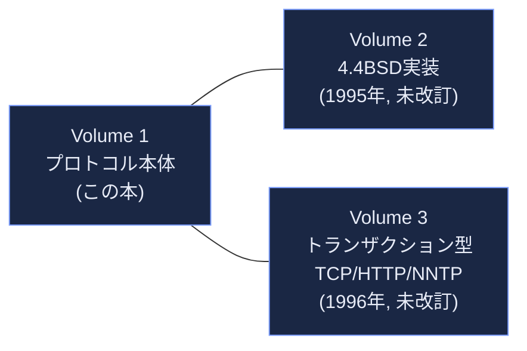

### 0.2 なぜ2026年に読む価値があるか

- **RFCは変わっても"考え方"は変わらない**：TCP/IPのアーキテクチャ原則（レイヤ分離、end-to-endの原則、ベストエフォート配送）は1970年代から本質的に不変です。BBRv3やQUICのような新技術も、この本が説明する基礎モデルの上に構築されています。
- **障害調査・パケット解析の実務直結スキル**：`tcpdump`／Wiresharkでパケットを読む力は、クラウドネイティブ時代でもロードバランサやサービスメッシュのトラブルシューティングに直結します。
- **本ガイドの補完方針**：原著は2011年刊行のため、TCP輻輳制御（BBR）、DNSSEC/DoH/DoQの普及率、post-quantum TLS、IPv6の主要ネットワークでの普及率など、2012年以降の進展は第19部で個別にアップデートします。

### 0.3 前提知識

| 前提 | 目安 | なぜ必要か |
|---|---|---|
| 2進数・16進数の基礎 | IPアドレスやポート番号の表記を理解できる | ヘッダフィールドはビット単位で定義されるため |
| OSI参照モデルの概要 | 7層モデルの名称を知っている | TCP/IPの4〜5層モデルとの対応付けに使う |
| コマンドライン操作 | `ping`／`curl`／シェルの基本 | 本書の実験は端末操作が前提 |
| （推奨）`tcpdump`か`Wireshark`のインストール環境 | 実際にパケットを観察したい場合 | 本書の学習効果は「読む」より「見る」ことで最大化される |

---

<a id="part1"></a>
## 第1部：序論とアーキテクチャ原則（原著第1章 Introduction）

### 1.1 パケット、コネクション、データグラムという3つの視点

ネットワークプロトコルの設計には大きく2つの流儀があります。

1. **コネクション指向（回線交換に近い発想）**：通信前に経路・状態を確立し、以降はその状態に沿ってデータを送る（電話網、TCP）。
2. **コネクションレス（データグラム型）**：各パケットが宛先情報を自己完結的に持ち、都度独立にルーティングされる（郵便、IP、UDP）。

TCP/IPは非常に特徴的な設計を取っています。**ネットワーク層（IP）はコネクションレスなデータグラム型**にし、**その上に乗るトランスポート層でコネクション指向（TCP）とコネクションレス（UDP）の両方を選べるようにする**という二段構えです。

### 1.2 end-to-endの原則とfate sharing

「end-to-endの原則」とは、通信の信頼性確保などの複雑な仕事は、ネットワークの中間ノード（ルータ）ではなく、通信の両端（ホスト）に置くべきだという設計思想です。ルータは「できるだけ速く、できるだけシンプルに転送する」ことに専念し、再送や順序保証といった責務はTCPのようなエンドポイント側のプロトコルが担います。

この思想から導かれるのが **fate sharing（運命共有）** という考え方です。あるコネクションの状態情報は、そのコネクションの両端のホストだけが保持すべきであり、ネットワーク内部の特定のルータに保持させてはいけません。ルータが1台落ちても、迂回路が生きていれば通信の"状態"自体は失われない、という耐障害性がここから生まれます。

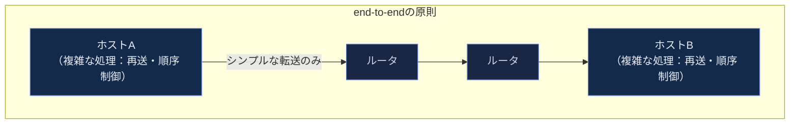

### 1.3 レイヤリングと多重化・多重分離

プロトコルスタックは階層（レイヤ）ごとに責務を分離します。原著は古典的なARPANET参照モデルに基づき4層（リンク層／ネットワーク層／トランスポート層／アプリケーション層）で説明しますが、実務ではOSI 7層モデルとの対応でも語られます。

| OSI 7層モデル | TCP/IP（ARPANET）モデル | 代表プロトコル |
|---|---|---|
| 7. アプリケーション層 | アプリケーション層 | HTTP, DNS, SMTP |
| 6. プレゼンテーション層 | （アプリケーション層に統合） | TLS（実務上はここに位置づけられることが多い） |
| 5. セッション層 | （アプリケーション層に統合） | — |
| 4. トランスポート層 | トランスポート層 | TCP, UDP, QUIC(UDP上) |
| 3. ネットワーク層 | ネットワーク（インターネット）層 | IP, ICMP, IGMP |
| 2. データリンク層 | リンク層 | Ethernet, Wi-Fi, ARP |
| 1. 物理層 | リンク層 | ケーブル、電波 |

各層はデータを送るとき、上位層から受け取ったデータに自分のヘッダを付加して下位層に渡します。これを**カプセル化（encapsulation）**と呼びます。受信側では逆に、下位層から上位層へヘッダを剥がしながら渡していきます。1つの下位層プロトコルの上に複数の上位層プロトコルが乗ることを**多重化（multiplexing）**、受信時にどの上位プロトコルに渡すか判別することを**多重分離（demultiplexing）**と呼びます。

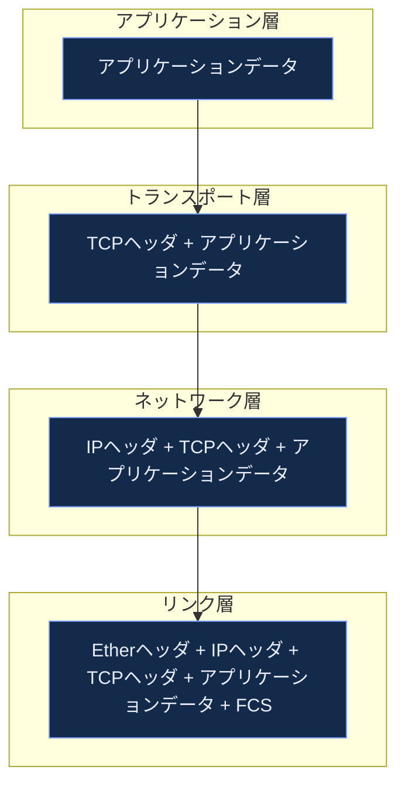

多重分離は「どの識別子を見るか」で層ごとに異なります。

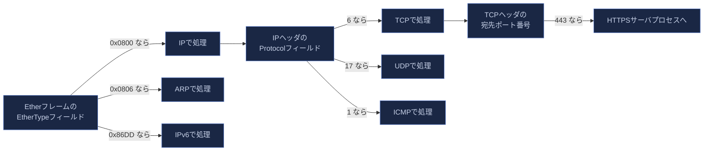

### 1.4 ポート番号・名前・アドレスの役割分担

TCP/IPには「もの（ホスト）を指す」「サービスを指す」「場所を指す」という3つの識別子があり、これらは独立して管理されます。

| 識別子 | 指すもの | 例 |
|---|---|---|
| 名前（Name） | 何であるか | `www.example.com` |
| アドレス（Address） | どこにあるか | `93.184.216.34` |
| ポート番号（Port） | 同一ホスト上のどのプロセスか | `443` |

DNSは名前からアドレスへの変換を担い、ルーティングはアドレスに基づいてパケットを転送し、ポート番号は最終的にホスト内のプロセスへ配送する多重分離に使われます。この分離のおかげで、あるホストのIPアドレスが変わっても名前解決の設定さえ更新すればアプリケーションは影響を受けません（モビリティやDNSベースの負荷分散の基盤にもなっています）。

### 1.5 クライアント/サーバとピアツーピア、APIとしてのソケット

アプリケーション設計のパターンとして、常時待ち受けるサーバに複数のクライアントが接続する**クライアント/サーバモデル**と、各ノードが対等にサーバにもクライアントにもなる**ピアツーピア（P2P）モデル**があります。いずれの場合も、アプリケーションプログラムがトランスポート層にアクセスする標準的な手段が**ソケットAPI**（Berkeley Sockets由来）であり、これは1980年代のBSD UNIXから現在のLinux／Windows／macOSまで基本設計が受け継がれています。

> **ベストプラクティス**
> - レイヤの責務を混同しない：アプリケーションコードでIPアドレスをハードコードせず、名前解決を経由させることでネットワーク変更への耐性を確保する。
> - end-to-endの原則を意識する：中間のプロキシ／ロードバランサに状態を過度に依存させると、そのノードが単一障害点になる。
> - 多重分離のフィールド（EtherType、IP Protocol番号、ポート番号）を意識しておくと、`tcpdump`のフィルタ式（例：`tcp port 443`）の意味が直感的に理解できる。

---

<a id="part2"></a>
## 第2部：インターネットアドレスアーキテクチャ（原著第2章 The Internet Address Architecture）

### 2.1 IPv4アドレスの表記とクラスフルからCIDRへの移行

IPv4アドレスは32ビットで、慣習的に8ビットずつ4つに区切ってドット区切り10進表記（例：`192.0.2.1`）で表します。1980年代には「クラスA/B/C」という固定長のアドレス区分（クラスフルアドレッシング）が使われていましたが、アドレス空間の無駄遣いが深刻化したため、1993年にCIDR（Classless Inter-Domain Routing、RFC 4632）へ移行しました。CIDRでは`/24`のようなプレフィックス長でネットワーク部とホスト部の境界を柔軟に指定します。

| 表記 | 意味 | ホスト数（理論値） |
|---|---|---|
| `192.0.2.0/24` | 上位24ビットがネットワーク部 | 256（うちホスト割当可能254） |
| `192.0.2.0/26` | 上位26ビットがネットワーク部 | 64（うちホスト割当可能62） |
| `0.0.0.0/0` | デフォルトルート（すべてを表す） | — |

### 2.2 サブネッティングとVLSM

CIDRの考え方をネットワーク内部の設計に適用したものがサブネッティングです。1つの大きなアドレスブロックを、用途に応じて異なる長さのプレフィックス（VLSM: Variable Length Subnet Mask）に分割します。

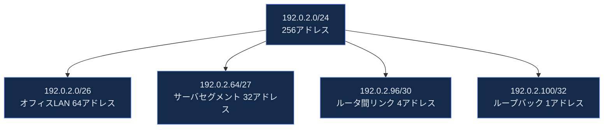

### 2.3 特殊アドレスとプライベートアドレス空間

| アドレス範囲 | 用途 | 定義RFC |
|---|---|---|
| `10.0.0.0/8` | プライベートアドレス | RFC 1918 |
| `172.16.0.0/12` | プライベートアドレス | RFC 1918 |
| `192.168.0.0/16` | プライベートアドレス | RFC 1918 |
| `100.64.0.0/10` | キャリアグレードNAT（CGNAT）共有アドレス空間 | RFC 6598 |
| `127.0.0.0/8` | ループバック | RFC 1122 |
| `169.254.0.0/16` | リンクローカル（APIPA/Zeroconf） | RFC 3927 |
| `224.0.0.0/4` | マルチキャスト | RFC 5771 |

`100.64.0.0/10`はISPがCGNATを展開する際、ホームルータとISP側NATの間で使う専用の共有アドレス空間として2012年に予約されました。IPv4アドレス枯渇が進む中で現在も広く使われています。

### 2.4 IPv6アドレスアーキテクチャ

IPv6アドレスは128ビットで、16ビットごとにコロン区切りの16進数で表記します（例：`2001:0db8:0000:0000:0000:ff00:0042:8329`）。連続するゼロは`::`で1回だけ省略できます（`2001:db8::ff00:42:8329`）。

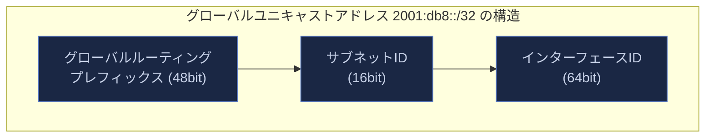

IPv4と異なりIPv6には明確な「クラス」区分はなく、代わりにアドレスの**スコープ（有効範囲）**によって種別を分けます。

| アドレス種別 | プレフィックス | スコープ |
|---|---|---|
| グローバルユニキャスト | `2000::/3` | インターネット全体 |
| リンクローカル | `fe80::/10` | 同一リンク内のみ |
| ユニークローカル（ULA） | `fc00::/7` | 組織内（プライベート相当） |
| マルチキャスト | `ff00::/8` | グループ配送 |
| ループバック | `::1/128` | 自ホスト内 |

IPv6ではブロードキャストが廃止され、代わりにマルチキャストと**エニーキャスト**（同じアドレスを持つ複数ノードのうち最も近い1つに届く）が使われます。エニーキャストはDNSルートサーバやパブリックDNSリゾルバ（例：`1.1.1.1`, `8.8.8.8`）の実運用で広く使われています。

### 2.5 IPv4アドレス枯渇とその後：本書刊行後の状況

原著執筆時点（2011年）はまだIANAの中央在庫からIPv4アドレスを配布できていましたが、2011年2月にIANAの中央在庫が枯渇し、その後地域レジストリ（RIR）も順次枯渇しました。これが本書第2版でIPv4アドレス枯渇とCGNAT・IPv6移行の議論が増補された背景です。この状況は2026年現在も基本的に継続しており、詳細は第19部で扱います。

> **ベストプラクティス**
> - サブネット設計は将来の成長を見込んでVLSMで余白を残す。境界ぎりぎりの設計は後々の再設計コストが高い。
> - プライベートアドレス空間とCGNAT共有アドレス空間（`100.64.0.0/10`）を混同しない。後者はISP側の内部利用を想定した特別な範囲。
> - IPv6設計では「ホストあたり複数アドレス（一時アドレス＋安定アドレス）」が標準的挙動であることを前提に、ログ・監視設計を行う。

---

<a id="part3"></a>
## 第3部：リンク層（原著第3章 Link Layer）

### 3.1 リンク層の責務

リンク層は「同一物理／論理セグメント上の隣接ノード間でフレームを届ける」ことに責任を持ちます。IPが担う「異なるネットワークをまたいだ経路選択」とは異なり、リンク層はMACアドレスのようなローカルな識別子だけを扱います。

### 3.2 イーサネットフレームの構造

現代のLANの大半はイーサネット（IEEE 802.3）です。フレームには送信元・宛先MACアドレス、EtherTypeフィールド（上位プロトコルの識別）、ペイロード、そしてFCS（フレームチェックサム、誤り検出用のCRC）が含まれます。MTU（Maximum Transmission Unit）はイーサネットの標準で1500バイトです（ジャンボフレームでは9000バイト前後まで拡張可能）。

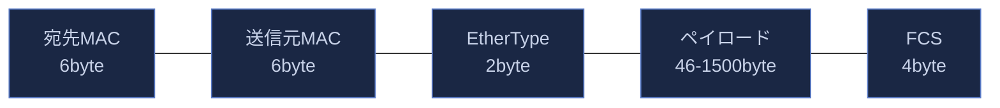

### 3.3 Wi-Fi（無線LAN）とその他のリンク層技術

Wi-Fi（IEEE 802.11系）はイーサネットと同じMACアドレス体系を使いつつ、無線特有の課題（隠れ端末問題、電波干渉、ローミング）に対処する追加機構を持ちます。2011年の原著刊行時点の主流は802.11n（Wi-Fi 4）でしたが、現在はWi-Fi 6/6E/7へと進化しています（詳細は第19部）。

### 3.4 VLANとトランキング

IEEE 802.1Qにより、1本の物理リンク上に複数の論理LAN（VLAN）を多重化できます。フレームに4バイトのVLANタグを挿入し、12ビットのVLAN IDでセグメントを識別します（最大4094個のVLAN）。データセンターやオフィスLANのセグメンテーション（部門ごと、用途ごとの分離）に広く使われます。

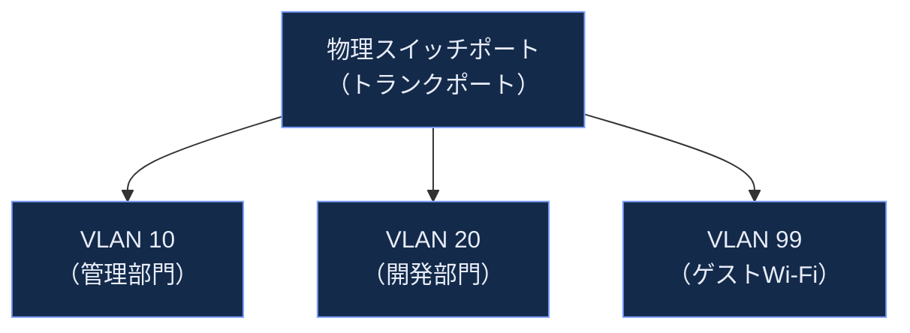

### 3.5 ブリッジとスイッチの学習動作

イーサネットスイッチは受信フレームの送信元MACアドレスを見て「どのポートの先にどのMACアドレスがあるか」を学習し、以降その宛先へのフレームは該当ポートにのみ転送します（フラッディングを避ける）。宛先が未学習の場合は全ポートへフラッディングします。複数スイッチ間でループが発生しないよう、STP（Spanning Tree Protocol）またはその高速版RSTP/MSTPでループ防止トポロジーを維持します。

> **ベストプラクティス**
> - MTUの不一致はパケロス・パフォーマンス劣化の典型的な原因。トンネル（VXLAN, GRE, IPsecなど）を挟む構成では実効MTUが1500バイトを下回ることを忘れずに設計する。
> - VLAN設計はブロードキャストドメインの分離が主目的。1つのVLANに過度なホスト数を詰め込むとARPブロードキャストの負荷が問題になる。
> - 無線LANのトラブルシューティングでは、有線と異なり「電波干渉」「隠れ端末」というリンク層固有の要因を考慮する。

---

<a id="part4"></a>
## 第4部：ARP アドレス解決プロトコル（原著第4章）

### 4.1 ARPが解決する問題

IP層は宛先IPアドレスを知っていますが、同一リンク上でフレームを送るにはMACアドレスが必要です。ARP（Address Resolution Protocol, RFC 826）はこの「IPアドレス→MACアドレス」の変換を、ブロードキャストによる問い合わせ・応答で解決します。

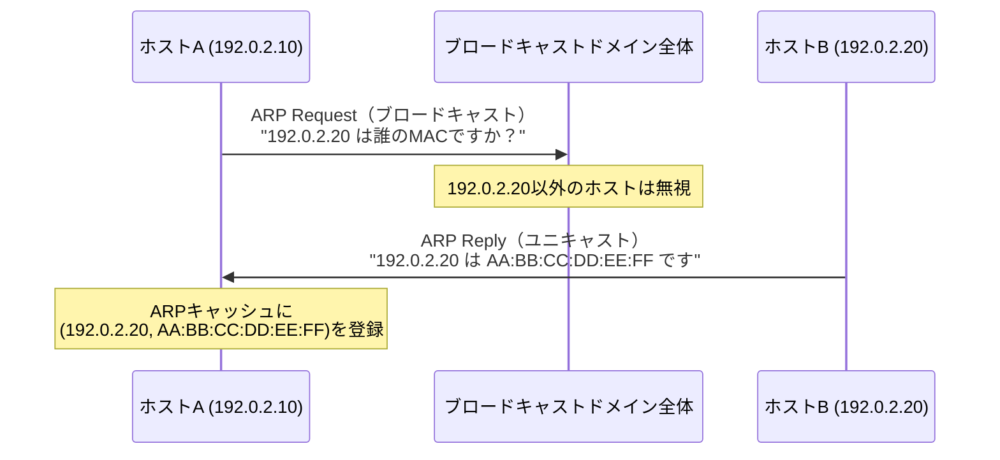

### 4.2 ARPキャッシュとその挙動

解決済みのIP→MACの対応は**ARPキャッシュ**（近隣キャッシュ）に一定時間（実装によるが数分〜数十分）保持され、毎回のブロードキャストを避けます。エントリには通常タイムアウトがあり、期限切れ前に再確認（gratuitous ARPやユニキャストでの再確認）が行われることもあります。

### 4.3 Gratuitous ARP（無償ARP）

自分自身のIPアドレスに対してARP Requestを送る特殊な使い方を**Gratuitous ARP**と呼びます。主な用途は以下の通りです。

- 起動時にIPアドレスの重複を検出する（同じ応答が返ってきたら重複）。
- 他のホストのARPキャッシュを能動的に更新する（フェイルオーバー時にVIPを新しい実体へ切り替える、ロードバランサやHA構成の要）。

### 4.4 ARPの脆弱性とその緩和策

ARPには送信元を検証する仕組みがなく、誰でも任意のIP-MAC対応を主張する応答を送れます。これを悪用した**ARPスプーフィング（ARPポイズニング）**は、中間者攻撃（MITM）の古典的な手法です。攻撃者はデフォルトゲートウェイのIPアドレスに対して自分のMACアドレスを主張する偽のARP応答を送り、被害者の通信を自分経由に誘導します。

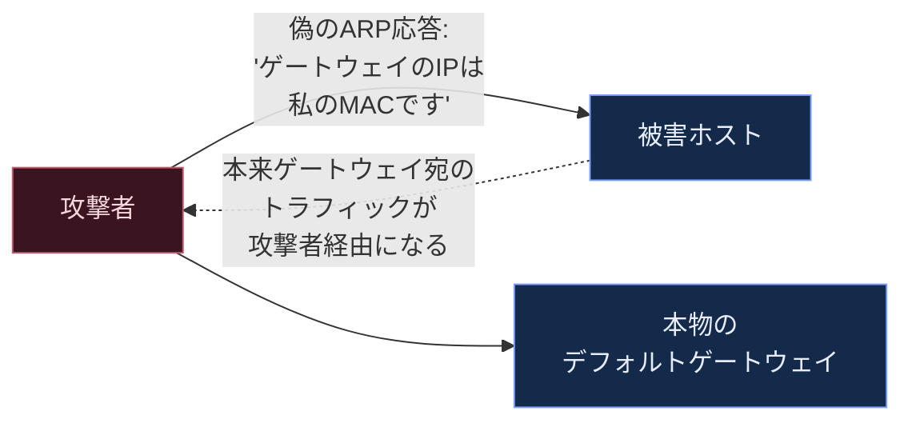

現代のスイッチにおける主な緩和策は次の通りです。

| 対策 | 仕組み |
|---|---|
| DHCPスヌーピング | スイッチがDHCPのやり取りを監視し、正規のIP-MAC-ポート対応の「信頼テーブル」を構築する |
| ダイナミックARP検査（DAI） | 受信したARPパケットをDHCPスヌーピングの信頼テーブルと照合し、不一致なら破棄する |
| IPソースガード | 送信元IPアドレスとMACアドレスの組み合わせを信頼テーブルと照合し、不正なパケットを破棄する |

### 4.5 IPv6における対応：近隣探索プロトコル（NDP）

IPv6ではARPは存在せず、ICMPv6メッセージを使う**近隣探索プロトコル（Neighbor Discovery Protocol, NDP）**が同等の役割を果たします。ARP Requestに相当するのがNeighbor Solicitation、ARP Replyに相当するのがNeighbor Advertisementです。NDPも認証機構を持たないため、ARPスプーフィングに相当する**ND spoofing**や、悪意あるルータ広告（Rogue RA）による攻撃が起こり得ます。対策としてRA Guard（正当なルータ広告のみを通す機能、RFC 6105/7113で標準化）がスイッチに実装されています。

> **ベストプラクティス**
> - 本番スイッチではDHCPスヌーピング＋ダイナミックARP検査を有効化し、未知の送信元からのARP応答を無条件に信頼しない構成にする。
> - IPv6を導入する際はARPだけでなくNDPのセキュリティ（RA Guard）も合わせて設計する。「IPv4だけ守ってIPv6は素通し」という抜け漏れが起きやすい。
> - Gratuitous ARPはHA構成（keepalived, VRRPなど）で正規に使われる仕組みでもあるため、監視ツールが誤検知しないよう正規のフェイルオーバー挙動を把握しておく。

---

<a id="part5"></a>
## 第5部：インターネットプロトコル IP（原著第5章 The Internet Protocol）

### 5.1 IPの基本的な性質

IPは「ベストエフォート・コネクションレス・非信頼」なデータグラム配送サービスです。

- **ベストエフォート**：配送を最善努力するが保証しない（届かない可能性がある）。
- **コネクションレス**：各パケットは独立して扱われ、事前のコネクション確立を必要としない。
- **非信頼**：パケットの損失・重複・順序入れ替えを検出・訂正する責務を持たない（上位層に委ねる）。

この「シンプルさに徹する」設計が、IPが多種多様な下位リンク層技術（イーサネット、Wi-Fi、衛星回線、モバイル網）の上で動作できる汎用性の源泉です。

### 5.2 IPv4ヘッダの構造

| フィールド | ビット幅 | 役割 |
|---|---|---|
| Version | 4 | IPバージョン（IPv4なら4） |
| IHL | 4 | ヘッダ長（32bitワード単位） |
| DSCP/ECN | 8 | 優先度制御・輻輳通知 |
| Total Length | 16 | パケット全体の長さ |
| Identification | 16 | フラグメンテーション時の識別子 |
| Flags | 3 | フラグメント制御（DFビット等） |
| Fragment Offset | 13 | フラグメントの位置 |
| TTL | 8 | 生存時間（ホップごとに1減算、0でパケット破棄） |
| Protocol | 8 | 上位プロトコル種別（TCP=6, UDP=17, ICMP=1） |
| Header Checksum | 16 | ヘッダのみの誤り検出 |
| Source Address | 32 | 送信元IPv4アドレス |
| Destination Address | 32 | 宛先IPv4アドレス |
| Options | 可変 | オプション（実運用では稀） |

### 5.3 TTLとルーティングループ対策

TTL（Time To Live）はルータを1つ経由するごとに1ずつ減算され、0になったパケットは破棄されます。これはルーティングループでパケットが無限に転送され続けることを防ぐ安全弁です。`traceroute`はTTLを1から順に増やしながらパケットを送り、各ホップで発生する「TTL超過」のICMPエラーを利用して経路上のルータを可視化するツールです。

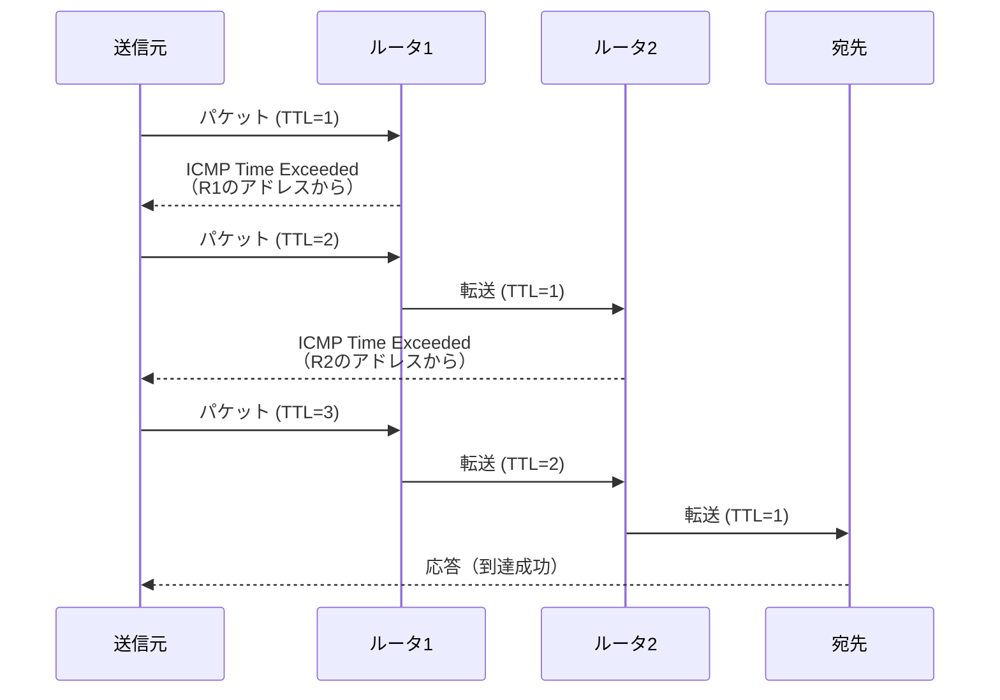

### 5.4 IPフラグメンテーションの基礎（詳細は第10部）

送信するパケットが経路上のいずれかのリンクのMTUを超える場合、IPはパケットを複数のフラグメントに分割します。ただしフラグメンテーションはパフォーマンス上のデメリット（1つのフラグメント喪失で全体が再送になる、処理負荷が増す）が大きいため、現代の実装では**Path MTU Discovery（PMTUD）**によって経路上の最小MTUを事前に把握し、そもそもフラグメントが発生しないサイズでパケットを送出するのが基本方針です。

### 5.5 IPv6ヘッダとIPv4からの主な変更点

IPv6ヘッダは40バイト固定長で、IPv4より単純化されています。主な変更点は次の通りです。

| 変更点 | IPv4 | IPv6 |
|---|---|---|
| ヘッダチェックサム | あり | 廃止（上位層・リンク層に委任） |
| フラグメンテーション | ルータも実施可能 | 送信ホストのみが実施（ルータは行わない） |
| ヘッダ長 | 可変（オプションあり） | 固定40バイト＋拡張ヘッダのチェーン |
| ブロードキャスト | あり | 廃止（マルチキャストに統合） |
| アドレス長 | 32bit | 128bit |

IPv6ではオプション機能が「拡張ヘッダ」としてメインヘッダの後ろにチェーン状に連結される設計になっており、必要な拡張ヘッダだけを付加できる柔軟性があります（Hop-by-Hop Options, Routing, Fragment, Destination Optionsなど）。

> **ベストプラクティス**
> - `traceroute`／`mtr`はTTL超過ICMPを利用した診断ツールであることを理解しておくと、途中経路のファイアウォールがICMPをブロックしている場合の"見えない区間"の解釈を誤らずに済む。
> - IPv6移行時は「フラグメンテーションはホストのみが行う」という設計変更を踏まえ、PMTUDが正しく機能する経路設計（ICMPv6 Packet Too Bigの到達性確保）が必須になる。
> - IPv4ヘッダのDSCP/ECNフィールドは輻輳制御・QoSと直結する。クラウド環境ではロードバランサやNATがこれらのフィールドを書き換える／落とす場合があるため、エンドツーエンドでの挙動を検証する。

---

<a id="part6"></a>
## 第6部：システム構成 DHCPと自動設定（原著第6章）

### 6.1 なぜ自動設定が必要か

ホストがネットワークに参加するには、IPアドレス・サブネットマスク・デフォルトゲートウェイ・DNSサーバといった複数の情報が必要です。これらを手作業で設定するのは大規模ネットワークでは非現実的なため、DHCP（Dynamic Host Configuration Protocol, IPv4版はRFC 2131、IPv6版DHCPv6は現行RFC 8415）による自動配布が標準になっています。

### 6.2 DHCPのDORAプロセス

DHCPv4のアドレス取得は4段階のやり取り（通称DORA）で行われます。

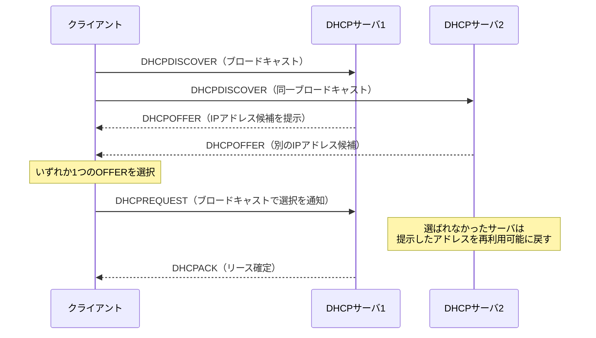

DHCPREQUESTがブロードキャストされる理由は、選ばれなかった他のDHCPサーバにも「このオファーは使われなかった」ことを知らせ、提示したアドレスを再利用可能にするためです。

### 6.3 リースとリニューアル

割り当てられたアドレスには**リース期間**があります。クライアントはリース期間の50%が経過した時点（T1タイマー）で元のサーバにユニキャストで更新（DHCPREQUEST）を試み、87.5%経過（T2タイマー）してもなお更新できなければブロードキャストで任意のサーバに再取得を試みます。

### 6.4 DHCPリレーエージェント

DHCPサーバがクライアントと同一のブロードキャストドメインにいない場合、ルータが**DHCPリレーエージェント**として動作し、クライアントのブロードキャストをユニキャストでDHCPサーバへ中継します（`giaddr`フィールドにリレーエージェント自身のアドレスを設定）。

### 6.5 IPv6の自動設定：SLAACとDHCPv6

IPv6には2つの自動設定方式があり、併用も可能です。

| 方式 | 概要 | 主な用途 |
|---|---|---|
| SLAAC（Stateless Address Autoconfiguration, RFC 4862） | ルータ広告（RA）のプレフィックス情報とホスト側で生成するインターフェースIDを組み合わせて自ら住所を決める | シンプルな環境、IoT機器 |
| DHCPv6（stateful, RFC 8415） | DHCPv4同様、サーバが集中管理してアドレスを払い出す | アドレス追跡やコンプライアンス要件のある企業ネットワーク |

実務では「SLAACでアドレス割当、DHCPv6でDNSサーバ情報などのオプションのみ配布」というハイブリッド運用（RA の M/O フラグで制御）も広く行われています。DHCPv6のサーバ二重化には、DHCPv4の伝統的なDORAとは異なる**DHCPv6フェイルオーバー（RFC 8156, 2017年）**という仕組みが後から追加されました。

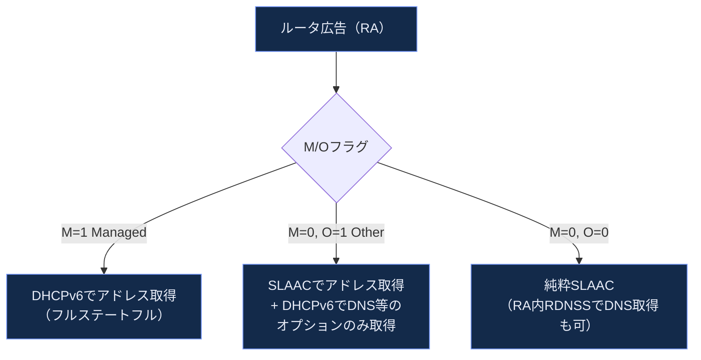

### 6.6 DHCPのセキュリティ課題

DHCPには送信元認証の仕組みがなく、不正なDHCPサーバ（Rogue DHCP）が偽の設定情報（悪意あるデフォルトゲートウェイなど）を配布できてしまいます。緩和策として、スイッチ側で正規のDHCPサーバが接続されたポートのみを信頼する**DHCPスヌーピング**（第4部のARP対策とも連携）が標準的に使われます。

> **ベストプラクティス**
> - リース期間はネットワークの流動性（ゲスト無線か固定オフィス機器か）に応じて調整する。短すぎるとDHCPサーバ負荷が増し、長すぎるとアドレス枯渇時の回収が遅れる。
> - IPv6ネットワークでは、SLAACのみ・DHCPv6のみ・ハイブリッドのどれを採用するか、DNS配布方法（RA RDNSS vs DHCPv6）まで含めて設計時に明確化する。
> - Rogue DHCP対策としてDHCPスヌーピングを有効化し、想定外のポートからのDHCPOFFER/ACKを遮断する。

---

<a id="part7"></a>
## 第7部：ファイアウォールとNAT（原著第7章）

### 7.1 ファイアウォールの基本分類

| 種別 | 判断基準 | 特徴 |
|---|---|---|
| パケットフィルタ型 | IPアドレス・ポート・プロトコル番号 | 高速だがコネクションの文脈を見ない |
| ステートフルインスペクション型 | 上記＋コネクションの状態（SYN送出済みか等） | 現代の主流。応答パケットのみを自動許可できる |
| アプリケーション層（プロキシ）型 | アプリケーションプロトコルの中身まで検査 | 詳細な制御が可能だが処理負荷が高い |

### 7.2 NAT（ネットワークアドレス変換）の基本動作

NATはプライベートアドレス空間とパブリックアドレス空間の間でIPアドレス（とポート番号）を書き換える仕組みです。最も一般的なのは**NAPT（Network Address Port Translation、俗にPAT）**で、複数の内部ホストが1つのパブリックIPを共有し、送信元ポート番号で内部ホストを区別します。

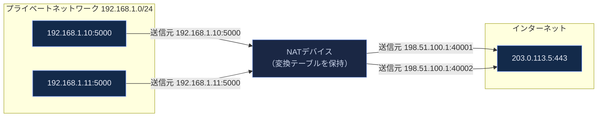

### 7.3 キャリアグレードNAT（CGNAT）とNAT444

IPv4アドレス枯渇に対応するため、ISPは自社網内でもNATを行い、家庭用ルータのNAT（NAT44）に加えてISP側でもう一段NATを行う**NAT444**構成（CGNAT）を広く採用しています。CGNATでは`100.64.0.0/10`（第2部参照）がホームルータとISP CGN機器の間で使われます。


CGNATはIPv4枯渇への延命策として有効な一方、以下のような構造的な副作用があります。

- **end-to-endの原則が崩れる**：中間にNATという「状態を持つ装置」が入るため、外部から内部への直接接続（サーバ運用、P2P、ポートフォワーディング）が困難になる。
- **ポート枯渇**：1つのパブリックIPを多数のユーザで共有するため、同時接続数の上限に達しやすい。
- **法執行・監査の複雑化**：同一の公開IPアドレスの背後に多数のユーザが存在するため、IPアドレスだけでは個人を特定できない。

### 7.4 NAT64／DNS64：IPv6専用網からIPv4へのアクセス

IPv6専用（IPv6-only）ネットワークからIPv4しか対応していないサービスにアクセスするための移行技術がNAT64／DNS64です。DNS64がAAAAレコードを持たないドメインに対して疑似的なIPv6アドレス（`64:ff9b::/96`にIPv4アドレスを埋め込んだもの）を合成して返し、NAT64ゲートウェイがそのアドレス宛のIPv6トラフィックをIPv4に変換して転送します。

### 7.5 NATがトランスポート層プロトコルに与える影響

NATはIPヘッダだけでなく、TCP/UDPのポート番号やチェックサムも書き換える必要があります。またFTPのようにペイロード内にIPアドレスやポート番号を埋め込むプロトコル（アクティブFTPのPORTコマンドなど）は、NAT側で**ALG（Application Level Gateway）**によるペイロード書き換えを必要とします。

> **ベストプラクティス**
> - サーバを外部公開する構成では、CGNAT環境下のクライアントからの着信接続を前提にしない（IPv6デュアルスタックや明示的なポートフォワーディングで代替する）。
> - NATの「フルコーンNAT」「制限コーンNAT」「対称NAT」といった振る舞いの違いはP2P・VoIPの接続性に直結する。STUN/TURN/ICEといったNATトラバーサル技術の選定前に、実際のNATタイプを確認する。
> - ステートフルファイアウォール／NATのセッションテーブルにはタイムアウトがある（第17部のTCPキープアライブとも関連）。アイドル接続を維持したいアプリケーションは、この既定タイムアウトより短い間隔でキープアライブを送る設計にする。

---

<a id="part8"></a>
## 第8部：ICMPv4/ICMPv6（原著第8章）

### 8.1 ICMPの役割：IPの「アシスタントプロトコル」

ICMP（Internet Control Message Protocol）はIP自身にはないエラー通知・診断機能を補完するプロトコルです。IPは「ベストエフォートで配送を試み、失敗しても黙って捨てる」のが基本ですが、それでは運用上不便なため、パケットが破棄された理由をICMPメッセージとして送信元に通知します。ICMPはIPペイロードとして運ばれる（IP Protocol番号1）ため、レイヤとしてはネットワーク層に位置づけられます。

### 8.2 主要なICMPv4メッセージ

| Type | 名称 | 主な用途 |
|---|---|---|
| 0 | Echo Reply | `ping`の応答 |
| 3 | Destination Unreachable | 宛先到達不可（Code別に細分化） |
| 3 / Code 4 | Fragmentation Needed and DF Set | Path MTU Discoveryで使用 |
| 5 | Redirect | より良い経路の通知（現代では悪用リスクからほぼ無効化） |
| 8 | Echo Request | `ping`の要求 |
| 11 | Time Exceeded | TTL超過（`traceroute`が利用） |

### 8.3 Path MTU Discovery（PMTUD）の仕組み

送信ホストはまずDFビット（Don't Fragment）を立てた最大サイズのパケットを送出します。経路上のどこかのリンクでMTUを超えた場合、そのルータはパケットを破棄し「Fragmentation Needed and DF Set（Type 3, Code 4）」ICMPメッセージを、超過できなかったリンクの実際のMTU値を添えて送信元に返します。送信ホストはこれを受けてパケットサイズを縮小し再送します。

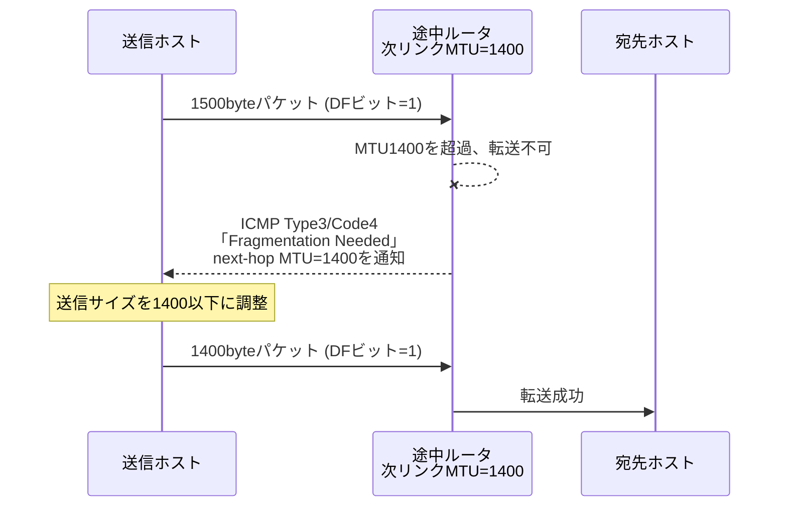

**PMTUDブラックホール問題**：経路上のファイアウォールがICMPを一律ブロックしていると、このType3/Code4メッセージが送信元に届かず、送信ホストは永久に最適なサイズを学習できません。結果として、大きなパケットだけが送達されず接続が謎のハングを起こす「PMTUDブラックホール」という典型的な障害パターンが発生します。

### 8.4 ICMPv6：単なるエラー通知を超えた基盤プロトコル

ICMPv6はICMPv4よりも役割が大きく拡張されています。IPv4では別プロトコルだったARP（第4部）とIGMP（第9部）に相当する機能が、ICMPv6のメッセージタイプとしてすべて統合されています。

| 分類 | ICMPv6 Type | 相当するIPv4の仕組み |
|---|---|---|
| エラー通知 | 1〜4 | ICMPv4のエラーメッセージ群 |
| Echo Request/Reply | 128/129 | ICMPv4 Type 8/0（`ping`） |
| Router Solicitation/Advertisement | 133/134 | なし（IPv4はDHCP依存） |
| Neighbor Solicitation/Advertisement | 135/136 | ARP Request/Reply |
| Multicast Listener系 | 130〜132, 143 | IGMP |

### 8.5 セキュリティ上の注意点

ICMPはネットワークスキャン（`ping`スイープ）や、増幅型DDoS攻撃（Smurf攻撃など）に悪用された歴史があるため、多くの環境でICMPを一律遮断する運用が見られます。しかしICMPv6のNeighbor Discovery関連メッセージは、IPv6の基本的な通信そのものに必須（ARPに相当）であるため、ICMPv4と同じ感覚で「とりあえず全部ブロック」するとIPv6通信そのものが機能しなくなります。

> **ベストプラクティス**
> - ファイアウォール設計では「ICMP＝不要な雑音」として一律遮断せず、Type3/Code4（PMTUD）とICMPv6のNeighbor Discovery関連メッセージは必ず許可する。
> - `ping`が通らないことと実サービスが疎通しないことは別問題。ICMPだけを見て「ネットワークがダウンしている」と即断しない（多くの本番環境でICMP Echoは意図的にフィルタされている）。
> - IPv6環境の構築・トラブルシューティングでは、ARP相当の機能がICMPv6に統合されていることを踏まえ、`tcpdump`のフィルタも`icmp6`側を確認する習慣をつける。

---

<a id="part9"></a>
## 第9部：ブロードキャストとマルチキャスト IGMP/MLD（原著第9章）

### 9.1 ブロードキャストの限界とマルチキャストの利点

ブロードキャストは「同一セグメント上の全ホストへ届ける」単純な仕組みですが、興味のないホストにも強制的に処理負荷をかけてしまいます。IPマルチキャストは「関心のあるホストだけが加入するグループ」にのみ配送する仕組みで、映像配信やルーティングプロトコル（OSPFなど）の制御メッセージ配布に使われます。IPv6にはそもそもブロードキャストが存在せず、この用途はすべてマルチキャストに一本化されています。

### 9.2 IGMP（IPv4）とMLD（IPv6）

| プロジェクト | IPv4 | IPv6 |
|---|---|---|
| プロトコル名 | IGMP（Internet Group Management Protocol） | MLD（Multicast Listener Discovery） |
| 実装レイヤ | IPの直上（Protocol番号2） | ICMPv6のメッセージタイプとして統合 |
| 現行バージョン | IGMPv3 | MLDv2 |

ホストはIGMP/MLDを使ってローカルルータに「このマルチキャストグループに加入したい」と通知し、ルータはこの情報を基にマルチキャストトラフィックをそのセグメントへ転送するかどうかを判断します。

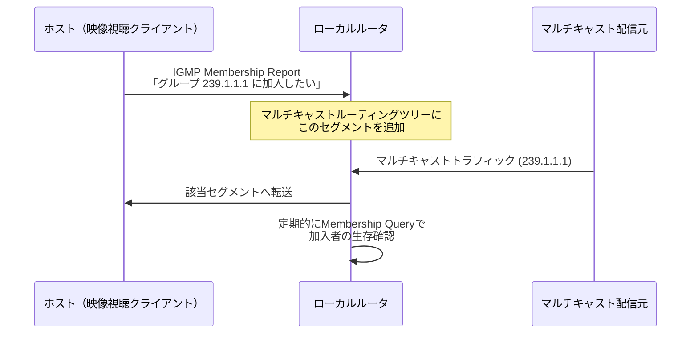

### 9.3 マルチキャストルーティングの概要

IGMP/MLDはホストとローカルルータ間の「加入表明」を扱うのに対し、ルータ間でマルチキャストツリーを構築するのはPIM（Protocol Independent Multicast）などの別プロトコルの役割です。PIM-SM（Sparse Mode）が広く使われ、Rendezvous Point（RP）を経由してソースツリーまたは共有ツリーを構築します。

> **ベストプラクティス**
> - マルチキャストはL2スイッチでもIGMPスヌーピングを有効化しないと、結局全ポートにフラッディングされ本来の効率化メリットが失われる。
> - パブリッククラウドの多くはネイティブなL2マルチキャストをサポートしないため、マルチキャスト前提の設計（金融系のマーケットデータ配信など）はオンプレミス／専用線接続を要することが多い。
> - IPv6環境ではブロードキャストが存在しないため、旧IPv4前提の設計（DHCPのブロードキャストなど）をそのまま持ち込めない点に注意する。

---

<a id="part10"></a>
## 第10部：UDPとIPフラグメンテーション（原著第10章）

### 10.1 UDPの設計思想：シンプルさの追求

UDP（User Datagram Protocol, RFC 768）はTCPと対照的に、コネクション確立・順序保証・再送制御・輻輳制御のいずれも持たない、極めて薄いトランスポート層プロトコルです。ヘッダはわずか8バイト（送信元ポート・宛先ポート・長さ・チェックサムの4フィールドのみ）です。


### 10.2 UDPが適する場面

| 特性 | 説明 | 典型的な用途 |
|---|---|---|
| 低遅延 | ハンドシェイクや再送待ちがない | DNSクエリ、リアルタイム音声・映像 |
| ブロードキャスト/マルチキャスト対応 | TCPは1対1のコネクションのみ | DHCP、ストリーミング配信 |
| 独自の信頼性実装が可能 | アプリケーション側で必要な分だけ再送等を実装できる | QUIC（HTTP/3の基盤、UDP上に構築） |

### 10.3 IPフラグメンテーションの詳細動作

送信するデータグラムがリンクのMTUを超える場合、IPは元のデータグラムを複数のフラグメントに分割します。各フラグメントは同じ**Identificationフィールド**を持ち、**Fragment Offset**フィールドで元データ内の位置を、**More Fragmentsフラグ**で「まだ後続フラグメントがあるか」を示します。受信側はこれらの情報を使って元のデータグラムを再構築します。

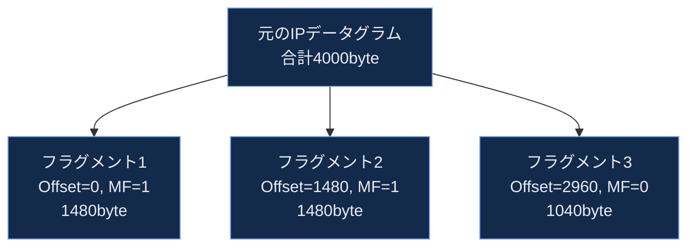

### 10.4 フラグメンテーションはなぜ「避けるべき」設計とされるのか

- **1つのフラグメント喪失＝全体喪失**：フラグメントの一部でもパケロスすると、元データグラム全体が再構築不能になり破棄される。UDPには再送機構がないため、上位アプリケーションが再送するまでデータは失われたままになる。
- **中間経路での処理コストとステート**：一部のファイアウォール／ロードバランサはフラグメントの再構築が必要になり負荷が増す。
- **フラグメンテーション攻撃**：意図的に細工したフラグメントでファイアウォールの検査を回避する攻撃（Tiny Fragment Attack、Overlapping Fragment Attackなど）の歴史があり、多くのセキュリティ機器がフラグメントを異常視・破棄する。

このため現代の実運用では、UDPアプリケーション自身がペイロードサイズをMTUに収まるよう制御する（例：DNSはEDNS0でUDPペイロードサイズを明示的にネゴシエートする）のが定石です。IPv6ではさらに踏み込み、ルータによるフラグメンテーションが廃止され、送信ホストのみがフラグメント化を行える設計になっています（第5部参照）。

> **ベストプラクティス**
> - UDPベースのアプリケーションを設計する際は、最初からMTU超過を前提とせず、ペイロードサイズをPMTUDの結果や既知の安全マージン（IPv4なら576byte、IPv6なら1280byte程度）に収める設計を検討する。
> - DNS（第11部）のようにUDPでの応答サイズが大きくなり得るプロトコルでは、EDNS0によるサイズネゴシエーションとTCPへのフォールバックの両方を実装しておく。
> - フラグメント化されたパケットに依存する設計は、経路上のミドルボックスによって予期せず破棄されるリスクがあることを念頭に置く。

---

<a id="part11"></a>
## 第11部：名前解決とDNS（原著第11章）

### 11.1 階層型データベースとしてのDNS

DNS（Domain Name System, RFC 1035）は、人間が読める名前（`www.example.com`）とIPアドレスを対応づける、世界規模の分散階層型データベースです。ドメイン名はルート（`.`）を頂点に、TLD（`.com`など）、セカンドレベルドメイン（`example`）、サブドメイン（`www`）という木構造で管理され、それぞれの階層を別々の組織が権威サーバとして管理します。

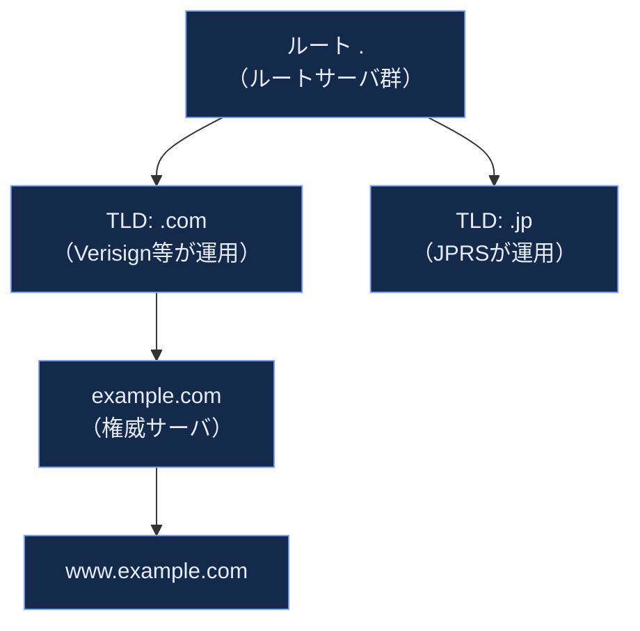

### 11.2 再帰的問い合わせと反復的問い合わせ

一般的なクライアント（スタブリゾルバ）は、フルサービスリゾルバ（キャッシュDNSサーバ）に**再帰的（recursive）問い合わせ**を送ります。フルサービスリゾルバは、ルート→TLD→権威サーバへと自ら**反復的（iterative）問い合わせ**を繰り返して最終的な答えを見つけ、クライアントに1回の応答として返します。

```mermaid
sequenceDiagram
    participant C as クライアント<br/>(スタブリゾルバ)
    participant R as フルサービスリゾルバ<br/>(キャッシュDNSサーバ)
    participant Root as ルートサーバ
    participant TLD as .com TLDサーバ
    participant Auth as example.com<br/>権威サーバ

    C->>R: 再帰的問い合わせ<br/>www.example.comのAは？
    R->>Root: 反復的問い合わせ
    Root-->>R: .comサーバの場所を回答
    R->>TLD: 反復的問い合わせ
    TLD-->>R: example.comサーバの場所を回答
    R->>Auth: 反復的問い合わせ
    Auth-->>R: 93.184.216.34
    R-->>C: 93.184.216.34（結果をキャッシュ）
```

### 11.3 主要なリソースレコード種別

| レコード種別 | 役割 |
|---|---|
| A | ホスト名 → IPv4アドレス |
| AAAA | ホスト名 → IPv6アドレス |
| CNAME | 別名（正規名へのエイリアス） |
| MX | メール配送先サーバの優先度付きリスト |
| NS | あるゾーンを管理する権威サーバの指定 |
| TXT | 任意テキスト（SPFやドメイン検証などに広く使われる） |
| PTR | IPアドレス → ホスト名（逆引き） |

### 11.4 トランスポート層の選択：UDPとTCP

DNSクエリの大半は低遅延なUDPで送られますが、応答サイズが大きい場合（多数のレコード、DNSSEC署名付きなど）はTCPにフォールバックします。またゾーン転送（AXFR/IXFR、プライマリ/セカンダリDNSサーバ間の同期）は常にTCPが使われます。EDNS0（RFC 6891）拡張により、UDPでもより大きなペイロードサイズをネゴシエート可能になっています。

### 11.5 DNSキャッシュとTTL

各リソースレコードにはTTL（Time To Live、秒単位）が設定されており、フルサービスリゾルバはこの期間だけ結果をキャッシュします。TTLが短いほど変更の反映は速いが問い合わせ負荷が増え、長いほど負荷は減るが変更反映が遅れるというトレードオフがあります（DNSベースのフェイルオーバーやロードバランシングでは意図的に短いTTLが使われます）。

> **ベストプラクティス**
> - サービスの切り替え（DR切替、マイグレーション）を計画する際は、事前に対象レコードのTTLを短く設定しておき、切替直前に十分な時間（旧TTL分）を空けておく。
> - DNSはUDPだけの技術ではない。応答サイズやゾーン転送でTCPが使われることを前提に、ファイアウォールでは`53/udp`だけでなく`53/tcp`も許可する。
> - キャッシュの階層構造（スタブリゾルバ→フルサービスリゾルバ→権威サーバ）を理解しておくと、「なぜこの端末だけ古いレコードが見えるのか」といった障害調査が格段にしやすくなる。

---

<a id="part12"></a>
## 第12部：TCPの基礎（原著第12章 TCP: The Transmission Control Protocol, Preliminaries）

### 12.1 TCPが提供するサービス

TCP（Transmission Control Protocol）は現行仕様がRFC 9293（2022年、RFC 793を含む複数のRFCを統合・置換）で定義されており、次の性質を持つコネクション指向のトランスポート層プロトコルです。

- **信頼性のあるバイトストリーム配送**：送ったデータが順序通り、欠損・重複なく届くことを保証する。
- **全二重通信**：双方向で独立してデータを送受信できる。
- **フロー制御**：受信側のバッファ容量に応じて送信ペースを調整する（第15部）。
- **輻輳制御**：ネットワークの混雑状況に応じて送信ペースを調整する（第16部）。

### 12.2 TCPヘッダの構造

| フィールド | ビット幅 | 役割 |
|---|---|---|
| Source Port / Destination Port | 各16 | ポート番号 |
| Sequence Number | 32 | このセグメントの先頭バイトのシーケンス番号 |
| Acknowledgment Number | 32 | 次に期待するバイトのシーケンス番号（ACK時） |
| Data Offset | 4 | ヘッダ長 |
| Flags（Control Bits） | 8前後 | SYN, ACK, FIN, RST, PSH, URGなど |
| Window Size | 16 | 受信可能なウィンドウサイズ |
| Checksum | 16 | 誤り検出 |
| Urgent Pointer | 16 | 緊急データの位置（現代ではほぼ未使用） |
| Options | 可変 | MSS、ウィンドウスケール、SACK許可、タイムスタンプなど |

### 12.3 シーケンス番号とバイトストリームという抽象化

TCPは「パケット」ではなく「連続したバイトストリーム」を運ぶという抽象化を提供します。各バイトには論理的な通し番号（シーケンス番号）が振られており、初期値はランダムな**ISN（Initial Sequence Number）**から始まります（第三者による通信の予測・乗っ取りを防ぐため、ISNの予測可能性は歴史的に重要なセキュリティ課題でした）。

### 12.4 主要なTCPオプション

| オプション | 役割 |
|---|---|
| MSS（Maximum Segment Size） | 受信可能な最大セグメントサイズをコネクション確立時に通知 |
| Window Scale | 16bitのWindow Sizeフィールドの制約を超え、大容量ウィンドウを実現（高帯域遅延積回線で必須） |
| SACK（Selective Acknowledgment） | 欠損した特定範囲のみを選択的に再送要求できるようにする |
| Timestamps | RTT測定の精度向上とシーケンス番号の折り返し対策（PAWS） |

> **ベストプラクティス**
> - Window ScaleオプションはWi-Fi・衛星回線・大陸間通信のような高帯域遅延積（BDP）環境でスループットを左右する。オプションが経路上のミドルボックスで剥がされていないか`tcpdump`で確認する習慣をつける。
> - MSSはリンクのMTUから逆算される値であり、トンネル（VPN、VXLANなど）を挟む構成ではMSS clamping（MSSを意図的に小さく書き換える）が必要になる場合がある。
> - SACKが無効化されている環境では、1つのパケロスで大量の再送が発生しやすい。現代のOSでは既定で有効だが、意図せず無効化されていないか確認する価値がある。

---

<a id="part13"></a>
## 第13部：TCP接続管理（原著第13章）

### 13.1 3ウェイハンドシェイクによるコネクション確立

TCPコネクションはSYN、SYN-ACK、ACKという3つのセグメントの交換で確立されます。これにより両者は互いの初期シーケンス番号（ISN）を交換し、以降のバイトストリームの起点を合意します。

```mermaid
sequenceDiagram
    participant C as クライアント
    participant S as サーバ

    C->>S: SYN (seq=x)
    Note over S: SYNキューにエントリ作成<br/>（SYN RECEIVED状態）
    S-->>C: SYN-ACK (seq=y, ack=x+1)
    C->>S: ACK (seq=x+1, ack=y+1)
    Note over C,S: 両者ESTABLISHED状態<br/>データ転送開始可能
```

### 13.2 TCP状態遷移図

TCPコネクションの状態はRFC 9293で定義される有限状態機械（FSM）としてモデル化されます。

```mermaid
stateDiagram-v2
    [*] --> CLOSED
    CLOSED --> LISTEN: サーバがpassive open
    CLOSED --> SYN_SENT: クライアントがactive open<br/>SYN送信
    LISTEN --> SYN_RECEIVED: SYN受信、SYN-ACK送信
    SYN_SENT --> ESTABLISHED: SYN-ACK受信、ACK送信
    SYN_RECEIVED --> ESTABLISHED: ACK受信
    ESTABLISHED --> FIN_WAIT_1: アプリがclose、FIN送信
    ESTABLISHED --> CLOSE_WAIT: 相手からFIN受信
    FIN_WAIT_1 --> FIN_WAIT_2: ACK受信
    FIN_WAIT_1 --> CLOSING: 同時に相手からもFIN受信
    FIN_WAIT_2 --> TIME_WAIT: 相手からFIN受信、ACK送信
    CLOSING --> TIME_WAIT: ACK受信
    CLOSE_WAIT --> LAST_ACK: アプリがclose、FIN送信
    LAST_ACK --> CLOSED: ACK受信
    TIME_WAIT --> CLOSED: タイムアウト経過（2MSL）
```

### 13.3 コネクション終了：4ウェイクローズとTIME_WAIT

TCPは全二重であるため、終了処理も両方向で独立して行われます（一般に「4ウェイクローズ」と呼ばれます）。片方がFINを送っても、もう片方はまだ送るデータが残っていればすぐには終了しません（**半クローズ**状態）。

最後にACKを送った側は**TIME_WAIT**状態に一定時間（一般的な実装では**2MSL＝Maximum Segment Lifetimeの2倍**）留まります。これは、遅延して届いた古いセグメントが新しい別のコネクションと誤って混同されるのを防ぐための安全策です。

### 13.4 SYNフラッド攻撃とSYN Cookies

サーバはSYNを受け取るとSYN-ACKを返し、クライアントからのACKを待つ間、接続情報を保持するためのメモリ（SYNキュー）を消費します。攻撃者が大量の偽装SYNを送りつけ、ACKを返さないままにすると、SYNキューが枯渇し正規のクライアントが接続できなくなる**SYNフラッド攻撃**が成立します。

対策として広く実装されているのが**SYN Cookies**です。サーバはSYN受信時に接続状態をすぐには保存せず、必要な情報を暗号学的に符号化してSYN-ACKのシーケンス番号自体に埋め込みます。正規のACKが返ってきたときにその値を検証・復元することで、SYNキューへのメモリ割り当てを実質的に不要にし、攻撃への耐性を高めます。

```mermaid
flowchart LR
    Attacker["攻撃者<br/>（大量の偽装SYN）"] -->|"SYN×大量"| Server["サーバ"]
    Server -->|"SYN-ACK<br/>（状態は保存せず<br/>Cookieに符号化）"| Nowhere["応答は返らない<br/>（送信元は偽装）"]
    Legit["正規クライアント"] -->|"SYN"| Server
    Server -->|"SYN-ACK"| Legit
    Legit -->|"ACK<br/>（Cookie検証で復元）"| Server

    classDef bad fill:#3a1420,stroke:#c05a6e,color:#f5d8de
    classDef normal fill:#132a4a,stroke:#7c9eff,color:#e8ecf7
    class Attacker,Nowhere bad
    class Legit,Server normal
```

> **ベストプラクティス**
> - 多数の短命接続を扱うサーバ（Webサーバ、ロードバランサ）ではTIME_WAIT状態のソケットが大量に滞留しポート枯渇を招くことがある。`SO_REUSEADDR`や適切なコネクションプーリング設計で緩和する。
> - SYN Cookiesはほとんどの現代OSでデフォルト有効だが、有効化状態と閾値（SYNキューが何%埋まったら発動するか）を運用環境で確認しておく。
> - `netstat`／`ss`コマンドでTCP状態別のソケット数を可視化すると、CLOSE_WAITが溜まり続けるといったアプリケーション側のバグ（closeし忘れ）を早期に発見できる。

---

<a id="part14"></a>
## 第14部：TCPタイムアウトと再送（原著第14章）

### 14.1 再送の基本原理：ACKが届かなければ再送する

TCPは送信したセグメントごとにタイマーを設定し、一定時間内にACKが返ってこなければそのセグメントをロスと見なして再送します。この待機時間を**RTO（Retransmission Timeout）**と呼びます。

### 14.2 RTOの動的計算（Jacobsonのアルゴリズム）

RTOは固定値ではなく、実測したRTT（往復遅延時間）の平滑化平均（SRTT）とその変動（RTTVAR）から動的に計算されます（Van Jacobsonが1988年に提案し、現在もRFC 6298として標準化されている手法）。

```mermaid
flowchart LR
    A["RTTサンプルを測定"] --> B["SRTT（平滑化RTT）を<br/>指数移動平均で更新"]
    A --> C["RTTVAR（RTT変動）を更新"]
    B --> D["RTO = SRTT + 4×RTTVAR"]
    C --> D
    D --> E["次のセグメントの<br/>再送タイマーに適用"]

    classDef step fill:#1a2744,stroke:#5a7bc7,color:#c8d2e8
    class A,B,C,D,E step
```

RTTの変動が大きいネットワーク（モバイル網など）ではRTTVARが大きくなり、RTOは自動的に長めに設定されます。逆に安定した低遅延ネットワークではRTOは短く保たれ、ロス検出が速くなります。

### 14.3 高速再送（Fast Retransmit）と重複ACK

RTOによる再送は「一定時間待つ」ため反応が遅くなりがちです。より速い検出手法として、受信側が順序の乱れたセグメントを受け取ると同じACK番号を繰り返し送る（**重複ACK**）ことを利用します。送信側は同じACK番号を3回連続で受け取ると（＝3つの重複ACK）、RTOを待たずに即座に該当セグメントを再送します。これを**高速再送**と呼びます。

```mermaid
sequenceDiagram
    participant S as 送信側
    participant R as 受信側

    S->>R: セグメント1 (seq=1000)
    S->>R: セグメント2 (seq=2000)<br/>【ネットワーク上で喪失】
    S->>R: セグメント3 (seq=3000)
    R-->>S: ACK 2000（セグメント1受信、次を期待）
    R-->>S: 重複ACK 2000（セグメント3は順序外）
    S->>R: セグメント4 (seq=4000)
    R-->>S: 重複ACK 2000（2回目）
    Note over S: 3回目の重複ACKで<br/>高速再送を判断
    S->>R: セグメント2を再送 (seq=2000)
    R-->>S: ACK 4000（全て受信確認、まとめてACK）
```

### 14.4 SACK（選択的確認応答）による効率化

重複ACKだけでは「どこまで届いたか」しか分からず、複数のセグメントが同時にロスした場合に非効率な再送が発生します。SACKオプション（第12部）を使うと、受信側は「どの範囲を受信済みか」を明示的にACKに含められるため、送信側は本当に欠けている範囲だけをピンポイントで再送できます。

> **ベストプラクティス**
> - 高遅延・高パケロス環境（衛星回線、混雑した無線網）では高速再送とSACKの効果が特に大きい。これらが有効になっているか（多くのOSで既定有効）を確認する。
> - RTOの動的計算は「安定したネットワークでは速く、不安定なネットワークでは慎重に」というトレードオフを自動調整する仕組みであることを理解しておくと、モバイル回線特有の遅延挙動を誤解しにくくなる。
> - アプリケーション層でも独自の再送・タイムアウトを実装する場合、TCP自体の再送と二重に働いて無駄な負荷を生まないよう設計する（例：HTTPクライアントのリトライとTCP再送の相互作用）。

---

<a id="part15"></a>
## 第15部：TCPデータフローとウィンドウ管理（原著第15章）

### 15.1 フロー制御：受信側のバッファ保護

フロー制御は「受信側が処理しきれる速度を超えて送信側がデータを送らないようにする」仕組みです。TCPヘッダのWindow Sizeフィールドで、受信側は「今すぐ受け入れられるバイト数（受信バッファの空き容量）」を送信側に通知します。送信側はこの値を超えてデータを送ってはいけません。

```mermaid
flowchart LR
    Sender["送信側"] -->|"未確認送信データ<br/>（送信ウィンドウ内）"| Network["ネットワーク"]
    Network --> Receiver["受信側<br/>受信バッファ"]
    Receiver -->|"ACK + Window Size<br/>（残りバッファ容量を通知）"| Sender

    classDef node fill:#132a4a,stroke:#7c9eff,color:#e8ecf7
    class Sender,Network,Receiver node
```

### 15.2 スライディングウィンドウの動作

TCPは「送ったが未確認のデータ量」が受信ウィンドウを超えない範囲で連続的にデータを送り出せる、**スライディングウィンドウ**方式を採用しています。ACKが届くたびにウィンドウが"スライド"し、新たに送信可能なバイト数が増えていきます。

```mermaid
flowchart TB
    subgraph Stream["送信バイトストリーム（左から右へ）"]
        direction LR
        A["送信・ACK済み"] --- B["送信済み・未ACK<br/>（送信ウィンドウ内）"] --- C["未送信だが<br/>送信可能"] --- D["未送信・<br/>ウィンドウ外"]
    end

    classDef acked fill:#132a4a,stroke:#5a7bc7,color:#8a97b5
    classDef inflight fill:#1a2744,stroke:#7c9eff,color:#e8ecf7
    classDef sendable fill:#132a4a,stroke:#7c9eff,color:#c8d2e8
    classDef future fill:#0d1729,stroke:#3a4d75,color:#5a6a8a
    class A acked
    class B inflight
    class C sendable
    class D future
```

### 15.3 ウィンドウスケーリングと帯域遅延積（BDP）

TCPヘッダのWindow Sizeフィールドは16ビットのため、素の状態では最大65,535バイトまでしか表現できません。しかし高速・長距離回線では、必要なウィンドウサイズが**帯域遅延積（BDP = 帯域幅 × RTT）**に比例して大きくなります。

例：帯域1Gbps、RTT100msの回線では、BDP ≈ 1,000,000,000 bit/s × 0.1s ÷ 8 ≈ 12.5MB。この場合65,535バイトの固定ウィンドウでは帯域を全く使い切れません。

これを解決するのが第12部で触れた**Window Scaleオプション**で、実際のウィンドウサイズをヘッダの値に2の乗数倍したものとして解釈することで、理論上最大約1GBまでウィンドウを拡張できます。

### 15.4 Nagleのアルゴリズムと遅延ACK、そしてその相互作用問題

- **Nagleのアルゴリズム**：小さなデータを都度送信すると小さなパケットが大量発生し非効率なため、未確認のデータがある間は新しい小さなデータをバッファし、まとめて送る仕組み。
- **遅延ACK（Delayed ACK）**：受信側が即座にACKを返さず、一定時間（または次の送信データに相乗り）待ってからACKをまとめて返す仕組み。

この2つを同時に有効にすると、双方が互いの送信を待ち合ってしまい、数百ミリ秒単位の不要な遅延が発生する**Nagle/遅延ACK問題**が古くから知られています。対話的・低遅延が求められるアプリケーション（SSHのキー入力、リアルタイムAPIなど）では、送信側で`TCP_NODELAY`ソケットオプションを設定してNagleのアルゴリズムを無効化するのが定石です。

> **ベストプラクティス**
> - 高帯域・高遅延（BDPが大きい）回線を使うアプリケーションでは、Window Scaleが有効か、OSの送受信バッファサイズ上限（`net.core.rmem_max`等）がBDPに対して十分かを確認する。
> - 低遅延が要求される小メッセージ通信（RPC、対話型シェル）では`TCP_NODELAY`の設定を検討する。ただし大量の小パケットがネットワーク効率を悪化させるリスクとのトレードオフを理解した上で使う。
> - フロー制御（受信側の都合）と輻輳制御（ネットワークの都合）は別物であり、実際の送信ウィンドウは両者の小さい方（min）で制限されることを押さえておく（詳細は第16部）。

---

<a id="part16"></a>
## 第16部：TCP輻輳制御（原著第16章）

### 16.1 輻輳制御が解決する問題

フロー制御が「受信側の処理能力」を守るのに対し、輻輳制御は「ネットワーク経路全体の処理能力（ボトルネック帯域）」を守るための仕組みです。送信側は`cwnd`（輻輳ウィンドウ）という内部変数を管理し、実際の送信量は`min(cwnd, 受信ウィンドウ)`で決まります。

### 16.2 古典的な輻輳制御：スロースタートと輻輳回避

```mermaid
flowchart TB
    Start["接続開始<br/>cwnd = 初期値(通常10MSS前後)"] --> SS["スロースタート<br/>ACK受信ごとにcwndを倍増<br/>（指数関数的増加）"]
    SS -->|"cwndがssthreshに到達"| CA["輻輳回避<br/>ACK受信ごとにcwndを線形増加<br/>（1RTTあたり+1MSS）"]
    CA -->|"パケロス検知<br/>（3重複ACKなど）"| Reduce["cwndを半減させ<br/>ssthreshを更新<br/>輻輳回避を継続"]
    CA -->|"RTOタイムアウト"| Reset["cwndを初期値に戻し<br/>スロースタートから再開"]
    Reduce --> CA
    Reset --> SS

    classDef phase fill:#132a4a,stroke:#7c9eff,color:#e8ecf7
    classDef event fill:#3a1420,stroke:#c05a6e,color:#f5d8de
    class Start,SS,CA phase
    class Reduce,Reset event
```

### 16.3 損失ベース方式と遅延ベース方式：CUBICとBBR

現代主要なTCP輻輳制御アルゴリズムは大きく2系統に分けられます。

| 方式 | 判断基準 | 代表アルゴリズム | 採用状況 |
|---|---|---|---|
| 損失ベース | パケットロスの発生を輻輳のシグナルとする | Reno, CUBIC | LinuxやWindows、Appleの各OSで長年デフォルト |
| モデルベース（遅延・帯域推定） | 実測RTTと帯域から経路の状態を推定する | BBR（Bottleneck Bandwidth and RTT） | Googleが開発、YouTubeなど大規模サービスで採用が進む |

**CUBIC**（RFC 9438、2023年に標準化トラックへ格上げ）は、ウィンドウサイズを3次関数（cubic function）に従って増加させることで、高速・長距離回線でも安定してスループットを稼げるよう設計されています。原著刊行後の2010年前後からLinuxの既定アルゴリズムとして採用され、現在も広く使われています。

**BBR**はロスではなく、ボトルネック帯域幅とRTTの推定モデルに基づいて送信ペースを決定する、根本的に異なるアプローチです。詳細な最新動向は第19部で扱います。

```mermaid
flowchart LR
    subgraph LossBased["損失ベース方式（CUBIC等）"]
        L1["ウィンドウを増やし続ける"] --> L2["パケロスが起きる<br/>＝輻輳のシグナル"] --> L3["ウィンドウを減らす"]
    end
    subgraph ModelBased["モデルベース方式（BBR）"]
        M1["RTTと配送レートを継続観測"] --> M2["ボトルネック帯域を推定"] --> M3["推定帯域に合わせて<br/>ペーシング送信"]
    end

    classDef loss fill:#3a1420,stroke:#c05a6e,color:#f5d8de
    classDef model fill:#132a4a,stroke:#7c9eff,color:#e8ecf7
    class L1,L2,L3 loss
    class M1,M2,M3 model
```

### 16.4 輻輳制御はエンドツーエンドで完結する設計

輻輳制御アルゴリズムはTCPの送信側実装だけで完結し、受信側やネットワーク機器の協力を必須としません（これも第1部のend-to-endの原則の具体例です）。ただし、ECN（Explicit Congestion Notification, RFC 3168）のように、ルータが輻輳を検知した際にパケットを破棄する代わりにIPヘッダにマークを付け、それを見た受信側がACK経由で送信側に通知するという、ネットワーク機器が協調するオプション機構も存在します。

> **ベストプラクティス**
> - アプリケーションの体感速度がボトルネック帯域より低い場合、輻輳制御アルゴリズムの選択（`sysctl net.ipv4.tcp_congestion_control`）を確認する価値がある。ただし多くの場合ボトルネックは他要因（DNS解決、TLSハンドシェイク、アプリケーション処理）にある点に注意。
> - 高遅延回線でのスループットテストでは、スロースタートの立ち上がりに一定のRTT数がかかることを踏まえ、短時間の計測で結論を出さない。
> - ECNは有効化することで無駄なパケロス（＝再送コスト）を減らせる可能性があるが、経路上のミドルボックスがECNビットを不正に扱うケースが歴史的にあったため、有効化後は実測で確認する。

---

<a id="part17"></a>
## 第17部：TCPキープアライブ（原著第17章）

### 17.1 キープアライブが解決する問題

TCPコネクションはデータのやり取りがなければ「アイドル」状態のままいつまでも維持されます。しかし実際には、相手ホストがクラッシュした、経路上のNAT/ファイアウォールがセッションテーブルからエントリを削除した、といった理由で相手にはもう届かないのに、こちら側だけがコネクションが生きていると誤認している状態（**半開（half-open）コネクション**）が起こり得ます。TCPキープアライブは、アイドル状態が続いた際に定期的にプローブパケットを送り、相手がまだ生きているかを確認する仕組みです（RFC 9293のAppendixで規定、SHOULDレベルのオプション機能）。

```mermaid
sequenceDiagram
    participant A as ホストA
    participant B as ホストB（クラッシュ済み）

    Note over A,B: 長時間データのやり取りなし（アイドル状態）
    A->>B: キープアライブプローブ
    Note over B: 応答なし（ホストダウン）
    A->>B: キープアライブプローブ（再送、既定は複数回）
    Note over A: 既定回数分応答がなければ<br/>コネクションをエラーで切断
```

### 17.2 OSレベルの既定値とアプリケーションレベルのキープアライブの違い

OSカーネルのTCPキープアライブは一般に「数時間」というかなり長いアイドル時間の後に発動するよう既定設定されており（例：Linuxの`tcp_keepalive_time`は既定7200秒＝2時間）、素早い異常検知には向きません。そのため、多くのアプリケーション・プロトコル（HTTP/2のPINGフレーム、gRPCのキープアライブ、データベース接続プールなど）は、OSのTCPキープアライブとは別に、アプリケーション層で独自の短い間隔のハートビートを実装します。

### 17.3 クラウド環境のアイドルタイムアウトとの整合

クラウドのロードバランサやNATゲートウェイは、TCPの仕様とは無関係に**独自のアイドルタイムアウト**でコネクションを強制切断することがあります。例えばAWSのNetwork Load Balancer（NLB）は既定でTCPアイドルタイムアウトが350秒に設定されており（2024年9月以降は60〜6000秒の範囲で調整可能）、Azure Load Balancerは既定4分（4〜100分の範囲で設定可能）です。アプリケーション側のキープアライブ間隔がこれより長いと、ロードバランサに気づかれないまま接続が切断され、次回送信時に予期しないリセットエラーが発生します。

```mermaid
flowchart LR
    App["アプリケーションの<br/>キープアライブ間隔"] --> Compare{"ロードバランサ／NATの<br/>アイドルタイムアウトより短いか？"}
    Compare -->|"Yes"| OK["接続は維持される"]
    Compare -->|"No"| Fail["ロードバランサ側で<br/>先に切断される<br/>（予期しないRSTエラー）"]

    classDef ok fill:#132a4a,stroke:#7c9eff,color:#e8ecf7
    classDef bad fill:#3a1420,stroke:#c05a6e,color:#f5d8de
    class App,Compare,OK ok
    class Fail bad
```

> **ベストプラクティス**
> - 長時間接続を維持するアプリケーション（DBコネクションプール、WebSocket、gRPCストリーム）では、経路上の各ミドルボックス（ロードバランサ、NATゲートウェイ、プロキシ）のアイドルタイムアウトのうち**最も短いもの**より確実に短い間隔でキープアライブを送るよう設計する。
> - OSの既定TCPキープアライブ（数時間単位）に依存せず、アプリケーション層で明示的にキープアライブ・ハートビートを実装する。
> - クラウド環境ではインスタンスタイプやNIC世代によってもコネクション追跡のアイドルタイムアウトの既定値が変わることがある（例：AWSはNitro第6世代で既定値を大幅に短縮した実績がある）。既定値を過信せず、必要に応じて明示的に設定する。

---

<a id="part18"></a>
## 第18部：セキュリティ EAP・IPsec・TLS・DNSSEC・DKIM（原著第18章）

原著最終章は、TCP/IPスイートの各層に後付けで導入されてきたセキュリティ機構を横断的に扱います。TCP/IPの原設計（1970年代）にはセキュリティが組み込まれておらず、各層で独立に暗号化・認証の仕組みが追加されてきた歴史的経緯を理解することが本章の核心です。

### 18.1 層ごとのセキュリティ機構マップ

```mermaid
flowchart TB
    subgraph L7["アプリケーション層"]
        DKIM["DKIM<br/>（メール送信ドメイン認証）"]
        DNSSEC["DNSSEC<br/>（DNS応答の署名検証）"]
    end
    subgraph L5["セッション/プレゼンテーション相当"]
        TLS["TLS<br/>（トランスポートの上で暗号化）"]
    end
    subgraph L3["ネットワーク層"]
        IPsec["IPsec<br/>（IPパケット自体を暗号化）"]
    end
    subgraph L2["リンク層"]
        EAP["EAP<br/>（ネットワーク接続時の認証）"]
    end

    classDef sec fill:#132a4a,stroke:#7c9eff,color:#e8ecf7
    class DKIM,DNSSEC,TLS,IPsec,EAP sec
```

### 18.2 EAP：接続の入り口での認証

EAP（Extensible Authentication Protocol, RFC 3748）は、Wi-Fi（WPA2/WPA3-Enterprise）や有線802.1X認証で、端末がネットワークへの接続を許可される前に本人確認を行う認証フレームワークです。EAPそのものは特定の認証方式を規定せず、証明書ベース（EAP-TLS）、パスワードベースなど複数の方式を「拡張可能」に収容する枠組みです。

### 18.3 IPsec：ネットワーク層での暗号化

IPsecはIPパケット自体を暗号化・認証するプロトコル群で、主に2つのモードがあります。

| モード | 保護範囲 | 主な用途 |
|---|---|---|
| トランスポートモード | IPペイロードのみ暗号化、IPヘッダは平文 | ホスト間の直接通信保護 |
| トンネルモード | 元のIPパケット全体を新しいIPパケットでカプセル化・暗号化 | サイト間VPN、リモートアクセスVPN |

鍵交換にはIKEv2（Internet Key Exchange version 2）が使われ、実際の暗号化・認証はESP（Encapsulating Security Payload）が担います。

### 18.4 TLS：トランスポート層の上でアプリケーションを保護

TLS（Transport Layer Security）はTCPの上で動作し、アプリケーション層プロトコル（HTTP、SMTP等）を透過的に暗号化します。TLS 1.3（RFC 8446, 2018年）では、ハンドシェイクが1RTT（0-RTT再開も可能）に短縮され、鍵交換方式も前方秘匿性（Forward Secrecy）を持つ方式に限定されるなど、大幅な高速化・簡素化がなされました。

```mermaid
sequenceDiagram
    participant C as クライアント
    participant S as サーバ

    C->>S: ClientHello<br/>（対応する鍵共有方式・暗号スイートを提示）
    S-->>C: ServerHello + 鍵共有<br/>+ EncryptedExtensions<br/>+ Certificate + CertificateVerify + Finished
    Note over C: サーバ証明書を検証
    C->>S: Finished
    Note over C,S: 以降アプリケーションデータを<br/>暗号化して送受信（1RTTで完了）
```

### 18.5 DNSSECとDKIM：改ざん・なりすまし対策

- **DNSSEC**：DNS応答に電子署名（RRSIGレコード）を付与し、キャッシュポイズニングのような応答改ざん攻撃からリゾルバを守ります。ルートゾーンから権威ゾーンまで、署名の連鎖（Chain of Trust）を検証します。
- **DKIM**：送信メールにドメイン所有者の秘密鍵で電子署名を付け、受信側がDNS上の公開鍵（TXTレコード）で検証することで、送信ドメインのなりすましを検出します。SPF・DMARCと組み合わせて使われるのが一般的です。

### 18.6 なぜセキュリティが「後付け」なのか

TCP/IPの原設計は学術・研究ネットワークという信頼された参加者間の通信を想定しており、暗号化や認証は当初のスコープ外でした。インターネットが商用化・大衆化するにつれ、各層で個別にセキュリティ機構が追加されていった結果、現在のような「層ごとに異なるセキュリティ機構が併存する」構造になっています。この歴史的経緯を理解すると、なぜ「HTTPSを使っているから安全」だけでは不十分で、DNS・ルーティング（BGP）・メール配送など複数の層でそれぞれ対策が必要なのかが見えてきます。

> **ベストプラクティス**
> - 「暗号化されているから安全」と短絡せず、対象としている層（通信内容の秘匿か、経路の真正性か、送信者の真正性か）を明確に区別して対策を積み重ねる。
> - DNSSECを導入する場合は、権威サーバ側の署名だけでなく、クライアント側（リゾルバ）が実際に検証（バリデーション）を行っているかも別問題であることに注意する（普及率の詳細は第19部）。
> - IPsecとTLSはどちらもVPN用途で使われるが、保護する層が異なる（ネットワーク層 vs トランスポート層以上）ため、要件（透過性、パフォーマンス、対応クライアントの幅）に応じて使い分ける。

---

<a id="part19"></a>
## 第19部：2026年8月時点の最新動向

原著第2版の刊行（2011年）から10年以上が経過し、TCP/IPスイートの各要素は大きく進化しています。本章では2026年8月30日時点の情報をWeb検索で調査し、原著の各章に対応させる形でアップデートを整理します。

### 19.1 TCP仕様そのものの統合（第12〜17部関連）

2022年8月、IETFはTCPの散逸した仕様群（RFC 793本体および複数の更新RFC）を統合した**RFC 9293**を発行し、正式にInternet Standard（STD 7）に格上げしました。原著が参照していたRFC 793は現在は廃止（Obsolete）扱いです。

### 19.2 輻輳制御の進化：CUBIC標準化とBBRv3（第16部関連）

- **CUBIC**は2023年8月に**RFC 9438**として標準化トラックに格上げされ、RFC 8312を置き換えました。Linux・Windows・Appleの各スタックで既定アルゴリズムとして採用され続けています。
- **BBR**はGoogleが開発した独自アルゴリズムとして広く実運用されており、2026年時点でBBRv3がLinuxカーネル6.x系に組み込まれています。IETF CCWG（Congestion Control Working Group）でdraft-ietf-ccwg-bbr仕様の標準化が進行中です。CloudflareのquicheやMetaのmvfst（QUICスタック）でも第一級の選択肢として提供されています。

### 19.3 IPv4アドレス枯渇後の世界：CGNATとIPv6の共存（第2・7部関連）

Googleの計測によれば、IPv6ネイティブアクセス率は2026年3月28日に世界平均で初めて50%を突破しました（50.10%）。ただし国別の差は依然大きく、フランス・インド・サウジアラビアが70%前後である一方、イタリア17%、スペイン10%、エジプト4%程度にとどまるなど、地域差が顕著です。CGNAT（NAT444）は引き続きIPv4アドレス共有の主要手段として広く使われており、家庭内のNAT44とISP側のCGNATが直列するアーキテクチャは今後も当面併存すると見られます。

### 19.4 DNSのセキュリティ・プライバシー強化の進展（第11・18部関連）

- **DNSSEC**：検証（バリデーション）率は2025年時点でグローバル平均35〜36%程度、EU圏では約49%と地域差があります。エンドツーエンド（キャッシュDNSからスタブリゾルバまで）でのDNSSEC保護率は2026年に入り緩やかな上昇傾向にありますが、依然として全クエリの1%未満にとどまっています。
- **暗号化DNS**：DoT（DNS over TLS）とDoH（DNS over HTTPS）を合わせた暗号化DNSのシェアは、2026年5月時点でクエリ全体の約12%前後で推移しています。DoQ（DNS over QUIC）は仕様上の性能優位性が確認されつつも、主要ブラウザでの採用はまだ限定的です。
- **Encrypted Client Hello（ECH）**：TLSハンドシェイクのSNI（宛先ホスト名）が平文で漏れる問題に対応するRFC 9849が2026年3月に標準化されました。

### 19.5 ポスト量子暗号への移行（第18部関連）

「Harvest now, decrypt later（今収集し将来復号する）」攻撃への備えとして、TLS 1.3の鍵交換にML-KEM（旧称Kyber）を組み合わせるハイブリッド方式の展開が急速に進んでいます。Cloudflareの計測では、2026年にハイブリッドポスト量子鍵交換がTLS 1.3ハンドシェイクの過半数（Q2時点で約54%）に到達したと報告されています。ブラウザ側ではChrome・Firefox・Edge・Safariが2026年時点でデフォルト有効化しており、IPsec（RFC 9370）やCloudflare One（2026年2月）でも同様のハイブリッド方式が展開されています。証明書自体のポスト量子署名への移行はより緩やかなペースで進行中です。

### 19.6 BGPルーティングセキュリティの進展（第5・7部の周辺領域）

RPKI（Resource Public Key Infrastructure）によるROV（Route Origin Validation）のカバー率は、2026年6月29日時点でHurricane Electricの計測によればグローバルの経路announce（アナウンス）の67.43%に達しました（2024年5月に初めて過半数を突破して以降の継続的な進展）。一方でRIPE Labsの分析（2026年7月）は、ROVが対応できるのは「経路のオリジン（発信元AS）検証」のみであり、経路操作・整合性・ポリシー違反・セッションベースの攻撃といった他の攻撃分類には別の対策（ASPA、BGPsecなど）が必要だと指摘しています。ASPAはまだ採用が限定的で、BGPsecはルータの処理負荷の高さから次世代ハードウェア世代まで本格普及を待つ状況です。

### 19.7 HTTP/3・QUICによるトランスポート層の再設計（第10・12部の周辺領域）

QUIC（UDP上に構築されたトランスポート、RFC 9000）を基盤とするHTTP/3は、2026年時点でCloudflare Radarの計測により人間由来のWebトラフィックの約30〜35%程度を占めるまでに普及しています（測定方法によって21〜39%と幅がある）。QUICはTCPのヘッドオブライン（HOL）ブロッキング問題（1つのストリームのパケロスが他の独立したストリームまで停止させてしまう問題）を、ストリームごとに独立した再送制御を行うことで解消しています。QUICの輻輳制御にはCUBIC相当のアルゴリズムに加え、BBRも実運用で採用されています。

### 19.8 VPN技術の勢力図：WireGuardの台頭とIPsecの併存（第18部関連）

軽量な実装（コードベースが小さく監査しやすい）を特徴とする**WireGuard**は、2020年にLinuxカーネル5.6へ統合されて以降、個人利用・モバイル・クラウドネイティブ環境で急速にシェアを伸ばしています。ただしIETF Standards Track化はされておらず（RFC 9518はInformational扱い）、企業のサイト間VPNやレガシー機器との相互運用性が求められる領域では、引き続きIPsec（IKEv2）が主流です。2026年時点では「WireGuardとIPsecの併存」が現実的な結論として広く共有されています。

### 19.9 リンク層の進化：Wi-Fi 7と800GbEイーサネット（第3部関連）

- **Wi-Fi 7（IEEE 802.11be）**：2025年6月に最終標準として正式発行され、Multi-Link Operation（複数周波数帯の同時接続）、320MHz幅チャネル、4096-QAM変調などにより理論最大速度は46Gbpsに達します。2026年にはエンタープライズ向けアクセスポイントが主要ベンダーから広く出荷されています。
- **イーサネット**：IEEE 802.3df（800GbE）が2024年末に標準化され、2026年時点でキャンパスコア／データセンター向けに400GbEが標準、800GbEが高密度環境向けの選択肢として普及が進んでいます。

### 19.10 TCPキープアライブとクラウドインフラの整合（第17部関連）

AWSは2024年9月にNetwork/Gateway Load BalancerのTCPアイドルタイムアウトを60〜6000秒の範囲で調整可能にし、2025年6月にはEC2第6世代Nitroインスタンスの既定アイドルタイムアウト値を432,000秒（5日間）から350秒へと大幅に短縮しました。これはNLB・NAT Gatewayなど他のAWSネットワーキングサービスの既定値（350秒）とホストレベルの挙動を揃える変更であり、長時間アイドル接続を前提とするアプリケーション（DBコネクションプール、IoTテレメトリなど）に影響し得るため、明示的なキープアライブ設計の重要性が改めて高まっています。

### 19.11 インターネットのその先へ：Vint Cerfとインタープラネタリー・インターネット

TCP/IPの共同発明者であるVint Cerf氏は、2026年のインタビューでも継続してNASAジェット推進研究所（JPL）と共同開発中の**インタープラネタリー・インターネット**（惑星間ネットワーク、Bundle Protocol Suiteを基盤とする）への関与を語っています。これはTCP/IPそのものではなく、深宇宙特有の長遅延・頻繁な断絶に対応する別のプロトコル群（DTN: Delay/Disruption Tolerant Networking）ですが、TCP/IPが前提とする「妥当な遅延で双方向にやり取りできる」という仮定が惑星間通信では成立しないことを踏まえた設計であり、TCP/IPのアーキテクチャ原則（第1部）を相対化して理解する上で示唆に富む取り組みです。

---

<a id="roadmap"></a>
## 学習ロードマップ

初学者が本書の内容を段階的に消化するための、4段階の学習パスを提案します。

```mermaid
flowchart TB
    S1["ステージ1：基礎固め<br/>第0〜2部<br/>アーキテクチャ原則とアドレッシング"] --> S2["ステージ2：ローカルネットワーク<br/>第3〜9部<br/>リンク層・ARP・IP・DHCP・NAT・ICMP・マルチキャスト"]
    S2 --> S3["ステージ3：トランスポートとアプリ<br/>第10〜13部<br/>UDP・DNS・TCP基礎・接続管理"]
    S3 --> S4["ステージ4：性能とセキュリティ<br/>第14〜18部<br/>再送・輻輳制御・キープアライブ・暗号化"]
    S4 --> S5["ステージ5：最新動向へのブリッジ<br/>第19部<br/>2026年時点の実運用知識"]

    classDef stage fill:#132a4a,stroke:#7c9eff,color:#e8ecf7
    class S1,S2,S3,S4,S5 stage
```

| ステージ | 目安期間 | ゴール | 実践課題例 |
|---|---|---|---|
| 1. 基礎固め | 1週間 | レイヤモデルとIPv4/IPv6アドレッシングを図なしで説明できる | サブネッティング計算を手計算で複数パターン解く |
| 2. ローカルネットワーク | 2週間 | 自宅LANの通信を`tcpdump`でARP→DHCP→通信の順に追える | 自宅ルータの配下でARPキャッシュ・DHCPリースを実際に観察する |
| 3. トランスポートとアプリ | 2週間 | 3ウェイハンドシェイクとDNS名前解決の流れを図示できる | `dig +trace`で反復的問い合わせの過程を実際にたどる |
| 4. 性能とセキュリティ | 2〜3週間 | 輻輳制御の基本挙動とTLSハンドシェイクの流れを説明できる | `openssl s_client`でTLSハンドシェイクを観察する |
| 5. 最新動向 | 継続的 | 各RFCやベンダーブログを定期的に追える状態を作る | IETF Datatracker・Cloudflare Radar・APNIC Blogを定期チェックする習慣化 |

---

<a id="checklist"></a>
## 章末チェックリスト

- [ ] end-to-endの原則とfate sharingの違いを自分の言葉で説明できる
- [ ] カプセル化・多重化・多重分離の3つの用語を区別して使える
- [ ] CIDR表記からネットワーク部・ホスト部・利用可能アドレス数を計算できる
- [ ] IPv4プライベートアドレスとCGNAT共有アドレス（100.64.0.0/10）の違いを説明できる
- [ ] IPv6アドレスのスコープ（グローバル・リンクローカル・ULA）を区別できる
- [ ] イーサネットフレームの構造とMTUの意味を説明できる
- [ ] ARPの動作とARPスプーフィングへの対策（DAI等）を説明できる
- [ ] IPv6ではARPの代わりに何が使われるか説明できる
- [ ] IPv4ヘッダの主要フィールド（TTL, Protocol, Flags等）の役割を説明できる
- [ ] Path MTU Discoveryの仕組みとPMTUDブラックホール問題を説明できる
- [ ] DHCPのDORAプロセスを図示できる
- [ ] SLAACとDHCPv6の使い分けを説明できる
- [ ] NATとCGNAT（NAT444）の違い、NAT64/DNS64の役割を説明できる
- [ ] ICMPの主要メッセージタイプと`traceroute`の仕組みを説明できる
- [ ] IGMP/MLDがマルチキャスト配送で果たす役割を説明できる
- [ ] UDPヘッダの構造とIPフラグメンテーションのリスクを説明できる
- [ ] DNSの再帰的問い合わせと反復的問い合わせの違いを説明できる
- [ ] TCPヘッダの主要フィールドとMSS/Window Scale/SACKオプションの役割を説明できる
- [ ] TCPの3ウェイハンドシェイクと状態遷移図（少なくとも主要状態）を説明できる
- [ ] SYNフラッド攻撃とSYN Cookiesの仕組みを説明できる
- [ ] RTOの動的計算と高速再送・SACKの違いを説明できる
- [ ] フロー制御と輻輳制御の違いを説明できる
- [ ] スロースタート・輻輳回避・CUBIC・BBRの違いを説明できる
- [ ] TCPキープアライブとクラウドのアイドルタイムアウトの関係を説明できる
- [ ] EAP・IPsec・TLS・DNSSEC・DKIMがそれぞれどの層を保護するか説明できる
- [ ] 2026年時点のIPv6普及率・BGP RPKI普及率・ポスト量子TLS普及率のおおまかな水準を説明できる

---

<a id="glossary"></a>
## 用語集

| 用語 | 説明 |
|---|---|
| ARP | Address Resolution Protocol。IPアドレスからMACアドレスを解決するプロトコル（IPv4のみ） |
| BBR | Bottleneck Bandwidth and RTT。帯域・RTTのモデル推定に基づく輻輳制御アルゴリズム |
| BDP | Bandwidth-Delay Product（帯域遅延積）。帯域幅×RTTで求まる、経路上に存在しうるデータ量の目安 |
| CGNAT | Carrier-Grade NAT。ISPが自社網内で行うNAT。NAT444構成の一部を成す |
| CIDR | Classless Inter-Domain Routing。可変長プレフィックスによるアドレッシング方式 |
| cwnd | congestion window（輻輳ウィンドウ）。輻輳制御が管理する送信可能量の内部変数 |
| DHCP | Dynamic Host Configuration Protocol。IPアドレス等の自動配布プロトコル |
| DNSSEC | DNS Security Extensions。DNS応答に電子署名を付与し改ざんを検知する拡張 |
| ECN | Explicit Congestion Notification。パケット破棄せず輻輳をマークで通知する仕組み |
| end-to-endの原則 | 複雑な処理は通信の両端に置き、中間ノードはシンプルに保つという設計思想 |
| ICMP | Internet Control Message Protocol。IPのエラー通知・診断用プロトコル |
| IGMP/MLD | マルチキャストグループへの加入をホストがルータに伝えるプロトコル（IPv4/IPv6） |
| IPsec | IPパケット自体を暗号化・認証するネットワーク層セキュリティプロトコル群 |
| MSS | Maximum Segment Size。TCPが1セグメントで運べる最大データ量 |
| MTU | Maximum Transmission Unit。リンク層が一度に運べる最大フレームサイズ |
| NAT | Network Address Translation。IPアドレス（とポート）を変換する仕組み |
| NDP | Neighbor Discovery Protocol。IPv6でARP相当の役割を果たすICMPv6ベースの仕組み |
| PMTUD | Path MTU Discovery。経路上の最小MTUを事前に検出する仕組み |
| RPKI | Resource Public Key Infrastructure。BGP経路の正当性を暗号学的に検証する基盤 |
| RTO | Retransmission Timeout。TCPが再送を判断するまでの待機時間 |
| SACK | Selective Acknowledgment。受信済み範囲を選択的に通知するTCPオプション |
| SLAAC | Stateless Address Autoconfiguration。IPv6のステートレスなアドレス自動設定 |
| SYN Cookies | SYNフラッド攻撃対策として、接続状態をシーケンス番号に符号化する手法 |
| TIME_WAIT | TCPコネクション終了後、古いセグメントの混同を防ぐため一定時間待機する状態 |
| TLS | Transport Layer Security。TCPの上でアプリケーション通信を暗号化するプロトコル |
| VLSM | Variable Length Subnet Mask。用途ごとに異なる長さでサブネット化する手法 |
| WireGuard | 軽量な実装を特徴とする比較的新しいVPNプロトコル。Linuxカーネルに統合済み |

---

<a id="references"></a>
## 参考文献

原著情報および、原著刊行後の進展について調査した一次情報源（2026年8月30日時点でWeb検索により確認）を掲載します。

1. O'Reilly Media. "TCP/IP Illustrated, Volume 1: The Protocols, 2nd Edition" 書籍ページ. https://www.oreilly.com/library/view/tcp-ip-illustrated-volume/9780132808200/
2. O'Reilly Media. 同書 目次（Contents）ページ. https://www.oreilly.com/library/view/tcp-ip-illustrated-volume/9780132808200/toc.xhtml
3. IETF RFC Editor. "RFC 9293: Transmission Control Protocol (TCP)" (2022年8月, STD 7). https://www.rfc-editor.org/info/rfc9293/
4. IETF Datatracker. "RFC 9293" 文書詳細ページ. https://datatracker.ietf.org/doc/rfc9293/
5. IETF RFC Editor. "RFC 9438: CUBIC for Fast and Long-Distance Networks" (2023年8月). https://www.rfc-editor.org/info/rfc9438/
6. Forasoft. "Congestion Control in Plain English: BBR, CUBIC, Copa, and Why It Matters". https://www.forasoft.com/learn/video-streaming/articles-streaming/congestion-control-bbr-cubic-copa
7. arXiv. "TCP ROCCET" 論文内 BBRv3参照（Google公式GitHubリリースnoteを引用）. https://arxiv.org/pdf/2510.25281
8. A10 Networks. "What is CGNAT? Carrier-Grade NAT Explained". https://www.a10networks.com/glossary/what-is-carrier-grade-nat-cgn-cgnat/
9. Wikipedia. "NAT64". https://en.wikipedia.org/wiki/NAT64
10. APNIC Blog. "Towards an industry best practice for DNSSEC automation" (2026年2月). https://blog.apnic.net/2026/02/25/towards-an-industry-best-practice-for-dnssec-automation/
11. TechnologyChecker.io. "DNSSEC Adoption in 2026" (2026年4月). https://technologychecker.io/blog/dnssec-adoption
12. 欧州委員会共同研究センター(JRC). "Internet Standards: DNSSEC standards - an analysis of uptake in the EU". https://ec.europa.eu/internet-standards/publications.html
13. Sujeet Jaiswal (Principal Software Engineer). "DNS Security and Privacy: DNSSEC, DoH, and DoT" (2026年4月、Encrypted Client Hello / RFC 9849に言及). https://sujeet.pro/articles/dns-security-doh-dot-dnssec
14. IETF Datatracker. "draft-ietf-tls-ecdhe-mlkem" ポスト量子ハイブリッド鍵交換ドラフト. https://datatracker.ietf.org/doc/draft-ietf-tls-ecdhe-mlkem/
15. EverTrust. "Hybrid Post-Quantum Certificates" (2026年6月、Cloudflare Radarデータ引用). https://evertrust.io/blog/hybrid-post-quantum-certificates/
16. Steven P.G. "The Ultimate Guide to Post-Quantum Cryptography and TLS 1.3" (2026年7月). https://stevenpg.com/posts/ultimate-guide-post-quantum-cryptography-tls/
17. Cloudflare Blog. "Cloudflare One is the first SASE offering modern post-quantum encryption across the full platform" (2026年2月). https://blog.cloudflare.com/post-quantum-sase/
18. InfoQ. "Standardizing Post-Quantum IPsec: Cloudflare Adopts Hybrid ML-KEM" (2026年3月). https://www.infoq.com/news/2026/03/cloudflare-post-quantum-ipsec
19. Kentik Blog（Doug Madory氏）／MANRS. "RPKI ROV Deployment Reaches Major Milestone" (2024年5月). https://manrs.org/2024/05/rpki-rov-deployment-reaches-major-milestone/
20. ipregistry.co. "RPKI Covers 67% of Routes, But Four Attack Classes Slip Right Past It"（Hurricane Electric・RIPE Labs Antonio Prado氏の分析を引用、2026年7月）. https://ipregistry.co/blog/rpki-blind-spots/
21. SIDN. "Adoption of RPKI/ROV security protocol progressing very quickly"（Job Snijders氏の年次調査を引用）. https://www.sidn.nl/en/news-and-blogs/adoption-of-rpki-rov-security-protocol-progressing-very-quickly
22. APNIC Blog. "Google hits 50% IPv6" (2026年4月). https://blog.apnic.net/2026/04/28/google-hits-50-ipv6/
23. Internet Society (ISOC) Pulse. "18 Years Later, IPv6 Reaches Majority" (2026年4月). https://pulse.internetsociety.org/en/blog/2026/04/18-years-later-ipv6-reaches-majority/
24. oneuptime.com. "How to Set Up IPv6 SLAAC vs DHCPv6 for Address Assignment" (2026年1月). https://oneuptime.com/blog/post/2026-01-08-ipv6-slaac-dhcpv6/view
25. rule11.tech. "SLAAC and DHCPv6"（RFC 8156 DHCPv6フェイルオーバーに言及）. https://rule11.tech/slaac-and-dhcpv6/
26. RunCloud. "HTTP/2 vs HTTP/3: What Every Web Server Owner Needs to Know 2026"（Cloudflare Radarデータ引用）. https://runcloud.io/blog/http2-vs-http3
27. technologychecker.io. "We analyzed HTTP protocol adoption in 2026"（Cloudflare Radarデータの独自分析、2026年8月取得時点）. https://technologychecker.io/blog/http-protocol-adoption
28. WundertechNet. "WireGuard vs. IPsec: Side-by-Side Comparison (2026)". https://www.wundertech.net/wireguard-vs-ipsec/
29. QuickZTNA Blog. "WireGuard vs OpenVPN vs IPsec: A 2026 Engineering Comparison"（RFC 9518に言及）. https://www.quickztna.com/blog/wireguard-vs-openvpn-vs-ipsec/
30. oneuptime.com. "How to Prevent ARP Poisoning with Dynamic ARP Inspection" (2026年3月). https://oneuptime.com/blog/post/2026-03-20-prevent-arp-poisoning-dai/view
31. network-switch.com. "How Address Resolution Works 2026, Security Risks, and Best Practices". https://network-switch.com/blogs/networking/what-is-arp-in-2026
32. AWS Networking & Content Delivery Blog. "Best Practices for TCP Connection Management on EC2" (2026年6月、Nitro V6アイドルタイムアウト変更に言及). https://aws.amazon.com/blogs/networking-and-content-delivery/best-practices-for-tcp-connection-management-on-ec2/
33. AWS What's New. "AWS Network Load Balancer now supports configurable TCP idle timeout" (2024年9月). https://aws.amazon.com/about-aws/whats-new/2024/09/aws-network-load-balancer-tcp-idle-timeout/
34. Microsoft Learn. "Configure TCP reset and idle timeout for Azure Load Balancer". https://learn.microsoft.com/sr-latn-rs/azure/load-balancer/load-balancer-tcp-idle-timeout
35. IronWiFi Blog. "Wi-Fi 7 for Enterprise Networks: 802.11be Guide" (2026年3月). https://www.ironwifi.com/blogs/wifi-7-enterprise-guide/
36. vcom.hk. "Wi-Fi 7 Final Standard Released — What It Means for Connectivity in 2026" (2026年1月、IEEE/Wi-Fi Alliance最終標準発行に言及). https://www.vcom.hk/blogs/news/wi-fi-7-ieee-802-11be-final-standard-released-what-it-means-for-connectivity-in-2026-and-beyond
37. opelink.com. "Enterprise LAN Fiber Network Guide 2026"（IEEE 802.3df 800GbE標準化に言及）. https://www.opelink.com/article/enterprise-lan-fiber-network-planning-implementation-guide-i01465i1.html
38. btw.media. "The 'father of the internet': Interview with Vint Cerf" (2026年6月). https://btw.media/en/the-father-of-the-internet-interview-with-vint-cerf
39. Data Center Dynamics. "Vint Cerf's Interplanetary ambitions" (2026年7月). https://www.datacenterdynamics.com/en/analysis/vint-cerfs-interplanetary-ambitions/

---

*本ガイドは学習補助を目的として独自に作成したものであり、原著の文章・図版を複製したものではありません。正確な内容は必ず原著（および記載の一次情報源）をご確認ください。*
