# コンピュータネットワーク入門ガイド ― トップダウンアプローチで学ぶインターネットの仕組み

> 本ガイドは、James F. Kurose・Keith W. Ross両氏による著名な教科書『Computer Networking: A Top-Down Approach』(Pearson社刊、第8版)が採用している **「アプリケーション層から物理層へ降りていくトップダウンアプローチ」** という学習順序・構成方針を参考にしつつ、その原則・概念を初学者向けに独自の説明・図解・具体例で再構成した解説ガイドです。書籍本文の引用・転載は一切行っておらず、目次構成は著者の公式サイト(gaia.cs.umass.edu/kurose_ross)およびPearson社公式カタログページで確認した情報に基づいています。内容には2026年8月30日時点の最新動向(HTTP/3・IPv6・BGPセキュリティ・耐量子暗号など)を独自にWeb調査のうえ追加しています。

## 本ガイドについて

**対象読者**: プログラミング経験はあるが、ネットワークの仕組みを体系的に学んだことがない初学者(ソフトウェアエンジニア、QAエンジニア、インフラエンジニアを目指す方など)

**学び方の特徴 ― なぜ「トップダウン」なのか**

多くのネットワーク入門書は、物理層(電気信号やケーブル)から始めてアプリケーション層へと「積み上げていく」ボトムアップ方式を取ります。しかし、私たちが日常的に触れているのは常に **アプリケーション**(Webブラウザ、チャットアプリ、動画配信)です。トップダウンアプローチは、身近な「アプリケーションがなぜ動くのか」という疑問から出発し、その裏側にある層を一段ずつ掘り下げていくことで、モチベーションを維持しながら深い理解に到達できるという教育的な狙いを持っています。

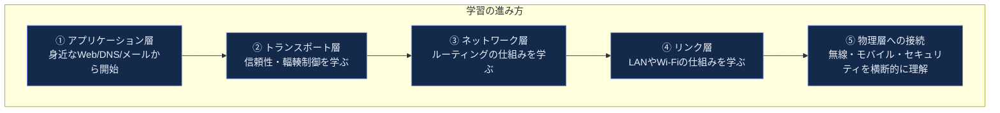

**このガイドの構成(全10部)**

| 部 | タイトル | 対応する章(原書) |
|---|---|---|
| 第0部 | なぜ「トップダウンアプローチ」なのか | Preface / Ch.1 導入 |
| 第1部 | コンピュータネットワークとインターネットの基礎 | Chapter 1 |
| 第2部 | アプリケーション層 | Chapter 2 |
| 第3部 | トランスポート層 | Chapter 3 |
| 第4部 | ネットワーク層:データプレーン | Chapter 4 |
| 第5部 | ネットワーク層:コントロールプレーン | Chapter 5 |
| 第6部 | リンク層とLAN | Chapter 6 |
| 第7部 | 無線とモバイルネットワーク | Chapter 7 |
| 第8部 | コンピュータネットワークにおけるセキュリティ | Chapter 8 |
| 第9部 | 2026年8月時点の最新動向(独自追加) | ― |

補足として、学習ロードマップ・理解度チェックリスト・用語集・参考文献を末尾に収録しています。

---

## 目次

1. [第0部: なぜ「トップダウンアプローチ」なのか](#第0部-なぜトップダウンアプローチなのか)
2. [第1部: コンピュータネットワークとインターネットの基礎](#第1部-コンピュータネットワークとインターネットの基礎)
3. [第2部: アプリケーション層](#第2部-アプリケーション層)
4. [第3部: トランスポート層](#第3部-トランスポート層)
5. [第4部: ネットワーク層:データプレーン](#第4部-ネットワーク層データプレーン)
6. [第5部: ネットワーク層:コントロールプレーン](#第5部-ネットワーク層コントロールプレーン)
7. [第6部: リンク層とLAN](#第6部-リンク層とlan)
8. [第7部: 無線とモバイルネットワーク](#第7部-無線とモバイルネットワーク)
9. [第8部: コンピュータネットワークにおけるセキュリティ](#第8部-コンピュータネットワークにおけるセキュリティ)
10. [第9部: 2026年8月時点の最新動向](#第9部-2026年8月時点の最新動向)
11. [学習ロードマップ](#学習ロードマップ)
12. [理解度チェックリスト](#理解度チェックリスト)
13. [用語集](#用語集)
14. [参考文献](#参考文献)

---

## 第0部: なぜ「トップダウンアプローチ」なのか

### インターネットの規模感(2026年8月時点)

具体的な数字から始めましょう。2026年、インターネットは以下のような規模で稼働しています。

| 指標 | 数値 | 出典年月 |
|---|---|---|
| Google経由のIPv6アクセス率(世界平均) | 約50% (2026/3/28に初めて50%超え) | 2026年4月 |
| APNIC計測によるIPv6対応ユーザー比率(IPv6 capability) | 約42〜43% | 2026年4月 |
| HTTP/3の利用比率 | Cloudflare網が観測するHTTP(S)リクエストに占める割合としてCloudflare Radarが継続公開(最新値はRadarで確認) | 継続計測 |
| RPKI(経路正当性検証)でカバーされる経路の割合 | 約67% | 参考文献18(日次変動するため要再確認) |
| Cloudflareが2025年に緩和したDDoS攻撃件数 | 4,710万件(前年比121%増) | 2026年3月(参考文献29) |
| 観測史上最大のDDoS攻撃規模(帯域) | 31.4 Tbps・約35秒間(Aisuru-Kimwolfボットネット) | 2025年11月(Cloudflare 2025 Q4レポートで公表。参考文献29) |
| 観測史上最大のDDoS攻撃規模(パケットレート) | 14.1 Bpps(Aisuruボットネット。29.7 Tbpsの帯域記録とは別個の攻撃) | Cloudflare 2025 Q3レポート(参考文献28) |

これらの数字が示すのは、インターネットが「決まった仕様に従う静的なシステム」ではなく、**日々進化し続ける巨大な分散システム**だということです。だからこそ、個別の技術の暗記ではなく、「なぜこの層が必要なのか」「どんな問題を解決するために設計されたのか」という原理原則を学ぶことが重要になります。

### インターネットを2つの視点で捉える

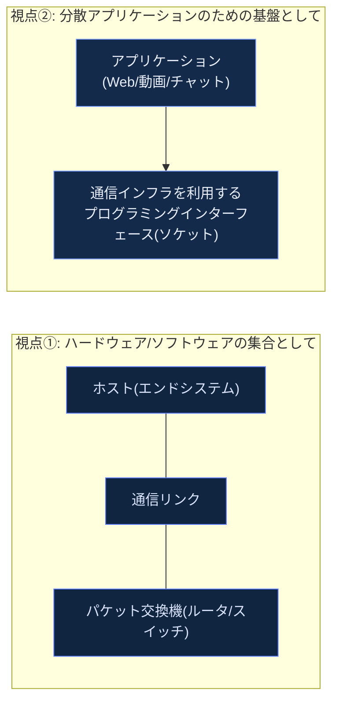

インターネットは、**エンドシステム(ホスト)**・**アクセスネットワーク**・**通信リンク**・**パケット交換機**という物理的な構成要素の集合体であると同時に、アプリケーション開発者に対して**通信サービスを提供するプラットフォーム**でもあります。この二重の見方を持つことが、ネットワークを学ぶ最初の一歩です。

---

## 第1部: コンピュータネットワークとインターネットの基礎

### 1.1 ネットワークの「エッジ」と「コア」

インターネットの構造は、大きく**エッジ(端)**と**コア(中心部)**に分けて理解すると見通しが良くなります。

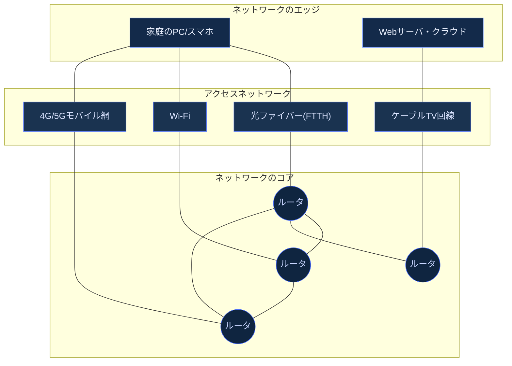

- **エッジ**: 私たちが直接触れるホスト(PC、スマホ、サーバ)。アプリケーションが動く場所。
- **アクセスネットワーク**: エッジをネットワークのコアに接続する「最初の1ホップ」。光ファイバー、ケーブル、モバイル、Wi-Fiなど。
- **コア**: 相互接続されたルータの網。パケットを転送する役割に徹する。

### 1.2 パケット交換 vs 回線交換

ネットワークコアがデータを転送する方式には、歴史的に2つのアプローチがあります。

| 比較項目 | 回線交換(Circuit Switching) | パケット交換(Packet Switching) |
|---|---|---|
| 帯域の確保方法 | 通信開始時に専用の帯域を事前予約 | 予約なし。必要なときにリンクを共有 |
| 代表例 | 従来の電話網 | インターネット全体 |
| 利点 | 通信品質が保証される(遅延が一定) | リンクをより効率的に共有できる |
| 欠点 | アイドル時間中も帯域が無駄になる | 混雑時に遅延・パケット損失が発生しうる |
| 多重化の方式 | FDM(周波数分割)/TDM(時分割) | 統計的多重化(Statistical Multiplexing) |

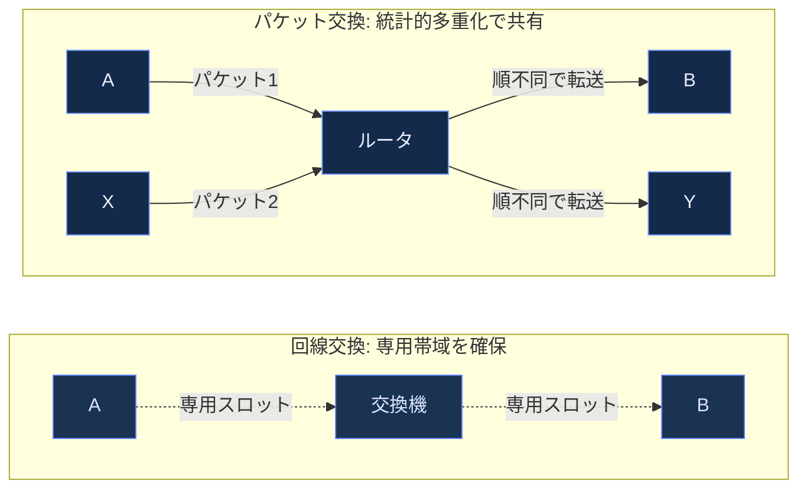

インターネットがパケット交換を採用した理由は、テキストデータ・動画・音声のようにトラフィックが「バースト的」な性質を持つアプリケーションに対して、統計的多重化のほうが資源を効率よく使えるためです。ただしその代償として、**遅延やパケット損失が保証されない**という性質を受け入れる必要があります。

### 1.3 プロトコル階層とカプセル化

ネットワーク機能を独立した層に分割する「レイヤードアーキテクチャ」は、複雑なシステムを管理可能にするための設計原則です。インターネットでは慣習的に5層モデルが使われます。

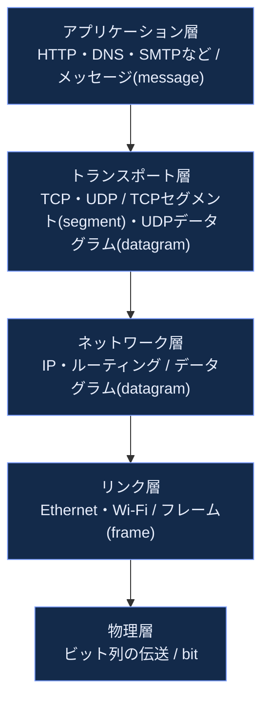

| 層 | 役割 | データ単位 | 処理する機器の例 |
|---|---|---|---|
| アプリケーション層 | ネットワークアプリケーションのためのプロトコル(HTTP、DNS、SMTP) | メッセージ | ホストのみ |
| トランスポート層 | プロセス間の論理的な通信(TCP/UDP) | TCPセグメント / UDPデータグラム | ホストのみ |
| ネットワーク層 | 送信元から宛先へのデータグラム経路制御 | データグラム | ホスト・ルータ |
| リンク層 | 隣接ノード間でのフレーム転送 | フレーム | ホスト・ルータ・スイッチ |
| 物理層 | フレーム内の個々のビットの伝送 | ビット | ホスト・ルータ・スイッチ |

> **補足: OSI参照モデルとの違い**
> 大学の教科書や資格試験ではしばしば7層のOSI参照モデルが登場しますが、実際のインターネットは5層(または、セッション層とプレゼンテーション層を省いた4層とする流儀もある)モデルで説明されるのが一般的です。OSIのセッション層・プレゼンテーション層に相当する機能は、実務上はアプリケーション自身が必要に応じて実装しています。

**カプセル化(Encapsulation)** とは、上位層のデータに下位層がヘッダ情報を付加していく仕組みです。


パケットがルータを通過するとき、基本的な転送判断に使われるのはリンク層とネットワーク層のヘッダだけで、トランスポート層より上のペイロードには触れません。この「関心の分離」こそが、レイヤードアーキテクチャの本質的な利点です。ただしこれはあくまで基本転送の話であり、ACLやファイアウォール機能を持つルータはパケットフィルタリングのためにIPプロトコル番号やTCP/UDPの送信元・宛先ポート番号といったL4ヘッダまで参照します。

### 1.4 遅延・損失・スループットの4要素

パケットがルータを通過する際に発生する遅延は、4つの成分に分解できます。


| 遅延の種類 | 決まる要因 | 変動しやすさ |
|---|---|---|
| 処理遅延 | ルータの処理性能 | 通常マイクロ秒オーダーで小さい |
| キューイング遅延 | トラフィック量・輻輳状況 | 大きく変動する(輻輳時に支配的) |
| 伝送遅延 | パケット長とリンクの帯域幅 | リンクごとに固定 |
| 伝搬遅延 | 物理的な距離と伝搬速度(光ファイバーで約2×10^8 m/s) | 距離が決まれば固定 |

キューイング遅延は特に重要です。トラフィック強度(到着率×パケット長 ÷ リンク帯域)が1に近づくにつれ、キューイング遅延は急激に増大します。これは輻輳制御(第3部で詳しく扱います)が必要になる根本的な理由です。

**スループット**は「単位時間あたりに転送できるビット数」であり、送信元から宛先までの経路上で**最も帯域の狭いリンク(ボトルネックリンク)**によって上限が決まります。

---

## 第2部: アプリケーション層

### 2.1 ネットワークアプリケーションのアーキテクチャ

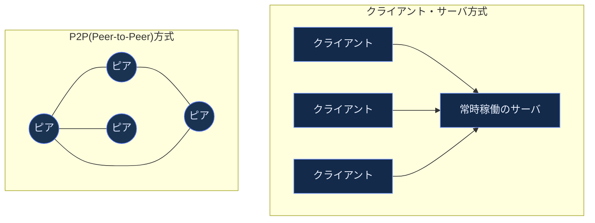

| 方式 | 特徴 | 代表例 |
|---|---|---|
| クライアント・サーバ | サーバが常時稼働し固定IPを持つ。クライアント同士は直接通信しない | Web、メール、多くのSaaS |
| P2P | 常時稼働のサーバに依存せず、ピア同士が直接データをやり取りする | ファイル共有、一部のビデオ会議基盤 |

アプリケーション同士の通信は、OSではなく**プロセス**間で行われます。プロセスは**ソケット**というAPIを通じてトランスポート層にメッセージを渡します。ソケットは「アプリケーション層とトランスポート層の間のドア」に例えられます。プロセスを特定するには、**トランスポートプロトコル + IPアドレス + ポート番号**の組が使われます(例: `443/tcp` はTCP上のHTTPS)。さらにTCPでは、個々の接続は**送信元IPアドレス・送信元ポート番号・宛先IPアドレス・宛先ポート番号の4タプル**で識別されるため、同じ宛先ポートに向かう多数の接続を1台のサーバが同時に区別できます。

### 2.2 Webとプロトコルの進化: HTTP/1.1 → HTTP/2 → HTTP/3

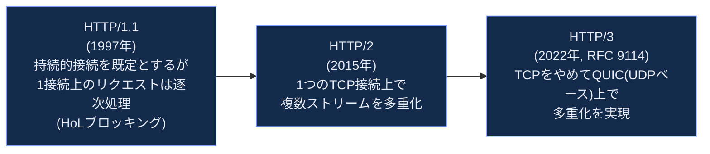

HTTP/2はTCP上で複数のリクエストを1本の接続に多重化することでHTTP/1.1のHead-of-Line Blocking(先頭パケット詰まり)を解消しましたが、**TCP自体が「順序を保証するバイトストリーム」であるため、1つのパケットが失われると、それに関係しない他のストリームまで待たされてしまう**という問題(トランスポート層でのHOLブロッキング)が残っていました。HTTP/3はTCPを捨て、UDPベースの新しいトランスポートプロトコルであるQUIC(RFC 9000)を採用することでこれを解決しています。

**普及状況の確認方法**: HTTP/3の利用比率は、Cloudflare Radar(Cloudflare網が観測するHTTP(S)リクエストを分母とする計測)で継続的に公開されています。特定時点の比率や高速化の効果は、計測対象・分母・比較条件(対HTTP/2か対HTTP/1.1か、回線条件はどうか)によって大きく変わるため、数値を引用する際は必ず一次ソース側の定義とあわせて確認してください。

| プロトコル | トランスポート | 主な利点 | 主な欠点/制約 |
|---|---|---|---|
| HTTP/1.1 | TCP | 単純で理解しやすい | 持続接続でも1本の接続上でリクエストが順番に処理され、先行応答が遅れると後続が待たされるアプリケーション層のHOLブロッキングが起きる |
| HTTP/2 | TCP | ストリーム多重化、ヘッダ圧縮(HPACK) | TCPレベルのHOLブロッキングが残る |
| HTTP/3 | QUIC(UDP) | トランスポート層までHOLブロッキング解消、0-RTT再接続、コネクションマイグレーション | UDPをブロックするファイアウォール環境での互換性課題 |

### 2.3 DNS: インターネットのディレクトリサービス

DNS(Domain Name System)は、人間が読める名前(例: `www.example.com`)をIPアドレスに変換する分散データベースです。単一のサーバに問い合わせるのではなく、**階層構造**を持つ多数のサーバが協調して動作します。

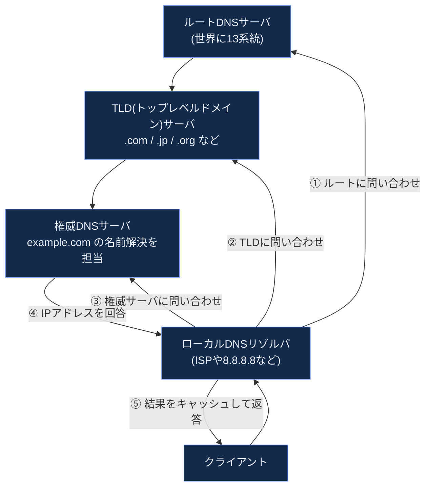

DNSは名前解決だけでなく、以下のような役割も担っています。

| DNSレコードタイプ | 用途 |
|---|---|
| A / AAAA | ホスト名とIPv4/IPv6アドレスの対応 |
| CNAME | 別名(エイリアス)の定義 |
| MX | メールサーバの指定 |
| NS | ドメインの権威DNSサーバの指定 |
| TXT | SPF/DKIM等の検証情報やドメイン所有証明 |

**DNSの安全性・プライバシーに関する2026年時点の動向**:従来のDNSは平文でやり取りされ、経路上の第三者に盗聴・改ざんされるリスクがありました。標準のトランスポートは通常UDP/53ですが、512バイトを超える大きな応答(EDNS0で拡張しない場合の切り詰め時)やゾーン転送(AXFR/IXFR)ではTCP/53も使用されます。いずれも平文である点は変わりません。これに対応するため、以下の暗号化DNSプロトコルの普及が進んでいます。

| プロトコル | トランスポート | 特徴 |
|---|---|---|
| DoT (DNS over TLS) | TLS/853番ポート | OSレベルで全アプリのDNSを一括暗号化しやすい |
| DoH (DNS over HTTPS) | HTTPS/443番ポート | 通常のWeb通信に紛れるためブロックされにくい。Firefoxは米国ユーザーに対してDoHをデフォルトで有効化している |
| DoQ (DNS over QUIC) | QUIC/853番ポート | モバイル網での接続切り替えに強く、モバイルOSでの採用が進行中 |

**補足: TLS拡張によるSNIの秘匿(ECH)**:ECH(Encrypted Client Hello)はDNSプロトコルではなく、TLS 1.3の拡張(RFC 9849)です。TLSハンドシェイクの冒頭で平文送信されるClientHello、とりわけ接続先ホスト名を示すSNIを暗号化し、経路上の観測者からアクセス先ドメインを隠します。暗号化DNSで名前解決を秘匿しても、続くTLS接続でSNIが平文のままなら接続先は露見するため、ECHは暗号化DNSを補完する別レイヤの仕組みとして理解してください。

### 2.4 電子メールとソケットプログラミングの基礎

電子メールは歴史的に3つのプロトコルの組み合わせで成り立っています。


| プロトコル | 役割 |
|---|---|
| SMTP (Simple Mail Transfer Protocol) | メールサーバ間・クライアントからサーバへのメール**送信** |
| POP3 (Post Office Protocol) | クライアントがサーバから受信メールを**取得**(ダウンロード後は基本削除) |
| IMAP (Internet Message Access Protocol) | サーバ上でメールを管理したまま**同期的に**アクセス(複数端末での利用に向く) |

アプリケーション開発の観点では、これらのプロトコルはすべて「ソケットAPI」を通じてトランスポート層のサービス(TCP/UDP)を利用しています。ソケットプログラミングを理解することは、任意のカスタムプロトコルを設計・実装する第一歩です。

| ソケットの種類 | 使用するトランスポートプロトコル | 適した用途 |
|---|---|---|
| ストリームソケット | TCP | 信頼性が必要な通信(Web、メール、ファイル転送) |
| データグラムソケット | UDP | 低遅延・リアルタイム性が重要な通信(DNS問い合わせ、動画配信の一部、オンラインゲーム) |

---

## 第3部: トランスポート層

### 3.1 UDPとTCP: 2つの対照的な選択肢

トランスポート層の最も重要な役割は、ネットワーク層が提供する「ホスト間通信」を「プロセス間通信」へと拡張することです。インターネットではSCTPやDCCP、QUIC(UDP上に構築される)など複数のトランスポートプロトコルが使われていますが、本ガイドではまず代表的な2つ、性格の対照的なTCPとUDPを比較します。


| 比較項目 | UDP | TCP |
|---|---|---|
| コネクション | なし | あり(3ウェイハンドシェイク) |
| 信頼性 | 保証しない | 保証する(再送・順序制御) |
| 輻輳制御 | なし | あり |
| ヘッダサイズ | 8バイト | 20バイト以上 |
| 適した用途 | DNS、動画配信の一部、リアルタイム通信、QUICの基盤 | Web、メール、ファイル転送 |

### 3.2 TCPコネクションの確立: 3ウェイハンドシェイク

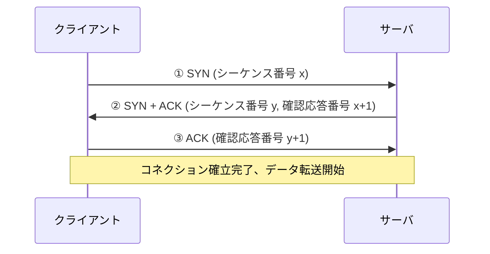

3ウェイハンドシェイクによって、両者は「相手が確かに存在し、送受信能力があること」と「初期シーケンス番号」を確認し合います。これにより、後続のデータ転送で正確な順序制御・再送制御が可能になります。

### 3.3 信頼性のあるデータ転送の原理

信頼性のない下位層(ネットワーク層)の上に、信頼性のあるサービスを構築するには、以下のような仕組みの組み合わせが必要です。

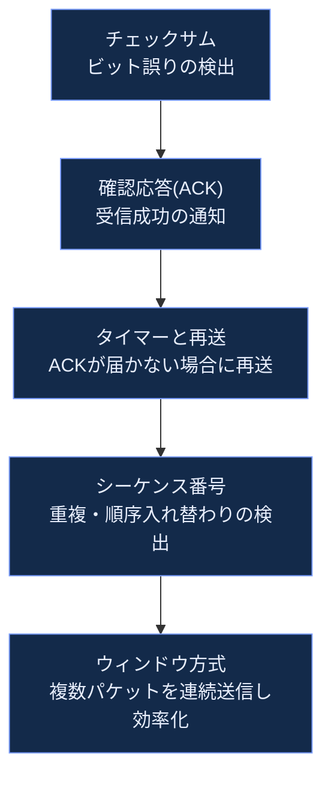

TCPはこれらすべてを組み合わせ、さらに**パイプライン化**(確認を待たずに複数セグメントを送信し続ける)によってスループットを最大化しています。

### 3.4 フロー制御と輻輳制御の違い

初学者が混同しやすい2つの概念を区別しましょう。

| 項目 | フロー制御(Flow Control) | 輻輳制御(Congestion Control) |
|---|---|---|
| 目的 | 受信側のバッファ溢れを防ぐ | ネットワーク内部の混雑を防ぐ |
| 誰の都合か | **受信側**の処理能力に合わせる | **ネットワーク経路全体**の余力に合わせる |
| 制御に使う情報 | 受信ウィンドウサイズ(受信側が通知) | パケット損失・遅延・ECNマーキングなどのネットワークからの信号 |

### 3.5 輻輳制御アルゴリズムの進化

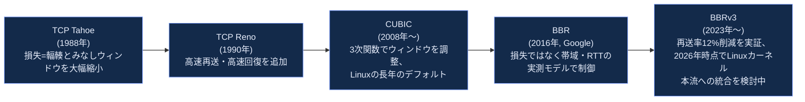

**損失ベース(Loss-based)輻輳制御の限界**: CUBICのような従来型アルゴリズムは「パケット損失=輻輳のシグナル」とみなしますが、高速・長距離のネットワークや無線網では、輻輳とは無関係な理由でパケットが失われることが増えており、この前提が崩れつつあります。

**モデルベース輻輳制御の登場**: Googleが2016年に発表したBBR(Bottleneck Bandwidth and Round-trip propagation time)は、実際のボトルネック帯域と最小RTTを継続的に推定し、そのモデルに基づいて送信レートを調整するアプローチを取ります。BBRv3は2026年時点でもLinuxカーネル本流(mainline)への統合は検討中の段階にとどまりますが、Google自身の実運用データでは旧バージョン比で再送率が12%減少したことが報告されています(2023年7月25日のIETF 117 CCWG発表資料「BBRv3: Algorithm Bug Fixes and Public Internet Deployment」。参考文献9)。

### 3.6 QUIC: トランスポート層とセキュリティ層の融合

QUICはUDPの上に構築された新しいトランスポートプロトコルであり、従来「TCP + TLS」に分かれていた機能を統合しています。

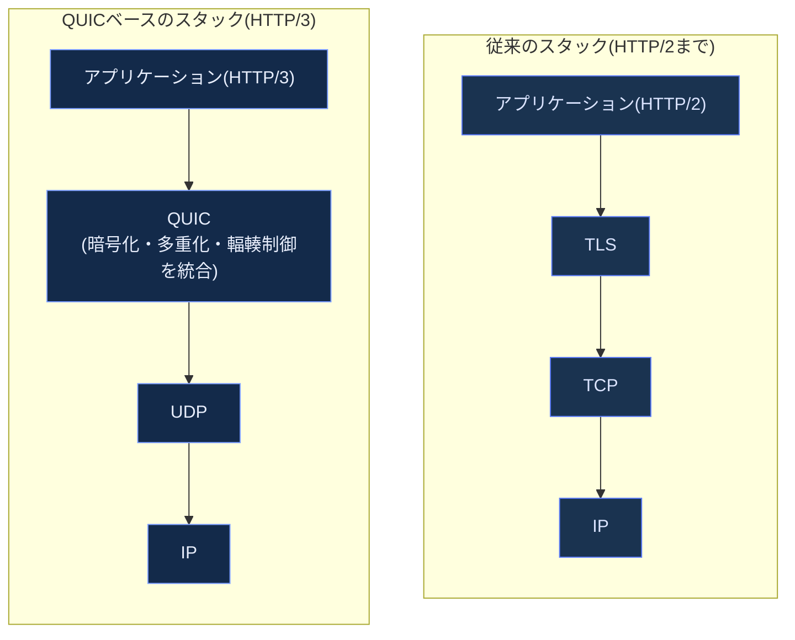

QUICの主要な設計上の利点:

| 機能 | 説明 |
|---|---|
| ストリームレベルの独立性 | 1つのストリームでのパケット損失が他のストリームをブロックしない |
| 1-RTT/0-RTTハンドシェイク | TLS 1.3の暗号ハンドシェイクをコネクション確立と統合し、再接続時は0-RTTも可能 |
| コネクションマイグレーション | Wi-Fiからモバイル網への切り替えなど、IPアドレスが変わってもコネクションを維持 |
| アンプ攻撃対策 | サーバはクライアントのアドレス検証が完了するまで、そのクライアントから受信したバイト数の3倍を超えて送信してはならないと規定(RFC 9000) |

---

## 第4部: ネットワーク層:データプレーン

ネットワーク層は「データプレーン」と「コントロールプレーン」という2つの機能に分けて理解すると、SDN(Software-Defined Networking)などの現代的な設計思想も含めて整理しやすくなります。

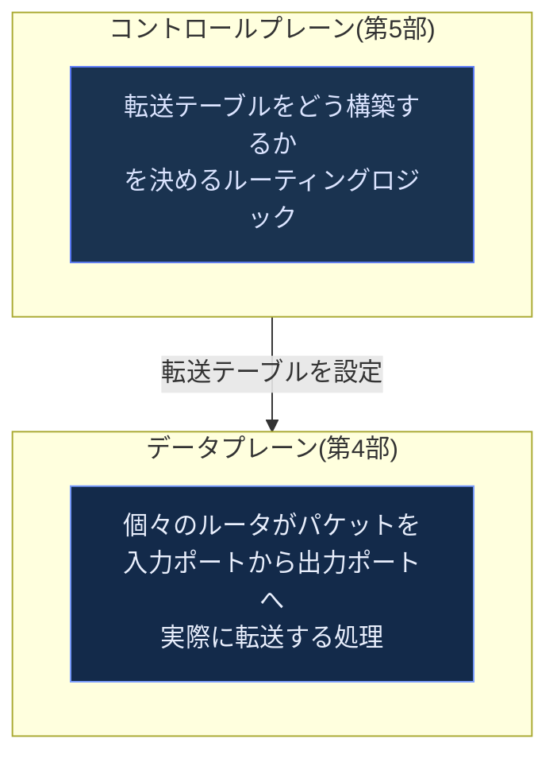

### 4.1 ルータの内部構造

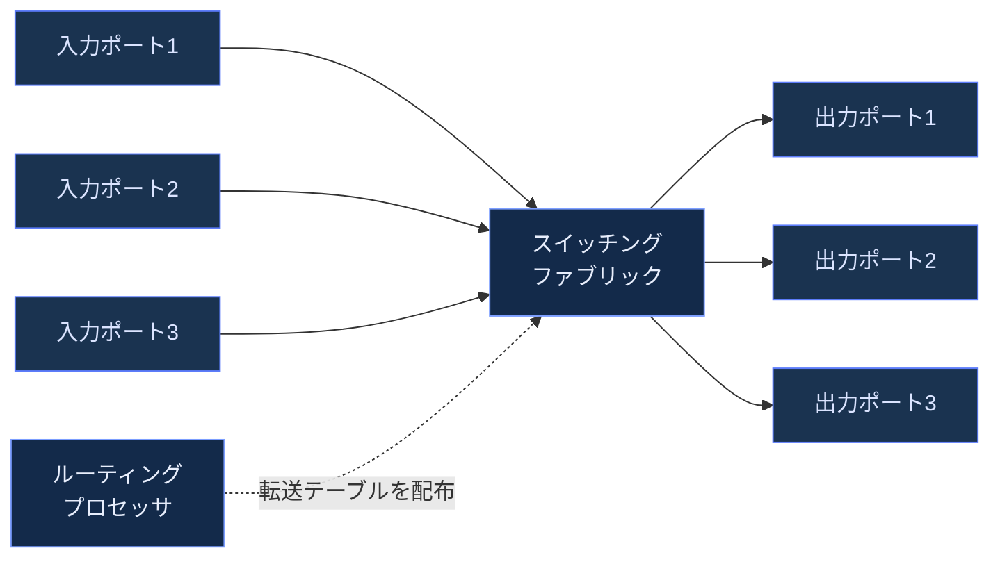

各入力ポートは、宛先IPアドレスに対して**最長プレフィックスマッチ(Longest Prefix Match)**を行い、転送テーブルから出力ポートを決定します。出力ポートでのキューイングは、第1部で説明したキューイング遅延の主要な発生源です。

### 4.2 IPv4とIPv6

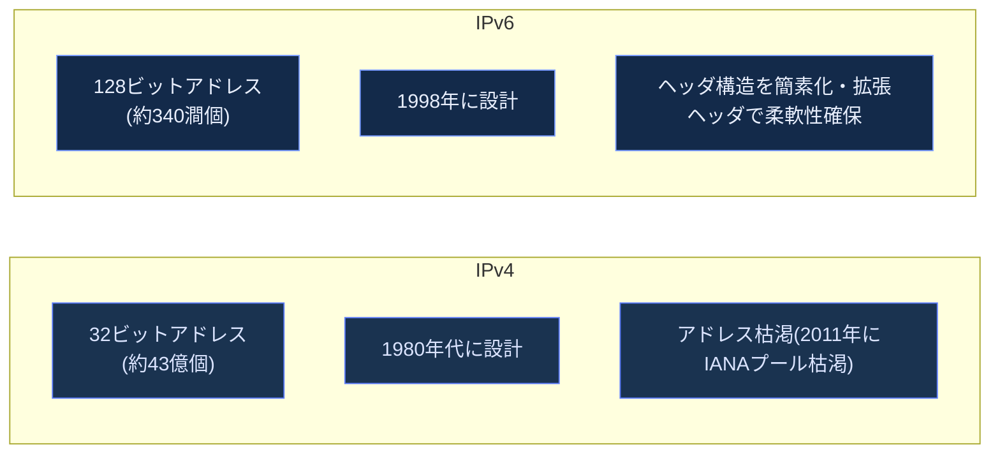

| 項目 | IPv4 | IPv6 |
|---|---|---|
| アドレス長 | 32ビット | 128ビット |
| アドレス表記例 | `192.0.2.1` | `2001:db8::1` |
| ヘッダのオプション | 可変長オプションフィールドあり | 拡張ヘッダとして分離、基本ヘッダは固定長で高速処理向き |
| フラグメンテーション | ルータ上で実施可能 | 送信元ホストのみが実施(ルータは行わない) |
| NATとの関係 | アドレス不足を補うため広くNATが使われる | アドレス空間が十分でありEnd-to-Endの直接接続が原則可能 |

**2026年8月時点のIPv6普及状況**: Google計測ではユーザーの世界平均IPv6アクセス率が2026年3月28日に初めて50%を突破しました(50.10%)。ただし国ごとの差は大きく、フランス(73%)・インド(72%)・サウジアラビア(65%)のように先行する国がある一方、スペイン(10%)・エジプト(4%)のように普及が遅れている地域もあります。APNIC Labsの計測ではやや異なる方法論により約42〜43%という数値が示されており、複数の計測ソースを比較する視点が重要です。

### 4.3 NAT(Network Address Translation)

IPv4アドレス枯渇への現実的な対処として広く使われているのがNATです。

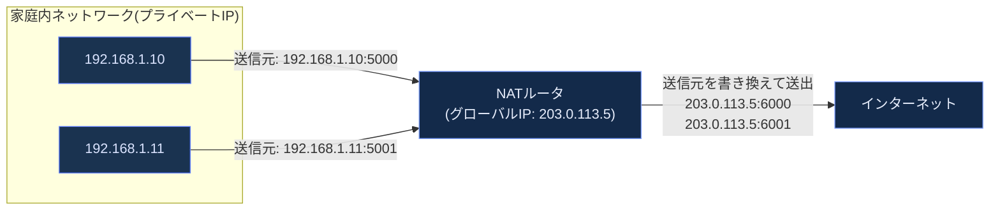

NATは複数の家庭内デバイスを1つのグローバルIPアドレスで外部と通信させることを可能にし、IPv4アドレス枯渇の実質的な緩和策として機能してきました。ただし、外部から内部ホストへの直接接続が困難になる(P2P通信やサーバ公開の妨げになる)という副作用もあり、これがIPv6移行が求められる技術的理由の一つです。

### 4.4 汎用転送とSDNのデータプレーン

従来のルータは主に宛先IPアドレスに基づいて転送を決定し(ACLによるフィルタリングなどは補助的な機能に留まっていました)、SDN(Software-Defined Networking)の考え方では、より汎用的な「マッチ+アクション」ルールに基づいてパケットを処理します(OpenFlowプロトコルなどが代表例)。

```mermaid
flowchart TB
    subgraph TRADITIONAL["従来型ルータ"]
        T1["主に宛先IPアドレスで<br/>転送を決定<br/>(ACLは補助的)"]
    end
    subgraph SDN_DP["SDNデータプレーン"]
        S1["送信元/宛先IP・ポート番号・<br/>VLANタグなど複数フィールドの組み合わせで<br/>マッチし、転送/破棄/書き換え等の<br/>アクションを実行"]
    end
    CONTROLLER["中央集権的なSDNコントローラ"] -.フローテーブルを配布.-> SDN_DP

    classDef tradFill fill:#1a3350,stroke:#5c7cfa,color:#dbe4ff
    classDef sdnFill fill:#132a4a,stroke:#7c9eff,color:#e8eefc
    class T1 tradFill
    class S1,CONTROLLER sdnFill
```

この汎用性により、ロードバランシング・ファイアウォール・トラフィックエンジニアリングといった多様な機能を、専用ハードウェアではなくソフトウェア制御によって柔軟に実現できるようになります。

---

## 第5部: ネットワーク層:コントロールプレーン

### 5.1 ルーティングアルゴリズムの2大分類

```mermaid
flowchart TB
    subgraph LS["リンクステート型(例: OSPF)"]
        direction TB
        LS1["同一エリア内のトポロジー情報を<br/>エリア内の全ルータがフラッディングで共有"]
        LS2["各ルータが独立して<br/>ダイクストラ法で最短経路を計算"]
    end
    subgraph DV["距離ベクトル型(例: RIP)"]
        direction TB
        DV1["隣接ルータとのみ<br/>経路情報(距離)を交換"]
        DV2["ベルマン・フォード法に基づき<br/>反復的に経路表を更新"]
    end

    classDef lsFill fill:#132a4a,stroke:#7c9eff,color:#e8eefc
    classDef dvFill fill:#1a3350,stroke:#5c7cfa,color:#dbe4ff
    class LS1,LS2 lsFill
    class DV1,DV2 dvFill
```

| 比較項目 | リンクステート型 | 距離ベクトル型 |
|---|---|---|
| 情報共有範囲 | 同一エリア内の全ルータへフラッディング | 隣接ルータのみと交換 |
| 収束速度 | 比較的速い | 遅くなりがち(カウント・トゥ・インフィニティ問題) |
| 計算量 | 各ノードでO(n²)程度のダイクストラ計算 | 反復計算だが1ノードあたりの負荷は軽い |
| 代表プロトコル | OSPF、IS-IS | RIP(現在はほぼ使われず教育目的が中心) |

これらは主に**単一の管理主体内(AS内)**で使われる**内部ゲートウェイプロトコル(IGP)**です。

### 5.2 自律システム間のルーティング: BGP

インターネットは、単一の管理者が存在しない**自律システム(AS: Autonomous System)**の集合体です。AS間の経路制御を担うのがBGP(Border Gateway Protocol)です。

```mermaid
flowchart TB
    subgraph AS1["AS 100"]
        R1A["ルータA"] --- R1B["ルータB"]
    end
    subgraph AS2["AS 200"]
        R2A["ルータC"] --- R2B["ルータD"]
    end
    subgraph AS3["AS 300"]
        R3A["ルータE"]
    end

    R1B -->|eBGP| R2A
    R2B -->|eBGP| R3A
    R1A -.iBGP.-> R1B
    R2A -.iBGP.-> R2B

    classDef asFill fill:#132a4a,stroke:#7c9eff,color:#e8eefc
    class R1A,R1B,R2A,R2B,R3A asFill
```

| BGPの種類 | 説明 |
|---|---|
| eBGP (External BGP) | 異なるAS間でのルート広告 |
| iBGP (Internal BGP) | 同一AS内のBGPルータ間でのルート伝播 |

BGPはリンクステート型でも純粋な距離ベクトル型でもなく、**パスベクトル型**と呼ばれる方式を採用しています。各ルート広告には経由したASの一覧(ASパス)が含まれ、ループ検出やポリシーベースの経路選択(コスト最小化ではなく、ビジネス上の契約関係に基づく選択)を可能にしています。

### 5.3 BGPのセキュリティ: RPKIとルート原点検証(ROV)

BGPは1980年代に設計された当初、経路情報の真正性を検証する仕組みを持っていませんでした。これにより、誤設定や悪意ある行為によって「本来別の組織が所有するIPプレフィックスを、自分のASが起点であるかのように広告してしまう」**BGPハイジャック**が起こりえます。

```mermaid
sequenceDiagram
    participant Owner as 正当な所有者(AS100)
    participant Attacker as 悪意あるAS(AS666)
    participant Victim as 被害を受けるAS

    Owner->>Victim: 正規のプレフィックス広告(203.0.113.0/24, origin AS100)
    Attacker->>Victim: 偽装した広告(203.0.113.0/24, origin AS666)
    Note over Victim: RPKI検証なしの場合、<br/>より詳細なプレフィックスは<br/>Longest Prefix Match により転送で優先される。<br/>同一プレフィックス同士では AS_PATH の短さが<br/>BGP経路選択の一要素として働く<br/>(常に最優先の基準ではない)ため<br/>通信がハイジャックされる恐れ
```

この問題への対処として普及が進んでいるのがRPKI(Resource Public Key Infrastructure)です。

```mermaid
flowchart LR
    HOLDER["プレフィックス保有者"] -->|ROA・経路原点認可を発行| REPO["RPKIリポジトリ"]
    REPO -->|同期| VALIDATOR["ルータ側の検証キャッシュ<br/>(RPKI Validator)"]
    ROUTER["BGPルータ"] -->|受信した経路のオリジンASを問い合わせ| VALIDATOR
    VALIDATOR -->|Valid / Invalid / NotFoundを応答| ROUTER
    ROUTER -->|検証状態に応じてローカルポリシーを適用<br/>(採用・優先度低下・拒否などを事業者が決定)| ACCEPT["採用する経路テーブル"]

    classDef rpkiFill fill:#132a4a,stroke:#7c9eff,color:#e8eefc
    class HOLDER,REPO,VALIDATOR,ROUTER,ACCEPT rpkiFill
```

**2026年時点の普及状況**: 参考文献18(RIPE LabsのAntonio Prado氏による分析を引用したIPregistryの記事)によると、RPKIのROAでカバーされる経路の割合はグローバルで約67%に達しています。日次で変動する指標のため、最新値はNLnet LabsのRPKI Analyticsやhttps://bgp.he.net などのダッシュボードで観測日とあわせて確認してください。Sparkle(AS6762)のような大手Tier-1トランジット事業者も、2026年2月3日からRPKI無効経路を拒否する側へ移行しました(参考文献15。Cloudflareの「Is BGP safe yet?」が同社を無効経路を拒否する事業者として掲載)。

一方で、2026年7月21日にRIPE Labsが公開したAntonio Prado氏の分析(参考文献19)では、経路原点検証(ROV)は「経路操作」「経路一貫性」「ポリシー違反」「セッションベース攻撃」という4つの攻撃カテゴリのうち一部にしか対応できないことが指摘されており、**RPKIは万能ではなく、より広範な監視と組み合わせる必要がある**という認識が広がっています。

### 5.4 SDNのコントロールプレーン

```mermaid
flowchart TB
    APP1["アプリケーション<br/>(負荷分散)"] --> NORTH["ノースバウンドAPI"]
    APP2["アプリケーション<br/>(ファイアウォール)"] --> NORTH
    NORTH --> CTRL["SDNコントローラ<br/>(ネットワークOS)"]
    CTRL --> SOUTH["サウスバウンドAPI<br/>(例: OpenFlow)"]
    SOUTH --> SW1["スイッチ1"]
    SOUTH --> SW2["スイッチ2"]
    SOUTH --> SW3["スイッチ3"]

    classDef sdnFill fill:#132a4a,stroke:#7c9eff,color:#e8eefc
    class APP1,APP2,NORTH,CTRL,SOUTH,SW1,SW2,SW3 sdnFill
```

従来、ルーティングロジック(コントロールプレーン)は各ルータに分散して実装されていましたが、SDNでは**論理的に中央集権化されたコントローラ**がネットワーク全体を俯瞰して転送ルールを決定します。これにより、ネットワーク全体を1つのプログラムとして扱える(=プログラマブルにできる)柔軟性が得られます。

---

## 第6部: リンク層とLAN

### 6.1 リンク層が提供するサービス

```mermaid
flowchart TD
    FR["フレーミング<br/>ビット列をフレーム単位に区切る"] --> ADDR["リンクアドレッシング<br/>MACアドレスによる識別"]
    ADDR --> ERR["誤り検出<br/>CRC(巡回冗長検査)"]
    ERR --> ACCESS["メディアアクセス制御<br/>共有リンクの利用調整"]

    classDef llFill fill:#132a4a,stroke:#7c9eff,color:#e8eefc
    class FR,ADDR,ERR,ACCESS llFill
```

### 6.2 多重アクセスプロトコル

複数のホストが1つの共有伝送媒体(古典的なイーサネットの同軸ケーブルや、無線LANの空間)を利用する場合、「誰がいつ送信してよいか」を調整する必要があります。

```mermaid
flowchart LR
    subgraph CSMACD["CSMA/CD(有線イーサネットの伝統的方式)"]
        direction TB
        CD1["送信前にキャリアを検知(Carrier Sense)"]
        CD2["送信中も衝突を検知(Collision Detection)"]
        CD3["衝突を検知したら送信を中断しランダム時間待機"]
    end
    subgraph CSMACA["CSMA/CA(無線LANで使用)"]
        direction TB
        CA1["送信前にキャリアを検知"]
        CA2["衝突の検出が困難なため<br/>事前にランダムバックオフ"]
        CA3["ACKによる受信確認で<br/>成功/失敗を判断"]
    end

    classDef cdFill fill:#1a3350,stroke:#5c7cfa,color:#dbe4ff
    classDef caFill fill:#132a4a,stroke:#7c9eff,color:#e8eefc
    class CD1,CD2,CD3 cdFill
    class CA1,CA2,CA3 caFill
```

現代の有線イーサネットはスイッチによる**全二重専用リンク**が主流であり、衝突自体がほぼ発生しません。しかし無線LANでは共有媒体の性質上、CSMA/CAベースの調整が今も本質的に必要です。

### 6.3 イーサネットスイッチ vs ルータ

初学者が混同しやすい「スイッチ」と「ルータ」の違いを整理します。

| 比較項目 | イーサネットスイッチ(リンク層) | ルータ(ネットワーク層) |
|---|---|---|
| 転送の判断基準 | 宛先MACアドレス | 宛先IPアドレス |
| アドレステーブルの構築方法 | 自己学習(送信元MACを見て自動的に学習) | ルーティングプロトコルによる転送テーブルの構築 |
| ブロードキャストドメイン | VLAN未分割のスイッチは1つのブロードキャストドメインを構成 | ブロードキャストドメインを分割する |
| プラグアンドプレイ性 | 高い(設定不要で自己学習) | 相対的に設定が必要 |

```mermaid
flowchart TB
    subgraph SWDOMAIN["スイッチが構成するLAN(1つのブロードキャストドメイン)"]
        PC1["PC1"] --- SW["スイッチ"]
        PC2["PC2"] --- SW
        PC3["PC3"] --- SW
    end
    SW --- RTR["ルータ"]
    RTR --- WAN["別のネットワーク/インターネット"]

    classDef swFill fill:#1a3350,stroke:#5c7cfa,color:#dbe4ff
    classDef rtFill fill:#132a4a,stroke:#7c9eff,color:#e8eefc
    class PC1,PC2,PC3,SW swFill
    class RTR,WAN rtFill
```

### 6.4 VLAN(仮想LAN)

物理的な配線を変更せずに、論理的にブロードキャストドメインを分割する技術がVLANです。

```mermaid
flowchart LR
    subgraph PHYS["物理的には同じスイッチ"]
        SW2["スイッチ(VLANタグ対応)"]
    end
    SW2 -.VLAN 10.-> DEPT_A["経理部門のポート群"]
    SW2 -.VLAN 20.-> DEPT_B["開発部門のポート群"]

    classDef vlanFill fill:#132a4a,stroke:#7c9eff,color:#e8eefc
    class SW2,DEPT_A,DEPT_B vlanFill
```

VLANは、ブロードキャストドメインを部門ごとに分割してブロードキャストトラフィックを抑制する仕組みであり、物理的な配線変更なしにネットワークの論理構成を柔軟に変更できるという運用上のメリットをもたらします。ただしVLANはそれ単体でアクセス制御を提供するセキュリティ境界ではありません。VLAN間はルーティングされれば通信できてしまうため、部門間の通信を制限するにはVLAN間ルーティング経路上のACLやファイアウォールが別途必要です。

---

## 第7部: 無線とモバイルネットワーク

### 7.1 無線リンク特有の課題

```mermaid
flowchart TB
    A["A"] -.電波が届く.-> B["B"]
    B -.電波が届く.-> C["C"]
    A -."Aの電波はCに届かない<br/>(隠れ端末問題)".-x C

    classDef wFill fill:#132a4a,stroke:#7c9eff,color:#e8eefc
    class A,B,C wFill
```

無線通信には有線にはない固有の課題があります。

| 課題 | 説明 |
|---|---|
| 隠れ端末問題 | AとCが互いの電波を検知できないため、Bへ同時送信し衝突が発生しても双方が気づけない |
| 信号減衰とマルチパスフェージング | 障害物・反射により信号強度が予測しづらく変動する |
| 誤り率の高さ | 有線に比べてビット誤りが発生しやすく、上位層の輻輳制御アルゴリズムの前提(損失=輻輳)が崩れやすい |

### 7.2 Wi-Fi(IEEE 802.11)の進化

```mermaid
flowchart LR
    WIFI4["Wi-Fi 4<br/>802.11n (2009)"] --> WIFI5["Wi-Fi 5<br/>802.11ac (2013)"]
    WIFI5 --> WIFI6["Wi-Fi 6<br/>802.11ax (2019)"]
    WIFI6 --> WIFI6E["Wi-Fi 6E<br/>6GHz帯拡張 (2021)"]
    WIFI6E --> WIFI7["Wi-Fi 7<br/>802.11be<br/>(2025年7月正式公開)"]

    classDef wifiFill fill:#132a4a,stroke:#7c9eff,color:#e8eefc
    class WIFI4,WIFI5,WIFI6,WIFI6E,WIFI7 wifiFill
```

| 規格 | 周波数帯 | 特徴 |
|---|---|---|
| Wi-Fi 6 (802.11ax) | 2.4/5GHz | OFDMAによる複数ユーザーの効率的な多重化 |
| Wi-Fi 6E | 2.4/5/6GHz | 6GHz帯という広く空いた新スペクトラムを追加 |
| Wi-Fi 7 (802.11be) | 2.4/5/6GHz | Multi-Link Operation(複数帯域を同時利用)、理論値最大46Gbps |

**2026年時点の状況**: IEEE 802.11be(Wi-Fi 7)は2024年に規格が確定・2025年7月に正式公開され、2026年には主要スマートフォン・ノートPCへの標準搭載が進み、ABI Researchの予測ではWi-Fi 7対応アクセスポイントの年間出荷台数が1億1,790万台に達する見込みとされています。

### 7.3 モバイルネットワーク: 4G/5Gから6Gへ

```mermaid
flowchart LR
    G4["4G LTE<br/>下りOFDMA・上りSC-FDMA、<br/>パケット交換に統一"] --> G5["5G NR<br/>ネットワークスライシング、<br/>超低遅延(URLLC)"]
    G5 --> G6["6G(標準化中)<br/>3GPP Release 21で<br/>仕様策定が進行中"]

    classDef mobFill fill:#132a4a,stroke:#7c9eff,color:#e8eefc
    class G4,G5,G6 mobFill
```

**2026年時点の6G標準化動向**: 2026年6月にシンガポールで開催された3GPPプレナリ会合では、6Gの仕様策定に向けたRelease 21のタイムラインが合意され、無線インターフェースの波形方式やチャネル符号化などの基礎技術に関する決定が行われました。3GPPはRelease 21のASN.1/OpenAPI freeze（プロトコル記述の凍結）を2029年3月のマイルストーンとして設定しています。これはITU-Rへのfull system definitionの提出（2030年半ばを予定）とは別の節目であり、2029年3月時点で6G仕様のすべてが完成するわけではない点に注意してください。商用化は2030年前後になると見られています。

### 7.4 モビリティ管理

デバイスが基地局(またはアクセスポイント)間を移動する際、進行中の通信セッションを維持するための仕組みが必要です。

```mermaid
sequenceDiagram
    participant Device as モバイル端末
    participant AP1 as 旧アクセスポイント
    participant AP2 as 新アクセスポイント
    participant Anchor as アンカーポイント(HAなど)

    Device->>AP1: 通信中
    Note over Device: 移動によりAP1の電波が弱まる
    Device->>AP2: 新しいAPに接続(ハンドオフ)
    AP2->>Anchor: 位置更新を通知
    Anchor->>AP2: 以降のトラフィックをAP2経由に転送
    Note over Device,Anchor: 通信を継続したままハンドオフ完了
```

QUICが持つ「コネクションマイグレーション」機能(第3部参照)は、まさにこの種のネットワーク切り替えに対して、トランスポート層のレベルで対応する現代的なアプローチです。

---

## 第8部: コンピュータネットワークにおけるセキュリティ

### 8.1 暗号の基礎: 対称鍵暗号と公開鍵暗号

```mermaid
flowchart TB
    subgraph SYM["対称鍵暗号"]
        direction TB
        S1["送信者と受信者が同じ鍵を共有"]
        S2["高速だが鍵配送の問題がある"]
        S3["例: AES"]
    end
    subgraph ASYM["公開鍵暗号"]
        direction TB
        A1["公開鍵で暗号化、秘密鍵で復号"]
        A2["鍵配送問題を解決するが低速"]
        A3["例: RSA"]
    end
    HYBRID["実際のTLSでは<br/>公開鍵暗号技術による鍵交換<br/>(ECDHEなどの鍵合意)を行い、<br/>その後は対称鍵暗号で<br/>高速に通信する「ハイブリッド方式」を採用"]

    SYM --- HYBRID
    ASYM --- HYBRID

    classDef symFill fill:#1a3350,stroke:#5c7cfa,color:#dbe4ff
    classDef asymFill fill:#132a4a,stroke:#7c9eff,color:#e8eefc
    classDef hybFill fill:#0f2540,stroke:#4c6ef5,color:#c9d6ff
    class S1,S2,S3 symFill
    class A1,A2,A3 asymFill
    class HYBRID hybFill
```

### 8.2 TLS/HTTPSハンドシェイクの流れ

```mermaid
sequenceDiagram
    participant C as クライアント
    participant S as サーバ

    C->>S: ① ClientHello(対応する暗号スイート・key_shareの提示)
    S->>C: ② ServerHello(key_share) ここでハンドシェイク鍵が確定
    Note over C,S: 以降のハンドシェイクメッセージは暗号化される
    S->>C: ③ EncryptedExtensions(暗号化された拡張情報)
    S->>C: ④ Certificate(サーバ証明書)
    S->>C: ⑤ CertificateVerify(証明書の秘密鍵による署名)
    S->>C: ⑥ Finished(ハンドシェイク全体のMAC)
    Note over C: 証明書チェーンをCA(認証局)の公開鍵で検証し<br/>CertificateVerifyの署名を証明書の公開鍵で検証し<br/>Finishedのハンドシェイクトランスクリプト上のMACを検証
    C->>S: ⑦ Finished(クライアント側の検証完了)
    Note over C,S: TLS 1.3では1-RTTでハンドシェイク完了<br/>(再接続時は0-RTTも可能)
    C->>S: ⑧ 暗号化されたアプリケーションデータ(HTTPなど)
```

TLS 1.3(RFC 8446)は、TLS 1.2までと比べてハンドシェイクに必要な往復回数を1-RTTに削減し、非推奨の脆弱な暗号アルゴリズムを整理することでセキュリティと性能の両方を改善しました。

### 8.3 耐量子暗号(Post-Quantum Cryptography)への移行

将来、大規模な量子コンピュータが実用化されると、現在広く使われている公開鍵暗号(RSA、楕円曲線暗号)の多くが解読可能になると予測されています。これに備え、NISTは2024年8月にML-KEM(FIPS 203)・ML-DSA(FIPS 204)・SLH-DSA(FIPS 205)という耐量子暗号標準を確定しました。

```mermaid
flowchart LR
    CLASSIC["従来の鍵交換<br/>(X25519など楕円曲線暗号)"] --> HYBRID2["ハイブリッド鍵交換<br/>X25519 + ML-KEM-768<br/>(移行期の推奨構成)"]
    HYBRID2 --> FUTURE["将来的な完全移行<br/>(ML-KEM単体)"]

    classDef pqFill fill:#132a4a,stroke:#7c9eff,color:#e8eefc
    class CLASSIC,HYBRID2,FUTURE pqFill
```

**なぜ「ハイブリッド方式」なのか**: Cloudflareの技術ブログによれば、ML-KEMのような新しい耐量子アルゴリズムに未知の脆弱性が将来発見される可能性に備え、実績のあるX25519(従来の楕円曲線暗号)と組み合わせるハイブリッド方式が業界標準のアプローチとして採用されています。片方が破られても、もう片方が安全性を担保する「ベルト・アンド・サスペンダーズ(念には念を)」の考え方です。

**2026年時点の普及状況**: Chromeはまず標準化前のドラフト版に基づく**X25519Kyber768**をバージョン124(2024年4月)からデスクトップでデフォルト有効化しました。その後、NISTが2024年8月13日にFIPS 203としてML-KEMを正式標準化したことを受けて名称・パラメータが**X25519MLKEM768**へ移行しており、「Kyber」と「ML-KEM」は同系統のアルゴリズムの標準化前後の名称にあたります(したがってChrome 124時点の実装名はML-KEMではありません)。Cloudflareは、自社ネットワークに到達したTLS 1.3ハンドシェイクのうち、クライアントの対応状況ではなく実際に耐量子鍵交換(X25519MLKEM768など)が成立した割合をCloudflare Radarと年次ブログ「State of the post-quantum Internet」で公開しており、その比率は年を追って上昇しています(具体的な数値は観測期間とともに一次ソースで確認してください)。Windows 11 24H2のCNG(Cryptography Next Generation)APIにもML-KEMサポートが追加されるなど、OSレベルでの対応も進んでいます。一方、耐量子**署名**(証明書の真正性検証に使う部分)は鍵サイズが大きく処理コストが高いため、鍵交換ほどには普及が進んでおらず、2026年時点でも公開の耐量子証明書はほとんど流通していない、という「非対称な移行状況」がCloudflareの分析で指摘されています。

### 8.4 メッセージの完全性認証

暗号化(盗聴防止)と完全性検証(改ざん検出)は別の概念です。

| 目的 | 用いる仕組み | 検出できること |
|---|---|---|
| 機密性 | 暗号化(AESなど) | 第三者による内容の盗み見を防ぐ |
| 完全性 | メッセージ認証コード(MAC)、デジタル署名 | 経路上でのデータ改ざんを検出する |
| 認証 | デジタル証明書、公開鍵基盤(PKI) | 通信相手が名乗っている本人であることを確認する |

### 8.5 ファイアウォールとIDS/IPS

```mermaid
flowchart LR
    INTERNET["インターネット"] --> FW["ファイアウォール<br/>(ステートフルパケットフィルタ)"]
    FW --> IPS["IPS(侵入防御システム)<br/>通信経路上にインラインで設置し<br/>検知した通信を遮断できる"]
    IPS --> LAN2["社内/家庭内ネットワーク"]
    IPS -.->|転送経路から分岐| SPAN["スイッチのミラーポート(SPAN)<br/>またはネットワークTAP<br/>(転送経路外のキャプチャポイント)"]
    SPAN -.->|複製したトラフィック| IDS["IDS(侵入検知システム)<br/>経路外で複製トラフィックを監視し<br/>検知・アラートのみを行う"]

    classDef secFill fill:#132a4a,stroke:#7c9eff,color:#e8eefc
    class INTERNET,FW,IPS,SPAN,IDS,LAN2 secFill
```

| 機構 | 役割 |
|---|---|
| パケットフィルタリングファイアウォール | IPアドレス・ポート番号・プロトコルなどのヘッダ情報に基づき通過可否を判定 |
| ステートフルファイアウォール | コネクションの状態(TCPハンドシェイクの進行状況など)を追跡し、文脈に応じた判定を行う |
| IDS(侵入検知システム) | 既知の攻撃パターン(シグネチャ)や異常な振る舞いを検知し警告する |
| IPS(侵入防御システム) | 検知した悪意あるトラフィックを能動的に遮断する |

### 8.6 DDoS攻撃の脅威動向

DoS(サービス拒否)攻撃を多数の分散したホストから同時に行うのがDDoS(Distributed DoS)攻撃です。

```mermaid
flowchart TB
    BOT1["ボット1"] --> TARGET["攻撃対象サーバ"]
    BOT2["ボット2"] --> TARGET
    BOT3["ボット3"] --> TARGET
    BOTN["...(数百万台規模のボットネット)"] --> TARGET
    TARGET -->|正規の処理能力を超過| DOWN["サービス停止/著しい遅延"]

    classDef botFill fill:#1a3350,stroke:#5c7cfa,color:#dbe4ff
    classDef tgtFill fill:#132a4a,stroke:#7c9eff,color:#e8eefc
    class BOT1,BOT2,BOT3,BOTN botFill
    class TARGET,DOWN tgtFill
```

**2026年時点のデータ(Cloudflare)**: 2025年にCloudflareが緩和したDDoS攻撃は4,710万件(前年比121%増)に達し、Aisuru系ボットネット(推定100万〜400万台の感染デバイスで構成)による超大規模攻撃が相次ぎました。まず2025年第3四半期には、Aisuruによる2つの別個の記録的攻撃が報告されています。ひとつは**29.7Tbps・約69秒間のUDPカーペットボンビング攻撃**(毎秒平均約1万5千の宛先ポートを狙い撃つ形式)で、当時の帯域幅の最大記録となりました。もうひとつは**14.1Bpps(毎秒141億パケット)に達する別の攻撃**で、こちらはパケットレートの観測史上最大記録です(参考文献28)。次に2025年11月には、Aisuru-Kimwolfによる31.4Tbpsの攻撃を35秒間にわたり緩和し、公開されている中では帯域幅で史上最大の記録となりました(参考文献29)。さらに2025年12月19日に始まった一連のキャンペーンでは902件の超大規模攻撃が観測され、そのピークは24Tbps・9Bpps・205Mrps(平均は4Tbps・3Bpps・54Mrps)でした。2026年上半期(H1)のレポートでは、1Tbpsを超える超大規模(hyper-volumetric)攻撃が第1四半期から第2四半期にかけて519%増加し、DNSベース攻撃とCLDAPリフレクション攻撃が主要な攻撃ベクトルとなっていることが報告されています。一方で、ネットワーク層攻撃の96.62%は500Mbps未満・90.60%は10分未満で終了する「短時間・小規模」なものであり、**自動化された迅速な検知・緩和の仕組みが人手による対応能力を上回る規模で求められている**という傾向が示されています。

---

## 第9部: 2026年8月時点の最新動向

書籍の原則的な内容は普遍性が高い一方、実際のインターネットは絶えず進化しています。本ガイド作成時点(2026年8月30日)における主要トレンドを層ごとに整理します。

```mermaid
flowchart TD
    subgraph L_APP["アプリケーション層"]
        T1["HTTP/3がWebの主要トランスポートとして定着<br/>(利用比率はCloudflare Radarが公開)"]
        T2["DoH/DoQ/ECHなど暗号化DNSの普及進行"]
    end
    subgraph L_TRANS["トランスポート層"]
        T3["BBRv3のLinuxカーネル本格統合が進行"]
        T4["QUIC/HTTP3のエンタープライズ実装が成熟"]
    end
    subgraph L_NET["ネットワーク層"]
        T5["IPv6アクセス率が世界平均で初めて50%突破"]
        T6["BGP RPKI経路検証カバー率67%超え、<br/>ただし4分類の攻撃のうち一部にしか対応せず"]
    end
    subgraph L_LINK["リンク・無線層"]
        T7["Wi-Fi 7が主流機種に標準搭載"]
        T8["3GPP Release 21で6G仕様策定が本格化<br/>(ASN.1/OpenAPI freeze 2029年3月)"]
    end
    subgraph L_SEC["セキュリティ層"]
        T9["耐量子鍵交換がTLS 1.3ハンドシェイクの相当割合に到達<br/>(比率はCloudflareが観測期間とともに公開)"]
        T10["DDoS攻撃が史上最大の31.4Tbpsを記録、<br/>自動防御が必須に"]
    end

    classDef trendFill fill:#132a4a,stroke:#7c9eff,color:#e8eefc
    class T1,T2,T3,T4,T5,T6,T7,T8,T9,T10 trendFill
```

### 9.1 まとめ表: 2026年8月時点の主要指標

| 領域 | 指標 | 数値 | 出典 |
|---|---|---|---|
| アプリケーション層 | HTTP/3の利用比率(Cloudflare網が観測するHTTP(S)リクエストが分母) | Cloudflare Radarの公開値を参照 | Cloudflare Radar |
| ネットワーク層 | Google経由IPv6アクセス率(世界平均) | 50.10%(2026/3/28) | Google / ISOC Pulse |
| ネットワーク層 | RPKIカバー経路割合 | 約67% | 参考文献18(RIPE Labs分析の引用) |
| リンク・無線層 | Wi-Fi 7対応AP年間出荷予測 | 1億1,790万台 | ABI Research/WBA |
| リンク・無線層 | Release 21のASN.1/OpenAPI freeze(full system definition提出は2030年半ば) | 2029年3月 | 3GPP |
| セキュリティ層 | 耐量子鍵交換が成立したTLS 1.3ハンドシェイクの割合(Cloudflare網が分母) | Cloudflare Radar / 年次ブログの公開値を参照 | Cloudflare Radar |
| セキュリティ層 | 史上最大DDoS攻撃規模 | 31.4 Tbps | Cloudflare 2026脅威レポート |

### 9.2 これらのトレンドから読み取れる設計思想の変化

1. **「信頼してから検証する」から「常に検証する」へ**: RPKI、TLS証明書検証の強化、ゼロトラストアーキテクチャの浸透は、いずれも「経路情報やアイデンティティを暗黙に信頼しない」という共通した設計思想の表れです。
2. **トランスポート層とセキュリティ層の融合**: QUICがTCP+TLSを統合したように、「性能」と「セキュリティ」を別々の層として積み上げるのではなく、最初から統合的に設計する流れが強まっています。
3. **モデルベースの制御へのシフト**: BBRの帯域推定モデルのように、静的なルールベースの制御から、実測データ(ボトルネック帯域とRTTの継続計測)に基づく動的なモデルベース制御へと重心が移っています。なおRPKI/ROAはこの系統ではなく、暗号署名による経路正当性の検証と、その検証結果に基づくローカルポリシー適用に分類されます(上記1に対応)。
4. **自動化・スケールへの対応**: DDoS攻撃の規模がテラビット級に達する中、人間の判断を待たない自動防御システムが前提になりつつあります。

---

## 学習ロードマップ

```mermaid
flowchart TD
    STEP1["Step 1<br/>第1部: レイヤードアーキテクチャと<br/>遅延・損失の基礎概念を理解する"] --> STEP2["Step 2<br/>第2部・第3部: HTTP/DNS/TCP/UDPの<br/>挙動をパケットキャプチャ(Wireshark等)で<br/>実際に観測してみる"]
    STEP2 --> STEP3["Step 3<br/>第4部・第5部: 自宅ルータの設定画面や<br/>traceroute/pingコマンドで<br/>経路制御を体感する"]
    STEP3 --> STEP4["Step 4<br/>第6部・第7部: 家庭内LANの構成や<br/>Wi-Fiのチャンネル設定を<br/>実際に確認・調整してみる"]
    STEP4 --> STEP5["Step 5<br/>第8部: 自分がよく使うWebサイトの<br/>TLS証明書やセキュリティヘッダを<br/>ブラウザの開発者ツールで確認する"]
    STEP5 --> STEP6["Step 6<br/>第9部: Cloudflare Radar・APNIC Labs等の<br/>公開ダッシュボードを定期的に見る習慣をつけ、<br/>技術トレンドを継続的に追う"]

    classDef roadFill fill:#132a4a,stroke:#7c9eff,color:#e8eefc
    class STEP1,STEP2,STEP3,STEP4,STEP5,STEP6 roadFill
```

**実践のヒント**:

- `traceroute`(Windowsでは`tracert`)コマンドで、自宅から任意のWebサイトまでの経路上のルータ(ホップ)を実際に確認してみましょう。第1部・第5部の内容が具体的な経験として結びつきます。
- ブラウザの開発者ツール(F12)の「Network」パネルで、実際のWebサイト通信がHTTP/1.1・HTTP/2・HTTP/3のどれを使っているか確認してみましょう。
- `dig`や`nslookup`コマンドでDNS問い合わせの過程を観察し、第2部のDNS階層構造を実際に確認してみましょう。

---

## 理解度チェックリスト

- [ ] レイヤードアーキテクチャにおける5つの層とそれぞれのデータ単位(メッセージ/セグメント/データグラム/フレーム/ビット)を説明できる
- [ ] パケット交換と回線交換の違いと、インターネットがパケット交換を採用している理由を説明できる
- [ ] 処理遅延・キューイング遅延・伝送遅延・伝搬遅延の4つを区別できる
- [ ] クライアント・サーバ方式とP2P方式の違いを説明できる
- [ ] HTTP/1.1からHTTP/2、HTTP/3への進化とそれぞれが解決した問題を説明できる
- [ ] DNSの階層構造(ルート/TLD/権威サーバ)と名前解決の流れを説明できる
- [ ] TCPとUDPの違いを、信頼性・輻輳制御の観点から説明できる
- [ ] TCPの3ウェイハンドシェイクの流れを図示できる
- [ ] フロー制御と輻輳制御の違いを説明できる
- [ ] 輻輳制御アルゴリズムが損失ベース(CUBIC)からモデルベース(BBR)へ進化した背景を説明できる
- [ ] IPv4とIPv6の違い、NATの役割を説明できる
- [ ] リンクステート型と距離ベクトル型ルーティングの違いを説明できる
- [ ] BGPがAS間ルーティングでどのような役割を果たすか説明できる
- [ ] RPKI/ROVがBGPハイジャック対策にどう役立つか、また限界があるかを説明できる
- [ ] イーサネットスイッチとルータの違いを、転送判断基準の観点から説明できる
- [ ] 無線通信特有の「隠れ端末問題」を説明できる
- [ ] TLSハンドシェイクの流れと、対称鍵・公開鍵暗号の使い分けを説明できる
- [ ] 耐量子暗号への移行が「ハイブリッド方式」で進められている理由を説明できる
- [ ] DDoS攻撃の仕組みと、近年の攻撃規模の傾向を説明できる

---

## 用語集

| 用語 | 説明 |
|---|---|
| AS(自律システム) | インターネットにおいて単一の管理主体が運用するネットワークの集合 |
| BGP | AS間の経路情報を交換するためのパスベクトル型ルーティングプロトコル |
| カプセル化 | 上位層のデータに下位層がヘッダを付加していく処理 |
| キューイング遅延 | 出力リンクが空くのを待つ間にパケットがバッファに滞留する時間 |
| コネクションマイグレーション | ネットワークが切り替わってもコネクションを維持する仕組み(QUICの特徴) |
| 最長プレフィックスマッチ | 転送テーブル中で宛先アドレスに最も長く一致するエントリを選ぶ検索方式 |
| 自己学習(スイッチ) | イーサネットスイッチが送信元MACアドレスを見て自動的にアドレステーブルを構築する仕組み |
| 隠れ端末問題 | 無線通信で、送信端末同士が互いの電波を検知できず衝突が起きる問題 |
| 統計的多重化 | 帯域を事前予約せず、必要な時にリンクを複数の通信で共有する方式 |
| 耐量子暗号(PQC) | 量子コンピュータによる解読に耐性を持つよう設計された暗号方式 |
| ハイブリッド鍵交換 | 従来の暗号方式と新しい耐量子暗号方式を組み合わせて安全性を高める鍵交換方式 |
| パスベクトル型ルーティング | 経路情報に経由したASの一覧を含めることでループ検出等を行う方式 |
| フロー制御 | 受信側の処理能力を超えないよう送信量を調整する仕組み |
| 輻輳制御 | ネットワーク内部の混雑状況に応じて送信量を調整する仕組み |
| ボトルネックリンク | 送信元から宛先までの経路上で最も帯域幅が狭いリンク |
| 往復時間 / RTT | パケットが往復するのにかかる時間(Round-Trip Time) |
| ROA(経路原点認可) | プレフィックス保有者がどのASにそのプレフィックスの広告を許可するかを暗号署名で示す記録 |
| RPKI | BGP経路の正当性を暗号学的に検証するための基盤技術 |
| QUIC | UDP上に構築された、暗号化・多重化・輻輳制御を統合する新しいトランスポートプロトコル |
| ECH(Encrypted Client Hello) | TLSハンドシェイク中に接続先ホスト名(SNI)を暗号化する拡張仕様 |
| Multi-Link Operation | Wi-Fi 7で導入された、複数の周波数帯を同時に使う技術 |

---

## 参考文献

本ガイドは以下の一次情報源(公式ドキュメント・著名な国際的組織・開発者による発信)を優先的に参照して作成しました。

### 書籍・原典に関する公式情報

1. Kurose, J. F., Ross, K. W. *Computer Networking: A Top-Down Approach*, 8th Edition — 著者公式サイト(目次PDF)。https://gaia.cs.umass.edu/kurose_ross/Kurose_Ross_TOC_8E.pdf
2. Pearson社公式カタログページ(第8版) — https://www.pearson.com/en-us/subject-catalog/p/computer-networking/P200000003334?view=educator

### アプリケーション層 / HTTP・QUIC関連

3. Cloudflare Developers「HTTP/3 (with QUIC)」公式ドキュメント — https://developers.cloudflare.com/speed/optimization/protocol/http3/
4. Cloudflare Blog「Async QUIC and HTTP/3 made easy: tokio-quiche is now open-source」— https://blog.cloudflare.com/async-quic-and-http-3-made-easy-tokio-quiche-is-now-open-source/

### DNS / 暗号化DNS関連

5. RFC 8484「DNS Queries over HTTPS (DoH)」— https://www.rfc-editor.org/rfc/rfc8484
6. RFC 9250「DNS over Dedicated QUIC Connections (DoQ)」— https://www.rfc-editor.org/rfc/rfc9250
7. RFC 9849「TLS Encrypted Client Hello (ECH)」— https://www.rfc-editor.org/rfc/rfc9849
8. PBX Science(一次情報ではなく業界動向を扱う二次情報源)「Encrypted DNS Reaches a Turning Point as DoQ Adoption Accelerates」— https://pbxscience.com/encrypted-dns-reaches-a-turning-point-as-doq-adoption-accelerates/

### トランスポート層 / 輻輳制御(BBR)関連

9. Google「BBR congestion control」公式リポジトリ — https://github.com/google/bbr / IETF 117 CCWG発表資料「BBRv3: Algorithm Bug Fixes and Public Internet Deployment」(2023年7月25日、再送率12%減少の一次出典) — https://datatracker.ietf.org/doc/slides-117-ccwg-bbrv3-algorithm-bug-fixes-and-public-internet-deployment/
10. IETF Datatracker「BBR Congestion Control」(draft-ietf-ccwg-bbr) — https://datatracker.ietf.org/doc/draft-ietf-ccwg-bbr/
11. Phoronix「Google's BBRv3 TCP Congestion Control Showing Great Results, Will Be Upstreamed To Linux」— https://www.phoronix.com/news/Google-BBRv3-Linux

### ネットワーク層 / IPv6普及動向

12. APNIC Blog「Google hits 50% IPv6」(Geoff Huston系譜のAPNIC Labs分析) — https://blog.apnic.net/2026/04/28/google-hits-50-ipv6/
13. Internet Society Pulse「18 Years Later, IPv6 Reaches Majority」— https://pulse.internetsociety.org/en/blog/2026/04/18-years-later-ipv6-reaches-majority/
14. Google公式IPv6統計ページ — https://www.google.com/intl/en/ipv6/statistics.html

### コントロールプレーン / BGP・RPKIセキュリティ関連

15. Cloudflare「Is BGP safe yet?」(Job Snijders氏のRPKI 101ウェビナー言及含む) — https://isbgpsafeyet.com/
16. Cloudflare Blog「Helping build a safer Internet by measuring BGP RPKI Route Origin Validation」— https://blog.cloudflare.com/rpki-updates-data/
17. IETF Datatracker: Job Snijders氏によるRFC・Internet-Draft一覧 — https://datatracker.ietf.org/person/Job%20Snijders
18. IPregistry Blog「RPKI Covers 67% of Routes, But Four Attack Classes Slip Right Past It」(RIPE Labs Antonio Prado氏の分析を引用) — https://ipregistry.co/blog/rpki-blind-spots/
19. RIPE Labs, Antonio Prado「Beyond Origin Validation: Four Classes of Routing Attack Nobody Is Validating」(2026年7月21日、4つの攻撃カテゴリの一次出典) — https://labs.ripe.net/author/antonio-prado/beyond-origin-validation-four-classes-of-routing-attack-nobody-is-validating/

### リンク層・無線 / Wi-Fi・6G関連

20. IEEE 802.11be技術論文「Wi-Fi 7: Feature Summary and Performance Evaluation」— https://arxiv.org/pdf/2309.15951
21. Wireless Broadband Alliance「Wireless Broadband Alliance Reveals its Wi-Fi Predictions for 2026 and Beyond」— https://wballiance.com/wireless-broadband-alliance-reveals-its-wi-fi-predictions-for-2026-and-beyond/
22. Ericsson公式ブログ「6G standardization milestones and RAN decisions」— https://www.ericsson.com/en/blog/2026/6/6g-standardization-key-milestones-and-ran-decisions
23. Qualcomm公式ブログ「Building the 6G standard: What 3GPP's June 2026 plenary decisions mean for device makers」— https://www.qualcomm.com/news/onq/2026/06/6g-standardization-release-21-milestones

### セキュリティ / 耐量子暗号(PQC)関連

24. Cloudflare Blog「The state of the post-quantum Internet」— https://blog.cloudflare.com/pq-2024/
25. Cloudflare Blog「State of the post-quantum Internet in 2025」— https://blog.cloudflare.com/pq-2025/
26. Cloudflare Blog「Conventional cryptography is under threat. Upgrade to post-quantum cryptography with Cloudflare Zero Trust.」— https://blog.cloudflare.com/post-quantum-zero-trust/
27. Cloudflare Blog「Cloudflare One is the first SASE offering modern post-quantum encryption across the full platform」— https://blog.cloudflare.com/post-quantum-sase/

### セキュリティ / DDoS脅威動向関連

28. Cloudflare Blog「DDoS threat report for 2025 Q3」— https://blog.cloudflare.com/ddos-threat-report-2025-q3/
29. Cloudflare Blog「DDoS threat report for 2025 Q4」— https://blog.cloudflare.com/ddos-threat-report-2025-q4/
30. Cloudflare Blog「Cloudflare DDoS Threat Report H1 2026」— https://blog.cloudflare.com/ddos-threat-report-2026-h1/
31. Cloudflare Radar「Reports」(脅威インテリジェンス公開ダッシュボード) — https://radar.cloudflare.com/reports
32. Cloudflare公式プレスリリース「Cloudflare 2026 Threat Intelligence Report」— https://www.cloudflare.com/press/press-releases/2026/cloudflare-2026-threat-intelligence-report-nation-state-actors-and/

---

*本ガイドは教育目的の独自解説コンテンツであり、Kurose & Ross両氏および出版元Pearson社の著作物を複製・転載するものではありません。原著の学習を補完する目的でご活用ください。原著の正式な内容については、書店・出版社の正規販売チャネル(Pearson、Amazon等)をご利用いただくか、大学図書館等でのアクセスをご検討ください。*
