# High Performance Browser Networking 初学者向け完全ガイド

**原著**: *High Performance Browser Networking*（Ilya Grigorik著、O'Reilly Media、2013年9月刊、398ページ）
**原著者について**: Ilya Grigorik氏はGoogleでWebパフォーマンスエンジニアを務めた人物で、本書は「ブラウザとネットワークの間で実際に何が起きているか」をTCP/UDP/TLSという低レイヤーから、HTTP、そしてXHR・SSE・WebSocket・WebRTCといったブラウザAPIまで一気通貫で解説した、Web パフォーマンス分野の定番書です。

> 本ガイドは原著の目次構成（全4部・全18章）に忠実に沿いながら、初学者向けに独自の解説・図解・表で再構成したものです。原文の複製・転載は一切行っていません。また、原著刊行（2013年）以降に登場したHTTP/3・QUIC・TLS 1.3・BBRv3・WebTransport・Core Web Vitalsなど2026年9月時点の最新動向を独自にWeb検索で調査し、第5部として追加しています。
>
> **図解ポリシー**: ASCIIアート（罫線・箱文字）は一切使用せず、フローチャート・シーケンス図はすべてMermaidで、比較表はすべてMarkdownテーブルで表現しています。

---

## 目次

- [0. はじめに：なぜ「ネットワークを知る」ことがWeb開発者に必要なのか](#0-はじめになぜネットワークを知ることがweb開発者に必要なのか)
- [第1部：ネットワーキング101](#第1部ネットワーキング101)
  - [第1章 レイテンシと帯域幅の基礎](#第1章-レイテンシと帯域幅の基礎)
  - [第2章 TCPの構成要素](#第2章-tcpの構成要素)
  - [第3章 UDPの構成要素](#第3章-udpの構成要素)
  - [第4章 TLS（Transport Layer Security）](#第4章-tlstransport-layer-security)
- [第2部：ワイヤレスネットワークのパフォーマンス](#第2部ワイヤレスネットワークのパフォーマンス)
  - [第5章 ワイヤレスネットワーク入門](#第5章-ワイヤレスネットワーク入門)
  - [第6章 WiFi](#第6章-wifi)
  - [第7章 モバイルネットワーク](#第7章-モバイルネットワーク)
  - [第8章 モバイルネットワークの最適化](#第8章-モバイルネットワークの最適化)
- [第3部：HTTP](#第3部http)
  - [第9章 HTTPの歴史](#第9章-httpの歴史)
  - [第10章 Webパフォーマンス入門](#第10章-webパフォーマンス入門)
  - [第11章 HTTP/1.X](#第11章-http1x)
  - [第12章 HTTP/2](#第12章-http2)
  - [第13章 アプリケーション配信の最適化](#第13章-アプリケーション配信の最適化)
- [第4部：ブラウザAPIとプロトコル](#第4部ブラウザapiとプロトコル)
  - [第14章 ブラウザネットワーキング入門](#第14章-ブラウザネットワーキング入門)
  - [第15章 XMLHttpRequest](#第15章-xmlhttprequest)
  - [第16章 Server-Sent Events（SSE）](#第16章-server-sent-eventssse)
  - [第17章 WebSocket](#第17章-websocket)
  - [第18章 WebRTC](#第18章-webrtc)
- [第5部（独自追加）：2026年時点の最新動向](#第5部独自追加2026年時点の最新動向)
- [学習ロードマップ](#学習ロードマップ)
- [チェックリスト](#チェックリスト)
- [用語集](#用語集)
- [参考文献](#参考文献)

---

## 0. はじめになぜ「ネットワークを知る」ことがWeb開発者に必要なのか

「フロントエンドを書く」「バックエンドAPIを実装する」だけなら、TCPの輻輳制御アルゴリズムやTLSハンドシェイクのRTT数を知らなくても仕事はできます。しかし、**なぜこのページは遅いのか**、**なぜモバイル回線だとタイムアウトが多発するのか**、**なぜHTTP/2に移行したのに思ったほど速くならないのか**——こうした問いに答えるには、ブラウザとサーバーの間にある「配線の中身」を理解している必要があります。

原著が一貫して伝えているメッセージは次の1文に要約できます。

> **速度は機能である（Speed is a feature）。** ユーザーが体感する遅延の大部分は、コードの実行時間ではなく、ネットワーク層（伝搬遅延・輻輳制御・ハンドシェイク往復）で発生している。

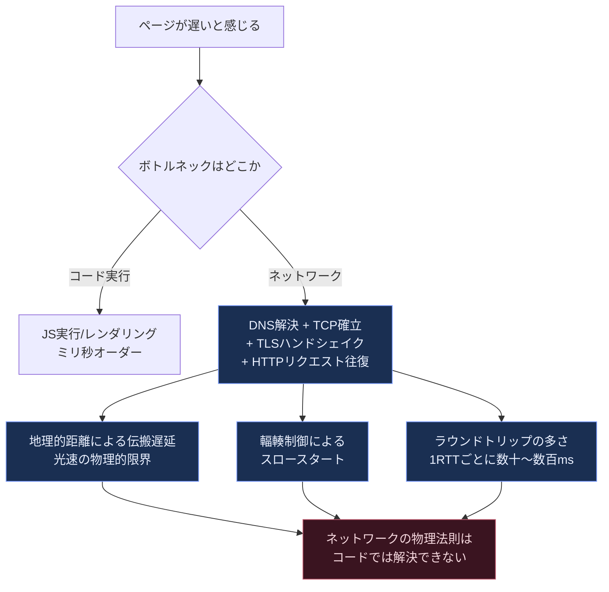

**本ガイドの読み方**：第1部でTCP/UDP/TLSという「土台」を固め、第2部でワイヤレス・モバイル回線特有の制約を学び、第3部でHTTPプロトコルそのものの進化（1.1→2→3）を追い、第4部でブラウザJavaScriptから実際に叩くAPI（XHR/SSE/WebSocket/WebRTC）を扱います。最後に第5部として、原著刊行後に登場したHTTP/3・QUIC・TLS 1.3・BBRv3などの2026年時点の実務知識を補います。

---

## 第1部：ネットワーキング101

### 第1章 レイテンシと帯域幅の基礎

#### 1.1 なぜ「帯域幅」より「レイテンシ」が重要なのか

多くの人は「回線が遅い＝帯域幅（bandwidth）が足りない」と考えがちですが、Webページの体感速度を決めているのは主に**レイテンシ（latency）**、つまりデータが送信元から宛先へ届くまでに要する時間（エンドツーエンドのネットワーク遅延）です。より厳密には、送信元から宛先までの一方向の遅延を**片道遅延（one-way delay）**、そこから応答が返ってくるまでを**RTT（Round-Trip Time、往復遅延）**と呼び分けます。また、パケット全体を回線に送り出すのに要する**伝送遅延（transmission delay）**はレイテンシを構成する一要素であって、レイテンシそのものではありません（次節参照）。特に小さなリクエストが何度も往復するWebの通信パターンでは、帯域幅を2倍にしても体感速度はほとんど変わらない一方、RTTを半分にすると劇的に速く感じられます。

#### 1.2 レイテンシを構成する4つの要素

| 要素 | 説明 | 特徴 |
|---|---|---|
| 伝搬遅延（Propagation Delay） | 信号が物理媒体（光ファイバー・銅線・無線）を伝わる時間 | 光速という物理法則が下限。距離に比例し、圧縮・技術改善では短縮できない |
| 伝送遅延（Transmission Delay） | パケット全体を回線に送り出すのにかかる時間 | パケットサイズ ÷ 帯域幅。帯域幅を上げれば短縮可能 |
| 処理遅延（Processing Delay） | ルーターやスイッチがヘッダを解析し次のホップを決める時間 | ハードウェア性能に依存、通常は無視できるほど小さい |
| キューイング遅延（Queuing Delay） | 混雑したルーターの送信待ちキューで発生する遅延 | ネットワーク輻輳の度合いに依存し、最も予測しづらい |


#### 1.3 光速と「ラストマイル」の現実

光ファイバー中の光の伝搬速度は真空中光速の約2/3（約20万km/秒）です。理論上、地球を半周する約20,000kmの距離であれば片道で約100ms、往復（RTT）では約200msという計算になりますが、現実のインターネットはルーターを何十ホップも経由し、さらに家庭やスマートフォンから最寄りのISP設備までの「ラストマイル」区間で追加の遅延が発生します。ラストマイルは技術（DSL・ケーブル・光・モバイル）によって遅延特性が大きく異なり、多くの場合ここが体感速度のボトルネックになります。

#### 1.4 コアネットワークとエッジの帯域幅格差

インターネットのバックボーン（コアネットワーク）は年々高速化していますが、末端ユーザーが実際に使える帯域幅（エッジの帯域幅）は地域・回線種別によって大きな差があります。CDN（コンテンツデリバリーネットワーク）は、コンテンツをユーザーに地理的に近い場所へキャッシュすることで伝搬遅延そのものを短縮する、レイテンシ対策の代表的な手法です。

**ベストプラクティス**
- レイテンシは物理法則（光速）に縛られるため、根本対策は「距離を縮める」（CDN・エッジロケーション活用）か「往復回数を減らす」（HTTP/2多重化・接続の再利用・0-RTT）のいずれかである
- 帯域幅の増強だけに投資せず、まずRTT（往復時間）を計測し、リクエスト往復回数を減らす設計を優先する
- Webサイトの体感速度改善では、まず「何往復（RTT）しているか」を可視化する（DevToolsのNetworkパネルのWaterfall表示など）

---

### 第2章 TCPの構成要素

#### 2.1 なぜTCPを理解する必要があるのか

HTTPはアプリケーション層のプロトコルですが、その下では（HTTP/3を除き）ほぼ例外なくTCP（Transmission Control Protocol）が使われています。TCPは「信頼性のある順序保証付きバイトストリーム」を提供しますが、その信頼性を実現する仕組み自体が、Webのパフォーマンスに直接影響を与えます。

#### 2.2 スリーウェイハンドシェイク

TCP接続の確立には、データ送信前に3回のパケット交換（SYN → SYN-ACK → ACK）が必要です。これは新規TCP接続ごとに**最低1RTT分の遅延**が発生することを意味します。

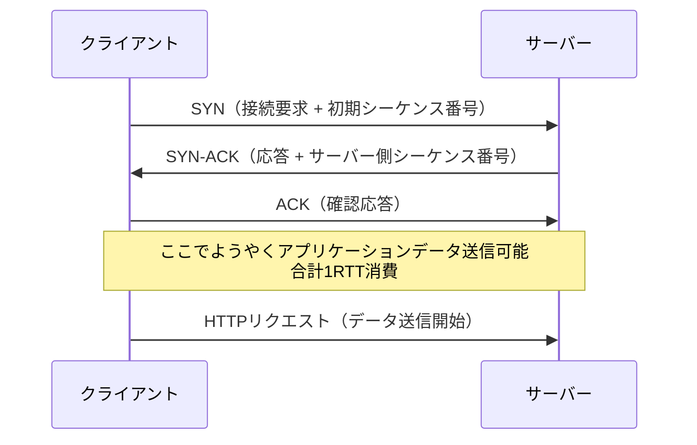

#### 2.3 輻輳制御（Congestion Control）とフロー制御（Flow Control）

TCPには2つの「速度調整」の仕組みがあります。

| 仕組み | 目的 | 判断基準 |
|---|---|---|
| フロー制御 | 受信側のバッファ溢れを防ぐ | 受信側が広告するウィンドウサイズ（受信側の処理能力） |
| 輻輳制御 | ネットワーク経路の混雑を防ぐ | パケットロスや遅延から推定するネットワークの空き容量 |

#### 2.4 スロースタート（Slow Start）

新しいTCP接続は、いきなり最大速度で送信を始めるわけではありません。輻輳ウィンドウ（cwnd）を小さい値から始め、ACKを受け取るたびに指数的に増やしていく「スロースタート」というアルゴリズムを使います。これは、接続確立直後の数RTTの間はスループットが本来の帯域幅より低く抑えられることを意味し、**小さなファイルを多数やり取りするWeb通信では、スロースタートが完了する前に転送が終わってしまい、帯域幅を使い切れないケースが多発します**。

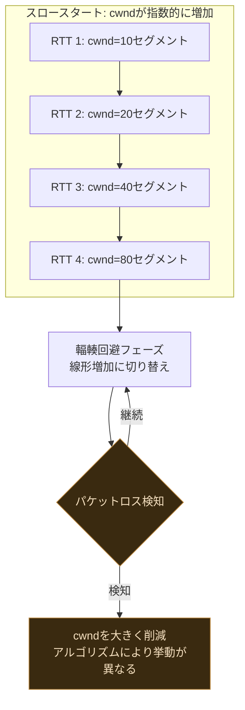

#### 2.5 帯域遅延積（Bandwidth-Delay Product, BDP）

BDP = 帯域幅 × RTT で計算され、「経路上に存在しうる未確認データ量（in-flight data）の理論上限」を表します。TCPのウィンドウサイズがBDPより小さいと、帯域幅を使い切れずに回線が遊んでしまいます。高帯域幅・高遅延（衛星回線や大陸間通信など）の経路では、この問題が顕著になり、TCPウィンドウスケーリング（RFC 7323）などの拡張が必要になります。

#### 2.6 HOL（Head-of-Line）ブロッキング

TCPは「順序保証されたバイトストリーム」であるため、パケットが1つでも失われると、それより後に届いたパケットもアプリケーションに渡されず、再送されたパケットが届くまで**すべてがブロックされます**。これがTCPレベルのHOLブロッキングであり、後述するHTTP/2の「1接続に複数ストリームを多重化する」という設計の弱点（TCPレベルでのHOLブロッキングが全ストリームに波及する）の根本原因になります。

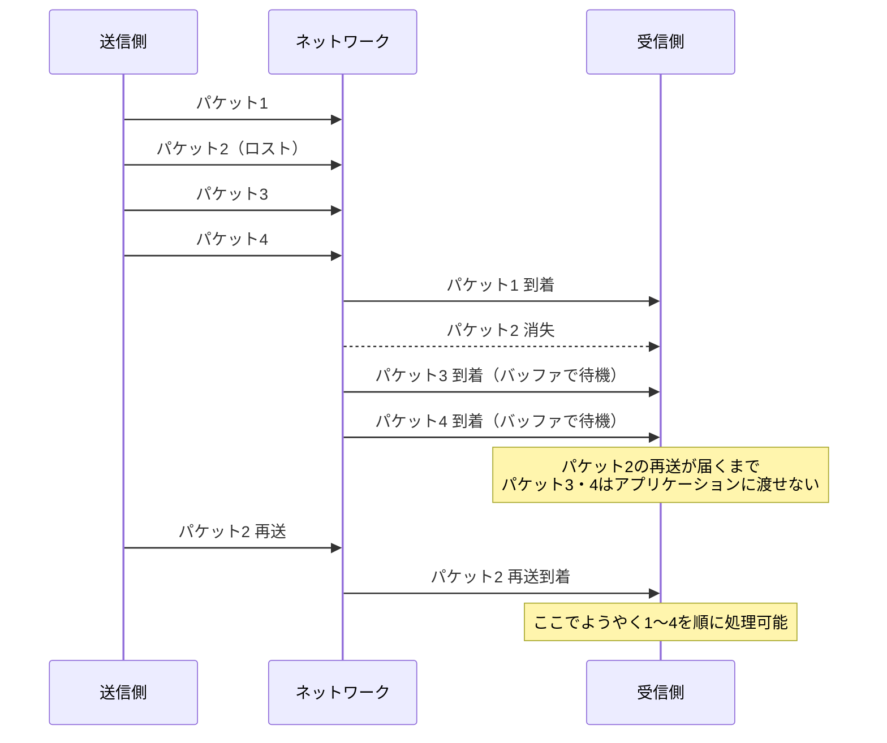

#### 2.7 TCP最適化のベストプラクティス

**ベストプラクティス**
- サーバーの初期輻輳ウィンドウ（initcwnd）を、Linuxの最新デフォルト値に合わせて適切に設定する（小さすぎると初期スループットが出ない）
- 不要になったTCP接続を保持し続けない一方、同一オリジンへの新規接続を頻発させない（TCPスロースタートのペナルティを毎回払うことになる）
- サーバーのTCP輻輳制御アルゴリズムをCUBICやBBRなど最新のものに更新する（詳細は第5部参照）
- 小さいファイルを多数配信するサイトでは、TCP接続の再利用（Keep-Alive）とHTTP/2の多重化を活用し、新規ハンドシェイクの回数自体を減らす
- ラストマイルの帯域幅が細い環境を想定し、初期表示に必要なリソースをできるだけ小さく保つ（スロースタート中の帯域幅制約を考慮する）

---

### 第3章 UDPの構成要素

#### 3.1 UDPとTCPの根本的な違い

UDP（User Datagram Protocol）は「コネクションレス」「順序保証なし」「再送保証なし」というTCPとは対照的な特性を持つトランスポート層プロトコルです。原著はこれを**「Null Protocol Services」**（何も提供しないプロトコル）と表現しています。信頼性・順序保証・輻輳制御のいずれも提供しないため、アプリケーション側がそれらを自前で実装する必要がありますが、その分オーバーヘッドが小さく、リアルタイム性が求められる用途（音声・映像・ゲーム、そして後述するQUIC/HTTP3）に適しています。

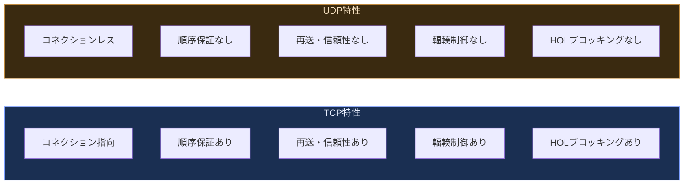

#### 3.2 NAT（ネットワークアドレス変換）とUDP

家庭用ルーターや企業ネットワークの多くはNATを使い、プライベートIPアドレスをパブリックIPアドレスに変換します。TCPはコネクション確立時のハンドシェイクがあるため、NATデバイスは「このコネクションは有効」と判断しやすいのですが、UDPにはそうした明示的なシグナルがなく、**NATのUDPマッピングは一定時間（多くはわずか30秒程度）通信がないとタイムアウトで破棄されます**。これがUDPを使ったP2P通信（WebRTCなど）で「接続が切れる」問題の主要因の一つです。

#### 3.3 NATトラバーサル：STUN・TURN・ICE

2台の端末がそれぞれ別のNATの背後にいる場合、直接P2P接続を確立するには工夫が必要です。

| 技術 | 役割 |
|---|---|
| STUN（Session Traversal Utilities for NAT） | 自分のパブリックIP・ポートを外部サーバーに問い合わせて把握する仕組み。多くの場合これだけでP2P接続が確立できる |
| TURN（Traversal Using Relays around NAT） | STUNでも直接接続できない厳格なNAT（対称型NATなど）の場合に、サーバーを中継役として使う仕組み。帯域幅コストが高いためフォールバック用 |
| ICE（Interactive Connectivity Establishment） | STUN・TURNを組み合わせ、利用可能な経路の候補（Candidate）を列挙し、最も効率の良い経路を自動選択するフレームワーク |

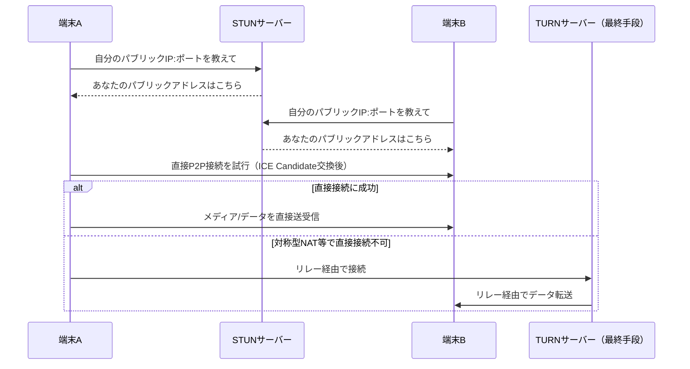

#### 3.4 UDP最適化のベストプラクティス

**ベストプラクティス**
- UDPベースのアプリケーションでは、アプリケーション層で独自の輻輳制御を実装しない限り、他のTCPフローを飢餓状態にする「フェアネス違反」のリスクがあることを理解する
- NATタイムアウトに備え、定期的なキープアライブパケットを送るか、接続断からの再接続ロジックを実装する
- P2P接続確立にはICEフレームワークを使い、STUNで解決できない場合のフォールバックとしてTURNサーバーを必ず用意する
- ペイロードサイズを「パスMTU（経路上の最大転送単位、通常1500バイト前後）− IPヘッダ長（IPv4で20バイト以上、IPv6で40バイト）− UDPヘッダ8バイト」以下に収め、IPフラグメンテーションを避ける（IPv4/1500バイト経路なら概ね1472バイト以下、IPv6なら1452バイト以下が目安）

---

### 第4章 TLS（Transport Layer Security）

#### 4.1 TLSが提供する3つの保証

TLSはトランスポート層の上でセキュリティを提供するプロトコルで、次の3つを保証します。

| 保証 | 内容 |
|---|---|
| 暗号化（Encryption） | 通信内容を第三者が読み取れないようにする |
| 認証（Authentication） | 通信相手が主張する身元（証明書）が正しいことを検証する |
| 完全性（Integrity） | 通信経路上でデータが改ざんされていないことを保証する |

#### 4.2 TLSハンドシェイク（TLS 1.2までの2-RTTモデル）

原著執筆当時（TLS 1.2ベース）のフルハンドシェイクは、TCPの1RTTに加えてさらに2RTTを要していました。

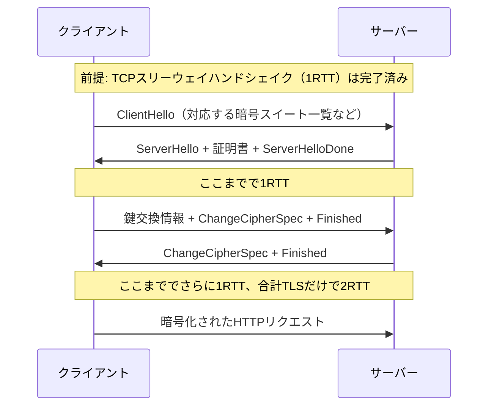

#### 4.3 鍵交換方式：RSAとDiffie-Hellman、前方秘匿性（Forward Secrecy）

古典的なRSA鍵交換は、サーバーの秘密鍵が万一将来漏洩すると、**過去に記録された暗号化通信もすべて復号できてしまう**という弱点があります。Diffie-Hellman鍵交換（特に楕円曲線を使うECDHE）は、セッションごとに一時的な鍵を生成するため、サーバーの秘密鍵が漏洩しても過去のセッションは保護されます。これを前方秘匿性（Forward Secrecy）と呼び、現代のTLS実装では標準的に使われています。

#### 4.4 ALPN・SNI・セッション再開

| 技術 | 役割 |
|---|---|
| ALPN（Application-Layer Protocol Negotiation） | TLSハンドシェイク中に「この後HTTP/2で話します」といったアプリケーション層プロトコルを事前ネゴシエーションし、追加の往復を省く |
| SNI（Server Name Indication） | 1つのIPアドレスで複数のドメイン（複数の証明書）をホストする際、ClientHelloの時点でどのドメイン向けかをサーバーに伝える拡張 |
| セッション再開（Session Resumption） | セッションID方式・セッションチケット方式のいずれかで、2回目以降の接続時にフルハンドシェイクを省略し高速に再接続する仕組み |

#### 4.5 証明書チェーンと失効確認

ブラウザは証明書を検証する際、ルート証明書からサーバー証明書までの「信頼の連鎖（Chain of Trust）」をたどります。また、証明書が失効していないかを確認する方法として、CRL（証明書失効リスト）とOCSP（オンライン証明書ステータスプロトコル）があります。OCSPは証明書ごとに認証局へ問い合わせが必要でレイテンシが増えるため、**OCSPステープリング**（サーバー自身が事前にOCSPレスポンスを取得しておき、TLSハンドシェイク中にクライアントへ提示する方式）が推奨されます。

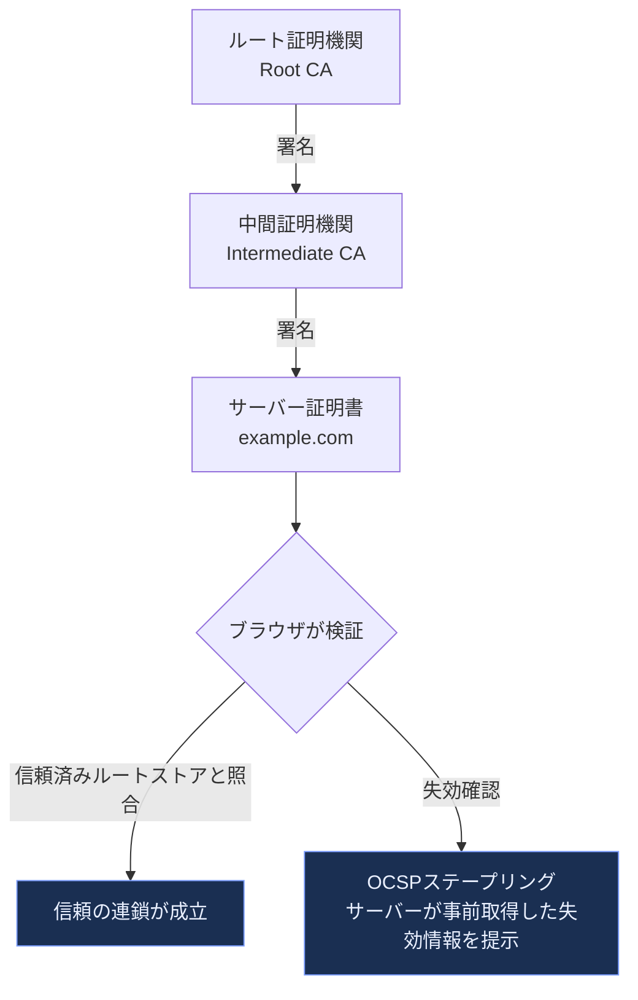

#### 4.6 TLS最適化のベストプラクティス（原著の推奨事項）

**ベストプラクティス**
- 計算コストの高い鍵長・アルゴリズムを見直し、CPU負荷とセキュリティのバランスを取る
- セッションキャッシュ・セッションチケットを有効にし、再接続時のフルハンドシェイクを回避する
- TLS False Start（サーバーの最終Finishedメッセージを待たずにアプリケーションデータを送り始める最適化）を活用する
- TLSレコードサイズをネットワークのMTUに合わせて最適化し、不要な断片化を避ける
- 証明書チェーンを最小限に保ち、余分な中間証明書送信によるバイト数増加を避ける
- OCSPステープリングを設定し、クライアント側の追加ラウンドトリップを削減する
- HSTS（HTTP Strict Transport Security）を有効化し、平文HTTPへのダウングレード攻撃を防ぐと同時に、リダイレクトによる往復を省略する
- サイト全体をHTTPS化し、混在コンテンツ（Mixed Content）を排除する

> **2026年時点の補足**: 本章はTLS 1.2時代（2-RTTハンドシェイク）を前提に書かれていますが、現在主流のTLS 1.3では**1-RTTハンドシェイク**が標準となり、条件が揃えば**0-RTT再接続**も可能です。詳細は第5部で解説します。

---

## 第2部：ワイヤレスネットワークのパフォーマンス

### 第5章 ワイヤレスネットワーク入門

#### 5.1 ワイヤレスネットワークの分類

無線ネットワークは、通信距離とユースケースによって複数の階層に分類されます。

| 分類 | 代表例 | 通信距離の目安 |
|---|---|---|
| PAN（Personal Area Network） | Bluetooth、NFC | 数cm〜数m |
| LAN（Local Area Network） | WiFi（IEEE 802.11） | 数十m |
| MAN（Metropolitan Area Network） | WiMAX | 数km |
| WAN（Wide Area Network） | 3G/4G/5Gなどのモバイルセルラー網 | 数km〜数十km（セル単位） |

#### 5.2 ワイヤレス通信の性能を決める3要素

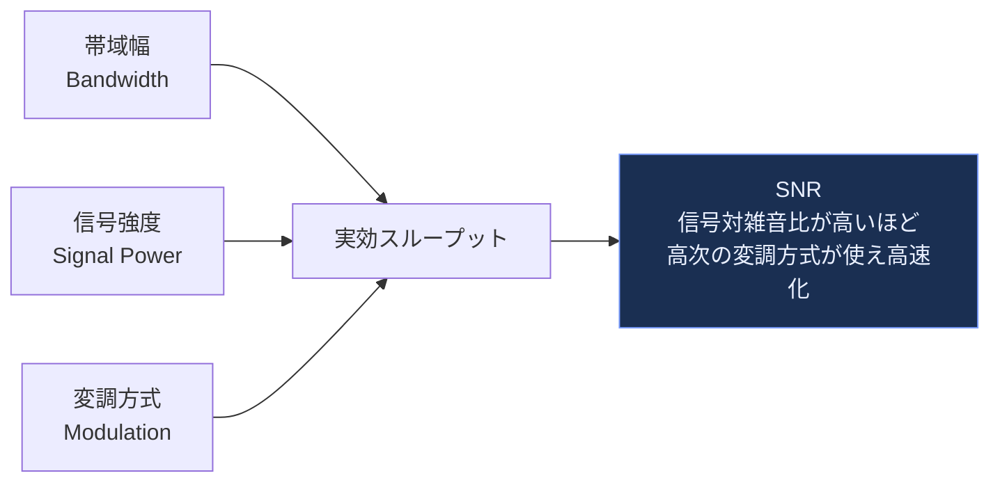

無線通信では、信号強度（電波強度）と雑音の比率（SNR: Signal-to-Noise Ratio）が高いほど、より複雑な変調方式（1回の伝送でより多くのビットを表現できる方式）を使うことができ、結果として高いスループットが得られます。逆に、電波状況が悪化するとより単純な（低速な）変調方式へ自動的にフォールバックします。これが「WiFiの表示上の速度（例: 866Mbps）」と「実際のスループット」が大きく乖離する理由の一つです。

**ベストプラクティス**
- 無線環境の性能は固定的なものではなく、電波状況・干渉・距離によって秒単位で変動することを前提にアプリケーションを設計する
- ネットワーク種別（WiFi/セルラー）や実効的な回線品質をJavaScriptから取得できるAPI（Network Information APIなど）がある場合は活用し、低速時には画質やペイロードを動的に下げる。ただし信号強度そのものは取得できず、利用できるのは`effectiveType`（`slow-2g`/`2g`/`3g`/`4g`）・推定帯域幅（`downlink`）・推定RTT（`rtt`）といった指標である

---

### 第6章 WiFi

#### 6.1 イーサネットとWiFiの根本的な違い：CSMA/CDとCSMA/CA

有線イーサネットは衝突検出（CSMA/CD: 送信しながら衝突を検知し即座に中断）が可能ですが、無線LANでは自分の送信中に他局の電波を同時受信できない（送信と受信を同時にできないハーフデュプレックス特性）ため、衝突を**事前に回避する**方式（CSMA/CA: Carrier Sense Multiple Access with Collision Avoidance）を採用しています。送信前にランダムなバックオフ時間だけ待機し、チャネルが空いていることを確認してから送信します。

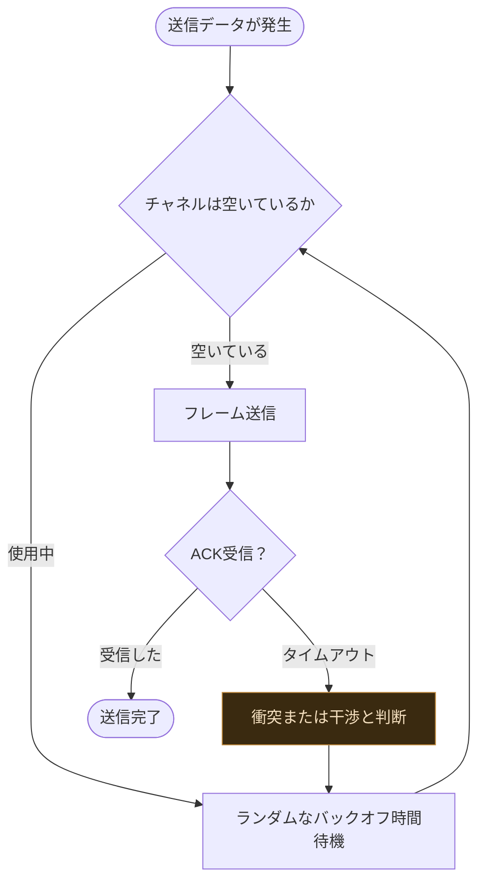

#### 6.2 WiFi規格の進化

| 規格 | 制定年 | 周波数帯 | 理論最大速度の目安 |
|---|---|---|---|
| 802.11b | 1999 | 2.4GHz | 11 Mbps |
| 802.11g | 2003 | 2.4GHz | 54 Mbps |
| 802.11n（WiFi 4） | 2009 | 2.4/5GHz | 600 Mbps（MIMO） |
| 802.11ac（WiFi 5） | 2013 | 5GHz | 数Gbps（MU-MIMO） |
| 802.11ax（WiFi 6/6E） | 2019〜 | 2.4/5/6GHz | 9.6 Gbps理論値、OFDMAで多端末効率向上 |
| 802.11be（WiFi 7） | 2024〜 | 2.4/5/6GHz | マルチリンク動作（MLO）で複数帯域を同時使用 |

> 2026年時点、WiFi 7（802.11be）は主流機種に標準搭載されつつあり、マルチリンクオペレーション（MLO）により複数の周波数帯を同時に束ねることで、混雑環境下でも低レイテンシを維持しやすくなっています。

#### 6.3 WiFiにおけるパケットロスの原因

WiFi環境でのパケットロスは、有線環境と異なり必ずしも「輻輳（混雑）」だけが原因ではありません。電波干渉、信号減衰（距離・障害物）、隠れ端末問題（Hidden Node Problem）など物理層由来の要因が複雑に絡みます。しかしTCPの輻輳制御アルゴリズムの多くは「パケットロス＝輻輳」と解釈するため、**WiFi特有の物理層ロスをTCPが誤って輻輳と判断し、不必要に送信速度を落としてしまう**という問題が古くから指摘されています（これは後述するBBR系アルゴリズムが解決を試みている課題の一つです）。

**ベストプラクティス**
- WiFi環境では帯域幅を「無制限」として扱わない。混雑時間帯・多端末接続時のスループット低下を考慮する
- 可変レイテンシ・可変帯域幅に適応できるよう、アプリケーションはネットワーク状態を継続的に監視し、品質を動的に調整する（アダプティブビットレートなど）

---

### 第7章 モバイルネットワーク

#### 7.1 世代（G）の歴史


#### 7.2 RRC（Radio Resource Control）状態遷移とパフォーマンスへの影響

モバイル端末の無線チップは、常に電波を送受信し続けているわけではありません。バッテリー消費を抑えるため、通信の有無に応じてRRC（無線リソース制御）状態を遷移させます。この状態遷移こそが、モバイルネットワーク特有の「見えない遅延」の正体です。

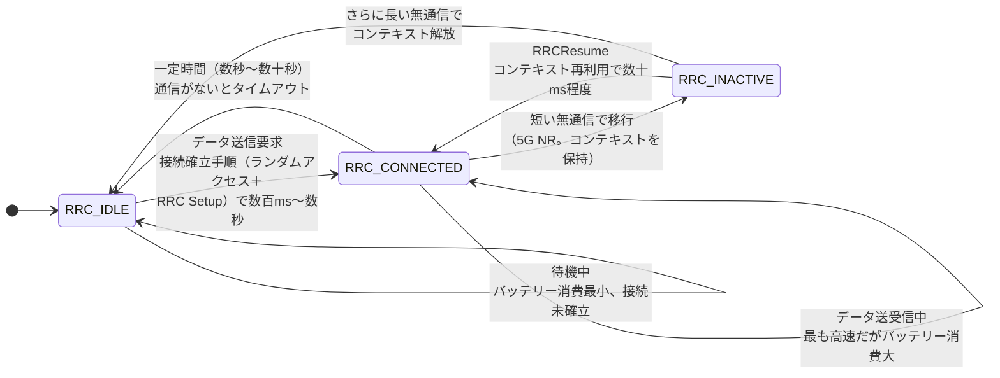

5G NRでは、RRC_IDLE・RRC_CONNECTEDに加えて**RRC_INACTIVE**が独立した第3の状態として定義されています。RRC_INACTIVEは端末とネットワークの双方がRRCコンテキスト（セキュリティ設定やベアラ情報）を保持したまま無線を休止する状態で、再開時は完全な接続確立手順ではなく**RRCResume**手順で済むため、RRC_IDLEからの昇格（数百ms〜数秒）に比べて**数十ms程度**と大幅に低遅延です。周期的に小さなデータを送るアプリケーションの遅延・電力特性は、端末がRRC_IDLEとRRC_INACTIVEのどちらに落ちているかで大きく変わります。

この「RRC_IDLE→RRC_CONNECTED」への遷移にかかる時間（State Promotion Delay）は数百ミリ秒から数秒に及ぶことがあり（RRC_INACTIVEからのRRCResumeであれば数十ms程度に短縮されます）、特にアプリが数秒おきに小さなデータを送受信するような「周期的な通信」を行うと、**その都度この昇格遅延を支払うことになり、体感速度の悪化とバッテリー消費の増大を同時に招きます**。

#### 7.3 モバイル網のエンドツーエンド構造

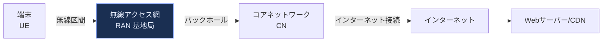

無線区間だけでなく、基地局からコアネットワークまでの「バックホール」区間の容量・遅延も、モバイル通信全体のレイテンシに大きく影響します。

**ベストプラクティス**
- モバイル網の実効レイテンシはWiFiや有線の数倍〜数十倍になりうることを前提に、リクエスト往復回数を最小化する設計を優先する
- RRC状態遷移のコストを理解し、後述の第8章の最適化手法（キープアライブ削減・バッチ送信）を実践する

---

### 第8章 モバイルネットワークの最適化

#### 8.1 バッテリーとネットワークのトレードオフ

モバイル最適化の目標は、単純な速度向上だけでなく「**バッテリー消費を抑えながら**」ネットワークを効率よく使うことです。原著は次の実践的な指針を提示しています。

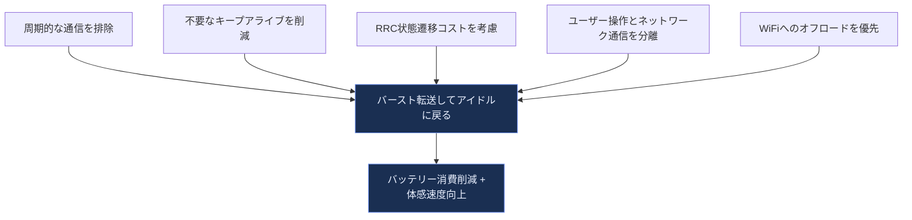

#### 8.2 具体的な最適化パターン

| パターン | 内容 |
|---|---|
| バースト転送してアイドルに戻る（Burst and go idle） | データをまとめて一度に送受信し、その後は通信を行わない時間をまとめて作る。無線の使用時間が減り、ネットワーク側のタイマーによるRRC_IDLE／RRC_INACTIVEへの遷移が起きやすくなる（RRC状態を遷移させるのはネットワークであり、アプリケーションが直接Idleに戻すわけではない）。細切れの通信を避ける |
| キープアライブの削減 | アプリケーションが頻繁に送る死活確認パケットは、その都度RRC状態を昇格させバッテリーを消耗させる。間隔を長くするか、プッシュ通知など効率的な代替手段に置き換える |
| ネットワーク可用性の変化に対応した設計 | モバイル環境ではネットワークが瞬断・切替（WiFi⇔セルラー）することを前提に、再試行・オフラインキューイングを実装する |
| プロトコル・アプリケーションのベストプラクティス適用 | 圧縮、キャッシュ、リクエスト数削減など、第13章で扱う汎用的な最適化と組み合わせる |

**ベストプラクティス**
- ポーリング間隔を可能な限り長く取るか、サーバープッシュ（第16・17章のSSE/WebSocket）に置き換え、周期通信によるRRC昇格を最小化する
- アプリがバックグラウンドにあるときの通信頻度を積極的に抑制する
- 可能な場合はWiFi接続時にのみ大きなダウンロード（アップデート等）を行うよう設計する

---

## 第3部：HTTP

### 第9章 HTTPの歴史

#### 9.1 HTTPバージョンの進化

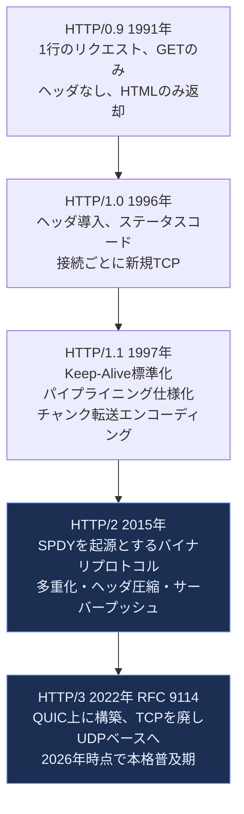

#### 9.2 各バージョンの要点

| バージョン | 主な特徴 | 主な課題 |
|---|---|---|
| HTTP/0.9 | 1行のリクエスト（GET /index.html）、レスポンスはHTMLのみ | ヘッダなし、ステータスコードなし、拡張性ゼロ |
| HTTP/1.0 | リクエスト・レスポンスヘッダ、Content-Type、ステータスコード導入 | リクエストごとに新規TCP接続（Keep-Aliveなし）が一般的 |
| HTTP/1.1 | Keep-Alive標準化、パイプライニング仕様化（実際にはほぼ使われず）、Hostヘッダ必須化によるバーチャルホスト対応 | 仕様上はリクエストをパイプライン化できるが、レスポンスは要求順に返す必要があるためHTTPレベルのHOLブロッキングが残る。加えて実装面ではブラウザがパイプラインを使わず1接続あたりのリクエストを直列化するため、同一オリジンへの接続数（6本程度）が実質的な並列度の上限になる |
| HTTP/2 | バイナリフレーミング、1接続内でのストリーム多重化、ヘッダ圧縮（HPACK）、サーバープッシュ（後に非推奨化） | TCP自体のHOLブロッキングは解決できない（トランスポート層の限界） |
| HTTP/3 | QUIC（UDPベース）上に構築、ストリームごとに独立した信頼性制御でTCPレベルのHOLブロッキングを解消、コネクションマイグレーション対応 | ミドルボックス互換性、UDPブロック環境での接続失敗、デバッグの複雑さ |

**ベストプラクティス**
- 新規プロジェクトでは、対応可能な環境（CDN・ブラウザ）である限りHTTP/2以上を既定とし、HTTP/1.1向けの最適化（ドメインシャーディング等）は行わない
- HTTP/3対応状況は2026年時点でもHTTP/2ほど普遍的ではないため、フォールバック設計（Alt-Svcヘッダ等）を必ず組み込む

---

### 第10章 Webパフォーマンス入門

#### 10.1 モダンWebアプリケーションの解剖

現代のWebページは、単一のHTMLファイルではなく、HTML・CSS・JavaScript・画像・フォント・XHR/Fetchによる非同期リクエストなど、数十から数百のリソースの組み合わせで構成されます。これら全体の読み込み過程を可視化したものが「リソースウォーターフォール」です。

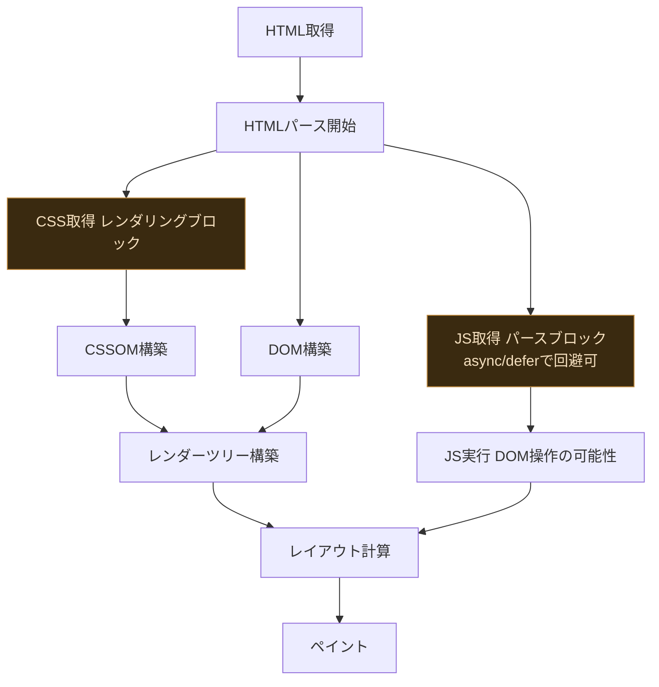

#### 10.2 パフォーマンスの3本柱

原著は、Webパフォーマンスを次の3つの柱に分解しています。

| 柱 | 内容 |
|---|---|
| コンピューティング（Computing） | JavaScript実行、レイアウト計算、ペイントなど、CPU/GPUで行われる処理 |
| レンダリング（Rendering） | DOM構築、CSSOM構築、レンダーツリー構築、レイアウト、ペイントというブラウザの描画パイプライン |
| ネットワーキング（Networking） | 本書全体のテーマであるDNS解決・TCP/TLS確立・HTTPリクエストの往復 |

「帯域幅を増やしてもあまり速くならない」という原著の指摘は今も本質的に正しく、多くのケースでボトルネックはレイテンシ（往復回数）とレンダリングブロッキングリソースの解決順序にあります。

#### 10.3 合成モニタリング（Synthetic）とRUM（Real User Monitoring）

| 手法 | 特徴 |
|---|---|
| 合成モニタリング（Synthetic） | 決められたネットワーク条件・デバイスで定期的に計測（Lighthouse、WebPageTest等）。再現性は高いが実際のユーザー環境を反映しない |
| RUM（Real User Monitoring） | 実際のユーザーのブラウザから収集した実測データ（Core Web Vitalsのフィールドデータなど）。実態を反映するがノイズが多い |

**ベストプラクティス**
- 合成モニタリングとRUMの両方を併用し、開発時のリグレッション検知には合成、実態把握と優先順位付けにはRUMを使う
- レンダリングをブロックするリソース（同期CSS/JS）を可能な限り減らし、クリティカルレンダリングパス（初期表示に必要な最小限のリソース群）を短くする

---

### 第11章 HTTP/1.X

#### 11.1 Keep-Aliveの効果とその限界

HTTP/1.1のKeep-Aliveにより、1つのTCP接続を複数のHTTPリクエストで使い回せるようになり、リクエストごとのTCPハンドシェイクコストを削減できます。しかし、1つの接続内では次のリクエストを送る前に前のレスポンスを完全に受信し終える必要がある（リクエストのシリアライズ）という制約は残ります。

#### 11.2 複数TCP接続とドメインシャーディング

ブラウザは1オリジンあたり通常6本程度のTCP接続を並行して開くことで、この制約を部分的に回避しています。さらに、意図的に複数のサブドメインにリソースを分散させ、実質的な並列接続数を増やす「ドメインシャーディング」というテクニックが2010年代前半に広く使われました。

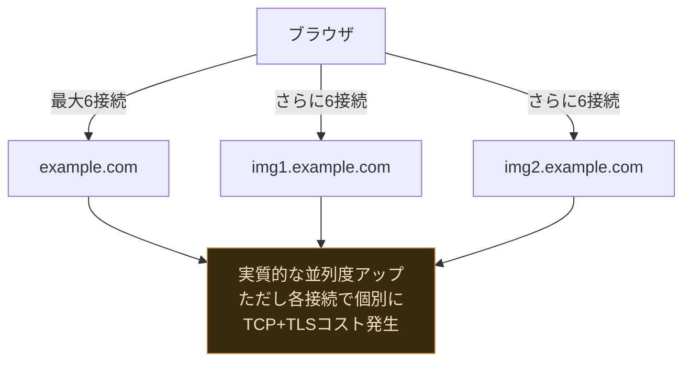

このテクニックはHTTP/1.1環境では有効でしたが、接続ごとにTCPスロースタート・TLSハンドシェイクのコストが重複して発生するというデメリットがあり、後述のHTTP/2以降ではむしろ有害（アンチパターン）とされています。

#### 11.3 その他のHTTP/1.1最適化テクニック（歴史的経緯）

| テクニック | 内容 | HTTP/2以降の扱い |
|---|---|---|
| 連結（Concatenation） | 複数のCSS/JSファイルを1つに結合し、リクエスト数を削減 | 多重化によりリクエスト数削減の必要性が薄れ、キャッシュ効率悪化のデメリットが相対的に大きくなる |
| スプライティング（Spriting） | 複数の画像を1枚の画像にまとめ、CSSのbackground-positionで切り出す | 同上、CSS/HTTPリクエストの管理コストとのトレードオフで見直しが進む |
| インライン化（Resource Inlining） | 小さなCSS/JS/画像をHTML内に直接埋め込み、リクエスト自体をなくす | キャッシュの粒度が粗くなるデメリットがあり、HTTP/2のServer Push構想（後に非推奨）と競合していた |

**ベストプラクティス**
- HTTP/1.1のみをサポートする古い環境向けには、上記の連結・スプライティング・インライン化・ドメインシャーディングを状況に応じて使う
- ただしHTTP/2以降が使える環境では、これらのテクニックは接続の多重化と衝突し逆効果になりうるため、原則として使用しない

---

### 第12章 HTTP/2

#### 12.1 SPDYからHTTP/2への系譜

HTTP/2はGoogleが開発した実験的プロトコル「SPDY」を起源としています。SPDYが実運用で効果を実証したことで、IETFによる標準化が進み、2015年にHTTP/2としてRFC 7540が発行されました（後にRFC 9113で更新）。

#### 12.2 バイナリフレーミング層

HTTP/1.xはテキストベースのプロトコルでしたが、HTTP/2はバイナリフレーミング層を導入し、すべてのやり取りを「フレーム」という小さな単位に分割します。これにより、パーサーの実装が単純化され、複数のリクエスト・レスポンスを1つの接続上で安全に混在させる（多重化する）ことが可能になりました。

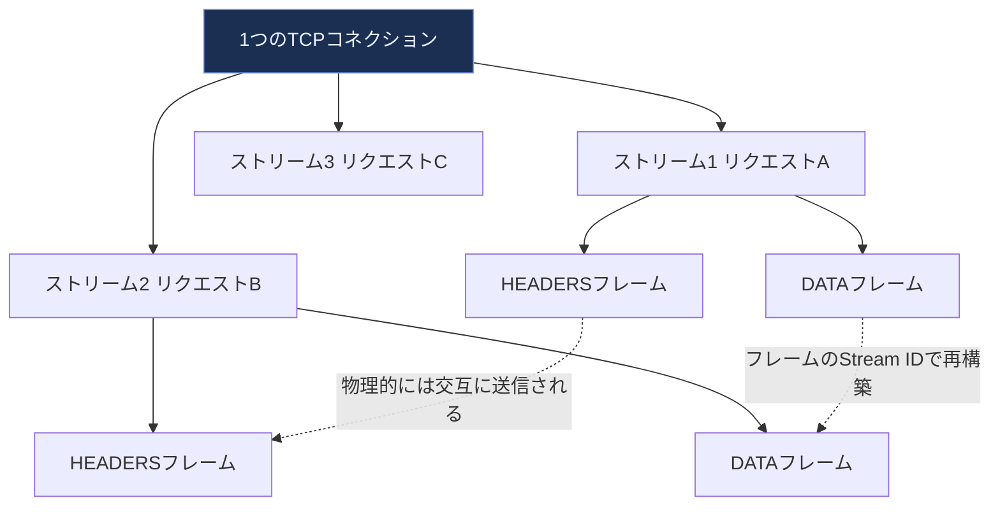

#### 12.3 リクエスト・レスポンスの多重化とストリーム優先度

HTTP/1.1では、仕様上パイプライン化できてもレスポンスが要求順に固定されるうえ、ブラウザ実装は事実上「1接続で1リクエストずつ直列」に処理していました。これに対しHTTP/2では「1接続=多数のストリーム」を順序制約なしに並行して処理できます。これにより、ドメインシャーディングのような回避策が不要になり、1オリジンにつき1本のTCPコネクションを使うことが推奨されるようになりました（TCPスロースタートやTLSハンドシェイクのコストを1回に集約できるため）。また、ストリームには優先度（Priority）を設定でき、重要なリソース（CSSなど）を先に配信するよう調整できます。

#### 12.4 ヘッダ圧縮（HPACK）

HTTPリクエストにはUser-Agent、Cookie、Accept系など類似したヘッダが毎回繰り返し送られます。HTTP/2はHPACKという専用の圧縮方式を使い、送信済みのヘッダをテーブルにキャッシュして差分のみを送ることで、ヘッダ部分のオーバーヘッドを大幅に削減します。

#### 12.5 サーバープッシュとその後の非推奨化

HTTP/2が導入した「サーバープッシュ」（クライアントが要求する前にサーバーが関連リソースを能動的に送信する仕組み）は、理論上はラウンドトリップを削減できるはずでしたが、実運用ではキャッシュとの相性の悪さ（ブラウザが既にキャッシュ済みのリソースを無駄にプッシュしてしまう）や実装の複雑さから効果が限定的であることが判明し、Chromeなど主要ブラウザは2020年前後にサーバープッシュのサポートを打ち切りました。代替として、後述の103 Early Hintsステータスコードが使われるようになっています。

#### 12.6 HTTP/2最適化：フロー制御と1オリジン1接続

HTTP/2はストリームごと・コネクションごとに独立したフロー制御ウィンドウを持ちます。デフォルトのウィンドウサイズが小さいまま運用すると、多重化のメリットを活かせずスループットが頭打ちになるため、サーバー・クライアント双方の実装がウィンドウサイズを適切にチューニングしているか確認する必要があります。

**ベストプラクティス**
- 1オリジンにつき1本のHTTP/2コネクションを使うことを前提に設計し、ドメインシャーディングを廃止する
- サーバープッシュには依存せず、Link: rel=preloadヘッダや103 Early Hintsなど、キャッシュと親和性の高い代替手法を検討する
- HPACKの恩恵を最大化するため、ヘッダの値（特にCookie等）を不必要に肥大化させない
- 導入後は必ずHTTP/2対応のツールでサーバーの多重化耐性・フロー制御の挙動を実測する

---

### 第13章 アプリケーション配信の最適化

#### 13.1 「不朽の」ベストプラクティス（Evergreen Performance Best Practices）

原著は、HTTP/1.xでもHTTP/2でも変わらず有効な最適化を「Evergreen（常緑）」なベストプラクティスと呼んでいます。


| 施策 | 具体例 |
|---|---|
| クライアントキャッシュ | 適切なCache-Control・ETagヘッダの設定、Service Workerによる高度なキャッシュ戦略 |
| データ圧縮 | Gzip・Brotliによるテキストリソースの圧縮、画像のWebP/AVIF化 |
| 不要バイトの削減 | Cookieの肥大化防止、不要なヘッダ・クエリパラメータの削除、Minify（コード圧縮） |
| 並列処理 | サーバー側での並列I/O、クライアント側での非同期リソース読み込み |

#### 13.2 HTTP/1.x向け最適化とHTTP/2向け最適化の違い

| 施策 | HTTP/1.x | HTTP/2 |
|---|---|---|
| ドメインシャーディング | 有効（並列接続数を増やせる） | 有害（TLS/TCPコスト重複、優先度制御の妨げ） |
| 連結・スプライティング | 有効（リクエスト数削減） | 効果薄〜有害（キャッシュ粒度が粗くなる、多重化と競合） |
| リソースインライン化 | 有効 | 慎重に。キャッシュできない代償が大きい場合が多い |
| サーバープッシュ | 非対応 | 非推奨（多くのブラウザが撤廃済み。Early Hints等で代替） |

#### 13.3 HTTP/2サーバーの品質テスト

HTTP/2はプロトコルとしては多重化・優先度制御を規定していますが、実装（サーバーソフトウェアやCDN）によって優先度制御の実装品質に大きな差があることが知られています。原著は、実際にストリーム優先度を尊重しているか、フロー制御が適切かをテストで検証することを推奨しています。

**ベストプラクティス**
- 「Evergreenな」最適化（キャッシュ・圧縮・バイト削減・並列化）はプロトコルバージョンに関わらず常に実施する
- HTTP/1.x向けの回避策（シャーディング等）をHTTP/2/3環境に残さない。プロトコル移行時は最適化戦略ごと見直す
- 導入したCDN・サーバーが実際にHTTP/2の優先度制御を正しく実装しているか、実測ツールで検証する

---

## 第4部：ブラウザAPIとプロトコル

### 第14章 ブラウザネットワーキング入門

#### 14.1 ブラウザが持つ独自の接続管理層

ブラウザは、OSのTCPスタックをそのまま使うのではなく、その上に独自の「接続管理層」を持っています。これには、オリジンごとの接続数上限、DNSプリフェッチ、TCPプリコネクト、リソースの優先度付けキューなどが含まれます。

```mermaid
flowchart TB
    App[Webアプリケーション JS] --> API[ブラウザAPI層<br/>XHR/Fetch/WebSocket/WebRTC等]
    API --> ConnMgmt[接続管理層<br/>オリジンごとの接続数制限<br/>優先度キュー、DNSプリフェッチ]
    ConnMgmt --> Sandbox[ネットワークセキュリティ<br/>サンドボックス層<br/>同一オリジンポリシー、CORS]
    Sandbox --> Cache[リソース/クライアント状態<br/>キャッシュ層<br/>HTTPキャッシュ、Cookie、IndexedDB]
    Cache --> OS[OSのTCP/UDPスタック]

    classDef highlightFill fill:#1a2f52,stroke:#7c9eff,color:#eaf0ff
    class Sandbox highlightFill
```

#### 14.2 ネットワークセキュリティとサンドボックス

ブラウザは、悪意あるスクリプトが他サイトの機密情報を勝手に読み取れないよう、同一オリジンポリシー（Same-Origin Policy）を基本としたサンドボックスモデルで動作します。

ここで初学者が最も誤解しやすいのが CORS（Cross-Origin Resource Sharing）の役割です。CORSが制御するのは主に「**クロスオリジンのレスポンスをスクリプトに読み取らせるかどうか**」であって、「リクエストを送信させるかどうか」ではありません。GETや`application/x-www-form-urlencoded`のPOSTなど**シンプルリクエスト**の条件を満たす場合、リクエストはプリフライトなしでそのまま相手サーバーへ届きます。サーバーが`Access-Control-Allow-Origin`を返さなければ、ブラウザは「すでに送信され処理されたレスポンスをスクリプトに渡さない」という形で保護するにすぎません。

一方、カスタムヘッダや`application/json`を伴う**非シンプルリクエスト**では、実リクエストの前に**プリフライト（OPTIONSリクエスト）**でサーバーの許可を検証し、許可が得られなければ実リクエストは送信されません。つまりCORSには「レスポンス共有の制御」と「プリフライトによる事前検証」という2つの側面があります。

そして、副作用を伴うリクエストが他サイトから勝手に送られること自体を防ぐのはCORSの責務ではなく、CSRF対策（SameSite Cookie・CSRFトークン等）の責務です（第15章で詳述）。

#### 14.3 リソース・クライアント状態キャッシング

ブラウザは、HTTPキャッシュ（`Cache-Control`/`ETag`ベース）だけでなく、Cookie・LocalStorage・IndexedDB・Service Workerキャッシュなど複数のクライアント側状態管理の仕組みを提供しています。これらを適切に使い分けることが、リクエスト数削減・オフライン対応の鍵になります。

**ベストプラクティス**
- ブラウザが提供する接続管理（優先度付け、プリコネクト等）を妨げないよう、リソースの読み込み順序・優先度ヒント（`fetchpriority`属性等）を適切に指定する
- CORSの設定は必要最小限のオリジン・メソッド・ヘッダに絞り、プリフライトリクエスト（後述）の発生条件を理解した上で設計する

---

### 第15章 XMLHttpRequest

#### 15.1 XHRの歴史と役割

XMLHttpRequest（XHR）は、ページ全体をリロードせずにサーバーと非同期通信を行うための最初期のブラウザAPIで、いわゆる「Ajax」という開発スタイルの基盤となりました。現在は`fetch()`APIがより現代的な代替として広く使われていますが、XHRが確立した「非同期HTTP通信」というモデル自体はfetchにも引き継がれています。

#### 15.2 CORS（Cross-Origin Resource Sharing）とプリフライトリクエスト

異なるオリジンへのXHR/fetchリクエストのうち、「シンプルリクエスト」の条件（GET/POST/HEADかつ特定のヘッダのみ等）を満たさないものは、実際のリクエストを送る前にブラウザが自動的に`OPTIONS`メソッドで**プリフライトリクエスト**を送信し、サーバーがそのオリジン・メソッド・ヘッダを許可しているかを事前確認します。

```mermaid
sequenceDiagram
    participant B as ブラウザ
    participant S as サーバー（別オリジン）
    Note over B,S: 例: JSONを送るPOSTでContent-Type: application/jsonを指定した場合
    B->>S: OPTIONS /api/data（プリフライト）<br/>Origin, Access-Control-Request-Method等
    S-->>B: Access-Control-Allow-Origin<br/>Access-Control-Allow-Methods 等
    Note over B: 許可を確認できたら初めて本リクエスト送信<br/>この往復で+1RTT発生
    B->>S: POST /api/data（本リクエスト）
    S-->>B: 200 OK + データ
```

**ベストプラクティス**
- プリフライトが発生する条件（カスタムヘッダ、application/json等の非シンプルContent-Type）を理解し、頻繁に呼ばれるAPIでは可能な範囲でシンプルリクエストの条件に収める
- サーバー側で`Access-Control-Max-Age`を適切に設定し、プリフライト結果をブラウザにキャッシュさせ、繰り返しの往復を削減する

#### 15.3 ダウンロード・アップロードの進捗監視とストリーミング

XHRは`progress`イベントによってダウンロード・アップロードの進捗を監視できます。

なお`responseType`（`''`/`text`・`json`・`blob`・`arraybuffer`・`document`）は、あくまで**レスポンスを最終的にどの形式で受け取るか**を選択するものであり、それ自体がストリーミング処理を有効にするわけではありません。XHRでレスポンスを逐次処理できるのは`responseType`が`''`（空文字）または`text`の場合に限られ、`readyState`が`LOADING`（3）の間に`responseText`を繰り返し読み進める形になります。バイナリを含む本格的なストリーミング受信が必要な場合は、XHRではなくFetch APIのストリーム（`Response.body`が返す`ReadableStream`）を用います。

#### 15.4 ポーリングとロングポーリング

サーバーからのリアルタイム通知を実現する古典的な手法として、原著は次の2つを紹介しています。

| 手法 | 動作 | 課題 |
|---|---|---|
| ポーリング（Polling） | 一定間隔でクライアントがサーバーに新着データの有無を問い合わせる | 更新がなくてもリクエストが発生し、無駄なオーバーヘッドとレイテンシが生じる |
| ロングポーリング（Long-Polling） | サーバーは新着データが発生するまでレスポンスを保留し、発生した時点で応答する。クライアントは応答を受けたら即座に再リクエスト | ポーリングよりリアルタイム性は高いが、サーバー側で大量の保留中コネクションを維持するコストが発生する |

これらの制約が、後述するSSE（第16章）やWebSocket（第17章）という、真の意味でサーバー起点のプッシュ通信を可能にするプロトコルが生まれた背景にあります。

---

### 第16章 Server-Sent Events（SSE）

#### 16.1 EventSource APIとイベントストリームプロトコル

SSEは、サーバーからクライアントへの**一方向**のリアルタイムストリーミングに特化したシンプルな仕組みです。ブラウザの`EventSource` APIを使い、サーバーは通常のHTTPレスポンスを`Content-Type: text/event-stream`として返し、接続を切らずにテキスト形式のイベントを継続的に送り続けます。

```mermaid
sequenceDiagram
    participant B as ブラウザ EventSource
    participant S as サーバー
    B->>S: GET /events（Accept: text/event-stream）
    S-->>B: 200 OK（接続を維持したまま）
    loop サーバーがイベント発生時に送信
        S-->>B: data: メッセージ1\n\n
        S-->>B: data: メッセージ2\n\n
    end
    Note over B,S: 接続が切れてもEventSourceは自動的に再接続を試みる<br/>（Last-Event-IDで再開位置を伝達）
```

#### 16.2 SSEの利点と適したユースケース

SSEはHTTP上に構築されているため、既存のHTTPインフラ（プロキシ、ロードバランサー、認証機構）とそのまま親和性が高く、実装もシンプルです。自動再接続や「どこから再開するか」を示す`Last-Event-ID`の仕組みも標準で組み込まれています。ただし、通信は**サーバーからクライアントへの一方向のみ**であり、双方向通信が必要な場合は後述のWebSocketが適しています。

**ベストプラクティス**
- サーバー起点の通知（株価更新、進捗通知、ライブフィード等）で、クライアントからの応答が不要な用途にはSSEを第一候補とする
- HTTP/1.1環境ではブラウザの同時接続数上限（1オリジンあたり6本程度）にSSE接続も含まれるため、多数のSSE接続を同時に開くページ設計は避ける（HTTP/2以降は多重化によりこの制約が緩和される）

---

### 第17章 WebSocket

#### 17.1 WebSocketプロトコルの概要

WebSocketは、HTTP接続を**全二重（双方向・同時送受信可能）**な独自プロトコルへ切り替える仕組みです。切り替えの手順はHTTPのバージョンによって異なり、HTTP/1.1では`Upgrade`ヘッダによるハンドシェイク（101 Switching Protocols）を使いますが、HTTP/2では拡張CONNECT（RFC 8441）、HTTP/3では同じ拡張CONNECTをQUIC上で用いる方式（RFC 9220）で、1本のストリーム上に確立します（第19章の比較表も参照）。一度アップグレードが完了すると、HTTPのリクエスト/レスポンスという構造から離れ、両者が自由なタイミングでフレームを送り合える低オーバーヘッドな通信路になります。

```mermaid
sequenceDiagram
    participant B as ブラウザ
    participant S as サーバー
    B->>S: GET /chat HTTP/1.1<br/>Upgrade: websocket<br/>Connection: Upgrade<br/>Sec-WebSocket-Key: ...
    S-->>B: 101 Switching Protocols<br/>Sec-WebSocket-Accept: ...
    Note over B,S: ここからWebSocketプロトコルに切り替わる<br/>以降は双方向にフレームを自由に送受信
    B->>S: テキスト/バイナリフレーム
    S-->>B: テキスト/バイナリフレーム
    S-->>B: テキスト/バイナリフレーム（クライアントの要求なしで送信可）
```

#### 17.2 WebSocketのバイナリフレーミングとサブプロトコルネゴシエーション

WebSocketもHTTP/2と同様に独自のバイナリフレーミング層を持ちます。また、`Sec-WebSocket-Protocol`ヘッダにより、アプリケーション固有のサブプロトコル（例: `chat.v2`）をネゴシエーションできます。拡張機能（`permessage-deflate`など、メッセージ全体のペイロードを圧縮するメッセージ単位の圧縮）もヘッダベースでネゴシエーション可能です。

#### 17.3 メッセージオーバーヘッドとデータ効率

WebSocketフレームのヘッダは最小2バイトから（ペイロード長に応じて最大14バイト程度）と非常に軽量です。しかし、小さなメッセージを高頻度で送信する用途では、このヘッダオーバーヘッドや、TCPベースであることによるHOLブロッキング（第2章参照）が無視できなくなる場合があります。

#### 17.4 WebSocketインフラのデプロイ上の注意点

WebSocketはHTTPとは異なる接続の持続特性（長時間接続を維持し続ける）を持つため、ロードバランサーやリバースプロキシの設定（タイムアウト値、ハンドシェイクの転送設定）を専用に調整する必要があります。調整対象はHTTPバージョンごとに異なります。HTTP/1.1では`Upgrade`／`Connection`ヘッダをホップバイホップで落とさず転送できること、HTTP/2ではRFC 8441の拡張CONNECT（`:protocol=websocket`）に対応し、サーバーが`SETTINGS_ENABLE_CONNECT_PROTOCOL`（識別子`0x08`）を送出できること、HTTP/3ではRFC 9220に基づく同等の拡張CONNECT対応が、それぞれ必要になります。

**ベストプラクティス**
- 双方向・低レイテンシ・高頻度の通信（チャット、マルチプレイヤーゲーム、コラボレーション編集）にはWebSocketを使う
- カスタムアプリケーションプロトコルは、メッセージの意味論を明確に定義し、必要以上に頻繁な細切れメッセージを避ける（オーバーヘッド削減）
- ロードバランサー・プロキシのWebSocket対応を、経路上で実際に使われるHTTPバージョンごとに事前検証する。HTTP/1.1は`Upgrade`／`Connection`ヘッダの透過、HTTP/2はRFC 8441の拡張CONNECT（`:protocol=websocket`）と`SETTINGS_ENABLE_CONNECT_PROTOCOL`（`0x08`）の有効化、HTTP/3はRFC 9220準拠を確認し、あわせてアイドルタイムアウト設定を調整する
- `permessage-deflate`拡張の使用可否は、圧縮によるCPUコストとペイロード削減効果を天秤にかけて判断する

---

### 第18章 WebRTC

#### 18.1 WebRTCとは何か、なぜP2Pが必要なのか

WebRTC（Web Real-Time Communication）は、ブラウザ間で**サーバーを介さない直接（P2P）**の音声・映像・任意データ通信を可能にするAPI群です。サーバーを介した中継はレイテンシ増加とサーバーコスト増大を招くため、ビデオ会議やリアルタイムゲームなど低遅延が求められる用途ではP2Pが本質的に有利です。

#### 18.2 全体像：シグナリングとPeerConnectionの確立

WebRTCの接続確立は大きく2段階に分かれます。まず「シグナリング」（互いのメディア能力・ネットワーク経路情報を交換する、WebRTC自体は規定しない任意のチャネル）、次に「P2P接続の確立」（ICEフレームワークによる経路探索）です。

```mermaid
sequenceDiagram
    participant A as 端末A
    participant Sig as シグナリングサーバー<br/>WebSocket等、規格外
    participant B as 端末B

    A->>Sig: SDP Offer（対応コーデック等の提案）
    Sig->>B: SDP Offerを転送
    B->>Sig: SDP Answer（応答）
    Sig->>A: SDP Answerを転送
    Note over A,B: 同時にICE Candidate（接続経路候補）も交換
    A->>B: ICE接続性チェック（STUN経由）
    Note over A,B: 直接経路が確立（または必要ならTURN中継）
    A->>B: DTLSハンドシェイクで暗号化鍵確立
    Note over A,B: 以降 SRTP（メディア）/ SCTP（データ）で直接通信
```

#### 18.3 SDP（Session Description Protocol）とICE（Interactive Connectivity Establishment）

| 要素 | 役割 |
|---|---|
| SDP（セッション記述プロトコル） | 対応コーデック、メディアの種類（音声/映像/データ）、暗号化パラメータなどを記述するテキストフォーマット |
| ICE Candidate | 自分が到達可能な可能性のあるアドレス（ローカルIP、STUNで判明したパブリックIP、TURN中継アドレス）の候補 |
| Trickle ICE | すべてのCandidateを集め終えるのを待たず、見つかり次第逐次交換することで接続確立を高速化する仕組み |

#### 18.4 メディア・データの伝送：DTLS・SRTP・SCTP

WebRTCの接続が確立すると、実際のデータは複数のサブプロトコルで保護・伝送されます。

```mermaid
flowchart TB
    ICE[ICEで確立された伝送経路<br/>UDP / TCP / TURN中継<br/>TCP・TLS over TCP] --> DTLS[DTLS<br/>Datagram TLS<br/>鍵交換と暗号化]
    DTLS --> SRTP[SRTP/SRTCP<br/>暗号化された音声/映像ストリーム]
    DTLS --> SCTP[SCTP over DTLS<br/>DataChannel<br/>任意のアプリケーションデータ]

    classDef highlightFill fill:#1a2f52,stroke:#7c9eff,color:#eaf0ff
    class DTLS highlightFill
```

- **SRTP/SRTCP**: 音声・映像メディアストリームを暗号化して伝送する、RTPプロトコルのセキュア版
- **SCTP over DTLS（DataChannel）**: メディア以外の任意データをやり取りするための仕組みで、TCPのように順序保証・信頼性のある配送も、UDPのように順序を問わない非信頼配送も選択できる（部分的信頼配送、Partially Reliable Delivery）

#### 18.5 DataChannelの設定：順序性と信頼性のトレードオフ

WebRTCのDataChannelは、用途に応じて配送特性を細かく設定できる点が特徴です。

| 設定 | 用途例 |
|---|---|
| 順序保証あり・信頼性あり（TCPライク） | ファイル転送、チャットメッセージなど欠落が許されないデータ |
| 順序保証なし・信頼性あり | 順序が重要でない通知データ |
| 部分的信頼配送（再送回数・タイムアウトを制限） | ゲームの位置情報更新など、古いデータより新しいデータの到達を優先したい用途 |

#### 18.6 マルチパーティアーキテクチャとインフラ計画

3人以上が参加するビデオ会議では、全員がP2Pでフルメッシュ接続すると参加者数の2乗に比例して帯域幅・CPU負荷が増大するため、実運用では**SFU（Selective Forwarding Unit）**と呼ばれる中継サーバーを介したアーキテクチャが一般的です。SFUは各参加者のストリームを受信し、必要な相手にのみ転送することで、送信側の負荷を一定に保ちます。

**ベストプラクティス**
- 1対1通信ならP2Pメッシュ、3人以上ならSFUベースのアーキテクチャを検討し、参加者数に応じたインフラ計画を立てる
- STUN単独で接続できない環境（対称型NAT、企業ファイアウォール）に備え、TURNサーバーを必ず用意する
- DataChannelは用途に応じて順序性・信頼性の設定を最適化し、不要な信頼性保証によるレイテンシ増加を避ける
- Trickle ICEを活用し、Candidate収集完了を待たずに接続確立プロセスを開始することで接続確立時間を短縮する

---

## 第5部（独自追加）：2026年時点の最新動向

> 原著は2013年刊行のため、HTTP/3・QUIC・TLS 1.3・BBR系輻輳制御・WebTransport・Core Web Vitals・耐量子暗号などは扱われていません。本部では2026年9月時点の最新情報をWeb検索で調査し、著名な国際的発信元（Cloudflare、Mozilla、Google、IETF等）を優先的に参照してまとめています。

### 19.1 HTTP/3とQUIC：TCPを置き換えるという発想

#### QUICの設計思想

QUIC（RFC 9000）はUDP上に構築された新しいトランスポートプロトコルで、TCP+TLSが別々に行っていたハンドシェイクを統合し、さらに**ストリームごとに独立した信頼性制御**を行うことで、第2章で説明したTCPレベルのHOLブロッキング問題を解消します。1つのストリームでパケットロスが起きても、他のストリームは影響を受けずに配送を継続できます。

```mermaid
flowchart TB
    subgraph HTTP2onTCP[HTTP/2 over TCP]
        direction TB
        TCPConn[1本のTCPコネクション] --> TCPHOL[1つのパケットロスが<br/>全ストリームをブロック]
    end
    subgraph HTTP3onQUIC[HTTP/3 over QUIC]
        direction TB
        QUICConn[1本のQUICコネクション] --> S1Q[ストリーム1<br/>独立した信頼性制御]
        QUICConn --> S2Q[ストリーム2<br/>独立した信頼性制御]
        S1Q --> NoHOL[ストリーム1のロスは<br/>ストリーム2に影響しない]
    end

    classDef dangerFill fill:#3a1420,stroke:#c05a6e,color:#f5d8de
    classDef highlightFill fill:#1a2f52,stroke:#7c9eff,color:#eaf0ff
    class TCPHOL dangerFill
    class NoHOL highlightFill
```

QUICは接続確立時に暗号化（TLS 1.3ベース）を統合しているため、初回接続でも実質1-RTT、条件が揃えば0-RTTでの再接続が可能です。さらに、コネクションを接続ID（Connection ID）で識別するため、**端末がWiFiからモバイル回線に切り替わってIPアドレスが変わっても、接続を継続できる（コネクションマイグレーション）**という、TCPにはない特性を持ちます。

#### 2026年時点のHTTP/3普及状況

Cloudflare Radar集計を引用した二次資料によれば、2026年7月の1か月間にCloudflareネットワークが観測したグローバルのHTTPリクエスト（likely-humanリクエストを分母とする）のうち、HTTP/3が約19.8%、HTTP/2が52.27%、HTTP/1.xが残りを占め、HTTP/3は前年同月（21.64%）からやや減少しています（出典1。一次情報はCloudflare Radar本体で確認すること）。この数値は「Cloudflareを通過したリクエスト数」の比率であり、後述するCrUXの「オリジン単位の合格率」とは分母も測定対象も異なるため、直接比較してはいけません。また観測手法（likely-humanリクエストベースか、Firefoxのトップレベルナビゲーションベースかなど）によって10〜40%台まで幅があり、「シェア」の定義自体が議論の対象になっています（出典2）。QUICv2（RFC 9369、アンチオシフィケーション目的の追加バージョン）は実装はされつつあるものの実運用でのデプロイはごく僅かにとどまっています（出典2）。

```mermaid
flowchart LR
    A[HTTP/1.x] -->|2026年7月 Cloudflare Radar<br/>グローバルHTTPリクエスト比| B["約28%"]
    C[HTTP/2] -->|同上| D["約52%"]
    E[HTTP/3] -->|同上| F["約20%"]

    classDef highlightFill fill:#1a2f52,stroke:#7c9eff,color:#eaf0ff
    class D highlightFill
```

**ベストプラクティス**
- HTTP/3を有効化する場合も、UDPをブロックする企業ネットワーク等が一定数存在するため、必ずHTTP/2へのフォールバックを維持する（`Alt-Svc`ヘッダで告知する方式が標準）
- HTTP/3はNginx 1.25以降、Caddyなど主要サーバーで比較的低コストに有効化できるが、有効化後は実際にAlt-Svcヘッダが正しく送信されているか、0-RTT設定やDDoS対策（quic_retry等）が有効かを個別に確認する

---

### 19.2 TLS 1.3：1-RTT・0-RTTハンドシェイクとECH

#### TLS 1.3によるハンドシェイクの短縮

第4章で見たTLS 1.2の2-RTTモデルに対し、TLS 1.3は鍵交換方式を単純化し、**1-RTTでフルハンドシェイクを完了**できるようになりました。さらに、以前に接続したことのあるサーバーとの再接続では、事前共有鍵（PSK）を使うことで**0-RTT**（最初のフライトでアプリケーションデータを送信開始）も可能です（ただしリプレイ攻撃のリスクがあるため、冪等なリクエストにのみ使うなどの注意が必要）。

```mermaid
sequenceDiagram
    participant C as クライアント
    participant S as サーバー
    Note over C,S: TLS 1.3 フルハンドシェイク（1-RTT）
    C->>S: ClientHello + 鍵共有（Key Share）
    S->>C: ServerHello + 鍵共有（平文）
    Note over C,S: 双方が鍵共有からハンドシェイク鍵を導出
    S->>C: EncryptedExtensions + 証明書 + CertificateVerify + Finished<br/>（ハンドシェイク鍵で暗号化。ServerHelloと同一フライトで送信）
    Note over C,S: 1RTTで暗号化ハンドシェイク完了
    C->>S: 暗号化されたアプリケーションデータ
```

#### Encrypted Client Hello（ECH）

TLS 1.3以降でもClientHelloに含まれるSNI（第4章参照）は平文で観測可能でした。ECH（RFC 9849として2026年に標準化）は、SNIなどの機微なフィールドを含む**ClientHelloInner**を暗号化して外側の**ClientHelloOuter**に封入する方式です。秘匿されるのはClientHelloInnerの内容であり、ClientHelloOuter自体と、そこに載るクライアント向け提供者名（`public_name`）は経路上から引き続き観測可能です。したがって「ClientHello全体」や「ハンドシェイクのメタデータすべて」が暗号化されるわけではなく、観測者に見えるのは実際の宛先ドメインではなくECH提供者（CDN等）になります。2025年時点でCloudflare・Firefoxが本番投入済みで、Chromeは段階的ロールアウトを進めています（出典3）。

#### 耐量子（Post-Quantum）鍵交換の実運用化

「今収集しておいて将来の量子コンピュータで復号する」というハーベスト・ナウ・デクリプト・レイター攻撃に備え、X25519とML-KEM-768を組み合わせたハイブリッド鍵交換（X25519MLKEM768）が急速に普及しています。Cloudflare Radar集計を引用した二次資料によれば、2026年7月の1か月間にCloudflareエッジが終端したクライアント〜エッジ間のTLSリクエストを分母として、耐量子鍵交換を用いた割合は55.77%に達し、前年同月の29.64%からほぼ倍増しました（出典4。一次情報はCloudflare Radar本体で確認すること）。Chromeのデスクトップ版では、まず標準化前のドラフト方式である**X25519Kyber768**（`X25519Kyber768Draft00`）がバージョン124（2024年4月）でデフォルト有効化され、その後NISTによるML-KEM標準化を受けて、標準方式である**X25519MLKEM768**がバージョン130で導入され、バージョン131（2024年11月）からデフォルトの鍵共有方式となりました（ドラフト方式のX25519Kyber768はChromeの既定の鍵共有方式からは外れましたが、BoringSSLには実装が残っています）。OpenSSL 3.5（2025年4月リリース）はプロバイダプラグインなしでML-KEM/ML-DSAをネイティブサポートしています（出典5）。

| 項目 | 状況（2026年時点） |
|---|---|
| ハイブリッド鍵交換（X25519Kyber768、ドラフト方式） | 標準化前の暫定方式。Chrome 124（2024年4月）で既定有効化されたが、標準方式への移行に伴いChromeの既定値からは除外された（BoringSSLには実装が残る） |
| ハイブリッド鍵交換（X25519MLKEM768、標準方式） | Chrome 130で導入・131（2024年11月）から既定有効。Firefox/Cloudflareでも既定有効で、TLS 1.3ハンドシェイクの過半数に到達 |
| 耐量子証明書（ML-DSA） | プライベートPKIでは利用可能（AWS Private CA等）、パブリックPKIはCA/Browser Forumのベースライン要件改定待ち |
| ECH | Cloudflare/Firefoxで本番運用済み、Chromeはロールアウト中 |

**ベストプラクティス**
- サーバー・ロードバランサーのTLSライブラリ（OpenSSL 3.5+、BoringSSL、AWS-LC等）を、ハイブリッド鍵交換に対応したバージョンへ更新する
- ECHを有効化する場合は、DNS側のHTTPSリソースレコード配信（第19.5節参照）とセットで設計する
- 公開PKI証明書の耐量子移行はまだ標準化途上であるため、内部通信・高セキュリティ要件のシステムから優先的にプライベートPKIでの耐量子化を検討する

---

### 19.3 輻輳制御の進化：CUBICからBBRv3へ

第2章で解説した「パケットロス＝輻輳」という前提に基づく損失ベース制御（Reno、CUBIC）に対し、Googleが開発したBBR（Bottleneck Bandwidth and Round-trip propagation time）は、実測の帯域幅とRTTから経路のモデルを構築し、損失を待たずに最適な送信レートを推定するモデルベースの輻輳制御アルゴリズムです。

```mermaid
flowchart LR
    subgraph LossBased[損失ベース CUBIC等]
        L1[送信量を増やす] --> L2[パケットロス発生]
        L2 --> L3[輻輳と判断し送信量を急減]
        L3 --> L1
    end
    subgraph ModelBased[モデルベース BBR系]
        M1[帯域幅とRTTを継続計測] --> M2[経路のモデルを構築]
        M2 --> M3[損失を待たず最適送信レートを推定]
        M3 --> M1
    end

    classDef warnFill fill:#3a2a10,stroke:#c08a3e,color:#f5e0c0
    classDef highlightFill fill:#1a2f52,stroke:#7c9eff,color:#eaf0ff
    class LossBased warnFill
    class ModelBased highlightFill
```

最新のBBRv3は、無線区間など非輻輳性のパケットロス（第6章のWiFi特有ロス問題）が発生する環境でも不必要な送信レート低下を避けられる点が評価されています。ただし注意が必要なのは、**Linuxカーネルのmainlineに含まれる`tcp_bbr`モジュールは現在もBBRv1の実装である**という点です。輻輳制御に`bbr`を指定できても、それが自動的にBBRv3になるわけではありません。BBRv3を利用するには、Googleが公開するBBRv3パッチ（`google/bbr`）を適用したカーネル、またはそれを取り込んだベンダーカーネル（クラウド事業者が提供するカスタムカーネル等）が必要です。QUIC実装（Googleのquiche等）でもBBR系アルゴリズムが標準的な選択肢の一つとして採用されています（出典6）。

**ベストプラクティス**
- 自社管理下のLinuxサーバー・CDNオリジンでは、`sysctl`の既定値ではなく**実際の接続**を確認する。TCPは`ss -tin`の出力に含まれる`cong_alg`フィールドで、既存ソケットに適用中の輻輳制御アルゴリズムを個別に確認する（ソケット単位で`setsockopt(TCP_CONGESTION)`により既定と異なるアルゴリズムが設定されている場合があるため）。`bbr`と表示されても、mainlineカーネルであればその実体はBBRv1である点に注意する
- QUICはカーネルの設定項目ではなくユーザー空間の実装が輻輳制御を持つため、`sysctl`では確認できない。実際に使用中のアルゴリズムは、利用しているQUIC実装（quiche・nginx・Envoy等）の設定値や公開メトリクスで確認する。qlogは、実装が輻輳制御アルゴリズムの識別子を記録している場合に限り判別材料になる（`recovery_parameters`等でアルゴリズム名を出力しない実装では、qlogのcongestion window推移からアルゴリズムを断定することはできない）
- BBRv3を採用したい場合は、`google/bbr`のBBRv3パッチを適用したカーネルか、それを取り込んだベンダーカーネルが必要になるため、導入可否と運用コストを輻輳制御に詳しいインフラ担当者と検討する
- WiFi・モバイル回線などパケットロスが輻輳以外の理由（電波干渉等）でも発生しやすい経路をターゲットにするサービスでは、BBR系アルゴリズムの導入効果を測定する

---

### 19.4 WebTransportとMedia over QUIC（MOQ）：WebSocketの次の選択肢

WebTransportは、第17章のWebSocketが持つ「単一の順序保証付きストリーム」という制約を超え、**HTTP/3・QUICの上に複数の双方向/単方向ストリームと、順序保証のないデータグラムの両方**を提供するAPIです。

| 項目 | WebSocket | WebTransport |
|---|---|---|
| 下位トランスポート | TCP。HTTP/1.1のUpgradeに加え、HTTP/2の拡張CONNECT（RFC 8441）・HTTP/3（RFC 9220）上でも確立可能 | 既定はHTTP/3・QUIC。仕様上はHTTP/2（TCP）上へのフォールバックも定義されている |
| ストリーム数 | 1本の順序付きストリームのみ | 複数の独立したストリームを多重化可能 |
| 非信頼配送（データグラム） | 非対応 | QUICデータグラムとして対応。HTTP/2（TCP）へのフォールバック時もDATAGRAM Capsuleを介して送受信できるが、下位トランスポートがTCPであるため配送特性はQUICデータグラムとは異なり、損失・順序の非保証や低レイテンシ性は期待できない |
| コネクションマイグレーション | 非対応（TCPベースのため） | 対応（QUICの特性を継承） |

2026年3月にSafari 26.4がWebTransportを実装したことで、主要ブラウザ全てが対応する「Baseline」status に到達しました（出典7）。W3C仕様自体も2026年7月30日に**Candidate Recommendation Snapshot**として公開され、実装経験を収集する段階に入りました（2026年9月2日確認）。ただし勧告（Recommendation）到達には複数実装による相互運用性の確認が残っているため、細部の変更可能性には引き続き注意が必要です（出典8）。WebTransportの上に構築される高レベルなメディア配信プロトコルとして、Media over QUIC（MOQ）の標準化も進行中です。

**ベストプラクティス**
- 低遅延な一方向ライブ配信や、パケットロスを許容できるリアルタイムデータ（ゲームの状態同期等）にはWebTransportのデータグラムモードを検討する
- 2026年時点ではAPI仕様が引き続き変化しうるため、プロダクション導入時はブラウザ間の実装差異と将来の仕様変更リスクを許容できるユースケースから始める

---

### 19.5 Core Web Vitals：INP・LCP・CLSの現在地

Googleは2024年3月、応答性指標をFID（First Input Delay、最初の入力のみを計測）からINP（Interaction to Next Paint、セッション全体の応答性を計測）へ置き換えました。INPはページ上で発生した各インタラクションについて「操作から次の描画が完了するまで」を計測し、その中で代表的に遅い値を採用することで、FIDでは捉えられなかった操作全体の応答性を評価します（出典9）。

| 指標 | 意味 | Good閾値 | 2026年の動き |
|---|---|---|---|
| LCP（Largest Contentful Paint） | 最大コンテンツの表示完了までの時間 | 2.5秒以下 | 閾値自体は変更なし |
| INP（Interaction to Next Paint） | 操作から次の描画までの応答性 | 200ms以下 | Good閾値は200ms以下のまま変更なし |
| CLS（Cumulative Layout Shift） | 累積レイアウトシフト量 | 0.1以下 | Chrome以外のブラウザへの対応拡大が検討中 |

CrUX（Chrome UX Report）の2026年5月データセット（2026年6月9日公開）を引用した二次資料によれば、同データセットに含まれるオリジンを分母として、3指標すべてが「良好」だったオリジンは55.9%にとどまり、個別にはLCP約68.6%、CLS約81.3%、INP約86.6%が良好でした（出典10。一次情報はCrUXの公式データセット／CrUX Dashboardで確認すること）。CrUXの分母はChromeユーザーの実測データが十分に集まった**オリジン**であり、前述のCloudflare Radarの**リクエスト**シェアとは指標も測定範囲も異なります。

**ベストプラクティス**
- Core Web Vitalsは実ユーザー計測（フィールドデータ）に基づくため、ラボ計測の結果だけで判断せず、定期的にPageSpeed InsightsやSearch ConsoleのCore Web Vitalsレポートを再確認する
- `scheduler.yield()`や長時間実行イベントハンドラの分割など、メインスレッドを長時間占有しない実装パターンでINPを改善する
- LCPはTTFB（Time To First Byte）が下限になるため、サーバー応答速度自体の改善（本ガイドのTCP/TLS/HTTP最適化）がLCP改善に直結することを理解する

---

### 19.6 モバイルネットワークの現在地：5G-Advancedと6G研究

3GPPは2025年にRelease 19（5G-Advancedの主要機能）を完了し、2026年はRelease 20として5G-Advancedの継続的な機能拡張と、**初の6G関連スタディ（要求条件・システムアーキテクチャ・セキュリティ・無線技術）**を並行して進める段階にあります（出典11）。Release 20は「Rel-20_5GA」（5G-Advanced規定）と「Rel-20_6G」（6Gスタディのみ）の2トラックに分かれており、6Gの最初の正式仕様はRelease 21（2028〜2029年頃見込み）、商用網の登場は2030年前後が現実的な見通しとされています（出典12）。

```mermaid
flowchart LR
    R19[Release 19<br/>2025年完了<br/>5G-Advanced主要機能] --> R20[Release 20<br/>2026年<br/>5G-Advanced拡張 + 6Gスタディ開始]
    R20 --> R21[Release 21<br/>2028〜29年見込み<br/>初の6G仕様]
    R21 --> Commercial[商用6G網<br/>2030年前後の見通し]

    classDef highlightFill fill:#1a2f52,stroke:#7c9eff,color:#eaf0ff
    class R20 highlightFill
```

**ベストプラクティス**
- 2026年時点でモバイル最適化を行う場合、対象ユーザーの実際の接続環境は依然として4G LTE・5G（非Advanced含む）が主流であることを前提に、第7・8章のRRC状態遷移対策を継続的に適用する
- 6Gは2026年時点ではまだ研究・標準化段階であり、実務上のモバイル最適化の優先順位を左右するものではない

---

### 19.7 2026年の全体像：プロトコルスタックのまとめ

```mermaid
flowchart TB
    App[アプリケーション層<br/>HTTP/1.1, HTTP/2, HTTP/3, WebSocket, WebTransport] --> Sec[セキュリティ層<br/>TLS 1.3 + ハイブリッド耐量子鍵交換 + ECH]
    Sec --> Trans[トランスポート層<br/>TCP + BBRv3（対応カーネル） / QUIC 内蔵輻輳制御]
    Trans --> Net[インターネット層<br/>IPv4 / IPv6]
    Net --> Link[リンク層<br/>WiFi 7 / 5G-Advanced / 有線]

    classDef highlightFill fill:#1a2f52,stroke:#7c9eff,color:#eaf0ff
    class Sec,Trans highlightFill
```

---

## 学習ロードマップ

```mermaid
flowchart TB
    Step1[ステップ1<br/>レイテンシ/帯域幅の物理法則を理解する<br/>第1章] --> Step2[ステップ2<br/>TCP/UDP/TLSの基本動作を理解する<br/>第2〜4章]
    Step2 --> Step3[ステップ3<br/>ワイヤレス/モバイル特有の制約を理解する<br/>第5〜8章]
    Step3 --> Step4[ステップ4<br/>HTTPの進化とHTTP/2の多重化を理解する<br/>第9〜13章]
    Step4 --> Step5[ステップ5<br/>ブラウザAPI XHR/SSE/WebSocket/WebRTCを<br/>使い分けられるようになる 第14〜18章]
    Step5 --> Step6[ステップ6<br/>HTTP/3 QUIC TLS1.3 BBRv3等<br/>2026年時点の実務知識を補う 第19章]
    Step6 --> Step7[ステップ7<br/>実サイトでDevTools/Lighthouse/<br/>Cloudflare Radar等を使い自分の手で計測する]

    classDef highlightFill fill:#1a2f52,stroke:#7c9eff,color:#eaf0ff
    class Step7 highlightFill
```

| 段階 | 到達目標 | 実践課題の例 |
|---|---|---|
| 初級 | レイテンシ・帯域幅・TCP/TLSハンドシェイクの基本語彙を理解する | ブラウザDevToolsのNetworkパネルで、自分がよく使うサイトのWaterfallを開き、DNS/接続/TLS/待機時間の内訳を確認する |
| 中級 | HTTP/1.1とHTTP/2の違いを説明でき、ドメインシャーディングが今は不要な理由を説明できる | 自社サイトが何本のTCPコネクションを使っているか、HTTP/2が有効かをDevToolsのProtocol列で確認する |
| 上級 | XHR/SSE/WebSocket/WebRTCを要件に応じて使い分けられる | 小規模なリアルタイムチャット機能をWebSocketで実装し、SSEで実装した場合との違いを比較する |
| 実務 | HTTP/3・TLS1.3・Core Web Vitalsなど2026年時点の指標を用いて実サイトを計測・改善できる | PageSpeed InsightsでLCP/INP/CLSを計測し、ボトルネックがネットワークかレンダリングかを切り分ける |

---

## チェックリスト

- [ ] レイテンシの4要素（伝搬・伝送・処理・キューイング）を説明できる
- [ ] TCPスリーウェイハンドシェイクとスロースタートがなぜWebの体感速度に影響するか説明できる
- [ ] TCPのHOLブロッキングと、それがQUICでどう解消されるかを説明できる
- [ ] UDPがNAT環境で抱える課題と、STUN/TURN/ICEの役割を説明できる
- [ ] TLSの3つの保証（暗号化・認証・完全性）と、TLS 1.2の2-RTTからTLS 1.3の1-RTT/0-RTTへの進化を説明できる
- [ ] WiFiのCSMA/CAとモバイル網のRRC状態遷移が、なぜそれぞれ独自の遅延要因になるかを説明できる
- [ ] HTTPの歴史（0.9→1.0→1.1→2→3）と各バージョンの主要な変更点を説明できる
- [ ] ドメインシャーディングがHTTP/1.1では有効でHTTP/2以降では有害になる理由を説明できる
- [ ] HTTP/2のバイナリフレーミング・多重化・HPACK・（非推奨化された）サーバープッシュを説明できる
- [ ] XHR/fetchのCORSプリフライトが発生する条件を説明できる
- [ ] SSE・WebSocket・WebRTCをユースケースに応じて使い分けられる
- [ ] WebRTCのシグナリング・ICE・SDP・SFUアーキテクチャの役割分担を説明できる
- [ ] 2026年時点のHTTP/3普及状況と、フォールバック設計の必要性を説明できる
- [ ] BBRv3のようなモデルベース輻輳制御が、損失ベース制御と何が違うかを説明できる
- [ ] Core Web Vitals（LCP・INP・CLS）を実際に自分のサイトで計測したことがある

---

## 用語集

| 用語 | 説明 |
|---|---|
| RTT（Round-Trip Time） | パケットが送信されてから応答が返るまでの往復時間 |
| 輻輳制御（Congestion Control） | ネットワーク経路の混雑を避けるため送信レートを調整する仕組み |
| フロー制御（Flow Control） | 受信側の処理能力に応じて送信レートを調整する仕組み |
| HOLブロッキング（Head-of-Line Blocking） | 先頭のデータが詰まることで、後続のデータ全体が処理を待たされる現象 |
| BDP（Bandwidth-Delay Product） | 帯域幅×RTTで算出される、経路上に存在しうる未確認データ量の理論値 |
| 前方秘匿性（Forward Secrecy） | セッション鍵が漏洩しても過去の通信内容が復号されない性質 |
| SNI（Server Name Indication） | TLSハンドシェイクで接続先ドメイン名を伝えるTLS拡張 |
| ALPN（Application-Layer Protocol Negotiation） | TLSハンドシェイク中にアプリケーション層プロトコルを事前合意する仕組み |
| RRC（Radio Resource Control） | モバイル端末の無線リソースの状態を制御する仕組み。5G NRではRRC_IDLE / RRC_INACTIVE / RRC_CONNECTEDの3状態を持つ |
| RRC_INACTIVE | 5G NRの状態の1つ。RRCコンテキストを保持したまま無線を休止し、RRCResume手順で数十ms程度でRRC_CONNECTEDへ復帰できる。接続確立手順が必要なRRC_IDLEからの昇格（数百ms〜数秒）より大幅に低遅延 |
| HPACK | HTTP/2のヘッダ圧縮方式 |
| CORS（Cross-Origin Resource Sharing） | 異なるオリジン間の通信をブラウザが安全に許可するための仕組み |
| ICE（Interactive Connectivity Establishment） | STUN/TURNを組み合わせてP2P接続経路を確立するフレームワーク |
| SFU（Selective Forwarding Unit） | 多人数会議で各参加者のストリームを選択的に転送する中継サーバー |
| QUIC | UDP上に構築された、TLS統合・ストリーム多重化・コネクションマイグレーションを備えるトランスポートプロトコル（RFC 9000） |
| BBR | 実測帯域幅とRTTからネットワークをモデル化するGoogle発の輻輳制御アルゴリズム |
| ECH（Encrypted Client Hello） | TLSのClientHello自体を暗号化しSNI等の秘匿性を高める拡張（RFC 9849） |
| ML-KEM | NISTが標準化した耐量子鍵カプセル化メカニズム（FIPS 203） |
| INP（Interaction to Next Paint） | ユーザー操作から次の画面描画までの応答性を測るCore Web Vitals指標 |

---

## 参考文献

本ガイドの2026年最新動向（第5部）の記述にあたり、以下の情報源を参照しました（著名な国際的組織・開発者の一次情報を優先）。

1. technologychecker.io「Web Traffic Statistics 2026」（**二次資料**。Cloudflare Radarのグローバルなリクエストシェア集計の引用。HTTP/3シェア19.84%、2026年7月時点） — https://technologychecker.io/blog/web-traffic-statistics ／ 一次情報: Cloudflare Radar Adoption & Usage — https://radar.cloudflare.com/adoption-and-usage
2. Max Inden（Mozilla）「Evolving HTTP/3 & QUIC beyond 30%?」HTTP Workshop 2026 — https://mxinden-bot.github.io/slides/04-quic-discussion/
3. Cloudflare Developers Docs「HTTP/3 (with QUIC)」 — https://developers.cloudflare.com/speed/optimization/protocol/http3/
4. technologychecker.io「HTTP Protocol Adoption 2026」（**二次資料**。Cloudflare Radarの集計の引用。クライアント〜エッジ間の耐量子鍵交換55.77%、2026年7月時点） — https://technologychecker.io/blog/http-protocol-adoption ／ 一次情報: Cloudflare Radar Adoption & Usage — https://radar.cloudflare.com/adoption-and-usage
5. EverTrust「Hybrid Post-Quantum Certificates」（Chrome/Firefoxのハイブリッド鍵交換対応状況） — https://evertrust.io/blog/hybrid-post-quantum-certificates/
6. Google / GitHub「google/bbr」BBRv3リリースノートおよびIETF CCWG発表資料 — https://github.com/google/bbr
7. WebRTC.ventures「WebTransport Is Now Baseline」（Safari 26.4対応、2026年3月） — https://webrtc.ventures/2026/04/webtransport-is-now-baseline-what-it-means-for-real-time-media/
8. Fora Soft「WebTransport and WHIP-over-WebTransport」（W3C仕様の状況） — https://www.forasoft.com/learn/video-streaming/articles-streaming/webtransport-whip
9. web.dev「Interaction to Next Paint (INP)」（INP指標の定義・計測方法・閾値） — https://web.dev/articles/inp
10. Launchcodex「Core Web Vitals guide: LCP, INP, and CLS explained (2026)」（**二次資料**。CrUX 2026年5月データセットのオリジン単位合格率の引用、およびAddy Osmani氏のコメント、Interop 2025） — https://launchcodex.com/blog/web-digital-infrastructure/core-web-vitals-guide/ ／ 一次情報: Chrome UX Report 公式ドキュメント — https://developer.chrome.com/docs/crux
11. ATIS / 3GPP「3GPP Release 20 Webinar」（Puneet Jain氏、3GPP SA Chair、2026年4月） — https://cdn.atis.org/atis.org/2026/04/16110914/Combined-Slides_3GPP-Webinar-R20_2026.pdf
12. CafeTele「What Is 6G? The 3GPP Release 20 Study and the Road to 2030」 — https://www.cafetele.com/articles/article-what-is-6g-3gpp-release-20.html
13. O'Reilly Media「High Performance Browser Networking」書籍公式ページ（目次確認元） — https://www.oreilly.com/library/view/high-performance-browser/9781449344757/
14. IETF Datatracker「RFC 9849 - TLS Encrypted Client Hello」 — https://datatracker.ietf.org/doc/rfc9849/
15. IETF Datatracker「draft-ietf-uta-pqc-app - Post-Quantum Cryptography Recommendations for TLS-based Applications」 — https://datatracker.ietf.org/doc/draft-ietf-uta-pqc-app/

---

*本ガイドはIlya Grigorik著『High Performance Browser Networking』（O'Reilly Media, 2013）の目次構成を参照しつつ、初学者向けに独自の解説・図解・表として再構成したものです。原文の複製・転載は行っていません。より詳細で正確な内容は、ぜひ原著（O'Reilly、または著者が公開する電子版）を直接ご参照ください。*
